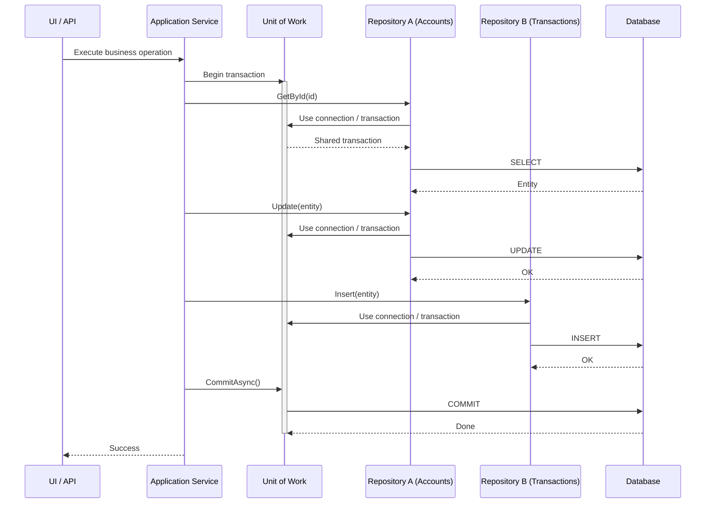
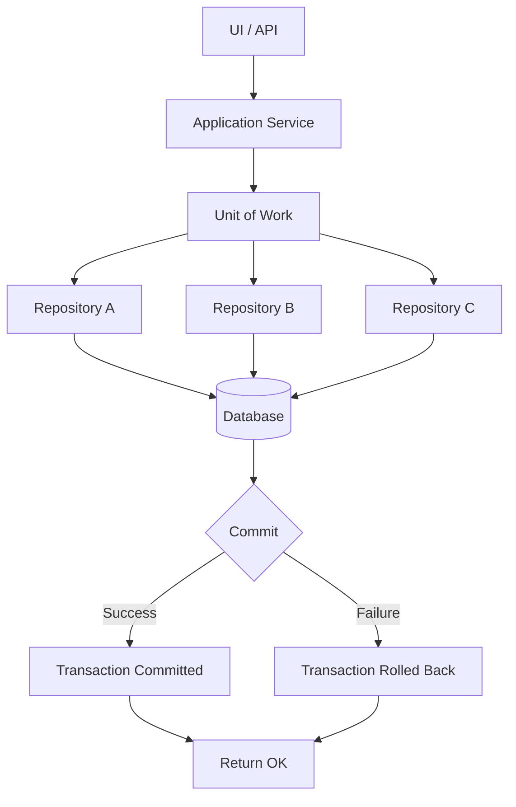
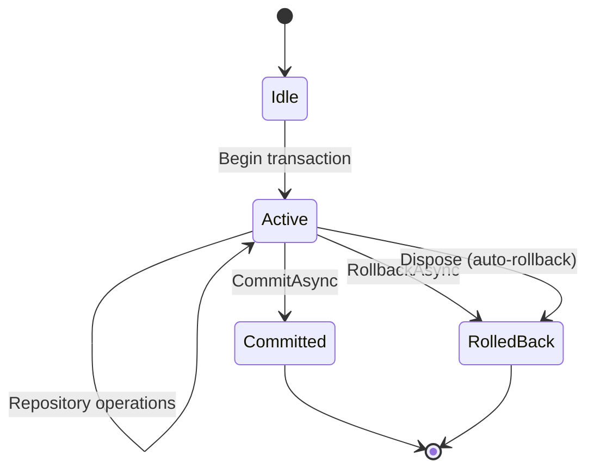

# Unit of Work Pattern — Transaction Boundary

## 1 — Overview

The **Unit of Work (UoW)** pattern maintains a list of objects affected by a business transaction and coordinates the writing out of changes and the resolution of concurrency problems. In simpler terms: it tracks every change made during a business operation and commits them all as a single atomic transaction.

> "A Unit of Work keeps track of everything you do during a business transaction that can affect the database. When you're done, it figures out everything that needs to be done to alter the database as a result of your work." — Martin Fowler

### Core responsibilities

| Responsibility | Description |
|---|---|
| **Change tracking** | Monitors which entities were added, modified, or deleted |
| **Transaction boundary** | Defines where a transaction begins and ends |
| **Atomic commit** | Either all changes succeed or none do |
| **Concurrency** | Detects conflicts when multiple users edit the same data |
| **Ordering** | Ensures inserts/updates/deletes happen in the correct order |

### EF Core's built-in UoW

Entity Framework Core's `DbContext` **is** a Unit of Work. It tracks changes via its `ChangeTracker`, and `SaveChangesAsync` commits them in a single transaction. You get the pattern for free.

```csharp
// EF Core — the DbContext IS the Unit of Work
public class TransferService
{
    private readonly AppDbContext _db;

    public TransferService(AppDbContext db)
    {
        _db = db; // Injected, scoped lifetime
    }

    public async Task TransferAsync(Guid fromId, Guid toId, decimal amount)
    {
        var from = await _db.Accounts.FindAsync(fromId);
        var to   = await _db.Accounts.FindAsync(toId);

        from.Balance -= amount;
        to.Balance   += amount;

        await _db.SaveChangesAsync(); // Single transaction
    }
}
```

### Dapper — manual UoW

Dapper is a micro-ORM with no change tracker and no transaction management. You must implement the Unit of Work yourself, typically by wrapping an `IDbTransaction` and coordinating multiple repositories.

```csharp
// Dapper — you write the UoW
public interface IUnitOfWork : IDisposable
{
    Task<int> SaveChangesAsync(CancellationToken ct = default);
    Task CommitAsync(CancellationToken ct = default);
    Task RollbackAsync(CancellationToken ct = default);
}
```

The pattern becomes essential once you have **two or more repositories** that must stay consistent — a transfer that debits one account and credits another, an order that updates inventory and creates a shipment, etc.

---

## 2 — When to Use the Unit of Work Pattern

### Use it when

| Scenario | Why |
|---|---|
| Multiple repositories in one operation | You need a single transaction spanning `IAccountRepository` and `ITransactionRepository` |
| Business transactions with >1 write | Two inserts, or an insert + update, must be atomic |
| You want to decouple repositories from connection/tx management | Repositories receive a UoW, not a `SqlConnection` |
| Testing transactional behavior | You can mock `IUnitOfWork` and verify `CommitAsync` was called |
| You use Dapper but want EF Core–like semantics | A manual UoW gives you the same consistent boundary |

### Don't use it when

| Scenario | Alternative |
|---|---|
| Single repository, single write | Just call the repository method directly |
| You only read data | Never open a transaction for reads |
| Microservice with single-aggregate-per-transaction | The aggregate root's repository handles its own consistency |
| You already use EF Core | DbContext already is the UoW — no extra abstraction needed unless you want testability |

### CQRS note

In a CQRS architecture, **commands** (writes) are the natural home for a Unit of Work. Queries typically bypass the UoW entirely and read directly from optimized views or raw SQL.

---

## 3 — IUnitOfWork Interface Definition

The interface should be minimal. Avoid leaking persistence concerns like `IDbTransaction` or `DbContext` to consumers.

```csharp
namespace YourApp.Data;

/// <summary>
/// Defines the contract for a Unit of Work that coordinates
/// multiple repository operations within a single transaction.
/// </summary>
public interface IUnitOfWork : IDisposable
{
    /// <summary>
    /// Persists all tracked changes to the database.
    /// For EF Core: calls DbContext.SaveChangesAsync.
    /// For Dapper: commits the underlying transaction.
    /// </summary>
    Task<int> SaveChangesAsync(CancellationToken cancellationToken = default);

    /// <summary>
    /// Explicitly commits the current transaction.
    /// In most implementations SaveChangesAsync already commits.
    /// Provided for fine-grained control and explicit semantics.
    /// </summary>
    Task CommitAsync(CancellationToken cancellationToken = default);

    /// <summary>
    /// Discards all changes made in the current transaction.
    /// </summary>
    Task RollbackAsync(CancellationToken cancellationToken = default);
}
```

### Design decisions

| Decision | Option A | Option B | Why we pick |
|---|---|---|---|
| `SaveChangesAsync` returns `int` | Return rows affected | Return void | Matches `DbContext.SaveChangesAsync` — useful for diagnostics |
| `Commit` vs `SaveChanges` | One method | Two methods | Both — some callers want explicit two-phase |
| `Rollback` | Included in interface | Disposed rolls back | Explicit `RollbackAsync` is safer; `Dispose` can also roll back as a guard |
| `Dispose` | Inherit `IDisposable` | Use `IAsyncDisposable` | Sync `IDisposable` is simpler; upgrade if your container supports async dispose |

### Extended interface with repositories

Sometimes the UoW also exposes repositories for convenience:

```csharp
public interface IAppUnitOfWork : IUnitOfWork
{
    IAccountRepository Accounts { get; }
    ITransactionRepository Transactions { get; }
    IAuditLogRepository AuditLogs { get; }
}
```

This is common in DDD-ish architectures where the UoW represents a business transaction scope. Be careful not to create a "god object" — only expose repositories that genuinely participate in the same transactional boundary.

---

## 4 — EF Core Implementation

EF Core's `DbContext` already implements Unit of Work. You have two choices:

1. **Wrap it** — create a thin wrapper around `DbContext`
2. **Use it directly** — inject `DbContext` or a custom `DbContext` interface

For testability and to keep the abstraction consistent with Dapper, wrapping is recommended but not required.

### Wrapper implementation

```csharp
using Microsoft.EntityFrameworkCore;
using Microsoft.EntityFrameworkCore.Storage;

public class EfUnitOfWork : IUnitOfWork
{
    private readonly DbContext _context;
    private IDbContextTransaction? _currentTransaction;

    public EfUnitOfWork(DbContext context)
    {
        _context = context ?? throw new ArgumentNullException(nameof(context));
    }

    public async Task<int> SaveChangesAsync(CancellationToken cancellationToken = default)
    {
        return await _context.SaveChangesAsync(cancellationToken);
    }

    public async Task CommitAsync(CancellationToken cancellationToken = default)
    {
        // If there's an explicit transaction, commit it
        if (_currentTransaction != null)
        {
            await _currentTransaction.CommitAsync(cancellationToken);
            await _currentTransaction.DisposeAsync();
            _currentTransaction = null;
            return;
        }

        // Otherwise SaveChangesAsync is the commit point
        await _context.SaveChangesAsync(cancellationToken);
    }

    public async Task RollbackAsync(CancellationToken cancellationToken = default)
    {
        if (_currentTransaction != null)
        {
            await _currentTransaction.RollbackAsync(cancellationToken);
            await _currentTransaction.DisposeAsync();
            _currentTransaction = null;
            return;
        }

        // Without an explicit transaction, we need to discard tracked changes
        DiscardChanges();
    }

    public void Dispose()
    {
        _currentTransaction?.Dispose();
        _context.Dispose();
    }

    /// <summary>
    /// Starts an explicit database transaction.
    /// Optional — only needed if you want two-phase commit control.
    /// </summary>
    public async Task<IDbContextTransaction> BeginTransactionAsync(
        CancellationToken cancellationToken = default)
    {
        _currentTransaction = await _context.Database
            .BeginTransactionAsync(cancellationToken);
        return _currentTransaction;
    }

    private void DiscardChanges()
    {
        var entries = _context.ChangeTracker
            .Entries()
            .Where(e => e.State != EntityState.Unchanged)
            .ToList();

        foreach (var entry in entries)
        {
            entry.State = EntityState.Detached;
        }
    }
}
```

### DbContext as IUnitOfWork directly

If you prefer minimal abstraction, make your `DbContext` implement `IUnitOfWork`:

```csharp
public interface IAppDbContext : IUnitOfWork
{
    DbSet<Account> Accounts { get; }
    DbSet<Transaction> Transactions { get; }
}

public class AppDbContext : DbContext, IAppDbContext
{
    public AppDbContext(DbContextOptions<AppDbContext> options)
        : base(options) { }

    public DbSet<Account> Accounts => Set<Account>();
    public DbSet<Transaction> Transactions => Set<Transaction>();

    // IUnitOfWork implementation
    Task<int> IUnitOfWork.SaveChangesAsync(CancellationToken ct)
        => base.SaveChangesAsync(ct);

    Task IUnitOfWork.CommitAsync(CancellationToken ct)
        => base.SaveChangesAsync(ct); // same thing

    Task IUnitOfWork.RollbackAsync(CancellationToken ct)
    {
        DiscardChanges();
        return Task.CompletedTask;
    }

    private void DiscardChanges()
    {
        foreach (var entry in ChangeTracker.Entries()
            .Where(e => e.State != EntityState.Unchanged))
        {
            entry.State = EntityState.Detached;
        }
    }
}
```

### Registration

```csharp
// Program.cs — EF Core UoW registration
services.AddDbContext<AppDbContext>(options =>
    options.UseSqlServer(connectionString));

// If wrapping:
services.AddScoped<IUnitOfWork, EfUnitOfWork>();

// If DbContext implements IUnitOfWork:
services.AddScoped<IAppDbContext, AppDbContext>();
services.AddScoped<IUnitOfWork>(sp => sp.GetRequiredService<IAppDbContext>());
```

### How EF Core tracks changes automatically

```csharp
var account = await db.Accounts.FindAsync(id);
account.Balance -= 100;
// No explicit "MarkAsModified" — EF Core's ChangeTracker detected the property change
await db.SaveChangesAsync(); // Generates: UPDATE Accounts SET Balance = @p WHERE Id = @p
```

The ChangeTracker uses snapshots (or change-tracking proxies) to detect changes. When `SaveChangesAsync` is called, it generates the SQL, wraps it in a transaction if needed, and executes it.

---

## 5 — Dapper Implementation

With Dapper, there is no built-in change tracking or transaction management. You must manage the connection and transaction explicitly.

### DapperUnitOfWork

```csharp
using System.Data;
using System.Data.Common;
using Microsoft.Data.SqlClient;

public class DapperUnitOfWork : IUnitOfWork
{
    private readonly IDbConnection _connection;
    private IDbTransaction? _transaction;
    private bool _disposed;
    private int _saveChangesCount;

    public DapperUnitOfWork(string connectionString)
    {
        _connection = new SqlConnection(connectionString);
    }

    public DapperUnitOfWork(IDbConnection connection)
    {
        _connection = connection;
    }

    /// <summary>
    /// Returns the current transaction. Repositories use this
    /// to associate their commands with the UoW's transaction.
    /// </summary>
    public IDbTransaction? CurrentTransaction => _transaction;

    /// <summary>
    /// Opens the connection if closed and begins a transaction.
    /// Must be called before any repository operations.
    /// </summary>
    public async Task BeginAsync(CancellationToken cancellationToken = default)
    {
        if (_connection.State != ConnectionState.Open)
        {
            if (_connection is DbConnection dbConn)
            {
                await dbConn.OpenAsync(cancellationToken);
            }
            else
            {
                _connection.Open();
            }
        }

        _transaction = _connection.BeginTransaction();
    }

    public Task<int> SaveChangesAsync(CancellationToken cancellationToken = default)
    {
        // In Dapper, there's no automatic change tracking.
        // SaveChangesAsync is essentially a no-op or a checkpoint.
        // The real commit happens in CommitAsync.
        // We increment a counter to track that pending changes exist.
        _saveChangesCount++;
        return Task.FromResult(0);
    }

    public async Task CommitAsync(CancellationToken cancellationToken = default)
    {
        if (_transaction == null)
            throw new InvalidOperationException("Transaction has not been started. Call BeginAsync first.");

        try
        {
            _transaction.Commit();
        }
        finally
        {
            _transaction.Dispose();
            _transaction = null;
            _saveChangesCount = 0;
        }

        await Task.CompletedTask;
    }

    public async Task RollbackAsync(CancellationToken cancellationToken = default)
    {
        if (_transaction == null)
            return;

        try
        {
            _transaction.Rollback();
        }
        finally
        {
            _transaction.Dispose();
            _transaction = null;
            _saveChangesCount = 0;
        }

        await Task.CompletedTask;
    }

    public void Dispose()
    {
        if (_disposed) return;
        _disposed = true;

        // If not committed, roll back automatically
        if (_transaction != null)
        {
            try { _transaction.Rollback(); }
            catch { /* best-effort rollback */ }
            _transaction.Dispose();
        }

        _connection?.Dispose();
    }
}
```

### Repository using DapperUnitOfWork

Each repository receives the `DapperUnitOfWork` and uses its `CurrentTransaction`:

```csharp
public class DapperAccountRepository : IAccountRepository
{
    public async Task<Account?> GetByIdAsync(
        Guid id,
        IDbTransaction? transaction = null)
    {
        const string sql = "SELECT * FROM Accounts WHERE Id = @Id";

        using var connection = new SqlConnection(connectionString);
        return await connection.QueryFirstOrDefaultAsync<Account>(
            sql, new { Id = id }, transaction);
    }

    // When participating in a UoW, the repository uses the UoW's connection
    // and transaction rather than creating its own.
}

// Better — repository receives the UoW's connection and transaction:
public class TransactionalAccountRepository : IAccountRepository
{
    private readonly DapperUnitOfWork _uow;

    public TransactionalAccountRepository(DapperUnitOfWork uow)
    {
        _uow = uow;
    }

    public async Task<Account?> GetByIdAsync(Guid id)
    {
        const string sql = "SELECT * FROM Accounts WHERE Id = @Id";
        return await _uow.CurrentTransaction!.Connection!
            .QueryFirstOrDefaultAsync<Account>(
                sql, new { Id = id },
                transaction: _uow.CurrentTransaction);
    }

    public async Task UpdateBalanceAsync(Guid id, decimal newBalance)
    {
        const string sql = "UPDATE Accounts SET Balance = @Balance WHERE Id = @Id";
        await _uow.CurrentTransaction!.Connection!.ExecuteAsync(
            sql, new { Id = id, Balance = newBalance },
            transaction: _uow.CurrentTransaction);
    }
}
```

### Simplified — UnitOfWork that owns connection + transaction

A more ergonomic approach: the UoW owns the connection and provides both connection and transaction to repositories via a context object.

```csharp
public class DapperContext
{
    public IDbConnection Connection { get; }
    public IDbTransaction? Transaction { get; internal set; }

    public DapperContext(IDbConnection connection)
    {
        Connection = connection;
    }
}

public class UnitOfWorkWithContext : IUnitOfWork
{
    private readonly DapperContext _context;
    private bool _disposed;

    public UnitOfWorkWithContext(DapperContext context)
    {
        _context = context;
    }

    public DapperContext Context => _context;

    public async Task BeginAsync(CancellationToken ct = default)
    {
        if (_context.Connection.State != ConnectionState.Open)
        {
            if (_context.Connection is DbConnection dbConn)
                await dbConn.OpenAsync(ct);
            else
                _context.Connection.Open();
        }

        _context.Transaction = _context.Connection.BeginTransaction();
    }

    public Task<int> SaveChangesAsync(CancellationToken ct = default)
        => Task.FromResult(0);

    public Task CommitAsync(CancellationToken ct = default)
    {
        _context.Transaction?.Commit();
        _context.Transaction?.Dispose();
        _context.Transaction = null;
        return Task.CompletedTask;
    }

    public Task RollbackAsync(CancellationToken ct = default)
    {
        _context.Transaction?.Rollback();
        _context.Transaction?.Dispose();
        _context.Transaction = null;
        return Task.CompletedTask;
    }

    public void Dispose()
    {
        if (_disposed) return;
        _disposed = true;
        try { RollbackAsync().GetAwaiter().GetResult(); }
        catch { /* best-effort */ }
        _context.Connection?.Dispose();
    }
}
```

Repositories receive `DapperContext` (or `UnitOfWorkWithContext`) and use `Context.Connection` and `Context.Transaction` for all queries.

### Registration

```csharp
// Dapper UoW — scoped to a single business transaction
services.AddScoped<DapperContext>();
services.AddScoped<UnitOfWorkWithContext>();
services.AddScoped<IAccountRepository>(sp =>
{
    var uow = sp.GetRequiredService<UnitOfWorkWithContext>();
    return new TransactionalAccountRepository(uow);
});
```

### Comparison: EF Core UoW vs Dapper UoW

| Aspect | EF Core | Dapper |
|---|---|---|
| Change tracking | Automatic via ChangeTracker | None — you must track manually or re-query |
| Transaction | Automatic with SaveChangesAsync | Manual via IDbTransaction |
| Connection management | Automatic (opened/closed per query) | Manual (UoW owns the connection) |
| SQL generation | Automatic from LINQ | You write all SQL |
| Implementation effort | Zero (built-in) | Medium (need to write UoW class) |
| Performance overhead | Higher (change tracking, SQL gen) | Minimal |
| When to use | Complex domain logic, many CRUD screens | High-performance scenarios, existing SQL |

---

## 6 — Coordinating Multiple Repositories Under One UoW

The primary motivation for the Unit of Work pattern: **two or more repositories must participate in the same transaction.**

### Problem

```csharp
// Without UoW — each repository opens its own transaction
public async Task TransferAsync(Guid fromId, Guid toId, decimal amount)
{
    var fromRepo = new AccountRepository();
    var toRepo   = new AccountRepository();
    var txRepo   = new TransactionRepository();

    // These are THREE separate transactions!
    await fromRepo.DebitAsync(fromId, amount);
    await toRepo.CreditAsync(toId, amount);
    await txRepo.LogAsync(fromId, toId, amount);
    // If line 2 or 3 fails, line 1 is already committed!
}
```

### Solution with UoW

```csharp
// All repositories share the same UoW (and thus the same transaction)
public class TransferService
{
    private readonly IUnitOfWork _uow;
    private readonly IAccountRepository _accounts;
    private readonly ITransactionRepository _transactions;

    public TransferService(
        IUnitOfWork uow,
        IAccountRepository accounts,
        ITransactionRepository transactions)
    {
        _uow = uow;
        _accounts = accounts;
        _transactions = transactions;
    }

    public async Task TransferAsync(Guid fromId, Guid toId, decimal amount)
    {
        try
        {
            var from = await _accounts.GetByIdAsync(fromId);
            var to   = await _accounts.GetByIdAsync(toId);

            from.Balance -= amount;
            to.Balance   += amount;

            await _accounts.UpdateAsync(from);
            await _accounts.UpdateAsync(to);

            await _transactions.LogAsync(new Transaction
            {
                FromAccountId = fromId,
                ToAccountId   = toId,
                Amount        = amount,
                Timestamp     = DateTime.UtcNow
            });

            // Single commit — all or nothing
            await _uow.CommitAsync();
        }
        catch
        {
            await _uow.RollbackAsync();
            throw;
        }
    }
}
```

### How repositories share the UoW

In DI, both repositories and the service receive the same `IUnitOfWork` instance because it's registered as **Scoped**:

```csharp
services.AddScoped<IUnitOfWork, EfUnitOfWork>();
// or
services.AddScoped<IUnitOfWork, DapperUnitOfWork>();
```

In a web application, one HTTP request = one scope = one UoW instance shared across all services and repositories created during that request.

```csharp
// ASP.NET Core — scoped lifetime means same instance per request
services.AddScoped<IAccountRepository, EfAccountRepository>();
services.AddScoped<ITransactionRepository, EfTransactionRepository>();
services.AddScoped<TransferService>();
services.AddScoped<IUnitOfWork, EfUnitOfWork>();
```

### Manual scope (console app, background job)

```csharp
public class TransferJob
{
    private readonly IServiceScopeFactory _scopeFactory;

    public TransferJob(IServiceScopeFactory scopeFactory)
    {
        _scopeFactory = scopeFactory;
    }

    public async Task ProcessTransferAsync(TransferRequest request)
    {
        using var scope = _scopeFactory.CreateScope();
        var uow    = scope.ServiceProvider.GetRequiredService<IUnitOfWork>();
        var accs   = scope.ServiceProvider.GetRequiredService<IAccountRepository>();
        var txs    = scope.ServiceProvider.GetRequiredService<ITransactionRepository>();
        var svc    = scope.ServiceProvider.GetRequiredService<TransferService>();

        await svc.TransferAsync(request.From, request.To, request.Amount);
        // UoW is committed inside TransferAsync
        // Scope disposes the UoW, which rolls back if not committed
    }
}
```

---

## 7 — Mermaid Diagram





### State diagram of a UoW



---

## 8 — Production Example: Funds Transfer with Both Repos Under One UoW

### Domain models

```csharp
public class Account
{
    public Guid Id { get; set; }
    public string AccountNumber { get; set; } = string.Empty;
    public decimal Balance { get; set; }
    public decimal OverdraftLimit { get; set; }
    public DateTime UpdatedAt { get; set; }
}

public class FundsTransfer
{
    public Guid Id { get; set; }
    public Guid FromAccountId { get; set; }
    public Guid ToAccountId { get; set; }
    public decimal Amount { get; set; }
    public string Reference { get; set; } = string.Empty;
    public DateTime CreatedAt { get; set; }
    public TransferStatus Status { get; set; }
}

public enum TransferStatus { Pending, Completed, Failed, RolledBack }
```

### Full Dapper implementation

```csharp
public interface IAccountRepository
{
    Task<Account?> GetByIdAsync(Guid id);
    Task UpdateBalanceAsync(Guid id, decimal newBalance);
}

public interface ITransferRepository
{
    Task AddAsync(FundsTransfer transfer);
    Task UpdateStatusAsync(Guid id, TransferStatus status);
}

// ─── Dapper Repositories ──────────────────────────────────────────

public class DapperAccountRepository : IAccountRepository
{
    private readonly DapperContext _context;

    public DapperAccountRepository(DapperContext context)
    {
        _context = context;
    }

    public async Task<Account?> GetByIdAsync(Guid id)
    {
        const string sql = "SELECT * FROM Accounts WHERE Id = @Id";
        return await _context.Connection.QueryFirstOrDefaultAsync<Account>(
            sql, new { Id = id },
            transaction: _context.Transaction);
    }

    public async Task UpdateBalanceAsync(Guid id, decimal newBalance)
    {
        const string sql = "UPDATE Accounts SET Balance = @Balance, UpdatedAt = @Now WHERE Id = @Id";
        await _context.Connection.ExecuteAsync(
            sql,
            new { Id = id, Balance = newBalance, Now = DateTime.UtcNow },
            transaction: _context.Transaction);
    }
}

public class DapperTransferRepository : ITransferRepository
{
    private readonly DapperContext _context;

    public DapperTransferRepository(DapperContext context)
    {
        _context = context;
    }

    public async Task AddAsync(FundsTransfer transfer)
    {
        const string sql = @"
            INSERT INTO FundsTransfers (Id, FromAccountId, ToAccountId, Amount, Reference, CreatedAt, Status)
            VALUES (@Id, @FromAccountId, @ToAccountId, @Amount, @Reference, @CreatedAt, @Status)";

        await _context.Connection.ExecuteAsync(
            sql, transfer,
            transaction: _context.Transaction);
    }

    public async Task UpdateStatusAsync(Guid id, TransferStatus status)
    {
        const string sql = "UPDATE FundsTransfers SET Status = @Status WHERE Id = @Id";
        await _context.Connection.ExecuteAsync(
            sql, new { Id = id, Status = status },
            transaction: _context.Transaction);
    }
}

// ─── Service ──────────────────────────────────────────────────────

public class FundsTransferService
{
    private readonly IAccountRepository _accounts;
    private readonly ITransferRepository _transfers;
    private readonly UnitOfWorkWithContext _uow;

    public FundsTransferService(
        IAccountRepository accounts,
        ITransferRepository transfers,
        UnitOfWorkWithContext uow)
    {
        _accounts = accounts;
        _transfers = transfers;
        _uow = uow;
    }

    public async Task<FundsTransfer> TransferAsync(
        Guid fromId, Guid toId, decimal amount, string reference)
    {
        ArgumentNullException.ThrowIfNull(reference);
        if (amount <= 0)
            throw new ArgumentException("Amount must be positive", nameof(amount));

        await _uow.BeginAsync();

        try
        {
            var from = await _accounts.GetByIdAsync(fromId)
                ?? throw new InvalidOperationException("Source account not found");
            var to = await _accounts.GetByIdAsync(toId)
                ?? throw new InvalidOperationException("Destination account not found");

            if (from.Balance - amount < from.OverdraftLimit)
                throw new InvalidOperationException("Insufficient funds");

            from.Balance -= amount;
            to.Balance   += amount;

            await _accounts.UpdateBalanceAsync(fromId, from.Balance);
            await _accounts.UpdateBalanceAsync(toId, to.Balance);

            var transfer = new FundsTransfer
            {
                Id            = Guid.NewGuid(),
                FromAccountId = fromId,
                ToAccountId   = toId,
                Amount        = amount,
                Reference     = reference,
                CreatedAt     = DateTime.UtcNow,
                Status        = TransferStatus.Completed
            };

            await _transfers.AddAsync(transfer);

            await _uow.CommitAsync();

            return transfer;
        }
        catch
        {
            await _uow.RollbackAsync();
            throw;
        }
    }
}

// ─── Controller ───────────────────────────────────────────────────

[ApiController]
[Route("api/transfers")]
public class TransfersController : ControllerBase
{
    private readonly FundsTransferService _service;

    public TransfersController(FundsTransferService service)
    {
        _service = service;
    }

    [HttpPost]
    public async Task<IActionResult> Transfer([FromBody] TransferRequest request)
    {
        try
        {
            var result = await _service.TransferAsync(
                request.FromAccountId,
                request.ToAccountId,
                request.Amount,
                request.Reference);

            return Ok(result);
        }
        catch (InvalidOperationException ex)
        {
            return BadRequest(new { error = ex.Message });
        }
    }
}

public record TransferRequest(
    Guid FromAccountId,
    Guid ToAccountId,
    decimal Amount,
    string Reference);
```

### Full EF Core implementation

```csharp
// ─── EF Core Repositories ────────────────────────────────────────

public class EfAccountRepository : IAccountRepository
{
    private readonly AppDbContext _db;

    public EfAccountRepository(AppDbContext db)
    {
        _db = db;
    }

    public async Task<Account?> GetByIdAsync(Guid id)
    {
        return await _db.Accounts.FindAsync(id);
    }

    public async Task UpdateBalanceAsync(Guid id, decimal newBalance)
    {
        var account = await _db.Accounts.FindAsync(id);
        if (account != null)
        {
            account.Balance = newBalance;
            account.UpdatedAt = DateTime.UtcNow;
            // EF Core tracks this automatically — no explicit Update needed
        }
    }
}

public class EfTransferRepository : ITransferRepository
{
    private readonly AppDbContext _db;

    public EfTransferRepository(AppDbContext db)
    {
        _db = db;
    }

    public async Task AddAsync(FundsTransfer transfer)
    {
        await _db.FundsTransfers.AddAsync(transfer);
    }

    public async Task UpdateStatusAsync(Guid id, TransferStatus status)
    {
        var transfer = await _db.FundsTransfers.FindAsync(id);
        if (transfer != null)
        {
            transfer.Status = status;
        }
    }
}

// ─── Service — same interface, different repositories ────────────

public class EfFundsTransferService
{
    private readonly IAccountRepository _accounts;
    private readonly ITransferRepository _transfers;
    private readonly AppDbContext _db; // This IS the UoW

    public EfFundsTransferService(
        IAccountRepository accounts,
        ITransferRepository transfers,
        AppDbContext db)
    {
        _accounts = accounts;
        _transfers = transfers;
        _db = db;
    }

    public async Task<FundsTransfer> TransferAsync(
        Guid fromId, Guid toId, decimal amount, string reference)
    {
        // EF Core automatically wraps SaveChangesAsync in a transaction
        // No need to begin transaction explicitly

        var from = await _accounts.GetByIdAsync(fromId)
            ?? throw new InvalidOperationException("Source account not found");
        var to = await _accounts.GetByIdAsync(toId)
            ?? throw new InvalidOperationException("Destination account not found");

        if (from.Balance - amount < from.OverdraftLimit)
            throw new InvalidOperationException("Insufficient funds");

        from.Balance -= amount;
        to.Balance   += amount;

        // No need to call UpdateAsync — EF Core tracked the changes

        var transfer = new FundsTransfer
        {
            Id            = Guid.NewGuid(),
            FromAccountId = fromId,
            ToAccountId   = toId,
            Amount        = amount,
            Reference     = reference,
            CreatedAt     = DateTime.UtcNow,
            Status        = TransferStatus.Completed
        };

        await _transfers.AddAsync(transfer);

        // Single call — this IS the UoW commit
        await _db.SaveChangesAsync();

        return transfer;
    }
}
```

### What the EF Core transaction looks like in SQL

```sql
-- EF Core generates and executes these within a single transaction:
BEGIN TRANSACTION

UPDATE Accounts SET Balance = @p0, UpdatedAt = @p1 WHERE Id = @p2
UPDATE Accounts SET Balance = @p3, UpdatedAt = @p4 WHERE Id = @p5
INSERT INTO FundsTransfers (Id, FromAccountId, ToAccountId, Amount, Reference, CreatedAt, Status)
VALUES (@p6, @p7, @p8, @p9, @p10, @p11, @p12)

COMMIT TRANSACTION
-- If any statement fails, the entire transaction is rolled back
```

### Testing with a mocked UoW

```csharp
[Test]
public async Task TransferAsync_should_commit_when_successful()
{
    // Arrange
    var uow = new Mock<IUnitOfWork>();
    var accounts = new Mock<IAccountRepository>();
    var transfers = new Mock<ITransferRepository>();

    var fromId = Guid.NewGuid();
    var toId   = Guid.NewGuid();

    accounts.Setup(a => a.GetByIdAsync(fromId))
        .ReturnsAsync(new Account { Id = fromId, Balance = 500 });
    accounts.Setup(a => a.GetByIdAsync(toId))
        .ReturnsAsync(new Account { Id = toId, Balance = 100 });

    var service = new FundsTransferService(
        accounts.Object, transfers.Object, uow.Object);

    // Act
    await service.TransferAsync(fromId, toId, 200, "test");

    // Assert
    accounts.Verify(a => a.UpdateBalanceAsync(fromId, 300), Times.Once);
    accounts.Verify(a => a.UpdateBalanceAsync(toId, 300), Times.Once);
    transfers.Verify(t => t.AddAsync(It.IsAny<FundsTransfer>()), Times.Once);
    uow.Verify(u => u.CommitAsync(It.IsAny<CancellationToken>()), Times.Once);
    uow.Verify(u => u.RollbackAsync(It.IsAny<CancellationToken>()), Times.Never);
}
```

---

## 9 — Gotchas and Best Practices

### Gotcha 1: Overlapping UoW scopes

```csharp
// BAD — two UoWs in the same operation
public async Task BadExample()
{
    using var scope1 = _scopeFactory.CreateScope();
    var uow1 = scope1.ServiceProvider.GetRequiredService<IUnitOfWork>();
    var repo1 = scope1.ServiceProvider.GetRequiredService<IAccountRepository>();

    using var scope2 = _scopeFactory.CreateScope();
    var uow2 = scope2.ServiceProvider.GetRequiredService<IUnitOfWork>();
    var repo2 = scope2.ServiceProvider.GetRequiredService<IAccountRepository>();

    // repo1 and repo2 are on DIFFERENT transactions!
    // If repo1 commits but repo2 fails, you have inconsistent data.
}
```

**Fix:** Never create multiple scopes for a single business transaction. Use one scope, one UoW.

### Gotcha 2: Passing UoW between services (ambient context)

```csharp
// BAD — implicit UoW via ambient context
public class BadService
{
    private static AsyncLocal<IUnitOfWork> _currentUow = new();

    public static IUnitOfWork Current => _currentUow.Value!;

    public async Task DoWork()
    {
        // The caller must set Current before calling — easy to forget
        await Current.CommitAsync();
    }
}
```

**Fix:** Use explicit dependency injection. The UoW is injected into the service constructor, not fetched from a static context. If you need to pass it between services in a call chain, pass it as a method parameter or use a scoped DI container.

### Gotcha 3: Disposing without commit (silent data loss)

```csharp
public async Task LeakyScope()
{
    using (var scope = _scopeFactory.CreateScope())
    {
        var uow = scope.ServiceProvider.GetRequiredService<IUnitOfWork>();
        var svc = scope.ServiceProvider.GetRequiredService<TransferService>();

        await svc.TransferAsync(fromId, toId, 100, "test");
        // Forgot to call CommitAsync!
        // Scope disposes — transaction is rolled back, data is LOST
    }
}
```

**Fix:** Always commit before disposal. Consider a guard clause in `Dispose` that logs a warning if changes were pending but not committed:

```csharp
public void Dispose()
{
    if (_hasPendingChanges && _transaction != null)
    {
        // Log: "UnitOfWork disposed without commit — rolling back!"
        _transaction.Rollback();
    }
    _transaction?.Dispose();
    _connection?.Dispose();
}
```

### Gotcha 4: Lazy loading inside a UoW

```csharp
// BAD — lazy loading after the context is disposed
var account = await _accounts.GetByIdAsync(id);
// UoW is still alive, so lazy load works
var transactions = account.Transactions.ToList();
await _uow.CommitAsync();
// But if you try to lazy load AFTER commit, the connection may be closed
```

**Fix:** Eagerly load related data with `.Include()` or project with `.Select()`. Never rely on lazy loading after the transaction ends.

### Gotcha 5: Explicit transaction + implicit SaveChanges

```csharp
// With EF Core explicit transaction:
using var tx = await _db.Database.BeginTransactionAsync();

var account = await _db.Accounts.FindAsync(id);
account.Balance -= 100;
await _db.SaveChangesAsync(); // ← This does NOT commit the explicit tx

await tx.CommitAsync(); // ← You must commit the explicit tx separately
```

**Fix:** Understand that `SaveChangesAsync` submits the SQL but does NOT commit an explicit transaction you started. Use one or the other — either rely on implicit transaction wrapping in `SaveChangesAsync`, or manage `BeginTransactionAsync`/`CommitAsync` manually.

### Gotcha 6: Multiple SaveChanges calls inside one UoW

```csharp
// BAD — partial writes
await _accounts.UpdateAsync(from);
await _uow.SaveChangesAsync(); // ← Already committed!
// If the next line fails, the first change is already persisted
await _accounts.UpdateAsync(to);
await _uow.SaveChangesAsync();
```

**Fix:** Call `SaveChangesAsync` (or `CommitAsync`) exactly **once** at the end of the operation. If you must call it multiple times, each call should represent an independent unit of work.

### Gotcha 7: Dapper — transaction reuse across connections

```csharp
// BAD — transaction from one connection used with another
var tx = connection1.BeginTransaction();
// ...
var result = await connection2.QueryAsync(sql, transaction: tx); // ← CRASH
// System.InvalidOperationException: "Transaction is not associated with the connection"
```

**Fix:** In Dapper, the UoW must own the connection and transaction together. Repositories must use the UoW's connection, not create their own.

### Gotcha 8: ASP.NET Core — scoped service in singleton

```csharp
// BAD — singleton service captures scoped UoW
services.AddSingleton<TransferService>(); // ← Singleton!
services.AddScoped<IUnitOfWork, EfUnitOfWork>();

// TransferService is created once and captures the first UoW instance.
// Subsequent requests reuse the same (potentially disposed) UoW.
```

**Fix:** All services that depend on `IUnitOfWork` must be Scoped or Transient. Never inject a scoped UoW into a Singleton.

### Gotcha 9: Ambient transactions with TransactionScope

```csharp
// TransactionScope — works but has caveats
using (var scope = new TransactionScope(TransactionScopeAsyncFlowOption.Enabled))
{
    await _accounts.DebitAsync(fromId, amount);
    await _accounts.CreditAsync(toId, amount);
    scope.Complete(); // Commit
}
```

**Caveats:**
- `TransactionScope` promotes to MSDTC if you use multiple connections (even to the same database on SQL Server).
- Not supported by all databases.
- Requires `TransactionScopeAsyncFlowOption.Enabled` for async.
- In EF Core 6+, `TransactionScope` is better supported but still has promotion risks.

**Recommendation:** Use explicit `IUnitOfWork` for new code. Reserve `TransactionScope` for legacy interop.

### Gotcha 10: Unit of Work vs Repository — who owns the transaction?

```
Repository owns the connection?     → Bad — repositories can't be coordinated
Unit of Work owns the connection?   → Good — all repos share it
Repository owns the transaction?    → Bad — can't commit atomically
Unit of Work owns the transaction?  → Good — single commit point
```

**The UoW owns both connection and transaction.** Repositories are stateless workers that use what the UoW provides.

### Best practices checklist

| # | Practice | Why |
|---|---|---|
| 1 | One UoW per business transaction | Ensures atomicity |
| 2 | Register UoW as Scoped | Matches request lifetime |
| 3 | Call Commit/SaveChanges once | Avoids partial commits |
| 4 | Dispose rolls back if not committed | Safety net |
| 5 | Don't pass UoW outside the service layer | Keeps concerns separated |
| 6 | Don't mix explicit transactions with implicit | Pick one strategy |
| 7 | Eager load — no lazy loading after Commit | Avoids disposed-context errors |
| 8 | Test with mocked IUnitOfWork | Verify commit/rollback calls |
| 9 | Log on auto-rollback in Dispose | Debugging aid |
| 10 | Keep IUnitOfWork interface persistence-agnostic | Swap EF Core ↔ Dapper without changing callers |

### Summary

```
Entity Framework Core:
    DbContext = Unit of Work + Repository (DbSet) + Identity Map + Change Tracker

Dapper:
    You write: IUnitOfWork + IDbConnection + IDbTransaction + Repositories

Key Insight:
    The Unit of Work pattern is about CONSISTENCY.
    It ensures that multiple writes either all succeed or all fail.
    Whether you get it for free (EF Core) or build it yourself (Dapper),
    the abstraction is the same: "Start. Do work. Commit or Rollback."
```

### Code checklist — what to implement

1. `IUnitOfWork` interface with `SaveChangesAsync`, `CommitAsync`, `RollbackAsync`, `Dispose`
2. `EfUnitOfWork` wrapping `DbContext` (or use `DbContext` directly)
3. `DapperUnitOfWork` managing `IDbConnection` + `IDbTransaction`
4. Repositories that receive the UoW (or its connection/transaction)
5. Service that coordinates multiple repositories within one UoW
6. `try`/`catch`/`CommitAsync`/`RollbackAsync` in the service
7. DI registration as Scoped
8. Unit tests that mock `IUnitOfWork` and verify commit behavior

---

*The Unit of Work pattern is the backbone of transactional consistency in .NET. Use EF Core's built-in implementation for rapid development; build your own with Dapper when you need full control over SQL and performance. Either way, the principle is universal: one business transaction, one commit, atomic consistency.*
