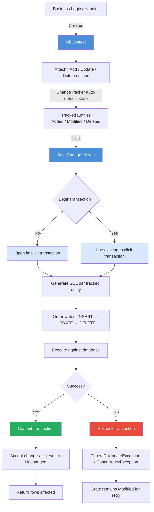
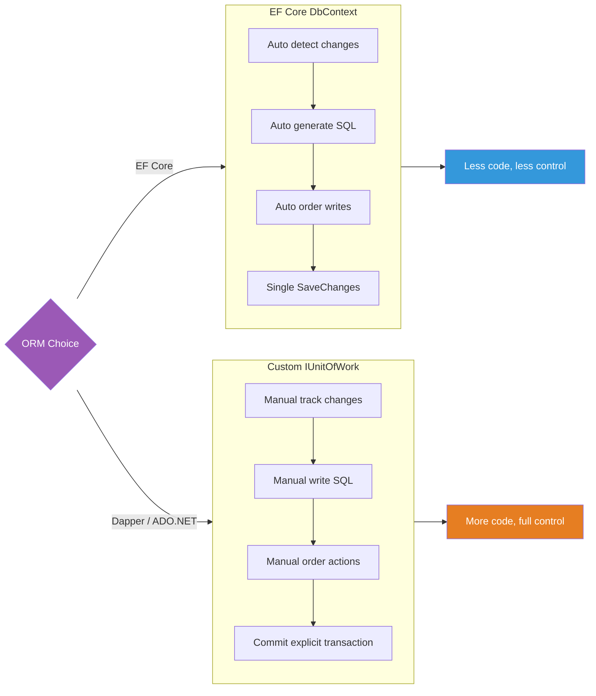

# 8.884 — Unit of Work — EF Core vs Custom Implementation

## Table of Contents

1.  [Core Concept — Definition](#1-core-concept--definition)
2.  [EF Core DbContext as Built-in Unit of Work](#2-ef-core-dbcontext-as-built-in-unit-of-work)
3.  [Custom Unit of Work for Dapper / ADO.NET](#3-custom-unit-of-work-for-dapper--adonet)
4.  [Side-by-Side Comparison](#4-side-by-side-comparison)
5.  [Mermaid — EF Core UoW Flow vs Custom (Dapper) UoW Flow](#5-mermaid--ef-core-uow-flow-vs-custom-dapper-uow-flow)
6.  [Production Scenarios](#6-production-scenarios)
7.  [Gotchas and Pitfalls](#7-gotchas-and-pitfalls)
8.  [Code References and Examples](#8-code-references-and-examples)
9.  [Summary and Decision Guide](#9-summary-and-decision-guide)

---

## 1 — Core Concept — Definition

The **Unit of Work (UoW)** pattern maintains a list of objects affected by a business transaction and coordinates the writing out of changes and the resolution of concurrency problems. It is the "single entry point" for persisting a set of operations atomically.

### 1.1 — Intent

- Group multiple data operations into a single transactional scope.
- Ensure **atomicity**: all changes succeed or none persist.
- Decouple business logic from transaction management.
- Provide an **identity map** so that each entity is loaded once per unit of work.

### 1.2 — Martin Fowler's Definition

> "Maintains a list of objects affected by a business transaction and coordinates the writing out of changes and the resolution of concurrency problems."
> — *Patterns of Enterprise Application Architecture*

### 1.3 — Two Flavours

| Aspect | EF Core `DbContext` | Custom `IUnitOfWork` |
|--------|---------------------|-----------------------|
| Built-in | Yes — ChangeTracker + SaveChanges | No — manual implementation |
| ORM coupling | Tied to EF Core | ORM-agnostic (Dapper, ADO.NET, raw SQL) |
| Change tracking | Automatic (snapshot/proxy) | Manual (track lists) |
| Transaction scope | Implicit on SaveChanges | Explicit via IDbTransaction |
| Identity map | Built-in (`DbSet<T>.Local`) | Must implement |

---

## 2 — EF Core DbContext as Built-in Unit of Work

`DbContext` is **the** Unit of Work in EF Core. It combines change tracking, identity map, and transaction management into one class.

### 2.1 — How DbContext Implements Unit of Work

```csharp
public class OrdersDbContext : DbContext
{
    public DbSet<Order> Orders => Set<Order>();
    public DbSet<OrderLine> OrderLines => Set<OrderLine>();

    protected override void OnConfiguring(DbContextOptionsBuilder options)
        => options.UseSqlServer("Server=.;Database=Orders;Trusted_Connection=True;");
}

// Usage — single unit of work
await using var db = new OrdersDbContext();

var order = new Order { CustomerId = 42, OrderDate = DateTime.UtcNow };
db.Orders.Add(order);                              // tracked as Added

var line = new OrderLine { OrderId = order.Id, Sku = "ABC", Qty = 5 };
db.OrderLines.Add(line);                           // tracked as Added

// Both inserts happen inside ONE transaction
await db.SaveChangesAsync();                       // UoW commit
```

**Key responsibilities DbContext fulfills:**

1. **Change tracking** — `ChangeTracker` monitors entity states (Added, Modified, Deleted, Unchanged, Detached).
2. **Identity map** — Each entity key resolves to the same object instance within the context lifetime.
3. **Transaction wrapping** — `SaveChangesAsync` wraps all commands in a database transaction.
4. **Ordering** — Writes are ordered by dependency (INSERT before UPDATE before DELETE) respecting foreign keys.
5. **Concurrency** — Detects optimistic concurrency conflicts via `DbUpdateConcurrencyException`.

### 2.2 — ChangeTracker Mechanics

```csharp
// Entity state diagram
var db = new OrdersDbContext();
var order = new Order { Id = 1 };                  // Detached

db.Orders.Attach(order);                           // Unchanged
order.CustomerId = 99;                             // Modified (auto-detect)

var state = db.Entry(order).State;                 // EntityState.Modified

await db.SaveChangesAsync();                       // Generates UPDATE SET CustomerId = 99 WHERE Id = 1
```

**Automatic change detection** happens on:
- `SaveChangesAsync` / `SaveChanges`
- `ChangeTracker.DetectChanges()`
- Any call to `Entry()`, `Find()`, or LINQ queries triggering `DetectChanges`

### 2.3 — Transaction Management

```csharp
// Default — implicit transaction per SaveChangesAsync
await db.SaveChangesAsync();      // Begins and commits a transaction

// Explicit transaction for multi-save scopes
await using var tx = await db.Database.BeginTransactionAsync();

db.Orders.Add(order1);
await db.SaveChangesAsync();      // NOT yet committed — part of tx

db.Orders.Add(order2);
await db.SaveChangesAsync();      // Still part of same tx

await tx.CommitAsync();           // Single commit for both saves
```

### 2.4 — Identity Map Behaviour

```csharp
var orderA = await db.Orders.FindAsync(1);    // DB round-trip
var orderB = await db.Orders.FindAsync(1);    // Returns same instance from cache

ReferenceEquals(orderA, orderB);             // TRUE — identity map

var orderC = db.Orders.Local.First(o => o.Id == 1);  // Also same instance
```

This prevents stale data and ensures consistency within the unit of work.

### 2.5 — EF Core UoW Lifecycle

```
DbContext created ─► Entity loaded/attached ─► Changes tracked ─► SaveChangesAsync
                                                       │
                                              ┌───────┴───────┐
                                              │  Success       │  Failure
                                              │  Commit (tx)   │  Rollback (tx)
                                              │  Reset states  │  Leave states
                                              └───────────────┘
```

---

## 3 — Custom Unit of Work for Dapper / ADO.NET

When using micro-ORMs (Dapper) or raw ADO.NET, there is no built-in Unit of Work. You must implement one manually.

### 3.1 — IUnitOfWork Interface

```csharp
public interface IUnitOfWork : IDisposable
{
    IDbTransaction? CurrentTransaction { get; }
    void BeginTransaction();
    void Commit();
    void Rollback();
    Task<int> SaveChangesAsync(CancellationToken ct = default);
}
```

### 3.2 — Concrete Implementation with Dapper

```csharp
public class DapperUnitOfWork : IUnitOfWork
{
    private readonly IDbConnection _connection;
    private IDbTransaction? _transaction;
    private readonly List<Func<IDbTransaction, Task>> _pendingActions = new();
    private bool _disposed;

    public IDbTransaction? CurrentTransaction => _transaction;

    public DapperUnitOfWork(IDbConnection connection)
    {
        _connection = connection;
    }

    public void BeginTransaction()
    {
        if (_transaction is not null)
            throw new InvalidOperationException("Transaction already started.");

        _connection.Open();
        _transaction = _connection.BeginTransaction();
    }

    /// <summary>
    /// Register a deferred database operation.
    /// </summary>
    public void Register(Func<IDbTransaction, Task> action)
    {
        _pendingActions.Add(action);
    }

    public async Task<int> SaveChangesAsync(CancellationToken ct = default)
    {
        if (_transaction is null)
            throw new InvalidOperationException("BeginTransaction must be called first.");

        int totalRows = 0;
        foreach (var action in _pendingActions)
        {
            totalRows += await action(_transaction);   // Each action receives the transaction
        }
        _pendingActions.Clear();
        return totalRows;
    }

    public void Commit()
    {
        try
        {
            _transaction?.Commit();
        }
        catch
        {
            _transaction?.Rollback();
            throw;
        }
        finally
        {
            _transaction?.Dispose();
            _transaction = null;
        }
    }

    public void Rollback()
    {
        _transaction?.Rollback();
        _transaction?.Dispose();
        _transaction = null;
    }

    public void Dispose()
    {
        if (_disposed) return;
        _transaction?.Dispose();
        _connection?.Dispose();
        _disposed = true;
    }
}
```

### 3.3 — Using Custom UoW with Repositories

```csharp
public interface IOrderRepository
{
    Task InsertAsync(Order order, IDbTransaction tx);
    Task UpdateAsync(Order order, IDbTransaction tx);
}

public class DapperOrderRepository : IOrderRepository
{
    public async Task InsertAsync(Order order, IDbTransaction tx)
    {
        const string sql = "INSERT INTO Orders (CustomerId, OrderDate) VALUES (@CustomerId, @OrderDate);";
        await tx.Connection.ExecuteAsync(sql, order, tx);
    }

    public async Task UpdateAsync(Order order, IDbTransaction tx)
    {
        const string sql = "UPDATE Orders SET CustomerId = @CustomerId WHERE Id = @Id;";
        await tx.Connection.ExecuteAsync(sql, order, tx);
    }
}
```

### 3.4 — Orchestrating the UoW

```csharp
public class PlaceOrderHandler
{
    private readonly IUnitOfWork _uow;
    private readonly IOrderRepository _orders;
    private readonly ICustomerRepository _customers;

    public PlaceOrderHandler(IUnitOfWork uow, IOrderRepository orders, ICustomerRepository customers)
    {
        _uow = uow;
        _orders = orders;
        _customers = customers;
    }

    public async Task HandleAsync(PlaceOrderCommand cmd)
    {
        _uow.BeginTransaction();
        try
        {
            var customer = await _customers.GetByIdAsync(cmd.CustomerId, _uow.CurrentTransaction!);
            var order = new Order { CustomerId = customer.Id, OrderDate = DateTime.UtcNow };

            // Register operations in the UoW
            _uow.Register(tx => _orders.InsertAsync(order, tx));
            _uow.Register(tx => _customers.UpdateLastOrderDateAsync(customer.Id, tx));

            await _uow.SaveChangesAsync();
            _uow.Commit();
        }
        catch
        {
            _uow.Rollback();
            throw;
        }
    }
}
```

### 3.5 — Manual Change Tracking with Custom UoW

Since Dapper has no change tracker, you must track changes yourself:

```csharp
public class ChangeTracker
{
    private readonly HashSet<object> _added = new();
    private readonly HashSet<object> _modified = new();
    private readonly HashSet<object> _deleted = new();

    public void TrackAdd(object entity) => _added.Add(entity);
    public void TrackModify(object entity) => _modified.Add(entity);
    public void TrackDelete(object entity) => _deleted.Add(entity);

    public IEnumerable<object> Added => _added;
    public IEnumerable<object> Modified => _modified;
    public IEnumerable<object> Deleted => _deleted;

    public void Clear()
    {
        _added.Clear();
        _modified.Clear();
        _deleted.Clear();
    }
}
```

---

## 4 — Side-by-Side Comparison

| Dimension | EF Core DbContext | Custom IUnitOfWork (Dapper) |
|-----------|------------------|----------------------------|
| **Transaction scope** | Implicit per `SaveChangesAsync`; explicit via `Database.BeginTransaction` | Explicit — must call `BeginTransaction` / `Commit` / `Rollback` |
| **Change tracking** | Automatic (snapshot or notification-based) | Manual — developer tracks added/modified/deleted lists |
| **Identity map** | Built-in (`DbSet<T>.Local`, `Find()` cache) | Must implement manually (e.g. `Dictionary<Type, Dictionary<object, object>>`) |
| **Query generation** | Automatic SQL generation from LINQ | Manual SQL (Dapper, raw ADO.NET) |
| **Write ordering** | Automatic (INSERT → UPDATE → DELETE) | Manual — developer controls action registration order |
| **Concurrency handling** | Built-in row version / timestamp detection | Manual — check `ROWCOUNT` or `Timestamp` |
| **ORM coupling** | Tightly coupled to EF Core | ORM-agnostic — works with Dapper, ADO.NET, or any IDbConnection |
| **Testability** | Mocking DbContext is complex | `IUnitOfWork` interface is easy to mock |
| **Performance overhead** | Higher — change tracking snapshots, materialization | Lower — no tracking overhead, raw SQL |
| **Learning curve** | Lower for standard CRUD | Higher — must manage all aspects manually |
| **Bulk operations** | Poor (EF Core processes row-by-row) | Excellent (batch SQL, bulk insert via `SqlBulkCopy`) |

### 4.1 — When Each Is Appropriate

**EF Core DbContext** — Use when:
- Domain logic benefits from rich LINQ queries.
- Complex entity graphs with relationships.
- Rapid development with minimal boilerplate.
- Opinionated conventions are acceptable.

**Custom IUnitOfWork (Dapper)** — Use when:
- Maximum performance is critical.
- Fine-grained SQL control needed.
- Working with legacy databases or stored procedures.
- EF Core is not an option (e.g., .NET Framework constraints, licensing concerns).

---

## 5 — Mermaid — EF Core UoW Flow vs Custom (Dapper) UoW Flow

### 5.1 — EF Core DbContext as Unit of Work



### 5.2 — Custom (Dapper) Unit of Work

```mermaid
flowchart TD
    A[Business Logic / Handler] -->|Resolves| B[IUnitOfWork]
    A -->|Resolves| C[Repository interfaces]
    B --> D[BeginTransaction]
    D --> E[IDbTransaction created<br/>Connection opened]
    A -->|Calls repository method| F[Repository does work]
    F -->|UoW.Register| G[Pending action list<br/>Func{IDbTransaction, Task}]
    A -->|Calls| H[uow.SaveChangesAsync]
    H --> I[Execute each pending action<br/>in registration order]
    I --> J[Pass IDbTransaction to each]
    J --> K{All succeed?}
    K -->|Yes| L[Clear pending list]
    K -->|No| M[Stop execution]
    L --> N[Commit]
    M --> O[Rollback]
    N --> P[Transaction committed<br/>Connection remains open or closed]
    O --> Q[Transaction rolled back<br/>No partial writes]

    style B fill:#e67e22,color:#fff
    style D fill:#e67e22,color:#fff
    style H fill:#e67e22,color:#fff
    style N fill:#27ae60,color:#fff
    style O fill:#e74c3c,color:#fff
```

### 5.3 — Combined Decision Flow



---

## 6 — Production Scenarios

### 6.1 — Scenario: Order Placement with Inventory (EF Core)

```csharp
public class PlaceOrderService
{
    private readonly OrdersDbContext _db;   // DbContext is the UoW

    public async Task<OrderConfirmation> PlaceOrderAsync(CartDto cart)
    {
        // 1. Load customer — tracked by identity map
        var customer = await _db.Customers.FindAsync(cart.CustomerId);

        // 2. Create order — tracked as Added
        var order = new Order
        {
            CustomerId = customer.Id,
            OrderDate = DateTime.UtcNow,
            Lines = cart.Items.Select(i => new OrderLine
            {
                Sku = i.Sku,
                Quantity = i.Quantity,
                UnitPrice = i.UnitPrice
            }).ToList()
        };
        _db.Orders.Add(order);

        // 3. Reserve inventory — tracked as Modified
        foreach (var line in order.Lines)
        {
            var inventory = await _db.Inventories.FindAsync(line.Sku);
            inventory.ReservedQuantity += line.Quantity;  // auto-detect Modified
        }

        // 4. Single atomic save — EF Core handles transaction, ordering, FK dependencies
        await _db.SaveChangesAsync();

        return new OrderConfirmation(order.Id, order.OrderDate);
    }
}
```

**What EF Core manages:**
- Change detection for `Inventory` property change.
- Cascade insert of `Order` + `OrderLine` (FK dependency ordering).
- Transaction wrapping all INSERT/UPDATE statements.
- Identity map ensures same `Inventory` instance across lookups.

### 6.2 — Scenario: Order Placement with Inventory (Custom Dapper UoW)

```csharp
public class PlaceOrderHandlerDapper
{
    private readonly IUnitOfWork _uow;
    private readonly IOrderRepository _orderRepo;
    private readonly IInventoryRepository _inventoryRepo;

    public PlaceOrderHandlerDapper(
        IUnitOfWork uow,
        IOrderRepository orderRepo,
        IInventoryRepository inventoryRepo)
    {
        _uow = uow;
        _orderRepo = orderRepo;
        _inventoryRepo = inventoryRepo;
    }

    public async Task<OrderConfirmation> HandleAsync(CartDto cart)
    {
        _uow.BeginTransaction();
        try
        {
            var tx = _uow.CurrentTransaction!;

            // 1. Load customer — raw SQL via repository
            var customer = await _customerRepo.GetByIdAsync(cart.CustomerId, tx);

            // 2. Create order — register INSERT
            var order = new Order
            {
                CustomerId = customer.Id,
                OrderDate = DateTime.UtcNow
            };
            _uow.Register(txParam => _orderRepo.InsertAsync(order, txParam));

            // 3. Inventory reservation — register UPDATE per line
            foreach (var item in cart.Items)
            {
                _uow.Register(txParam =>
                    _inventoryRepo.ReserveAsync(item.Sku, item.Quantity, txParam));
            }

            // 4. Execute all registered actions
            await _uow.SaveChangesAsync();

            // 5. Commit transaction
            _uow.Commit();

            return new OrderConfirmation(order.Id, order.OrderDate);
        }
        catch
        {
            _uow.Rollback();
            throw;
        }
    }
}
```

**What custom UoW requires manually:**
- Explicit `BeginTransaction` / `Commit` / `Rollback`.
- Register each operation as a `Func<IDbTransaction, Task>`.
- Manual order of registration matters.
- No automatic change detection — repository methods must be called explicitly.

### 6.3 — Scenario: Multi-Tenant SaaS (EF Core)

```csharp
public class TenantDbContext : DbContext
{
    private readonly Guid _tenantId;

    public TenantDbContext(DbContextOptions<TenantDbContext> opts, ITenantProvider tenant)
        : base(opts)
    {
        _tenantId = tenant.GetTenantId();
    }

    public IQueryable<T> ForTenant<T>() where T : ITenantScoped
        => Set<T>().Where(e => e.TenantId == _tenantId);

    public override Task<int> SaveChangesAsync(CancellationToken ct = default)
    {
        // Auto-set TenantId on all new entities
        foreach (var entry in ChangeTracker.Entries<ITenantScoped>()
            .Where(e => e.State == EntityState.Added))
        {
            entry.Entity.TenantId = _tenantId;
        }
        return base.SaveChangesAsync(ct);
    }
}
```

### 6.4 — Scenario: High-Volume Bulk Import (Custom UoW + Dapper)

```csharp
public class BulkImportHandler
{
    private readonly IUnitOfWork _uow;

    public async Task ImportProductsAsync(IEnumerable<ProductCsvRow> rows)
    {
        _uow.BeginTransaction();
        try
        {
            var dataTable = BuildDataTable(rows);   // Prepare bulk data

            _uow.Register(async tx =>
            {
                using var bulk = new SqlBulkCopy((SqlConnection)tx.Connection!,
                    SqlBulkCopyOptions.Default, (SqlTransaction)tx);
                bulk.DestinationTableName = "Products";
                await bulk.WriteToServerAsync(dataTable);
                return dataTable.Rows.Count;
            });

            await _uow.SaveChangesAsync();
            _uow.Commit();
        }
        catch
        {
            _uow.Rollback();
            throw;
        }
    }
}
```

`SqlBulkCopy` cannot be used with EF Core's row-by-row SaveChanges. Custom UoW with Dapper allows direct `SqlBulkCopy` inside the transaction scope for maximum throughput.

### 6.5 — Scenario: Cross-Database Saga (Distributed Transaction)

```csharp
// WARNING: Not all custom UoW implementations handle distributed transactions.
// For cross-database coordination, consider:
//   1. System.Transactions.TransactionScope (requires MSDTC)
//   2. Outbox pattern with message broker
//   3. Saga / Orchestrator pattern

public class CrossDbUoW : IDisposable
{
    private readonly IDbConnection _db1;
    private readonly IDbConnection _db2;
    private IDbTransaction? _tx1;
    private IDbTransaction? _tx2;

    public void BeginDistributed()
    {
        _db1.Open();
        _db2.Open();
        _tx1 = _db1.BeginTransaction();
        _tx2 = _db2.BeginTransaction();
    }

    public void Commit()
    {
        _tx1?.Commit();
        _tx2?.Commit();
    }

    // Not truly atomic — risk of partial commit.
    // Use two-phase commit or outbox for production.
}
```

---

## 7 — Gotchas and Pitfalls

### 7.1 — DON'T Wrap EF Core DbContext in Another UoW

```csharp
// ❌ WRONG — unnecessary abstraction leak
public class EFCoreUnitOfWork<TContext> where TContext : DbContext
{
    private readonly TContext _context;

    public async Task CommitAsync()
    {
        await _context.SaveChangesAsync();  // Just a thin wrapper
    }
}

// This adds zero value and hides EF Core capabilities.
// Consumers lose access to ChangeTracker, explicit transactions, etc.
```

**Why it's problematic:**
- DbContext *already* implements Unit of Work.
- Wrapping it in another abstraction violates YAGNI.
- Leaks EF Core through abstraction anyway when advanced features are needed.
- Consumers must know both the wrapper and EF Core — worst of both worlds.

**When is a wrapper acceptable?**
- When abstracting for testing (mock `IUnitOfWork` instead of mocking `DbContext`).
- When swapping EF Core for Dapper at a later date (rarely practical).
- In hexagonal architecture with strict domain-agnosticism.

### 7.2 — Missing a Repository Call Leaks Partial Writes

```csharp
// Custom UoW — partial registration bug
public async Task TransferFundsAsync(Guid fromId, Guid toId, decimal amount)
{
    _uow.BeginTransaction();

    _uow.Register(tx => _accountRepo.WithdrawAsync(fromId, amount, tx));

    // ❌ BUG: _uow.Register(...) for DepositAsync is MISSING
    // Money disappears if Withdraw succeeds and Commit happens

    await _uow.SaveChangesAsync();
    _uow.Commit();
}
```

**Prevention:**
- Use a builder/fluent API that forces complete registration.
- Code review checklist: every `Register` call must have a corresponding compensating action.
- Consider using the **Outbox pattern** for critical financial operations.

### 7.3 — Transaction Disposal Ordering

```csharp
// WARNING: Dispose the connection AFTER the transaction
public void Dispose()
{
    // ✅ Correct
    _transaction?.Dispose();
    _connection?.Dispose();

    // ❌ Wrong — disposing connection first closes the transaction
    _connection?.Dispose();
    _transaction?.Dispose();  // Throws or does nothing
}
```

### 7.4 — Nested Units of Work

```csharp
// EF Core — nested DbContext instances are separate UoWs
var db1 = new OrdersDbContext();
var db2 = new OrdersDbContext();   // Different identity map, different transaction

// They cannot share tracking. Changes in db1 are invisible to db2.
```

```csharp
// Custom UoW — nesting transactions is error-prone
// ❌ Don't do this
_uow.BeginTransaction();
// ... some work ...
_uow.BeginTransaction();  // Invalid — transaction already started
```

### 7.5 — Async Lifetime Management

```csharp
// Custom UoW — must ensure all repositories use the same connection
public class ScopedUnitOfWorkFactory
{
    private readonly IDbConnection _connection;  // Must be scoped (DI: Scoped)

    public IUnitOfWork Create() => new DapperUnitOfWork(_connection);
}

// DI registration
services.AddScoped<IDbConnection>(sp =>
{
    var conn = new SqlConnection(connectionString);
    conn.Open();                    // ❌ Don't open in factory — UoW controls open/close
    return conn;
});
```

### 7.6 — EF Core Lazy-Loading Pitfalls

```csharp
// If lazy loading is enabled, the DbContext (UoW) must remain alive
// during navigation property access. Disposing it early causes:
await using var db = new OrdersDbContext();
var order = await db.Orders.FindAsync(1);
// db disposed here

var customerName = order.Customer?.Name;  // ❌ ObjectDisposedException
```

### 7.7 — Distributed / Two-Phase Commit with Custom UoW

Custom UoW implementations rarely support distributed transactions across multiple databases or message brokers. If you need atomic commits across heterogeneous resources:

- Use `System.Transactions.TransactionScope` with a promotable single-phase enlistment (PSPE).
- Implement the **Outbox pattern** — write to a local outbox table in the same transaction, then reliably publish via a background worker.
- Use a saga orchestrator for long-running workflows.

### 7.8 — Repository + UoW Anti-Pattern

```csharp
// ❌ DO NOT — repositories that own their own transaction
public class OrderRepository
{
    public async Task InsertAsync(Order order)
    {
        using var conn = new SqlConnection(_connStr);
        await conn.OpenAsync();
        using var tx = conn.BeginTransaction();  // Transaction inside repository
        await conn.ExecuteAsync("INSERT ...", order, tx);
        tx.Commit();  // This is a Unit of Work concern, not repository
    }
}
```

**Repositories should NOT manage transactions.** Transaction management belongs to the Unit of Work. Repository methods should accept `IDbTransaction` as a parameter from the caller.

### 7.9 — Testing Custom UoW

```csharp
// Mocking custom UoW is straightforward
var mockUow = new Mock<IUnitOfWork>();
mockUow.Setup(u => u.BeginTransaction());
mockUow.Setup(u => u.Commit());

// Mocking DbContext requires more ceremony
var mockDb = new Mock<OrdersDbContext>();
mockDb.Setup(d => d.SaveChangesAsync(It.IsAny<CancellationToken>()))
      .ReturnsAsync(1);
```

---

## 8 — Code References and Examples

### 8.1 — Full Custom UoW Implementation with DI

```csharp
// ─────────────────────────────────────────────────────────
// IUnitOfWork.cs
// ─────────────────────────────────────────────────────────
public interface IUnitOfWork : IDisposable
{
    IDbTransaction? CurrentTransaction { get; }
    void BeginTransaction(IsolationLevel isolationLevel = IsolationLevel.ReadCommitted);
    void Register(Func<IDbTransaction, Task<int>> action);
    Task<int> SaveChangesAsync(CancellationToken ct = default);
    void Commit();
    void Rollback();
}

// ─────────────────────────────────────────────────────────
// DapperUnitOfWork.cs
// ─────────────────────────────────────────────────────────
public sealed class DapperUnitOfWork : IUnitOfWork
{
    private readonly IDbConnection _connection;
    private IDbTransaction? _transaction;
    private readonly List<Func<IDbTransaction, Task<int>>> _actions = new();
    private bool _disposed;

    public IDbTransaction? CurrentTransaction => _transaction;

    public DapperUnitOfWork(IDbConnection connection)
    {
        _connection = connection ?? throw new ArgumentNullException(nameof(connection));
    }

    public void BeginTransaction(IsolationLevel isolationLevel = IsolationLevel.ReadCommitted)
    {
        if (_transaction is not null)
            throw new InvalidOperationException("A transaction is already active.");

        if (_connection.State != ConnectionState.Open)
            _connection.Open();

        _transaction = _connection.BeginTransaction(isolationLevel);
    }

    public void Register(Func<IDbTransaction, Task<int>> action)
    {
        if (action is null)
            throw new ArgumentNullException(nameof(action));

        _actions.Add(action);
    }

    public async Task<int> SaveChangesAsync(CancellationToken ct = default)
    {
        if (_transaction is null)
            throw new InvalidOperationException("BeginTransaction must be called before SaveChangesAsync.");

        ct.ThrowIfCancellationRequested();

        int totalRows = 0;
        foreach (var action in _actions)
        {
            totalRows += await action(_transaction);
        }
        _actions.Clear();
        return totalRows;
    }

    public void Commit()
    {
        if (_transaction is null)
            return;

        try
        {
            _transaction.Commit();
        }
        finally
        {
            _transaction.Dispose();
            _transaction = null;
        }
    }

    public void Rollback()
    {
        if (_transaction is null)
            return;

        try
        {
            _transaction.Rollback();
        }
        finally
        {
            _transaction.Dispose();
            _transaction = null;
            _actions.Clear();
        }
    }

    public void Dispose()
    {
        if (_disposed) return;
        _transaction?.Dispose();
        _connection?.Dispose();
        _disposed = true;
    }
}

// ─────────────────────────────────────────────────────────
// ServiceCollectionExtensions.cs (DI Registration)
// ─────────────────────────────────────────────────────────
public static class ServiceCollectionExtensions
{
    public static IServiceCollection AddDapperUnitOfWork(
        this IServiceCollection services,
        string connectionString)
    {
        services.AddScoped<IDbConnection>(_ =>
        {
            var conn = new SqlConnection(connectionString);
            // Do NOT open here — UoW opens on BeginTransaction
            return conn;
        });

        services.AddScoped<IUnitOfWork, DapperUnitOfWork>();
        return services;
    }
}
```

### 8.2 — Fluent UoW Builder (Advanced)

```csharp
public class UnitOfWorkBuilder
{
    private readonly List<Func<IDbTransaction, Task<int>>> _actions = new();
    private bool _committed;

    public UnitOfWorkBuilder Add(Func<IDbTransaction, Task<int>> action)
    {
        _actions.Add(action);
        return this;
    }

    public async Task ExecuteAsync(IUnitOfWork uow)
    {
        uow.BeginTransaction();
        try
        {
            foreach (var action in _actions)
            {
                uow.Register(action);
            }
            await uow.SaveChangesAsync();
            uow.Commit();
            _committed = true;
        }
        catch
        {
            uow.Rollback();
            throw;
        }
    }
}

// Usage
await new UnitOfWorkBuilder()
    .Add(tx => _orderRepo.InsertAsync(order, tx))
    .Add(tx => _inventoryRepo.ReserveAsync(sku, qty, tx))
    .ExecuteAsync(_unitOfWork);
```

### 8.3 — EF Core TransactionScope Alternative

```csharp
// For ambient transactions (requires MSDTC or single database)
public class TransactionScopeUoW : IDisposable
{
    private readonly TransactionScope _scope;

    public TransactionScopeUoW()
    {
        _scope = new TransactionScope(
            TransactionScopeAsyncFlowOption.Enabled);
    }

    public void Complete() => _scope.Complete();
    public void Dispose() => _scope.Dispose();
}

// Usage — DbContext auto-enlists in ambient transaction
using var uow = new TransactionScopeUoW();
await db1.SaveChangesAsync();    // Enlists
await db2.SaveChangesAsync();    // Same transaction (requires MSDTC for different databases)
uow.Complete();
```

### 8.4 — Change Tracking Adapter for Dapper (Repository Base Class)

```csharp
public abstract class TrackedRepository
{
    private readonly ChangeTracker _changes;

    protected TrackedRepository(ChangeTracker changes)
    {
        _changes = changes;
    }

    protected void TrackAdded<T>(T entity) where T : class
        => _changes.TrackAdd(entity);

    protected void TrackModified<T>(T entity) where T : class
        => _changes.TrackModify(entity);

    protected void TrackDeleted<T>(T entity) where T : class
        => _changes.TrackDelete(entity);
}

public class TrackedOrderRepository : TrackedRepository, IOrderRepository
{
    private readonly IDbConnection _connection;

    public TrackedOrderRepository(ChangeTracker changes, IDbConnection connection)
        : base(changes)
    {
        _connection = connection;
    }

    public async Task InsertAsync(Order order, IDbTransaction tx)
    {
        const string sql = "INSERT INTO Orders (...) VALUES (...); SELECT CAST(SCOPE_IDENTITY() AS INT);";
        order.Id = await _connection.QuerySingleAsync<int>(sql, order, tx);
        TrackAdded(order);
    }
}
```

### 8.5 — Ambient Context Pattern (Anti-Pattern Warning)

```csharp
// ❌ Avoid — ambient context / static UoW
public static class UnitOfWorkContext
{
    [ThreadStatic]
    private static IUnitOfWork? _current;

    public static IUnitOfWork Current =>
        _current ?? throw new InvalidOperationException("No active UoW.");

    public static IDisposable Begin(IUnitOfWork uow)
    {
        _current = uow;
        return new Disposable(() => _current = null);
    }
}

// This is considered harmful because:
// 1. ThreadStatic fails with async (continuations on different threads)
// 2. AsyncLocal is slightly better but still problematic
// 3. Hidden dependency — hard to test
// 4. No compile-time safety
```

**Preferred approach:** Explicit DI via `IUnitOfWork` constructor injection (Scoped lifetime).

### 8.6 — Decorating UoW for Logging / Metrics

```csharp
public class LoggingUnitOfWorkDecorator : IUnitOfWork
{
    private readonly IUnitOfWork _inner;
    private readonly ILogger _logger;

    public LoggingUnitOfWorkDecorator(IUnitOfWork inner, ILogger<LoggingUnitOfWorkDecorator> logger)
    {
        _inner = inner;
        _logger = logger;
    }

    public IDbTransaction? CurrentTransaction => _inner.CurrentTransaction;

    public void BeginTransaction(IsolationLevel isolationLevel = IsolationLevel.ReadCommitted)
    {
        _logger.LogInformation("Beginning transaction with isolation {Isolation}.", isolationLevel);
        _inner.BeginTransaction(isolationLevel);
    }

    public async Task<int> SaveChangesAsync(CancellationToken ct = default)
    {
        _logger.LogInformation("Saving {Count} pending actions.", /* count */ 0);
        var sw = Stopwatch.StartNew();
        var result = await _inner.SaveChangesAsync(ct);
        _logger.LogInformation("Saved changes in {Elapsed}ms — {Rows} rows affected.", sw.ElapsedMilliseconds, result);
        return result;
    }

    public void Commit()
    {
        _logger.LogInformation("Committing transaction.");
        _inner.Commit();
    }

    public void Rollback()
    {
        _logger.LogWarning("Rolling back transaction!");
        _inner.Rollback();
    }

    public void Dispose() => _inner.Dispose();
}
```

---

## 9 — Summary and Decision Guide

### 9.1 — When to Use What

| Situation | Recommendation |
|-----------|---------------|
| CRUD-heavy app with rich domain model | EF Core `DbContext` — the built-in Unit of Work |
| High-performance bulk operations | Custom UoW with Dapper + `SqlBulkCopy` |
| Microservices with separate databases | Both — each service chooses per need |
| CQRS — read side (queries) | Dapper directly, no UoW needed |
| CQRS — write side (commands) | EF Core (simpler) or Custom UoW (more control) |
| Legacy or stored-procedure-heavy DB | Custom UoW with Dapper |
| Rapid prototyping / MVP | EF Core `DbContext` |
| Already invested in EF Core | Use `DbContext` — don't add a wrapper |
| Strict hexagonal / clean architecture | Custom `IUnitOfWork` interface (may still delegate to EF Core internally) |

### 9.2 — Decision Matrix

```
                 │  Rich Query     │  High Perf      │  Rapid Dev     │  SQL Control
                 │  (JOINs, LINQ)  │  (bulk, raw)    │  (time-to-     │  (stored proc,
                 │                 │                 │   market)      │   tuning)
─────────────────┼─────────────────┼─────────────────┼────────────────┼─────────────────
EF Core DbContext │  ⭐⭐⭐⭐⭐       │  ⭐⭐            │  ⭐⭐⭐⭐⭐       │  ⭐⭐
Custom (Dapper)   │  ⭐⭐            │  ⭐⭐⭐⭐⭐       │  ⭐⭐⭐          │  ⭐⭐⭐⭐⭐
─────────────────┼─────────────────┼─────────────────┼────────────────┼─────────────────
Raw ADO.NET       │  ⭐              │  ⭐⭐⭐⭐         │  ⭐             │  ⭐⭐⭐⭐⭐
```

### 9.3 — Key Takeaways

1. **EF Core `DbContext` IS a Unit of Work.** It provides change tracking, identity map, and implicit transaction management. Do not wrap it in another UoW unless you have a compelling reason (e.g., hexagonal architecture with strict DI constraints).

2. **Custom UoW is essential for Dapper / ADO.NET.** Without it, you have no transaction coordination, no atomicity, and no change tracking. Implement `IUnitOfWork` with explicit `BeginTransaction` / `Commit` / `Rollback`.

3. **Transaction management belongs to the UoW, not the repository.** Repository methods should accept `IDbTransaction` as a parameter, never open their own.

4. **EF Core trades control for convenience.** Accept the overhead and opaqueness in exchange for rapid development, automatic change tracking, and LINQ queries.

5. **Custom UoW trades convenience for control.** Accept the boilerplate and manual bookkeeping in exchange for maximum performance, fine-grained SQL, and full transaction control.

6. **Hybrid approaches work.** Use EF Core for complex write patterns and Dapper + custom UoW for read-heavy or bulk paths — all within the same application.

7. **Testability matters.** Custom `IUnitOfWork` interfaces are trivial to mock; mocking `DbContext` requires significantly more ceremony. If your architecture demands unit-testable persistence, prefer the interface abstraction.

### 9.4 — Final Thought

> "The Unit of Work pattern is about **coordination**, not about databases. EF Core gives you coordination for free. Dapper requires you to build it. Choose based on where you want to spend your complexity budget."

---

## Appendix A — Quick Reference

### EF Core Unit of Work Checklist

- [ ] `DbContext` is registered as **Scoped** in DI (one UoW per request).
- [ ] `SaveChangesAsync` is called **once** per unit of work.
- [ ] Explicit transactions `Database.BeginTransaction()` used when multiple `SaveChangesAsync` calls must be atomic.
- [ ] `AsNoTracking()` on read-only queries to bypass change tracking overhead.
- [ ] `ChangeTracker.AutoDetectChangesEnabled` considered for bulk operations.
- [ ] No third-party wrapper around DbContext unless strictly necessary.

### Custom Unit of Work Checklist

- [ ] `IUnitOfWork` is registered as **Scoped** in DI.
- [ ] `IDbConnection` is also **Scoped** (shared across repositories).
- [ ] Connection is NOT opened in factory — UoW opens on `BeginTransaction`.
- [ ] Every repository method that writes accepts `IDbTransaction` parameter.
- [ ] `Register` is called for every write operation before `SaveChangesAsync`.
- [ ] Both `Commit` and `Rollback` are called in a `try/catch` block.
- [ ] `Dispose` cleans up both transaction and connection.
- [ ] Manual change tracker (`ChangeTracker` class) is optionally implemented for domain rollback.

---

## Appendix B — Related Notes

- [[8.883 — Unit of Work Pattern — Transaction Boundary]] — Pure UoW pattern definition without implementation specifics.
- [[8.881 — Repository Pattern — Interface and Implementation]] — Repository pattern that pairs with UoW.
- [[8.864 — Dapper — Transactions — IDbTransaction]] — Transaction handling specifics for Dapper.
- [[8.626 — Transaction in EF Core — UseTransaction]] — EF Core transaction and enlistment details.
- [[3.001 — DbContext and Change Tracking Fundamentals]] — Change tracking internals in EF Core.

---

*Created: 2026-06-27*
*Updated: 2026-06-27*
