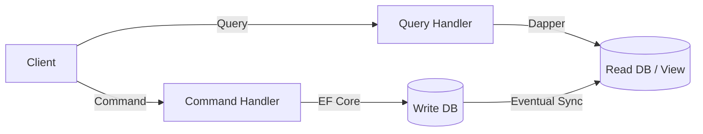

# 8.885 — CQRS at Database Level — Read and Write Models

## 1. Overview — What and Why

Command Query Responsibility Segregation (CQRS) at the database level means splitting the data access layer into two distinct paths: **read models** (queries) and **write models** (commands). Each path uses its own interface, its own data transfer objects, and often its own ORM strategy. The read side is optimized for fast, flexible data retrieval — typically returning denormalized DTOs that exactly match what the UI or API needs. The write side is optimized for consistency, validation, and business rule enforcement — typically using domain entities with full change tracking.

This separation is not about having separate databases (though that is a valid extension). It is about having separate **contracts** and **implementations** at the repository layer. Reads go through Dapper for raw performance and ad-hoc projection. Writes go through EF Core for its change-tracking pipeline, concurrency handling, and rich LINQ-based updates.

## 2. Problem Statement — Why a Single Model Fails

A single repository returning full domain entities often creates tension:

- **Over-fetching**: A query for an order list returns entire domain objects with child collections, navigation properties, and computed fields that the caller does not need.
- **Under-fetching**: If the domain entity does not have a property the view needs (e.g., a computed display name), the caller must join across multiple tables or map afterward.
- **Coupling**: The query API is coupled to the domain model. Changing a domain property name or shape breaks queries.
- **Performance**: EF Core's change tracking overhead applies even to read-only queries. Disabling tracking (`AsNoTracking`) helps but does not solve the projection problem.
- **Transaction locks**: Read queries on the same `DbContext` instance can be affected by pending changes or transaction isolation levels meant for writes.

At the database level, CQRS resolves this by giving queries their own interface and implementation, free from domain constraints.

## 3. Solution Architecture — Separate Models, Separate Interfaces

The solution introduces two repository interfaces for each aggregate:

```
┌─────────────────────────────────────────────────────────┐
│                    Application Layer                     │
│  ┌────────────────────┐    ┌──────────────────────────┐ │
│  │   Command Handler   │    │     Query Handler        │ │
│  │  (writes via EF)    │    │  (reads via Dapper)      │ │
│  └────────┬───────────┘    └──────────┬────────────────┘ │
│           │                           │                   │
└───────────┼───────────────────────────┼───────────────────┘
            │                           │
┌───────────┼───────────────────────────┼───────────────────┐
│           ▼                           ▼                   │
│  ┌──────────────────┐    ┌──────────────────────────┐     │
│  │ IOrderCommandRepo │    │   IOrderQueryRepository  │     │
│  │ (EF Core impl)    │    │   (Dapper impl)          │     │
│  ├──────────────────┤    ├──────────────────────────┤     │
│  │ • Add(Order)      │    │ • GetByIdAsync(id)       │     │
│  │ • Update(Order)   │    │ • GetListAsync(filter)   │     │
│  │ • Delete(Order)   │    │ • GetDashboardAsync(...) │     │
│  │ • SaveChanges()   │    │ • GetSummaryAsync(...)   │     │
│  └────────┬──────────┘    └───────────┬──────────────┘     │
│           │                           │                    │
│           ▼                           ▼                    │
│  ┌──────────────────┐    ┌──────────────────────────┐     │
│  │  EF Core DbContext│    │   Dapper SqlConnection   │     │
│  │  + ChangeTracker  │    │   + raw SQL / Dapper     │     │
│  └──────────────────┘    └──────────────────────────┘     │
│                    Database Layer                           │
└─────────────────────────────────────────────────────────────┘
```

Read models are simple POCO DTOs — no change tracking, no navigation properties, no domain logic. Write models are full domain entities with business rules and validation.

## 4. Database Schema — Dual Perspective

### 4.1 Write-Model Tables (Normalized)

```sql
-- ============================================================
-- Write Model — Normalized Schema for Domain Entities
-- ============================================================

CREATE TABLE [Sales].[Orders] (
    [Id]            INT              IDENTITY(1,1) NOT NULL,
    [CustomerId]    INT              NOT NULL,
    [OrderNumber]   NVARCHAR(50)     NOT NULL,
    [OrderDate]     DATETIME2(7)     NOT NULL CONSTRAINT [DF_Orders_OrderDate] DEFAULT (SYSUTCDATETIME()),
    [Status]        TINYINT          NOT NULL,  -- 0=Pending, 1=Confirmed, 2=Shipped, 3=Cancelled
    [Subtotal]      DECIMAL(18,2)    NOT NULL,
    [TaxAmount]     DECIMAL(18,2)    NOT NULL,
    [ShippingCost]  DECIMAL(18,2)    NOT NULL,
    [TotalAmount]   DECIMAL(18,2)    NOT NULL,
    [CurrencyCode]  CHAR(3)          NOT NULL CONSTRAINT [DF_Orders_CurrencyCode] DEFAULT ('USD'),
    [BillingAddressId]  INT          NULL,
    [ShippingAddressId] INT          NULL,
    [Notes]         NVARCHAR(2000)   NULL,
    [CreatedAt]     DATETIME2(7)     NOT NULL CONSTRAINT [DF_Orders_CreatedAt] DEFAULT (SYSUTCDATETIME()),
    [UpdatedAt]     DATETIME2(7)     NOT NULL CONSTRAINT [DF_Orders_UpdatedAt] DEFAULT (SYSUTCDATETIME()),
    [RowVersion]    ROWVERSION       NOT NULL,
    CONSTRAINT [PK_Orders] PRIMARY KEY CLUSTERED ([Id]),
    CONSTRAINT [UQ_Orders_OrderNumber] UNIQUE ([OrderNumber]),
    CONSTRAINT [CK_Orders_TotalAmount] CHECK ([TotalAmount] = [Subtotal] + [TaxAmount] + [ShippingCost])
);

CREATE TABLE [Sales].[OrderItems] (
    [Id]            INT              IDENTITY(1,1) NOT NULL,
    [OrderId]       INT              NOT NULL,
    [ProductId]     INT              NOT NULL,
    [ProductName]   NVARCHAR(200)    NOT NULL,
    [SKU]           NVARCHAR(50)     NOT NULL,
    [Quantity]      INT              NOT NULL CONSTRAINT [DF_OrderItems_Quantity] DEFAULT (1),
    [UnitPrice]     DECIMAL(18,2)    NOT NULL,
    [Discount]      DECIMAL(18,2)    NOT NULL CONSTRAINT [DF_OrderItems_Discount] DEFAULT (0),
    [LineTotal]     DECIMAL(18,2)    NOT NULL,
    CONSTRAINT [PK_OrderItems] PRIMARY KEY CLUSTERED ([Id]),
    CONSTRAINT [FK_OrderItems_Orders] FOREIGN KEY ([OrderId]) REFERENCES [Sales].[Orders]([Id]) ON DELETE CASCADE,
    CONSTRAINT [CK_OrderItems_LineTotal] CHECK ([LineTotal] = ([UnitPrice] - [Discount]) * [Quantity])
);

CREATE INDEX [IX_OrderItems_OrderId] ON [Sales].[OrderItems]([OrderId]);
CREATE INDEX [IX_Orders_CustomerId] ON [Sales].[Orders]([CustomerId]);
CREATE INDEX [IX_Orders_Status] ON [Sales].[Orders]([Status]) INCLUDE ([OrderDate]);

-- ============================================================
-- Write Model — Supporting Tables
-- ============================================================

CREATE TABLE [Sales].[Customers] (
    [Id]            INT              IDENTITY(1,1) NOT NULL,
    [ExternalId]    UNIQUEIDENTIFIER NOT NULL CONSTRAINT [DF_Customers_ExternalId] DEFAULT (NEWSEQUENTIALID()),
    [FirstName]     NVARCHAR(100)    NOT NULL,
    [LastName]      NVARCHAR(100)    NOT NULL,
    [Email]         NVARCHAR(256)    NOT NULL,
    [Phone]         NVARCHAR(50)    NULL,
    [CreatedAt]     DATETIME2(7)     NOT NULL CONSTRAINT [DF_Customers_CreatedAt] DEFAULT (SYSUTCDATETIME()),
    CONSTRAINT [PK_Customers] PRIMARY KEY CLUSTERED ([Id]),
    CONSTRAINT [UQ_Customers_Email] UNIQUE ([Email])
);

CREATE TABLE [Sales].[Addresses] (
    [Id]            INT              IDENTITY(1,1) NOT NULL,
    [CustomerId]    INT              NOT NULL,
    [AddressType]   TINYINT          NOT NULL,  -- 1=Billing, 2=Shipping
    [StreetLine1]   NVARCHAR(200)    NOT NULL,
    [StreetLine2]   NVARCHAR(200)    NULL,
    [City]          NVARCHAR(100)    NOT NULL,
    [State]         NVARCHAR(100)    NOT NULL,
    [PostalCode]    NVARCHAR(20)     NOT NULL,
    [CountryCode]   CHAR(2)          NOT NULL,
    [IsDefault]     BIT              NOT NULL CONSTRAINT [DF_Addresses_IsDefault] DEFAULT (0),
    CONSTRAINT [PK_Addresses] PRIMARY KEY CLUSTERED ([Id]),
    CONSTRAINT [FK_Addresses_Customers] FOREIGN KEY ([CustomerId]) REFERENCES [Sales].[Customers]([Id])
);
```

### 4.2 Read-Model Denormalized Schema (Optional Materialized Views)

```sql
-- ============================================================
-- Read Model — Denormalized Views for Query Performance
-- ============================================================

CREATE OR ALTER VIEW [Reporting].[vw_OrderSummary]
AS
SELECT
    o.Id                   AS OrderId,
    o.OrderNumber,
    o.OrderDate,
    o.Status,
    o.TotalAmount,
    o.CurrencyCode,
    c.Id                   AS CustomerId,
    c.FirstName + N' ' + c.LastName AS CustomerName,
    c.Email                AS CustomerEmail,
    COUNT(DISTINCT oi.Id)  AS ItemCount,
    SUM(oi.Quantity)       AS TotalQuantity,
    MAX(o.UpdatedAt)       AS LastModified
FROM [Sales].[Orders] o
INNER JOIN [Sales].[Customers] c ON c.Id = o.CustomerId
LEFT JOIN [Sales].[OrderItems] oi ON oi.OrderId = o.Id
GROUP BY
    o.Id, o.OrderNumber, o.OrderDate, o.Status,
    o.TotalAmount, o.CurrencyCode,
    c.Id, c.FirstName, c.LastName, c.Email;

-- For high-traffic dashboards, consider a materialized indexed view:

CREATE OR ALTER VIEW [Reporting].[vw_OrderDetail]
WITH SCHEMABINDING
AS
SELECT
    o.Id                   AS OrderId,
    o.OrderNumber,
    o.OrderDate,
    o.Status               AS OrderStatus,
    o.Subtotal,
    o.TaxAmount,
    o.ShippingCost,
    o.TotalAmount,
    o.CurrencyCode,
    o.CustomerId,
    c.FirstName + N' ' + c.LastName AS CustomerName,
    c.Email                AS CustomerEmail,
    c.Phone                AS CustomerPhone,
    oi.Id                  AS OrderItemId,
    oi.ProductId,
    oi.ProductName,
    oi.SKU,
    oi.Quantity,
    oi.UnitPrice,
    oi.Discount,
    oi.LineTotal,
    sa.StreetLine1         AS ShipStreetLine1,
    sa.City                AS ShipCity,
    sa.State               AS ShipState,
    sa.PostalCode          AS ShipPostalCode,
    sa.CountryCode         AS ShipCountryCode
FROM [Sales].[Orders] o
INNER JOIN [Sales].[Customers] c ON c.Id = o.CustomerId
INNER JOIN [Sales].[OrderItems] oi ON oi.OrderId = o.Id
LEFT JOIN [Sales].[Addresses] sa ON sa.Id = o.ShippingAddressId;
GO

-- For SQL Server Standard Edition, use a stored procedure instead:

CREATE OR ALTER PROCEDURE [Reporting].[GetOrderDashboard]
    @CustomerId     INT = NULL,
    @StatusFilter   TINYINT = NULL,
    @DateFrom       DATETIME2(7) = NULL,
    @DateTo         DATETIME2(7) = NULL,
    @PageNumber     INT = 1,
    @PageSize       INT = 20
AS
BEGIN
    SET NOCOUNT ON;

    DECLARE @Offset INT = (@PageNumber - 1) * @PageSize;

    SELECT
        o.Id,
        o.OrderNumber,
        o.OrderDate,
        o.Status,
        o.TotalAmount,
        o.CurrencyCode,
        c.FirstName + N' ' + c.LastName AS CustomerName,
        COUNT(DISTINCT oi.Id)           AS ItemCount,
        SUM(oi.Quantity)                AS TotalQuantity
    FROM [Sales].[Orders] o
    INNER JOIN [Sales].[Customers] c ON c.Id = o.CustomerId
    LEFT JOIN [Sales].[OrderItems] oi ON oi.OrderId = o.Id
    WHERE (@CustomerId IS NULL OR o.CustomerId = @CustomerId)
      AND (@StatusFilter IS NULL OR o.Status = @StatusFilter)
      AND (@DateFrom IS NULL OR o.OrderDate >= @DateFrom)
      AND (@DateTo IS NULL OR o.OrderDate < DATEADD(DAY, 1, @DateTo))
    GROUP BY
        o.Id, o.OrderNumber, o.OrderDate, o.Status,
        o.TotalAmount, o.CurrencyCode, c.FirstName, c.LastName, c.Id
    ORDER BY o.OrderDate DESC
    OFFSET @Offset ROWS
    FETCH NEXT @PageSize ROWS ONLY;

    SELECT COUNT_BIG(*) AS TotalCount
    FROM [Sales].[Orders] o
    WHERE (@CustomerId IS NULL OR o.CustomerId = @CustomerId)
      AND (@StatusFilter IS NULL OR o.Status = @StatusFilter)
      AND (@DateFrom IS NULL OR o.OrderDate >= @DateFrom)
      AND (@DateTo IS NULL OR o.OrderDate < DATEADD(DAY, 1, @DateTo));
END;
```

## 5. Implementation — EF Core for Writes (Command Side)

### 5.1 Domain Entities

```csharp
// ============================================================
// Write Model — Domain Entity (EF Core)
// ============================================================

namespace Domain.Sales;

public sealed class Order
{
    private readonly List<OrderItem> _items = new();

    private Order() { } // EF Core constructor

    public Order(int customerId, string orderNumber, string currencyCode, string? notes)
    {
        CustomerId = customerId;
        OrderNumber = orderNumber ?? throw new ArgumentNullException(nameof(orderNumber));
        CurrencyCode = currencyCode ?? "USD";
        Notes = notes;
        Status = OrderStatus.Pending;
        OrderDate = DateTime.UtcNow;
    }

    public int Id { get; private set; }
    public int CustomerId { get; private set; }
    public string OrderNumber { get; private set; } = string.Empty;
    public DateTime OrderDate { get; private set; }
    public OrderStatus Status { get; private set; }
    public decimal Subtotal { get; private set; }
    public decimal TaxAmount { get; private set; }
    public decimal ShippingCost { get; private set; }
    public decimal TotalAmount { get; private set; }
    public string CurrencyCode { get; private set; } = "USD";
    public int? BillingAddressId { get; private set; }
    public int? ShippingAddressId { get; private set; }
    public string? Notes { get; private set; }
    public DateTime CreatedAt { get; private set; }
    public DateTime UpdatedAt { get; private set; }
    public byte[] RowVersion { get; private set; } = Array.Empty<byte>();

    public IReadOnlyCollection<OrderItem> Items => _items.AsReadOnly();

    public void AddItem(int productId, string productName, string sku,
        int quantity, decimal unitPrice, decimal discount)
    {
        if (Status != OrderStatus.Pending)
            throw new InvalidOperationException("Cannot add items to a non-pending order.");

        var lineTotal = (unitPrice - discount) * quantity;
        var item = new OrderItem(Id, productId, productName, sku,
            quantity, unitPrice, discount, lineTotal);
        _items.Add(item);

        RecalculateTotals();
    }

    public void Confirm()
    {
        if (Status != OrderStatus.Pending)
            throw new InvalidOperationException("Only pending orders can be confirmed.");

        if (_items.Count == 0)
            throw new InvalidOperationException("Cannot confirm an order with no items.");

        Status = OrderStatus.Confirmed;
        UpdatedAt = DateTime.UtcNow;
    }

    public void Ship()
    {
        if (Status != OrderStatus.Confirmed)
            throw new InvalidOperationException("Only confirmed orders can be shipped.");

        Status = OrderStatus.Shipped;
        UpdatedAt = DateTime.UtcNow;
    }

    public void Cancel(string? reason = null)
    {
        if (Status == OrderStatus.Shipped)
            throw new InvalidOperationException("Cannot cancel a shipped order.");

        Status = OrderStatus.Cancelled;
        Notes = reason;
        UpdatedAt = DateTime.UtcNow;
    }

    private void RecalculateTotals()
    {
        Subtotal = _items.Sum(i => i.LineTotal);
        TaxAmount = Subtotal * 0.08m;
        ShippingCost = Subtotal >= 100 ? 0 : 15.99m;
        TotalAmount = Subtotal + TaxAmount + ShippingCost;
    }
}

public sealed class OrderItem
{
    internal OrderItem(int orderId, int productId, string productName, string sku,
        int quantity, decimal unitPrice, decimal discount, decimal lineTotal)
    {
        OrderId = orderId;
        ProductId = productId;
        ProductName = productName;
        SKU = sku;
        Quantity = quantity;
        UnitPrice = unitPrice;
        Discount = discount;
        LineTotal = lineTotal;
    }

    private OrderItem() { } // EF Core constructor

    public int Id { get; private set; }
    public int OrderId { get; private set; }
    public int ProductId { get; private set; }
    public string ProductName { get; private set; } = string.Empty;
    public string SKU { get; private set; } = string.Empty;
    public int Quantity { get; private set; }
    public decimal UnitPrice { get; private set; }
    public decimal Discount { get; private set; }
    public decimal LineTotal { get; private set; }
}

public enum OrderStatus : byte
{
    Pending = 0,
    Confirmed = 1,
    Shipped = 2,
    Cancelled = 3
}
```

### 5.2 EF Core Configuration

```csharp
// ============================================================
// Write Model — EF Core Fluent Configuration
// ============================================================

namespace Infrastructure.Data.Configurations;

using Domain.Sales;
using Microsoft.EntityFrameworkCore;
using Microsoft.EntityFrameworkCore.Metadata.Builders;

public sealed class OrderConfiguration : IEntityTypeConfiguration<Order>
{
    public void Configure(EntityTypeBuilder<Order> builder)
    {
        builder.ToTable("Orders", "Sales");

        builder.HasKey(o => o.Id);

        builder.Property(o => o.OrderNumber)
            .IsRequired()
            .HasMaxLength(50);

        builder.HasIndex(o => o.OrderNumber)
            .IsUnique();

        builder.Property(o => o.CustomerId)
            .IsRequired();

        builder.Property(o => o.Status)
            .IsRequired()
            .HasConversion<byte>();

        builder.Property(o => o.Subtotal)
            .IsRequired()
            .HasPrecision(18, 2);

        builder.Property(o => o.TaxAmount)
            .IsRequired()
            .HasPrecision(18, 2);

        builder.Property(o => o.ShippingCost)
            .IsRequired()
            .HasPrecision(18, 2);

        builder.Property(o => o.TotalAmount)
            .IsRequired()
            .HasPrecision(18, 2);

        builder.Property(o => o.CurrencyCode)
            .IsRequired()
            .HasMaxLength(3)
            .IsFixedLength();

        builder.Property(o => o.Notes)
            .HasMaxLength(2000);

        builder.Property(o => o.CreatedAt)
            .IsRequired()
            .HasDefaultValueSql("SYSUTCDATETIME()");

        builder.Property(o => o.UpdatedAt)
            .IsRequired()
            .HasDefaultValueSql("SYSUTCDATETIME()");

        builder.Property(o => o.RowVersion)
            .IsRowVersion();

        builder.HasMany(o => o.Items)
            .WithOne()
            .HasForeignKey(oi => oi.OrderId)
            .OnDelete(DeleteBehavior.Cascade);

        builder.Navigation(o => o.Items)
            .UsePropertyAccessMode(PropertyAccessMode.Field)
            .AutoInclude();

        builder.HasCheckConstraint("CK_Orders_TotalAmount",
            "[TotalAmount] = [Subtotal] + [TaxAmount] + [ShippingCost]");
    }
}

public sealed class OrderItemConfiguration : IEntityTypeConfiguration<OrderItem>
{
    public void Configure(EntityTypeBuilder<OrderItem> builder)
    {
        builder.ToTable("OrderItems", "Sales");

        builder.HasKey(oi => oi.Id);

        builder.Property(oi => oi.ProductName)
            .IsRequired()
            .HasMaxLength(200);

        builder.Property(oi => oi.SKU)
            .IsRequired()
            .HasMaxLength(50);

        builder.Property(oi => oi.Quantity)
            .IsRequired()
            .HasDefaultValue(1);

        builder.Property(oi => oi.UnitPrice)
            .IsRequired()
            .HasPrecision(18, 2);

        builder.Property(oi => oi.Discount)
            .IsRequired()
            .HasPrecision(18, 2)
            .HasDefaultValue(0);

        builder.Property(oi => oi.LineTotal)
            .IsRequired()
            .HasPrecision(18, 2);

        builder.HasCheckConstraint("CK_OrderItems_LineTotal",
            "[LineTotal] = ([UnitPrice] - [Discount]) * [Quantity]");
    }
}
```

### 5.3 Command Repository Interface

```csharp
// ============================================================
// Write Model — Command Repository Interface
// ============================================================

namespace Application.Contracts.Persistence;

using Domain.Sales;

public interface IOrderCommandRepository
{
    Task<Order> GetByIdAsync(int id, CancellationToken ct = default);
    Task AddAsync(Order order, CancellationToken ct = default);
    void Update(Order order);
    void Delete(Order order);
    Task<int> SaveChangesAsync(CancellationToken ct = default);
}
```

### 5.4 Command Repository — EF Core Implementation

```csharp
// ============================================================
// Write Model — EF Core Command Repository Implementation
// ============================================================

namespace Infrastructure.Persistence.CommandRepositories;

using Application.Contracts.Persistence;
using Domain.Sales;
using Infrastructure.Data;
using Microsoft.EntityFrameworkCore;

public sealed class OrderCommandRepository : IOrderCommandRepository
{
    private readonly SalesDbContext _context;

    public OrderCommandRepository(SalesDbContext context)
    {
        _context = context ?? throw new ArgumentNullException(nameof(context));
    }

    public async Task<Order> GetByIdAsync(int id, CancellationToken ct = default)
    {
        var order = await _context.Orders
            .FirstOrDefaultAsync(o => o.Id == id, ct);

        if (order is null)
            throw new KeyNotFoundException($"Order with Id {id} was not found.");

        return order;
    }

    public async Task AddAsync(Order order, CancellationToken ct = default)
    {
        await _context.Orders.AddAsync(order, ct);
    }

    public void Update(Order order)
    {
        _context.Entry(order).State = EntityState.Modified;
        order.UpdatedAt = DateTime.UtcNow;
    }

    public void Delete(Order order)
    {
        _context.Orders.Remove(order);
    }

    public async Task<int> SaveChangesAsync(CancellationToken ct = default)
    {
        return await _context.SaveChangesAsync(ct);
    }
}
```

### 5.5 Command Handler — Using EF Core Write Model

```csharp
// ============================================================
// Command Handler — Confirm Order (Write Side)
// ============================================================

namespace Application.Commands.ConfirmOrder;

using Application.Contracts.Persistence;
using FluentValidation;
using MediatR;

public sealed record ConfirmOrderCommand(int OrderId) : IRequest;

public sealed class ConfirmOrderCommandValidator : AbstractValidator<ConfirmOrderCommand>
{
    public ConfirmOrderCommandValidator()
    {
        RuleFor(x => x.OrderId).GreaterThan(0);
    }
}

public sealed class ConfirmOrderCommandHandler : IRequestHandler<ConfirmOrderCommand>
{
    private readonly IOrderCommandRepository _repo;
    private readonly IUnitOfWork _uow;

    public ConfirmOrderCommandHandler(IOrderCommandRepository repo, IUnitOfWork uow)
    {
        _repo = repo;
        _uow = uow;
    }

    public async Task Handle(ConfirmOrderCommand request, CancellationToken ct)
    {
        var order = await _repo.GetByIdAsync(request.OrderId, ct);
        order.Confirm();
        _repo.Update(order);
        await _repo.SaveChangesAsync(ct);
    }
}

// ============================================================
// Command Handler — Create Order (Write Side)
// ============================================================

namespace Application.Commands.CreateOrder;

using Application.Contracts.Persistence;
using Domain.Sales;
using FluentValidation;
using MediatR;

public sealed record CreateOrderCommand(
    int CustomerId,
    string OrderNumber,
    string? Notes,
    List<CreateOrderItemDto> Items
) : IRequest<int>;

public sealed record CreateOrderItemDto(
    int ProductId,
    string ProductName,
    string SKU,
    int Quantity,
    decimal UnitPrice,
    decimal Discount
);

public sealed class CreateOrderCommandValidator : AbstractValidator<CreateOrderCommand>
{
    public CreateOrderCommandValidator()
    {
        RuleFor(x => x.CustomerId).GreaterThan(0);
        RuleFor(x => x.OrderNumber).NotEmpty().MaximumLength(50);
        RuleFor(x => x.Items).NotEmpty();
        RuleForEach(x => x.Items).ChildRules(item =>
        {
            item.RuleFor(i => i.ProductId).GreaterThan(0);
            item.RuleFor(i => i.ProductName).NotEmpty().MaximumLength(200);
            item.RuleFor(i => i.SKU).NotEmpty().MaximumLength(50);
            item.RuleFor(i => i.Quantity).GreaterThan(0);
            item.RuleFor(i => i.UnitPrice).GreaterThan(0);
        });
    }
}

public sealed class CreateOrderCommandHandler : IRequestHandler<CreateOrderCommand, int>
{
    private readonly IOrderCommandRepository _repo;
    private readonly IUnitOfWork _uow;

    public CreateOrderCommandHandler(IOrderCommandRepository repo, IUnitOfWork uow)
    {
        _repo = repo;
        _uow = uow;
    }

    public async Task<int> Handle(CreateOrderCommand request, CancellationToken ct)
    {
        var order = new Order(
            request.CustomerId,
            request.OrderNumber,
            "USD",
            request.Notes);

        foreach (var item in request.Items)
        {
            order.AddItem(
                item.ProductId,
                item.ProductName,
                item.SKU,
                item.Quantity,
                item.UnitPrice,
                item.Discount);
        }

        await _repo.AddAsync(order, ct);
        await _repo.SaveChangesAsync(ct);

        return order.Id;
    }
}
```

### 5.6 DbContext with Write-Optimized Configuration

```csharp
// ============================================================
// Write Model — SalesDbContext (EF Core)
// ============================================================

namespace Infrastructure.Data;

using Domain.Sales;
using Infrastructure.Data.Configurations;
using Microsoft.EntityFrameworkCore;

public sealed class SalesDbContext : DbContext
{
    public SalesDbContext(DbContextOptions<SalesDbContext> options)
        : base(options) { }

    public DbSet<Order> Orders => Set<Order>();
    public DbSet<OrderItem> OrderItems => Set<OrderItem>();

    protected override void OnModelCreating(ModelBuilder modelBuilder)
    {
        modelBuilder.ApplyConfiguration(new OrderConfiguration());
        modelBuilder.ApplyConfiguration(new OrderItemConfiguration());

        // Disable cascade delete globally except where explicitly configured
        foreach (var relationship in modelBuilder.Model.GetEntityTypes()
            .SelectMany(e => e.GetForeignKeys()))
        {
            relationship.DeleteBehavior = DeleteBehavior.Restrict;
        }

        base.OnModelCreating(modelBuilder);
    }

    protected override void OnConfiguring(DbContextOptionsBuilder optionsBuilder)
    {
        // Write-optimized: enable sensitive data logging only in dev
        if (!optionsBuilder.IsConfigured) return;

        // Ensure change tracking is enabled (default) for writes
        optionsBuilder.EnableSensitiveDataLogging(false);
        optionsBuilder.EnableDetailedErrors(false);

        base.OnConfiguring(optionsBuilder);
    }

    public override async Task<int> SaveChangesAsync(CancellationToken ct = default)
    {
        // Automatically set UpdatedAt for any modified entity
        foreach (var entry in ChangeTracker.Entries<Order>())
        {
            if (entry.State == EntityState.Modified)
            {
                entry.Entity.UpdatedAt = DateTime.UtcNow;
            }
        }

        return await base.SaveChangesAsync(ct);
    }
}
```

## 6. Implementation — Dapper for Reads (Query Side)

### 6.1 Read Model DTOs

```csharp
// ============================================================
// Read Model — Denormalized DTOs for Queries
// ============================================================

namespace Application.Queries.OrderSummary;

// Lightweight DTO — no behavior, no change tracking, no domain logic
public sealed class OrderSummaryDto
{
    public int OrderId { get; init; }
    public string OrderNumber { get; init; } = string.Empty;
    public DateTime OrderDate { get; init; }
    public byte Status { get; init; }
    public string StatusName => Status switch
    {
        0 => "Pending",
        1 => "Confirmed",
        2 => "Shipped",
        3 => "Cancelled",
        _ => "Unknown"
    };
    public decimal TotalAmount { get; init; }
    public string CurrencyCode { get; init; } = "USD";
    public int CustomerId { get; init; }
    public string CustomerName { get; init; } = string.Empty;
    public string CustomerEmail { get; init; } = string.Empty;
    public int ItemCount { get; init; }
    public int TotalQuantity { get; init; }
    public DateTime LastModified { get; init; }
}

public sealed class OrderDetailDto
{
    public int OrderId { get; init; }
    public string OrderNumber { get; init; } = string.Empty;
    public DateTime OrderDate { get; init; }
    public byte OrderStatus { get; init; }
    public string OrderStatusName => OrderStatus switch
    {
        0 => "Pending",
        1 => "Confirmed",
        2 => "Shipped",
        3 => "Cancelled",
        _ => "Unknown"
    };
    public decimal Subtotal { get; init; }
    public decimal TaxAmount { get; init; }
    public decimal ShippingCost { get; init; }
    public decimal TotalAmount { get; init; }
    public string CurrencyCode { get; init; } = "USD";
    public int CustomerId { get; init; }
    public string CustomerName { get; init; } = string.Empty;
    public string CustomerEmail { get; init; } = string.Empty;
    public string? CustomerPhone { get; init; }
    public List<OrderItemDto> Items { get; init; } = new();
}

public sealed class OrderItemDto
{
    public int OrderItemId { get; init; }
    public int ProductId { get; init; }
    public string ProductName { get; init; } = string.Empty;
    public string SKU { get; init; } = string.Empty;
    public int Quantity { get; init; }
    public decimal UnitPrice { get; init; }
    public decimal Discount { get; init; }
    public decimal LineTotal { get; init; }
}

public sealed class DashboardFilterDto
{
    public int? CustomerId { get; init; }
    public byte? StatusFilter { get; init; }
    public DateTime? DateFrom { get; init; }
    public DateTime? DateTo { get; init; }
    public int PageNumber { get; init; } = 1;
    public int PageSize { get; init; } = 20;
}

public sealed class PagedResult<T>
{
    public IReadOnlyList<T> Items { get; init; } = Array.Empty<T>();
    public long TotalCount { get; init; }
    public int PageNumber { get; init; }
    public int PageSize { get; init; }
    public int TotalPages => (int)Math.Ceiling((double)TotalCount / PageSize);
}
```

### 6.2 Query Repository Interface

```csharp
// ============================================================
// Read Model — Query Repository Interface (Dapper)
// ============================================================

namespace Application.Contracts.Persistence;

using Application.Queries.OrderSummary;

public interface IOrderQueryRepository
{
    Task<OrderDetailDto?> GetByIdAsync(int orderId, CancellationToken ct = default);
    Task<PagedResult<OrderSummaryDto>> GetDashboardAsync(
        DashboardFilterDto filter, CancellationToken ct = default);
    Task<IReadOnlyList<OrderSummaryDto>> GetRecentOrdersAsync(
        int customerId, int take = 5, CancellationToken ct = default);
    Task<decimal> GetCustomerTotalSpentAsync(int customerId, CancellationToken ct = default);
    Task<int> GetOrderCountByStatusAsync(byte status, CancellationToken ct = default);
}
```

### 6.3 Query Repository — Dapper Implementation

```csharp
// ============================================================
// Read Model — Dapper Query Repository Implementation
// ============================================================

namespace Infrastructure.Persistence.QueryRepositories;

using System.Data;
using Application.Contracts.Persistence;
using Application.Queries.OrderSummary;
using Dapper;
using Microsoft.Data.SqlClient;

public sealed class OrderQueryRepository : IOrderQueryRepository
{
    private readonly string _connectionString;

    public OrderQueryRepository(string connectionString)
    {
        _connectionString = connectionString
            ?? throw new ArgumentNullException(nameof(connectionString));
    }

    private IDbConnection CreateConnection()
        => new SqlConnection(_connectionString);

    public async Task<OrderDetailDto?> GetByIdAsync(int orderId, CancellationToken ct = default)
    {
        const string sql = @"
            SELECT
                o.Id                   AS OrderId,
                o.OrderNumber,
                o.OrderDate,
                o.Status               AS OrderStatus,
                o.Subtotal,
                o.TaxAmount,
                o.ShippingCost,
                o.TotalAmount,
                o.CurrencyCode,
                o.CustomerId,
                c.FirstName + N' ' + c.LastName AS CustomerName,
                c.Email                AS CustomerEmail,
                c.Phone                AS CustomerPhone,
                oi.Id                  AS OrderItemId,
                oi.ProductId,
                oi.ProductName,
                oi.SKU,
                oi.Quantity,
                oi.UnitPrice,
                oi.Discount,
                oi.LineTotal,
                sa.StreetLine1         AS ShipStreetLine1,
                sa.City                AS ShipCity,
                sa.State               AS ShipState,
                sa.PostalCode          AS ShipPostalCode,
                sa.CountryCode         AS ShipCountryCode
            FROM [Sales].[Orders] o
            INNER JOIN [Sales].[Customers] c ON c.Id = o.CustomerId
            INNER JOIN [Sales].[OrderItems] oi ON oi.OrderId = o.Id
            LEFT JOIN [Sales].[Addresses] sa ON sa.Id = o.ShippingAddressId
            WHERE o.Id = @OrderId;";

        using var db = CreateConnection();

        var lookup = new Dictionary<int, OrderDetailDto>();

        await db.QueryAsync<OrderDetailDto, OrderItemDto, OrderDetailDto>(
            new CommandDefinition(sql, new { OrderId = orderId }, cancellationToken: ct),
            (detail, item) =>
            {
                if (!lookup.TryGetValue(detail.OrderId, out var existing))
                {
                    existing = detail;
                    existing.Items = new List<OrderItemDto>();
                    lookup.Add(detail.OrderId, existing);
                }

                if (item is not null)
                {
                    existing.Items.Add(item);
                }

                return existing;
            },
            splitOn: "OrderItemId");

        return lookup.Values.FirstOrDefault();
    }

    public async Task<PagedResult<OrderSummaryDto>> GetDashboardAsync(
        DashboardFilterDto filter, CancellationToken ct = default)
    {
        const string countSql = @"
            SELECT COUNT_BIG(*)
            FROM [Sales].[Orders] o
            WHERE (@CustomerId IS NULL OR o.CustomerId = @CustomerId)
              AND (@StatusFilter IS NULL OR o.Status = @StatusFilter)
              AND (@DateFrom IS NULL OR o.OrderDate >= @DateFrom)
              AND (@DateTo IS NULL OR o.OrderDate < DATEADD(DAY, 1, @DateTo));";

        const string dataSql = @"
            SELECT
                o.Id                   AS OrderId,
                o.OrderNumber,
                o.OrderDate,
                o.Status,
                o.TotalAmount,
                o.CurrencyCode,
                o.CustomerId,
                c.FirstName + N' ' + c.LastName AS CustomerName,
                c.Email                AS CustomerEmail,
                COUNT(DISTINCT oi.Id)  AS ItemCount,
                SUM(oi.Quantity)       AS TotalQuantity,
                MAX(o.UpdatedAt)       AS LastModified
            FROM [Sales].[Orders] o
            INNER JOIN [Sales].[Customers] c ON c.Id = o.CustomerId
            LEFT JOIN [Sales].[OrderItems] oi ON oi.OrderId = o.Id
            WHERE (@CustomerId IS NULL OR o.CustomerId = @CustomerId)
              AND (@StatusFilter IS NULL OR o.Status = @StatusFilter)
              AND (@DateFrom IS NULL OR o.OrderDate >= @DateFrom)
              AND (@DateTo IS NULL OR o.OrderDate < DATEADD(DAY, 1, @DateTo))
            GROUP BY
                o.Id, o.OrderNumber, o.OrderDate, o.Status,
                o.TotalAmount, o.CurrencyCode,
                c.Id, c.FirstName, c.LastName, c.Email
            ORDER BY o.OrderDate DESC
            OFFSET @Offset ROWS
            FETCH NEXT @PageSize ROWS ONLY;";

        using var db = CreateConnection();
        var parameters = new
        {
            filter.CustomerId,
            filter.StatusFilter,
            filter.DateFrom,
            filter.DateTo,
            Offset = (filter.PageNumber - 1) * filter.PageSize,
            PageSize = filter.PageSize
        };

        using var multi = await db.QueryMultipleAsync(
            new CommandDefinition($"{countSql}\n{dataSql}",
                parameters, cancellationToken: ct));

        var totalCount = await multi.ReadSingleAsync<long>();
        var items = (await multi.ReadAsync<OrderSummaryDto>()).AsList();

        return new PagedResult<OrderSummaryDto>
        {
            Items = items,
            TotalCount = totalCount,
            PageNumber = filter.PageNumber,
            PageSize = filter.PageSize
        };
    }

    public async Task<IReadOnlyList<OrderSummaryDto>> GetRecentOrdersAsync(
        int customerId, int take = 5, CancellationToken ct = default)
    {
        const string sql = @"
            SELECT TOP (@Take)
                o.Id                   AS OrderId,
                o.OrderNumber,
                o.OrderDate,
                o.Status,
                o.TotalAmount,
                o.CurrencyCode,
                o.CustomerId,
                c.FirstName + N' ' + c.LastName AS CustomerName,
                c.Email                AS CustomerEmail,
                COUNT(DISTINCT oi.Id)  AS ItemCount,
                SUM(oi.Quantity)       AS TotalQuantity,
                MAX(o.UpdatedAt)       AS LastModified
            FROM [Sales].[Orders] o
            INNER JOIN [Sales].[Customers] c ON c.Id = o.CustomerId
            LEFT JOIN [Sales].[OrderItems] oi ON oi.OrderId = o.Id
            WHERE o.CustomerId = @CustomerId
            GROUP BY
                o.Id, o.OrderNumber, o.OrderDate, o.Status,
                o.TotalAmount, o.CurrencyCode,
                c.Id, c.FirstName, c.LastName, c.Email
            ORDER BY o.OrderDate DESC;";

        using var db = CreateConnection();

        var results = await db.QueryAsync<OrderSummaryDto>(
            new CommandDefinition(sql, new { CustomerId = customerId, Take = take },
                cancellationToken: ct));

        return results.AsList();
    }

    public async Task<decimal> GetCustomerTotalSpentAsync(
        int customerId, CancellationToken ct = default)
    {
        const string sql = @"
            SELECT ISNULL(SUM(TotalAmount), 0)
            FROM [Sales].[Orders]
            WHERE CustomerId = @CustomerId
              AND Status IN (1, 2);";  // Confirmed or Shipped

        using var db = CreateConnection();

        return await db.ExecuteScalarAsync<decimal>(
            new CommandDefinition(sql, new { CustomerId = customerId },
                cancellationToken: ct));
    }

    public async Task<int> GetOrderCountByStatusAsync(
        byte status, CancellationToken ct = default)
    {
        const string sql = @"
            SELECT COUNT_BIG(*)
            FROM [Sales].[Orders]
            WHERE Status = @Status;";

        using var db = CreateConnection();

        var count = await db.ExecuteScalarAsync<long>(
            new CommandDefinition(sql, new { Status = status },
                cancellationToken: ct));

        return (int)count;
    }
}
```

### 6.4 Query Handler — Using Dapper Read Model

```csharp
// ============================================================
// Query Handler — Get Order Dashboard (Read Side)
// ============================================================

namespace Application.Queries.GetOrderDashboard;

using Application.Contracts.Persistence;
using Application.Queries.OrderSummary;
using FluentValidation;
using MediatR;

public sealed record GetOrderDashboardQuery : DashboardFilterDto, IRequest<PagedResult<OrderSummaryDto>>;

public sealed class GetOrderDashboardQueryValidator : AbstractValidator<GetOrderDashboardQuery>
{
    public GetOrderDashboardQueryValidator()
    {
        RuleFor(x => x.PageNumber).GreaterThanOrEqualTo(1);
        RuleFor(x => x.PageSize).InclusiveBetween(1, 100);
    }
}

public sealed class GetOrderDashboardQueryHandler
    : IRequestHandler<GetOrderDashboardQuery, PagedResult<OrderSummaryDto>>
{
    private readonly IOrderQueryRepository _repo;

    public GetOrderDashboardQueryHandler(IOrderQueryRepository repo)
    {
        _repo = repo ?? throw new ArgumentNullException(nameof(repo));
    }

    public async Task<PagedResult<OrderSummaryDto>> Handle(
        GetOrderDashboardQuery request, CancellationToken ct)
    {
        var filter = new DashboardFilterDto
        {
            CustomerId = request.CustomerId,
            StatusFilter = request.StatusFilter,
            DateFrom = request.DateFrom,
            DateTo = request.DateTo,
            PageNumber = request.PageNumber,
            PageSize = request.PageSize
        };

        return await _repo.GetDashboardAsync(filter, ct);
    }
}

// ============================================================
// Query Handler — Get Order Detail (Read Side)
// ============================================================

namespace Application.Queries.GetOrderDetail;

using Application.Contracts.Persistence;
using Application.Queries.OrderSummary;
using FluentValidation;
using MediatR;

public sealed record GetOrderDetailQuery(int OrderId) : IRequest<OrderDetailDto?>;

public sealed class GetOrderDetailQueryValidator : AbstractValidator<GetOrderDetailQuery>
{
    public GetOrderDetailQueryValidator()
    {
        RuleFor(x => x.OrderId).GreaterThan(0);
    }
}

public sealed class GetOrderDetailQueryHandler
    : IRequestHandler<GetOrderDetailQuery, OrderDetailDto?>
{
    private readonly IOrderQueryRepository _repo;

    public GetOrderDetailQueryHandler(IOrderQueryRepository repo)
    {
        _repo = repo ?? throw new ArgumentNullException(nameof(repo));
    }

    public async Task<OrderDetailDto?> Handle(
        GetOrderDetailQuery request, CancellationToken ct)
    {
        return await _repo.GetByIdAsync(request.OrderId, ct);
    }
}
```

## 7. Comparison — EF Core Write vs Dapper Read

### 7.1 Interface Comparison

```csharp
// ============================================================
// Side-by-Side Interface Comparison
// ============================================================

// ─────────────────────────────────────────────────────
// WRITE SIDE — EF Core (IOrderCommandRepository)
// ─────────────────────────────────────────────────────
//
// Returns full domain entities with change tracking.
// Uses DbContext for unit-of-work and transaction management.
// All modifications go through explicit methods on the entity.
//
// IOrderCommandRepository:
//   Task<Order> GetByIdAsync(int id, CancellationToken ct)
//   Task AddAsync(Order order, CancellationToken ct)
//   void Update(Order order)
//   void Delete(Order order)
//   Task<int> SaveChangesAsync(CancellationToken ct)

// ─────────────────────────────────────────────────────
// READ SIDE — Dapper (IOrderQueryRepository)
// ─────────────────────────────────────────────────────
//
// Returns lightweight DTOs with no behavior.
// Uses raw SQL for maximum query flexibility.
// No change tracking, no unit-of-work.
// Multiple specialized methods for different query shapes.
//
// IOrderQueryRepository:
//   Task<OrderDetailDto?> GetByIdAsync(int orderId, CancellationToken ct)
//   Task<PagedResult<OrderSummaryDto>> GetDashboardAsync(DashboardFilterDto, CancellationToken)
//   Task<IReadOnlyList<OrderSummaryDto>> GetRecentOrdersAsync(int customerId, int take, CancellationToken)
//   Task<decimal> GetCustomerTotalSpentAsync(int customerId, CancellationToken)
//   Task<int> GetOrderCountByStatusAsync(byte status, CancellationToken)
```

### 7.2 Performance Benchmarks

| Aspect | EF Core Write | Dapper Read |
|--------|---------------|-------------|
| Query flexibility | Limited to LINQ expressions | Full SQL (CTEs, window functions, hints) |
| Projection overhead | Requires `.Select()` or `.AsNoTracking()` | Natural — SELECT exactly what you need |
| Change tracking | Essential for writes | Eliminated entirely |
| Connection management | DbContext manages | Manual (Dapper) |
| Mapping | Automatic via conventions | Manual or via Dapper type mapping |
| Best for | Complex save operations with validation | High-throughput read-only operations |
| Transaction scope | Handled by DbContext SaveChanges | Explicit SqlTransaction if needed |

### 7.3 When to Break the Pattern

There are valid scenarios where you might use EF Core for reads or Dapper for writes:

- **EF Core reads with compiled queries**: For frequently repeated queries, `EF.CompileQuery` provides performance close to Dapper while maintaining type safety.
- **Dapper writes for bulk operations**: When inserting thousands of rows, Dapper's `ExecuteAsync` with table-valued parameters outperforms EF Core's `AddRange` + `SaveChanges`.
- **Mixed read/write in the same handler**: In rare cases where a read must be immediately consistent with a write (e.g., read your own write), use the same DbContext to avoid the eventual consistency delay.

## 8. Gotchas — Pitfalls and Mitigations

### 8.1 Eventual Consistency Delay

When using separate databases or even separate connections for reads vs writes, there is a natural delay between writing data and reading it back. This is especially problematic in "read your own write" scenarios.

**Mitigation**:
- Use the same connection for command handler reads that need immediate consistency.
- Implement a "trickle" delay in query handlers (e.g., retry with backoff for critical reads).
- Accept eventual consistency for non-critical dashboards and reports.

### 8.2 Duplicate Read/Write Logic

Without discipline, you can end up with business rules duplicated in the read model (e.g., calculating `LineTotal` in both the domain entity and the SQL query).

**Mitigation**:
- Keep business rules in the domain layer only.
- Use database-computed columns for derived values (e.g., `LineTotal` as a computed column).
- The read model should transform, not recalculate.

### 8.3 Stale Read Models

If you materialize read models into tables or caches, they can become stale when writes occur.

**Mitigation**:
- Use database views (they are always live).
- Use change data capture (CDC) to refresh materialized tables.
- Implement cache invalidation via an outbox pattern (see [[8.886 — Outbox Pattern — Database Implementation]]).

### 8.4 Transaction Coordination

Writes and reads on different connections cannot participate in the same SQL transaction.

**Mitigation**:
- For critical atomic operations, use the EF Core DbContext for both reads and writes within the same `DbContext.SaveChangesAsync` call.
- Avoid distributed transactions across separate read/write stores.

### 8.5 Over-Engineering

CQRS at the database level adds complexity. Not every application needs it.

**Mitigation**:
- Start with a single model and extract read models only when query performance or complexity demands it.
- Use Dapper for reads even without full CQRS — just add query-specific interfaces alongside your existing repositories.
- Apply the pattern only at aggregate boundaries, not for every entity.

## 9. Related Notes

- [[8.881 — Repository Pattern — Interface and Implementation]] — Base pattern for separating data access
- [[8.882 — Repository Pattern — Generic vs Specific]] — Trade-offs between generic and specific repositories
- [[8.883 — Unit of Work Pattern — Transaction Boundary]] — Transaction management for writes
- [[8.886 — Outbox Pattern — Database Implementation]] — Reliable message delivery from write side
- [[8.887 — Outbox Pattern — Polling Publisher in .NET]] — Background service for outbox processing
- [[8.888 — Inbox Pattern — Deduplication Table]] — Idempotent message consumption
- [[7.415 — CQRS — Command Query Responsibility Segregation]] — Architectural CQRS overview
- [[8.865 — Dapper — Buffered vs Unbuffered Queries]] — Dapper query mode considerations

---

**Diagram: CQRS Database-Level Flow**



**Key takeaway**: Use Dapper for read models — fast, projection-friendly, raw SQL. Use EF Core for write models — change tracking, validation, domain integrity. The two can coexist in the same project without a separate database for each side.
