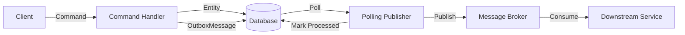

# 8.886 — Outbox Pattern — Database Implementation

## 1. Overview — What and Why

The Outbox pattern solves the **dual-write problem**: when an application writes to both a database and a message broker (or any other external system) in the same operation, one of the two writes might fail, leaving the system in an inconsistent state. The outbox stores messages in the **same database transaction** as the business data. A separate background process (the publisher) reads those messages and delivers them to the broker. This ensures that either both the business data and the message are persisted, or neither is.

The outbox table is a holding area for messages that must be sent to a message broker or other downstream consumers. It acts as a reliable intermediary, turning a distributed transaction (DB + broker) into a local transaction (DB only) plus an asynchronous delivery process.

## 2. Problem Statement — The Dual-Write Problem

Consider a typical e-commerce flow: an order is confirmed, and a message must be sent to the shipping service. Naively, the code does:

1. `UPDATE Orders SET Status = 2 WHERE Id = 42`  (DB write)
2. `await bus.PublishAsync(new OrderConfirmedEvent(...))` (broker write)

If step 1 succeeds but step 2 fails (e.g., broker is down, network issue), the order is confirmed but the shipping service never learns about it. Conversely, if step 2 succeeds and step 1 fails (rare, but possible with connection pooling), the shipping service gets a phantom event.

Without the outbox, developers resort to:

- **Distributed transactions (MSDTC)**: Hard to configure, poorly supported across cloud brokers, performance overhead.
- **Broker-first writes**: Write to broker first, then DB — vulnerable to broker downtime and at-least-once delivery issues.
- **Retry logic in the handler**: Fragile, complicates business logic, prone to infinite retry loops.
- **Manual reconciliation**: Periodic scripts to compare DB state with broker state — error-prone and operationally heavy.

The outbox pattern eliminates these problems by making the message part of the business transaction.

## 3. Solution Architecture — Transactional Outbox

The core idea is simple: persist the message in the same database transaction as the business operation. The message sits in an `OutboxMessages` table. A separate publisher process reads the table, sends messages to the broker, and marks them as processed.

```
┌──────────────────────────────────────────────────────────────────────────┐
│                               Client                                      │
│  ┌──────────────────────────────────────────────────────────────────────┐│
│  │                       Command Handler                                 ││
│  │  1. Save business entity (Order)                                      ││
│  │  2. Save outbox message (OrderConfirmedEvent)                         ││
│  │  3. SaveChangesAsync() — single transaction                           ││
│  └──────────────────────┬───────────────────────────────────────────────┘│
└─────────────────────────┼────────────────────────────────────────────────┘
                          │
                          ▼
┌──────────────────────────────────────────────────────────────────────────┐
│                             Database                                      │
│  ┌──────────────────────────────────────────────────────────────────────┐│
│  │  BEGIN TRAN                                                        ││
│  │  INSERT INTO Orders ...                                            ││
│  │  INSERT INTO OrderItems ...                                        ││
│  │  INSERT INTO OutboxMessages (Id, Type, Content, CreatedAt) ...     ││
│  │  COMMIT TRAN                                                       ││
│  └──────────────────────────────────────────────────────────────────────┘│
│                                                                           │
│  ┌──────────────────────────────────────────────────────────────────────┐│
│  │  OutboxMessages Table                                                ││
│  │  ┌──────┬──────────────┬──────────────────┬────────────────┬──────┐ ││
│  │  │ Id   │ Type         │ Content           │ CreatedAt      │ Proc │ ││
│  │  ├──────┼──────────────┼──────────────────┼────────────────┼──────┤ ││
│  │  │ 1001 │ OrderConfirm │ { "orderId": 42 } │ 2026-06-27...  │ NULL │ ││
│  │  │ 1002 │ OrderConfirm │ { "orderId": 43 } │ 2026-06-27...  │ NULL │ ││
│  │  └──────┴──────────────┴──────────────────┴────────────────┴──────┘ ││
│  └──────────────────────────────────────────────────────────────────────┘│
└─────────────────────────────────┬────────────────────────────────────────┘
                                  │
                                  ▼
┌──────────────────────────────────────────────────────────────────────────┐
│                       Polling Publisher (Background Service)              │
│  ┌──────────────────────────────────────────────────────────────────────┐│
│  │  1. Poll: SELECT * FROM OutboxMessages WHERE ProcessedAt IS NULL    ││
│  │  2. Publish: bus.PublishAsync(message)                              ││
│  │  3. Mark: UPDATE OutboxMessages SET ProcessedAt = GETUTCDATE()      ││
│  └──────────────────────────────────────────────────────────────────────┘│
└─────────────────────────────────┬────────────────────────────────────────┘
                                  │
                                  ▼
                     ┌───────────────────────┐
                     │   Message Broker       │
                     │  (RabbitMQ, Kafka,     │
                     │   Azure Service Bus)   │
                     └───────────────────────┘
```

## 4. Database Schema — OutboxMessage Table

### 4.1 Core OutboxMessage Table

```sql
-- ============================================================
-- Outbox Pattern — OutboxMessage Table
-- ============================================================

CREATE TABLE [Messaging].[OutboxMessages] (
    [Id]            UNIQUEIDENTIFIER NOT NULL CONSTRAINT [DF_OutboxMessages_Id] DEFAULT (NEWSEQUENTIALID()),
    [Type]          NVARCHAR(500)    NOT NULL,  -- Full type name, e.g. "Domain.Events.OrderConfirmedEvent"
    [Content]       NVARCHAR(MAX)    NOT NULL,  -- JSON serialized message body
    [ContentType]   NVARCHAR(100)    NOT NULL CONSTRAINT [DF_OutboxMessages_ContentType] DEFAULT ('application/json'),
    [CorrelationId] UNIQUEIDENTIFIER NULL,       -- For tracing across services
    [AggregateId]   NVARCHAR(100)    NULL,       -- e.g. "Order:42"
    [AggregateType] NVARCHAR(200)    NULL,       -- e.g. "Domain.Sales.Order"
    [CreatedAt]     DATETIME2(7)     NOT NULL CONSTRAINT [DF_OutboxMessages_CreatedAt] DEFAULT (SYSUTCDATETIME()),
    [ProcessedAt]   DATETIME2(7)     NULL,
    [Error]         NVARCHAR(MAX)    NULL,        -- Error message if processing failed permanently
    [RetryCount]    INT              NOT NULL CONSTRAINT [DF_OutboxMessages_RetryCount] DEFAULT (0),
    [MaxRetries]    INT              NOT NULL CONSTRAINT [DF_OutboxMessages_MaxRetries] DEFAULT (5),
    [LockExpiresAt] DATETIME2(7)     NULL,        -- For exclusive processing (leases)
    [LockInstance]  NVARCHAR(100)    NULL,        -- Which publisher instance holds the lock

    CONSTRAINT [PK_OutboxMessages] PRIMARY KEY NONCLUSTERED ([Id])
);
GO

-- Clustered index for efficient polling (find unprocessed messages)
CREATE CLUSTERED INDEX [IX_OutboxMessages_ProcessedAt_CreatedAt]
    ON [Messaging].[OutboxMessages]([ProcessedAt], [CreatedAt])
    INCLUDE ([Type], [Content], [ContentType], [CorrelationId], [RetryCount]);
GO

-- Index for dead-letter queries
CREATE INDEX [IX_OutboxMessages_Error_RetryCount]
    ON [Messaging].[OutboxMessages]([Error], [RetryCount])
    WHERE [Error] IS NOT NULL;
GO

-- Index for lock-based processing
CREATE INDEX [IX_OutboxMessages_LockExpiresAt]
    ON [Messaging].[OutboxMessages]([LockExpiresAt], [LockInstance])
    WHERE [LockExpiresAt] IS NOT NULL;
GO
```

### 4.2 Alternative — Partitioned Table for Cleanup

```sql
-- ============================================================
-- Outbox Pattern — Partitioned Table (SQL Server 2016+)
-- ============================================================

-- Partition function: weekly ranges for automatic cleanup
CREATE PARTITION FUNCTION [PF_OutboxByWeek] (DATETIME2(7))
AS RANGE RIGHT FOR VALUES (
    '2026-01-05', '2026-01-12', '2026-01-19', '2026-01-26',
    '2026-02-02', '2026-02-09', '2026-02-16', '2026-02-23',
    '2026-03-02', '2026-03-09', '2026-03-16', '2026-03-23',
    '2026-03-30', '2026-04-06', '2026-04-13', '2026-04-20',
    '2026-04-27', '2026-05-04', '2026-05-11', '2026-05-18',
    '2026-05-25', '2026-06-01', '2026-06-08', '2026-06-15',
    '2026-06-22', '2026-06-29'
);

CREATE PARTITION SCHEME [PS_OutboxByWeek]
AS PARTITION [PF_OutboxByWeek] ALL TO ([PRIMARY]);

-- Drop and recreate the table on the partition scheme
CREATE TABLE [Messaging].[OutboxMessagesPartitioned] (
    [Id]            UNIQUEIDENTIFIER NOT NULL,
    [Type]          NVARCHAR(500)    NOT NULL,
    [Content]       NVARCHAR(MAX)    NOT NULL,
    [ContentType]   NVARCHAR(100)    NOT NULL,
    [CorrelationId] UNIQUEIDENTIFIER NULL,
    [AggregateId]   NVARCHAR(100)    NULL,
    [AggregateType] NVARCHAR(200)    NULL,
    [CreatedAt]     DATETIME2(7)     NOT NULL,
    [ProcessedAt]   DATETIME2(7)     NULL,
    [Error]         NVARCHAR(MAX)    NULL,
    [RetryCount]    INT              NOT NULL,
    [MaxRetries]    INT              NOT NULL,
    [LockExpiresAt] DATETIME2(7)     NULL,
    [LockInstance]  NVARCHAR(100)    NULL,

    CONSTRAINT [PK_OutboxMessagesPartitioned] PRIMARY KEY NONCLUSTERED ([Id], [CreatedAt])
) ON [PS_OutboxByWeek]([CreatedAt]);
GO
```

### 4.3 Cleanup Stored Procedure

```sql
-- ============================================================
-- Outbox Pattern — Cleanup Processed Messages
-- ============================================================

CREATE OR ALTER PROCEDURE [Messaging].[CleanupOutboxMessages]
    @RetentionHours   INT = 72,
    @BatchSize        INT = 1000
AS
BEGIN
    SET NOCOUNT ON;

    DECLARE @CutoffDate DATETIME2(7) = DATEADD(HOUR, -@RetentionHours, SYSUTCDATETIME());
    DECLARE @Deleted INT = 1;
    DECLARE @TotalDeleted INT = 0;

    WHILE @Deleted > 0
    BEGIN
        DELETE TOP (@BatchSize) FROM [Messaging].[OutboxMessages]
        WHERE [ProcessedAt] IS NOT NULL
          AND [ProcessedAt] < @CutoffDate;

        SET @Deleted = @@ROWCOUNT;
        SET @TotalDeleted = @TotalDeleted + @Deleted;
    END;

    SELECT @TotalDeleted AS DeletedCount;
END;
GO
```

### 4.4 Stored Procedure for Safe Polling (UPDLOCK + READPAST)

```sql
-- ============================================================
-- Outbox Pattern — Fetch Unpublished Messages (UPDLOCK + READPAST)
-- ============================================================

CREATE OR ALTER PROCEDURE [Messaging].[FetchUnpublishedMessages]
    @BatchSize       INT = 50,
    @LockInstance    NVARCHAR(100) = 'Publisher-1',
    @LockDurationSec INT = 60
AS
BEGIN
    SET NOCOUNT ON;

    -- Use a table variable to capture the IDs we lock
    DECLARE @Ids TABLE (Id UNIQUEIDENTIFIER);

    -- Update with output: atomically claim messages
    UPDATE TOP (@BatchSize) [Messaging].[OutboxMessages]
    SET
        [LockExpiresAt] = DATEADD(SECOND, @LockDurationSec, SYSUTCDATETIME()),
        [LockInstance]  = @LockInstance
    OUTPUT INSERTED.Id INTO @Ids
    WHERE [ProcessedAt] IS NULL
      AND ([LockExpiresAt] IS NULL OR [LockExpiresAt] < SYSUTCDATETIME())
      AND ([Error] IS NULL OR [RetryCount] < [MaxRetries]);

    -- Return the claimed messages
    SELECT
        [Id],
        [Type],
        [Content],
        [ContentType],
        [CorrelationId],
        [AggregateId],
        [AggregateType],
        [CreatedAt],
        [RetryCount]
    FROM [Messaging].[OutboxMessages]
    WHERE [Id] IN (SELECT Id FROM @Ids)
    ORDER BY [CreatedAt];
END;
GO

-- Mark a single message as processed
CREATE OR ALTER PROCEDURE [Messaging].[MarkMessageProcessed]
    @Id UNIQUEIDENTIFIER
AS
BEGIN
    SET NOCOUNT ON;

    UPDATE [Messaging].[OutboxMessages]
    SET
        [ProcessedAt] = SYSUTCDATETIME(),
        [LockExpiresAt] = NULL,
        [LockInstance] = NULL
    WHERE [Id] = @Id;
END;
GO

-- Mark a message as failed (increment retry count)
CREATE OR ALTER PROCEDURE [Messaging].[MarkMessageFailed]
    @Id    UNIQUEIDENTIFIER,
    @Error NVARCHAR(MAX)
AS
BEGIN
    SET NOCOUNT ON;

    UPDATE [Messaging].[OutboxMessages]
    SET
        [Error] = @Error,
        [RetryCount] = [RetryCount] + 1,
        [LockExpiresAt] = NULL,
        [LockInstance] = NULL
    WHERE [Id] = @Id;
END;
GO
```

## 5. Implementation — EF Core with Outbox

### 5.1 OutboxMessage Entity

```csharp
// ============================================================
// Outbox — EF Core Entity
// ============================================================

namespace Domain.Messaging;

public sealed class OutboxMessage
{
    private OutboxMessage() { } // EF Core constructor

    public OutboxMessage(
        string type,
        string content,
        string? correlationId = null,
        string? aggregateId = null,
        string? aggregateType = null)
    {
        Id = Guid.NewGuid();
        Type = type ?? throw new ArgumentNullException(nameof(type));
        Content = content ?? throw new ArgumentNullException(nameof(content));
        ContentType = "application/json";
        CorrelationId = correlationId is not null ? Guid.Parse(correlationId) : null;
        AggregateId = aggregateId;
        AggregateType = aggregateType;
        CreatedAt = DateTime.UtcNow;
        RetryCount = 0;
        MaxRetries = 5;
    }

    public Guid Id { get; private set; }
    public string Type { get; private set; } = string.Empty;
    public string Content { get; private set; } = string.Empty;
    public string ContentType { get; private set; } = "application/json";
    public Guid? CorrelationId { get; private set; }
    public string? AggregateId { get; private set; }
    public string? AggregateType { get; private set; }
    public DateTime CreatedAt { get; private set; }
    public DateTime? ProcessedAt { get; private set; }
    public string? Error { get; private set; }
    public int RetryCount { get; private set; }
    public int MaxRetries { get; private set; }
    public DateTime? LockExpiresAt { get; private set; }
    public string? LockInstance { get; private set; }

    public bool IsProcessed => ProcessedAt.HasValue;
    public bool IsDeadLetter => Error is not null && RetryCount >= MaxRetries;

    public void MarkProcessed()
    {
        ProcessedAt = DateTime.UtcNow;
        LockExpiresAt = null;
        LockInstance = null;
    }

    public void MarkFailed(string error)
    {
        Error = error;
        RetryCount++;
        LockExpiresAt = null;
        LockInstance = null;
    }

    public void AcquireLock(string instance, int durationSec)
    {
        LockInstance = instance;
        LockExpiresAt = DateTime.UtcNow.AddSeconds(durationSec);
    }
}
```

### 5.2 EF Core Configuration for OutboxMessage

```csharp
// ============================================================
// Outbox — EF Core Fluent Configuration
// ============================================================

namespace Infrastructure.Data.Configurations;

using Domain.Messaging;
using Microsoft.EntityFrameworkCore;
using Microsoft.EntityFrameworkCore.Metadata.Builders;

public sealed class OutboxMessageConfiguration : IEntityTypeConfiguration<OutboxMessage>
{
    public void Configure(EntityTypeBuilder<OutboxMessage> builder)
    {
        builder.ToTable("OutboxMessages", "Messaging");

        builder.HasKey(o => o.Id);

        builder.Property(o => o.Type)
            .IsRequired()
            .HasMaxLength(500);

        builder.Property(o => o.Content)
            .IsRequired();

        builder.Property(o => o.ContentType)
            .IsRequired()
            .HasMaxLength(100)
            .HasDefaultValue("application/json");

        builder.Property(o => o.CorrelationId);

        builder.Property(o => o.AggregateId)
            .HasMaxLength(100);

        builder.Property(o => o.AggregateType)
            .HasMaxLength(200);

        builder.Property(o => o.CreatedAt)
            .IsRequired()
            .HasDefaultValueSql("SYSUTCDATETIME()");

        builder.Property(o => o.ProcessedAt);

        builder.Property(o => o.Error);

        builder.Property(o => o.RetryCount)
            .IsRequired()
            .HasDefaultValue(0);

        builder.Property(o => o.MaxRetries)
            .IsRequired()
            .HasDefaultValue(5);

        builder.Property(o => o.LockExpiresAt);
        builder.Property(o => o.LockInstance)
            .HasMaxLength(100);

        builder.HasIndex(o => new { o.ProcessedAt, o.CreatedAt })
            .IsClustered()
            .IncludeProperties(nameof(OutboxMessage.Type),
                nameof(OutboxMessage.Content),
                nameof(OutboxMessage.ContentType),
                nameof(OutboxMessage.CorrelationId),
                nameof(OutboxMessage.RetryCount));

        builder.HasIndex(o => new { o.Error, o.RetryCount })
            .HasFilter("[Error] IS NOT NULL");

        builder.HasQueryFilter(o => !o.IsProcessed || o.CreatedAt > DateTime.UtcNow.AddDays(-7));
    }
}
```

### 5.3 Saving Business Data + OutboxMessage in Single Transaction

```csharp
// ============================================================
// Outbox — EF Core: Save Entity + OutboxMessage in One Transaction
// ============================================================

namespace Infrastructure.Persistence.CommandRepositories;

using System.Text.Json;
using Domain.Messaging;
using Domain.Sales;
using Infrastructure.Data;
using Microsoft.EntityFrameworkCore;

public sealed class OrderCommandRepositoryWithOutbox
{
    private readonly SalesDbContext _context;

    public OrderCommandRepositoryWithOutbox(SalesDbContext context)
    {
        _context = context ?? throw new ArgumentNullException(nameof(context));
    }

    public async Task<Order> ConfirmOrderAsync(int orderId, CancellationToken ct = default)
    {
        // Start a transaction explicitly (though SaveChangesAsync is itself transactional)
        await using var transaction = await _context.Database
            .BeginTransactionAsync(ct);

        try
        {
            // 1. Load the order
            var order = await _context.Orders
                .FirstOrDefaultAsync(o => o.Id == orderId, ct);

            if (order is null)
                throw new KeyNotFoundException($"Order {orderId} not found.");

            // 2. Apply business logic
            order.Confirm();

            // 3. Create the outbox message
            var eventPayload = new OrderConfirmedEvent(
                order.Id,
                order.OrderNumber,
                order.CustomerId,
                order.TotalAmount,
                order.CurrencyCode,
                DateTime.UtcNow);

            var outboxMessage = new OutboxMessage(
                type: typeof(OrderConfirmedEvent).FullName!,
                content: JsonSerializer.Serialize(eventPayload),
                correlationId: Guid.NewGuid().ToString(),
                aggregateId: $"Order:{order.Id}",
                aggregateType: typeof(Order).FullName);

            // 4. Add both to the context
            _context.Orders.Update(order);
            _context.Set<OutboxMessage>().Add(outboxMessage);

            // 5. Save once — single transaction
            await _context.SaveChangesAsync(ct);

            // 6. Commit the explicit transaction
            await transaction.CommitAsync(ct);

            return order;
        }
        catch
        {
            // Rollback is automatic if CommitAsync is not called
            await transaction.RollbackAsync(ct);
            throw;
        }
    }
}

// The domain event record
public sealed record OrderConfirmedEvent(
    int OrderId,
    string OrderNumber,
    int CustomerId,
    decimal TotalAmount,
    string CurrencyCode,
    DateTime OccurredAt);
```

### 5.4 Outbox-Aware DbContext with Interceptor

```csharp
// ============================================================
// Outbox — EF Core: Automatic Outbox via SaveChangesInterceptor
// ============================================================

namespace Infrastructure.Data.Interceptors;

using System.Text.Json;
using Domain.Messaging;
using Domain.Sales;
using Microsoft.EntityFrameworkCore;
using Microsoft.EntityFrameworkCore.Diagnostics;

public sealed class OutboxSaveChangesInterceptor : SaveChangesInterceptor
{
    private readonly List<Func<Order, OutboxMessage>> _outboxFactories = new();

    public void RegisterOutboxFactory(Func<Order, OutboxMessage?> factory)
    {
        _outboxFactories.Add(factory);
    }

    public override ValueTask<InterceptionResult<int>> SavingChangesAsync(
        DbContextEventData eventData,
        InterceptionResult<int> result,
        CancellationToken ct = default)
    {
        var context = eventData.Context;
        if (context is null) return base.SavingChangesAsync(eventData, result, ct);

        // Detect state transitions on tracked entities
        foreach (var entry in context.ChangeTracker.Entries<Order>())
        {
            if (entry.State == EntityState.Modified)
            {
                var order = entry.Entity;

                // Check if status changed to Confirmed
                var originalStatus = entry.OriginalValues.GetValue<byte>(nameof(Order.Status));
                var currentStatus = entry.CurrentValues.GetValue<byte>(nameof(Order.Status));

                if (originalStatus != currentStatus && currentStatus == (byte)OrderStatus.Confirmed)
                {
                    var evt = new OrderConfirmedEvent(
                        order.Id, order.OrderNumber, order.CustomerId,
                        order.TotalAmount, order.CurrencyCode, DateTime.UtcNow);

                    var message = new OutboxMessage(
                        type: typeof(OrderConfirmedEvent).FullName!,
                        content: JsonSerializer.Serialize(evt),
                        correlationId: Guid.NewGuid().ToString(),
                        aggregateId: $"Order:{order.Id}",
                        aggregateType: typeof(Order).FullName);

                    context.Set<OutboxMessage>().Add(message);
                }
            }
        }

        return base.SavingChangesAsync(eventData, result, ct);
    }
}

// Registration in Program.cs:
// builder.Services.AddDbContext<SalesDbContext>((sp, options) =>
// {
//     var interceptor = new OutboxSaveChangesInterceptor();
//     options.AddInterceptors(interceptor);
// });
```

### 5.5 Unit of Work with Outbox Integration

```csharp
// ============================================================
// Outbox — Unit of Work with Automatic Outbox Dispatch
// ============================================================

namespace Infrastructure.Persistence;

using System.Text.Json;
using Domain.Messaging;
using Infrastructure.Data;
using MediatR;
using Microsoft.EntityFrameworkCore;

public sealed class UnitOfWorkWithOutbox
{
    private readonly SalesDbContext _context;
    private readonly IPublisher _mediator;

    public UnitOfWorkWithOutbox(SalesDbContext context, IPublisher mediator)
    {
        _context = context;
        _mediator = mediator;
    }

    public async Task<int> SaveEntitiesAndPublishAsync(CancellationToken ct = default)
    {
        // Collect domain events before saving
        var domainEvents = _context.ChangeTracker.Entries<Order>()
            .Select(e => e.Entity)
            .SelectMany(GetDomainEvents)
            .ToList();

        // Create outbox messages for each event
        foreach (var (eventType, eventPayload) in domainEvents)
        {
            var outboxMessage = new OutboxMessage(
                type: eventType,
                content: JsonSerializer.Serialize(eventPayload),
                correlationId: Guid.NewGuid().ToString());

            _context.Set<OutboxMessage>().Add(outboxMessage);
        }

        // Save everything in one transaction
        var result = await _context.SaveChangesAsync(ct);

        // Optionally: publish immediately (in-process, for testing)
        // In production, rely on the polling publisher instead
        return result;
    }

    private static List<(string EventType, object Payload)> GetDomainEvents(Order order)
    {
        var events = new List<(string, object)>();

        // Detect status transitions (simplified — use a proper event collection in real code)
        return events;
    }
}
```

## 6. Implementation — Dapper Outbox Approach

### 6.1 Dapper-Based Outbox Writer

```csharp
// ============================================================
// Outbox — Dapper Writer (Raw SQL for Maximum Control)
// ============================================================

namespace Infrastructure.Persistence.DapperWriters;

using System.Data;
using System.Text.Json;
using Dapper;
using Microsoft.Data.SqlClient;

public sealed class DapperOutboxWriter
{
    private readonly string _connectionString;

    public DapperOutboxWriter(string connectionString)
    {
        _connectionString = connectionString;
    }

    private IDbConnection CreateConnection() => new SqlConnection(_connectionString);

    public async Task WriteAsync<TEvent>(
        TEvent eventPayload,
        string eventType,
        string? correlationId = null,
        string? aggregateId = null,
        string? aggregateType = null,
        CancellationToken ct = default)
    {
        const string sql = @"
            INSERT INTO [Messaging].[OutboxMessages]
                ([Id], [Type], [Content], [ContentType],
                 [CorrelationId], [AggregateId], [AggregateType],
                 [CreatedAt], [RetryCount], [MaxRetries])
            VALUES
                (@Id, @Type, @Content, @ContentType,
                 @CorrelationId, @AggregateId, @AggregateType,
                 @CreatedAt, 0, 5);";

        using var db = CreateConnection();

        await db.ExecuteAsync(new CommandDefinition(sql, new
        {
            Id = Guid.NewGuid(),
            Type = eventType,
            Content = JsonSerializer.Serialize(eventPayload),
            ContentType = "application/json",
            CorrelationId = correlationId is not null ? Guid.Parse(correlationId) : (Guid?)null,
            AggregateId = aggregateId,
            AggregateType = aggregateType,
            CreatedAt = DateTime.UtcNow
        }, cancellationToken: ct));
    }

    public async Task WriteBatchAsync<TEvent>(
        IEnumerable<(TEvent Payload, string Type, string? CorrelationId)> events,
        CancellationToken ct = default)
    {
        const string sql = @"
            INSERT INTO [Messaging].[OutboxMessages]
                ([Id], [Type], [Content], [ContentType],
                 [CorrelationId], [CreatedAt], [RetryCount], [MaxRetries])
            VALUES
                (@Id, @Type, @Content, @ContentType,
                 @CorrelationId, @CreatedAt, 0, 5);";

        using var db = CreateConnection();

        var parameters = events.Select(e => new
        {
            Id = Guid.NewGuid(),
            Type = e.Type,
            Content = JsonSerializer.Serialize(e.Payload),
            ContentType = "application/json",
            CorrelationId = e.CorrelationId is not null ? Guid.Parse(e.CorrelationId) : (Guid?)null,
            CreatedAt = DateTime.UtcNow
        });

        await db.ExecuteAsync(new CommandDefinition(sql, parameters, cancellationToken: ct));
    }
}
```

### 6.2 Dapper-Based Order Repository with Outbox

```csharp
// ============================================================
// Outbox — Dapper Order Command Repository with Outbox
// ============================================================

namespace Infrastructure.Persistence.DapperWriters;

using System.Data;
using System.Text.Json;
using Dapper;
using Microsoft.Data.SqlClient;

public sealed class DapperOrderCommandRepositoryWithOutbox
{
    private readonly string _connectionString;

    public DapperOrderCommandRepositoryWithOutbox(string connectionString)
    {
        _connectionString = connectionString;
    }

    private IDbConnection CreateConnection() => new SqlConnection(_connectionString);

    public async Task<int> CreateOrderAndPublishAsync(
        CreateOrderRequest request,
        CancellationToken ct = default)
    {
        using var db = CreateConnection();
        db.Open();

        await using var transaction = db.BeginTransaction(IsolationLevel.ReadCommitted);

        try
        {
            // 1. Insert the order
            const string orderSql = @"
                INSERT INTO [Sales].[Orders]
                    ([CustomerId], [OrderNumber], [OrderDate], [Status],
                     [Subtotal], [TaxAmount], [ShippingCost], [TotalAmount],
                     [CurrencyCode], [Notes], [CreatedAt], [UpdatedAt])
                OUTPUT INSERTED.Id
                VALUES
                    (@CustomerId, @OrderNumber, SYSUTCDATETIME(), 0,
                     0, 0, 0, 0,
                     @CurrencyCode, @Notes, SYSUTCDATETIME(), SYSUTCDATETIME());";

            var orderId = await db.ExecuteScalarAsync<int>(orderSql, new
            {
                request.CustomerId,
                request.OrderNumber,
                CurrencyCode = "USD",
                request.Notes
            }, transaction);

            // 2. Insert order items
            const string itemSql = @"
                INSERT INTO [Sales].[OrderItems]
                    ([OrderId], [ProductId], [ProductName], [SKU],
                     [Quantity], [UnitPrice], [Discount], [LineTotal])
                VALUES
                    (@OrderId, @ProductId, @ProductName, @SKU,
                     @Quantity, @UnitPrice, @Discount,
                     (@UnitPrice - @Discount) * @Quantity);";

            foreach (var item in request.Items)
            {
                await db.ExecuteAsync(itemSql, new
                {
                    OrderId = orderId,
                    item.ProductId,
                    item.ProductName,
                    item.SKU,
                    item.Quantity,
                    item.UnitPrice,
                    item.Discount
                }, transaction);
            }

            // 3. Recalculate totals and update
            const string totalsSql = @"
                UPDATE [Sales].[Orders]
                SET
                    [Subtotal] = (SELECT ISNULL(SUM(LineTotal), 0)
                                  FROM [Sales].[OrderItems]
                                  WHERE OrderId = @OrderId),
                    [UpdatedAt] = SYSUTCDATETIME()
                WHERE Id = @OrderId;

                UPDATE [Sales].[Orders]
                SET
                    [TaxAmount] = [Subtotal] * 0.08,
                    [ShippingCost] = CASE WHEN [Subtotal] >= 100 THEN 0 ELSE 15.99 END,
                    [TotalAmount] = [Subtotal] + [TaxAmount] + [ShippingCost]
                WHERE Id = @OrderId;";

            await db.ExecuteAsync(totalsSql, new { OrderId = orderId }, transaction);

            // 4. Insert the outbox message in the same transaction
            const string outboxSql = @"
                INSERT INTO [Messaging].[OutboxMessages]
                    ([Id], [Type], [Content], [ContentType],
                     [CorrelationId], [AggregateId], [AggregateType],
                     [CreatedAt], [RetryCount], [MaxRetries])
                VALUES
                    (@Id, @Type, @Content, @ContentType,
                     @CorrelationId, @AggregateId, @AggregateType,
                     SYSUTCDATETIME(), 0, 5);";

            var evt = new OrderCreatedEvent(
                orderId,
                request.OrderNumber,
                request.CustomerId,
                DateTime.UtcNow);

            await db.ExecuteAsync(outboxSql, new
            {
                Id = Guid.NewGuid(),
                Type = typeof(OrderCreatedEvent).FullName,
                Content = JsonSerializer.Serialize(evt),
                ContentType = "application/json",
                CorrelationId = Guid.NewGuid(),
                AggregateId = $"Order:{orderId}",
                AggregateType = "Domain.Sales.Order"
            }, transaction);

            // 5. Commit — all or nothing
            transaction.Commit();

            return orderId;
        }
        catch
        {
            transaction.Rollback();
            throw;
        }
    }
}

// Supporting types
public sealed record CreateOrderRequest(
    int CustomerId,
    string OrderNumber,
    string? Notes,
    List<CreateOrderItemRequest> Items);

public sealed record CreateOrderItemRequest(
    int ProductId,
    string ProductName,
    string SKU,
    int Quantity,
    decimal UnitPrice,
    decimal Discount);

public sealed record OrderCreatedEvent(
    int OrderId,
    string OrderNumber,
    int CustomerId,
    DateTime OccurredAt);
```

### 6.3 Dapper Outbox with TransactionScope

```csharp
// ============================================================
// Outbox — Dapper with TransactionScope Alternative
// ============================================================

namespace Infrastructure.Persistence.DapperWriters;

using System.Data;
using System.Text.Json;
using System.Transactions;
using Dapper;

public sealed class DapperOutboxTransactionScope
{
    private readonly string _connectionString;

    public DapperOutboxTransactionScope(string connectionString)
    {
        _connectionString = connectionString;
    }

    public async Task ExecuteWithOutboxAsync(
        Func<IDbConnection, IDbTransaction, Task> businessAction,
        string eventType,
        string eventContent,
        CancellationToken ct = default)
    {
        var options = new TransactionOptions
        {
            IsolationLevel = System.Transactions.IsolationLevel.ReadCommitted,
            Timeout = TimeSpan.FromSeconds(30)
        };

        // TransactionScope promotes to distributed if multiple connections
        // are opened, so use a single connection
        using var scope = new TransactionScope(
            TransactionScopeOption.Required,
            options,
            TransactionScopeAsyncFlowOption.Enabled);

        using var db = new SqlConnection(_connectionString);
        await db.OpenAsync(ct);

        // Execute the business action (inserts, updates)
        await businessAction(db, null!); // no explicit transaction — TransactionScope manages it

        // Insert the outbox message
        const string outboxSql = @"
            INSERT INTO [Messaging].[OutboxMessages]
                ([Id], [Type], [Content], [ContentType], [CreatedAt], [RetryCount], [MaxRetries])
            VALUES
                (@Id, @Type, @Content, @ContentType, SYSUTCDATETIME(), 0, 5);";

        await db.ExecuteAsync(new CommandDefinition(outboxSql, new
        {
            Id = Guid.NewGuid(),
            Type = eventType,
            Content = eventContent,
            ContentType = "application/json"
        }, cancellationToken: ct));

        scope.Complete();
    }
}
```

## 7. Comparison — EF Core Outbox vs Dapper Outbox

| Aspect | EF Core | Dapper |
|--------|---------|--------|
| Transaction management | Implicit via `SaveChangesAsync`; explicit via `BeginTransactionAsync` | Explicit `SqlTransaction` or `TransactionScope` |
| Change tracking | Automatically detects entity changes; can generate outbox messages from tracked state | No change tracking — developer must explicitly write both business data and outbox message |
| Learning curve | Lower for simple cases; configuration can become complex | Higher upfront — but full control over SQL |
| Performance | Slower for bulk operations due to change tracking overhead | Faster for bulk; minimal overhead |
| Error handling | `SaveChangesAsync` rolls back on failure | Manual try/catch with `transaction.Rollback()` |
| Best for | Complex domain logic with many entities and relationships | High-throughput scenarios, batch inserts, or when you need precise SQL control |
| Readability | Higher — LINQ and entity navigation | Lower — raw SQL strings |

## 8. Gotchas — Pitfalls and Mitigations

### 8.1 At-Least-Once Delivery

The outbox pattern guarantees that a message is **persisted** exactly once, but the publisher might send it multiple times (e.g., it publishes the message, then crashes before marking it as processed). The next poll picks it up again.

**Mitigation**: Make message consumers idempotent (see [[8.888 — Inbox Pattern — Deduplication Table]]). The consumer should handle duplicate messages gracefully by deduplicating on message ID.

### 8.2 Message Ordering

Messages are processed in creation order by default (`ORDER BY CreatedAt`), but if a publisher crashes after processing message N but before message N+1, message N+1 might be processed before message N when another publisher picks it up.

**Mitigation**:
- Use a single publisher instance for ordered streams.
- Use a sequence number column and enforce ordering on the consumer side.
- Accept that outbox is at-least-once with best-effort ordering — design consumers accordingly.

### 8.3 Cleanup of Processed Messages

The outbox table grows indefinitely if processed messages are not cleaned up. Large tables degrade polling performance.

**Mitigation**:
- Schedule a cleanup job (e.g., SQL Agent job) that deletes processed messages older than a retention period.
- Use table partitioning to drop old partitions efficiently.
- Archive messages to a data warehouse or blob storage before deleting.

### 8.4 Dead Letter Handling

Messages that repeatedly fail to publish should not block the queue. They should be moved aside.

**Mitigation**:
- Implement a maximum retry count per message (`MaxRetries`).
- After the limit is reached, stop retrying and set the `Error` column.
- Monitor dead letters via alerts on `WHERE Error IS NOT NULL AND RetryCount >= MaxRetries`.
- Provide a manual retry mechanism or admin UI for reprocessing dead letters.

### 8.5 Lock Contention in Multi-Instance Deployments

When multiple publisher instances poll the same table, they may try to process the same messages.

**Mitigation**:
- Use `UPDATE TOP (N) ... WITH (UPDLOCK, READPAST)` to atomically claim messages. The `READPAST` hint skips rows locked by other transactions.
- Use a `LockExpiresAt` + `LockInstance` mechanism so that a crashed publisher's locks expire after a timeout.

### 8.6 Large Message Content

Storing large JSON payloads in the outbox table can bloat the database and slow down queries.

**Mitigation**:
- Keep message payloads small (include only the data that consumers need, not the entire aggregate).
- Compress the content column or store it in a separate blob store, with the outbox holding a reference.
- Consider using a schema registry and storing only the aggregate ID + event type, letting consumers fetch the full data via API.

### 8.7 Transaction Size

Including many outbox messages in a single transaction increases transaction duration and lock contention.

**Mitigation**:
- Batch messages — insert them in chunks rather than all at once.
- Use a separate outbox table per aggregate to reduce contention.
- Consider splitting large transactions into smaller logical units.

## 9. Related Notes

- [[8.885 — CQRS at Database Level — Read and Write Models]] — Read/write separation that outbox complements
- [[8.883 — Unit of Work Pattern — Transaction Boundary]] — Transaction management foundation
- [[8.887 — Outbox Pattern — Polling Publisher in .NET]] — Background service that reads and publishes outbox messages
- [[8.888 — Inbox Pattern — Deduplication Table]] — Idempotent message consumption (handles duplicates from at-least-once delivery)
- [[8.893 — Audit Trail — EF Core SaveChanges Interceptor]] — Similar interceptor pattern for auditing
- [[7.420 — Outbox Pattern — Transactional Outbox]] — Architectural overview of the pattern

---

**Diagram: Outbox Flow**



**Key takeaway**: The outbox pattern eliminates the dual-write problem by persisting messages in the same database transaction as business data. It trades a distributed transaction for an asynchronous delivery mechanism, providing at-least-once delivery guarantees at the cost of eventual consistency.
