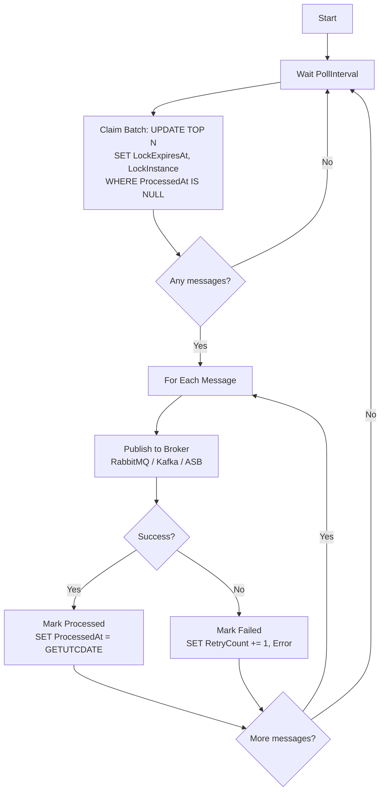

# 8.887 — Outbox Pattern — Polling Publisher in .NET

## 1. Overview — What and Why

The Outbox pattern solves the dual-write problem by persisting messages in the same database transaction as business data. However, persisting the message is only half the solution — the message must still be delivered to the message broker. The **Polling Publisher** is the background service that reads unpublished messages from the outbox table, sends them to the broker, and marks them as processed.

The polling publisher runs as an `IHostedService` (or `BackgroundService`) in the same process as the application, or as a dedicated microservice. It polls the outbox table on a configurable interval, processes unprocessed messages in batches, and handles failures with retries and dead-letter logic.

This note covers two implementations: a **Dapper-based publisher** (max performance, minimal overhead, full SQL control) and an **EF Core-based publisher** (easier to integrate with existing DbContext patterns, better for teams already using EF Core heavily).

## 2. Problem Statement — Messages Are Stuck in the Outbox

After implementing the outbox table and writing business data + outbox messages in a single transaction (see [[8.886 — Outbox Pattern — Database Implementation]]), the messages sit in the database with `ProcessedAt IS NULL`. They need to be:

1. **Read** from the database efficiently — without missing messages and without double-processing.
2. **Published** to the message broker — with proper error handling, retries, and idempotency.
3. **Marked as processed** — or moved to a dead-letter state if delivery permanently fails.
4. **Scaled** across multiple service instances — without duplicate processing.

A naive implementation (e.g., polling every second with `SELECT * FROM OutboxMessages WHERE ProcessedAt IS NULL`) will fail under load: it misses messages inserted during the poll, re-reads already-locked messages, and offers no concurrency safety in multi-instance deployments.

## 3. Solution Architecture — Polling Publisher

The polling publisher is a loop that runs on a timer. Each iteration:

1. **Claims** a batch of unpublished messages using a locking mechanism (UPDLOCK + READPAST).
2. **Publishes** each message to the message broker.
3. **Marks** each message as processed on success, or increments the retry count on failure.

```
┌──────────────────────────────────────────────────────────────────────────────┐
│                         Polling Publisher (Loop)                              │
│                                                                               │
│  ┌──────────────┐    ┌──────────────────────┐    ┌──────────────────────┐   │
│  │   Wait for    │    │   Claim Next Batch    │    │   For Each Message   │   │
│  │   PollInterval│───>│  (UPDLOCK + READPAST) │───>│  Publish to Broker   │   │
│  └──────────────┘    └──────────────────────┘    └──────────┬───────────┘   │
│                                                              │                │
│                                          ┌───────────────────┼────────────┐  │
│                                          │     Success        │  Failure   │  │
│                                          ▼                   ▼            │  │
│                                   ┌──────────────┐   ┌──────────────┐     │  │
│                                   │ MarkProcessed │   │ MarkFailed   │     │  │
│                                   │ (ProcessedAt) │   │ (RetryCount) │     │  │
│                                   └──────────────┘   └──────────────┘     │  │
│                                                                           │  │
└───────────────────────────────────────────────────────────────────────────┘  │
                                                                               │
                    ┌──────────────────────┐    ┌──────────────────────┐       │
                    │      Database         │    │   Message Broker     │       │
                    │  OutboxMessages Table │    │  (RabbitMQ, Kafka,   │       │
                    │  PublisherLock Table  │    │   Azure Service Bus) │       │
                    └──────────────────────┘    └──────────────────────┘       │
```

## 4. Database Schema — Publisher-Specific Additions

The core outbox schema is defined in [[8.886 — Outbox Pattern — Database Implementation]]. The polling publisher needs a few additional structures for safe concurrent processing.

### 4.1 Publisher Lock Table (Optional — for Lease-Based Instances)

```sql
-- ============================================================
-- Polling Publisher — Instance Lease Table
-- ============================================================

CREATE TABLE [Messaging].[PublisherLeases] (
    [Id]              NVARCHAR(100)   NOT NULL,  -- Unique publisher name, e.g. "Publisher-1"
    [MachineName]     NVARCHAR(256)   NOT NULL,
    [ProcessId]       INT             NOT NULL,
    [AcquiredAt]      DATETIME2(7)    NOT NULL,
    [ExpiresAt]       DATETIME2(7)    NOT NULL,
    [LastHeartbeatAt] DATETIME2(7)    NOT NULL,
    [IsActive]        BIT             NOT NULL CONSTRAINT [DF_PublisherLeases_IsActive] DEFAULT (1),

    CONSTRAINT [PK_PublisherLeases] PRIMARY KEY CLUSTERED ([Id])
);
GO

-- Renew lease (heartbeat)
CREATE OR ALTER PROCEDURE [Messaging].[RenewPublisherLease]
    @Id             NVARCHAR(100),
    @HeartbeatAt    DATETIME2(7),
    @LeaseDurationSec INT = 30
AS
BEGIN
    SET NOCOUNT ON;

    UPDATE [Messaging].[PublisherLeases]
    SET
        [LastHeartbeatAt] = @HeartbeatAt,
        [ExpiresAt] = DATEADD(SECOND, @LeaseDurationSec, @HeartbeatAt)
    WHERE [Id] = @Id;

    IF @@ROWCOUNT = 0
    BEGIN
        INSERT INTO [Messaging].[PublisherLeases]
            ([Id], [MachineName], [ProcessId], [AcquiredAt], [ExpiresAt],
             [LastHeartbeatAt], [IsActive])
        VALUES
            (@Id, HOST_NAME(), @@SPID, @HeartbeatAt,
             DATEADD(SECOND, @LeaseDurationSec, @HeartbeatAt),
             @HeartbeatAt, 1);
    END;
END;
GO
```

### 4.2 Fetch Unpublished Messages (Optimized for Polling)

```sql
-- ============================================================
-- Polling Publisher — Fetch and Lock Messages Atomically
-- ============================================================

CREATE OR ALTER PROCEDURE [Messaging].[PollForUnpublishedMessages]
    @BatchSize      INT = 50,
    @PublisherId    NVARCHAR(100) = 'Publisher-Default',
    @LockDurationMs INT = 30000
AS
BEGIN
    SET NOCOUNT ON;

    -- Table variable to capture locked message IDs
    DECLARE @LockedIds TABLE (Id UNIQUEIDENTIFIER);

    -- Atomically claim messages using UPDATE with OUTPUT
    UPDATE TOP (@BatchSize) [Messaging].[OutboxMessages]
    SET
        [LockExpiresAt] = DATEADD(MILLISECOND, @LockDurationMs, SYSUTCDATETIME()),
        [LockInstance]  = @PublisherId
    OUTPUT INSERTED.Id INTO @LockedIds
    WHERE [ProcessedAt] IS NULL
      AND ([LockExpiresAt] IS NULL OR [LockExpiresAt] < SYSUTCDATETIME())
      AND ([Error] IS NULL OR [RetryCount] < [MaxRetries])
      AND ([LockInstance] IS NULL OR [LockInstance] = @PublisherId);

    -- Return the locked messages
    SELECT
        [Id],
        [Type],
        [Content],
        [ContentType],
        [CorrelationId],
        [AggregateId],
        [AggregateType],
        [CreatedAt],
        [RetryCount],
        [MaxRetries]
    FROM [Messaging].[OutboxMessages]
    WHERE [Id] IN (SELECT Id FROM @LockedIds)
    ORDER BY [CreatedAt];
END;
GO
```

### 4.3 Mark Message Processed

```sql
-- ============================================================
-- Polling Publisher — Mark Message Processed
-- ============================================================

CREATE OR ALTER PROCEDURE [Messaging].[MarkMessagePublished]
    @Id UNIQUEIDENTIFIER
AS
BEGIN
    SET NOCOUNT ON;

    UPDATE [Messaging].[OutboxMessages]
    SET
        [ProcessedAt]  = SYSUTCDATETIME(),
        [LockExpiresAt] = NULL,
        [LockInstance]  = NULL,
        [Error]         = NULL,  -- Clear any previous error
        [RetryCount]    = 0      -- Reset for monitoring
    WHERE [Id] = @Id;
END;
GO

-- Mark message as failed (increment retry, release lock)
CREATE OR ALTER PROCEDURE [Messaging].[MarkMessageFailed]
    @Id       UNIQUEIDENTIFIER,
    @Error    NVARCHAR(MAX),
    @IsFatal  BIT = 0
AS
BEGIN
    SET NOCOUNT ON;

    IF @IsFatal = 1
    BEGIN
        -- Permanent failure — keep error, stop retrying
        UPDATE [Messaging].[OutboxMessages]
        SET
            [Error]        = @Error,
            [RetryCount]   = [MaxRetries],  -- Force dead-letter
            [LockExpiresAt] = NULL,
            [LockInstance]  = NULL
        WHERE [Id] = @Id;
    END
    ELSE
    BEGIN
        UPDATE [Messaging].[OutboxMessages]
        SET
            [Error]        = @Error,
            [RetryCount]   = [RetryCount] + 1,
            [LockExpiresAt] = NULL,
            [LockInstance]  = NULL
        WHERE [Id] = @Id;
    END;
END;
GO
```

### 4.4 Dead Letter Query

```sql
-- ============================================================
-- Polling Publisher — Dead Letter Monitoring
-- ============================================================

CREATE OR ALTER VIEW [Messaging].[vw_DeadLetterMessages]
AS
SELECT
    [Id],
    [Type],
    [Content],
    [CorrelationId],
    [AggregateId],
    [AggregateType],
    [CreatedAt],
    [Error],
    [RetryCount],
    [MaxRetries],
    DATEDIFF(HOUR, [CreatedAt], SYSUTCDATETIME()) AS AgeHours
FROM [Messaging].[OutboxMessages]
WHERE [Error] IS NOT NULL
  AND [RetryCount] >= [MaxRetries]
  AND [ProcessedAt] IS NULL;
GO

-- Count dead letters by type
CREATE OR ALTER PROCEDURE [Messaging].[GetDeadLetterSummary]
AS
BEGIN
    SET NOCOUNT ON;

    SELECT
        [Type],
        COUNT_BIG(*) AS DeadLetterCount,
        MIN([CreatedAt]) AS OldestMessage,
        MAX([CreatedAt]) AS NewestMessage
    FROM [Messaging].[vw_DeadLetterMessages]
    GROUP BY [Type]
    ORDER BY DeadLetterCount DESC;
END;
GO
```

## 5. Implementation — Dapper Polling Publisher

### 5.1 Dapper OutboxMessage DTO

```csharp
// ============================================================
// Polling Publisher — Dapper OutboxMessage DTO
// ============================================================

namespace Infrastructure.Outbox.Dapper;

public sealed class OutboxMessageDto
{
    public Guid Id { get; init; }
    public string Type { get; init; } = string.Empty;
    public string Content { get; init; } = string.Empty;
    public string ContentType { get; init; } = "application/json";
    public Guid? CorrelationId { get; init; }
    public string? AggregateId { get; init; }
    public string? AggregateType { get; init; }
    public DateTime CreatedAt { get; init; }
    public int RetryCount { get; init; }
    public int MaxRetries { get; init; }
}
```

### 5.2 Dapper Polling Publisher — Background Service

```csharp
// ============================================================
// Polling Publisher — Dapper Implementation (BackgroundService)
// ============================================================

namespace Infrastructure.Outbox.Dapper;

using System.Data;
using System.Text.Json;
using Dapper;
using Microsoft.Data.SqlClient;
using Microsoft.Extensions.DependencyInjection;
using Microsoft.Extensions.Hosting;
using Microsoft.Extensions.Logging;
using Microsoft.Extensions.Options;

public sealed class DapperOutboxPublisher : BackgroundService
{
    private readonly string _connectionString;
    private readonly string _publisherId;
    private readonly OutboxPublisherOptions _options;
    private readonly ILogger<DapperOutboxPublisher> _logger;
    private readonly IServiceScopeFactory _scopeFactory;

    public DapperOutboxPublisher(
        IOptions<OutboxPublisherOptions> options,
        ILogger<DapperOutboxPublisher> logger,
        IServiceScopeFactory scopeFactory)
    {
        _options = options.Value;
        _connectionString = _options.ConnectionString;
        _publisherId = $"{_options.PublisherPrefix}-{Environment.MachineName}-{Environment.ProcessId}";
        _logger = logger;
        _scopeFactory = scopeFactory;
    }

    protected override async Task ExecuteAsync(CancellationToken stoppingToken)
    {
        _logger.LogInformation(
            "Outbox publisher '{PublisherId}' started. Poll interval: {Interval}ms, Batch size: {BatchSize}",
            _publisherId, _options.PollIntervalMs, _options.BatchSize);

        // Delay initial poll to let the application warm up
        await Task.Delay(_options.StartupDelayMs, stoppingToken);

        while (!stoppingToken.IsCancellationRequested)
        {
            try
            {
                await ProcessBatchAsync(stoppingToken);
            }
            catch (OperationCanceledException) when (stoppingToken.IsCancellationRequested)
            {
                break;
            }
            catch (Exception ex)
            {
                _logger.LogError(ex, "Unhandled error in outbox publisher loop");
            }

            await Task.Delay(_options.PollIntervalMs, stoppingToken);
        }

        _logger.LogInformation("Outbox publisher '{PublisherId}' stopped.", _publisherId);
    }

    private async Task ProcessBatchAsync(CancellationToken ct)
    {
        using var db = new SqlConnection(_connectionString);
        await db.OpenAsync(ct);

        // 1. Claim a batch of messages
        var messages = (await db.QueryAsync<OutboxMessageDto>(
            "[Messaging].[PollForUnpublishedMessages]",
            new
            {
                BatchSize = _options.BatchSize,
                PublisherId = _publisherId,
                LockDurationMs = _options.LockDurationMs
            },
            commandType: CommandType.StoredProcedure,
            commandTimeout: _options.CommandTimeoutSeconds))
            .AsList();

        if (messages.Count == 0)
            return;

        _logger.LogDebug("Claimed {Count} outbox messages for publishing", messages.Count);

        // 2. Resolve the message publisher once per batch (from DI)
        using var scope = _scopeFactory.CreateScope();
        var publisher = scope.ServiceProvider.GetRequiredService<IMessagePublisher>();

        foreach (var message in messages)
        {
            try
            {
                // 3. Deserialize and publish
                var messageType = Type.GetType(message.Type);
                if (messageType is null)
                {
                    _logger.LogWarning("Cannot resolve message type '{Type}'. Marking as failed.", message.Type);
                    await MarkFailedAsync(db, message.Id,
                        $"Unknown type: {message.Type}", isFatal: true, ct);
                    continue;
                }

                var payload = JsonSerializer.Deserialize(message.Content, messageType);
                if (payload is null)
                {
                    await MarkFailedAsync(db, message.Id,
                        "Deserialization returned null", isFatal: true, ct);
                    continue;
                }

                await publisher.PublishAsync(payload, ct);

                // 4. Mark as processed
                await MarkProcessedAsync(db, message.Id, ct);

                _logger.LogDebug("Published outbox message {Id} of type {Type}", message.Id, message.Type);
            }
            catch (Exception ex)
            {
                _logger.LogWarning(ex,
                    "Failed to publish outbox message {Id} of type {Type}. Retry count: {Retry}/{MaxRetry}",
                    message.Id, message.Type, message.RetryCount + 1, message.MaxRetries);

                // Check if this is a fatal/unrecoverable error
                var isFatal = IsFatalError(ex);
                await MarkFailedAsync(db, message.Id, ex.Message, isFatal, ct);

                if (isFatal || message.RetryCount + 1 >= message.MaxRetries)
                {
                    _logger.LogError("Message {Id} moved to dead-letter (retries exhausted or fatal error).", message.Id);
                }
            }
        }
    }

    private static async Task MarkProcessedAsync(
        SqlConnection db, Guid messageId, CancellationToken ct)
    {
        await db.ExecuteAsync(
            "[Messaging].[MarkMessagePublished]",
            new { Id = messageId },
            commandType: CommandType.StoredProcedure,
            commandTimeout: 10,
            cancellationToken: ct);
    }

    private static async Task MarkFailedAsync(
        SqlConnection db, Guid messageId, string error, bool isFatal, CancellationToken ct)
    {
        await db.ExecuteAsync(
            "[Messaging].[MarkMessageFailed]",
            new { Id = messageId, Error = error, IsFatal = isFatal ? 1 : 0 },
            commandType: CommandType.StoredProcedure,
            commandTimeout: 10,
            cancellationToken: ct);
    }

    private static bool IsFatalError(Exception ex)
    {
        return ex is JsonException               // Cannot deserialize
            or ArgumentNullException             // Missing required data
            or InvalidOperationException;        // Invalid state
        // Network timeouts and broker unavailability are NOT fatal — they warrant retry
    }
}

// Message publisher abstraction
public interface IMessagePublisher
{
    Task PublishAsync(object message, CancellationToken ct = default);
}

// Options
public sealed class OutboxPublisherOptions
{
    public const string SectionName = "OutboxPublisher";

    public string ConnectionString { get; set; } = string.Empty;
    public string PublisherPrefix { get; set; } = "OutboxPub";
    public int PollIntervalMs { get; set; } = 2000;
    public int BatchSize { get; set; } = 50;
    public int LockDurationMs { get; set; } = 30000;
    public int CommandTimeoutSeconds { get; set; } = 30;
    public int StartupDelayMs { get; set; } = 5000;
}
```

### 5.3 Dapper Publisher — RabbitMQ Implementation

```csharp
// ============================================================
// Polling Publisher — RabbitMQ Publisher (Dapper Example)
// ============================================================

namespace Infrastructure.Outbox.Dapper.Publishers;

using System.Text;
using System.Text.Json;
using Infrastructure.Outbox.Dapper;
using Microsoft.Extensions.Logging;
using RabbitMQ.Client;

public sealed class RabbitMqMessagePublisher : IMessagePublisher
{
    private readonly IModel _channel;
    private readonly string _exchangeName;
    private readonly ILogger<RabbitMqMessagePublisher> _logger;

    public RabbitMqMessagePublisher(
        IConnection connection,
        IOptions<RabbitMqOptions> options,
        ILogger<RabbitMqMessagePublisher> logger)
    {
        _channel = connection.CreateModel();
        _exchangeName = options.Value.ExchangeName;
        _logger = logger;
    }

    public Task PublishAsync(object message, CancellationToken ct = default)
    {
        var routingKey = message.GetType().Name;
        var body = Encoding.UTF8.GetBytes(JsonSerializer.Serialize(message));

        var properties = _channel.CreateBasicProperties();
        properties.Persistent = true;
        properties.ContentType = "application/json";
        properties.MessageId = Guid.NewGuid().ToString();
        properties.Timestamp = new AmqpTimestamp(
            DateTimeOffset.UtcNow.ToUnixTimeSeconds());

        _channel.BasicPublish(
            exchange: _exchangeName,
            routingKey: routingKey,
            mandatory: true,
            basicProperties: properties,
            body: body);

        return Task.CompletedTask;
    }

    public void Dispose()
    {
        _channel?.Close();
        _channel?.Dispose();
    }
}

public sealed class RabbitMqOptions
{
    public string HostName { get; set; } = "localhost";
    public string ExchangeName { get; set; } = "outbox.exchange";
    public string UserName { get; set; } = "guest";
    public string Password { get; set; } = "guest";
}
```

### 5.4 Dapper Publisher — Azure Service Bus Implementation

```csharp
// ============================================================
// Polling Publisher — Azure Service Bus Publisher
// ============================================================

namespace Infrastructure.Outbox.Dapper.Publishers;

using System.Text.Json;
using Azure.Messaging.ServiceBus;
using Infrastructure.Outbox.Dapper;
using Microsoft.Extensions.Logging;
using Microsoft.Extensions.Options;

public sealed class AzureServiceBusMessagePublisher : IMessagePublisher, IAsyncDisposable
{
    private readonly ServiceBusSender _sender;
    private readonly ILogger<AzureServiceBusMessagePublisher> _logger;

    public AzureServiceBusMessagePublisher(
        IOptions<AzureServiceBusOptions> options,
        ILogger<AzureServiceBusMessagePublisher> logger)
    {
        var client = new ServiceBusClient(options.Value.ConnectionString);
        _sender = client.CreateSender(options.Value.QueueOrTopicName);
        _logger = logger;
    }

    public async Task PublishAsync(object message, CancellationToken ct = default)
    {
        var serviceBusMessage = new ServiceBusMessage(
            BinaryData.FromObjectAsJson(message))
        {
            MessageId = Guid.NewGuid().ToString(),
            ContentType = "application/json",
            Subject = message.GetType().Name
        };

        await _sender.SendMessageAsync(serviceBusMessage, ct);

        _logger.LogDebug("Published message {MessageId} of type {Type} to Azure Service Bus",
            serviceBusMessage.MessageId, message.GetType().Name);
    }

    public async ValueTask DisposeAsync()
    {
        await _sender.DisposeAsync();
    }
}

public sealed class AzureServiceBusOptions
{
    public string ConnectionString { get; set; } = string.Empty;
    public string QueueOrTopicName { get; set; } = "outbox";
}
```

## 6. Implementation — EF Core Polling Publisher

### 6.1 EF Core OutboxMessage Entity (Reproduced from 8.886)

```csharp
// ============================================================
// Polling Publisher — EF Core OutboxMessage (Reference)
// ============================================================

// The OutboxMessage entity and its configuration are defined in note 8.886.
// Key properties used by the publisher:
//
//   - Id (Guid, PK)
//   - Type (string) — Full type name for deserialization
//   - Content (string) — JSON payload
//   - ProcessedAt (DateTime?) — NULL = not processed
//   - Error (string?) — Failure message
//   - RetryCount (int) — Number of attempts so far
//   - MaxRetries (int) — Maximum attempts before dead letter
//   - LockExpiresAt (DateTime?) — Lease expiration for multi-instance
//   - LockInstance (string?) — Which publisher holds the lease
```

### 6.2 EF Core Polling Publisher — Background Service

```csharp
// ============================================================
// Polling Publisher — EF Core Implementation (BackgroundService)
// ============================================================

namespace Infrastructure.Outbox.EntityFrameworkCore;

using System.Text.Json;
using Domain.Messaging;
using Infrastructure.Data;
using Microsoft.EntityFrameworkCore;
using Microsoft.Extensions.DependencyInjection;
using Microsoft.Extensions.Hosting;
using Microsoft.Extensions.Logging;
using Microsoft.Extensions.Options;

public sealed class EfCoreOutboxPublisher : BackgroundService
{
    private readonly IServiceScopeFactory _scopeFactory;
    private readonly OutboxPublisherOptions _options;
    private readonly ILogger<EfCoreOutboxPublisher> _logger;
    private readonly string _publisherId;

    public EfCoreOutboxPublisher(
        IServiceScopeFactory scopeFactory,
        IOptions<OutboxPublisherOptions> options,
        ILogger<EfCoreOutboxPublisher> logger)
    {
        _scopeFactory = scopeFactory;
        _options = options.Value;
        _logger = logger;
        _publisherId = $"{_options.PublisherPrefix}-{Environment.MachineName}-{Environment.ProcessId}";
    }

    protected override async Task ExecuteAsync(CancellationToken stoppingToken)
    {
        _logger.LogInformation(
            "EF Core Outbox publisher '{PublisherId}' started. Interval: {Interval}ms",
            _publisherId, _options.PollIntervalMs);

        await Task.Delay(_options.StartupDelayMs, stoppingToken);

        while (!stoppingToken.IsCancellationRequested)
        {
            try
            {
                await ProcessBatchAsync(stoppingToken);
            }
            catch (OperationCanceledException) when (stoppingToken.IsCancellationRequested)
            {
                break;
            }
            catch (Exception ex)
            {
                _logger.LogError(ex, "Unhandled error in EF Core outbox publisher");
            }

            await Task.Delay(_options.PollIntervalMs, stoppingToken);
        }
    }

    private async Task ProcessBatchAsync(CancellationToken ct)
    {
        using var scope = _scopeFactory.CreateScope();
        var context = scope.ServiceProvider.GetRequiredService<SalesDbContext>();
        var publisher = scope.ServiceProvider.GetRequiredService<IMessagePublisher>();

        // 1. Fetch unpublished messages using raw SQL for locking hints
        // EF Core does not support UPDLOCK/READPAST natively, so we use
        // ExecuteSqlRaw for the claim step and then load entities.
        var lockExpiryThreshold = DateTime.UtcNow;

        var messageIds = await context.Database
            .SqlQueryRaw<Guid>(@"
                UPDATE TOP (@BatchSize) [Messaging].[OutboxMessages]
                SET
                    [LockExpiresAt] = DATEADD(MILLISECOND, @LockDurationMs, SYSUTCDATETIME()),
                    [LockInstance] = @PublisherId
                OUTPUT INSERTED.Id
                WHERE [ProcessedAt] IS NULL
                  AND ([LockExpiresAt] IS NULL OR [LockExpiresAt] < SYSUTCDATETIME())
                  AND ([Error] IS NULL OR [RetryCount] < [MaxRetries])
                  AND ([LockInstance] IS NULL OR [LockInstance] = @PublisherId);",
                new SqlParameter("@BatchSize", _options.BatchSize),
                new SqlParameter("@LockDurationMs", _options.LockDurationMs),
                new SqlParameter("@PublisherId", _publisherId))
            .ToListAsync(ct);

        if (messageIds.Count == 0)
            return;

        _logger.LogDebug("Claimed {Count} messages via EF Core publisher", messageIds.Count);

        // 2. Load the full entities
        var messages = await context.Set<OutboxMessage>()
            .Where(m => messageIds.Contains(m.Id))
            .OrderBy(m => m.CreatedAt)
            .ToListAsync(ct);

        // 3. Process each message
        foreach (var message in messages)
        {
            try
            {
                var messageType = Type.GetType(message.Type);
                if (messageType is null)
                {
                    _logger.LogWarning("Cannot resolve type '{Type}' for message {Id}.", message.Type, message.Id);
                    message.MarkFailed($"Unknown type: {message.Type}");
                    continue;
                }

                var payload = JsonSerializer.Deserialize(message.Content, messageType);
                if (payload is null)
                {
                    message.MarkFailed("Deserialization returned null");
                    continue;
                }

                await publisher.PublishAsync(payload, ct);
                message.MarkProcessed();

                _logger.LogDebug("EF Core published message {Id} of type {Type}", message.Id, message.Type);
            }
            catch (Exception ex)
            {
                _logger.LogWarning(ex,
                    "EF Core failed to publish message {Id}. Retry {Retry}/{MaxRetry}",
                    message.Id, message.RetryCount + 1, message.MaxRetries);

                message.MarkFailed(ex.Message);
            }
        }

        // 4. Save all changes in one batch
        await context.SaveChangesAsync(ct);
    }
}
```

### 6.3 EF Core Publisher with Separate DbContext for Reads

```csharp
// ============================================================
// Polling Publisher — EF Core with Dedicated Read Context
// ============================================================

// Using the same DbContext for both business operations and outbox polling
// can cause contention. A dedicated context for the publisher avoids this.

namespace Infrastructure.Outbox.EntityFrameworkCore;

using Domain.Messaging;
using Microsoft.EntityFrameworkCore;
using Microsoft.Extensions.Logging;

public sealed class DedicatedOutboxDbContext : DbContext
{
    public DedicatedOutboxDbContext(DbContextOptions<DedicatedOutboxDbContext> options)
        : base(options) { }

    public DbSet<OutboxMessage> OutboxMessages => Set<OutboxMessage>();

    protected override void OnModelCreating(ModelBuilder modelBuilder)
    {
        // Apply the same configuration as SalesDbContext for OutboxMessage
        modelBuilder.Entity<OutboxMessage>(entity =>
        {
            entity.ToTable("OutboxMessages", "Messaging");
            entity.HasKey(e => e.Id);
            entity.Property(e => e.Type).IsRequired().HasMaxLength(500);
            entity.Property(e => e.Content).IsRequired();
            entity.Property(e => e.ContentType).IsRequired().HasMaxLength(100);
            entity.Property(e => e.CreatedAt).IsRequired();
            entity.Property(e => e.RetryCount).IsRequired();
            entity.Property(e => e.MaxRetries).IsRequired();
            entity.Ignore(e => e.IsProcessed);
            entity.Ignore(e => e.IsDeadLetter);
        });

        base.OnModelCreating(modelBuilder);
    }
}

// Usage in the publisher:
// Replace SalesDbContext with DedicatedOutboxDbContext in the ProcessBatchAsync method.
// This avoids flushing any tracked changes in the business context.
```

### 6.4 Publisher Registration in DI

```csharp
// ============================================================
// Polling Publisher — Dependency Injection Registration
// ============================================================

// Program.cs or Startup.cs

// Dapper publisher:
builder.Services.AddHostedService<DapperOutboxPublisher>();
builder.Services.AddSingleton<IMessagePublisher, RabbitMqMessagePublisher>();
builder.Services.Configure<OutboxPublisherOptions>(
    builder.Configuration.GetSection(OutboxPublisherOptions.SectionName));

// EF Core publisher (choose one):
builder.Services.AddHostedService<EfCoreOutboxPublisher>();
builder.Services.AddSingleton<IMessagePublisher, AzureServiceBusMessagePublisher>();

// For the EF Core publisher, ensure the DbContext is registered:
builder.Services.AddDbContext<SalesDbContext>(options =>
    options.UseSqlServer(builder.Configuration.GetConnectionString("SalesDb")));

// Or for the dedicated outbox context:
builder.Services.AddDbContext<DedicatedOutboxDbContext>(options =>
    options.UseSqlServer(builder.Configuration.GetConnectionString("SalesDb")));

// Monitoring: register a health check for the publisher
builder.Services.AddHealthChecks()
    .AddDbContextCheck<SalesDbContext>("outbox-db")
    .AddRabbitMQ(
        builder.Configuration.GetConnectionString("RabbitMQ"),
        name: "outbox-broker");
```

## 7. Comparison — Dapper vs EF Core Polling Publisher

| Aspect | Dapper Publisher | EF Core Publisher |
|--------|-----------------|-------------------|
| Locking mechanism | Full control via `UPDLOCK, READPAST` in SQL | Requires raw SQL for locking; LINQ cannot express these hints |
| Performance | Minimal overhead — fastest possible read/claim cycle | Slower due to change tracking and materialization |
| Batching | Natural — uses `TOP N` and TVPs | More complex — must use raw SQL or `AddRange` |
| Transaction management | Explicit — use same transaction for claim and mark | Implicit — `SaveChangesAsync` manages the transaction |
| Error handling | Manual — per-message try/catch with stored procedures | Manual — similar pattern but via EF entity methods |
| Code readability | Raw SQL strings interleaved with C# | LINQ queries are more readable, but locking requires raw SQL escape hatch |
| Best for | High-throughput, low-latency, multi-instance deployments | Teams standardized on EF Core, moderate throughput, simpler setup |

## 8. Gotchas — Pitfalls and Mitigations

### 8.1 Duplicate Publishing

The most common problem: a publisher fetches messages, publishes them to the broker, but crashes before marking them as processed. On restart (or by another instance), the same messages are fetched and published again.

**Mitigation**:
- Make consumers idempotent using the Inbox pattern (see [[8.888 — Inbox Pattern — Deduplication Table]]).
- Reduce the gap between publish and mark-processed by using the same transaction when possible.
- Accept duplicates as inherent to at-least-once delivery.

### 8.2 Polling Interval Tuning

Too frequent polling wastes CPU and database resources. Too infrequent polling increases the delay between message creation and delivery.

**Mitigation**:
- Start with 1–2 seconds for most applications. Tune based on throughput and latency requirements.
- Use exponential backoff when no messages are found (e.g., start at 500ms, double up to 10s, reset when messages appear).
- Monitor `OutboxMessageAge` metric — the time between `CreatedAt` and `ProcessedAt`.

### 8.3 Transactional vs Non-Transactional Publishing

If the publisher marks a message as processed in a separate transaction from publishing to the broker, a crash between the two leaves a processed-but-not-published gap (message loss).

**Mitigation**:
- Use the **same transaction** for publishing and marking. For RabbitMQ, this is impossible (different systems). For Kafka, you can commit offsets alongside the DB transaction.
- Accept the trade-off: the outbox gives at-least-once delivery, not exactly-once. Message loss is possible if the publisher crashes after a non-transactional mark.
- Use the Inbox pattern on the consumer side as a second layer of reliability.

### 8.4 Dead Letter Handling

Messages that continuously fail to publish block the queue and waste resources.

**Mitigation**:
- Implement `MaxRetries` (typically 3–5) per message.
- After the limit, stop retrying and alert.
- Schedule a periodic job to retry dead letters (e.g., reset `RetryCount` after 24 hours).
- Use a separate monitoring dashboard for dead letters (see `vw_DeadLetterMessages` view).

### 8.5 Message Ordering Across Partitions

When using multiple publisher instances, messages from the same aggregate might be processed out of order.

**Mitigation**:
- Route all messages for the same aggregate (same `AggregateId`) to the same publisher instance using consistent hashing.
- Use a single publisher instance if ordering is critical.
- Accept that outbox provides best-effort ordering and design consumers accordingly.

### 8.6 Connection Pool Exhaustion

Each publisher instance opens a new connection for polling. With long-running polls or high batch counts, connection pool exhaustion is possible.

**Mitigation**:
- Use a dedicated connection string for the publisher with a larger pool size.
- Open connections briefly — fetch, publish, mark, close.
- Consider using a dedicated publisher service outside the web application.

### 8.7 Large Batches and Memory Pressure

Fetching hundreds or thousands of messages in a single batch can cause high memory usage.

**Mitigation**:
- Keep batch sizes reasonable (50–100 messages).
- Process messages in a streaming fashion rather than loading all into memory.
- Use `SqlDataReader` with Dapper's `QueryUnbufferedAsync` for very large batches.

### 8.8 Startup Race Condition

If the publisher starts before EF Core migrations have run, the outbox table might not exist yet.

**Mitigation**:
- Add a startup health check that waits for the database schema to be ready.
- Use a retry loop in the publisher with a delay before the first poll.
- Run migrations as part of the deployment pipeline, not at application startup.

## 9. Related Notes

- [[8.886 — Outbox Pattern — Database Implementation]] — The outbox table and write-side integration
- [[8.888 — Inbox Pattern — Deduplication Table]] — Consumer-side idempotency
- [[8.885 — CQRS at Database Level — Read and Write Models]] — Read/write separation
- [[8.883 — Unit of Work Pattern — Transaction Boundary]] — Transaction management
- [[7.420 — Outbox Pattern — Transactional Outbox]] — Architectural overview

---

**Diagram: Polling Publisher Loop**



**Key takeaway**: The polling publisher is the delivery mechanism that completes the outbox pattern. Use Dapper for maximum performance and locking control; use EF Core for consistency with your existing data layer. Either way, design for at-least-once delivery and make consumers idempotent.
