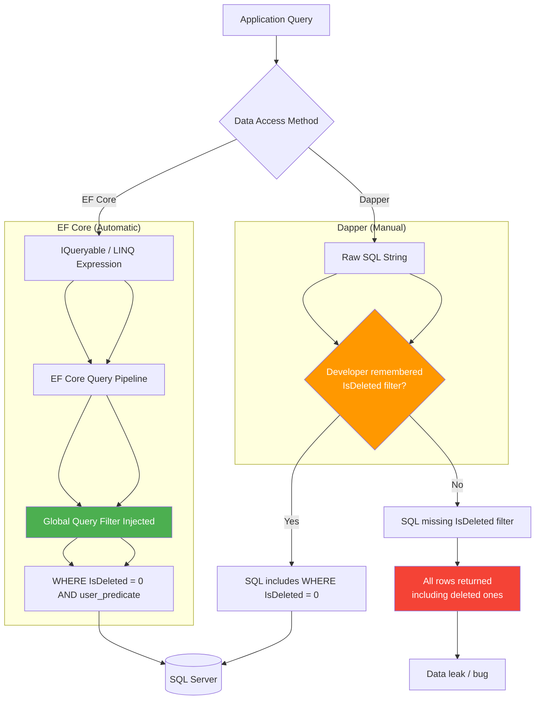

# Soft Delete — Global Query Filter in EF Core

## 1. Overview — What Is Soft Delete

Soft delete is a data persistence pattern where records are marked as deleted rather than physically removed from the database. A boolean column (typically `IsDeleted` or `DeletedAt`) is set to `true` when the user or system performs a delete operation. All subsequent queries must filter out these logically deleted rows so that the application behaves as though the rows no longer exist.

The primary motivations for soft delete are:

- **Audit and recovery** — accidentally deleted data can be restored by flipping the flag back to `false`.
- **Referential integrity** — child records that reference a soft-deleted parent remain valid, avoiding cascade delete storms.
- **Compliance** — regulations such as GDPR may require data retention for a defined period; soft delete enables a grace window before permanent purge.
- **Historical reporting** — reports that need to include "deleted" records (e.g., a former employee's past orders) can query without the filter.

The trade-off is that every query against a soft-deletable entity must include a `WHERE IsDeleted = 0` clause (or the equivalent). Forgetting this filter is the number-one source of data-leak bugs in soft-delete systems.

Entity Framework Core 2.0+ introduced **global query filters**, which are LINQ predicates applied automatically to every LINQ query that touches a given entity type. This eliminates the risk of forgetting the `IsDeleted` filter at the query site. The filter is declared once in `OnModelCreating` via `HasQueryFilter` and is silently injected into every `WHERE` clause generated by EF Core.

```sql
-- Without soft delete: physical DELETE
DELETE FROM Orders WHERE Id = 1001;

-- With soft delete: logical delete
UPDATE Orders SET IsDeleted = 1, DeletedAt = GETUTCDATE() WHERE Id = 1001;

-- Every query must exclude soft-deleted rows
SELECT Id, CustomerId, OrderDate, Total
FROM Orders
WHERE IsDeleted = 0
  AND CustomerId = @customerId;
```

Dapper has no equivalent of global query filters. Every Dapper query is raw SQL or a hand-written command, so the developer must remember to append `AND IsDeleted = 0` (or `WHERE IsDeleted = 0`) to every `SELECT`, `UPDATE`, and `DELETE` statement. This is the central difference this note explores: **EF Core automates the filter; Dapper requires discipline.**

### 1.1 When to Use Soft Delete vs Physical Delete

| Criterion | Soft Delete | Physical Delete |
|---|---|---|
| Data recovery | Easy (set IsDeleted = 0) | Need backup restore |
| Query performance | Additional WHERE clause | No extra predicate |
| Disk space | Grows over time (need purge job) | Freed immediately |
| Compliance (GDPR right to erasure) | Must implement permanent purge | Satisfied directly |
| Unique constraints | Conflict with deleted rows | No conflict |
| Reporting on historical data | Include IsDeleted = 1 rows | Impossible |

### 1.2 Common Alternatives

- **DeletedAt timestamp** — use a nullable `DateTime` column instead of a boolean. `NULL` means active; a value means deleted at that time. This carries more information but requires `WHERE DeletedAt IS NULL`.
- **Archival table** — move deleted rows to an `Orders_Archive` table via a trigger or background job. Keeps the main table small but complicates query logic.
- **Soft delete with tombstone** — keep a separate `DeletionLog` table that records the PKs of deleted rows. The main table is physically deleted. Useful for GDPR compliance when full audit is required.

---

## 2. Section 2 — EF Core Implementation: HasQueryFilter on IsDeleted

The EF Core approach uses `HasQueryFilter` inside `OnModelCreating`. This method accepts a `LambdaExpression` that represents a predicate applied to all queries of that entity type. EF Core translates this expression into SQL `WHERE` clauses automatically.

### 2.1 Entity Configuration

Every entity that supports soft delete implements an interface or a base class:

```csharp
public interface ISoftDeletable
{
    bool IsDeleted { get; set; }
    DateTime? DeletedAt { get; set; }
}

public class Order : ISoftDeletable
{
    public int Id { get; set; }
    public string CustomerId { get; set; } = string.Empty;
    public DateTime OrderDate { get; set; }
    public decimal Total { get; set; }
    public bool IsDeleted { get; set; }
    public DateTime? DeletedAt { get; set; }

    // Navigation properties
    public ICollection<OrderLine> Lines { get; set; } = new List<OrderLine>();
}

public class Customer : ISoftDeletable
{
    public int Id { get; set; }
    public string Name { get; set; } = string.Empty;
    public string Email { get; set; } = string.Empty;
    public bool IsDeleted { get; set; }
    public DateTime? DeletedAt { get; set; }

    public ICollection<Order> Orders { get; set; } = new List<Order>();
}

public class Product : ISoftDeletable
{
    public int Id { get; set; }
    public string Sku { get; set; } = string.Empty;
    public string Name { get; set; } = string.Empty;
    public decimal Price { get; set; }
    public bool IsDeleted { get; set; }
    public DateTime? DeletedAt { get; set; }
}
```

### 2.2 DbContext Configuration

```csharp
public class SalesDbContext : DbContext
{
    public DbSet<Order> Orders => Set<Order>();
    public DbSet<Customer> Customers => Set<Customer>();
    public DbSet<Product> Products => Set<Product>();

    protected override void OnModelCreating(ModelBuilder modelBuilder)
    {
        // Apply global query filter to all soft-deletable entities
        modelBuilder.Entity<Order>().HasQueryFilter(e => !e.IsDeleted);
        modelBuilder.Entity<Customer>().HasQueryFilter(e => !e.IsDeleted);
        modelBuilder.Entity<Product>().HasQueryFilter(e => !e.IsDeleted);

        // Alternatively, apply via a convention in EF Core 6+
        // foreach (var entity in modelBuilder.Model.GetEntityTypes()
        //     .Where(e => typeof(ISoftDeletable).IsAssignableFrom(e.ClrType)))
        // {
        //     modelBuilder.Entity(entity.ClrType)
        //         .HasQueryFilter(
        //             (Expression<Func<ISoftDeletable, bool>>)(e => !e.IsDeleted));
        // }

        // Additional configuration
        modelBuilder.Entity<Order>(entity =>
        {
            entity.ToTable("Orders");
            entity.HasKey(e => e.Id);
            entity.Property(e => e.CustomerId).HasMaxLength(50).IsRequired();
            entity.Property(e => e.Total).HasColumnType("decimal(18,2)");
            entity.HasOne(e => e.Customer)
                  .WithMany(c => c.Orders)
                  .HasForeignKey(e => e.CustomerId);
        });

        modelBuilder.Entity<Customer>(entity =>
        {
            entity.ToTable("Customers");
            entity.HasKey(e => e.Id);
            entity.Property(e => e.Name).HasMaxLength(200).IsRequired();
            entity.Property(e => e.Email).HasMaxLength(200);
            entity.HasIndex(e => e.Email).IsUnique().HasFilter("IsDeleted = 0");
        });

        modelBuilder.Entity<Product>(entity =>
        {
            entity.ToTable("Products");
            entity.HasKey(e => e.Id);
            entity.Property(e => e.Sku).HasMaxLength(50).IsRequired();
            entity.Property(e => e.Name).HasMaxLength(200).IsRequired();
            entity.Property(e => e.Price).HasColumnType("decimal(18,2)");
            entity.HasIndex(e => e.Sku).IsUnique().HasFilter("IsDeleted = 0");
        });
    }

    public override int SaveChanges()
    {
        ApplySoftDelete();
        return base.SaveChanges();
    }

    public override Task<int> SaveChangesAsync(CancellationToken ct = default)
    {
        ApplySoftDelete();
        return base.SaveChangesAsync(ct);
    }

    private void ApplySoftDelete()
    {
        var entries = ChangeTracker.Entries()
            .Where(e => e.State == EntityState.Deleted
                     && e.Entity is ISoftDeletable);

        foreach (var entry in entries)
        {
            entry.State = EntityState.Modified;
            entry.Property(nameof(ISoftDeletable.IsDeleted)).CurrentValue = true;
            entry.Property(nameof(ISoftDeletable.DeletedAt)).CurrentValue = DateTime.UtcNow;
        }
    }
}
```

### 2.3 Convention-Based Application (EF Core 6+)

EF Core 6 introduced the `IModelFinalizingConvention` interface, which allows applying global query filters to all entities implementing an interface without manually listing each one:

```csharp
public class SoftDeleteConvention : IModelFinalizingConvention
{
    public void ProcessModelFinalizing(
        IConventionModelBuilder modelBuilder,
        IConventionContext<IConventionModelBuilder> context)
    {
        foreach (var entityType in modelBuilder.Metadata.GetEntityTypes()
            .Where(e => typeof(ISoftDeletable).IsAssignableFrom(e.ClrType)))
        {
            modelBuilder.Entity(entityType.ClrType)
                .HasQueryFilter(
                    (Expression<Func<ISoftDeletable, bool>>)(e => !e.IsDeleted));
        }
    }
}
```

Register in `OnModelCreating`:

```csharp
protected override void OnModelCreating(ModelBuilder modelBuilder)
{
    modelBuilder.ApplyConfigurationsFromAssembly(typeof(SalesDbContext).Assembly);
}
```

### 2.4 Executing the Soft Delete

Because the `SaveChanges` override intercepts `Deleted` state, the calling code issues a standard `Remove`:

```csharp
public async Task DeleteOrderAsync(int orderId)
{
    await using var db = new SalesDbContext();
    var order = await db.Orders.FindAsync(orderId);
    if (order is null) return;

    db.Orders.Remove(order); // State becomes Deleted -> interceptor changes to Modified
    await db.SaveChangesAsync(); // Issues UPDATE, not DELETE
}
```

The generated SQL looks like:

```sql
-- EF Core generates:
UPDATE [Orders]
SET [IsDeleted] = 1,
    [DeletedAt] = @p0
WHERE [Id] = @p1;
-- Note: no WHERE IsDeleted = 0 needed at delete time because we loaded the entity
-- through the filter, so it already satisfies IsDeleted = 0.
```

### 2.5 Query Generated by EF Core

When a consumer writes:

```csharp
var activeOrders = await db.Orders
    .Where(o => o.CustomerId == "CUST001")
    .ToListAsync();
```

EF Core generates:

```sql
SELECT [o].[Id], [o].[CustomerId], [o].[OrderDate], [o].[Total],
       [o].[IsDeleted], [o].[DeletedAt]
FROM [Orders] AS [o]
WHERE [o].[IsDeleted] = 0
  AND [o].[CustomerId] = @__customerId_0;
```

The `IsDeleted = 0` predicate appears automatically, injected by the global query filter. The developer never needs to think about it during normal read or update operations.

---

## 3. Section 3 — Dapper Implementation: Manual WHERE IsDeleted = 0

Dapper does not provide global query filters, expression trees, or any automatic query interception. Every SQL statement must explicitly include the soft-delete predicate. This section shows the discipline required to avoid data leaks.

### 3.1 Repository Base Class

A common pattern is to centralize the filter logic in a repository base class:

```csharp
public interface IRepository<T> where T : class
{
    Task<T?> GetByIdAsync(int id);
    Task<IReadOnlyList<T>> GetAllAsync();
    Task<IReadOnlyList<T>> FindAsync(Expression<Func<T, bool>> predicate);
    Task AddAsync(T entity);
    Task UpdateAsync(T entity);
    Task SoftDeleteAsync(int id);
    Task HardDeleteAsync(int id);
}

public abstract class RepositoryBase<T> : IRepository<T> where T : class
{
    protected readonly IDbConnection _connection;
    protected readonly string _tableName;
    protected readonly string _idColumn;

    protected RepositoryBase(IDbConnection connection, string tableName, string idColumn = "Id")
    {
        _connection = connection;
        _tableName = tableName;
        _idColumn = idColumn;
    }

    public virtual async Task<T?> GetByIdAsync(int id)
    {
        var sql = $"SELECT * FROM [{_tableName}] WHERE [{_idColumn}] = @Id AND [IsDeleted] = 0";
        return await _connection.QueryFirstOrDefaultAsync<T>(sql, new { Id = id });
    }

    public virtual async Task<IReadOnlyList<T>> GetAllAsync()
    {
        var sql = $"SELECT * FROM [{_tableName}] WHERE [IsDeleted] = 0";
        var result = await _connection.QueryAsync<T>(sql);
        return result.ToList();
    }

    public virtual async Task SoftDeleteAsync(int id)
    {
        var sql = $"UPDATE [{_tableName}] SET [IsDeleted] = 1, [DeletedAt] = @Now WHERE [{_idColumn}] = @Id AND [IsDeleted] = 0";
        var rows = await _connection.ExecuteAsync(sql, new { Id = id, Now = DateTime.UtcNow });
        if (rows == 0)
            throw new InvalidOperationException($"Entity {id} not found or already deleted.");
    }

    public virtual async Task HardDeleteAsync(int id)
    {
        var sql = $"DELETE FROM [{_tableName}] WHERE [{_idColumn}] = @Id";
        await _connection.ExecuteAsync(sql, new { Id = id });
    }

    // For FindAsync, the caller must include IsDeleted = 0 in the SQL
    // because Dapper does not compose predicates.
}
```

### 3.2 Concrete Repository

```csharp
public class OrderRepository : RepositoryBase<Order>
{
    public OrderRepository(IDbConnection connection)
        : base(connection, "Orders") { }

    public async Task<IReadOnlyList<Order>> GetOrdersByCustomerAsync(string customerId)
    {
        var sql = @"SELECT * FROM [Orders]
                     WHERE [CustomerId] = @CustomerId
                       AND [IsDeleted] = 0
                     ORDER BY [OrderDate] DESC";

        var result = await _connection.QueryAsync<Order>(sql, new { CustomerId = customerId });
        return result.ToList();
    }

    public async Task<Order?> GetOrderWithLinesAsync(int orderId)
    {
        var sql = @"SELECT * FROM [Orders] o
                     LEFT JOIN [OrderLines] ol ON ol.[OrderId] = o.[Id]
                     WHERE o.[Id] = @OrderId
                       AND o.[IsDeleted] = 0
                       AND (ol.[IsDeleted] IS NULL OR ol.[IsDeleted] = 0)";

        using var multi = await _connection.QueryMultipleAsync(sql, new { OrderId = orderId });
        var order = await multi.ReadSingleOrDefaultAsync<Order>();
        if (order != null)
        {
            order.Lines = (await multi.ReadAsync<OrderLine>()).ToList();
        }
        return order;
    }

    public async Task<decimal> GetCustomerTotalSpentAsync(string customerId)
    {
        // For aggregate queries, still need the filter
        var sql = @"SELECT COALESCE(SUM([Total]), 0)
                     FROM [Orders]
                     WHERE [CustomerId] = @CustomerId
                       AND [IsDeleted] = 0";
        return await _connection.ExecuteScalarAsync<decimal>(sql, new { CustomerId = customerId });
    }
}
```

### 3.3 The Risk: Forgetting IsDeleted

Consider this seemingly correct Dapper query:

```csharp
// BUG: Missing IsDeleted = 0 — returns deleted orders!
public async Task<IReadOnlyList<Order>> GetRecentOrdersAsync(int daysBack)
{
    var sql = @"SELECT * FROM [Orders]
                 WHERE [OrderDate] >= @Since
                 ORDER BY [OrderDate] DESC";
    var result = await _connection.QueryAsync<Order>(sql, new { Since = DateTime.UtcNow.AddDays(-daysBack) });
    return result.ToList();
}
```

This returns **all** orders within the date range, including soft-deleted ones. The caller might display deleted data, compute incorrect totals, or — in the worst case — perform operations on records the user believes are gone.

### 3.4 Mitigation: SQL Code Review and Warnings

- **Naming convention** — every repository method name that does NOT filter soft-deleted rows should be prefixed with `IncludeDeleted`, e.g., `GetAllIncludeDeletedAsync()`. Methods without the prefix must always apply the filter.
- **Test assertions** — every integration test for a repository should verify that soft-deleted rows are excluded from the default query.
- **Static analysis** — consider a Roslyn analyzer that flags `SELECT` statements in string literals that target a soft-deletable table but omit the `IsDeleted` predicate.
- **Database view** — create a view (e.g., `vw_ActiveOrders`) that applies the filter, and query the view instead of the base table. This moves the responsibility to the database layer but still requires the view to be used consistently.

```sql
-- Database view approach
CREATE VIEW vw_ActiveOrders AS
SELECT * FROM Orders WHERE IsDeleted = 0;

-- Dapper queries the view
var sql = "SELECT * FROM vw_ActiveOrders WHERE CustomerId = @CustomerId";
```

### 3.5 Dapper with Soft-Delete Helper Extension

```csharp
public static class SoftDeleteQueryExtensions
{
    public static string WithSoftDelete(this string tableName, string alias = "")
    {
        var prefix = string.IsNullOrEmpty(alias) ? tableName : alias;
        return $" AND {prefix}.[IsDeleted] = 0";
    }
}

// Usage:
var sql = $@"SELECT * FROM [Orders] o
              WHERE o.[CustomerId] = @CustomerId
              {("Orders".WithSoftDelete("o"))}";
```

---

## 4. Section 4 — Mermaid Diagram: Query Flow Comparison



---

## 5. Section 5 — Unique Constraint Considerations

Soft delete introduces a subtle problem: unique constraints conflict with deleted rows. If `Email` is unique in `Customers` and Customer A (Email = "a@b.com") is soft-deleted, a new customer with the same email cannot be inserted because the deleted row still occupies the constraint.

### 5.1 Filtered Unique Index (SQL Server)

SQL Server supports filtered indexes that exclude soft-deleted rows:

```sql
CREATE UNIQUE NONCLUSTERED INDEX IX_Customers_Email_Active
ON Customers (Email)
WHERE IsDeleted = 0;
```

This allows duplicate `Email` values as long as only one of them is active. All active rows must still be unique.

### 5.2 Partial Unique Index (PostgreSQL)

PostgreSQL equivalent:

```sql
CREATE UNIQUE INDEX IX_Customers_Email_Active
ON Customers (Email)
WHERE IsDeleted = false;
```

### 5.3 Functional Unique Index (SQLite)

SQLite does not support partial indexes before version 3.25, but in modern versions:

```sql
CREATE UNIQUE INDEX IX_Customers_Email_Active
ON Customers (Email)
WHERE IsDeleted = 0;
```

### 5.4 Application-Level Enforcement

If the database does not support filtered unique indexes, enforcement must move to the application layer:

```csharp
public async Task<bool> IsEmailUniqueAsync(string email)
{
    var sql = "SELECT COUNT(1) FROM Customers WHERE Email = @Email AND IsDeleted = 0";
    var count = await _connection.ExecuteScalarAsync<int>(sql, new { Email = email });
    return count == 0;
}

public async Task CreateCustomerAsync(Customer customer)
{
    if (!await IsEmailUniqueAsync(customer.Email))
        throw new DuplicateEmailException($"Email {customer.Email} is already in use.");

    // Proceed with insert
}
```

### 5.5 Unique Constraint on Multiple Columns

For composite unique constraints (e.g., `TenantId`, `Sku`):

```sql
-- SQL Server filtered index
CREATE UNIQUE NONCLUSTERED INDEX IX_Products_TenantSku_Active
ON Products (TenantId, Sku)
WHERE IsDeleted = 0;

-- PostgreSQL partial index
CREATE UNIQUE INDEX IX_Products_TenantSku_Active
ON Products (TenantId, Sku)
WHERE IsDeleted = false;
```

### 5.6 Handling Unique Constraints in EF Core

EF Core 5+ supports filtered indexes via the `HasFilter` method:

```csharp
modelBuilder.Entity<Customer>(entity =>
{
    entity.HasIndex(e => e.Email)
          .IsUnique()
          .HasFilter("IsDeleted = 0");
});

modelBuilder.Entity<Product>(entity =>
{
    entity.HasIndex(e => new { e.TenantId, e.Sku })
          .IsUnique()
          .HasFilter("IsDeleted = 0");
});
```

### 5.7 Soft Delete and Foreign Keys

When a parent is soft-deleted, its children remain in the database with valid foreign key references. This is usually desired — orders placed by a "deleted" customer still belong to that customer. However, queries that join across soft-deletable entities must apply the filter to both sides:

```sql
SELECT o.Id, o.OrderDate, c.Name
FROM Orders o
JOIN Customers c ON c.Id = o.CustomerId
WHERE o.IsDeleted = 0
  AND c.IsDeleted = 0
  AND o.CustomerId = @CustomerId;
```

In EF Core, navigation properties automatically inherit the query filter of the joined entity. A query like:

```csharp
var orders = await db.Orders
    .Include(o => o.Customer)
    .Where(o => o.CustomerId == "CUST001")
    .ToListAsync();
```

Generates:

```sql
SELECT [o].[Id], [o].[CustomerId], [o].[OrderDate], [o].[Total],
       [o].[IsDeleted], [o].[DeletedAt],
       [c].[Id], [c].[Name], [c].[Email], [c].[IsDeleted], [c].[DeletedAt]
FROM [Orders] AS [o]
INNER JOIN [Customers] AS [c] ON [o].[CustomerId] = [c].[Id]
WHERE [o].[IsDeleted] = 0
  AND [c].[IsDeleted] = 0
  AND [o].[CustomerId] = @__customerId_0;
```

Both `Orders.IsDeleted = 0` and `Customers.IsDeleted = 0` are automatically injected. This is a powerful advantage of EF Core's global query filters over Dapper, where each JOIN target must be manually filtered.

---

## 6. Section 6 — Including Deleted Rows Intentionally (IgnoreQueryFilters)

Sometimes the application needs to access soft-deleted rows explicitly:

- **Admin restore feature** — an administrator wants to view and restore deleted customers.
- **Data reconciliation** — a background job scans deleted records to archive or purge them after a retention period.
- **Reporting** — a report includes both active and deleted records for historical completeness.

### 6.1 EF Core: IgnoreQueryFilters()

EF Core provides `.IgnoreQueryFilters()` to bypass all global query filters on a query:

```csharp
public async Task<List<Order>> GetAllOrdersIncludeDeletedAsync()
{
    return await db.Orders
        .IgnoreQueryFilters() // Disables all global query filters for this query
        .ToListAsync();
}

public async Task<Order?> GetOrderEvenIfDeletedAsync(int orderId)
{
    return await db.Orders
        .IgnoreQueryFilters()
        .FirstOrDefaultAsync(o => o.Id == orderId);
}

public async Task<List<Customer>> GetDeletedCustomersAsync()
{
    return await db.Customers
        .IgnoreQueryFilters()
        .Where(c => c.IsDeleted)
        .ToListAsync();
}

public async Task<List<Order>> GetDeletedOrdersOlderThanAsync(DateTime cutoff)
{
    return await db.Orders
        .IgnoreQueryFilters()
        .Where(o => o.IsDeleted && o.DeletedAt < cutoff)
        .ToListAsync();
}
```

Generated SQL for `GetDeletedOrdersOlderThanAsync`:

```sql
SELECT [o].[Id], [o].[CustomerId], [o].[OrderDate], [o].[Total],
       [o].[IsDeleted], [o].[DeletedAt]
FROM [Orders] AS [o]
WHERE [o].[IsDeleted] = 1
  AND [o].[DeletedAt] < @__cutoff_0;
```

Note the absence of the auto-injected `[o].[IsDeleted] = 0` predicate.

### 6.2 Dapper: Separate Query Method

In Dapper, there is no filter to ignore, so the approach is simply to query without the predicate. The repository should expose explicit methods for this:

```csharp
public class OrderRepository
{
    // Standard query (with filter)
    public async Task<Order?> GetByIdAsync(int id)
    {
        var sql = "SELECT * FROM Orders WHERE Id = @Id AND IsDeleted = 0";
        return await _connection.QueryFirstOrDefaultAsync<Order>(sql, new { Id = id });
    }

    // Include-deleted query (no filter)
    public async Task<Order?> GetByIdIncludeDeletedAsync(int id)
    {
        var sql = "SELECT * FROM Orders WHERE Id = @Id";
        return await _connection.QueryFirstOrDefaultAsync<Order>(sql, new { Id = id });
    }

    // Deleted-only query (only deleted)
    public async Task<IReadOnlyList<Order>> GetDeletedOrdersAsync()
    {
        var sql = "SELECT * FROM Orders WHERE IsDeleted = 1";
        var result = await _connection.QueryAsync<Order>(sql);
        return result.ToList();
    }

    // Expired soft-deleted records (for purge job)
    public async Task<IReadOnlyList<Order>> GetExpiredDeletedOrdersAsync(DateTime cutoff)
    {
        var sql = "SELECT * FROM Orders WHERE IsDeleted = 1 AND DeletedAt < @Cutoff";
        var result = await _connection.QueryAsync<Order>(sql, new { Cutoff = cutoff });
        return result.ToList();
    }
}
```

### 6.3 Security Consideration

Methods that bypass the soft-delete filter are potentially dangerous. They should be:

1. **Explicitly named** — include `IncludeDeleted` or `All` in the method name.
2. **Access-controlled** — restrict to admin roles or background services.
3. **Audit-logged** — any read that includes deleted records should be logged for compliance.

```csharp
[Authorize(Roles = "Admin")]
public async Task<IActionResult> RestoreCustomer(int id)
{
    await _customerRepository.RestoreAsync(id);
    _auditLogger.Log($"Customer {id} restored by {User.Identity?.Name}");
    return Ok();
}
```

### 6.4 Restore Operation

Restoring a soft-deleted entity is a simple update:

```csharp
// EF Core
public async Task RestoreOrderAsync(int orderId)
{
    var order = await db.Orders
        .IgnoreQueryFilters()
        .FirstOrDefaultAsync(o => o.Id == orderId && o.IsDeleted);

    if (order is null) throw new NotFoundException("Order not found or not deleted.");

    order.IsDeleted = false;
    order.DeletedAt = null;
    await db.SaveChangesAsync();
}

// Dapper
public async Task RestoreAsync(int id)
{
    var sql = @"UPDATE Orders
                 SET IsDeleted = 0, DeletedAt = NULL
                 WHERE Id = @Id AND IsDeleted = 1";
    var rows = await _connection.ExecuteAsync(sql, new { Id = id });
    if (rows == 0)
        throw new InvalidOperationException($"Order {id} not found or not deleted.");
}
```

### 6.5 Hard Delete (Permanent Purge)

After a retention period, soft-deleted records should be permanently removed:

```csharp
// EF Core
public async Task<int> PurgeDeletedOrdersOlderThanAsync(DateTime cutoff)
{
    return await db.Orders
        .IgnoreQueryFilters()
        .Where(o => o.IsDeleted && o.DeletedAt < cutoff)
        .ExecuteDeleteAsync(); // EF Core 7+
}

// Dapper
public async Task<int> PurgeDeletedOrdersOlderThanAsync(DateTime cutoff)
{
    var sql = "DELETE FROM Orders WHERE IsDeleted = 1 AND DeletedAt < @Cutoff";
    return await _connection.ExecuteAsync(sql, new { Cutoff = cutoff });
}
```

---

## 7. Section 7 — Soft Delete with Shadow Properties

Instead of adding `IsDeleted` and `DeletedAt` properties to every entity class, EF Core supports **shadow properties** — properties that exist only in the EF Core model, not in the C# class.

### 7.1 Configuring Shadow Properties

```csharp
public class Order
{
    public int Id { get; set; }
    public string CustomerId { get; set; } = string.Empty;
    public DateTime OrderDate { get; set; }
    public decimal Total { get; set; }
    // No IsDeleted or DeletedAt properties here
}

public class SalesDbContext : DbContext
{
    protected override void OnModelCreating(ModelBuilder modelBuilder)
    {
        modelBuilder.Entity<Order>(entity =>
        {
            entity.ToTable("Orders");
            entity.HasKey(e => e.Id);

            // Configure shadow properties
            entity.Property<bool>("IsDeleted")
                  .HasDefaultValue(false);
            entity.Property<DateTime?>("DeletedAt");

            // Apply query filter using shadow property
            entity.HasQueryFilter(e => !EF.Property<bool>(e, "IsDeleted"));
        });
    }

    private void ApplySoftDelete()
    {
        foreach (var entry in ChangeTracker.Entries()
            .Where(e => e.State == EntityState.Deleted
                     && e.Metadata.FindProperty("IsDeleted") != null))
        {
            entry.State = EntityState.Modified;
            entry.Property("IsDeleted").CurrentValue = true;
            entry.Property("DeletedAt").CurrentValue = DateTime.UtcNow;
        }
    }
}
```

### 7.2 Accessing Shadow Properties in Queries

```csharp
// Read soft-deleted orders using shadow property
var deletedOrders = await db.Orders
    .IgnoreQueryFilters()
    .Where(o => EF.Property<bool>(o, "IsDeleted"))
    .ToListAsync();

// Set shadow property value
var order = await db.Orders.FindAsync(1);
db.Entry(order).Property("IsDeleted").CurrentValue = true;
db.Entry(order).Property("DeletedAt").CurrentValue = DateTime.UtcNow;
await db.SaveChangesAsync();
```

### 7.3 Advantages and Disadvantages

| Aspect | Pros | Cons |
|---|---|---|
| Domain cleanliness | Entities remain POCOs without persistence concerns | Hidden from domain logic, easy to forget |
| EF Core integration | Fully supported by query filters and change tracker | Requires `EF.Property` to query |
| Dapper compatibility | Not applicable — Dapper maps to columns, not shadow properties | Cannot use shadow properties with Dapper |
| Testability | Harder to assert on shadow properties in unit tests | Must use `db.Entry()` to inspect values |

### 7.4 Shadow vs Explicit Property Decision Matrix

- **Use explicit property** if the domain cares about `IsDeleted` (e.g., a `CanBeDeleted()` method in the entity) or if you use Dapper in the same codebase.
- **Use shadow property** if you want a clean domain model and use only EF Core. This is especially appealing in DDD where persistence concerns should not leak into the domain.

---

## 8. Section 8 — Soft Delete in Composite Scenarios

### 8.1 Soft Delete + Multi-Tenancy

When combining soft delete with multi-tenancy, the global query filter must include both conditions:

```csharp
modelBuilder.Entity<Order>()
    .HasQueryFilter(e => !e.IsDeleted && e.TenantId == _currentTenantId);
```

EF Core supports chaining multiple conditions inside a single `HasQueryFilter`. Both predicates are ANDed in the generated SQL:

```sql
SELECT [o].[Id], [o].[TenantId], [o].[CustomerId], [o].[OrderDate], [o].[Total],
       [o].[IsDeleted], [o].[DeletedAt]
FROM [Orders] AS [o]
WHERE [o].[IsDeleted] = 0
  AND [o].[TenantId] = @__tenantId_0;
```

### 8.2 Soft Delete + Audit Trail

When using `SaveChanges` interceptor for audit, ensure the soft-delete modification is captured correctly:

```csharp
private void ApplySoftDeleteAndAudit()
{
    foreach (var entry in ChangeTracker.Entries()
        .Where(e => e.State == EntityState.Deleted && e.Entity is ISoftDeletable))
    {
        entry.State = EntityState.Modified;
        entry.Property("IsDeleted").CurrentValue = true;
        entry.Property("DeletedAt").CurrentValue = DateTime.UtcNow;

        // The audit interceptor will see this as a Modified entry
        // and record the changed columns (IsDeleted, DeletedAt).
    }
}
```

The audit trail records show an UPDATE with `OldValue = false, NewValue = true` for `IsDeleted`, rather than a DELETE operation. This is usually the desired behavior.

### 8.3 Soft Delete + CQRS

In a CQRS architecture, the write side (command handler) uses the soft-delete repository, while the read side can either use the same filtered queries or maintain a separate read model that excludes deleted records at sync time.

```csharp
// Command handler (Write side)
public class DeleteOrderCommandHandler : ICommandHandler<DeleteOrderCommand>
{
    private readonly IOrderRepository _repository;

    public async Task Handle(DeleteOrderCommand command, CancellationToken ct)
    {
        var order = await _repository.GetByIdAsync(command.OrderId);
        if (order is null) throw new NotFoundException();
        await _repository.SoftDeleteAsync(order.Id);
    }
}

// Query handler (Read side) — the filter is in the SQL/view
public class GetOrdersQueryHandler : IQueryHandler<GetOrdersQuery, IEnumerable<OrderDto>>
{
    private readonly IDbConnection _connection;

    public async Task<IEnumerable<OrderDto>> Handle(GetOrdersQuery query, CancellationToken ct)
    {
        var sql = @"SELECT Id, CustomerId, OrderDate, Total
                     FROM vw_ActiveOrders
                     WHERE CustomerId = @CustomerId";
        return await _connection.QueryAsync<OrderDto>(sql, new { query.CustomerId });
    }
}
```

### 8.4 Soft Delete + Outbox Pattern

When a soft delete is performed and an outbox message must be published (e.g., "OrderDeleted" integration event), the outbox record should be created in the same transaction:

```csharp
public async Task DeleteOrderAsync(int orderId)
{
    using var transaction = await db.Database.BeginTransactionAsync();

    var order = await db.Orders.FindAsync(orderId);
    if (order is null) return;

    db.Orders.Remove(order);
    db.OutboxMessages.Add(new OutboxMessage
    {
        Type = "OrderDeleted",
        Data = JsonSerializer.Serialize(new { order.Id }),
        CreatedAt = DateTime.UtcNow
    });

    await db.SaveChangesAsync();
    await transaction.CommitAsync();
}
```

The `OrderDeleted` event indicates a logical deletion, not a physical one. Consumers should interpret this as "the order is no longer active" rather than "the order data has been removed."

---

## 9. Section 9 — Gotchas, Pitfalls, and Best Practices

### 9.1 Forgetting IsDeleted in Dapper Queries

This is the most common and dangerous bug. Every hand-written SQL statement against a soft-deletable table must include `AND IsDeleted = 0` (or `WHERE IsDeleted = 0`). To mitigate:

- Use database views (`vw_Active*`) as the query target.
- Implement repository methods that always append the filter.
- Code review every SQL string.
- Write integration tests that assert deleted rows are excluded.

### 9.2 Unique Constraint Violations

A unique index on `Email`, `Sku`, or `Name` will reject inserts that collide with a soft-deleted row. Use filtered/partial unique indexes with `WHERE IsDeleted = 0` (or the equivalent).

### 9.3 IgnoreQueryFilters in Navigation Properties

Calling `.IgnoreQueryFilters()` on a query does NOT automatically ignore filters on included navigation properties. You must chain `.IgnoreQueryFilters()` on each navigation or use `.AsNoTracking()`:

```csharp
// This still applies query filters to the navigation
var orders = await db.Orders
    .IgnoreQueryFilters()
    .Include(o => o.Customer) // Customer's query filter is still applied!
    .ToListAsync();

// To also ignore filters on Customer:
var orders = await db.Orders
    .IgnoreQueryFilters()
    .Include(o => o.Customer.IgnoreQueryFilters())
    .ToListAsync();
```

### 9.4 Performance Impact

Global query filters add an additional predicate to every query. For tables with millions of rows, `WHERE IsDeleted = 0` should be covered by an index:

```sql
CREATE INDEX IX_Orders_IsDeleted ON Orders (IsDeleted) INCLUDE (/* key columns */);
```

Better yet, use a filtered index if the query pattern always filters on additional columns:

```sql
CREATE INDEX IX_Orders_CustomerId_Active ON Orders (CustomerId) WHERE IsDeleted = 0;
```

### 9.5 Cascade Delete Behavior

When a parent is soft-deleted, child entities in navigation properties should also be soft-deleted (cascading soft delete). EF Core does not support this natively. Implement it in the `SaveChanges` interceptor:

```csharp
private void ApplyCascadingSoftDelete()
{
    var deletedEntries = ChangeTracker.Entries()
        .Where(e => e.State == EntityState.Deleted && e.Entity is ISoftDeletable);

    foreach (var entry in deletedEntries)
    {
        // Find all navigations that reference this entity
        foreach (var navigation in entry.Navigations)
        {
            if (navigation.CurrentValue is ISoftDeletable child)
            {
                child.IsDeleted = true;
                child.DeletedAt = DateTime.UtcNow;
            }
            else if (navigation.CurrentValue is IEnumerable<ISoftDeletable> children)
            {
                foreach (var c in children)
                {
                    c.IsDeleted = true;
                    c.DeletedAt = DateTime.UtcNow;
                }
            }
        }
    }
}
```

### 9.6 Bulk Operations (ExecuteUpdate / ExecuteDelete)

EF Core 7+'s `ExecuteUpdateAsync` and `ExecuteDeleteAsync` do NOT apply global query filters by default. You must apply them manually:

```csharp
// This deletes ALL orders, including non-deleted ones:
await db.Orders.ExecuteDeleteAsync();

// This only deletes soft-deleted orders (safe):
await db.Orders
    .IgnoreQueryFilters()
    .Where(o => o.IsDeleted && o.DeletedAt < cutoff)
    .ExecuteDeleteAsync();
```

### 9.7 Multiple Query Filters on the Same Entity

If multiple `HasQueryFilter` calls are made for the same entity, the later call overrides the earlier one — they are NOT combined. Combine all predicates in a single call:

```csharp
// BAD: second overrides first
modelBuilder.Entity<Order>().HasQueryFilter(e => !e.IsDeleted);
modelBuilder.Entity<Order>().HasQueryFilter(e => e.TenantId == tenantId);

// GOOD: single combined predicate
modelBuilder.Entity<Order>().HasQueryFilter(e => !e.IsDeleted && e.TenantId == tenantId);
```

### 9.8 Soft Delete in Migrations

When adding soft delete to an existing table, the migration must:

1. Add `IsDeleted` column with default `0`.
2. Add `DeletedAt` nullable column.
3. Optionally create a filtered unique index.
4. Back-fill existing rows (all active = `IsDeleted = 0`).

```csharp
// EF Core Migration
public partial class AddSoftDeleteToOrders : Migration
{
    protected override void Up(MigrationBuilder migrationBuilder)
    {
        migrationBuilder.AddColumn<bool>(
            name: "IsDeleted",
            table: "Orders",
            type: "bit",
            nullable: false,
            defaultValue: false);

        migrationBuilder.AddColumn<DateTime>(
            name: "DeletedAt",
            table: "Orders",
            type: "datetime2",
            nullable: true);

        migrationBuilder.CreateIndex(
            name: "IX_Orders_CustomerId_Active",
            table: "Orders",
            columns: new[] { "CustomerId" },
            filter: "IsDeleted = 0");
    }

    protected override void Down(MigrationBuilder migrationBuilder)
    {
        migrationBuilder.DropIndex(name: "IX_Orders_CustomerId_Active", table: "Orders");
        migrationBuilder.DropColumn(name: "DeletedAt", table: "Orders");
        migrationBuilder.DropColumn(name: "IsDeleted", table: "Orders");
    }
}
```

### 9.9 Summary of Best Practices

| Practice | Recommendation |
|---|---|
| Interface | Define `ISoftDeletable` for consistency |
| EF Core filter | Use `HasQueryFilter(e => !e.IsDeleted)` once per entity |
| Dapper queries | Always append `AND IsDeleted = 0` |
| Unique constraints | Use filtered indexes with `WHERE IsDeleted = 0` |
| Bypass filter | `.IgnoreQueryFilters()` in EF Core; separate method in Dapper |
| Purge job | Scheduled task to hard-delete records older than retention period |
| Testing | Integration test every repository method for both filtered and unfiltered behavior |
| Migration | Add column with default value, backfill, create filtered index |
| Bulk operations | Remember that ExecuteUpdate/ExecuteDelete bypass query filters |
| Code review | Mandatory check for `IsDeleted` predicate in every raw SQL statement |

---
