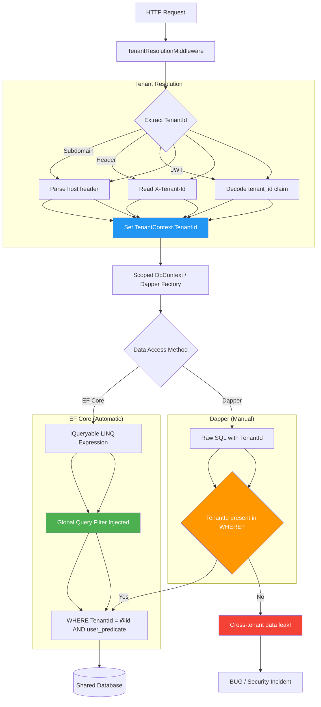

# Multi-Tenancy — Shared Schema with TenantId

## 1. Overview — The Shared Schema Pattern

Multi-tenancy is an architecture where a single instance of a software application serves multiple customers (tenants). In the **shared schema** pattern (also called "shared table" or "discriminator column"), all tenants share the same database tables. Rows are distinguished by a `TenantId` column that identifies which tenant owns each row.

This is the simplest and most cost-effective multi-tenancy strategy because:
- A single database server and a single schema serve all tenants.
- Maintenance operations (backups, indexes, migrations) affect all tenants simultaneously.
- Resource pooling is maximized — fewer database connections, less storage overhead.

The primary challenge is **data isolation**. Every query must include `WHERE TenantId = @currentTenantId` to prevent one tenant from seeing another tenant's data. A missing filter is a data-leak vulnerability that can expose sensitive information across tenant boundaries.

```sql
-- All tenants share this table
CREATE TABLE Orders (
    Id          INT IDENTITY(1,1) PRIMARY KEY,
    TenantId    INT NOT NULL,          -- discriminator column
    CustomerId  VARCHAR(50) NOT NULL,
    OrderDate   DATETIME2 NOT NULL,
    Total       DECIMAL(18,2) NOT NULL,
    IsDeleted   BIT NOT NULL DEFAULT 0
);

-- Index for isolation queries
CREATE INDEX IX_Orders_TenantId ON Orders (TenantId) INCLUDE (CustomerId, OrderDate, Total);
```

EF Core's global query filter (`HasQueryFilter`) is the ideal mechanism to automate the `TenantId` predicate. A single filter in `OnModelCreating` injects `WHERE TenantId = @__tenantId_0` into every query, eliminating the risk of forgetting it at the call site.

Dapper has no such automatic mechanism. Every `SELECT`, `UPDATE`, `DELETE`, and `INSERT` statement must explicitly reference `TenantId`. This is the fundamental difference this note explores.

### 1.1 Comparison of Multi-Tenancy Patterns

| Criterion | Shared Schema | Separate Schema | Separate Database |
|---|---|---|---|
| Isolation | Lowest (row-level) | Medium (schema-level) | Highest (database-level) |
| Cost | Lowest | Medium | Highest |
| Migration | Single deployment | N schema changes | N database changes |
| Backup/Restore | Single backup | N schema backups | N database backups |
| Connection pooling | Shared pool | Per-schema pool | Per-database pool |
| Cross-tenant reporting | Easy (filter by TenantId) | Union across schemas | Union across databases |
| Customization per tenant | None | Schema changes possible | Full control |
| Complexity | Low | Medium | High |

### 1.2 When to Use Shared Schema

- SaaS applications with many low-volume tenants.
- Tenants have identical data models (no per-tenant customization).
- Strong isolation is not a regulatory requirement.
- You need to minimize infrastructure cost.
- Cross-tenant analytics and reporting are common requirements.

### 1.3 Tenant Resolution Strategies

The `TenantId` must be resolved for every request. Common strategies:

| Strategy | Source | Pros | Cons |
|---|---|---|---|
| Subdomain | `tenant1.app.com` | Clean URL, easy routing | DNS config required |
| URL path | `app.com/tenant1/orders` | No DNS setup | URL pollution |
| Header | `X-Tenant-Id: 123` | Simple, API-friendly | Not user-visible |
| JWT claim | `tenant_id` in token | Secure, tamper-proof | Requires auth |
| Query string | `?tenantId=123` | Simple | Exposed in logs/analytics |

---

## 2. Section 2 — TenantId Resolution in ASP.NET Core

Before the data access layer can use the `TenantId`, it must be resolved from the current HTTP request or execution context.

### 2.1 TenantContext — Scoped Service

```csharp
public interface ITenantContext
{
    int TenantId { get; }
    string TenantName { get; }
    string ConnectionString { get; }
}

public class TenantContext : ITenantContext
{
    public int TenantId { get; internal set; }
    public string TenantName { get; internal set; } = string.Empty;
    public string ConnectionString { get; internal set; } = string.Empty;
}
```

### 2.2 Middleware to Resolve TenantId

```csharp
public class TenantResolutionMiddleware
{
    private readonly RequestDelegate _next;

    public TenantResolutionMiddleware(RequestDelegate next)
    {
        _next = next;
    }

    public async Task InvokeAsync(HttpContext context, ITenantContext tenantContext)
    {
        var tenantId = ResolveTenantId(context);
        if (tenantId is null)
        {
            context.Response.StatusCode = 401;
            await context.Response.WriteAsync("Tenant not identified.");
            return;
        }

        // Resolve tenant details from database or cache
        var tenant = await ResolveTenantAsync(tenantId.Value);

        ((TenantContext)tenantContext).TenantId = tenant.Id;
        ((TenantContext)tenantContext).TenantName = tenant.Name;
        ((TenantContext)tenantContext).ConnectionString = tenant.ConnectionString;

        await _next(context);
    }

    private static int? ResolveTenantId(HttpContext context)
    {
        // Strategy 1: Subdomain
        var host = context.Request.Host.Host;
        var parts = host.Split('.');
        if (parts.Length >= 2 && int.TryParse(parts[0], out var fromSubdomain))
            return fromSubdomain;

        // Strategy 2: Header
        if (context.Request.Headers.TryGetValue("X-Tenant-Id", out var headerValue)
            && int.TryParse(headerValue, out var fromHeader))
            return fromHeader;

        // Strategy 3: JWT claim
        var claim = context.User?.FindFirst("tenant_id");
        if (claim is not null && int.TryParse(claim.Value, out var fromClaim))
            return fromClaim;

        // Strategy 4: Route parameter
        if (context.Request.RouteValues.TryGetValue("tenantId", out var routeValue)
            && int.TryParse(routeValue?.ToString(), out var fromRoute))
            return fromRoute;

        return null;
    }

    private async Task<Tenant> ResolveTenantAsync(int tenantId)
    {
        // Cache this to avoid a database call per request
        using var connection = new SqlConnection(_masterConnectionString);
        var sql = "SELECT Id, Name, ConnectionString FROM Tenants WHERE Id = @Id AND IsActive = 1";
        return await connection.QuerySingleAsync<Tenant>(sql, new { Id = tenantId });
    }
}
```

### 2.3 Registration in DI

```csharp
// Program.cs
builder.Services.AddScoped<ITenantContext, TenantContext>();
builder.Services.AddScoped<ITenantConnectionFactory, TenantConnectionFactory>();
builder.Services.AddScoped<SalesDbContext>();

var app = builder.Build();
app.UseMiddleware<TenantResolutionMiddleware>();
```

### 2.4 Tenant-Specific Connection String

Even in shared schema mode, some deployments route tenants to different database servers for load balancing or geo-distribution. The connection string can vary per tenant:

```csharp
public interface ITenantConnectionFactory
{
    IDbConnection CreateConnection();
}

public class TenantConnectionFactory : ITenantConnectionFactory
{
    private readonly ITenantContext _tenantContext;

    public TenantConnectionFactory(ITenantContext tenantContext)
    {
        _tenantContext = tenantContext;
    }

    public IDbConnection CreateConnection()
    {
        var cs = string.IsNullOrEmpty(_tenantContext.ConnectionString)
            ? _defaultConnectionString   // fallback to default
            : _tenantContext.ConnectionString;

        return new SqlConnection(cs);
    }
}
```

---

## 3. Section 3 — EF Core Implementation: HasQueryFilter on TenantId

### 3.1 Entity Interface

```csharp
public interface ITenanted
{
    int TenantId { get; set; }
}

public class Order : ITenanted
{
    public int Id { get; set; }
    public int TenantId { get; set; }
    public string CustomerId { get; set; } = string.Empty;
    public DateTime OrderDate { get; set; }
    public decimal Total { get; set; }
    public bool IsDeleted { get; set; }
    public DateTime? DeletedAt { get; set; }

    public ICollection<OrderLine> Lines { get; set; } = new List<OrderLine>();
}

public class Customer : ITenanted
{
    public int Id { get; set; }
    public int TenantId { get; set; }
    public string Name { get; set; } = string.Empty;
    public string Email { get; set; } = string.Empty;
    public bool IsDeleted { get; set; }
    public DateTime? DeletedAt { get; set; }

    public ICollection<Order> Orders { get; set; } = new List<Order>();
}

public class Product : ITenanted
{
    public int Id { get; set; }
    public int TenantId { get; set; }
    public string Sku { get; set; } = string.Empty;
    public string Name { get; set; } = string.Empty;
    public decimal Price { get; set; }
    public bool IsDeleted { get; set; }
    public DateTime? DeletedAt { get; set; }
}
```

### 3.2 DbContext with TenantId Filter

```csharp
public class SalesDbContext : DbContext
{
    private readonly ITenantContext _tenantContext;

    public SalesDbContext(
        DbContextOptions<SalesDbContext> options,
        ITenantContext tenantContext)
        : base(options)
    {
        _tenantContext = tenantContext;
    }

    public DbSet<Order> Orders => Set<Order>();
    public DbSet<Customer> Customers => Set<Customer>();
    public DbSet<Product> Products => Set<Product>();
    public DbSet<Tenant> Tenants => Set<Tenant>();

    protected override void OnModelCreating(ModelBuilder modelBuilder)
    {
        // Global query filter for each tenanted entity
        modelBuilder.Entity<Order>()
            .HasQueryFilter(e => e.TenantId == _tenantContext.TenantId);

        modelBuilder.Entity<Customer>()
            .HasQueryFilter(e => e.TenantId == _tenantContext.TenantId);

        modelBuilder.Entity<Product>()
            .HasQueryFilter(e => e.TenantId == _tenantContext.TenantId);

        // Composite with soft delete if needed:
        // modelBuilder.Entity<Order>()
        //     .HasQueryFilter(e => e.TenantId == _tenantContext.TenantId && !e.IsDeleted);

        // Indexes
        modelBuilder.Entity<Order>(entity =>
        {
            entity.HasIndex(e => new { e.TenantId, e.CustomerId })
                  .HasDatabaseName("IX_Orders_TenantId_CustomerId");
            entity.HasIndex(e => new { e.TenantId, e.OrderDate })
                  .HasDatabaseName("IX_Orders_TenantId_OrderDate");
        });

        modelBuilder.Entity<Customer>(entity =>
        {
            entity.HasIndex(e => new { e.TenantId, e.Email })
                  .IsUnique()
                  .HasDatabaseName("IX_Customers_TenantId_Email");
        });

        modelBuilder.Entity<Product>(entity =>
        {
            entity.HasIndex(e => new { e.TenantId, e.Sku })
                  .IsUnique()
                  .HasDatabaseName("IX_Products_TenantId_Sku");
        });
    }

    public override int SaveChanges()
    {
        EnforceTenantId();
        return base.SaveChanges();
    }

    public override Task<int> SaveChangesAsync(CancellationToken ct = default)
    {
        EnforceTenantId();
        return base.SaveChangesAsync(ct);
    }

    private void EnforceTenantId()
    {
        var tenantId = _tenantContext.TenantId;

        foreach (var entry in ChangeTracker.Entries<ITenanted>())
        {
            switch (entry.State)
            {
                case EntityState.Added:
                    entry.Entity.TenantId = tenantId;
                    break;
                case EntityState.Modified:
                case EntityState.Deleted:
                    if (entry.Entity.TenantId != tenantId)
                        throw new InvalidOperationException(
                            "Cross-tenant data modification detected.");
                    break;
            }
        }
    }
}
```

### 3.3 Generated SQL

```csharp
var orders = await db.Orders
    .Where(o => o.CustomerId == "CUST001")
    .ToListAsync();
```

Generated SQL:

```sql
SELECT [o].[Id], [o].[TenantId], [o].[CustomerId], [o].[OrderDate], [o].[Total],
       [o].[IsDeleted], [o].[DeletedAt]
FROM [Orders] AS [o]
WHERE [o].[TenantId] = @__tenantId_0
  AND [o].[CustomerId] = @__customerId_1;
```

The `TenantId` filter is automatically injected by the global query filter. The developer never writes `TenantId` in business logic queries.

### 3.4 Convention-Based Application

For EF Core 6+, apply the filter to all `ITenanted` entities using a convention:

```csharp
public class TenantQueryFilterConvention : IModelFinalizingConvention
{
    private readonly int _tenantId;

    public TenantQueryFilterConvention(int tenantId)
    {
        _tenantId = tenantId;
    }

    public void ProcessModelFinalizing(
        IConventionModelBuilder modelBuilder,
        IConventionContext<IConventionModelBuilder> context)
    {
        foreach (var entityType in modelBuilder.Metadata.GetEntityTypes()
            .Where(e => typeof(ITenanted).IsAssignableFrom(e.ClrType)))
        {
            var param = Expression.Parameter(entityType.ClrType, "e");
            var prop = Expression.Property(param, nameof(ITenanted.TenantId));
            var value = Expression.Constant(_tenantId);
            var predicate = Expression.Lambda(Expression.Equal(prop, value), param);

            modelBuilder.Entity(entityType.ClrType).HasQueryFilter(predicate);
        }
    }
}
```

However, this approach has a limitation: the `_tenantId` is fixed at model-building time. For a multi-tenant `DbContext` where the model is built once and reused, the tenant ID must be resolved dynamically. The `_tenantContext` field in the `DbContext` approach above handles this correctly because it resolves `TenantId` per-scope.

### 3.5 Dynamic TenantId with Expression Visitor

If you want a convention-based approach with dynamic filtering, use an expression visitor:

```csharp
public class DynamicTenantFilterExpressionVisitor : ExpressionVisitor
{
    private readonly ITenantContext _tenantContext;
    private static readonly MethodInfo _tenantIdGetter =
        typeof(ITenantContext).GetProperty(nameof(ITenantContext.TenantId))!.GetMethod!;

    public DynamicTenantFilterExpressionVisitor(ITenantContext tenantContext)
    {
        _tenantContext = tenantContext;
    }

    protected override Expression VisitMember(MemberExpression node)
    {
        if (node.Member.Name == nameof(ITenantContext.TenantId)
            && node.Expression?.Type == typeof(ITenantContext))
        {
            return Expression.Constant(_tenantContext.TenantId);
        }
        return base.VisitMember(node);
    }
}
```

---

## 4. Section 4 — Dapper Implementation: Manual TenantId Filtering

Dapper requires explicit `WHERE TenantId = @TenantId` on every query. This section shows how to centralize the pattern.

### 4.1 Repository Base with TenantId

```csharp
public abstract class TenantedRepositoryBase<T> where T : class
{
    protected readonly IDbConnection _connection;
    protected readonly ITenantContext _tenantContext;
    protected readonly string _tableName;

    protected TenantedRepositoryBase(
        IDbConnection connection,
        ITenantContext tenantContext,
        string tableName)
    {
        _connection = connection;
        _tenantContext = tenantContext;
        _tableName = tableName;
    }

    protected int TenantId => _tenantContext.TenantId;

    protected string WhereClause => $"WHERE TenantId = @TenantId";

    public virtual async Task<T?> GetByIdAsync(int id)
    {
        var sql = $"SELECT * FROM [{_tableName}] {WhereClause} AND Id = @Id";
        return await _connection.QueryFirstOrDefaultAsync<T>(sql,
            new { TenantId, Id = id });
    }

    public virtual async Task<IReadOnlyList<T>> GetAllAsync()
    {
        var sql = $"SELECT * FROM [{_tableName}] {WhereClause}";
        var result = await _connection.QueryAsync<T>(sql, new { TenantId });
        return result.ToList();
    }

    public virtual async Task AddAsync(T entity)
    {
        // The entity's TenantId is set by the application layer
        var sql = GenerateInsertSql();
        await _connection.ExecuteAsync(sql, entity);
    }

    public virtual async Task<int> CountAsync()
    {
        var sql = $"SELECT COUNT(1) FROM [{_tableName}] {WhereClause}";
        return await _connection.ExecuteScalarAsync<int>(sql, new { TenantId });
    }

    public virtual async Task<bool> ExistsAsync(int id)
    {
        var sql = $"SELECT COUNT(1) FROM [{_tableName}] {WhereClause} AND Id = @Id";
        var count = await _connection.ExecuteScalarAsync<int>(sql,
            new { TenantId, Id = id });
        return count > 0;
    }

    public virtual async Task DeleteAsync(int id)
    {
        var sql = $"DELETE FROM [{_tableName}] {WhereClause} AND Id = @Id";
        await _connection.ExecuteAsync(sql, new { TenantId, Id = id });
    }
}
```

### 4.2 Concrete Repository Example

```csharp
public class OrderRepository : TenantedRepositoryBase<Order>
{
    public OrderRepository(IDbConnection connection, ITenantContext tenantContext)
        : base(connection, tenantContext, "Orders") { }

    public async Task<IReadOnlyList<Order>> GetOrdersByCustomerAsync(string customerId)
    {
        var sql = @"SELECT * FROM [Orders]
                     WHERE TenantId = @TenantId
                       AND CustomerId = @CustomerId
                     ORDER BY OrderDate DESC";
        var result = await _connection.QueryAsync<Order>(sql,
            new { TenantId, CustomerId = customerId });
        return result.ToList();
    }

    public async Task<Order?> GetOrderWithLinesAsync(int orderId)
    {
        var sql = @"SELECT o.*, ol.*
                     FROM [Orders] o
                     LEFT JOIN [OrderLines] ol ON ol.OrderId = o.Id
                     WHERE o.TenantId = @TenantId
                       AND o.Id = @OrderId";

        using var multi = await _connection.QueryMultipleAsync(sql,
            new { TenantId, OrderId = orderId });
        var order = await multi.ReadSingleOrDefaultAsync<Order>();
        if (order != null)
        {
            order.Lines = (await multi.ReadAsync<OrderLine>()).ToList();
        }
        return order;
    }

    public async Task<decimal> GetTotalRevenueAsync(DateTime from, DateTime to)
    {
        var sql = @"SELECT COALESCE(SUM(Total), 0)
                     FROM [Orders]
                     WHERE TenantId = @TenantId
                       AND OrderDate >= @From
                       AND OrderDate < @To
                       AND IsDeleted = 0";
        return await _connection.ExecuteScalarAsync<decimal>(sql,
            new { TenantId, From = from, To = to });
    }

    public async Task<IReadOnlyList<OrderSummary>> GetOrderSummaryAsync()
    {
        var sql = @"SELECT
                        CustomerId,
                        COUNT(1) AS OrderCount,
                        COALESCE(SUM(Total), 0) AS TotalSpent
                     FROM [Orders]
                     WHERE TenantId = @TenantId
                       AND IsDeleted = 0
                     GROUP BY CustomerId
                     ORDER BY TotalSpent DESC";
        var result = await _connection.QueryAsync<OrderSummary>(sql,
            new { TenantId });
        return result.ToList();
    }
}
```

### 4.3 The Risk: Missing TenantId

Consider this seemingly correct query:

```csharp
// BUG: Missing TenantId filter — returns ALL tenants' data!
public async Task<IReadOnlyList<Order>> GetRecentOrdersAsync(int daysBack)
{
    var sql = @"SELECT * FROM [Orders]
                 WHERE OrderDate >= @Since
                 ORDER BY OrderDate DESC";
    var result = await _connection.QueryAsync<Order>(sql,
        new { Since = DateTime.UtcNow.AddDays(-daysBack) });
    return result.ToList();
}
```

This returns orders from every tenant within the date range — a serious data leak. This is the most dangerous class of bug in shared-schema multi-tenancy.

### 4.4 Mitigation Strategies for Dapper

| Strategy | Implementation | Effectiveness |
|---|---|---|
| Repository base class | Centralize `WhereClause` that always includes `TenantId` | High — if used consistently |
| SQL template engine | Use T4 templates or a SQL builder that auto-inserts TenantId | Medium — template may be bypassed |
| Database view per tenant | Create `vw_tenant_{id}_Orders` views that filter by TenantId | High but maintenance-heavy |
| Code review checklist | Mandatory `TenantId` check in every PR review of SQL | Moderate — human error |
| Integration tests | Seed data for two tenants, assert isolation | High — catches regressions |
| Roslyn analyzer | Custom analyzer that flags missing TenantId in SQL strings | High — automated |

### 4.5 Dapper with ITenantContext Injection

```csharp
public class OrderService
{
    private readonly IDbConnection _connection;
    private readonly ITenantContext _tenant;

    public OrderService(IDbConnection connection, ITenantContext tenant)
    {
        _connection = connection;
        _tenant = tenant;
    }

    public async Task PlaceOrderAsync(CreateOrderDto dto)
    {
        var order = new Order
        {
            TenantId = _tenant.TenantId,
            CustomerId = dto.CustomerId,
            OrderDate = DateTime.UtcNow,
            Total = dto.Total,
            IsDeleted = false
        };

        var sql = @"INSERT INTO [Orders] (TenantId, CustomerId, OrderDate, Total, IsDeleted)
                     VALUES (@TenantId, @CustomerId, @OrderDate, @Total, @IsDeleted);
                     SELECT CAST(SCOPE_IDENTITY() AS INT);";

        var id = await _connection.ExecuteScalarAsync<int>(sql, order);
        order.Id = id;
    }
}
```

---

## 5. Section 5 — Mermaid Diagram: Shared Schema Request Flow



---

## 6. Section 6 — Composite Filters: TenantId + Soft Delete

When combining multi-tenancy with soft delete, the global query filter must include both conditions.

### 6.1 EF Core Composite Filter

```csharp
protected override void OnModelCreating(ModelBuilder modelBuilder)
{
    modelBuilder.Entity<Order>()
        .HasQueryFilter(e => e.TenantId == _tenantContext.TenantId && !e.IsDeleted);

    modelBuilder.Entity<Customer>()
        .HasQueryFilter(e => e.TenantId == _tenantContext.TenantId && !e.IsDeleted);

    modelBuilder.Entity<Product>()
        .HasQueryFilter(e => e.TenantId == _tenantContext.TenantId && !e.IsDeleted);
}
```

Generated SQL:

```sql
SELECT [o].[Id], [o].[TenantId], [o].[CustomerId], [o].[OrderDate], [o].[Total],
       [o].[IsDeleted], [o].[DeletedAt]
FROM [Orders] AS [o]
WHERE [o].[TenantId] = @__tenantId_0
  AND [o].[IsDeleted] = 0
  AND [o].[CustomerId] = @__customerId_1;
```

### 6.2 Dapper Composite Query

```csharp
public async Task<IReadOnlyList<Order>> GetActiveOrdersByCustomerAsync(string customerId)
{
    var sql = @"SELECT * FROM [Orders]
                 WHERE TenantId = @TenantId
                   AND IsDeleted = 0
                   AND CustomerId = @CustomerId
                 ORDER BY OrderDate DESC";
    var result = await _connection.QueryAsync<Order>(sql,
        new { TenantId = _tenant.TenantId, CustomerId = customerId });
    return result.ToList();
}
```

### 6.3 IgnoreQueryFilters with TenantId

Bypassing the tenant filter is a security-sensitive operation. In EF Core, `.IgnoreQueryFilters()` disables all global query filters, including both TenantId and SoftDelete:

```csharp
// Bypasses tenant isolation — use with extreme caution
var allTenantsOrders = await db.Orders
    .IgnoreQueryFilters()
    .ToListAsync();

// Selective: get all non-deleted orders across tenants
var allActiveOrders = await db.Orders
    .IgnoreQueryFilters()
    .Where(o => !o.IsDeleted)
    .ToListAsync();

// Admin-only: get deleted orders for a specific tenant
var deletedOrders = await db.Orders
    .IgnoreQueryFilters()
    .Where(o => o.TenantId == targetTenantId && o.IsDeleted)
    .ToListAsync();
```

Any code that calls `.IgnoreQueryFilters()` on a tenanted entity should:
1. Require admin authorization.
2. Log the operation for audit.
3. Be restricted to a dedicated service class.

### 6.4 Indexing Strategy for Composite Filters

```sql
-- Composite index covering both TenantId and IsDeleted
CREATE INDEX IX_Orders_TenantId_IsDeleted
ON Orders (TenantId, IsDeleted)
INCLUDE (CustomerId, OrderDate, Total);

-- For queries that also filter on CustomerId:
CREATE INDEX IX_Orders_TenantId_CustomerId
ON Orders (TenantId, CustomerId)
WHERE IsDeleted = 0;  -- filtered index
```

---

## 7. Section 7 — Unique Constraints Across Tenants

In a shared schema, unique constraints must include `TenantId` to avoid conflicts between tenants.

### 7.1 Composite Unique Constraint

```sql
-- A customer email is unique within a tenant, but two tenants can have the same email
CREATE UNIQUE INDEX IX_Customers_TenantId_Email
ON Customers (TenantId, Email)
WHERE IsDeleted = 0;  -- filtered for soft delete
```

### 7.2 EF Core Configuration

```csharp
modelBuilder.Entity<Customer>(entity =>
{
    entity.HasIndex(e => new { e.TenantId, e.Email })
          .IsUnique()
          .HasFilter("IsDeleted = 0")
          .HasDatabaseName("IX_Customers_TenantId_Email");
});

modelBuilder.Entity<Product>(entity =>
{
    entity.HasIndex(e => new { e.TenantId, e.Sku })
          .IsUnique()
          .HasFilter("IsDeleted = 0")
          .HasDatabaseName("IX_Products_TenantId_Sku");
});
```

### 7.3 Application-Level Enforcement

When a filtered unique index is not possible (e.g., older SQLite), enforce at the application level:

```csharp
public async Task<bool> IsEmailUniqueWithinTenantAsync(string email)
{
    var sql = @"SELECT COUNT(1) FROM [Customers]
                 WHERE TenantId = @TenantId
                   AND Email = @Email
                   AND IsDeleted = 0";
    var count = await _connection.ExecuteScalarAsync<int>(sql,
        new { TenantId, Email = email });
    return count == 0;
}
```

### 7.4 Tenant-Specific Sequences

If your application uses sequential numbers visible to tenants (e.g., invoice numbers), each tenant may need their own sequence:

```sql
CREATE SEQUENCE Seq_Invoice_Tenant1 START WITH 1 INCREMENT BY 1;
CREATE SEQUENCE Seq_Invoice_Tenant2 START WITH 1 INCREMENT BY 1;

-- Dynamic resolution in SQL:
DECLARE @seqName NVARCHAR(100) = 'Seq_Invoice_Tenant' + CAST(@TenantId AS NVARCHAR);
DECLARE @sql NVARCHAR(200) = 'SELECT NEXT VALUE FOR ' + @seqName;
EXEC sp_executesql @sql;
```

---

## 8. Section 8 — Advanced TenantId Patterns

### 8.1 TenantId in Shadow Property

For a cleaner domain model, the `TenantId` can be a shadow property managed by EF Core:

```csharp
public class Order
{
    public int Id { get; set; }
    public string CustomerId { get; set; } = string.Empty;
    public DateTime OrderDate { get; set; }
    public decimal Total { get; set; }
    // No TenantId property
}

public class SalesDbContext : DbContext
{
    private readonly ITenantContext _tenantContext;

    protected override void OnModelCreating(ModelBuilder modelBuilder)
    {
        modelBuilder.Entity<Order>(entity =>
        {
            entity.ToTable("Orders");
            entity.HasKey(e => e.Id);

            // Shadow property for TenantId
            entity.Property<int>("TenantId")
                  .HasDefaultValue(0)
                  .IsRequired();

            entity.HasQueryFilter(e => EF.Property<int>(e, "TenantId") == _tenantContext.TenantId);
        });
    }

    private void EnforceTenantId()
    {
        var tenantId = _tenantContext.TenantId;
        foreach (var entry in ChangeTracker.Entries()
            .Where(e => e.State == EntityState.Added
                     && e.Metadata.FindProperty("TenantId") != null))
        {
            entry.Property("TenantId").CurrentValue = tenantId;
        }
    }
}
```

### 8.2 Read-Only Tenant Resolution from JWT

```csharp
public class JwtTenantResolver : ITenantContext
{
    private readonly IHttpContextAccessor _httpContextAccessor;

    public JwtTenantResolver(IHttpContextAccessor httpContextAccessor)
    {
        _httpContextAccessor = httpContextAccessor;
    }

    public int TenantId
    {
        get
        {
            var claim = _httpContextAccessor.HttpContext?
                .User?.FindFirst("tenant_id")?.Value;
            if (claim is null)
                throw new UnauthorizedAccessException("Tenant ID not found in token.");
            return int.Parse(claim);
        }
    }

    public string TenantName
    {
        get
        {
            return _httpContextAccessor.HttpContext?
                .User?.FindFirst("tenant_name")?.Value ?? string.Empty;
        }
    }

    public string ConnectionString => string.Empty; // Default connection string
}
```

### 8.3 Switching Tenants in a Background Job

Background jobs do not have an HTTP context. The tenant must be resolved explicitly:

```csharp
public class NightlyReportJob
{
    private readonly IServiceScopeFactory _scopeFactory;

    public async Task GenerateReportsForAllTenantsAsync()
    {
        var tenants = await GetAllActiveTenantsAsync();

        await Parallel.ForEachAsync(tenants, async (tenant, ct) =>
        {
            using var scope = _scopeFactory.CreateScope();
            var tenantContext = scope.ServiceProvider.GetRequiredService<ITenantContext>();
            ((TenantContext)tenantContext).TenantId = tenant.Id;
            ((TenantContext)tenantContext).TenantName = tenant.Name;

            var reportService = scope.ServiceProvider.GetRequiredService<IReportService>();
            await reportService.GenerateReportAsync(ct);
        });
    }
}
```

### 8.4 Multi-Tenancy Caching

Cache keys must include `TenantId` to avoid serving one tenant's data to another:

```csharp
public async Task<Order?> GetOrderByIdAsync(int orderId)
{
    var cacheKey = $"tenant:{_tenant.TenantId}:order:{orderId}";

    return await _cache.GetOrCreateAsync(cacheKey, async entry =>
    {
        entry.SlidingExpiration = TimeSpan.FromMinutes(5);
        var sql = "SELECT * FROM Orders WHERE Id = @Id AND TenantId = @TenantId";
        return await _connection.QueryFirstOrDefaultAsync<Order>(sql,
            new { Id = orderId, TenantId = _tenant.TenantId });
    });
}
```

### 8.5 TenantId in Stored Procedures

```sql
CREATE PROCEDURE usp_GetOrdersByCustomer
    @TenantId INT,
    @CustomerId VARCHAR(50)
AS
BEGIN
    SET NOCOUNT ON;
    SELECT Id, CustomerId, OrderDate, Total
    FROM Orders
    WHERE TenantId = @TenantId
      AND CustomerId = @CustomerId
      AND IsDeleted = 0
    ORDER BY OrderDate DESC;
END
```

Dapper call:

```csharp
public async Task<IReadOnlyList<Order>> GetOrdersByCustomerAsync(string customerId)
{
    var result = await _connection.QueryAsync<Order>(
        "usp_GetOrdersByCustomer",
        new { TenantId = _tenant.TenantId, CustomerId = customerId },
        commandType: CommandType.StoredProcedure);
    return result.ToList();
}
```

---

## 9. Section 9 — Gotchas, Pitfalls, and Best Practices

### 9.1 Missing TenantId Filter in Dapper Queries

The single most dangerous bug in shared-schema multi-tenancy. Every hand-written SQL statement must include `WHERE TenantId = @TenantId` (or equivalent). Mitigations:

- Use a repository base class that appends the filter automatically.
- Create database views with `WHERE TenantId = SESSION_CONTEXT('TenantId')` and query only through views.
- Write integration tests that seed two tenants with identical data and verify isolation.
- Mandate code review for every raw SQL string.

### 9.2 EF Core Model Caching and Dynamic TenantId

EF Core builds the model once per `DbContext` type per `IServiceProvider` scope. If the `TenantId` is captured in a closure inside `OnModelCreating`, the model is built with the first tenant's ID and reused for all tenants. This is **wrong**:

```csharp
// BAD: TenantId is captured at model-build time
protected override void OnModelCreating(ModelBuilder modelBuilder)
{
    var tenantId = _tenantContext.TenantId;  // Captured once!
    modelBuilder.Entity<Order>()
        .HasQueryFilter(e => e.TenantId == tenantId);  // Wrong for other tenants
}
```

**Correct**: reference the `_tenantContext` field directly in the expression. EF Core evaluates the property access each time the query is executed:

```csharp
// GOOD: TenantId is resolved per-query execution
protected override void OnModelCreating(ModelBuilder modelBuilder)
{
    modelBuilder.Entity<Order>()
        .HasQueryFilter(e => e.TenantId == _tenantContext.TenantId); // Evaluated per query
}
```

### 9.3 Connection Pooling Per Tenant

If tenants connect to different databases, the connection pool is keyed by connection string. With N tenants having potentially distinct connection strings, you may have N pools. This is usually fine, but monitor for excessive pooled connections.

### 9.4 TenantId on Every Table

In a shared schema, **every** table that contains tenant-specific data must have a `TenantId` column. Tables like `Tenants`, `AuditLog`, or application-wide configuration tables are exceptions.

### 9.5 Cross-Tenant Reporting

When you need to report across tenants (e.g., "total revenue across all tenants"), you must intentionally bypass the filter:

```csharp
// EF Core
var allTenantsRevenue = await db.Orders
    .IgnoreQueryFilters()
    .SumAsync(o => o.Total);

// Dapper
var sql = "SELECT COALESCE(SUM(Total), 0) FROM Orders";
```

### 9.6 Insert Without TenantId

```csharp
// BUG: TenantId is not set on insert
var order = new Order { CustomerId = "CUST001", Total = 100 };
db.Orders.Add(order);
await db.SaveChangesAsync();
// Order.TenantId = 0 (default) — data isolation broken!
```

The `EnforceTenantId` method in `SaveChanges` (shown in section 3.2) prevents this by automatically setting `TenantId` on `Added` entities. Without it, the insert will have `TenantId = 0`, and queries for _any_ tenant will include or exclude it depending on the filter.

### 9.7 Migration Complexity

Shared schema migrations are applied once to the single schema. However, if you later migrate a tenant to a separate database, you must split the data. Plan for this from the start by ensuring all queries are tenant-filtered and the `TenantId` index is well-maintained.

### 9.8 Tenant Deletion

When a tenant is deactivated or deleted, their data must be handled:

| Strategy | Approach | Pros | Cons |
|---|---|---|---|
| Soft delete all rows | Set IsDeleted = 1 for all tenant rows | Simple, reversible | Data still occupies space |
| Hard delete all rows | DELETE WHERE TenantId = @id | Frees space | Irreversible |
| Archive database | Move tenant to separate DB | Full isolation, can be billed | Expensive |
| Anonymize | Nullify PII columns | Compliant, keeps aggregate data | Complex |

```sql
-- Hard delete all tenant data
DELETE FROM Orders WHERE TenantId = @tenantId;
DELETE FROM Customers WHERE TenantId = @tenantId;
DELETE FROM Products WHERE TenantId = @tenantId;
-- Delete the tenant record last
DELETE FROM Tenants WHERE Id = @tenantId;
```

### 9.9 Summary of Best Practices

| Practice | Recommendation |
|---|---|
| TenantId on every table | Every tenant-scoped table must include `TenantId` |
| Composite unique keys | All unique indexes include `TenantId` as first column |
| EF Core filter | Use `HasQueryFilter(e => e.TenantId == _tenantContext.TenantId)` |
| Dapper filter | Centralize `WHERE TenantId = @TenantId` in repository base |
| Tenant resolution | Implement middleware to resolve TenantId from request context |
| SaveChanges hook | Auto-set TenantId on `Added` entities |
| IgnoreQueryFilters | Restrict to admin-only services with audit logging |
| Indexing | Lead index with `TenantId` for partition elimination |
| Integration tests | Always seed two tenants and assert strict isolation |
| Background jobs | Explicitly set TenantContext before any DB operation |
| Connection strings | Resolve per-tenant connection string if multi-database |

---
