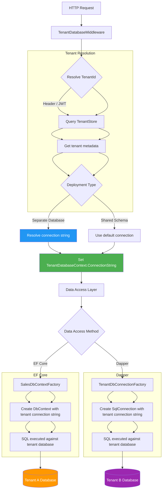

# Multi-Tenancy — Separate Database Pattern

## 1. Overview — The Database-Per-Tenant Pattern

The separate database pattern (also called database-per-tenant) gives each tenant its own database. This is the strongest form of data isolation in multi-tenant architectures: no query can accidentally leak data across tenants because each tenant's data resides in a completely separate database. There is no shared schema, no shared table, and no shared row — the boundary is the database itself.

This pattern is at the opposite end of the isolation-cost spectrum from the shared schema pattern:

- **Maximum isolation** — a missing `WHERE TenantId = @id` in shared schema leaks data across all tenants. In database-per-tenant, there is no `TenantId` column. The database connection itself defines the tenant boundary. A query against Tenant A's database simply cannot access Tenant B's data.
- **Maximum customization** — each tenant can have different indexes, different schema versions, different database settings (collation, compatibility level), and even different migration states.
- **Maximum operational cost** — N tenants means N databases. Each database consumes server resources (memory, CPU, disk I/O). Backups, restores, and maintenance must be performed N times. Connection pooling is split across N databases.

```sql
-- Tenant A's database — completely isolated
CREATE DATABASE TenantDB_Alpha;
USE TenantDB_Alpha;

CREATE TABLE Orders (
    Id          INT IDENTITY(1,1) PRIMARY KEY,
    CustomerId  VARCHAR(50) NOT NULL,
    OrderDate   DATETIME2 NOT NULL,
    Total       DECIMAL(18,2) NOT NULL,
    IsDeleted   BIT NOT NULL DEFAULT 0
);

-- Tenant B's database — same structure, separate database
CREATE DATABASE TenantDB_Beta;
USE TenantDB_Beta;

CREATE TABLE Orders (
    Id          INT IDENTITY(1,1) PRIMARY KEY,
    CustomerId  VARCHAR(50) NOT NULL,
    OrderDate   DATETIME2 NOT NULL,
    Total       DECIMAL(18,2) NOT NULL,
    IsDeleted   BIT NOT NULL DEFAULT 0
);
```

Each database is a completely independent unit. There is no `TenantId` column because the database itself IS the tenant identifier. The connection string determines which tenant's data is accessed:

```
"Server=db01;Database=TenantDB_Alpha;Trusted_Connection=True;"
"Server=db01;Database=TenantDB_Beta;Trusted_Connection=True;"
```

### 1.1 Comparison: Database-Per-Tenant vs Other Patterns

| Criterion | Shared Schema (TenantId) | Separate Schema | Separate Database |
|---|---|---|---|
| Isolation | Row-level | Schema-level | Database-level |
| Data leak risk | High (missing WHERE) | Medium (wrong schema) | None (wrong DB connection rejected) |
| Unique constraints | Include TenantId | Per-schema (no TenantId needed) | Per-database (no TenantId needed) |
| Migration complexity | Single migration | Iterate N schemas | Iterate N databases |
| Connection pooling | Single pool | Single pool | N pools (one per database) |
| Backup/Restore | Single backup | Single backup | N backups |
| Cross-tenant reporting | Easy (query with TenantId) | UNION across schemas | Cross-database queries (linked servers) |
| Customization per tenant | None | Schema-level customization | Full database customization |
| Infrastructure cost | Lowest | Low | Highest |
| Resource isolation | None (all tenants compete) | None (same DB) | Strong (separate DB files) |
| Compliance | Hardest (co-mingled data) | Medium | Easiest (per-database audit) |
| Tenant data size limits | Shared storage limits | Shared storage limits | Per-database file limits |

### 1.2 When to Use Database-Per-Tenant

- **Regulatory compliance** — tenants in regulated industries (finance, healthcare, government) may require complete data segregation (PCI DSS, HIPAA, GDPR data sovereignty).
- **Large tenants** — a few tenants with very large data volumes justify dedicated databases.
- **SLA differentiation** — offer different service tiers: basic (shared schema), premium (separate schema), enterprise (separate database).
- **Geographic distribution** — place tenant databases in specific regions for latency optimization.
- **Version customization** — some tenants run on different application versions with different schemas.
- **Acquisition integration** — acquired companies retain their existing database infrastructure.
- **Data sovereignty** — tenant data must remain within a specific geographic or legal jurisdiction.

### 1.3 When NOT to Use Database-Per-Tenant

- **Many small tenants** — thousands of small tenants create operational overhead (managing thousands of databases) without proportional benefit.
- **Frequent cross-tenant reporting** — aggregating data across databases requires linked servers, replication, or ETL processes.
- **Limited DevOps capacity** — managing N databases (backups, monitoring, patching, migrations) requires significant operational investment.
- **Tight budget** — database-per-tenant costs more per tenant due to connection overhead, storage overhead, and management tooling.

### 1.4 Hybrid Approach

A common pattern is a hybrid: use shared schema for small/low-tier tenants and separate databases for large/enterprise tenants. The application resolves the connection strategy per tenant:

```csharp
public enum TenantDeployment
{
    SharedSchema,
    SeparateDatabase
}

public class Tenant
{
    public int Id { get; set; }
    public string Name { get; set; } = string.Empty;
    public TenantDeployment Deployment { get; set; }
    public string? ConnectionString { get; set; }  // null if shared schema
    public string? SchemaName { get; set; }        // null if separate DB
}
```

---

## 2. Section 2 — Database Resolution in ASP.NET Core

The core challenge in database-per-tenant is resolving the correct connection string for each request and ensuring the `DbContext` (or Dapper connection) connects to the correct database.

### 2.1 Tenant Database Context

```csharp
public interface ITenantDatabaseContext
{
    int TenantId { get; }
    string TenantName { get; }
    string ConnectionString { get; }
    string DatabaseName { get; }
}

public class TenantDatabaseContext : ITenantDatabaseContext
{
    public int TenantId { get; internal set; }
    public string TenantName { get; internal set; } = string.Empty;
    public string ConnectionString { get; internal set; } = string.Empty;
    public string DatabaseName { get; internal set; } = string.Empty;
}
```

### 2.2 Connection String Resolution

Connection strings can be stored in a configuration database (a shared "master" database that stores tenant metadata):

```sql
-- Master configuration database (shared by all tenants)
CREATE TABLE Tenants (
    Id              INT PRIMARY KEY,
    Name            VARCHAR(200) NOT NULL,
    DatabaseName    VARCHAR(100) NOT NULL,
    ServerName      VARCHAR(200) NOT NULL,
    ConnectionString NVARCHAR(500) NOT NULL,  -- Encrypted
    IsActive        BIT NOT NULL DEFAULT 1,
    DeploymentType  VARCHAR(20) NOT NULL DEFAULT 'SeparateDatabase'
);

CREATE TABLE TenantDatabases (
    TenantId        INT REFERENCES Tenants(Id),
    DatabaseName    VARCHAR(100) NOT NULL,
    ServerName      VARCHAR(200) NOT NULL,
    ConnectionString NVARCHAR(500) NOT NULL,  -- Full connection string for this DB
    IsPrimary       BIT NOT NULL DEFAULT 1,
    CreatedAt       DATETIME2 NOT NULL DEFAULT GETUTCDATE()
);
```

### 2.3 Middleware to Resolve Database Connection

```csharp
public class TenantDatabaseMiddleware
{
    private readonly RequestDelegate _next;

    public TenantDatabaseMiddleware(RequestDelegate next)
    {
        _next = next;
    }

    public async Task InvokeAsync(
        HttpContext context,
        ITenantDatabaseContext tenantContext,
        ITenantStore tenantStore)
    {
        var tenantId = ResolveTenantId(context);
        if (tenantId is null)
        {
            context.Response.StatusCode = 401;
            await context.Response.WriteAsync("Tenant not identified.");
            return;
        }

        var tenant = await tenantStore.GetTenantAsync(tenantId.Value);
        if (tenant is null || !tenant.IsActive)
        {
            context.Response.StatusCode = 403;
            await context.Response.WriteAsync("Tenant inactive or not found.");
            return;
        }

        // Determine connection string
        var connectionString = tenant.DeploymentType switch
        {
            "SeparateDatabase" => tenant.ConnectionString,
            "SharedSchema" => _defaultConnectionString,
            _ => throw new InvalidOperationException($"Unknown deployment: {tenant.DeploymentType}")
        };

        ((TenantDatabaseContext)tenantContext).TenantId = tenant.Id;
        ((TenantDatabaseContext)tenantContext).TenantName = tenant.Name;
        ((TenantDatabaseContext)tenantContext).ConnectionString = connectionString;
        ((TenantDatabaseContext)tenantContext).DatabaseName = tenant.DatabaseName;

        await _next(context);
    }

    private static int? ResolveTenantId(HttpContext context)
    {
        if (context.Request.Headers.TryGetValue("X-Tenant-Id", out var header)
            && int.TryParse(header, out var id))
            return id;

        var claim = context.User?.FindFirst("tenant_id");
        if (claim is not null && int.TryParse(claim.Value, out var fromClaim))
            return fromClaim;

        return null;
    }
}
```

### 2.4 Connection String Factory

```csharp
public interface ITenantConnectionFactory
{
    IDbConnection CreateConnection();
}

public class TenantConnectionFactory : ITenantConnectionFactory
{
    private readonly ITenantDatabaseContext _tenantContext;

    public TenantConnectionFactory(ITenantDatabaseContext tenantContext)
    {
        _tenantContext = tenantContext;
    }

    public IDbConnection CreateConnection()
    {
        var cs = _tenantContext.ConnectionString;
        if (string.IsNullOrEmpty(cs))
            throw new InvalidOperationException(
                $"No connection string configured for tenant {_tenantContext.TenantId}.");

        return new SqlConnection(cs);
    }
}

public class TenantDbConnectionFactory : ITenantConnectionFactory
{
    private readonly ITenantDatabaseContext _tenantContext;
    private readonly IConfiguration _configuration;

    public TenantDbConnectionFactory(
        ITenantDatabaseContext tenantContext,
        IConfiguration configuration)
    {
        _tenantContext = tenantContext;
        _configuration = configuration;
    }

    public IDbConnection CreateConnection()
    {
        // Build connection string from template + tenant DB name
        var template = _configuration.GetConnectionString("TenantTemplate");
        // e.g., "Server=db01;Database={DatabaseName};Trusted_Connection=True;"
        var cs = template.Replace("{DatabaseName}", _tenantContext.DatabaseName);
        return new SqlConnection(cs);
    }
}
```

### 2.5 Registration

```csharp
// Program.cs
builder.Services.AddScoped<ITenantDatabaseContext, TenantDatabaseContext>();
builder.Services.AddScoped<ITenantConnectionFactory, TenantConnectionFactory>();
builder.Services.AddScoped<ITenantStore, TenantStore>();
builder.Services.AddScoped<SalesDbContext>();

var app = builder.Build();
app.UseMiddleware<TenantDatabaseMiddleware>();
```

---

## 3. Section 3 — EF Core Implementation: DbContext Per Tenant

EF Core handles database-per-tenant naturally because the `DbContext` is configured with a connection string, and each tenant gets their own `DbContext` instance pointing to their database.

### 3.1 Entity Definitions

No `TenantId` column — the database provides isolation:

```csharp
public class Order
{
    public int Id { get; set; }
    public string CustomerId { get; set; } = string.Empty;
    public DateTime OrderDate { get; set; }
    public decimal Total { get; set; }
    public bool IsDeleted { get; set; }
    public DateTime? DeletedAt { get; set; }

    public ICollection<OrderLine> Lines { get; set; } = new List<OrderLine>();
}

public class Customer
{
    public int Id { get; set; }
    public string Name { get; set; } = string.Empty;
    public string Email { get; set; } = string.Empty;
    public bool IsDeleted { get; set; }
    public DateTime? DeletedAt { get; set; }

    public ICollection<Order> Orders { get; set; } = new List<Order>();
}

public class Product
{
    public int Id { get; set; }
    public string Sku { get; set; } = string.Empty;
    public string Name { get; set; } = string.Empty;
    public decimal Price { get; set; }
    public bool IsDeleted { get; set; }
    public DateTime? DeletedAt { get; set; }
}
```

### 3.2 DbContext Factory with Dynamic Connection String

Instead of a fixed `DbContextOptions`, use a factory that resolves the connection string per scope:

```csharp
public class SalesDbContext : DbContext
{
    private readonly string _connectionString;

    public SalesDbContext(string connectionString)
    {
        _connectionString = connectionString;
    }

    public SalesDbContext(DbContextOptions<SalesDbContext> options)
        : base(options) { }

    public DbSet<Order> Orders => Set<Order>();
    public DbSet<Customer> Customers => Set<Customer>();
    public DbSet<Product> Products => Set<Product>();

    protected override void OnConfiguring(DbContextOptionsBuilder optionsBuilder)
    {
        if (!optionsBuilder.IsConfigured && !string.IsNullOrEmpty(_connectionString))
        {
            optionsBuilder.UseSqlServer(_connectionString);
        }
    }

    protected override void OnModelCreating(ModelBuilder modelBuilder)
    {
        modelBuilder.Entity<Order>(entity =>
        {
            entity.ToTable("Orders");
            entity.HasKey(e => e.Id);
            entity.Property(e => e.CustomerId).HasMaxLength(50).IsRequired();
            entity.Property(e => e.Total).HasColumnType("decimal(18,2)");
        });

        modelBuilder.Entity<Customer>(entity =>
        {
            entity.ToTable("Customers");
            entity.HasKey(e => e.Id);
            entity.Property(e => e.Name).HasMaxLength(200).IsRequired();
            entity.Property(e => e.Email).HasMaxLength(200);
            entity.HasIndex(e => e.Email).IsUnique();
        });

        modelBuilder.Entity<Product>(entity =>
        {
            entity.ToTable("Products");
            entity.HasKey(e => e.Id);
            entity.Property(e => e.Sku).HasMaxLength(50).IsRequired();
            entity.Property(e => e.Name).HasMaxLength(200).IsRequired();
            entity.Property(e => e.Price).HasColumnType("decimal(18,2)");
            entity.HasIndex(e => e.Sku).IsUnique();
        });

        // Global query filter for soft delete (no TenantId needed)
        modelBuilder.Entity<Order>().HasQueryFilter(e => !e.IsDeleted);
        modelBuilder.Entity<Customer>().HasQueryFilter(e => !e.IsDeleted);
        modelBuilder.Entity<Product>().HasQueryFilter(e => !e.IsDeleted);
    }

    public override int SaveChanges()
    {
        ApplySoftDelete();
        return base.SaveChanges();
    }

    public override Task<int> SaveChangesAsync(CancellationToken ct = default)
    {
        ApplySoftDelete();
        return base.SaveChangesAsync(ct);
    }

    private void ApplySoftDelete()
    {
        foreach (var entry in ChangeTracker.Entries()
            .Where(e => e.State == EntityState.Deleted
                     && e.Entity is ISoftDeletable sd))
        {
            entry.State = EntityState.Modified;
            entry.Property(nameof(ISoftDeletable.IsDeleted)).CurrentValue = true;
            entry.Property(nameof(ISoftDeletable.DeletedAt)).CurrentValue = DateTime.UtcNow;
        }
    }
}
```

### 3.3 DbContext Factory Registration

```csharp
public interface ISalesDbContextFactory
{
    SalesDbContext CreateDbContext();
}

public class SalesDbContextFactory : ISalesDbContextFactory
{
    private readonly ITenantDatabaseContext _tenantContext;

    public SalesDbContextFactory(ITenantDatabaseContext tenantContext)
    {
        _tenantContext = tenantContext;
    }

    public SalesDbContext CreateDbContext()
    {
        var optionsBuilder = new DbContextOptionsBuilder<SalesDbContext>();
        optionsBuilder.UseSqlServer(_tenantContext.ConnectionString);
        return new SalesDbContext(optionsBuilder.Options);
    }
}
```

Registration in DI:

```csharp
builder.Services.AddScoped<ISalesDbContextFactory, SalesDbContextFactory>();
```

Usage in a service:

```csharp
public class OrderService
{
    private readonly ISalesDbContextFactory _dbFactory;

    public OrderService(ISalesDbContextFactory dbFactory)
    {
        _dbFactory = dbFactory;
    }

    public async Task<IReadOnlyList<Order>> GetOrdersByCustomerAsync(string customerId)
    {
        await using var db = _dbFactory.CreateDbContext();
        return await db.Orders
            .Where(o => o.CustomerId == customerId)
            .ToListAsync();
    }
}
```

### 3.4 Alternative: DbContext with Delegating Connection

An alternative approach is to use a single `DbContext` registration that resolves the connection string from the current tenant context:

```csharp
public class SalesDbContext : DbContext
{
    private readonly ITenantDatabaseContext _tenantContext;

    public SalesDbContext(
        DbContextOptions<SalesDbContext> options,
        ITenantDatabaseContext tenantContext)
        : base(options)
    {
        _tenantContext = tenantContext;
    }

    protected override void OnConfiguring(DbContextOptionsBuilder optionsBuilder)
    {
        // Override the connection with the tenant-specific one
        optionsBuilder.UseSqlServer(_tenantContext.ConnectionString);
    }
}
```

This works with `AddDbContextPool` but each resolved `DbContext` will have a different connection string. However, EF Core's connection pooling (`SqlConnection` pool) is keyed by connection string, so each tenant effectively gets its own ADO.NET connection pool.

### 3.5 Generated SQL

```csharp
await using var db = _dbFactory.CreateDbContext();
var orders = await db.Orders
    .Where(o => o.CustomerId == "CUST001")
    .ToListAsync();
```

Generated SQL (same regardless of which tenant database is connected):

```sql
SELECT [o].[Id], [o].[CustomerId], [o].[OrderDate], [o].[Total],
       [o].[IsDeleted], [o].[DeletedAt]
FROM [Orders] AS [o]
WHERE [o].[IsDeleted] = 0
  AND [o].[CustomerId] = @__customerId_0;
```

No `TenantId` filter — none needed. The database itself is the isolation boundary.

---

## 4. Section 4 — Dapper Implementation: Connection Per Tenant

Dapper requires the same connection string resolution, but without EF Core's abstraction layer. The `IDbConnection` is created dynamically per tenant.

### 4.1 Repository Base with Tenant Connection

```csharp
public abstract class DatabaseRepositoryBase<T> where T : class
{
    protected readonly ITenantConnectionFactory _connectionFactory;
    protected readonly string _tableName;

    protected DatabaseRepositoryBase(
        ITenantConnectionFactory connectionFactory,
        string tableName)
    {
        _connectionFactory = connectionFactory;
        _tableName = tableName;
    }

    protected IDbConnection CreateConnection() => _connectionFactory.CreateConnection();

    public virtual async Task<T?> GetByIdAsync(int id)
    {
        using var connection = CreateConnection();
        var sql = $"SELECT * FROM [{_tableName}] WHERE Id = @Id AND IsDeleted = 0";
        return await connection.QueryFirstOrDefaultAsync<T>(sql, new { Id = id });
    }

    public virtual async Task<IReadOnlyList<T>> GetAllAsync()
    {
        using var connection = CreateConnection();
        var sql = $"SELECT * FROM [{_tableName}] WHERE IsDeleted = 0";
        var result = await connection.QueryAsync<T>(sql);
        return result.ToList();
    }

    public virtual async Task<int> CountAsync()
    {
        using var connection = CreateConnection();
        var sql = $"SELECT COUNT(1) FROM [{_tableName}] WHERE IsDeleted = 0";
        return await connection.ExecuteScalarAsync<int>(sql);
    }

    public virtual async Task AddAsync(T entity)
    {
        using var connection = CreateConnection();
        var sql = GenerateInsertSql();
        await connection.ExecuteAsync(sql, entity);
    }

    public virtual async Task SoftDeleteAsync(int id)
    {
        using var connection = CreateConnection();
        var sql = $"UPDATE [{_tableName}] SET IsDeleted = 1, DeletedAt = @Now WHERE Id = @Id AND IsDeleted = 0";
        await connection.ExecuteAsync(sql, new { Id = id, Now = DateTime.UtcNow });
    }
}
```

### 4.2 Concrete Repository

```csharp
public class OrderRepository : DatabaseRepositoryBase<Order>
{
    public OrderRepository(ITenantConnectionFactory connectionFactory)
        : base(connectionFactory, "Orders") { }

    public async Task<IReadOnlyList<Order>> GetOrdersByCustomerAsync(string customerId)
    {
        using var connection = CreateConnection();
        var sql = @"SELECT * FROM [Orders]
                     WHERE CustomerId = @CustomerId
                       AND IsDeleted = 0
                     ORDER BY OrderDate DESC";
        var result = await connection.QueryAsync<Order>(sql,
            new { CustomerId = customerId });
        return result.ToList();
    }

    public async Task<Order?> GetOrderWithLinesAsync(int orderId)
    {
        using var connection = CreateConnection();
        var sql = @"SELECT o.*, ol.*
                     FROM [Orders] o
                     LEFT JOIN [OrderLines] ol ON ol.OrderId = o.Id
                     WHERE o.Id = @OrderId
                       AND o.IsDeleted = 0
                       AND (ol.IsDeleted IS NULL OR ol.IsDeleted = 0)";

        using var multi = await connection.QueryMultipleAsync(sql,
            new { OrderId = orderId });
        var order = await multi.ReadSingleOrDefaultAsync<Order>();
        if (order != null)
        {
            order.Lines = (await multi.ReadAsync<OrderLine>()).ToList();
        }
        return order;
    }

    public async Task<decimal> GetTotalRevenueAsync(DateTime from, DateTime to)
    {
        using var connection = CreateConnection();
        var sql = @"SELECT COALESCE(SUM(Total), 0)
                     FROM [Orders]
                     WHERE OrderDate >= @From
                       AND OrderDate < @To
                       AND IsDeleted = 0";
        return await connection.ExecuteScalarAsync<decimal>(sql,
            new { From = from, To = to });
    }

    public async Task<IReadOnlyList<OrderSummary>> GetOrderSummaryAsync()
    {
        using var connection = CreateConnection();
        var sql = @"SELECT
                        CustomerId,
                        COUNT(1) AS OrderCount,
                        COALESCE(SUM(Total), 0) AS TotalSpent
                     FROM [Orders]
                     WHERE IsDeleted = 0
                     GROUP BY CustomerId
                     ORDER BY TotalSpent DESC";
        var result = await connection.QueryAsync<OrderSummary>(sql);
        return result.ToList();
    }
}
```

### 4.3 Important: Dispose Connections

Each `using var connection = CreateConnection();` ensures the connection is closed and returned to the pool after each operation. Dapper connections are not managed by EF Core's `DbContext` lifecycle, so explicit disposal is critical.

```csharp
// WRONG: connection leaks
public async Task<Order?> GetOrderAsync(int id)
{
    var connection = _connectionFactory.CreateConnection();
    // connection is never disposed!
    return await connection.QueryFirstOrDefaultAsync<Order>(
        "SELECT * FROM Orders WHERE Id = @Id", new { Id = id });
}

// RIGHT: connection is disposed
public async Task<Order?> GetOrderAsync(int id)
{
    using var connection = _connectionFactory.CreateConnection();
    return await connection.QueryFirstOrDefaultAsync<Order>(
        "SELECT * FROM Orders WHERE Id = @Id AND IsDeleted = 0", new { Id = id });
}
```

### 4.4 Connection Pooling Considerations

Each unique connection string creates a separate ADO.NET connection pool. With N tenants, you may have up to N pools, each with `Max Pool Size` connections (default 100). Monitor total connections:

```csharp
// To inspect pool sizes (SQL Server)
SELECT DB_NAME(dbid) AS DatabaseName,
       COUNT(dbid) AS ConnectionCount,
       loginame
FROM sys.sysprocesses
WHERE dbid > 0
GROUP BY dbid, loginame;
```

```csharp
// Set reasonable pool limits per tenant connection string
"Server=db01;Database=TenantDB_Alpha;Max Pool Size=20;Min Pool Size=2;"
```

---

## 5. Section 5 — Mermaid Diagram: Database-Per-Tenant Request Flow



---

## 6. Section 6 — Migration Strategy for Database-Per-Tenant

Migrations are the most complex operational aspect of database-per-tenant. Each database must be migrated independently.

### 6.1 EF Core Migrations Per Database

```csharp
public class MigrationService
{
    private readonly ITenantStore _tenantStore;
    private readonly IConfiguration _configuration;

    public async Task MigrateAllTenantsAsync()
    {
        var tenants = await _tenantStore.GetAllActiveTenantsAsync();

        foreach (var tenant in tenants)
        {
            await MigrateTenantAsync(tenant);
        }
    }

    public async Task MigrateTenantAsync(Tenant tenant)
    {
        var connectionString = tenant.ConnectionString;
        if (string.IsNullOrEmpty(connectionString))
        {
            _logger.LogWarning("No connection string for tenant {TenantId}", tenant.Id);
            return;
        }

        var optionsBuilder = new DbContextOptionsBuilder<SalesDbContext>();
        optionsBuilder.UseSqlServer(connectionString);

        await using var db = new SalesDbContext(optionsBuilder.Options);
        await db.Database.MigrateAsync();

        _logger.LogInformation("Migrated tenant {TenantId} ({TenantName})",
            tenant.Id, tenant.Name);
    }
}
```

### 6.2 Idempotent Migration Scripts

For bulk migrations, generate an idempotent SQL script and execute it per tenant:

```csharp
public async Task ApplyMigrationScriptToAllTenantsAsync()
{
    // Generate idempotent script from EF Core migrations
    var script = await GenerateIdempotentScriptAsync();
    var tenants = await _tenantStore.GetAllActiveTenantsAsync();

    await Parallel.ForEachAsync(tenants, async (tenant, ct) =>
    {
        using var connection = new SqlConnection(tenant.ConnectionString);
        await connection.OpenAsync(ct);
        await connection.ExecuteAsync(script);
    });
}

private async Task<string> GenerateIdempotentScriptAsync()
{
    var optionsBuilder = new DbContextOptionsBuilder<SalesDbContext>();
    optionsBuilder.UseSqlServer("Server=localhost;Database=Template;"); // dummy for script gen

    await using var db = new SalesDbContext(optionsBuilder.Options);
    var migrator = db.Database.GetService<IMigrator>();
    return migrator.GenerateScript(
        fromMigration: null,
        toMigration: null,
        options: MigrationsSqlGenerationOptions.Idempotent);
}
```

The generated script includes `IF NOT EXISTS` checks for each migration:

```sql
-- Idempotent migration script (excerpt)
IF NOT EXISTS (SELECT * FROM [__EFMigrationsHistory] WHERE [MigrationId] = N'20260627120000_Initial')
BEGIN
    CREATE TABLE [Orders] (
        [Id] INT IDENTITY(1,1) NOT NULL,
        [CustomerId] VARCHAR(50) NOT NULL,
        [OrderDate] DATETIME2 NOT NULL,
        [Total] DECIMAL(18,2) NOT NULL,
        [IsDeleted] BIT NOT NULL DEFAULT 0,
        [DeletedAt] DATETIME2 NULL,
        CONSTRAINT [PK_Orders] PRIMARY KEY ([Id])
    );
    INSERT INTO [__EFMigrationsHistory] ([MigrationId], [ProductVersion])
    VALUES (N'20260627120000_Initial', N'8.0.0');
END;

IF NOT EXISTS (SELECT * FROM [__EFMigrationsHistory] WHERE [MigrationId] = N'20260627130000_AddAuditColumns')
BEGIN
    ALTER TABLE [Orders] ADD [CreatedAt] DATETIME2 NOT NULL DEFAULT GETUTCDATE();
    ALTER TABLE [Orders] ADD [UpdatedAt] DATETIME2 NULL;
    INSERT INTO [__EFMigrationsHistory] ([MigrationId], [ProductVersion])
    VALUES (N'20260627130000_AddAuditColumns', N'8.0.0');
END;
```

### 6.3 Parallel Migration with Throttling

Migrating hundreds of databases in parallel can overwhelm the database server. Implement throttling:

```csharp
public async Task MigrateWithThrottleAsync(int maxConcurrency = 5)
{
    var tenants = await _tenantStore.GetAllActiveTenantsAsync();
    var semaphore = new SemaphoreSlim(maxConcurrency);

    var tasks = tenants.Select(async tenant =>
    {
        await semaphore.WaitAsync();
        try
        {
            await MigrateTenantAsync(tenant);
        }
        finally
        {
            semaphore.Release();
        }
    });

    await Task.WhenAll(tasks);
}
```

### 6.4 Creating Database for a New Tenant

```csharp
public async Task ProvisionTenantDatabaseAsync(int tenantId, string tenantName)
{
    var dbName = $"TenantDB_{SanitizeDbName(tenantName)}_{tenantId}";
    var server = _configuration["Database:Server"];

    // 1. Create the database
    using var masterConnection = new SqlConnection(
        $"Server={server};Database=master;Trusted_Connection=True;");
    await masterConnection.ExecuteAsync(
        $"CREATE DATABASE [{dbName}]");

    // 2. Build connection string
    var connectionString =
        $"Server={server};Database={dbName};Trusted_Connection=True;Max Pool Size=20;";

    // 3. Run migrations
    var optionsBuilder = new DbContextOptionsBuilder<SalesDbContext>();
    optionsBuilder.UseSqlServer(connectionString);
    await using var db = new SalesDbContext(optionsBuilder.Options);
    await db.Database.MigrateAsync();

    // 4. Seed initial data
    await SeedTenantDataAsync(db, tenantId);

    // 5. Store tenant metadata
    await using var configConnection = new SqlConnection(_configConnectionString);
    await configConnection.ExecuteAsync(
        @"INSERT INTO Tenants (Id, Name, DatabaseName, ServerName, ConnectionString, IsActive, DeploymentType)
          VALUES (@Id, @Name, @DatabaseName, @Server, @ConnectionString, 1, 'SeparateDatabase')",
        new { Id = tenantId, Name = tenantName, DatabaseName = dbName, Server = server, ConnectionString = connectionString });
}

private static string SanitizeDbName(string name)
{
    var invalid = new Regex(@"[^a-zA-Z0-9_]");
    var sanitized = invalid.Replace(name, "_");
    return sanitized.Length > 50 ? sanitized[..50] : sanitized;
}
```

### 6.5 Schema Version Tracking

Track which migration version each tenant database is on to detect drift:

```csharp
public async Task<Dictionary<int, string>> GetTenantMigrationVersionsAsync()
{
    var tenants = await _tenantStore.GetAllActiveTenantsAsync();
    var result = new Dictionary<int, string>();

    foreach (var tenant in tenants)
    {
        try
        {
            using var connection = new SqlConnection(tenant.ConnectionString);
            var latest = await connection.QuerySingleOrDefaultAsync<string>(
                "SELECT TOP 1 MigrationId FROM [__EFMigrationsHistory] ORDER BY MigrationId DESC");
            result[tenant.Id] = latest ?? "No migrations";
        }
        catch (Exception ex)
        {
            result[tenant.Id] = $"Error: {ex.Message}";
        }
    }

    return result;
}
```

---

## 7. Section 7 — Backup and Restore Per Tenant

Each tenant database must be backed up and restorable independently.

### 7.1 Automated Backup Strategy

```csharp
public async Task BackupAllTenantDatabasesAsync()
{
    var tenants = await _tenantStore.GetAllActiveTenantsAsync();

    foreach (var tenant in tenants)
    {
        await BackupTenantDatabaseAsync(tenant);
    }
}

public async Task BackupTenantDatabaseAsync(Tenant tenant)
{
    var backupPath = Path.Combine(
        _backupRoot,
        $"{tenant.DatabaseName}_{DateTime.UtcNow:yyyyMMddHHmmss}.bak");

    using var connection = new SqlConnection(tenant.ConnectionString);
    await connection.ExecuteAsync(
        $"BACKUP DATABASE [{tenant.DatabaseName}] TO DISK = @Path WITH FORMAT",
        new { Path = backupPath });
}
```

### 7.2 Restore Single Tenant

```csharp
public async Task RestoreTenantDatabaseAsync(int tenantId, string backupFilePath)
{
    var tenant = await _tenantStore.GetTenantAsync(tenantId);
    if (tenant is null) throw new NotFoundException($"Tenant {tenantId} not found.");

    using var masterConnection = new SqlConnection(_masterConnectionString);

    // Set database to single user mode and restore
    var sql = $@"
        ALTER DATABASE [{tenant.DatabaseName}] SET SINGLE_USER WITH ROLLBACK IMMEDIATE;
        RESTORE DATABASE [{tenant.DatabaseName}]
        FROM DISK = @BackupPath
        WITH REPLACE;
        ALTER DATABASE [{tenant.DatabaseName}] SET MULTI_USER;";

    await masterConnection.ExecuteAsync(sql,
        new { BackupPath = backupFilePath });
}
```

### 7.3 Point-in-Time Recovery

For databases in Full recovery model, implement point-in-time recovery:

```sql
-- Restore to a specific point in time
RESTORE DATABASE [TenantDB_Alpha]
FROM DISK = 'C:\Backups\TenantDB_Alpha_FULL_20260627.bak'
WITH NORECOVERY;

RESTORE LOG [TenantDB_Alpha]
FROM DISK = 'C:\Backups\TenantDB_Alpha_LOG_20260627.trn'
WITH STOPAT = '2026-06-27T14:30:00',
     RECOVERY;
```

### 7.4 Retention Policy

```csharp
public async Task CleanupOldBackupsAsync(int retentionDays = 30)
{
    var cutoff = DateTime.UtcNow.AddDays(-retentionDays);
    var tenants = await _tenantStore.GetAllActiveTenantsAsync();

    foreach (var tenant in tenants)
    {
        var pattern = $"{tenant.DatabaseName}_*.bak";
        var directory = new DirectoryInfo(_backupRoot);
        var files = directory.GetFiles(pattern)
            .Where(f => f.CreationTimeUtc < cutoff);

        foreach (var file in files)
        {
            file.Delete();
            _logger.LogInformation("Deleted backup: {FileName}", file.Name);
        }
    }
}
```

---

## 8. Section 8 — Cross-Tenant Reporting with Database-Per-Tenant

Cross-tenant reporting is the most difficult aspect of database-per-tenant. Unlike shared schema (query with `TenantId IN (...)`), you must read from each database individually.

### 8.1 Union Query Across Linked Servers

Set up linked servers and use a distributed query:

```sql
-- Create linked servers (one per tenant database)
EXEC sp_addlinkedserver 'TenantDB_Alpha', '', 'SQLNCLI', 'db01\instance1';
EXEC sp_addlinkedserver 'TenantDB_Beta', '', 'SQLNCLI', 'db01\instance1';

-- Query across all tenants
SELECT 'Alpha' AS Tenant, CustomerId, OrderDate, Total
FROM [TenantDB_Alpha].[dbo].[Orders] WHERE IsDeleted = 0
UNION ALL
SELECT 'Beta' AS Tenant, CustomerId, OrderDate, Total
FROM [TenantDB_Beta].[dbo].[Orders] WHERE IsDeleted = 0;
```

### 8.2 Application-Level Aggregation

```csharp
public async Task<AggregatedReport> GetCrossTenantReportAsync(DateTime from, DateTime to)
{
    var tenants = await _tenantStore.GetAllActiveTenantsAsync();
    var report = new AggregatedReport();

    foreach (var tenant in tenants)
    {
        using var connection = new SqlConnection(tenant.ConnectionString);
        var tenantData = await connection.QueryAsync<OrderDto>(
            @"SELECT CustomerId, OrderDate, Total
              FROM Orders
              WHERE OrderDate >= @From AND OrderDate < @To AND IsDeleted = 0",
            new { From = from, To = to });

        report.TotalOrders += tenantData.Count();
        report.TotalRevenue += tenantData.Sum(o => o.Total);
        report.PerTenant[tenant.Name] = new TenantReport
        {
            OrderCount = tenantData.Count(),
            Revenue = tenantData.Sum(o => o.Total)
        };
    }

    return report;
}
```

### 8.3 ETL to Central Data Warehouse

For frequent cross-tenant reporting, extract data from each tenant database into a central data warehouse:

```csharp
public async Task EtlToWarehouseAsync()
{
    var warehouseConnection = new SqlConnection(_warehouseConnectionString);
    var tenants = await _tenantStore.GetAllActiveTenantsAsync();

    foreach (var tenant in tenants)
    {
        using var source = new SqlConnection(tenant.ConnectionString);

        // Extract
        var orders = await source.QueryAsync<Order>(
            "SELECT * FROM Orders WHERE IsDeleted = 0");

        // Transform (add TenantId)
        var warehouseData = orders.Select(o => new WarehouseOrder
        {
            TenantId = tenant.Id,
            TenantName = tenant.Name,
            OrderId = o.Id,
            CustomerId = o.CustomerId,
            OrderDate = o.OrderDate,
            Total = o.Total
        });

        // Load
        await warehouseConnection.ExecuteAsync(
            @"INSERT INTO Warehouse.Orders (TenantId, TenantName, OrderId, CustomerId, OrderDate, Total)
              VALUES (@TenantId, @TenantName, @OrderId, @CustomerId, @OrderDate, @Total)",
            warehouseData);
    }
}
```

### 8.4 Change Data Capture (CDC)

For real-time cross-tenant reporting, enable CDC on each tenant database and feed changes to a central stream:

```sql
-- On each tenant database
EXEC sys.sp_cdc_enable_db;
EXEC sys.sp_cdc_enable_table
    @source_schema = 'dbo',
    @source_name = 'Orders',
    @role_name = NULL,
    @capture_instance = 'dbo_Orders';
```

Consume with a background service:

```csharp
public async Task CaptureChangesAsync()
{
    var tenants = await _tenantStore.GetAllActiveTenantsAsync();

    foreach (var tenant in tenants)
    {
        using var connection = new SqlConnection(tenant.ConnectionString);
        var changes = await connection.QueryAsync(
            @"SELECT OrderId = Id, CustomerId, OrderDate, Total, __$operation
              FROM cdc.fn_cdc_get_all_changes_dbo_Orders(
                  sys.fn_cdc_get_min_lsn('dbo_Orders'),
                  sys.fn_cdc_get_max_lsn(),
                  'all')");

        // Process changes into central warehouse
        await ProcessChangesAsync(tenant.Id, changes);
    }
}
```

---

## 9. Section 9 — Gotchas, Pitfalls, and Best Practices

### 9.1 Connection Pooling Explosion

Each tenant database gets its own ADO.NET connection pool (keyed by connection string). With 100 tenants and `Max Pool Size = 100`, you could have up to 10,000 idle connections. Mitigate by:

- Setting reasonable `Min Pool Size` and `Max Pool Size` per connection string.
- Using a connection pool middleware that multiplexes connections when possible.
- Monitoring `sys.dm_exec_sessions` for connection counts.

```csharp
"Server=db01;Database=TenantDB_Alpha;Max Pool Size=10;Min Pool Size=1;Connection Idle Timeout=300;"
```

### 9.2 Connection String Security

Connection strings for every tenant must be stored securely. Use encryption at rest and in transit:

```csharp
// Encrypt connection strings in the config database
public async Task<string> DecryptConnectionStringAsync(int tenantId)
{
    var encrypted = await _connection.QuerySingleAsync<string>(
        "SELECT ConnectionString FROM Tenants WHERE Id = @Id",
        new { Id = tenantId });

    var data = Convert.FromBase64String(encrypted);
    var decrypted = ProtectedData.Unprotect(data, null, DataProtectionScope.CurrentUser);
    return Encoding.UTF8.GetString(decrypted);
}
```

### 9.3 Migration Failure Management

If a migration fails on one tenant, it must not block other tenants. Implement:

- Per-tenant migration tracking with status columns.
- Retry logic with exponential backoff.
- Alerting for failed migrations.
- A dashboard showing migration status per tenant.

```sql
ALTER TABLE Tenants ADD MigrationVersion VARCHAR(200) NULL;
ALTER TABLE Tenants ADD MigrationStatus VARCHAR(20) NOT NULL DEFAULT 'Pending';
ALTER TABLE Tenants ADD MigrationError NVARCHAR(MAX) NULL;
ALTER TABLE Tenants ADD LastMigrationAttempt DATETIME2 NULL;
```

### 9.4 Tenant Database Naming Conventions

Establish a clear naming convention:

```
TenantDB_{TenantName}_{TenantId}
TenantDB_AcmeCorp_42
TenantDB_GlobexInc_99
```

Avoid special characters. Keep names under 50 characters. Use a consistent case.

### 9.5 Resource Governance

Tenants can consume disproportionate resources. Implement:

- Per-database resource governor (SQL Server Resource Governor).
- Database size limits (`ALTER DATABASE ... MODIFY FILE (MAXSIZE = 10 GB)`).
- Monitoring per-database DTU/IOPS consumption.

```sql
-- Set database max size
ALTER DATABASE [TenantDB_Alpha] MODIFY FILE (
    NAME = N'TenantDB_Alpha',
    MAXSIZE = 10240 MB
);

-- Resource Governor (SQL Server Enterprise)
CREATE WORKLOAD GROUP TenantGroup_Alpha
WITH (REQUEST_MAX_CPU_TIME_SEC = 30, REQUEST_MAX_MEMORY_GRANT_PERCENT = 10);
```

### 9.6 Tenant Decommissioning

When a tenant leaves:

1. Export their data for compliance (if required).
2. Optionally keep the database for a retention period (read-only).
3. Drop the database.

```csharp
public async Task DecommissionTenantAsync(int tenantId)
{
    var tenant = await _tenantStore.GetTenantAsync(tenantId);
    if (tenant is null) return;

    // 1. Take final backup
    await BackupTenantDatabaseAsync(tenant);

    // 2. Drop database
    using var masterConnection = new SqlConnection(_masterConnectionString);
    await masterConnection.ExecuteAsync(
        $"DROP DATABASE IF EXISTS [{tenant.DatabaseName}]");

    // 3. Mark tenant as deactivated
    await _connection.ExecuteAsync(
        "UPDATE Tenants SET IsActive = 0, DecommissionedAt = GETUTCDATE() WHERE Id = @Id",
        new { Id = tenantId });
}
```

### 9.7 Connection Open/Close Overhead

Opening a connection to each tenant database per request adds latency. Mitigations:

- Use connection pooling (default in ADO.NET).
- Use `MultisubnetFailover` for availability group connections.
- Consider a warm-connection pool pre-populated for high-traffic tenants.

### 9.8 Cross-Database Transactions

Transactions cannot span tenant databases (distributed transactions are complex and slow). If an operation must affect multiple tenants (rare), use the saga pattern:

```csharp
public async Task TransferDataBetweenTenantsAsync(
    int sourceTenantId, int targetTenantId, int orderId)
{
    // Phase 1: Read from source
    Order order;
    using (var sourceDb = _dbFactory.CreateDbContext(sourceTenantId))
    {
        order = await sourceDb.Orders
            .IgnoreQueryFilters()
            .FirstOrDefaultAsync(o => o.Id == orderId);
        if (order is null) throw new NotFoundException();

        // Mark as transferred (or soft-delete)
        order.IsDeleted = true;
        await sourceDb.SaveChangesAsync();
    }

    try
    {
        // Phase 2: Write to target
        using var targetDb = _dbFactory.CreateDbContext(targetTenantId);
        order.Id = 0; // New identity
        order.IsDeleted = false;
        targetDb.Orders.Add(order);
        await targetDb.SaveChangesAsync();
    }
    catch
    {
        // Compensating action: restore in source
        using var sourceDb = _dbFactory.CreateDbContext(sourceTenantId);
        order.IsDeleted = false;
        await sourceDb.SaveChangesAsync();
        throw;
    }
}
```

### 9.9 Monitoring and Observability

Each tenant database should be monitored independently:

```csharp
public class TenantDatabaseMetrics
{
    public int TenantId { get; set; }
    public string DatabaseName { get; set; } = string.Empty;
    public long SizeBytes { get; set; }
    public int ActiveConnections { get; set; }
    public double CpuUsagePercent { get; set; }
    public double IoLatencyMs { get; set; }
    public int DeadlocksPerMinute { get; set; }
    public DateTime LastBackupTime { get; set; }
    public string MigrationVersion { get; set; } = string.Empty;
}

public async Task<IReadOnlyList<TenantDatabaseMetrics>> GetTenantMetricsAsync()
{
    var tenants = await _tenantStore.GetAllActiveTenantsAsync();
    var metrics = new List<TenantDatabaseMetrics>();

    foreach (var tenant in tenants)
    {
        using var connection = new SqlConnection(tenant.ConnectionString);
        var size = await connection.ExecuteScalarAsync<long>(
            @"SELECT SUM(size * 8 * 1024) FROM sys.database_files WHERE type = 0");

        var connections = await connection.ExecuteScalarAsync<int>(
            "SELECT COUNT(1) FROM sys.dm_exec_sessions WHERE database_id = DB_ID()");

        metrics.Add(new TenantDatabaseMetrics
        {
            TenantId = tenant.Id,
            DatabaseName = tenant.DatabaseName,
            SizeBytes = size,
            ActiveConnections = connections
        });
    }

    return metrics;
}
```

### 9.10 Summary of Best Practices

| Practice | Recommendation |
|---|---|
| Connection string storage | Encrypt at rest; resolve from TenantContext per request |
| Connection pooling | Set per-tenant Max Pool Size; monitor total connections |
| Migrations | Apply idempotent scripts; track per-tenant version; throttle parallelism |
| Provisioning | Create database, run migrations, seed data, store metadata — in that order |
| Backup/Restore | Per-tenant backup files; RESTORE VERIFYONLY after each backup |
| Cross-tenant reporting | Use ETL to central warehouse; avoid linked servers in request path |
| Resource governance | Set database size limits; monitor per-DB resource consumption |
| Decommissioning | Final backup, retain per policy, drop database, update metadata |
| Naming convention | `TenantDB_{Name}_{Id}` — sanitize, keep under 50 chars |
| Disaster recovery | Document RPO/RTO per tenant tier; test restore periodically |
| Security | Row-level security unnecessary (database-level isolation); use contained DB users |
| Testing | Integration tests against separate test databases per tenant |
| Monitoring | Track per-database size, connections, CPU, IO, deadlocks, migration status |
| Hybrid approach | Support both shared schema and separate database per tenant |

---
