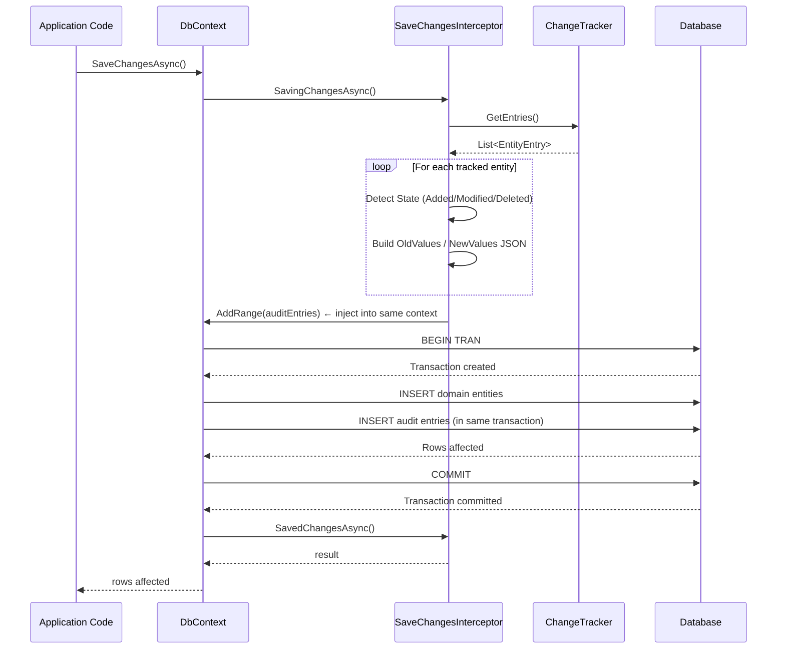

## 1 — Overview

The **SaveChangesInterceptor** is an EF Core infrastructure hook that fires before and after `SaveChanges` / `SaveChangesAsync`. It gives you a single point to capture every entity insert, update, or delete and write a corresponding **audit trail** record — without scattering logging code across every repository or service.

The pattern solves two problems:

1. **Cross-cutting concern** — audit logging touches every write operation; interceptors keep it out of business logic.
2. **Atomicity** — audit entries are written in the **same database transaction** as the domain changes, so you never have an audited change without audit rows or vice versa.

This note covers both the **EF Core interceptor approach** and a **Dapper manual approach** for projects not using EF Core's interceptor pipeline.

---

## 2 — AuditEntry Table Schema

The canonical audit table stores who changed what, when, and the before/after state.

```sql
CREATE TABLE [audit].[AuditEntry]
(
    [Id]            BIGINT IDENTITY(1,1) NOT NULL,
    [TableName]     NVARCHAR(255)        NOT NULL,   -- schema-qualified table name
    [EntityId]      NVARCHAR(100)        NOT NULL,   -- primary-key value as string
    [Operation]     CHAR(1)              NOT NULL,   -- 'I' = Insert, 'U' = Update, 'D' = Delete
    [OldValues]     NVARCHAR(MAX)        NULL,       -- JSON: previous column values (null for Insert)
    [NewValues]     NVARCHAR(MAX)        NOT NULL,   -- JSON: new column values (null for Delete)
    [ChangedBy]     NVARCHAR(128)        NOT NULL,   -- user principal name
    [ChangedAt]     DATETIME2(3)         NOT NULL,   -- application timestamp (UTC)
    [CorrelationId] UNIQUEIDENTIFIER     NULL,       -- optional: correlate multiple changes in one operation

    CONSTRAINT [PK_AuditEntry] PRIMARY KEY CLUSTERED ([Id])
);

CREATE NONCLUSTERED INDEX [IX_AuditEntry_TableName_EntityId]
    ON [audit].[AuditEntry] ([TableName], [EntityId])
    INCLUDE ([ChangedAt], [Operation]);

CREATE NONCLUSTERED INDEX [IX_AuditEntry_ChangedAt]
    ON [audit].[AuditEntry] ([ChangedAt] DESC);
```

**Column notes:**

- `OldValues` / `NewValues` use **NVARCHAR(MAX)** with JSON content. This keeps the schema flexible — you don't need a column per audited table.
- `EntityId` is stored as a string because primary keys can be `INT`, `UNIQUEIDENTIFIER`, or composite. If you have composite keys, concatenate them with a separator (e.g., `"123|456"`).
- `Operation` uses a single character: `I`, `U`, `D`.
- `ChangedAt` is **application time** (not `SYSDATETIME()` default) so the timestamp reflects the interceptor's `BeforeSave` call, not the SQL batch commit.

---

## 3 — EF Core — ISaveChangesInterceptor Implementation

EF Core provides the `ISaveChangesInterceptor` interface — part of the interception pipeline introduced in EF Core 5.0 with significant improvements in EF Core 6+.

### 3.1 — Interface Members

```csharp
public interface ISaveChangesInterceptor : IInterceptor
{
    // Synchronous — before save
    InterceptionResult<int> SavingChanges(
        DbContextEventData eventData,
        InterceptionResult<int> result);

    // Synchronous — after save (success or failure)
    int SavedChanges(
        SaveChangesCompletedEventData eventData,
        int result);

    // Synchronous — after save failure
    void SaveChangesFailed(
        DbContextErrorEventData eventData);

    // Async — before save
    ValueTask<InterceptionResult<int>> SavingChangesAsync(
        DbContextEventData eventData,
        InterceptionResult<int> result,
        CancellationToken cancellationToken = default);

    // Async — after save (success or failure)
    ValueTask<int> SavedChangesAsync(
        SaveChangesCompletedEventData eventData,
        int result,
        CancellationToken cancellationToken = default);

    // Async — after save failure
    Task SaveChangesFailedAsync(
        DbContextErrorEventData eventData,
        CancellationToken cancellationToken = default);
}
```

For audit logging we usually only implement `SavingChangesAsync` / `SavingChanges` — that's where we detect changes and write audit entries **before** the database commit.

### 3.2 — Complete AuditInterceptor

```csharp
using System.Text.Json;
using Microsoft.EntityFrameworkCore;
using Microsoft.EntityFrameworkCore.Diagnostics;
using Microsoft.EntityFrameworkCore.ChangeTracking;

public class AuditInterceptor : ISaveChangesInterceptor
{
    private readonly ICurrentUserService _userService;
    private readonly ISystemClock _clock;

    public AuditInterceptor(
        ICurrentUserService userService,
        ISystemClock clock)
    {
        _userService = userService;
        _clock = clock;
    }

    public InterceptionResult<int> SavingChanges(
        DbContextEventData eventData,
        InterceptionResult<int> result)
    {
        var context = eventData.Context;
        if (context is null)
            return result;

        var auditEntries = BuildAuditEntries(context);
        if (auditEntries.Count > 0)
        {
            // Inject audit entries into the same DbContext so they
            // are written in the same transaction as domain changes.
            context.Set<AuditEntry>().AddRange(auditEntries);
        }

        return result;
    }

    public async ValueTask<InterceptionResult<int>> SavingChangesAsync(
        DbContextEventData eventData,
        InterceptionResult<int> result,
        CancellationToken cancellationToken = default)
    {
        var context = eventData.Context;
        if (context is null)
            return result;

        var auditEntries = BuildAuditEntries(context);
        if (auditEntries.Count > 0)
        {
            await context.Set<AuditEntry>().AddRangeAsync(auditEntries, cancellationToken);
        }

        return result;
    }

    private List<AuditEntry> BuildAuditEntries(DbContext context)
    {
        var entries = new List<AuditEntry>();
        var changedBy = _userService.GetCurrentUser();
        var changedAt = _clock.UtcNow;
        var correlationId = Guid.NewGuid();

        foreach (var entry in context.ChangeTracker.Entries())
        {
            // Skip entities that are not in tracked states
            if (entry.State is EntityState.Detached or EntityState.Unchanged)
                continue;

            // Skip the AuditEntry entity itself to avoid infinite recursion
            if (entry.Entity is AuditEntry)
                continue;

            var tableName = GetTableName(entry);
            var entityId = GetPrimaryKeyValue(entry);
            var operation = entry.State switch
            {
                EntityState.Added    => 'I',
                EntityState.Modified => 'U',
                EntityState.Deleted  => 'D',
                _                    => continue
            };

            // Build OldValues and NewValues JSON
            string? oldValues = null;
            string? newValues = null;

            if (operation == 'U')
            {
                var oldValuesDict = new Dictionary<string, object?>();
                var newValuesDict = new Dictionary<string, object?>();

                foreach (var prop in entry.Properties)
                {
                    if (prop.IsTemporary)
                        continue;

                    // Only include properties that actually changed
                    if (prop.IsModified)
                    {
                        oldValuesDict[prop.Metadata.Name] = prop.OriginalValue;
                        newValuesDict[prop.Metadata.Name] = prop.CurrentValue;
                    }
                }

                if (oldValuesDict.Count > 0)
                {
                    oldValues = JsonSerializer.Serialize(oldValuesDict);
                    newValues = JsonSerializer.Serialize(newValuesDict);
                }
            }
            else if (operation == 'I')
            {
                var newValuesDict = new Dictionary<string, object?>();
                foreach (var prop in entry.Properties)
                {
                    if (prop.IsTemporary)
                        continue;
                    newValuesDict[prop.Metadata.Name] = prop.CurrentValue;
                }
                newValues = JsonSerializer.Serialize(newValuesDict);
            }
            else if (operation == 'D')
            {
                var oldValuesDict = new Dictionary<string, object?>();
                foreach (var prop in entry.Properties)
                {
                    if (prop.IsTemporary)
                        continue;
                    oldValuesDict[prop.Metadata.Name] = prop.OriginalValue;
                }
                oldValues = JsonSerializer.Serialize(oldValuesDict);
            }

            if (string.IsNullOrEmpty(newValues) && operation != 'D')
                continue;

            entries.Add(new AuditEntry
            {
                TableName     = tableName,
                EntityId      = entityId,
                Operation     = operation,
                OldValues     = oldValues,
                NewValues     = newValues,
                ChangedBy     = changedBy,
                ChangedAt     = changedAt,
                CorrelationId = correlationId
            });
        }

        return entries;
    }

    private static string GetTableName(EntityEntry entry)
    {
        var storeObject = StoreObjectIdentifier.Create(entry.Metadata, StoreObjectType.Table);
        if (storeObject is null)
            return entry.Metadata.GetTableName() ?? entry.Metadata.ShortName();

        return storeObject.Value.Schema is not null
            ? $"{storeObject.Value.Schema}.{storeObject.Value.Name}"
            : storeObject.Value.Name;
    }

    private static string GetPrimaryKeyValue(EntityEntry entry)
    {
        var key = entry.Metadata.FindPrimaryKey();
        if (key is null)
            return "<no-pk>";

        var keyValues = key.Properties
            .Select(p => entry.Property(p.Name).CurrentValue?.ToString() ?? "")
            .ToArray();

        return string.Join("|", keyValues);
    }
}
```

### 3.3 — AuditEntry Entity

```csharp
public class AuditEntry
{
    public long      Id             { get; set; }
    public string    TableName      { get; set; } = string.Empty;
    public string    EntityId       { get; set; } = string.Empty;
    public char      Operation      { get; set; }
    public string?   OldValues      { get; set; }
    public string?   NewValues      { get; set; }
    public string    ChangedBy      { get; set; } = string.Empty;
    public DateTime  ChangedAt      { get; set; }
    public Guid?     CorrelationId  { get; set; }
}
```

**Fluent configuration** (ensuring JSON columns don't get special treatment):

```csharp
public class AuditEntryConfiguration : IEntityTypeConfiguration<AuditEntry>
{
    public void Configure(EntityTypeBuilder<AuditEntry> builder)
    {
        builder.ToTable("AuditEntry", "audit");

        builder.HasKey(e => e.Id);

        builder.Property(e => e.TableName)
            .HasMaxLength(255)
            .IsRequired();

        builder.Property(e => e.EntityId)
            .HasMaxLength(100)
            .IsRequired();

        builder.Property(e => e.Operation)
            .HasMaxLength(1)
            .IsRequired()
            .IsFixedLength();

        builder.Property(e => e.OldValues)
            .HasColumnType("nvarchar(max)");

        builder.Property(e => e.NewValues)
            .HasColumnType("nvarchar(max)")
            .IsRequired();

        builder.Property(e => e.ChangedBy)
            .HasMaxLength(128)
            .IsRequired();

        builder.Property(e => e.ChangedAt)
            .HasPrecision(3)
            .IsRequired();

        builder.Property(e => e.CorrelationId);

        builder.HasIndex(e => new { e.TableName, e.EntityId })
            .IncludeProperties(e => new { e.ChangedAt, e.Operation });

        builder.HasIndex(e => e.ChangedAt)
            .IsDescending();
    }
}
```

---

## 4 — EF Core — Registration

The interceptor is registered via `AddDbContext` options:

### 4.1 — Simple Registration

```csharp
// Program.cs / Startup
services.AddDbContext<AppDbContext>((sp, options) =>
{
    var userService = sp.GetRequiredService<ICurrentUserService>();
    var clock       = sp.GetRequiredService<ISystemClock>();

    options.UseSqlServer(connectionString);
    options.AddInterceptors(new AuditInterceptor(userService, clock));
});
```

### 4.2 — DI-Friendly Registration

Prefer injecting scoped services into the interceptor via the DbContext or a scoped interceptor container:

```csharp
// Option A: DbContext resolves its own interceptor
public class AppDbContext : DbContext
{
    private readonly ICurrentUserService _userService;
    private readonly ISystemClock _clock;

    public AppDbContext(
        DbContextOptions<AppDbContext> options,
        ICurrentUserService? userService = null,
        ISystemClock? clock = null)
        : base(options)
    {
        // Resolved from DI when available
        _userService = userService ?? new DefaultUserService();
        _clock       = clock       ?? new SystemClock();
    }

    protected override void OnConfiguring(DbContextOptionsBuilder optionsBuilder)
    {
        if (!optionsBuilder.IsConfigured)
        {
            optionsBuilder.UseSqlServer(connectionString);
        }

        optionsBuilder.AddInterceptors(
            new AuditInterceptor(_userService!, _clock!));
    }
}

// Option B: Use a factory
services.AddSingleton<AuditInterceptor>();
services.AddDbContext<AppDbContext>((sp, options) =>
{
    options.UseSqlServer(connectionString);
    options.AddInterceptors(sp.GetRequiredService<AuditInterceptor>());
});
```

### 4.3 — EF Core 6+ Scoped Interceptors via ITenantService / IHttpContextAccessor

If `ICurrentUserService` is scoped (depends on `HttpContextAccessor`), you need scoped interceptors. EF Core 8+ supports `ISingletonInterceptor`, but for scoped data you wire through `DbContext.SaveChanges` in a partial method:

```csharp
public partial class AppDbContext : DbContext
{
    private readonly ICurrentUserService? _userService;

    public AppDbContext(
        DbContextOptions<AppDbContext> options,
        ICurrentUserService? userService = null)
        : base(options)
    {
        _userService = userService;
    }

    public override async Task<int> SaveChangesAsync(
        CancellationToken cancellationToken = default)
    {
        // If we need to pass scoped data to the interceptor, set it
        // via a scoped context bag or direct interceptor parameter.
        return await base.SaveChangesAsync(cancellationToken);
    }
}
```

For a cleaner approach, use **EF Core 8's `IInterceptorAggregator`** or manually store scoped state in `AsyncLocal`:

```csharp
public class AuditContext
{
    private static readonly AsyncLocal<AuditContext?> _current = new();
    public static AuditContext? Current
    {
        get => _current.Value;
        set => _current.Value = value;
    }

    public string User { get; set; } = string.Empty;
}

// Middleware sets it before any request uses the DbContext
public class AuditContextMiddleware
{
    public async Task InvokeAsync(HttpContext context)
    {
        AuditContext.Current = new AuditContext
        {
            User = context.User.Identity?.Name ?? "anonymous"
        };
        try
        {
            await _next(context);
        }
        finally
        {
            AuditContext.Current = null;
        }
    }
}
```

---

## 5 — Dapper — Manual Audit Logging

Without EF Core's interceptor pipeline, you must manually insert audit rows whenever you call `ExecuteAsync` / `QueryAsync`. The most common pattern is a **unit-of-work wrapper** or a **repository base class** that logs after each write.

### 5.1 — Manual Audit Repository

```csharp
public class CustomerRepository
{
    private readonly IDbConnection _connection;
    private readonly IDbTransaction? _transaction;
    private readonly ICurrentUserService _userService;
    private readonly ISystemClock _clock;

    public CustomerRepository(
        IDbConnection connection,
        ICurrentUserService userService,
        ISystemClock clock,
        IDbTransaction? transaction = null)
    {
        _connection  = connection;
        _transaction = transaction;
        _userService = userService;
        _clock       = clock;
    }

    public async Task<int> CreateAsync(
        Customer customer,
        CancellationToken ct = default)
    {
        const string sql = @"
            INSERT INTO [dbo].[Customer] ([Name], [Email], [Status])
            OUTPUT INSERTED.[Id]
            VALUES (@Name, @Email, @Status);";

        var id = await _connection.QuerySingleAsync<int>(sql, customer, _transaction);

        // Build audit entry manually
        var newValues = JsonSerializer.Serialize(new
        {
            customer.Name,
            customer.Email,
            customer.Status
        });

        const string auditSql = @"
            INSERT INTO [audit].[AuditEntry]
                ([TableName], [EntityId], [Operation], [OldValues], [NewValues],
                 [ChangedBy], [ChangedAt], [CorrelationId])
            VALUES
                (@TableName, @EntityId, @Operation, @OldValues, @NewValues,
                 @ChangedBy, @ChangedAt, @CorrelationId);";

        await _connection.ExecuteAsync(auditSql, new
        {
            TableName     = "dbo.Customer",
            EntityId      = id.ToString(),
            Operation     = 'I',
            OldValues     = (string?)null,
            NewValues     = newValues,
            ChangedBy     = _userService.GetCurrentUser(),
            ChangedAt     = _clock.UtcNow,
            CorrelationId = Guid.NewGuid()
        }, _transaction);

        return id;
    }
}
```

### 5.2 — Refactored: AuditHelper

To avoid repeating the audit insert in every repository method, extract a helper:

```csharp
public class AuditHelper
{
    private readonly ICurrentUserService _userService;
    private readonly ISystemClock _clock;

    public AuditHelper(
        ICurrentUserService userService,
        ISystemClock clock)
    {
        _userService = userService;
        _clock = clock;
    }

    public async Task LogAsync(
        IDbConnection connection,
        IDbTransaction? transaction,
        string tableName,
        string entityId,
        char operation,
        object? oldValues,
        object newValues,
        CancellationToken ct = default)
    {
        const string sql = @"
            INSERT INTO [audit].[AuditEntry]
                ([TableName], [EntityId], [Operation], [OldValues], [NewValues],
                 [ChangedBy], [ChangedAt], [CorrelationId])
            VALUES
                (@TableName, @EntityId, @Operation, @OldValues, @NewValues,
                 @ChangedBy, @ChangedAt, @CorrelationId);";

        await connection.ExecuteAsync(
            new CommandDefinition(
                sql,
                new
                {
                    TableName     = tableName,
                    EntityId      = entityId,
                    Operation     = operation,
                    OldValues     = oldValues is not null ? JsonSerializer.Serialize(oldValues) : null,
                    NewValues     = newValues is not null ? JsonSerializer.Serialize(newValues) : null,
                    ChangedBy     = _userService.GetCurrentUser(),
                    ChangedAt     = _clock.UtcNow,
                    CorrelationId = Guid.NewGuid()
                },
                transaction,
                cancellationToken: ct));
    }
}
```

### 5.3 — Repository With Helper

```csharp
public class OrderRepository
{
    private readonly IDbConnection _connection;
    private readonly IDbTransaction? _transaction;
    private readonly AuditHelper _audit;

    public OrderRepository(
        IDbConnection connection,
        IDbTransaction? transaction,
        AuditHelper audit)
    {
        _connection  = connection;
        _transaction = transaction;
        _audit       = audit;
    }

    public async Task UpdateStatusAsync(
        int orderId,
        string newStatus,
        CancellationToken ct = default)
    {
        // 1. Read old values (for audit)
        const string selectSql = "SELECT [Status] FROM [dbo].[Order] WHERE [Id] = @Id;";
        var oldStatus = await _connection.QuerySingleAsync<string>(
            selectSql, new { Id = orderId }, _transaction);

        // 2. Update
        const string updateSql = @"
            UPDATE [dbo].[Order]
            SET [Status] = @Status
            WHERE [Id] = @Id;";

        await _connection.ExecuteAsync(
            updateSql, new { Id = orderId, Status = newStatus }, _transaction);

        // 3. Audit
        await _audit.LogAsync(
            _connection,
            _transaction,
            "dbo.Order",
            orderId.ToString(),
            'U',
            new { Status = oldStatus },
            new { Status = newStatus },
            ct);
    }
}
```

### 5.4 — Dapper Unit of Work + Audit

For a full unit-of-work pattern where all repositories share one transaction:

```csharp
public class UnitOfWork : IDisposable
{
    private IDbConnection? _connection;
    private IDbTransaction? _transaction;
    private readonly AuditHelper _audit;

    public UnitOfWork(
        string connectionString,
        AuditHelper audit)
    {
        _connection = new SqlConnection(connectionString);
        _connection.Open();
        _transaction = _connection.BeginTransaction();
        _audit = audit;
    }

    public CustomerRepository Customers =>
        new(_connection!, _transaction, _audit);

    public OrderRepository Orders =>
        new(_connection!, _transaction, _audit);

    public void Commit()
    {
        _transaction?.Commit();
    }

    public void Rollback()
    {
        _transaction?.Rollback();
    }

    public void Dispose()
    {
        _transaction?.Dispose();
        _connection?.Dispose();
    }
}
```

---

## 6 — Mermaid Diagram — SaveChanges → Interceptor → Detect Changes → Write AuditEntry → Commit



**Key points in the flow:**

- The interceptor runs **inside** the `SaveChanges` pipeline, so any entities added there (`AddRange(auditEntries)`) are tracked and persisted in the same database transaction.
- `SavingChangesAsync` fires **before** the SQL is sent, so we can inject audit entities while the change tracker is still active.
- `SavedChangesAsync` fires **after** commit — useful for post-commit actions (e.g., publishing integration events), but not for audit writing since the changes are already committed.

---

## 7 — Gotchas

### 7.1 — Serializing Old/New Values as JSON

- **Circular references**: Entity graphs may have navigation properties that cause `JsonSerializer.Serialize` to throw. Always filter to scalar properties only — use `entry.Properties`, **not** `entry.Collections` or `entry.References`.
- **Large values**: `NVARCHAR(MAX)` can grow unbounded. Consider compressing or truncating very large strings (e.g., `MAXLENGTH` configurable in the interceptor).
- **Sensitive data**: Passwords, credit cards, PII should be excluded or masked. Maintain an allowlist or denylist of column names in the interceptor:

```csharp
private static readonly HashSet<string> SensitiveColumns = new(
    StringComparer.OrdinalIgnoreCase)
{
    "PasswordHash",
    "PasswordSalt",
    "CreditCardNumber",
    "SecurityStamp"
};

// In BuildAuditEntries, when serializing:
var filteredOld = oldValuesDict
    .Where(kvp => !SensitiveColumns.Contains(kvp.Key))
    .ToDictionary(kvp => kvp.Key, kvp => kvp.Value);
```

### 7.2 — Intercepting Within the Same Transaction

If you add audit entries inside `SavingChanges`, EF Core tracks them as part of the current `DbContext`. This means:

- The audit entries are **subject to the same interceptor** — which would cause infinite recursion if you don't guard with `if (entry.Entity is AuditEntry) continue;`.
- If the domain transaction rolls back, the audit rolls back too. This is **usually correct** (no audit for failed operations), but if you **always** want an audit even on failure, you need a separate database connection or a queue (outbox pattern).

### 7.3 — Async Interception

Always implement both `SavingChanges` **and** `SavingChangesAsync`. If the calling code uses the sync `SaveChanges`, EF Core will call the sync interceptor method. If you only implement the async version, the sync path will silently skip auditing.

### 7.4 — Performance Impact on Every Write

- The interceptor iterates every tracked entity and serializes values to JSON. On a context with hundreds of tracked entities (common in batch operations), this adds overhead.
- **Mitigation strategies**:
  - Only audit entities marked with a custom attribute (`[Auditable]`).
  - Only audit when specific properties change (check `entry.IsModified`).
  - Offload JSON serialization to a background queue (but that sacrifices atomicity).
  - Use `System.Text.Json` with `JsonSerializerOptions { WriteIndented = false }` to minimize payload size.

### 7.5 — Shadow Properties in Audit

If the entity has shadow properties (e.g., `CreatedAt`, `ModifiedAt`), the interceptor will capture them in the JSON. Decide whether shadow properties belong in the audit trail — usually they don't, since the audit table has its own `ChangedAt` column.

Filter them out:

```csharp
var properties = entry.Properties
    .Where(p => !p.Metadata.IsShadowProperty());
```

### 7.6 — Concurrency Conflicts

If `SaveChanges` throws `DbUpdateConcurrencyException`, the audit entries may have already been added to the context. On retry, the interceptor would add **duplicate** audit entries. To handle this, clear the audit entries before retrying:

```csharp
catch (DbUpdateConcurrencyException)
{
    // Remove audit entries that were added by the interceptor
    context.ChangeTracker.Entries<AuditEntry>()
        .ForEach(e => e.State = EntityState.Detached);

    // Retry logic...
}
```

### 7.7 — Testing the Interceptor

Unit testing an interceptor requires mocking the `DbContext`:

```csharp
[Fact]
public async Task SavingChangesAsync_AddsAuditEntries()
{
    var userService = new Mock<ICurrentUserService>();
    userService.Setup(s => s.GetCurrentUser()).Returns("test-user");

    var clock = new Mock<ISystemClock>();
    clock.Setup(c => c.UtcNow).Returns(new DateTime(2026, 6, 27, 12, 0, 0));

    var interceptor = new AuditInterceptor(userService.Object, clock.Object);

    // Arrange an in-memory DbContext with a tracked entity
    var options = new DbContextOptionsBuilder<TestDbContext>()
        .UseInMemoryDatabase("test")
        .Options;

    await using var context = new TestDbContext(options);
    context.Products.Add(new Product { Name = "Widget" });
    await context.SaveChangesAsync(); // First save adds the entity

    // Act
    context.Products.First().Name = "Widget V2";
    var eventData = new DbContextEventData(
        eventData: null!,
        context: context);

    await interceptor.SavingChangesAsync(
        eventData,
        InterceptionResult<int>.Default,
        CancellationToken.None);

    var auditEntries = await context.Set<AuditEntry>().ToListAsync();
    Assert.Single(auditEntries);
    Assert.Equal("dbo.Product", auditEntries[0].TableName);
    Assert.Equal('U', auditEntries[0].Operation);
}
```

---

## 8 — Related Patterns

| Pattern                                    | Link                                                                  | Relationship                                                        |
|--------------------------------------------|-----------------------------------------------------------------------|---------------------------------------------------------------------|
| Audit Trail — Shadow Properties            | [[8.894 — Audit Trail — Shadow Properties]]                           | Complementary: shadow props add columns, interceptor writes rows.   |
| Shadow Properties — Audit Without Domain   | [[8.911 — Shadow Properties — Audit Without Domain Change]]           | Extends shadow props for full audit context without domain changes. |
| Outbox Pattern — Database Implementation   | [[8.886 — Outbox Pattern — Database Implementation]]                  | Alternative: queue audit messages for async processing.             |
| Soft Delete — Global Query Filter          | [[8.889 — Soft Delete — Global Query Filter in EF Core]]              | Another cross-cutting concern solved via interceptor.               |
| EF Core — SaveChanges Interceptors         | [[3.070 — EF Core — SaveChanges Interceptors]]                        | Deep-dive on the interceptor interface.                             |
| DbContext and Change Tracking Fundamentals | [[3.001 — DbContext and Change Tracking Fundamentals]]                | Prerequisite: understand ChangeTracker before implementing audit.   |

---

## 9 — References

- [EF Core Documentation — SaveChanges Interceptors](https://learn.microsoft.com/en-us/ef/core/logging-events-diagnostics/interceptors#savechanges-interceptors)
- [EF Core ChangeTracker API](https://learn.microsoft.com/en-us/dotnet/api/microsoft.entityframeworkcore.changetracking.changetracker)
- [System.Text.Json Serialization](https://learn.microsoft.com/en-us/dotnet/standard/serialization/system-text-json/overview)
- [Martin Fowler — Audit Log](https://martinfowler.com/eaaDev/TimeAndAuditing.html)
- [NServiceBus — Outbox Pattern](https://docs.particular.net/nservicebus/outbox/)
- [SQL Server — JSON in NVARCHAR(MAX)](https://learn.microsoft.com/en-us/sql/relational-databases/json/json-data-sql-server)

---

## Appendix A — Full AuditInterceptor.cs Listing

```csharp
using System.Text.Json;
using Microsoft.EntityFrameworkCore;
using Microsoft.EntityFrameworkCore.Diagnostics;
using Microsoft.EntityFrameworkCore.ChangeTracking;
using Microsoft.EntityFrameworkCore.Metadata;

namespace YourApp.Infrastructure.Audit;

public interface ICurrentUserService
{
    string GetCurrentUser();
}

public interface ISystemClock
{
    DateTime UtcNow { get; }
}

public class SystemClock : ISystemClock
{
    public DateTime UtcNow => DateTime.UtcNow;
}

public class AuditInterceptor : ISaveChangesInterceptor
{
    private static readonly HashSet<string> SensitiveColumns = new(
        StringComparer.OrdinalIgnoreCase)
    {
        "PasswordHash", "PasswordSalt", "SecurityStamp"
    };

    private static readonly JsonSerializerOptions JsonOptions = new()
    {
        WriteIndented = false,
        DefaultIgnoreCondition = System.Text.Json.Serialization
            .JsonIgnoreCondition.WhenWritingNull
    };

    private readonly ICurrentUserService _userService;
    private readonly ISystemClock _clock;

    public AuditInterceptor(ICurrentUserService userService, ISystemClock clock)
    {
        _userService = userService;
        _clock = clock;
    }

    public InterceptionResult<int> SavingChanges(
        DbContextEventData eventData,
        InterceptionResult<int> result)
    {
        var context = eventData.Context;
        if (context is null) return result;

        var entries = BuildAuditEntries(context);
        if (entries.Count > 0)
            context.Set<AuditEntry>().AddRange(entries);

        return result;
    }

    public async ValueTask<InterceptionResult<int>> SavingChangesAsync(
        DbContextEventData eventData,
        InterceptionResult<int> result,
        CancellationToken ct = default)
    {
        var context = eventData.Context;
        if (context is null) return result;

        var entries = BuildAuditEntries(context);
        if (entries.Count > 0)
            await context.Set<AuditEntry>().AddRangeAsync(entries, ct);

        return result;
    }

    public int SavedChanges(
        SaveChangesCompletedEventData eventData,
        int result) => result;

    public ValueTask<int> SavedChangesAsync(
        SaveChangesCompletedEventData eventData,
        int result,
        CancellationToken ct = default)
        => ValueTask.FromResult(result);

    public void SaveChangesFailed(DbContextErrorEventData eventData) { }

    public Task SaveChangesFailedAsync(
        DbContextErrorEventData eventData,
        CancellationToken ct = default)
        => Task.CompletedTask;

    private List<AuditEntry> BuildAuditEntries(DbContext context)
    {
        var entries = new List<AuditEntry>();
        var changedBy = _userService.GetCurrentUser();
        var changedAt = _clock.UtcNow;
        var correlationId = Guid.NewGuid();

        foreach (var entry in context.ChangeTracker.Entries())
        {
            if (entry.State is EntityState.Detached or EntityState.Unchanged)
                continue;

            if (entry.Entity is AuditEntry)
                continue;

            var tableName = GetTableName(entry);
            var entityId = GetPrimaryKeyValue(entry);

            char operation = entry.State switch
            {
                EntityState.Added => 'I',
                EntityState.Modified => 'U',
                EntityState.Deleted => 'D',
                _ => continue
            };

            string? oldValues = null;
            string? newValues = null;

            var properties = entry.Properties
                .Where(p => !p.Metadata.IsShadowProperty() && !p.IsTemporary)
                .ToList();

            if (operation == 'U')
            {
                var oldDict = new Dictionary<string, object?>();
                var newDict = new Dictionary<string, object?>();

                foreach (var prop in properties.Where(p => p.IsModified))
                {
                    if (SensitiveColumns.Contains(prop.Metadata.Name))
                    {
                        oldDict[prop.Metadata.Name] = "***";
                        newDict[prop.Metadata.Name] = "***";
                    }
                    else
                    {
                        oldDict[prop.Metadata.Name] = prop.OriginalValue;
                        newDict[prop.Metadata.Name] = prop.CurrentValue;
                    }
                }

                if (oldDict.Count > 0)
                {
                    oldValues = JsonSerializer.Serialize(oldDict, JsonOptions);
                    newValues = JsonSerializer.Serialize(newDict, JsonOptions);
                }
            }
            else if (operation == 'I')
            {
                var dict = new Dictionary<string, object?>();
                foreach (var prop in properties)
                {
                    dict[prop.Metadata.Name] = prop.CurrentValue;
                }
                newValues = JsonSerializer.Serialize(dict, JsonOptions);
            }
            else if (operation == 'D')
            {
                var dict = new Dictionary<string, object?>();
                foreach (var prop in properties)
                {
                    dict[prop.Metadata.Name] = prop.OriginalValue;
                }
                oldValues = JsonSerializer.Serialize(dict, JsonOptions);
            }

            entries.Add(new AuditEntry
            {
                TableName = tableName,
                EntityId = entityId,
                Operation = operation,
                OldValues = oldValues,
                NewValues = newValues,
                ChangedBy = changedBy,
                ChangedAt = changedAt,
                CorrelationId = correlationId
            });
        }

        return entries;
    }

    private static string GetTableName(EntityEntry entry)
    {
        var storeObj = StoreObjectIdentifier.Create(entry.Metadata, StoreObjectType.Table);
        if (storeObj is null)
            return entry.Metadata.GetTableName() ?? entry.Metadata.ShortName();

        return storeObj.Value.Schema is not null
            ? $"{storeObj.Value.Schema}.{storeObj.Value.Name}"
            : storeObj.Value.Name;
    }

    private static string GetPrimaryKeyValue(EntityEntry entry)
    {
        var key = entry.Metadata.FindPrimaryKey();
        if (key is null) return "<no-pk>";

        return string.Join("|",
            key.Properties.Select(p =>
                entry.Property(p.Name).CurrentValue?.ToString() ?? ""));
    }
}
```

## Appendix B — Dapper AuditBatchProcessor

For high-volume scenarios, consider batching audit entries:

```csharp
public class AuditBatchProcessor
{
    private readonly string _connectionString;
    private readonly int _batchSize;

    public AuditBatchProcessor(string connectionString, int batchSize = 100)
    {
        _connectionString = connectionString;
        _batchSize = batchSize;
    }

    public async Task WriteBatchAsync(
        IReadOnlyList<AuditEntry> entries,
        CancellationToken ct = default)
    {
        using var conn = new SqlConnection(_connectionString);
        await conn.OpenAsync(ct);

        using var bulkCopy = new SqlBulkCopy(conn)
        {
            DestinationTableName = "[audit].[AuditEntry]",
            BatchSize = _batchSize
        };

        var table = ToDataTable(entries);
        await bulkCopy.WriteToServerAsync(table, ct);
    }

    private static DataTable ToDataTable(IReadOnlyList<AuditEntry> entries)
    {
        var dt = new DataTable();
        dt.Columns.Add("TableName", typeof(string));
        dt.Columns.Add("EntityId", typeof(string));
        dt.Columns.Add("Operation", typeof(char));
        dt.Columns.Add("OldValues", typeof(string));
        dt.Columns.Add("NewValues", typeof(string));
        dt.Columns.Add("ChangedBy", typeof(string));
        dt.Columns.Add("ChangedAt", typeof(DateTime));
        dt.Columns.Add("CorrelationId", typeof(Guid));

        foreach (var e in entries)
        {
            dt.Rows.Add(
                e.TableName, e.EntityId, e.Operation,
                e.OldValues, e.NewValues,
                e.ChangedBy, e.ChangedAt,
                e.CorrelationId);
        }

        return dt;
    }
}
```

---

## Appendix C — Custom [Auditable] Attribute

To selectively enable auditing on specific entities:

```csharp
[AttributeUsage(AttributeTargets.Class)]
public class AuditableAttribute : Attribute
{
    public bool IncludeSensitiveData { get; set; } = false;
}

// Usage
[Auditable]
public class Product { /* ... */ }

[Auditable(IncludeSensitiveData = true)]
public class PaymentMethod { /* ... */ }

// In BuildAuditEntries:
var auditable = entry.Metadata.ClrType
    .GetCustomAttribute<AuditableAttribute>();

if (auditable is null)
    continue; // skip non-auditable entities

// Use auditable.IncludeSensitiveData to decide masking
if (!auditable.IncludeSensitiveData && SensitiveColumns.Contains(prop.Metadata.Name))
{
    // mask the value
}
```

---

## Appendix D — Column-Level Exclusion

Sometimes you want to audit a table but exclude specific columns (e.g., binary data, large text fields):

```csharp
[AttributeUsage(AttributeTargets.Property)]
public class ExcludeFromAuditAttribute : Attribute { }

// Usage
public class Product
{
    public int Id { get; set; }
    public string Name { get; set; }

    [ExcludeFromAudit]
    public byte[] ProductImage { get; set; }
}

// In BuildAuditEntries:
private static bool IsExcludedFromAudit(IProperty property)
    => property.PropertyInfo?.GetCustomAttribute<ExcludeFromAuditAttribute>() is not null;

// Then filter:
var properties = entry.Properties
    .Where(p => !p.Metadata.IsShadowProperty()
             && !p.IsTemporary
             && !IsExcludedFromAudit(p.Metadata));
```
