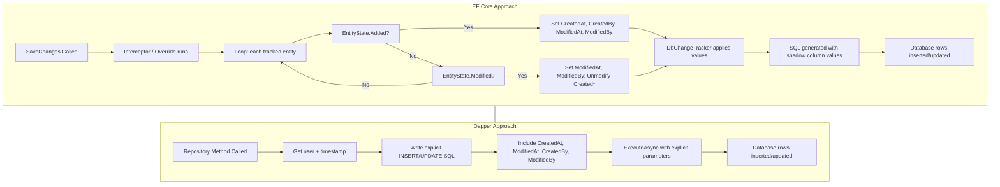

## 1 — Overview

**Shadow properties** are columns in the database table that have **no corresponding CLR property** in the entity class. EF Core manages their values entirely through the `ChangeTracker` — you set them via `EF.Property<T>` or `entry.Property("Name").CurrentValue`.

They are ideal for **cross-cutting audit columns** such as:

- `CreatedAt` — timestamp when the row was inserted
- `ModifiedAt` — timestamp when the row was last updated
- `CreatedBy` — user who created the row
- `ModifiedBy` — user who last modified the row

Because shadow properties are invisible to the domain model, they keep the entity classes clean of infrastructure concerns. The database column exists, EF Core populates it automatically (via conventions, fluent config, or interceptors), and you query it only when needed.

This note covers:
- EF Core fluent configuration of shadow properties
- Auto-populating via `SaveChangesInterceptor`
- Querying with `EF.Property<T>`
- The **Dapper approach** — explicit column management in SQL

---

## 2 — Fluent Configuration

Shadow properties are defined in `IEntityTypeConfiguration<T>` or `OnModelCreating`.

### 2.1 — Basic Configuration

```csharp
public class ProductConfiguration : IEntityTypeConfiguration<Product>
{
    public void Configure(EntityTypeBuilder<Product> builder)
    {
        // Shadow property with a default SQL value (INSERT only)
        builder.Property<DateTime>("CreatedAt")
            .HasDefaultValueSql("SYSUTCDATETIME()")
            .IsRequired()
            .HasPrecision(3);

        // Shadow property updated on every modification
        builder.Property<DateTime>("ModifiedAt")
            .HasDefaultValueSql("SYSUTCDATETIME()")
            .IsRequired()
            .HasPrecision(3);

        // String shadow properties (user identity)
        builder.Property<string>("CreatedBy")
            .HasMaxLength(128)
            .IsRequired();

        builder.Property<string>("ModifiedBy")
            .HasMaxLength(128)
            .IsRequired();

        // Optional: concurrency token
        builder.Property<byte[]>("RowVersion")
            .IsRowVersion();
    }
}
```

### 2.2 — Shared Configuration via Base Entity

When many entities share the same audit columns, define them once with a **model-building convention** or a base configuration method:

```csharp
public static class ShadowPropertyConfiguration
{
    public static void AddAuditShadowProperties<TEntity>(
        this EntityTypeBuilder<TEntity> builder)
        where TEntity : class
    {
        builder.Property<DateTime>("CreatedAt")
            .HasDefaultValueSql("SYSUTCDATETIME()")
            .HasPrecision(3)
            .IsRequired();

        builder.Property<DateTime>("ModifiedAt")
            .HasDefaultValueSql("SYSUTCDATETIME()")
            .HasPrecision(3)
            .IsRequired();

        builder.Property<string>("CreatedBy")
            .HasMaxLength(128)
            .IsRequired();

        builder.Property<string>("ModifiedBy")
            .HasMaxLength(128)
            .IsRequired();
    }
}

// Usage in each configuration:
public class ProductConfiguration : IEntityTypeConfiguration<Product>
{
    public void Configure(EntityTypeBuilder<Product> builder)
    {
        builder.ToTable("Product");
        builder.HasKey(e => e.Id);
        builder.Property(e => e.Name).HasMaxLength(200);

        builder.AddAuditShadowProperties();
    }
}
```

### 2.3 — EF Core 8+ Pre-Convention Model Configuration

For a truly DRY approach, use a **pre-convention model configuration** that applies shadow properties to **every entity**:

```csharp
public class AuditModelConfiguration : IModelConfiguration
{
    public void Configure(IMutableModel model)
    {
        foreach (var entity in model.GetEntityTypes())
        {
            // Skip join entities or types without a key
            if (entity.IsKeyless || entity.HasSharedClrType)
                continue;

            // Add shadow property for every entity
            entity.AddProperty("CreatedAt", typeof(DateTime))
                .SetDefaultValueSql("SYSUTCDATETIME()");

            entity.AddProperty("ModifiedAt", typeof(DateTime))
                .SetDefaultValueSql("SYSUTCDATETIME()");

            entity.AddProperty("CreatedBy", typeof(string))
                .SetMaxLength(128);

            entity.AddProperty("ModifiedBy", typeof(string))
                .SetMaxLength(128);
        }
    }
}

// In OnModelCreating:
protected override void OnModelCreating(ModelBuilder modelBuilder)
{
    modelBuilder.ApplyConfiguration(new AuditModelConfiguration());
    // Rest of configuration...
}
```

### 2.4 — Generated SQL from Shadow Properties

Given the fluent configuration above, EF Core migrations produce:

```sql
CREATE TABLE [dbo].[Product] (
    [Id]         INT              NOT NULL IDENTITY(1,1),
    [Name]       NVARCHAR(200)    NOT NULL,
    [CreatedAt]  DATETIME2(3)     NOT NULL CONSTRAINT [DF_Product_CreatedAt] DEFAULT (SYSUTCDATETIME()),
    [ModifiedAt] DATETIME2(3)     NOT NULL CONSTRAINT [DF_Product_ModifiedAt] DEFAULT (SYSUTCDATETIME()),
    [CreatedBy]  NVARCHAR(128)    NOT NULL,
    [ModifiedBy] NVARCHAR(128)    NOT NULL,

    CONSTRAINT [PK_Product] PRIMARY KEY CLUSTERED ([Id])
);
```

---

## 3 — EF Core — SaveChangesInterceptor Auto-Setting Shadow Properties

The shadow property columns exist in the database, but **someone must populate them**. You have three options:

1. **Database defaults** — only work for `CreatedAt` / `ModifiedAt` (not for `CreatedBy` / `ModifiedBy` since the DB doesn't know the user).
2. **Override `SaveChangesAsync`** in the DbContext.
3. **SaveChangesInterceptor** — the cleanest approach for cross-cutting concerns.

### 3.1 — Interceptor Implementation

```csharp
public class AuditShadowPropertyInterceptor : ISaveChangesInterceptor
{
    private readonly ICurrentUserService _userService;
    private readonly ISystemClock _clock;

    public AuditShadowPropertyInterceptor(
        ICurrentUserService userService,
        ISystemClock clock)
    {
        _userService = userService;
        _clock = clock;
    }

    public ValueTask<InterceptionResult<int>> SavingChangesAsync(
        DbContextEventData eventData,
        InterceptionResult<int> result,
        CancellationToken ct = default)
    {
        var context = eventData.Context;
        if (context is null)
            return ValueTask.FromResult(result);

        var user = _userService.GetCurrentUser();
        var now = _clock.UtcNow;

        foreach (var entry in context.ChangeTracker.Entries())
        {
            if (entry.Entity is AuditEntry) // avoid infinite loop
                continue;

            if (entry.State == EntityState.Added)
            {
                // Set CreatedAt / CreatedBy only on INSERT
                entry.Property("CreatedAt").CurrentValue = now;
                entry.Property("CreatedBy").CurrentValue = user;

                // Also set ModifiedAt / ModifiedBy on initial insert
                entry.Property("ModifiedAt").CurrentValue = now;
                entry.Property("ModifiedBy").CurrentValue = user;
            }

            if (entry.State == EntityState.Modified)
            {
                // Update ModifiedAt / ModifiedBy on every update
                entry.Property("ModifiedAt").CurrentValue = now;
                entry.Property("ModifiedBy").CurrentValue = user;

                // Ensure CreatedAt / CreatedBy are NOT marked as modified
                entry.Property("CreatedAt").IsModified = false;
                entry.Property("CreatedBy").IsModified = false;
            }
        }

        return ValueTask.FromResult(result);
    }

    // Sync version
    public InterceptionResult<int> SavingChanges(
        DbContextEventData eventData,
        InterceptionResult<int> result)
    {
        // Same logic as async version (omitted for brevity — use the same pattern)
        return result;
    }

    // Other interface members — no-op
    public int SavedChanges(SaveChangesCompletedEventData eventData, int result) => result;
    public ValueTask<int> SavedChangesAsync(SaveChangesCompletedEventData eventData, int result, CancellationToken ct = default)
        => ValueTask.FromResult(result);
    public void SaveChangesFailed(DbContextErrorEventData eventData) { }
    public Task SaveChangesFailedAsync(DbContextErrorEventData eventData, CancellationToken ct = default)
        => Task.CompletedTask;
}
```

### 3.2 — DbContext Override (Alternative to Interceptor)

If you prefer not to use interceptors, override `SaveChanges` directly:

```csharp
public class AppDbContext : DbContext
{
    private readonly ICurrentUserService _userService;
    private readonly ISystemClock _clock;

    public AppDbContext(
        DbContextOptions<AppDbContext> options,
        ICurrentUserService? userService = null,
        ISystemClock? clock = null)
        : base(options)
    {
        _userService = userService ?? new DefaultUserService();
        _clock = clock ?? new SystemClock();
    }

    public override Task<int> SaveChangesAsync(
        bool acceptAllChangesOnSuccess,
        CancellationToken ct = default)
    {
        SetShadowProperties();
        return base.SaveChangesAsync(acceptAllChangesOnSuccess, ct);
    }

    public override int SaveChanges(bool acceptAllChangesOnSuccess)
    {
        SetShadowProperties();
        return base.SaveChanges(acceptAllChangesOnSuccess);
    }

    private void SetShadowProperties()
    {
        var user = _userService.GetCurrentUser();
        var now = _clock.UtcNow;

        foreach (var entry in ChangeTracker.Entries())
        {
            if (entry.State == EntityState.Added)
            {
                entry.Property("CreatedAt").CurrentValue = now;
                entry.Property("CreatedBy").CurrentValue = now; // BUG: should be user
                entry.Property("ModifiedAt").CurrentValue = now;
                entry.Property("ModifiedBy").CurrentValue = user;
            }

            if (entry.State == EntityState.Modified)
            {
                entry.Property("ModifiedAt").CurrentValue = now;
                entry.Property("ModifiedBy").CurrentValue = user;
                entry.Property("CreatedAt").IsModified = false;
                entry.Property("CreatedBy").IsModified = false;
            }
        }
    }
}
```

> **Note:** The `CreatedBy` line above has an intentional bug — it sets `now` (DateTime) instead of `user` (string). This demonstrates the kind of mistake that is easier to catch when this logic lives in a single interceptor rather than scattered across repositories.

---

## 4 — EF Core — Querying Shadow Properties

Because shadow properties don't have CLR properties, you must use the `EF.Property<T>` method to read or filter by them.

### 4.1 — LINQ Queries with EF.Property

```csharp
// Read a shadow property value
var createdAt = await context.Products
    .Where(p => p.Id == productId)
    .Select(p => EF.Property<DateTime>(p, "CreatedAt"))
    .FirstAsync();

// Filter by shadow property
var recentProducts = await context.Products
    .Where(p => EF.Property<DateTime>(p, "CreatedAt") >= since)
    .ToListAsync();

// Order by shadow property
var sorted = await context.Products
    .OrderByDescending(p => EF.Property<DateTime>(p, "ModifiedAt"))
    .Take(10)
    .ToListAsync();
```

### 4.2 — Include Shadow Properties in Projections

```csharp
var result = await context.Products
    .Where(p => p.Id == id)
    .Select(p => new ProductDto
    {
        Id         = p.Id,
        Name       = p.Name,
        CreatedAt  = EF.Property<DateTime>(p, "CreatedAt"),
        CreatedBy  = EF.Property<string>(p, "CreatedBy"),
        ModifiedAt = EF.Property<DateTime>(p, "ModifiedAt"),
        ModifiedBy = EF.Property<string>(p, "ModifiedBy")
    })
    .FirstAsync();
```

### 4.3 — Update Shadow Properties Directly

```csharp
var product = await context.Products.FindAsync(id);

// Read shadow property
var createdAt = context.Entry(product)
    .Property<DateTime>("CreatedAt").CurrentValue;

// Update shadow property (rare — usually only during migration/data fixes)
context.Entry(product)
    .Property<DateTime>("CreatedAt").CurrentValue = correctedDate;
context.Entry(product)
    .Property("CreatedAt").IsModified = true;

await context.SaveChangesAsync();
```

### 4.4 — Checking Shadow Property Values in ChangeTracker

```csharp
var entry = context.Entry(product);
Console.WriteLine($"CreatedAt: {entry.Property<DateTime>("CreatedAt").CurrentValue}");
Console.WriteLine($"CreatedBy: {entry.Property<string>("CreatedBy").CurrentValue}");
Console.WriteLine($"ModifiedAt: {entry.Property<DateTime>("ModifiedAt").CurrentValue}");
Console.WriteLine($"ModifiedBy: {entry.Property<string>("ModifiedBy").CurrentValue}");

// Check original values (useful for audit)
Console.WriteLine($"Original ModifiedAt: {entry.Property<DateTime>("ModifiedAt").OriginalValue}");
```

---

## 5 — Dapper — Explicit Columns in SQL

In Dapper, there are no shadow properties — you manage audit columns explicitly in every SQL statement. This is more verbose but gives you full control.

### 5.1 — Insert with Audit Columns

```csharp
public class ProductRepository
{
    private readonly IDbConnection _connection;
    private readonly IDbTransaction? _transaction;
    private readonly ICurrentUserService _userService;
    private readonly ISystemClock _clock;

    public ProductRepository(
        IDbConnection connection,
        IDbTransaction? transaction,
        ICurrentUserService userService,
        ISystemClock clock)
    {
        _connection = connection;
        _transaction = transaction;
        _userService = userService;
        _clock = clock;
    }

    public async Task<int> CreateAsync(
        string name,
        CancellationToken ct = default)
    {
        var now = _clock.UtcNow;
        var user = _userService.GetCurrentUser();

        const string sql = @"
            INSERT INTO [dbo].[Product]
                ([Name], [CreatedAt], [ModifiedAt], [CreatedBy], [ModifiedBy])
            VALUES
                (@Name, @CreatedAt, @ModifiedAt, @CreatedBy, @ModifiedBy);

            SELECT CAST(SCOPE_IDENTITY() AS INT);";

        var id = await _connection.QuerySingleAsync<int>(sql, new
        {
            Name = name,
            CreatedAt = now,
            ModifiedAt = now,
            CreatedBy = user,
            ModifiedBy = user
        }, _transaction);

        return id;
    }
}
```

### 5.2 — Update with ModifiedAt / ModifiedBy

```csharp
public async Task<bool> UpdateNameAsync(
    int id,
    string newName,
    CancellationToken ct = default)
{
    var now = _clock.UtcNow;
    var user = _userService.GetCurrentUser();

    const string sql = @"
        UPDATE [dbo].[Product]
        SET
            [Name]       = @NewName,
            [ModifiedAt] = @ModifiedAt,
            [ModifiedBy] = @ModifiedBy
        WHERE [Id] = @Id;";

    var rows = await _connection.ExecuteAsync(sql, new
    {
        Id = id,
        NewName = newName,
        ModifiedAt = now,
        ModifiedBy = user
    }, _transaction);

    return rows > 0;
}
```

### 5.3 — Querying Audit Columns

```csharp
public class ProductDto
{
    public int Id { get; set; }
    public string Name { get; set; } = string.Empty;
    public DateTime CreatedAt { get; set; }
    public string CreatedBy { get; set; } = string.Empty;
    public DateTime ModifiedAt { get; set; }
    public string ModifiedBy { get; set; } = string.Empty;
}

public async Task<ProductDto?> GetByIdAsync(int id)
{
    const string sql = @"
        SELECT
            [Id],
            [Name],
            [CreatedAt],
            [CreatedBy],
            [ModifiedAt],
            [ModifiedBy]
        FROM [dbo].[Product]
        WHERE [Id] = @Id;";

    return await _connection.QuerySingleOrDefaultAsync<ProductDto>(
        sql, new { Id = id }, _transaction);
}
```

### 5.4 — Repository Base Class for DRY Audit Columns

To avoid repeating the audit columns in every repository, create a base class:

```csharp
public abstract class RepositoryBase
{
    private readonly ICurrentUserService _userService;
    private readonly ISystemClock _clock;

    protected RepositoryBase(
        ICurrentUserService userService,
        ISystemClock clock)
    {
        _userService = userService;
        _clock = clock;
    }

    protected (DateTime Now, string User) GetAuditContext()
    {
        return (_clock.UtcNow, _userService.GetCurrentUser());
    }

    // Helper to create dynamic parameters with audit columns
    protected object WithAuditInsert(object parameters)
    {
        var (now, user) = GetAuditContext();
        return new
        {
            CreatedAt = now,
            ModifiedAt = now,
            CreatedBy = user,
            ModifiedBy = user
        }.Merge(parameters); // requires a Merge helper or anonymous type merging
    }
}

// Helper to merge two anonymous objects (simplified — use a library like Dapper.Mapper or write a reflection helper)
public static class ObjectExtensions
{
    public static IDictionary<string, object?> ToDictionary(this object obj)
    {
        return obj.GetType().GetProperties()
            .ToDictionary(p => p.Name, p => p.GetValue(obj));
    }

    public static IDictionary<string, object?> Merge(
        this object obj1, object obj2)
    {
        var result = obj1.ToDictionary();
        foreach (var kvp in obj2.ToDictionary())
        {
            result[kvp.Key] = kvp.Value;
        }
        return result;
    }
}
```

### 5.5 — Dapper with Stored Procedures

```sql
CREATE PROCEDURE [dbo].[Product_Insert]
    @Name        NVARCHAR(200),
    @CreatedBy   NVARCHAR(128)
AS
BEGIN
    SET NOCOUNT ON;

    DECLARE @Now DATETIME2(3) = SYSUTCDATETIME();

    INSERT INTO [dbo].[Product]
        ([Name], [CreatedAt], [ModifiedAt], [CreatedBy], [ModifiedBy])
    VALUES
        (@Name, @Now, @Now, @CreatedBy, @CreatedBy);

    SELECT SCOPE_IDENTITY() AS [Id];
END;
```

```csharp
public async Task<int> CreateViaStoredProcAsync(string name)
{
    var user = _userService.GetCurrentUser();

    var id = await _connection.QuerySingleAsync<int>(
        "[dbo].[Product_Insert]",
        new { Name = name, CreatedBy = user },
        commandType: CommandType.StoredProcedure,
        transaction: _transaction);

    return id;
}
```

---

## 6 — Mermaid Diagram — EF Core vs Dapper



**Key difference**: EF Core manages shadow property values automatically in the interceptor/override and you don't need to mention them in LINQ (only when querying via `EF.Property`). Dapper requires explicit column names in every SQL statement — plus the infrastructure to supply `_userService` and `_clock` in every repository.

---

## 7 — Gotchas

### 7.1 — Forgetting to Set in Dapper

This is the #1 bug. You write a new `INSERT` statement, add columns from the domain model, but **forget** the `CreatedAt`, `CreatedBy`, etc. columns. The SQL succeeds (if they're nullable or have defaults), but your audit trail is incomplete.

**Mitigations:**
- Make audit columns `NOT NULL` in the schema — the INSERT will fail if you forget them.
- Use a **repository base class** or **SQL template** that always includes audit columns.
- Use stored procedures that accept the audit values as parameters (the SP signature reminds you).
- Use SQL Server's `DEFAULT` constraints as a fallback (though `CreatedBy` won't have a meaningful default).

### 7.2 — Shadow Properties Are Invisible in the Domain Model

Developers who aren't aware of shadow properties might be confused when:

- A column exists in the database but is not in the entity class.
- They see `SYSUTCDATETIME()` in the migration but don't know it's used.
- They try to set `product.CreatedAt = ...` and get a compilation error (because there's no CLR property).

**Mitigations:**
- Document the convention in your team's coding standards.
- Use the **database default** for `CreatedAt` (so at least the INSERT has a value even without the interceptor).
- Consider logging a warning if shadow properties are found with null values.

### 7.3 — Querying with EF.Property

You must **remember to use `EF.Property<T>`** when querying. It's easy to write:

```csharp
var products = await context.Products
    .Where(p => p.CreatedAt > since) // ❌ Compilation error — no CLR property
    .ToListAsync();
```

The correct form is:

```csharp
var products = await context.Products
    .Where(p => EF.Property<DateTime>(p, "CreatedAt") > since) // ✅
    .ToListAsync();
```

String-based property names are **not refactoring-safe**. Consider using `nameof` with a constant:

```csharp
public static class ShadowPropertyNames
{
    public const string CreatedAt  = "CreatedAt";
    public const string ModifiedAt = "ModifiedAt";
    public const string CreatedBy  = "CreatedBy";
    public const string ModifiedBy = "ModifiedBy";
}

// Usage
EF.Property<DateTime>(p, ShadowPropertyNames.CreatedAt)
```

### 7.4 — Setting CreatedAt / CreatedBy After Insert

Once a row is inserted, `CreatedAt` and `CreatedBy` should **never** change. The interceptor must explicitly mark them as unmodified during updates:

```csharp
entry.Property("CreatedAt").IsModified = false;
entry.Property("CreatedBy").IsModified = false;
```

Without this, if you happen to read the entity and then save again (even without changing anything), EF Core may try to re-send the `CreatedAt` value. This can cause issues if the column lacks a default or if you're using triggers that expect specific behavior.

### 7.5 — Shadow Properties and Migrations

When you add shadow properties via fluent configuration, EF Core generates migration operations like:

```csharp
migrationBuilder.AddColumn<DateTime>(
    name: "CreatedAt",
    table: "Product",
    type: "DATETIME2(3)",
    nullable: false,
    defaultValueSql: "SYSUTCDATETIME()");
```

If you later **remove the shadow property from fluent config**, EF Core will generate a migration to **drop the column**. Be careful — that's a destructive operation. Always create a new migration and review it before applying.

### 7.6 — Shadow Properties in Table-Per-Hierarchy (TPH) Inheritance

In TPH mappings, shadow properties defined on the base entity configuration apply to all derived types. This is usually what you want, but watch out for:

- The discriminator column is itself a shadow property.
- Derived types may accidentally get duplicate shadow property definitions.

### 7.7 — Performance of EF.Property in LINQ

Using `EF.Property<T>` in LINQ queries is translated to SQL, so there's no in-memory filtering overhead. However, too many shadow property queries can make the SQL verbose:

```sql
-- Generated from EF.Property<DateTime>(p, "CreatedAt") > @since
SELECT [p].[Id], [p].[Name], [p].[CreatedAt], [p].[CreatedBy],
       [p].[ModifiedAt], [p].[ModifiedBy]
FROM [Product] AS [p]
WHERE [p].[CreatedAt] > @since
```

This is fine — it's just a regular column reference at the SQL level.

### 7.8 — Dapper — Null Audit Values

If `ICurrentUserService.GetCurrentUser()` returns `null` or empty string, the audit column will be `NULL`. Decide on a fallback:

```csharp
var user = _userService.GetCurrentUser() ?? "SYSTEM";
```

### 7.9 — Time Zone Consistency

Always store audit timestamps in **UTC**. The database may be in a different time zone than the application. Use `DateTime.UtcNow` in C# and `SYSUTCDATETIME()` (not `GETDATE()`) in SQL Server defaults.

---

## 8 — Related Patterns

| Pattern                                    | Link                                                                  | Relationship                                                        |
|--------------------------------------------|-----------------------------------------------------------------------|---------------------------------------------------------------------|
| Audit Trail — EF Core SaveChanges Interceptor | [[8.893 — Audit Trail — EF Core SaveChanges Interceptor]]        | Shadow props provide columns; interceptor writes full audit rows.   |
| Shadow Properties — Audit Without Domain   | [[8.911 — Shadow Properties — Audit Without Domain Change]]           | Extends shadow props pattern to eliminate domain model audit code.  |
| Soft Delete — Global Query Filter in EF Core | [[8.889 — Soft Delete — Global Query Filter in EF Core]]           | Another cross-cutting concern: delete flag as shadow property.      |
| EF Core — Shadow Properties                | [[3.055 — EF Core — Shadow Properties]]                               | Deep-dive on the shadow property mechanism.                         |
| DbContext and Change Tracking Fundamentals | [[3.001 — DbContext and Change Tracking Fundamentals]]                | Required understanding of ChangeTracker for auto-population.        |
| Optimistic Concurrency — RowVersion        | [[8.895 — Optimistic Concurrency — RowVersion in EF Core]]            | RowVersion is itself a shadow property in many implementations.     |

---

## 9 — References

- [EF Core Documentation — Shadow Properties](https://learn.microsoft.com/en-us/ef/core/modeling/shadow-properties)
- [EF Core — Conventions for Shadow Properties](https://learn.microsoft.com/en-us/ef/core/modeling/model-conventions)
- [EF Core — EF.Property Method](https://learn.microsoft.com/en-us/dotnet/api/microsoft.entityframeworkcore.ef.property)
- [EF Core — Saving Data with Interceptors](https://learn.microsoft.com/en-us/ef/core/logging-events-diagnostics/interceptors)
- [SQL Server — SYSUTCDATETIME](https://learn.microsoft.com/en-us/sql/t-sql/functions/sysutcdatetime-transact-sql)
- [Dapper — Parameterized Queries](https://www.learndapper.com/parameters)
- [Clean Architecture — Audit Trail with Shadow Properties](https://github.com/jasontaylordev/CleanArchitecture)

---

## Appendix A — Full Shadow Property Constants and Helpers

```csharp
public static class ShadowPropertyNames
{
    public const string CreatedAt  = nameof(CreatedAt);
    public const string CreatedBy  = nameof(CreatedBy);
    public const string ModifiedAt = nameof(ModifiedAt);
    public const string ModifiedBy = nameof(ModifiedBy);
    public const string DeletedAt  = nameof(DeletedAt);
    public const string IsDeleted  = nameof(IsDeleted);
    public const string RowVersion = nameof(RowVersion);
}

public static class ShadowPropertyHelpers
{
    public static void SetCreated(this EntityEntry entry, string user, DateTime now)
    {
        entry.Property(ShadowPropertyNames.CreatedAt).CurrentValue = now;
        entry.Property(ShadowPropertyNames.CreatedBy).CurrentValue = user;
    }

    public static void SetModified(this EntityEntry entry, string user, DateTime now)
    {
        entry.Property(ShadowPropertyNames.ModifiedAt).CurrentValue = now;
        entry.Property(ShadowPropertyNames.ModifiedBy).CurrentValue = user;
    }

    public static void SetSoftDelete(this EntityEntry entry, DateTime now)
    {
        entry.Property(ShadowPropertyNames.IsDeleted).CurrentValue = true;
        entry.Property(ShadowPropertyNames.DeletedAt).CurrentValue = now;
    }

    public static T GetShadow<T>(this EntityEntry entry, string propertyName)
        where T : struct
    {
        return entry.Property<T>(propertyName).CurrentValue;
    }

    public static string? GetShadowString(this EntityEntry entry, string propertyName)
    {
        return entry.Property<string>(propertyName).CurrentValue;
    }
}
```

## Appendix B — Global Convention for Shadow Properties (EF Core 6+)

EF Core 6 introduced **pre-convention configuration** that lets you apply shadow properties globally:

```csharp
public class AuditModelConvention : IModelFinalizingConvention
{
    public void ProcessModelFinalizing(
        IConventionModelBuilder modelBuilder,
        IConventionContext<IConventionModelBuilder> context)
    {
        foreach (var entityType in modelBuilder.Metadata.GetEntityTypes())
        {
            if (entityType.IsKeyless || entityType.HasSharedClrType)
                continue;

            var createdAt = entityType.AddProperty(
                "CreatedAt", typeof(DateTime), required: true);
            createdAt.SetDefaultValueSql("SYSUTCDATETIME()");

            var modifiedAt = entityType.AddProperty(
                "ModifiedAt", typeof(DateTime), required: true);
            modifiedAt.SetDefaultValueSql("SYSUTCDATETIME()");

            var createdBy = entityType.AddProperty(
                "CreatedBy", typeof(string), required: true);
            createdBy.SetMaxLength(128);

            var modifiedBy = entityType.AddProperty(
                "ModifiedBy", typeof(string), required: true);
            modifiedBy.SetMaxLength(128);
        }
    }
}

// In DbContext:
protected override void OnModelCreating(ModelBuilder modelBuilder)
{
    modelBuilder.AddPostConvention(new AuditModelConvention());
}
```

## Appendix C — Dapper Audit Columns as Default Constraint Fallback

If you want the database to provide defaults when Dapper forgets, use constraints:

```sql
ALTER TABLE [dbo].[Product]
    ADD CONSTRAINT [DF_Product_CreatedAt]
    DEFAULT (SYSUTCDATETIME()) FOR [CreatedAt];

ALTER TABLE [dbo].[Product]
    ADD CONSTRAINT [DF_Product_ModifiedAt]
    DEFAULT (SYSUTCDATETIME()) FOR [ModifiedAt];

ALTER TABLE [dbo].[Product]
    ADD CONSTRAINT [DF_Product_CreatedBy]
    DEFAULT (ORIGINAL_LOGIN()) FOR [CreatedBy];

ALTER TABLE [dbo].[Product]
    ADD CONSTRAINT [DF_Product_ModifiedBy]
    DEFAULT (ORIGINAL_LOGIN()) FOR [ModifiedBy];
```

> **Warning:** `ORIGINAL_LOGIN()` returns the SQL Server login, not the application user. This is a fallback only — the interceptor or repository should still set the correct application user.

## Appendix D — Testing Shadow Properties

```csharp
[Fact]
public async Task SaveChanges_SetsShadowProperties()
{
    // Arrange
    var userService = new Mock<ICurrentUserService>();
    userService.Setup(s => s.GetCurrentUser()).Returns("test-user");

    var clock = new Mock<ISystemClock>();
    clock.Setup(c => c.UtcNow).Returns(new DateTime(2026, 6, 27, 12, 0, 0));

    var options = new DbContextOptionsBuilder<TestDbContext>()
        .UseInMemoryDatabase("test-shadow")
        .Options;

    await using var context = new TestDbContext(options, userService.Object, clock.Object);

    // Act
    context.Products.Add(new Product { Name = "Widget" });
    await context.SaveChangesAsync();

    // Assert
    var product = await context.Products.FirstAsync();
    var createdAt = context.Entry(product).Property<DateTime>("CreatedAt").CurrentValue;
    var createdBy = context.Entry(product).Property<string>("CreatedBy").CurrentValue;

    Assert.Equal(clock.Object.UtcNow, createdAt);
    Assert.Equal("test-user", createdBy);
}
```

## Appendix E — Shadow Properties with Soft Delete

Combining shadow properties with soft delete:

```csharp
// Configuration
builder.Property<bool>("IsDeleted")
    .HasDefaultValue(false)
    .IsRequired();

builder.Property<DateTime?>("DeletedAt");

// Global query filter
builder.HasQueryFilter(e => !EF.Property<bool>(e, "IsDeleted"));

// Interceptor sets them
if (entry.State == EntityState.Deleted)
{
    entry.State = EntityState.Modified; // change to soft delete
    entry.Property("IsDeleted").CurrentValue = true;
    entry.Property("DeletedAt").CurrentValue = now;
    entry.Property("ModifiedAt").CurrentValue = now;
    entry.Property("ModifiedBy").CurrentValue = user;
}
```
