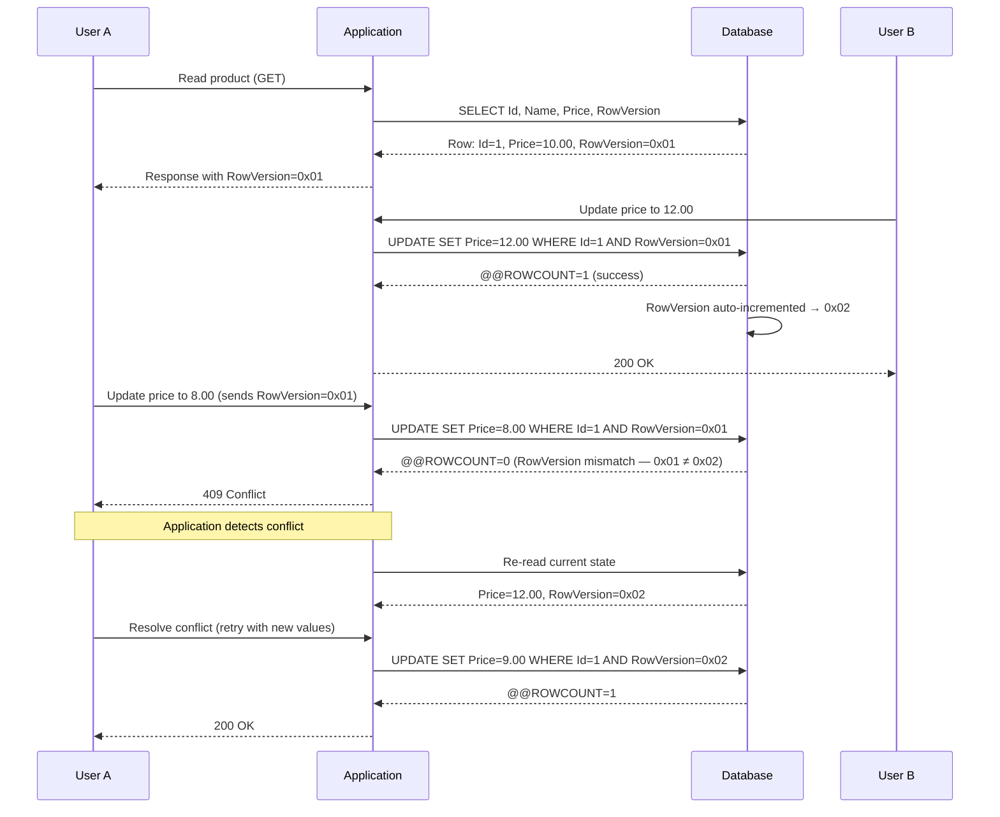

## 1 — Overview

**Optimistic concurrency** assumes conflicts are rare. Instead of locking rows on read, the application reads a version identifier — typically a `rowversion` column — and includes that original version in the `WHERE` clause of every `UPDATE`/`DELETE`. If another session modified the row between the read and the write, the version won't match, the database affects zero rows, and the application can detect the conflict and retry.

**RowVersion** (also called `TIMESTAMP` in SQL Server, though it's not a time value) is an `8-byte binary` column that SQL Server auto-increments on every insert and update. You cannot set it manually — the database always generates the next value.

This note covers:
- Table schema with `rowversion` column
- EF Core fluent configuration: `IsRowVersion()` and `ConcurrencyCheck`
- Handling `DbUpdateConcurrencyException`
- Dapper approach: manual version checking with `WHERE RowVersion = @OriginalVersion`
- Retry strategies

---

## 2 — Table Schema

```sql
CREATE TABLE [dbo].[Product]
(
    [Id]            INT              NOT NULL IDENTITY(1,1),
    [Name]          NVARCHAR(200)    NOT NULL,
    [Price]         DECIMAL(18,2)    NOT NULL,
    [StockQuantity] INT              NOT NULL,
    [RowVersion]    ROWVERSION       NOT NULL,  -- 8-byte binary, auto-incrementing

    CONSTRAINT [PK_Product] PRIMARY KEY CLUSTERED ([Id])
);
```

**Key characteristics of `ROWVERSION`**:

- It is **not** a date/time — it's a `VARBINARY(8)` that increments database-wide.
- It is **mandatory** for this column to be included in the `SET` clause of an update? No — SQL Server updates it automatically when any column in the row changes.
- You can have only **one** `ROWVERSION` column per table.
- The value wraps from `0xFF...FF` to `0x00...00` after reaching the maximum value (very unlikely but theoretically possible).

### Indexing RowVersion

If you frequently query by `RowVersion` (e.g., for incremental data sync), create a non-clustered index:

```sql
CREATE NONCLUSTERED INDEX [IX_Product_RowVersion]
    ON [dbo].[Product] ([RowVersion]);
```

---

## 3 — EF Core — Fluent Configuration

EF Core supports two approaches:
1. `IsRowVersion()` — for `byte[]` properties (recommended for SQL Server `ROWVERSION`).
2. `IsConcurrencyToken()` — for any property type (e.g., `int`, `Guid`, `DateTime`).

### 3.1 — Using IsRowVersion

```csharp
public class Product
{
    public int      Id     { get; set; }
    public string   Name   { get; set; } = string.Empty;
    public decimal  Price  { get; set; }
    public int      StockQuantity { get; set; }
    public byte[]   RowVersion { get; set; } = Array.Empty<byte>();
}
```

```csharp
public class ProductConfiguration : IEntityTypeConfiguration<Product>
{
    public void Configure(EntityTypeBuilder<Product> builder)
    {
        builder.ToTable("Product");

        builder.HasKey(e => e.Id);

        builder.Property(e => e.Name)
            .HasMaxLength(200)
            .IsRequired();

        builder.Property(e => e.Price)
            .HasPrecision(18, 2)
            .IsRequired();

        builder.Property(e => e.StockQuantity)
            .IsRequired();

        // RowVersion configuration
        builder.Property(e => e.RowVersion)
            .IsRowVersion()              // Marks as rowversion / concurrency token
            .IsConcurrencyToken()        // Explicit (redundant with IsRowVersion but harmless)
            .HasColumnType("rowversion");     // Ensures correct SQL type in migrations
    }
}
```

### 3.2 — Using IsConcurrencyToken (Alternative)

If you're not using SQL Server's `ROWVERSION` type (e.g., PostgreSQL or custom versioning):

```csharp
builder.Property(e => e.Version)
    .IsConcurrencyToken();  // Any property type — EF Core includes it in WHERE clause
```

### 3.3 — Generated SQL

Given the configuration above, an update produces:

```sql
SET NOCOUNT ON;

UPDATE [Product]
SET [Name]           = @p0,
    [Price]          = @p1,
    [StockQuantity]  = @p2
WHERE [Id]           = @p3
  AND [RowVersion]   = @p4;  -- ← original RowVersion from the read

SELECT [RowVersion]
FROM [Product]
WHERE @@ROWCOUNT = 1
  AND [Id] = @p3;
```

EF Core checks `@@ROWCOUNT` after the update. If zero rows were affected (because the `RowVersion` didn't match), it throws `DbUpdateConcurrencyException`.

---

## 4 — EF Core — Handling DbUpdateConcurrencyException

When a conflict is detected, you have several options:

1. **Retry** — re-read the entity and re-apply the change.
2. **Notify the user** — show the current state and let the user decide.
3. **Last-writer-wins** — forcibly overwrite (usually a bad idea).

### 4.1 — Basic Retry Loop

```csharp
public async Task<Product> UpdatePriceAsync(int productId, decimal newPrice)
{
    var maxRetries = 3;
    var retryDelay = TimeSpan.FromMilliseconds(100);

    for (var attempt = 0; attempt < maxRetries; attempt++)
    {
        try
        {
            await using var context = _contextFactory.Create();

            var product = await context.Products.FindAsync(productId);
            if (product is null)
                throw new NotFoundException($"Product {productId} not found");

            product.Price = newPrice;

            await context.SaveChangesAsync();
            return product;
        }
        catch (DbUpdateConcurrencyException ex) when (attempt < maxRetries - 1)
        {
            // Log the conflict
            _logger.LogWarning(ex,
                "Concurrency conflict updating product {ProductId}, attempt {Attempt}",
                productId, attempt + 1);

            // Wait before retrying
            await Task.Delay(retryDelay * (attempt + 1));
        }
    }

    throw new ConcurrencyException(
        $"Failed to update product {productId} after {maxRetries} attempts.");
}
```

### 4.2 — Database-Wide Values (Entry.GetDatabaseValues)

For more granular handling, reload the entity from the database and let the caller resolve:

```csharp
catch (DbUpdateConcurrencyException ex)
{
    foreach (var entry in ex.Entries)
    {
        // Read current database values
        var databaseValues = await entry.GetDatabaseValuesAsync();

        if (databaseValues is null)
        {
            // The entity was deleted by another user
            throw new ConcurrencyException("The entity was deleted by another user.");
        }

        // Refresh original values (which includes the new RowVersion)
        entry.OriginalValues.SetValues(databaseValues);

        // Now retry the save with the original RowVersion updated
        // This is a "refresh and retry" approach — the user's changes are re-applied
        // against the latest database state.
    }

    await context.SaveChangesAsync();
}
```

### 4.3 — Custom Conflict Resolution Strategy

```csharp
public enum ConcurrencyResolution
{
    ClientWins,   // Overwrite (last-writer-wins)
    StoreWins,    // Discard client changes
    Merge         // Custom merge logic
}

public async Task<int> SaveWithConflictResolutionAsync<TEntity>(
    TEntity entity,
    ConcurrencyResolution resolution,
    CancellationToken ct = default)
    where TEntity : class
{
    try
    {
        return await SaveChangesAsync(ct);
    }
    catch (DbUpdateConcurrencyException ex)
    {
        return resolution switch
        {
            ConcurrencyResolution.ClientWins => await ClientWinsAsync(ex, ct),
            ConcurrencyResolution.StoreWins => await StoreWinsAsync(ex),
            ConcurrencyResolution.Merge => await MergeAsync<TEntity>(ex, ct),
            _ => throw
        };
    }
}

private async Task<int> ClientWinsAsync(
    DbUpdateConcurrencyException ex,
    CancellationToken ct)
{
    foreach (var entry in ex.Entries)
    {
        var databaseValues = await entry.GetDatabaseValuesAsync(ct);
        if (databaseValues is null)
            throw;

        // Set original values to current database values,
        // then the client values will overwrite on next save
        entry.OriginalValues.SetValues(databaseValues);
    }

    return await SaveChangesAsync(ct);
}

private async Task<int> StoreWinsAsync(
    DbUpdateConcurrencyException ex)
{
    foreach (var entry in ex.Entries)
    {
        // Reload from database, discarding client changes
        await entry.ReloadAsync();
    }

    // ReloadAsync already refreshed the entity, but we return 0
    // because no changes were saved
    return 0;
}

private async Task<int> MergeAsync<TEntity>(
    DbUpdateConcurrencyException ex,
    CancellationToken ct)
    where TEntity : class
{
    foreach (var entry in ex.Entries)
    {
        var databaseValues = await entry.GetDatabaseValuesAsync(ct);
        if (databaseValues is null)
            throw;

        var currentValues = entry.CurrentValues;
        var originalValues = entry.OriginalValues;

        // For each property, keep the database value unless
        // the client explicitly modified it
        foreach (var property in entry.Metadata.GetProperties())
        {
            if (property.Name is "RowVersion" or "Id")
                continue;

            var originalValue = originalValues[property];
            var currentValue = currentValues[property];
            var databaseValue = databaseValues[property];

            // If the client didn't change this property, keep the database value
            if (Equals(originalValue, currentValue))
            {
                currentValues[property] = databaseValue;
            }
            // Otherwise, client's change wins (override the database value)
        }

        // Update original values to reflect the latest database state
        entry.OriginalValues.SetValues(databaseValues);
    }

    return await SaveChangesAsync(ct);
}
```

### 4.4 — ASP.NET Core — Passing RowVersion to the Client

For web applications, the client must send back the original `RowVersion`:

```csharp
// GET endpoint — returns RowVersion as Base64 string
[HttpGet("{id}")]
public async Task<ActionResult<ProductDto>> Get(int id)
{
    var product = await _context.Products.FindAsync(id);
    if (product is null)
        return NotFound();

    return new ProductDto
    {
        Id             = product.Id,
        Name           = product.Name,
        Price          = product.Price,
        StockQuantity  = product.StockQuantity,
        RowVersion     = Convert.ToBase64String(product.RowVersion) // ← send to client
    };
}

// PUT endpoint — client sends RowVersion back
[HttpPut("{id}")]
public async Task<ActionResult> Update(int id, ProductUpdateDto dto)
{
    var product = await _context.Products.FindAsync(id);
    if (product is null)
        return NotFound();

    product.Name          = dto.Name;
    product.Price         = dto.Price;
    product.StockQuantity = dto.StockQuantity;

    // Set the RowVersion from the client's request
    product.RowVersion = Convert.FromBase64String(dto.RowVersion);

    try
    {
        await _context.SaveChangesAsync();
        return NoContent();
    }
    catch (DbUpdateConcurrencyException)
    {
        return Conflict(new
        {
            Message = "The resource was modified by another user.",
            CurrentRowVersion = Convert.ToBase64String(
                (await _context.Products.FindAsync(id))!.RowVersion)
        });
    }
}
```

---

## 5 — Dapper — WHERE RowVersion = @OriginalVersion

Without EF Core's change tracking, you must manually include the `RowVersion` check in every `UPDATE`/`DELETE` and check the number of affected rows.

### 5.1 — Basic Update with Version Check

```csharp
public class ProductRepository
{
    private readonly IDbConnection _connection;
    private readonly IDbTransaction? _transaction;

    public ProductRepository(
        IDbConnection connection,
        IDbTransaction? transaction = null)
    {
        _connection = connection;
        _transaction = transaction;
    }

    public async Task<Product?> GetByIdAsync(int id)
    {
        const string sql = @"
            SELECT [Id], [Name], [Price], [StockQuantity], [RowVersion]
            FROM [Product]
            WHERE [Id] = @Id;";

        return await _connection.QuerySingleOrDefaultAsync<Product>(
            sql, new { Id = id }, _transaction);
    }

    public async Task<UpdateResult> UpdatePriceAsync(
        int id,
        decimal newPrice,
        byte[] originalRowVersion)
    {
        const string sql = @"
            UPDATE [Product]
            SET [Price] = @NewPrice
            WHERE [Id] = @Id
              AND [RowVersion] = @OriginalRowVersion;";

        var rowsAffected = await _connection.ExecuteAsync(sql, new
        {
            Id = id,
            NewPrice = newPrice,
            OriginalRowVersion = originalRowVersion  // byte[] parameter
        }, _transaction);

        if (rowsAffected == 0)
        {
            // Check if the row still exists
            var exists = await _connection.ExecuteScalarAsync<bool>(
                "SELECT COUNT(1) FROM [Product] WHERE [Id] = @Id",
                new { Id = id }, _transaction);

            return exists
                ? UpdateResult.Conflict("Row was modified by another user.")
                : UpdateResult.NotFound("Product not found.");
        }

        // Re-read the new RowVersion if needed
        const string getNewVersion = @"
            SELECT [RowVersion]
            FROM [Product]
            WHERE [Id] = @Id;";

        var newRowVersion = await _connection.QuerySingleAsync<byte[]>(
            getNewVersion, new { Id = id }, _transaction);

        return UpdateResult.Success(newRowVersion);
    }
}

public class UpdateResult
{
    public bool     Success       { get; private set; }
    public bool     Conflict      { get; private set; }
    public bool     NotFound      { get; private set; }
    public string?  Message       { get; private set; }
    public byte[]?  NewRowVersion { get; private set; }

    public static UpdateResult Success(byte[] newVersion) => new()
    {
        Success = true, NewRowVersion = newVersion
    };

    public static UpdateResult Conflict(string message) => new()
    {
        Conflict = true, Message = message
    };

    public static UpdateResult NotFound(string message) => new()
    {
        NotFound = true, Message = message
    };
}
```

### 5.2 — Handling byte[] Comparison in SQL

SQL Server compares `ROWVERSION` values directly — no special syntax needed:

```sql
WHERE [RowVersion] = @OriginalRowVersion
```

The `byte[]` parameter is passed naturally from C# via Dapper's parameter handling. However, there are some gotchas:

- **Case sensitivity**: Not applicable — `ROWVERSION` is binary.
- **Wrapping**: If the RowVersion wraps from `0xFFFFFFFFFFFFFFFF` to `0x0000000000000000`, comparison still works logically for equality checks. But **greater-than/less-than** comparisons shift: you need to handle the wrap if doing incremental sync (`WHERE RowVersion > @LastSync`).

### 5.3 — Retry Logic for Dapper

```csharp
public async Task<Product> RetryUpdatePriceAsync(
    int productId,
    decimal newPrice,
    int maxRetries = 3)
{
    for (var attempt = 0; attempt < maxRetries; attempt++)
    {
        // 1. Re-read (fresh snapshot)
        var product = await GetByIdAsync(productId);
        if (product is null)
            throw new NotFoundException($"Product {productId} not found");

        // 2. Apply change in-memory
        product.Price = newPrice;

        // 3. Try to persist
        var result = await UpdatePriceAsync(
            productId, newPrice, product.RowVersion);

        if (result.Success)
            return product;

        if (result.NotFound)
            throw new NotFoundException($"Product {productId} not found");

        // Conflict — wait and retry
        if (attempt < maxRetries - 1)
        {
            var delay = TimeSpan.FromMilliseconds(50 * Math.Pow(2, attempt));
            await Task.Delay(delay);
        }
    }

    throw new ConcurrencyException(
        $"Failed to update product {productId} after {maxRetries} attempts.");
}
```

### 5.4 — Batch Update with RowVersion

```csharp
public async Task<int> BulkUpdatePricesAsync(
    IDictionary<int, (decimal Price, byte[] RowVersion)> updates)
{
    var rowsAffected = 0;

    using var conn = new SqlConnection(_connectionString);
    await conn.OpenAsync();

    using var tx = conn.BeginTransaction();

    try
    {
        foreach (var (id, (price, rowVersion)) in updates)
        {
            const string sql = @"
                UPDATE [Product]
                SET [Price] = @Price
                WHERE [Id] = @Id
                  AND [RowVersion] = @RowVersion;

                SELECT @@ROWCOUNT;";

            var affected = await conn.ExecuteScalarAsync<int>(
                sql, new { Id = id, Price = price, RowVersion = rowVersion }, tx);

            if (affected == 0)
            {
                // Check if conflict or not found
                var exists = await conn.ExecuteScalarAsync<bool>(
                    "SELECT COUNT(1) FROM [Product] WHERE [Id] = @Id",
                    new { Id = id }, tx);

                throw exists
                    ? new ConcurrencyException($"Conflict on product {id}")
                    : new NotFoundException($"Product {id} not found");
            }

            rowsAffected += affected;
        }

        tx.Commit();
        return rowsAffected;
    }
    catch
    {
        tx.Rollback();
        throw;
    }
}
```

### 5.5 — Dapper with Stored Procedure

```sql
CREATE PROCEDURE [dbo].[Product_UpdatePrice]
    @Id                 INT,
    @NewPrice           DECIMAL(18,2),
    @OriginalRowVersion ROWVERSION  -- accepts byte[] parameter from C#
AS
BEGIN
    SET NOCOUNT ON;

    UPDATE [Product]
    SET [Price] = @NewPrice
    WHERE [Id] = @Id
      AND [RowVersion] = @OriginalRowVersion;

    IF @@ROWCOUNT = 0
    BEGIN
        -- Check existence
        IF EXISTS (SELECT 1 FROM [Product] WHERE [Id] = @Id)
            SELECT 2 AS [ResultCode]; -- Conflict
        ELSE
            SELECT 1 AS [ResultCode]; -- Not found
        RETURN;
    END

    SELECT 0 AS [ResultCode]; -- Success

    -- Return new RowVersion
    SELECT [RowVersion]
    FROM [Product]
    WHERE [Id] = @Id;
END;
```

```csharp
public async Task<(int ResultCode, byte[]? NewRowVersion)> UpdatePriceViaProcAsync(
    int id, decimal newPrice, byte[] originalRowVersion)
{
    using var multi = await _connection.QueryMultipleAsync(
        "[dbo].[Product_UpdatePrice]",
        new
        {
            Id = id,
            NewPrice = newPrice,
            OriginalRowVersion = originalRowVersion
        },
        commandType: CommandType.StoredProcedure,
        transaction: _transaction);

    var resultCode = await multi.ReadSingleAsync<int>();
    var newRowVersion = resultCode == 0
        ? await multi.ReadSingleAsync<byte[]>()
        : null;

    return (resultCode, newRowVersion);
}
```

---

## 6 — Mermaid Diagram — Optimistic Concurrency Flow



### Flow Summary

1. **Read**: Application reads the entity and its current `RowVersion`.
2. **Modify**: Application applies changes in memory (or in DTO).
3. **Write**: Application sends `UPDATE` with `WHERE RowVersion = @OriginalVersion`.
4. **Check**: Database compares `RowVersion`. If it changed, zero rows affected.
5. **Conflict**: Application detects zero rows → `DbUpdateConcurrencyException` (EF Core) or manual check (Dapper).
6. **Resolve**: Re-read, merge, or notify user.

---

## 7 — Gotchas

### 7.1 — byte[] Comparison in Dapper

Dapper handles `byte[]` parameters correctly, but be aware of these issues:

- **Null vs empty array**: If `RowVersion` is `NULL` in the database (not recommended), comparison fails. Always make `ROWVERSION` columns `NOT NULL`.
- **Base64 encoding**: When passing `RowVersion` over HTTP, encode as Base64. On the server, decode back to `byte[]`. Never try to compare Base64 strings directly — the encoding may differ.
- **Array reference vs value**: Two `byte[]` with the same bytes but different references will compare correctly in SQL (they're passed as parameters to the database), but in C# you must use `StructuralComparisons.StructuralEqualityComparer.Equals(a, b)` — not `==` or `Equals`.

```csharp
public static bool AreEqual(byte[]? a, byte[]? b)
{
    if (ReferenceEquals(a, b)) return true;
    if (a is null || b is null) return false;
    if (a.Length != b.Length) return false;

    return StructuralComparisons.StructuralEqualityComparer.Equals(a, b);
}
```

### 7.2 — RowVersion Wraps at Max Value

`ROWVERSION` is a `VARBINARY(8)` — its maximum value is `0xFFFFFFFFFFFFFFFF`. When it reaches this value, the **next increment wraps to `0x0000000000000000`**. This is extremely unlikely (it would require ~18 quintillion updates to a single database), but:

- If you do incremental syncs with `WHERE RowVersion > @LastSync`, the wrap will **break** — you'll miss rows with versions near the max and see old rows again after wrap.
- Solution: Use a `BIGINT` counter instead of `ROWVERSION` for sync scenarios, or detect the wrap and snapshot.

### 7.3 — Cannot Set RowVersion Manually

You cannot set `RowVersion` via `UPDATE`:

```sql
UPDATE [Product] SET [RowVersion] = 0x123456 -- ❌ Error: Cannot update rowversion column
```

In EF Core, this means you must **never** manually assign to the `RowVersion` property (except when setting the original value for concurrency checking). The interceptor pattern for audit shadow properties does **not** apply to `RowVersion` — the database manages it.

### 7.4 — Retry Logic for Conflicts

Always implement retry logic with **exponential backoff**:

```csharp
var delay = TimeSpan.FromMilliseconds(50 * Math.Pow(2, attempt)); // 50ms, 100ms, 200ms...
```

Without retry, a brief burst of concurrent writes causes unnecessary failures. With too-aggressive retry (immediate), you may flood the database.

Limit retries to 3–5. Beyond that, the conflict is likely systemic (e.g., two processes fighting over the same row), and immediate retry won't help.

### 7.5 — EF Core — DbUpdateConcurrencyException Only on SaveChanges

`DbUpdateConcurrencyException` is thrown **only when `SaveChangesAsync` runs** — not when you set entity properties. This means:

- You may set properties, call `SaveChangesAsync`, and get an exception for a row you read 10 seconds ago.
- The exception's `Entries` property gives you the `EntityEntry` instances that failed.
- You must decide whether to retry, merge, or abort within the catch block.

### 7.6 — Shadow Property RowVersion

If you define `RowVersion` as a shadow property (no CLR property), you still need to handle concurrency:

```csharp
builder.Property<byte[]>("RowVersion")
    .IsRowVersion();

// Querying:
var rowVersion = context.Entry(product)
    .Property<byte[]>("RowVersion").CurrentValue;
```

The problem: you can't easily pass the shadow property value to the client (no CLR property to serialize). Solution: **always map RowVersion as a real property** when you need client-side concurrency.

### 7.7 — RowVersion in Table-Per-Hierarchy (TPH)

In TPH inheritance, the `RowVersion` column exists on the base table. The derived types share it — an update to any derived type's properties increments the same RowVersion. This is correct behavior but can cause unexpected conflicts if two different derived types are updated concurrently.

### 7.8 — Testing Concurrency

Testing optimistic concurrency requires simulating concurrent updates:

```csharp
[Fact]
public async Task Update_WithStaleRowVersion_ThrowsConcurrencyException()
{
    // Arrange
    var options = new DbContextOptionsBuilder<TestDbContext>()
        .UseSqlServer(connectionString) // must be real SQL Server — InMemory doesn't support RowVersion
        .Options;

    // Session 1 — read the entity
    int productId;
    byte[] originalVersion;

    await using (var ctx1 = new TestDbContext(options))
    {
        var product = new Product { Name = "Widget", Price = 10 };
        ctx1.Products.Add(product);
        await ctx1.SaveChangesAsync();
        productId = product.Id;
        originalVersion = product.RowVersion;
    }

    // Session 2 — update the same entity (simulates another user)
    await using (var ctx2 = new TestDbContext(options))
    {
        var p = await ctx2.Products.FindAsync(productId);
        p!.Price = 15;
        await ctx2.SaveChangesAsync();
    }

    // Session 1 — try to update with stale RowVersion
    await using (var ctx3 = new TestDbContext(options))
    {
        var p = await ctx3.Products.FindAsync(productId);
        p!.Price = 20;
        p.RowVersion = originalVersion; // ← stale version

        await Assert.ThrowsAsync<DbUpdateConcurrencyException>(
            () => ctx3.SaveChangesAsync());
    }
}
```

### 7.9 — Performance Impact

`ROWVERSION` adds overhead to `UPDATE` operations:

- SQL Server must read and increment the database-wide `@@DBTS` counter.
- The `WHERE` clause includes the `RowVersion` column — ensure it's indexed if your table has many rows.
- EF Core issues a `SELECT` after `UPDATE` to read the new `RowVersion` value (to update the tracked entity). This is an extra round-trip.

```sql
-- EF Core also does:
SELECT [RowVersion]
FROM [Product]
WHERE @@ROWCOUNT = 1 AND [Id] = @p3;
```

This is usually negligible but matters in bulk operations.

---

## 8 — Related Patterns

| Pattern                                        | Link                                                                  | Relationship                                                       |
|------------------------------------------------|-----------------------------------------------------------------------|--------------------------------------------------------------------|
| Optimistic Concurrency — Timestamp/RowVersion  | [[8.616 — Optimistic Concurrency — Timestamp and RowVersion]]         | Foundational pattern — defines RowVersion concept.                 |
| rowversion — SQL Server Implementation         | [[8.617 — rowversion — SQL Server Implementation]]                    | SQL Server-specific behaviors.                                     |
| Optimistic Concurrency in EF Core — Token      | [[8.618 — Optimistic Concurrency in EF Core — ConcurrencyToken]]      | Alternative: non-RowVersion concurrency tokens.                    |
| Pessimistic Locking — FromSqlRaw with UPDLOCK  | [[8.896 — Pessimistic Locking — FromSqlRaw with UPDLOCK]]             | Competing pattern: pessimistic blocking vs optimistic detection.    |
| Deadlock — Retry Logic in .NET                 | [[8.684 — Deadlock — Retry Logic in .NET]]                            | Retry strategies that apply to both optimistic and pessimistic.    |
| Dapper — Transactions — IDbTransaction         | [[8.864 — Dapper — Transactions — IDbTransaction]]                    | Transaction context for concurrency checks.                        |

---

## 9 — References

- [SQL Server ROWVERSION Documentation](https://learn.microsoft.com/en-us/sql/t-sql/data-types/rowversion-transact-sql)
- [EF Core Concurrency Tokens](https://learn.microsoft.com/en-us/ef/core/modeling/concurrency)
- [EF Core DbUpdateConcurrencyException](https://learn.microsoft.com/en-us/dotnet/api/microsoft.entityframeworkcore.dbupdateconcurrencyexception)
- [Dapper — Executing Commands](https://www.learndapper.com/execute)
- [Handling Concurrency Conflicts — Microsoft Docs](https://learn.microsoft.com/en-us/aspnet/core/data/ef-rp/concurrency)
- [Martin Fowler — Optimistic Offline Lock](https://martinfowler.com/eaaCatalog/optimisticOfflineLock.html)

---

## Appendix A — Full Repository with RowVersion (Dapper)

```csharp
public class ProductRepository : IProductRepository
{
    private readonly string _connectionString;
    private readonly ILogger<ProductRepository> _logger;

    public ProductRepository(
        string connectionString,
        ILogger<ProductRepository> logger)
    {
        _connectionString = connectionString;
        _logger = logger;
    }

    private IDbConnection CreateConnection()
        => new SqlConnection(_connectionString);

    public async Task<ProductDto?> GetByIdAsync(int id)
    {
        using var conn = CreateConnection();
        return await conn.QuerySingleOrDefaultAsync<ProductDto>(
            "SELECT * FROM [Product] WHERE [Id] = @Id",
            new { Id = id });
    }

    public async Task<ProductDto> CreateAsync(string name, decimal price, int quantity)
    {
        using var conn = CreateConnection();

        const string sql = @"
            INSERT INTO [Product] ([Name], [Price], [StockQuantity])
            OUTPUT INSERTED.*
            VALUES (@Name, @Price, @StockQuantity);";

        return await conn.QuerySingleAsync<ProductDto>(sql,
            new { Name = name, Price = price, StockQuantity = quantity });
    }

    public async Task<ConcurrencyResult> UpdatePriceAsync(
        int id, decimal newPrice, byte[] rowVersion)
    {
        using var conn = CreateConnection();
        using var tx = conn.BeginTransaction();

        try
        {
            const string sql = @"
                UPDATE [Product]
                SET [Price] = @NewPrice
                WHERE [Id] = @Id
                  AND [RowVersion] = @RowVersion;

                SELECT @@ROWCOUNT;";

            var affected = await conn.ExecuteScalarAsync<int>(
                sql, new { Id = id, NewPrice = newPrice, RowVersion = rowVersion },
                tx);

            if (affected == 0)
            {
                tx.Rollback();

                var exists = await conn.ExecuteScalarAsync<bool>(
                    "SELECT COUNT(1) FROM [Product] WHERE [Id] = @Id",
                    new { Id = id });

                return exists
                    ? ConcurrencyResult.Conflict()
                    : ConcurrencyResult.NotFound();
            }

            var newRowVersion = await conn.QuerySingleAsync<byte[]>(
                "SELECT [RowVersion] FROM [Product] WHERE [Id] = @Id",
                new { Id = id }, tx);

            tx.Commit();
            return ConcurrencyResult.Success(newRowVersion);
        }
        catch (SqlException ex) when (ex.Number == 1205) // deadlock
        {
            tx.Rollback();
            _logger.LogWarning(ex, "Deadlock on product {Id}", id);
            return ConcurrencyResult.Deadlock();
        }
    }

    public async Task<ProductDto> RetryUpdatePriceAsync(
        int id, decimal newPrice, int maxRetries = 3)
    {
        for (var attempt = 0; attempt < maxRetries; attempt++)
        {
            var product = await GetByIdAsync(id);
            if (product is null)
                throw new NotFoundException($"Product {id} not found");

            var result = await UpdatePriceAsync(id, newPrice, product.RowVersion);

            if (result.Status == ConcurrencyStatus.Success)
                return product with { Price = newPrice, RowVersion = result.NewRowVersion! };

            if (result.Status == ConcurrencyStatus.NotFound)
                throw new NotFoundException($"Product {id} not found");

            if (attempt < maxRetries - 1)
            {
                var delay = TimeSpan.FromMilliseconds(100 * Math.Pow(2, attempt));
                await Task.Delay(delay);
            }
        }

        throw new ConcurrencyException(
            $"Failed to update product {id} after {maxRetries} attempts.");
    }
}

public record ProductDto(
    int Id,
    string Name,
    decimal Price,
    int StockQuantity,
    byte[] RowVersion);

public enum ConcurrencyStatus { Success, Conflict, NotFound, Deadlock }

public record ConcurrencyResult(
    ConcurrencyStatus Status,
    byte[]? NewRowVersion = null)
{
    public static ConcurrencyResult Success(byte[] newVersion)
        => new(ConcurrencyStatus.Success, newVersion);

    public static ConcurrencyResult Conflict()
        => new(ConcurrencyStatus.Conflict);

    public static ConcurrencyResult NotFound()
        => new(ConcurrencyStatus.NotFound);

    public static ConcurrencyResult Deadlock()
        => new(ConcurrencyStatus.Deadlock);
}
```

## Appendix B — DbContext with Automatic RowVersion Refresh

```csharp
public class AppDbContext : DbContext
{
    // ...

    public override async Task<int> SaveChangesAsync(
        bool acceptAllChangesOnSuccess,
        CancellationToken ct = default)
    {
        try
        {
            return await base.SaveChangesAsync(acceptAllChangesOnSuccess, ct);
        }
        catch (DbUpdateConcurrencyException ex)
        {
            // Auto-refresh all conflicting entries and retry once
            foreach (var entry in ex.Entries)
            {
                await entry.ReloadAsync(ct);
            }

            _logger.LogWarning(
                "Concurrency conflict resolved by reloading {Count} entit{(ies)}.",
                ex.Entries.Count);

            // The caller can inspect the refreshed state and decide
            throw; // re-throw after reload — caller still needs to handle
        }
    }
}
```
