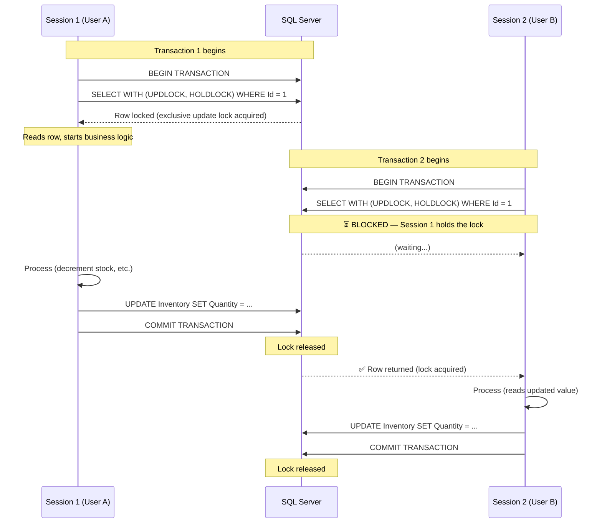
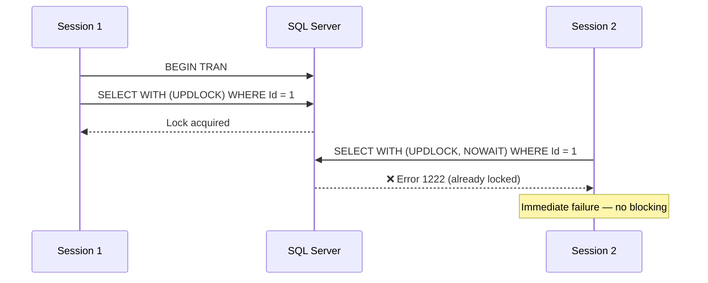

## 1 — Overview

**Pessimistic locking** prevents concurrent access to a row by **acquiring a lock at read time** and holding it until the transaction ends. In SQL Server, this is achieved with locking hints — `UPDLOCK` (update lock) and `HOLDLOCK` (serializable range lock) — inside a `SELECT` statement.

Unlike optimistic concurrency ([[8.895 — Optimistic Concurrency — RowVersion in EF Core]]), which detects conflicts after the fact, pessimistic locking **prevents** conflicts by ensuring only one transaction holds the lock at a time.

**When to use pessimistic locking:**
- High contention on specific rows (e.g., inventory stock, ledger accounts).
- Long-running operations where optimistic retries would be expensive or disruptive.
- Business rules that require strict sequential processing (e.g., financial transfers, seat booking).

**When to avoid it:**
- Read-heavy workloads (locks reduce concurrency).
- Distributed systems (locks require a connection to the database).
- Systems with high latency between read and write (locks held too long).

---

## 2 — Transaction Scope

UPDLOCK **requires an active transaction**. The lock is held until the transaction commits or rolls back.

### 2.1 — SQL Server Transaction with UPDLOCK

```sql
SET TRANSACTION ISOLATION LEVEL READ COMMITTED;

BEGIN TRANSACTION;

-- Lock the row(s) for update
SELECT [Id], [Quantity], [RowVersion]
FROM [dbo].[Inventory] WITH (UPDLOCK, HOLDLOCK)
WHERE [ProductId] = @ProductId;

-- Business logic: check stock, decrement
UPDATE [dbo].[Inventory]
SET [Quantity] = [Quantity] - @Quantity
WHERE [ProductId] = @ProductId;

COMMIT TRANSACTION;
```

### 2.2 — Why HOLDLOCK?

`HOLDLOCK` is equivalent to `SERIALIZABLE` isolation level for the scope of the `SELECT`. It prevents:
- **Phantom reads**: No other transaction can insert a row that would match the query predicate.
- **Range locks**: If the `WHERE` clause matches a range (e.g., `WHERE Status = 'Pending'`), the range is locked.

Without `HOLDLOCK`, `UPDLOCK` only locks the existing matching rows, but another transaction could **insert a new row** that matches your predicate before your update runs.

### 2.3 — Alternative: READPAST

`READPAST` skips locked rows instead of waiting:

```sql
SELECT [Id], [Quantity]
FROM [dbo].[Inventory] WITH (UPDLOCK, READPAST)
WHERE [ProductId] = @ProductId;
```

This is useful for **queue-like** processing where each worker takes the next available unlocked row. But it can result in missed rows if all are locked.

---

## 3 — EF Core — FromSqlRaw with UPDLOCK

EF Core does not have a built-in API for locking hints. You must use `FromSqlRaw` (or `ExecuteSqlRaw`) to execute raw SQL with the hint.

### 3.1 — Simple FromSqlRaw with UPDLOCK

```csharp
public async Task<Inventory?> GetWithLockAsync(
    int productId,
    CancellationToken ct = default)
{
    await using var context = _contextFactory.Create();

    // FromSqlRaw maps the result to the Inventory entity
    var inventory = await context.Inventory
        .FromSqlRaw(@"
            SELECT [Id], [ProductId], [Quantity], [RowVersion]
            FROM [dbo].[Inventory] WITH (UPDLOCK, HOLDLOCK)
            WHERE [ProductId] = {0}",
            productId)
        .FirstOrDefaultAsync(ct);

    return inventory;
}
```

### 3.2 — Full Transaction with EF Core

```csharp
public async Task<bool> TryDecrementStockAsync(
    int productId,
    int quantity,
    CancellationToken ct = default)
{
    await using var context = _contextFactory.Create();

    // EF Core's Database.BeginTransaction creates a DbTransaction
    // that holds the lock until Commit/Rollback
    await using var tx = await context.Database
        .BeginTransactionAsync(ct);

    try
    {
        // Step 1: Read with lock
        var inventory = await context.Inventory
            .FromSqlRaw(@"
                SELECT [Id], [ProductId], [Quantity], [RowVersion]
                FROM [dbo].[Inventory] WITH (UPDLOCK, HOLDLOCK)
                WHERE [ProductId] = {0}",
                productId)
            .FirstOrDefaultAsync(ct);

        if (inventory is null)
            return false;

        if (inventory.Quantity < quantity)
            return false; // insufficient stock

        // Step 2: Update (EF Core tracks the entity, so we just modify it)
        inventory.Quantity -= quantity;

        // Step 3: Save — still inside the transaction
        await context.SaveChangesAsync(ct);

        // Step 4: Commit — releases the lock
        await tx.CommitAsync(ct);

        return true;
    }
    catch
    {
        await tx.RollbackAsync(ct);
        throw;
    }
}
```

### 3.3 — Using ExecuteSqlRaw for the Update

If you prefer to avoid change tracking (for performance), do the update via raw SQL too:

```csharp
public async Task<bool> TryDecrementStockRawAsync(
    int productId,
    int quantity,
    CancellationToken ct = default)
{
    await using var context = _contextFactory.Create();
    await using var tx = await context.Database
        .BeginTransactionAsync(ct);

    try
    {
        // Lock and read in one query
        var inventory = await context.Inventory
            .FromSqlRaw(@"
                SELECT [Id], [ProductId], [Quantity], [RowVersion]
                FROM [dbo].[Inventory] WITH (UPDLOCK, HOLDLOCK)
                WHERE [ProductId] = {0}",
                productId)
            .FirstOrDefaultAsync(ct);

        if (inventory is null || inventory.Quantity < quantity)
        {
            await tx.RollbackAsync(ct);
            return false;
        }

        // Update with raw SQL
        var rows = await context.Database.ExecuteSqlRawAsync(@"
            UPDATE [dbo].[Inventory]
            SET [Quantity] = [Quantity] - {0}
            WHERE [ProductId] = {1}",
            quantity, productId, ct);

        await tx.CommitAsync(ct);
        return rows > 0;
    }
    catch
    {
        await tx.RollbackAsync(ct);
        throw;
    }
}
```

### 3.4 — Using Context.Database.BeginTransaction vs TransactionScope

EF Core supports two transaction APIs:

**Option 1: Database.BeginTransaction (recommended)**

```csharp
await using var tx = await context.Database
    .BeginTransactionAsync(IsolationLevel.ReadCommitted, ct);
```

Works directly with EF Core's connection. The transaction is scoped to this DbContext instance.

**Option 2: TransactionScope**

```csharp
using var scope = new TransactionScope(
    TransactionScopeAsyncFlowOption.Enabled);

// Multiple DbContexts can participate (but each needs the same connection or DTC escalates)
using var context1 = _contextFactory.Create();
using var context2 = _contextFactory.Create();

// ... operations ...

scope.Complete();
```

`TransactionScope` is more flexible (multiple resources) but can escalate to **Distributed Transaction Coordinator (DTC)** if you use different databases or connections.

### 3.5 — Handling Lock Wait Timeout

SQL Server waits for a lock by default (until the lock timeout or query timeout). You can control this:

```csharp
// Set lock timeout at the connection level
await context.Database.ExecuteSqlRawAsync(
    "SET LOCK_TIMEOUT 5000;"); // 5 seconds

// Or include in the locking query
var inventory = await context.Inventory
    .FromSqlRaw(@"
        SET LOCK_TIMEOUT 3000;  -- 3 second wait

        SELECT [Id], [ProductId], [Quantity], [RowVersion]
        FROM [dbo].[Inventory] WITH (UPDLOCK, HOLDLOCK)
        WHERE [ProductId] = {0}",
        productId)
    .FirstOrDefaultAsync(ct);
```

### 3.6 — Read Only (No Lock) + Then Lock

A common pattern: read without lock (no blocking) then acquire the lock only when you need to write:

```csharp
// Step 1: Read current state without lock (non-blocking)
var snapshot = await context.Inventory
    .FirstOrDefaultAsync(i => i.ProductId == productId, ct);

if (snapshot is null || snapshot.Quantity < quantity)
    return false;

// Step 2: Acquire lock inside a transaction
await using var tx = await context.Database
    .BeginTransactionAsync(ct);

try
{
    var locked = await context.Inventory
        .FromSqlRaw(@"
            SELECT [Id], [ProductId], [Quantity], [RowVersion]
            FROM [dbo].[Inventory] WITH (UPDLOCK, HOLDLOCK)
            WHERE [Id] = {0}",
            snapshot.Id)
        .FirstAsync(ct);

    if (locked.Quantity < quantity)
    {
        await tx.RollbackAsync(ct);
        return false;
    }

    await context.Database.ExecuteSqlRawAsync(@"
        UPDATE [dbo].[Inventory]
        SET [Quantity] = [Quantity] - {0}
        WHERE [Id] = {1}",
        quantity, snapshot.Id, ct);

    await tx.CommitAsync(ct);
    return true;
}
catch
{
    await tx.RollbackAsync(ct);
    throw;
}
```

---

## 4 — EF Core — ExecuteSqlRaw for Updates

When using `FromSqlRaw` for the lock + `ExecuteSqlRaw` for the update, you avoid loading the entity into the change tracker.

### 4.1 — Update via ExecuteSqlRaw After Lock

```csharp
public async Task<TransferResult> TransferFundsAsync(
    int fromAccountId,
    int toAccountId,
    decimal amount,
    CancellationToken ct = default)
{
    await using var context = _contextFactory.Create();
    await using var tx = await context.Database
        .BeginTransactionAsync(IsolationLevel.ReadCommitted, ct);

    try
    {
        // Lock both accounts (order by ID to prevent deadlock)
        var accountIds = new[] { fromAccountId, toAccountId }.OrderBy(x => x);

        foreach (var id in accountIds)
        {
            var account = await context.Accounts
                .FromSqlRaw(@"
                    SELECT [Id], [Balance], [RowVersion]
                    FROM [dbo].[Account] WITH (UPDLOCK, HOLDLOCK)
                    WHERE [Id] = {0}",
                    id)
                .FirstAsync(ct);

            if (id == fromAccountId && account.Balance < amount)
            {
                await tx.RollbackAsync(ct);
                return TransferResult.InsufficientFunds;
            }
        }

        // Execute the debit
        await context.Database.ExecuteSqlRawAsync(@"
            UPDATE [dbo].[Account]
            SET [Balance] = [Balance] - {0}
            WHERE [Id] = {1}",
            amount, fromAccountId, ct);

        // Execute the credit
        await context.Database.ExecuteSqlRawAsync(@"
            UPDATE [dbo].[Account]
            SET [Balance] = [Balance] + {0}
            WHERE [Id] = {1}",
            amount, toAccountId, ct);

        await tx.CommitAsync(ct);
        return TransferResult.Success;
    }
    catch
    {
        await tx.RollbackAsync(ct);
        throw;
    }
}
```

### 4.2 — Output Clause with Lock

Sometimes you want to read the locked row and get updated values in one round-trip:

```csharp
var result = await context.Database
    .ExecuteSqlRawAsync(@"
        UPDATE [dbo].[Inventory]
        SET [Quantity] = [Quantity] - {0}
        OUTPUT INSERTED.[Quantity], INSERTED.[RowVersion]
        WHERE [ProductId] = {1}",
        quantity, productId, ct);
```

But note: `ExecuteSqlRawAsync` with `OUTPUT` returns the number of affected rows, not the output data. To capture the output, use `FromSqlRaw` with a `MERGE` or use Dapper's `QueryAsync`.

---

## 5 — Dapper — Locking Hints in SQL

Dapper gives you full control — you write the SQL directly and execute it within a transaction managed by `IDbTransaction`.

### 5.1 — Basic Dapper UPDLOCK

```csharp
public class InventoryRepository
{
    private readonly string _connectionString;

    public InventoryRepository(string connectionString)
    {
        _connectionString = connectionString;
    }

    public async Task<bool> TryDecrementStockAsync(
        int productId,
        int quantity)
    {
        using var conn = new SqlConnection(_connectionString);
        await conn.OpenAsync();
        using var tx = conn.BeginTransaction();

        try
        {
            // Step 1: Lock and read
            const string selectSql = @"
                SELECT [Id], [ProductId], [Quantity], [RowVersion]
                FROM [dbo].[Inventory] WITH (UPDLOCK, HOLDLOCK)
                WHERE [ProductId] = @ProductId;";

            var inventory = await conn.QuerySingleOrDefaultAsync<Inventory>(
                selectSql, new { ProductId = productId }, tx);

            if (inventory is null || inventory.Quantity < quantity)
            {
                tx.Rollback();
                return false;
            }

            // Step 2: Update
            const string updateSql = @"
                UPDATE [dbo].[Inventory]
                SET [Quantity] = [Quantity] - @Quantity
                WHERE [ProductId] = @ProductId;";

            await conn.ExecuteAsync(
                updateSql, new { ProductId = productId, Quantity = quantity }, tx);

            // Step 3: Commit releases the lock
            tx.Commit();
            return true;
        }
        catch
        {
            tx.Rollback();
            throw;
        }
    }
}
```

### 5.2 — Deadlock-Safe Ordering

When locking multiple resources, always lock them in a **consistent order** to prevent deadlocks:

```csharp
public async Task<bool> TransferFundsAsync(
    int fromId,
    int toId,
    decimal amount)
{
    // Always lock in a deterministic order
    var (firstId, secondId) = fromId < toId
        ? (fromId, toId)
        : (toId, fromId);

    var isFromFirst = firstId == fromId;

    using var conn = new SqlConnection(_connectionString);
    await conn.OpenAsync();
    using var tx = conn.BeginTransaction();

    try
    {
        const string lockSql = @"
            SELECT [Id], [Balance], [RowVersion]
            FROM [dbo].[Account] WITH (UPDLOCK, HOLDLOCK)
            WHERE [Id] = @Id;";

        var first = await conn.QuerySingleAsync<Account>(
            lockSql, new { Id = firstId }, tx);
        var second = await conn.QuerySingleAsync<Account>(
            lockSql, new { Id = secondId }, tx);

        var fromAccount = isFromFirst ? first : second;
        var toAccount   = isFromFirst ? second : first;

        if (fromAccount.Balance < amount)
        {
            tx.Rollback();
            return false;
        }

        const string updateSql = @"
            UPDATE [dbo].[Account]
            SET [Balance] = @NewBalance
            WHERE [Id] = @Id;";

        await conn.ExecuteAsync(updateSql,
            new { Id = fromAccount.Id, NewBalance = fromAccount.Balance - amount }, tx);
        await conn.ExecuteAsync(updateSql,
            new { Id = toAccount.Id, NewBalance = toAccount.Balance + amount }, tx);

        tx.Commit();
        return true;
    }
    catch
    {
        tx.Rollback();
        throw;
    }
}
```

### 5.3 — Queue Pattern with UPDLOCK + READPAST

A common use case is a **work queue** where multiple workers dequeue tasks:

```sql
-- Each worker takes the next available task and locks it
WITH TopTask AS (
    SELECT TOP 1 [Id], [Payload], [Status]
    FROM [dbo].[TaskQueue] WITH (UPDLOCK, READPAST, ROWLOCK)
    WHERE [Status] = 'Pending'
    ORDER BY [Priority] DESC, [CreatedAt] ASC
)
UPDATE TopTask
SET [Status] = 'Processing',
    [StartedAt] = SYSUTCDATETIME(),
    [WorkerId] = @WorkerId
OUTPUT INSERTED.[Id], INSERTED.[Payload];
```

```csharp
public async Task<TaskItem?> TryDequeueAsync(
    string workerId,
    CancellationToken ct = default)
{
    using var conn = new SqlConnection(_connectionString);
    await conn.OpenAsync(ct);

    const string sql = @"
        WITH TopTask AS (
            SELECT TOP 1 [Id], [Payload], [Status]
            FROM [dbo].[TaskQueue] WITH (UPDLOCK, READPAST, ROWLOCK)
            WHERE [Status] = 'Pending'
            ORDER BY [Priority] DESC, [CreatedAt] ASC
        )
        UPDATE TopTask
        SET [Status] = 'Processing',
            [StartedAt] = SYSUTCDATETIME(),
            [WorkerId] = @WorkerId
        OUTPUT INSERTED.[Id], INSERTED.[Payload];";

    var task = await conn.QuerySingleOrDefaultAsync<TaskItem>(
        sql, new { WorkerId = workerId });

    return task;
}
```

### 5.4 — Dapper with TransactionScope

```csharp
public async Task<bool> DecrementWithTransactionScopeAsync(
    int productId,
    int quantity)
{
    using var scope = new TransactionScope(
        TransactionScopeAsyncFlowOption.Enabled);

    using var conn = new SqlConnection(_connectionString);
    await conn.OpenAsync();

    const string sql = @"
        DECLARE @CurrentQty INT;

        SELECT @CurrentQty = [Quantity]
        FROM [dbo].[Inventory] WITH (UPDLOCK, HOLDLOCK)
        WHERE [ProductId] = @ProductId;

        IF @CurrentQty >= @Quantity
        BEGIN
            UPDATE [dbo].[Inventory]
            SET [Quantity] = [Quantity] - @Quantity
            WHERE [ProductId] = @ProductId;

            SELECT 1 AS [Success];
        END
        ELSE
        BEGIN
            SELECT 0 AS [Success];
        END";

    var result = await conn.QuerySingleAsync<bool>(
        sql, new { ProductId = productId, Quantity = quantity });

    if (result)
    {
        scope.Complete();
    }

    return result;
}
```

### 5.5 — Row-Level Locking Hint (ROWLOCK)

By default, SQL Server chooses the lock granularity (row, page, table). You can hint `ROWLOCK` to encourage row-level locking:

```sql
SELECT [Id], [Quantity]
FROM [dbo].[Inventory] WITH (UPDLOCK, HOLDLOCK, ROWLOCK)
WHERE [ProductId] = @ProductId;
```

But `ROWLOCK` is a **hint, not a command** — SQL Server may still escalate to a page or table lock under memory pressure or if many rows are locked.

### 5.6 — NOWAIT — Fail Immediately Instead of Waiting

If you don't want your query to block on a lock, use `NOWAIT`:

```sql
SELECT [Id], [Quantity]
FROM [dbo].[Inventory] WITH (UPDLOCK, HOLDLOCK, NOWAIT)
WHERE [ProductId] = @ProductId;
```

If the row is locked, SQL Server throws error 1222 (`Lock request time out period exceeded`). Catch it in C#:

```csharp
try
{
    var inventory = await conn.QuerySingleOrDefaultAsync<Inventory>(
        "SELECT ... WITH (UPDLOCK, HOLDLOCK, NOWAIT) WHERE ...", tx);
}
catch (SqlException ex) when (ex.Number == 1222)
{
    // Row is locked by another session — handle gracefully
    _logger.LogWarning("Lock contention on product {ProductId}", productId);
    return false;
}
```

---

## 6 — Mermaid Diagram — Pessimistic Locking Flow



### Alternative: NOWAIT Behavior



---

## 7 — Gotchas

### 7.1 — UPDLOCK Escalates to Page/Table Lock

`UPDLOCK` does **not** guarantee row-level locking. SQL Server's lock manager decides the granularity. If you lock many rows in a table (or the `WHERE` clause matches a large range), SQL Server may escalate to a **page lock** or **table lock**, blocking all concurrent access to that data.

**Mitigations:**
- Use `ROWLOCK` hint (advisory — not guaranteed).
- Keep transactions **short** — acquire the lock, do minimal work, commit.
- Ensure `WHERE` clauses are **sargable** and use index seeks (not scans).
- Monitor lock escalation with `sys.dm_tran_locks`:

```sql
SELECT
    request_session_id,
    resource_type,
    resource_associated_entity_id,
    request_mode,
    request_status
FROM sys.dm_tran_locks
WHERE resource_database_id = DB_ID();
```

### 7.2 — Deadlocks Under Contention

When two sessions hold locks on different resources and each waits for the other, a deadlock occurs. SQL Server chooses a victim (usually the session with the lower-cost transaction) and kills it with error 1205.

**Deadlock prevention:**
- **Lock order**: Always acquire locks in the same order (e.g., by primary key).
- **Short transactions**: Minimize the time between lock acquisition and commit.
- **Indexing**: Ensure queries that acquire locks are fast (index seeks).
- **Retry logic**: Catch deadlock errors (SqlException.Number == 1205) and retry.

```csharp
catch (SqlException ex) when (ex.Number == 1205)
{
    _logger.LogWarning(ex, "Deadlock victim, retrying...");
    await Task.Delay(TimeSpan.FromMilliseconds(
        _random.Next(50, 200))); // random delay to prevent livelock
    return await TryDecrementStockAsync(productId, quantity); // recursive retry
}
```

### 7.3 — HOLDLOCK Creates Serializable Behavior

`HOLDLOCK` (serializable) locks the **range** of rows that match the predicate. This prevents:
- Another transaction from **updating** rows that match your predicate.
- Another transaction from **inserting** rows that would match your predicate (phantoms).

This can cause **blocking** for INSERT operations against the same table if the WHERE clause is broad.

**When to use HOLDLOCK:**
- You need to prevent phantoms (e.g., "get all pending orders and guarantee no new ones appear").
- The query predicate is on a unique key (no range to lock).

**When to skip HOLDLOCK:**
- You only care about existing rows (no phantom concern).
- You are locking by primary key (phantoms can't occur for a single row).

### 7.4 — Requires Transaction

UPDLOCK **only works inside a transaction**. Without an explicit transaction, the lock is released immediately after the `SELECT` completes (because the implicit transaction auto-commits). This defeats the purpose of pessimistic locking.

```csharp
// ❌ WRONG — no transaction, lock released immediately
var inventory = await conn.QueryAsync<Inventory>(
    "SELECT ... WITH (UPDLOCK) WHERE ...");

// ✅ CORRECT — lock held until tx.Commit()
using var tx = conn.BeginTransaction();
var inventory = await conn.QueryAsync<Inventory>(
    "SELECT ... WITH (UPDLOCK) WHERE ...", tx);
// ... do work ...
tx.Commit(); // lock released
```

### 7.5 — FromSqlRaw with Multiple Result Sets

If you use `FromSqlRaw` for locking, EF Core tracks the returned entities. If you then update them with `ExecuteSqlRaw` (bypassing the change tracker), the tracked entities become **stale**. You must either:
- Detach them after the raw update: `context.Entry(entity).State = EntityState.Detached;`
- Use `ExecuteSqlRaw` exclusively (no tracking).
- Use `AsNoTracking()` with `FromSqlRaw`:

```csharp
var inventory = await context.Inventory
    .FromSqlRaw(@"SELECT ... WITH (UPDLOCK, HOLDLOCK) WHERE ...", id)
    .AsNoTracking() // ← no tracking
    .FirstAsync(ct);
```

### 7.6 — Lock Timeout vs Query Timeout

Two separate timeouts:

- **Lock timeout** (`SET LOCK_TIMEOUT`): How long to wait for a lock to be released. Default: `-1` (wait forever). Set to a positive value to fail fast.
- **Query timeout** (`CommandTimeout` in EF Core / `SqlCommand.CommandTimeout`): How long the entire query can run before being canceled. Default: 30 seconds.

```csharp
// Command timeout (EF Core)
context.Database.SetCommandTimeout(TimeSpan.FromSeconds(15));

// Command timeout (Dapper — via SqlConnection)
conn.QueryAsync(sql, ..., commandTimeout: 15);

// Lock timeout (raw SQL)
await conn.ExecuteAsync("SET LOCK_TIMEOUT 5000;", tx);
```

### 7.7 — READ UNCOMMITTED / NOLOCK and UPDLOCK

You **cannot** combine `NOLOCK` (READ UNCOMMITTED) with `UPDLOCK` — they are mutually exclusive. NOLOCK means "don't acquire shared locks and don't respect exclusive locks"; UPDLOCK explicitly acquires an update lock. SQL Server will throw an error:

```sql
-- ❌ Error: NOLOCK and UPDLOCK conflict
SELECT ... FROM [Table] WITH (NOLOCK, UPDLOCK, HOLDLOCK) WHERE ...
```

### 7.8 — Connection Pooling and Transactions

Dapper with pessimistic locking relies on the same `SqlConnection` being used for both the `SELECT` and the `UPDATE`. If you close the connection after the `SELECT` and open a new one (even within the same `TransactionScope`), the second connection won't have the lock.

Always **reuse the same connection and transaction**:

```csharp
using var conn = new SqlConnection(_connectionString);
await conn.OpenAsync();
using var tx = conn.BeginTransaction();

// SELECT and UPDATE both use conn + tx
// ...

tx.Commit();
// Dispose closes the connection
```

### 7.9 — Testing Pessimistic Locking

Integration testing requires concurrent sessions:

```csharp
[Fact]
public async Task DecrementStock_WithConcurrentSessions_BlocksSecondSession()
{
    var productId = await SeedInventoryAsync(quantity: 5);
    var signal = new SemaphoreSlim(0, 2);

    // Task 1: Acquire lock and hold it
    var task1 = Task.Run(async () =>
    {
        using var conn = new SqlConnection(_connectionString);
        await conn.OpenAsync();
        using var tx = conn.BeginTransaction();

        await conn.QueryAsync(
            "SELECT Id FROM Inventory WITH (UPDLOCK, HOLDLOCK) WHERE Id = @Id",
            new { Id = productId }, tx);

        signal.Release(); // signal task2 to try

        // Hold the lock by delaying
        await Task.Delay(TimeSpan.FromSeconds(5));

        tx.Commit();
    });

    // Task 2: Try to acquire the same lock (should block)
    var task2 = Task.Run(async () =>
    {
        await signal.WaitAsync(); // wait until task1 has the lock

        var sw = Stopwatch.StartNew();

        using var conn = new SqlConnection(_connectionString);
        await conn.OpenAsync();
        using var tx = conn.BeginTransaction();

        // This should block until task1 releases the lock
        await conn.QueryAsync(
            "SELECT Id FROM Inventory WITH (UPDLOCK, HOLDLOCK) WHERE Id = @Id",
            new { Id = productId }, tx);

        sw.Stop();

        tx.Commit();

        // Should have taken at least ~5 seconds due to blocking
        Assert.True(sw.Elapsed >= TimeSpan.FromSeconds(4.5),
            $"Expected blocking but got {sw.Elapsed.TotalSeconds:F1}s");
    });

    await Task.WhenAll(task1, task2);
}
```

---

## 8 — Related Patterns

| Pattern                                            | Link                                                                        | Relationship                                                            |
|----------------------------------------------------|-----------------------------------------------------------------------------|-------------------------------------------------------------------------|
| SELECT FOR UPDATE — Pessimistic Locking            | [[8.615 — SELECT FOR UPDATE — Pessimistic Locking]]                         | Foundational: cross-database comparison of pessimistic locking.         |
| UPDLOCK — Preventing Lost Updates                  | [[8.676 — UPDLOCK — Preventing Lost Updates]]                               | Deep-dive on UPDLOCK mechanics.                                         |
| Optimistic Concurrency — RowVersion in EF Core     | [[8.895 — Optimistic Concurrency — RowVersion in EF Core]]                  | Competing pattern: optimistic vs pessimistic.                           |
| Dapper — Transactions — IDbTransaction             | [[8.864 — Dapper — Transactions — IDbTransaction]]                          | Transaction fundamentals required for UPDLOCK.                          |
| Deadlock — Retry Logic in .NET                     | [[8.684 — Deadlock — Retry Logic in .NET]]                                  | Retry strategies for deadlock victims.                                  |
| Isolation Levels — Read Committed Snapshot         | [[8.677 — Read Committed Snapshot Isolation (RCSI)]]                        | Alternative to locking: use RCSI to reduce blocking without UPDLOCK.    |
| EF Core — FromSqlRaw                               | [[3.080 — EF Core — FromSqlRaw and ExecuteSqlRaw]]                          | Deep-dive on raw SQL execution in EF Core.                              |
| Outbox Pattern — Database Implementation           | [[8.886 — Outbox Pattern — Database Implementation]]                        | Alternative pattern: queue-based processing instead of locking.         |

---

## 9 — References

- [SQL Server Locking Hints](https://learn.microsoft.com/en-us/sql/t-sql/queries/hints-transact-sql-table)
- [UPDLOCK — SQL Server Documentation](https://learn.microsoft.com/en-us/sql/relational-databases/sql-server-transaction-locking-and-row-versioning-guide)
- [Understanding Lock Escalation](https://learn.microsoft.com/en-us/sql/relational-databases/sql-server-transaction-locking-and-row-versioning-guide#lock_escalation)
- [Deadlock Detection and Prevention](https://learn.microsoft.com/en-us/sql/relational-databases/sql-server-deadlocks-guide)
- [EF Core — Raw SQL Queries](https://learn.microsoft.com/en-us/ef/core/querying/raw-sql)
- [EF Core — Transactions](https://learn.microsoft.com/en-us/ef/core/saving/transactions)
- [Dapper — Transactions](https://www.learndapper.com/transactions)
- [Martin Fowler — Pessimistic Offline Lock](https://martinfowler.com/eaaCatalog/pessimisticOfflineLock.html)

---

## Appendix A — Full Pessimistic Lock Repository (Dapper)

```csharp
public interface IInventoryRepository
{
    Task<bool> TryDecrementStockAsync(int productId, int quantity);
    Task<InventoryDto?> GetWithLockAsync(int productId, IDbTransaction tx);
    Task<int> UpdateQuantityAsync(int productId, int newQuantity, IDbTransaction tx);
}

public class InventoryRepository : IInventoryRepository
{
    private readonly string _connectionString;
    private readonly ILogger<InventoryRepository> _logger;
    private static readonly Random _random = new();

    public InventoryRepository(
        string connectionString,
        ILogger<InventoryRepository> logger)
    {
        _connectionString = connectionString;
        _logger = logger;
    }

    public async Task<bool> TryDecrementStockAsync(
        int productId, int quantity)
    {
        var maxRetries = 3;

        for (var attempt = 0; attempt < maxRetries; attempt++)
        {
            try
            {
                return await TryDecrementInternalAsync(productId, quantity);
            }
            catch (SqlException ex) when (ex.Number == 1205 && attempt < maxRetries - 1)
            {
                // Deadlock victim — retry with delay
                _logger.LogWarning(ex,
                    "Deadlock victim on product {ProductId}, retry {Attempt}/{MaxRetries}",
                    productId, attempt + 1, maxRetries);

                await Task.Delay(TimeSpan.FromMilliseconds(
                    _random.Next(50, 200) * (attempt + 1)));
            }
        }

        throw new ConcurrencyException(
            $"Failed to decrement stock for product {productId} after {maxRetries} attempts.");
    }

    private async Task<bool> TryDecrementInternalAsync(int productId, int quantity)
    {
        using var conn = new SqlConnection(_connectionString);
        await conn.OpenAsync();
        using var tx = conn.BeginTransaction();

        try
        {
            var inventory = await GetWithLockAsync(productId, tx);

            if (inventory is null || inventory.Quantity < quantity)
            {
                await tx.RollbackAsync();
                return false;
            }

            await UpdateQuantityAsync(productId, inventory.Quantity - quantity, tx);

            await tx.CommitAsync();
            return true;
        }
        catch
        {
            await tx.RollbackAsync();
            throw;
        }
    }

    public async Task<InventoryDto?> GetWithLockAsync(
        int productId, IDbTransaction tx)
    {
        const string sql = @"
            SELECT [Id], [ProductId], [Quantity], [RowVersion]
            FROM [dbo].[Inventory] WITH (UPDLOCK, HOLDLOCK, ROWLOCK)
            WHERE [ProductId] = @ProductId;";

        return await tx.Connection!.QuerySingleOrDefaultAsync<InventoryDto>(
            sql, new { ProductId = productId }, tx);
    }

    public async Task<int> UpdateQuantityAsync(
        int productId, int newQuantity, IDbTransaction tx)
    {
        const string sql = @"
            UPDATE [dbo].[Inventory]
            SET [Quantity] = @Quantity
            WHERE [ProductId] = @ProductId;";

        return await tx.Connection!.ExecuteAsync(
            sql, new { ProductId = productId, Quantity = newQuantity }, tx);
    }
}

public record InventoryDto(
    int Id,
    int ProductId,
    int Quantity,
    byte[] RowVersion);
```

## Appendix B — EF Core DbContext with Pessimistic Locking Extension

```csharp
public static class DbContextExtensions
{
    /// <summary>
    /// Executes a query with UPDLOCK + HOLDLOCK within the current transaction.
    /// The caller must have already started a transaction on this context.
    /// </summary>
    public static async Task<List<T>> FromSqlWithLockAsync<T>(
        this DbContext context,
        string sql,
        params object[] parameters) where T : class
    {
        if (context.Database.CurrentTransaction is null)
            throw new InvalidOperationException(
                "A transaction must be started before using pessimistic locking.");

        // Wrap the query with locking hints
        var lockedSql = $@"
            SELECT *
            FROM ({sql}) AS [_locked]
            WITH (UPDLOCK, HOLDLOCK)";

        return await context.Set<T>()
            .FromSqlRaw(lockedSql, parameters)
            .ToListAsync();
    }

    /// <summary>
    /// Acquires an update lock on the entity with the given primary key.
    /// </summary>
    public static async Task<T?> LockEntityAsync<T>(
        this DbContext context,
        params object[] keyValues) where T : class
    {
        var entity = await context.Set<T>().FindAsync(keyValues);
        if (entity is null) return null;

        // Re-query with a lock hint using the primary key
        var entityType = context.Model.FindEntityType(typeof(T));
        var tableName = entityType!.GetTableName();
        var schema = entityType.GetSchema();
        var fullTable = schema is not null ? $"[{schema}].[{tableName}]" : $"[{tableName}]";
        var pkColumn = entityType.FindPrimaryKey()!.Properties
            .Select(p => $"[{p.Name}]")
            .First();

        var sql = $@"
            SELECT *
            FROM {fullTable} WITH (UPDLOCK, HOLDLOCK)
            WHERE {pkColumn} = {{0}}";

        return await context.Set<T>()
            .FromSqlRaw(sql, keyValues[0])
            .AsNoTracking()
            .FirstOrDefaultAsync();
    }
}
```

## Appendix C — SQL Server Lock Monitoring Queries

```sql
-- Current locks held
SELECT
    tl.request_session_id AS [SessionId],
    tl.resource_type AS [ResourceType],
    tl.resource_subtype AS [SubType],
    tl.resource_description AS [Resource],
    tl.request_mode AS [LockMode],
    tl.request_status AS [Status],
    t.text AS [LastQuery]
FROM sys.dm_tran_locks tl
LEFT JOIN sys.dm_exec_requests r
    ON tl.request_session_id = r.session_id
OUTER APPLY sys.dm_exec_sql_text(r.sql_handle) t
WHERE tl.resource_database_id = DB_ID()
ORDER BY tl.request_session_id;

-- Blocking chain
SELECT
    blocking.session_id AS [BlockingSession],
    blocked.session_id AS [BlockedSession],
    blocked.wait_type,
    blocked.wait_time,
    blocked_sql.text AS [BlockedQuery]
FROM sys.dm_exec_requests blocked
JOIN sys.dm_exec_requests blocking
    ON blocked.blocking_session_id = blocking.session_id
OUTER APPLY sys.dm_exec_sql_text(blocked.sql_handle) blocked_sql;

-- Deadlock graph (from system health session)
SELECT
    xed.value('@timestamp', 'datetime2') AS [DeadlockTime],
    xed.query('.') AS [DeadlockGraph]
FROM
(
    SELECT CAST(target_data AS XML) AS [target_data]
    FROM sys.dm_xe_session_targets st
    JOIN sys.dm_xe_sessions s
        ON st.event_session_address = s.address
    WHERE s.name = 'system_health'
        AND st.target_name = 'ring_buffer'
) AS [Data]
CROSS APPLY target_data.nodes
    ('//event[@name="xml_deadlock_report"]/data/value/deadlock') AS [x](xed)
ORDER BY [DeadlockTime] DESC;
```
