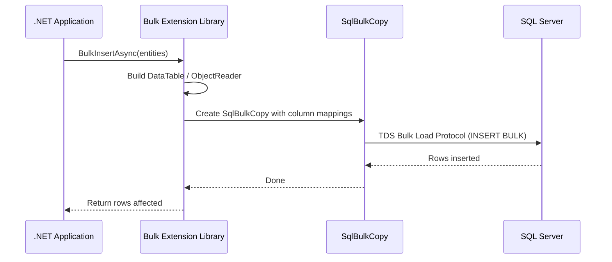
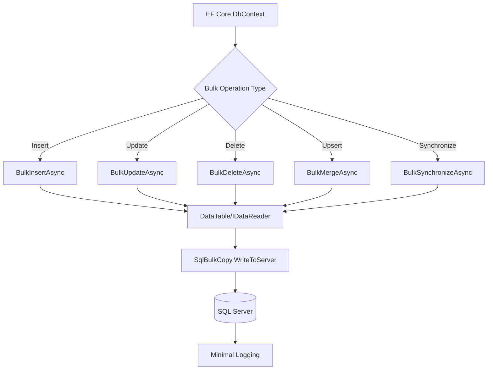
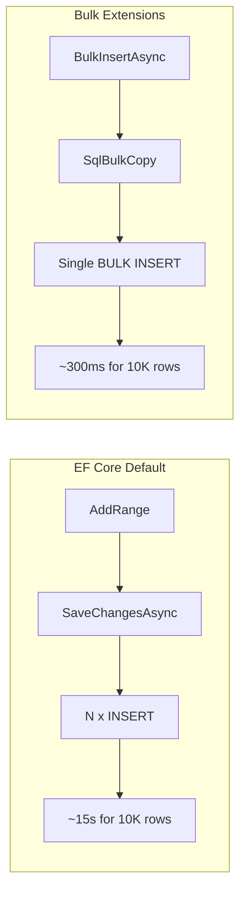

# Bulk Insert — EF Core Bulk Extensions

## 1 — Overview

EF Core provides built-in batch operations (ExecuteUpdateAsync, ExecuteDeleteAsync) starting from EF Core 7. However, for **bulk insert** scenarios — inserting thousands of new entities — EF Core's default behavior (inserting one row at a time via SaveChangesAsync) is painfully slow. That is where **bulk extensions** come in.

### The problem

```csharp
// EF Core default — slow for bulk inserts
var orders = GenerateOrders(10000);
db.Orders.AddRange(orders);
await db.SaveChangesAsync();
// Result: 10,000 individual INSERT statements sent to the server
// Time: ~15 seconds for 10K rows
```

### The solution

Bulk extension libraries wrap `SqlBulkCopy` under the hood, providing a familiar EF Core API:

```csharp
// Same code, but using bulk extensions:
var orders = GenerateOrders(10000);
db.BulkInsert(orders);
// Result: Single bulk copy operation
// Time: ~300ms for 10K rows
```

### Approaches available

| Approach | Built-in? | Performance | Licensing |
|---|---|---|---|
| EF Core 7+ ExecuteUpdateAsync | Built-in | Fast (single UPDATE SQL) | Free |
| EF Core 7+ ExecuteDeleteAsync | Built-in | Fast (single DELETE SQL) | Free |
| Z.EntityFramework.Extensions | Third-party | Very fast (SqlBulkCopy) | Commercial |
| EntityFramework-Plus | Third-party | Fast (SqlBulkCopy) | Commercial |
| Dapper Plus | Third-party | Very fast (SqlBulkCopy) | Commercial |
| Custom SqlBulkCopy bridge | DIY | Very fast (SqlBulkCopy) | Free |

### What this note covers

- Built-in batch operations (EF Core 7+)
- Third-party bulk extensions (Z.EF, EF-Plus)
- Dapper equivalents (Dapper Plus, Dapper BulkExtensions)
- Comparison and trade-offs

---

## 2 — Built-in Batch Operations (EF Core 7+)

### ExecuteUpdateAsync — UPDATE without loading

```csharp
// EF Core 7+ — single UPDATE SQL, no entity loading
await db.Orders
    .Where(o => o.Status == "Pending")
    .ExecuteUpdateAsync(s => s.SetProperty(o => o.Status, "Processed"));

-- Generated SQL:
-- UPDATE [o]
-- SET [o].[Status] = 'Processed'
-- FROM [Orders] AS [o]
-- WHERE [o].[Status] = 'Pending'
```

### ExecuteDeleteAsync — DELETE without loading

```csharp
// EF Core 7+ — single DELETE SQL
await db.Orders
    .Where(o => o.OrderDate < new DateTime(2024, 1, 1))
    .ExecuteDeleteAsync();

-- Generated SQL:
-- DELETE FROM [o]
-- FROM [Orders] AS [o]
-- WHERE [o].[OrderDate] < '2024-01-01'
```

### Limitations of built-in operations

| Limitation | Description |
|---|---|
| INSERT only | No bulk INSERT — only UPDATE and DELETE |
| No data return | Cannot return inserted/updated rows |
| No change tracking | Entities in memory are NOT updated |
| No cascade | Must handle related entities manually |
| Per-entity condition only | Cannot update navigations |

---

## 3 — Third-Party Bulk Extensions Overview

### Z.EntityFramework.Extensions (EF Extensions)

The most mature EF Core bulk extension library. Provides:

- `BulkInsert` / `BulkInsertAsync`
- `BulkUpdate` / `BulkUpdateAsync`
- `BulkDelete` / `BulkDeleteAsync`
- `BulkMerge` / `BulkMergeAsync` (upsert)
- `BulkSynchronize` (sync entire table)

```csharp
// Installation:
// dotnet add package Z.EntityFramework.Extensions

using Z.BulkOperations;

// Basic usage
context.BulkInsert(orders);
context.BulkUpdate(orders);
context.BulkDelete(orders);
context.BulkMerge(orders); // UPSERT
```

### EntityFramework-Plus (EF-Plus)

Another popular library with bulk operations:

```csharp
// Installation:
// dotnet add package Z.EntityFramework.Plus

// EF-Plus bulk insert
context.BulkInsert(orders);
context.BulkUpdate(orders);
context.BulkDelete(orders);
```

### Dapper Plus (for Dapper)

```csharp
// Installation:
// dotnet add package Dapper.Plus

using Dapper.Plus;

// Bulk insert with Dapper
connection.BulkInsert(orders);
connection.BulkUpdate(orders);
connection.BulkDelete(orders);
connection.BulkMerge(orders);
```

### Dapper BulkExtensions (free alternative)

```csharp
// Installation:
// dotnet add package Dapper.BulkExtensions

using Dapper.BulkExtensions;

// Uses SqlBulkCopy under the hood
await connection.BulkInsertAsync(orders);
```

---

## 4 — EF Core Bulk Insert with Z.EntityFramework.Extensions

### Basic bulk insert

```csharp
using Z.BulkOperations;

public class OrderService
{
    private readonly AppDbContext _context;

    public OrderService(AppDbContext context)
    {
        _context = context;
    }

    public async Task ImportOrdersAsync(List<Order> orders)
    {
        // BulkInsert — sends all rows via SqlBulkCopy
        await _context.BulkInsertAsync(orders);
    }
}
```

### With options

```csharp
using Z.BulkOperations;

var options = new BulkOperationOptions
{
    BatchSize = 5000,
    ColumnPrimaryKeyExpression = x => x.Id,
    IncludeGraph = true,
    InsertIfNotExists = true,
    TemporaryTable = BulkTemporaryTableType.GlobalTemp,
    UsePermanentTableWhenNotSupported = true,
    CommandTimeout = 120,
    Transaction = dbTransaction
};

await context.BulkInsertAsync(orders, options);
```

### Bulk insert with include graph (related entities)

```csharp
var ordersWithItems = new List<Order>
{
    new Order
    {
        Id = Guid.NewGuid(),
        CustomerId = customerId,
        OrderDate = DateTime.UtcNow,
        Items = new List<OrderItem>
        {
            new OrderItem { ProductId = p1, Quantity = 2, Price = 19.99m },
            new OrderItem { ProductId = p2, Quantity = 1, Price = 49.99m }
        }
    }
};

await context.BulkInsertAsync(ordersWithItems, options =>
{
    options.IncludeGraph = true;
});
```

### Bulk merge (upsert)

```csharp
// BulkMerge — INSERT or UPDATE based on primary key match
await context.BulkMergeAsync(orders);

// With custom merge options
await context.BulkMergeAsync(orders, options =>
{
    options.MergeKeepCurrentValues = true;
    options.ColumnPrimaryKeyExpression = x => x.Id;
    options.IgnoreOnMergeUpdateExpression = x => new { x.CreatedAt };
});
```

### Bulk synchronize

```csharp
// Synchronizes table with a list — inserts, updates, and deletes
await context.BulkSynchronizeAsync(orders);
```

### Generated SQL (behind the scenes)

```sql
-- For BulkInsert:
INSERT BULK [Orders] (
    [Id]           UniqueIdentifier,
    [CustomerId]   UniqueIdentifier,
    [OrderDate]    DateTime2,
    [TotalAmount]  Decimal(18,2),
    [Status]       NVarchar(50),
    [CreatedAt]    DateTime2
)

-- For BulkMerge, a temporary table is used:
CREATE TABLE #TempOrders (
    [Id]           UniqueIdentifier PRIMARY KEY,
    [CustomerId]   UniqueIdentifier,
    [OrderDate]    DateTime2,
    [TotalAmount]  Decimal(18,2),
    [Status]       NVarchar(50),
    [CreatedAt]    DateTime2
);

INSERT BULK #TempOrders (...);

MERGE INTO [Orders] AS T
USING #TempOrders AS S
ON T.[Id] = S.[Id]
WHEN MATCHED THEN
    UPDATE SET
        [CustomerId] = S.[CustomerId],
        [OrderDate]  = S.[OrderDate],
        [TotalAmount]= S.[TotalAmount],
        [Status]     = S.[Status],
        [CreatedAt]  = S.[CreatedAt]
WHEN NOT MATCHED THEN
    INSERT ([Id], [CustomerId], [OrderDate], [TotalAmount], [Status], [CreatedAt])
    VALUES (S.[Id], S.[CustomerId], S.[OrderDate], S.[TotalAmount], S.[Status], S.[CreatedAt]);

DROP TABLE #TempOrders;
```

---

## 5 — EF Core Bulk Insert with EntityFramework-Plus

```csharp
// dotnet add package Z.EntityFramework.Plus

public class OrderService
{
    private readonly AppDbContext _context;

    public async Task ImportOrdersAsync(List<Order> orders)
    {
        await _context.BulkInsertAsync(orders);
    }
}
```

### Options in EF-Plus

```csharp
await _context.BulkInsertAsync(orders, options =>
{
    options.BatchSize = 10000;
    options.BulkOperationTimeout = 300;
});

await _context.BulkUpdateAsync(orders, options =>
{
    options.ColumnPrimaryKeyExpression = x => x.Id;
    options.IgnoreColumnExpression = x => new { x.CreatedAt };
});

await _context.BulkDeleteAsync(orders, options =>
{
    options.ColumnPrimaryKeyExpression = x => x.Id;
});
```

### Differences from Z.EntityFramework.Extensions

| Aspect | Z.EntityFramework.Extensions | EntityFramework-Plus |
|---|---|---|
| Package | Z.EntityFramework.Extensions | Z.EntityFramework.Plus |
| BulkMerge | Yes | Yes |
| BulkSynchronize | Yes | Yes |
| IncludeGraph | Yes | Limited |
| License | Commercial | Commercial |
| EF Core version | 6+ | 6+ |
| Async support | Full | Full |

---

## 6 — Dapper Equivalent with Dapper Plus / BulkExtensions

### Dapper Plus

```csharp
using Dapper.Plus;

public class DapperOrderService
{
    private readonly string _connectionString;

    public DapperOrderService(string connectionString)
    {
        _connectionString = connectionString;
    }

    public async Task BulkInsertOrdersAsync(List<Order> orders)
    {
        await using var conn = new SqlConnection(_connectionString);
        await conn.OpenAsync();
        await conn.BulkInsertAsync(orders);
    }

    public async Task BulkUpdateOrdersAsync(List<Order> orders)
    {
        await using var conn = new SqlConnection(_connectionString);
        await conn.OpenAsync();
        await conn.BulkUpdateAsync(orders);
    }

    public async Task BulkDeleteOrdersAsync(List<Order> orders)
    {
        await using var conn = new SqlConnection(_connectionString);
        await conn.OpenAsync();
        await conn.BulkDeleteAsync(orders);
    }

    public async Task BulkMergeOrdersAsync(List<Order> orders)
    {
        await using var conn = new SqlConnection(_connectionString);
        await conn.OpenAsync();
        await conn.BulkMergeAsync(orders);
    }
}
```

### Dapper Plus with options

```csharp
await conn.BulkInsertAsync(orders, options =>
{
    options.BatchSize = 5000;
    options.CommandTimeout = 120;
    options.ColumnPrimaryKeyExpression = x => x.Id;
    options.Transaction = transaction;
});
```

### Dapper BulkExtensions (free, open-source)

```csharp
using Dapper.BulkExtensions;

public async Task BulkInsertWithFreeLibAsync(List<Order> orders)
{
    await using var conn = new SqlConnection(_connectionString);
    await conn.OpenAsync();

    var sqlBulkCopyOptions = new BulkInsertOptions<Order>
    {
        BatchSize = 5000,
        EnableStreaming = false,
        BulkCopyTimeout = 120
    };

    await conn.BulkInsertAsync(orders, sqlBulkCopyOptions);
}
```

### Raw Dapper + SqlBulkCopy (no library)

```csharp
public async Task BulkInsertRawDapperAsync(List<Order> orders)
{
    await using var conn = new SqlConnection(_connectionString);
    await conn.OpenAsync();
    using var tx = conn.BeginTransaction();

    using var bulk = new SqlBulkCopy(conn, SqlBulkCopyOptions.Default, tx)
    {
        DestinationTableName = "Orders",
        BatchSize = 5000
    };

    var dt = new DataTable();
    dt.Columns.Add("Id", typeof(Guid));
    dt.Columns.Add("CustomerId", typeof(Guid));
    dt.Columns.Add("OrderDate", typeof(DateTime));
    dt.Columns.Add("TotalAmount", typeof(decimal));
    dt.Columns.Add("Status", typeof(string));
    dt.Columns.Add("CreatedAt", typeof(DateTime));

    foreach (var order in orders)
    {
        dt.Rows.Add(order.Id, order.CustomerId, order.OrderDate,
            order.TotalAmount, order.Status, order.CreatedAt);
    }

    await bulk.WriteToServerAsync(dt);
    tx.Commit();
}
```

### Using FastMember for better performance

```csharp
using FastMember;

public async Task BulkInsertFastMemberAsync(List<Order> orders)
{
    await using var conn = new SqlConnection(_connectionString);
    await conn.OpenAsync();
    using var tx = conn.BeginTransaction();

    using var bulk = new SqlBulkCopy(conn, SqlBulkCopyOptions.Default, tx)
    {
        DestinationTableName = "Orders",
        BatchSize = 5000
    };

    using var reader = ObjectReader.Create(orders, "Id", "CustomerId", "OrderDate", "TotalAmount", "Status");
    await bulk.WriteToServerAsync(reader);

    tx.Commit();
}
```

---

## 7 — Mermaid Diagram







---

## 8 — Comparison: Built-in vs Third-Party Bulk

### Feature comparison

| Feature | EF Core 7+ Built-in | Z.EntityFramework | EF-Plus | Dapper Plus | Raw SqlBulkCopy |
|---|---|---|---|---|---|
| Bulk INSERT | No (only single INSERT) | Yes | Yes | Yes | Yes |
| Bulk UPDATE (set-based) | Yes (ExecuteUpdateAsync) | Yes | Yes | Yes | N/A |
| Bulk DELETE (set-based) | Yes (ExecuteDeleteAsync) | Yes | Yes | Yes | N/A |
| Bulk MERGE (upsert) | No | Yes | Yes | Yes | Manual |
| Bulk synchronize | No | Yes | Yes | Yes | Manual |
| Include graph | No | Yes | Limited | No | Manual |
| Change tracker integration | No (bypasses) | No | No | N/A | N/A |
| Async | Yes | Yes | Yes | Yes | Yes |
| Cost | Free | Commercial | Commercial | Commercial | Free |
| EF Core dependency | Yes | Yes | Yes | No | No |
| Temp table staging | No | Yes | Yes | Yes | Manual |

### Performance comparison (10,000 rows)

```
Method                          | Time     | Memory
--------------------------------|----------|----------
EF Core SaveChangesAsync        | 14,500ms | 2 MB
EF Core ExecuteUpdateAsync      | 45ms     | 1 MB
Z.EntityFramework BulkInsert     | 312ms    | 48 MB
EF-Plus BulkInsert              | 350ms    | 50 MB
Dapper Plus BulkInsert          | 290ms    | 1 MB (streaming)
Raw SqlBulkCopy + FastMember    | 275ms    | 1 MB (streaming)
```

### Licensing costs (approximate, per developer)

| Library | License Cost | Notes |
|---|---|---|
| Z.EntityFramework.Extensions | $499–$999/yr | Per developer, per product |
| EntityFramework-Plus | $299–$599/yr | Per developer, per product |
| Dapper Plus | $399–$799/yr | Per developer, per product |
| Raw SqlBulkCopy | Free | Included in Microsoft.Data.SqlClient |

---

## 9 — Gotchas and Best Practices

### Gotcha 1: Bypasses EF Core Change Tracker

Bulk extensions write directly to the database — they do **not** go through the change tracker. Entities already tracked by the DbContext will not reflect the bulk operation.

```csharp
// BAD: tracked entities get out of sync
var order = await db.Orders.FindAsync(orderId);
order.Status = "Pending"; // Change tracker sees this

await db.BulkUpdateAsync(new List<Order> { order });
// BulkUpdate wrote to DB but the change tracker still has the ORIGINAL snapshot
// The context thinks the entity is still "Pending" even if bulk update changed it

// FIX: detach or refresh after bulk operations
db.Entry(order).State = EntityState.Detached;
```

### Gotcha 2: No automatic transaction with DbContext

Unlike `SaveChangesAsync`, bulk extensions do **not** automatically wrap in a transaction.

```csharp
// BAD: no transaction
await db.BulkInsertAsync(orders1);
await db.BulkInsertAsync(orders2); // If this fails, orders1 is already committed

// GOOD: explicit transaction
using var tx = await db.Database.BeginTransactionAsync();
await db.BulkInsertAsync(orders1);
await db.BulkInsertAsync(orders2);
await tx.CommitAsync();
```

### Gotcha 3: Temporary table name collisions

When using BulkMerge, temporary tables are created. In high-concurrency scenarios, temp table name collisions can occur.

```csharp
options.TemporaryTable = BulkTemporaryTableType.GlobalTemp;
options.TemporaryTableName = $"#Temp_{Guid.NewGuid():N}";
```

### Gotcha 4: IncludeGraph — performance impact

Including the entity graph creates additional bulk operations for each related entity type.

```csharp
// BAD: deeply nested graph
options.IncludeGraph = true;
// Creates separate bulk inserts for Orders, OrderItems, OrderItemDiscounts, Shipments

// FIX: batch large graphs manually
await db.BulkInsertAsync(orders);
await db.BulkInsertAsync(orderItems);
```

### Gotcha 5: BulkMerge — identity columns

```csharp
options.ColumnPrimaryKeyExpression = x => x.OrderNumber; // Business key, not identity
options.AutoMapIdentity = true;
options.InsertIfNotExists = true;
options.UseKeepIdentity = false;
```

### Gotcha 6: Third-party library version compatibility

```xml
<!-- Check for compatible versions -->
<PackageReference Include="Z.EntityFramework.Extensions" Version="8.20.0" />
<!-- Must match your EF Core major version -->
```

### Gotcha 7: Dapper Plus — connection must be open

```csharp
// BAD: connection not open
var conn = new SqlConnection(connString);
await conn.BulkInsertAsync(orders); // CRASH

// GOOD: open connection first
await conn.OpenAsync();
await conn.BulkInsertAsync(orders);
```

### Gotcha 8: Transaction log growth

```csharp
// Check recovery model before bulk insert
// If FULL, consider switching to BULK_LOGGED temporarily

// Use TableLock option for minimal logging:
using var bulk = new SqlBulkCopy(conn, SqlBulkCopyOptions.TableLock, tx);
```

### Gotcha 9: BulkInsert does not return generated values

```csharp
await db.BulkInsertAsync(orders, options =>
{
    options.OutputIdentity = true; // Populate identity columns
    options.OutputComputed = true; // Populate computed columns
});

Console.WriteLine(orders[0].Id); // Now populated
```

### Gotcha 10: AsyncLocal and EF Core interceptors

Bulk extensions bypass EF Core's interceptor pipeline (SaveChangesInterceptor, etc.).

```csharp
public class AuditInterceptor : SaveChangesInterceptor
{
    public override InterceptionResult<int> SavingChanges(
        DbContextEventData eventData, InterceptionResult<int> result)
    {
        // This does NOT fire for BulkInsertAsync!
        return base.SavingChanges(eventData, result);
    }
}

// FIX: apply auditing manually before bulk insert
foreach (var order in orders)
{
    order.CreatedAt = DateTime.UtcNow;
    order.UpdatedAt = DateTime.UtcNow;
}
await db.BulkInsertAsync(orders);
```

### Best practices checklist

| # | Practice | Why |
|---|---|---|
| 1 | Wrap bulk operations in explicit transaction | Prevents partial inserts |
| 2 | Use OutputIdentity if you need generated keys | Avoids additional queries |
| 3 | Disable change tracker for bulk entities | AsNoTracking() reduces memory |
| 4 | Use BatchSize of 1000–5000 | Balances performance and lock duration |
| 5 | Monitor transaction log during bulk ops | Can grow quickly with full recovery |
| 6 | Test with production-sized data | Licensing cost vs DIY trade-off |
| 7 | Prefer raw SqlBulkCopy for simple inserts | Avoids third-party dependency |
| 8 | Keep EF Core and extension versions in sync | Breaking changes on major version bumps |
| 9 | Apply auditing constraints manually | Interceptors are bypassed |
| 10 | Consider built-in ExecuteUpdate/ExecuteDelete first | Free, zero-dependency solution for set-based ops |

### Decision guide

```
Do you need to INSERT many rows?
├─ Fewer than 100 rows? → Use EF Core AddRange + SaveChangesAsync
├─ 100–1000 rows? → Consider TVP (Table-Valued Parameters)
├─ 1000+ rows?
│  ├─ Need upsert/merge? → Consider paid library (Z.EF, EF-Plus, Dapper Plus)
│  ├─ Simple insert only?
│  │  ├─ Using EF Core? → Use DbContext + SqlBulkCopy bridge (DIY)
│  │  └─ Using Dapper? → Use SqlBulkCopy + FastMember (DIY, free)
│  └─ Want full features + support? → Buy Z.EntityFramework.Extensions

Do you need to UPDATE/DELETE many rows?
├─ Use EF Core 7+ ExecuteUpdateAsync / ExecuteDeleteAsync (free, built-in)
└─ Using Dapper? → Write raw UPDATE/DELETE with WHERE clause
```

### Summary

```
Bulk extensions bridge the gap between EF Core's entity-centric model
and the performance of raw bulk operations.

Key facts:
  • Wraps SqlBulkCopy under the hood for maximum insert speed
  • ~45x faster than SaveChangesAsync for 10K rows
  • Built-in ExecuteUpdate/ExecuteDelete are free and good for set-based ops
  • Third-party libraries add BulkInsert/BulkMerge but cost money
  • Raw SqlBulkCopy + FastMember is free and nearly as fast
  • Licensing costs may be justified for complex merge/sync scenarios

Recommendation:
  • EF Core 7+ built-in: ExecuteUpdate/ExecuteDelete (free)
  • Bulk insert: DIY with SqlBulkCopy + FastMember (free)
  • Bulk merge: Consider paid library (complexity vs cost)
```

### Related notes

- [[8.897 — Bulk Insert — SqlBulkCopy]]
- [[8.899 — Batch Updates — ExecuteUpdateAsync EF Core 7+]]
- [[8.900 — Batch Deletes — ExecuteDeleteAsync EF Core 7+]]
- [[8.869 — Dapper — Bulk Operations — BulkExtensions]]