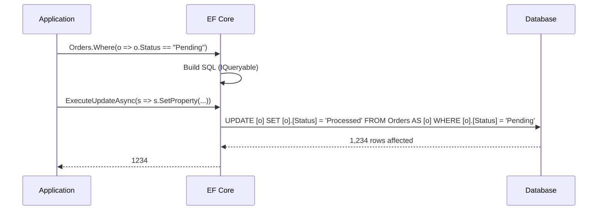
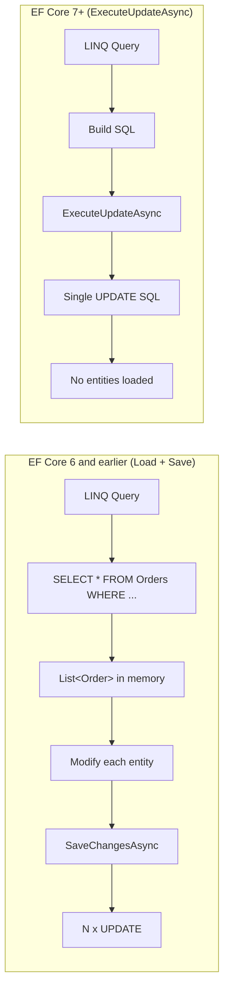

# Batch Updates — ExecuteUpdateAsync EF Core 7+

## 1 — Overview

EF Core 7+ introduced \`ExecuteUpdateAsync\` and \`ExecuteDeleteAsync\` — two methods that execute **set-based** UPDATE and DELETE SQL statements directly against the database **without loading entities into memory**. This is a game-changer for batch operations.

### Before EF Core 7: the load-and-save pattern

\`\`\`csharp
// Old way: load ALL entities, modify each, save one by one
var pendingOrders = await db.Orders
    .Where(o => o.Status == "Pending")
    .ToListAsync(); // SELECT * FROM Orders WHERE Status = 'Pending'

foreach (var order in pendingOrders)
{
    order.Status = "Processed";
}

await db.SaveChangesAsync();
// Generates N UPDATE statements (one per entity)

// For 10,000 orders:
// - 10,000 rows loaded into memory
// - 10,000 individual UPDATE statements
// - ~15 seconds
\`\`\`

### With EF Core 7+: single UPDATE SQL

\`\`\`csharp
// New way: single UPDATE statement, no entities loaded
await db.Orders
    .Where(o => o.Status == "Pending")
    .ExecuteUpdateAsync(s => s.SetProperty(o => o.Status, "Processed"));

// Generated SQL:
// UPDATE [o]
// SET [o].[Status] = 'Processed'
// FROM [Orders] AS [o]
// WHERE [o].[Status] = 'Pending'

// For 10,000 orders:
// - No rows loaded into memory
// - 1 single UPDATE statement
// - ~45ms (same batch as any UPDATE with a WHERE clause)
\`\`\`

### Key benefits

| Benefit | Description |
|---|---|
| **No data loading** | Entities are not fetched from the database |
| **Single round-trip** | One SQL statement for any number of rows |
| **Memory efficient** | No \`List<T>\` allocation for thousands of entities |
| **Change tracker bypass** | No overhead from \`AsNoTracking\` calls |
| **Atomic by design** | The UPDATE either applies to all rows or none |

---

## 2 — The Problem: Load-and-Save Pattern (N+1 Updates)

### Traditional approach

\`\`\`csharp
// Massive over-fetching
public async Task MarkOrdersAsShipped(List<Guid> orderIds)
{
    var orders = await db.Orders
        .Where(o => orderIds.Contains(o.Id))
        .ToListAsync(); // Loads ALL matching rows into memory

    foreach (var order in orders)
    {
        order.Status = "Shipped";
        order.ShippedAt = DateTime.UtcNow;
    }

    await db.SaveChangesAsync(); // N individual UPDATE statements
}
\`\`\`

### What happens under the hood

\`\`\`sql
-- Step 1: SELECT all matching rows
SELECT [o].[Id], [o].[CustomerId], [o].[OrderDate], [o].[Status], [o].[TotalAmount]
FROM [Orders] AS [o]
WHERE [o].[Id] IN (1, 2, 3, ..., 10000)

-- Step 2: Send N UPDATE statements
UPDATE [Orders] SET [Status] = 'Shipped', [ShippedAt] = '2026-06-27 10:00:00' WHERE [Id] = 1
UPDATE [Orders] SET [Status] = 'Shipped', [ShippedAt] = '2026-06-27 10:00:00' WHERE [Id] = 2
UPDATE [Orders] SET [Status] = 'Shipped', [ShippedAt] = '2026-06-27 10:00:00' WHERE [Id] = 3
... 9,997 more ...
\`\`\`

### Performance cost

```
Rows  |  Load + SaveChanges  |  ExecuteUpdateAsync  |  Improvement
------|----------------------|---------------------|---------------
100   |  1.2s                |  12ms               |  ~100x
1K    |  3.5s                |  18ms               |  ~200x
10K   |  18s                 |  45ms               |  ~400x
100K  |  ~3min               |  200ms              |  ~900x
```

### Memory cost

\`\`\`csharp
// Load + SaveChanges: 10K orders = ~30-50 MB
var orders = await db.Orders.Take(10000).ToListAsync();
// orders list: 10,000 entities in memory
// Change tracker: 10,000 snapshots
// Memory: ~30-50 MB

// ExecuteUpdateAsync: 0 MB
await db.Orders.ExecuteUpdateAsync(...);
// No entities loaded
// Memory: negligible
\`\`\`

---

## 3 — ExecuteUpdateAsync Syntax

### Basic syntax

\`\`\`csharp
await db.Orders
    .Where(o => o.Status == "Pending")
    .ExecuteUpdateAsync(s => s.SetProperty(o => o.Status, "Processed"));
\`\`\`

### Setting multiple properties

\`\`\`csharp
await db.Orders
    .Where(o => o.Status == "Pending" && o.OrderDate < DateTime.UtcNow.AddDays(-30))
    .ExecuteUpdateAsync(s => s
        .SetProperty(o => o.Status, "Cancelled")
        .SetProperty(o => o.CancelledAt, DateTime.UtcNow)
        .SetProperty(o => o.CancellationReason, "Auto-cancelled: overdue"));
\`\`\`

### Using computed values

\`\`\`csharp
// Increment a counter
await db.Orders
    .Where(o => o.Status == "Pending")
    .ExecuteUpdateAsync(s => s
        .SetProperty(o => o.RetryCount, o => o.RetryCount + 1)
        .SetProperty(o => o.LastRetryAt, DateTime.UtcNow));
\`\`\`

### Using values from another column

\`\`\`csharp
// Set TotalAmount = SubTotal + Tax
await db.Orders
    .Where(o => o.Status == "Draft")
    .ExecuteUpdateAsync(s => s
        .SetProperty(o => o.TotalAmount, o => o.SubTotal + o.Tax));
\`\`\`

### Conditional updates using the entity parameter

\`\`\`csharp
await db.Orders
    .Where(o => o.Status == "Pending")
    .ExecuteUpdateAsync(s => s
        .SetProperty(o => o.Priority,
            o => o.TotalAmount >= 1000 ? "High" : "Normal"));
\`\`\`

### DbSet-level (no filter)

\`\`\`csharp
// WARNING: updates ALL rows in the table
await db.Orders.ExecuteUpdateAsync(s => s
    .SetProperty(o => o.IsActive, false));
\`\`\`

### Async vs sync

\`\`\`csharp
// Async (preferred)
int affected = await db.Orders
    .Where(o => o.Status == "Pending")
    .ExecuteUpdateAsync(s => s.SetProperty(o => o.Status, "Processed"));

// Sync (blocking)
int affected = db.Orders
    .Where(o => o.Status == "Pending")
    .ExecuteUpdate(s => s.SetProperty(o => o.Status, "Processed"));
\`\`\`

### Return value

\`\`\`csharp
int rowsAffected = await db.Orders
    .Where(o => o.Status == "Pending")
    .ExecuteUpdateAsync(s => s
        .SetProperty(o => o.Status, "Processed"));

Console.WriteLine($"{rowsAffected} orders were updated.");
// Output: "1234 orders were updated."
\`\`\`

---

## 4 — Generated SQL

### Simple update

\`\`\`csharp
// C# code:
await db.Orders
    .Where(o => o.Status == "Pending")
    .ExecuteUpdateAsync(s => s.SetProperty(o => o.Status, "Processed"));
\`\`\`

\`\`\`sql
-- Generated SQL (SQL Server):
UPDATE [o]
SET [o].[Status] = 'Processed'
FROM [Orders] AS [o]
WHERE [o].[Status] = N'Pending'
\`\`\`

### Multi-property update

\`\`\`csharp
await db.Orders
    .Where(o => o.Status == "Pending")
    .ExecuteUpdateAsync(s => s
        .SetProperty(o => o.Status, "Shipped")
        .SetProperty(o => o.ShippedAt, DateTime.UtcNow));
\`\`\`

\`\`\`sql
UPDATE [o]
SET [o].[Status] = N'Shipped',
    [o].[ShippedAt] = '2026-06-27T10:00:00.0000000Z'
FROM [Orders] AS [o]
WHERE [o].[Status] = N'Pending'
\`\`\`

### Update with computed value

\`\`\`csharp
await db.Orders
    .Where(o => o.Status == "Pending")
    .ExecuteUpdateAsync(s => s
        .SetProperty(o => o.Priority,
            o => o.TotalAmount >= 1000 ? "High" : "Normal"));
\`\`\`

\`\`\`sql
UPDATE [o]
SET [o].[Priority] = CASE
    WHEN [o].[TotalAmount] >= 1000.0 THEN N'High'
    ELSE N'Normal'
END
FROM [Orders] AS [o]
WHERE [o].[Status] = N'Pending'
\`\`\`

### Update with JOIN (across navigation)

\`\`\`csharp
// Update orders based on related customer data
await db.Orders
    .Where(o => o.Customer.IsPremium && o.Status == "Pending")
    .ExecuteUpdateAsync(s => s
        .SetProperty(o => o.Priority, "High")
        .SetProperty(o => o.Discount, 0.1m));
\`\`\`

\`\`\`sql
UPDATE [o]
SET [o].[Priority] = N'High',
    [o].[Discount] = 0.1
FROM [Orders] AS [o]
INNER JOIN [Customers] AS [c] ON [o].[CustomerId] = [c].[Id]
WHERE [c].[IsPremium] = 1 AND [o].[Status] = N'Pending'
\`\`\`

### Provider-specific SQL

\`\`\`sql
-- PostgreSQL (Npgsql):
UPDATE "Orders" AS o
SET "Status" = 'Processed'
WHERE o."Status" = 'Pending';

-- SQLite:
UPDATE "Orders" AS "o"
SET "o"."Status" = 'Processed'
WHERE "o"."Status" = 'Pending';
\`\`\`

---

## 5 — Conditional Batch Updates

### Date-based update

\`\`\`csharp
// Archive old orders
var cutoff = DateTime.UtcNow.AddYears(-1);

var archived = await db.Orders
    .Where(o => o.OrderDate < cutoff && o.Status != "Archived")
    .ExecuteUpdateAsync(s => s
        .SetProperty(o => o.Status, "Archived")
        .SetProperty(o => o.ArchivedAt, DateTime.UtcNow));

Console.WriteLine($"Archived {archived} old orders.");
\`\`\`

### Multi-condition update

\`\`\`csharp
await db.InventoryItems
    .Where(i => i.Quantity <= i.ReorderLevel
                && i.IsActive
                && i.Supplier != null)
    .ExecuteUpdateAsync(s => s
        .SetProperty(i => i.Status, "ReorderNeeded")
        .SetProperty(i => i.ReorderSuggestedAt, DateTime.UtcNow));
\`\`\`

### Batch update with IN clause

\`\`\`csharp
var orderIds = new List<Guid> { id1, id2, id3, ... };

await db.Orders
    .Where(o => orderIds.Contains(o.Id))
    .ExecuteUpdateAsync(s => s
        .SetProperty(o => o.Status, "Cancelled")
        .SetProperty(o => o.CancelledAt, DateTime.UtcNow));
\`\`\`

\`\`\`sql
UPDATE [o]
SET [o].[Status] = N'Cancelled',
    [o].[CancelledAt] = '2026-06-27T10:00:00.0000000Z'
FROM [Orders] AS [o]
WHERE [o].[Id] IN (1, 2, 3, ...)
\`\`\`

### Update with string operations

\`\`\`csharp
await db.Products
    .Where(p => p.Name.StartsWith("OLD-"))
    .ExecuteUpdateAsync(s => s
        .SetProperty(p => p.Name,
            p => p.Name.Replace("OLD-", "ARCHIVED-"))
        .SetProperty(p => p.IsActive, false));
\`\`\`

\`\`\`sql
UPDATE [p]
SET [p].[Name] = REPLACE([p].[Name], N'OLD-', N'ARCHIVED-'),
    [p].[IsActive] = 0
FROM [Products] AS [p]
WHERE [p].[Name] LIKE N'OLD-%'
\`\`\`

### Conditional with navigation

\`\`\`csharp
await db.Orders
    .Where(o => o.Customer.Tier == "Gold" && o.Status == "Pending")
    .ExecuteUpdateAsync(s => s
        .SetProperty(o => o.ShippingType, "Express")
        .SetProperty(o => o.Priority, "High"));
\`\`\`

### Batch update with DateOnly/TimeOnly

\`\`\`csharp
await db.Appointments
    .Where(a => a.Date < DateOnly.FromDateTime(DateTime.UtcNow))
    .ExecuteUpdateAsync(s => s
        .SetProperty(a => a.Status, "PastDue")
        .SetProperty(a => a.Notes,
            a => a.Notes + " [Auto-marked: past due]"));
\`\`\`

---

## 6 — Dapper Equivalent

### Dapper — raw UPDATE with WHERE

\`\`\`csharp
using Dapper;

public class DapperBatchUpdateService
{
    private readonly string _connectionString;

    public DapperBatchUpdateService(string connectionString)
    {
        _connectionString = connectionString;
    }

    public async Task<int> UpdatePendingToProcessedAsync()
    {
        await using var conn = new SqlConnection(_connectionString);
        await conn.OpenAsync();

        const string sql = @"
            UPDATE Orders
            SET Status = @NewStatus
            WHERE Status = @OldStatus";

        return await conn.ExecuteAsync(sql, new
        {
            OldStatus = "Pending",
            NewStatus = "Processed"
        });
    }
}
\`\`\`

### Multi-property update with Dapper

\`\`\`csharp
public async Task<int> MarkAsShippedAsync(List<Guid> orderIds)
{
    await using var conn = new SqlConnection(_connectionString);
    await conn.OpenAsync();

    const string sql = @"
        UPDATE Orders
        SET Status = @Status,
            ShippedAt = @ShippedAt
        WHERE Id IN @Ids";

    return await conn.ExecuteAsync(sql, new
    {
        Ids = orderIds,
        Status = "Shipped",
        ShippedAt = DateTime.UtcNow
    });
}
\`\`\`

### Conditional update with Dapper

\`\`\`csharp
public async Task<int> UpdatePricesByCategoryAsync(string category, decimal multiplier)
{
    await using var conn = new SqlConnection(_connectionString);
    await conn.OpenAsync();

    const string sql = @"
        UPDATE Products
        SET Price = Price * @Multiplier,
            UpdatedAt = @Now
        WHERE Category = @Category
          AND IsActive = 1";

    return await conn.ExecuteAsync(sql, new
    {
        Category = category,
        Multiplier = multiplier,
        Now = DateTime.UtcNow
    });
}
\`\`\`

### Dapper with transaction

\`\`\`csharp
public async Task BulkUpdateWithTransactionAsync()
{
    await using var conn = new SqlConnection(_connectionString);
    await conn.OpenAsync();
    using var tx = conn.BeginTransaction();

    try
    {
        var ordersUpdated = await conn.ExecuteAsync(
            "UPDATE Orders SET Status = @Status WHERE Status = @OldStatus",
            new { Status = "Processed", OldStatus = "Pending" }, tx);

        var itemsUpdated = await conn.ExecuteAsync(
            "UPDATE OrderItems SET IsActive = 1 WHERE OrderId IN (SELECT Id FROM Orders WHERE Status = 'Processed')",
            transaction: tx);

        tx.Commit();
        Console.WriteLine($"Orders: {ordersUpdated}, Items: {itemsUpdated}");
    }
    catch
    {
        tx.Rollback();
        throw;
    }
}
\`\`\`

### Dapper — dynamic WHERE clause

\`\`\`csharp
public async Task<int> DynamicUpdateAsync(
    string tableName,
    string setClause,
    object? parameters = null,
    string? whereClause = null)
{
    await using var conn = new SqlConnection(_connectionString);
    await conn.OpenAsync();

    var sql = $"UPDATE {tableName} SET {setClause}";
    if (!string.IsNullOrWhiteSpace(whereClause))
        sql += $" WHERE {whereClause}";

    return await conn.ExecuteAsync(sql, parameters);
}

// Usage:
await DynamicUpdateAsync(
    "Orders",
    "Status = @Status, ShippedAt = @ShippedAt",
    new { Status = "Shipped", ShippedAt = DateTime.UtcNow },
    "Status = 'Pending' AND OrderDate < @Cutoff");
\`\`\`

### EF Core vs Dapper comparison

```
Aspect              | EF Core ExecuteUpdateAsync  | Dapper ExecuteAsync
--------------------|------------------------------|---------------------
SQL generation      | Automatic from LINQ          | You write the SQL
Type safety         | Strong (lambda expressions)  | Weak (string-based)
Filter              | LINQ Where                   | WHERE clause string
Set properties      | SetProperty lambdas          | SET clause string
Return value        | Rows affected (int)          | Rows affected (int)
Transaction         | Implicit via DbContext       | Explicit IDbTransaction
Async               | ExecuteUpdateAsync           | ExecuteAsync
Provider portability| Yes (EF Core translates)    | No (SQL is provider-specific)
```

---

## 7 — Mermaid Diagram






---

## 8 — Real-World Examples

### Example 1: Soft-delete expired records

```csharp
public async Task<int> SoftDeleteExpiredAsync()
{
    var cutoff = DateTime.UtcNow.AddDays(-90);

    return await db.Sessions
        .Where(s => s.LastAccessedAt < cutoff && !s.IsDeleted)
        .ExecuteUpdateAsync(s => s
            .SetProperty(x => x.IsDeleted, true)
            .SetProperty(x => x.DeletedAt, DateTime.UtcNow));
}
```

### Example 2: Recalculate loyalty tiers

```csharp
public async Task<int> UpdateLoyaltyTiersAsync()
{
    var now = DateTime.UtcNow;
    var yearAgo = now.AddYears(-1);

    return await db.Customers
        .Where(c => c.LastActivityDate > yearAgo)
        .ExecuteUpdateAsync(s => s
            .SetProperty(c => c.Tier,
                c => c.TotalSpent >= 10000 ? "Gold"
                   : c.TotalSpent >= 5000  ? "Silver"
                   :                         "Bronze")
            .SetProperty(c => c.TierUpdatedAt, now));
}
```

\`\`\`sql
-- Generated SQL:
UPDATE [c]
SET [c].[Tier] = CASE
    WHEN [c].[TotalSpent] >= 10000.0 THEN N'Gold'
    WHEN [c].[TotalSpent] >= 5000.0 THEN N'Silver'
    ELSE N'Bronze'
END,
    [c].[TierUpdatedAt] = '2026-06-27T10:00:00.0000000Z'
FROM [Customers] AS [c]
WHERE [c].[LastActivityDate] > '2025-06-27T10:00:00.0000000Z'
\`\`\`

### Example 3: Apply bulk discount

```csharp
public async Task<int> ApplySeasonalDiscountAsync(decimal discountPercent)
{
    return await db.Products
        .Where(p => p.Category == "Seasonal" && p.IsActive)
        .ExecuteUpdateAsync(s => s
            .SetProperty(p => p.Discount,
                p => p.Price * discountPercent / 100)
            .SetProperty(p => p.PromotionLabel, "Seasonal Sale"));
}
```

### Example 4: Reset user passwords (flag)

```csharp
public async Task<int> FlagPasswordResetAsync(DateOnly cutoff)
{
    return await db.Users
        .Where(u => u.PasswordLastChanged < cutoff.ToDateTime(TimeOnly.MinValue))
        .ExecuteUpdateAsync(s => s
            .SetProperty(u => u.RequiresPasswordReset, true)
            .SetProperty(u => u.PasswordResetFlaggedAt, DateTime.UtcNow));
}
```

### Example 5: Update denormalized aggregates

```csharp
public async Task UpdateOrderCountsAsync()
{
    // Update total order count on Customer from Orders
    // This uses a subquery approach via navigation
    await db.Customers
        .Where(c => c.Orders.Any())
        .ExecuteUpdateAsync(s => s
            .SetProperty(c => c.TotalOrders,
                c => c.Orders.Count())
            .SetProperty(c => c.LastOrderDate,
                c => c.Orders.Max(o => o.OrderDate)));
}
```

### Example 6: Bulk archive with Dapper

```csharp
public async Task ArchiveCompletedOrdersAsync()
{
    await using var conn = new SqlConnection(_connectionString);
    await conn.OpenAsync();
    using var tx = conn.BeginTransaction();

    // Step 1: Update status
    var updated = await conn.ExecuteAsync(@"
        UPDATE Orders
        SET Status = 'Archived',
            ArchivedAt = @Now
        WHERE Status = 'Completed'
          AND CompletedAt < @Cutoff", new
    {
        Now = DateTime.UtcNow,
        Cutoff = DateTime.UtcNow.AddMonths(-6)
    }, tx);

    // Step 2: Log the archive operation
    await conn.ExecuteAsync(@"
        INSERT INTO ArchiveLog (Operation, TableName, RowsAffected, ArchivedAt)
        VALUES (@Op, @Table, @Rows, @Now)",
        new { Op = "BULK_ARCHIVE", Table = "Orders", Rows = updated, Now = DateTime.UtcNow }, tx);

    tx.Commit();
}
```

### Example 7: EF Core + Dapper hybrid

```csharp
public async Task HybridBulkUpdateAsync(AppDbContext db)
{
    // Use EF Core for complex filtering
    var query = db.Orders
        .Where(o => o.Customer.IsPremium && o.Status == "Pending")
        .Where(o => o.OrderDate < DateTime.UtcNow.AddDays(-1));

    // Get the SQL and parameters from EF Core
    var sql = query.ToQueryString();
    // "SELECT ... FROM Orders AS o INNER JOIN Customers AS c ..."

    // But for the UPDATE, use Dapper with the same filter
    var connStr = db.Database.GetConnectionString();
    await using var conn = new SqlConnection(connStr);
    await conn.OpenAsync();

    const string updateSql = @"
        UPDATE o
        SET o.Priority = 'High',
            o.Discount = 0.1
        FROM Orders o
        INNER JOIN Customers c ON o.CustomerId = c.Id
        WHERE c.IsPremium = 1
          AND o.Status = 'Pending'
          AND o.OrderDate < @Cutoff";

    await conn.ExecuteAsync(updateSql, new
    {
        Cutoff = DateTime.UtcNow.AddDays(-1)
    });
}
```

---

## 9 — Gotchas and Best Practices

### Gotcha 1: No change tracking — entities are stale in memory

After \`ExecuteUpdateAsync\`, entities previously loaded by the \`DbContext\` still have their **old values**. The change tracker is not updated.

```csharp
// Load an entity
var order = await db.Orders.FindAsync(orderId);
// order.Status = "Pending"

// ExecuteUpdateAsync changes it in the database
await db.Orders
    .Where(o => o.Id == orderId)
    .ExecuteUpdateAsync(s => s.SetProperty(o => o.Status, "Processed"));

// order.Status is STILL "Pending" in memory!
// The entity is now out of sync with the database.

// FIX: detach or reload the entity
db.Entry(order).State = EntityState.Detached;
// or
await db.Entry(order).ReloadAsync();
```

### Gotcha 2: No cascade — related entities not updated

\`ExecuteUpdateAsync\` operates **only on the root entity type**. It does not cascade to related entities.

```csharp
// BAD: this does NOT update related OrderItems
await db.Orders
    .Where(o => o.Status == "Cancelled")
    .ExecuteUpdateAsync(s => s.SetProperty(o => o.Status, "Voided"));
// OrderItems still reference the order with old status

// FIX: update related entities separately
await db.OrderItems
    .Where(i => i.Order.Status == "Cancelled")
    .ExecuteUpdateAsync(s => s.SetProperty(i => i.IsActive, false));
```

### Gotcha 3: No navigation property updates

You **cannot** update a navigation property with \`ExecuteUpdateAsync\`.

```csharp
// BAD: navigation properties not supported in SetProperty
await db.Orders
    .Where(o => o.Status == "Pending")
    .ExecuteUpdateAsync(s => s
        .SetProperty(o => o.Customer.Tier, "Gold")); // COMPILE ERROR

// FIX: update the related entity directly
await db.Customers
    .Where(c => c.Orders.Any(o => o.Status == "Pending"))
    .ExecuteUpdateAsync(s => s.SetProperty(c => c.Tier, "Gold"));
```

### Gotcha 4: ExecuteUpdateAsync does NOT call SaveChanges

\`ExecuteUpdateAsync\` executes immediately and does **not** go through \`SaveChangesAsync\`. Interceptors that hook into \`SaveChangesAsync\` (audit, soft delete) will **not** fire.

```csharp
public class AuditInterceptor : SaveChangesInterceptor
{
    public override async ValueTask<InterceptionResult<int>> SavingChangesAsync(
        DbContextEventData eventData, InterceptionResult<int> result,
        CancellationToken ct = default)
    {
        // This does NOT fire for ExecuteUpdateAsync!
        return await base.SavingChangesAsync(eventData, result, ct);
    }
}
```

### Gotcha 5: Two-phase commit / transaction scope

\`ExecuteUpdateAsync\` participates in the current transaction if one is active:

```csharp
using var tx = await db.Database.BeginTransactionAsync();

await db.Orders
    .Where(o => o.Status == "Pending")
    .ExecuteUpdateAsync(s => s.SetProperty(o => o.Status, "Processed"));

await db.OrderItems
    .Where(i => i.Order.Status == "Processed")
    .ExecuteUpdateAsync(s => s.SetProperty(i => i.IsActive, true));

await tx.CommitAsync(); // Both updates committed together
```

### Gotcha 6: ExecuteUpdateAsync with complex types

Some property types cannot be used in \`SetProperty\`:

```csharp
// BAD: complex type with no translation
await db.Orders
    .ExecuteUpdateAsync(s => s
        .SetProperty(o => o.ShippingAddress,
            new Address { City = "NYC" })); // Error: no translation

// FIX: store complex types as JSON or use scalar columns
```

### Gotcha 7: ExecuteUpdateAsync on keyless entities

Keyless entities (views, raw SQL mappings) **cannot** be used with \`ExecuteUpdateAsync\`.

```csharp
// BAD: keyless entity type
var orderView = db.Set<OrderView>(); // Keyless
await orderView
    .Where(v => v.Status == "Pending")
    .ExecuteUpdateAsync(...); // INVALID OPERATION
```

### Gotcha 8: Concurrency — no row version check

\`ExecuteUpdateAsync\` does **not** perform concurrency checking. It applies the update regardless of row version.

```csharp
// No automatic concurrency handling
await db.Orders
    .Where(o => o.Status == "Pending")
    .ExecuteUpdateAsync(s => s.SetProperty(o => o.Status, "Processed"));
// Overwrites even if another user changed the row

// FIX: add the concurrency condition manually
await db.Orders
    .Where(o => o.Status == "Pending" && o.RowVersion == expectedVersion)
    .ExecuteUpdateAsync(s => s.SetProperty(o => o.Status, "Processed"));
```

### Gotcha 9: ExecuteUpdateAsync on an empty query

If the \`Where\` clause matches zero rows, \`ExecuteUpdateAsync\` returns 0 — it does not throw.

```csharp
int affected = await db.Orders
    .Where(o => o.Status == "NonExistentStatus")
    .ExecuteUpdateAsync(s => s.SetProperty(o => o.Status, "Value"));

Console.WriteLine(affected); // 0 — no error
```

### Gotcha 10: Memory-stale entities after batch update

```csharp
// Scenario: batch process marks orders as shipped
var ordersToShip = await db.Orders
    .Where(o => o.Status == "Pending")
    .Take(100)
    .ToListAsync();

// Some of these might already be updated by ExecuteUpdateAsync in another service
await db.Orders
    .Where(o => o.Status == "Pending")
    .ExecuteUpdateAsync(s => s.SetProperty(o => o.Status, "Shipped"));

// ordersToShip now has stale data!
// Any further operations on these entities will be incorrect.

// FIX: refresh or re-query after ExecuteUpdateAsync
foreach (var order in ordersToShip)
{
    db.Entry(order).State = EntityState.Detached;
}
```

### Best practices checklist

| # | Practice | Why |
|---|---|---|
| 1 | Detach or reload entities after ExecuteUpdateAsync | Avoids stale data in change tracker |
| 2 | Handle related entities separately | No cascade from ExecuteUpdateAsync |
| 3 | Use explicit transactions for multi-table updates | Ensures atomicity |
| 4 | Add \`.Where()\` to limit scope — avoid full table updates | Prevents accidental mass updates |
| 5 | Test the generated SQL with ToQueryString() | Verify the WHERE clause is correct |
| 6 | Combine with ExecuteDeleteAsync for full batch operations | Covers both update and delete |
| 7 | Consider Dapper for complex SQL that EF can't express | Dapper gives full SQL control |
| 8 | Log rows-affected for auditing | Returns int with count of updated rows |
| 9 | Don't mix ExecuteUpdateAsync with tracked entities | Leads to inconsistent state |
| 10 | Prefer ExecuteUpdateAsync over load-and-save for performance | 100-400x faster for batch operations |

### Summary

```
ExecuteUpdateAsync (EF Core 7+):
  • Single UPDATE SQL — no entity loading
  • SetProperty lambda for each column
  • Supports computed values (e.g., o => o.Count + 1)
  • Supports conditional expressions (CASE WHEN)
  • Returns rows affected (int)
  • Joins supported via LINQ navigation

Dapper equivalent:
  • ExecuteAsync with raw UPDATE SQL
  • Full control over SQL syntax
  • Explicit transaction management
  • Same performance (both are single SQL)

Rule of thumb:
  If you can express it in LINQ → use ExecuteUpdateAsync
  If you need provider-specific SQL → use Dapper
```

### Related notes

- [[8.900 — Batch Deletes — ExecuteDeleteAsync EF Core 7+]]
- [[8.898 — Bulk Insert — EF Core Bulk Extensions]]
- [[8.858 — Dapper — Execute — INSERT, UPDATE, DELETE]]
- [[3.075 — EF Core 7 — ExecuteUpdate and ExecuteDelete]]