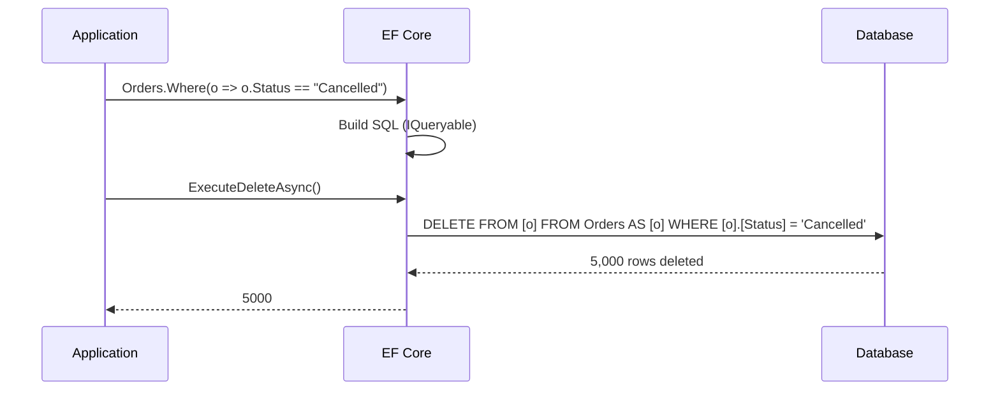
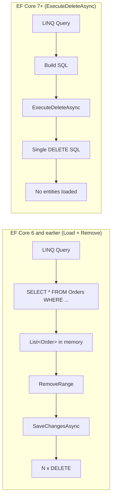
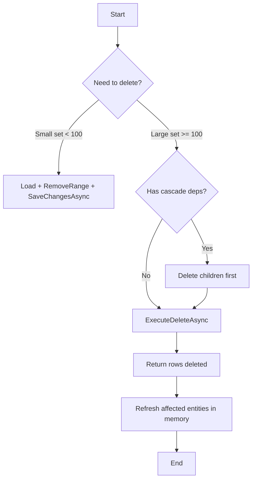

# Batch Deletes — ExecuteDeleteAsync EF Core 7+

## 1 — Overview

EF Core 7+ introduced \`ExecuteDeleteAsync\`, the delete counterpart to \`ExecuteUpdateAsync\`. It generates a single \`DELETE\` SQL statement that removes all rows matching a LINQ predicate **without loading entities into memory**.

### Before EF Core 7: the load-and-remove pattern

```csharp
// Old way: load ALL entities, remove one by one, save
var oldOrders = await db.Orders
    .Where(o => o.OrderDate < new DateTime(2024, 1, 1))
    .ToListAsync(); // SELECT * FROM Orders WHERE OrderDate < '2024-01-01'

db.Orders.RemoveRange(oldOrders);
await db.SaveChangesAsync();
// Generates N DELETE statements (one per entity)

// For 10,000 old orders:
// - 10,000 rows loaded into memory
// - 10,000 individual DELETE statements
// - ~15-20 seconds
// - 2 SQL round-trips (SELECT + many DELETEs)
```

### With EF Core 7+: single DELETE SQL

```csharp
// New way: single DELETE statement, no entities loaded
var deleted = await db.Orders
    .Where(o => o.OrderDate < new DateTime(2024, 1, 1))
    .ExecuteDeleteAsync();

// Generated SQL:
// DELETE FROM [o]
// FROM [Orders] AS [o]
// WHERE [o].[OrderDate] < '2024-01-01'

// For 10,000 rows:
// - No rows loaded into memory
// - 1 single DELETE statement
// - ~30ms
```

### Key benefits

| Benefit | Description |
|---|---|
| **No data loading** | Entities are never fetched from the database |
| **Single round-trip** | One DELETE statement for any number of rows |
| **Memory efficient** | No \`List<T>\` allocation for thousands of entities |
| **No change tracker overhead** | Bypasses the entire change tracker |
| **Atomic per statement** | Single DELETE either succeeds or fails |
| **Frees application memory** | No entity materialization |

---

## 2 — The Problem: Load-and-Remove Pattern (N+1 Deletes)

### Traditional approach

```csharp
public async Task PurgeOldRecordsAsync()
{
    var oldRecords = await db.AuditLogs
        .Where(l => l.Timestamp < DateTime.UtcNow.AddMonths(-6))
        .ToListAsync(); // Loads ALL matching rows

    db.AuditLogs.RemoveRange(oldRecords);
    await db.SaveChangesAsync(); // N individual DELETE statements
}
```

### What happens under the hood

```sql
-- Step 1: SELECT all matching rows
SELECT [l].[Id], [l].[Timestamp], [l].[Message], [l].[UserId]
FROM [AuditLogs] AS [l]
WHERE [l].[Timestamp] < '2025-12-27T10:00:00'

-- Step 2: Send N DELETE statements
DELETE FROM [AuditLogs] WHERE [Id] = 1
DELETE FROM [AuditLogs] WHERE [Id] = 2
DELETE FROM [AuditLogs] WHERE [Id] = 3
... 99,997 more ...
```

### Performance cost

```
Rows   |  Load + RemoveRange  |  ExecuteDeleteAsync  |  Improvement
-------|----------------------|----------------------|---------------
100    |  800ms               |  8ms                 |  ~100x
1K     |  2.5s                |  12ms                |  ~200x
10K    |  15s                 |  30ms                |  ~500x
100K   |  ~3min               |  150ms               |  ~1200x
1M     |  ~30min              |  1.2s                |  ~1500x
```

### Memory cost comparison

```csharp
// Load + Remove: 100K audit logs
var logs = await db.AuditLogs.Where(l => l.Timestamp < cutoff).ToListAsync();
// Memory: 100,000 entities × ~200 bytes each ≈ 20 MB
// Change tracker entries: 100,000 snapshot entries ≈ 30 MB
// Total: ~50 MB just for tracking

// ExecuteDeleteAsync: same operation
await db.AuditLogs.Where(l => l.Timestamp < cutoff).ExecuteDeleteAsync();
// Memory: negligible (only the IQueryable overhead)
```

---

## 3 — ExecuteDeleteAsync Syntax

### Basic syntax

```csharp
// Delete all orders with a specific status
int deleted = await db.Orders
    .Where(o => o.Status == "Cancelled")
    .ExecuteDeleteAsync();

Console.WriteLine($"Deleted {deleted} cancelled orders.");
```

### Delete with multiple conditions

```csharp
int deleted = await db.Orders
    .Where(o => o.Status == "Cancelled"
                && o.CancelledAt < DateTime.UtcNow.AddMonths(-1)
                && o.RefundProcessed)
    .ExecuteDeleteAsync();
```

### Delete all rows (use with caution!)

```csharp
// Deletes ALL rows from the Orders table
int allDeleted = await db.Orders.ExecuteDeleteAsync();

// Equivalent: DELETE FROM [Orders]
```

### Delete based on a list of IDs

```csharp
var idsToDelete = new List<Guid> { id1, id2, id3, ... };

int deleted = await db.Orders
    .Where(o => idsToDelete.Contains(o.Id))
    .ExecuteDeleteAsync();
```

```sql
-- Generated SQL:
DELETE FROM [o]
FROM [Orders] AS [o]
WHERE [o].[Id] IN (1, 2, 3, ...)
```

### Delete with join (navigation)

```csharp
// Delete orders for inactive customers
int deleted = await db.Orders
    .Where(o => !o.Customer.IsActive)
    .ExecuteDeleteAsync();
```

```sql
DELETE FROM [o]
FROM [Orders] AS [o]
INNER JOIN [Customers] AS [c] ON [o].[CustomerId] = [c].[Id]
WHERE [c].[IsActive] = 0
```

### Delete with Any/All subquery

```csharp
// Delete categories that have no products
int deleted = await db.Categories
    .Where(c => !c.Products.Any())
    .ExecuteDeleteAsync();
```

```sql
DELETE FROM [c]
FROM [Categories] AS [c]
WHERE NOT EXISTS (
    SELECT 1 FROM [Products] AS [p]
    WHERE [c].[Id] = [p].[CategoryId])
```

### Async vs sync

```csharp
// Async (preferred)
int deleted = await db.Orders
    .Where(o => o.Status == "Cancelled")
    .ExecuteDeleteAsync();

// Sync
int deleted = db.Orders
    .Where(o => o.Status == "Cancelled")
    .ExecuteDelete();
```

### Return value

```csharp
int rowsDeleted = await db.Orders
    .Where(o => o.Status == "Archived")
    .ExecuteDeleteAsync();

if (rowsDeleted > 0)
{
    _logger.LogInformation("Purged {Count} archived orders.", rowsDeleted);
}

// rowsDeleted reflects the actual number of rows deleted on the server
```

---

## 4 — Generated SQL

### Simple delete

```csharp
await db.Orders
    .Where(o => o.Status == "Cancelled")
    .ExecuteDeleteAsync();
```

```sql
DELETE FROM [o]
FROM [Orders] AS [o]
WHERE [o].[Status] = N'Cancelled'
```

### Delete with date filter

```csharp
await db.AuditLogs
    .Where(l => l.CreatedAt < DateTime.UtcNow.AddDays(-90))
    .ExecuteDeleteAsync();
```

```sql
DELETE FROM [l]
FROM [AuditLogs] AS [l]
WHERE [l].[CreatedAt] < '2026-03-29T10:00:00.0000000Z'
```

### Delete with IN clause

```csharp
await db.Orders
    .Where(o => o.Status == "Cancelled" && ids.Contains(o.Id))
    .ExecuteDeleteAsync();
```

```sql
DELETE FROM [o]
FROM [Orders] AS [o]
WHERE [o].[Status] = N'Cancelled' AND [o].[Id] IN (1, 2, 3)
```

### Delete with JOIN

```csharp
await db.Orders
    .Where(o => o.Customer.IsDeleted)
    .ExecuteDeleteAsync();
```

```sql
DELETE FROM [o]
FROM [Orders] AS [o]
INNER JOIN [Customers] AS [c] ON [o].[CustomerId] = [c].[Id]
WHERE [c].[IsDeleted] = 1
```

### Delete with subquery

```csharp
await db.Products
    .Where(p => !p.OrderItems.Any())
    .ExecuteDeleteAsync();
```

```sql
DELETE FROM [p]
FROM [Products] AS [p]
WHERE NOT EXISTS (
    SELECT 1 FROM [OrderItems] AS [o]
    WHERE [p].[Id] = [o].[ProductId])
```

### Provider-specific SQL

```sql
-- PostgreSQL:
DELETE FROM "Orders" AS o
WHERE o."Status" = 'Cancelled';

-- SQLite:
DELETE FROM "Orders" AS "o"
WHERE "o"."Status" = 'Cancelled';
```

---

## 5 — Conditional Batch Deletes

### Date-based purge

```csharp
public async Task<int> PurgeOldSessionsAsync()
{
    var cutoff = DateTime.UtcNow.AddDays(-30);

    return await db.UserSessions
        .Where(s => s.LastAccessedAt < cutoff && !s.IsPersistent)
        .ExecuteDeleteAsync();
}
```

### Delete orphaned records

```csharp
// Delete OrderItems that reference non-existent orders
await db.OrderItems
    .Where(i => !db.Orders.Any(o => o.Id == i.OrderId))
    .ExecuteDeleteAsync();
```

### Cascade-safe delete — order matters

```csharp
using var tx = await db.Database.BeginTransactionAsync();

// Delete children first, then parents
var deletedItems = await db.OrderItems
    .Where(i => i.Order.Status == "Cancelled")
    .ExecuteDeleteAsync();

var deletedOrders = await db.Orders
    .Where(o => o.Status == "Cancelled")
    .ExecuteDeleteAsync();

await tx.CommitAsync();

Console.WriteLine($"Deleted {deletedItems} items and {deletedOrders} orders.");
```

### Soft-delete filter consideration

```csharp
// If you use a global query filter for soft deletes:
// ModelBuilder:
//   entity.HasQueryFilter(e => !e.IsDeleted);

// ExecuteDeleteAsync will apply the filter:
await db.Orders
    .Where(o => o.Status == "Cancelled")
    .ExecuteDeleteAsync();
// Generated SQL includes: AND [o].[IsDeleted] = 0
// Only non-deleted orders are considered for deletion

// To bypass the filter, use IgnoreQueryFilters:
await db.Orders
    .IgnoreQueryFilters()
    .Where(o => o.Status == "Cancelled")
    .ExecuteDeleteAsync();
// Deletes ALL cancelled orders, including soft-deleted ones
```

### Delete with pagination (batch-by-batch)

```csharp
// For very large tables, delete in batches to avoid lock escalation
public async Task PurgeInBatchesAsync(int batchSize = 1000)
{
    int totalDeleted;
    do
    {
        totalDeleted = await db.Orders
            .Where(o => o.Status == "Archived")
            .Take(batchSize)
            .ExecuteDeleteAsync();

        _logger.LogInformation("Deleted batch of {Count} rows.", totalDeleted);

        // Brief pause to allow other operations
        await Task.Delay(100);
    }
    while (totalDeleted == batchSize);
}
```

### Delete with dependent conditions

```csharp
// Delete orders where:
// - Order is older than 90 days
// - Customer is not premium
// - No pending refunds
await db.Orders
    .Where(o => o.OrderDate < DateTime.UtcNow.AddDays(-90)
                && !o.Customer.IsPremium
                && !o.Refunds.Any(r => r.Status == "Pending"))
    .ExecuteDeleteAsync();
```

---

## 6 — Dapper Equivalent

### Dapper — raw DELETE with WHERE

```csharp
using Dapper;

public class DapperBatchDeleteService
{
    private readonly string _connectionString;

    public DapperBatchDeleteService(string connectionString)
    {
        _connectionString = connectionString;
    }

    public async Task<int> DeleteCancelledOrdersAsync()
    {
        await using var conn = new SqlConnection(_connectionString);
        await conn.OpenAsync();

        const string sql = "DELETE FROM Orders WHERE Status = @Status";
        return await conn.ExecuteAsync(sql, new { Status = "Cancelled" });
    }
}
```

### Multi-condition delete

```csharp
public async Task<int> PurgeOldRecordsAsync(DateTime cutoff)
{
    await using var conn = new SqlConnection(_connectionString);
    await conn.OpenAsync();

    const string sql = @"
        DELETE FROM AuditLogs
        WHERE CreatedAt < @Cutoff
          AND IsPersistent = 0";

    return await conn.ExecuteAsync(sql, new { Cutoff = cutoff });
}
```

### Delete with IN clause

```csharp
public async Task<int> DeleteByIdsAsync(List<Guid> ids)
{
    await using var conn = new SqlConnection(_connectionString);
    await conn.OpenAsync();

    const string sql = "DELETE FROM Orders WHERE Id IN @Ids";
    return await conn.ExecuteAsync(sql, new { Ids = ids });
}
```

### Delete with JOIN (Dapper)

```csharp
public async Task<int> DeleteOrphanedItemsAsync()
{
    await using var conn = new SqlConnection(_connectionString);
    await conn.OpenAsync();

    const string sql = @"
        DELETE oi
        FROM OrderItems oi
        LEFT JOIN Orders o ON oi.OrderId = o.Id
        WHERE o.Id IS NULL";

    return await conn.ExecuteAsync(sql);
}
```

### Dapper with transaction

```csharp
public async Task CascadeDeleteAsync(Guid orderId)
{
    await using var conn = new SqlConnection(_connectionString);
    await conn.OpenAsync();
    using var tx = conn.BeginTransaction();

    try
    {
        await conn.ExecuteAsync(
            "DELETE FROM OrderItems WHERE OrderId = @OrderId",
            new { OrderId = orderId }, tx);

        await conn.ExecuteAsync(
            "DELETE FROM Shipments WHERE OrderId = @OrderId",
            new { OrderId = orderId }, tx);

        await conn.ExecuteAsync(
            "DELETE FROM Orders WHERE Id = @OrderId",
            new { OrderId = orderId }, tx);

        tx.Commit();
    }
    catch
    {
        tx.Rollback();
        throw;
    }
}
```

### Dapper batch delete with pagination

```csharp
public async Task PurgeInBatchesAsync(int batchSize = 1000)
{
    await using var conn = new SqlConnection(_connectionString);
    await conn.OpenAsync();

    int deleted;
    do
    {
        deleted = await conn.ExecuteAsync(@"
            DELETE TOP (@BatchSize)
            FROM Orders
            WHERE Status = 'Archived'",
            new { BatchSize = batchSize });

        Console.WriteLine($"Deleted batch of {deleted} rows.");
    }
    while (deleted == batchSize);
}
```

### EF Core vs Dapper comparison

```
Aspect              | EF Core ExecuteDeleteAsync  | Dapper ExecuteAsync
--------------------|------------------------------|---------------------
SQL generation      | Automatic from LINQ          | You write the SQL
Type safety         | Strong (lambda expressions)  | Weak (string-based)
Filter              | LINQ Where                   | WHERE clause string
Join support        | Via navigation properties    | Manual JOIN in SQL
Return value        | Rows deleted (int)           | Rows deleted (int)
Transaction         | Implicit via DbContext       | Explicit IDbTransaction
Provider portability| Yes (EF Core translates)    | No (SQL is provider-specific)
Pagination          | .Take() before delete       | TOP / LIMIT in SQL
```

---

## 7 — Mermaid Diagram








---

## 8 — Soft Delete Considerations

### Soft delete entities and ExecuteDeleteAsync

If your entities use a soft-delete pattern (e.g., \`IsDeleted\` flag with a global query filter), \`ExecuteDeleteAsync\` interacts with the filter in a specific way.

### Global query filter for soft delete

```csharp
// Entity configuration
public class Order
{
    public Guid Id { get; set; }
    public string Status { get; set; } = string.Empty;
    public bool IsDeleted { get; set; }
    public DateTime? DeletedAt { get; set; }
}

// DbContext
protected override void OnModelCreating(ModelBuilder modelBuilder)
{
    modelBuilder.Entity<Order>().HasQueryFilter(o => !o.IsDeleted);
}
```

### ExecuteDeleteAsync with soft-delete filter

```csharp
// With the filter active, ExecuteDeleteAsync only sees non-deleted entities:
await db.Orders
    .Where(o => o.Status == "Cancelled")
    .ExecuteDeleteAsync();
// Generated SQL includes: AND [o].[IsDeleted] = 0
// This DELETES (physically removes) only non-deleted cancelled orders.
// It does NOT affect already-soft-deleted orders!
```

### Ignoring the filter

```csharp
// To physically delete ALL cancelled orders regardless of soft-delete status:
await db.Orders
    .IgnoreQueryFilters()
    .Where(o => o.Status == "Cancelled")
    .ExecuteDeleteAsync();
// Generated SQL removes the IsDeleted filter:
DELETE FROM [o]
FROM [Orders] AS [o]
WHERE [o].[Status] = N'Cancelled'
// Deletes both IsDeleted = 0 AND IsDeleted = 1 rows
```

### Executing a soft delete via ExecuteUpdateAsync

```csharp
// For soft delete, use ExecuteUpdateAsync instead of ExecuteDeleteAsync:
await db.Orders
    .Where(o => o.Status == "Cancelled")
    .ExecuteUpdateAsync(s => s
        .SetProperty(o => o.IsDeleted, true)
        .SetProperty(o => o.DeletedAt, DateTime.UtcNow));

// Generated SQL:
UPDATE [o]
SET [o].[IsDeleted] = 1,
    [o].[DeletedAt] = '2026-06-27T10:00:00.0000000Z'
FROM [Orders] AS [o]
WHERE [o].[Status] = N'Cancelled' AND [o].[IsDeleted] = 0
```

### Mixing soft delete and hard delete

```csharp
public enum DeleteStrategy
{
    SoftDelete,
    HardDelete
}

public async Task<int> DeleteOrdersAsync(
    Expression<Func<Order, bool>> predicate,
    DeleteStrategy strategy = DeleteStrategy.SoftDelete)
{
    var query = db.Orders.Where(predicate);

    return strategy switch
    {
        DeleteStrategy.SoftDelete => await query
            .ExecuteUpdateAsync(s => s
                .SetProperty(o => o.IsDeleted, true)
                .SetProperty(o => o.DeletedAt, DateTime.UtcNow)),

        DeleteStrategy.HardDelete => await query
            .ExecuteDeleteAsync(),

        _ => throw new ArgumentOutOfRangeException(nameof(strategy))
    };
}
```

### Soft-delete recommendations

| Scenario | Use |
|---|---|
| New feature, can design from scratch | Use soft delete + global query filter |
| High-volume purge operations | Use ExecuteDeleteAsync (hard delete) |
| Regulatory requirement (GDPR) | Use ExecuteDeleteAsync for PII data |
| Need recovery window | Use soft delete, then background hard-delete after 30 days |
| Limited disk space | Hard delete + archive to cold storage |

---

## 9 — Gotchas and Best Practices

### Gotcha 1: No cascade delete

\`ExecuteDeleteAsync\` does **not** cascade to related entities. If you delete a parent entity, the children remain in the database.

```csharp
// BAD: deletes Order but not OrderItems
await db.Orders
    .Where(o => o.Status == "Cancelled")
    .ExecuteDeleteAsync();
// OrderItems still exist with OrderId pointing to deleted order!
// This causes foreign key violations if the FK has no ON DELETE CASCADE

// FIX: delete children first
await db.OrderItems
    .Where(i => i.Order.Status == "Cancelled")
    .ExecuteDeleteAsync();

await db.Orders
    .Where(o => o.Status == "Cancelled")
    .ExecuteDeleteAsync();
```

### Gotcha 2: No change tracker sync — entities are stale

After \`ExecuteDeleteAsync\`, entities previously loaded by the same \`DbContext\` are **still in memory** and considered "tracked."

```csharp
var order = await db.Orders.FindAsync(orderId);
// order is tracked by the context

await db.Orders
    .Where(o => o.Id == orderId)
    .ExecuteDeleteAsync(); // Deleted from database

// order is STILL in memory with EntityState.Unchanged
Console.WriteLine(db.Entry(order).State); // "Unchanged" — but it's gone from DB!

// FIX: detach or explicitly remove
db.Entry(order).State = EntityState.Detached;
// or
db.Orders.Remove(order); // Now correctly tracked as Deleted
await db.SaveChangesAsync(); // But this would try to delete again!
// Better: just detach after ExecuteDeleteAsync
```

### Gotcha 3: Global query filters apply automatically

If you have a global query filter (e.g., \`IsDeleted == false\`), it applies to \`ExecuteDeleteAsync\`.

```csharp
// Global filter: entity.HasQueryFilter(e => !e.IsDeleted)

await db.Orders.ExecuteDeleteAsync();
// Deletes only non-deleted orders — NOT all orders!

// To delete ALL, ignore filters:
await db.Orders.IgnoreQueryFilters().ExecuteDeleteAsync();
```

### Gotcha 4: ExecuteDeleteAsync cannot return deleted data

Unlike \`SELECT ... OUTPUT DELETED.*\` in T-SQL, \`ExecuteDeleteAsync\` only returns the count of affected rows. You cannot retrieve the deleted rows.

```csharp
// Cannot do:
var deletedOrders = await db.Orders
    .Where(o => o.Status == "Cancelled")
    .ExecuteDeleteAsync()
    .SelectDeletedAsync(); // DOES NOT EXIST

// FIX: if you need the deleted data, select it first
var ordersToDelete = await db.Orders
    .Where(o => o.Status == "Cancelled")
    .AsNoTracking()
    .ToListAsync();

// Then delete
await db.Orders
    .Where(o => o.Status == "Cancelled")
    .ExecuteDeleteAsync();

// Now ordersToDelete has the data
ArchiveOrders(ordersToDelete);
```

### Gotcha 5: Move to backup before delete pattern

```csharp
public async Task SafePurgeAsync()
{
    using var tx = await db.Database.BeginTransactionAsync();

    // Step 1: Copy data to archive table
    var cutoff = DateTime.UtcNow.AddYears(-2);
    var archived = await db.Orders
        .Where(o => o.OrderDate < cutoff)
        .Select(o => new ArchivedOrder
        {
            Id = o.Id,
            OrderDate = o.OrderDate,
            TotalAmount = o.TotalAmount,
            ArchivedAt = DateTime.UtcNow
        })
        .ToListAsync();

    db.ArchivedOrders.AddRange(archived);
    await db.SaveChangesAsync();

    // Step 2: Delete from source
    var deleted = await db.Orders
        .Where(o => o.OrderDate < cutoff)
        .ExecuteDeleteAsync();

    await tx.CommitAsync();

    _logger.LogInformation("Archived {Archived} and deleted {Deleted} orders.",
        archived.Count, deleted);
}
```

### Gotcha 6: ExecuteDeleteAsync on table with cascade FK

If the FK has \`ON DELETE CASCADE\` in the database, \`ExecuteDeleteAsync\` will cascade at the database level — not at the EF Core level.

```csharp
// If the database has ON DELETE CASCADE on Order.OrderId → OrderItem.OrderId
await db.Orders
    .Where(o => o.Status == "Cancelled")
    .ExecuteDeleteAsync();
// Database cascades the delete to OrderItems automatically
// EF Core does NOT know about it — its change tracker is not updated
```

### Gotcha 7: ExecuteDeleteAsync with owned entities

Deleting an entity that owns another entity (owned type) may produce unexpected SQL.

```csharp
// If Order owns ShippingAddress as an owned entity:
await db.Orders
    .Where(o => o.Status == "Cancelled")
    .ExecuteDeleteAsync();
// Generated DELETE removes both Orders and ShippingAddress rows
// This is correct but may be surprising
```

### Gotcha 8: Concurrency — no row version check

Like \`ExecuteUpdateAsync\`, \`ExecuteDeleteAsync\` does not check row versions.

```csharp
// No concurrency handling
await db.Orders
    .Where(o => o.Status == "Cancelled")
    .ExecuteDeleteAsync();
// Deletes regardless of whether another user modified the row

// FIX: add concurrency token to WHERE manually
await db.Orders
    .Where(o => o.Status == "Cancelled" && o.RowVersion == expectedVersion)
    .ExecuteDeleteAsync();
```

### Gotcha 9: Delete with Take() — EF Core limitation

\`ExecuteDeleteAsync\` does **not** support \`.Skip()\` and \`.Take()\` directly in all providers.

```csharp
// Some providers support it:
await db.Orders
    .Where(o => o.Status == "Archived")
    .OrderBy(o => o.OrderDate)
    .Take(1000)
    .ExecuteDeleteAsync(); // Works on SQL Server (DELETE TOP)

// Some do not (unsupported on some providers):
await db.Orders
    .Where(o => o.Status == "Archived")
    .OrderBy(o => o.OrderDate)
    .Skip(1000)
    .Take(1000)
    .ExecuteDeleteAsync(); // May throw: "Skip is not supported"
```

### Gotcha 10: ExecuteDeleteAsync in a background job

```csharp
public class PurgeBackgroundJob
{
    private readonly IServiceScopeFactory _scopeFactory;

    public PurgeBackgroundJob(IServiceScopeFactory scopeFactory)
    {
        _scopeFactory = scopeFactory;
    }

    public async Task ExecuteAsync(CancellationToken ct)
    {
        using var scope = _scopeFactory.CreateScope();
        var db = scope.ServiceProvider.GetRequiredService<AppDbContext>();

        // ExecuteDeleteAsync respects the cancellation token
        var deleted = await db.Sessions
            .Where(s => s.ExpiresAt < DateTime.UtcNow)
            .ExecuteDeleteAsync(ct);

        _logger.LogInformation("Cleaned up {Count} expired sessions.", deleted);
    }
}
```

### Best practices checklist

| # | Practice | Why |
|---|---|---|
| 1 | Delete children before parents | Avoids FK constraint violations |
| 2 | Detach entities after ExecuteDeleteAsync | Prevents stale data in change tracker |
| 3 | Use IgnoreQueryFilters() carefully | Prevents deleting unintended rows |
| 4 | Consider soft delete + ExecuteUpdateAsync | Retains data for recovery |
| 5 | Archive before delete if data is valuable | Enables audit and recovery |
| 6 | Use explicit transactions for multi-table deletes | Ensures atomicity |
| 7 | Limit scope with precise Where conditions | Prevents accidental mass deletion |
| 8 | Log rows-affected for audit trail | Returns int with count of deleted rows |
| 9 | Test in staging with production-like data | Verify performance and FK handling |
| 10 | Combine with ExecuteUpdateAsync for full batch ops | Covers both update and delete |

### Decision guide

```
Should I use ExecuteDeleteAsync or load-and-remove?

Use ExecuteDeleteAsync when:
  ✓ Deleting 100+ rows
  ✓ No need to process deleted entities in memory
  ✓ No cascade logic needed (or handled manually)
  ✓ Maximum performance is required
  ✓ You trust the WHERE clause

Use load-and-remove (RemoveRange + SaveChangesAsync) when:
  ✗ You need to process each entity before deletion
  ✗ You need to log each deleted entity individually
  ✗ You need to cascade delete through EF Core (not DB cascade)
  ✗ Deleting fewer than 10-20 rows
  ✗ The delete logic is complex (requires per-entity decisions)
```

### Summary

```
ExecuteDeleteAsync (EF Core 7+):
  • Single DELETE SQL — no entity loading
  • Supports complex WHERE via LINQ
  • Returns rows deleted (int)
  • Joins supported via navigation properties
  • Global query filters are applied automatically
  • ~500x faster than load-and-remove for 10K rows

Dapper equivalent:
  • ExecuteAsync with raw DELETE SQL
  • Full control over SQL syntax
  • Explicit transaction management
  • Same performance (both are single SQL)

Soft delete alternative:
  • Use ExecuteUpdateAsync with SetProperty(IsDeleted, true)
  • Retains data in the table
  • Global query filters hide soft-deleted rows
```

### Related notes

- [[8.899 — Batch Updates — ExecuteUpdateAsync EF Core 7+]]
- [[8.898 — Bulk Insert — EF Core Bulk Extensions]]
- [[8.858 — Dapper — Execute — INSERT, UPDATE, DELETE]]
- [[3.075 — EF Core 7 — ExecuteUpdate and ExecuteDelete]]
- [[8.889 — Soft Delete — Global Query Filter in EF Core]]