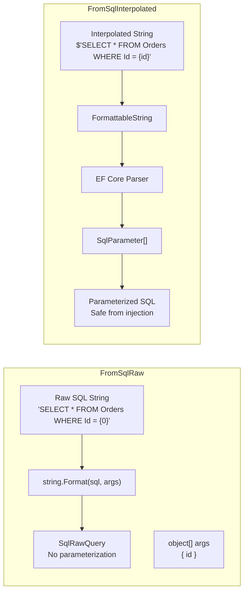
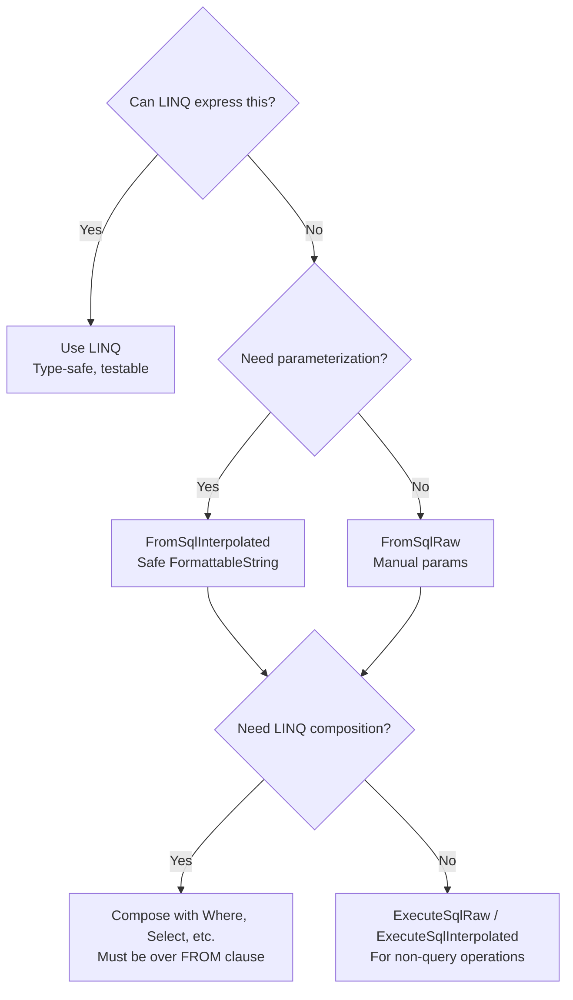
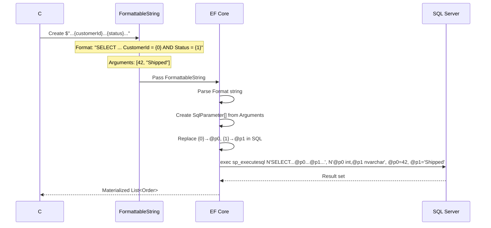
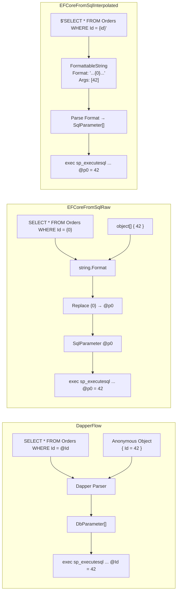
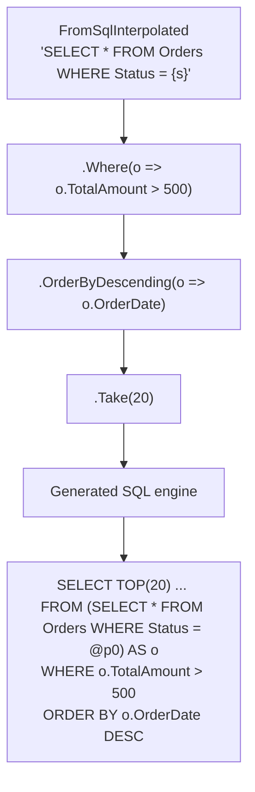
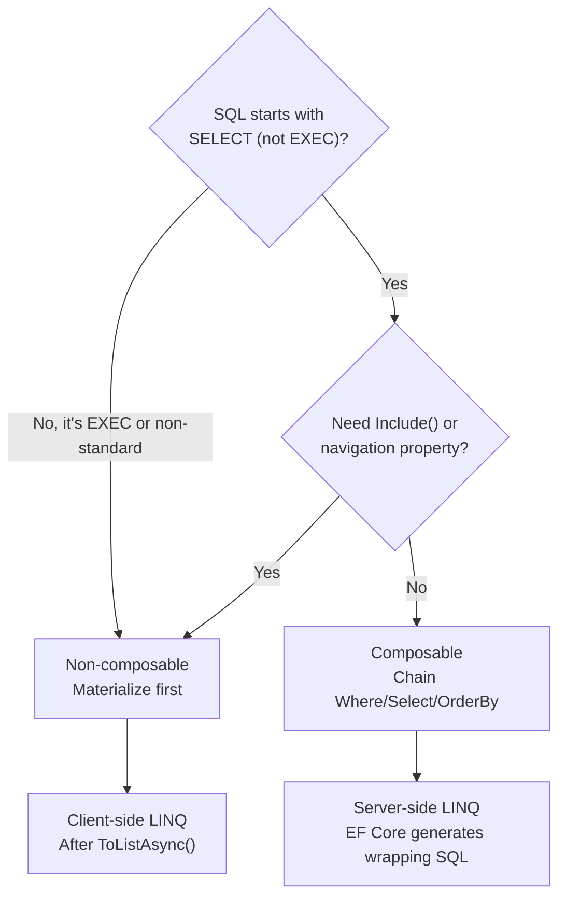

# 8.901 Raw SQL in EF Core — FromSqlRaw vs FromSqlInterpolated

## 1. Overview — Raw SQL Execution in Entity Framework Core

Entity Framework Core is an object-relational mapper that generates SQL from LINQ expressions. However, there are scenarios where the generated SQL is suboptimal or the query is too complex to express in LINQ. For these cases, EF Core provides two methods for executing raw SQL: `FromSqlRaw` and `FromSqlInterpolated`.

Both methods execute on `DbSet<T>` and return `IQueryable<T>`, enabling LINQ composition after the raw call. The critical difference lies in how they handle parameters:

- **`FromSqlRaw(string sql, params object[] parameters)`** — Accepts a raw SQL string with positional placeholders (`{0}`, `{1}`). Parameter values are passed as an object array. This method does NOT parameterize the SQL automatically — if you concatenate strings, you risk SQL injection.

- **`FromSqlInterpolated(FormattableString sql)`** — Accepts an interpolated string (`$"..."`). The compiler generates a `FormattableString` object. EF Core parses the interpolated values and converts them into `SqlParameter[]` entries, producing fully parameterized SQL.

```csharp
// Entity model
public class Order
{
    public int Id { get; set; }
    public int CustomerId { get; set; }
    public DateTime OrderDate { get; set; }
    public string Status { get; set; }
    public decimal TotalAmount { get; set; }
    public string? TrackingNumber { get; set; }
}
```

Both methods require the result set column names to match the entity property names exactly — no implicit mapping is performed. The underlying `DbDataReader` reads column values by name and materializes the entity.



The choice between these methods affects security, maintainability, and performance. This file documents both approaches with realistic examples, generated SQL output, and Dapper equivalents.

## 2. When to Use Raw SQL — Scenarios and Trade-Offs

Raw SQL is appropriate in specific situations where LINQ cannot express the query efficiently or at all. Common scenarios include:

| Scenario | LINQ Viability | Raw SQL Advantage |
|---|---|---|
| Complex joins with window functions | Possible but verbose | Direct T-SQL, one round trip |
| Full-text search (CONTAINS, FREETEXT) | Not supported natively | Required T-SQL syntax |
| Pivot / Unpivot queries | Not supported | Native T-SQL operators |
| Recursive CTEs | Not supported | WITH clause |
| Bulk update with complex WHERE | Possible via ExecuteSqlRaw | Single statement vs N+1 |
| Query hints (OPTION, WITH) | Not supported | Direct control |
| Temp table operations | Not supported | Full T-SQL flexibility |
| Database-specific features | Not supported | Vendor T-SQL |

```sql
-- Example: Complex query that is difficult in LINQ
-- Find orders with running total per customer window
SELECT
    o.Id,
    o.CustomerId,
    o.OrderDate,
    o.TotalAmount,
    SUM(o.TotalAmount) OVER (
        PARTITION BY o.CustomerId
        ORDER BY o.OrderDate
        ROWS UNBOUNDED PRECEDING
    ) AS RunningTotal,
    ROW_NUMBER() OVER (
        PARTITION BY o.CustomerId
        ORDER BY o.TotalAmount DESC
    ) AS RankByAmount
FROM Orders o
WHERE o.Status IN ('Shipped', 'Delivered')
ORDER BY o.CustomerId, o.OrderDate;
```



When performance is the primary concern, raw SQL eliminates the LINQ translation overhead and gives the developer full control over the execution plan. The trade-off is losing compile-time type checking for the query structure and introducing SQL dialect coupling.

### Performance Comparison

| Approach | Translation Overhead | Execution Plan Control | Caching |
|---|---|---|---|
| LINQ query | 5–50 µs | EF Core decides | Query plan cached by SQL Server |
| `FromSqlRaw` | <1 µs | Full control | Parameterized → plan reuse |
| `FromSqlInterpolated` | <1 µs | Full control | Parameterized → plan reuse |
| Dapper `Query<T>` | <1 µs | Full control | Parameterized → plan reuse |

In high-throughput scenarios where the same query shape runs thousands of times, parameterized raw SQL from either `FromSqlInterpolated` or Dapper produces identical execution plans that SQL Server caches and reuses.

## 3. FromSqlRaw — Positional Parameters and Injection Risk

`FromSqlRaw` accepts a raw SQL string followed by positional parameter values. The SQL string uses `{0}`, `{1}`, etc. as placeholders. EF Core does NOT parse the SQL to build `SqlParameter` objects — instead, it calls `string.Format` on the SQL template.

### Safe Usage — Positional Parameters

```csharp
public async Task<List<Order>> GetOrdersByCustomerRawAsync(int customerId, string status)
{
    // SAFE: parameters passed separately from SQL
    var sql = "SELECT * FROM Orders WHERE CustomerId = {0} AND Status = {1}";
    var orders = await _context.Orders
        .FromSqlRaw(sql, customerId, status)
        .ToListAsync();
    return orders;
}
```

The parameters are passed as `object[]`. EF Core wraps each in a `SqlParameter` before execution:

```sql
-- Generated SQL:
exec sp_executesql N'SELECT * FROM Orders WHERE CustomerId = @p0 AND Status = @p1',
    N'@p0 int, @p1 nvarchar(20)',
    @p0 = 42,
    @p1 = N'Shipped';
```

### Dangerous Usage — String Concatenation

```csharp
// DANGEROUS: SQL injection vulnerability
public async Task<List<Order>> GetOrdersByCustomerUnsafeAsync(string customerInput)
{
    var sql = $"SELECT * FROM Orders WHERE Status = '{customerInput}'";
    return await _context.Orders
        .FromSqlRaw(sql)
        .ToListAsync();
}
```

```sql
-- If customerInput = "' OR 1=1 --"
-- Generated SQL (injected):
SELECT * FROM Orders WHERE Status = '' OR 1=1 --'
```

This returns ALL orders because `OR 1=1` evaluates to true and `--` comments out the rest. The EF Core `FromSqlRaw` method does NOT prevent this — it passes the SQL string exactly as provided to the database.

### Multiple Parameters with Mixed Types

```csharp
public async Task<List<Order>> GetPagedOrdersRawAsync(
    string status,
    DateTime fromDate,
    DateTime toDate,
    int pageNumber,
    int pageSize)
{
    var offset = (pageNumber - 1) * pageSize;
    var sql = @"
        SELECT * FROM Orders
        WHERE Status = {0}
          AND OrderDate >= {1}
          AND OrderDate < {2}
        ORDER BY OrderDate DESC
        OFFSET {3} ROWS
        FETCH NEXT {4} ROWS ONLY";

    return await _context.Orders
        .FromSqlRaw(sql, status, fromDate, toDate, offset, pageSize)
        .ToListAsync();
}
```

```sql
exec sp_executesql N'
    SELECT * FROM Orders
    WHERE Status = @p0
      AND OrderDate >= @p1
      AND OrderDate < @p2
    ORDER BY OrderDate DESC
    OFFSET @p3 ROWS
    FETCH NEXT @p4 ROWS ONLY',
    N'@p0 nvarchar(20), @p1 datetime2, @p2 datetime2, @p3 int, @p4 int',
    @p0 = N'Shipped',
    @p1 = '2026-01-01',
    @p2 = '2026-07-01',
    @p3 = 0,
    @p4 = 50;
```

### Complex SQL — Joins and Aggregations

`FromSqlRaw` can execute any valid SQL that returns columns matching the entity:

```csharp
public async Task<List<Order>> GetHighValueOrdersRawAsync(decimal minAmount)
{
    var sql = @"
        SELECT
            o.Id,
            o.CustomerId,
            o.OrderDate,
            o.Status,
            o.TotalAmount,
            o.TrackingNumber
        FROM Orders o
        INNER JOIN (
            SELECT CustomerId
            FROM Orders
            WHERE TotalAmount > {0}
            GROUP BY CustomerId
            HAVING COUNT(*) > 5
        ) h ON o.CustomerId = h.CustomerId
        WHERE o.TotalAmount > {0}
        ORDER BY o.TotalAmount DESC";

    return await _context.Orders
        .FromSqlRaw(sql, minAmount)
        .ToListAsync();
}
```

### When Positional Parameters Get Confusing

With many parameters, positional placeholders become hard to maintain:

```csharp
// Hard to tell which {0}, {1}, etc. map to which parameter
var sql = @"
    SELECT * FROM Orders
    WHERE Status = {0}
      AND (CustomerId = {1} OR {1} IS NULL)
      AND TotalAmount > {2}
      AND TotalAmount < {3}
      AND OrderDate >= {4}
      AND OrderDate < {5}
      AND (TrackingNumber LIKE {6} OR {6} IS NULL)
    ORDER BY {7} {8}";

// Which index is the sort column? Which is the direction?
var orders = await _context.Orders
    .FromSqlRaw(sql, status, customerId, minAmount, maxAmount,
                fromDate, toDate, trackingPattern, sortColumn, sortDirection)
    .ToListAsync();
```

This is error-prone. If a parameter is added or removed, all subsequent indices shift. `FromSqlInterpolated` avoids this problem entirely.

| Parameter Count | FromSqlRaw Error Risk | FromSqlInterpolated Error Risk |
|---|---|---|
| 1–2 | Low | Low |
| 3–5 | Medium | Low |
| 6–10 | High | Low |
| 10+ | Very high | Low |

## 4. FromSqlInterpolated — FormattableString Safety

`FromSqlInterpolated` accepts a `FormattableString`, which the C# compiler creates when you use `$"..."` string interpolation. EF Core inspects the `FormattableString`'s `Arguments` array and converts each argument into a `SqlParameter`.

### Basic Usage

```csharp
public async Task<List<Order>> GetOrdersByCustomerInterpolatedAsync(int customerId, string status)
{
    // The compiler creates FormattableString behind the scenes
    // EF Core extracts arguments and parameterizes them
    var orders = await _context.Orders
        .FromSqlInterpolated($"SELECT * FROM Orders WHERE CustomerId = {customerId} AND Status = {status}")
        .ToListAsync();
    return orders;
}
```

```sql
exec sp_executesql N'SELECT * FROM Orders WHERE CustomerId = @p0 AND Status = @p1',
    N'@p0 int, @p1 nvarchar(max)',
    @p0 = 42,
    @p1 = N'Shipped';
```

### How FormattableString Works

The C# compiler translates `$"SELECT * FROM Orders WHERE Id = {id}"` into:

```csharp
// Compiler-generated code
FormattableString fs = FormattableStringFactory.Create(
    "SELECT * FROM Orders WHERE Id = {0}",
    id
);
```

EF Core's `FromSqlInterpolated` method receives this `FormattableString` and:

1. Reads `fs.Format` — the SQL template with `{0}`, `{1}` placeholders
2. Reads `fs.GetArguments()` — the actual values
3. For each argument, creates a `SqlParameter` with the appropriate SQL Server type
4. Replaces the format placeholders with parameter names (`@p0`, `@p1`)
5. Executes the parameterized SQL



### Null Values and Database Nulls

`FromSqlInterpolated` correctly handles null values by passing `DBNull.Value`:

```csharp
public async Task<List<Order>> GetOrdersByTrackingAsync(string? trackingNumber)
{
    // If trackingNumber is null, SQL parameter becomes NULL
    return await _context.Orders
        .FromSqlInterpolated($@"
            SELECT * FROM Orders
            WHERE (TrackingNumber = {trackingNumber} OR {trackingNumber} IS NULL)
              AND Status = 'Shipped'")
        .ToListAsync();
}
```

```sql
-- If trackingNumber is null:
exec sp_executesql N'
    SELECT * FROM Orders
    WHERE (TrackingNumber = @p0 OR @p0 IS NULL)
      AND Status = ''Shipped''',
    N'@p0 nvarchar(max)',
    @p0 = NULL;
```

### Complex Types and Value Conversion

`FromSqlInterpolated` works with any type that EF Core's `SqlParameter` mapping supports:

```csharp
public async Task<List<Order>> GetOrdersWithFiltersAsync(
    int? customerId,
    string? status,
    DateTime? fromDate,
    DateTime? toDate,
    decimal? minAmount,
    decimal? maxAmount)
{
    return await _context.Orders
        .FromSqlInterpolated($@"
            SELECT * FROM Orders
            WHERE ({customerId} IS NULL OR CustomerId = {customerId})
              AND ({status} IS NULL OR Status = {status})
              AND ({fromDate} IS NULL OR OrderDate >= {fromDate})
              AND ({toDate} IS NULL OR OrderDate < {toDate})
              AND ({minAmount} IS NULL OR TotalAmount >= {minAmount})
              AND ({maxAmount} IS NULL OR TotalAmount <= {maxAmount})")
        .ToListAsync();
}
```

This generated a clean parameterized query with 6 parameters. If all values are provided, the `IS NULL` checks become constant false and are optimized away by SQL Server's parameter embedding.

### Mixing Raw SQL Parts — What NOT to Do

You cannot use `FromSqlInterpolated` to inject SQL keywords or identifiers — those become parameter values:

```csharp
// WRONG: This will parameterize 'Id' and 'DESC', not inject them
var sortColumn = "Id";
var sortDirection = "DESC";
var result = await _context.Orders
    .FromSqlInterpolated($"SELECT * FROM Orders ORDER BY {sortColumn} {sortDirection}")
    .ToListAsync();
```

```sql
-- Generated (wrong):
exec sp_executesql N'SELECT * FROM Orders ORDER BY @p0 @p1',
    N'@p0 nvarchar(max), @p1 nvarchar(max)',
    @p0 = N'Id',
    @p1 = N'DESC';
```

This produces `ORDER BY 'Id' 'DESC'` which sorts by a string literal — meaningless. For dynamic identifiers, you must use `FromSqlRaw` with manual concatenation (and careful validation) or use LINQ's `OrderBy` / `OrderByDescending`.

### Performance Characteristics

| Aspect | FromSqlRaw | FromSqlInterpolated |
|---|---|---|
| Parameter extraction | Manual `object[]` | Automatic via `FormattableString` |
| SQL template parsing | `string.Format` call | EF Core format string parsing |
| Memory allocation | Low | Low (FormattableString + SqlParameter[]) |
| Query plan caching | Same parameterized SQL | Same parameterized SQL |
| Generate identical SQL | Yes, when used correctly | Yes, always |

Both methods produce the same parameterized SQL and the same execution plans. The difference is purely at the API level.

## 5. Generated SQL — Comparing Both Methods

This section shows side-by-side comparisons of the SQL generated by `FromSqlRaw` and `FromSqlInterpolated` for identical queries.

### Simple Select with One Parameter

| FromSqlRaw | FromSqlInterpolated |
|---|---|
| `FromSqlRaw("SELECT * FROM Orders WHERE Id = {0}", id)` | `FromSqlInterpolated($"SELECT * FROM Orders WHERE Id = {id}")` |

Generated SQL (identical for both):

```sql
exec sp_executesql N'SELECT * FROM Orders WHERE Id = @p0',
    N'@p0 int',
    @p0 = 1001;
```

### Multiple Parameters with Different Types

```csharp
// FromSqlRaw
_context.Orders.FromSqlRaw(
    "SELECT * FROM Orders WHERE CustomerId = {0} AND OrderDate >= {1} AND TotalAmount > {2}",
    customerId, fromDate, minAmount);

// FromSqlInterpolated
_context.Orders.FromSqlInterpolated(
    $"SELECT * FROM Orders WHERE CustomerId = {customerId} AND OrderDate >= {fromDate} AND TotalAmount > {minAmount}");
```

Generated SQL (identical):

```sql
exec sp_executesql N'SELECT * FROM Orders WHERE CustomerId = @p0 AND OrderDate >= @p1 AND TotalAmount > @p2',
    N'@p0 int, @p1 datetime2, @p2 decimal(18,2)',
    @p0 = 42,
    @p1 = '2026-01-01',
    @p2 = 500.00;
```

### String Parameters — NVARCHAR Length

One subtle difference: `FromSqlRaw` parameters are sent with inferred types, while `FromSqlInterpolated` uses the CLR type's default mapping.

```csharp
var status = "Shipped";
var notes = "Handle with care";

// FromSqlRaw — nvarchar(20) for short strings, nvarchar(max) for long
_context.Orders.FromSqlRaw(
    "SELECT * FROM Orders WHERE Status = {0} AND Notes = {1}",
    status, notes);

// FromSqlInterpolated — nvarchar(max) for all strings
_context.Orders.FromSqlInterpolated(
    $"SELECT * FROM Orders WHERE Status = {status} AND Notes = {notes}");
```

```sql
-- FromSqlRaw generated:
exec sp_executesql N'SELECT * ... WHERE Status = @p0 AND Notes = @p1',
    N'@p0 nvarchar(7), @p1 nvarchar(15)',   -- Uses actual string length!
    @p0 = N'Shipped',
    @p1 = N'Handle with care';

-- FromSqlInterpolated generated:
exec sp_executesql N'SELECT * ... WHERE Status = @p0 AND Notes = @p1',
    N'@p0 nvarchar(max), @p1 nvarchar(max)', -- Always nvarchar(max)
    @p0 = N'Shipped',
    @p1 = N'Handle with care';
```

The `nvarchar(max)` vs `nvarchar(n)` difference can affect index usage. If the column is indexed with `INCLUDE` columns, `nvarchar(max)` parameters may cause SQL Server to choose a different cardinality estimate. In practice, this rarely matters, but it's worth knowing.

### DateTime Precision

```csharp
var date = DateTime.UtcNow;

// FromSqlRaw
_context.Orders.FromSqlRaw(
    "SELECT * FROM Orders WHERE OrderDate = {0}", date);

// FromSqlInterpolated
_context.Orders.FromSqlInterpolated(
    $"SELECT * FROM Orders WHERE OrderDate = {date}");
```

```sql
-- Both generate identical datetime2 parameters:
exec sp_executesql N'SELECT * FROM Orders WHERE OrderDate = @p0',
    N'@p0 datetime2',
    @p0 = '2026-06-27 14:30:00.1234567';
```

### Decimal Precision

```csharp
var amount = 1499.99m;

// Both produce same SQL
exec sp_executesql N'SELECT * FROM Orders WHERE TotalAmount = @p0',
    N'@p0 decimal(18,2)',
    @p0 = 1499.99;
```

### Table Comparing Generated SQL Features

| Feature | FromSqlRaw Output | FromSqlInterpolated Output |
|---|---|---|
| Parameter prefix | `@p0`, `@p1`, ... | `@p0`, `@p1`, ... |
| Parameter declaration | `N'@p0 int, @p1 nvarchar(max)'` | `N'@p0 int, @p1 nvarchar(max)'` |
| String type | `nvarchar(n)` where n = arg length | `nvarchar(max)` |
| DateTime type | `datetime2` | `datetime2` |
| Numeric types | Preserves CLR type precision | Preserves CLR type precision |
| Null values | `NULL` literal | `NULL` literal |
| SQL injection risk | None (when params used properly) | None |
| Unicode string prefix | `N'...'` | `N'...'` |

The generated SQL is functionally identical. The only observable difference is the string length for `nvarchar` parameters.

## 6. Dapper — Always Parameterized Raw SQL

Dapper is a micro-ORM that executes raw SQL with parameterization. Unlike EF Core's dual-API approach, Dapper has one way to execute queries: raw SQL with explicit parameters.

### Basic Dapper Query

```csharp
public async Task<IEnumerable<Order>> GetOrdersByCustomerDapperAsync(
    IDbConnection connection, int customerId, string status)
{
    var sql = "SELECT * FROM Orders WHERE CustomerId = @CustomerId AND Status = @Status";

    return await connection.QueryAsync<Order>(sql, new
    {
        CustomerId = customerId,
        Status = status
    });
}
```

```sql
exec sp_executesql N'SELECT * FROM Orders WHERE CustomerId = @CustomerId AND Status = @Status',
    N'@CustomerId int, @Status nvarchar(max)',
    @CustomerId = 42,
    @Status = N'Shipped';
```

### Dapper Named Parameters — Always Explicit

Dapper uses named parameters (`@ParamName`) rather than positional. Parameters are passed as an anonymous object, dictionary, or `DynamicParameters` instance:

```csharp
public async Task<IEnumerable<Order>> GetOrdersWithManyParamsDapperAsync(
    IDbConnection connection,
    int? customerId,
    string? status,
    DateTime? fromDate,
    DateTime? toDate,
    decimal? minAmount)
{
    var sql = @"
        SELECT * FROM Orders
        WHERE (@CustomerId IS NULL OR CustomerId = @CustomerId)
          AND (@Status IS NULL OR Status = @Status)
          AND (@FromDate IS NULL OR OrderDate >= @FromDate)
          AND (@ToDate IS NULL OR OrderDate < @ToDate)
          AND (@MinAmount IS NULL OR TotalAmount >= @MinAmount)";

    return await connection.QueryAsync<Order>(sql, new
    {
        CustomerId = customerId,
        Status = status,
        FromDate = fromDate,
        ToDate = toDate,
        MinAmount = minAmount
    });
}
```

### Dapper vs EF Core Raw SQL — API Comparison

| Aspect | EF Core FromSqlRaw | EF Core FromSqlInterpolated | Dapper QueryAsync |
|---|---|---|---|
| Parameter style | Positional `{0}`, `{1}` | Interpolated `$"{val}"` | Named `@Param` |
| Parameter object | `object[]` | `FormattableString` | Anonymous object |
| SQL injection safe | Yes (with params) | Yes (automatic) | Yes (automatic) |
| SQL injection risk | Yes (string concat) | None | Low (string concat) |
| Returns | `IQueryable<T>` | `IQueryable<T>` | `IEnumerable<T>` |
| LINQ composition | Yes | Yes | No |
| Change tracking | Yes | Yes | No |
| Connection management | DbContext handles | DbContext handles | Manual |
| Result materialization | Per EF Core conventions | Per EF Core conventions | Column-property exact match |

### Dapper for the Same Scenarios

```csharp
// Scenario 1: Simple select
var orders = await connection.QueryAsync<Order>(
    "SELECT * FROM Orders WHERE CustomerId = @Id",
    new { Id = 42 });

// Scenario 2: Join with multiple tables (mapping to single type)
var sql = @"
    SELECT o.Id, o.OrderDate, o.Status, o.TotalAmount,
           c.Name AS CustomerName
    FROM Orders o
    INNER JOIN Customers c ON o.CustomerId = c.Id
    WHERE o.Status = @Status";

var ordersWithCustomer = await connection.QueryAsync<OrderWithCustomer>(sql, new
{
    Status = "Shipped"
});

// Scenario 3: Multi-mapping (split on column)
var orderDetailSql = @"
    SELECT o.Id, o.OrderDate, o.Status, o.TotalAmount,
           oi.Id, oi.ProductId, oi.Quantity, oi.UnitPrice
    FROM Orders o
    INNER JOIN OrderItems oi ON o.Id = oi.OrderId
    WHERE o.Id = @OrderId";

var orderDictionary = new Dictionary<int, Order>();

var results = await connection.QueryAsync<Order, OrderItem, Order>(
    orderDetailSql,
    (order, item) =>
    {
        if (!orderDictionary.TryGetValue(order.Id, out var existingOrder))
        {
            existingOrder = order;
            existingOrder.Items = new List<OrderItem>();
            orderDictionary.Add(order.Id, existingOrder);
        }
        existingOrder.Items.Add(item);
        return existingOrder;
    },
    new { OrderId = 1001 },
    splitOn: "Id");

var orderWithItems = orderDictionary.Values.First();
```

### Dapper's `SqlBuilder` for Dynamic Queries

For dynamic raw SQL where clauses and parameters are built at runtime, Dapper provides `SqlBuilder`:

```csharp
public async Task<IEnumerable<Order>> SearchOrdersDapperAsync(
    IDbConnection connection,
    SearchCriteria criteria)
{
    var builder = new SqlBuilder();
    var template = builder.AddTemplate(@"
        SELECT * FROM Orders
        /**where**/
        ORDER BY OrderDate DESC
        OFFSET @Offset ROWS
        FETCH NEXT @PageSize ROWS ONLY");

    if (criteria.CustomerId.HasValue)
        builder.Where("CustomerId = @CustomerId", new { criteria.CustomerId });

    if (!string.IsNullOrEmpty(criteria.Status))
        builder.Where("Status = @Status", new { criteria.Status });

    if (criteria.FromDate.HasValue)
        builder.Where("OrderDate >= @FromDate", new { criteria.FromDate });

    builder.AddParameters(new
    {
        Offset = (criteria.Page - 1) * criteria.PageSize,
        PageSize = criteria.PageSize
    });

    return await connection.QueryAsync<Order>(template.RawSql, template.Parameters);
}
```

This pattern is not available in EF Core's raw SQL methods — you must build the SQL string manually and manage parameters.

### Dapper's Parameterization Internals

Dapper inspects the anonymous object's properties (or `DynamicParameters`) and creates `DbParameter[]` entries. Unlike EF Core's `FromSqlRaw`, there is no `string.Format` step — the SQL is used as-is with parameter names that must match the object property names.



### When Dapper Is the Better Choice

| Criterion | Prefer Dapper | Prefer EF Core Raw SQL |
|---|---|---|
| Need change tracking | — | Yes |
| Need LINQ composition on result | — | Yes |
| Max performance | Yes | — |
| Dynamic query building | Yes (SqlBuilder) | — |
| Multiple result sets | Yes (QueryMultiple) | — |
| Multi-mapping (split) | Yes | Complex |
| Unit of work pattern | — | Yes (DbContext) |
| Simple CRUD mixed with reports | — | Yes |

## 7. Composition Over Raw SQL — LINQ Restrictions

Both `FromSqlRaw` and `FromSqlInterpolated` return `IQueryable<T>`, which means LINQ operators can be chained after the raw SQL call. However, there are important restrictions.

### What Works — Filtering and Projection

```csharp
// Composition is allowed:
var recentHighValueOrders = await _context.Orders
    .FromSqlInterpolated($@"SELECT * FROM Orders WHERE Status = {status}")
    .Where(o => o.TotalAmount > 500)
    .OrderByDescending(o => o.OrderDate)
    .Take(20)
    .ToListAsync();
```

Generated SQL — EF Core wraps the raw SQL as a subquery and applies LINQ operators:

```sql
SELECT TOP(20) o.Id, o.CustomerId, o.OrderDate, o.Status, o.TotalAmount, o.TrackingNumber
FROM (
    SELECT * FROM Orders WHERE Status = @p0
) AS o
WHERE o.TotalAmount > 500
ORDER BY o.OrderDate DESC;
```

### What Does NOT Work — Navigation Properties and Include

```csharp
// This will throw:
var orders = await _context.Orders
    .FromSqlInterpolated($"SELECT * FROM Orders WHERE Status = {status}")
    .Include(o => o.OrderItems)
    .ToListAsync();
```

**Result:** `InvalidOperationException` — "FromSqlRaw or FromSqlInterpolated was called with non-composable SQL and cannot be composed on."

The only way to include related data when using raw SQL is to write the JOIN manually:

```csharp
// Workaround: Write the JOIN in raw SQL, project to a DTO or anonymous type
var sql = @"
    SELECT o.Id, o.OrderDate, o.Status, o.TotalAmount,
           oi.Id AS ItemId, oi.ProductId, oi.Quantity, oi.UnitPrice
    FROM Orders o
    LEFT JOIN OrderItems oi ON o.Id = oi.OrderId
    WHERE o.Status = @p0";

var rawResults = await _context.Database.SqlQueryRaw<OrderWithItemsDto>(sql, status);
```

Or use `Select` to manually load related data:

```csharp
// This works: compose Select after FromSqlInterpolated
var orderDtos = await _context.Orders
    .FromSqlInterpolated($"SELECT * FROM Orders WHERE Status = {status}")
    .Select(o => new OrderSummaryDto
    {
        OrderId = o.Id,
        OrderDate = o.OrderDate,
        TotalAmount = o.TotalAmount,
        ItemCount = o.OrderItems.Count
    })
    .ToListAsync();
```

### The Subquery Wrapping Behavior

EF Core wraps the raw SQL in a subquery when composing LINQ:



### RESTRICTION: Composition Only Works Over FROM Clause

The raw SQL must be a `SELECT` statement that can be wrapped in `SELECT * FROM ({your_sql}) AS alias`. This means:

- ✅ `SELECT * FROM Orders WHERE ...` — works
- ✅ `SELECT Id, CustomerId, OrderDate FROM Orders WHERE ...` — works (subset of columns)
- ❌ `EXEC usp_GetOrders @Status` — does NOT work (cannot wrap sproc in subquery)
- ❌ `SELECT * FROM OPENQUERY(...)` — might work but depends on provider

```csharp
// This throws: "Cannot compose on the result of FromSqlRaw/FromSqlInterpolated"
// when the SQL is not directly composable
var orders = await _context.Orders
    .FromSqlInterpolated($"EXEC usp_GetOrdersByStatus {status}")
    .Where(o => o.TotalAmount > 500)  // Exception!
    .ToListAsync();
```

The error occurs because EF Core detects the SQL starts with `EXEC` and marks it as non-composable. For stored procedures, apply LINQ on the client side:

```csharp
// Client-side composition for non-composable SQL:
var orders = (await _context.Orders
    .FromSqlInterpolated($"EXEC usp_GetOrdersByStatus {status}")
    .ToListAsync())
    .Where(o => o.TotalAmount > 500)
    .Take(20)
    .ToList();
```

### Projection (Select) Works

`Select` after `FromSqlRaw`/`FromSqlInterpolated` works and generates efficient SQL:

```csharp
var summaries = await _context.Orders
    .FromSqlInterpolated($"SELECT * FROM Orders WHERE CustomerId = {customerId}")
    .Select(o => new
    {
        o.Id,
        o.OrderDate,
        o.TotalAmount,
        DaysSinceOrder = EF.Functions.DateDiffDay(o.OrderDate, DateTime.UtcNow)
    })
    .ToListAsync();
```

```sql
SELECT o.Id, o.OrderDate, o.TotalAmount, DATEDIFF(DAY, o.OrderDate, GETUTCDATE()) AS DaysSinceOrder
FROM (
    SELECT * FROM Orders WHERE CustomerId = @p0
) AS o;
```

### Compose vs. Non-Compose Decision Tree



## 8. Column Order Requirement and Other Gotchas

### Column Name Matching — Not Positional

Despite common misconception, both `FromSqlRaw` and `FromSqlInterpolated` match columns by **name**, not position. The underlying `DbDataReader` reads column values using the ordinal position, but EF Core maps them to properties by name:

```csharp
// WRONG: Column names don't match entity properties
var sql = "SELECT Id AS OrderId, CustomerId AS CustId, OrderDate FROM Orders";

// EF Core looks for properties: Id, CustomerId, OrderDate
// It finds: OrderId (not Id), CustId (not CustomerId), OrderDate (OK)
// Result: Id and CustomerId will be default (0), OrderDate is correct

var orders = await _context.Orders
    .FromSqlRaw(sql)
    .ToListAsync();
```

The correct approach is to alias columns to match entity property names:

```csharp
// CORRECT: Alias columns to match entity property names
var sql = @"
    SELECT
        o.Id,                          -- matches Order.Id
        o.OrderDate,                   -- matches Order.OrderDate
        o.Status,                      -- matches Order.Status
        o.TotalAmount,                 -- matches Order.TotalAmount
        o.TrackingNumber,              -- matches Order.TrackingNumber
        c.Id AS CustomerId             -- alias to match Order.CustomerId
    FROM Orders o
    INNER JOIN Customers c ON o.CustomerId = c.Id
    WHERE c.Email = @p0";
```

### The Hidden JOIN Confusion

When a raw SQL query omits columns, EF Core materializes those properties as default values:

```csharp
public async Task<List<Order>> GetPartialOrdersAsync()
{
    // Query returns only 3 columns, but Order entity has 6 properties
    var sql = "SELECT Id, OrderDate, TotalAmount FROM Orders WHERE Status = 'Shipped'";

    var orders = await _context.Orders
        .FromSqlRaw(sql)
        .ToListAsync();

    // orders[0].CustomerId       == 0 (default int)
    // orders[0].Status           == null (default string?)
    // orders[0].TrackingNumber   == null (default string?)
    // These are NOT queried from the database — they're CLR defaults
    return orders;
}
```

This can lead to accidental data loss if these entities are later saved:

```csharp
var orders = await _context.Orders.FromSqlRaw(partialSql).ToListAsync();
var order = orders[0];
order.Status = "Cancelled";              // Only this change is tracked
await _context.SaveChangesAsync();       // UPDATE sets CustomerId=0, TrackingNumber=NULL!
```

**Always select all columns** or use a DTO/projection to avoid unintended side effects.

### Column Order in `SqlQueryRaw` vs `FromSqlRaw`

EF Core 7+ introduced `SqlQueryRaw` and `SqlQuery<T>` for raw SQL that doesn't go through `DbSet<T>`:

```csharp
// EF Core 7+ non-entity query
var orders = await _context.Database
    .SqlQuery<Order>(@$"
        SELECT Id, CustomerId, OrderDate, Status, TotalAmount, TrackingNumber
        FROM Orders
        WHERE Status = {status}")
    .ToListAsync();
```

This method does NOT support LINQ composition but also does NOT require the entity to be in the model. Column names must still match, but there is no change tracking.

### Case Sensitivity

Column name matching is case-insensitive on most databases (SQL Server, PostgreSQL). The `DbDataReader`'s `GetOrdinal` method uses `OrdinalIgnoreCase` by default. However, if the column name contains special characters or spaces, you must alias it:

```csharp
// SQL Server: square brackets for special characters
var sql = @"SELECT Id, [Order Date] AS OrderDate, [Total Amount] AS TotalAmount FROM Orders";
var orders = await _context.Orders.FromSqlRaw(sql).ToListAsync();
```

### The `ExecuteSqlRaw` and `ExecuteSqlInterpolated` Counterparts

For non-query operations (INSERT, UPDATE, DELETE), EF Core provides:

```csharp
// ExecuteSqlRaw — non-parameterized SQL
int rowsAffected = await _context.Database.ExecuteSqlRawAsync(
    "UPDATE Orders SET Status = @p0 WHERE OrderDate < @p1",
    "Archived", cutoffDate);

// ExecuteSqlInterpolated — parameterized SQL
int rowsAffected = await _context.Database.ExecuteSqlInterpolatedAsync(
    $"UPDATE Orders SET Status = {newStatus} WHERE OrderDate < {cutoffDate}");
```

These return the number of rows affected rather than `IQueryable<T>`.

### SQL Injection Risks Summary

| API | String Concatenation | Parameterized Placeholder | Parameterized Interpolation |
|---|---|---|---|
| `FromSqlRaw` / `ExecuteSqlRaw` | ❌ Vulnerable | ✅ Safe | N/A |
| `FromSqlInterpolated` / `ExecuteSqlInterpolated` | N/A | N/A | ✅ Safe |
| Dapper `QueryAsync` / `ExecuteAsync` | ❌ Vulnerable | ✅ Safe (named) | ✅ Safe |

The only unsafe pattern is concatenating user input into the SQL string. All parameterized patterns are safe.

### Exception: `FromSqlRaw` with `string.Format` Collisions

If your SQL string contains curly braces for reasons other than placeholders (e.g., JSON), you must escape them or use `FromSqlInterpolated`:

```csharp
// FromSqlRaw: { and } in JSON cause string.Format errors
var sql = @"SELECT Id, JSON_VALUE(Metadata, '$.{key}') AS Value FROM Orders WHERE Id = {0}";

// This throws FormatException because {key} is interpreted as a placeholder index
var result = await _context.Orders.FromSqlRaw(sql, orderId).ToListAsync();

// Fix: escape braces for JSON
var sqlFixed = @"SELECT Id, JSON_VALUE(Metadata, '$.{{key}}') AS Value FROM Orders WHERE Id = {0}";
var result2 = await _context.Orders.FromSqlRaw(sqlFixed, orderId).ToListAsync();

// Better: use FromSqlInterpolated to avoid string.Format entirely
var result3 = await _context.Orders
    .FromSqlInterpolated($@"SELECT Id, JSON_VALUE(Metadata, '$.key') AS Value FROM Orders WHERE Id = {orderId}")
    .ToListAsync();
```

## 9. Summary — Choosing the Right API

The choice between `FromSqlRaw` and `FromSqlInterpolated` depends on your requirements for safety, maintainability, and flexibility:

### Decision Matrix

| Your Need | Recommended API | Reason |
|---|---|---|
| Any parameterized query | `FromSqlInterpolated` | Automatic parameterization, cleaner syntax |
| Dynamic SQL keywords/identifiers | `FromSqlRaw` | Only option for non-value SQL parts |
| High-performance bulk operations | `ExecuteSqlInterpolated` | Parameterized, no LINQ overhead |
| DTO/read-only queries | `SqlQuery<T>` (EF 7+) | No entity type needed |
| Maximum control, minimum abstraction | Dapper | Full SQL control, named params, multi-mapping |
| Mud/blazor/hot path queries | `FromSqlInterpolated` | Same performance as Dapper for single result sets |

### Best Practice Rules

1. **Default to `FromSqlInterpolated`** — It is safer, cleaner, and produces the same SQL.
2. **Use `FromSqlRaw` only when you need dynamic identifiers** — Column names, table names, sort directions that come from variables.
3. **Never concatenate user input** — If you must use `FromSqlRaw`, always pass values as positional parameters.
4. **Select all entity columns** — Missing columns become default values, causing data loss on save.
5. **Use Dapper for pure SQL scenarios** — When you don't need change tracking or LINQ composition, Dapper is simpler and faster.
6. **Validate dynamic identifiers** — If you must inject column/table names dynamically, whitelist them against a known set.

### Quick Reference

```csharp
// ✅ BEST: FromSqlInterpolated for parameterized queries
var orders = await _context.Orders
    .FromSqlInterpolated($"SELECT * FROM Orders WHERE Status = {status} AND CustomerId = {id}")
    .ToListAsync();

// ✅ ACCEPTABLE: FromSqlRaw with positional params
var orders = await _context.Orders
    .FromSqlRaw("SELECT * FROM Orders WHERE Status = {0} AND CustomerId = {1}", status, id)
    .ToListAsync();

// ❌ DANGEROUS: Never concatenate
var orders = await _context.Orders
    .FromSqlRaw($"SELECT * FROM Orders WHERE Status = '{status}'")
    .ToListAsync();

// ✅ DAPPER: Named parameters for maximum clarity
var orders = await connection.QueryAsync<Order>(
    "SELECT * FROM Orders WHERE Status = @Status AND CustomerId = @Id",
    new { Status = status, Id = id });

// ✅ CLIENT COMPOSITION: For non-composable SQL
var orders = (await _context.Orders
    .FromSqlInterpolated($"EXEC usp_GetOrdersByStatus {status}")
    .ToListAsync())
    .Where(o => o.TotalAmount > 500);
```

### When to Avoid Raw SQL Altogether

- The query can be expressed efficiently in LINQ
- You need full change tracking and navigation property loading
- The query is simple and performance is acceptable
- You are building a multi-DBMS application and need portability
- You need unit-testable query logic (LINQ is easier to mock)

### Final Comparison Table

| Feature | `FromSqlRaw` | `FromSqlInterpolated` | Dapper |
|---|---|---|---|
| Parameterization | Manual positional | Automatic (FormattableString) | Automatic (named) |
| SQL injection risk | Moderate if misused | None | None |
| LINQ composition | Yes (SELECT only) | Yes (SELECT only) | No |
| Change tracking | Yes | Yes | No |
| Dynamic sorting/columns | Yes (concat) | No | No (raw SQL only) |
| Generated SQL | Same (when parameterized) | Same | Same |
| Performance | ~equal | ~equal | Slightly faster (>10% for large sets) |
| Readability (simple) | Low (positional indices) | High (inline values) | High (named params) |
| Readability (complex) | Low | Medium | Medium |
| Learning curve | Low | Low | Low |

Both `FromSqlRaw` and `FromSqlInterpolated` are legitimate tools in the EF Core developer's toolbox. The rule of thumb: use `FromSqlInterpolated` as the default, `FromSqlRaw` only when necessary, and consider Dapper when you outgrow EF Core's raw SQL capabilities.
