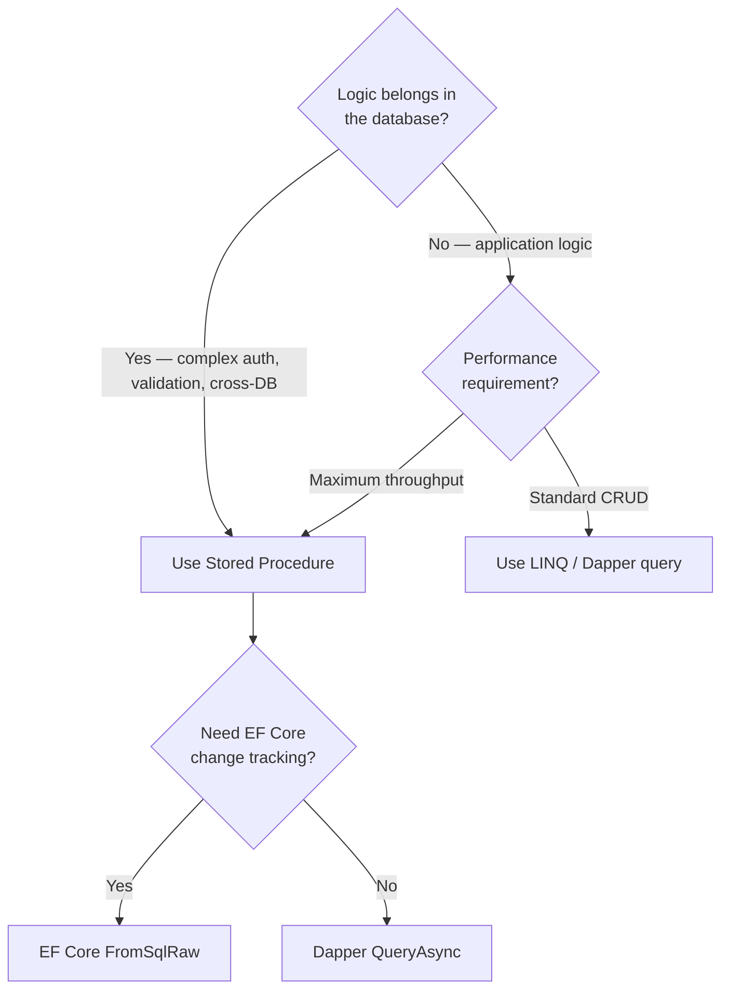
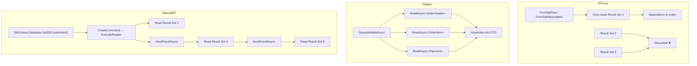
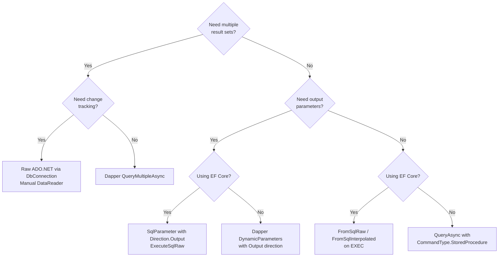

# 8.902 Stored Procedure Mapping in EF Core

## 1. Overview — Stored Procedures in .NET Data Access

Stored procedures are precompiled database objects that encapsulate business logic within the database. In .NET, both EF Core and Dapper provide mechanisms to call stored procedures, but their approaches differ significantly in abstraction level, flexibility, and developer experience.

### The .NET Sproc Landscape

| Feature | EF Core (FromSqlRaw/ExecuteSqlRaw) | EF Core (DbContext.Database) | Dapper |
|---|---|---|---|
| Sproc invocation | Via `FromSqlRaw` / `FromSqlInterpolated` | `ExecuteSqlRaw` with `SqlParameter` | `QueryAsync` with `CommandType.StoredProcedure` |
| Output parameters | Manual `SqlParameter` construction | Manual `SqlParameter` with `Direction` | `DynamicParameters.Add` with direction |
| Multiple result sets | Not directly supported | Not directly supported | `QueryMultiple` — first-class support |
| RETURN value | Manual `SqlParameter` with `ReturnValue` | Manual `SqlParameter` with `ReturnValue` | `DynamicParameters.Add` with `ReturnValue` |
| LINQ composition | Only with SELECT-based sproc (non-composable) | Not applicable | Not applicable |
| TVP (Table-Valued Parameters) | Manual `SqlParameter` with `SqlDbType.Structured` | Same | `DynamicParameters` with `DbType.Object` |

### When to Use Stored Procedures



Stored procedures are appropriate when:
- Security requires table access to be restricted (sproc-only permissions)
- Complex business logic must be shared across multiple applications
- Bulk operations must run entirely server-side
- Legacy systems already have extensive sproc libraries
- You need to return multiple result sets in a single database round-trip

## 2. Creating Stored Procedures — T-SQL Examples

This section provides the T-SQL definitions used throughout the examples. All procedures operate on the Orders database schema.

### Schema Reference

```sql
-- Tables used in all sproc examples
CREATE TABLE Customers (
    Id INT IDENTITY(1,1) PRIMARY KEY,
    Name NVARCHAR(100) NOT NULL,
    Email NVARCHAR(255) NOT NULL,
    CreatedDate DATETIME2 NOT NULL DEFAULT GETUTCDATE()
);

CREATE TABLE Orders (
    Id INT IDENTITY(1,1) PRIMARY KEY,
    CustomerId INT NOT NULL REFERENCES Customers(Id),
    OrderDate DATETIME2 NOT NULL DEFAULT GETUTCDATE(),
    Status NVARCHAR(20) NOT NULL DEFAULT 'Pending',
    TotalAmount DECIMAL(18,2) NOT NULL,
    TrackingNumber NVARCHAR(50) NULL,
    Notes NVARCHAR(500) NULL,
    CreatedBy INT NULL,
    CreatedAt DATETIME2 NOT NULL DEFAULT GETUTCDATE()
);

CREATE TABLE OrderItems (
    Id INT IDENTITY(1,1) PRIMARY KEY,
    OrderId INT NOT NULL REFERENCES Orders(Id),
    ProductId INT NOT NULL,
    ProductName NVARCHAR(200) NOT NULL,
    Quantity INT NOT NULL,
    UnitPrice DECIMAL(18,2) NOT NULL,
    Discount DECIMAL(18,2) NOT NULL DEFAULT 0
);
```

### Sproc 1: Return Entity Rows — usp_GetOrdersByDateRange

```sql
CREATE PROCEDURE usp_GetOrdersByDateRange
    @FromDate DATETIME2,
    @ToDate DATETIME2,
    @Status NVARCHAR(20) = NULL
AS
BEGIN
    SET NOCOUNT ON;

    SELECT
        o.Id,
        o.CustomerId,
        o.OrderDate,
        o.Status,
        o.TotalAmount,
        o.TrackingNumber,
        o.Notes,
        o.CreatedBy,
        o.CreatedAt
    FROM Orders o
    WHERE o.OrderDate >= @FromDate
      AND o.OrderDate < DATEADD(DAY, 1, @ToDate)
      AND (@Status IS NULL OR o.Status = @Status)
    ORDER BY o.OrderDate DESC;
END;
```

### Sproc 2: Output Parameters — usp_GetCustomerOrderSummary

```sql
CREATE PROCEDURE usp_GetCustomerOrderSummary
    @CustomerId INT,
    @TotalOrders INT OUTPUT,
    @TotalSpent DECIMAL(18,2) OUTPUT,
    @AverageOrderAmount DECIMAL(18,2) OUTPUT,
    @LastOrderDate DATETIME2 OUTPUT
AS
BEGIN
    SET NOCOUNT ON;

    SELECT
        @TotalOrders = COUNT(*),
        @TotalSpent = COALESCE(SUM(TotalAmount), 0),
        @AverageOrderAmount = COALESCE(AVG(TotalAmount), 0),
        @LastOrderDate = COALESCE(MAX(OrderDate), '1900-01-01')
    FROM Orders
    WHERE CustomerId = @CustomerId;

    -- Return the customer info as a result set
    SELECT Id, Name, Email
    FROM Customers
    WHERE Id = @CustomerId;

    RETURN @@ROWCOUNT;
END;
```

### Sproc 3: Multiple Result Sets — usp_GetOrderDetails

```sql
CREATE PROCEDURE usp_GetOrderDetails
    @OrderId INT
AS
BEGIN
    SET NOCOUNT ON;

    -- Result set 1: Order header
    SELECT
        o.Id, o.CustomerId, o.OrderDate, o.Status,
        o.TotalAmount, o.TrackingNumber, o.Notes,
        c.Name AS CustomerName, c.Email AS CustomerEmail
    FROM Orders o
    INNER JOIN Customers c ON o.CustomerId = c.Id
    WHERE o.Id = @OrderId;

    -- Result set 2: Order items
    SELECT
        oi.Id, oi.OrderId, oi.ProductId, oi.ProductName,
        oi.Quantity, oi.UnitPrice, oi.Discount,
        (oi.Quantity * oi.UnitPrice - oi.Discount) AS LineTotal
    FROM OrderItems oi
    WHERE oi.OrderId = @OrderId;

    -- Result set 3: Payment history
    SELECT
        p.Id, p.OrderId, p.Amount, p.PaymentDate,
        p.PaymentMethod, p.TransactionId, p.Status
    FROM Payments p
    WHERE p.OrderId = @OrderId;

    RETURN 0;
END;
```

### Sproc 4: Insert with OUTPUT — usp_CreateOrder

```sql
CREATE PROCEDURE usp_CreateOrder
    @CustomerId INT,
    @OrderDate DATETIME2,
    @Status NVARCHAR(20),
    @TotalAmount DECIMAL(18,2),
    @TrackingNumber NVARCHAR(50) = NULL,
    @Notes NVARCHAR(500) = NULL,
    @OrderId INT OUTPUT
AS
BEGIN
    SET NOCOUNT ON;

    INSERT INTO Orders (CustomerId, OrderDate, Status, TotalAmount, TrackingNumber, Notes)
    VALUES (@CustomerId, @OrderDate, @Status, @TotalAmount, @TrackingNumber, @Notes);

    SET @OrderId = SCOPE_IDENTITY();

    -- Return the newly created order
    SELECT
        Id, CustomerId, OrderDate, Status,
        TotalAmount, TrackingNumber, Notes
    FROM Orders
    WHERE Id = @OrderId;
END;
```

### Sproc 5: Bulk Update with RETURN — usp_BulkUpdateOrderStatus

```sql
CREATE PROCEDURE usp_BulkUpdateOrderStatus
    @OldStatus NVARCHAR(20),
    @NewStatus NVARCHAR(20),
    @CutoffDate DATETIME2 = NULL,
    @UpdatedCount INT OUTPUT
AS
BEGIN
    SET NOCOUNT ON;

    UPDATE Orders
    SET Status = @NewStatus,
        Notes = CONCAT(Notes, ' [Auto-updated from ', @OldStatus, ' to ', @NewStatus, ' on ', GETUTCDATE(), ']')
    WHERE Status = @OldStatus
      AND (@CutoffDate IS NULL OR OrderDate < @CutoffDate);

    SET @UpdatedCount = @@ROWCOUNT;

    RETURN @UpdatedCount;
END;
```

## 3. EF Core — Returning Entities from Stored Procedures

### The Basic Pattern — FromSqlRaw with EXEC

EF Core executes stored procedures through the same `FromSqlRaw` / `FromSqlInterpolated` methods used for ad-hoc SQL. The SQL string starts with `EXEC` or `EXECUTE` followed by the procedure name and parameters.

```csharp
public class OrderRepository
{
    private readonly AppDbContext _context;

    public OrderRepository(AppDbContext context)
    {
        _context = context;
    }

    public async Task<List<Order>> GetOrdersByDateRangeAsync(
        DateTime fromDate, DateTime toDate, string? status)
    {
        // FromSqlInterpolated: EXEC with interpolated parameters
        return await _context.Orders
            .FromSqlInterpolated($@"
                EXEC usp_GetOrdersByDateRange
                    @FromDate = {fromDate},
                    @ToDate = {toDate},
                    @Status = {status ?? (object)DBNull.Value}")
            .ToListAsync();
    }
}
```

```sql
exec sp_executesql N'
    EXEC usp_GetOrdersByDateRange
        @FromDate = @p0,
        @ToDate = @p1,
        @Status = @p2',
    N'@p0 datetime2, @p1 datetime2, @p2 nvarchar(max)',
    @p0 = '2026-01-01',
    @p1 = '2026-06-30',
    @p2 = NULL;
```

### Important: EXEC SQL Is Non-Composable

When `FromSqlRaw` or `FromSqlInterpolated` detects the SQL starts with `EXEC`, it marks the query as **non-composable**. This means you cannot chain LINQ operators like `Where`, `OrderBy`, or `Select` after it:

```csharp
// This will throw InvalidOperationException:
var recentOrders = await _context.Orders
    .FromSqlInterpolated($@"EXEC usp_GetOrdersByDateRange {from}, {to}, {status}")
    .Where(o => o.TotalAmount > 500)     // ❌ Non-composable!
    .OrderByDescending(o => o.OrderDate) // ❌ Non-composable!
    .Take(10)                            // ❌ Non-composable!
    .ToListAsync();
```

**Solution**: Materialize the sproc results first, then apply LINQ client-side:

```csharp
// Materialize first, then filter client-side
var orders = await _context.Orders
    .FromSqlInterpolated($@"EXEC usp_GetOrdersByDateRange {from}, {to}, {status}")
    .ToListAsync();

// Client-side filtering
var recentHighValueOrders = orders
    .Where(o => o.TotalAmount > 500)
    .OrderByDescending(o => o.OrderDate)
    .Take(10)
    .ToList();
```

### Workaround: SELECT-WRAPPED EXEC

Some databases support `SELECT * FROM OPENQUERY(...)` or `SELECT * FROM (EXEC ...) AS t` for SQL Server (requires `OPENROWSET`). However, `SELECT * FROM EXEC ...` is **not valid T-SQL**. The only way to compose over a sproc is to not use EXEC at all and instead use the sproc's internal SELECT directly.

### FromSqlRaw with Named Parameters

Using `FromSqlRaw` with named parameters for clarity:

```csharp
public async Task<List<Order>> GetOrdersByDateRangeRawAsync(
    DateTime fromDate, DateTime toDate, string? status)
{
    var sql = @"
        EXEC usp_GetOrdersByDateRange
            @FromDate = @p0,
            @ToDate = @p1,
            @Status = @p2";

    return await _context.Orders
        .FromSqlRaw(sql, fromDate, toDate, status ?? (object)DBNull.Value)
        .ToListAsync();
}
```

### What Happens When Column Names Don't Match

If the stored procedure returns columns that don't match the entity:

```csharp
// Sproc returns CustomerName, but Order entity has no such property
var sql = "EXEC usp_GetOrdersWithCustomerName @CustomerId = {0}";

// This will NOT throw at query time, but CustomerName is ignored
// Missing entity columns will be default values
var orders = await _context.Orders
    .FromSqlRaw(sql, customerId)
    .ToListAsync();

// orders[0].CustomerId == 0 (if not selected)
// orders[0].TrackingNumber == null (if not selected)
```

If the sproc returns **fewer columns** than the entity has properties, the unmatched properties retain their CLR default values. If the sproc returns **extra columns** beyond the entity, they are ignored.

### Mapping Multiple Sproc Result Sets to Different Types

EF Core can only materialize one query result set per `FromSqlRaw` call. For a sproc that returns multiple result sets, you need `SqlDataReader` directly:

```csharp
// EF Core cannot handle multiple result sets natively
// This only gets the first result set:
var orders = await _context.Orders
    .FromSqlInterpolated($"EXEC usp_GetOrderDetails {orderId}")
    .ToListAsync();
// OrderItems and Payments result sets are discarded!
```

For multiple result sets, use the `DbContext.Database.GetDbConnection()` approach (see Section 5).

## 4. EF Core — Output Parameters

EF Core does not have a dedicated API for output parameters. Instead, you construct `SqlParameter` objects manually and pass them to `ExecuteSqlRaw` / `ExecuteSqlInterpolated`.

### Basic Output Parameter Flow

```csharp
public async Task<CustomerSummaryDto?> GetCustomerSummaryAsync(int customerId)
{
    // Step 1: Create SqlParameter objects
    var totalOrdersParam = new SqlParameter("@TotalOrders", SqlDbType.Int)
    {
        Direction = ParameterDirection.Output
    };

    var totalSpentParam = new SqlParameter("@TotalSpent", SqlDbType.Decimal)
    {
        Direction = ParameterDirection.Output,
        Precision = 18,
        Scale = 2
    };

    var avgOrderParam = new SqlParameter("@AverageOrderAmount", SqlDbType.Decimal)
    {
        Direction = ParameterDirection.Output,
        Precision = 18,
        Scale = 2
    };

    var lastOrderParam = new SqlParameter("@LastOrderDate", SqlDbType.DateTime2)
    {
        Direction = ParameterDirection.Output
    };

    // Step 2: Execute the sproc via ExecuteSqlRaw
    var sql = @"
        EXEC usp_GetCustomerOrderSummary
            @CustomerId = @CustomerId,
            @TotalOrders = @TotalOrders OUTPUT,
            @TotalSpent = @TotalSpent OUTPUT,
            @AverageOrderAmount = @AverageOrderAmount OUTPUT,
            @LastOrderDate = @LastOrderDate OUTPUT";

    var parameters = new[]
    {
        new SqlParameter("@CustomerId", customerId),
        totalOrdersParam,
        totalSpentParam,
        avgOrderParam,
        lastOrderParam
    };

    // Use ExecuteSqlRaw because this doesn't return entities
    // The result set from the SELECT inside the sproc is discarded!
    await _context.Database.ExecuteSqlRawAsync(sql, parameters);

    // Step 3: Read output parameter values after execution
    return new CustomerSummaryDto
    {
        CustomerId = customerId,
        TotalOrders = (int)totalOrdersParam.Value,
        TotalSpent = (decimal)totalSpentParam.Value,
        AverageOrderAmount = (decimal)avgOrderParam.Value,
        LastOrderDate = (DateTime)lastOrderParam.Value
    };
}
```

### The Problem: ExecuteSqlRaw Discards Result Sets

`ExecuteSqlRaw` and `ExecuteSqlInterpolated` execute the SQL but discard any result sets. If the sproc returns both result sets AND output parameters, you must use a different approach:

```csharp
// Using DbConnection directly to read both result set AND output params
public async Task<CustomerSummaryDto?> GetCustomerSummaryWithResultAsync(int customerId)
{
    var connection = _context.Database.GetDbConnection();

    var totalOrdersParam = new SqlParameter("@TotalOrders", SqlDbType.Int)
        { Direction = ParameterDirection.Output };
    var totalSpentParam = new SqlParameter("@TotalSpent", SqlDbType.Decimal)
        { Direction = ParameterDirection.Output, Precision = 18, Scale = 2 };
    // ... more output params

    var command = connection.CreateCommand();
    command.CommandText = "usp_GetCustomerOrderSummary";
    command.CommandType = CommandType.StoredProcedure;
    command.Parameters.Add(new SqlParameter("@CustomerId", customerId));
    command.Parameters.Add(totalOrdersParam);
    command.Parameters.Add(totalSpentParam);
    // ... add remaining output params

    await connection.OpenAsync();
    var reader = await command.ExecuteReaderAsync();

    CustomerSummaryDto? result = null;

    // Read the result set first
    if (await reader.ReadAsync())
    {
        result = new CustomerSummaryDto
        {
            CustomerId = customerId,
            Name = reader.GetString(reader.GetOrdinal("Name")),
            Email = reader.GetString(reader.GetOrdinal("Email")),
        };
    }

    await reader.CloseAsync();

    // Now output parameters are populated
    if (result is not null)
    {
        result.TotalOrders = (int)totalOrdersParam.Value;
        result.TotalSpent = (decimal)totalSpentParam.Value;
        result.AverageOrderAmount = (decimal)avgOrderParam.Value;
        result.LastOrderDate = (DateTime)lastOrderParam.Value;
    }

    return result;
}
```

### Output Parameter with INSERT Sproc

```csharp
public async Task<Order> CreateOrderAsync(CreateOrderDto dto)
{
    var orderIdParam = new SqlParameter("@OrderId", SqlDbType.Int)
    {
        Direction = ParameterDirection.Output
    };

    var sql = @"
        EXEC usp_CreateOrder
            @CustomerId = {0},
            @OrderDate = {1},
            @Status = {2},
            @TotalAmount = {3},
            @TrackingNumber = {4},
            @Notes = {5},
            @OrderId = @OrderId OUTPUT";

    // Mix positional and named parameters:
    // Positional {0}-{5} for input
    // Named @OrderId for output
    var parameters = new object[]
    {
        dto.CustomerId,
        dto.OrderDate,
        dto.Status,
        dto.TotalAmount,
        dto.TrackingNumber ?? (object)DBNull.Value,
        dto.Notes ?? (object)DBNull.Value,
        orderIdParam
    };

    // This call materializes the Order entity from the result set
    var orders = await _context.Orders
        .FromSqlRaw(sql, parameters)
        .ToListAsync();

    var order = orders.FirstOrDefault();
    if (order is not null)
    {
        // The output parameter is also populated
        order.Id = (int)orderIdParam.Value;
    }

    return order;
}
```

### RETURN Value Handling

Stored procedures can return integer values via `RETURN`. Capture them with `ParameterDirection.ReturnValue`:

```csharp
public async Task<int> BulkUpdateOrderStatusAsync(
    string oldStatus, string newStatus, DateTime? cutoffDate)
{
    var updatedCountParam = new SqlParameter("@UpdatedCount", SqlDbType.Int)
    {
        Direction = ParameterDirection.Output
    };

    var returnValueParam = new SqlParameter("@ReturnValue", SqlDbType.Int)
    {
        Direction = ParameterDirection.ReturnValue
    };

    var sql = @"
        EXEC @ReturnValue = usp_BulkUpdateOrderStatus
            @OldStatus = {0},
            @NewStatus = {1},
            @CutoffDate = {2},
            @UpdatedCount = @UpdatedCount OUTPUT";

    await _context.Database.ExecuteSqlRawAsync(sql,
        oldStatus,
        newStatus,
        cutoffDate ?? (object)DBNull.Value,
        updatedCountParam,
        returnValueParam);

    var updatedCount = (int)updatedCountParam.Value;
    var returnValue = (int)returnValueParam.Value;

    Console.WriteLine($"Rows affected: {updatedCount}, Return value: {returnValue}");
    return updatedCount;
}
```

## 5. EF Core — Multiple Result Sets (Workaround)

EF Core does **not** natively support stored procedures that return multiple result sets. The `FromSqlRaw` method only materializes the first result set. To handle multiple result sets, you must drop down to `DbConnection` and `DbDataReader`.

### The Workaround Pattern

```csharp
public async Task<OrderDetailDto?> GetOrderDetailsAsync(int orderId)
{
    var connection = _context.Database.GetDbConnection();

    try
    {
        await connection.OpenAsync();

        using var command = connection.CreateCommand();
        command.CommandText = "usp_GetOrderDetails";
        command.CommandType = CommandType.StoredProcedure;
        command.Parameters.Add(new SqlParameter("@OrderId", orderId));

        using var reader = await command.ExecuteReaderAsync();

        // === Result Set 1: Order Header ===
        OrderDetailDto? result = null;

        if (await reader.ReadAsync())
        {
            result = new OrderDetailDto
            {
                OrderId = reader.GetInt32(reader.GetOrdinal("Id")),
                CustomerId = reader.GetInt32(reader.GetOrdinal("CustomerId")),
                OrderDate = reader.GetDateTime(reader.GetOrdinal("OrderDate")),
                Status = reader.GetString(reader.GetOrdinal("Status")),
                TotalAmount = reader.GetDecimal(reader.GetOrdinal("TotalAmount")),
                CustomerName = reader.GetString(reader.GetOrdinal("CustomerName")),
                CustomerEmail = reader.GetString(reader.GetOrdinal("CustomerEmail")),
                Items = new List<OrderItemDetailDto>(),
                Payments = new List<PaymentDetailDto>()
            };
        }

        // === Result Set 2: Order Items ===
        if (result is not null)
        {
            await reader.NextResultAsync();

            while (await reader.ReadAsync())
            {
                result.Items.Add(new OrderItemDetailDto
                {
                    Id = reader.GetInt32(reader.GetOrdinal("Id")),
                    ProductId = reader.GetInt32(reader.GetOrdinal("ProductId")),
                    ProductName = reader.GetString(reader.GetOrdinal("ProductName")),
                    Quantity = reader.GetInt32(reader.GetOrdinal("Quantity")),
                    UnitPrice = reader.GetDecimal(reader.GetOrdinal("UnitPrice")),
                    Discount = reader.GetDecimal(reader.GetOrdinal("Discount")),
                    LineTotal = reader.GetDecimal(reader.GetOrdinal("LineTotal"))
                });
            }
        }

        // === Result Set 3: Payments ===
        if (result is not null)
        {
            await reader.NextResultAsync();

            while (await reader.ReadAsync())
            {
                result.Payments.Add(new PaymentDetailDto
                {
                    Id = reader.GetInt32(reader.GetOrdinal("Id")),
                    Amount = reader.GetDecimal(reader.GetOrdinal("Amount")),
                    PaymentDate = reader.GetDateTime(reader.GetOrdinal("PaymentDate")),
                    PaymentMethod = reader.GetString(reader.GetOrdinal("PaymentMethod")),
                    TransactionId = reader.GetString(reader.GetOrdinal("TransactionId")),
                    Status = reader.GetString(reader.GetOrdinal("Status"))
                });
            }
        }

        return result;
    }
    finally
    {
        // Only close if EF Core wasn't managing the connection
        if (connection.State == ConnectionState.Open)
            connection.Close();
    }
}
```

### Making It Generic — Result Set Materializer

For reusable multi-result-set handling, build a materializer:

```csharp
public class MultiResultSetReader
{
    private readonly DbDataReader _reader;

    public MultiResultSetReader(DbDataReader reader)
    {
        _reader = reader;
    }

    public async Task<List<T>> ReadSetAsync<T>() where T : new()
    {
        var results = new List<T>();
        var properties = typeof(T).GetProperties();
        var columns = Enumerable.Range(0, _reader.FieldCount)
            .ToDictionary(i => _reader.GetName(i), i => i, StringComparer.OrdinalIgnoreCase);

        while (await _reader.ReadAsync())
        {
            var item = new T();
            foreach (var prop in properties)
            {
                if (columns.TryGetValue(prop.Name, out int ordinal))
                {
                    var value = _reader.GetValue(ordinal);
                    if (value != DBNull.Value)
                    {
                        prop.SetValue(item, value);
                    }
                }
            }
            results.Add(item);
        }

        return results;
    }
}

// Usage:
public async Task<OrderDetailDto?> GetOrderDetailsGenericAsync(int orderId)
{
    var connection = _context.Database.GetDbConnection();
    await connection.OpenAsync();

    using var command = connection.CreateCommand();
    command.CommandText = "usp_GetOrderDetails";
    command.CommandType = CommandType.StoredProcedure;
    command.Parameters.Add(new SqlParameter("@OrderId", orderId));

    using var reader = await command.ExecuteReaderAsync();
    var readerWrapper = new MultiResultSetReader(reader);

    var headers = await readerWrapper.ReadSetAsync<OrderHeaderDto>();
    await reader.NextResultAsync();

    var items = await readerWrapper.ReadSetAsync<OrderItemDetailDto>();
    await reader.NextResultAsync();

    var payments = await readerWrapper.ReadSetAsync<PaymentDetailDto>();

    // Assemble
    return headers.Select(h => new OrderDetailDto
    {
        OrderId = h.Id,
        CustomerId = h.CustomerId,
        OrderDate = h.OrderDate,
        Status = h.Status,
        TotalAmount = h.TotalAmount,
        CustomerName = h.CustomerName,
        CustomerEmail = h.CustomerEmail,
        Items = items,
        Payments = payments
    }).FirstOrDefault();
}
```

### EF Core's Built-in Multiple Result Set Limitation



## 6. Dapper — Stored Procedure Calling

Dapper provides first-class support for stored procedures with minimal ceremony. The `CommandType.StoredProcedure` enum value instructs Dapper to call the procedure directly.

### Basic Dapper Sproc Call

```csharp
public async Task<IEnumerable<Order>> GetOrdersByDateRangeDapperAsync(
    IDbConnection connection,
    DateTime fromDate,
    DateTime toDate,
    string? status)
{
    return await connection.QueryAsync<Order>(
        "usp_GetOrdersByDateRange",
        new
        {
            FromDate = fromDate,
            ToDate = toDate,
            Status = status
        },
        commandType: CommandType.StoredProcedure);
}
```

```sql
-- Dapper sends:
exec usp_GetOrdersByDateRange @FromDate = @FromDate, @ToDate = @ToDate, @Status = @Status;
```

Dapper matches anonymous object property names to stored procedure parameter names. No positional index management, no `{0}` placeholders, no `string.Format`.

### Dapper Output Parameters

Dapper uses `DynamicParameters` to handle output parameters and return values:

```csharp
public async Task<CustomerSummaryDto?> GetCustomerSummaryDapperAsync(
    IDbConnection connection,
    int customerId)
{
    var parameters = new DynamicParameters();
    parameters.Add("@CustomerId", customerId);
    parameters.Add("@TotalOrders", dbType: DbType.Int32, direction: ParameterDirection.Output);
    parameters.Add("@TotalSpent", dbType: DbType.Decimal, direction: ParameterDirection.Output, precision: 18, scale: 2);
    parameters.Add("@AverageOrderAmount", dbType: DbType.Decimal, direction: ParameterDirection.Output, precision: 18, scale: 2);
    parameters.Add("@LastOrderDate", dbType: DbType.DateTime2, direction: ParameterDirection.Output);
    parameters.Add("@ReturnValue", dbType: DbType.Int32, direction: ParameterDirection.ReturnValue);

    // Dapper reads both the result set AND populates output params
    var customer = await connection.QueryFirstOrDefaultAsync<CustomerDto>(
        "usp_GetCustomerOrderSummary",
        parameters,
        commandType: CommandType.StoredProcedure);

    if (customer is not null)
    {
        return new CustomerSummaryDto
        {
            CustomerId = customerId,
            Name = customer.Name,
            Email = customer.Email,
            TotalOrders = parameters.Get<int>("@TotalOrders"),
            TotalSpent = parameters.Get<decimal>("@TotalSpent"),
            AverageOrderAmount = parameters.Get<decimal>("@AverageOrderAmount"),
            LastOrderDate = parameters.Get<DateTime>("@LastOrderDate"),
            ReturnValue = parameters.Get<int>("@ReturnValue")
        };
    }

    return null;
}
```

### Dapper Multiple Result Sets

Dapper's `QueryMultipleAsync` handles multiple result sets natively:

```csharp
public async Task<OrderDetailDto?> GetOrderDetailsDapperAsync(
    IDbConnection connection,
    int orderId)
{
    using var multi = await connection.QueryMultipleAsync(
        "usp_GetOrderDetails",
        new { OrderId = orderId },
        commandType: CommandType.StoredProcedure);

    // Read result sets in order
    var orderHeader = await multi.ReadFirstOrDefaultAsync<OrderHeaderDto>();
    if (orderHeader is null) return null;

    var items = await multi.ReadAsync<OrderItemDetailDto>();
    var payments = await multi.ReadAsync<PaymentDetailDto>();

    return new OrderDetailDto
    {
        OrderId = orderHeader.Id,
        CustomerId = orderHeader.CustomerId,
        OrderDate = orderHeader.OrderDate,
        Status = orderHeader.Status,
        TotalAmount = orderHeader.TotalAmount,
        CustomerName = orderHeader.CustomerName,
        CustomerEmail = orderHeader.CustomerEmail,
        Items = items.ToList(),
        Payments = payments.ToList()
    };
}
```

### Dapper INSERT with Output

```csharp
public async Task<int> CreateOrderDapperAsync(
    IDbConnection connection,
    CreateOrderDto dto)
{
    var parameters = new DynamicParameters();
    parameters.Add("@CustomerId", dto.CustomerId);
    parameters.Add("@OrderDate", dto.OrderDate);
    parameters.Add("@Status", dto.Status);
    parameters.Add("@TotalAmount", dto.TotalAmount);
    parameters.Add("@TrackingNumber", dto.TrackingNumber);
    parameters.Add("@Notes", dto.Notes);
    parameters.Add("@OrderId", dbType: DbType.Int32, direction: ParameterDirection.Output);

    await connection.ExecuteAsync(
        "usp_CreateOrder",
        parameters,
        commandType: CommandType.StoredProcedure);

    return parameters.Get<int>("@OrderId");
}
```

### Dapper Bulk Update

```csharp
public async Task<(int UpdatedCount, int ReturnValue)> BulkUpdateOrderStatusDapperAsync(
    IDbConnection connection,
    string oldStatus,
    string newStatus,
    DateTime? cutoffDate)
{
    var parameters = new DynamicParameters();
    parameters.Add("@OldStatus", oldStatus);
    parameters.Add("@NewStatus", newStatus);
    parameters.Add("@CutoffDate", cutoffDate);
    parameters.Add("@UpdatedCount", dbType: DbType.Int32, direction: ParameterDirection.Output);
    parameters.Add("@ReturnValue", dbType: DbType.Int32, direction: ParameterDirection.ReturnValue);

    await connection.ExecuteAsync(
        "usp_BulkUpdateOrderStatus",
        parameters,
        commandType: CommandType.StoredProcedure);

    return (
        parameters.Get<int>("@UpdatedCount"),
        parameters.Get<int>("@ReturnValue")
    );
}
```

## 7. Comparison — EF Core vs Dapper for Stored Procedures

### API Surface Comparison

| Feature | EF Core | Dapper |
|---|---|---|
| Invoke sproc | `FromSqlRaw("EXEC sp {0}", p)` | `QueryAsync("sp", params, commandType: CommandType.StoredProcedure)` |
| Output params | Manual `SqlParameter` construction | `DynamicParameters.Add("p", dbType, direction: Output)` |
| Return value | Manual `SqlParameter(ReturnValue)` | `DynamicParameters.Add("p", dbType, direction: ReturnValue)` |
| Multiple result sets | Not supported — need raw `DbDataReader` | `QueryMultipleAsync` — first-class support |
| Table-valued params | Manual `SqlParameter(Structured)` | `DynamicParameters` with `DbType.Object` |
| Result materialization | By entity property names | By column-property name match |
| Change tracking | Yes (if from DbSet) | No |
| Connection lifecycle | Managed by DbContext | Manual |

### Code Complexity Comparison

```csharp
// === EF Core: Simple sproc returning entities ===
var orders = await _context.Orders
    .FromSqlInterpolated($"EXEC usp_GetOrdersByDateRange {from}, {to}, {status}")
    .ToListAsync();

// === Dapper: Simple sproc returning entities ===
var orders = await connection.QueryAsync<Order>(
    "usp_GetOrdersByDateRange",
    new { FromDate = from, ToDate = to, Status = status },
    commandType: CommandType.StoredProcedure);
```

Both are approximately equal for this simple case. The difference becomes stark for more complex scenarios:

```csharp
// === EF Core: Sproc with output params (30+ lines) ===
var output1 = new SqlParameter("@TotalOrders", SqlDbType.Int) { Direction = ParameterDirection.Output };
var output2 = new SqlParameter("@TotalSpent", SqlDbType.Decimal) { Direction = ParameterDirection.Output, Precision = 18, Scale = 2 };
// ... more params
await _context.Database.ExecuteSqlRawAsync("EXEC usp_GetCustomerOrderSummary @CustomerId={0}, @TotalOrders=@TotalOrders OUTPUT, ...",
    customerId, output1, output2, ...);
var totalOrders = (int)output1.Value;

// === Dapper: Same scenario (10 lines) ===
var p = new DynamicParameters();
p.Add("@CustomerId", customerId);
p.Add("@TotalOrders", dbType: DbType.Int32, direction: ParameterDirection.Output);
p.Add("@TotalSpent", dbType: DbType.Decimal, direction: ParameterDirection.Output, precision: 18, scale: 2);
await connection.ExecuteAsync("usp_GetCustomerOrderSummary", p, commandType: CommandType.StoredProcedure);
var totalOrders = p.Get<int>("@TotalOrders");
```

### Feature Matrix

| Feature | EF Core Complexity | Dapper Complexity |
|---|---|---|
| Return entities | Low (FromSqlRaw) | Low (QueryAsync<T>) |
| Single scalar | Low (ExecuteSqlRaw) | Low (ExecuteScalarAsync) |
| Output parameters | High (SqlParameter boilerplate) | Low (DynamicParameters) |
| Multiple result sets | Very high (raw ADO.NET) | Low (QueryMultiple) |
| TVP (DataTable) | High | High (similar to EF Core) |
| Async support | Full (FromSqlInterpolatedAsync) | Full (QueryAsync) |
| Transaction integration | Automatic (DbContext transaction) | Manual (transaction parameter) |
| Unit testing | Moderate (mock DbContext) | Easy (mock IDbConnection) |

### Performance Comparison

| Metric | EF Core | Dapper |
|---|---|---|
| Sproc invocation overhead | ~2-5 µs per call | ~1-2 µs per call |
| Parameter collection building | SqlParameter allocation | DynamicParameters allocation |
| Single result set materialization | Entity materialization (reflection) | Same (IL emit after first call) |
| Multiple result sets | N/A (manual) | Efficient (GridReader caching) |
| Connection pooling | Shared with DbContext | Independent |
| Memory allocation (simple call) | ~500 bytes | ~200 bytes |

## 8. Gotchas and Limitations

### Gotcha 1: EXEC SQL Is Always Non-Composable

```csharp
// ❌ WRONG: You cannot compose LINQ over EXEC-based FromSqlRaw
var orders = await _context.Orders
    .FromSqlInterpolated($"EXEC usp_GetOrdersByDateRange {from}, {to}, {status}")
    .Where(o => o.TotalAmount > 500)  // InvalidOperationException
    .ToListAsync();
```

**Workaround**: Materialize first, then filter client-side:

```csharp
// ✅ RIGHT: Materialize, then LINQ over in-memory collection
var orders = await _context.Orders
    .FromSqlInterpolated($"EXEC usp_GetOrdersByDateRange {from}, {to}, {status}")
    .ToListAsync();

var filtered = orders.Where(o => o.TotalAmount > 500).ToList();
```

### Gotcha 2: ExecuteSqlRaw Discards Result Sets

When using `ExecuteSqlRaw` to call a sproc with output parameters, any result sets the sproc returns are discarded. If you need BOTH output parameters AND result sets, use `DbConnection` directly.

```csharp
// ❌ WRONG: ExecuteSqlRaw discards the SELECT result
var outputParam = new SqlParameter("@TotalOrders", SqlDbType.Int)
    { Direction = ParameterDirection.Output };

await _context.Database.ExecuteSqlRawAsync(
    "EXEC usp_GetCustomerOrderSummary @CustomerId = {0}, @TotalOrders = @TotalOrders OUTPUT",
    customerId, outputParam);

// ✅ RIGHT: Get the result set too
var connection = _context.Database.GetDbConnection();
// ... use DbCommand + DbDataReader (see Section 5)
```

### Gotcha 3: Output Parameter Value Read Timing

Output parameter values are only available AFTER the reader is closed and the command completes. If you read them while a `DataReader` is still open, they still contain `DBNull.Value`:

```csharp
// ❌ WRONG: Output params not available while reader is open
var reader = await command.ExecuteReaderAsync();
while (await reader.ReadAsync()) { /* process rows */ }
var value = outputParam.Value; // Still DBNull.Value!

// ✅ RIGHT: Close the reader first
await reader.CloseAsync();
var value = outputParam.Value; // Now populated
```

### Gotcha 4: Parameter Name Mismatch

If the anonymous object property name in Dapper doesn't match the sproc parameter name (case-insensitive on SQL Server), the parameter is sent as NULL or omitted:

```csharp
// ❌ WRONG: Property name 'custId' doesn't match sproc parameter '@CustomerId'
var orders = await connection.QueryAsync<Order>(
    "usp_GetOrdersByCustomer",
    new { custId = 42 },  // @custId, not @CustomerId
    commandType: CommandType.StoredProcedure);

// ✅ RIGHT: Property name matches exactly
var orders = await connection.QueryAsync<Order>(
    "usp_GetOrdersByCustomer",
    new { CustomerId = 42 },
    commandType: CommandType.StoredProcedure);
```

### Gotcha 5: SET NOCOUNT ON

If the stored procedure does NOT include `SET NOCOUNT ON`, EF Core and Dapper may see an extra "rows affected" result set that interferes with result set reading. Always include it:

```sql
CREATE PROCEDURE usp_Example
AS
BEGIN
    SET NOCOUNT ON;  -- ✅ Required
    -- ... procedure body
END;
```

Without `SET NOCOUNT ON`, each DML statement (INSERT, UPDATE, DELETE) sends a DONE_IN_PROC token that Dapper's `QueryMultipleAsync` may interpret as an additional result set, causing `ReadAsync` to return unexpected empty sets.

### Gotcha 6: Temp Tables in Sprocs

Stored procedures that create temp tables work fine with both EF Core and Dapper. However, if you need to access the temp table data OUTSIDE the sproc (in a subsequent query), you must use global temp tables or table-valued parameters:

```sql
-- Global temp table (accessible across sproc boundaries)
CREATE PROCEDURE usp_CreateGlobalTempTable
AS
BEGIN
    SET NOCOUNT ON;
    CREATE TABLE ##GlobalTemp (Id INT, Value NVARCHAR(100));
    INSERT INTO ##GlobalTemp VALUES (1, 'Test');
END;
```

### Gotcha 7: Dynamic SQL Inside Sprocs

If the stored procedure builds and executes dynamic SQL internally, parameter sniffing can cause plan instability. The parameter values passed to the outer sproc are used to compile the inner dynamic SQL plan:

```sql
CREATE PROCEDURE usp_DynamicSearch
    @TableName NVARCHAR(128),
    @SearchTerm NVARCHAR(100)
AS
BEGIN
    SET NOCOUNT ON;
    DECLARE @Sql NVARCHAR(MAX);
    SET @Sql = N'SELECT * FROM ' + QUOTENAME(@TableName) + N' WHERE Name LIKE @Term';
    EXEC sp_executesql @Sql, N'@Term NVARCHAR(100)', @Term = @SearchTerm;
END;
```

### Gotcha 8: Transaction Handling

When mixing EF Core and raw ADO.NET during sproc calls, ensure you use the same transaction:

```csharp
// Use EF Core's existing transaction for consistency
await using var transaction = await _context.Database.BeginTransactionAsync();

// EF Core sproc call
await _context.Database.ExecuteSqlInterpolatedAsync(
    $"EXEC usp_UpdateInventory {productId}, {quantity}");

// Manual ADO.NET call (must use same connection and transaction)
var connection = _context.Database.GetDbConnection();
connection.EnlistTransaction(Transaction.Current); // or use transaction's connection
```

## 9. Summary — Stored Procedure Best Practices in .NET

### Decision Framework



### Best Practice Rules

1. **Default to Dapper for sproc-heavy applications** — The API is cleaner, output parameters are easier, and multiple result sets are supported natively.
2. **Use EF Core sproc calls when you need change tracking** — The returned entities are tracked by the DbContext.
3. **Avoid sproc composition** — You cannot chain LINQ over `EXEC`-based queries. Materialize first.
4. **Always include `SET NOCOUNT ON`** — Prevents extra result set confusion.
5. **Use `DynamicParameters` in Dapper** — Cleaner than anonymous objects when output params are involved.
6. **Prefer `FromSqlInterpolated` over `FromSqlRaw`** — Automatic parameterization is safer for sproc parameters too.
7. **Consider `SqlQuery<T>` (EF 7+)** — For non-entity result sets without change tracking.

### Quick Reference

```csharp
// EF Core: Simple sproc
var orders = await _context.Orders
    .FromSqlInterpolated($"EXEC usp_GetOrdersByCustomer {customerId}")
    .ToListAsync();

// EF Core: Output params
var output = new SqlParameter("@Count", SqlDbType.Int) { Direction = ParameterDirection.Output };
await _context.Database.ExecuteSqlRawAsync(
    "EXEC usp_GetOrderCount @CustomerId = {0}, @Count = @Count OUTPUT",
    customerId, output);
var count = (int)output.Value;

// EF Core: Multiple result sets (via raw ADO.NET)
var conn = _context.Database.GetDbConnection();
using var cmd = conn.CreateCommand();
cmd.CommandText = "usp_GetOrderDetails";
cmd.CommandType = CommandType.StoredProcedure;
cmd.Parameters.Add(new SqlParameter("@OrderId", orderId));
using var reader = await cmd.ExecuteReaderAsync();
// ... manually read each result set

// Dapper: Simple sproc
var orders = await connection.QueryAsync<Order>(
    "usp_GetOrdersByCustomer",
    new { CustomerId = customerId },
    commandType: CommandType.StoredProcedure);

// Dapper: Output params
var p = new DynamicParameters();
p.Add("@CustomerId", customerId);
p.Add("@Count", dbType: DbType.Int32, direction: ParameterDirection.Output);
await connection.ExecuteAsync("usp_GetOrderCount", p, commandType: CommandType.StoredProcedure);
var count = p.Get<int>("@Count");

// Dapper: Multiple result sets
using var multi = await connection.QueryMultipleAsync(
    "usp_GetOrderDetails",
    new { OrderId = orderId },
    commandType: CommandType.StoredProcedure);
var header = await multi.ReadFirstOrDefaultAsync<OrderHeaderDto>();
var items = await multi.ReadAsync<OrderItemDto>();
var payments = await multi.ReadAsync<PaymentDto>();
```

### When to NOT Use Stored Procedures

- The logic is simple CRUD (use LINQ or Dapper queries directly)
- You need to compose queries dynamically (LINQ's `IQueryable` is superior)
- Your team is more comfortable with C# than T-SQL
- You need to deploy changes frequently (sproc deployment is coupled to database)
- You are using a polyglot persistence approach (sprocs are database-specific)
- You need comprehensive unit test coverage (C# code is easier to mock)

Stored procedures remain a powerful tool in the .NET developer's arsenal, but EF Core's support is uneven. For simple entity-returning sprocs, EF Core handles them adequately. For output parameters and multiple result sets, Dapper or raw ADO.NET is significantly more productive.
