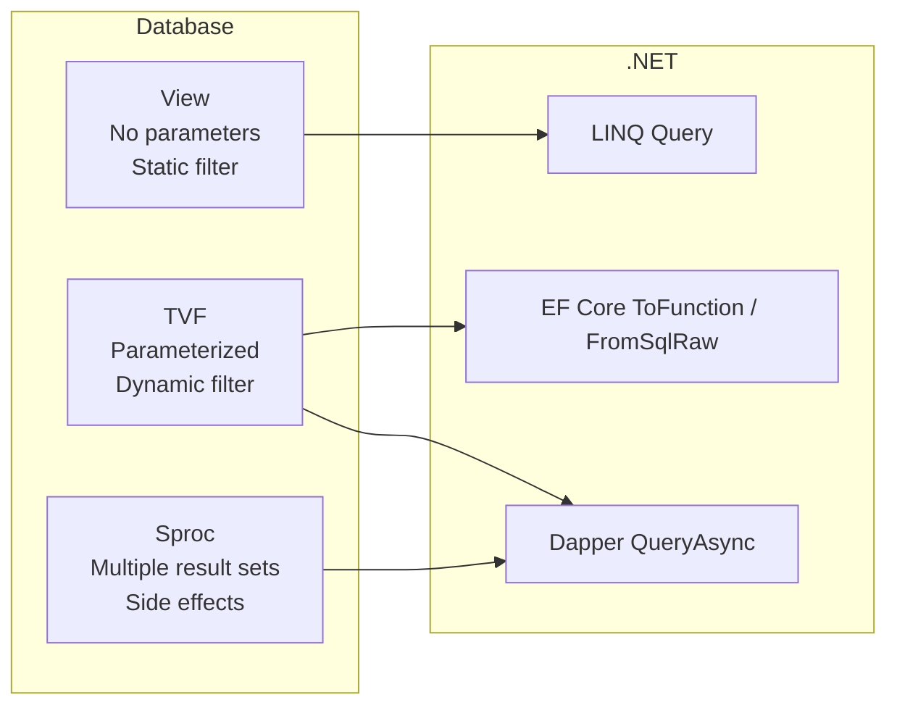
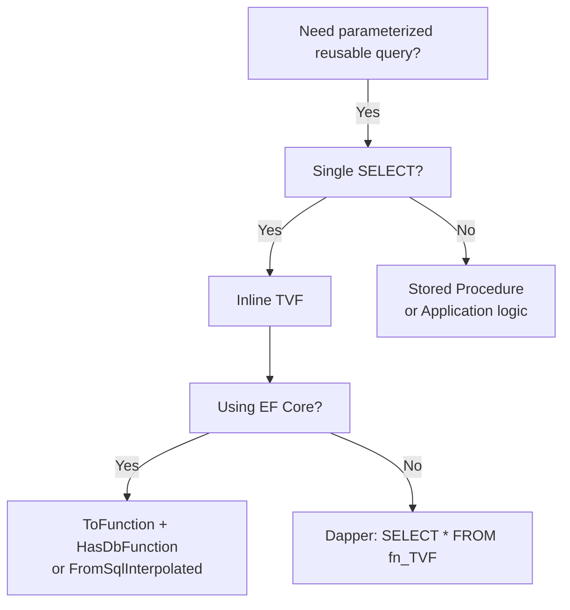

# 8.903 Table-Valued Function Mapping in EF Core

## 1. Overview — Table-Valued Functions in .NET

Table-Valued Functions (TVFs) are database objects that accept parameters and return a table result set. Unlike views, which are static, TVFs are parameterized — the result set shape can change based on input parameters (in the case of multi-statement TVFs) or can be optimized by the query optimizer (in the case of inline TVFs).

### Types of TVFs

```sql
-- Inline TVF: Returns a table from a single SELECT
-- SQL Server treats this as a parameterized view
CREATE FUNCTION fn_GetOrdersByCustomer
(
    @CustomerId INT,
    @Status NVARCHAR(20) = NULL
)
RETURNS TABLE
AS
RETURN
(
    SELECT
        o.Id,
        o.CustomerId,
        o.OrderDate,
        o.Status,
        o.TotalAmount,
        o.TrackingNumber,
        o.Notes
    FROM Orders o
    WHERE o.CustomerId = @CustomerId
      AND (@Status IS NULL OR o.Status = @Status)
);
```

```sql
-- Multi-statement TVF: Declares a table variable, populates it, returns it
CREATE FUNCTION fn_GetOrderSummariesWithRanking
(
    @MinTotal DECIMAL(18,2),
    @TopCount INT
)
RETURNS @Result TABLE
(
    Id INT,
    CustomerId INT,
    CustomerName NVARCHAR(100),
    TotalAmount DECIMAL(18,2),
    OrderDate DATETIME2,
    Rank INT
)
AS
BEGIN
    INSERT INTO @Result
    SELECT
        o.Id, o.CustomerId, c.Name,
        o.TotalAmount, o.OrderDate,
        ROW_NUMBER() OVER (ORDER BY o.TotalAmount DESC)
    FROM Orders o
    INNER JOIN Customers c ON o.CustomerId = c.Id
    WHERE o.TotalAmount >= @MinTotal;

    DELETE FROM @Result WHERE Rank > @TopCount;
    RETURN;
END;
```

### Why TVFs Matter in .NET



TVFs bridge the gap between views (composable but not parameterized) and stored procedures (parameterized but not composable). In EF Core 5+, TVFs can be mapped to the model, enabling LINQ composition that includes TVF calls in the generated SQL.

## 2. Creating TVFs — T-SQL Examples

### Inline TVF — Order Details with Aggregation

```sql
CREATE FUNCTION fn_GetOrderDetailsWithTotals
(
    @OrderId INT
)
RETURNS TABLE
AS
RETURN
(
    SELECT
        oi.Id, oi.OrderId, oi.ProductId, oi.ProductName,
        oi.Quantity, oi.UnitPrice, oi.Discount,
        (oi.Quantity * oi.UnitPrice - oi.Discount) AS LineTotal,
        o.OrderDate, o.Status, o.CustomerId
    FROM OrderItems oi
    INNER JOIN Orders o ON oi.OrderId = o.Id
    WHERE oi.OrderId = @OrderId
);
```

### Inline TVF — Customer Monthly Spend

```sql
CREATE FUNCTION fn_CustomerMonthlySpend
(
    @CustomerId INT,
    @Year INT
)
RETURNS TABLE
AS
RETURN
(
    SELECT
        CustomerId = @CustomerId,
        MonthNumber = MONTH(o.OrderDate),
        MonthName = DATENAME(MONTH, o.OrderDate),
        OrderCount = COUNT(DISTINCT o.Id),
        TotalSpend = SUM(o.TotalAmount),
        AverageOrderValue = AVG(o.TotalAmount),
        MaxOrderValue = MAX(o.TotalAmount),
        MinOrderValue = MIN(o.TotalAmount)
    FROM Orders o
    WHERE o.CustomerId = @CustomerId
      AND YEAR(o.OrderDate) = @Year
      AND o.Status IN ('Shipped', 'Delivered')
    GROUP BY MONTH(o.OrderDate), DATENAME(MONTH, o.OrderDate)
);
```

### Multi-Statement TVF — Paged Search with Total Count

```sql
CREATE FUNCTION fn_SearchOrders
(
    @SearchTerm NVARCHAR(100),
    @Status NVARCHAR(20) = NULL,
    @FromDate DATETIME2 = NULL,
    @ToDate DATETIME2 = NULL,
    @PageNumber INT,
    @PageSize INT
)
RETURNS @Results TABLE
(
    Id INT,
    CustomerId INT,
    CustomerName NVARCHAR(100),
    OrderDate DATETIME2,
    Status NVARCHAR(20),
    TotalAmount DECIMAL(18,2),
    ItemCount INT,
    TotalCount INT
)
AS
BEGIN
    DECLARE @TotalCount INT;
    DECLARE @Offset INT = (@PageNumber - 1) * @PageSize;

    SELECT @TotalCount = COUNT(*)
    FROM Orders o
    INNER JOIN Customers c ON o.CustomerId = c.Id
    WHERE (@SearchTerm = '' OR c.Name LIKE '%' + @SearchTerm + '%'
           OR CAST(o.Id AS NVARCHAR) = @SearchTerm)
      AND (@Status IS NULL OR o.Status = @Status)
      AND (@FromDate IS NULL OR o.OrderDate >= @FromDate)
      AND (@ToDate IS NULL OR o.OrderDate < DATEADD(DAY, 1, @ToDate));

    INSERT INTO @Results
    SELECT
        o.Id, o.CustomerId, c.Name,
        o.OrderDate, o.Status, o.TotalAmount,
        (SELECT COUNT(*) FROM OrderItems oi WHERE oi.OrderId = o.Id) AS ItemCount,
        @TotalCount AS TotalCount
    FROM Orders o
    INNER JOIN Customers c ON o.CustomerId = c.Id
    WHERE (@SearchTerm = '' OR c.Name LIKE '%' + @SearchTerm + '%'
           OR CAST(o.Id AS NVARCHAR) = @SearchTerm)
      AND (@Status IS NULL OR o.Status = @Status)
      AND (@FromDate IS NULL OR o.OrderDate >= @FromDate)
      AND (@ToDate IS NULL OR o.OrderDate < DATEADD(DAY, 1, @ToDate))
    ORDER BY o.OrderDate DESC
    OFFSET @Offset ROWS
    FETCH NEXT @PageSize ROWS ONLY;

    RETURN;
END;
```

## 3. EF Core — Model Configuration for TVFs

EF Core 5+ supports mapping TVFs to the model using HasNoKey (for keyless entity types) combined with ToFunction or raw SQL.

### Step 1: Define the Result Type

```csharp
public class OrderDetailWithTotals
{
    public int Id { get; set; }
    public int OrderId { get; set; }
    public int ProductId { get; set; }
    public string ProductName { get; set; }
    public int Quantity { get; set; }
    public decimal UnitPrice { get; set; }
    public decimal Discount { get; set; }
    public decimal LineTotal { get; set; }
    public DateTime OrderDate { get; set; }
    public string Status { get; set; }
    public int CustomerId { get; set; }
}

public class CustomerMonthlySpend
{
    public int CustomerId { get; set; }
    public int MonthNumber { get; set; }
    public string MonthName { get; set; }
    public int OrderCount { get; set; }
    public decimal TotalSpend { get; set; }
    public decimal AverageOrderValue { get; set; }
    public decimal MaxOrderValue { get; set; }
    public decimal MinOrderValue { get; set; }
}

public class SearchOrderResult
{
    public int Id { get; set; }
    public int CustomerId { get; set; }
    public string CustomerName { get; set; }
    public DateTime OrderDate { get; set; }
    public string Status { get; set; }
    public decimal TotalAmount { get; set; }
    public int ItemCount { get; set; }
    public int TotalCount { get; set; }
}
```

### Step 2: OnModelCreating Configuration

```csharp
public class AppDbContext : DbContext
{
    public DbSet<Order> Orders { get; set; }
    public DbSet<Customer> Customers { get; set; }
    public DbSet<OrderItem> OrderItems { get; set; }
    public DbSet<OrderDetailWithTotals> OrderDetailWithTotals { get; set; }
    public DbSet<CustomerMonthlySpend> CustomerMonthlySpends { get; set; }
    public DbSet<SearchOrderResult> SearchOrderResults { get; set; }

    protected override void OnModelCreating(ModelBuilder modelBuilder)
    {
        modelBuilder.Entity<OrderDetailWithTotals>(entity =>
        {
            entity.HasNoKey();
            entity.ToFunction("fn_GetOrderDetailsWithTotals");
            entity.Property(e => e.Id).HasColumnName("Id");
            entity.Property(e => e.OrderId).HasColumnName("OrderId");
            entity.Property(e => e.ProductId).HasColumnName("ProductId");
            entity.Property(e => e.ProductName).HasColumnName("ProductName").HasMaxLength(200);
            entity.Property(e => e.Quantity).HasColumnName("Quantity");
            entity.Property(e => e.UnitPrice).HasColumnName("UnitPrice").HasPrecision(18, 2);
            entity.Property(e => e.Discount).HasColumnName("Discount").HasPrecision(18, 2);
            entity.Property(e => e.LineTotal).HasColumnName("LineTotal").HasPrecision(18, 2);
            entity.Property(e => e.OrderDate).HasColumnName("OrderDate");
            entity.Property(e => e.Status).HasColumnName("Status").HasMaxLength(20);
            entity.Property(e => e.CustomerId).HasColumnName("CustomerId");
        });

        modelBuilder.Entity<CustomerMonthlySpend>(entity =>
        {
            entity.HasNoKey();
        });

        modelBuilder.Entity<SearchOrderResult>(entity =>
        {
            entity.HasNoKey();
        });

        modelBuilder.HasDbFunction(typeof(AppDbContext)
            .GetMethod(nameof(GetOrdersWithDetails), new[] { typeof(int) }))
            .HasName("fn_GetOrderDetailsWithTotals")
            .IsBuiltIn(false);
    }

    public IQueryable<OrderDetailWithTotals> GetOrdersWithDetails(int orderId)
        => Set<OrderDetailWithTotals>().FromSqlInterpolated(
            $"SELECT * FROM fn_GetOrderDetailsWithTotals({orderId})");
}
```

### Step 3: FromSqlRaw Configuration Alternative

```csharp
public class AppDbContext : DbContext
{
    public IQueryable<CustomerMonthlySpend> GetCustomerMonthlySpend(int customerId, int year)
    {
        return Set<CustomerMonthlySpend>()
            .FromSqlInterpolated($"SELECT * FROM fn_CustomerMonthlySpend({customerId}, {year})");
    }

    public IQueryable<SearchOrderResult> SearchOrders(
        string searchTerm, string? status,
        DateTime? fromDate, DateTime? toDate,
        int pageNumber, int pageSize)
    {
        return Set<SearchOrderResult>()
            .FromSqlInterpolated($@"
                SELECT * FROM fn_SearchOrders(
                    {searchTerm},
                    {status ?? (object)DBNull.Value},
                    {fromDate ?? (object)DBNull.Value},
                    {toDate ?? (object)DBNull.Value},
                    {pageNumber},
                    {pageSize})");
    }
}
```

### Step 4: HasDbFunction — Full LINQ Integration

```csharp
public class AppDbContext : DbContext
{
    public IQueryable<OrderDetailWithTotals> GetOrderDetails(int orderId)
        => FromExpression(() => GetOrderDetails(orderId));

    protected override void OnModelCreating(ModelBuilder modelBuilder)
    {
        modelBuilder.Entity<OrderDetailWithTotals>().HasNoKey();
        modelBuilder.HasDbFunction(
            typeof(AppDbContext).GetMethod(nameof(GetOrderDetails), new[] { typeof(int) })!)
            .HasName("fn_GetOrderDetailsWithTotals")
            .IsBuiltIn(false);
    }
}

// Use TVF directly inside LINQ:
var results = await _context.Orders
    .Where(o => o.Status == "Shipped")
    .SelectMany(o => _context.GetOrderDetails(o.Id))
    .Where(d => d.LineTotal > 100)
    .OrderByDescending(d => d.LineTotal)
    .ToListAsync();
```

Generated SQL:

```sql
SELECT d.Id, d.OrderId, d.ProductId, d.ProductName, d.Quantity,
       d.UnitPrice, d.Discount, d.LineTotal, d.OrderDate, d.Status, d.CustomerId
FROM Orders o
CROSS APPLY fn_GetOrderDetailsWithTotals(o.Id) d
WHERE o.Status = 'Shipped' AND d.LineTotal > 100.00
ORDER BY d.LineTotal DESC;
```

### Configuration Comparison Table

| Approach | EF Core Version | LINQ Compose | Setup Required |
|---|---|---|---|
| ToFunction() | 5+ | Yes (via DbFunction) | Model + type registration |
| FromSqlInterpolated on DbSet | 3.1+ | Yes (SELECT only) | Keyless type registration |
| HasDbFunction via FromExpression | 5+ | Yes (in LINQ) | Full model + function mapping |
| SqlQuery<T> (raw SQL) | 7+ | No | Type-only |

## 4. EF Core — Querying TVFs with LINQ

### Direct Query via DbSet

```csharp
public async Task<List<OrderDetailWithTotals>> GetOrderDetailsAsync(int orderId)
{
    return await _context.OrderDetailWithTotals
        .FromSqlInterpolated($"SELECT * FROM fn_GetOrderDetailsWithTotals({orderId})")
        .ToListAsync();
}
```

### LINQ Composition Over TVF

```csharp
public async Task<List<OrderDetailWithTotals>> GetHighValueItemsAsync(int orderId)
{
    return await _context.OrderDetailWithTotals
        .FromSqlInterpolated($"SELECT * FROM fn_GetOrderDetailsWithTotals({orderId})")
        .Where(d => d.LineTotal > 100)
        .OrderByDescending(d => d.LineTotal)
        .ToListAsync();
}
```

Generated SQL:

```sql
SELECT d.Id, d.OrderId, d.ProductId, d.ProductName, d.Quantity,
       d.UnitPrice, d.Discount, d.LineTotal, d.OrderDate, d.Status, d.CustomerId
FROM (
    SELECT * FROM fn_GetOrderDetailsWithTotals(@p0)
) AS d
WHERE d.LineTotal > 100.00
ORDER BY d.LineTotal DESC;
```

### CROSS APPLY with TVF in LINQ

```csharp
public async Task<List<OrderSummaryDto>> GetOrdersWithLineItemsAsync()
{
    var query = from o in _context.Orders
                where o.Status == "Shipped"
                from d in _context.GetOrderDetails(o.Id)
                group d by new { o.Id, o.OrderDate, o.TotalAmount } into g
                select new OrderSummaryDto
                {
                    OrderId = g.Key.Id,
                    OrderDate = g.Key.OrderDate,
                    OrderTotal = g.Key.TotalAmount,
                    LineTotalSum = g.Sum(d => d.LineTotal),
                    ItemCount = g.Count()
                };

    return await query.Take(50).ToListAsync();
}
```

Generated SQL:

```sql
SELECT TOP(50) o.Id, o.OrderDate, o.TotalAmount,
       SUM(d.LineTotal) AS LineTotalSum,
       COUNT(*) AS ItemCount
FROM Orders o
CROSS APPLY fn_GetOrderDetailsWithTotals(o.Id) d
WHERE o.Status = 'Shipped'
GROUP BY o.Id, o.OrderDate, o.TotalAmount;
```

### Monthly Spend with Filtering

```csharp
public async Task<List<CustomerMonthlySpend>> GetTopMonthAsync(int customerId, int year)
{
    return await _context.CustomerMonthlySpends
        .FromSqlInterpolated($"SELECT * FROM fn_CustomerMonthlySpend({customerId}, {year})")
        .Where(m => m.TotalSpend > 1000)
        .OrderByDescending(m => m.TotalSpend)
        .ToListAsync();
}
```

Generated SQL:

```sql
SELECT m.CustomerId, m.MonthNumber, m.MonthName, m.OrderCount,
       m.TotalSpend, m.AverageOrderValue, m.MaxOrderValue, m.MinOrderValue
FROM (
    SELECT * FROM fn_CustomerMonthlySpend(@p0, @p1)
) AS m
WHERE m.TotalSpend > 1000.00
ORDER BY m.TotalSpend DESC;
```

### Paged Search with Multi-Statement TVF

```csharp
public async Task<PagedResult<SearchOrderResult>> SearchOrdersAsync(
    string searchTerm, string? status,
    DateTime? fromDate, DateTime? toDate,
    int pageNumber, int pageSize)
{
    var results = await _context.SearchOrderResults
        .FromSqlInterpolated($@"
            SELECT * FROM fn_SearchOrders(
                {searchTerm},
                {status ?? (object)DBNull.Value},
                {fromDate ?? (object)DBNull.Value},
                {toDate ?? (object)DBNull.Value},
                {pageNumber},
                {pageSize})")
        .ToListAsync();

    var totalCount = results.FirstOrDefault()?.TotalCount ?? 0;

    return new PagedResult<SearchOrderResult>
    {
        Items = results,
        TotalCount = totalCount,
        PageNumber = pageNumber,
        PageSize = pageSize,
        TotalPages = (int)Math.Ceiling(totalCount / (double)pageSize)
    };
}
```

### TVFs in Complex LINQ Queries

```csharp
public async Task<List<CustomerDashboardDto>> GetCustomerDashboardAsync(int customerId, int year)
{
    var spendQuery = _context.CustomerMonthlySpends
        .FromSqlInterpolated($"SELECT * FROM fn_CustomerMonthlySpend({customerId}, {year})");

    var query = from c in _context.Customers
                where c.Id == customerId
                join s in spendQuery on c.Id equals s.CustomerId into ms
                select new CustomerDashboardDto
                {
                    CustomerId = c.Id,
                    CustomerName = c.Name,
                    CustomerEmail = c.Email,
                    MonthlySpend = ms.ToList(),
                    YearToDateSpend = ms.Sum(s => (decimal?)s.TotalSpend) ?? 0,
                    BestMonth = ms.OrderByDescending(s => s.TotalSpend)
                                  .Select(s => s.MonthName).FirstOrDefault()
                };

    return await query.ToListAsync();
}
```

Generated SQL:

```sql
SELECT c.Id, c.Name, c.Email,
       m.MonthNumber, m.MonthName, m.OrderCount, m.TotalSpend,
       m.AverageOrderValue, m.MaxOrderValue, m.MinOrderValue
FROM Customers c
LEFT JOIN fn_CustomerMonthlySpend(@p0, @p1) m ON c.Id = m.CustomerId
WHERE c.Id = @p0
ORDER BY c.Id;
```

## 5. Dapper — Calling TVFs

Dapper treats TVFs as queryable objects in SQL — write SELECT * FROM function_name(params) just like querying a table.

### Basic Dapper TVF Call

```csharp
public async Task<IEnumerable<OrderDetailWithTotals>> GetOrderDetailsDapperAsync(
    IDbConnection connection, int orderId)
{
    return await connection.QueryAsync<OrderDetailWithTotals>(
        "SELECT * FROM fn_GetOrderDetailsWithTotals(@OrderId)",
        new { OrderId = orderId });
}
```

### Dapper TVF with Multiple Parameters

```csharp
public async Task<IEnumerable<CustomerMonthlySpend>> GetMonthlySpendDapperAsync(
    IDbConnection connection, int customerId, int year)
{
    return await connection.QueryAsync<CustomerMonthlySpend>(
        "SELECT * FROM fn_CustomerMonthlySpend(@CustomerId, @Year)",
        new { CustomerId = customerId, Year = year });
}
```

### Dapper TVF in JOINs (CROSS APPLY)

```csharp
public async Task<IEnumerable<OrderWithLineDetails>> GetOrdersWithLineDetailsDapperAsync(
    IDbConnection connection)
{
    var sql = @"
        SELECT o.Id, o.OrderDate, o.Status, o.TotalAmount,
               d.Id, d.ProductId, d.ProductName, d.Quantity,
               d.UnitPrice, d.Discount, d.LineTotal
        FROM Orders o
        CROSS APPLY fn_GetOrderDetailsWithTotals(o.Id) d
        WHERE o.Status = 'Shipped'
        ORDER BY o.OrderDate DESC";

    var orderDict = new Dictionary<int, OrderWithLineDetails>();

    return await connection.QueryAsync<OrderWithLineDetails, OrderDetailWithTotals, OrderWithLineDetails>(
        sql,
        (order, detail) =>
        {
            if (!orderDict.TryGetValue(order.Id, out var existing))
            {
                existing = order;
                existing.Details = new List<OrderDetailWithTotals>();
                orderDict.Add(order.Id, existing);
            }
            existing.Details.Add(detail);
            return existing;
        },
        splitOn: "Id");
}
```

### Dapper Paged Search

```csharp
public async Task<PagedResult<SearchOrderResult>> SearchOrdersDapperAsync(
    IDbConnection connection,
    string searchTerm, string? status,
    DateTime? fromDate, DateTime? toDate,
    int pageNumber, int pageSize)
{
    var results = await connection.QueryAsync<SearchOrderResult>(
        "SELECT * FROM fn_SearchOrders(@SearchTerm, @Status, @FromDate, @ToDate, @PageNumber, @PageSize)",
        new { SearchTerm = searchTerm, Status = status, FromDate = fromDate,
              ToDate = toDate, PageNumber = pageNumber, PageSize = pageSize });

    var list = results.ToList();
    var totalCount = list.FirstOrDefault()?.TotalCount ?? 0;

    return new PagedResult<SearchOrderResult>
    {
        Items = list,
        TotalCount = totalCount,
        PageNumber = pageNumber,
        PageSize = pageSize,
        TotalPages = (int)Math.Ceiling(totalCount / (double)pageSize)
    };
}
```

### Dapper Multi-Mapping with TVF

```csharp
public async Task<IEnumerable<CustomerDashboardDto>> GetCustomerDashboardDapperAsync(
    IDbConnection connection, int customerId, int year)
{
    var sql = @"
        SELECT c.Id, c.Name, c.Email,
               m.MonthNumber, m.MonthName, m.OrderCount,
               m.TotalSpend, m.AverageOrderValue, m.MaxOrderValue, m.MinOrderValue
        FROM Customers c
        LEFT JOIN fn_CustomerMonthlySpend(@CustomerId, @Year) m
            ON c.Id = m.CustomerId
        WHERE c.Id = @CustomerId
        ORDER BY m.MonthNumber";

    var customerDict = new Dictionary<int, CustomerDashboardDto>();

    return await connection.QueryAsync<CustomerDashboardDto, CustomerMonthlySpend, CustomerDashboardDto>(
        sql,
        (customer, monthly) =>
        {
            if (!customerDict.TryGetValue(customer.CustomerId, out var existing))
            {
                existing = customer;
                existing.MonthlySpend = new List<CustomerMonthlySpend>();
                customerDict.Add(customer.CustomerId, existing);
            }
            if (monthly is not null)
                existing.MonthlySpend.Add(monthly);
            return existing;
        },
        new { CustomerId = customerId, Year = year },
        splitOn: "MonthNumber");
}
```

## 6. Generated SQL — LINQ vs Raw

### EF Core ToFunction — LINQ Integration

```csharp
var query = from o in _context.Orders
            where o.TotalAmount > 500
            from d in _context.GetOrderDetails(o.Id)
            select new { o.Id, d.ProductName, d.LineTotal };
```

```sql
SELECT o.Id, d.ProductName, d.LineTotal
FROM Orders o
INNER JOIN fn_GetOrderDetailsWithTotals(o.Id) d ON 1 = 1
WHERE o.TotalAmount > 500.00;
```

### EF Core FromSqlInterpolated — Subquery Wrapping

```csharp
var results = await _context.OrderDetailWithTotals
    .FromSqlInterpolated($"SELECT * FROM fn_GetOrderDetailsWithTotals({orderId})")
    .Where(d => d.LineTotal > 100)
    .OrderByDescending(d => d.LineTotal)
    .ToListAsync();
```

```sql
SELECT d.Id, d.OrderId, d.ProductId, d.ProductName, d.Quantity,
       d.UnitPrice, d.Discount, d.LineTotal, d.OrderDate, d.Status, d.CustomerId
FROM (
    SELECT * FROM fn_GetOrderDetailsWithTotals(@p0)
) AS d
WHERE d.LineTotal > 100.00
ORDER BY d.LineTotal DESC;
```

### Dapper — Direct TVF Call

```csharp
var results = await connection.QueryAsync<OrderDetailWithTotals>(
    "SELECT * FROM fn_GetOrderDetailsWithTotals(@OrderId) WHERE LineTotal > @Min",
    new { OrderId = orderId, Min = 100 });
```

```sql
exec sp_executesql N'SELECT * FROM fn_GetOrderDetailsWithTotals(@OrderId) WHERE LineTotal > @Min',
    N'@OrderId int, @Min decimal(18,2)',
    @OrderId = 1001,
    @Min = 100.00;
```

### SQL Generation Comparison

| Scenario | EF Core | Dapper |
|---|---|---|
| Simple call | SELECT * FROM fn(@p0) | SELECT * FROM fn(@Param) |
| With Where | SELECT ... FROM (SELECT * FROM fn(@p0)) AS d WHERE ... | SELECT * FROM fn(@p) WHERE ... |
| CROSS APPLY | INNER JOIN fn(col) ON 1 = 1 | CROSS APPLY fn(col) (manual) |
| With JOIN | LEFT JOIN fn(@p0) ON c.Id = m.CustomerId | LEFT JOIN fn(@p) ON c.Id = m.CustomerId |

## 7. Parameter Sniffing and Performance

### Parameter Sniffing

SQL Server's optimizer "sniffs" parameter values when compiling the plan. The first call's parameter values determine the cached plan.

```sql
-- First call: @CustomerId = 1 (few orders) -> Nested Loops plan
SELECT * FROM fn_GetOrderDetailsWithTotals(1);

-- Second call: @CustomerId = 99999 (millions) -> reuses Nested Loops plan
-- This can be catastrophic for performance!
SELECT * FROM fn_GetOrderDetailsWithTotals(99999);
```

### Mitigation Strategies

**RECOMPILE hint:**

```csharp
return await _context.OrderDetailWithTotals
    .FromSqlInterpolated($@"
        SELECT * FROM fn_GetOrderDetailsWithTotals({orderId})
        OPTION (RECOMPILE)")
    .ToListAsync();
```

**OPTIMIZE FOR UNKNOWN:**

```csharp
return await _context.OrderDetailWithTotals
    .FromSqlInterpolated($@"
        SELECT * FROM fn_GetOrderDetailsWithTotals({orderId})
        OPTION (OPTIMIZE FOR UNKNOWN)")
    .ToListAsync();
```

**Local variable (prevents sniffing):**

```sql
CREATE FUNCTION fn_GetOrders_NoSniff(@CustomerId INT)
RETURNS TABLE
AS
RETURN
(
    DECLARE @LocalId INT = @CustomerId;
    SELECT ... FROM Orders WHERE CustomerId = @LocalId
);
```

### Inline vs Multi-Statement TVF Performance

| Aspect | Inline TVF | Multi-Statement TVF |
|---|---|---|
| Optimizer visibility | Full | None (opaque) |
| Cardinality estimates | Based on stats | Fixed (100 rows) |
| Plan quality | Same as direct query | Often suboptimal |
| Tempdb usage | None | Table variable |
| CROSS APPLY | Fully inlined | Executed first |
| EF Core integration | Full translation | Subquery wrapping |

### Performance Testing Script

```sql
SET STATISTICS TIME ON;
SET STATISTICS IO ON;

PRINT '=== Inline TVF ===';
SELECT * FROM fn_GetOrderDetailsWithTotals(1001);

PRINT '=== Multi-Statement TVF ===';
SELECT * FROM fn_GetOrderDetailsWithTotalsMulti(1001);

PRINT '=== Direct query ===';
SELECT oi.*, o.OrderDate, o.Status, o.CustomerId
FROM OrderItems oi
INNER JOIN Orders o ON oi.OrderId = o.Id
WHERE oi.OrderId = 1001;
```

## 8. Gotchas and Limitations

### Gotcha 1: TVF Must Be in Model for LINQ Composition

If the TVF result type is not in the model, FromSqlInterpolated cannot compose LINQ:

```csharp
// FAILS if OrderDetailWithTotals is not registered
var results = await _context.Set<OrderDetailWithTotals>()
    .FromSqlInterpolated($"SELECT * FROM fn_GetOrderDetailsWithTotals({id})")
    .Where(d => d.LineTotal > 100)  // InvalidOperationException
    .ToListAsync();
```

### Gotcha 2: TVF Results Are Read-Only

TVF result sets cannot be inserted into, updated, or deleted through EF Core:

```csharp
var items = await _context.OrderDetailWithTotals
    .FromSqlInterpolated($"SELECT * FROM fn_GetOrderDetailsWithTotals({id})")
    .ToListAsync();

_context.OrderDetailWithTotals.Remove(items[0]); // No effect
await _context.SaveChangesAsync(); // No SQL generated
```

### Gotcha 3: Multi-Statement TVF Predicate Pushdown

Multi-statement TVFs prevent predicate pushdown — all rows are materialized before filtering:

```sql
-- Multi-statement TVF: ALL rows computed, THEN filtered
SELECT * FROM fn_GetOrderDetailsWithTotalsMulti(1001) WHERE LineTotal > 100;
-- fn returns ALL line items, then WHERE is applied externally
```

### Gotcha 4: Schema Binding

WITH SCHEMABINDING prevents ALTER TABLE on referenced columns, complicating deployments:

```sql
CREATE FUNCTION fn_GetOrdersByCustomer(@CustomerId INT)
RETURNS TABLE
WITH SCHEMABINDING
AS
RETURN (SELECT ... FROM dbo.Orders WHERE CustomerId = @CustomerId);
```

### Gotcha 5: Parameter Defaults Not Exposed

EF Core does not read SQL parameter defaults from TVF definitions. All parameters must be provided explicitly:

```csharp
// SQL has default @Status = NULL, but EF Core still requires it
var results = await _context.Set<OrderDetailWithTotals>()
    .FromSqlInterpolated(
        $"SELECT * FROM fn_GetOrdersByCustomer({customerId}, {status ?? (object)DBNull.Value})")
    .ToListAsync();
```

### Gotcha 6: Column Name Matching

TVF result columns must match entity property names. Use column aliases if they differ:

```sql
CREATE FUNCTION fn_GetOrdersByCustomer(@CustomerId INT)
RETURNS TABLE
AS
RETURN
(
    SELECT
        o.Id, o.CustomerId, o.OrderDate,
        o.Status, o.TotalAmount AS Total,  -- Entity expects TotalAmount
        o.TrackingNumber
    FROM Orders o WHERE o.CustomerId = @CustomerId
);
```

Then configure mapping:
```csharp
entity.Property(e => e.TotalAmount).HasColumnName("Total");
```

### Gotcha 7: Scalar Functions vs TVFs

Scalar functions use [DbFunction] attribute, TVFs use keyless entities:

```csharp
[DbFunction("fn_GetCustomerTotalSpend", "dbo")]
public static decimal GetCustomerTotalSpend(int customerId)
    => throw new NotSupportedException();

// Usage in LINQ:
var customers = await _context.Customers
    .Where(c => AppDbContext.GetCustomerTotalSpend(c.Id) > 1000)
    .ToListAsync();
```

### Gotcha 8: Dynamic SQL Inside TVFs

TVFs cannot execute dynamic SQL. Use stored procedures for dynamic SQL:

```sql
-- This is NOT valid in a function:
CREATE FUNCTION fn_BadTVF(@TableName NVARCHAR(128))
RETURNS TABLE
AS
RETURN (EXEC('SELECT * FROM ' + @TableName));  -- Error!
```

## 9. Summary — Best Practices for TVFs

### Decision Framework



### Best Practice Rules

1. **Always prefer inline TVFs** — Optimizer inlining, same performance as views.
2. **Use ToFunction for LINQ integration** — EF Core 5+ translates LINQ to TVF + CROSS APPLY.
3. **Use FromSqlInterpolated for simple TVF calls** — Less setup, same performance.
4. **Use Dapper for TVF-heavy apps** — Direct SQL is more transparent.
5. **Add OPTION (RECOMPILE) for skewed data** — Mitigate parameter sniffing.
6. **Match column names exactly** — Use column aliases in SQL or HasColumnName in config.
7. **Avoid multi-statement TVFs for large data** — Materializes all rows in tempdb.

### Quick Reference

```csharp
// EF Core: ToFunction + LINQ
var results = await _context.Orders
    .SelectMany(o => _context.GetOrderDetails(o.Id))
    .Where(d => d.LineTotal > 100)
    .ToListAsync();

// EF Core: FromSqlInterpolated with composition
var results = await _context.OrderDetailWithTotals
    .FromSqlInterpolated($"SELECT * FROM fn_GetOrderDetailsWithTotals({orderId})")
    .Where(d => d.LineTotal > 100)
    .ToListAsync();

// EF Core: FromSqlRaw for multi-statement TVF
var results = await _context.Set<SearchOrderResult>()
    .FromSqlRaw("SELECT * FROM fn_SearchOrders(@p0, @p1, @p2, @p3, @p4, @p5)",
        searchTerm, status, fromDate, toDate, page, size)
    .ToListAsync();

// Dapper: Direct TVF call
var results = await connection.QueryAsync<OrderDetailWithTotals>(
    "SELECT * FROM fn_GetOrderDetailsWithTotals(@OrderId)",
    new { OrderId = orderId });

// Dapper: TVF with CROSS APPLY
var results = await connection.QueryAsync<OrderWithDetails>(
    @"SELECT o.*, d.* FROM Orders o
      CROSS APPLY fn_GetOrderDetailsWithTotals(o.Id) d
      WHERE o.Status = @Status",
    new { Status = "Shipped" });
```

### When to Avoid TVFs

- Simple filtering (use a view + LINQ parameters)
- Need INSERT/UPDATE on results (TVFs are read-only)
- Need multiple result sets (use stored procedures)
- Highly skewed data (parameter sniffing problems)
- Cross-platform database compatibility (TVF syntax varies)
- Logic requires dynamic SQL or temp tables (use sprocs)

TVFs are a powerful tool for parameterized query reusability. The key insight is that inline TVFs are optimized by the query engine identically to views, while multi-statement TVFs carry a performance penalty. Always prefer inline TVFs with either EF Core's ToFunction or Dapper's direct SQL for the best combination of reusability and performance.
