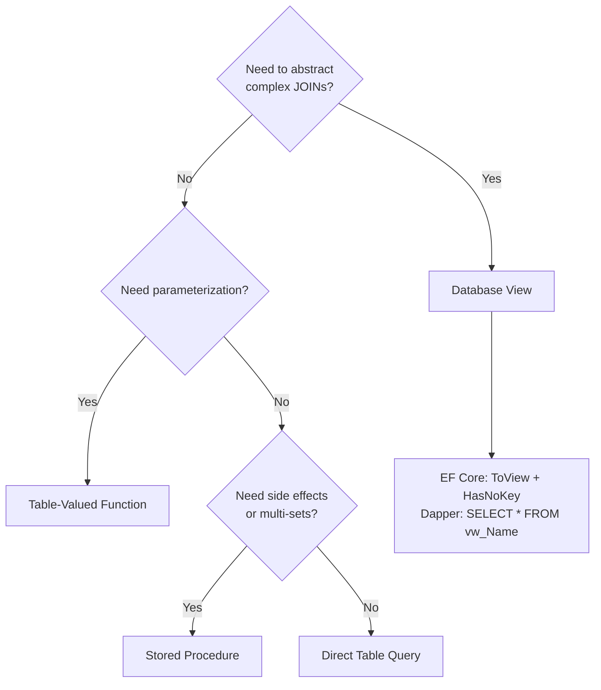
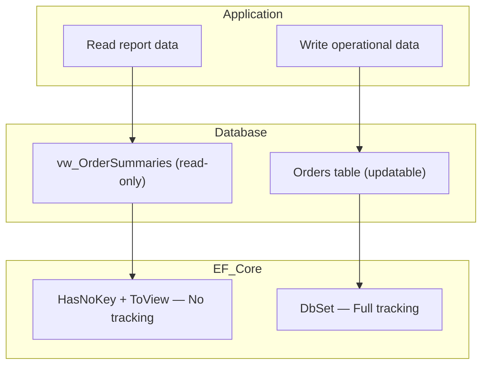
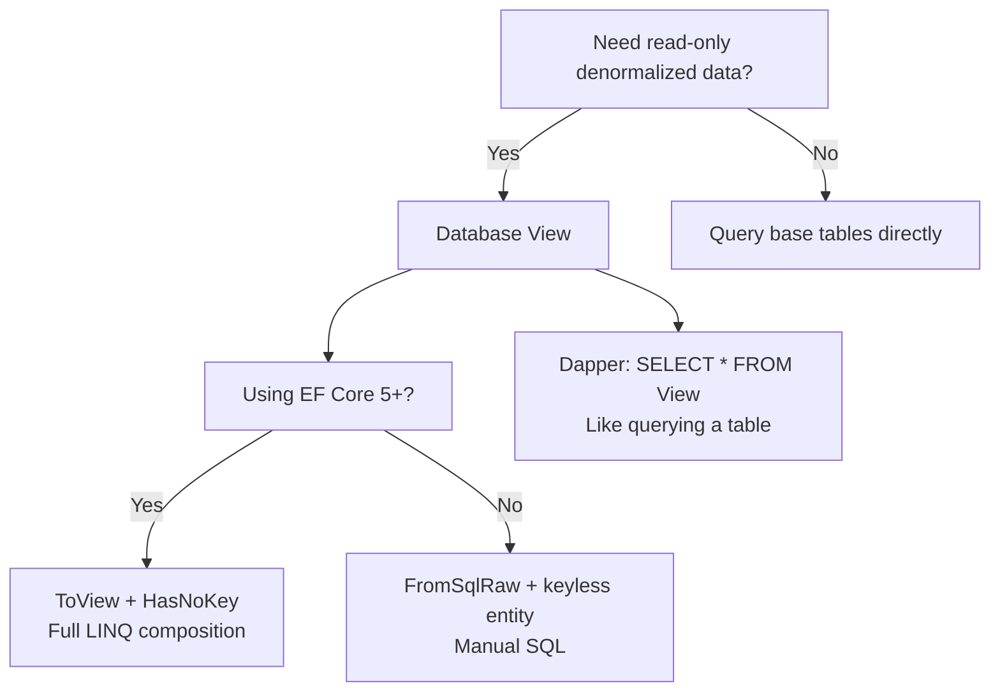

# 8.904 Database View Mapping in EF Core

## 1. Overview — Database Views in .NET Data Access

Database views are virtual tables that encapsulate a SELECT query. They provide an abstraction layer over the underlying table schema, enabling simplified querying, column-level security, and denormalized projections for reporting.

### Views vs Other Database Objects

| Feature | View | Inline TVF | Stored Procedure | Table |
|---|---|---|---|---|
| Parameters | None | Yes | Yes | N/A |
| Composability | Yes (SELECT) | Yes (SELECT) | No (EXEC) | Yes |
| Can INSERT/UPDATE | Rarely | No | Yes | Yes |
| Performance | Optimizer inlines | Optimizer inlines (inline TVF) | Plan cached | Full |
| EF Core mapping | ToView + HasNoKey | ToFunction + HasNoKey | FromSqlRaw | DbSet |
| Dapper usage | SELECT * FROM View | SELECT * FROM fn() | EXEC sp | SELECT * FROM |

### When Views Are Useful



Views are ideal when:
- Multiple applications need the same denormalized data shape
- You need column-level security without granting base table access
- You want to decouple reporting from schema changes
- You need a stable contract for read-only data access
- Complex JOINs and aggregations should be defined once in the database

## 2. Creating Views — T-SQL Examples

### Schema Reference

```sql
CREATE TABLE Customers (
    Id INT IDENTITY(1,1) PRIMARY KEY,
    Name NVARCHAR(100) NOT NULL,
    Email NVARCHAR(255) NOT NULL,
    Phone NVARCHAR(20) NULL,
    CreatedDate DATETIME2 NOT NULL DEFAULT GETUTCDATE(),
    IsActive BIT NOT NULL DEFAULT 1
);

CREATE TABLE Orders (
    Id INT IDENTITY(1,1) PRIMARY KEY,
    CustomerId INT NOT NULL REFERENCES Customers(Id),
    OrderDate DATETIME2 NOT NULL DEFAULT GETUTCDATE(),
    Status NVARCHAR(20) NOT NULL DEFAULT 'Pending',
    TotalAmount DECIMAL(18,2) NOT NULL,
    ShippingAddress NVARCHAR(500) NULL,
    TrackingNumber NVARCHAR(50) NULL
);

CREATE TABLE OrderItems (
    Id INT IDENTITY(1,1) PRIMARY KEY,
    OrderId INT NOT NULL REFERENCES Orders(Id),
    ProductId INT NOT NULL,
    ProductName NVARCHAR(200) NOT NULL,
    Category NVARCHAR(100) NOT NULL,
    Quantity INT NOT NULL,
    UnitPrice DECIMAL(18,2) NOT NULL,
    Discount DECIMAL(18,2) NOT NULL DEFAULT 0
);

CREATE TABLE Payments (
    Id INT IDENTITY(1,1) PRIMARY KEY,
    OrderId INT NOT NULL REFERENCES Orders(Id),
    Amount DECIMAL(18,2) NOT NULL,
    PaymentDate DATETIME2 NOT NULL DEFAULT GETUTCDATE(),
    PaymentMethod NVARCHAR(50) NOT NULL,
    Status NVARCHAR(20) NOT NULL DEFAULT 'Pending'
);
```

### View 1: Order Summary — Denormalized Reporting View

```sql
CREATE VIEW vw_OrderSummaries
AS
SELECT
    o.Id AS OrderId,
    o.OrderDate,
    o.Status,
    o.TotalAmount,
    o.TrackingNumber,
    c.Id AS CustomerId,
    c.Name AS CustomerName,
    c.Email AS CustomerEmail,
    COALESCE(oi.ItemCount, 0) AS ItemCount,
    COALESCE(oi.LineTotalSum, 0) AS MerchandiseTotal,
    COALESCE(oi.DiscountSum, 0) AS TotalDiscount,
    COALESCE(p.TotalPaid, 0) AS TotalPaid,
    COALESCE(p.PaymentCount, 0) AS PaymentCount,
    CASE
        WHEN COALESCE(p.TotalPaid, 0) >= o.TotalAmount THEN 'Paid'
        WHEN COALESCE(p.TotalPaid, 0) > 0 THEN 'Partial'
        ELSE 'Unpaid'
    END AS PaymentStatus,
    DATEDIFF(DAY, o.OrderDate, GETUTCDATE()) AS AgeInDays
FROM Orders o
INNER JOIN Customers c ON o.CustomerId = c.Id
LEFT JOIN (
    SELECT
        OrderId,
        COUNT(*) AS ItemCount,
        SUM(Quantity * UnitPrice) AS LineTotalSum,
        SUM(Discount) AS DiscountSum
    FROM OrderItems
    GROUP BY OrderId
) oi ON o.Id = oi.OrderId
LEFT JOIN (
    SELECT
        OrderId,
        COUNT(*) AS PaymentCount,
        SUM(Amount) AS TotalPaid
    FROM Payments
    WHERE Status = 'Completed'
    GROUP BY OrderId
) p ON o.Id = p.OrderId;
```

### View 2: Customer Monthly Aggregation

```sql
CREATE VIEW vw_CustomerMonthlyMetrics
AS
SELECT
    c.Id AS CustomerId,
    c.Name AS CustomerName,
    YEAR(o.OrderDate) AS Year,
    MONTH(o.OrderDate) AS Month,
    DATENAME(MONTH, o.OrderDate) AS MonthName,
    COUNT(DISTINCT o.Id) AS OrderCount,
    COUNT(DISTINCT oi.Id) AS ItemCount,
    SUM(o.TotalAmount) AS TotalSpend,
    AVG(o.TotalAmount) AS AverageOrderValue,
    MAX(o.TotalAmount) AS MaxOrderValue,
    MIN(o.TotalAmount) AS MinOrderValue,
    COUNT(DISTINCT oi.Category) AS CategoryCount,
    SUM(oi.Quantity) AS TotalUnitsPurchased
FROM Customers c
LEFT JOIN Orders o ON c.Id = o.CustomerId AND o.Status IN ('Shipped', 'Delivered')
LEFT JOIN OrderItems oi ON o.Id = oi.OrderId
GROUP BY c.Id, c.Name, YEAR(o.OrderDate), MONTH(o.OrderDate), DATENAME(MONTH, o.OrderDate);
```

### View 3: Top Products by Revenue

```sql
CREATE VIEW vw_TopProductsByRevenue
AS
SELECT
    p.ProductId,
    p.ProductName,
    p.Category,
    COUNT(DISTINCT p.OrderId) AS OrderCount,
    SUM(p.Quantity) AS TotalUnitsSold,
    SUM(p.Quantity * p.UnitPrice - p.Discount) AS TotalRevenue,
    AVG(p.UnitPrice) AS AverageUnitPrice,
    MAX(p.UnitPrice) AS MaxUnitPrice,
    MIN(p.UnitPrice) AS MinUnitPrice,
    RANK() OVER (ORDER BY SUM(p.Quantity * p.UnitPrice - p.Discount) DESC) AS RevenueRank,
    RANK() OVER (ORDER BY SUM(p.Quantity) DESC) AS VolumeRank
FROM (
    SELECT
        oi.ProductId,
        oi.ProductName,
        oi.Category,
        oi.OrderId,
        oi.Quantity,
        oi.UnitPrice,
        oi.Discount
    FROM OrderItems oi
    INNER JOIN Orders o ON oi.OrderId = o.Id
    WHERE o.Status IN ('Shipped', 'Delivered')
) p
GROUP BY p.ProductId, p.ProductName, p.Category;
```

### View 4: Pending Orders with Aging

```sql
CREATE VIEW vw_PendingOrdersAging
AS
SELECT
    o.Id AS OrderId,
    o.OrderDate,
    o.TotalAmount,
    o.Status,
    c.Id AS CustomerId,
    c.Name AS CustomerName,
    c.Phone AS CustomerPhone,
    DATEDIFF(DAY, o.OrderDate, GETUTCDATE()) AS DaysPending,
    CASE
        WHEN DATEDIFF(DAY, o.OrderDate, GETUTCDATE()) <= 1 THEN 'Today'
        WHEN DATEDIFF(DAY, o.OrderDate, GETUTCDATE()) <= 3 THEN '1-3 Days'
        WHEN DATEDIFF(DAY, o.OrderDate, GETUTCDATE()) <= 7 THEN '4-7 Days'
        WHEN DATEDIFF(DAY, o.OrderDate, GETUTCDATE()) <= 14 THEN '1-2 Weeks'
        WHEN DATEDIFF(DAY, o.OrderDate, GETUTCDATE()) <= 30 THEN '2-4 Weeks'
        ELSE 'Over 30 Days'
    END AS AgingBucket,
    ROW_NUMBER() OVER (ORDER BY o.OrderDate ASC) AS AgingPriority
FROM Orders o
INNER JOIN Customers c ON o.CustomerId = c.Id
WHERE o.Status IN ('Pending', 'Processing')
  AND o.TotalAmount > 0;
```

## 3. EF Core — Keyless Entity Configuration for Views

EF Core maps views as keyless entity types using HasNoKey. Starting with EF Core 5, you use ToView to specify the view name.

### Step 1: Define the Keyless Entity Types

```csharp
public class OrderSummaryView
{
    public int OrderId { get; set; }
    public DateTime OrderDate { get; set; }
    public string Status { get; set; }
    public decimal TotalAmount { get; set; }
    public string? TrackingNumber { get; set; }
    public int CustomerId { get; set; }
    public string CustomerName { get; set; }
    public string CustomerEmail { get; set; }
    public int ItemCount { get; set; }
    public decimal MerchandiseTotal { get; set; }
    public decimal TotalDiscount { get; set; }
    public decimal TotalPaid { get; set; }
    public int PaymentCount { get; set; }
    public string PaymentStatus { get; set; }
    public int AgeInDays { get; set; }
}

public class CustomerMonthlyMetric
{
    public int CustomerId { get; set; }
    public string CustomerName { get; set; }
    public int Year { get; set; }
    public int Month { get; set; }
    public string MonthName { get; set; }
    public int OrderCount { get; set; }
    public int ItemCount { get; set; }
    public decimal TotalSpend { get; set; }
    public decimal AverageOrderValue { get; set; }
    public decimal MaxOrderValue { get; set; }
    public decimal MinOrderValue { get; set; }
    public int CategoryCount { get; set; }
    public int TotalUnitsPurchased { get; set; }
}

public class TopProductByRevenueView
{
    public int ProductId { get; set; }
    public string ProductName { get; set; }
    public string Category { get; set; }
    public int OrderCount { get; set; }
    public int TotalUnitsSold { get; set; }
    public decimal TotalRevenue { get; set; }
    public decimal AverageUnitPrice { get; set; }
    public decimal MaxUnitPrice { get; set; }
    public decimal MinUnitPrice { get; set; }
    public long RevenueRank { get; set; }
    public long VolumeRank { get; set; }
}

public class PendingOrderAgingView
{
    public int OrderId { get; set; }
    public DateTime OrderDate { get; set; }
    public decimal TotalAmount { get; set; }
    public string Status { get; set; }
    public int CustomerId { get; set; }
    public string CustomerName { get; set; }
    public string? CustomerPhone { get; set; }
    public int DaysPending { get; set; }
    public string AgingBucket { get; set; }
    public long AgingPriority { get; set; }
}
```

### Step 2: OnModelCreating Configuration

```csharp
public class AppDbContext : DbContext
{
    // Regular entities
    public DbSet<Order> Orders { get; set; }
    public DbSet<Customer> Customers { get; set; }
    public DbSet<OrderItem> OrderItems { get; set; }
    public DbSet<Payment> Payments { get; set; }

    // View mappings
    public DbSet<OrderSummaryView> OrderSummaries { get; set; }
    public DbSet<CustomerMonthlyMetric> CustomerMonthlyMetrics { get; set; }
    public DbSet<TopProductByRevenueView> TopProductsByRevenue { get; set; }
    public DbSet<PendingOrderAgingView> PendingOrdersAging { get; set; }

    protected override void OnModelCreating(ModelBuilder modelBuilder)
    {
        // vw_OrderSummaries
        modelBuilder.Entity<OrderSummaryView>(entity =>
        {
            entity.HasNoKey();
            entity.ToView("vw_OrderSummaries");

            entity.Property(e => e.OrderId).HasColumnName("OrderId");
            entity.Property(e => e.OrderDate).HasColumnName("OrderDate");
            entity.Property(e => e.Status).HasColumnName("Status").HasMaxLength(20);
            entity.Property(e => e.TotalAmount).HasColumnName("TotalAmount").HasPrecision(18, 2);
            entity.Property(e => e.TrackingNumber).HasColumnName("TrackingNumber").HasMaxLength(50);
            entity.Property(e => e.CustomerId).HasColumnName("CustomerId");
            entity.Property(e => e.CustomerName).HasColumnName("CustomerName").HasMaxLength(100);
            entity.Property(e => e.CustomerEmail).HasColumnName("CustomerEmail").HasMaxLength(255);
            entity.Property(e => e.ItemCount).HasColumnName("ItemCount");
            entity.Property(e => e.MerchandiseTotal).HasColumnName("MerchandiseTotal").HasPrecision(18, 2);
            entity.Property(e => e.TotalDiscount).HasColumnName("TotalDiscount").HasPrecision(18, 2);
            entity.Property(e => e.TotalPaid).HasColumnName("TotalPaid").HasPrecision(18, 2);
            entity.Property(e => e.PaymentCount).HasColumnName("PaymentCount");
            entity.Property(e => e.PaymentStatus).HasColumnName("PaymentStatus").HasMaxLength(10);
            entity.Property(e => e.AgeInDays).HasColumnName("AgeInDays");
        });

        // vw_CustomerMonthlyMetrics
        modelBuilder.Entity<CustomerMonthlyMetric>(entity =>
        {
            entity.HasNoKey();
            entity.ToView("vw_CustomerMonthlyMetrics");

            entity.Property(e => e.CustomerId).HasColumnName("CustomerId");
            entity.Property(e => e.CustomerName).HasColumnName("CustomerName").HasMaxLength(100);
            entity.Property(e => e.Year).HasColumnName("Year");
            entity.Property(e => e.Month).HasColumnName("Month");
            entity.Property(e => e.MonthName).HasColumnName("MonthName").HasMaxLength(30);
            entity.Property(e => e.OrderCount).HasColumnName("OrderCount");
            entity.Property(e => e.ItemCount).HasColumnName("ItemCount");
            entity.Property(e => e.TotalSpend).HasColumnName("TotalSpend").HasPrecision(18, 2);
            entity.Property(e => e.AverageOrderValue).HasColumnName("AverageOrderValue").HasPrecision(18, 2);
            entity.Property(e => e.MaxOrderValue).HasColumnName("MaxOrderValue").HasPrecision(18, 2);
            entity.Property(e => e.MinOrderValue).HasColumnName("MinOrderValue").HasPrecision(18, 2);
            entity.Property(e => e.CategoryCount).HasColumnName("CategoryCount");
            entity.Property(e => e.TotalUnitsPurchased).HasColumnName("TotalUnitsPurchased");
        });

        // vw_TopProductsByRevenue
        modelBuilder.Entity<TopProductByRevenueView>(entity =>
        {
            entity.HasNoKey();
            entity.ToView("vw_TopProductsByRevenue");

            entity.Property(e => e.ProductId).HasColumnName("ProductId");
            entity.Property(e => e.ProductName).HasColumnName("ProductName").HasMaxLength(200);
            entity.Property(e => e.Category).HasColumnName("Category").HasMaxLength(100);
            entity.Property(e => e.OrderCount).HasColumnName("OrderCount");
            entity.Property(e => e.TotalUnitsSold).HasColumnName("TotalUnitsSold");
            entity.Property(e => e.TotalRevenue).HasColumnName("TotalRevenue").HasPrecision(18, 2);
            entity.Property(e => e.RevenueRank).HasColumnName("RevenueRank");
            entity.Property(e => e.VolumeRank).HasColumnName("VolumeRank");
        });

        // vw_PendingOrdersAging
        modelBuilder.Entity<PendingOrderAgingView>(entity =>
        {
            entity.HasNoKey();
            entity.ToView("vw_PendingOrdersAging");

            entity.Property(e => e.OrderId).HasColumnName("OrderId");
            entity.Property(e => e.OrderDate).HasColumnName("OrderDate");
            entity.Property(e => e.TotalAmount).HasColumnName("TotalAmount").HasPrecision(18, 2);
            entity.Property(e => e.Status).HasColumnName("Status").HasMaxLength(20);
            entity.Property(e => e.CustomerId).HasColumnName("CustomerId");
            entity.Property(e => e.CustomerName).HasColumnName("CustomerName").HasMaxLength(100);
            entity.Property(e => e.CustomerPhone).HasColumnName("CustomerPhone").HasMaxLength(20);
            entity.Property(e => e.DaysPending).HasColumnName("DaysPending");
            entity.Property(e => e.AgingBucket).HasColumnName("AgingBucket").HasMaxLength(15);
            entity.Property(e => e.AgingPriority).HasColumnName("AgingPriority");
        });
    }
}
```

### Configuration Approaches for Views

| Approach | When to Use | LINQ Support |
|---|---|---|
| ToView() + HasNoKey | EF Core 5+ view mapping | Full LINQ composition |
| FromSqlRaw on DbSet | Older EF Core versions | LINQ composition (SELECT only) |
| FromSqlRaw with SqlQuery<T> | EF Core 7+ non-entity results | No composability |
| DbSet without ToView | Direct table mapping (not recommended) | Full, but wrong mapping |

## 4. EF Core — Querying Views with LINQ

### Basic View Query

```csharp
public async Task<List<OrderSummaryView>> GetAllOrderSummariesAsync()
{
    return await _context.OrderSummaries
        .OrderByDescending(o => o.OrderDate)
        .ToListAsync();
}
```

Generated SQL:

```sql
SELECT o.OrderId, o.OrderDate, o.Status, o.TotalAmount, o.TrackingNumber,
       o.CustomerId, o.CustomerName, o.CustomerEmail, o.ItemCount,
       o.MerchandiseTotal, o.TotalDiscount, o.TotalPaid, o.PaymentCount,
       o.PaymentStatus, o.AgeInDays
FROM vw_OrderSummaries o
ORDER BY o.OrderDate DESC;
```

### Filtering on Views

```csharp
public async Task<List<OrderSummaryView>> GetPendingOrdersSummaryAsync()
{
    return await _context.OrderSummaries
        .Where(o => o.Status == "Pending" || o.Status == "Processing")
        .Where(o => o.TotalAmount > 100)
        .OrderBy(o => o.AgeInDays)
        .ToListAsync();
}
```

Generated SQL:

```sql
SELECT o.OrderId, o.OrderDate, o.Status, o.TotalAmount, o.TrackingNumber,
       o.CustomerId, o.CustomerName, o.CustomerEmail, o.ItemCount,
       o.MerchandiseTotal, o.TotalDiscount, o.TotalPaid, o.PaymentCount,
       o.PaymentStatus, o.AgeInDays
FROM vw_OrderSummaries o
WHERE (o.Status = 'Pending' OR o.Status = 'Processing')
  AND o.TotalAmount > 100.00
ORDER BY o.AgeInDays;
```

### Aggregation on Views

```csharp
public async Task<List<CustomerSpendSummary>> GetCustomerSpendHighlightsAsync()
{
    return await _context.CustomerMonthlyMetrics
        .GroupBy(m => new { m.CustomerId, m.CustomerName })
        .Select(g => new CustomerSpendSummary
        {
            CustomerId = g.Key.CustomerId,
            CustomerName = g.Key.CustomerName,
            TotalSpend = g.Sum(m => m.TotalSpend),
            AverageMonthlySpend = g.Average(m => m.TotalSpend),
            MonthsActive = g.Count(),
            BestMonth = g.OrderByDescending(m => m.TotalSpend)
                         .Select(m => m.MonthName).FirstOrDefault()
        })
        .OrderByDescending(s => s.TotalSpend)
        .Take(20)
        .ToListAsync();
}
```

Generated SQL:

```sql
SELECT TOP(20) m.CustomerId, m.CustomerName,
       SUM(m.TotalSpend) AS TotalSpend,
       AVG(m.TotalSpend) AS AverageMonthlySpend,
       COUNT(*) AS MonthsActive,
       (SELECT TOP(1) sub.MonthName
        FROM vw_CustomerMonthlyMetrics sub
        WHERE sub.CustomerId = m.CustomerId
        ORDER BY sub.TotalSpend DESC) AS BestMonth
FROM vw_CustomerMonthlyMetrics m
GROUP BY m.CustomerId, m.CustomerName
ORDER BY SUM(m.TotalSpend) DESC;
```

### Top Products Query

```csharp
public async Task<List<TopProductByRevenueView>> GetTopProductsAsync(int topCount)
{
    return await _context.TopProductsByRevenue
        .Where(p => p.RevenueRank <= topCount)
        .OrderBy(p => p.RevenueRank)
        .ToListAsync();
}
```

Generated SQL:

```sql
SELECT p.ProductId, p.ProductName, p.Category, p.OrderCount,
       p.TotalUnitsSold, p.TotalRevenue, p.AverageUnitPrice,
       p.MaxUnitPrice, p.MinUnitPrice, p.RevenueRank, p.VolumeRank
FROM vw_TopProductsByRevenue p
WHERE p.RevenueRank <= 10
ORDER BY p.RevenueRank;
```

### Pending Orders Aging Report

```csharp
public async Task<List<PendingOrderAgingView>> GetAgingReportAsync()
{
    return await _context.PendingOrdersAging
        .OrderBy(o => o.AgingPriority)
        .ToListAsync();
}

public async Task<Dictionary<string, int>> GetAgingBucketCountsAsync()
{
    return await _context.PendingOrdersAging
        .GroupBy(o => o.AgingBucket)
        .Select(g => new { Bucket = g.Key, Count = g.Count() })
        .ToDictionaryAsync(r => r.Bucket, r => r.Count);
}
```

### Composing Views in Complex LINQ

```csharp
public async Task<List<CustomerDashboardDto>> GetCustomerDashboardAsync()
{
    var query = from c in _context.Customers
                join s in _context.OrderSummaries on c.Id equals s.CustomerId
                join m in _context.CustomerMonthlyMetrics
                    on c.Id equals m.CustomerId into metrics
                where c.IsActive
                group new { s, metrics } by new { c.Id, c.Name } into g
                select new CustomerDashboardDto
                {
                    CustomerId = g.Key.Id,
                    CustomerName = g.Key.Name,
                    TotalOrders = g.Count(x => x.s.OrderId > 0),
                    TotalSpend = g.Sum(x => (decimal?)x.s.TotalAmount) ?? 0,
                    PendingOrders = g.Count(x => x.s.Status == "Pending"),
                    AverageMonthlySpend = metrics.Average(m => m.TotalSpend)
                };

    return await query.Take(100).ToListAsync();
}
```

This generates a query that joins views with tables:

```sql
SELECT TOP(100) c.Id, c.Name,
       COUNT(CASE WHEN s.OrderId > 0 THEN 1 END) AS TotalOrders,
       COALESCE(SUM(s.TotalAmount), 0) AS TotalSpend,
       COUNT(CASE WHEN s.Status = 'Pending' THEN 1 END) AS PendingOrders
FROM Customers c
INNER JOIN vw_OrderSummaries s ON c.Id = s.CustomerId
LEFT JOIN vw_CustomerMonthlyMetrics m ON c.Id = m.CustomerId
WHERE c.IsActive = 1
GROUP BY c.Id, c.Name;
```

### View Query with Projection to DTO

```csharp
public async Task<List<OrderExportDto>> GetOrderExportAsync(DateTime fromDate, DateTime toDate)
{
    return await _context.OrderSummaries
        .Where(o => o.OrderDate >= fromDate && o.OrderDate < toDate)
        .Select(o => new OrderExportDto
        {
            OrderId = o.OrderId,
            OrderDate = o.OrderDate,
            CustomerName = o.CustomerName,
            CustomerEmail = o.CustomerEmail,
            Status = o.Status,
            TotalAmount = o.TotalAmount,
            ItemCount = o.ItemCount,
            PaymentStatus = o.PaymentStatus,
            TrackingNumber = o.TrackingNumber
        })
        .OrderBy(o => o.OrderDate)
        .ToListAsync();
}
```

Generated SQL:

```sql
SELECT o.OrderId, o.OrderDate, o.CustomerName, o.CustomerEmail,
       o.Status, o.TotalAmount, o.ItemCount, o.PaymentStatus, o.TrackingNumber
FROM vw_OrderSummaries o
WHERE o.OrderDate >= @p0 AND o.OrderDate < @p1
ORDER BY o.OrderDate;
```

## 5. Dapper — Querying Views

Dapper queries views exactly like tables — SELECT * FROM ViewName with optional WHERE, JOIN, GROUP BY.

### Basic Dapper View Query

```csharp
public async Task<IEnumerable<OrderSummaryView>> GetOrderSummariesDapperAsync(
    IDbConnection connection)
{
    return await connection.QueryAsync<OrderSummaryView>(
        "SELECT * FROM vw_OrderSummaries ORDER BY OrderDate DESC");
}
```

### Dapper View with Filtering

```csharp
public async Task<IEnumerable<OrderSummaryView>> GetPendingOrdersDapperAsync(
    IDbConnection connection, decimal minAmount)
{
    return await connection.QueryAsync<OrderSummaryView>(
        "SELECT * FROM vw_OrderSummaries WHERE Status IN (@Status1, @Status2) AND TotalAmount > @Min",
        new { Status1 = "Pending", Status2 = "Processing", Min = minAmount });
}
```

### Dapper View with Aggregation

```csharp
public async Task<IEnumerable<CustomerSpendSummary>> GetCustomerSummariesDapperAsync(
    IDbConnection connection)
{
    return await connection.QueryAsync<CustomerSpendSummary>(@"
        SELECT
            CustomerId,
            CustomerName,
            SUM(TotalSpend) AS TotalSpend,
            AVG(TotalSpend) AS AverageMonthlySpend,
            COUNT(*) AS MonthsActive
        FROM vw_CustomerMonthlyMetrics
        GROUP BY CustomerId, CustomerName
        HAVING SUM(TotalSpend) > @MinSpend
        ORDER BY TotalSpend DESC",
        new { MinSpend = 1000 });
}
```

### Dapper View with Multi-Mapping

```csharp
public async Task<IEnumerable<CustomerWithOrdersDto>> GetCustomersWithOrdersDapperAsync(
    IDbConnection connection)
{
    var sql = @"
        SELECT c.Id, c.Name, c.Email,
               s.OrderId, s.OrderDate, s.Status, s.TotalAmount
        FROM Customers c
        LEFT JOIN vw_OrderSummaries s ON c.Id = s.CustomerId
        WHERE c.IsActive = 1
        ORDER BY c.Name, s.OrderDate DESC";

    var customerDict = new Dictionary<int, CustomerWithOrdersDto>();

    return await connection.QueryAsync<CustomerWithOrdersDto, OrderSummaryView, CustomerWithOrdersDto>(
        sql,
        (customer, order) =>
        {
            if (!customerDict.TryGetValue(customer.Id, out var existing))
            {
                existing = customer;
                existing.Orders = new List<OrderSummaryView>();
                customerDict.Add(customer.Id, existing);
            }
            if (order is not null)
                existing.Orders.Add(order);
            return existing;
        },
        splitOn: "OrderId");
}
```

### Dapper View with Dynamic Search

```csharp
public async Task<IEnumerable<OrderSummaryView>> SearchOrdersDapperAsync(
    IDbConnection connection,
    int? orderId,
    int? customerId,
    string? status,
    DateTime? fromDate,
    DateTime? toDate,
    decimal? minAmount,
    decimal? maxAmount)
{
    var sql = new StringBuilder("SELECT * FROM vw_OrderSummaries WHERE 1=1");
    var parameters = new DynamicParameters();

    if (orderId.HasValue)
    {
        sql.Append(" AND OrderId = @OrderId");
        parameters.Add("@OrderId", orderId.Value);
    }
    if (customerId.HasValue)
    {
        sql.Append(" AND CustomerId = @CustomerId");
        parameters.Add("@CustomerId", customerId.Value);
    }
    if (!string.IsNullOrEmpty(status))
    {
        sql.Append(" AND Status = @Status");
        parameters.Add("@Status", status);
    }
    if (fromDate.HasValue)
    {
        sql.Append(" AND OrderDate >= @FromDate");
        parameters.Add("@FromDate", fromDate.Value);
    }
    if (toDate.HasValue)
    {
        sql.Append(" AND OrderDate < @ToDate");
        parameters.Add("@ToDate", toDate.Value.AddDays(1));
    }
    if (minAmount.HasValue)
    {
        sql.Append(" AND TotalAmount >= @MinAmount");
        parameters.Add("@MinAmount", minAmount.Value);
    }
    if (maxAmount.HasValue)
    {
        sql.Append(" AND TotalAmount <= @MaxAmount");
        parameters.Add("@MaxAmount", maxAmount.Value);
    }

    sql.Append(" ORDER BY OrderDate DESC");

    return await connection.QueryAsync<OrderSummaryView>(
        sql.ToString(), parameters);
}
```

### Dapper Paged View

```csharp
public async Task<PagedResult<OrderSummaryView>> GetPagedOrdersDapperAsync(
    IDbConnection connection,
    int pageNumber,
    int pageSize,
    string? status = null)
{
    var countSql = "SELECT COUNT(*) FROM vw_OrderSummaries";
    var dataSql = new StringBuilder("SELECT * FROM vw_OrderSummaries");

    var parameters = new DynamicParameters();

    if (!string.IsNullOrEmpty(status))
    {
        var whereClause = " WHERE Status = @Status";
        countSql += whereClause;
        dataSql.Append(whereClause);
        parameters.Add("@Status", status);
    }

    var totalCount = await connection.ExecuteScalarAsync<int>(countSql, parameters);

    var offset = (pageNumber - 1) * pageSize;
    dataSql.Append(" ORDER BY OrderDate DESC");
    dataSql.Append(" OFFSET @Offset ROWS FETCH NEXT @PageSize ROWS ONLY");
    parameters.Add("@Offset", offset);
    parameters.Add("@PageSize", pageSize);

    var items = await connection.QueryAsync<OrderSummaryView>(
        dataSql.ToString(), parameters);

    return new PagedResult<OrderSummaryView>
    {
        Items = items.ToList(),
        TotalCount = totalCount,
        PageNumber = pageNumber,
        PageSize = pageSize,
        TotalPages = (int)Math.Ceiling(totalCount / (double)pageSize)
    };
}
```

### Dapper Using SqlBuilder for Dynamic Filters

```csharp
public async Task<IEnumerable<OrderSummaryView>> SearchOrdersSqlBuilderDapperAsync(
    IDbConnection connection,
    SearchCriteria criteria)
{
    var builder = new SqlBuilder();
    var template = builder.AddTemplate(@"
        SELECT * FROM vw_OrderSummaries
        /**where**/
        ORDER BY OrderDate DESC
        OFFSET @Offset ROWS
        FETCH NEXT @PageSize ROWS ONLY");

    if (criteria.OrderId.HasValue)
        builder.Where("OrderId = @OrderId", new { criteria.OrderId.Value });

    if (!string.IsNullOrEmpty(criteria.Status))
        builder.Where("Status = @Status", new { criteria.Status });

    if (criteria.FromDate.HasValue)
        builder.Where("OrderDate >= @FromDate", new { criteria.FromDate });

    if (criteria.ToDate.HasValue)
        builder.Where("OrderDate < @ToDate", new { criteria.ToDate.Value.AddDays(1) });

    builder.AddParameters(new
    {
        Offset = (criteria.Page - 1) * criteria.PageSize,
        PageSize = criteria.PageSize
    });

    return await connection.QueryAsync<OrderSummaryView>(
        template.RawSql, template.Parameters);
}
```

## 6. Composition and Projections Over Views

### EF Core: Views Are Fully Composable

Because ToView registers the view in the EF Core model, you can compose any LINQ operator on top of it:

```csharp
var results = await _context.OrderSummaries
    .Where(s => s.Status == "Shipped")
    .Select(s => new
    {
        s.OrderId,
        s.CustomerName,
        s.TotalAmount,
        s.ItemCount,
        RevenuePerItem = s.TotalAmount / (s.ItemCount > 0 ? s.ItemCount : 1)
    })
    .OrderByDescending(x => x.TotalAmount)
    .Skip(10)
    .Take(10)
    .ToListAsync();
```

All filtering, projection, and paging is translated to SQL and executed server-side. The view is a first-class queryable in the EF Core model.

### Dapper: Views Are Just SQL

With Dapper, composition means writing the complete SQL yourself:

```csharp
var results = await connection.QueryAsync(@"
    SELECT
        OrderId, CustomerName, TotalAmount, ItemCount,
        TotalAmount / CASE WHEN ItemCount > 0 THEN ItemCount ELSE 1 END AS RevenuePerItem
    FROM vw_OrderSummaries
    WHERE Status = @Status
    ORDER BY TotalAmount DESC
    OFFSET @Offset ROWS
    FETCH NEXT @PageSize ROWS ONLY",
    new { Status = "Shipped", Offset = 10, PageSize = 10 });
```

### Projection Patterns Comparison

| Pattern | EF Core | Dapper |
|---|---|---|
| Select subset of columns | Select() in LINQ | List columns in SQL |
| Computed columns | Select() with expression | Expression in SELECT clause |
| Aggregation | GroupBy in LINQ | GROUP BY in SQL |
| Paging | Skip/Take in LINQ | OFFSET/FETCH in SQL |
| Join views | Join/Include in LINQ | JOIN in SQL |
| Multi-result | N/A | QueryMultiple |

### Combining Views with Regular Entities

```csharp
public async Task<List<OrderDetailDto>> GetOrderDetailsWithViewAsync()
{
    var query = from o in _context.Orders
                join s in _context.OrderSummaries on o.Id equals s.OrderId
                where o.Status == "Shipped"
                select new OrderDetailDto
                {
                    OrderId = o.Id,
                    OrderDate = o.OrderDate,
                    CustomerName = s.CustomerName,
                    CustomerEmail = s.CustomerEmail,
                    ItemCount = s.ItemCount,
                    PaymentStatus = s.PaymentStatus,
                    TotalAmount = o.TotalAmount
                };

    return await query.ToListAsync();
}
```

Generated SQL:

```sql
SELECT o.Id, o.OrderDate, s.CustomerName, s.CustomerEmail,
       s.ItemCount, s.PaymentStatus, o.TotalAmount
FROM Orders o
INNER JOIN vw_OrderSummaries s ON o.Id = s.OrderId
WHERE o.Status = 'Shipped';
```

### Using Views for Cross-Domain Aggregation

```csharp
public async Task<List<Customer360View>> GetCustomer360Async(int customerId)
{
    var orders = _context.OrderSummaries
        .Where(s => s.CustomerId == customerId);
    var metrics = _context.CustomerMonthlyMetrics
        .Where(m => m.CustomerId == customerId);
    var products = _context.TopProductsByRevenue
        .Where(p => p.RevenueRank <= 100);

    var query = from o in orders
                join m in metrics on o.CustomerId equals m.CustomerId into ms
                select new Customer360View
                {
                    OrderId = o.OrderId,
                    OrderDate = o.OrderDate,
                    Status = o.Status,
                    TotalAmount = o.TotalAmount,
                    MonthlyAverage = ms.Average(x => x.TotalSpend),
                    IsTopProductBuyer = products.Any(p => p.TotalRevenue > 0)
                };

    return await query.Take(50).ToListAsync();
}
```

## 7. Read-Only Nature of Views

### EF Core: Views Are Read-Only

EF Core treats ToView entities as read-only. Attempting to insert, update, or delete through a view mapping results in an exception or no-op:

```csharp
// ❌ This throws InvalidOperationException
var summary = await _context.OrderSummaries.FirstAsync();
summary.Status = "Cancelled";
await _context.SaveChangesAsync(); // Throws: cannot update view

// ❌ This also throws
_context.OrderSummaries.Add(new OrderSummaryView { ... });
await _context.SaveChangesAsync(); // Throws: cannot insert into view
```

### Why Views Are Read-Only in EF Core

EF Core needs a key to track entities. Views mapped with HasNoKey are not tracked for changes. Even if you add a key to a view (which EF Core allows for updatable views), the behavior is unpredictable:

```csharp
// THIS IS NOT RECOMMENDED:
modelBuilder.Entity<OrderSummaryView>(entity =>
{
    entity.HasKey(e => e.OrderId); // Adds a key — but view still may not support updates
    entity.ToView("vw_OrderSummaries");
});
```

Some SQL Server views support INSERT/UPDATE/DELETE if they meet certain criteria (single base table, no aggregates, no computed columns). However, EF Core's ToView explicitly disables write operations regardless of whether the underlying view is updatable.

### Workaround: Updating Through Base Tables

To modify data visible through a view, update the underlying tables directly:

```csharp
// Update the base table instead of the view
var order = await _context.Orders.FindAsync(orderId);
order.Status = "Cancelled";
order.Notes = "Cancelled by customer request";
await _context.SaveChangesAsync();

// The view vw_OrderSummaries will reflect the change automatically
```

### Dapper: Views Can Be Updatable (If the DB Allows It)

Dapper does not impose read-only semantics. If the SQL Server view supports INSERT/UPDATE/DELETE, Dapper can execute those commands:

```csharp
// This works IF the view is updatable:
await connection.ExecuteAsync(
    "UPDATE vw_OrderSummaries SET Status = @Status WHERE OrderId = @OrderId",
    new { Status = "Cancelled", OrderId = 1001 });

// But most reporting views are NOT updatable (multiple base tables, aggregates)
```

### Checking If a View Is Updatable

```sql
-- Check if a view is updatable in SQL Server
SELECT
    TABLE_NAME,
    IS_UPDATABLE
FROM INFORMATION_SCHEMA.VIEWS
WHERE TABLE_NAME = 'vw_OrderSummaries';

-- A view is updatable only if:
-- 1. It references a single base table
-- 2. It does not use GROUP BY, DISTINCT, or aggregate functions
-- 3. It does not use UNION, TOP, OFFSET, or window functions
-- 4. All columns in the view directly map to table columns
```

Our views in this document are intentionally NOT updatable (they join multiple tables and use aggregates). This is the typical case for reporting views.

### Best Practice: Read-Only for Views, Direct for Tables



## 8. Gotchas and Limitations

### Gotcha 1: ToView Is Available Only in EF Core 5+

In EF Core 3.1, there was no ToView() method. You had to use ToTable() with a view name or FromSqlRaw:

```csharp
// EF Core 3.1 workaround — not ideal:
modelBuilder.Entity<OrderSummaryView>(entity =>
{
    entity.HasNoKey();
    entity.ToTable("vw_OrderSummaries"); // Treats view as a table
    // Works for queries, but semantically wrong
});
```

In EF Core 5+, always use ToView().

### Gotcha 2: View Schema Must Match Entity Properties

If the view definition changes (columns renamed, added, or removed), the entity mapping breaks at runtime. There is no compile-time validation:

```sql
-- If the view adds a new column:
ALTER VIEW vw_OrderSummaries
AS
SELECT
    ...,
    o.Notes    -- New column added
FROM ...;

-- The entity is missing Notes property — column is ignored
-- But if a column is REMOVED, the query throws at runtime:
-- System.Data.SqlClient.SqlException: Invalid column name 'RemovedColumn'
```

Regular database migrations should include view ALTER statements alongside schema changes.

### Gotcha 3: Views with ORDER BY Are Not Allowed in Certain Contexts

Views cannot use ORDER BY unless combined with TOP, OFFSET/FETCH, or FOR XML:

```sql
-- ❌ This view creation fails:
CREATE VIEW vw_BadOrderedView
AS
SELECT * FROM Orders ORDER BY OrderDate DESC;

-- ✅ This works:
CREATE VIEW vw_GoodOrderedView
AS
SELECT TOP 100 PERCENT * FROM Orders ORDER BY OrderDate DESC;

-- ✅ Better: Rely on the query's ORDER BY
CREATE VIEW vw_GoodView
AS
SELECT * FROM Orders;
```

EF Core and Dapper both add ORDER BY in the query, so the view itself should not attempt to order results.

### Gotcha 4: Schema-Bound Views Block Schema Changes

WITH SCHEMABINDING locks the underlying table structure:

```sql
CREATE VIEW vw_OrderSummaries
WITH SCHEMABINDING
AS
SELECT
    o.Id,
    o.CustomerId,
    o.OrderDate
FROM dbo.Orders o;  -- Must use two-part name with SCHEMABINDING

-- This ALTER TABLE now fails:
ALTER TABLE dbo.Orders DROP COLUMN CustomerId;
-- Msg 5074, Level 16, State 1: The object 'vw_OrderSummaries' is dependent on column 'CustomerId'.
```

### Gotcha 5: Indexed Views Have Restrictions

SQL Server indexed views (materialized views) require specific settings and have limitations:

```sql
-- Creating an indexed view:
CREATE VIEW vw_OrderCounts WITH SCHEMABINDING
AS
SELECT CustomerId, COUNT_BIG(*) AS OrderCount
FROM dbo.Orders
GROUP BY CustomerId;

CREATE UNIQUE CLUSTERED INDEX IX_vw_OrderCounts ON vw_OrderCounts(CustomerId);
```

Restrictions:
- Must use SCHEMABINDING with two-part table names
- Cannot use subqueries, CTEs, or window functions
- Must use COUNT_BIG instead of COUNT for grouping
- Requires NOCOUNT OFF and specific SET options for queries
- Can cause deadlocks in high-concurrency OLTP workloads

### Gotcha 6: Performance — Nested Views Lead to Bloated Plans

Nesting views (a view that references another view) creates complex query plans that are hard to tune:

```sql
-- Avoid deep view nesting:
CREATE VIEW vw_Base AS SELECT ... FROM Orders;
CREATE VIEW vw_Mid AS SELECT ... FROM vw_Base ... JOIN Customers ...;
CREATE VIEW vw_Top AS SELECT ... FROM vw_Mid ... JOIN OrderItems ...;

-- Query against vw_Top expands ALL three view definitions
-- The resulting plan can be 100+ lines and hard to optimize
```

EF Core and Dapper send the fully expanded query. SQL Server's optimizer may struggle with deeply nested view references. Prefer direct queries against base tables with explicit JOINs for critical paths.

### Gotcha 7: No INSERT/UPDATE Through EF Core View Mapping

Even if the underlying view is technically updatable, EF Core's ToView + HasNoKey prevents writes. You must use ExecuteSqlRaw or Dapper:

```csharp
// EF Core through ToView — fails:
await _context.SaveChangesAsync(); // InvalidOperationException

// EF Core workaround — update base table:
await _context.Database.ExecuteSqlInterpolatedAsync(
    $"UPDATE Orders SET Status = {newStatus} WHERE Id IN (
        SELECT OrderId FROM vw_PendingOrdersAging WHERE DaysPending > 30)");

// Dapper workaround:
await connection.ExecuteAsync(
    "UPDATE Orders SET Status = @Status WHERE Id IN (
        SELECT OrderId FROM vw_PendingOrdersAging WHERE DaysPending > @MaxDays)",
    new { Status = "AutoCancelled", MaxDays = 30 });
```

### Gotcha 8: View Column Type Mismatches

If a view column's SQL type doesn't match the entity property's CLR type, materialization fails at runtime:

```sql
-- View returns NVARCHAR, but entity expects INT:
SELECT CAST(o.Id AS NVARCHAR(50)) AS OrderId FROM Orders;
```

```csharp
// Runtime exception: Cannot materialize string as int
var results = await _context.OrderSummaries.ToListAsync();
// System.InvalidCastException: Specified cast is not valid.
```

Always ensure view column types align with entity property types.

## 9. Summary — Best Practices for Database Views

### Decision Framework



### Best Practice Rules

1. **Use ToView() for EF Core 5+** — Cleaner than FromSqlRaw and supports full LINQ.
2. **Always use HasNoKey** — Views should never be tracked for changes.
3. **Keep views simple** — Avoid nested view references; they complicate query plans.
4. **Update through base tables** — Write to tables, read from views.
5. **Use Dapper for view-heavy apps** — Direct SQL is simpler and more transparent.
6. **Avoid ORDER BY in views** — Always order in the query, not the view definition.
7. **Use SCHEMABINDING with caution** — Locks schema changes and complicates migrations.
8. **Prefer inline TVFs over views when parameters are needed** — TVFs with a single SELECT perform identically to views but accept parameters.

### Quick Reference

```csharp
// EF Core 5+: ToView with full LINQ
var results = await _context.OrderSummaries
    .Where(s => s.Status == "Shipped" && s.TotalAmount > 500)
    .OrderByDescending(s => s.TotalAmount)
    .Select(s => new {
        s.OrderId, s.CustomerName, s.TotalAmount, s.ItemCount
    })
    .Skip(20)
    .Take(10)
    .ToListAsync();

// EF Core 3.1: FromSqlRaw workaround
var results = await _context.Set<OrderSummaryView>()
    .FromSqlRaw("SELECT * FROM vw_OrderSummaries WHERE Status = @p0", "Shipped")
    .OrderByDescending(s => s.TotalAmount)
    .Skip(20)
    .Take(10)
    .Select(s => new { s.OrderId, s.CustomerName, s.TotalAmount })
    .ToListAsync();

// Dapper: Direct SQL
var results = await connection.QueryAsync<OrderSummaryView>(
    @"SELECT OrderId, CustomerName, TotalAmount, ItemCount
      FROM vw_OrderSummaries
      WHERE Status = @Status AND TotalAmount > @Min
      ORDER BY TotalAmount DESC
      OFFSET @Offset ROWS FETCH NEXT @PageSize ROWS ONLY",
    new { Status = "Shipped", Min = 500, Offset = 20, PageSize = 10 });

// Dapper with SqlBuilder
var builder = new SqlBuilder();
var template = builder.AddTemplate("SELECT * FROM vw_OrderSummaries /**where**/ ORDER BY OrderDate DESC");
builder.Where("Status = @Status", new { Status = "Shipped" });
var result = await connection.QueryAsync<OrderSummaryView>(template.RawSql, template.Parameters);
```

### When to Avoid Views

- The data needs to be updated through the view (use base tables)
- You need parameterized queries (use inline TVFs instead)
- The view nests multiple other views (refactor into direct queries)
- You need maximum performance for OLTP operations (views add plan complexity)
- The underlying schema changes frequently (view maintenance overhead)
- You need cross-platform database compatibility (view syntax varies between vendors)

Database views remain a fundamental tool for read model abstraction. When used with EF Core's ToView or Dapper's direct SQL, they provide a clean separation between operational and reporting schemas. The golden rule: **write through tables, read through views**.
