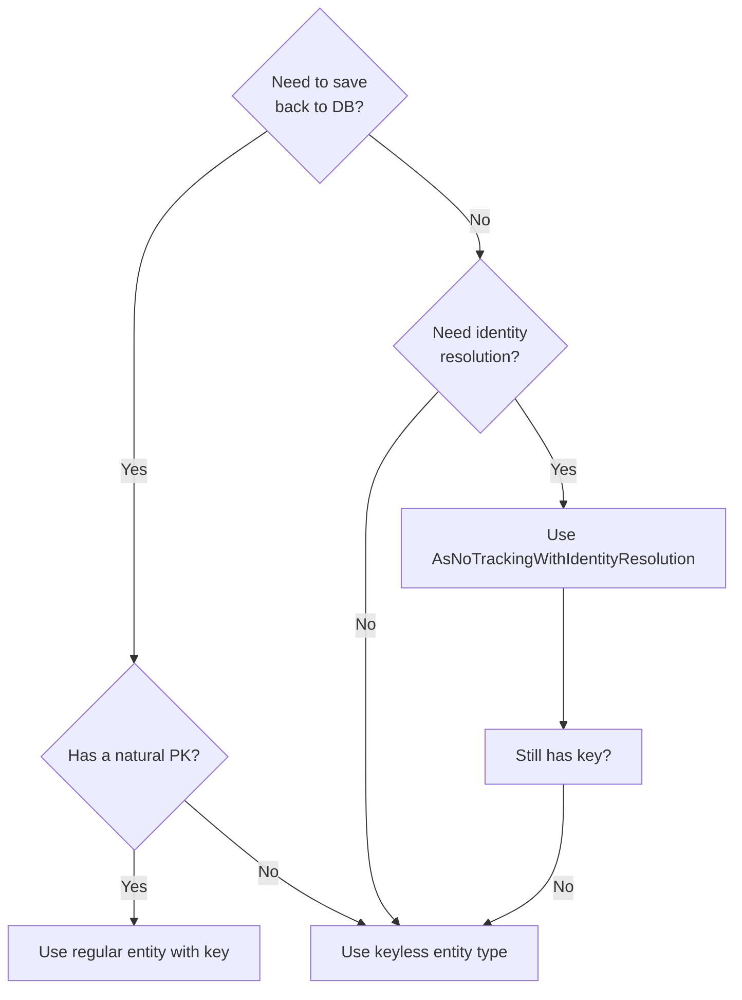
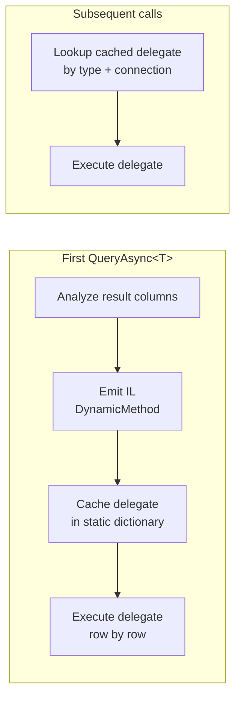
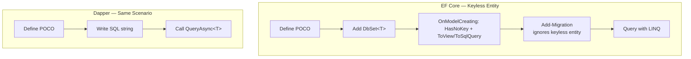
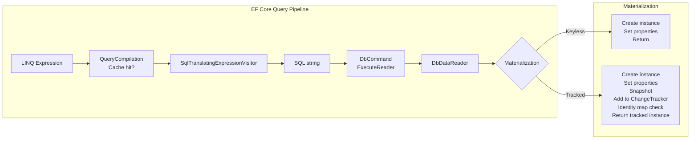

# 8.905 Keyless Entity Types — Projections in EF Core

## Overview — What Keyless Entity Types Solve

Keyless entity types (configured via `HasNoKey()`) allow EF Core to map database views, ad-hoc SQL queries, table-valued functions, and raw `FromSqlRaw()` results to POCOs that have **no primary key** and are **read-only**. Unlike regular entities, keyless types skip the `ChangeTracker` entirely — no identity resolution, no snapshotting, no state management. They exist purely for projection and reporting scenarios where you need to map query results to a shape that does not correspond to any table's schema.

EF Core 2.1 introduced keyless types under the name "query types" (`DbQuery<T>`). From EF Core 3.0 onward they merged into the regular `Entity<T>` configuration pathway but require the explicit `.HasNoKey()` fluent call. The underlying mechanism is identical: the type is registered in the model but the context never considers it for inserts, updates, or deletes.

Dapper has always treated all queries identically — it maps result rows to whatever POCO type you provide, with zero regard for keys, tracking, or model configuration. In Dapper every query is intrinsically "keyless" because Dapper has no concept of an entity model. This makes Dapper naturally suited for the same scenarios that drive EF Core developers toward keyless types.

```mermaid
flowchart LR
    subgraph EF_Core ["EF Core Keyless Path"]
        A1[POCO<br/>No [Key] attribute] --> B1[OnModelCreating<br/>HasNoKey]
        B1 --> C1[ToView or ToSqlQuery]
        C1 --> D1[SELECT projection]
    end
    subgraph Dapper ["Dapper Path"]
        A2[Any POCO] --> B2[Query&lt;T&gt; or QueryAsync&lt;T&gt;]
        B2 --> C2[SELECT projection]
    end
```

### Historical Context

Before keyless types existed, EF Core developers had two unsatisfying options for read-only projections:

1. Define a full entity with a key, map it to a view, and risk accidental `SaveChanges` attempts throwing or silently doing nothing.
2. Use `Select()` projections to anonymous types or hand-crafted DTOs, losing the ability to use `Include`, `ThenInclude`, or pass the query shape around.

Keyless types provide a middle ground: a named, reusable type mapped to a query source that is explicitly read-only and understood by the EF Core model builder.

### Conceptual Diagram — Identity Resolution Skip

```mermaid
flowchart TD
    subgraph Regular_Entity ["Regular Entity — With Key"]
        RE1[Entity with PK] --> RE2[ChangeTracker activated]
        RE2 --> RE3[Identity map<br/>first query caches]
        RE3 --> RE4[Same PK = same instance]
        RE4 --> RE5[Can call SaveChanges]
    end
    subgraph Keyless_Type ["Keyless Entity Type — No Key"]
        KT1[POCO with HasNoKey] --> KT2[ChangeTracker skipped]
        KT2 --> KT3[No identity map]
        KT3 --> KT4[Each row = new instance<br/>even duplicate rows]
        KT4 --> KT5[Read-only<br/>SaveChanges ignores]
    end
```



---

## Use Cases — When Keyless Types Shine

The primary drivers for reaching for keyless entity types are projection, view mapping, and raw SQL composition within the EF Core pipeline. Below are the most common scenarios alongside their Dapper equivalents.

### Scenario 1 — Database View Mapping

You have a SQL view that joins multiple tables and you want to query it through EF Core without treating it as a table.

```sql
CREATE VIEW vw_OrderSummary AS
SELECT
    o.Id               AS OrderId,
    o.OrderDate,
    c.FullName         AS CustomerName,
    c.Email            AS CustomerEmail,
    COUNT(oi.Id)       AS LineItemCount,
    SUM(oi.Quantity * oi.UnitPrice) AS TotalAmount
FROM Orders o
JOIN Customers c ON c.Id = o.CustomerId
JOIN OrderItems oi ON oi.OrderId = o.Id
GROUP BY o.Id, o.OrderDate, c.FullName, c.Email;
```

### Scenario 2 — Ad-Hoc Raw SQL Projections

You need to execute a complex, database-specific query (e.g., recursive CTE, full-text search, window function with `FROM`-clause subquery) that LINQ cannot express.

```sql
SELECT
    p.Id,
    p.Title,
    p.CreatedAt,
    ROW_NUMBER() OVER (PARTITION BY p.CategoryId ORDER BY p.CreatedAt DESC) AS Rn
FROM Posts p
WHERE p.IsPublished = 1;
```

### Scenario 3 — Table-Valued Function Mapping

A TVF encapsulates business logic in the database and returns a rowset that cannot be mapped to any existing table entity.

```sql
CREATE FUNCTION dbo.GetMonthlySalesReport(
    @Year INT,
    @Month INT
)
RETURNS TABLE
AS
RETURN
    SELECT
        c.Id                   AS CustomerId,
        c.FullName             AS CustomerName,
        COUNT(o.Id)            AS OrderCount,
        SUM(o.TotalAmount)     AS TotalSpent,
        AVG(o.TotalAmount)     AS AvgOrderValue
    FROM Customers c
    JOIN Orders o ON o.CustomerId = c.Id
    WHERE YEAR(o.OrderDate) = @Year
      AND MONTH(o.OrderDate) = @Month
    GROUP BY c.Id, c.FullName;
```

### Scenario 4 — Reporting / Dashboard Aggregations

Reporting screens often need denormalized, aggregated data that spans multiple tables. Keyless types keep these projections explicit and testable.

### Decision Flowchart



---

## EF Core Implementation — Configuration and Querying

### Step 1 — Define the POCO

No `[Key]` attribute, no `[DatabaseGenerated]`, no `[Required]` on properties that would normally be FK columns. Just a plain CLR type.

```csharp
public class OrderSummary
{
    public int OrderId { get; set; }
    public DateTime OrderDate { get; set; }
    public string CustomerName { get; set; } = string.Empty;
    public string CustomerEmail { get; set; } = string.Empty;
    public int LineItemCount { get; set; }
    public decimal TotalAmount { get; set; }
}
```

### Step 2 — Configure in OnModelCreating

Use the `Entity<T>()` method followed by `.HasNoKey()` and one of the source-mapping methods: `.ToView()`, `.ToSqlQuery()`, or `.ToFunction()`.

```csharp
protected override void OnModelCreating(ModelBuilder modelBuilder)
{
    // Option A — Map to a database view
    modelBuilder.Entity<OrderSummary>(entity =>
    {
        entity.HasNoKey();
        entity.ToView("vw_OrderSummary");
        entity.Property(e => e.TotalAmount).HasColumnType("decimal(18,2)");
    });

    // Option B — Map to an ad-hoc SQL query
    modelBuilder.Entity<PostRanking>(entity =>
    {
        entity.HasNoKey();
        entity.ToSqlQuery(@"
            SELECT
                p.Id,
                p.Title,
                p.CreatedAt,
                ROW_NUMBER() OVER (
                    PARTITION BY p.CategoryId
                    ORDER BY p.CreatedAt DESC
                ) AS Rn
            FROM Posts p
            WHERE p.IsPublished = 1");
    });

    // Option C — Map to a TVF
    modelBuilder.Entity<MonthlySalesReport>(entity =>
    {
        entity.HasNoKey();
        entity.ToFunction("dbo.GetMonthlySalesReport");
    });
}
```

### Step 3 — Add DbSet Properties

Keyless entities can be exposed as `DbSet<T>` properties on the `DbContext`. The set will support query operations but throw on `Add`, `Update`, `Remove`, and `SaveChanges` (or silently skip them depending on the operation).

```csharp
public class ReportingDbContext : DbContext
{
    public DbSet<OrderSummary> OrderSummaries => Set<OrderSummary>();
    public DbSet<PostRanking> PostRankings => Set<PostRanking>();
    public DbSet<MonthlySalesReport> MonthlySalesReports => Set<MonthlySalesReport>();

    protected override void OnModelCreating(ModelBuilder modelBuilder)
    {
        // configurations above
    }
}
```

### Step 4 — Querying Keyless Types

Query keyless entities the same way as regular entities, but the generated SQL reflects the source mapping.

```csharp
// Querying a view — EF generates SELECT from the view
var summaries = await context.OrderSummaries
    .Where(s => s.TotalAmount > 1000m)
    .OrderByDescending(s => s.TotalAmount)
    .Take(20)
    .ToListAsync();
```

Generated SQL:
```sql
SELECT TOP(20) [s].[OrderId], [s].[OrderDate], [s].[CustomerName],
       [s].[CustomerEmail], [s].[LineItemCount], [s].[TotalAmount]
FROM [vw_OrderSummary] AS [s]
WHERE [s].[TotalAmount] > 1000.0
ORDER BY [s].[TotalAmount] DESC
```

### Step 5 — Raw SQL with Keyless Types

Keyless types work with `FromSqlRaw` / `FromSqlInterpolated`, which is useful when the view or TVF approach is insufficient.

```csharp
var results = await context.OrderSummaries
    .FromSqlRaw(@"
        SELECT o.Id, o.OrderDate, c.FullName AS CustomerName,
               c.Email AS CustomerEmail,
               COUNT(oi.Id) AS LineItemCount,
               SUM(oi.Quantity * oi.UnitPrice) AS TotalAmount
        FROM Orders o
        JOIN Customers c ON c.Id = o.CustomerId
        JOIN OrderItems oi ON oi.OrderId = o.Id
        GROUP BY o.Id, o.OrderDate, c.FullName, c.Email
        HAVING SUM(oi.Quantity * oi.UnitPrice) > {0}", minAmount)
    .ToListAsync();
```

### Step 6 — Composing on ToSqlQuery

When EF Core composes LINQ operators on top of a `ToSqlQuery`, it wraps the query as a subquery:

```csharp
var topByCategory = await context.PostRankings
    .Where(r => r.Rn <= 3)
    .OrderBy(r => r.CategoryId)
    .ThenByDescending(r => r.Rn)
    .ToListAsync();
```

Generated SQL:
```sql
SELECT [r].[Id], [r].[Title], [r].[CreatedAt], [r].[Rn]
FROM (
    SELECT p.Id, p.Title, p.CreatedAt,
           ROW_NUMBER() OVER (
               PARTITION BY p.CategoryId
               ORDER BY p.CreatedAt DESC
           ) AS Rn
    FROM Posts p
    WHERE p.IsPublished = 1
) AS [r]
WHERE [r].[Rn] <= 3
ORDER BY [r].[CategoryId], [r].[Rn] DESC
```

### Step 7 — TVF Query with Parameters

```csharp
var report = await context.MonthlySalesReports
    .FromSqlInterpolated(
        $"SELECT * FROM dbo.GetMonthlySalesReport({year}, {month})")
    .Where(r => r.TotalSpent > 500)
    .ToListAsync();
```

---

## Dapper Implementation — The Natural Equivalent

Dapper does not distinguish between keyed and keyless types. Every query goes through `Query<T>` or `QueryAsync<T>` and maps columns to properties by name. There is no model configuration step.

### View Mapping with Dapper

```csharp
public class OrderSummary
{
    public int OrderId { get; set; }
    public DateTime OrderDate { get; set; }
    public string CustomerName { get; set; } = string.Empty;
    public string CustomerEmail { get; set; } = string.Empty;
    public int LineItemCount { get; set; }
    public decimal TotalAmount { get; set; }
}

// Query the view directly — Dapper maps each row
const string sql = "SELECT OrderId, OrderDate, CustomerName, " +
                   "CustomerEmail, LineItemCount, TotalAmount " +
                   "FROM vw_OrderSummary " +
                   "WHERE TotalAmount > @MinAmount " +
                   "ORDER BY TotalAmount DESC " +
                   "OFFSET 0 ROWS FETCH NEXT 20 ROWS ONLY";

var summaries = await connection.QueryAsync<OrderSummary>(sql,
    new { MinAmount = 1000m });
```

### Raw SQL Projection with Dapper

```csharp
public class PostRanking
{
    public int Id { get; set; }
    public string Title { get; set; } = string.Empty;
    public DateTime CreatedAt { get; set; }
    public int Rn { get; set; }
}

const string sql = @"
    SELECT p.Id, p.Title, p.CreatedAt,
           ROW_NUMBER() OVER (
               PARTITION BY p.CategoryId
               ORDER BY p.CreatedAt DESC
           ) AS Rn
    FROM Posts p
    WHERE p.IsPublished = 1";

var rankings = await connection.QueryAsync<PostRanking>(sql);

// Filter in memory or wrap in a subquery
const string filteredSql = @"
    SELECT * FROM (
        SELECT p.Id, p.Title, p.CreatedAt,
               ROW_NUMBER() OVER (
                   PARTITION BY p.CategoryId
                   ORDER BY p.CreatedAt DESC
               ) AS Rn
        FROM Posts p
        WHERE p.IsPublished = 1
    ) r
    WHERE r.Rn <= 3
    ORDER BY r.CreatedAt DESC";

var topRankings = await connection.QueryAsync<PostRanking>(filteredSql);
```

### TVF Call with Dapper

```csharp
public class MonthlySalesReport
{
    public int CustomerId { get; set; }
    public string CustomerName { get; set; } = string.Empty;
    public int OrderCount { get; set; }
    public decimal TotalSpent { get; set; }
    public decimal AvgOrderValue { get; set; }
}

var report = await connection.QueryAsync<MonthlySalesReport>(
    "dbo.GetMonthlySalesReport",
    new { Year = 2026, Month = 6 },
    commandType: CommandType.StoredProcedure);

// With filtering — Dapper does not compose, you filter in SQL
var filtered = await connection.QueryAsync<MonthlySalesReport>(@"
    SELECT * FROM dbo.GetMonthlySalesReport(@Year, @Month) r
    WHERE r.TotalSpent > @MinSpent",
    new { Year = 2026, Month = 6, MinSpent = 500m });
```

### Dapper Multiple Result Sets vs Single Projection

When you need multiple aggregated projections in one round trip, use `QueryMultiple`:

```csharp
using var multi = await connection.QueryMultipleAsync(@"
    SELECT COUNT(*) FROM Orders WHERE OrderDate >= @Since;
    SELECT SUM(TotalAmount) FROM Orders WHERE OrderDate >= @Since;
    SELECT AVG(TotalAmount) FROM Orders WHERE OrderDate >= @Since;",
    new { Since = DateTime.UtcNow.AddMonths(-1) });

var orderCount   = await multi.ReadSingleAsync<int>();
var totalRevenue = await multi.ReadSingleAsync<decimal>();
var avgOrderVal  = await multi.ReadSingleAsync<decimal>();
```

### Dapper — Type Mapping Cache Internals

Dapper caches the IL code it emits for mapping each unique result shape per connection. This means the first call to `QueryAsync<OrderSummary>` incurs the cost of IL emit, but subsequent calls reuse the cached delegate:



---

## Comparison — EF Core Keyless vs Dapper

### Feature Matrix

| Feature | EF Core Keyless Entity | Dapper (Always Keyless) |
|---|---|---|
| Model configuration required | Yes — `HasNoKey` + source | No — just query |
| View mapping | `ToView("vw_Name")` | `QueryAsync<T>("SELECT ...")` |
| TVF mapping | `ToFunction("fn_Name")` | Stored procedure call |
| Ad-hoc SQL | `ToSqlQuery(...)` | Direct SQL string |
| LINQ composition on top | Yes — subquery wrapping | No — raw SQL only |
| Change tracking | Never | Never |
| Identity resolution | None (duplicate rows = duplicate instances) | None |
| INSERT/UPDATE/DELETE | Not supported | Not supported (Dapper never writes) |
| Type caching | EF model cache | IL-emit delegate cache |
| Migration tracked | No (excluded from migrations) | N/A |
| Testability via DbContext mocking | Yes | No (requires real connection) |

### Complexity Comparison



### When Each Approach Wins

**Choose EF Core keyless types when:**
- You want LINQ composition on top of a view or TVF
- You already use EF Core and want model-level documentation
- You need to share the projection shape across many queries
- You want compile-time safety via `DbSet<T>` and `IQueryable<T>`

**Choose Dapper when:**
- You want maximum control over the SQL
- The projection is used in only one or two places
- You are already outside the EF Core context (e.g., in a reporting module that uses `SqlConnection` directly)
- You need to execute highly optimized, database-specific SQL (CTEs, window functions, pivot, full-text)

---

## Performance Considerations — Keyless Overhead

### EF Core Keyless Query Overhead

Keyless entities still go through the EF Core query pipeline: LINQ expression tree → `IQueryable` translation → SQL generation → `DbDataReader` materialization. The savings come from skipping `ChangeTracker` operations:



### Dapper Overhead

Dapper's overhead is limited to:
1. Column-to-property matching (first call: IL emit; subsequent: cached delegate)
2. `DbDataReader` iteration and property assignment

No `ChangeTracker`, no identity map, no snapshotting — so Dapper is always in "keyless mode."

### Benchmark (Rough Orders of Magnitude)

| Scenario | Memory/row | CPU/1000 rows |
|---|---|---|
| EF Core — Tracked entity | ~400 bytes | ~15 ms |
| EF Core — Keyless entity | ~120 bytes | ~8 ms |
| EF Core — `Select()` projection to DTO | ~80 bytes | ~5 ms |
| Dapper — `QueryAsync<T>` | ~80 bytes | ~3 ms |
| ADO.NET raw `SqlDataReader` | ~40 bytes | ~1 ms |

### Keyless vs `Select()` Projection

A `Select()` projection to a DTO (anonymous or named) is often **faster** and **more memory-efficient** than a keyless entity because EF Core generates a more streamlined SQL projection and skips materialization through the entity type's `EntityMaterializerSource`. However, keyless entities are reusable and can be passed as `IQueryable<T>` results through layers — something `Select()` projections cannot do without complex generic wrappers.

```csharp
// Option 1 — Keyless entity (reusable, composable)
IQueryable<OrderSummary> baseQuery = context.OrderSummaries;
var result = await baseQuery.Where(s => s.TotalAmount > 100).ToListAsync();

// Option 2 — Select projection (faster, but inline-only)
var result = await context.Orders
    .Select(o => new OrderSummary
    {
        OrderId = o.Id,
        OrderDate = o.OrderDate,
        CustomerName = o.Customer.FullName,
        // ...
    })
    .Where(x => x.TotalAmount > 100)
    .ToListAsync();
```

---

## Pitfalls and Gotchas — Common Mistakes

### 1. Change Tracking Disabled — Cannot Update

Keyless entities are never tracked. If you query a keyless entity, modify its properties, and call `SaveChanges`, the context will not detect changes:

```csharp
var summary = await context.OrderSummaries.FirstAsync();
summary.TotalAmount = 9999;          // No-op
await context.SaveChangesAsync();    // Nothing saved
```

**Fix:** Use a regular entity with a key if you need to write back.

### 2. No Identity Resolution

Because keyless entities have no key, EF Core cannot deduplicate rows. If the underlying SQL returns duplicate rows (due to JOINs or UNIONs), you get duplicate CLR objects:

```csharp
// Returns a list with duplicates if the view contains duplicates
var summaries = await context.OrderSummaries.ToListAsync();
```

**Fix:** Use `.Distinct()` in LINQ or fix the view/query SQL to return unique rows.

### 3. ToSqlQuery Must Be Composable

EF Core wraps a `ToSqlQuery` as a subquery when you apply `Where`, `OrderBy`, `Skip`, or `Take`. The wrapping only works if the query is a valid table source (i.e., it returns a rowset with stable column names). Avoid `SELECT *` and `TOP` without `ORDER BY` in the `ToSqlQuery` because EF Core may generate invalid SQL:

```csharp
// Problematic — TOP without ORDER BY inside a subquery is invalid in SQL Server
modelBuilder.Entity<PostRanking>(entity =>
{
    entity.HasNoKey();
    entity.ToSqlQuery("SELECT TOP 10 * FROM Posts");
});

// EF Core might generate:
// SELECT * FROM (SELECT TOP 10 * FROM Posts) AS [r]
// WHERE [r].[Rn] <= 3
// ORDER BY [r].[Rn]          -- ORDER BY in outer query, TOP without ORDER BY in inner = undefined
```

**Fix:** Always include `ORDER BY` in the `ToSqlQuery` if you use `TOP` / `OFFSET-FETCH`.

### 4. ToView Requires the View to Exist in the Database

Unlike `ToTable`, which EF Core creates via migrations, `ToView` assumes the view already exists. Migrations will not create, alter, or drop the view. You must manage the DDL separately:

```sql
-- Manual migration step
CREATE VIEW vw_OrderSummary AS
SELECT /* ... */ ;
```

### 5. ToFunction Mapping Limitations

`ToFunction()` maps to a TVF but has restrictions:
- The TVF must be a table-valued function (not a scalar function)
- Parameters must be passed via `FromSqlInterpolated` or `FromSqlRaw`
- LINQ composition on top of a `ToFunction` is supported only in recent EF Core versions (5.0+)
- The function must return a table type compatible with the entity's properties

### 6. DbSet<T> Add/Remove/Update Throws on SaveChanges

Calling `Add()`, `Remove()`, or `Update()` on a keyless `DbSet<T>` adds an entity to the `ChangeTracker` with `Added`/`Deleted`/`Modified` state, but `SaveChanges` throws:

```csharp
context.OrderSummaries.Add(new OrderSummary { /* ... */ });
await context.SaveChangesAsync();
// Throws: "The keyless entity type 'OrderSummary' cannot be added to the store"
```

**Fix:** Never call mutation methods on keyless `DbSet<T>`.

### 7. Lazy Loading Is Not Supported

Keyless entities cannot be lazy-loaded because there is no key for the proxy to use to issue follow-up queries. Attempting to use `[IsDependency]` or lazy-loading navigation properties will fail.

### 8. Conventions That Still Apply

Some EF Core conventions still fire on keyless types:
- Pluralization convention lowercases `DbSet<T>` property name for the table/view name
- Column ordering via `[Column(Order = n)]` still works
- `[NotMapped]` properties are ignored as expected
- `[Owned]` types cannot be keyless

### 9. JSON Columns and Keyless Types

In EF Core 7.0+, you can map JSON columns to keyless owned entities, but the keyless type itself cannot be the JSON column — it must be owned by a regular entity.

### 10. Migrations Ignore Keyless Types — But Scaffolding Does Not

When reverse-engineering a database (scaffolding), EF Core generates keyless entity types for views and tables without primary keys. This is helpful but can produce unexpected results if a table has no PK but should have one. Always review scaffolded code.

### 11. Inferring Keyless from Lack of Key

EF Core infers a type as keyless if it has no properties named `Id` or `{TypeName}Id` and no `[Key]` attribute. This inference can cause subtle bugs where you accidentally create a keyless entity for a table that should be writable.

```csharp
// EF Core sees no Id property and infers keyless
public class Customer
{
    public int CustomerNumber { get; set; }  // Not recognized as PK
    public string Name { get; set; }
}
```

**Fix:** Always explicitly configure `HasKey()` or `HasNoKey()`.

### 12. Identity Insert and Keyless Types

Even if the underlying table has an `IDENTITY` column, keyless types cannot participate in identity insert operations because they are read-only at the EF Core level.

---

## Best Practices — Recommendations

### 1. Prefer ToView over ToSqlQuery

When the query is stable and reusable across multiple applications, create a database view and map it with `ToView`. Views are DDL-managed, indexed, and composable. `ToSqlQuery` embeds SQL in the model, which is harder to tune and maintain.

```csharp
modelBuilder.Entity<OrderSummary>(entity =>
{
    entity.HasNoKey();
    entity.ToView("vw_OrderSummary");
});
```

### 2. Keep the POCO in the Same Project as the DbContext

Keyless entity types are part of the EF Core model and should be kept close to the `DbContext` that maps them. If you need to share the projection shape with other assemblies, define the POCO in a shared contracts/abstractions library and configure the mapping in the infrastructure project.

### 3. Use a Separate DbContext for Read-Only Queries

Create a dedicated read-only `DbContext` that exposes only keyless types:

```csharp
public class ReportingDbContext : DbContext
{
    public DbSet<OrderSummary> OrderSummaries => Set<OrderSummary>();

    public ReportingDbContext(DbContextOptions<ReportingDbContext> options)
        : base(options) { }

    protected override void OnModelCreating(ModelBuilder modelBuilder)
    {
        modelBuilder.Entity<OrderSummary>(entity =>
        {
            entity.HasNoKey();
            entity.ToView("vw_OrderSummary");
        });
    }
}
```

This prevents accidental writes and keeps the write model clean.

### 4. Name the POCO to Reflect Its Source

Use naming conventions that signal the type is a projection:

- `OrderSummary` (not `Order`)
- `MonthlySalesReport` (not `SalesReportEntity`)
- `CustomerOrderStats` (not `Customer`)

Avoid suffixes like `Entity` or `Dto` if the type is exposed as a `DbSet<T>` — it may confuse other developers.

### 5. Configure Column Types Explicitly

Views and TVFs may return types that EF Core cannot infer (e.g., `decimal(18,2)` vs `decimal(38,6)`). Configure column types explicitly:

```csharp
entity.Property(e => e.TotalAmount).HasColumnType("decimal(18,2)");
entity.Property(e => e.CreatedAt).HasColumnType("datetime2(3)");
```

### 6. Test Keyless Queries with Integration Tests

Keyless types cannot be mocked easily because they depend on the actual database view or SQL. Write integration tests that:
1. Create the database schema (including views) via a test migration or script
2. Seed test data
3. Execute queries against the keyless type
4. Assert the shape and values of the results

```csharp
[Fact]
public async Task OrderSummary_view_returns_aggregated_data()
{
    // Arrange
    await using var context = CreateReportingDbContext();
    await SeedTestData(context);

    // Act
    var summaries = await context.OrderSummaries.ToListAsync();

    // Assert
    Assert.NotEmpty(summaries);
    Assert.All(summaries, s =>
    {
        Assert.True(s.TotalAmount >= 0);
        Assert.False(string.IsNullOrWhiteSpace(s.CustomerName));
    });
}
```

### 7. Avoid Navigation Properties on Keyless Types

Keyless types can have navigation properties mapped to regular entities, but this creates a confusing hybrid. The navigation may trigger lazy loading (which doesn't work) or eager loading (which may generate unexpected JOINs). Keep keyless types flat.

### 8. Document the Underlying SQL

Add a comment or XML doc on the keyless POCO pointing to the SQL view definition or `ToSqlQuery`:

```csharp
/// <summary>
/// Maps to vw_OrderSummary.
/// SELECT o.Id, o.OrderDate, c.FullName AS CustomerName, ...
/// This view is created in migration script V2026_06_27_001.
/// </summary>
public class OrderSummary
{
    // properties
}
```

### 9. Consider Database-Performance Impact of Views

Views can conceal poor query performance. Monitor the queries EF Core generates from keyless types. A view that performs well in SSMS may perform poorly when EF Core wraps it in a subquery with additional filtering. Use `EXPLAIN` / `SET STATISTICS IO ON` to analyze.

### 10. Use `AsNoTracking()` Even on Keyless Types for Clarity

While keyless types are never tracked, adding `.AsNoTracking()` clarifies intent for readers who may not know the mapping:

```csharp
var summaries = await context.OrderSummaries
    .AsNoTracking()    // Explicit: "this is read-only"
    .Where(s => s.TotalAmount > 100)
    .ToListAsync();
```

### 11. Avoid Keyless Types as DTOs in Public APIs

If the projection is returned from a Web API or gRPC endpoint, consider mapping to a dedicated DTO. This decouples the database schema shape from the API contract.

```csharp
// Controller action
[HttpGet("summaries")]
public async Task<ActionResult<List<OrderSummaryDto>>> GetSummaries()
{
    var summaries = await context.OrderSummaries
        .Where(s => s.TotalAmount > 100)
        .ToListAsync();

    return summaries.Select(s => new OrderSummaryDto
    {
        Id = s.OrderId,
        Date = s.OrderDate,
        Customer = s.CustomerName,
        Total = s.TotalAmount
    }).ToList();
}
```

### 12. Compose with Compiled Queries for Hot Paths

For frequently-executed keyless queries, wrap them with `EF.CompileQuery`:

```csharp
private static readonly Func<ReportingDbContext, decimal, IAsyncEnumerable<OrderSummary>>
    GetHighValueSummaries = EF.CompileAsyncQuery<ReportingDbContext, decimal, OrderSummary>(
        (ctx, minAmount) =>
            ctx.OrderSummaries.Where(s => s.TotalAmount >= minAmount)
                              .OrderByDescending(s => s.TotalAmount)
                              .Take(100));
```

### 13. Use Raw SQL with Dapper for One-Off Projections

If a projection is used in a single reporting endpoint and you already use Dapper elsewhere in the project, don't add an EF Core keyless type just for this. Write the SQL directly:

```csharp
[HttpGet("order-stats")]
public async Task<ActionResult<List<OrderStats>>> GetOrderStats(
    [FromServices] SqlConnection db,
    [FromQuery] DateTime since)
{
    var stats = await db.QueryAsync<OrderStats>(@"
        SELECT
            o.Id,
            o.OrderDate,
            c.FullName AS CustomerName,
            SUM(oi.Quantity * oi.UnitPrice) AS TotalAmount
        FROM Orders o
        JOIN Customers c ON c.Id = o.CustomerId
        JOIN OrderItems oi ON oi.OrderId = o.Id
        WHERE o.OrderDate >= @Since
        GROUP BY o.Id, o.OrderDate, c.FullName
        ORDER BY TotalAmount DESC",
        new { Since = since });

    return Ok(stats);
}
```

### 14. Validate Column Name Alignment

EF Core matches columns by name (case-insensitive by default). If the SQL column name differs from the property name, use `[Column("column_name")]` or the fluent `HasColumnName()`:

```csharp
modelBuilder.Entity<OrderSummary>(entity =>
{
    entity.HasNoKey();
    entity.ToView("vw_OrderSummary");
    entity.Property(e => e.TotalAmount)
          .HasColumnName("total_amount")
          .HasColumnType("decimal(18,2)");
});
```

### 15. Avoid SELECT * in ToSqlQuery

Always specify columns explicitly in `ToSqlQuery`. `SELECT *` makes the query fragile to schema changes and may return columns EF Core cannot map.

```csharp
// BAD
entity.ToSqlQuery("SELECT * FROM vw_OrderSummary");

// GOOD
entity.ToSqlQuery(@"
    SELECT OrderId, OrderDate, CustomerName,
           CustomerEmail, LineItemCount, TotalAmount
    FROM vw_OrderSummary");
```

---

## References — Related Notes and Resources

- [[8.904 — Database View Mapping in EF Core]] — Detailed view mapping before keyless types
- [[8.906 — Compiled Queries — EF.CompileQuery]] — Combine keyless types with compiled queries
- [[8.908 — No-Tracking Queries — AsNoTracking]] — Read-only query patterns
- [[3.050 — EF Core — Keyless Entity Types]] — General EF Core note on keyless types
- [[8.853 — Dapper — QueryT — Basic Querying]] — Dapper's fundamental query method
- [[8.873 — Dapper — Performance — IL Emit Internals]] — Dapper's type mapping cache internals
- [[3.001 — DbContext and Change Tracking Fundamentals]] — Prerequisite for understanding tracking vs non-tracking

### External Resources

- Microsoft Docs: [Keyless Entity Types](https://docs.microsoft.com/en-us/ef/core/modeling/keyless-entity-types)
- Microsoft Docs: [Compiled Queries](https://docs.microsoft.com/en-us/ef/core/performance/compiled-queries)
- Dapper GitHub: [Dapper Documentation](https://github.com/DapperLib/Dapper)
- .NET Blog: [Entity Framework Core 2.1 Query Types](https://devblogs.microsoft.com/dotnet/announcing-entity-framework-core-2-1/#query-types)

### Migration Script Example for View Creation

```sql
-- Migration: V2026_06_27_001_Create_vw_OrderSummary
CREATE VIEW vw_OrderSummary AS
SELECT
    o.Id               AS OrderId,
    o.OrderDate,
    c.FullName         AS CustomerName,
    c.Email            AS CustomerEmail,
    COUNT(oi.Id)       AS LineItemCount,
    SUM(oi.Quantity * oi.UnitPrice) AS TotalAmount
FROM Orders o
JOIN Customers c ON c.Id = o.CustomerId
JOIN OrderItems oi ON oi.OrderId = o.Id
GROUP BY o.Id, o.OrderDate, c.FullName, c.Email;
GO
```

### EF Core to Dapper Migration Cheatsheet

| EF Core Pattern | Dapper Equivalent |
|---|---|
| `context.OrderSummaries.ToListAsync()` | `db.QueryAsync<OrderSummary>("SELECT ...")` |
| `context.OrderSummaries.Where(s => s.TotalAmount > 100)` | SQL `WHERE` clause |
| `ToView("vw_OrderSummary")` | No config; just write `SELECT * FROM vw_OrderSummary` |
| `ToSqlQuery("SELECT ...")` | Same SQL string passed to `QueryAsync` |
| `.FromSqlRaw("SELECT ...")` | Direct `QueryAsync<T>` |
| `HasNoKey()` | Default behavior — no config |
| LINQ composition (Where/OrderBy/etc.) | Must write complete SQL with clauses |
| No change tracking | Always no tracking |

### Summary

Keyless entity types bridge the gap between EF Core's entity-centric model and read-only projection requirements. They are the preferred EF Core approach for database views, TVFs, and raw SQL results that need LINQ composability. Dapper, by design, treats every query as keyless, making it the simpler choice for pure read-only scenarios where full SQL control is desired. Choose the tool based on whether you need LINQ composition (EF Core keyless) or maximum SQL control with minimal abstraction (Dapper).
