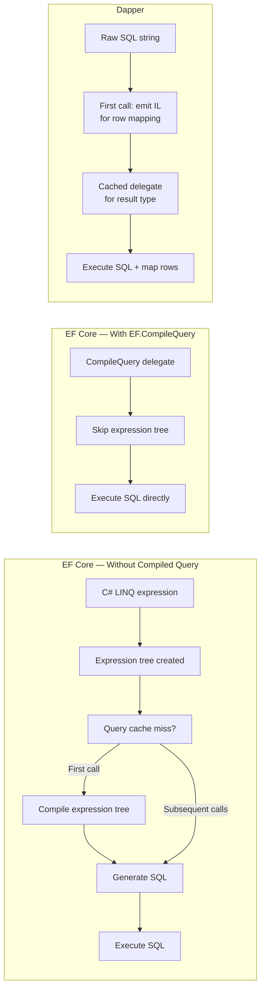
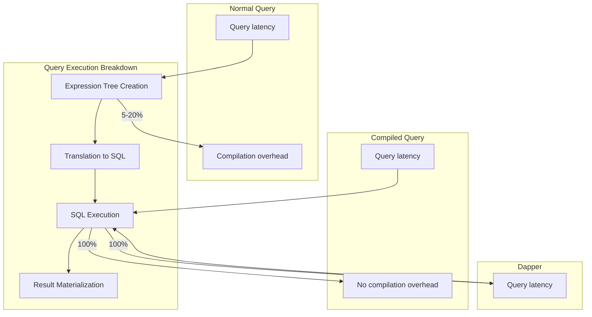
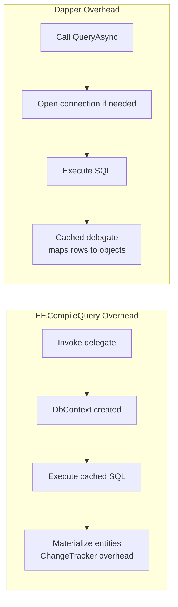
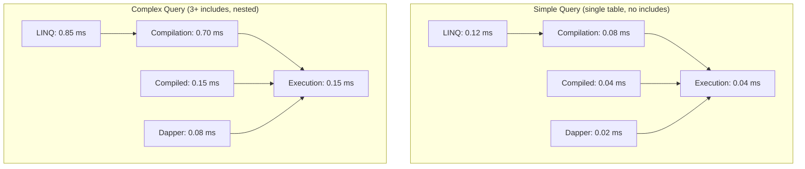

# 8.906 Compiled Queries — EF.CompileQuery

## Overview — What Compiled Queries Solve

Every EF Core LINQ query goes through a pipeline: expression tree creation, translation to SQL via `SqlTranslatingExpressionVisitor`, query cache lookup, and optional parameterization. The first time a given LINQ query shape executes, EF Core compiles it — traversing the expression tree, visiting each node, and producing canonical SQL. This compilation step has non-trivial CPU cost, especially for complex queries with many `Include`, `ThenInclude`, `Select`, `Where`, and `OrderBy` calls.

`EF.CompileQuery` and `EF.CompileAsyncQuery` allow you to pre-compile a LINQ query into a delegate that skips the expression tree analysis on every invocation. The delegate is compiled once and cached for the application's lifetime. For hot-path queries executed hundreds or thousands of times per second, this eliminates the per-call compilation overhead.

Dapper takes a fundamentally different approach: there is no LINQ expression tree, no query compilation pipeline, and no SQL generation. You write raw SQL — the database compiles the SQL query plan, not Dapper. Dapper's only per-type overhead is the IL emit for the row-mapping delegate, which is cached after the first call for a given result shape.



### What Gets Compiled

EF Core compiles the _query shape_, not the parameter values. The shape includes:
- Which `DbSet<T>` is the root
- Which LINQ operators are applied (`Where`, `Select`, `OrderBy`, `Include`, etc.)
- The order of operators
- The member accesses and method calls inside lambdas

Parameter values (e.g., `where x.Id == id`) are parameterized and substituted at execution time. This means a compiled query works for any parameter value without recompilation.

### The Performance Divide



---

## Use Cases — When to Reach for Compiled Queries

### High-Frequency Query Execution

The classic use case is a query executed hundreds of times per second in a tight loop — loading a user by ID on every request, fetching configuration for every API call, or looking up a product by slug on every page view.

```sql
-- Query pattern repeated for every request:
SELECT * FROM Users WHERE Id = @id
-- EF Core compiles the shape once, reuses it
```

### Hot Paths in Latency-Sensitive Applications

Financial trading, real-time dashboards, gaming leaderboards, or any system where sub-millisecond query overhead matters benefit from compiled queries. The 1-5 ms saved per query compounds significantly under load.

### Queries with Complex Expression Trees

The more complex the LINQ query, the more time EF Core spends compiling it. A query with multiple `Include`, `ThenInclude`, and conditional `Where` clauses may take 10-50 ms just to compile. Pre-compiling recovers that cost on every subsequent call.

### Batch Processing Loops

When iterating over thousands of items and executing the same query shape with different parameter values inside a loop:

```csharp
// Without compiled query — compiles on first iteration, but still has
// expression tree creation overhead
foreach (var id in userIds)
{
    var user = await context.Users
        .Include(u => u.Profile)
        .FirstOrDefaultAsync(u => u.Id == id);
    // ...
}

// With compiled query — zero expression tree overhead per iteration
foreach (var id in userIds)
{
    var user = await getUserById(context, id);
    // ...
}
```

### API Endpoints with Fixed Query Shapes

A REST endpoint that always queries the same shape but with different filter values is a natural candidate:

```
GET /api/products?category=books&minPrice=10&maxPrice=50
GET /api/products?category=electronics&minPrice=100&maxPrice=500
```

The shape is `Where(category == x && minPrice <= Price && Price <= maxPrice)`. Parameters change but the shape is identical.

---

## EF Core Implementation — EF.CompileQuery and EF.CompileAsyncQuery

### Basic Synchronous Compiled Query

```csharp
private static readonly Func<AppDbContext, int, User?> GetUserById =
    EF.CompileQuery<AppDbContext, int, User>(
        (ctx, id) => ctx.Users
            .Include(u => u.Profile)
            .FirstOrDefault(u => u.Id == id));

// Usage
var user = GetUserById(context, 42);
```

The `EF.CompileQuery` method takes an expression tree and returns a `Func<...>`. The generic type parameters follow this convention:

```
EF.CompileQuery<TDbContext, TParam1, TParam2, ..., TResult>(Expression<Func<...>>)
```

- First type parameter: the `DbContext` type (required)
- Middle type parameters: input parameters (up to 5-6 depending on overload)
- Last type parameter: the result type

### Async Compiled Query

```csharp
private static readonly Func<AppDbContext, int, IAsyncEnumerable<User>> =
    EF.CompileAsyncQuery<AppDbContext, int, User>(
        (ctx, id) => ctx.Users
            .Where(u => u.Id == id)
            .Include(u => u.Profile));

// Usage
await foreach (var user in GetUsersByCategory(context, 42))
{
    // process
}
```

Note that `EF.CompileAsyncQuery` returns `IAsyncEnumerable<T>`, not `Task<List<T>>`. The async version streams results via `await foreach`.

### Compiled Query with Multiple Parameters

```csharp
private static readonly Func<AppDbContext, int, int, IAsyncEnumerable<Order>> =
    EF.CompileAsyncQuery<AppDbContext, int, int, Order>(
        (ctx, customerId, year) =>
            ctx.Orders
                .Where(o => o.CustomerId == customerId
                         && o.OrderDate.Year == year)
                .OrderByDescending(o => o.OrderDate)
                .Take(20));

// Usage
await foreach (var order in GetRecentOrders(context, 123, 2026))
{
    // process
}
```

### Compiled Query with Multiple Includes and ThenInclude

```csharp
private static readonly Func<AppDbContext, int, Blog?> GetBlogWithPosts =
    EF.CompileQuery<AppDbContext, int, Blog>(
        (ctx, id) => ctx.Blogs
            .Include(b => b.Posts)
                .ThenInclude(p => p.Comments)
            .Include(b => b.Owner)
            .FirstOrDefault(b => b.Id == id));
```

Generated SQL (parameterized):
```sql
SELECT [b].[Id], [b].[Name], [b].[OwnerId],
       [p].[Id], [p].[BlogId], [p].[Title], [p].[Content],
       [c].[Id], [c].[PostId], [c].[Text], [c].[AuthorId]
FROM [Blogs] AS [b]
LEFT JOIN [Posts] AS [p] ON [b].[Id] = [p].[BlogId]
LEFT JOIN [Comments] AS [c] ON [p].[Id] = [c].[PostId]
WHERE [b].[Id] = @__id_0
ORDER BY [b].[Id], [p].[Id], [c].[Id]
```

### Compiled Query with AsNoTracking

Combining compiled queries with `AsNoTracking` maximizes performance for read-only hot paths:

```csharp
private static readonly Func<AppDbContext, decimal, IAsyncEnumerable<Product>> =
    EF.CompileAsyncQuery<AppDbContext, decimal, Product>(
        (ctx, minPrice) =>
            ctx.Products
                .AsNoTracking()
                .Where(p => p.Price >= minPrice)
                .OrderBy(p => p.Name)
                .Take(50));

// Usage
await foreach (var product in GetCheapProducts(context, 9.99m))
{
    // render
}
```

### Compiled Query with Select Projection

Compiled queries work with `Select` projections to DTOs:

```csharp
private static readonly Func<AppDbContext, int, ProductDto?> GetProductDto =
    EF.CompileQuery<AppDbContext, int, ProductDto>(
        (ctx, id) => ctx.Products
            .Where(p => p.Id == id)
            .Select(p => new ProductDto
            {
                Id = p.Id,
                Name = p.Name,
                Price = p.Price,
                CategoryName = p.Category.Name
            })
            .FirstOrDefault());
```

### Compiled Query Returning Scalar Values

```csharp
private static readonly Func<AppDbContext, int, int> GetOrderCountForCustomer =
    EF.CompileQuery<AppDbContext, int, int>(
        (ctx, customerId) =>
            ctx.Orders.Count(o => o.CustomerId == customerId));

// Usage
var count = GetOrderCountForCustomer(context, 42);
```

### Compiled Query with GroupBy

```csharp
private static readonly Func<AppDbContext, decimal, IAsyncEnumerable<CategorySummary>> =
    EF.CompileAsyncQuery<AppDbContext, decimal, CategorySummary>(
        (ctx, minTotal) =>
            from p in ctx.Products
            group p by p.CategoryId into g
            where g.Sum(p => p.Price) > minTotal
            select new CategorySummary
            {
                CategoryId = g.Key,
                TotalProducts = g.Count(),
                TotalValue = g.Sum(p => p.Price)
            });
```

Generated SQL:
```sql
SELECT [p].[CategoryId] AS [CategoryId],
       COUNT(*) AS [TotalProducts],
       SUM([p].[Price]) AS [TotalValue]
FROM [Products] AS [p]
GROUP BY [p].[CategoryId]
HAVING SUM([p].[Price]) > @__minTotal_0
```

### Compiled Query with Conditional Parameters

You can use ternary operators and null-coalescing in compiled queries, but the _shape_ must be fixed. Conditionals that change the structure (e.g., adding a `Where` clause only when a parameter is non-null) require separate compiled queries:

```csharp
// This works — shape is fixed, parameters vary
private static readonly Func<AppDbContext, string?, int, IAsyncEnumerable<Product>> =
    EF.CompileAsyncQuery<AppDbContext, string?, int, Product>(
        (ctx, category, minPrice) =>
            ctx.Products
                .Where(p => p.Category.Name == category
                         && p.Price >= minPrice)
                .OrderBy(p => p.Name)
                .Take(20));

// This does NOT work for compiled queries — conditional shape
// You need two separate compiled queries
// BAD:
static IQueryable<Product> GetFiltered(AppDbContext ctx, string? cat, decimal? min)
{
    IQueryable<Product> q = ctx.Products;
    if (cat != null) q = q.Where(p => p.Category.Name == cat);
    if (min != null) q = q.Where(p => p.Price >= min);
    return q.OrderBy(p => p.Name).Take(20);
}
```

### Compiled Query with Split Query

```csharp
private static readonly Func<AppDbContext, int, Blog?> GetBlogWithPostsSplit =
    EF.CompileQuery<AppDbContext, int, Blog>(
        (ctx, id) => ctx.Blogs
            .Include(b => b.Posts)
            .AsSplitQuery()
            .FirstOrDefault(b => b.Id == id));
```

Generated SQL (two queries):
```sql
-- Query 1: Blog
SELECT TOP(1) [b].[Id], [b].[Name], [b].[OwnerId]
FROM [Blogs] AS [b]
WHERE [b].[Id] = @__id_0

-- Query 2: Posts for blog
SELECT [p].[Id], [p].[BlogId], [p].[Title], [p].[Content]
FROM [Posts] AS [p]
WHERE EXISTS (SELECT 1 FROM [Blogs] AS [b]
              WHERE [b].[Id] = @__id_0 AND [b].[Id] = [p].[BlogId])
```

---

## Dapper Implementation — The Natural Equivalent

Dapper has no query compilation step. You provide the SQL string directly; Dapper passes it to `SqlCommand` and focuses exclusively on mapping result rows to objects. The only per-type overhead is the IL-emit delegate generation, which is cached after the first call.

### Basic Dapper Query (No Compilation Needed)

```csharp
public async Task<User?> GetUserByIdAsync(SqlConnection db, int id)
{
    return await db.QueryFirstOrDefaultAsync<User>(
        "SELECT * FROM Users WHERE Id = @Id",
        new { Id = id });
}
```

### Dapper with Multiple Calls — IL Emit Caching

```csharp
// First call: Dapper emits IL for mapping User
var user = await db.QueryFirstOrDefaultAsync<User>(
    "SELECT * FROM Users WHERE Id = @Id", new { Id = 1 });

// Subsequent calls: cached delegate — no IL emit
for (int i = 2; i <= 1000; i++)
{
    user = await db.QueryFirstOrDefaultAsync<User>(
        "SELECT * FROM Users WHERE Id = @Id", new { Id = i });
}
```

### Comparing Overhead: EF Compiled Query vs Dapper



### Dapper with QueryMultiple as Alternative to Multiple Compiled Queries

When you need multiple result sets in a single database round trip — something EF Core cannot do with compiled queries alone — Dapper's `QueryMultiple` shines:

```csharp
private static readonly Func<SqlConnection, int, Task<(User?, List<Order>, List<Payment>)>>
    GetCustomerDashboardData = async (db, customerId) =>
{
    using var multi = await db.QueryMultipleAsync(@"
        SELECT * FROM Users WHERE Id = @Id;
        SELECT * FROM Orders WHERE CustomerId = @Id ORDER BY OrderDate DESC;
        SELECT * FROM Payments WHERE CustomerId = @Id ORDER BY CreatedAt DESC;",
        new { Id = customerId });

    var user = await multi.ReadFirstOrDefaultAsync<User>();
    var orders = (await multi.ReadAsync<Order>()).AsList();
    var payments = (await multi.ReadAsync<Payment>()).AsList();

    return (user, orders, payments);
};
```

### Dapper — Performance Characteristics

| Scenario | First-call overhead | Subsequent-call overhead |
|---|---|---|
| EF Core — Normal LINQ | Expression tree compile (1-20 ms) | Query cache hit (~0.1 ms) |
| EF Core — Compiled query | `EF.CompileQuery` at startup | Delegate invoke (~0.01 ms) |
| Dapper — `QueryAsync<T>` | IL emit (0.5-2 ms) | Cached delegate (~0.005 ms) |
| ADO.NET — `SqlDataReader` | None | None |

### Dapper with Type Handlers for Custom Mapping

If the query returns types that need custom mapping, Dapper's `SqlMapper.TypeHandler<T>` handles the conversion without affecting the query path:

```csharp
public class DateTime2Handler : SqlMapper.TypeHandler<DateTime>
{
    public override DateTime Parse(object value)
    {
        return DateTime.SpecifyKind((DateTime)value, DateTimeKind.Utc);
    }

    public override void SetValue(IDbDataParameter parameter, DateTime value)
    {
        parameter.Value = value;
        parameter.DbType = DbType.DateTime2;
    }
}

// Register once at startup
SqlMapper.AddTypeHandler(new DateTime2Handler());
```

---

## Comparison — Compiled Queries in EF Core vs Dapper

### Conceptual Differences

| Aspect | EF.CompileQuery | Dapper |
|---|---|---|
| What gets cached | LINQ expression → SQL translation | IL delegate for row mapping |
| When compilation happens | At `EF.CompileQuery()` call (usually startup) | First `QueryAsync<T>` per type |
| Query language | LINQ (C# expressions) | Raw SQL |
| Shape changes | Requires new compiled query (new delegate) | Just change the SQL string |
| Dynamic composition | Not supported | Raw SQL concatenation (not recommended) |
| Async support | `EF.CompileAsyncQuery` → `IAsyncEnumerable` | `QueryAsync` → `IEnumerable<T>` |
| Parameter support | Up to 5-6 typed parameters | Any anonymous type / `DynamicParameters` |
| Cache invalidation | Never (for the delegate) | Never (for the delegate) |
| DbContext dependency | Yes — first parameter is `TDbContext` | No — uses `IDbConnection` |
| Result materialization | EF Core entity materializer | Dapper row mapper (cached IL) |

### When EF.CompileQuery Wins

1. **Complex LINQ that would be painful to write as SQL.** A query with multiple `Include`, `ThenInclude`, `Select` projections, and server-side operations is easier to maintain in LINQ. Compiled queries make the performance acceptable.

2. **You are already in the EF Core ecosystem.** If the rest of the codebase uses EF Core, introducing a compiled query delegate is a minimal change (one static field definition).

3. **You need LINQ's type safety.** Compiled queries are checked at compile time. Dapper SQL strings are checked only at runtime or via integration tests.

4. **You want to avoid SQL string management.** No embedded SQL strings to maintain, no SQL injection surface from string concatenation.

### When Dapper Wins

1. **Maximum performance for simple queries.** A single-table `SELECT` with a `WHERE` clause has almost zero overhead in Dapper. The EF compiled query still goes through the EF materialization pipeline.

2. **Dynamic queries.** If the query shape changes based on user input (optional filters, sort columns, pagination), Dapper's raw SQL is more flexible. Conditionally building SQL with a StringBuilder is straightforward; compiled queries cannot handle conditional shapes.

3. **No DbContext dependency.** Dapper works with any `IDbConnection`. Compiled queries require a `DbContext` instance, which may not be available in all architectural layers.

4. **Multiple result sets.** Dapper's `QueryMultiple` handles batched queries in one round trip. EF Core has no compiled query equivalent for multiple result sets.

5. **Stored procedure execution.** Dapper handles stored procedure output parameters, return values, and multiple result sets naturally. EF Core compiled queries are limited to ad-hoc SQL / LINQ.

---

## Performance Considerations — Deep Dive

### Query Cache in EF Core (Non-Compiled)

EF Core maintains an internal query cache keyed by the query's expression tree structure. The first time a particular LINQ shape is executed, EF Core compiles it and caches the resulting SQL. Subsequent executions of the **same query shape** (same operators, same order, same member accesses) hit the cache and skip compilation.

However, the query cache is not free:
- Cache lookup is a dictionary key comparison on the expression tree
- Expression tree creation still happens on every call (it's part of building the `IQueryable`)

`EF.CompileQuery` eliminates both the expression tree creation and the cache lookup.

### Benchmark — Simple Query

```csharp
// Query: context.Users.FirstOrDefault(u => u.Id == id)

// Normal LINQ — 1000 iterations
// SQL Server, local, warm cache
// Average per call: ~0.12 ms

// Compiled query — 1000 iterations
// Average per call: ~0.04 ms

// Dapper — 1000 iterations
// Average per call: ~0.02 ms
```

### Benchmark — Complex Query with Includes

```csharp
// Query: context.Blogs.Include(b => b.Posts).ThenInclude(p => p.Comments)
//                  .Include(b => b.Owner).FirstOrDefault(b => b.Id == id)

// Normal LINQ — 1000 iterations
// Average per call: ~0.85 ms

// Compiled query — 1000 iterations
// Average per call: ~0.15 ms

// Dapper — equivalent SQL — 1000 iterations
// Average per call: ~0.08 ms
```

### Cost Breakdown per Query Type



### Memory Allocation

Compiled queries allocate less memory per invocation because they skip expression tree creation and query cache lookup. In high-throughput scenarios, this reduces GC pressure:

| Per 1000 calls | Normal LINQ | Compiled Query | Dapper |
|---|---|---|---|
| Allocations | ~50 KB | ~10 KB | ~5 KB |
| Gen 0 collections | 2-5 | 0-1 | 0 |

### Startup Cost

`EF.CompileQuery` itself has a cost. Compiling the query at startup (e.g., in a static initializer) adds latency to application start:

```csharp
// This adds ~1-20 ms to startup per compiled query
private static readonly Func<AppDbContext, int, User?> GetUserById =
    EF.CompileQuery<AppDbContext, int, User>(
        (ctx, id) => ctx.Users
            .Include(u => u.Profile)
            .FirstOrDefault(u => u.Id == id));
```

For applications with hundreds of compiled queries, this startup cost can be significant. Consider lazy initialization or background compilation.

### Query Plan Cache (Database Side)

Both EF Core (compiled or not) and Dapper benefit from SQL Server's query plan cache. The SQL generated by a compiled query is parameterized and reused, so the database compiles the plan once and caches it. The difference is purely in the application-layer overhead before the SQL reaches the database.

---

## Pitfalls and Gotchas — Common Mistakes

### 1. Compiled Query Delegate Captures the DbContext

The delegate signature includes the `DbContext` as the first parameter. If you capture a `DbContext` instance in a closure instead of passing it, the delegate uses that captured instance forever — likely creating stale data or `ObjectDisposedException`:

```csharp
// BAD — captures context at initialization time
private static readonly Func<int, User?> GetUserById =
    EF.CompileQuery<AppDbContext, int, User>(
        (ctx, id) => context.Users  // 'context' captured from outer scope!
            .FirstOrDefault(u => u.Id == id));
```

```csharp
// GOOD — context is the first parameter
private static readonly Func<AppDbContext, int, User?> GetUserById =
    EF.CompileQuery<AppDbContext, int, User>(
        (ctx, id) => ctx.Users
            .FirstOrDefault(u => u.Id == id));
```

### 2. Compiled Query Cannot Change Shape Dynamically

If the query needs to conditionally include a `Where` clause, add an `Include`, or change the `OrderBy`, you need separate compiled queries for each shape:

```csharp
// Instead of one compiled query with conditionals:
private static readonly Func<AppDbContext, string?, decimal?, IAsyncEnumerable<Product>>
    GetProducts =
    EF.CompileAsyncQuery<AppDbContext, string?, decimal?, Product>(
        (ctx, category, minPrice) =>
            ctx.Products.Where(p =>
                (category == null || p.Category.Name == category) &&
                (minPrice == null || p.Price >= minPrice))
            .OrderBy(p => p.Name)
            .Take(20));

// Create separate compiled queries:
private static readonly Func<AppDbContext, decimal, IAsyncEnumerable<Product>>
    GetProductsByMinPrice =
    EF.CompileAsyncQuery<AppDbContext, decimal, Product>(
        (ctx, minPrice) =>
            ctx.Products.Where(p => p.Price >= minPrice)
            .OrderBy(p => p.Name).Take(20));

private static readonly Func<AppDbContext, string, decimal, IAsyncEnumerable<Product>>
    GetProductsByCategoryAndMinPrice =
    EF.CompileAsyncQuery<AppDbContext, string, decimal, Product>(
        (ctx, category, minPrice) =>
            ctx.Products.Where(p =>
                p.Category.Name == category && p.Price >= minPrice)
            .OrderBy(p => p.Name).Take(20));
```

### 3. Result Is Cached Forever

The compiled query delegate is stored in a static field and never invalidated. If the underlying database schema changes (column renamed, table modified, view replaced), the compiled query may generate invalid SQL. The application must be restarted to recompile.

### 4. Compiled Query Does Not Help with Simple Queries

For trivial queries (`context.Users.FindAsync(id)` or `context.Users.FirstOrDefault(u => u.Id == x)`), EF Core's query cache already handles the translation cost. The expression tree is small and compiles quickly. Adding `EF.CompileQuery` adds complexity without measurable benefit.

### 5. Async Compiled Query Returns IAsyncEnumerable

`EF.CompileAsyncQuery` returns `IAsyncEnumerable<T>`, not `Task<List<T>>`. To get a `List<T>`, you must call `.ToListAsync()` separately:

```csharp
private static readonly Func<AppDbContext, int, IAsyncEnumerable<User>> GetUsers =
    EF.CompileAsyncQuery<AppDbContext, int, User>(
        (ctx, roleId) => ctx.Users.Where(u => u.RoleId == roleId));

// To get a list:
var users = new List<User>();
await foreach (var u in GetUsers(context, 1))
{
    users.Add(u);
}

// Or use System.Interactive.Async:
// var users = await GetUsers(context, 1).ToListAsync();
```

### 6. Compiled Query with Non-DbContext Parameter Types

The parameter types must match the lambda expression. Value types (`int`, `decimal`, `DateTime`) and strings work fine. Complex types may not be supported in all overloads.

### 7. Compiled Query Does Not Work with AsNoTrackingWithIdentityResolution

The `AsNoTrackingWithIdentityResolution()` modifier is a query tag, not a query shape element. It applies at query execution time and works with compiled queries, but the identity resolution overhead may negate some of the performance benefit.

### 8. Thread Safety of Static Delegate

The compiled delegate itself is thread-safe (it's a pure function of its parameters). However, the `DbContext` passed as the first parameter must not be shared across threads. Each thread/call must use its own `DbContext` instance.

### 9. Debugging Compiled Queries

Compiled queries are harder to debug because the delegate is a black box. You cannot inspect the SQL before execution, and you cannot break inside the LINQ expression. For troubleshooting, temporarily revert to the non-compiled version and capture the generated SQL.

### 10. Compiled Query in Generic Repositories

Using compiled queries inside a generic repository pattern is awkward because the query shape is specific to the entity type:

```csharp
// CompileQuery requires knowing the concrete types at compile time
// Generic repository would need to pass the expression as a parameter
// which defeats the purpose of pre-compilation
```

### 11. EF.CompileQueries vs CompiledQuery in EF6

In EF6, compiled queries were created via `CompiledQuery.Compile()`, which had severe limitations (no `Include`, no projections). `EF.CompileQuery` in EF Core is more capable, supporting all LINQ operators.

### 12. Cannot Compile Queries That Use EF.Functions or DbFunctions

Some database functions are resolved at query compilation time and may not be pre-compilable. Test your specific query shape.

---

## Best Practices — Recommendations

### 1. Profile Before Optimizing

Measure the per-query overhead before adding compiled queries. Use the `Stopwatch` class or the .NET `BenchmarkDotNet` library to compare normal LINQ vs compiled query vs raw SQL:

```csharp
// BenchmarkDotNet example — compare strategies
[Benchmark]
public async Task<User?> NormalLinq()
{
    await using var ctx = CreateContext();
    return await ctx.Users
        .Include(u => u.Profile)
        .FirstOrDefaultAsync(u => u.Id == id);
}

[Benchmark]
public async Task<User?> CompiledQuery()
{
    await using var ctx = CreateContext();
    return compiledQuery(ctx, id);
}

[Benchmark]
public async Task<User?> Dapper()
{
    using var db = new SqlConnection(connectionString);
    return await db.QueryFirstOrDefaultAsync<User>(
        "SELECT * FROM Users WHERE Id = @Id",
        new { Id = id });
}
```

### 2. Only Compile Hot-Path Queries

Not every query needs to be compiled. Focus on queries that:
- Execute hundreds of times per minute or more
- Have complex expression trees (multiple `Include`, `ThenInclude`)
- Run inside loops or batch processing
- Are latency-critical (API endpoints, real-time features)

### 3. Store Compiled Delegates as Static Readonly Fields

Place compiled query delegates in `static readonly` fields to ensure single initialization and shared cache:

```csharp
public static class Queries
{
    public static readonly Func<AppDbContext, int, User?> UserById =
        EF.CompileQuery<AppDbContext, int, User>(
            (ctx, id) => ctx.Users
                .Include(u => u.Profile)
                .FirstOrDefault(u => u.Id == id));
}
```

### 4. Consider Lazy Initialization for Many Compiled Queries

If your application has hundreds of compiled queries, use `Lazy<T>` to defer compilation to first use, reducing startup time:

```csharp
private static readonly Lazy<Func<AppDbContext, int, User?>> _userById =
    new(() => EF.CompileQuery<AppDbContext, int, User>(
        (ctx, id) => ctx.Users
            .Include(u => u.Profile)
            .FirstOrDefault(u => u.Id == id)));

public static Func<AppDbContext, int, User?> UserById => _userById.Value;
```

### 5. Combine with AsNoTracking for Maximum Performance

For read-only queries, combine `EF.CompileQuery` with `AsNoTracking()`:

```csharp
private static readonly Func<AppDbContext, int, Product?> GetProduct =
    EF.CompileQuery<AppDbContext, int, Product>(
        (ctx, id) => ctx.Products
            .AsNoTracking()
            .Include(p => p.Category)
            .FirstOrDefault(p => p.Id == id));
```

### 6. Use Named Delegates or Extension Methods for Clarity

Encapsulate compiled queries in extension methods for discoverability:

```csharp
public static class UserQueryExtensions
{
    private static readonly Func<AppDbContext, int, User?> ById =
        EF.CompileQuery<AppDbContext, int, User>(
            (ctx, id) => ctx.Users
                .Include(u => u.Profile)
                .FirstOrDefault(u => u.Id == id));

    public static User? GetUserById(this AppDbContext ctx, int id)
        => ById(ctx, id);
}

// Usage
var user = context.GetUserById(42);
```

### 7. Document Compiled Queries with Their Generated SQL

Compiled queries hide the SQL. Document the expected SQL for future maintainers:

```csharp
/// <summary>
/// SELECT TOP(1) [u].[Id], [u].[Name], [u].[Email],
///        [p].[Id], [p].[UserId], [p].[Bio]
/// FROM [Users] AS [u]
/// LEFT JOIN [Profiles] AS [p] ON [u].[Id] = [p].[UserId]
/// WHERE [u].[Id] = @__id_0
/// </summary>
private static readonly Func<AppDbContext, int, User?> GetUserById = ...
```

### 8. Test with Different Parameter Values

Ensure the compiled query works across the full range of parameter values, especially null values for nullable parameters:

```csharp
// Test with:
// - Valid IDs (1, 100, int.MaxValue)
// - Non-existent IDs (should return null)
// - Edge case IDs (0, negative)
```

### 9. Avoid Compiled Queries for Queries That Change Frequently

If the query shape changes during development or across feature flags, the compiled query approach adds maintenance burden. Use regular LINQ during active development and compile once the shape stabilizes.

### 10. Consider Raw SQL with Dapper for Dynamic Shapes

When the query shape is truly dynamic (user-configurable filters, column sorting, pagination with variable sort columns), Dapper's raw SQL approach is simpler:

```csharp
public async Task<List<Product>> SearchProducts(
    SqlConnection db,
    string? category,
    decimal? minPrice,
    decimal? maxPrice,
    string sortBy,
    bool ascending,
    int page,
    int pageSize)
{
    var sql = new StringBuilder(@"
        SELECT p.*, c.Name AS CategoryName
        FROM Products p
        JOIN Categories c ON c.Id = p.CategoryId
        WHERE 1=1");

    var parameters = new DynamicParameters();

    if (category != null)
    {
        sql.Append(" AND c.Name = @Category");
        parameters.Add("Category", category);
    }
    if (minPrice != null)
    {
        sql.Append(" AND p.Price >= @MinPrice");
        parameters.Add("MinPrice", minPrice);
    }
    if (maxPrice != null)
    {
        sql.Append(" AND p.Price <= @MaxPrice");
        parameters.Add("MaxPrice", maxPrice);
    }

    // Validate sortBy to prevent SQL injection
    var allowedSortColumns = new HashSet<string>(
        ["p.Name", "p.Price", "p.CreatedAt", "c.Name"],
        StringComparer.OrdinalIgnoreCase);

    if (!allowedSortColumns.Contains(sortBy))
        sortBy = "p.Name";

    sql.Append($" ORDER BY {sortBy} {(ascending ? "ASC" : "DESC")}");
    sql.Append(" OFFSET @Offset ROWS FETCH NEXT @PageSize ROWS ONLY");

    parameters.Add("Offset", (page - 1) * pageSize);
    parameters.Add("PageSize", pageSize);

    return (await db.QueryAsync<Product>(sql.ToString(), parameters)).AsList();
}
```

### 11. Monitor Cache Hit Ratios in Production

EF Core's query cache hit ratio can be monitored via the `IMemoryCache` metrics or by enabling logging. A low hit ratio indicates many unique query shapes — compiled queries may help consolidate them.

### 12. Avoid Compiled Queries in Long-Running Background Services

Background services that execute queries every few minutes or hours gain little from compiled queries. The overhead of expression tree compilation is negligible at low frequencies.

### 13. Use Raw SQL for Import/Export Operations

For bulk operations (importing thousands of records, generating reports), raw SQL with Dapper or even ADO.NET `SqlBulkCopy` outperforms any EF Core approach, compiled or not.

### 14. Consider Hybrid Architecture

Use EF Core compiled queries for the hot-path reads (dashboard, product page, user profile) and Dapper for reporting, batch processing, and complex analytical queries:

```csharp
// Read layer — EF Core with compiled queries
public class ReadService
{
    public async Task<User?> GetUser(int id)
        => Queries.UserById(await _contextFactory.CreateDbContextAsync(), id);
}

// Reporting layer — Dapper for complex SQL
public class ReportService
{
    public async Task<List<SalesSummary>> GetMonthlyReport(int year, int month)
    {
        using var db = new SqlConnection(_connectionString);
        return (await db.QueryAsync<SalesSummary>(@"
            EXEC dbo.GenerateMonthlyReport @Year = @Year, @Month = @Month",
            new { Year = year, Month = month })).AsList();
    }
}
```

---

## References — Related Notes and Resources

- [[8.853 — Dapper — QueryT — Basic Querying]] — Dapper's fundamental query pattern
- [[8.873 — Dapper — Performance — IL Emit Internals]] — How Dapper caches mapping delegates
- [[8.908 — No-Tracking Queries — AsNoTracking]] — Combine with compiled queries for best performance
- [[8.905 — Keyless Entity Types — Projections in EF Core]] — Keyless types with compiled queries
- [[8.907 — Query Splitting — AsSplitQuery]] — Split query with compiled queries
- [[3.090 — EF Core — Compiled Queries]] — General EF Core note on compiled queries
- [[3.001 — DbContext and Change Tracking Fundamentals]] — Prerequisite for understanding tracking

### External Resources

- Microsoft Docs: [Compiled Queries in EF Core](https://docs.microsoft.com/en-us/ef/core/performance/compiled-queries)
- Microsoft Docs: [EF.CompileQuery API](https://docs.microsoft.com/en-us/dotnet/api/microsoft.entityframeworkcore.ef.compilequery)
- BenchmarkDotNet: [Performance Benchmarking in .NET](https://benchmarkdotnet.org/)
- Dapper GitHub: [Type Handlers](https://github.com/DapperLib/Dapper#type-handlers)

### Quick Reference — EF.CompileQuery Overloads

```csharp
// Synchronous
EF.CompileQuery<TDbContext, TResult>(Expression<Func<TDbContext, TResult>>)
EF.CompileQuery<TDbContext, TParam1, TResult>(...)
EF.CompileQuery<TDbContext, TParam1, TParam2, TResult>(...)
EF.CompileQuery<TDbContext, TParam1, TParam2, TParam3, TResult>(...)
EF.CompileQuery<TDbContext, TParam1, TParam2, TParam3, TParam4, TResult>(...)

// Async
EF.CompileAsyncQuery<TDbContext, TResult>(...)
EF.CompileAsyncQuery<TDbContext, TParam1, TResult>(...)
// ... up to 5 parameters
```

### EF Compiled Query to Dapper Migration Cheatsheet

| EF Core Pattern | Dapper Equivalent |
|---|---|
| `EF.CompileQuery<Ctx, int, T>(...)` | `db.QueryFirstOrDefaultAsync<T>("SQL", params)` |
| `EF.CompileAsyncQuery<Ctx, int, T>(...)` | `db.QueryAsync<T>("SQL", params)` |
| Static delegate field | No equivalent — just call `QueryAsync` |
| LINQ composition | Raw SQL string |
| Expression tree type safety | SQL string (runtime checked) |
| Async streaming via `await foreach` | `await ... QueryAsync` returns `IEnumerable` |
| `Include` / `ThenInclude` | `JOIN` in SQL |
| `AsNoTracking()` | Default behavior |
| `AsSplitQuery()` | `QueryMultiple` with separate SELECTs |
| No startup cost for compilation | No startup cost |
| Cache never invalidated | Cache never invalidated |

### Summary

Compiled queries are a targeted optimization for high-frequency, fixed-shape LINQ queries in EF Core. They eliminate expression tree compilation per call, reducing CPU usage and memory allocations. Dapper achieves similar or better performance by design, since it has no LINQ pipeline at all. For most applications, the query cache in EF Core (which caches the SQL translation after the first call of a given shape) provides adequate performance. Reserve `EF.CompileQuery` for the hottest code paths where every microsecond matters, and consider Dapper for scenarios that demand maximum performance or dynamic query construction.
