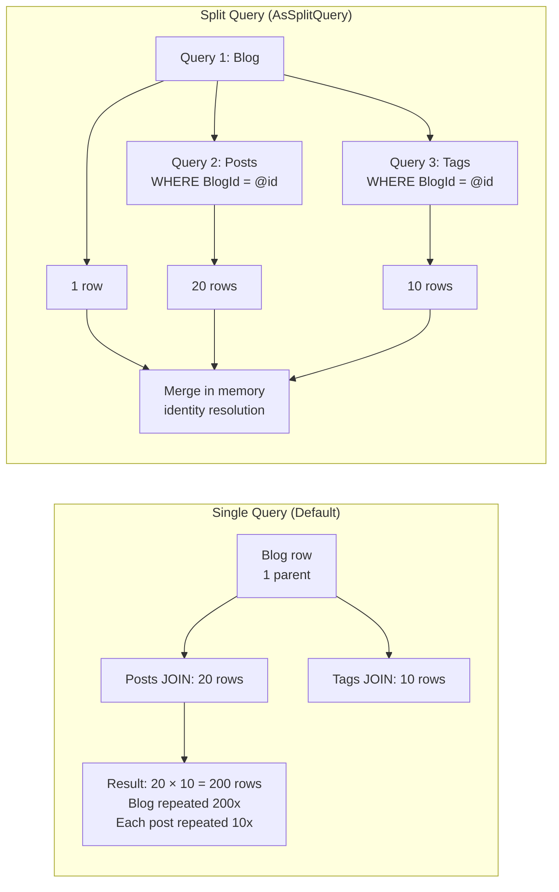
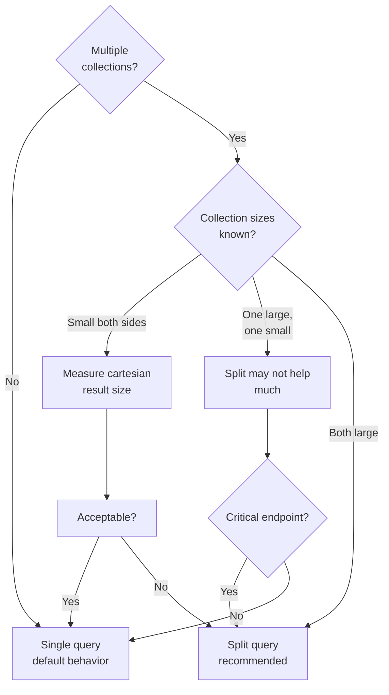

# 8.907 Query Splitting — AsSplitQuery

## Overview — The Cartesian Explosion Problem

When EF Core generates a query that includes multiple related collections via `Include()` or `ThenInclude()`, the default behavior is to produce a **single SQL query** using `LEFT JOIN`. This works well for a single collection but creates a **cartesian explosion** when two or more independent collections are included: each row from collection A is repeated for every row in collection B, multiplying the result set size.

Consider a `Blog` with many `Posts` and many `Tags`. A single-query `Include(posts).Include(tags)` generates:

```sql
SELECT b.Id, b.Name,
       p.Id, p.Title, p.BlogId,
       t.Id, t.Name, t.BlogId
FROM Blogs b
LEFT JOIN Posts p ON b.Id = p.BlogId
LEFT JOIN Tags t ON b.Id = t.BlogId
WHERE b.Id = 1
```

If the blog has 20 posts and 10 tags, the result is **200 rows** (20 × 10). The blog data (`b.Id`, `b.Name`) is repeated 200 times. The `Posts` data is also repeated: each of the 20 posts appears 10 times (once per tag). EF Core's identity resolution handles deduplication on the client side, but the **network transfer** and **database processing** suffer from this multiplicative blowup.



`AsSplitQuery()` tells EF Core to emit **one SQL query per collection** instead of combining them with `LEFT JOIN`. EF Core then merges the results on the client side using identity resolution. This eliminates the cartesian explosion at the cost of additional database round trips.

Dapper has no built-in "split query" concept because Dapper does not generate SQL. The equivalent pattern is `QueryMultiple` — sending multiple `SELECT` statements in a single batch and reading each result set separately. Dapper's approach is actually more efficient because it uses a single round trip for all queries.

---

## Use Cases — Identifying Cartesian Explosion

### The 1:N:N Pattern

The most dangerous pattern is loading a parent with two or more one-to-many relationships:

```csharp
// Single query — cartesian explosion
var blog = await context.Blogs
    .Include(b => b.Posts)     // 1:N
    .Include(b => b.Tags)      // 1:N
    .FirstOrDefaultAsync(b => b.Id == id);
```

SQL Server's query plan shows a nested loops join between Posts and Tags via the Blog, producing `COUNT(Posts) * COUNT(Tags)` rows.

### The Deep Include Chain

Deep nesting also exacerbates cartesian expansion:

```csharp
// Blog → Posts (N) → Comments (M) → Likes (P)
// Single query: Blog × Posts × Comments × Likes
var data = await context.Blogs
    .Include(b => b.Posts)
        .ThenInclude(p => p.Comments)
            .ThenInclude(c => c.Likes)
    .FirstOrDefaultAsync(b => b.Id == id);
```

Each level of nesting multiplies by the next collection's size.

### Large Collection Sizes

The explosion grows with data size. A blog with 100 posts and 50 tags generates 5,000 rows. With 1000 posts and 100 tags: 100,000 rows. At some point, the network transfer cost of the blown-up result set exceeds the cost of additional round trips.

### Decision Flowchart — Single vs Split Query



---

## EF Core Implementation — AsSplitQuery

### Basic Usage — Local Override

```csharp
var blogs = await context.Blogs
    .Include(b => b.Posts)
    .Include(b => b.Tags)
    .AsSplitQuery()
    .ToListAsync();
```

Generated SQL (three queries):
```sql
-- Query 1: Blogs (no JOINs)
SELECT [b].[Id], [b].[Name], [b].[CreatedAt]
FROM [Blogs] AS [b]
ORDER BY [b].[Id]

-- Query 2: Posts for blogs returned by query 1
SELECT [p].[Id], [p].[BlogId], [p].[Title], [p].[Content], [p].[PublishedAt]
FROM [Posts] AS [p]
WHERE EXISTS (
    SELECT 1 FROM [Blogs] AS [b]
    WHERE [b].[Id] = [p].[BlogId])
ORDER BY [p].[BlogId]

-- Query 3: Tags for blogs returned by query 1
SELECT [t].[Id], [t].[BlogId], [t].[Name]
FROM [Tags] AS [t]
WHERE EXISTS (
    SELECT 1 FROM [Blogs] AS [b]
    WHERE [b].[Id] = [t].[BlogId])
ORDER BY [t].[BlogId]
```

EF Core uses `EXISTS (SELECT 1 ...)` to correlate the child queries to the parents already loaded. This approach ensures that even if the parent query uses `Skip`/`Take` for pagination, only the relevant children are fetched.

### Global Default — ConfigureAsSingleQuery

You can configure the default query behavior for the entire `DbContext`:

```csharp
protected override void OnConfiguring(DbContextOptionsBuilder optionsBuilder)
{
    optionsBuilder
        .UseSqlServer(
            connectionString,
            options => options.UseQuerySplittingBehavior(
                QuerySplittingBehavior.SplitQuery));
}
```

With this global setting, every query uses split queries by default. Individual queries can revert to single query with `.AsSingleQuery()`:

```csharp
var data = await context.Blogs
    .Include(b => b.Posts)   // Only one collection
    .AsSingleQuery()         // Override global default
    .ToListAsync();
```

### Deep Hierarchies with AsSplitQuery

```csharp
var blog = await context.Blogs
    .Include(b => b.Posts)
        .ThenInclude(p => p.Comments)
            .ThenInclude(c => c.Likes)
    .Include(b => b.Tags)
    .AsSplitQuery()
    .FirstOrDefaultAsync(b => b.Id == id);
```

EF Core generates four queries:
```sql
-- Query 1: Blog (base)
SELECT TOP(1) [b].[Id], [b].[Name], [b].[CreatedAt]
FROM [Blogs] AS [b]
WHERE [b].[Id] = @__id_0
ORDER BY [b].[Id]

-- Query 2: Posts with Comments and Likes (blog → posts → comments → likes)
SELECT [p].[Id], [p].[BlogId], [p].[Title],
       [c].[Id], [c].[PostId], [c].[Text],
       [l].[Id], [l].[CommentId], [l].[UserId]
FROM [Posts] AS [p]
LEFT JOIN [Comments] AS [c] ON [p].[Id] = [c].[PostId]
LEFT JOIN [Likes] AS [l] ON [c].[Id] = [l].[CommentId]
WHERE EXISTS (
    SELECT 1 FROM [Blogs] AS [b]
    WHERE [b].[Id] = @__id_0 AND [b].[Id] = [p].[BlogId])
ORDER BY [p].[BlogId], [p].[Id], [c].[Id]

-- Query 3: Tags
SELECT [t].[Id], [t].[BlogId], [t].[Name]
FROM [Tags] AS [t]
WHERE EXISTS (
    SELECT 1 FROM [Blogs] AS [b]
    WHERE [b].[Id] = @__id_0 AND [b].[Id] = [t].[BlogId])
ORDER BY [t].[BlogId]
```

Notice that `Posts` → `Comments` → `Likes` are still joined together in one query because they form a single chain of `ThenInclude`. Only branching collections generate separate queries.

### AsSplitQuery with AsNoTracking

Combining split query with no-tracking for maximum read performance:

```csharp
var blogs = await context.Blogs
    .Include(b => b.Posts)
    .Include(b => b.Tags)
    .AsNoTracking()
    .AsSplitQuery()
    .ToListAsync();
```

### AsSplitQuery with Where Filtering

```csharp
var blogs = await context.Blogs
    .Where(b => b.CreatedAt > DateTime.UtcNow.AddDays(-7))
    .Include(b => b.Posts.Where(p => p.IsPublished))
    .Include(b => b.Tags)
    .AsSplitQuery()
    .ToListAsync();
```

Generated SQL:
```sql
-- Query 1: Blogs with filter
SELECT [b].[Id], [b].[Name], [b].[CreatedAt]
FROM [Blogs] AS [b]
WHERE [b].[CreatedAt] > @__cutoff_0
ORDER BY [b].[Id]

-- Query 2: Posts (filtered) for matching blogs
SELECT [p].[Id], [p].[BlogId], [p].[Title], [p].[IsPublished]
FROM [Posts] AS [p]
WHERE [p].[IsPublished] = 1
  AND EXISTS (SELECT 1 FROM [Blogs] AS [b]
              WHERE [b].[Id] = [p].[BlogId]
                AND [b].[CreatedAt] > @__cutoff_0)
ORDER BY [p].[BlogId]

-- Query 3: Tags for matching blogs
SELECT [t].[Id], [t].[BlogId], [t].[Name]
FROM [Tags] AS [t]
WHERE EXISTS (SELECT 1 FROM [Blogs] AS [b]
              WHERE [b].[Id] = [t].[BlogId]
                AND [b].[CreatedAt] > @__cutoff_0)
ORDER BY [t].[BlogId]
```

### AsSplitQuery with Select Projection

When using `Select` instead of `Include`, EF Core generates separate queries automatically for collection projections, even without `AsSplitQuery`:

```csharp
var blogs = await context.Blogs
    .Select(b => new BlogDto
    {
        Id = b.Id,
        Name = b.Name,
        PostTitles = b.Posts.Select(p => p.Title).ToList(),
        TagNames = b.Tags.Select(t => t.Name).ToList()
    })
    .ToListAsync();
```

EF Core automatically splits this into multiple queries because the `Select` projects collection navigations. No `AsSplitQuery` needed. However, `AsSplitQuery` is still useful when using `Include` for tracked entities.

### Explicit Multiple Queries via FromSqlRaw

For maximum control, you can manually execute multiple queries and merge them:

```csharp
var blogId = 1;

var blog = await context.Blogs
    .FromSqlRaw("SELECT * FROM Blogs WHERE Id = {0}", blogId)
    .AsNoTracking()
    .FirstOrDefaultAsync();

if (blog != null)
{
    blog.Posts = await context.Posts
        .FromSqlRaw("SELECT * FROM Posts WHERE BlogId = {0}", blogId)
        .AsNoTracking()
        .ToListAsync();

    blog.Tags = await context.Tags
        .FromSqlRaw("SELECT * FROM Tags WHERE BlogId = {0}", blogId)
        .AsNoTracking()
        .ToListAsync();
}
```

This is essentially a manual split query, useful when the auto-generated SQL is not optimal.

---

## Dapper Implementation — QueryMultiple and Multi-Mapping

Dapper's `QueryMultiple` is the natural equivalent of split queries. It sends multiple `SELECT` statements in one batch and reads each result set independently via `ReadAsync<T>()`.

### Basic QueryMultiple — Multiple Collections

```csharp
public async Task<Blog?> GetBlogWithPostsAndTagsAsync(
    SqlConnection db, int blogId)
{
    using var multi = await db.QueryMultipleAsync(@"
        SELECT * FROM Blogs WHERE Id = @Id;
        SELECT * FROM Posts WHERE BlogId = @Id;
        SELECT * FROM Tags WHERE BlogId = @Id;",
        new { Id = blogId });

    var blog = await multi.ReadFirstOrDefaultAsync<Blog>();
    if (blog != null)
    {
        blog.Posts = (await multi.ReadAsync<Post>()).AsList();
        blog.Tags = (await multi.ReadAsync<Tag>()).AsList();
    }

    return blog;
}
```

This uses **one round trip** (unlike EF Core's `AsSplitQuery` which sends N+1 round trips). The database receives the entire batch, executes all three `SELECT` statements, and returns all result sets in the same response. Dapper reads each result set sequentially from the `SqlDataReader`.

### QueryMultiple with Pagination

When the parent query uses pagination, the child queries must filter to the same page:

```csharp
public async Task<PageResult<BlogDto>> GetPaginatedBlogsWithDataAsync(
    SqlConnection db, int page, int pageSize)
{
    var offset = (page - 1) * pageSize;

    using var multi = await db.QueryMultipleAsync(@"
        SELECT Id, Name, CreatedAt
        FROM Blogs
        ORDER BY CreatedAt DESC
        OFFSET @Offset ROWS FETCH NEXT @PageSize ROWS ONLY;

        SELECT COUNT(*) FROM Blogs;

        SELECT p.Id, p.BlogId, p.Title
        FROM Posts p
        WHERE p.BlogId IN (
            SELECT Id FROM Blogs
            ORDER BY CreatedAt DESC
            OFFSET @Offset ROWS FETCH NEXT @PageSize ROWS ONLY
        );

        SELECT t.Id, t.BlogId, t.Name
        FROM Tags t
        WHERE t.BlogId IN (
            SELECT Id FROM Blogs
            ORDER BY CreatedAt DESC
            OFFSET @Offset ROWS FETCH NEXT @PageSize ROWS ONLY
        );",
        new { Offset = offset, PageSize = pageSize });

    var blogs = (await multi.ReadAsync<BlogDto>()).AsList();
    var total = await multi.ReadSingleAsync<int>();
    var posts = (await multi.ReadAsync<Post>()).AsList();
    var tags = (await multi.ReadAsync<Tag>()).AsList();

    // Merge in memory
    foreach (var blog in blogs)
    {
        blog.Posts = posts.Where(p => p.BlogId == blog.Id).ToList();
        blog.Tags = tags.Where(t => t.BlogId == blog.Id).ToList();
    }

    return new PageResult<BlogDto>
    {
        Items = blogs,
        Total = total,
        Page = page,
        PageSize = pageSize
    };
}
```

### Dapper Multi-Mapping — One-to-One and One-to-Many

Dapper's multi-mapping (via `Query<T1, T2, TResult>`) handles a single JOIN, but it does not handle cartesian explosion because it returns every row. For one-to-many with a single collection, multi-mapping is fine:

```csharp
public async Task<List<Blog>> GetAllBlogsWithPostsAsync(SqlConnection db)
{
    var blogDict = new Dictionary<int, Blog>();

    var results = await db.QueryAsync<Blog, Post, Blog>(
        @"SELECT b.Id, b.Name, b.CreatedAt,
                 p.Id, p.BlogId, p.Title, p.Content
          FROM Blogs b
          LEFT JOIN Posts p ON b.Id = p.BlogId
          ORDER BY b.Id",
        (blog, post) =>
        {
            if (!blogDict.TryGetValue(blog.Id, out var existingBlog))
            {
                existingBlog = blog;
                existingBlog.Posts = new List<Post>();
                blogDict[blog.Id] = existingBlog;
            }
            if (post != null)
                existingBlog.Posts.Add(post);
            return existingBlog;
        },
        splitOn: "Id");

    return blogDict.Values.ToList();
}
```

This works for one collection but suffers from the cartesian problem with two collections. Use `QueryMultiple` instead for two or more collections.

### Dapper Multiple Result Sets with Identity Map

For complex graphs, combine `QueryMultiple` with an identity map (dictionary):

```csharp
public async Task<List<Blog>> GetBlogsFullGraphAsync(SqlConnection db)
{
    using var multi = await db.QueryMultipleAsync(@"
        SELECT Id, Name, CreatedAt FROM Blogs ORDER BY Id;
        SELECT Id, BlogId, Title, Content FROM Posts ORDER BY BlogId, Id;
        SELECT Id, BlogId, Name FROM Tags ORDER BY BlogId, Id;");

    var blogs = (await multi.ReadAsync<Blog>()).AsList();
    var posts = (await multi.ReadAsync<Post>()).AsList();
    var tags = (await multi.ReadAsync<Tag>()).AsList();

    var blogLookup = blogs.ToDictionary(b => b.Id);

    foreach (var post in posts)
    {
        if (blogLookup.TryGetValue(post.BlogId, out var blog))
        {
            blog.Posts ??= new List<Post>();
            blog.Posts.Add(post);
        }
    }

    foreach (var tag in tags)
    {
        if (blogLookup.TryGetValue(tag.BlogId, out var blog))
        {
            blog.Tags ??= new List<Tag>();
            blog.Tags.Add(tag);
        }
    }

    return blogs;
}
```

### Dapper — Handling M:N Relationships

For many-to-many, send three queries and perform the join in memory:

```csharp
public async Task<List<Post>> GetPostsWithTagsAsync(SqlConnection db)
{
    using var multi = await db.QueryMultipleAsync(@"
        SELECT Id, Title, Content FROM Posts;
        SELECT PostId, TagId FROM PostTags;
        SELECT Id, Name FROM Tags;");

    var posts = (await multi.ReadAsync<Post>()).AsList();
    var postTags = (await multi.ReadAsync<PostTag>()).AsList();
    var tags = (await multi.ReadAsync<Tag>()).AsList();

    var tagLookup = tags.ToDictionary(t => t.Id);

    foreach (var post in posts)
    {
        var tagIds = postTags
            .Where(pt => pt.PostId == post.Id)
            .Select(pt => pt.TagId);
        post.Tags = tagIds
            .Select(id => tagLookup.GetValueOrDefault(id))
            .Where(t => t != null)
            .Cast<Tag>()
            .ToList();
    }

    return posts;
}
```

---

## Comparison — AsSplitQuery vs QueryMultiple

### Feature Matrix

| Aspect | EF Core AsSplitQuery | Dapper QueryMultiple |
|---|---|---|
| Round trips | N+1 (one per collection + parent) | 1 (batch sent together) |
| SQL generation | Automatic (EF Core writes the queries) | Manual (you write each SELECT) |
| Identity resolution | Automatic (ChangeTracker merges) | Manual (you build the map) |
| Tracking support | Yes (if not AsNoTracking) | No (Dapper never tracks) |
| Pagination support | Automatic (EXISTS correlation) | Manual (replicate parent filter) |
| Deep hierarchies | Handles ThenInclude chains | Manual child queries |
| Stale data risk | Higher (non-snapshot isolation) | Same (all in one batch) |
| Query plan caching | Multiple parameterized plans | One batch plan (or multiple) |
| Debugging complexity | Medium (multiple queries) | Low (you see all SQL) |
| Required EF Core version | 5.0+ | Always available |

### Network Traffic Comparison

For a blog with 20 posts and 10 tags:

- **Single query**: 200 rows transferred (blog data × 20 posts × 10 tags) ≈ 40-80 KB
- **Split query (EF Core)**: 3 round trips, 1 + 20 + 10 = 31 rows ≈ 5-10 KB
- **QueryMultiple (Dapper)**: 1 round trip, 31 rows ≈ 5-10 KB

The data transferred is dramatically smaller with split queries. The trade-off is round trip count.

### Latency Trade-Off

```mermaid
flowchart LR
    subgraph Latency_Breakdown ["Latency Breakdown"]
        subgraph Network ["Network (e.g., 5 ms per round trip)"]
            S1[Single: 5 ms] --> S2[Split EF: 15 ms<br/>(3 trips)]
            S1 --> S3[Dapper QM: 5 ms<br/>(1 trip)]
        end
        subgraph Transfer ["Data Transfer (10 MB/s)"]
            T1[Single: 200 rows<br/>~8 ms transfer]
            T2[Split: 31 rows<br/>~1.5 ms transfer]
        end
        subgraph Processing ["DB CPU"]
            P1[Single: 200 row<br/>join + sort]
            P2[Split: 3 simple queries<br/>no join]
        end
    end
```

The total latency depends on network latency, data size, and database CPU. For high-latency connections (e.g., 50+ ms round trip), single query may be better. For low-latency connections with large result sets, split queries win.

### Breaking Point — When Split Beats Single

The decision depends on:

```text
Break-even: SingleRT + SingleDataTime ≈ N * SplitRT + SplitDataTime

Where:
- SingleRT = round trip time (single query)
- SingleDataTime = transfer + processing time for joined result
- N = number of queries (split)
- SplitRT = round trip time (split query, typically same as SingleRT)
- SplitDataTime = transfer + processing time for each split result

If data size is the bottleneck and collections are large → split wins
If round trip time dominates → single may win
```

---

## Performance Considerations — Detailed Analysis

### Memory Overhead on Client

Single queries allocate memory for the inflated result set on both the database server (tempdb for sort/hash joins) and the client (for the `DbDataReader`). With split queries, each result set is smaller and can be processed independently.

```csharp
// Memory profiler observation — 10 blogs, 100 posts each, 50 tags each

// Single query: 10 × 100 × 50 = 50,000 rows
// EF Core materializes 50,000 Blog instances
// ChangeTracker snapshot stores all 50,000
// Memory: ~5-10 MB for the result

// Split query: 10 + 1000 + 500 = 1,510 rows
// EF Core materializes 10 Blog + 1000 Post + 500 Tag = 1,510 instances
// ChangeTracker stores all but with identity dedup (10 unique blogs)
// Memory: ~0.5-1 MB
```

### Query Plan Analysis

Single query plan (simplified):
```text
SELECT
  Compute Scalar
    Nested Loops Left Outer Join
      Nested Loops Left Outer Join
        Clustered Index Scan (Blogs)
        Clustered Index Scan (Posts)
      Clustered Index Scan (Tags)
```

Split query plan (query 1):
```text
SELECT
  Clustered Index Scan (Blogs)
```

Split query plan (query 2):
```text
SELECT
  Clustered Index Scan (Posts)
    WHERE EXISTS (subquery)
```

Split query plans are simpler, with fewer join operators. The database optimizer spends less time on each plan.

### Connection Pooling and Round Trips

EF Core's `AsSplitQuery()` opens a single connection for the entire operation. The multiple queries are executed sequentially over the same connection/DbCommand. The round trips are real — each query goes to the database as a separate `SqlCommand.ExecuteReaderAsync()` call.

Dapper's `QueryMultiple` sends all SQL in one `SqlCommand.ExecuteReaderAsync()` call and reads multiple result sets from the same `SqlDataReader`. This is effectively one round trip.

### Benchmark — Single vs Split vs QueryMultiple

```csharp
// Benchmark: Get blog with 20 posts and 10 tags, SQL Server, local network

// EF Core Single Query:
//   Network: 5 ms
//   Data transfer: 12 ms (200 rows)
//   Materialization: 8 ms
//   Total: ~25 ms

// EF Core Split Query (AsSplitQuery):
//   Network: 15 ms (3 round trips)
//   Data transfer: 2 ms (31 total rows)
//   Materialization: 4 ms
//   Total: ~21 ms

// Dapper QueryMultiple:
//   Network: 5 ms (1 round trip)
//   Data transfer: 2 ms (31 total rows)
//   Materialization: 2 ms
//   Total: ~9 ms
```

### When Single Query Is Faster

For small collections (1-5 items each), the round trip overhead of split queries outweighs the data transfer savings. EF Core's default single query is appropriate for graphs with only one collection or very small collections.

---

## Pitfalls and Gotchas — Common Mistakes

### 1. Stale Data Between Queries

Because split queries execute as separate `SELECT` statements, the data can change between queries. Under `READ COMMITTED` isolation level:

1. Query 1 (Blogs) reads blog with `Name = "Tech Blog"`
2. Another transaction updates the blog's name to `"Dev Blog"`
3. Query 2 (Posts) reads posts

The `Blog.Name` in the merged result is "Tech Blog" (from query 1), but query 2 sees the current state of `Posts`. The merged graph is internally inconsistent.

**Mitigation:** Use `SNAPSHOT ISOLATION` or `REPEATABLE READ`:

```csharp
await using var transaction = await context.Database
    .BeginTransactionAsync(IsolationLevel.Snapshot);

var blog = await context.Blogs
    .Include(b => b.Posts)
    .Include(b => b.Tags)
    .AsSplitQuery()
    .FirstOrDefaultAsync(b => b.Id == id);

await transaction.CommitAsync();
```

Or globally configure snapshot isolation:
```csharp
optionsBuilder.UseSqlServer(connectionString, options =>
{
    options.UseQuerySplittingBehavior(QuerySplittingBehavior.SplitQuery);
});
```

However, the transaction itself adds overhead. Evaluate whether the consistency guarantee is needed.

### 2. Split Query Does Not Always Reduce Round Trips

`AsSplitQuery` sends one query per branching collection. If the entity graph has many branches (5+ collections), it sends 6+ queries. Each query is a separate network round trip. For high-latency networks, this can be slower than a single inflated query.

### 3. Requires EF Core 5.0+

`AsSplitQuery` was introduced in EF Core 5.0. In EF Core 3.x, the workaround was to manually execute multiple `FromSqlRaw` queries.

### 4. Does Not Work with Certain Providers

Not all database providers support the `EXISTS (SELECT 1 ...)` correlation pattern used by EF Core for split queries. The SQL Server and SQLite providers support it; others may fall back to single query or throw.

### 5. Navigation Properties Must Be Initialized

EF Core's identity resolution for split queries requires navigation properties to be initialized (or at least settable). If `Blog.Posts` is `null` but not initialized, EF Core may throw when trying to add items:

```csharp
public class Blog
{
    public int Id { get; set; }
    public string Name { get; set; }
    public List<Post> Posts { get; set; } = new(); // Must be initialized
    public List<Tag> Tags { get; set; } = new();   // Must be initialized
}
```

### 6. Identity Resolution Overhead

Split queries rely on EF Core's identity resolution to merge the results. This has overhead: EF Core must track each entity and deduplicate based on key values. The overhead is usually worth it, but for pure read-only scenarios, consider `AsNoTrackingWithIdentityResolution()`:

```csharp
var blogs = await context.Blogs
    .Include(b => b.Posts)
    .Include(b => b.Tags)
    .AsNoTrackingWithIdentityResolution()
    .AsSplitQuery()
    .ToListAsync();
```

### 7. Split Query with Tracking Can Re-Query Already-Loaded Entities

If you load a tracked entity via split query, then access a navigation property that hasn't been loaded yet, EF Core may issue a **lazy loading** query (if proxies are enabled) or return an empty collection. Split query only loads the collections you explicitly `Include`.

### 8. Cannot Split Only Some Collections

`AsSplitQuery` applies to the entire query. You cannot choose to split `Posts` but not `Tags`. If you need per-collection control, execute multiple queries manually.

### 9. Pagination Inconsistency with Split Query

When using `Skip`/`Take` on the parent query with split queries, the child queries use the same parent filter through the `EXISTS` subquery. This works correctly. However, if you use `AsSplitQuery` without pagination constraints, it may load all children for all parents — potentially millions of rows.

### 10. Split Query with ThenInclude Ordering

The order of `ThenInclude` chains matters for how split queries are generated. A `ThenInclude` after an `Include` keeps the chain in the same query. A separate `Include` generates a new split query:

```csharp
// This generates 2 queries:
// Query 1: Blog + Posts + Comments (single chain)
// Query 2: Tags (separate branch)
var blog = await context.Blogs
    .Include(b => b.Posts)
        .ThenInclude(p => p.Comments)
    .Include(b => b.Tags)
    .AsSplitQuery()
    .FirstOrDefaultAsync();

// This generates 3 queries:
// Query 1: Blog
// Query 2: Posts + Comments
// Query 3: Tags
var blog = await context.Blogs
    .AsSplitQuery()
    .Include(b => b.Posts)
        .ThenInclude(p => p.Comments)
    .Include(b => b.Tags)
    .FirstOrDefaultAsync();
```

### 11. SQL Server Row Count and Query Store

Split queries increase the number of queries in the Query Store. Each unique split query (with different parameters) is stored separately. This can bloat the Query Store if many variations exist.

### 12. Async Disposal of DbDataReader

Each split query opens and disposes a `DbDataReader`. If an exception occurs mid-way through the split queries, ensure proper disposal:

```csharp
// EF Core handles this internally via the context's connection management
```

---

## Best Practices — Recommendations

### 1. Measure Before Switching

Use SQL Server Profiler or EF Core's `LogTo` to capture the actual queries and row counts. Compare the execution time of single vs split for your specific data:

```csharp
// Log the queries and execution time
context.Database.SetCommandTimeout(30);
context.ChangeTracker.QueryTrackingBehavior = QueryTrackingBehavior.NoTracking;

var stopwatch = Stopwatch.StartNew();
var data = await query.ToListAsync();
stopwatch.Stop();

Console.WriteLine($"Query took {stopwatch.ElapsedMilliseconds} ms");
```

### 2. Default to Single Query for Development

Start with single queries during development. Profile the slowest queries and selectively apply `AsSplitQuery()` where cartesian explosion is confirmed. Avoid the global `SplitQuery` default unless you have verified it improves performance across the board.

### 3. Use AsNoTracking with AsSplitQuery for Read-Only

When the data is read-only, combine `AsNoTracking` (or `AsNoTrackingWithIdentityResolution`) with `AsSplitQuery`:

```csharp
var data = await context.Blogs
    .Include(b => b.Posts)
    .Include(b => b.Tags)
    .AsNoTrackingWithIdentityResolution()  // Dedup without full tracking
    .AsSplitQuery()
    .ToListAsync();
```

### 4. Use Dapper QueryMultiple for Complex Graphs

When the entity graph involves 3+ collections and the SQL is manageable, Dapper's `QueryMultiple` provides the best performance:

```csharp
public async Task<BlogFullDto?> GetBlogFullAsync(SqlConnection db, int blogId)
{
    using var multi = await db.QueryMultipleAsync(@"
        SELECT Id, Name, CreatedAt FROM Blogs WHERE Id = @Id;
        SELECT Id, BlogId, Title, Content FROM Posts WHERE BlogId = @Id;
        SELECT Id, BlogId, Name FROM Tags WHERE BlogId = @Id;
        SELECT Id, PostId, Text, AuthorId FROM Comments
        WHERE PostId IN (SELECT Id FROM Posts WHERE BlogId = @Id);",
        new { Id = blogId });

    var blog = await multi.ReadFirstOrDefaultAsync<BlogFullDto>();
    if (blog == null) return null;

    blog.Posts = (await multi.ReadAsync<PostDto>()).AsList();
    blog.Tags = (await multi.ReadAsync<TagDto>()).AsList();
    var comments = (await multi.ReadAsync<CommentDto>()).AsList();

    // Assign comments to posts
    foreach (var post in blog.Posts)
    {
        post.Comments = comments
            .Where(c => c.PostId == post.Id)
            .ToList();
    }

    return blog;
}
```

### 5. Consider Raw SQL for Extreme Scalar Values

If a single parent has thousands of related entities, even split queries transfer a lot of data. For dashboards or reports, consider aggregate queries instead:

```sql
-- Instead of loading all posts:
SELECT COUNT(*) AS PostCount, AVG(Likes) AS AvgLikes FROM Posts WHERE BlogId = @Id
```

### 6. Use Split Query Strategically for API Endpoints

For API endpoints that return a graph of data, evaluate the client's needs. If the client only needs counts or summaries, don't load the full graph at all:

```csharp
// API returns blog summary
public async Task<BlogSummaryDto> GetBlogSummary(int blogId)
{
    var blog = await context.Blogs
        .Where(b => b.Id == blogId)
        .Select(b => new BlogSummaryDto
        {
            Name = b.Name,
            PostCount = b.Posts.Count,
            TagCount = b.Tags.Count,
            RecentPosts = b.Posts
                .OrderByDescending(p => p.CreatedAt)
                .Take(5)
                .Select(p => new PostHeadlineDto
                {
                    Title = p.Title,
                    CreatedAt = p.CreatedAt
                })
                .ToList()
        })
        .FirstOrDefaultAsync();

    return blog;
}
```

### 7. Set Query Timeout for Split Queries

Split queries execute sequentially. If the first query takes long, the entire operation takes longer. Set a command timeout that accounts for the cumulative time:

```csharp
optionsBuilder.UseSqlServer(
    connectionString,
    options => options.CommandTimeout(60)
                      .UseQuerySplittingBehavior(QuerySplittingBehavior.SplitQuery));
```

### 8. Avoid Split Query with Very Deep Hierarchies (5+ Levels)

Each level adds a query. At some point, the cumulative round trip cost exceeds the data transfer savings. Profile and find your break-even point.

### 9. Use Include with Filtered Children in Split Query

EF Core 6.0+ supports filtered `Include`. Combine with split query to minimize data transfer:

```csharp
var blog = await context.Blogs
    .Include(b => b.Posts.Where(p => p.IsPublished && p.CreatedAt.Year == 2026))
    .Include(b => b.Tags.Where(t => t.Name.StartsWith("dotnet")))
    .AsSplitQuery()
    .FirstOrDefaultAsync(b => b.Id == id);
```

### 10. Replace Include + Split with Select for DTOs

For projections, `Select` is almost always better than `Include` + `AsSplitQuery`:

```csharp
// Better — less data, no tracking, automatic split
var blogDto = await context.Blogs
    .Where(b => b.Id == id)
    .Select(b => new BlogDto
    {
        Id = b.Id,
        Name = b.Name,
        Posts = b.Posts.Select(p => new PostDto
        {
            Id = p.Id,
            Title = p.Title
        }).ToList(),
        Tags = b.Tags.Select(t => new TagDto
        {
            Id = t.Id,
            Name = t.Name
        }).ToList()
    })
    .FirstOrDefaultAsync();
```

EF Core automatically generates split queries for `Select` with collection projections, and the result is untracked DTOs.

### 11. Combination with Compiled Queries

Compiled queries support `AsSplitQuery`:

```csharp
private static readonly Func<AppDbContext, int, Blog?> GetBlogSplit =
    EF.CompileQuery<AppDbContext, int, Blog>(
        (ctx, id) => ctx.Blogs
            .Include(b => b.Posts)
            .Include(b => b.Tags)
            .AsSplitQuery()
            .FirstOrDefault(b => b.Id == id));
```

### 12. Test with Realistic Data Volumes

Split queries behave differently at small and large data volumes. Test with production-scale data:

```csharp
[Theory]
[InlineData(10)]     // Small
[InlineData(1000)]   // Medium
[InlineData(100000)] // Large
public async Task GetBlogWithPosts_TakesLessThanFiveSeconds(int postCount)
{
    // Arrange seed data
    // Act
    // Assert time
}
```

### 13. Consider GraphQL or OData as Alternative

If the client needs highly flexible graph loading, consider GraphQL (Hot Chocolate, GraphQL.NET) or OData instead of manually optimizing `Include` chains. These frameworks handle query splitting and projection at a higher level.

### 14. Monitor for N+1 When Using Split Query as Default

Enabling split query globally can mask N+1 problems. Developers may rely on lazy loading or implicit loading, and split queries make each navigation access issue a separate database query. Log all queries in development to catch unexpected N+1 patterns.

### 15. Document the Split Query Decision

Add a comment explaining why `AsSplitQuery` is used:

```csharp
// AsSplitQuery: Blog has average 200 posts and 50 tags.
// Single query would produce 10,000 rows.
var blog = await context.Blogs
    .Include(b => b.Posts)
    .Include(b => b.Tags)
    .AsSplitQuery()
    .FirstOrDefaultAsync(b => b.Id == id);
```

---

## References — Related Notes and Resources

- [[8.856 — Dapper — Multi-Mapping — QueryMultiple]] — Dapper's equivalent pattern
- [[8.857 — Dapper — Multi-Mapping — One-to-Many Results]] — Manual one-to-many mapping
- [[8.908 — No-Tracking Queries — AsNoTracking]] — Combine with split query for read-only
- [[8.906 — Compiled Queries — EF.CompileQuery]] — Compiled split queries
- [[3.040 — EF Core — Split Query vs Single Query]] — General EF Core note
- [[3.001 — DbContext and Change Tracking Fundamentals]] — Prerequisite for identity resolution

### External Resources

- Microsoft Docs: [Split Queries](https://docs.microsoft.com/en-us/ef/core/querying/single-split-queries)
- Microsoft Docs: [QuerySplittingBehavior](https://docs.microsoft.com/en-us/dotnet/api/microsoft.entityframeworkcore.querysplittingbehavior)
- Erik Ejlskov's blog: [Cartesian Explosion in EF Core](https://erikej.github.io/efcore/2020/09/14/ef-core-cartesian-explosion.html)
- Dapper Docs: [QueryMultiple](https://github.com/DapperLib/Dapper#multiple-mapping)

### Quick Reference — AsSplitQuery Configuration

```csharp
// Per-query
query.AsSplitQuery();
query.AsSingleQuery();

// Global default
optionsBuilder.UseSqlServer(
    connectionString,
    options => options.UseQuerySplittingBehavior(
        QuerySplittingBehavior.SplitQuery));
optionsBuilder.UseSqlServer(
    connectionString,
    options => options.UseQuerySplittingBehavior(
        QuerySplittingBehavior.SingleQuery));
```

### Migration Cheatsheet — EF Core to Dapper

| EF Core Pattern | Dapper Equivalent |
|---|---|
| `Include(b => b.Posts).AsSplitQuery()` | `QueryMultiple` with separate SELECTs |
| `Include(b => b.Posts).ThenInclude(p => p.Comments)` | Separate `QueryAsync` or sub-`QueryMultiple` |
| `AsNoTracking().AsSplitQuery()` | Default Dapper + QueryMultiple |
| Identity resolution (auto-merge) | Manual dictionary merge |
| Filtered `Include` | Filtering in child SELECT's WHERE |
| Global split query default | Always manual SQL |

### Summary

`AsSplitQuery()` is EF Core's solution to the cartesian explosion problem when loading multiple related collections. It replaces a single inflated query with multiple focused queries at the cost of additional round trips. Dapper's `QueryMultiple` provides the same benefit with only one round trip, but requires you to write all the SQL manually and handle identity resolution yourself. Choose based on your tolerance for SQL maintenance (Dapper) versus your need for automatic entity graph construction (EF Core with split query).
