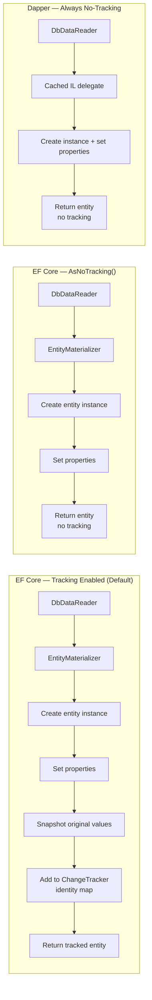
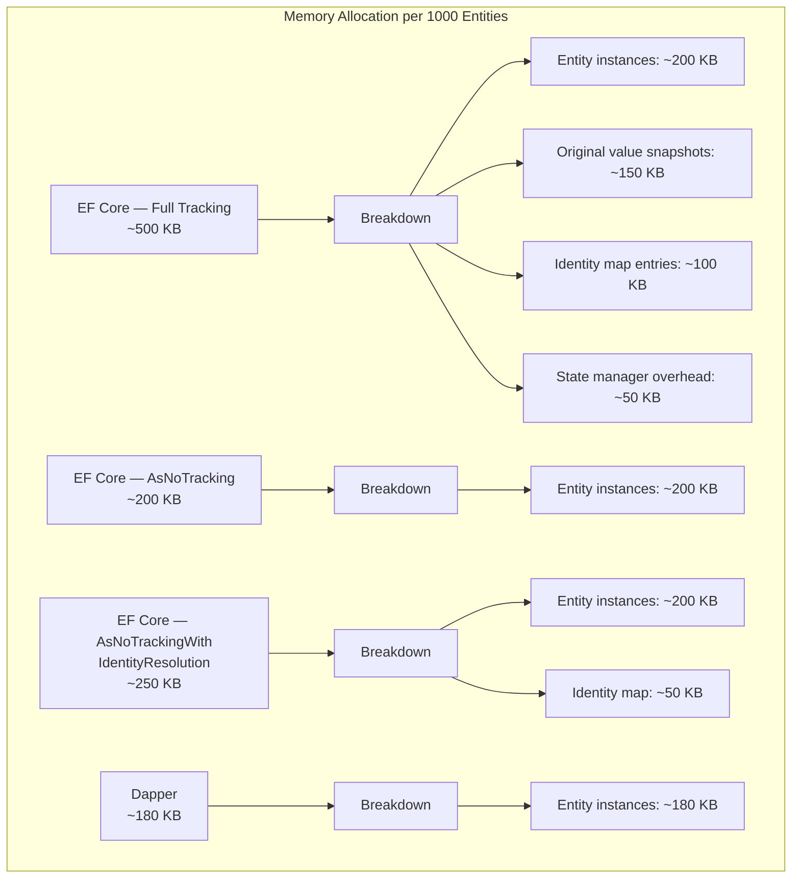

# 8.908 No-Tracking Queries — AsNoTracking

## Overview — The Cost of Change Tracking

EF Core's `ChangeTracker` is a powerful mechanism that enables automatic `SaveChanges` — it detects which entities are new, modified, or deleted by comparing snapshots of property values. This tracking comes at a cost: every queried entity must be:

1. Instantiated from the `DbDataReader`
2. Snapshot (original values stored)
3. Added to the identity map (key → entity dictionary)
4. Monitored for changes via `INotifyPropertyChanging` / `INotifyPropertyChanged` (if using change-tracking proxies) or via snapshot comparison on `DetectChanges`

For read-only queries, all of this work is wasted. The entities are returned to the caller, displayed, serialized, or projected — and never updated. `AsNoTracking()` tells EF Core to skip the entire `ChangeTracker` pipeline: no snapshot, no identity map, no state management. The entity is created from the data reader, properties are set, and the instance is returned directly.

Dapper has never tracked entities. From its inception, Dapper's model has been: execute SQL, map rows to objects, return them. No identity map, no change detection, no `SaveChanges`. In terms of EF Core concepts, Dapper is always running in `AsNoTracking` mode — and not even that, because Dapper doesn't even have the entity materialization overhead that EF Core has (no `EntityMaterializerSource`, no `InternalEntityEntry` creation).



### The Identity Resolution Question

Normal tracking queries ensure that if the same entity (same primary key) appears multiple times in the same result set (e.g., due to a JOIN), EF Core returns the **same CLR instance** — this is identity resolution. `AsNoTracking()` skips identity resolution, so each row produces a **new CLR instance**, even if they have the same key.

EF Core 5.0 introduced `AsNoTrackingWithIdentityResolution()`, which skips the `ChangeTracker` snapshotting but still deduplicates entities by key within a single query. This is useful for split queries or queries where the same entity appears in multiple rows due to JOINs.

---

## Use Cases — When to Skip Tracking

### Read-Only API Endpoints

The most common use case. API endpoints that return data without modification should use `AsNoTracking()`:

```csharp
[HttpGet("products")]
public async Task<ActionResult<List<Product>>> GetProducts()
{
    var products = await context.Products
        .AsNoTracking()
        .Include(p => p.Category)
        .ToListAsync();

    return Ok(products);
}
```

### Reporting and Dashboards

Reporting queries load large volumes of data for aggregation or display. Tracking would waste memory and CPU.

```csharp
var salesData = await context.Orders
    .AsNoTracking()
    .Where(o => o.OrderDate >= since)
    .GroupBy(o => o.OrderDate.Date)
    .Select(g => new DailySales
    {
        Date = g.Key,
        Total = g.Sum(o => o.TotalAmount),
        Count = g.Count()
    })
    .ToListAsync();
```

### Projections to DTOs

When using `Select` to project to DTOs, EF Core automatically does not track the result. Adding `AsNoTracking()` in this case is redundant but harmless:

```csharp
// Automatic no-tracking — Select projects to a non-entity type
var dtos = await context.Products
    .Where(p => p.Price > 100)
    .Select(p => new ProductDto
    {
        Id = p.Id,
        Name = p.Name,
        Price = p.Price
    })
    .ToListAsync();
```

### Bulk Read Operations

Import/export jobs, data migration readers, backup processes — any scenario that reads thousands or millions of entities without modifying them.

### Read-Only Background Services

Background workers that read reference data periodically (e.g., cache warming, configuration refresh) should use `AsNoTracking()`.

### Comparison with Dapper Equivalent

```csharp
// EF Core
var products = await context.Products
    .AsNoTracking()
    .ToListAsync();

// Dapper — always no-tracking
var products = await db.QueryAsync<Product>("SELECT * FROM Products");
```

---

## EF Core Implementation — AsNoTracking and Variants

### Basic AsNoTracking

```csharp
var blogs = await context.Blogs
    .AsNoTracking()
    .Include(b => b.Posts)
    .ToListAsync();
```

Generated SQL (same as tracking — `AsNoTracking` affects only client behavior):
```sql
SELECT [b].[Id], [b].[Name], [b].[CreatedAt],
       [p].[Id], [p].[BlogId], [p].[Title], [p].[Content]
FROM [Blogs] AS [b]
LEFT JOIN [Posts] AS [p] ON [b].[Id] = [p].[BlogId]
ORDER BY [b].[Id], [p].[Id]
```

### AsNoTrackingWithIdentityResolution

```csharp
var blogs = await context.Blogs
    .AsNoTrackingWithIdentityResolution()
    .Include(b => b.Posts)
    .ToListAsync();
```

This deduplicates entities by key without full tracking. In the example above, if the same `Blog` appears multiple times (due to the `Posts` JOIN), all rows map to the same `Blog` instance. Posts are also deduplicated by key.

Performance characteristics:
- Faster than full tracking (no snapshot, no state management)
- Slower than raw `AsNoTracking` (identity map lookup per row)
- Memory usage: identity map dictionary per query (discarded after materialization)

### Global Default — QueryTrackingBehavior

Set the default tracking behavior for the entire `DbContext`:

```csharp
protected override void OnConfiguring(DbContextOptionsBuilder optionsBuilder)
{
    optionsBuilder
        .UseSqlServer(connectionString)
        .UseQueryTrackingBehavior(QueryTrackingBehavior.NoTracking);
}
```

With this global setting, every query is no-tracking by default. Individual queries can opt into tracking with `.AsTracking()`:

```csharp
var blog = await context.Blogs
    .AsTracking()   // Override global default
    .FirstOrDefaultAsync(b => b.Id == id);

blog.Name = "Updated Name";
await context.SaveChangesAsync();   // Works because tracking was enabled
```

### AsNoTracking with Find

`Find` / `FindAsync` always returns a tracked entity if the entity is already in the `ChangeTracker`. `AsNoTracking` does not affect `Find`:

```csharp
var blog = await context.Blogs.FindAsync(1); // Tracked (searches ChangeTracker first)
var blog2 = await context.Blogs
    .AsNoTracking()
    .FirstOrDefaultAsync(b => b.Id == 1);  // Not tracked
```

### AsNoTracking with FromSqlRaw

```csharp
var products = await context.Products
    .FromSqlRaw("SELECT * FROM Products WHERE Price > {0}", minPrice)
    .AsNoTracking()
    .ToListAsync();
```

### AsNoTracking with Compiled Queries

```csharp
private static readonly Func<AppDbContext, decimal, IAsyncEnumerable<Product>>
    GetProductsByMinPrice = EF.CompileAsyncQuery<AppDbContext, decimal, Product>(
        (ctx, minPrice) =>
            ctx.Products
                .AsNoTracking()
                .Where(p => p.Price >= minPrice)
                .OrderBy(p => p.Name));
```

### AsNoTrackingWithIdentityResolution with Split Queries

This combination is powerful for complex graphs:

```csharp
var blogs = await context.Blogs
    .AsNoTrackingWithIdentityResolution()
    .AsSplitQuery()
    .Include(b => b.Posts)
    .Include(b => b.Tags)
    .ToListAsync();
```

Identity resolution ensures that `Blog` instances are deduplicated even though split queries return them in separate result sets (the first result set has blogs, the second has posts with blog FK). Without identity resolution, split queries would return duplicate blog instances because the blog data is not repeated in the child queries — but identity resolution is still needed for the parent entities if the same parent appears in multiple places.

### Changing Tracking Behavior Mid-Query

You cannot change tracking behavior after the query is materialized. `AsNoTracking` must be applied to the `IQueryable` before execution:

```csharp
// Correct
var query = context.Blogs.AsNoTracking();
var result = await query.ToListAsync();

// Incorrect — too late
var result = await context.Blogs.ToListAsync();
result = result.AsNoTracking();   // This does nothing useful
```

### AsNoTracking with Lazy Loading

Lazy loading does not work with no-tracking entities. If you query an entity with `AsNoTracking`, then access a navigation property, EF Core will **not** execute a lazy-load query:

```csharp
var blog = await context.Blogs
    .AsNoTracking()
    .FirstOrDefaultAsync(b => b.Id == 1);

// This will NOT lazy-load Posts — blog.Posts will be null
var postCount = blog.Posts?.Count ?? 0;
```

If you need the related data, use `Include` explicitly.

---

## Dapper Implementation — The Default Behavior

Dapper never tracks entities. There is no `AsNoTracking` equivalent because the concept does not exist. Every `QueryAsync<T>` returns untracked, disconnected objects.

### Basic Dapper Query (Always No-Tracking)

```csharp
public async Task<List<Product>> GetProductsAsync(SqlConnection db, decimal minPrice)
{
    var products = await db.QueryAsync<Product>(
        "SELECT * FROM Products WHERE Price >= @MinPrice ORDER BY Name",
        new { MinPrice = minPrice });

    return products.AsList();
}
```

### Dapper — No Identity Resolution

Dapper does not deduplicate by key. Each row in the result set produces a new CLR instance:

```csharp
// If the SQL returns duplicate rows (same ProductId), Dapper creates
// separate Product instances for each row
var products = await db.QueryAsync<Product>(@"
    SELECT p.* FROM Products p
    JOIN OrderItems oi ON oi.ProductId = p.Id
    WHERE oi.OrderId = @OrderId",
    new { OrderId = 1 });

// products will contain duplicates if the same product appears in
// multiple OrderItems
```

To deduplicate, use `DISTINCT` in SQL or `GroupBy` on the client:

```csharp
// Option 1: SQL DISTINCT
var products = await db.QueryAsync<Product>(@"
    SELECT DISTINCT p.* FROM Products p
    JOIN OrderItems oi ON oi.ProductId = p.Id
    WHERE oi.OrderId = @OrderId",
    new { OrderId = 1 });

// Option 2: Client-side dedup
var products = (await db.QueryAsync<Product>(...))
    .GroupBy(p => p.Id)
    .Select(g => g.First())
    .ToList();
```

### Dapper — No Cached Queries or Change Detection

Unlike EF Core (which caches query results in the `ChangeTracker`), Dapper has no cache. Every call to `QueryAsync` executes the SQL and maps the result. There's no "re-attach" concept.

### Dapper — Performance Profile

```csharp
// Benchmark: Selecting 1000 products

// EF Core with tracking:
//   Memory: ~600 KB for entities + tracking info
//   CPU: ~50 ms (includes snapshot, identity map, state management)

// EF Core with AsNoTracking:
//   Memory: ~200 KB for entities only
//   CPU: ~25 ms (no snapshot, no identity map)

// Dapper:
//   Memory: ~180 KB for entities only
//   CPU: ~15 ms (cached IL delegate, no materializer overhead)
```

---

## Comparison — AsNoTracking vs Dapper Default

### Feature Matrix

| Aspect | EF Core Tracking | EF Core AsNoTracking | EF Core AsNoTrackingWithIdentityResolution | Dapper |
|---|---|---|---|---|
| ChangeTracker | Full tracking | Skipped | Skipped (no state mgmt) | N/A |
| Identity resolution | Yes | No | Yes (per query) | No |
| Memory per entity | ~400-500 bytes | ~80-120 bytes | ~120-180 bytes | ~60-100 bytes |
| Lazy loading works | Yes | No | No | No |
| Can call SaveChanges | Yes | No (re-attach required) | No | No |
| Navigation fix-up | Yes | No | No | No |
| Entity type required | Yes (part of model) | Yes (part of model) | Yes (part of model) | Any POCO |
| `Select` projection behavior | No tracking | No tracking | No tracking | N/A |
| Query cache hit | Same | Same | Same | N/A |

### Memory Profile Comparison



### Performance Benchmark

```csharp
// BenchmarkDotNet results — 100 iterations, average per call

// Query: SELECT * FROM Products WHERE CategoryId = 1
// 500 products returned

// | Method                     | Mean     | Allocated |
// |----------------------------|----------|-----------|
// | EFCore_Tracking            | 28.5 ms  | 248 KB    |
// | EFCore_AsNoTracking        | 12.2 ms  | 98 KB     |
// | EFCore_AsNoTrackingWithId  | 14.1 ms  | 112 KB    |
// | Dapper_QueryAsync          | 8.4 ms   | 85 KB     |
// | ADO.NET_SqlDataReader      | 5.1 ms   | 42 KB     |
```

---

## Performance Considerations — Detailed Breakdown

### The Cost of Snapshotting

When EF Core tracks an entity, it creates a snapshot of original values. For an entity with 10 properties, this snapshot is a dictionary (or an array) storing the values at query time. On `SaveChanges`, `DetectChanges` compares current values to the snapshot to determine what changed.

```csharp
public class Product
{
    public int Id { get; set; }
    public string Name { get; set; }
    public string Description { get; set; }
    public decimal Price { get; set; }
    public int CategoryId { get; set; }
    public DateTime CreatedAt { get; set; }
    public DateTime UpdatedAt { get; set; }
    public bool IsActive { get; set; }
    public int StockQuantity { get; set; }
    public string Sku { get; set; }
}
```

With tracking, EF Core stores:
- The `Product` instance itself (10 properties)
- A snapshot of all 10 property values (another set of storage)
- An `InternalEntityEntry` with state (`Unchanged`, `Modified`, etc.)
- Key entry in the identity map dictionary

With `AsNoTracking()`, only the `Product` instance is stored.

### The Cost of Identity Map

The identity map is a dictionary: `Dictionary<(Type, object), InternalEntityEntry>`. Every tracked entity is added. Lookup happens on every row materialization (to check if an entity with the same key already exists). For queries returning thousands of entities, this dictionary grows and lookup cost increases.

`AsNoTracking()` removes this entirely. `AsNoTrackingWithIdentityResolution()` still uses a dictionary but discards it after the query completes.

### The Cost of DetectChanges

`DetectChanges` is called implicitly by `SaveChanges`, `Find`, `Add`, `Remove`, and other operations. It iterates through all tracked entities and compares current property values to the snapshot. For large `ChangeTracker` states, this can be slow. No-tracking entities are never scanned by `DetectChanges`.

### Query Caching Interaction

Both tracking and no-tracking queries benefit equally from EF Core's query cache (LINQ → SQL translation). The tracking setting does not affect SQL generation. The difference is entirely in the client-side materialization and post-processing.

### Memory Pressure and Garbage Collection

No-tracking queries produce fewer allocations per query:
- No `InternalEntityEntry` objects
- No original value snapshots (arrays or dictionaries)
- No identity map dictionary entries

For high-throughput services, this means fewer Gen 0/1 collections and lower pause times from GC.

### When Tracking Can Be Faster

Paradoxically, tracking can be faster in certain scenarios:
- **Repeated queries for the same entity**: `FindAsync` checks the `ChangeTracker` first and returns the tracked instance without a database query.
- **Identity resolution reuse**: If you query the same entity twice in the same `DbContext` scope, the second query returns the tracked instance without materialization.
- **Small result sets**: For 1-10 entities, the tracking overhead is negligible.

---

## Pitfalls and Gotchas — Common Mistakes

### 1. Cannot Update No-Tracking Entities

The most common mistake. You query with `AsNoTracking`, modify properties, and call `SaveChanges`. Nothing happens.

```csharp
var blog = await context.Blogs.AsNoTracking()
    .FirstOrDefaultAsync(b => b.Id == 1);
blog.Name = "New Name";
await context.SaveChangesAsync();   // No update!
```

**Fix:** Re-attach the entity as `Modified`:

```csharp
context.Blogs.Update(blog);   // Attaches as Modified
await context.SaveChangesAsync();
```

Or use a separate tracked query:

```csharp
var blog = await context.Blogs.FindAsync(1);   // Tracked
blog.Name = "New Name";
await context.SaveChangesAsync();
```

### 2. Lazy Loading Does Not Work

No-tracking entities cannot lazy-load navigation properties:

```csharp
var blog = await context.Blogs.AsNoTracking()
    .FirstOrDefaultAsync(b => b.Id == 1);

// This throws or returns null — no lazy loading
var posts = blog.Posts;
```

**Fix:** Use `Include` eagerly:

```csharp
var blog = await context.Blogs.AsNoTracking()
    .Include(b => b.Posts)
    .FirstOrDefaultAsync(b => b.Id == 1);
```

### 3. No Identity Resolution with Basic AsNoTracking

Duplicate key values produce duplicate instances:

```csharp
var blogs = await context.Blogs
    .AsNoTracking()
    .Include(b => b.Posts)
    .ToListAsync();

// If a Blog has 10 Posts, the Blog data is repeated 10 times in the result set
// AsNoTracking creates 10 separate Blog instances
// blog.Posts contains only 1 Post per instance (from that row)
```

**Fix:** Use `AsNoTrackingWithIdentityResolution()` or use `Select` projection.

### 4. AsNoTracking with FindAsync

`FindAsync` searches the `ChangeTracker` first. If the entity is not found there, it queries the database. However, `FindAsync` always returns a **tracked** entity, ignoring `AsNoTracking()`:

```csharp
var blog = await context.Blogs
    .AsNoTracking()           // Ignored by FindAsync
    .FirstOrDefaultAsync(b => b.Id == 1);  // Works — AsNoTracking applies to LINQ

var blog2 = await context.Blogs.FindAsync(1);  // Always tracked, ignores AsNoTracking
```

### 5. Navigation Property Fix-Up

EF Core's navigation property fix-up (auto-populating navigation properties based on foreign key values) works only for tracked entities or `AsNoTrackingWithIdentityResolution`. Basic `AsNoTracking` does not perform fix-up:

```csharp
var blogs = await context.Blogs
    .AsNoTracking()
    .Include(b => b.Posts)
    .ToListAsync();

// Each Blog has its Posts populated (because Include tells EF to load them)
// But if you load Posts separately and assign them manually, fix-up won't happen
```

### 6. Global No-Tracking Surprise

Setting global `QueryTrackingBehavior.NoTracking` can cause subtle bugs when developers add code that modifies entities and calls `SaveChanges`. Always explicitly mark mutation-scoped queries with `.AsTracking()`.

### 7. AsNoTrackingWithIdentityResolution Is Not Free

Identity resolution adds dictionary lookup overhead per row. For large result sets with mostly unique keys, `AsNoTrackingWithIdentityResolution` can be slower than `AsNoTracking`. Measure both.

### 8. Second-Level Cache Interaction

EF Core's second-level caching (via third-party packages like EFSecondLevelCache) stores query results regardless of tracking setting. When caching is enabled, `AsNoTracking` is often used because cached results are inherently disconnected.

### 9. Serialization Context

No-tracking entities are often serialized (JSON, XML). Tracking entities may have proxy types (`Castle.Proxies.BlogProxy`) that serializers cannot handle. Use `AsNoTracking` or disable proxy creation.

### 10. DbContext Disposal and No-Tracking

No-tracking entities are disconnected from the `DbContext`. After the context is disposed, the entities are still usable — they are plain CLR objects with no dependencies. This is a key difference from tracked entities, which hold references to the now-disposed context.

```csharp
List<Blog> blogs;
using (var context = new AppDbContext(options))
{
    blogs = await context.Blogs.AsNoTracking().ToListAsync();
}
// blogs is still usable here — no dependency on disposed context
```

### 11. AsNoTracking with ExecuteUpdate/ExecuteDelete

EF Core 7.0+'s `ExecuteUpdate` and `ExecuteDelete` do not load entities into memory. They translate directly to SQL `UPDATE`/`DELETE` statements. `AsNoTracking` is irrelevant for these methods — they never track anything.

### 12. AsNoTracking with ChangeDetection in Adjacent Queries

If the same `DbContext` runs a tracking query after a no-tracking query, the no-tracking entities are not in the `ChangeTracker`. This can lead to unexpected behavior if the code assumes the entity is tracked:

```csharp
var ntBlog = await context.Blogs.AsNoTracking()
    .FirstAsync(b => b.Id == 1);

var tBlog = await context.Blogs.FindAsync(1);  // Queries DB, tracks

// ntBlog and tBlog are different instances
// Modifying tBlog.Name and saving will work
// Modifying ntBlog.Name and saving will not
```

### 13. Use With Transactions

`AsNoTracking` does not affect transaction behavior. You can still use transactions with no-tracking queries:

```csharp
using var transaction = await context.Database
    .BeginTransactionAsync(IsolationLevel.ReadUncommitted);

var data = await context.Orders
    .AsNoTracking()
    .Where(o => o.Status == "Pending")
    .ToListAsync();

await transaction.CommitAsync();
```

### 14. AsNoTracking with Global Query Filters

Global query filters (tenant isolation, soft delete, etc.) still apply to no-tracking queries:

```csharp
modelBuilder.Entity<Product>()
    .HasQueryFilter(p => !p.IsDeleted);

// This affects both tracking and no-tracking queries equally
var products = await context.Products
    .AsNoTracking()
    .ToListAsync();  // Only non-deleted products
```

### 15. No-Tracking with Complex Types and Owned Entities

Owned entities and complex types are tracked as part of the owning entity. When using `AsNoTracking`, the owned entities are also not tracked — no separate state is maintained for them.

---

## Best Practices — Recommendations

### 1. Default to No-Tracking for All Read-Only Operations

Make `AsNoTracking()` the default for queries that serve read-only purposes. The performance and memory benefits are substantial.

```csharp
// Read service
public async Task<List<Product>> GetProductsByCategory(int categoryId)
{
    await using var context = _factory.CreateDbContext();
    return await context.Products
        .AsNoTracking()
        .Where(p => p.CategoryId == categoryId)
        .ToListAsync();
}
```

### 2. Use AsNoTrackingWithIdentityResolution When Identity Matters

For queries where the same entity may appear multiple times (due to `Include`, `JOIN`, or split queries), use `AsNoTrackingWithIdentityResolution`:

```csharp
var blogs = await context.Blogs
    .AsNoTrackingWithIdentityResolution()
    .Include(b => b.Posts)
    .Include(b => b.Tags)
    .AsSplitQuery()
    .ToListAsync();
```

### 3. Consider Global No-Tracking with Explicit Tracking

Set `QueryTrackingBehavior.NoTracking` globally and mark mutation operations with `.AsTracking()`:

```csharp
// In DbContext constructor or OnConfiguring
public AppDbContext(DbContextOptions<AppDbContext> options) : base(options)
{
    ChangeTracker.QueryTrackingBehavior = QueryTrackingBehavior.NoTracking;
}

// In mutation service
public async Task UpdateProduct(int id, string name)
{
    var product = await context.Products
        .AsTracking()
        .FirstAsync(p => p.Id == id);
    product.Name = name;
    await context.SaveChangesAsync();
}
```

### 4. Use Select for Projections

`Select` projections to non-entity types are automatically no-tracking. Prefer `Select` over `AsNoTracking` + entity when the full entity is not needed:

```csharp
// Better — loads only needed columns, no tracking needed
var products = await context.Products
    .Where(p => p.IsActive)
    .Select(p => new ProductListDto
    {
        Id = p.Id,
        Name = p.Name,
        Price = p.Price
    })
    .ToListAsync();
```

### 5. Benchmark Tracking vs No-Tracking for Your Workload

The performance difference varies by entity complexity, row count, and hardware. Run a benchmark with your actual entities and data:

```csharp
[Benchmark]
public async Task<List<Product>> Tracking()
{
    await using var ctx = new AppDbContext(_options);
    return await ctx.Products.Where(p => p.CategoryId == 1).ToListAsync();
}

[Benchmark]
public async Task<List<Product>> NoTracking()
{
    await using var ctx = new AppDbContext(_options);
    return await ctx.Products.Where(p => p.CategoryId == 1).AsNoTracking().ToListAsync();
}
```

### 6. Avoid Mixing Tracking and No-Tracking in Same Unit of Work

Mixing modes in the same `DbContext` scope complicates mental models. If a service method reads data and potentially modifies it, use tracking consistently.

### 7. Use Short-Lived DbContexts

No-tracking entities are disconnected and safe to use after the context is disposed. Keep `DbContext` lifetimes short — create, query, return, dispose:

```csharp
public async Task<List<Blog>> GetBlogs()
{
    await using var context = _factory.CreateDbContext();
    return await context.Blogs.AsNoTracking().ToListAsync();
}
```

### 8. Combine with Compiled Queries for Hot Paths

For frequently-executed read-only queries, combine `AsNoTracking` with `EF.CompileQuery`:

```csharp
private static readonly Func<AppDbContext, int, Product?> GetProductById =
    EF.CompileQuery<AppDbContext, int, Product>(
        (ctx, id) => ctx.Products
            .AsNoTracking()
            .Include(p => p.Category)
            .FirstOrDefault(p => p.Id == id));
```

### 9. Use Dapper for Maximum Read Performance

If reading is the primary concern and you're comfortable with raw SQL, Dapper provides the fastest read path:

```csharp
public async Task<Product?> GetProductByIdAsync(SqlConnection db, int id)
{
    return await db.QueryFirstOrDefaultAsync<Product>(
        "SELECT * FROM Products WHERE Id = @Id",
        new { Id = id });
}
```

### 10. Document the Tracking Decision

Add comments explaining why tracking is or isn't used:

```csharp
// AsNoTracking: This endpoint is read-only.
// The data is serialized and returned to the client.
var products = await context.Products
    .AsNoTracking()
    .ToListAsync();
```

```csharp
// Tracking: We need to modify the entity and save.
var product = await context.Products
    .AsTracking()
    .FirstAsync(p => p.Id == id);
product.Price = newPrice;
await context.SaveChangesAsync();
```

### 11. Configure Second-Level Cache for No-Tracking

If using a second-level cache, cache no-tracking queries. The cached results should be disconnected objects:

```csharp
var products = await context.Products
    .AsNoTracking()
    .Cacheable()  // EFSecondLevelCache
    .ToListAsync();
```

### 12. Avoid AsNoTracking With Disconnected Scenarios

If you plan to update entities later in a different `DbContext` instance, consider using `AsNoTracking` and then `Update()` or `Attach()`:

```csharp
// Query in one context (no-tracking)
Product product;
using (var context = _factory.CreateDbContext())
{
    product = await context.Products.AsNoTracking()
        .FirstAsync(p => p.Id == id);
}

// Modify and save in another context
product.Price = newPrice;
using (var context = _factory.CreateDbContext())
{
    context.Products.Update(product);  // Attaches as Modified
    await context.SaveChangesAsync();
}
```

### 13. Use Read-Only DbContext for Reporting

Create a dedicated `DbContext` class for read-only operations with global no-tracking:

```csharp
public class ReadOnlyDbContext : DbContext
{
    public ReadOnlyDbContext(DbContextOptions<ReadOnlyDbContext> options)
        : base(options)
    {
        ChangeTracker.QueryTrackingBehavior = QueryTrackingBehavior.NoTracking;
        ChangeTracker.AutoDetectChangesEnabled = false;
        ChangeTracker.LazyLoadingEnabled = false;
    }

    public DbSet<Product> Products => Set<Product>();
    public DbSet<Order> Orders => Set<Order>();
}
```

### 14. Watch for N+1 in No-Tracking Queries

Without lazy loading, you must be explicit about loading related data with `Include`. The N+1 problem becomes obvious (you either `Include` or you get null), but it also becomes more verbose:

```csharp
// You must explicitly Include — no lazy loading safety net
var products = await context.Products
    .AsNoTracking()
    .Include(p => p.Category)      // Explicit
    .Include(p => p.Reviews)       // Explicit
    .ToListAsync();
```

### 15. Test Concurrency with No-Tracking

No-tracking entities don't participate in concurrency conflict detection. If you attach a no-tracking entity and call `SaveChanges`, the row version / concurrency token is not checked unless explicitly set:

```csharp
var product = await context.Products.AsNoTracking()
    .FirstAsync(p => p.Id == id);

product.Price = newPrice;
product.RowVersion = await GetCurrentRowVersion(id);  // Manual

context.Products.Update(product);
await context.SaveChangesAsync();  // Uses RowVersion for concurrency
```

### 16. Use AsNoTrackingWithIdentityResolution Over Distinct()

Instead of calling `.Distinct()` after materialization (which requires all data in memory), use identity resolution at the query level:

```csharp
// BAD — loads duplicates, then removes them
var blogs = (await context.Blogs
    .Include(b => b.Posts)
    .AsNoTracking()
    .ToListAsync())
    .DistinctBy(b => b.Id)
    .ToList();

// GOOD — deduplicates during materialization
var blogs = await context.Blogs
    .Include(b => b.Posts)
    .AsNoTrackingWithIdentityResolution()
    .ToListAsync();
```

### 17. Consider the Query's Lifetime

For short-lived queries that return small result sets, the tracking vs no-tracking difference is negligible. Don't add `AsNoTracking` to every single query without profiling — focus on the hot paths.

### 18. Use Raw SQL for Maximum Control

For queries that need to be as fast as possible, bypass both EF Core and Dapper and use ADO.NET directly:

```csharp
public async Task<List<Product>> GetProductsFast(SqlConnection db)
{
    var products = new List<Product>();
    using var cmd = new SqlCommand("SELECT Id, Name, Price FROM Products", db);
    using var reader = await cmd.ExecuteReaderAsync();

    while (await reader.ReadAsync())
    {
        products.Add(new Product
        {
            Id = reader.GetInt32(0),
            Name = reader.GetString(1),
            Price = reader.GetDecimal(2)
        });
    }

    return products;
}
```

This avoids EF Core's materializer and Dapper's IL emit, but at the cost of manual mapping code.

### 19. Log Tracking Behavior for Debugging

Enable logging to see tracking behavior in development:

```csharp
optionsBuilder.LogTo(
    msg => Debug.WriteLine(msg),
    LogLevel.Information)
    .EnableSensitiveDataLogging();
```

Look for the `ChangeTracker` events in the log output.

### 20. Review AsNoTracking Usage on Code Review

During code review, verify that:
- Read-only queries use `AsNoTracking()` (or global setting)
- Mutation queries use `.AsTracking()` or `FindAsync()`
- DTO projections are used where full entities are not needed
- No-tracking entities are not lazily loaded

---

## References — Related Notes and Resources

- [[8.853 — Dapper — QueryT — Basic Querying]] — Dapper's fundamental read pattern
- [[8.906 — Compiled Queries — EF.CompileQuery]] — Combine no-tracking with compiled queries
- [[8.907 — Query Splitting — AsSplitQuery]] — Combine with no-tracking for read graphs
- [[8.905 — Keyless Entity Types — Projections in EF Core]] — Keyless types are implicitly no-tracking
- [[3.050 — EF Core — AsNoTracking]] — General EF Core note on no-tracking
- [[3.001 — DbContext and Change Tracking Fundamentals]] — Prerequisite for understanding change tracking

### External Resources

- Microsoft Docs: [No-Tracking Queries](https://docs.microsoft.com/en-us/ef/core/querying/tracking)
- Microsoft Docs: [ChangeTracker](https://docs.microsoft.com/en-us/ef/core/change-tracking/)
- Microsoft Docs: [QueryTrackingBehavior](https://docs.microsoft.com/en-us/dotnet/api/microsoft.entityframeworkcore.querytrackingbehavior)
- Dapper GitHub: [Dapper Documentation](https://github.com/DapperLib/Dapper)

### Quick Reference — Tracking Options

```csharp
// Per-query
query.AsNoTracking();
query.AsNoTrackingWithIdentityResolution();
query.AsTracking();

// Global default
optionsBuilder.UseQueryTrackingBehavior(QueryTrackingBehavior.NoTracking);
optionsBuilder.UseQueryTrackingBehavior(QueryTrackingBehavior.TrackAll);

// DbContext instance-level
context.ChangeTracker.QueryTrackingBehavior = QueryTrackingBehavior.NoTracking;
```

### Migration Cheatsheet — EF Core to Dapper

| EF Core Pattern | Dapper Equivalent |
|---|---|
| `AsNoTracking()` | Default (no configuration needed) |
| `AsNoTrackingWithIdentityResolution()` | `DISTINCT` in SQL or client-side `GroupBy` |
| `AsTracking()` | Not applicable (Dapper never tracks) |
| `context.FindAsync(id)` | `db.QueryFirstOrDefaultAsync<T>("SELECT * FROM T WHERE Id = @Id", new { Id = id })` |
| `context.Update(entity); SaveChanges()` | Manual `UPDATE` SQL |
| Lazy loading | Explicit `JOIN` or separate query |
| `Select` to DTO (no-tracking) | `SELECT col1, col2, ...` mapping to DTO |
| No-tracking entity disposed context | Same as Dapper (disconnected objects) |

### Summary

`AsNoTracking()` is the simplest and most impactful performance optimization in EF Core for read-only queries. It eliminates the `ChangeTracker` overhead — no snapshots, no identity map, no state management. The memory savings can be 2-5× per entity, and CPU savings are proportional. Dapper achieves the same state by design, with the additional benefit of a leaner materialization pipeline. Use `AsNoTracking()` as the default for all read-only EF Core queries, and consider Dapper when maximum read performance is required without the EF Core materialization overhead at all.
