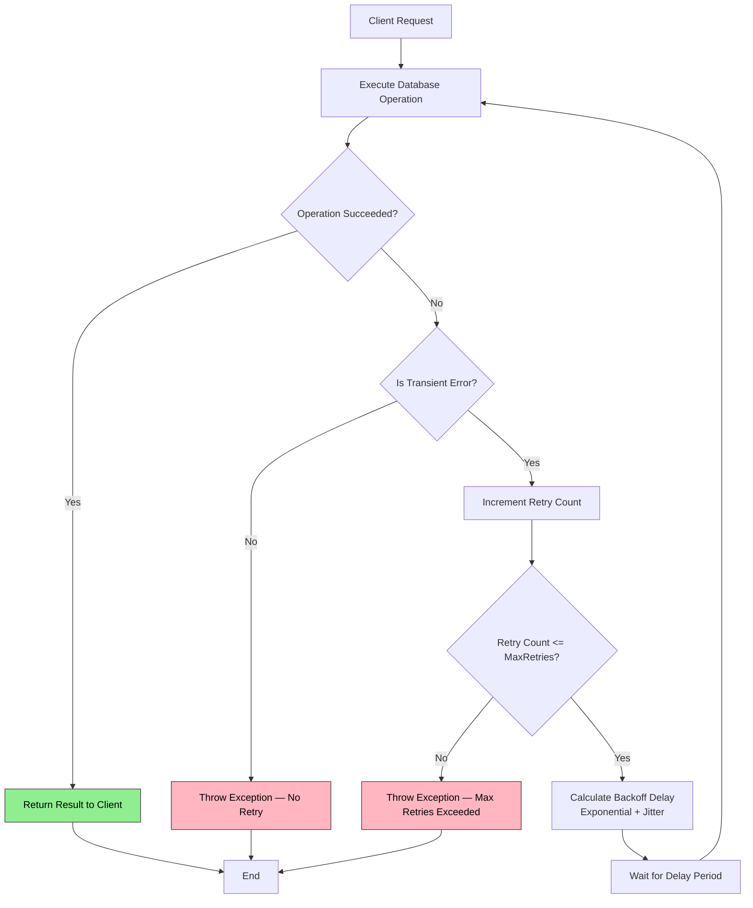
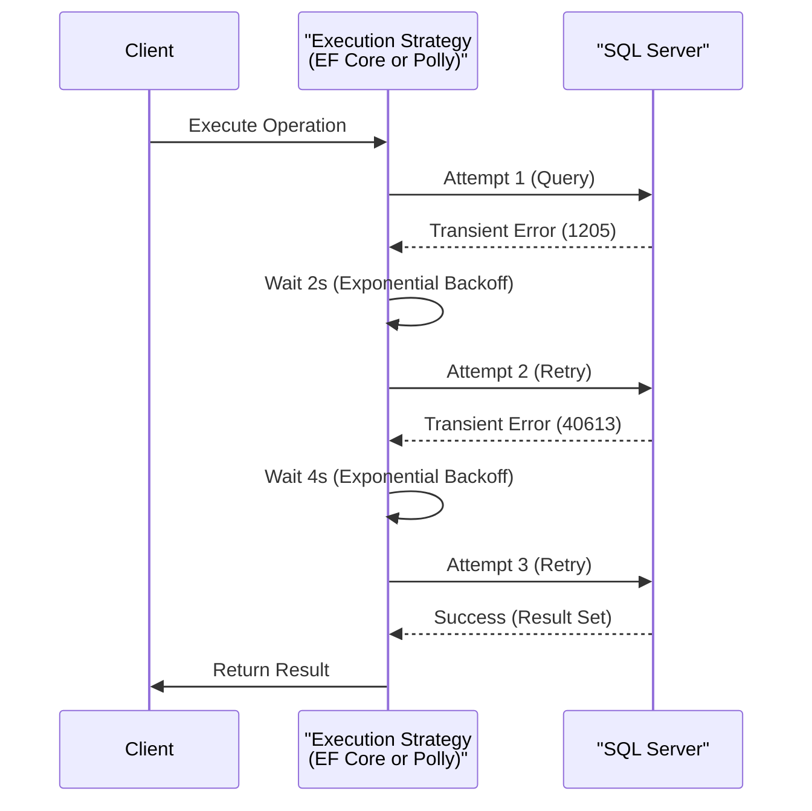

# Connection Resiliency — EnableRetryOnFailure

## 1 — Overview

Connection resiliency refers to the ability of a database client to automatically recover from transient faults — short-lived, intermittent failures that resolve on their own. These include network blips, connection pool exhaustion, deadlock victims (error 1205), Azure SQL throttling, and TLS negotiation failures. Retrying the operation after a brief delay often succeeds.

EF Core provides built-in retry logic via `EnableRetryOnFailure` in the SQL Server provider. Dapper, being a lightweight micro-ORM, offers no such built-in mechanism — you must layer retry on top using a library like Polly.

| Aspect | EF Core | Dapper |
|--------|---------|--------|
| Built-in retry | Yes (`EnableRetryOnFailure`) | No (requires Polly) |
| Default retry count | 0 (disabled) | N/A |
| Retryable exceptions | Automatic detection for SQL Server transient errors | Manual policy configuration |
| Execution strategy | Scoped to `DbContext` lifetime | Scoped to delegate invocation |
| Logging | Integrated with EF Core logging | Custom via Polly's `OnRetry` |

The goal of this note is to demonstrate both approaches with realistic configuration, highlight the differences, and document common pitfalls.

## 2 — Configuration — EF Core EnableRetryOnFailure

`EnableRetryOnFailure` is an extension method on `SqlServerDbContextOptionsBuilder`. It configures an `IExecutionStrategy` that wraps all database operations sent through the `DbContext`.

```csharp
public class AppDbContext : DbContext
{
    public DbSet<Product> Products { get; set; }
    public DbSet<Order> Orders { get; set; }

    protected override void OnConfiguring(DbContextOptionsBuilder optionsBuilder)
    {
        optionsBuilder.UseSqlServer(
            "Server=tcp:myserver.database.windows.net,1433;Database=mydb;...",
            sqlOptions =>
            {
                sqlOptions.EnableRetryOnFailure(
                    maxRetryCount: 5,
                    maxRetryDelay: TimeSpan.FromSeconds(30),
                    errorNumbersToAdd: null
                );
            });
    }
}
```

The three parameters:

1. **maxRetryCount** — Maximum number of retry attempts (not including the original attempt).
2. **maxRetryDelay** — Maximum total delay across all retries. The actual delay per attempt is calculated using exponential backoff with random jitter, capped by this value.
3. **errorNumbersToAdd** — Optional set of additional SQL Server error numbers to treat as transient. When `null`, EF Core uses its built-in list of known transient errors (e.g., 1205, 1222, 4060, 40197, 40501, 40613).

### 2.1 — Execution Strategy Default

When `EnableRetryOnFailure` is configured, EF Core automatically uses `SqlServerRetryingExecutionStrategy`. This strategy retries the entire operation scope, meaning that if you call `SaveChangesAsync` and it fails mid-way, the entire batch is retried from scratch. This is critical for correctness because partial writes are not automatically rolled back within a failed batch.

```csharp
// The execution strategy wraps the entire scope
var strategy = dbContext.Database.CreateExecutionStrategy();
await strategy.ExecuteAsync(async () =>
{
    using var transaction = await dbContext.Database.BeginTransactionAsync();

    dbContext.Orders.Add(new Order { ... });
    await dbContext.SaveChangesAsync();

    dbContext.Invoices.Add(new Invoice { ... });
    await dbContext.SaveChangesAsync();

    await transaction.CommitAsync();
});
```

If `SaveChangesAsync` fails on the second call, the entire delegate is retried, including the first `SaveChangesAsync`. This ensures consistency.

### 2.2 — Disabling Retry Per Operation

Sometimes you want to disable retry for specific operations (e.g., non-idempotent writes). You can suppress the execution strategy temporarily:

```csharp
// Disable retry for a single operation
await dbContext.Database.CreateExecutionStrategy()
    .ExecuteAsync(async () =>
    {
        // Non-idempotent operation with manual retry handling
        try
        {
            await dbContext.SaveChangesAsync();
        }
        catch (SqlException ex) when (IsTransient(ex))
        {
            // Log and rethrow — do not retry
            _logger.LogError(ex, "Transient error on non-idempotent operation");
            throw;
        }
    });
```

## 3 — Implementation — Polly for Dapper

Dapper has no execution strategy. You must wrap connection creation and query execution in a Polly retry policy.

### 3.1 — Basic Polly Retry Policy

```csharp
using Polly;
using Polly.Retry;

public static class RetryPolicies
{
    public static AsyncRetryPolicy DefaultRetryPolicy { get; } =
        Policy
            .Handle<SqlException>(ex => IsTransientSqlError(ex.Number))
            .Or<TimeoutException>()
            .WaitAndRetryAsync(
                retryCount: 3,
                sleepDurationProvider: attempt => TimeSpan.FromSeconds(Math.Pow(2, attempt)),
                onRetry: (exception, timeSpan, retryCount, context) =>
                {
                    Console.WriteLine($"[Retry {retryCount}] {exception.Message}. Waiting {timeSpan}.");
                }
            );

    private static bool IsTransientSqlError(int number) => number switch
    {
        // Deadlock
        1205 => true,
        // Lock request time-out
        1222 => true,
        // Cannot open database
        4060 => true,
        // Authentication failed
        18456 => true,
        // Service encountered an error
        40197 => true,
        // Database not yet available
        40501 => true,
        // Database is not available
        40613 => true,
        // Client time-out
        -2 => true,
        // General network error
        11 => true,
        _ => false
    };
}
```

### 3.2 — Wrapping Connection Creation and Queries

```csharp
public class DapperProductRepository
{
    private readonly string _connectionString;
    private readonly AsyncRetryPolicy _retryPolicy;

    public DapperProductRepository(string connectionString)
    {
        _connectionString = connectionString;
        _retryPolicy = RetryPolicies.DefaultRetryPolicy;
    }

    public async Task<IEnumerable<Product>> GetProductsAsync()
    {
        return await _retryPolicy.ExecuteAsync(async () =>
        {
            await using var connection = new SqlConnection(_connectionString);
            await connection.OpenAsync();

            return await connection.QueryAsync<Product>(
                "SELECT ProductId, Name, Price FROM Products"
            );
        });
    }

    public async Task<int> InsertProductAsync(Product product)
    {
        // Non-idempotent operation — retry only if failure is safe to retry
        return await _retryPolicy.ExecuteAsync(async () =>
        {
            await using var connection = new SqlConnection(_connectionString);
            await connection.OpenAsync();

            return await connection.ExecuteAsync(
                "INSERT INTO Products (Name, Price) VALUES (@Name, @Price)",
                new { product.Name, product.Price }
            );
        });
    }
}
```

### 3.3 — Advanced Polly — Exponential Backoff with Jitter

The built-in `WaitAndRetryAsync` supports exponential backoff. For production systems, add jitter to avoid the thundering herd problem when many clients retry simultaneously.

```csharp
public static AsyncRetryPolicy JitteredRetryPolicy { get; } =
    Policy
        .Handle<SqlException>(ex => IsTransientSqlError(ex.Number))
        .Or<TimeoutException>()
        .WaitAndRetryAsync(
            retryCount: 5,
            sleepDurationProvider: attempt =>
            {
                var baseDelay = TimeSpan.FromSeconds(Math.Pow(2, attempt));
                var jitter = TimeSpan.FromMilliseconds(new Random().Next(0, 1000));
                return baseDelay + jitter;
            },
            onRetry: (exception, timeSpan, retryCount, context) =>
            {
                // Log retry attempt
            }
        );
```

### 3.4 — Polly Context for Correlation

Use `Polly.Context` to pass correlation IDs or other metadata through retry attempts for better logging.

```csharp
var context = new Polly.Context
{
    ["CorrelationId"] = Guid.NewGuid().ToString()
};

await _retryPolicy.ExecuteAsync(async (ctx) =>
{
    _logger.LogInformation("Attempt with correlation {CorrelationId}", ctx["CorrelationId"]);
    // Execute query
}, context);
```

## 4 — Code Examples — Full Solutions

### 4.1 — EF Core — Full Retry Configuration

```csharp
public class ResilientDbContext : DbContext
{
    private readonly ILogger<ResilientDbContext> _logger;

    public ResilientDbContext(DbContextOptions<ResilientDbContext> options, ILogger<ResilientDbContext> logger)
        : base(options)
    {
        _logger = logger;
    }

    public DbSet<Order> Orders { get; set; }
    public DbSet<OrderItem> OrderItems { get; set; }

    public override async Task<int> SaveChangesAsync(CancellationToken cancellationToken = default)
    {
        var strategy = Database.CreateExecutionStrategy();
        return await strategy.ExecuteAsync(async () =>
        {
            using var transaction = await Database.BeginTransactionAsync(cancellationToken);
            try
            {
                var result = await base.SaveChangesAsync(cancellationToken);
                await transaction.CommitAsync(cancellationToken);
                return result;
            }
            catch
            {
                await transaction.RollbackAsync(cancellationToken);
                throw;
            }
        });
    }
}

// Registration in Program.cs
builder.Services.AddDbContext<ResilientDbContext>(options =>
{
    options.UseSqlServer(
        builder.Configuration.GetConnectionString("DefaultConnection"),
        sqlOptions =>
        {
            sqlOptions.EnableRetryOnFailure(
                maxRetryCount: 5,
                maxRetryDelay: TimeSpan.FromSeconds(30),
                errorNumbersToAdd: new[] { 8989, 8990 } // Custom transient errors
            );

            sqlOptions.CommandTimeout(60); // 60-second command timeout
        });
});
```

### 4.2 — Dapper — Full Polly Integration

```csharp
public class ResilientDapperService
{
    private readonly string _connectionString;
    private readonly AsyncRetryPolicy _retryPolicy;
    private readonly ILogger<ResilientDapperService> _logger;

    public ResilientDapperService(
        string connectionString,
        ILogger<ResilientDapperService> logger)
    {
        _connectionString = connectionString;
        _logger = logger;
        _retryPolicy = BuildRetryPolicy();
    }

    private AsyncRetryPolicy BuildRetryPolicy()
    {
        return Policy
            .Handle<SqlException>(ex => IsTransient(ex))
            .Or<TimeoutException>()
            .WaitAndRetryAsync(
                retryCount: 5,
                sleepDurationProvider: attempt =>
                {
                    var delay = TimeSpan.FromSeconds(Math.Pow(2, attempt));
                    var jitter = TimeSpan.FromMilliseconds(Random.Shared.Next(0, 500));
                    return delay + jitter;
                },
                onRetry: (exception, timeSpan, retryCount, context) =>
                {
                    _logger.LogWarning(
                        exception,
                        "[Retry {RetryCount}/{MaxRetries}] Transient error. Waiting {Delay}ms. Operation: {Operation}",
                        retryCount, 5, timeSpan.TotalMilliseconds,
                        context["OperationName"]);
                }
            );
    }

    public async Task<T> QueryAsync<T>(string sql, object parameters = null, string operationName = "")
    {
        var context = new Polly.Context
        {
            ["OperationName"] = operationName
        };

        return await _retryPolicy.ExecuteAsync(async (ctx) =>
        {
            await using var connection = new SqlConnection(_connectionString);
            await connection.OpenAsync();
            return await connection.QueryAsync<T>(sql, parameters);
        }, context);
    }

    public async Task<int> ExecuteAsync(string sql, object parameters = null, string operationName = "")
    {
        var context = new Polly.Context
        {
            ["OperationName"] = operationName
        };

        return await _retryPolicy.ExecuteAsync(async (ctx) =>
        {
            await using var connection = new SqlConnection(_connectionString);
            await connection.OpenAsync();
            return await connection.ExecuteAsync(sql, parameters);
        }, context);
    }

    private static bool IsTransient(SqlException ex)
    {
        return ex.Number switch
        {
            1205 => true,  // Deadlock
            1222 => true,  // Lock timeout
            4060 => true,  // Cannot open database
            40197 => true,  // Service error
            40501 => true,  // Service busy
            40613 => true,  // Database not available
            -2   => true,  // Client timeout
            11   => true,  // Network error
            _    => false
        };
    }
}

// Usage example
var service = new ResilientDapperService(connectionString, logger);
var products = await service.QueryAsync<Product>(
    "SELECT ProductId, Name, Price FROM Products WHERE IsActive = 1",
    operationName: "GetActiveProducts"
);
```

## 5 — Mermaid — Retry Flow





## 6 — Gotchas

### 6.1 — Non-Idempotent Operations (INSERT with Auto-Increment)

Retrying an INSERT that succeeded on the server but failed to acknowledge (network drop before response) causes duplicate rows. Mitigation strategies:

- Use application-side unique identifiers (e.g., GUID PK) so duplicates fail on PK violation.
- Use database-generated sequences with `NO CYCLE` and rely on the application to detect duplicates.
- For EF Core, wrap the operation in an execution strategy that includes duplicate detection.

```csharp
// Mitigation: Use GUID PK to make INSERT idempotent
public class Order
{
    public Guid OrderId { get; set; } = Guid.NewGuid();
    // ...
}
```

### 6.2 — Execution Strategy Scope in EF Core

The execution strategy wraps the **entire delegate**. If you call `SaveChangesAsync` multiple times within the same delegate, a failure on the second call retries **both** calls. This is correct for transactions but can lead to unexpected duplicate work if the first call emits side effects (e.g., sending emails, writing to queue).

```csharp
// BAD: Side effect inside retry scope
await strategy.ExecuteAsync(async () =>
{
    await dbContext.SaveChangesAsync(); // Writes to DB
    await emailService.SendAsync("Order confirmed"); // Could be sent multiple times
});
```

Fix: move side effects outside the execution strategy, or use a `CircuitBreaker` that catches duplicate sends.

### 6.3 — Max Retry Count vs Total Timeout

The `maxRetryDelay` parameter caps the **per-attempt** delay, not the **total** elapsed time across all retries. If you configure `maxRetryCount: 10` and `maxRetryDelay: TimeSpan.FromSeconds(30)`, and each delay is 30 seconds, the total could be up to 5 minutes.

For Dapper, the Polly `TimeoutPolicy` can be wrapped around the retry policy to cap total time:

```csharp
var totalTimeout = Policy.TimeoutAsync(TimeSpan.FromSeconds(60), TimeoutStrategy.Optimistic);
var wrappedPolicy = totalTimeout.WrapAsync(_retryPolicy);
```

### 6.4 — Connection Pool Exhaustion

Each retry attempt opens a new `SqlConnection` (when using Dapper). If retries are aggressive and the pool is small, you may exhaust the connection pool. Use `Max Pool Size` in the connection string:

```
Server=tcp:myserver.database.windows.net;Database=mydb;Max Pool Size=200;
```

### 6.5 — EF Core Default Execution Strategy Without Retry

By default, EF Core uses `ExecutionStrategy` (not retrying). If you call `DbContext.SaveChanges()` inside a transaction without an explicit execution strategy, the transaction is **not** retried. You must call `CreateExecutionStrategy` explicitly.

```csharp
// This does NOT retry automatically
using var transaction = await dbContext.Database.BeginTransactionAsync();
await dbContext.SaveChangesAsync();
await transaction.CommitAsync();

// This DOES retry
var strategy = dbContext.Database.CreateExecutionStrategy();
await strategy.ExecuteAsync(async () =>
{
    using var transaction = await dbContext.Database.BeginTransactionAsync();
    await dbContext.SaveChangesAsync();
    await transaction.CommitAsync();
});
```

### 6.6 — Logging and Telemetry

Without proper logging, retries are invisible in production. Always log retry attempts with correlation IDs, delay durations, error codes, and operation names.

### 6.7 — Retry on Read Operations

Read operations (SELECT) are idempotent and safe to retry. Always enable retry for reads. Writes require careful consideration.

### 6.8 — Database-Level Triggers and Side Effects

If a trigger fires on INSERT and has side effects (e.g., calling a webhook, writing to another table), retrying the INSERT could trigger those side effects multiple times. Use `INSTEAD OF` triggers with idempotency checks.

## 7 — Best Practices

### 7.1 — Retry Policy Configuration

| Scenario | Max Retries | Base Delay | Max Delay |
|----------|-------------|------------|-----------|
| Read-only queries | 5 | 1s | 30s |
| Write operations (idempotent) | 3 | 1s | 15s |
| Write operations (non-idempotent) | 0 (no retry) | N/A | N/A |
| Azure SQL (throttling prone) | 5 | 2s | 60s |
| Batch/bulk operations | 3 | 5s | 120s |

### 7.2 — Use Circuit Breaker for Downstream Protection

Pair retry with a circuit breaker pattern to avoid hammering a failing database:

```csharp
var circuitBreaker = Policy
    .Handle<SqlException>(ex => IsTransient(ex))
    .CircuitBreakerAsync(
        handledEventsAllowedBeforeBreaking: 5,
        durationOfBreak: TimeSpan.FromMinutes(1),
        onBreak: (ex, duration) => _logger.LogCritical("Circuit broken for {Duration}", duration),
        onReset: () => _logger.LogInformation("Circuit reset")
    );

var wrappedPolicy = circuitBreaker.WrapAsync(_retryPolicy);
```

### 7.3 — Prefer EF Core Execution Strategy Over Polly for EF Core Queries

EF Core's execution strategy integrates with the change tracker, transaction scope, and second-level cache. Using Polly on top of EF Core can lead to duplicate `SaveChanges` calls. Let EF Core handle retry internally.

For Dapper, Polly is the only option.

### 7.4 — Test Retry Behavior Locally

Simulate transient failures during integration tests using a proxy (e.g., `Proxyman`, `Fiddler`, or a custom `DbConnection` wrapper) that randomly drops connections.

```csharp
public class FlakyConnection : DbConnection
{
    private readonly SqlConnection _inner;
    private readonly double _failureRate;

    public FlakyConnection(string connectionString, double failureRate = 0.2)
    {
        _inner = new SqlConnection(connectionString);
        _failureRate = failureRate;
    }

    public override async Task OpenAsync(CancellationToken cancellationToken = default)
    {
        if (Random.Shared.NextDouble() < _failureRate)
            throw new SqlException("Simulated transient failure", 40613);
        await _inner.OpenAsync(cancellationToken);
    }
}
```

### 7.5 — Structured Logging for Retries

```csharp
onRetry: (exception, timeSpan, retryCount, context) =>
{
    _logger.LogWarning(
        "Retry {RetryCount} for operation {OperationName} after {DelayMs}ms. Error: {ErrorNumber} - {ErrorMessage}",
        retryCount,
        context["OperationName"],
        timeSpan.TotalMilliseconds,
        ((SqlException)exception).Number,
        exception.Message);
}
```

## 8 — Related Notes

- **[[8.875 — Dapper — Integration with Polly — Retry]]** — Deep dive on Polly configuration for Dapper.
- **[[8.870 — Dapper — Connection Factory Pattern]]** — Connection factory that works with retry policies.
- **[[8.876 — Dapper — Connection Management — Open and Close]]** — Best practices for connection lifetime.
- **[[3.080 — EF Core — Connection Resiliency]]** — Official EF Core documentation for connection resiliency.
- **[[7.435 — Transient Fault Handling]]** — General transient fault handling patterns outside of databases.
- **[[8.913 — Many-to-Many in EF Core — Join Table Configuration]]** — Related data access pattern.
- **[[8.909 — Connection Resiliency — EnableRetryOnFailure]]** — This note.

## 9 — References

| Resource | URL |
|----------|-----|
| EF Core Connection Resiliency | https://learn.microsoft.com/en-us/ef/core/miscellaneous/connection-resiliency |
| Polly — Wait and Retry | https://github.com/App-vNext/Polly/wiki/Retry |
| SQL Server Transient Errors | https://learn.microsoft.com/en-us/azure/azure-sql/database/troubleshoot-common-connectivity-issues |
| Transient Fault Handling Application Block | https://learn.microsoft.com/en-us/previous-versions/msp-n-p/hh680934(v=pandp.50) |
| Dapper GitHub | https://github.com/DapperLib/Dapper |
| Polly — Circuit Breaker | https://github.com/App-vNext/Polly/wiki/Circuit-Breaker |

## Appendix A — Complete SQL Transient Error Reference

The following SQL Server error numbers are considered transient by EF Core's `SqlServerRetryingExecutionStrategy`:

| Error Number | Description |
|-------------|-------------|
| 1205 | Deadlock |
| 1222 | Lock request time-out period exceeded |
| 4060 | Cannot open database requested by login |
| 40197 | The service encountered an error processing your request |
| 40501 | The service is currently busy |
| 40613 | Database '...' is not currently available |
| 49918 | Cannot process request — not enough resources |
| 49919 | Cannot process create/update request — too many operations |
| 49920 | Cannot process request — too many operations in progress |
| 8989 | Custom transient error (example addition) |
| 8990 | Another custom transient error (example addition) |
| -2 | Client time-out |
| 11 | General network error |
| 10053 | An established connection was aborted by the software in your host machine |
| 10054 | An existing connection was forcibly closed by the remote host |
| 10060 | A connection attempt failed because the connected party did not properly respond |

## Appendix B — Comparison Table

| Feature | EF Core EnableRetryOnFailure | Dapper + Polly |
|---------|------------------------------|----------------|
| Setup effort | 1 line in `UseSqlServer` | ~40 lines policy configuration |
| Retry scope | Automatic for all `DbContext` operations | Manual wrapping per call |
| Transient error detection | Built-in for SQL Server | Must define manually |
| Backoff algorithm | Exponential + random jitter | Configurable (exponential fixed, jitter, constant) |
| Transaction awareness | Full (retry entire transaction scope) | Manual (retry entire delegate) |
| Circuit breaker | Not included | Available via Polly |
| Logging | Via EF Core `ILogger` | Via Polly `OnRetry` callback |
| Cancellation support | Via `CancellationToken` | Via `CancellationToken` |
| Testing | Unit test via `IDbContextFactory` | Unit test via mock `IDbConnection` |

## Appendix C — Sample Connection Strings for Different Environments

```text
// Local Development (SQL Server Express)
Server=.\\SQLEXPRESS;Database=ShopDb;Trusted_Connection=True;TrustServerCertificate=True;Max Pool Size=100;

// Azure SQL Database
Server=tcp:myserver.database.windows.net,1433;Database=ShopDb;User Id=admin;Password=***;Encrypt=True;TrustServerCertificate=False;Connection Timeout=30;Max Pool Size=200;

// SQL Server in Docker
Server=localhost,1433;Database=ShopDb;User Id=sa;Password=YourStrong!Pass;TrustServerCertificate=True;Max Pool Size=100;

// SQL Server Failover / Availability Group
Server=tcp:myaglistener.database.windows.net;Database=ShopDb;MultiSubnetFailover=True;ApplicationIntent=ReadWrite;
```

## Appendix D — Full Program.cs for EF Core + Dapper Resiliency

```csharp
var builder = WebApplication.CreateBuilder(args);

// EF Core with retry
builder.Services.AddDbContext<AppDbContext>(options =>
{
    options.UseSqlServer(
        builder.Configuration.GetConnectionString("DefaultConnection"),
        sql => sql.EnableRetryOnFailure(5, TimeSpan.FromSeconds(30), null));
});

// Dapper with Polly retry (singleton)
builder.Services.AddSingleton<ResilientDapperService>(sp =>
{
    var connStr = builder.Configuration.GetConnectionString("DefaultConnection");
    var logger = sp.GetRequiredService<ILogger<ResilientDapperService>>();
    return new ResilientDapperService(connStr, logger);
});

// Health checks
builder.Services.AddHealthChecks()
    .AddDbContextCheck<AppDbContext>("ef-core", tags: ["database"])
    .AddTypeActivatedCheck<DapperHealthCheck>("dapper", tags: ["database"]);

var app = builder.Build();

app.MapHealthChecks("/health", new HealthCheckOptions
{
    Predicate = _ => true
});

app.Run();
```

## Appendix E — Retry Statistics Counter

```csharp
public class RetryMetrics
{
    private long _totalRetries;
    private long _failedOperations;
    private long _successfulOperations;

    public void RecordRetry() => Interlocked.Increment(ref _totalRetries);
    public void RecordSuccess() => Interlocked.Increment(ref _successfulOperations);
    public void RecordFailure() => Interlocked.Increment(ref _failedOperations);

    public (long totalRetries, long succeeded, long failed) Snapshot =>
        (_totalRetries, _successfulOperations, _failedOperations);
}

// Usage in OnRetry callback
onRetry: (exception, timeSpan, retryCount, context) =>
{
    metrics.RecordRetry();
    logger.LogWarning("Retry {Count}", retryCount);
}
```

## Appendix F — Testing Retry Logic

```csharp
[Fact]
public async Task ExecuteAsync_RetriesOnTransientError_ReturnsResult()
{
    // Arrange
    var mockConn = new Mock<IDbConnection>();
    mockConn.SetupSequence(x => x.QueryAsync<Product>(It.IsAny<string>(), null, null, null, null))
        .ThrowsAsync(new SqlException("Deadlock", 1205))
        .ThrowsAsync(new SqlException("Deadlock", 1205))
        .ReturnsAsync(new[] { new Product { Name = "Test" } });

    var service = new ResilientDapperService(connectionString, NullLogger<ResilientDapperService>.Instance);

    // Act
    var result = await service.QueryAsync<Product>("SELECT * FROM Products");

    // Assert
    Assert.Single(result);
    mockConn.Verify(x => x.QueryAsync<Product>(It.IsAny<string>(), null, null, null, null), Times.Exactly(3));
}
```

## Appendix G — Polly ResiliencePipeline (Polly v8+)

Polly v8 introduced `ResiliencePipeline` as the replacement for `AsyncRetryPolicy`. The API is different but functionally equivalent.

```csharp
using Polly;
using Polly.Retry;

public static class ResiliencePipelines
{
    public static ResiliencePipeline DatabaseResiliencePipeline { get; } =
        new ResiliencePipelineBuilder()
            .AddRetry(new RetryStrategyOptions
            {
                ShouldHandle = new PredicateBuilder()
                    .Handle<SqlException>(ex => IsTransient(ex.Number))
                    .Handle<TimeoutException>(),
                MaxRetryAttempts = 5,
                DelayGenerator = static args =>
                {
                    var delay = TimeSpan.FromSeconds(Math.Pow(2, args.AttemptNumber));
                    var jitter = TimeSpan.FromMilliseconds(Random.Shared.Next(0, 500));
                    return ValueTask.FromResult<TimeSpan?>(delay + jitter);
                },
                OnRetry = static args =>
                {
                    Console.WriteLine($"[Polly v8] Retry {args.AttemptNumber} after {args.RetryDelay.TotalMilliseconds}ms");
                    return default;
                }
            })
            .Build();

    private static bool IsTransient(int errorNumber) => errorNumber switch
    {
        1205 or 1222 or 4060 or 40197 or 40501 or 40613 or -2 or 11 => true,
        _ => false
    };
}

// Usage
await ResiliencePipelines.DatabaseResiliencePipeline.ExecuteAsync(async cancellationToken =>
{
    await using var conn = new SqlConnection(connectionString);
    await conn.OpenAsync(cancellationToken);
    await conn.ExecuteAsync("SELECT 1", cancellationToken: cancellationToken);
}, cancellationToken);
```

## Appendix H — Retry with Exponential Backoff Visualization

```text
Attempt 1 (original):  +-- Execute ----------------------------> FAIL (1205)
                        |
Attempt 2 (retry 1):    +-- Wait 2s ... +-- Execute -----------> FAIL (40613)
                        |
Attempt 3 (retry 2):    +-- Wait 4s ... +-- Execute -----------> FAIL (40197)
                        |
Attempt 4 (retry 3):    +-- Wait 8s ... +-- Execute -----------> SUCCESS
                        |
Total elapsed: ~14s + execution times
```

## Appendix I — Application Insights Integration

Track retry attempts as custom telemetry events for monitoring:

```csharp
public class TelemetryRetryPolicy
{
    private readonly AsyncRetryPolicy _policy;
    private readonly TelemetryClient _telemetry;

    public TelemetryRetryPolicy(TelemetryClient telemetry)
    {
        _telemetry = telemetry;
        _policy = Policy
            .Handle<SqlException>(ex => IsTransient(ex.Number))
            .WaitAndRetryAsync(
                5,
                attempt => TimeSpan.FromSeconds(Math.Pow(2, attempt)),
                (exception, timespan, retryCount, context) =>
                {
                    _telemetry.TrackEvent("DatabaseRetry", new Dictionary<string, string>
                    {
                        ["RetryCount"] = retryCount.ToString(),
                        ["Operation"] = context["OperationName"]?.ToString() ?? "Unknown",
                        ["ErrorNumber"] = ((SqlException)exception).Number.ToString(),
                        ["DelayMs"] = timespan.TotalMilliseconds.ToString("F0")
                    });
                });
    }
}
```

## Appendix J — Retry Policy for Different Database Providers

```csharp
// PostgreSQL (Npgsql)
public static AsyncRetryPolicy PostgresRetryPolicy { get; } =
    Policy
        .Handle<PostgresException>(ex => ex.SqlState switch
        {
            "40001" => true,  // serialization failure
            "40P01" => true,  // deadlock detected
            "57P01" => true,  // admin shutdown
            _ => false
        })
        .WaitAndRetryAsync(3, attempt => TimeSpan.FromSeconds(Math.Pow(2, attempt)));

// MySQL (MySqlConnector)
public static AsyncRetryPolicy MySqlRetryPolicy { get; } =
    Policy
        .Handle<MySqlException>(ex => ex.Number switch
        {
            1205 => true,  // lock wait timeout
            1213 => true,  // deadlock
            2006 => true,  // MySQL server has gone away
            _ => false
        })
        .WaitAndRetryAsync(3, attempt => TimeSpan.FromSeconds(Math.Pow(2, attempt)));

// Azure SQL with custom transient error codes
public static AsyncRetryPolicy AzureSqlRetryPolicy { get; } =
    Policy
        .Handle<SqlException>(ex => ex.Number switch
        {
            1205 or 1222 or 4060 or 40197 or 40501 or 40613 or 49918 or 49919 or 49920 => true,
            _ => false
        })
        .Or<TimeoutException>()
        .WaitAndRetryAsync(
            6,
            attempt => TimeSpan.FromSeconds(Math.Min(60, Math.Pow(2, attempt))),
            onRetry: (ex, ts, retry, ctx) =>
            {
                // Log to Azure Monitor
            });
```

## Appendix K — Read-Only vs Read-Write Connections with Retry

Use different retry policies for read-only and read-write operations:

```csharp
public class DatabaseRetryPolicies
{
    // Read operations: more retries, shorter backoff
    public static readonly AsyncRetryPolicy ReadPolicy =
        Policy
            .Handle<SqlException>(ex => IsTransient(ex.Number))
            .WaitAndRetryAsync(
                5,
                attempt => TimeSpan.FromMilliseconds(100 * Math.Pow(2, attempt)),
                onRetry: (ex, ts, retry, ctx) => LogRetry("READ", retry, ex));

    // Write operations: fewer retries, longer backoff
    public static readonly AsyncRetryPolicy WritePolicy =
        Policy
            .Handle<SqlException>(ex => IsTransient(ex.Number) && ex.Number != 1205)
            .WaitAndRetryAsync(
                3,
                attempt => TimeSpan.FromSeconds(Math.Pow(2, attempt)),
                onRetry: (ex, ts, retry, ctx) => LogRetry("WRITE", retry, ex));

    // Idempotent writes: allow retry on all transient errors
    public static readonly AsyncRetryPolicy IdempotentWritePolicy =
        Policy
            .Handle<SqlException>(ex => IsTransient(ex.Number))
            .WaitAndRetryAsync(3, attempt => TimeSpan.FromSeconds(Math.Pow(2, attempt)));

    // Non-idempotent writes: no retry, fail fast
    public static readonly AsyncRetryPolicy NoRetryPolicy =
        Policy
            .Handle<SqlException>()
            .WaitAndRetryAsync(0, _ => TimeSpan.Zero);
}
```

## Appendix L — Distributed Tracing with Polly

Pass trace context through Polly retries for end-to-end tracing:

```csharp
public class DistributedTracingRetry
{
    private readonly AsyncRetryPolicy _policy;

    public DistributedTracingRetry(ILogger logger)
    {
        _policy = Policy
            .Handle<SqlException>(ex => IsTransient(ex.Number))
            .WaitAndRetryAsync(
                3,
                attempt => TimeSpan.FromSeconds(Math.Pow(2, attempt)),
                (exception, timespan, retryCount, context) =>
                {
                    var traceId = Activity.Current?.TraceId.ToString() ?? "none";
                    var spanId = Activity.Current?.SpanId.ToString() ?? "none";

                    logger.LogWarning(
                        exception,
                        "DB retry {Count}: Trace={TraceId}, Span={SpanId}",
                        retryCount, traceId, spanId);
                });
    }

    public async Task<T> ExecuteAsync<T>(Func<CancellationToken, Task<T>> operation,
        CancellationToken ct)
    {
        using var activity = Activity.Current?.Source.StartActivity("DatabaseRetry");
        var context = new Polly.Context();
        return await _policy.ExecuteAsync(async (ctx) =>
        {
            return await operation(ct);
        }, context, ct);
    }
}
```

## Appendix M — Retry and Timeout Policy Composition

```csharp
public static class PolicyComposition
{
    // Outer: total timeout for the entire operation (including retries)
    private static readonly AsyncTimeoutPolicy TotalTimeoutPolicy =
        Policy.TimeoutAsync(TimeSpan.FromSeconds(60), TimeoutStrategy.Pessimistic);

    // Middle: retry on transient errors
    private static readonly AsyncRetryPolicy RetryPolicy =
        Policy
            .Handle<SqlException>(ex => IsTransient(ex.Number))
            .WaitAndRetryAsync(
                3,
                attempt => TimeSpan.FromSeconds(Math.Pow(2, attempt)),
                onRetry: (ex, ts, retry, ctx) => { });

    // Inner: per-attempt timeout
    private static readonly AsyncTimeoutPolicy PerAttemptTimeoutPolicy =
        Policy.TimeoutAsync(TimeSpan.FromSeconds(15), TimeoutStrategy.Optimistic);

    // Composed: total timeout wraps retry, which wraps per-attempt timeout
    public static readonly AsyncPolicy CompositePolicy =
        TotalTimeoutPolicy.WrapAsync(RetryPolicy.WrapAsync(PerAttemptTimeoutPolicy));

    // Usage
    public async Task<T> ExecuteWithCompositePolicy<T>(Func<CancellationToken, Task<T>> operation)
    {
        return await CompositePolicy.ExecuteAsync(async (ctx, ct) =>
        {
            return await operation(ct);
        }, new Polly.Context(), CancellationToken.None);
    }
}
```

## Appendix N — EF Core Execution Strategy with Multiple DbContexts

When using multiple DbContexts within the same execution strategy, ensure all operations are within a single transaction scope:

```csharp
public async Task TransferMoneyAsync(int fromAccountId, int toAccountId, decimal amount)
{
    var strategy = _primaryDbContext.Database.CreateExecutionStrategy();

    await strategy.ExecuteAsync(async () =>
    {
        using var transaction = await _primaryDbContext.Database.BeginTransactionAsync();

        // Use primary DbContext
        var from = await _primaryDbContext.Accounts.FindAsync(fromAccountId);
        from.Balance -= amount;
        await _primaryDbContext.SaveChangesAsync();

        // Use secondary DbContext (same database)
        var to = await _secondaryDbContext.Accounts.FindAsync(toAccountId);
        to.Balance += amount;
        await _secondaryDbContext.SaveChangesAsync();

        await transaction.CommitAsync();
    });
}
```

## Appendix O — Handling Retry for Stored Procedures with Side Effects

```csharp
public class StoredProcedureRetryHandler
{
    private readonly AsyncRetryPolicy _retryPolicy;

    public StoredProcedureRetryHandler()
    {
        _retryPolicy = Policy
            .Handle<SqlException>(ex => IsTransient(ex.Number))
            .WaitAndRetryAsync(3, attempt => TimeSpan.FromSeconds(Math.Pow(2, attempt)));
    }

    public async Task<int> ExecuteIdempotentStoredProcAsync(string procName, object parameters)
    {
        // Stored procedure with side effects — ensure idempotency
        return await _retryPolicy.ExecuteAsync(async () =>
        {
            await using var conn = new SqlConnection(_connectionString);
            await conn.OpenAsync();

            // Use a unique transaction name for idempotency
            var transaction = conn.BeginTransaction("IdempotentTransaction");

            try
            {
                var result = await conn.ExecuteAsync(
                    procName,
                    parameters,
                    transaction: transaction,
                    commandType: CommandType.StoredProcedure);

                transaction.Commit();
                return result;
            }
            catch
            {
                transaction.Rollback();
                throw;
            }
        });
    }
}
```

## Appendix P — Configuration via appsettings.json

```json
{
  "ConnectionStrings": {
    "DefaultConnection": "Server=localhost;Database=ShopDb;Trusted_Connection=True;TrustServerCertificate=True;"
  },
  "RetryPolicy": {
    "Enabled": true,
    "MaxRetryCount": 5,
    "BaseDelaySeconds": 1,
    "MaxDelaySeconds": 30,
    "UseJitter": true,
    "TransientErrorCodes": [1205, 1222, 4060, 40197, 40501, 40613],
    "CircuitBreaker": {
      "Enabled": true,
      "FailureThreshold": 5,
      "BreakDurationMinutes": 1
    }
  }
}

// Strongly-typed options
public class RetryPolicyOptions
{
    public bool Enabled { get; set; } = true;
    public int MaxRetryCount { get; set; } = 5;
    public int BaseDelaySeconds { get; set; } = 1;
    public int MaxDelaySeconds { get; set; } = 30;
    public bool UseJitter { get; set; } = true;
    public int[] TransientErrorCodes { get; set; } = Array.Empty<int>();
    public CircuitBreakerOptions CircuitBreaker { get; set; } = new();
}

public class CircuitBreakerOptions
{
    public bool Enabled { get; set; }
    public int FailureThreshold { get; set; } = 5;
    public int BreakDurationMinutes { get; set; } = 1;
}
```

## Footnotes

1. `EnableRetryOnFailure` is available starting from EF Core 2.0 / 3.1 LTS.
2. Polly v7+ uses `AsyncRetryPolicy`; v8 introduces a new API with `ResiliencePipeline`.
3. The execution strategy in EF Core only applies within the scope of the `DbContext` instance — it does not survive `Dispose`.
4. Always test retry behavior under load — exponential backoff with jitter prevents thundering herd.
5. For Azure SQL, Error 40501 (service busy) indicates DTU throttling; consider scaling up or implementing request queuing.
6. Circuit breaker should be paired with retry to protect downstream resources from cascading failures.
7. Connection string pooling (Max Pool Size) must accommodate health check probes plus application connections.
8. Distributed tracing through retry attempts is critical for diagnosing intermittent failures in production.
