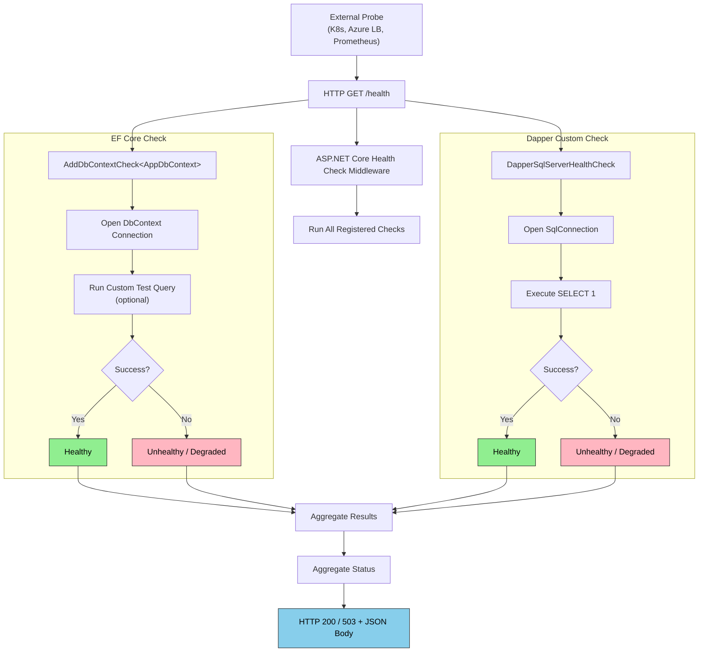
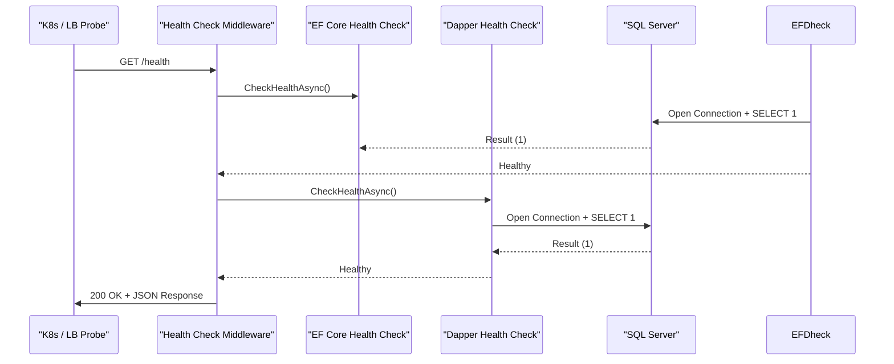

# Database Health Checks — .NET Integration

## 1 — Overview

Health checks expose the operational status of your application to monitoring infrastructure (Kubernetes liveness/readiness probes, Azure Load Balancer probes, Prometheus, Datadog, etc.). ASP.NET Core's built-in health check middleware supports pluggable probes.

Database health checks verify that the database is reachable, responsive, and in an expected state. They are distinct from connection resiliency — health checks are a **read-only probing** mechanism, while resiliency handles transient failures at runtime.

| Approach | EF Core | Dapper |
|----------|---------|--------|
| Built-in health check | `AddDbContextCheck<T>` | None (must implement `IHealthCheck`) |
| Probe type | Pings EF Core's ability to connect | Executes raw SQL (e.g., `SELECT 1`) |
| Dependency injection | Automatic | Manual `IHealthCheck` registration |
| Customization | Custom test query via `AddDbContextCheck` options | Full control over SQL and timeout |
| Tagging | Supports tags for filtering | Supports tags for filtering |

## 2 — Configuration — EF Core Health Check

The `AddDbContextCheck<TContext>` extension method registers a health check that attempts to connect to the database and optionally runs a custom query.

```csharp
// Program.cs
using Microsoft.Extensions.Diagnostics.HealthChecks;

builder.Services.AddHealthChecks()
    .AddDbContextCheck<AppDbContext>(
        name: "ef-core-sql-server",
        failureStatus: HealthStatus.Unhealthy,
        tags: new[] { "database", "sql-server", "primary" },
        customTestQuery: async (context, ct) =>
        {
            var result = await context.Database
                .ExecuteSqlRawAsync("SELECT 1", ct);
            return result == -1
                ? HealthCheckResult.Healthy()
                : HealthCheckResult.Unhealthy("SELECT 1 failed");
        }
    );
```

### 2.1 — Default DbContext Check Behavior

Without a `customTestQuery`, `AddDbContextCheck` opens a connection and verifies it succeeds. It does **not** execute a query. This is sufficient for most liveness probes but less thorough for readiness probes.

```csharp
// Simple — just verifies connection can be opened
builder.Services.AddHealthChecks()
    .AddDbContextCheck<AppDbContext>(
        name: "sql-liveness",
        failureStatus: HealthStatus.Degraded,
        tags: ["liveness"]);
```

### 2.2 — Multiple DbContext Checks

If you have multiple `DbContext` types (e.g., write-primary and read-replica), register a check for each:

```csharp
builder.Services.AddHealthChecks()
    .AddDbContextCheck<WriteDbContext>("ef-core-write", tags: ["database", "write"])
    .AddDbContextCheck<ReadDbContext>("ef-core-read", tags: ["database", "read"]);
```

### 2.3 — Health Check Response Configuration

Configure how health check results are returned via HTTP:

```csharp
app.MapHealthChecks("/health", new HealthCheckOptions
{
    // Return detailed response
    ResponseWriter = async (context, report) =>
    {
        context.Response.ContentType = "application/json";

        var json = JsonSerializer.Serialize(new
        {
            status = report.Status.ToString(),
            duration = report.TotalDuration,
            results = report.Entries.ToDictionary(
                e => e.Key,
                e => new
                {
                    status = e.Value.Status.ToString(),
                    description = e.Value.Description,
                    data = e.Value.Data,
                    duration = e.Value.Duration
                })
        });

        await context.Response.WriteAsync(json);
    },

    // Filter which checks to include
    Predicate = check => check.Tags.Contains("database"),

    // Custom status codes
    ResultStatusCodes =
    {
        [HealthStatus.Healthy] = StatusCodes.Status200OK,
        [HealthStatus.Degraded] = StatusCodes.Status200OK, // Still 200 for degraded
        [HealthStatus.Unhealthy] = StatusCodes.Status503ServiceUnavailable
    }
});
```

## 3 — Implementation — Dapper Custom Health Check

Dapper requires a custom `IHealthCheck` implementation. The check opens a connection, runs a simple query, and reports the result.

```csharp
using Microsoft.Extensions.Diagnostics.HealthChecks;
using Microsoft.Data.SqlClient;

public class DapperSqlServerHealthCheck : IHealthCheck
{
    private readonly string _connectionString;
    private readonly string _testQuery;
    private readonly int _timeoutSeconds;

    public DapperSqlServerHealthCheck(string connectionString, int timeoutSeconds = 5)
    {
        _connectionString = connectionString;
        _testQuery = "SELECT 1";
        _timeoutSeconds = timeoutSeconds;
    }

    public async Task<HealthCheckResult> CheckHealthAsync(
        HealthCheckContext context,
        CancellationToken cancellationToken = default)
    {
        try
        {
            using var cts = CancellationTokenSource.CreateLinkedTokenSource(
                cancellationToken);
            cts.CancelAfter(TimeSpan.FromSeconds(_timeoutSeconds));

            await using var connection = new SqlConnection(_connectionString);
            await connection.OpenAsync(cts.Token);

            using var command = connection.CreateCommand();
            command.CommandText = _testQuery;
            command.CommandTimeout = _timeoutSeconds;

            var result = await command.ExecuteScalarAsync(cts.Token);

            return HealthCheckResult.Healthy(
                "Dapper SQL Server health check succeeded.",
                data: new Dictionary<string, object>
                {
                    ["connectionString"] = MaskConnectionString(_connectionString),
                    ["queryResult"] = result?.ToString(),
                    ["timestamp"] = DateTime.UtcNow
                });
        }
        catch (OperationCanceledException)
        {
            return HealthCheckResult.Unhealthy(
                "Dapper health check timed out.",
                data: new Dictionary<string, object>
                {
                    ["timeoutSeconds"] = _timeoutSeconds,
                    ["timestamp"] = DateTime.UtcNow
                });
        }
        catch (SqlException ex)
        {
            return HealthCheckResult.Unhealthy(
                "Dapper SQL Server health check failed.",
                exception: ex,
                data: new Dictionary<string, object>
                {
                    ["errorNumber"] = ex.Number,
                    ["errorMessage"] = ex.Message,
                    ["timestamp"] = DateTime.UtcNow
                });
        }
    }

    private static string MaskConnectionString(string connStr)
    {
        var builder = new SqlConnectionStringBuilder(connStr);
        builder.Password = "***";
        return builder.ConnectionString;
    }
}
```

### 3.1 — Registration

```csharp
// Program.cs
builder.Services.AddHealthChecks()
    .AddCheck<DapperSqlServerHealthCheck>(
        "dapper-sql-server",
        failureStatus: HealthStatus.Unhealthy,
        tags: ["database", "dapper"]);
```

### 3.2 — Using Options Pattern for Flexibility

```csharp
public class DatabaseHealthCheckOptions
{
    public string ConnectionString { get; set; }
    public string TestQuery { get; set; } = "SELECT 1";
    public int TimeoutSeconds { get; set; } = 5;
    public HealthStatus FailureStatus { get; set; } = HealthStatus.Unhealthy;
}

public class DapperHealthCheckWithOptions : IHealthCheck
{
    private readonly DatabaseHealthCheckOptions _options;
    private readonly ILogger<DapperHealthCheckWithOptions> _logger;

    public DapperHealthCheckWithOptions(
        IOptions<DatabaseHealthCheckOptions> options,
        ILogger<DapperHealthCheckWithOptions> logger)
    {
        _options = options.Value;
        _logger = logger;
    }

    public async Task<HealthCheckResult> CheckHealthAsync(
        HealthCheckContext context,
        CancellationToken cancellationToken = default)
    {
        // Implementation using _options
    }
}

// Registration
builder.Services.Configure<DatabaseHealthCheckOptions>(
    builder.Configuration.GetSection("HealthChecks:Database"));

builder.Services.AddHealthChecks()
    .AddCheck<DapperHealthCheckWithOptions>(
        "dapper-advanced",
        tags: ["database"]);
```

## 4 — Code Examples — Advanced Scenarios

### 4.1 — Read Replica vs Primary Checks

For read-heavy systems, check both the primary (write) and replica (read) endpoints:

```csharp
public class ReadReplicaHealthCheck : IHealthCheck
{
    private readonly string _readReplicaConnectionString;
    private readonly string _primaryConnectionString;

    public ReadReplicaHealthCheck(
        IConfiguration configuration)
    {
        _primaryConnectionString = configuration.GetConnectionString("Primary");
        _readReplicaConnectionString = configuration.GetConnectionString("ReadReplica");
    }

    public async Task<HealthCheckResult> CheckHealthAsync(
        HealthCheckContext context,
        CancellationToken cancellationToken = default)
    {
        var results = new List<(string endpoint, bool healthy)>();

        // Check primary
        results.Add(("primary", await TestConnectionAsync(_primaryConnectionString)));

        // Check replica
        results.Add(("read-replica", await TestConnectionAsync(_readReplicaConnectionString)));

        var allHealthy = results.All(r => r.healthy);
        var status = allHealthy ? HealthStatus.Healthy : HealthStatus.Degraded;

        return new HealthCheckResult(
            status,
            data: results.ToDictionary(r => r.endpoint, r => (object)r.healthy));
    }

    private async Task<bool> TestConnectionAsync(string connStr)
    {
        try
        {
            await using var conn = new SqlConnection(connStr);
            await conn.OpenAsync();
            using var cmd = conn.CreateCommand();
            cmd.CommandText = "SELECT 1";
            await cmd.ExecuteScalarAsync();
            return true;
        }
        catch
        {
            return false;
        }
    }
}
```

### 4.2 — Cached Health Status

Avoid hammering the database on every health probe by caching the result for a short duration:

```csharp
public class CachedDatabaseHealthCheck : IHealthCheck
{
    private readonly DatabaseHealthCheckOptions _options;
    private HealthCheckResult? _cachedResult;
    private DateTime _lastCheck = DateTime.MinValue;
    private readonly TimeSpan _cacheDuration = TimeSpan.FromSeconds(30);
    private readonly object _lock = new();

    public async Task<HealthCheckResult> CheckHealthAsync(
        HealthCheckContext context,
        CancellationToken cancellationToken = default)
    {
        // Return cached result if still fresh
        if (_cachedResult.HasValue &&
            DateTime.UtcNow - _lastCheck < _cacheDuration)
        {
            return _cachedResult.Value;
        }

        var result = await PerformCheckAsync(cancellationToken);

        lock (_lock)
        {
            _cachedResult = result;
            _lastCheck = DateTime.UtcNow;
        }

        return result;
    }

    private async Task<HealthCheckResult> PerformCheckAsync(
        CancellationToken cancellationToken)
    {
        try
        {
            await using var conn = new SqlConnection(_options.ConnectionString);
            await conn.OpenAsync(cancellationToken);
            using var cmd = conn.CreateCommand();
            cmd.CommandText = _options.TestQuery;
            cmd.CommandTimeout = _options.TimeoutSeconds;
            await cmd.ExecuteScalarAsync(cancellationToken);
            return HealthCheckResult.Healthy();
        }
        catch (Exception ex)
        {
            return HealthCheckResult.Unhealthy(exception: ex);
        }
    }
}
```

### 4.3 — Composite Health Check for Multiple Databases

```csharp
public class CompositeDatabaseHealthCheck : IHealthCheck
{
    private readonly IEnumerable<IDatabaseConnectionFactory> _factories;

    public CompositeDatabaseHealthCheck(
        IEnumerable<IDatabaseConnectionFactory> factories)
    {
        _factories = factories;
    }

    public async Task<HealthCheckResult> CheckHealthAsync(
        HealthCheckContext context,
        CancellationToken cancellationToken = default)
    {
        var data = new Dictionary<string, object>();
        var allHealthy = true;

        foreach (var factory in _factories)
        {
            try
            {
                await using var conn = factory.CreateConnection();
                await conn.OpenAsync(cancellationToken);
                using var cmd = conn.CreateCommand();
                cmd.CommandText = "SELECT 1";
                await cmd.ExecuteScalarAsync(cancellationToken);
                data[factory.Name] = "Healthy";
            }
            catch (Exception ex)
            {
                data[factory.Name] = $"Unhealthy: {ex.Message}";
                allHealthy = false;
            }
        }

        return new HealthCheckResult(
            allHealthy ? HealthStatus.Healthy : HealthStatus.Unhealthy,
            data: data);
    }
}
```

### 4.4 — EF Core Custom Test Query with Table-Specific Probe

```csharp
builder.Services.AddHealthChecks()
    .AddDbContextCheck<AppDbContext>(
        name: "ef-core-table-exists",
        failureStatus: HealthStatus.Unhealthy,
        tags: ["database", "schema"],
        customTestQuery: async (db, ct) =>
        {
            // Verify key tables exist
            var tables = new[] { "Products", "Orders", "OrderItems", "Users" };
            foreach (var table in tables)
            {
                var sql = $"SELECT COUNT(*) FROM INFORMATION_SCHEMA.TABLES WHERE TABLE_NAME = '{table}'";
                var count = await db.Database.ExecuteSqlRawAsync(sql, ct);
                // Note: ExecuteSqlRawAsync returns -1 for non-query operations.
                // Use ExecuteSqlRaw for scalar or use FromSqlRaw.
            }

            // Alternative: run a simple query against a known table
            try
            {
                await db.Products.AnyAsync(ct);
                return HealthCheckResult.Healthy("All key tables accessible.");
            }
            catch (Exception ex)
            {
                return HealthCheckResult.Unhealthy(
                    "Key table check failed.", exception: ex);
            }
        }
    );
```

## 5 — Mermaid — Health Check Flow





## 6 — Gotchas

### 6.1 — Health Check Timeout vs Query Timeout

The health check endpoint itself can time out via the ASP.NET Core request timeout. Set an explicit, short timeout for the DB operation (2–5 seconds). A health check that hangs for 30 seconds is worse than one that fails fast.

```csharp
// Set both connection timeout and command timeout
new SqlConnectionStringBuilder(connectionString)
{
    ConnectTimeout = 3, // seconds
};

// And use CancellationTokenSource for the entire check
using var cts = new CancellationTokenSource(TimeSpan.FromSeconds(5));
await connection.OpenAsync(cts.Token);
```

### 6.2 — Aggressive Checking Causes Load

Health checks run on every probe interval. If you configure a 5-second probe interval and the database serves 1000 pods, that is 200 probes/second. Add caching or reduce probe frequency.

| Probe Interval | 10 Pods | 100 Pods | 1000 Pods |
|----------------|---------|----------|-----------|
| 5 seconds | 2 req/s | 20 req/s | 200 req/s |
| 15 seconds | 0.67 req/s | 6.7 req/s | 67 req/s |
| 30 seconds | 0.33 req/s | 3.3 req/s | 33 req/s |

### 6.3 — Health Status Caching

Caching with a TTL reduces database load but may delay detection of outages. Use a short TTL (15–30 seconds) for readiness probes and longer (60 seconds) for liveness probes.

### 6.4 — Distinguish Liveness vs Readiness

- **Liveness probe**: Does the app need to be restarted? (SQL: can we open a connection?).
- **Readiness probe**: Can the app serve requests? (SQL: can we run a query and get a correct result?).

Use different health check endpoints:

```csharp
app.MapHealthChecks("/health/live", new HealthCheckOptions
{
    Predicate = check => check.Tags.Contains("liveness")
});

app.MapHealthChecks("/health/ready", new HealthCheckOptions
{
    Predicate = check => check.Tags.Contains("readiness")
});
```

### 6.5 — Connection Pool Starvation from Health Checks

Each health check opens a new `SqlConnection` from the pool. If health checks run in parallel (e.g., multiple concurrent HTTP requests), they can exhaust the connection pool. Use a dedicated, small pool for health checks or ensure the application pool is large enough.

```csharp
// Health check specific connection string with small pool
var healthCheckConnStr = new SqlConnectionStringBuilder(primaryConnStr)
{
    Pooling = true,
    MinPoolSize = 1,
    MaxPoolSize = 5, // Small pool for health checks
}.ConnectionString;
```

### 6.6 — Token Passing — Cancellation

Health checks **must** respect the `CancellationToken`. If the probe is cancelled (e.g., the HTTP request is aborted), the check should abort immediately.

```csharp
// Always pass cancellation token through
public async Task<HealthCheckResult> CheckHealthAsync(
    HealthCheckContext context,
    CancellationToken cancellationToken)
{
    await connection.OpenAsync(cancellationToken);
    await command.ExecuteScalarAsync(cancellationToken);
}
```

### 6.7 — Dependency Injection of Scoped Services

`IHealthCheck` implementations are **singleton** by default. If you need scoped services (e.g., `DbContext`), use `AddTypeActivatedCheck` or inject `IServiceScopeFactory`:

```csharp
public class ScopedDbContextHealthCheck : IHealthCheck
{
    private readonly IServiceScopeFactory _scopeFactory;

    public ScopedDbContextHealthCheck(IServiceScopeFactory scopeFactory)
    {
        _scopeFactory = scopeFactory;
    }

    public async Task<HealthCheckResult> CheckHealthAsync(
        HealthCheckContext context,
        CancellationToken cancellationToken)
    {
        using var scope = _scopeFactory.CreateScope();
        var db = scope.ServiceProvider.GetRequiredService<AppDbContext>();
        
        // Use db...
    }
}
```

### 6.8 — Read Replica Staleness

For read replicas, consider checking replication lag rather than just query execution:

```csharp
public class ReadReplicaLagCheck : IHealthCheck
{
    public async Task<HealthCheckResult> CheckHealthAsync(
        HealthCheckContext context,
        CancellationToken cancellationToken)
    {
        await using var conn = new SqlConnection(_replicaConnStr);
        await conn.OpenAsync(cancellationToken);
        
        var lagSeconds = await conn.ExecuteScalarAsync<int>(
            "SELECT DATEDIFF(SECOND, last_commit_time, SYSDATETIME()) FROM sys.dm_os_buffer_descriptors");
        
        if (lagSeconds > 60)
            return HealthCheckResult.Degraded($"Replication lag: {lagSeconds}s");
        
        return HealthCheckResult.Healthy($"Replication lag: {lagSeconds}s");
    }
}
```

## 7 — Best Practices

### 7.1 — Keep Health Checks Lightweight

Health checks should be fast and simple. A `SELECT 1` is usually sufficient. Avoid complex queries, joins, or large result sets. If you need deep verification, run it separately (e.g., on a schedule).

### 7.2 — Tag and Filter Checks

Use tags to organize checks by category (database, cache, external service) and endpoint:

```csharp
app.MapHealthChecks("/health/database", new HealthCheckOptions
{
    Predicate = check => check.Tags.Contains("database")
});
```

### 7.3 — Return Structured JSON

Use a custom `ResponseWriter` to return detailed health data for dashboards and alerts.

### 7.4 — Monitor Health Results

Health check results should feed into your monitoring system (Application Insights, Prometheus, DataDog). Log every status change:

```csharp
public class LoggingHealthCheckDecorator : IHealthCheck
{
    private readonly IHealthCheck _inner;
    private readonly ILogger _logger;

    public async Task<HealthCheckResult> CheckHealthAsync(...)
    {
        var result = await _inner.CheckHealthAsync(context, ct);
        
        if (result.Status != HealthStatus.Healthy)
            _logger.LogWarning("Health check {Name} returned {Status}",
                context.Registration.Name, result.Status);
        
        return result;
    }
}
```

### 7.5 — Use HealthChecks NuGet Packages

For Dapper-based checks, consider community packages like `AspNetCore.HealthChecks.SqlServer`:

```csharp
builder.Services.AddHealthChecks()
    .AddSqlServer(
        connectionString: "Server=...",
        healthQuery: "SELECT 1",
        name: "sql-server",
        failureStatus: HealthStatus.Unhealthy,
        tags: ["database"]);
```

This package internally uses `Microsoft.Data.SqlClient` and handles connection pooling correctly.

### 7.6 — Separate Readiness from Liveness

| Probe Type | Endpoint | Checks | Action on Failure |
|------------|----------|--------|-------------------|
| Liveness | `/health/live` | Can the app start? | Restart pod |
| Readiness | `/health/ready` | Can the app serve traffic? | Remove from load balancer |
| Startup | `/health/startup` | Is initialization complete? | Hold liveness check |

## 8 — Related Notes

- **[[8.909 — Connection Resiliency — EnableRetryOnFailure]]** — Retry logic for transient failures (prerequisite for health checks).
- **[[8.870 — Dapper — Connection Factory Pattern]]** — Factory pattern for creating Dapper connections.
- **[[8.876 — Dapper — Connection Management — Open and Close]]** — Best practices for connection lifecycle.
- **[[7.440 — ASP.NET Core Health Checks]]** — General ASP.NET Core health check middleware documentation.
- **[[8.911 — Shadow Properties — Audit Without Domain Change]]** — Related EF Core feature.
- **[[8.912 — Owned Entities — Value Objects in EF Core]]** — Related EF Core feature.

## 9 — References

| Resource | URL |
|----------|-----|
| Health Checks in ASP.NET Core | https://learn.microsoft.com/en-us/aspnet/core/host-and-deploy/health-checks |
| EF Core Health Checks | https://learn.microsoft.com/en-us/ef/core/performance/health-checks |
| AspNetCore.Diagnostics.HealthChecks | https://github.com/Xabaril/AspNetCore.Diagnostics.HealthChecks |
| Kubernetes Liveness and Readiness | https://kubernetes.io/docs/tasks/configure-pod-container/configure-liveness-readiness-startup-probes/ |
| Azure Load Balancer Probes | https://learn.microsoft.com/en-us/azure/load-balancer/load-balancer-custom-probe-overview |

## Appendix A — Full Program.cs with All Checks

```csharp
var builder = WebApplication.CreateBuilder(args);

// Database
builder.Services.AddDbContext<AppDbContext>(options =>
    options.UseSqlServer(builder.Configuration.GetConnectionString("DefaultConnection")));

builder.Services.AddSingleton<IDatabaseConnectionFactory>(
    new SqlConnectionFactory(builder.Configuration.GetConnectionString("DefaultConnection")));

// Health Checks
builder.Services.AddHealthChecks()
    // EF Core
    .AddDbContextCheck<AppDbContext>(
        name: "ef-core",
        failureStatus: HealthStatus.Unhealthy,
        tags: ["database", "liveness", "readiness"])
    
    // Dapper
    .AddCheck<DapperSqlServerHealthCheck>(
        "dapper",
        failureStatus: HealthStatus.Unhealthy,
        tags: ["database", "liveness"])
    
    // Third-party NuGet
    .AddSqlServer(
        builder.Configuration.GetConnectionString("DefaultConnection"),
        healthQuery: "SELECT 1",
        name: "sql-server-nuget",
        failureStatus: HealthStatus.Unhealthy,
        tags: ["database"]);

var app = builder.Build();

// Health endpoints
app.MapHealthChecks("/health", new HealthCheckOptions
{
    Predicate = _ => true,
    ResponseWriter = WriteHealthCheckResponse
});

app.MapHealthChecks("/health/live", new HealthCheckOptions
{
    Predicate = check => check.Tags.Contains("liveness"),
    ResponseWriter = WriteHealthCheckResponse
});

app.MapHealthChecks("/health/ready", new HealthCheckOptions
{
    Predicate = check => check.Tags.Contains("readiness"),
    ResponseWriter = WriteHealthCheckResponse
});

app.Run();

static Task WriteHealthCheckResponse(HttpContext context, HealthReport report)
{
    context.Response.ContentType = "application/json";
    var json = JsonSerializer.Serialize(new
    {
        status = report.Status.ToString(),
        duration = report.TotalDuration,
        results = report.Entries.ToDictionary(
            e => e.Key,
            e => new
            {
                status = e.Value.Status.ToString(),
                description = e.Value.Description,
                data = e.Value.Data,
                duration = e.Value.Duration
            })
    });
    return context.Response.WriteAsync(json);
}
```

## Appendix B — Health Check Response JSON Example

```json
{
  "status": "Unhealthy",
  "duration": "00:00:03.4250000",
  "results": {
    "ef-core": {
      "status": "Healthy",
      "description": "DbContext check succeeded",
      "duration": "00:00:00.1250000"
    },
    "dapper": {
      "status": "Unhealthy",
      "description": "Timeout during SELECT 1",
      "data": {
        "timeoutSeconds": 5,
        "timestamp": "2026-06-27T10:30:00Z"
      },
      "duration": "00:00:05.0010000"
    },
    "sql-server-nuget": {
      "status": "Healthy",
      "description": "SQL Server is healthy",
      "duration": "00:00:00.0980000"
    }
  }
}
```

## Appendix C — Kubernetes Probe Configuration

```yaml
apiVersion: apps/v1
kind: Deployment
spec:
  template:
    spec:
      containers:
      - name: myapp
        image: myapp:latest
        ports:
        - containerPort: 8080
        livenessProbe:
          httpGet:
            path: /health/live
            port: 8080
          initialDelaySeconds: 30
          periodSeconds: 15
          timeoutSeconds: 5
          failureThreshold: 3
        readinessProbe:
          httpGet:
            path: /health/ready
            port: 8080
          initialDelaySeconds: 10
          periodSeconds: 10
          timeoutSeconds: 3
          failureThreshold: 2
        startupProbe:
          httpGet:
            path: /health/startup
            port: 8080
          initialDelaySeconds: 5
          periodSeconds: 5
          failureThreshold: 30
```

## Appendix D — Docker Compose Health Check

```yaml
services:
  sql-server:
    image: mcr.microsoft.com/mssql/server:2022-latest
    healthcheck:
      test: /opt/mssql-tools18/bin/sqlcmd -S localhost -U sa -P "YourPass!" -C -Q "SELECT 1" || exit 1
      interval: 10s
      timeout: 5s
      retries: 5
      start_period: 30s

  myapp:
    image: myapp:latest
    depends_on:
      sql-server:
        condition: service_healthy
    healthcheck:
      test: ["CMD", "curl", "-f", "http://localhost:8080/health/live"]
      interval: 15s
      timeout: 5s
      retries: 3
```

## Appendix E — Prometheus Health Check Metrics

The standard health check middleware does not expose Prometheus metrics directly. Use `AspNetCore.HealthChecks.Prometheus` to expose metrics:

```csharp
// With prometheus-net
builder.Services.AddHealthChecks()
    .AddDbContextCheck<AppDbContext>()
    .ForwardToPrometheus();

// Or use prometheus-net manually
app.UseHealthChecksPrometheusExporter("/health/metrics");
```

This exposes metrics like:

```
# HELP healthcheck_status Health check status (1 = unhealthy, 0 = healthy)
# TYPE healthcheck_status gauge
healthcheck_status{name="ef-core"} 0
healthcheck_status{name="dapper"} 1
```

## Appendix F — Testing Health Checks

```csharp
public class DapperHealthCheckTests
{
    [Fact]
    public async Task DapperHealthCheck_WhenDatabaseIsUp_ReturnsHealthy()
    {
        // Arrange
        var connStr = "Server=localhost;Database=TestDb;Trusted_Connection=True;TrustServerCertificate=True;";
        var check = new DapperSqlServerHealthCheck(connStr);
        var context = new HealthCheckContext
        {
            Registration = new HealthCheckRegistration("test", check, null, null)
        };

        // Act
        var result = await check.CheckHealthAsync(context);

        // Assert
        Assert.Equal(HealthStatus.Healthy, result.Status);
    }

    [Fact]
    public async Task DapperHealthCheck_WhenDatabaseIsDown_ReturnsUnhealthy()
    {
        // Arrange
        var connStr = "Server=localhost,9999;Database=NonExistent;Trusted_Connection=True;Connect Timeout=2;";
        var check = new DapperSqlServerHealthCheck(connStr, timeoutSeconds: 2);
        var context = new HealthCheckContext
        {
            Registration = new HealthCheckRegistration("test", check, null, null)
        };

        // Act
        var result = await check.CheckHealthAsync(context);

        // Assert
        Assert.Equal(HealthStatus.Unhealthy, result.Status);
    }
}
```

## Appendix G — Health Check Tagging Strategy

```csharp
public static class HealthCheckTags
{
    public const string Database = "database";
    public const string Cache = "cache";
    public const string ExternalService = "external";
    public const string Liveness = "liveness";
    public const string Readiness = "readiness";
    public const string Primary = "primary";
    public const string ReadReplica = "read-replica";
    public const string SqlServer = "sql-server";
    public const string Postgres = "postgres";
    public const string MongoDb = "mongodb";
}

// Usage
builder.Services.AddHealthChecks()
    .AddDbContextCheck<AppDbContext>(
        tags: [HealthCheckTags.Database, HealthCheckTags.SqlServer,
               HealthCheckTags.Primary, HealthCheckTags.Readiness]);
```

## Appendix H — Custom Health Check for Stored Procedure

```csharp
public class StoredProcedureHealthCheck : IHealthCheck
{
    private readonly string _connectionString;
    private readonly string _storedProcedureName;

    public StoredProcedureHealthCheck(string connectionString, string storedProcedureName)
    {
        _connectionString = connectionString;
        _storedProcedureName = storedProcedureName;
    }

    public async Task<HealthCheckResult> CheckHealthAsync(
        HealthCheckContext context,
        CancellationToken cancellationToken = default)
    {
        try
        {
            await using var conn = new SqlConnection(_connectionString);
            await conn.OpenAsync(cancellationToken);

            var result = await conn.QuerySingleAsync<int>(
                _storedProcedureName,
                commandType: CommandType.StoredProcedure,
                commandTimeout: 10);

            return HealthCheckResult.Healthy(
                data: new Dictionary<string, object>
                {
                    ["storedProcedure"] = _storedProcedureName,
                    ["result"] = result
                });
        }
        catch (Exception ex)
        {
            return HealthCheckResult.Unhealthy(
                $"Stored procedure {_storedProcedureName} failed.",
                exception: ex);
        }
    }
}
```

## Appendix I — Database Migration Health Check

Verify that pending migrations have been applied (EF Core):

```csharp
public class MigrationHealthCheck : IHealthCheck
{
    private readonly AppDbContext _dbContext;

    public MigrationHealthCheck(AppDbContext dbContext)
    {
        _dbContext = dbContext;
    }

    public async Task<HealthCheckResult> CheckHealthAsync(
        HealthCheckContext context,
        CancellationToken cancellationToken = default)
    {
        try
        {
            var pending = await _dbContext.Database.GetPendingMigrationsAsync(cancellationToken);
            var pendingList = pending.ToList();

            return pendingList.Count == 0
                ? HealthCheckResult.Healthy("All migrations applied.")
                : HealthCheckResult.Degraded(
                    $"{pendingList.Count} pending migrations: {string.Join(", ", pendingList)}");
        }
        catch (Exception ex)
        {
            return HealthCheckResult.Unhealthy(
                "Failed to check migrations.",
                exception: ex);
        }
    }
}
```

## Appendix J — Configuration via appsettings.json

```json
{
  "ConnectionStrings": {
    "DefaultConnection": "Server=localhost;Database=ShopDb;Trusted_Connection=True;TrustServerCertificate=True;"
  },
  "HealthChecks": {
    "Database": {
      "ConnectionString": "Server=localhost;Database=ShopDb;Trusted_Connection=True;TrustServerCertificate=True;",
      "TestQuery": "SELECT 1",
      "TimeoutSeconds": 5,
      "FailureStatus": "Unhealthy"
    }
  }
}
```

---

## Footnotes

1. `AddDbContextCheck` is available in `Microsoft.Extensions.Diagnostics.HealthChecks.EntityFrameworkCore` NuGet package.
2. The standard health checks middleware is included in `Microsoft.AspNetCore.Diagnostics.HealthChecks`.
3. For Azure SQL, consider DTU throttling: `SELECT 1` may succeed even when the database is throttled. Use `sys.dm_db_resource_stats` for a more thorough check.
