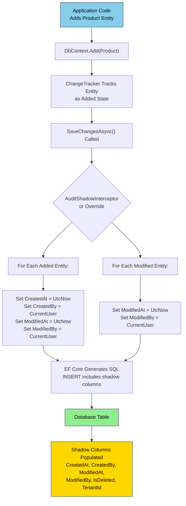
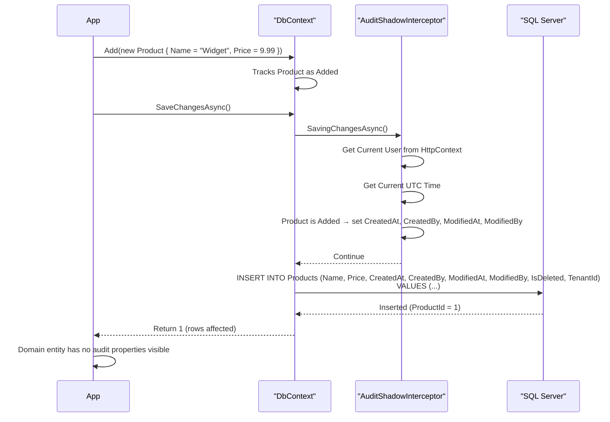

# Shadow Properties — Audit Without Domain Change

## 1 — Overview

Shadow properties are CLR properties that exist **only in the EF Core model** — they have no corresponding property on the domain entity class. They are mapped to database columns and can be read/written by EF Core's change tracker, but they remain invisible to the application's business logic.

The primary use case is cross-cutting concerns like auditing (CreatedAt, ModifiedAt, CreatedBy, ModifiedBy), soft deletes (IsDeleted), and multi-tenancy (TenantId). By using shadow properties, the domain model stays clean — no audit properties pollute the entities — while the database schema includes all necessary columns.

| Concern | Shadow Property | Domain Property | Dapper Handling |
|---------|----------------|-----------------|-----------------|
| Created timestamp | `CreatedAt` | Not in entity | Must add manually to entity or SQL |
| Modified timestamp | `ModifiedAt` | Not in entity | Must add manually |
| Created by user | `CreatedBy` | Not in entity | Must add manually |
| Tenant isolation | `TenantId` | Optional (if needed) | Must include in every query |
| Soft delete flag | `IsDeleted` | Optional (if needed) | Must add WHERE clause manually |

## 2 — Configuration — Shadow Properties in EF Core

### 2.1 — Fluent API Configuration

Shadow properties are configured in `OnModelCreating` using the `Property<T>` method with a string name:

```csharp
public class AppDbContext : DbContext
{
    public DbSet<Product> Products { get; set; }
    public DbSet<Order> Orders { get; set; }
    public DbSet<Customer> Customers { get; set; }

    protected override void OnModelCreating(ModelBuilder modelBuilder)
    {
        // Basic shadow property
        modelBuilder.Entity<Product>()
            .Property<DateTime>("CreatedAt")
            .HasDefaultValueSql("GETUTCDATE()")
            .IsRequired();

        modelBuilder.Entity<Product>()
            .Property<DateTime>("ModifiedAt")
            .HasDefaultValueSql("GETUTCDATE()")
            .IsRequired();

        // Shadow property with max length
        modelBuilder.Entity<Product>()
            .Property<string>("CreatedBy")
            .HasMaxLength(100)
            .IsRequired();

        modelBuilder.Entity<Product>()
            .Property<string>("ModifiedBy")
            .HasMaxLength(100)
            .IsRequired();

        // Soft delete shadow property
        modelBuilder.Entity<Product>()
            .Property<bool>("IsDeleted")
            .HasDefaultValue(false)
            .IsRequired();

        // Tenant shadow property
        modelBuilder.Entity<Product>()
            .Property<Guid>("TenantId")
            .IsRequired();

        // Global query filter using shadow property
        modelBuilder.Entity<Product>()
            .HasQueryFilter(e => !EF.Property<bool>(e, "IsDeleted")
                              && EF.Property<Guid>(e, "TenantId") == _currentTenantId);

        // ----- Order entity -----
        modelBuilder.Entity<Order>()
            .Property<DateTime>("CreatedAt")
            .HasDefaultValueSql("GETUTCDATE()");

        modelBuilder.Entity<Order>()
            .Property<DateTime>("ModifiedAt")
            .HasDefaultValueSql("GETUTCDATE()");

        modelBuilder.Entity<Order>()
            .Property<string>("CreatedBy")
            .HasMaxLength(100);

        modelBuilder.Entity<Order>()
            .Property<string>("ModifiedBy")
            .HasMaxLength(100);

        // ----- Customer entity -----
        modelBuilder.Entity<Customer>()
            .Property<DateTime>("CreatedAt")
            .HasDefaultValueSql("GETUTCDATE()");

        modelBuilder.Entity<Customer>()
            .Property<DateTime>("ModifiedAt")
            .HasDefaultValueSql("GETUTCDATE()");
    }
}
```

### 2.2 — Using Shadow Property Builder Extension

To avoid repeating shadow property configuration for every entity, create an extension method:

```csharp
public static class ShadowPropertyExtensions
{
    public static void AddAuditShadowProperties<T>(this EntityTypeBuilder<T> builder)
        where T : class
    {
        builder.Property<DateTime>("CreatedAt")
            .HasDefaultValueSql("GETUTCDATE()")
            .IsRequired();

        builder.Property<DateTime>("ModifiedAt")
            .HasDefaultValueSql("GETUTCDATE()")
            .IsRequired();

        builder.Property<string>("CreatedBy")
            .HasMaxLength(100);

        builder.Property<string>("ModifiedBy")
            .HasMaxLength(100);
    }

    public static void AddSoftDeleteShadowProperty<T>(this EntityTypeBuilder<T> builder)
        where T : class
    {
        builder.Property<bool>("IsDeleted")
            .HasDefaultValue(false)
            .IsRequired();
    }

    public static void AddTenantShadowProperty<T>(this EntityTypeBuilder<T> builder)
        where T : class
    {
        builder.Property<Guid>("TenantId")
            .IsRequired();
    }
}

// Usage
protected override void OnModelCreating(ModelBuilder modelBuilder)
{
    modelBuilder.Entity<Product>(entity =>
    {
        entity.AddAuditShadowProperties();
        entity.AddSoftDeleteShadowProperty();
        entity.AddTenantShadowProperty();
    });

    modelBuilder.Entity<Order>(entity =>
    {
        entity.AddAuditShadowProperties();
    });
}
```

### 2.3 — IEntityTypeConfiguration Separation

For larger models, extract shadow property configuration into dedicated `IEntityTypeConfiguration<T>` classes:

```csharp
public class ProductConfiguration : IEntityTypeConfiguration<Product>
{
    public void Configure(EntityTypeBuilder<Product> builder)
    {
        builder.ToTable("Products");
        builder.HasKey(p => p.ProductId);

        builder.Property(p => p.Name).HasMaxLength(200).IsRequired();
        builder.Property(p => p.Price).HasColumnType("decimal(18,2)");

        // Shadow properties
        builder.AddAuditShadowProperties();
        builder.AddSoftDeleteShadowProperty();
        builder.AddTenantShadowProperty();

        // Global query filter
        builder.HasQueryFilter(e => !EF.Property<bool>(e, "IsDeleted"));
    }
}

// Apply via assembly scan
protected override void OnModelCreating(ModelBuilder modelBuilder)
{
    modelBuilder.ApplyConfigurationsFromAssembly(
        typeof(ProductConfiguration).Assembly);
}
```

## 3 — Implementation — Setting Shadow Properties Automatically

### 3.1 — SaveChangesInterceptor for Audit Shadows

The interceptor hooks `SaveChangesAsync` and sets shadow property values for every tracked entity before writing to the database.

```csharp
using Microsoft.EntityFrameworkCore;
using Microsoft.EntityFrameworkCore.Diagnostics;

public class AuditShadowInterceptor : SaveChangesInterceptor
{
    private readonly IHttpContextAccessor _httpContextAccessor;
    private readonly ILogger<AuditShadowInterceptor> _logger;

    public AuditShadowInterceptor(
        IHttpContextAccessor httpContextAccessor,
        ILogger<AuditShadowInterceptor> logger)
    {
        _httpContextAccessor = httpContextAccessor;
        _logger = logger;
    }

    public override InterceptionResult<int> SavingChanges(
        DbContextEventData eventData,
        InterceptionResult<int> result)
    {
        SetAuditProperties(eventData.Context);
        return base.SavingChanges(eventData, result);
    }

    public override ValueTask<InterceptionResult<int>> SavingChangesAsync(
        DbContextEventData eventData,
        InterceptionResult<int> result,
        CancellationToken cancellationToken = default)
    {
        SetAuditProperties(eventData.Context);
        return base.SavingChangesAsync(eventData, result, cancellationToken);
    }

    private void SetAuditProperties(DbContext context)
    {
        if (context == null) return;

        var userId = GetCurrentUserId();
        var now = DateTime.UtcNow;

        foreach (var entry in context.ChangeTracker.Entries())
        {
            if (entry.State == EntityState.Added)
            {
                SetProperty(entry, "CreatedAt", now);
                SetProperty(entry, "CreatedBy", userId);
                SetProperty(entry, "ModifiedAt", now);
                SetProperty(entry, "ModifiedBy", userId);
            }
            else if (entry.State == EntityState.Modified)
            {
                SetProperty(entry, "ModifiedAt", now);
                SetProperty(entry, "ModifiedBy", userId);
            }
        }
    }

    private static void SetProperty(EntityEntry entry, string propertyName, object value)
    {
        var property = entry.Metadata.FindProperty(propertyName);
        if (property == null) return;

        // Only set if it's a shadow property
        if (property.IsShadowProperty())
        {
            entry.Property(propertyName).CurrentValue = value;

            // Mark as modified if entity is being modified
            if (entry.State == EntityState.Modified)
            {
                entry.Property(propertyName).IsModified = true;
            }
        }
    }

    private string GetCurrentUserId()
    {
        return _httpContextAccessor.HttpContext?.User?
            .FindFirst(ClaimTypes.NameIdentifier)?.Value
            ?? "SYSTEM";
    }
}
```

### 3.2 — Alternative: Override SaveChanges in DbContext

Instead of an interceptor, override `SaveChangesAsync` directly:

```csharp
public class AppDbContext : DbContext
{
    private readonly IHttpContextAccessor _httpContextAccessor;

    public AppDbContext(
        DbContextOptions<AppDbContext> options,
        IHttpContextAccessor httpContextAccessor)
        : base(options)
    {
        _httpContextAccessor = httpContextAccessor;
    }

    public override async Task<int> SaveChangesAsync(
        CancellationToken cancellationToken = default)
    {
        var userId = _httpContextAccessor.HttpContext?.User?
            .FindFirst(ClaimTypes.NameIdentifier)?.Value ?? "SYSTEM";
        var now = DateTime.UtcNow;

        foreach (var entry in ChangeTracker.Entries())
        {
            if (entry.State == EntityState.Added)
            {
                SetShadowProperty(entry, "CreatedAt", now);
                SetShadowProperty(entry, "CreatedBy", userId);
                SetShadowProperty(entry, "ModifiedAt", now);
                SetShadowProperty(entry, "ModifiedBy", userId);
            }
            else if (entry.State == EntityState.Modified)
            {
                SetShadowProperty(entry, "ModifiedAt", now);
                SetShadowProperty(entry, "ModifiedBy", userId);
            }
        }

        return await base.SaveChangesAsync(cancellationToken);
    }

    private static void SetShadowProperty(EntityEntry entry, string property, object value)
    {
        var prop = entry.Metadata.FindProperty(property);
        if (prop != null && prop.IsShadowProperty())
        {
            entry.Property(property).CurrentValue = value;
        }
    }
}
```

### 3.3 — Registration

```csharp
// Using interceptor
builder.Services.AddSingleton<AuditShadowInterceptor>();
builder.Services.AddDbContext<AppDbContext>((sp, options) =>
{
    var interceptor = sp.GetRequiredService<AuditShadowInterceptor>();
    options.UseSqlServer(connectionString)
           .AddInterceptors(interceptor);
});

// Or using DbContext override — just register the context
builder.Services.AddDbContext<AppDbContext>(options =>
    options.UseSqlServer(connectionString));
```

## 4 — Code Examples — EF Core and Dapper

### 4.1 — EF Core — Querying Shadow Properties

```csharp
// Query by shadow property value
var recentProducts = await context.Products
    .Where(p => EF.Property<DateTime>(p, "CreatedAt") >= startDate)
    .ToListAsync();

// Order by shadow property
var sortedProducts = await context.Products
    .OrderByDescending(p => EF.Property<DateTime>(p, "CreatedAt"))
    .ToListAsync();

// Select shadow property in projection
var productAuditInfo = await context.Products
    .Select(p => new
    {
        p.ProductId,
        p.Name,
        CreatedAt = EF.Property<DateTime>(p, "CreatedAt"),
        ModifiedAt = EF.Property<DateTime>(p, "ModifiedAt"),
        CreatedBy = EF.Property<string>(p, "CreatedBy")
    })
    .ToListAsync();

// Check modified shadow property
var deletedProducts = await context.Products
    .IgnoreQueryFilters() // Bypass global filter for IsDeleted
    .Where(p => EF.Property<bool>(p, "IsDeleted"))
    .ToListAsync();

// Update a shadow property directly
var product = await context.Products.FindAsync(1);
context.Entry(product).Property("IsDeleted").CurrentValue = true;
context.Entry(product).Property("ModifiedBy").CurrentValue = "admin@example.com";
await context.SaveChangesAsync();
```

### 4.2 — EF Core — Generated SQL with Shadow Properties

When EF Core saves an entity with shadow properties, it generates SQL that includes the shadow columns:

```sql
-- INSERT generated by EF Core
INSERT INTO [Products] ([Name], [Price], [CreatedAt], [CreatedBy], [ModifiedAt], [ModifiedBy], [IsDeleted], [TenantId])
VALUES (@p0, @p1, @p2, @p3, @p4, @p5, @p6, @p7);
SELECT [ProductId] FROM [Products] WHERE @@ROWCOUNT = 1 AND [ProductId] = scope_identity();

-- UPDATE generated by EF Core
UPDATE [Products]
SET [Name] = @p0, [Price] = @p1, [ModifiedAt] = @p2, [ModifiedBy] = @p3
WHERE [ProductId] = @p4;

-- Query with global query filter (shadow property in WHERE)
SELECT [p].[ProductId], [p].[Name], [p].[Price], [p].[CreatedAt], [p].[CreatedBy],
       [p].[ModifiedAt], [p].[ModifiedBy], [p].[IsDeleted], [p].[TenantId]
FROM [Products] AS [p]
WHERE [p].[IsDeleted] = CAST(0 AS bit) AND [p].[TenantId] = @__CurrentTenantId;
```

### 4.3 — Dapper — Manual Audit Properties

Dapper has no concept of shadow properties. You must manage audit columns explicitly:

```csharp
// Entity with explicit audit properties
public class Product
{
    public int ProductId { get; set; }
    public string Name { get; set; }
    public decimal Price { get; set; }
    public DateTime CreatedAt { get; set; }
    public DateTime ModifiedAt { get; set; }
    public string CreatedBy { get; set; }
    public string ModifiedBy { get; set; }
    public bool IsDeleted { get; set; }
    public Guid TenantId { get; set; }
}

// Repository with explicit audit
public class ProductRepository
{
    private readonly string _connectionString;
    private readonly ICurrentUserService _userService;

    public ProductRepository(string connectionString, ICurrentUserService userService)
    {
        _connectionString = connectionString;
        _userService = userService;
    }

    public async Task<int> InsertProductAsync(Product product)
    {
        const string sql = @"
            INSERT INTO Products (Name, Price, CreatedAt, ModifiedAt, CreatedBy, ModifiedBy, IsDeleted, TenantId)
            VALUES (@Name, @Price, @CreatedAt, @ModifiedAt, @CreatedBy, @ModifiedBy, 0, @TenantId);
            SELECT CAST(SCOPE_IDENTITY() AS INT);";

        product.CreatedAt = DateTime.UtcNow;
        product.ModifiedAt = DateTime.UtcNow;
        product.CreatedBy = _userService.GetUserId();
        product.ModifiedBy = _userService.GetUserId();
        product.TenantId = _userService.GetTenantId();

        await using var conn = new SqlConnection(_connectionString);
        product.ProductId = await conn.QuerySingleAsync<int>(sql, product);
        return product.ProductId;
    }

    public async Task<bool> SoftDeleteProductAsync(int productId)
    {
        const string sql = @"
            UPDATE Products
            SET IsDeleted = 1, ModifiedAt = @Now, ModifiedBy = @UserId
            WHERE ProductId = @ProductId AND IsDeleted = 0";

        await using var conn = new SqlConnection(_connectionString);
        var rows = await conn.ExecuteAsync(sql, new
        {
            ProductId = productId,
            Now = DateTime.UtcNow,
            UserId = _userService.GetUserId()
        });
        return rows > 0;
    }

    public async Task<IEnumerable<Product>> GetActiveProductsAsync(Guid tenantId)
    {
        const string sql = @"
            SELECT ProductId, Name, Price, CreatedAt, ModifiedAt, CreatedBy, ModifiedBy
            FROM Products
            WHERE IsDeleted = 0 AND TenantId = @TenantId
            ORDER BY CreatedAt DESC";

        await using var conn = new SqlConnection(_connectionString);
        return await conn.QueryAsync<Product>(sql, new { TenantId = tenantId });
    }
}
```

### 4.4 — Dapper — Base Entity with Audit Interface

```csharp
public interface IAuditableEntity
{
    DateTime CreatedAt { get; set; }
    DateTime ModifiedAt { get; set; }
    string CreatedBy { get; set; }
    string ModifiedBy { get; set; }
}

public interface ISoftDeleteEntity
{
    bool IsDeleted { get; set; }
}

public interface ITenantEntity
{
    Guid TenantId { get; set; }
}

public class Product : IAuditableEntity, ISoftDeleteEntity, ITenantEntity
{
    public int ProductId { get; set; }
    public string Name { get; set; }
    public decimal Price { get; set; }
    // Audit
    public DateTime CreatedAt { get; set; }
    public DateTime ModifiedAt { get; set; }
    public string CreatedBy { get; set; }
    public string ModifiedBy { get; set; }
    // Soft delete
    public bool IsDeleted { get; set; }
    // Tenant
    public Guid TenantId { get; set; }
}

// SQL template helper
public static class AuditSql
{
    public static string AddInsertAudit(string table, string columns, string values)
    {
        return $@"
            INSERT INTO {table} ({columns}, CreatedAt, ModifiedAt, CreatedBy, ModifiedBy, IsDeleted, TenantId)
            VALUES ({values}, @CreatedAt, @ModifiedAt, @CreatedBy, @ModifiedBy, 0, @TenantId);
            SELECT CAST(SCOPE_IDENTITY() AS INT);";
    }

    public static string AddUpdateAudit(string table, string setClause, string whereClause)
    {
        return $@"
            UPDATE {table}
            SET {setClause}, ModifiedAt = @ModifiedAt, ModifiedBy = @ModifiedBy
            WHERE {whereClause}";
    }

    public static string AddSoftDelete(string table)
    {
        return $@"
            UPDATE {table}
            SET IsDeleted = 1, ModifiedAt = @ModifiedAt, ModifiedBy = @ModifiedBy
            WHERE Id = @Id";
    }

    public static string AddTenantFilter(string sql, string alias = "")
    {
        var prefix = string.IsNullOrEmpty(alias) ? "" : $"{alias}.";
        return $"{sql} AND {prefix}TenantId = @TenantId AND {prefix}IsDeleted = 0";
    }
}

// Usage
public async Task<int> InsertOrderAsync(Order order)
{
    var sql = AuditSql.AddInsertAudit(
        "Orders",
        "CustomerId, OrderDate, TotalAmount",
        "@CustomerId, @OrderDate, @TotalAmount");

    // Set audit values
    var now = DateTime.UtcNow;
    var userId = _userService.GetUserId();
    var tenantId = _userService.GetTenantId();

    var parameters = new
    {
        order.CustomerId,
        order.OrderDate,
        order.TotalAmount,
        CreatedAt = now,
        ModifiedAt = now,
        CreatedBy = userId,
        ModifiedBy = userId,
        TenantId = tenantId
    };

    await using var conn = new SqlConnection(_connectionString);
    return await conn.QuerySingleAsync<int>(sql, parameters);
}
```

## 5 — Mermaid — Shadow Property Flow





## 6 — Gotchas

### 6.1 — Shadow Properties Are Transparent to Domain Code

Because shadow properties do not exist on the entity class, application code cannot accidentally read or write them. This is the feature — but it also means:

- You cannot bind shadow properties to UI controls directly.
- You cannot use them in domain validation logic.
- You must use `EF.Property<T>(entity, "PropertyName")` everywhere you need to query them.

If domain logic needs to read audit values (e.g., "show when this was created"), consider exposing them via explicit domain properties instead.

### 6.2 — Querying Shadow Properties Requires EF.Property

All LINQ queries that reference shadow properties must use the static `EF.Property<T>` method:

```csharp
// Correct
var items = await context.Products
    .Where(p => EF.Property<DateTime>(p, "CreatedAt") > date)
    .ToListAsync();

// Incorrect — compile error
var items = await context.Products
    .Where(p => p.CreatedAt > date) // CreatedAt does not exist on entity
    .ToListAsync();

// Incorrect — runtime error
var items = await context.Products
    .Where(p => EF.Property<DateTime>(p, "NonExistent") > date)
    .ToListAsync();
```

### 6.3 — Dapper Must Manually Manage Shadow Columns

Dapper inserts and updates must explicitly include all audit columns. This creates a maintenance burden when the schema changes. Mitigations:

- Use SQL templates or helper methods (as shown above).
- Use a code generator (T4 templates) to produce CRUD SQL.
- Use a micro-ORM that supports interceptors (e.g., RepoDB, Dapper Plus).

### 6.4 — Interceptor Scope and Registration

`SaveChangesInterceptor` is registered as a **singleton** but may depend on scoped services (`IHttpContextAccessor`, `ICurrentUserService`). The interceptor receives scoped services via the `DbContext`'s service provider.

```csharp
// Service locator pattern inside interceptor
public override InterceptionResult<int> SavingChanges(
    DbContextEventData eventData,
    InterceptionResult<int> result)
{
    var context = eventData.Context;
    var userService = context.GetService<ICurrentUserService>();
    // Use userService
}
```

### 6.5 — Shadow Properties and Detached Entities

When you attach a detached entity and mark it as `Modified`, EF Core does **not** automatically set shadow properties because the change tracker sees the entity as already existing. The interceptor must explicitly mark the shadow property as modified:

```csharp
// In interceptor:
if (entry.State == EntityState.Modified)
{
    entry.Property("ModifiedAt").CurrentValue = now;
    entry.Property("ModifiedBy").CurrentValue = userId;
    entry.Property("ModifiedAt").IsModified = true; // Force update even if unchanged
    entry.Property("ModifiedBy").IsModified = true;
}
```

### 6.6 — Default Values vs Interceptor Values

If you configure `HasDefaultValueSql("GETUTCDATE()")` for `CreatedAt`, but the interceptor also sets it, the interceptor wins because it writes a value explicitly. Be consistent — either use the interceptor for all values or the database default.

### 6.7 — Shadow Property Name Conflicts

A shadow property name cannot collide with an existing CLR property on the entity. If the entity has a `CreatedAt` property, you cannot add a shadow property named `CreatedAt`.

### 6.8 — Performance with Large Change Sets

Iterating through `ChangeTracker.Entries()` in the interceptor is O(n) for the number of tracked entities. For batch operations (e.g., bulk inserts via `AddRange`), use `DbBatch` or raw SQL to avoid interceptor overhead.

### 6.9 — Thread Safety

The interceptor is singleton-scoped and `ChangeTracker` is NOT thread-safe. Never attempt to set shadow properties concurrently from multiple threads on the same `DbContext`.

## 7 — Best Practices

### 7.1 — Use Interceptors for Cross-Cutting Concerns

Prefer `SaveChangesInterceptor` over overriding `SaveChanges` in `DbContext` because interceptors are composable — you can add audit, tenant, and soft delete interceptors independently without touching the DbContext code.

### 7.2 — Keep Domain Entities Clean

Domain entities should not expose audit properties unless the domain requires them. Shadow properties enforce separation of concerns.

### 7.3 — Document Shadow Properties

Since shadow properties are invisible in the entity class, document them in the `IEntityTypeConfiguration` or a README:

```csharp
/// <summary>
/// Product entity.
/// Shadow properties configured: CreatedAt, ModifiedAt, CreatedBy,
/// ModifiedBy, IsDeleted (soft delete), TenantId (multi-tenant).
/// Query with EF.Property{T}.
/// </summary>
public class Product
{
    public int ProductId { get; set; }
    public string Name { get; set; }
}
```

### 7.4 — Use Strongly-Typed Shadow Property Helpers

Create extension methods to reduce `EF.Property` boilerplate:

```csharp
public static class ShadowPropertyQueries
{
    public static IQueryable<T> WhereCreatedAfter<T>(
        this IQueryable<T> query, DateTime date) where T : class
        => query.Where(e => EF.Property<DateTime>(e, "CreatedAt") > date);

    public static IQueryable<T> WhereTenant<T>(
        this IQueryable<T> query, Guid tenantId) where T : class
        => query.Where(e => EF.Property<Guid>(e, "TenantId") == tenantId);
}

// Usage
var products = await context.Products
    .WhereCreatedAfter(DateTime.UtcNow.AddDays(-7))
    .WhereTenant(currentTenantId)
    .ToListAsync();
```

### 7.5 — Global Query Filters with Shadow Properties

Use shadow properties in global query filters for soft delete and multi-tenancy:

```csharp
// In OnModelCreating:
modelBuilder.Entity<Product>()
    .HasQueryFilter(e => !EF.Property<bool>(e, "IsDeleted")
                      && EF.Property<Guid>(e, "TenantId") == _currentTenantId);

// To bypass:
var allProducts = await context.Products
    .IgnoreQueryFilters()
    .ToListAsync();
```

### 7.6 — Testing Shadow Property Values

During testing, assert shadow property values via the change tracker:

```csharp
[Fact]
public async Task CreatedAt_IsSetOnAdd()
{
    var product = new Product { Name = "Test", Price = 10 };
    context.Products.Add(product);
    await context.SaveChangesAsync();

    var entry = context.Entry(product);
    var createdAt = entry.Property<DateTime>("CreatedAt").CurrentValue;

    Assert.True(createdAt > DateTime.UtcNow.AddMinutes(-1));
}
```

## 8 — Related Notes

- **[[8.894 — Audit Trail — Shadow Properties]]** — Deep dive on audit trail implementation using shadow properties.
- **[[8.893 — Audit Trail — EF Core SaveChanges Interceptor]]** — Interceptor-based audit trail without shadow properties.
- **[[8.889 — Soft Delete — Global Query Filter in EF Core]]** — Soft delete using global query filters.
- **[[3.055 — EF Core — Shadow Properties]]** — Official documentation for EF Core shadow properties.
- **[[3.001 — DbContext and Change Tracking Fundamentals]]** — Foundation for understanding shadow property tracking.
- **[[8.912 — Owned Entities — Value Objects in EF Core]]** — Related pattern for value objects.
- **[[8.910 — Database Health Checks — .NET Integration]]** — Related database patterns.

## 9 — References

| Resource | URL |
|----------|-----|
| EF Core Shadow Properties | https://learn.microsoft.com/en-us/ef/core/modeling/shadow-properties |
| EF Core Global Query Filters | https://learn.microsoft.com/en-us/ef/core/querying/filters |
| EF Core SaveChanges Interceptor | https://learn.microsoft.com/en-us/ef/core/logging-events-diagnostics/interceptors |
| Soft Delete Pattern | https://learn.microsoft.com/en-us/ef/core/miscellaneous/soft-delete |
| Multi-Tenancy with EF Core | https://learn.microsoft.com/en-us/ef/core/miscellaneous/multitenancy |

## Appendix A — Complete Shadow Property Configuration for Common Entities

```csharp
public static class ShadowPropertyConfig
{
    public const string CreatedAt = "CreatedAt";
    public const string ModifiedAt = "ModifiedAt";
    public const string CreatedBy = "CreatedBy";
    public const string ModifiedBy = "ModifiedBy";
    public const string IsDeleted = "IsDeleted";
    public const string TenantId = "TenantId";
    public const string RowVersion = "RowVersion";
    public const string DeletedAt = "DeletedAt";
    public const string DeletedBy = "DeletedBy";

    public static readonly string[] All =
        { CreatedAt, ModifiedAt, CreatedBy, ModifiedBy, IsDeleted, TenantId, RowVersion, DeletedAt, DeletedBy };
}

// Apply to all entities automatically
public static class ShadowPropertyConvention
{
    public static void AddDefaultShadowProperties(this ModelBuilder modelBuilder)
    {
        foreach (var entity in modelBuilder.Model.GetEntityTypes())
        {
            // Skip join entities
            if (entity.IsKeyless || entity.IsOwned()) continue;

            // Audit
            entity.AddShadowProperty(ShadowPropertyConfig.CreatedAt, typeof(DateTime));
            entity.AddShadowProperty(ShadowPropertyConfig.ModifiedAt, typeof(DateTime));
            entity.AddShadowProperty(ShadowPropertyConfig.CreatedBy, typeof(string));
            entity.AddShadowProperty(ShadowPropertyConfig.ModifiedBy, typeof(string));

            // Soft delete
            entity.AddShadowProperty(ShadowPropertyConfig.IsDeleted, typeof(bool));

            // Tenant
            entity.AddShadowProperty(ShadowPropertyConfig.TenantId, typeof(Guid));
        }
    }

    private static void AddShadowProperty(this IMutableEntityType entity, string name, Type type)
    {
        if (!entity.FindProperty(name)?.IsShadowProperty() ?? true)
        {
            entity.AddProperty(name, type);
        }
    }
}
```

## Appendix B — Full Interceptor with Tenant and Soft Delete

```csharp
public class ShadowPropertyInterceptor : SaveChangesInterceptor
{
    private readonly ICurrentUserService _userService;
    private readonly ITenantService _tenantService;

    public ShadowPropertyInterceptor(
        ICurrentUserService userService,
        ITenantService tenantService)
    {
        _userService = userService;
        _tenantService = tenantService;
    }

    public override ValueTask<InterceptionResult<int>> SavingChangesAsync(
        DbContextEventData eventData,
        InterceptionResult<int> result,
        CancellationToken cancellationToken = default)
    {
        var context = eventData.Context;
        if (context == null)
            return base.SavingChangesAsync(eventData, result, cancellationToken);

        var userId = _userService.GetUserId();
        var tenantId = _tenantService.GetTenantId();
        var now = DateTime.UtcNow;

        foreach (var entry in context.ChangeTracker.Entries())
        {
            switch (entry.State)
            {
                case EntityState.Added:
                    SetIfShadow(entry, ShadowPropertyConfig.CreatedAt, now);
                    SetIfShadow(entry, ShadowPropertyConfig.CreatedBy, userId);
                    SetIfShadow(entry, ShadowPropertyConfig.ModifiedAt, now);
                    SetIfShadow(entry, ShadowPropertyConfig.ModifiedBy, userId);
                    SetIfShadow(entry, ShadowPropertyConfig.IsDeleted, false);
                    SetIfShadow(entry, ShadowPropertyConfig.TenantId, tenantId);
                    break;

                case EntityState.Modified:
                    SetIfShadow(entry, ShadowPropertyConfig.ModifiedAt, now);
                    SetIfShadow(entry, ShadowPropertyConfig.ModifiedBy, userId);
                    break;

                case EntityState.Deleted:
                    // Soft delete: change state to Modified instead of Deleted
                    entry.State = EntityState.Modified;
                    SetIfShadow(entry, ShadowPropertyConfig.IsDeleted, true);
                    SetIfShadow(entry, ShadowPropertyConfig.DeletedAt, now);
                    SetIfShadow(entry, ShadowPropertyConfig.DeletedBy, userId);
                    break;
            }
        }

        return base.SavingChangesAsync(eventData, result, cancellationToken);
    }

    private static void SetIfShadow(EntityEntry entry, string propertyName, object value)
    {
        var prop = entry.Metadata.FindProperty(propertyName);
        if (prop != null && prop.IsShadowProperty())
        {
            entry.Property(propertyName).CurrentValue = value;
        }
    }
}
```

## Appendix C — Dapper — Audit Attribute Convention

```csharp
[AttributeUsage(AttributeTargets.Class, Inherited = true)]
public class AuditTableAttribute : Attribute
{
    public string CreatedAtColumn { get; set; } = "CreatedAt";
    public string ModifiedAtColumn { get; set; } = "ModifiedAt";
    public string CreatedByColumn { get; set; } = "CreatedBy";
    public string ModifiedByColumn { get; set; } = "ModifiedBy";
}

public static class AuditSqlGenerator
{
    public static string GenerateInsert(string table, object entity)
    {
        var type = entity.GetType();
        var auditAttr = type.GetCustomAttribute<AuditTableAttribute>();
        var properties = type.GetProperties()
            .Where(p => p.CanRead && !p.GetGetMethod().IsStatic)
            .ToList();

        var columns = string.Join(", ", properties.Select(p => $"[{p.Name}]"));
        var values = string.Join(", ", properties.Select(p => $"@{p.Name}"));

        if (auditAttr != null)
        {
            columns += $", [{auditAttr.CreatedAtColumn}], [{auditAttr.ModifiedAtColumn}]";
            values += ", @CreatedAt, @ModifiedAt";
        }

        return $"INSERT INTO [{table}] ({columns}) VALUES ({values}); SELECT CAST(SCOPE_IDENTITY() AS INT);";
    }
}
```

## Appendix D — Migration SQL for Shadow Columns

```sql
-- EF Core migration will generate this automatically, but here is the raw SQL:
ALTER TABLE Products
    ADD CreatedAt DATETIME2 NOT NULL DEFAULT GETUTCDATE(),
        ModifiedAt DATETIME2 NOT NULL DEFAULT GETUTCDATE(),
        CreatedBy NVARCHAR(100) NULL,
        ModifiedBy NVARCHAR(100) NULL,
        IsDeleted BIT NOT NULL DEFAULT 0,
        TenantId UNIQUEIDENTIFIER NOT NULL DEFAULT '00000000-0000-0000-0000-000000000000',
        DeletedAt DATETIME2 NULL,
        DeletedBy NVARCHAR(100) NULL;

-- Index for tenant + soft delete filtering
CREATE NONCLUSTERED INDEX IX_Products_TenantId_IsDeleted
    ON Products (TenantId, IsDeleted)
    INCLUDE (Name, Price, CreatedAt);

-- Index for audit sorting
CREATE NONCLUSTERED INDEX IX_Products_CreatedAt
    ON Products (CreatedAt DESC);
```

## Appendix E — Merging Dapper and EF Core in the Same Codebase

```csharp
// IDbConnection factory with audit injection
public class AuditableConnectionFactory
{
    private readonly string _connectionString;
    private readonly ICurrentUserService _userService;
    private readonly ITenantService _tenantService;

    public async Task<IDbConnection> CreateWithAuditContextAsync()
    {
        var conn = new SqlConnection(_connectionString);
        await conn.OpenAsync();

        // Set session context for SQL Server triggers / default schema
        using var cmd = conn.CreateCommand();
        cmd.CommandText = @"
            DECLARE @context VARBINARY(128) = 
                CAST('UserId=' + @UserId + ';TenantId=' + CAST(@TenantId AS NVARCHAR(36)) AS VARBINARY(128));
            SET CONTEXT_INFO @context;";

        cmd.Parameters.AddWithValue("@UserId", _userService.GetUserId());
        cmd.Parameters.AddWithValue("@TenantId", _tenantService.GetTenantId().ToString());

        await cmd.ExecuteNonQueryAsync();

        return conn;
    }
}

// SQL Server trigger reading context_info for auditing
-- CREATE TRIGGER TR_Products_Audit
-- ON Products
-- AFTER INSERT, UPDATE
-- AS
-- BEGIN
--     DECLARE @context VARCHAR(128) = CAST(CONTEXT_INFO() AS VARCHAR(128));
--     -- Parse UserId and TenantId from context
--     -- Set CreatedAt / ModifiedAt if not provided by application
-- END;
```

## Appendix F — Shadow Properties in Views

```csharp
// SQL View that includes shadow properties
const string viewSql = @"
    CREATE VIEW v_ProductAudit AS
    SELECT
        ProductId,
        Name,
        Price,
        CreatedAt,
        CreatedBy,
        ModifiedAt,
        ModifiedBy,
        IsDeleted,
        TenantId
    FROM Products";

// EF Core query using the view
[Keyless]
public class ProductAuditView
{
    public int ProductId { get; set; }
    public string Name { get; set; }
    public decimal Price { get; set; }
    public DateTime CreatedAt { get; set; }
    public string CreatedBy { get; set; }
    public DateTime ModifiedAt { get; set; }
    public string ModifiedBy { get; set; }
    public bool IsDeleted { get; set; }
    public Guid TenantId { get; set; }
}

// Map the view
modelBuilder.Entity<ProductAuditView>()
    .ToView("v_ProductAudit")
    .HasNoKey();
```

---

## Footnotes

1. Shadow properties were introduced in EF Core 1.0.
2. Named "shadow" because they exist only in the model's shadow state, not in the CLR class.
3. `EF.Property<T>` is the only way to access shadow properties in LINQ queries.
4. Soft delete replacement of deletion (`EntityState.Deleted → Modified`) requires setting `IsDeleted = true` before `SaveChanges`.
