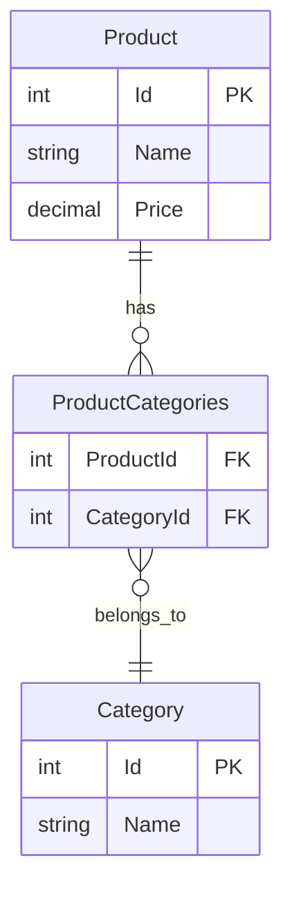
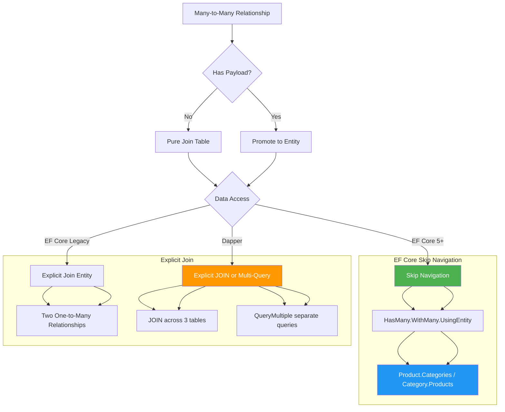

# Many-to-Many in EF Core — Join Table Configuration

## 1. Overview — Many-to-Many Relationships in Relational Databases

A many-to-many relationship occurs when each record in Table A can relate to many records in Table B, and vice versa. In a relational database, this requires a third table — the join table (also called junction table, association table, or linking table) — that stores foreign key pairs from both related tables.

```sql
-- Conceptual schema for Product ↔ Category many-to-many
CREATE TABLE Products (
    Id          INT IDENTITY(1,1) PRIMARY KEY,
    Name        NVARCHAR(200) NOT NULL,
    Price       DECIMAL(18,2) NOT NULL
);

CREATE TABLE Categories (
    Id          INT IDENTITY(1,1) PRIMARY KEY,
    Name        NVARCHAR(200) NOT NULL
);

-- Join table with only foreign keys (pure link, no payload)
CREATE TABLE ProductCategories (
    ProductId   INT NOT NULL REFERENCES Products(Id),
    CategoryId  INT NOT NULL REFERENCES Categories(Id),
    PRIMARY KEY (ProductId, CategoryId)
);
```

The join table can be one of two forms:
- **Pure join table** — contains only the two foreign key columns forming a composite primary key. No additional data.
- **Join table with payload** — contains additional columns beyond the FKs, such as `Quantity`, `CreatedAt`, or `SortOrder`. This transforms the many-to-many into a pair of one-to-many relationships through the payload entity.

### 1.1 Pure Join vs Payload Join

| Aspect | Pure Join | Payload Join |
|--------|-----------|--------------|
| Columns | FK1, FK2 (composite PK) | FK1, FK2, Payload (e.g., Quantity) |
| EF Core mapping | Skip navigation (`HasMany().WithMany()`) | Explicit join entity with two one-to-many |
| Dapper query | JOIN across 3 tables | JOIN across 3 tables with extra column |
| Payload support | No payload | Yes (Quantity, CreatedAt, etc.) |
| Direct navigation | Product.Categories, Category.Products | Product.OrderItems (not Categories directly) |

### 1.2 When the Join Table Has a Payload

When the join table carries additional data (e.g., `Quantity` in an `OrderItem`), the relationship is technically no longer a pure many-to-many — it is modeled as two one-to-many relationships with the join table promoted to a full entity:

```sql
-- Payload join table: OrderItem carries Quantity
CREATE TABLE Orders (
    Id          INT IDENTITY(1,1) PRIMARY KEY,
    OrderDate   DATETIME2 NOT NULL
);

CREATE TABLE Products (
    Id          INT IDENTITY(1,1) PRIMARY KEY,
    Name        NVARCHAR(200) NOT NULL,
    Price       DECIMAL(18,2) NOT NULL
);

-- Join table with payload
CREATE TABLE OrderItems (
    Id          INT IDENTITY(1,1) PRIMARY KEY,   -- Surrogate PK
    OrderId     INT NOT NULL REFERENCES Orders(Id),
    ProductId   INT NOT NULL REFERENCES Products(Id),
    Quantity    INT NOT NULL DEFAULT 1,
    UnitPrice   DECIMAL(18,2) NOT NULL
);
```

This distinction drives the entire implementation strategy. EF Core 5+ provides skip navigation syntax for pure join tables, but payload join tables require the explicit join entity approach. Dapper treats both the same way — explicit JOINs or separate queries.

---

## 2. Section 2 — EF Core 5+ Skip Navigation (Pure Join Table)

EF Core 5 introduced support for many-to-many relationships without an explicit join entity class. The configuration uses `HasMany().WithMany()` and optionally `UsingEntity()` to customize the join table.

### 2.1 Entity Definitions

```csharp
public class Product
{
    public int Id { get; set; }
    public string Name { get; set; } = string.Empty;
    public decimal Price { get; set; }

    // Skip navigation: many-to-many
    public ICollection<Category> Categories { get; set; }
        = new List<Category>();
}

public class Category
{
    public int Id { get; set; }
    public string Name { get; set; } = string.Empty;

    // Skip navigation: many-to-many
    public ICollection<Product> Products { get; set; }
        = new List<Product>();
}
```

The term **skip navigation** means the navigation property skips the join table and goes directly to the related entity. The developer never references `ProductCategory` in application code.

### 2.2 DbContext Configuration with UsingEntity

```csharp
public class CatalogDbContext : DbContext
{
    public DbSet<Product> Products => Set<Product>();
    public DbSet<Category> Categories => Set<Category>();

    protected override void OnModelCreating(ModelBuilder modelBuilder)
    {
        modelBuilder.Entity<Product>(entity =>
        {
            entity.ToTable("Products");
            entity.HasKey(e => e.Id);
            entity.Property(e => e.Name).HasMaxLength(200).IsRequired();
            entity.Property(e => e.Price).HasColumnType("decimal(18,2)");
        });

        modelBuilder.Entity<Category>(entity =>
        {
            entity.ToTable("Categories");
            entity.HasKey(e => e.Id);
            entity.Property(e => e.Name).HasMaxLength(200).IsRequired();
        });

        // Many-to-many configuration
        modelBuilder.Entity<Product>()
            .HasMany(p => p.Categories)
            .WithMany(c => c.Products)
            .UsingEntity<Dictionary<string, object>>(
                "ProductCategories",
                j => j.HasOne<Category>()
                      .WithMany()
                      .HasForeignKey("CategoryId")
                      .OnDelete(DeleteBehavior.Cascade),
                j => j.HasOne<Product>()
                      .WithMany()
                      .HasForeignKey("ProductId")
                      .OnDelete(DeleteBehavior.Cascade),
                j =>
                {
                    j.ToTable("ProductCategories");
                    j.HasKey("ProductId", "CategoryId");
                });
    }
}
```

### 2.3 UsingEntity with a Dedicated Join Entity Type

If you prefer a typed join class (even without payload) for better maintainability:

```csharp
// Optional join entity class (still no payload, but strongly typed)
public class ProductCategory
{
    public int ProductId { get; set; }
    public int CategoryId { get; set; }
    public Product Product { get; set; } = null!;
    public Category Category { get; set; } = null!;
}

// Configuration
modelBuilder.Entity<Product>()
    .HasMany(p => p.Categories)
    .WithMany(c => c.Products)
    .UsingEntity<ProductCategory>(
        j => j.HasOne(pc => pc.Category)
              .WithMany()
              .HasForeignKey(pc => pc.CategoryId),
        j => j.HasOne(pc => pc.Product)
              .WithMany()
              .HasForeignKey(pc => pc.ProductId),
        j =>
        {
            j.ToTable("ProductCategories");
            j.HasKey(pc => new { pc.ProductId, pc.CategoryId });
        });
```

### 2.4 Querying with Skip Navigation

```csharp
// Load product with categories
var product = await db.Products
    .Include(p => p.Categories)
    .FirstOrDefaultAsync(p => p.Id == 1);

foreach (var category in product.Categories)
{
    Console.WriteLine($"{product.Name} -> {category.Name}");
}

// Filter by category
var productsInCategory = await db.Products
    .Where(p => p.Categories.Any(c => c.Name == "Electronics"))
    .ToListAsync();

// Adding a relationship
var product = await db.Products.FindAsync(1);
var category = await db.Categories.FindAsync(5);
product.Categories.Add(category);
await db.SaveChangesAsync();
```

The generated SQL for the Include query uses an INNER JOIN across three tables:

```sql
SELECT [p].[Id], [p].[Name], [p].[Price],
       [t].[ProductId], [t].[CategoryId],
       [c].[Id], [c].[Name]
FROM [Products] AS [p]
INNER JOIN [ProductCategories] AS [t] ON [p].[Id] = [t].[ProductId]
INNER JOIN [Categories] AS [c] ON [t].[CategoryId] = [c].[Id]
WHERE [p].[Id] = 1
ORDER BY [p].[Id];
```

The `.Any()` filter generates:

```sql
SELECT [p].[Id], [p].[Name], [p].[Price]
FROM [Products] AS [p]
WHERE EXISTS (
    SELECT 1
    FROM [ProductCategories] AS [t]
    INNER JOIN [Categories] AS [c] ON [t].[CategoryId] = [c].[Id]
    WHERE [p].[Id] = [t].[ProductId]
      AND [c].[Name] = N'Electronics');
```

### 2.5 Skip Navigation with Composite Foreign Keys

When the related entities use composite keys, the join table must include all key columns:

```csharp
public class TenantProduct
{
    public int TenantId { get; set; }
    public int ProductId { get; set; }
    public string Name { get; set; } = string.Empty;
}

public class TenantCategory
{
    public int TenantId { get; set; }
    public int CategoryId { get; set; }
    public string Name { get; set; } = string.Empty;
}

// Configuration for composite FK
modelBuilder.Entity<TenantProduct>(entity =>
{
    entity.HasKey(e => new { e.TenantId, e.ProductId });
});

modelBuilder.Entity<TenantCategory>(entity =>
{
    entity.HasKey(e => new { e.TenantId, e.CategoryId });
});

modelBuilder.Entity<TenantProduct>()
    .HasMany(p => p.Categories)
    .WithMany(c => c.Products)
    .UsingEntity<Dictionary<string, object>>(
        "TenantProductCategories",
        j => j.HasOne<TenantCategory>()
              .WithMany()
              .HasForeignKey("TenantId", "CategoryId"),
        j => j.HasOne<TenantProduct>()
              .WithMany()
              .HasForeignKey("TenantId", "ProductId"),
        j =>
        {
            j.ToTable("TenantProductCategories");
            j.HasKey("TenantId", "ProductId", "CategoryId");
        });
```

---

## 3. Section 3 — Explicit Join Entity Approach (Payload Join Table)

When the join table carries data beyond the foreign keys, you must promote it to a full entity and model two one-to-many relationships.

### 3.1 Entity Definitions

```csharp
public class Order
{
    public int Id { get; set; }
    public DateTime OrderDate { get; set; }
    public string CustomerId { get; set; } = string.Empty;

    public ICollection<OrderItem> OrderItems { get; set; }
        = new List<OrderItem>();
}

public class Product
{
    public int Id { get; set; }
    public string Name { get; set; } = string.Empty;
    public decimal Price { get; set; }

    public ICollection<OrderItem> OrderItems { get; set; }
        = new List<OrderItem>();
}

// Explicit join entity with payload
public class OrderItem
{
    public int Id { get; set; }                                  // Surrogate PK
    public int OrderId { get; set; }                             // FK to Order
    public int ProductId { get; set; }                           // FK to Product
    public int Quantity { get; set; }                            // Payload
    public decimal UnitPrice { get; set; }                       // Payload

    public Order Order { get; set; } = null!;                    // Navigation
    public Product Product { get; set; } = null!;                // Navigation
}
```

### 3.2 DbContext Configuration

```csharp
public class SalesDbContext : DbContext
{
    public DbSet<Order> Orders => Set<Order>();
    public DbSet<Product> Products => Set<Product>();
    public DbSet<OrderItem> OrderItems => Set<OrderItem>();

    protected override void OnModelCreating(ModelBuilder modelBuilder)
    {
        modelBuilder.Entity<Order>(entity =>
        {
            entity.ToTable("Orders");
            entity.HasKey(e => e.Id);
            entity.Property(e => e.CustomerId).HasMaxLength(50).IsRequired();
            entity.HasMany(e => e.OrderItems)
                  .WithOne(oi => oi.Order)
                  .HasForeignKey(oi => oi.OrderId)
                  .OnDelete(DeleteBehavior.Cascade);
        });

        modelBuilder.Entity<Product>(entity =>
        {
            entity.ToTable("Products");
            entity.HasKey(e => e.Id);
            entity.Property(e => e.Name).HasMaxLength(200).IsRequired();
            entity.Property(e => e.Price).HasColumnType("decimal(18,2)");
            entity.HasMany(e => e.OrderItems)
                  .WithOne(oi => oi.Product)
                  .HasForeignKey(oi => oi.ProductId)
                  .OnDelete(DeleteBehavior.Restrict);
        });

        modelBuilder.Entity<OrderItem>(entity =>
        {
            entity.ToTable("OrderItems");
            entity.HasKey(e => e.Id);
            entity.Property(e => e.Quantity).IsRequired();
            entity.Property(e => e.UnitPrice).HasColumnType("decimal(18,2)");
        });
    }
}
```

### 3.3 Querying Through the Explicit Join Entity

Because there is no skip navigation, accessing products for an order requires navigating through `OrderItems`:

```csharp
// Load order with items and products
var order = await db.Orders
    .Include(o => o.OrderItems)
    .ThenInclude(oi => oi.Product)
    .FirstOrDefaultAsync(o => o.Id == 1);

foreach (var item in order.OrderItems)
{
    Console.WriteLine($"{item.Product.Name} x{item.Quantity} @ {item.UnitPrice:C}");
}

// Sum total for the order (LINQ in-memory after Include)
var total = order.OrderItems.Sum(oi => oi.Quantity * oi.UnitPrice);

// Alternative: server-side aggregation
var orderTotal = await db.Orders
    .Where(o => o.Id == 1)
    .Select(o => o.OrderItems.Sum(oi => oi.Quantity * oi.UnitPrice))
    .FirstOrDefaultAsync();
```

Generated SQL for the Include chain:

```sql
SELECT [o].[Id], [o].[OrderDate], [o].[CustomerId],
       [t].[Id], [t].[OrderId], [t].[ProductId],
       [t].[Quantity], [t].[UnitPrice],
       [p].[Id], [p].[Name], [p].[Price]
FROM [Orders] AS [o]
LEFT JOIN [OrderItems] AS [t] ON [o].[Id] = [t].[OrderId]
LEFT JOIN [Products] AS [p] ON [t].[ProductId] = [p].[Id]
WHERE [o].[Id] = 1
ORDER BY [o].[Id], [t].[Id];
```

The server-side aggregation generates:

```sql
SELECT (
    SELECT COALESCE(SUM(
        CAST([oi].[Quantity] AS decimal(18,2)) * [oi].[UnitPrice]
    ), 0)
    FROM [OrderItems] AS [oi]
    WHERE [o].[Id] = [oi].[OrderId])
FROM [Orders] AS [o]
WHERE [o].[Id] = 1;
```

### 3.4 Inserting with the Explicit Join Entity

```csharp
public async Task<int> CreateOrderWithItemsAsync(string customerId, List<CreateItemDto> items)
{
    var order = new Order
    {
        CustomerId = customerId,
        OrderDate = DateTime.UtcNow
    };

    foreach (var item in items)
    {
        var product = await db.Products.FindAsync(item.ProductId);
        if (product is null) throw new NotFoundException($"Product {item.ProductId} not found");

        order.OrderItems.Add(new OrderItem
        {
            ProductId = item.ProductId,
            Quantity = item.Quantity,
            UnitPrice = product.Price
        });
    }

    db.Orders.Add(order);
    await db.SaveChangesAsync();
    return order.Id;
}
```

Generated INSERT statements:

```sql
-- EF Core inserts into Orders first, then OrderItems
INSERT INTO [Orders] ([CustomerId], [OrderDate])
OUTPUT INSERTED.[Id]
VALUES (@p0, @p1);

INSERT INTO [OrderItems] ([OrderId], [ProductId], [Quantity], [UnitPrice])
VALUES (@p2, @p3, @p4, @p5);

INSERT INTO [OrderItems] ([OrderId], [ProductId], [Quantity], [UnitPrice])
VALUES (@p6, @p7, @p8, @p9);
```

### 3.5 Composite Primary Key on Join Entity (No Surrogate)

Instead of a surrogate `Id`, you can use the FK pair as the composite primary key:

```csharp
public class OrderItem
{
    public int OrderId { get; set; }          // Part of composite PK
    public int ProductId { get; set; }        // Part of composite PK
    public int Quantity { get; set; }         // Payload
    public decimal UnitPrice { get; set; }    // Payload

    public Order Order { get; set; } = null!;
    public Product Product { get; set; } = null!;
}

// Configuration
modelBuilder.Entity<OrderItem>(entity =>
{
    entity.ToTable("OrderItems");
    entity.HasKey(e => new { e.OrderId, e.ProductId }); // Composite PK
    // No surrogate Id property needed
});
```

This enforces that each product appears at most once per order — useful for scenarios like shopping carts where duplicates are merged into the Quantity field.

---

## 4. Section 4 — Dapper Implementation: Explicit Join Handling

Dapper provides no many-to-many abstraction. Every relational pattern must be explicitly handled through raw SQL.

### 4.1 Pure Join Table with Dapper — Single Query with JOIN

```csharp
public class ProductRepository
{
    private readonly IDbConnection _connection;

    public ProductRepository(IDbConnection connection)
    {
        _connection = connection;
    }

    public async Task<Product?> GetProductWithCategoriesAsync(int productId)
    {
        // SQL with explicit JOIN across three tables
        var sql = @"
            SELECT p.Id, p.Name, p.Price,
                   c.Id, c.Name
            FROM Products p
            LEFT JOIN ProductCategories pc ON pc.ProductId = p.Id
            LEFT JOIN Categories c ON c.Id = pc.CategoryId
            WHERE p.Id = @ProductId
            ORDER BY c.Name";

        var productDict = new Dictionary<int, Product>();

        var result = await _connection.QueryAsync<Product, Category, Product>(
            sql,
            (product, category) =>
            {
                if (!productDict.TryGetValue(product.Id, out var existing))
                {
                    existing = product;
                    existing.Categories = new List<Category>();
                    productDict.Add(existing.Id, existing);
                }

                if (category is not null)
                {
                    existing.Categories.Add(category);
                }

                return existing;
            },
            new { ProductId = productId },
            splitOn: "Id");

        return productDict.Values.FirstOrDefault();
    }

    public async Task<IReadOnlyList<Product>> GetAllProductsWithCategoriesAsync()
    {
        var sql = @"
            SELECT p.Id, p.Name, p.Price,
                   c.Id AS CatId, c.Name AS CatName
            FROM Products p
            LEFT JOIN ProductCategories pc ON pc.ProductId = p.Id
            LEFT JOIN Categories c ON c.Id = pc.CategoryId
            ORDER BY p.Id, c.Name";

        var productDict = new Dictionary<int, Product>();

        var result = await _connection.QueryAsync<Product, Category, Product>(
            sql,
            (product, category) =>
            {
                if (!productDict.TryGetValue(product.Id, out var existing))
                {
                    existing = product;
                    existing.Categories = new List<Category>();
                    productDict.Add(existing.Id, existing);
                }

                if (category is not null)
                {
                    existing.Categories.Add(category);
                }

                return existing;
            },
            splitOn: "CatId");

        return productDict.Values.ToList();
    }

    public async Task<IReadOnlyList<Category>> GetCategoriesWithProductCountAsync()
    {
        var sql = @"
            SELECT c.Id, c.Name, COUNT(pc.ProductId) AS ProductCount
            FROM Categories c
            LEFT JOIN ProductCategories pc ON pc.CategoryId = c.Id
            GROUP BY c.Id, c.Name
            ORDER BY c.Name";

        return (await _connection.QueryAsync<Category>(sql)).ToList();
    }
}
```

### 4.2 Payload Join Table with Dapper

For the Order → OrderItem → Product pattern:

```csharp
public class OrderRepository
{
    private readonly IDbConnection _connection;

    public async Task<Order?> GetOrderWithItemsAsync(int orderId)
    {
        var sql = @"
            SELECT o.Id, o.OrderDate, o.CustomerId,
                   oi.Id, oi.OrderId, oi.ProductId, oi.Quantity, oi.UnitPrice,
                   p.Id, p.Name, p.Price
            FROM Orders o
            LEFT JOIN OrderItems oi ON oi.OrderId = o.Id
            LEFT JOIN Products p ON p.Id = oi.ProductId
            WHERE o.Id = @OrderId
            ORDER BY oi.Id";

        var orderDict = new Dictionary<int, Order>();

        var result = await _connection.QueryAsync<Order, OrderItem, Product, Order>(
            sql,
            (order, orderItem, product) =>
            {
                if (!orderDict.TryGetValue(order.Id, out var existing))
                {
                    existing = order;
                    existing.OrderItems = new List<OrderItem>();
                    orderDict.Add(existing.Id, existing);
                }

                if (orderItem is not null)
                {
                    orderItem.Product = product;
                    existing.OrderItems.Add(orderItem);
                }

                return existing;
            },
            new { OrderId = orderId },
            splitOn: "Id,Id");

        return orderDict.Values.FirstOrDefault();
    }

    public async Task<IReadOnlyList<Order>> GetOrdersWithItemsAsync(string customerId)
    {
        var sql = @"
            SELECT o.Id, o.OrderDate, o.CustomerId,
                   oi.Id, oi.OrderId, oi.ProductId, oi.Quantity, oi.UnitPrice,
                   p.Id, p.Name, p.Price
            FROM Orders o
            LEFT JOIN OrderItems oi ON oi.OrderId = o.Id
            LEFT JOIN Products p ON p.Id = oi.ProductId
            WHERE o.CustomerId = @CustomerId
            ORDER BY o.Id, oi.Id";

        var orderDict = new Dictionary<int, Order>();

        var result = await _connection.QueryAsync<Order, OrderItem, Product, Order>(
            sql,
            (order, orderItem, product) =>
            {
                if (!orderDict.TryGetValue(order.Id, out var existing))
                {
                    existing = order;
                    existing.OrderItems = new List<OrderItem>();
                    orderDict.Add(existing.Id, existing);
                }

                if (orderItem is not null)
                {
                    orderItem.Product = product;
                    existing.OrderItems.Add(orderItem);
                }

                return existing;
            },
            new { CustomerId = customerId },
            splitOn: "Id,Id");

        return orderDict.Values.ToList();
    }
}
```

### 4.3 Separate Queries with Multi-Mapping

As an alternative to nested JOINs, use `QueryMultipleAsync` for separate queries:

```csharp
public async Task<Product?> GetProductWithCategoriesSeparateAsync(int productId)
{
    using var multi = await _connection.QueryMultipleAsync(
        @"
        SELECT Id, Name, Price FROM Products WHERE Id = @ProductId;
        SELECT c.Id, c.Name
        FROM Categories c
        INNER JOIN ProductCategories pc ON pc.CategoryId = c.Id
        WHERE pc.ProductId = @ProductId
        ORDER BY c.Name;",
        new { ProductId = productId });

    var product = await multi.ReadSingleOrDefaultAsync<Product>();
    if (product is not null)
    {
        product.Categories = (await multi.ReadAsync<Category>()).ToList();
    }

    return product;
}

public async Task<Order?> GetOrderWithItemsSeparateAsync(int orderId)
{
    using var multi = await _connection.QueryMultipleAsync(
        @"
        SELECT Id, OrderDate, CustomerId FROM Orders WHERE Id = @OrderId;
        SELECT oi.Id, oi.OrderId, oi.ProductId, oi.Quantity, oi.UnitPrice,
               p.Id, p.Name, p.Price
        FROM OrderItems oi
        INNER JOIN Products p ON p.Id = oi.ProductId
        WHERE oi.OrderId = @OrderId
        ORDER BY oi.Id;",
        new { OrderId = orderId });

    var order = await multi.ReadSingleOrDefaultAsync<Order>();
    if (order is not null)
    {
        var items = await multi.ReadAsync<OrderItem, Product, OrderItem>(
            (item, product) =>
            {
                item.Product = product;
                return item;
            },
            splitOn: "Id");

        order.OrderItems = items.ToList();
    }

    return order;
}
```

### 4.4 Dapper with Many-to-Many Create/Update

```csharp
public async Task AddProductToCategoryAsync(int productId, int categoryId)
{
    var sql = @"
        IF NOT EXISTS (SELECT 1 FROM ProductCategories
                       WHERE ProductId = @ProductId AND CategoryId = @CategoryId)
        BEGIN
            INSERT INTO ProductCategories (ProductId, CategoryId)
            VALUES (@ProductId, @CategoryId)
        END";

    await _connection.ExecuteAsync(sql,
        new { ProductId = productId, CategoryId = categoryId });
}

public async Task SetProductCategoriesAsync(int productId, IEnumerable<int> categoryIds)
{
    using var transaction = _connection.BeginTransaction();

    try
    {
        // Remove existing relationships
        await _connection.ExecuteAsync(
            "DELETE FROM ProductCategories WHERE ProductId = @ProductId",
            new { ProductId = productId },
            transaction);

        // Insert new ones
        foreach (var categoryId in categoryIds)
        {
            await _connection.ExecuteAsync(
                "INSERT INTO ProductCategories (ProductId, CategoryId) VALUES (@ProductId, @CategoryId)",
                new { ProductId = productId, CategoryId = categoryId },
                transaction);
        }

        transaction.Commit();
    }
    catch
    {
        transaction.Rollback();
        throw;
    }
}

public async Task CreateOrderWithItemsAsync(string customerId, List<(int ProductId, int Quantity, decimal Price)> items)
{
    using var transaction = _connection.BeginTransaction();

    try
    {
        var orderId = await _connection.ExecuteScalarAsync<int>(
            @"INSERT INTO Orders (CustomerId, OrderDate)
              VALUES (@CustomerId, @OrderDate);
              SELECT CAST(SCOPE_IDENTITY() AS INT);",
            new { CustomerId = customerId, OrderDate = DateTime.UtcNow },
            transaction);

        foreach (var (productId, quantity, price) in items)
        {
            await _connection.ExecuteAsync(
                @"INSERT INTO OrderItems (OrderId, ProductId, Quantity, UnitPrice)
                  VALUES (@OrderId, @ProductId, @Quantity, @UnitPrice)",
                new { OrderId = orderId, ProductId = productId, Quantity = quantity, UnitPrice = price },
                transaction);
        }

        transaction.Commit();
    }
    catch
    {
        transaction.Rollback();
        throw;
    }
}
```

---

## 5. Section 5 — Mermaid Diagram: Many-to-Many Mapping Strategies





```mermaid
flowchart TD
    A[EF Core Skip Navigation Query] --> B[LINQ: Include(p => p.Categories)]
    B --> C[EF Core translates to three-table JOIN]
    C --> D[SQL: Products JOIN ProductCategories JOIN Categories]
    D --> E[Entities materialized with related data]

    F[Dapper Query] --> G[Raw SQL with explicit JOIN]
    F --> H[Raw SQL with separate queries]
    G --> I[Dapper multi-mapping with splitOn]
    H --> J[QueryMultiple + manual assembly]
    I --> K[In-memory dictionary aggregation]
    J --> K

    subgraph Skip_Nav_Flow ["Skip Navigation Flow"]
        A --> B --> C --> D --> E
    end

    subgraph Dapper_Flow ["Dapper Flow"]
        F --> G
        F --> H
        G --> I
        H --> J
        I --> K
        J --> K
    end

    style C fill:#4CAF50,color:#fff
    style G fill:#FF9800,color:#fff
    style H fill:#FF9800,color:#fff
```

---

## 6. Section 6 — Managing the Relationship (Add/Remove)

### 6.1 EF Core: Adding and Removing Relationships

With skip navigation, manipulating the relationship is done through the collection:

```csharp
// Adding a relationship
var product = await db.Products.FindAsync(1);
var category = await db.Categories.FindAsync(5);

product.Categories.Add(category);  // Inserts into ProductCategories
await db.SaveChangesAsync();

// Removing a relationship
product.Categories.Remove(category);  // Deletes from ProductCategories
await db.SaveChangesAsync();

// Replacing all categories
product.Categories.Clear();
product.Categories.AddRange(
    await db.Categories.Where(c => new[] { 1, 3, 7 }.Contains(c.Id)).ToListAsync());
await db.SaveChangesAsync();
```

Generated SQL for the Add:

```sql
INSERT INTO [ProductCategories] ([ProductId], [CategoryId])
VALUES (1, 5);
```

Generated SQL for the Remove:

```sql
DELETE FROM [ProductCategories]
WHERE [ProductId] = 1 AND [CategoryId] = 5;
```

Generated SQL for the Replace (Clear + AddRange):

```sql
DELETE FROM [ProductCategories]
WHERE [ProductId] = 1;

INSERT INTO [ProductCategories] ([ProductId], [CategoryId])
VALUES (1, 1), (1, 3), (1, 7);
```

### 6.2 EF Core: Concurrency Considerations

When replacing a many-to-many relationship, EF Core deletes the old rows and inserts the new ones. If another user modifies the same relationships concurrently, race conditions can occur. Mitigate with:

```csharp
public async Task ReplaceProductCategoriesAsync(int productId, int[] newCategoryIds)
{
    var product = await db.Products
        .Include(p => p.Categories)
        .FirstOrDefaultAsync(p => p.Id == productId);

    if (product is null) return;

    // EF Core marks the original categories as deleted
    product.Categories.Clear();

    // EF Core will insert these
    var newCategories = await db.Categories
        .Where(c => newCategoryIds.Contains(c.Id))
        .ToListAsync();
    product.Categories.AddRange(newCategories);

    await db.SaveChangesAsync();
}
```

If the join table has a composite PK (ProductId, CategoryId), there is no natural concurrency token. For high-contention scenarios, add a `RowVersion` column to the join table:

```csharp
public class ProductCategory
{
    public int ProductId { get; set; }
    public int CategoryId { get; set; }
    public byte[] RowVersion { get; set; } = null!; // Concurrency token
}
```

### 6.3 Dapper: Managing Relationships in Transactions

```csharp
public async Task ReplaceProductCategoriesAsync(int productId, int[] categoryIds)
{
    using var transaction = _connection.BeginTransaction();

    try
    {
        // Delete all existing
        await _connection.ExecuteAsync(
            "DELETE FROM ProductCategories WHERE ProductId = @ProductId",
            new { ProductId = productId },
            transaction);

        // Insert new
        foreach (var catId in categoryIds)
        {
            await _connection.ExecuteAsync(
                "INSERT INTO ProductCategories (ProductId, CategoryId) VALUES (@ProductId, @CategoryId)",
                new { ProductId = productId, CategoryId = catId },
                transaction);
        }

        transaction.Commit();
    }
    catch
    {
        transaction.Rollback();
        throw;
    }
}

public async Task AddItemToOrderAsync(int orderId, int productId, int quantity, decimal price)
{
    using var transaction = _connection.BeginTransaction();

    try
    {
        var existing = await _connection.QueryFirstOrDefaultAsync<int?>(
            @"SELECT Quantity FROM OrderItems
              WHERE OrderId = @OrderId AND ProductId = @ProductId",
            new { OrderId = orderId, ProductId = productId },
            transaction);

        if (existing.HasValue)
        {
            // Update quantity if product already in order
            await _connection.ExecuteAsync(
                @"UPDATE OrderItems
                  SET Quantity = Quantity + @Quantity
                  WHERE OrderId = @OrderId AND ProductId = @ProductId",
                new { OrderId = orderId, ProductId = productId, Quantity = quantity },
                transaction);
        }
        else
        {
            // Insert new line item
            await _connection.ExecuteAsync(
                @"INSERT INTO OrderItems (OrderId, ProductId, Quantity, UnitPrice)
                  VALUES (@OrderId, @ProductId, @Quantity, @UnitPrice)",
                new { OrderId = orderId, ProductId = productId, Quantity = quantity, UnitPrice = price },
                transaction);
        }

        transaction.Commit();
    }
    catch
    {
        transaction.Rollback();
        throw;
    }
}
```

---

## 7. Section 7 — Many-to-Many with Additional Configuration

### 7.1 Self-Referencing Many-to-Many

An entity that relates to itself through a join table:

```csharp
public class Employee
{
    public int Id { get; set; }
    public string Name { get; set; } = string.Empty;

    // Employees that this employee manages
    public ICollection<Employee> Subordinates { get; set; }
        = new List<Employee>();

    // Employees that manage this employee
    public ICollection<Employee> Managers { get; set; }
        = new List<Employee>();
}

// Configuration
modelBuilder.Entity<Employee>()
    .HasMany(e => e.Subordinates)
    .WithMany(e => e.Managers)
    .UsingEntity<Dictionary<string, object>>(
        "EmployeeRelationships",
        j => j.HasOne<Employee>()
              .WithMany()
              .HasForeignKey("ManagerId")
              .OnDelete(DeleteBehavior.Restrict),
        j => j.HasOne<Employee>()
              .WithMany()
              .HasForeignKey("SubordinateId")
              .OnDelete(DeleteBehavior.Restrict),
        j =>
        {
            j.ToTable("EmployeeRelationships");
            j.HasKey("ManagerId", "SubordinateId");
        });
```

### 7.2 Many-to-Many with Soft Delete

When both sides of a many-to-many support soft delete, the join table needs careful handling:

```csharp
public class Product : ISoftDeletable
{
    public int Id { get; set; }
    public string Name { get; set; } = string.Empty;
    public bool IsDeleted { get; set; }
    public DateTime? DeletedAt { get; set; }
    public ICollection<Category> Categories { get; set; } = new List<Category>();
}

public class Category : ISoftDeletable
{
    public int Id { get; set; }
    public string Name { get; set; } = string.Empty;
    public bool IsDeleted { get; set; }
    public DateTime? DeletedAt { get; set; }
    public ICollection<Product> Products { get; set; } = new List<Product>();
}

// EF Core query with soft-delete — filters apply to both sides automatically
var activeProductsInActiveCategory = await db.Products
    .Where(p => p.Categories.Any(c => c.Name == "Electronics"))
    .ToListAsync();

-- Generated SQL — both sides get IsDeleted = 0
SELECT [p].[Id], [p].[Name], [p].[IsDeleted], [p].[DeletedAt]
FROM [Products] AS [p]
WHERE EXISTS (
    SELECT 1
    FROM [ProductCategories] AS [t]
    INNER JOIN [Categories] AS [c] ON [t].[CategoryId] = [c].[Id]
    WHERE [p].[Id] = [t].[ProductId]
      AND [c].[Name] = N'Electronics'
      AND [p].[IsDeleted] = 0
      AND [c].[IsDeleted] = 0)
  AND [p].[IsDeleted] = 0;
```

### 7.3 Many-to-Many with Tenant Isolation

In a shared-schema multi-tenant system, both sides and the join table include TenantId:

```csharp
public class TenantProduct
{
    public int TenantId { get; set; }
    public int ProductId { get; set; }
    public string Name { get; set; } = string.Empty;
    public ICollection<TenantCategory> Categories { get; set; } = new List<TenantCategory>();
}

public class TenantCategory
{
    public int TenantId { get; set; }
    public int CategoryId { get; set; }
    public string Name { get; set; } = string.Empty;
    public ICollection<TenantProduct> Products { get; set; } = new List<TenantProduct>();
}

// Join table also carries TenantId for tenant isolation
modelBuilder.Entity<TenantProduct>()
    .HasMany(p => p.Categories)
    .WithMany(c => c.Products)
    .UsingEntity<Dictionary<string, object>>(
        "TenantProductCategories",
        j => j.HasOne<TenantCategory>()
              .WithMany()
              .HasForeignKey("TenantId", "CategoryId"),
        j => j.HasOne<TenantProduct>()
              .WithMany()
              .HasForeignKey("TenantId", "ProductId"),
        j =>
        {
            j.ToTable("TenantProductCategories");
            j.HasKey("TenantId", "ProductId", "CategoryId");
            j.HasQueryFilter(e => EF.Property<int>(e, "TenantId") == _currentTenantId);
        });
```

### 7.4 Join Table with Unique Constraint on Payload

Occasionally you need a unique constraint on a payload column in the join table:

```sql
-- Ensure a product can only appear once per category per size
ALTER TABLE ProductCategories
ADD Size NVARCHAR(20) NOT NULL DEFAULT 'Medium';

-- Composite unique constraint includes payload
ALTER TABLE ProductCategories
ADD CONSTRAINT UQ_ProductCategory_Size
    UNIQUE (ProductId, CategoryId, Size);
```

---

## 8. Section 8 — Performance Considerations for Many-to-Many

### 8.1 N+1 Query Problem

With both EF Core and Dapper, accessing navigation properties in a loop causes N+1:

```csharp
// BAD: N+1 queries
var products = await db.Products.Take(10).ToListAsync();
foreach (var product in products)
{
    // Each iteration triggers a separate query
    foreach (var category in product.Categories)
    {
        Console.WriteLine(category.Name);
    }
}
```

Generated SQL (11 queries instead of 1):

```sql
-- Query 1: Products
SELECT TOP(10) [p].[Id], [p].[Name], [p].[Price] FROM [Products] AS [p];

-- Query 2-11: Categories for each product (N+1!)
SELECT [c].[Id], [c].[Name]
FROM [Categories] AS [c]
INNER JOIN [ProductCategories] AS [t] ON [c].[Id] = [t].[CategoryId]
WHERE [t].[ProductId] = 1;
```

**Fix — eager loading with Include:**

```csharp
var products = await db.Products
    .Include(p => p.Categories)
    .Take(10)
    .ToListAsync();
```

### 8.2 Cartesion Explosion

When loading a parent with two or more many-to-many collections, `Include` causes a Cartesian explosion:

```csharp
// This creates a Cartesian product of Categories and Tags
var products = await db.Products
    .Include(p => p.Categories)   // 3 categories
    .Include(p => p.Tags)         // 4 tags
    .ToListAsync();
```

Result: `Products * 3 * 4` rows in the result set. Use `AsSplitQuery()` to avoid the explosion:

```csharp
var products = await db.Products
    .Include(p => p.Categories)
    .Include(p => p.Tags)
    .AsSplitQuery()          // EF Core 5+: one query per Include
    .ToListAsync();
```

Generated SQL (three separate queries):

```sql
-- Query 1: Products
SELECT [p].[Id], [p].[Name], [p].[Price] FROM [Products] AS [p];

-- Query 2: Categories via join table
SELECT [p].[Id], [t].[CategoryId], [c].[Id], [c].[Name]
FROM [Products] AS [p]
LEFT JOIN [ProductCategories] AS [t] ON [p].[Id] = [t].[ProductId]
LEFT JOIN [Categories] AS [c] ON [t].[CategoryId] = [c].[Id]
ORDER BY [p].[Id];

-- Query 3: Tags via join table
SELECT [p].[Id], [t2].[TagId], [tg].[Id], [tg].[Name]
FROM [Products] AS [p]
LEFT JOIN [ProductTags] AS [t2] ON [p].[Id] = [t2].[ProductId]
LEFT JOIN [Tags] AS [tg] ON [t2].[TagId] = [tg].[Id]
ORDER BY [p].[Id];
```

### 8.3 Indexing the Join Table

The join table should have indexes covering both FK directions:

```sql
-- Composite PK already acts as index on (ProductId, CategoryId)
-- But queries filtering by CategoryId need a reverse index:
CREATE INDEX IX_ProductCategories_CategoryId
ON ProductCategories (CategoryId)
INCLUDE (ProductId);

-- For payload join tables, cover query columns
CREATE INDEX IX_OrderItems_OrderId
ON OrderItems (OrderId)
INCLUDE (ProductId, Quantity, UnitPrice);

CREATE INDEX IX_OrderItems_ProductId
ON OrderItems (ProductId)
INCLUDE (OrderId, Quantity, UnitPrice);
```

### 8.4 Dapper Performance: JOIN vs Separate Queries

| Approach | Round Trips | Data Transfer | Memory | Complexity |
|----------|-------------|---------------|--------|------------|
| Single JOIN | 1 | Higher (duplicated parent data) | Higher (duplicate parent rows) | Medium (multi-mapping) |
| Separate queries | N+1 | Lower (no duplicates) | Lower | Low (QueryMultiple) |
| Batch query (IN clause) | 1 | Lowest | Lowest | Medium |

For high-volume scenarios, batch querying is often the most efficient:

```csharp
public async Task<IReadOnlyList<Product>> GetProductsWithCategoriesBatchAsync()
{
    // Query 1: Get all products
    var products = (await _connection.QueryAsync<Product>(
        "SELECT Id, Name, Price FROM Products WHERE IsDeleted = 0")).ToList();

    // Query 2: Get all product-category relationships
    var productCategories = await _connection.QueryAsync(
        @"SELECT pc.ProductId, pc.CategoryId, c.Name AS CategoryName
          FROM ProductCategories pc
          INNER JOIN Categories c ON c.Id = pc.CategoryId
          WHERE pc.ProductId IN @ProductIds",
        new { ProductIds = products.Select(p => p.Id) });

    // Assemble in memory
    foreach (var product in products)
    {
        product.Categories = productCategories
            .Where(pc => pc.ProductId == product.Id)
            .Select(pc => new Category { Id = pc.CategoryId, Name = pc.CategoryName })
            .ToList();
    }

    return products;
}
```

---

## 9. Section 9 — Gotchas, Pitfalls, and Best Practices

### 9.1 Skip Navigation Hides the Join Table

Developers who use skip navigation often forget the join table exists. This leads to confusion when:

- **Debugging SQL** — the join table appears in generated SQL but not in the entity model.
- **Direct SQL queries** — developers query `Products` and `Categories` but forget the join table.
- **Performance tuning** — the join table is invisible in the concept but critical in execution plans.

```sql
-- When debugging, remember the join table is there:
SELECT p.Name, c.Name
FROM Products p
JOIN ProductCategories pc ON pc.ProductId = p.Id   -- This is real
JOIN Categories c ON c.Id = pc.CategoryId          -- Even if C# doesn't show it
WHERE p.Id = 1;
```

### 9.2 No Payload in Skip Navigation Without UsingEntity

By default, skip navigation creates a join table with only the two FK columns. If you later need to add a payload column (e.g., `CreatedAt`), you must migrate to the explicit join entity approach:

```csharp
// Step 1: Add the join entity class
public class ProductCategory
{
    public int ProductId { get; set; }
    public int CategoryId { get; set; }
    public DateTime CreatedAt { get; set; } = DateTime.UtcNow; // New payload

    public Product Product { get; set; } = null!;
    public Category Category { get; set; } = null!;
}

// Step 2: Update the configuration
modelBuilder.Entity<Product>()
    .HasMany(p => p.Categories)
    .WithMany(c => c.Products)
    .UsingEntity<ProductCategory>(
        j => j.HasOne(pc => pc.Category).WithMany().HasForeignKey(pc => pc.CategoryId),
        j => j.HasOne(pc => pc.Product).WithMany().HasForeignKey(pc => pc.ProductId),
        j =>
        {
            j.ToTable("ProductCategories");
            j.HasKey(pc => new { pc.ProductId, pc.CategoryId });
        });
```

### 9.3 Dapper Requires Explicit Join Table Handling

Dapper has no skip navigation concept. Every many-to-many query requires:

- Multi-mapping with `QueryAsync<T1, T2, TReturn>` and `splitOn`.
- Manual dictionary-based aggregation in memory.
- Transactional management for updates (delete old, insert new).

Forgetting the `splitOn` parameter is a common bug:

```csharp
// BUG: Missing splitOn — Dapper maps incorrectly
var result = await _connection.QueryAsync<Product, Category, Product>(
    sql,
    (product, category) => { /* wrong mapping */ },
    new { ProductId = id });
// Default splitOn is "Id" — works if the first column of Category is "Id"

// CORRECT: Explicit splitOn
var result = await _connection.QueryAsync<Product, Category, Product>(
    sql,
    (product, category) => { /* correct mapping */ },
    new { ProductId = id },
    splitOn: "Id");  // Tells Dapper where T1 ends and T2 begins
```

### 9.4 Composite Keys in the Join Entity

When using composite keys in the join entity, navigation property loading and update operations become more complex:

- `FindAsync()` requires all key parts.
- `Remove()` requires the full key.
- DbContext change tracking uses the composite key internally.

```csharp
// Finding with composite key
var orderItem = await db.OrderItems.FindAsync(orderId, productId);

// Removing with composite key
db.OrderItems.Remove(orderItem);

// Or remove directly if both key parts are known
var orderItem = new OrderItem { OrderId = orderId, ProductId = productId };
db.Entry(orderItem).State = EntityState.Deleted;
await db.SaveChangesAsync();
```

### 9.5 Cascade Delete Behavior

With pure join tables, cascade delete from either side is safe. With payload join entities, be careful:

```csharp
// On Product side — if Product is deleted, OrderItems should NOT cascade
// (you don't want to delete order items when a product is removed from catalog)
modelBuilder.Entity<OrderItem>()
    .HasOne(oi => oi.Product)
    .WithMany(p => p.OrderItems)
    .HasForeignKey(oi => oi.ProductId)
    .OnDelete(DeleteBehavior.Restrict);  // or SetNull

// On Order side — if Order is deleted, OrderItems SHOULD cascade
modelBuilder.Entity<OrderItem>()
    .HasOne(oi => oi.Order)
    .WithMany(o => o.OrderItems)
    .HasForeignKey(oi => oi.OrderId)
    .OnDelete(DeleteBehavior.Cascade);
```

### 9.6 EF Core 5+ vs EF Core 6+ Many-to-Many Differences

| Feature | EF Core 5 | EF Core 6+ |
|---------|-----------|------------|
| Skip navigation | Supported | Supported |
| UsingEntity with Dictionary | Supported | Supported |
| UsingEntity with typed class | Supported | Supported |
| Implicit join table convention | Not auto-configured | Not auto-configured |
| Many-to-many with owned types | Not supported | Not supported |
| AsSplitQuery with many-to-many | Supported | Supported |
| Raw SQL to join table | Supported via FromSql | Supported via FromSql |
| TPC inheritance + many-to-many | Not supported | Supported |

### 9.7 Many-to-Many with TPH Inheritance

When both sides use table-per-hierarchy (TPH) inheritance, the join table must reference the discriminator:

```csharp
public abstract class Content
{
    public int Id { get; set; }
    public string Title { get; set; } = string.Empty;
}

public class Article : Content { }
public class Video : Content { }

public class Tag
{
    public int Id { get; set; }
    public string Name { get; set; } = string.Empty;
    public ICollection<Content> Contents { get; set; } = new List<Content>();
}

// EF Core handles this via the base type navigation
modelBuilder.Entity<Content>()
    .HasMany(c => c.Tags)
    .WithMany(t => t.Contents)
    .UsingEntity("ContentTags");
```

### 9.8 Migration Changes for Join Tables

When modifying a join table via migration, remember:

- Adding a payload column to a pure join table requires creating a new migration.
- Changing FK column types requires dropping and recreating the join table (or altering the type).
- Renaming the join table requires a manual migration step.

```csharp
// Adding a CreatedAt column to an existing join table
public partial class AddCreatedAtToProductCategories : Migration
{
    protected override void Up(MigrationBuilder mb)
    {
        mb.AddColumn<DateTime>(
            name: "CreatedAt",
            table: "ProductCategories",
            type: "datetime2",
            nullable: false,
            defaultValueSql: "GETUTCDATE()");
    }

    protected override void Down(MigrationBuilder mb)
    {
        mb.DropColumn(
            name: "CreatedAt",
            table: "ProductCategories");
    }
}
```

### 9.9 Summary of Best Practices

| Scenario | Recommendation |
|----------|---------------|
| Pure join table, no payload | EF Core 5+ skip navigation with UsingEntity |
| Join table with payload | Explicit join entity + two one-to-many |
| Self-referencing many-to-many | Skip navigation with named FKs |
| Multi-tenant many-to-many | Include TenantId in join table PK |
| Soft delete on both sides | EF Core global query filters apply automatically |
| Dapper pure join | Multi-mapping with splitOn and dictionary aggregation |
| Dapper payload join | Multi-mapping or QueryMultiple with manual assembly |
| Performance | AsSplitQuery for multiple collections; index both FK columns |
| Concurrency | Add RowVersion to join table for high-contention scenarios |
| Migrations | Explicitly script join table changes; test rollback |
| N+1 prevention | Always Include or use projection with Select |
| Cartesian explosion | AsSplitQuery when loading multiple collections |

### 9.10 Common Dapper Many-to-Many Bugs

```csharp
// BUG: Forgetting splitOn causes wrong mapping
var products = await _connection.QueryAsync<Product, Category, Product>(
    "SELECT * FROM Products p JOIN ProductCategories pc ...",
    map: (p, c) => { p.Categories.Add(c); return p; },
    splitOn: "Id");   // WRONG splitOn — the Category data is incorrectly mapped

// FIX: Ensure splitOn matches the first column of the Category result set
// If the query returns columns in order: Product.*, Category.*
var products = await _connection.QueryAsync<Product, Category, Product>(
    sql,
    map: (p, c) =>
    {
        p.Categories ??= new List<Category>();
        p.Categories.Add(c);
        return p;
    },
    splitOn: "Id");  // Correct: "Id" is the first column of Category

// BUG: Not handling duplicates from the JOIN
var products = (await _connection.QueryAsync<Product, Category, Product>(
    sql, map, splitOn: "Id")).ToList();  // Duplicate Product rows!

// FIX: Use dictionary to deduplicate
var productDict = new Dictionary<int, Product>();
await _connection.QueryAsync<Product, Category, Product>(
    sql,
    (p, c) =>
    {
        if (!productDict.TryGetValue(p.Id, out var existing))
        {
            existing = p;
            existing.Categories = new List<Category>();
            productDict.Add(existing.Id, existing);
        }
        existing.Categories.Add(c);
        return existing;
    },
    splitOn: "Id");
var deduplicated = productDict.Values.ToList();
```

### 9.11 Testing Many-to-Many Operations

Integration tests should verify both read and write operations:

```csharp
[Fact]
public async Task AddProductToCategory_ShouldCreateJoinRecord()
{
    // Arrange
    var product = new Product { Name = "Test Product", Price = 10m };
    var category = new Category { Name = "Test Category" };
    db.Products.Add(product);
    db.Categories.Add(category);
    await db.SaveChangesAsync();

    // Act
    product.Categories.Add(category);
    await db.SaveChangesAsync();

    // Assert
    var joinCount = await db.Database.GetDbConnection().QuerySingleAsync<int>(
        "SELECT COUNT(1) FROM ProductCategories WHERE ProductId = @Id",
        new { Id = product.Id });
    Assert.Equal(1, joinCount);
}

[Fact]
public async Task ReplaceCategories_ShouldDeleteOldAndInsertNew()
{
    // Arrange
    var product = new Product { Name = "Test", Price = 10m };
    var cat1 = new Category { Name = "Cat1" };
    var cat2 = new Category { Name = "Cat2" };
    var cat3 = new Category { Name = "Cat3" };
    product.Categories.Add(cat1);
    product.Categories.Add(cat2);
    db.Products.Add(product);
    await db.SaveChangesAsync();

    // Act: replace categories
    product.Categories.Clear();
    product.Categories.Add(await db.Categories.FindAsync(cat3.Id));
    await db.SaveChangesAsync();

    // Assert
    var remaining = await db.Database.GetDbConnection().QueryAsync<int>(
        "SELECT CategoryId FROM ProductCategories WHERE ProductId = @Id",
        new { Id = product.Id });
    Assert.Equal([cat3.Id], remaining.ToArray());
}
```

### 9.12 EF Core 8+ Enhancements for Many-to-Many

EF Core 8 does not significantly change many-to-many mapping, but it improves:

- **JSON column support** — can store a collection of primitive types (e.g., `List<string>`) as an alternative to many-to-many for simple relationships.
- **ExecuteUpdate/ExecuteDelete on join table** — bulk operations now work with join entities.
- **Complex type support** — new value object mapping (precursor to owned types in bulk).

```csharp
// EF Core 8: JSON collection as alternative to many-to-many for simple cases
public class Product
{
    public int Id { get; set; }
    public string Name { get; set; } = string.Empty;
    public List<string> Tags { get; set; } = new(); // Stored as JSON array
}

// Configuration
modelBuilder.Entity<Product>()
    .OwnsMany(p => p.Tags, builder =>
    {
        builder.ToJson("Tags"); // JSON column
    });
```

This avoids the join table entirely for simple tag-like relationships but sacrifices queryability (no SQL JOIN for JSON).

---

