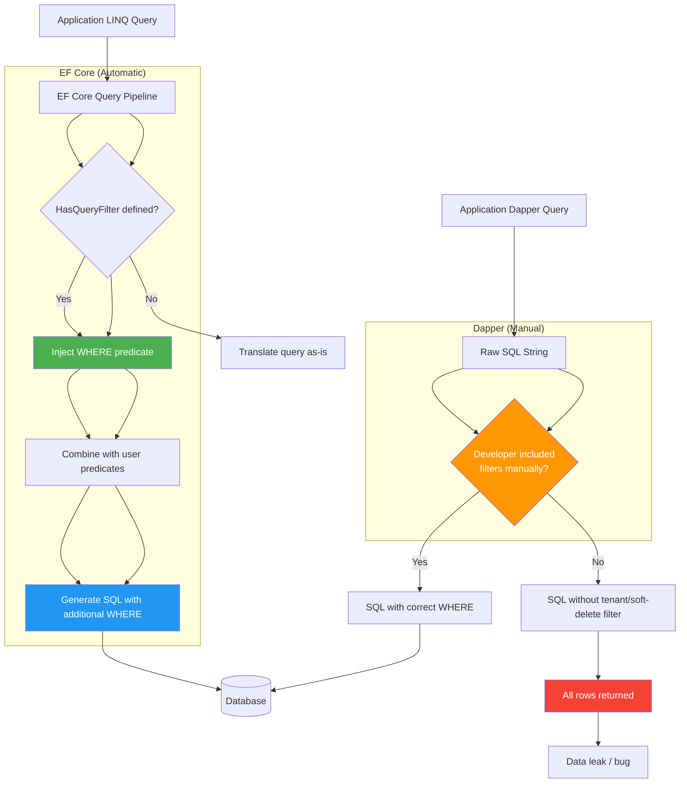
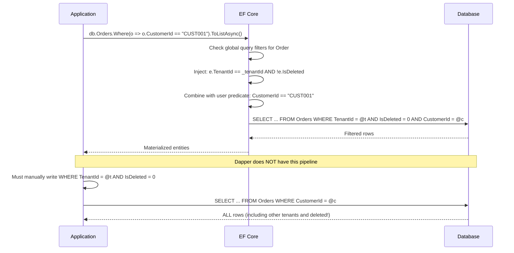

# Global Query Filters — EF Core

## 1. Overview — What Are Global Query Filters

A global query filter is a LINQ predicate that EF Core applies automatically to every query executed against a specific entity type. Declared once in `OnModelCreating` via `HasQueryFilter`, the filter is injected into every `SELECT`, `UPDATE`, `DELETE`, and `Include` operation that touches the entity.

```sql
-- Without global query filter
SELECT [p].[Id], [p].[Name], [p].[Price], [p].[IsDeleted]
FROM [Products] AS [p];

-- With global query filter (HasQueryFilter(e => !e.IsDeleted))
SELECT [p].[Id], [p].[Name], [p].[Price], [p].[IsDeleted]
FROM [Products] AS [p]
WHERE [p].[IsDeleted] = 0;  -- Automatically injected
```

Global query filters serve two primary use cases:

- **Soft delete** — automatically exclude logically deleted records: `HasQueryFilter(e => !e.IsDeleted)`.
- **Multi-tenancy (shared schema)** — automatically scope queries to the current tenant: `HasQueryFilter(e => e.TenantId == _currentTenantId)`.

These two filters are often combined into a single predicate:

```csharp
modelBuilder.Entity<Order>()
    .HasQueryFilter(e => !e.IsDeleted && e.TenantId == _currentTenantId);
```

### 1.1 Key Characteristics

| Property | Behavior |
|----------|----------|
| Scope | All LINQ queries, including `Include`, `ThenInclude`, and lazy loading |
| Inheritance | Filters on a base entity apply to all derived entities (TPH) |
| Composition | Multiple filters are ANDed together in a single call |
| Bypass | `.IgnoreQueryFilters()` removes all filters for a query |
| Dapper | No equivalent — must be done manually in SQL |

### 1.2 What Global Query Filters Are NOT

- **Not a security boundary** — a user with direct database access can bypass them. They are a application-level convenience, not a security control.
- **Not row-level security** — SQL Server RLS is a separate feature that enforces predicates at the database engine level.
- **Not a replacement for authorization** — filters apply to all queries regardless of user role. Use `IgnoreQueryFilters` with authorization checks for admin queries.

```sql
-- SQL Server Row-Level Security (separate from global query filters)
CREATE SECURITY POLICY TenantFilterPolicy
ADD FILTER PREDICATE dbo.fn_TenantPredicate(TenantId)
ON dbo.Orders;

-- Global query filters operate at the application level, not database level
-- EF Core adds WHERE clause in generated SQL, but direct SQL bypasses it
```

---

## 2. Section 2 — EF Core Implementation: HasQueryFilter

### 2.1 Basic Filter Configuration

The `HasQueryFilter` method accepts an `Expression<Func<TEntity, bool>>` that defines the predicate.

```csharp
public class SalesDbContext : DbContext
{
    private readonly int _currentTenantId;
    private readonly bool _includeDeleted;

    public SalesDbContext(int currentTenantId, bool includeDeleted = false)
    {
        _currentTenantId = currentTenantId;
        _includeDeleted = includeDeleted;
    }

    public DbSet<Order> Orders => Set<Order>();
    public DbSet<Customer> Customers => Set<Customer>();
    public DbSet<Product> Products => Set<Product>();

    protected override void OnModelCreating(ModelBuilder modelBuilder)
    {
        // Soft delete filter
        modelBuilder.Entity<Order>()
            .HasQueryFilter(e => !e.IsDeleted);

        // Multi-tenancy filter (parameterized from DbContext instance)
        modelBuilder.Entity<Order>()
            .HasQueryFilter(e => e.TenantId == _currentTenantId);

        // NOTE: The second filter OVERRIDES the first!
        // Combine them into a single call (see Section 2.3)
    }
}
```

### 2.2 Multiple Filters Must Be Combined

`HasQueryFilter` replaces any previous filter on the same entity — they are NOT additive:

```csharp
// BAD: Second call overrides the first
modelBuilder.Entity<Order>().HasQueryFilter(e => !e.IsDeleted);
modelBuilder.Entity<Order>().HasQueryFilter(e => e.TenantId == _currentTenantId);

// Result: Only TenantId filter is applied (IsDeleted filter is lost!)

// GOOD: Combine predicates
modelBuilder.Entity<Order>()
    .HasQueryFilter(e => !e.IsDeleted && e.TenantId == _currentTenantId);

// GOOD: Use a method to compose
modelBuilder.Entity<Order>().HasQueryFilter(ApplyStandardFilters<Order>());

private static Expression<Func<T, bool>> ApplyStandardFilters<T>()
    where T : class, ISoftDeletable, ITenanted
{
    return e => !e.IsDeleted && e.TenantId == _currentTenantId;
}
```

### 2.3 Parameterized Filters from DbContext

Global query filters can reference fields or properties on the `DbContext` instance. This enables runtime values like tenant ID and user context.

```csharp
public class SalesDbContext : DbContext
{
    private readonly ITenantContext _tenantContext;
    private readonly IUserContext _userContext;

    public SalesDbContext(
        DbContextOptions<SalesDbContext> options,
        ITenantContext tenantContext,
        IUserContext userContext)
        : base(options)
    {
        _tenantContext = tenantContext;
        _userContext = userContext;
    }

    public DbSet<Order> Orders => Set<Order>();
    public DbSet<Customer> Customers => Set<Customer>();
    public DbSet<Product> Products => Set<Product>();

    protected override void OnModelCreating(ModelBuilder modelBuilder)
    {
        // Multi-tenancy filter
        modelBuilder.Entity<Order>()
            .HasQueryFilter(e => e.TenantId == _tenantContext.TenantId);

        modelBuilder.Entity<Customer>()
            .HasQueryFilter(e => e.TenantId == _tenantContext.TenantId);

        // Combined soft-delete + tenant
        modelBuilder.Entity<Product>()
            .HasQueryFilter(e => !e.IsDeleted && e.TenantId == _tenantContext.TenantId);

        // Filter that depends on user role
        modelBuilder.Entity<AuditLog>()
            .HasQueryFilter(e => _userContext.IsAdmin || e.UserId == _userContext.UserId);
    }
}
```

The filter expression is captured as a closure over the `_tenantContext` field. EF Core evaluates this at query translation time, not at `OnModelCreating` time. The generated SQL uses a parameter:

```sql
-- Generated SQL with parameterized tenant filter
SELECT [o].[Id], [o].[TenantId], [o].[CustomerId], [o].[OrderDate], [o].[Total],
       [o].[IsDeleted], [o].[DeletedAt]
FROM [Orders] AS [o]
WHERE [o].[TenantId] = @__tenantContext_TenantId_0
  AND [o].[IsDeleted] = 0;
```

### 2.4 Applying Filters via Convention (EF Core 6+)

Instead of manually calling `HasQueryFilter` for each entity, apply filters automatically using `IModelFinalizingConvention`:

```csharp
public class TenantSoftDeleteConvention : IModelFinalizingConvention
{
    private readonly int _tenantId;

    public TenantSoftDeleteConvention(int tenantId)
    {
        _tenantId = tenantId;
    }

    public void ProcessModelFinalizing(
        IConventionModelBuilder modelBuilder,
        IConventionContext<IConventionModelBuilder> context)
    {
        foreach (var entity in modelBuilder.Metadata.GetEntityTypes()
            .Where(e => typeof(ITenanted).IsAssignableFrom(e.ClrType)
                     || typeof(ISoftDeletable).IsAssignableFrom(e.ClrType)))
        {
            var clrType = entity.ClrType;
            var param = Expression.Parameter(clrType, "e");

            Expression? predicate = null;

            if (typeof(ITenanted).IsAssignableFrom(clrType))
            {
                var tenantProp = Expression.Property(param, nameof(ITenanted.TenantId));
                var tenantValue = Expression.Constant(_tenantId);
                predicate = Expression.Equal(tenantProp, tenantValue);
            }

            if (typeof(ISoftDeletable).IsAssignableFrom(clrType))
            {
                var deletedProp = Expression.Property(param, nameof(ISoftDeletable.IsDeleted));
                var falseValue = Expression.Constant(false);
                var softDeletePredicate = Expression.Equal(deletedProp, falseValue);

                predicate = predicate is not null
                    ? Expression.AndAlso(predicate, softDeletePredicate)
                    : softDeletePredicate;
            }

            if (predicate is not null)
            {
                var lambda = Expression.Lambda(predicate, param);
                modelBuilder.Entity(clrType).HasQueryFilter(lambda);
            }
        }
    }
}
```

Registration:

```csharp
protected override void OnModelCreating(ModelBuilder modelBuilder)
{
    modelBuilder.ApplyConfigurationsFromAssembly(typeof(SalesDbContext).Assembly);
}
```

### 2.5 Filters with Navigation Properties (Limitation)

Global query filters **cannot reference navigation properties**. The following is invalid:

```csharp
// INVALID: navigation property in query filter
modelBuilder.Entity<Order>()
    .HasQueryFilter(e => !e.Customer.IsDeleted);
    // ^^^^ This throws at model building time!
```

EF Core throws an exception at `OnModelCreating` if a filter attempts to traverse a navigation. Filters can only reference:

- Scalar properties of the entity (`e.IsDeleted`, `e.TenantId`).
- Properties accessed via `EF.Property` for shadow properties.
- Constant values and field captures on the DbContext.

---

## 3. Section 3 — Dapper Implementation: Manual WHERE Conditions

Dapper provides no global query filter mechanism. Every SQL statement must explicitly include the filtering predicates.

### 3.1 Repository with Manual Filtering

```csharp
public class OrderRepository
{
    private readonly IDbConnection _connection;
    private readonly ITenantContext _tenantContext;

    public OrderRepository(IDbConnection connection, ITenantContext tenantContext)
    {
        _connection = connection;
        _tenantContext = tenantContext;
    }

    // Every query must include TenantId and IsDeleted filters
    public async Task<Order?> GetByIdAsync(int id)
    {
        var sql = @"SELECT * FROM Orders
                     WHERE Id = @Id
                       AND TenantId = @TenantId
                       AND IsDeleted = 0";
        return await _connection.QueryFirstOrDefaultAsync<Order>(sql,
            new { Id = id, TenantId = _tenantContext.TenantId });
    }

    public async Task<IReadOnlyList<Order>> GetByCustomerAsync(string customerId)
    {
        var sql = @"SELECT * FROM Orders
                     WHERE CustomerId = @CustomerId
                       AND TenantId = @TenantId
                       AND IsDeleted = 0
                     ORDER BY OrderDate DESC";
        var result = await _connection.QueryAsync<Order>(sql,
            new { CustomerId = customerId, TenantId = _tenantContext.TenantId });
        return result.ToList();
    }

    public async Task<int> CountActiveAsync()
    {
        var sql = @"SELECT COUNT(1) FROM Orders
                     WHERE TenantId = @TenantId
                       AND IsDeleted = 0";
        return await _connection.ExecuteScalarAsync<int>(sql,
            new { TenantId = _tenantContext.TenantId });
    }

    public async Task<decimal> GetTotalRevenueAsync(DateTime from, DateTime to)
    {
        var sql = @"SELECT COALESCE(SUM(Total), 0)
                     FROM Orders
                     WHERE OrderDate >= @From
                       AND OrderDate < @To
                       AND TenantId = @TenantId
                       AND IsDeleted = 0";
        return await _connection.ExecuteScalarAsync<decimal>(sql,
            new { From = from, To = to, TenantId = _tenantContext.TenantId });
    }

    public async Task<IReadOnlyList<Order>> GetIncludingDeletedAsync(int id)
    {
        // Explicit method to bypass the soft-delete filter
        var sql = @"SELECT * FROM Orders
                     WHERE TenantId = @TenantId
                       AND Id = @Id";
        var result = await _connection.QueryAsync<Order>(sql,
            new { Id = id, TenantId = _tenantContext.TenantId });
        return result.ToList();
    }
}
```

### 3.2 Base Repository with Filter Injection

To reduce repetition, create a base class that composes filters dynamically:

```csharp
public abstract class FilteredRepository<T> where T : class
{
    protected readonly IDbConnection _connection;
    protected readonly ITenantContext _tenantContext;
    protected readonly string _tableName;

    protected FilteredRepository(
        IDbConnection connection,
        ITenantContext tenantContext,
        string tableName)
    {
        _connection = connection;
        _tenantContext = tenantContext;
        _tableName = tableName;
    }

    protected string ApplyStandardFilters(string whereClause = "")
    {
        var filters = new List<string>
        {
            $"TenantId = @TenantId",
            $"IsDeleted = 0"
        };

        if (!string.IsNullOrWhiteSpace(whereClause))
        {
            filters.Add(whereClause);
        }

        return $"WHERE {string.Join(" AND ", filters)}";
    }

    protected object StandardParameters(object? additionalParams = null)
    {
        var dict = new Dictionary<string, object?>
        {
            ["TenantId"] = _tenantContext.TenantId
        };

        if (additionalParams is not null)
        {
            foreach (var prop in additionalParams.GetType().GetProperties())
            {
                dict[prop.Name] = prop.GetValue(additionalParams);
            }
        }

        return dict;
    }

    public virtual async Task<T?> GetByIdAsync(int id)
    {
        var where = ApplyStandardFilters("Id = @Id");
        var sql = $"SELECT * FROM [{_tableName}] {where}";
        return await _connection.QueryFirstOrDefaultAsync<T>(
            sql, StandardParameters(new { Id = id }));
    }

    public virtual async Task<IReadOnlyList<T>> GetAllAsync()
    {
        var where = ApplyStandardFilters();
        var sql = $"SELECT * FROM [{_tableName}] {where}";
        var result = await _connection.QueryAsync<T>(
            sql, StandardParameters());
        return result.ToList();
    }
}
```

### 3.3 The Risk: Forgetting Filters in Dapper

Without a global filter, the most common Dapper bug is forgetting the `WHERE` clause:

```csharp
// BUG: Missing TenantId and IsDeleted filters — returns ALL rows!
public async Task<IReadOnlyList<Order>> GetRecentOrdersAsync(int daysBack)
{
    var sql = @"SELECT * FROM Orders
                 WHERE OrderDate >= @Since
                 ORDER BY OrderDate DESC";
    var result = await _connection.QueryAsync<Order>(sql,
        new { Since = DateTime.UtcNow.AddDays(-daysBack) });
    return result.ToList();
}

// BUG: Missing IsDeleted in JOIN — leaks soft-deleted related data
public async Task<Order?> GetOrderWithCustomerAsync(int orderId)
{
    var sql = @"SELECT o.*, c.*
                 FROM Orders o
                 INNER JOIN Customers c ON c.Id = o.CustomerId
                 WHERE o.Id = @OrderId
                   AND o.TenantId = @TenantId";
    // Customer's IsDeleted is not checked! May return a deleted customer.
    return await _connection.QueryFirstOrDefaultAsync<Order>(sql,
        new { OrderId = orderId, TenantId = _tenantContext.TenantId });
}
```

### 3.4 Mitigation Strategies for Dapper

**Strategy 1: Database Views**

Create views that encapsulate the filter logic:

```sql
CREATE VIEW vw_ActiveTenantOrders AS
SELECT * FROM Orders
WHERE IsDeleted = 0;

-- Query the view instead of the table
var sql = @"SELECT * FROM vw_ActiveTenantOrders
             WHERE TenantId = @TenantId
               AND CustomerId = @CustomerId";
```

**Strategy 2: SQL Template Functions**

```csharp
public static class SqlFilters
{
    public static string TenantFilter(string alias)
        => $"{alias}.[TenantId] = @TenantId";

    public static string SoftDeleteFilter(string alias)
        => $"{alias}.[IsDeleted] = 0";

    public static string Where(params string[] conditions)
        => conditions.Length > 0
            ? $"WHERE {string.Join(" AND ", conditions)}"
            : "";
}

// Usage
var sql = $@"
    SELECT o.*, c.*
    FROM Orders o
    INNER JOIN Customers c ON c.Id = o.CustomerId
    {SqlFilters.Where(
        SqlFilters.TenantFilter("o"),
        SqlFilters.SoftDeleteFilter("o"),
        SqlFilters.SoftDeleteFilter("c"),
        "o.Id = @OrderId"
    )}";
```

**Strategy 3: Roslyn Analyzer**

A Roslyn analyzer can detect SQL strings that lack required filters:

```csharp
// Example diagnostic rule concept:
// WRN-DAP001: Query on table 'Orders' is missing 'IsDeleted = 0' filter.
// WRN-DAP002: Query on table 'Orders' is missing 'TenantId = @TenantId' filter.
```

**Strategy 4: Integration Tests**

Every repository test should verify that the filter is applied:

```csharp
[Fact]
public async Task GetAll_ShouldExcludeSoftDeleted()
{
    // Arrange: seed a deleted order
    await InsertOrderAsync(new Order { IsDeleted = true });
    await InsertOrderAsync(new Order { IsDeleted = false });

    // Act
    var orders = await _repository.GetAllAsync();

    // Assert
    Assert.All(orders, o => Assert.False(o.IsDeleted));
}

[Fact]
public async Task GetById_OtherTenant_ShouldReturnNull()
{
    // Arrange: seed order for tenant 2
    await InsertOrderAsync(new Order { Id = 1, TenantId = 2, IsDeleted = false });

    // Act (current tenant = 1)
    var order = await _repository.GetByIdAsync(1);

    // Assert
    Assert.Null(order); // Tenant isolation!
}
```

---

## 4. Section 4 — Mermaid Diagram: Global Query Filter Flow





---

## 5. Section 5 — IgnoreQueryFilters for Admin Queries

### 5.1 EF Core: Ignoring Filters

The `.IgnoreQueryFilters()` method bypasses all global query filters on a query:

```csharp
public class OrderAdminService
{
    private readonly SalesDbContext _db;

    public async Task<List<Order>> GetAllOrdersAsync(bool includeDeleted)
    {
        var query = _db.Orders.AsQueryable();

        if (includeDeleted)
        {
            query = query.IgnoreQueryFilters();
        }

        return await query.ToListAsync();
    }

    public async Task<Order?> GetOrderAdminAsync(int orderId)
    {
        return await _db.Orders
            .IgnoreQueryFilters()
            .FirstOrDefaultAsync(o => o.Id == orderId);
    }

    public async Task<List<Order>> GetOrdersForTenantAsync(int tenantId)
    {
        // Manually filter by a different tenant
        return await _db.Orders
            .IgnoreQueryFilters()                     // Remove auto tenant filter
            .Where(o => o.TenantId == tenantId        // Manual tenant filter
                     && !o.IsDeleted)                 // Manual soft-delete filter
            .ToListAsync();
    }

    public async Task<int> PurgeDeletedOrdersAsync(DateTime cutoff)
    {
        return await _db.Orders
            .IgnoreQueryFilters()
            .Where(o => o.IsDeleted && o.DeletedAt < cutoff)
            .ExecuteDeleteAsync();
    }

    public async Task RestoreOrderAsync(int orderId)
    {
        var order = await _db.Orders
            .IgnoreQueryFilters()
            .FirstOrDefaultAsync(o => o.Id == orderId && o.IsDeleted);

        if (order is null) throw new NotFoundException("Deleted order not found.");

        order.IsDeleted = false;
        order.DeletedAt = null;
        await _db.SaveChangesAsync();
    }
}
```

### 5.2 IgnoreQueryFilters on Navigation Properties

**Important**: `.IgnoreQueryFilters()` on the root query does NOT automatically apply to included navigation properties. You must chain `.IgnoreQueryFilters()` on each navigation:

```csharp
// This STILL applies tenant filter to Customer!
var orders = await _db.Orders
    .IgnoreQueryFilters()
    .Include(o => o.Customer)
    .ToListAsync();

// To ignore filters on Customer as well:
var orders = await _db.Orders
    .IgnoreQueryFilters()
    .Include(o => o.Customer.IgnoreQueryFilters())  // EF Core 6+
    .ToListAsync();
```

Before EF Core 6, this chaining was not supported. The workaround was to use a separate query:

```csharp
// Pre-EF Core 6 workaround
var orders = await _db.Orders.IgnoreQueryFilters().ToListAsync();
var customerIds = orders.Select(o => o.CustomerId).Distinct();
var customers = await _db.Customers
    .IgnoreQueryFilters()
    .Where(c => customerIds.Contains(c.Id))
    .ToListAsync();

foreach (var order in orders)
{
    order.Customer = customers.FirstOrDefault(c => c.Id == order.CustomerId);
}
```

### 5.3 Authorization with IgnoreQueryFilters

`IgnoreQueryFilters` should be guarded by authorization:

```csharp
[Authorize(Roles = "Admin")]
[HttpGet("admin/orders/deleted")]
public async Task<IActionResult> GetDeletedOrders()
{
    var orders = await _orderService.GetDeletedOrdersAsync();
    return Ok(orders);
}

[Authorize(Roles = "Admin")]
[HttpPost("admin/orders/{id}/restore")]
public async Task<IActionResult> RestoreOrder(int id)
{
    await _orderService.RestoreOrderAsync(id);
    return NoContent();
}
```

### 5.4 Dapper: IncludeDeleted Methods

In Dapper, "ignoring filters" simply means omitting the WHERE conditions. Create explicit method names for clarity:

```csharp
public class OrderRepository
{
    // Standard — with filters
    public async Task<Order?> GetByIdAsync(int id)
    {
        var sql = "SELECT * FROM Orders WHERE Id = @Id AND TenantId = @TenantId AND IsDeleted = 0";
        return await _connection.QueryFirstOrDefaultAsync<Order>(sql,
            new { Id = id, TenantId = _tenantContext.TenantId });
    }

    // Admin — without tenant filter
    public async Task<Order?> GetByIdAllTenantsAsync(int id)
    {
        var sql = "SELECT * FROM Orders WHERE Id = @Id AND IsDeleted = 0";
        return await _connection.QueryFirstOrDefaultAsync<Order>(sql, new { Id = id });
    }

    // Include deleted — without soft-delete filter
    public async Task<Order?> GetByIdIncludingDeletedAsync(int id)
    {
        var sql = "SELECT * FROM Orders WHERE Id = @Id AND TenantId = @TenantId";
        return await _connection.QueryFirstOrDefaultAsync<Order>(sql,
            new { Id = id, TenantId = _tenantContext.TenantId });
    }

    // Full bypass — no filters at all
    public async Task<Order?> GetByIdRawAsync(int id)
    {
        var sql = "SELECT * FROM Orders WHERE Id = @Id";
        return await _connection.QueryFirstOrDefaultAsync<Order>(sql, new { Id = id });
    }

    // Deleted only — specifically for purge jobs
    public async Task<IReadOnlyList<Order>> GetDeletedOrdersOlderThanAsync(DateTime cutoff)
    {
        var sql = "SELECT * FROM Orders WHERE IsDeleted = 1 AND DeletedAt < @Cutoff";
        var result = await _connection.QueryAsync<Order>(sql, new { Cutoff = cutoff });
        return result.ToList();
    }
}
```

---

## 6. Section 6 — Filters on Inheritance Hierarchies (TPH)

### 6.1 Filter on Base Entity

When using TPH (Table-Per-Hierarchy), a query filter on the base entity applies to all derived types:

```csharp
public abstract class Content
{
    public int Id { get; set; }
    public string Title { get; set; } = string.Empty;
    public bool IsDeleted { get; set; }
    public int TenantId { get; set; }
}

public class Article : Content
{
    public string Body { get; set; } = string.Empty;
}

public class Video : Content
{
    public string Url { get; set; } = string.Empty;
    public int DurationSeconds { get; set; }
}

// Single filter on base entity
modelBuilder.Entity<Content>()
    .HasQueryFilter(e => !e.IsDeleted && e.TenantId == _currentTenantId);

// Queries on derived types also get the filter:
var articles = await db.Set<Article>().ToListAsync();
// SELECT * FROM Contents WHERE Discriminator = 'Article' AND IsDeleted = 0 AND TenantId = @p0

var videos = await db.Set<Video>().ToListAsync();
// SELECT * FROM Contents WHERE Discriminator = 'Video' AND IsDeleted = 0 AND TenantId = @p0
```

### 6.2 Filter on Derived Entity Only

You can apply a filter to a derived entity that adds additional conditions:

```csharp
modelBuilder.Entity<Content>()
    .HasQueryFilter(e => !e.IsDeleted && e.TenantId == _currentTenantId);

modelBuilder.Entity<Article>()
    .HasQueryFilter(e => !e.IsDeleted && e.TenantId == _currentTenantId && e.IsPublished);
    // NOTE: This OVERRIDES the base filter, not adds to it!

// Must combine ALL conditions:
modelBuilder.Entity<Article>()
    .HasQueryFilter(e => !e.IsDeleted
        && e.TenantId == _currentTenantId
        && e.IsPublished);
```

### 6.3 TPC and TPT Inheritance

With TPC (Table-Per-Concrete) and TPT (Table-Per-Type), each entity type maps to its own table. Query filters work per table:

```csharp
// TPC: Article maps to Articles table, Video maps to Videos table
// Each gets its own filter independently
modelBuilder.Entity<Article>()
    .HasQueryFilter(e => !e.IsDeleted && e.TenantId == _currentTenantId);

modelBuilder.Entity<Video>()
    .HasQueryFilter(e => !e.IsDeleted && e.TenantId == _currentTenantId);
```

---

## 7. Section 7 — Global Query Filters with Shadow Properties

Shadow properties keep the filter logic out of the domain model:

### 7.1 Shadow Property Configuration

```csharp
public class Order
{
    public int Id { get; set; }
    public string CustomerId { get; set; } = string.Empty;
    public DateTime OrderDate { get; set; }
    public decimal Total { get; set; }
    // No TenantId or IsDeleted properties
}

public class SalesDbContext : DbContext
{
    private readonly int _currentTenantId;

    protected override void OnModelCreating(ModelBuilder modelBuilder)
    {
        modelBuilder.Entity<Order>(entity =>
        {
            entity.ToTable("Orders");

            // Shadow properties
            entity.Property<int>("TenantId");
            entity.Property<bool>("IsDeleted").HasDefaultValue(false);
            entity.Property<DateTime?>("DeletedAt");

            // Query filter using shadow properties
            entity.HasQueryFilter(e =>
                EF.Property<int>(e, "TenantId") == _currentTenantId
                && !EF.Property<bool>(e, "IsDeleted"));
        });
    }

    public override int SaveChanges()
    {
        ApplyTenantAndSoftDelete();
        return base.SaveChanges();
    }

    private void ApplyTenantAndSoftDelete()
    {
        foreach (var entry in ChangeTracker.Entries())
        {
            if (entry.State == EntityState.Added
                && entry.Metadata.FindProperty("TenantId") != null)
            {
                entry.Property("TenantId").CurrentValue = _currentTenantId;
            }

            if (entry.State == EntityState.Deleted
                && entry.Metadata.FindProperty("IsDeleted") != null)
            {
                entry.State = EntityState.Modified;
                entry.Property("IsDeleted").CurrentValue = true;
                entry.Property("DeletedAt").CurrentValue = DateTime.UtcNow;
            }
        }
    }
}
```

### 7.2 Querying with Shadow Properties

```csharp
// Query with implicit filter
var orders = await db.Orders
    .Where(o => o.CustomerId == "CUST001")
    .ToListAsync();

// Include deleted using shadow property
var allOrders = await db.Orders
    .IgnoreQueryFilters()
    .Where(o => EF.Property<bool>(o, "IsDeleted"))
    .ToListAsync();

// Query by tenant using shadow property
var otherTenantOrders = await db.Orders
    .IgnoreQueryFilters()
    .Where(o => EF.Property<int>(o, "TenantId") == otherTenantId
             && !EF.Property<bool>(o, "IsDeleted"))
    .ToListAsync();
```

### 7.3 Shadow Properties vs Explicit Properties

| Aspect | Shadow | Explicit |
|--------|--------|----------|
| Domain model cleanliness | Clean (no persistence concerns) | Cluttered with persistence columns |
| Discoverability | Hidden — developers may not know filters exist | Visible — part of the entity contract |
| Dapper compatibility | Not compatible (needs real columns) | Fully compatible |
| Query overhead | Requires `EF.Property<T>()` | Direct property access |
| Change tracking | Works automatically | Works automatically |

---

## 8. Section 8 — Advanced Global Query Filter Patterns

### 8.1 Multi-Layered Filters (Organization → Tenant → Soft-Delete)

```csharp
public class Order
{
    public int Id { get; set; }
    public int OrganizationId { get; set; }
    public int TenantId { get; set; }
    public string CustomerId { get; set; } = string.Empty;
    public DateTime OrderDate { get; set; }
    public decimal Total { get; set; }
    public bool IsDeleted { get; set; }
}

// Filter applies all layers
modelBuilder.Entity<Order>()
    .HasQueryFilter(e =>
        e.OrganizationId == _currentOrganizationId
        && e.TenantId == _currentTenantId
        && !e.IsDeleted);
```

Generated SQL:

```sql
SELECT [o].[Id], [o].[OrganizationId], [o].[TenantId],
       [o].[CustomerId], [o].[OrderDate], [o].[Total],
       [o].[IsDeleted]
FROM [Orders] AS [o]
WHERE [o].[OrganizationId] = @__orgId_0
  AND [o].[TenantId] = @__tenantId_1
  AND [o].[IsDeleted] = 0;
```

### 8.2 Conditional Filter Based on Tenant Feature

Some tenants may not use soft delete. Use a feature flag:

```csharp
public class SalesDbContext : DbContext
{
    private readonly int _currentTenantId;
    private readonly bool _tenantSupportsSoftDelete;

    public SalesDbContext(
        DbContextOptions<SalesDbContext> options,
        ITenantContext tenantContext)
        : base(options)
    {
        _currentTenantId = tenantContext.TenantId;
        _tenantSupportsSoftDelete = tenantContext.SupportsSoftDelete;
    }

    protected override void OnModelCreating(ModelBuilder modelBuilder)
    {
        modelBuilder.Entity<Order>(entity =>
        {
            if (_tenantSupportsSoftDelete)
            {
                entity.HasQueryFilter(e =>
                    e.TenantId == _currentTenantId && !e.IsDeleted);
            }
            else
            {
                entity.HasQueryFilter(e => e.TenantId == _currentTenantId);
            }
        });
    }
}
```

### 8.3 Global Query Filters for Archival

```csharp
public class ArchivedOrder
{
    public int Id { get; set; }
    public int OriginalOrderId { get; set; }
    public DateTime ArchivedAt { get; set; }
    public string Data { get; set; } = string.Empty;
}

// Filter to only show orders archived in the last 90 days
modelBuilder.Entity<ArchivedOrder>()
    .HasQueryFilter(e => e.ArchivedAt >= DateTime.UtcNow.AddDays(-90));

// Older archives are still in the table but not shown by default
// Admin queries can use IgnoreQueryFilters to see all archives
```

### 8.4 Combining with Owned Types

Query filters can reference properties of owned types:

```csharp
public class Order
{
    public int Id { get; set; }
    public Money Total { get; set; } = null!;    // Owned type
    public bool IsDeleted { get; set; }
}

public class Money
{
    public decimal Amount { get; set; }
    public string Currency { get; set; } = string.Empty;
}

// Filter can reference owned type properties
modelBuilder.Entity<Order>()
    .HasQueryFilter(e => !e.IsDeleted && e.Total.Currency == "USD");

// Generated SQL:
SELECT [o].[Id], [o].[IsDeleted], [o].[Total_Amount], [o].[Total_Currency]
FROM [Orders] AS [o]
WHERE [o].[IsDeleted] = 0
  AND [o].[Total_Currency] = N'USD';
```

### 8.5 Tenant Filter for All Entities via Convention

```csharp
public interface ITenantScoped
{
    int TenantId { get; set; }
}

public interface ISoftDeletable
{
    bool IsDeleted { get; set; }
    DateTime? DeletedAt { get; set; }
}

public static class GlobalFilterExtensions
{
    public static void ApplyTenantSoftDeleteFilters(
        this ModelBuilder modelBuilder,
        int tenantId)
    {
        var entities = modelBuilder.Model.GetEntityTypes()
            .Where(e => typeof(ITenantScoped).IsAssignableFrom(e.ClrType)
                     || typeof(ISoftDeletable).IsAssignableFrom(e.ClrType));

        foreach (var entity in entities)
        {
            var clrType = entity.ClrType;
            var param = Expression.Parameter(clrType, "e");
            Expression? combined = null;

            if (typeof(ITenantScoped).IsAssignableFrom(clrType))
            {
                var tenantProp = Expression.Property(param, nameof(ITenantScoped.TenantId));
                combined = Expression.Equal(tenantProp, Expression.Constant(tenantId));
            }

            if (typeof(ISoftDeletable).IsAssignableFrom(clrType))
            {
                var deletedProp = Expression.Property(param, nameof(ISoftDeletable.IsDeleted));
                var notDeleted = Expression.Equal(deletedProp, Expression.Constant(false));

                combined = combined is not null
                    ? Expression.AndAlso(combined, notDeleted)
                    : notDeleted;
            }

            if (combined is not null)
            {
                var lambda = Expression.Lambda(combined, param);
                modelBuilder.Entity(clrType).HasQueryFilter(lambda);
            }
        }
    }
}

// Usage in OnModelCreating:
protected override void OnModelCreating(ModelBuilder modelBuilder)
{
    modelBuilder.ApplyTenantSoftDeleteFilters(_currentTenantId);
}
```

---

## 9. Section 9 — Gotchas, Pitfalls, and Best Practices

### 9.1 Filters Apply to Include and Navigation Loads (Tenant Leak)

Global query filters on `Include` navigations can cause unexpected empty results if the related entity has been filtered out:

```csharp
// Product has a tenant filter: TenantId == _currentTenantId
// Order has a tenant filter: TenantId == _currentTenantId

var order = await db.Orders
    .Include(o => o.Product)  // Product filter is applied here too
    .FirstOrDefaultAsync(o => o.Id == 1);

// If Order.Product belongs to a different tenant, Product is null!
// This is correct isolation behavior, but unexpected to developers.
```

The generated SQL ensures cross-tenant isolation:

```sql
SELECT [o].[Id], [o].[TenantId], [o].[ProductId], [o].[OrderDate],
       [p].[Id], [p].[TenantId], [p].[Name], [p].[Price]
FROM [Orders] AS [o]
INNER JOIN [Products] AS [p] ON [o].[ProductId] = [p].[Id]
WHERE [o].[TenantId] = @__tenantId_0
  AND [p].[TenantId] = @__tenantId_0    -- Product filter applied on JOIN!
  AND [o].[Id] = 1;
```

If you need to load a related entity that may be in a different tenant (e.g., cross-tenant reference data), use a separate query with `IgnoreQueryFilters`:

```csharp
var order = await db.Orders
    .Include(o => o.Product.IgnoreQueryFilters())  // EF Core 6+
    .FirstOrDefaultAsync(o => o.Id == 1);
```

### 9.2 Filters Cannot Reference Navigation Properties

Attempting to use a navigation property in a query filter throws at `OnModelCreating`:

```csharp
// INVALID — throws during model building
modelBuilder.Entity<Order>()
    .HasQueryFilter(e => !e.Product.IsDeleted);

// Fix: Apply the filter on the Product entity instead
modelBuilder.Entity<Product>()
    .HasQueryFilter(e => !e.IsDeleted);

// EF Core automatically applies both filters when Order includes Product
```

### 9.3 Filter on Base Entity Affects All Derived Entities (TPH)

When using TPH, a `HasQueryFilter` on the base entity applies to ALL derived types. This is usually desired but can be surprising if you have a derived type that should not be filtered:

```csharp
public class ArchiveOrder : Order { } // Also soft-deleted and tenant-filtered

// Workaround: If ArchiveOrder should not be filtered, remove the filter in its config:
modelBuilder.Entity<ArchiveOrder>()
    .HasQueryFilter(e => true);  // Override with no-op filter
```

### 9.4 Dapper Misses the Filter

This is the most critical Dapper pitfall. Every raw SQL statement must manually include the filter predicates. The database views mitigation helps but requires discipline:

```csharp
// Dapper — the application MUST ensure every query includes filters
// No compiler warning, no runtime error — just incorrect data.

// CORRECT:
var sql = "SELECT * FROM Orders WHERE TenantId = @TenantId AND IsDeleted = 0";

// WRONG (silent data leak):
var sql = "SELECT * FROM Orders";
```

### 9.5 Overriding Filters (Subsequent HasQueryFilter Calls)

Calling `HasQueryFilter` multiple times on the same entity replaces the previous filter — it does NOT compose:

```csharp
modelBuilder.Entity<Order>()
    .HasQueryFilter(e => !e.IsDeleted);

modelBuilder.Entity<Order>()
    .HasQueryFilter(e => e.TenantId == _tenantId);

// Result: ONLY the second filter is applied. IsDeleted is NOT filtered!
```

**Fix**: Combine predicates in a single call:

```csharp
modelBuilder.Entity<Order>()
    .HasQueryFilter(e => !e.IsDeleted && e.TenantId == _tenantId);
```

### 9.6 IgnoreQueryFilters Does Not Propagate to Navigation Properties

As noted in Section 5.2, `.IgnoreQueryFilters()` on the root query does not affect included navigations in EF Core 5. In EF Core 6+, you must chain `.IgnoreQueryFilters()` on each navigation:

```csharp
// EF Core 5: Navigation still has filters
var customers = await db.Customers
    .IgnoreQueryFilters()
    .Include(c => c.Orders)  // Orders still get IsDeleted/TenantId filter!
    .ToListAsync();

// EF Core 6+: Explicit chaining
var customers = await db.Customers
    .IgnoreQueryFilters()
    .Include(c => c.Orders.IgnoreQueryFilters())
    .ToListAsync();
```

### 9.7 Performance: Filtered Indexes Required

A global query filter adds `WHERE IsDeleted = 0` and/or `WHERE TenantId = @p` to every query. Without proper indexes, this causes table scans:

```sql
-- Bad: No index on IsDeleted
SELECT * FROM Orders WHERE TenantId = 1 AND IsDeleted = 0;

-- Good: Filtered index covers the query
CREATE INDEX IX_Orders_TenantId_Active
ON Orders (TenantId)
INCLUDE (CustomerId, OrderDate, Total)
WHERE IsDeleted = 0;

-- Good: Composite index for both filter columns
CREATE INDEX IX_Orders_TenantId_IsDeleted
ON Orders (TenantId, IsDeleted)
INCLUDE (CustomerId, OrderDate, Total);
```

### 9.8 ExecuteUpdate / ExecuteDelete Ignore Filters

EF Core 7+'s bulk operations (`ExecuteUpdateAsync`, `ExecuteDeleteAsync`) do NOT apply global query filters. You must explicitly include the conditions:

```csharp
// WARNING: This deletes ALL orders, ignoring soft-delete!
await db.Orders.ExecuteDeleteAsync();

// CORRECT: Include the filter conditions manually
await db.Orders
    .Where(o => o.IsDeleted && o.DeletedAt < cutoff)
    .ExecuteDeleteAsync();

// ALTERNATIVE: This also works (EF Core applies filter + your condition)
await db.Orders
    .Where(o => o.DeletedAt < cutoff)
    .ExecuteDeleteAsync();
    // ^ BUT: global filters are NOT applied to ExecuteDelete!
    // This deletes ALL orders with DeletedAt < cutoff, including non-deleted ones!
```

### 9.9 Filters and Compiled Queries (EF.CompileQuery)

Compiled queries respect global query filters:

```csharp
private static readonly Func<SalesDbContext, int, Task<Order?>> GetOrderById =
    EF.CompileAsyncQuery(
        (SalesDbContext db, int id) =>
            db.Orders.FirstOrDefault(o => o.Id == id));

// This includes the global query filter automatically
var order = await GetOrderById(db, 42);
// SQL: SELECT TOP(1) ... WHERE Id = 42 AND IsDeleted = 0 AND TenantId = @p
```

### 9.10 Debugging: Tracing Generated SQL

To verify that global query filters are applied correctly, use `ToQueryString()`:

```csharp
var query = db.Orders.Where(o => o.CustomerId == "CUST001");
var sql = query.ToQueryString();  // EF Core 5+

Console.WriteLine(sql);
-- Output:
-- SELECT [o].[Id], [o].[TenantId], [o].[CustomerId], [o].[OrderDate], [o].[Total],
--        [o].[IsDeleted], [o].[DeletedAt]
-- FROM [Orders] AS [o]
-- WHERE [o].[TenantId] = @__tenantId_0
--   AND [o].[IsDeleted] = 0
--   AND [o].[CustomerId] = @__customerId_1
```

### 9.11 Testing Global Query Filters

Integration tests should verify both filter application and bypass:

```csharp
public class GlobalQueryFilterTests : IClassFixture<DatabaseFixture>
{
    private readonly DatabaseFixture _fixture;

    [Fact]
    public async Task Query_ShouldApplyTenantFilter()
    {
        await using var db = _fixture.CreateDbContext(tenantId: 1);
        db.Orders.Add(new Order { TenantId = 2, CustomerId = "Other", Total = 50 });
        db.Orders.Add(new Order { TenantId = 1, CustomerId = "Mine", Total = 100 });
        await db.SaveChangesAsync();

        var orders = await db.Orders.ToListAsync();

        Assert.Single(orders);
        Assert.Equal("Mine", orders[0].CustomerId);
    }

    [Fact]
    public async Task Query_ShouldApplySoftDeleteFilter()
    {
        await using var db = _fixture.CreateDbContext(tenantId: 1);
        db.Orders.Add(new Order { TenantId = 1, IsDeleted = false, Total = 100 });
        db.Orders.Add(new Order { TenantId = 1, IsDeleted = true, Total = 200 });
        await db.SaveChangesAsync();

        var orders = await db.Orders.ToListAsync();

        Assert.Single(orders);
        Assert.Equal(100, orders[0].Total);
    }

    [Fact]
    public async Task IgnoreQueryFilters_ShouldReturnAll()
    {
        await using var db = _fixture.CreateDbContext(tenantId: 1);
        db.Orders.Add(new Order { TenantId = 2, IsDeleted = true, Total = 50 });
        db.Orders.Add(new Order { TenantId = 1, IsDeleted = false, Total = 100 });
        await db.SaveChangesAsync();

        var orders = await db.Orders
            .IgnoreQueryFilters()
            .ToListAsync();

        Assert.Equal(2, orders.Count);
    }

    [Fact]
    public async Task Dapper_ManualFilter_ShouldMatchEfBehavior()
    {
        // Arrange: seed data with direct SQL
        await _fixture.ExecuteAsync(
            "INSERT INTO Orders (TenantId, CustomerId, Total, IsDeleted) VALUES (1, 'A', 100, 0)");
        await _fixture.ExecuteAsync(
            "INSERT INTO Orders (TenantId, CustomerId, Total, IsDeleted) VALUES (1, 'B', 200, 1)");
        await _fixture.ExecuteAsync(
            "INSERT INTO Orders (TenantId, CustomerId, Total, IsDeleted) VALUES (2, 'C', 300, 0)");

        // Act: Dapper with manual filters
        var dapperOrders = (await _fixture.Connection.QueryAsync<Order>(
            "SELECT * FROM Orders WHERE TenantId = @TenantId AND IsDeleted = 0",
            new { TenantId = 1 })).ToList();

        // Act: EF Core with global filters
        await using var db = _fixture.CreateDbContext(tenantId: 1);
        var efOrders = await db.Orders.ToListAsync();

        // Assert: both return the same result
        Assert.Single(dapperOrders);
        Assert.Single(efOrders);
        Assert.Equal(dapperOrders[0].Id, efOrders[0].Id);
    }
}
```

### 9.12 Summary of Best Practices

| Practice | Recommendation |
|----------|---------------|
| Combine filters | Always combine filters in a single `HasQueryFilter` call |
| Shadow properties | Use for clean domain models (EF Core only) |
| Navigation references | Do NOT use navigation properties in query filters |
| Dapper discipline | Always manually add `WHERE TenantId = @t AND IsDeleted = 0` |
| Indexing | Create filtered indexes matching the query filter predicates |
| IgnoreQueryFilters | Guard with `[Authorize(Roles = "Admin")]` |
| Testing | Write integration tests for both filtered and bypassed queries |
| ExecuteUpdate/Delete | Remember that bulk operations bypass query filters |
| Compiled queries | They respect filters — no special handling needed |
| Debugging | Use `ToQueryString()` to verify filter injection |
| Convention | Use `IModelFinalizingConvention` for automatic filter application |
| Migration | Adding a filter is non-breaking; removing it requires data migration |
| Documentation | Document which filters exist and when to use `IgnoreQueryFilters` |
| TPH inheritance | Filter on base type applies to all derived types |

---

