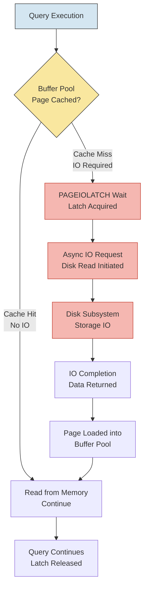

## Overview — PAGEIOLATCH Wait Type

PAGEIOLATCH_* waits occur when SQL Server needs a page that is not in the buffer pool and must read it from disk. The requestor waits on a latch (lightweight synchronization object) while the asynchronous IO completes. These are **IO-bound waits** — the thread sits idle until the storage subsystem returns the data.

Sub-types:

| Wait Type | Description | Typical Scenario |
|-----------|-------------|------------------|
| PAGEIOLATCH_SH | Shared latch — reading a page from disk | SELECT scanning a large table not in cache |
| PAGEIOLATCH_EX | Exclusive latch — reading a page to modify it | UPDATE reading a page before modifying it |
| PAGEIOLATCH_UP | Update latch — preparing to modify | Intermediate state before EX |

PAGEIOLATCH waits are the single most common indicator of storage IO bottlenecks in SQL Server. When the buffer pool cannot satisfy page requests, every query that touches cold data pays a disk read penalty.

```sql
-- Current PAGEIOLATCH waits at the instance level
SELECT
    wait_type,
    waiting_tasks_count,
    wait_time_ms,
    max_wait_time_ms,
    signal_wait_time_ms,
    wait_time_ms / NULLIF(waiting_tasks_count, 0) AS avg_wait_ms
FROM sys.dm_os_wait_stats
WHERE wait_type LIKE 'PAGEIOLATCH%'
ORDER BY wait_time_ms DESC;
```

**Key threshold**: If `avg_wait_ms > 50ms` consistently, the storage subsystem is under-performing. Modern SSDs should average below 5-10ms; HDD-based storage may run 20-50ms; SAN/NAS storage with congestion can exceed 100ms.

## Diagnosis — Identifying IO Bottlenecks via Wait Stats

Wait statistics are reset when SQL Server restarts or when `DBCC SQLPERF('sys.dm_os_wait_stats', CLEAR)` is executed. To diagnose current IO pressure, sample wait stats over a window (e.g., 15 minutes) and compute the delta.

```sql
-- Snapshot approach: capture baseline, wait, then compare
-- Step 1: Capture baseline
SELECT GETDATE() AS sample_time, wait_type, wait_time_ms, waiting_tasks_count
INTO #waits_baseline
FROM sys.dm_os_wait_stats
WHERE wait_type LIKE 'PAGEIOLATCH%';

-- WAIT 15 MINUTES (run this from monitoring tool)
-- WAITFOR DELAY '00:15:00';

-- Step 2: Capture current values and compute delta
SELECT
    w.wait_type,
    (w.wait_time_ms - b.wait_time_ms) AS wait_time_ms_delta,
    (w.waiting_tasks_count - b.waiting_tasks_count) AS waits_delta,
    CASE
        WHEN (w.waiting_tasks_count - b.waiting_tasks_count) = 0 THEN 0
        ELSE (w.wait_time_ms - b.wait_time_ms) / (w.waiting_tasks_count - b.waiting_tasks_count)
    END AS avg_wait_ms_delta
FROM sys.dm_os_wait_stats w
JOIN #waits_baseline b ON w.wait_type = b.wait_type
WHERE (w.wait_time_ms - b.wait_time_ms) > 0
ORDER BY wait_time_ms_delta DESC;

DROP TABLE #waits_baseline;
```

### PAGEIOLATCH Per Database File

```sql
-- IO stats per database file — identify which file(s) have high IO stalls
SELECT
    DB_NAME(mf.database_id) AS database_name,
    mf.name AS file_logical_name,
    mf.physical_name,
    mf.type_desc,
    fs.num_of_reads,
    fs.num_of_bytes_read / 1048576.0 AS total_read_mb,
    fs.io_stall_read_ms,
    fs.num_of_writes,
    fs.num_of_bytes_written / 1048576.0 AS total_write_mb,
    fs.io_stall_write_ms,
    fs.io_stall_read_ms / NULLIF(fs.num_of_reads, 0) AS avg_read_stall_ms,
    fs.io_stall_write_ms / NULLIF(fs.num_of_writes, 0) AS avg_write_stall_ms
FROM sys.dm_io_virtual_file_stats(NULL, NULL) fs
JOIN sys.master_files mf ON fs.database_id = mf.database_id AND fs.file_id = mf.file_id
ORDER BY fs.io_stall_read_ms DESC;
```

Files with `avg_read_stall_ms > 50ms` indicate the physical storage backing that file is slow. For tempdb, high stalls indicate tempdb contention spilling to disk.

## Queries — Top PAGEIOLATCH Consumers

Identifying which queries cause PAGEIOLATCH waits requires correlating wait stats with query plans. SQL Server exposes per-query wait stats in `sys.dm_exec_query_stats` (SQL Server 2016+ with Query Store, or via plan cache).

```sql
-- Top 10 queries by total PAGEIOLATCH waits from plan cache
SELECT TOP 10
    qs.total_elapsed_time / 1000 AS total_elapsed_ms,
    qs.total_worker_time / 1000 AS total_cpu_ms,
    qs.total_logical_reads,
    qs.total_physical_reads,
    qs.total_page_server_reads,
    qs.execution_count,
    qs.total_elapsed_time / NULLIF(qs.execution_count, 0) / 1000 AS avg_elapsed_ms,
    qs.total_physical_reads / NULLIF(qs.execution_count, 0) AS avg_physical_reads,
    SUBSTRING(st.text,
        (qs.statement_start_offset / 2) + 1,
        CASE
            WHEN qs.statement_end_offset = -1 THEN LEN(CONVERT(NVARCHAR(MAX), st.text))
            ELSE (qs.statement_end_offset - qs.statement_start_offset) / 2
        END
    ) AS query_text,
    qp.query_plan
FROM sys.dm_exec_query_stats qs
CROSS APPLY sys.dm_exec_sql_text(qs.sql_handle) st
CROSS APPLY sys.dm_exec_query_plan(qs.plan_handle) qp
WHERE qs.total_physical_reads > 0
ORDER BY qs.total_physical_reads DESC;
```

### Queries Currently Experiencing PAGEIOLATCH

```sql
-- Currently running queries waiting on PAGEIOLATCH
SELECT
    r.session_id,
    r.wait_type,
    r.wait_time,
    r.wait_resource,
    r.blocking_session_id,
    r.cpu_time,
    r.total_elapsed_time,
    r.reads,
    r.writes,
    r.logical_reads,
    r.command,
    t.text AS batch_text,
    SUBSTRING(st.text,
        (r.statement_start_offset / 2) + 1,
        CASE
            WHEN r.statement_end_offset = -1 THEN LEN(CONVERT(NVARCHAR(MAX), st.text))
            ELSE (r.statement_end_offset - r.statement_start_offset) / 2
        END
    ) AS statement_text,
    qp.query_plan
FROM sys.dm_exec_requests r
OUTER APPLY sys.dm_exec_sql_text(r.sql_handle) t
OUTER APPLY sys.dm_exec_sql_text(r.plan_handle) st
OUTER APPLY sys.dm_exec_query_plan(r.plan_handle) qp
WHERE r.wait_type LIKE 'PAGEIOLATCH%'
ORDER BY r.wait_time DESC;
```

### Historical PAGEIOLATCH Wait Stats by Database

```sql
-- Track PAGEIOLATCH over time (requires a monitoring table)
-- First, create a baseline table for trend analysis
IF OBJECT_ID('dbo.WaitStatsHistory') IS NULL
CREATE TABLE dbo.WaitStatsHistory (
    capture_time DATETIME2 NOT NULL,
    wait_type NVARCHAR(60) NOT NULL,
    waiting_tasks_count BIGINT,
    wait_time_ms BIGINT,
    max_wait_time_ms BIGINT,
    signal_wait_time_ms BIGINT,
    CONSTRAINT PK_WaitStatsHistory PRIMARY KEY (capture_time, wait_type)
);

-- Insert a snapshot (run every 15-30 minutes from SQL Agent job)
INSERT INTO dbo.WaitStatsHistory (capture_time, wait_type, waiting_tasks_count, wait_time_ms, max_wait_time_ms, signal_wait_time_ms)
SELECT GETDATE(), wait_type, waiting_tasks_count, wait_time_ms, max_wait_time_ms, signal_wait_time_ms
FROM sys.dm_os_wait_stats
WHERE wait_type LIKE 'PAGEIOLATCH%';

-- Trend analysis — how has PAGEIOLATCH changed over the past 24 hours?
SELECT
    capture_time,
    wait_type,
    waiting_tasks_count,
    wait_time_ms,
    wait_time_ms / NULLIF(waiting_tasks_count, 0) AS avg_wait_ms
FROM dbo.WaitStatsHistory
WHERE wait_type LIKE 'PAGEIOLATCH%'
  AND capture_time >= DATEADD(HOUR, -24, GETDATE())
ORDER BY capture_time DESC;
```

## Buffer Pool — Page Life Expectancy & IO Correlation

Page Life Expectancy (PLE) measures how long (in seconds) a page stays in the buffer pool before being referenced again. PLE and PAGEIOLATCH are inversely correlated:

- **Low PLE (< 300s) + High PAGEIOLATCH** = Memory pressure: pages are flushed from cache due to memory contention, forcing disk reads on re-reference.
- **High PLE (> 1000s) + High PAGEIOLATCH** = Working set larger than buffer pool: the data volume needed by queries exceeds available memory.
- **High PLE + Low PAGEIOLATCH** = Healthy: most reads satisfied from cache.

```sql
-- Current PLE for each NUMA node
SELECT
    node_id,
    memory_node_id,
    page_life_expectancy_sec AS ple_seconds,
    page_life_expectancy_sec / 60 AS ple_minutes,
    CASE
        WHEN page_life_expectancy_sec < 300 THEN 'CRITICAL — memory pressure'
        WHEN page_life_expectancy_sec < 600 THEN 'WARNING — investigate memory'
        WHEN page_life_expectancy_sec < 1000 THEN 'ACCEPTABLE — monitor'
        ELSE 'HEALTHY'
    END AS ple_status
FROM sys.dm_os_performance_counters
WHERE counter_name = 'Page life expectancy';
```

### PLE Historical Trend

```sql
-- Buffer pool health — PLE and free list stalls
SELECT
    counter_name,
    cntr_value,
    CASE
        WHEN counter_name = 'Page life expectancy' THEN
            CASE
                WHEN cntr_value < 300 THEN 'Low — memory pressure likely'
                WHEN cntr_value < 600 THEN 'Moderate — investigate'
                ELSE 'Adequate'
            END
        WHEN counter_name = 'Free list stalls/sec' AND cntr_value > 0
            THEN 'Indicates memory pressure'
        ELSE 'OK'
    END AS interpretation
FROM sys.dm_os_performance_counters
WHERE counter_name IN (
    'Page life expectancy',
    'Free list stalls/sec',
    'Lazy writes/sec',
    'Page reads/sec',
    'Page writes/sec'
);
```

### Lazy writes indicate memory pressure

When the lazy writer process frequently flushes pages, PLE drops and subsequent PAGEIOLATCH increases occur. This is visualized in the mermaid diagram:



## Storage — IO Subsystem Performance Analysis

The storage subsystem is the key to reducing PAGEIOLATCH. Use `sys.dm_io_virtual_file_stats` to measure latency per file, and correlate with `sys.dm_os_wait_stats`.

```sql
-- IO latency breakdown — read vs write by file type
SELECT
    DB_NAME(database_id) AS db,
    file_id,
    SUM(num_of_reads) AS total_reads,
    SUM(num_of_bytes_read) / 1048576.0 AS total_read_mb,
    SUM(io_stall_read_ms) AS total_read_stall_ms,
    CASE
        WHEN SUM(num_of_reads) = 0 THEN 0
        ELSE SUM(io_stall_read_ms) / SUM(num_of_reads)
    END AS avg_read_latency_ms,
    SUM(num_of_writes) AS total_writes,
    SUM(num_of_bytes_written) / 1048576.0 AS total_write_mb,
    SUM(io_stall_write_ms) AS total_write_stall_ms,
    CASE
        WHEN SUM(num_of_writes) = 0 THEN 0
        ELSE SUM(io_stall_write_ms) / SUM(num_of_writes)
    END AS avg_write_latency_ms
FROM sys.dm_io_virtual_file_stats(NULL, NULL)
GROUP BY database_id, file_id
ORDER BY avg_read_latency_ms DESC;
```

### IO Subsystem Capacity

```sql
-- IOPS and throughput per database file (since last restart)
SELECT
    DB_NAME(fs.database_id) AS database_name,
    mf.name AS file_name,
    mf.physical_name,
    mf.type_desc,
    fs.num_of_reads,
    fs.num_of_bytes_read / 1048576.0 AS total_read_mb,
    fs.num_of_writes,
    fs.num_of_bytes_written / 1048576.0 AS total_write_mb,
    fs.num_of_reads + fs.num_of_writes AS total_iops,
    (fs.num_of_bytes_read + fs.num_of_bytes_written) / 1048576.0 / NULLIF(DATEDIFF(SECOND, dos.sqlserver_start_time, GETDATE()), 0) * 60 AS avg_throughput_mb_per_min
FROM sys.dm_io_virtual_file_stats(NULL, NULL) fs
JOIN sys.master_files mf
    ON fs.database_id = mf.database_id
    AND fs.file_id = mf.file_id
CROSS JOIN sys.dm_os_sys_info dos
ORDER BY total_iops DESC;
```

### Storage Configuration Best Practices

| Storage Type | Expected Avg Latency | Notes |
|---|---|---|
| Local NVMe SSD | 0.1 - 1ms | Optimal for SQL Server |
| Local SATA SSD | 1 - 5ms | Good for most workloads |
| SAN Flash | 2 - 10ms | Depends on fabric congestion |
| HDD 15k RPM | 5 - 15ms | Marginal for OLTP |
| HDD 7.2k RPM | 10 - 20ms | Not recommended for data files |
| Network Storage (NAS) | 5 - 50ms+ | High variance, avoid for tempdb |

## .NET Integration — Monitoring with C\#

A .NET application can monitor PAGEIOLATCH waits via `SqlConnection` and `SqlCommand`. Below is a production-grade monitor using `Microsoft.Data.SqlClient`.

```csharp
using Microsoft.Data.SqlClient;
using System;
using System.Collections.Generic;
using System.Threading;
using System.Threading.Tasks;

public sealed class PageIoLatchMonitor : IDisposable
{
    private readonly string _connectionString;
    private readonly TimeSpan _pollingInterval;
    private readonly CancellationTokenSource _cts = new();
    private Task _monitoringTask;
    private long _baselineWaitTimeMs;
    private long _baselineWaitCount;

    public PageIoLatchMonitor(string connectionString, TimeSpan pollingInterval)
    {
        _connectionString = connectionString ?? throw new ArgumentNullException(nameof(connectionString));
        _pollingInterval = pollingInterval;
    }

    public void Start()
    {
        _monitoringTask = MonitorLoopAsync(_cts.Token);
    }

    public void Stop()
    {
        _cts.Cancel();
        _monitoringTask?.GetAwaiter().GetResult();
    }

    private async Task MonitorLoopAsync(CancellationToken cancellationToken)
    {
        while (!cancellationToken.IsCancellationRequested)
        {
            try
            {
                var snapshot = await CaptureWaitStatsAsync(cancellationToken);

                if (_baselineWaitTimeMs == 0)
                {
                    _baselineWaitTimeMs = snapshot.WaitTimeMs;
                    _baselineWaitCount = snapshot.WaitingTasksCount;
                    Console.WriteLine($"[{DateTime.UtcNow:O}] PAGEIOLATCH baseline recorded: " +
                        $"WaitTime={snapshot.WaitTimeMs}ms, Count={snapshot.WaitingTasksCount}");
                }
                else
                {
                    var deltaTimeMs = snapshot.WaitTimeMs - _baselineWaitTimeMs;
                    var deltaCount = snapshot.WaitingTasksCount - _baselineWaitCount;
                    var avgMs = deltaCount > 0 ? deltaTimeMs / deltaCount : 0;

                    var alert = avgMs switch
                    {
                        > 100 => "CRITICAL: Storage latency exceeding 100ms",
                        > 50  => "WARNING: Storage latency exceeding 50ms",
                        > 20  => "INFO: Elevated storage latency",
                        _     => null
                    };

                    if (alert != null)
                    {
                        Console.WriteLine($"[{DateTime.UtcNow:O}] {alert} — " +
                            $"AvgWait={avgMs}ms, DeltaWaitMs={deltaTimeMs}, DeltaCount={deltaCount}");
                    }

                    _baselineWaitTimeMs = snapshot.WaitTimeMs;
                    _baselineWaitCount = snapshot.WaitingTasksCount;
                }
            }
            catch (Exception ex) when (ex is not OperationCanceledException)
            {
                Console.Error.WriteLine($"[{DateTime.UtcNow:O}] Monitor error: {ex.Message}");
            }

            await Task.Delay(_pollingInterval, cancellationToken);
        }
    }

    private async Task<PageIoLatchStats> CaptureWaitStatsAsync(CancellationToken cancellationToken)
    {
        await using var conn = new SqlConnection(_connectionString);
        await conn.OpenAsync(cancellationToken);

        var cmd = new SqlCommand(@"
            SELECT
                SUM(wait_time_ms) AS total_wait_time_ms,
                SUM(waiting_tasks_count) AS total_waiting_tasks
            FROM sys.dm_os_wait_stats
            WHERE wait_type LIKE 'PAGEIOLATCH%';", conn);

        await using var reader = await cmd.ExecuteReaderAsync(cancellationToken);
        await reader.ReadAsync(cancellationToken);

        return new PageIoLatchStats(
            reader.GetInt64(0),
            reader.GetInt64(1));
    }

    public void Dispose()
    {
        _cts.Cancel();
        _cts.Dispose();
        _monitoringTask?.Dispose();
    }

    private sealed record PageIoLatchStats(long WaitTimeMs, long WaitingTasksCount);
}
```

### .NET Health Check Endpoint for ASP.NET Core

```csharp
using Microsoft.Data.SqlClient;
using Microsoft.Extensions.Diagnostics.HealthChecks;
using System;
using System.Threading;
using System.Threading.Tasks;

public sealed class SqlServerIOHealthCheck : IHealthCheck
{
    private readonly string _connectionString;
    private readonly long _warningThresholdMs = 50;
    private readonly long _criticalThresholdMs = 100;
    private readonly long _baselineWaitTimeMs;
    private readonly long _baselineWaitCount;
    private bool _baselineSet;

    public SqlServerIOHealthCheck(string connectionString)
    {
        _connectionString = connectionString;
    }

    public async Task<HealthCheckResult> CheckHealthAsync(
        HealthCheckContext context,
        CancellationToken cancellationToken = default)
    {
        await using var conn = new SqlConnection(_connectionString);
        await conn.OpenAsync(cancellationToken);

        var cmd = new SqlCommand(@"
            SELECT
                SUM(wait_time_ms) AS total_wait_time_ms,
                SUM(waiting_tasks_count) AS total_waiting_tasks
            FROM sys.dm_os_wait_stats
            WHERE wait_type LIKE 'PAGEIOLATCH%';", conn);

        await using var reader = await cmd.ExecuteReaderAsync(cancellationToken);
        await reader.ReadAsync(cancellationToken);

        var waitTimeMs = reader.GetInt64(0);
        var waitCount = reader.GetInt64(1);

        if (!_baselineSet)
        {
            _baselineWaitTimeMs = waitTimeMs;
            _baselineWaitCount = waitCount;
            _baselineSet = true;
            return HealthCheckResult.Healthy("Baseline established — next check will compute delta.");
        }

        var deltaTimeMs = waitTimeMs - _baselineWaitTimeMs;
        var deltaCount = waitCount - _baselineWaitCount;
        var avgMs = deltaCount > 0 ? deltaTimeMs / deltaCount : 0;

        var data = new Dictionary<string, object>
        {
            ["AvgPageIoLatencyMs"] = avgMs,
            ["DeltaWaitTimeMs"] = deltaTimeMs,
            ["DeltaWaitCount"] = deltaCount,
            ["TotalWaitTimeMs"] = waitTimeMs,
            ["TotalWaitCount"] = waitCount
        };

        if (avgMs >= _criticalThresholdMs)
            return HealthCheckResult.Unhealthy(
                $"Storage critical — PAGEIOLATCH avg {avgMs}ms", data: data);

        if (avgMs >= _warningThresholdMs)
            return HealthCheckResult.Degraded(
                $"Storage degraded — PAGEIOLATCH avg {avgMs}ms", data: data);

        return HealthCheckResult.Healthy($"Storage healthy — PAGEIOLATCH avg {avgMs}ms", data);
    }
}
```

## Remediation — Reducing IO Pressure

### Short-Term Mitigations

```sql
-- 1. Identify and optimize worst-offending queries
-- Use the top PAGEIOLATCH consumer query from section Queries

-- 2. Add missing indexes to reduce read volume
SELECT
    mid.statement AS table_name,
    migs.avg_total_user_cost * migs.avg_user_impact * (migs.user_seeks + migs.user_scans) AS index_advantage,
    migs.avg_user_impact,
    migs.user_seeks,
    migs.user_scans,
    mid.equality_columns,
    mid.inequality_columns,
    mid.included_columns,
    'CREATE NONCLUSTERED INDEX IX_' + OBJECT_NAME(mid.object_id) + '_' +
        REPLACE(REPLACE(REPLACE(ISNULL(mid.equality_columns, '') + ISNULL(mid.inequality_columns, ''), '[', ''), ']', ''), ', ', '_')
    + ' ON ' + mid.statement + ' (' + ISNULL(mid.equality_columns, '') +
        CASE WHEN mid.equality_columns IS NOT NULL AND mid.inequality_columns IS NOT NULL THEN ', ' ELSE '' END +
        ISNULL(mid.inequality_columns, '') + ')' +
        ISNULL(' INCLUDE (' + mid.included_columns + ')', '') AS create_index_statement
FROM sys.dm_db_missing_index_details mid
CROSS APPLY sys.dm_db_missing_index_groups mig
INNER JOIN sys.dm_db_missing_index_group_stats migs
    ON mig.index_group_handle = migs.group_handle
WHERE mid.database_id = DB_ID()
ORDER BY index_advantage DESC;
```

### Long-Term Strategies

1. **Increase Buffer Pool Memory**: If PLE is low, add more RAM to reduce disk reads. Monitor `sys.dm_os_performance_counters` for `Page life expectancy`.
2. **Storage Upgrade**: Replace HDD with SSD. If using SAN, increase cache or allocate dedicated spindles.
3. **Data Compression**: Page compression reduces IO by storing more rows per page.
4. **Partitioning**: Large table partitioning can improve partition elimination for range scans.
5. **Columnstore Indexes**: For data warehouse workloads, columnstore compression reduces IO.
6. **Buffer Pool Extension**: SQL Server 2014+ allows extending buffer pool to SSDs (deprecated in 2022 but still relevant for legacy).

```sql
-- Evaluate data compression impact on IO
SELECT
    s.name AS schema_name,
    t.name AS table_name,
    p.rows,
    SUM(a.total_pages) * 8 / 1024 AS total_size_mb,
    SUM(CASE WHEN p.data_compression = 0 THEN a.total_pages ELSE 0 END) * 8 / 1024 AS uncompressed_size_mb,
    SUM(CASE WHEN p.data_compression > 0 THEN a.total_pages ELSE 0 END) * 8 / 1024 AS compressed_size_mb
FROM sys.tables t
JOIN sys.schemas s ON t.schema_id = s.schema_id
JOIN sys.partitions p ON t.object_id = p.object_id
JOIN sys.allocation_units a ON p.hobt_id = a.container_id
GROUP BY s.name, t.name, p.rows
ORDER BY total_size_mb DESC;
```

### File Group Placement

Separate heavily-read tables onto dedicated filegroups on fast storage:

```sql
-- Create filegroup on fast SSD storage
ALTER DATABASE AdventureWorks
    ADD FILEGROUP FastData;
GO

ALTER DATABASE AdventureWorks
    ADD FILE (
        NAME = AdventureWorks_FastData,
        FILENAME = 'S:\SQLData\AdventureWorks_FastData.ndf',
        SIZE = 10GB,
        MAXSIZE = UNLIMITED,
        FILEGROWTH = 1GB
    ) TO FILEGROUP FastData;
GO

-- Move table to fast filegroup
CREATE UNIQUE CLUSTERED INDEX IX_SalesOrderDetail_Modified
    ON Sales.SalesOrderDetail (SalesOrderDetailID)
    WITH (DROP_EXISTING = ON, ONLINE = ON)
    ON FastData;
GO
```

### Read-Ahead Mechanism

SQL Server uses **read-ahead** to anticipate page needs and issue large sequential reads. While read-ahead reduces PAGEIOLATCH (because pages arrive in cache before the query needs them), it can mask IO problems:

```sql
-- Check read-ahead effectiveness
SELECT
    DB_NAME(database_id) AS db,
    file_id,
    SUM(num_of_reads) AS total_reads,
    SUM(num_of_bytes_read) / 1048576.0 AS total_read_mb,
    SUM(io_stall_read_ms) AS total_read_stall_ms,
    SUM(num_of_reads) / NULLIF(DATEDIFF(SECOND, MIN(sample_ms), MAX(sample_ms)), 0) AS reads_per_sec
FROM sys.dm_io_virtual_file_stats(NULL, NULL)
GROUP BY database_id, file_id;
```

## Additional — PAGEIOLATCH vs PAGELATCH vs LATCH

Many DBAs confuse PAGEIOLATCH and PAGELATCH. They are fundamentally different:

| Aspect | PAGEIOLATCH | PAGELATCH | LATCH (Non-Page) |
|--------|-------------|-----------|------------------|
| **Wait reason** | Page not in buffer pool, waiting for disk IO | Page in buffer pool, waiting for access by another thread | Internal data structure access |
| **Bottleneck** | Storage subsystem | CPU/memory contention | Specific resource contention |
| **Sub-types** | SH, EX, UP | SH, EX, UP | Various (access, buffer, etc.) |
| **Mitigation** | Faster storage, more memory, better queries | Better indexing, partition alignment | Schema design, workload management |

```sql
-- Compare all latch wait types to understand the mix
SELECT
    wait_type,
    wait_time_ms,
    waiting_tasks_count,
    wait_time_ms / NULLIF(waiting_tasks_count, 0) AS avg_wait_ms,
    CASE
        WHEN wait_type LIKE 'PAGEIOLATCH%' THEN 'IO Latch'
        WHEN wait_type LIKE 'PAGELATCH%' THEN 'Buffer Latch'
        WHEN wait_type LIKE 'LATCH%' THEN 'Non-Buffer Latch'
        ELSE 'Other'
    END AS latch_category
FROM sys.dm_os_wait_stats
WHERE wait_type LIKE '%LATCH%'
ORDER BY wait_time_ms DESC;
```

### SSD Considerations

SSDs reduce PAGEIOLATCH dramatically but do not eliminate it:

1. **SSD queue depth**: A single SSD can handle ~32-64 concurrent IO requests; overload causes latency.
2. **Write amplification**: Some SSDs slow down under sustained writes (thermal throttling).
3. **NVMe vs SATA**: NVMe (PCIe) provides lower latency and higher IOPS than SATA SSDs.
4. **Storage controller cache**: Write-back cache reduces write latency; battery-backed cache prevents data loss.

```sql
-- Check if storage is keeping up — see avg disk queue length via perfmon
-- SQL Server cannot query this directly, but can use sys.dm_os_performance_counters
-- for average disk sec/read and sec/write

SELECT
    object_name,
    counter_name,
    instance_name,
    cntr_value,
    CASE
        WHEN counter_name LIKE 'Avg. Disk sec/Read' THEN
            CASE
                WHEN cntr_value > 50 THEN 'CRITICAL'
                WHEN cntr_value > 20 THEN 'WARNING'
                WHEN cntr_value > 10 THEN 'MODERATE'
                ELSE 'HEALTHY'
            END
        ELSE ''
    END AS io_status
FROM sys.dm_os_performance_counters
WHERE counter_name IN (
    'Avg. Disk sec/Read',
    'Avg. Disk sec/Write',
    'Disk Reads/sec',
    'Disk Writes/sec',
    'Current Disk Queue Length'
);
```

## Automation — Monitoring with PowerShell

### PowerShell IO Health Check

```powershell
function Get-SqlServerIOHealth {
    param(
        [string]$SqlInstance = "localhost",
        [int]$PleThreshold = 300,
        [int]$PageIoLatchThresholdMs = 50
    )

    $query = @"
SELECT
    (SELECT SUM(wait_time_ms) FROM sys.dm_os_wait_stats WHERE wait_type LIKE 'PAGEIOLATCH%') AS total_pageiolatch_ms,
    (SELECT SUM(waiting_tasks_count) FROM sys.dm_os_wait_stats WHERE wait_type LIKE 'PAGEIOLATCH%') AS total_pageiolatch_waits,
    (SELECT cntr_value FROM sys.dm_os_performance_counters WHERE counter_name = 'Page life expectancy') AS ple_seconds,
    (SELECT AVG(CAST(io_stall_read_ms AS FLOAT) / NULLIF(num_of_reads, 1))
        FROM sys.dm_io_virtual_file_stats(NULL, NULL)) AS avg_read_stall_ms,
    (SELECT MAX(CASE WHEN num_of_reads > 0 THEN io_stall_read_ms / num_of_reads ELSE 0 END)
        FROM sys.dm_io_virtual_file_stats(NULL, NULL)) AS max_read_latency_ms
"@

    $result = Invoke-Sqlcmd -ServerInstance $SqlInstance -Query $query
    $avgWait = if ($result.total_pageiolatch_waits -gt 0) {
        $result.total_pageiolatch_ms / $result.total_pageiolatch_waits
    } else { 0 }

    $health = @{
        Status = "HEALTHY"
        AvgPageIoLatchMs = [math]::Round($avgWait, 1)
        PLE = $result.ple_seconds
        AvgReadStallMs = [math]::Round($result.avg_read_stall_ms, 1)
        MaxReadLatencyMs = [math]::Round($result.max_read_latency_ms, 1)
        Timestamp = Get-Date
    }

    if ($avgWait -ge $PageIoLatchThresholdMs -or $result.ple_seconds -lt $PleThreshold) {
        $health.Status = "WARNING"
    }
    if ($avgWait -ge ($PageIoLatchThresholdMs * 2) -or $result.ple_seconds -lt ($PleThreshold / 2)) {
        $health.Status = "CRITICAL"
    }

    return $health
}
```

### Automated Alerting — SQL Agent Job

```sql
-- SQL Agent job step: Check PAGEIOLATCH and send alert
DECLARE @avg_wait_ms INT = (
    SELECT wait_time_ms / NULLIF(waiting_tasks_count, 0)
    FROM sys.dm_os_wait_stats
    WHERE wait_type LIKE 'PAGEIOLATCH_SH'
);

DECLARE @ple INT = (
    SELECT cntr_value
    FROM sys.dm_os_performance_counters
    WHERE counter_name = 'Page life expectancy'
);

IF @avg_wait_ms > 50 OR @ple < 300
BEGIN
    DECLARE @subject NVARCHAR(255) = 'IO Alert: PLE=' + CAST(@ple AS VARCHAR) +
        ' PAGEIOLATCH_AVG=' + CAST(@avg_wait_ms AS VARCHAR) + 'ms';

    DECLARE @body NVARCHAR(MAX) = '

    <html><body>
    <h3>SQL Server IO Health Alert</h3>
    <table border="1">
    <tr><td>Avg PAGEIOLATCH Wait</td><td>' + CAST(@avg_wait_ms AS VARCHAR) + ' ms</td></tr>
    <tr><td>Page Life Expectancy</td><td>' + CAST(@ple AS VARCHAR) + ' sec</td></tr>
    <tr><td>Threshold</td><td>AvgWait>50ms OR PLE<300s</td></tr>
    </table>
    </body></html>';

    EXEC msdb.dbo.sp_send_dbmail
        @profile_name = 'DBAlerts',
        @recipients = 'dba@company.com',
        @subject = @subject,
        @body = @body,
        @body_format = 'HTML';
END
```

### Grafana Prometheus Integration

For production monitoring, export PAGEIOLATCH metrics to Prometheus via a custom exporter:

```csharp
// Prometheus metrics collector for PAGEIOLATCH
public static class SqlExporterMetrics
{
    public static readonly Gauge PageIoLatchAvgWaitMs = Metrics
        .CreateGauge("sql_pageiolatch_avg_wait_ms", "Average PAGEIOLATCH wait time",
            new GaugeConfiguration { LabelNames = new[] { "instance", "wait_type" } });

    public static readonly Gauge PageLifeExpectancySeconds = Metrics
        .CreateGauge("sql_page_life_expectancy_seconds",
            "Buffer pool page life expectancy",
            new GaugeConfiguration { LabelNames = new[] { "instance" } });

    public static readonly Gauge IoReadLatencyMs = Metrics
        .CreateGauge("sql_io_read_latency_ms", "Average IO read latency",
            new GaugeConfiguration { LabelNames = new[] { "instance", "database", "file" } });
}
```

## References — Further Reading

- Microsoft Docs: `sys.dm_os_wait_stats` — Wait Types
- Microsoft Docs: `sys.dm_io_virtual_file_stats`
- Microsoft Docs: Buffer Pool Extension (SQL Server 2014+)
- KB 2965558: PAGEIOLATCH waits and slow storage
- SQL Server Storage Engine: Page Life Expectancy
- Wait Statistics: Paul Randal's wait type categorization
- SQLskills: `sp_blitz` wait stats analysis
- SQLShack: Diagnosing IO bottlenecks in SQL Server
- Brent Ozar's How to Think Like the Engine: PAGEIOLATCH
- Microsoft SQL Server Performance Tuning with Wait Statistics
- BOL: `sys.dm_exec_query_stats` — Physical Reads

```sql
-- Final health check — summary of IO health
SELECT
    'PAGEIOLATCH Total Wait Time (ms)' AS metric,
    SUM(wait_time_ms) AS value
FROM sys.dm_os_wait_stats
WHERE wait_type LIKE 'PAGEIOLATCH%'
UNION ALL
SELECT
    'PAGEIOLATCH Avg Wait Time (ms)',
    SUM(wait_time_ms) / NULLIF(SUM(waiting_tasks_count), 0)
FROM sys.dm_os_wait_stats
WHERE wait_type LIKE 'PAGEIOLATCH%'
UNION ALL
SELECT
    'Page Life Expectancy (sec)',
    cntr_value
FROM sys.dm_os_performance_counters
WHERE counter_name = 'Page life expectancy'
UNION ALL
SELECT
    'Total Physical Reads (all DBs)',
    SUM(num_of_reads)
FROM sys.dm_io_virtual_file_stats(NULL, NULL)
UNION ALL
SELECT
    'Avg Read Stall (ms)',
    SUM(io_stall_read_ms) / NULLIF(SUM(num_of_reads), 0)
FROM sys.dm_io_virtual_file_stats(NULL, NULL);
```

---

**Related Notes**:
- [[8.917 — Wait Statistics — Top Waits Analysis]] — Broader wait stats methodology
- [[8.918 — Wait Categories — CPU, IO, Lock, Memory]] — Categorizing waits for triage
- [[8.939 — Database Space Monitoring — File Growth Alerts]] — Storage capacity planning
- [[8.316 — sys.dm_exec_query_stats]] — Query-level performance analysis

```sql
-- Quick one-liner: Current PAGEIOLATCH pressure level
SELECT
    CASE
        WHEN SUM(wait_time_ms) / NULLIF(SUM(waiting_tasks_count), 0) < 10 THEN 'Low IO Pressure'
        WHEN SUM(wait_time_ms) / NULLIF(SUM(waiting_tasks_count), 0) < 50 THEN 'Moderate IO Pressure'
        WHEN SUM(wait_time_ms) / NULLIF(SUM(waiting_tasks_count), 0) < 100 THEN 'High IO Pressure'
        ELSE 'Critical IO Pressure'
    END AS io_pressure_level,
    SUM(wait_time_ms) AS total_wait_ms,
    SUM(waiting_tasks_count) AS total_waits,
    SUM(wait_time_ms) / NULLIF(SUM(waiting_tasks_count), 0) AS avg_wait_ms
FROM sys.dm_os_wait_stats
WHERE wait_type LIKE 'PAGEIOLATCH%';
```
