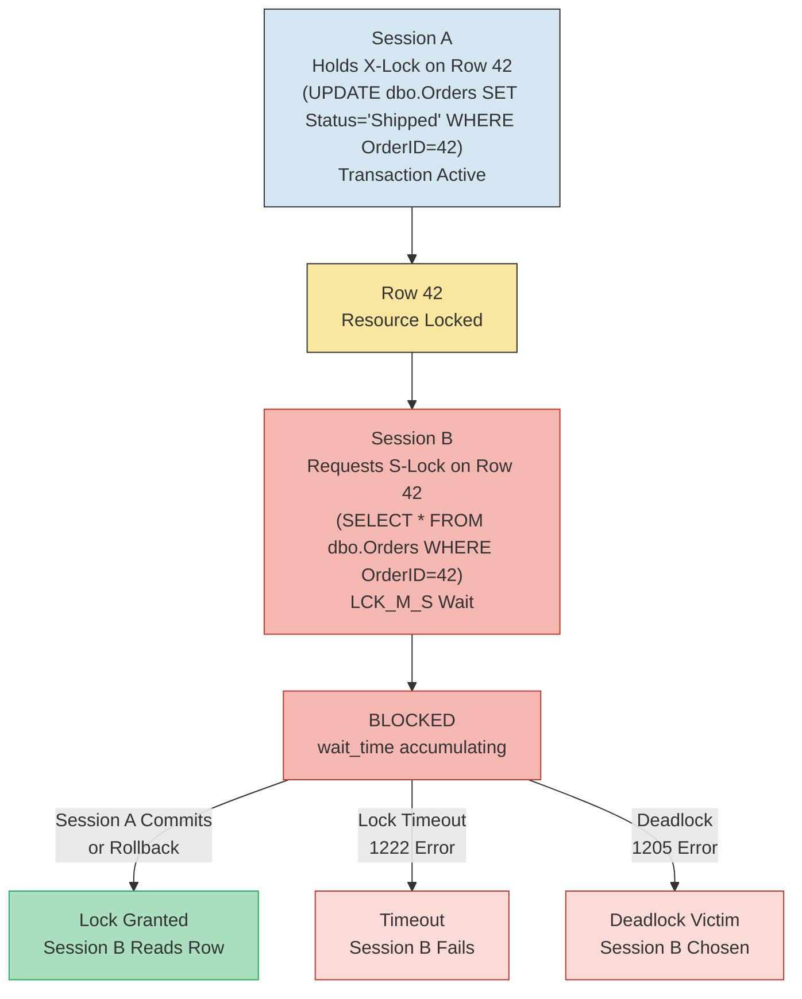

## Overview — Lock Wait Types

LCK_M_* waits occur when a session requests a lock that is incompatible with an existing lock held by another session. The requesting session waits until the blocking session releases the lock. These waits represent **concurrency contention** — multiple sessions competing for access to the same resource.

Lock compatibility determines whether a wait occurs:

| Requested Lock Mode | Granted IS | Granted S | Granted U | Granted IX | Granted X |
|--------------------|-----------|----------|-----------|-----------|----------|
| IS (Intent Shared) | Compatible | Compatible | Compatible | Compatible | Conflict |
| S (Shared) | Compatible | Compatible | Conflict | Conflict | Conflict |
| U (Update) | Compatible | Conflict | Conflict | Conflict | Conflict |
| IX (Intent Exclusive) | Compatible | Conflict | Conflict | Compatible | Conflict |
| X (Exclusive) | Conflict | Conflict | Conflict | Conflict | Conflict |

### LCK Wait Sub-types

```sql
-- Current LCK wait breakdown at instance level
SELECT
    wait_type,
    waiting_tasks_count,
    wait_time_ms,
    max_wait_time_ms,
    signal_wait_time_ms,
    wait_time_ms / NULLIF(waiting_tasks_count, 0) AS avg_wait_ms,
    CASE
        WHEN wait_type = 'LCK_M_S' THEN 'Shared — SELECT blocked by modifying transaction'
        WHEN wait_type = 'LCK_M_X' THEN 'Exclusive — INSERT/UPDATE/DELETE blocked'
        WHEN wait_type = 'LCK_M_U' THEN 'Update — conversion wait from S to X'
        WHEN wait_type = 'LCK_M_IX' THEN 'Intent Exclusive — page/page intent lock wait'
        WHEN wait_type = 'LCK_M_SCH_S' THEN 'Schema Stability — DDL/DML concurrency'
        WHEN wait_type = 'LCK_M_SCH_M' THEN 'Schema Modification — DDL blocking all queries'
        WHEN wait_type LIKE 'LCK_M_BU%' THEN 'Bulk Update — bulk insert operations'
        ELSE 'Other LCK wait'
    END AS wait_description
FROM sys.dm_os_wait_stats
WHERE wait_type LIKE 'LCK_M_%'
  AND wait_time_ms > 0
ORDER BY wait_time_ms DESC;
```

### Common LCK Wait Scenarios

| Wait Type | Typical Cause | Example |
|-----------|--------------|---------|
| LCK_M_S | SELECT trying to read rows held by X-locked transaction | SELECT blocked by uncommitted UPDATE |
| LCK_M_X | INSERT/UPDATE/DELETE waiting for another X-lock | Two transactions modifying same row |
| LCK_M_U | Lock conversion wait (S → X) | SELECT...FOR UPDATE or FK validation |
| LCK_M_SCH_S | DDL (ALTER) blocking queries or vice versa | Index rebuild with ONLINE=OFF |
| LCK_M_IX | Page/table intent lock blocked | Insert into page with X-lock on row |
| LCK_M_RX | Range-X lock blocking range scans | Serializable isolation phantom protection |

## Diagnosis — Blocking Chain Detection

The primary diagnostic query identifies the complete blocking chain — from the blocked session up through each blocker to the head blocker.

```sql
-- Full blocking chain — run in any database
WITH BlockingChain AS (
    SELECT
        r.session_id AS blocked_session_id,
        r.blocking_session_id,
        r.wait_type,
        r.wait_time,
        r.wait_resource,
        r.last_wait_type,
        r.cpu_time,
        r.total_elapsed_time,
        r.reads,
        r.writes,
        r.logical_reads,
        r.command,
        r.status,
        r.open_transaction_count,
        r.database_id,
        1 AS chain_level
    FROM sys.dm_exec_requests r
    WHERE r.blocking_session_id > 0
      AND r.blocking_session_id != r.session_id

    UNION ALL

    SELECT
        r.session_id,
        r.blocking_session_id,
        r.wait_type,
        r.wait_time,
        r.wait_resource,
        r.last_wait_type,
        r.cpu_time,
        r.total_elapsed_time,
        r.reads,
        r.writes,
        r.logical_reads,
        r.command,
        r.status,
        r.open_transaction_count,
        r.database_id,
        bc.chain_level + 1
    FROM sys.dm_exec_requests r
    INNER JOIN BlockingChain bc
        ON r.session_id = bc.blocking_session_id
    WHERE r.session_id > 0
      AND r.blocking_session_id != r.session_id
)
SELECT
    bc.blocked_session_id AS session_id,
    bc.blocking_session_id,
    bc.wait_type,
    bc.wait_time,
    bc.wait_resource,
    bc.chain_level,
    bc.cpu_time,
    bc.total_elapsed_time,
    bc.reads,
    bc.writes,
    bc.command,
    bc.status,
    t.text AS sql_text,
    qp.query_plan
FROM BlockingChain bc
OUTER APPLY sys.dm_exec_sql_text(
    (SELECT sql_handle FROM sys.dm_exec_requests WHERE session_id = bc.blocked_session_id)
) t
OUTER APPLY sys.dm_exec_query_plan(
    (SELECT plan_handle FROM sys.dm_exec_requests WHERE session_id = bc.blocked_session_id)
) qp
ORDER BY bc.chain_level;
```

### Simplified Blocking Tree — Head Blocker Identification

```sql
-- Head blocker detection — identifies the root cause session
SELECT
    blocked.session_id AS blocked_session_id,
    blocked.wait_type AS blocked_wait_type,
    blocked.wait_time AS blocked_wait_time_ms,
    blocked.wait_resource,
    blocked.last_wait_type,
    blocked.cpu_time AS blocked_cpu_ms,
    blocked.total_elapsed_time AS blocked_elapsed_ms,
    blocked_reads = blocked.reads,
    blocked_writes = blocked.writes,
    blocked_text = (SELECT TOP 1 SUBSTRING(st.text,
        (blocked.statement_start_offset / 2) + 1,
        CASE
            WHEN blocked.statement_end_offset = -1 THEN LEN(CONVERT(NVARCHAR(MAX), st.text))
            ELSE (blocked.statement_end_offset - blocked.statement_start_offset) / 2
        END
    ) FROM sys.dm_exec_sql_text(blocked.sql_handle) st),
    blocker.session_id AS blocker_session_id,
    blocker.wait_type AS blocker_wait_type,
    blocker.last_wait_type AS blocker_last_wait,
    blocker.cpu_time AS blocker_cpu_ms,
    blocker.total_elapsed_time AS blocker_elapsed_ms,
    blocker.reads AS blocker_reads,
    blocker.writes AS blocker_writes,
    blocker.command AS blocker_command,
    blocker.status AS blocker_status,
    blocker.open_transaction_count AS blocker_open_tran,
    blocker_text = (SELECT TOP 1 SUBSTRING(st.text,
        (blocker.statement_start_offset / 2) + 1,
        CASE
            WHEN blocker.statement_end_offset = -1 THEN LEN(CONVERT(NVARCHAR(MAX), st.text))
            ELSE (blocker.statement_end_offset - blocker.statement_start_offset) / 2
        END
    ) FROM sys.dm_exec_sql_text(blocker.sql_handle) st),
    tc.name AS blocker_transaction_name,
    tc.transaction_begin_time,
    CASE
        WHEN at.transaction_state = 0 THEN 'Uninitialized'
        WHEN at.transaction_state = 1 THEN 'Not started'
        WHEN at.transaction_state = 2 THEN 'Active'
        WHEN at.transaction_state = 3 THEN 'Ended (read-only)'
        WHEN at.transaction_state = 4 THEN 'Committing'
        WHEN at.transaction_state = 5 THEN 'Prepared'
        WHEN at.transaction_state = 6 THEN 'Committed'
        WHEN at.transaction_state = 7 THEN 'Rolling back'
        WHEN at.transaction_state = 8 THEN 'Rolled back'
    END AS blocker_tran_state
FROM sys.dm_exec_requests blocked
LEFT JOIN sys.dm_exec_sessions blocker
    ON blocked.blocking_session_id = blocker.session_id
LEFT JOIN sys.dm_tran_session_transactions tst
    ON blocked.blocking_session_id = tst.session_id
LEFT JOIN sys.dm_tran_active_transactions at
    ON tst.transaction_id = at.transaction_id
LEFT JOIN sys.dm_tran_current_transaction tc ON 1 = 0 -- placeholder for transaction name
WHERE blocked.blocking_session_id > 0
  AND blocked.blocking_session_id != blocked.session_id;
```

### Lock Details — What Resource Is Being Waited On?

```sql
-- Detailed lock information for all blocked sessions
SELECT
    tl.request_session_id AS blocked_session_id,
    tl.resource_type,
    tl.resource_subtype,
    tl.resource_database_id,
    DB_NAME(tl.resource_database_id) AS database_name,
    tl.resource_description,
    tl.resource_associated_entity_id,
    CASE
        WHEN tl.resource_type = 'OBJECT' THEN OBJECT_NAME(tl.resource_associated_entity_id)
        WHEN tl.resource_type = 'KEY' THEN
            (SELECT OBJECT_NAME(p.object_id)
             FROM sys.partitions p
             WHERE p.partition_id = tl.resource_associated_entity_id)
        WHEN tl.resource_type = 'PAGE' THEN
            (SELECT OBJECT_NAME(p.object_id)
             FROM sys.partitions p
             WHERE p.hobt_id = tl.resource_associated_entity_id)
        ELSE 'N/A'
    END AS object_name,
    tl.request_mode,
    tl.request_type,
    tl.request_status,
    tl.request_owner_type,
    tl.request_session_id AS owner_session_id
FROM sys.dm_tran_locks tl
WHERE tl.request_status = 'WAIT'
ORDER BY tl.resource_type, tl.request_session_id;
```



## Queries — Head Blocker & Wait Time Analysis

### Session-Level Lock Wait Summary

```sql
-- Aggregated lock wait time per session (from wait stats)
SELECT
    s.session_id,
    s.login_name,
    s.host_name,
    s.program_name,
    s.status,
    s.last_request_start_time,
    s.last_request_end_time,
    r.wait_type,
    r.wait_time,
    r.wait_resource,
    r.blocking_session_id,
    r.command,
    r.cpu_time,
    r.total_elapsed_time,
    r.reads,
    r.writes,
    r.logical_reads,
    r.open_transaction_count
FROM sys.dm_exec_sessions s
LEFT JOIN sys.dm_exec_requests r
    ON s.session_id = r.session_id
WHERE s.is_user_process = 1
  AND (r.wait_type LIKE 'LCK_M_%' OR s.session_id IN (
      SELECT blocking_session_id
      FROM sys.dm_exec_requests
      WHERE blocking_session_id > 0 AND blocking_session_id != session_id
  ))
ORDER BY
    CASE WHEN r.wait_type LIKE 'LCK_M_%' THEN 0 ELSE 1 END,
    r.wait_time DESC;
```

### Wait Time Distribution by Lock Type

```sql
-- Lock wait time by type (since last restart or stats clear)
SELECT
    wait_type,
    waiting_tasks_count,
    wait_time_ms,
    wait_time_ms / NULLIF(waiting_tasks_count, 0) AS avg_wait_ms,
    max_wait_time_ms,
    signal_wait_time_ms,
    signal_wait_time_ms / NULLIF(wait_time_ms, 0) * 100 AS signal_wait_pct,
    PERCENTILE_CONT(0.5) WITHIN GROUP (ORDER BY wait_time_ms) OVER (PARTITION BY wait_type) AS median_wait_ms
FROM sys.dm_os_wait_stats
WHERE wait_type LIKE 'LCK_M_%'
  AND wait_time_ms > 0
ORDER BY wait_time_ms DESC;
```

### Query Text of Blocker and Blocked (Detailed)

```sql
-- Full detail — blocker and blocked with SQL text and plan
SELECT
    blocked.session_id AS blocked_spid,
    blocked_text.text AS blocked_query,
    blocked.total_elapsed_time / 1000 AS blocked_elapsed_sec,
    blocked.wait_time AS blocked_wait_ms,
    blocked.wait_resource,
    blocked.blocking_session_id AS blocker_spid,
    blocker_text.text AS blocker_query,
    blocker.total_elapsed_time / 1000 AS blocker_elapsed_sec,
    blocker.status AS blocker_status,
    es.host_name AS blocker_host,
    es.program_name AS blocker_app,
    es.login_name AS blocker_login,
    ec.client_net_address AS blocker_client,
    CASE
        WHEN at.transaction_state = 2 THEN 'Active — has uncommitted changes'
        WHEN at.transaction_state = 3 THEN 'Ended (read-only)'
        WHEN at.transaction_state = 4 THEN 'Committing'
        WHEN at.transaction_state = 7 THEN 'Rolling back'
        ELSE 'Other (' + CAST(at.transaction_state AS VARCHAR) + ')'
    END AS blocker_tran_state,
    DATEDIFF(SECOND, at.transaction_begin_time, GETDATE()) AS blocker_tran_open_sec
FROM sys.dm_exec_requests blocked
CROSS APPLY sys.dm_exec_sql_text(blocked.sql_handle) blocked_text
LEFT JOIN sys.dm_exec_requests blocker
    ON blocked.blocking_session_id = blocker.session_id
LEFT JOIN sys.dm_exec_sql_text(blocker.sql_handle) blocker_text
    ON blocker.sql_handle IS NOT NULL
LEFT JOIN sys.dm_exec_sessions es
    ON blocker.session_id = es.session_id
LEFT JOIN sys.dm_exec_connections ec
    ON blocker.session_id = ec.session_id
LEFT JOIN sys.dm_tran_session_transactions tst
    ON blocker.session_id = tst.session_id
LEFT JOIN sys.dm_tran_active_transactions at
    ON tst.transaction_id = at.transaction_id
WHERE blocked.blocking_session_id > 0
  AND blocked.blocking_session_id != blocked.session_id;
```

## Isolation Levels — Impact on Lock Waits

The isolation level directly determines which locks are acquired and held, and therefore which LCK waits occur.

```sql
-- Check current isolation level for each session
SELECT
    s.session_id,
    s.login_name,
    s.host_name,
    s.program_name,
    CASE s.transaction_isolation_level
        WHEN 0 THEN 'Unspecified'
        WHEN 1 THEN 'READ UNCOMMITTED (NOLOCK)'
        WHEN 2 THEN 'READ COMMITTED (default)'
        WHEN 3 THEN 'REPEATABLE READ'
        WHEN 4 THEN 'SERIALIZABLE'
        WHEN 5 THEN 'SNAPSHOT'
    END AS isolation_level,
    r.wait_type,
    r.wait_time,
    r.blocking_session_id
FROM sys.dm_exec_sessions s
LEFT JOIN sys.dm_exec_requests r
    ON s.session_id = r.session_id
WHERE s.is_user_process = 1;
```

### Isolation Level Comparison

| Isolation Level | Acquires S-locks? | Holds S-locks until? | Acquires U-locks? | Phantom Protection? | LCK Impact |
|----------------|-------------------|---------------------|-------------------|---------------------|------------|
| READ UNCOMMITTED | No | N/A | No | No | Dirty reads, no blocking |
| READ COMMITTED | Yes | Statement end | Yes | No | Moderate blocking |
| READ COMMITTED SNAPSHOT | Yes (row version) | N/A | No | No | Read-write blocking eliminated |
| REPEATABLE READ | Yes | Transaction end | Yes | No | Higher blocking duration |
| SERIALIZABLE | Yes | Transaction end | Yes | Yes | Highest blocking |
| SNAPSHOT | No | N/A | No | No | No read-write blocking |

### RCSI — Read Committed Snapshot Isolation

RCSI eliminates read-write blocking by using row versioning. SELECT statements read committed versions from tempdb instead of waiting for write locks.

```sql
-- Check if RCSI is enabled for the current database
SELECT
    name,
    snapshot_isolation_state_desc,
    is_read_committed_snapshot_on,
    CASE
        WHEN is_read_committed_snapshot_on = 1 THEN 'RCSI enabled — SELECTs will not block on writes'
        ELSE 'RCSI disabled — default READ COMMITTED blocking possible'
    END AS rcsi_status
FROM sys.databases
WHERE database_id = DB_ID();

-- Enable RCSI (requires exclusive database access)
ALTER DATABASE CurrentDb SET READ_COMMITTED_SNAPSHOT ON WITH ROLLBACK IMMEDIATE;
```

### RCSI Gotchas

1. **Tempdb version store growth**: Every update creates a versioned row in tempdb. Long-running transactions prevent version cleanup.
2. **Update conflicts are not detected** (unlike SNAPSHOT isolation). Writers can overwrite each other.
3. **Statement-level read consistency** only. Repeated reads within a transaction may see different data.

```sql
-- Monitor tempdb version store usage
SELECT
    version_store_reserved_page_count * 8 / 1024 AS version_store_mb,
    version_store_reserved_page_count * 8 / 1024 / 1024.0 AS version_store_gb,
    free_space_in_tempdb_page_count * 8 / 1024 AS tempdb_free_mb,
    version_generation_low,
    version_generation_high,
    max_version_chain_length
FROM sys.dm_tran_version_store_space_usage;
```

## Deadlock — LCK vs Deadlock

Deadlocks are **not** represented by LCK waits. A deadlock occurs when two or more sessions hold locks that the other needs, forming a cycle. SQL Server detects deadlocks via the lock monitor (every ~5 seconds) and chooses a victim whose session receives error 1205.

```sql
-- Enable deadlock trace flags (if not already enabled)
DBCC TRACEON(1222, -1);  -- Write deadlock info to SQL Server error log
DBCC TRACEON(1204, -1);  -- Legacy deadlock trace (less detailed)

-- Query the system_health session for deadlock graphs (XEvent)
SELECT
    xet.target_data
FROM sys.dm_xe_session_targets xet
JOIN sys.dm_xe_sessions xs
    ON xet.event_session_address = xs.address
WHERE xs.name = 'system_health'
  AND xet.target_name = 'ring_buffer';
```

### LCK Wait vs Deadlock Comparison

| Aspect | LCK Wait (Blocking) | Deadlock |
|--------|--------------------|----------|
| **Nature** | One session waits for another | Circular dependency between sessions |
| **Error** | No error (query appears hung) | Error 1205, victim session rolled back |
| **Wait stats** | LCK_M_* | None (deadlock detection is instantaneous) |
| **Detection** | DMV queries (sys.dm_exec_requests) | Lock monitor + deadlock graph |
| **Resolution** | Blocking session completes | Victim chosen, one session killed |
| **User perception** | Slow query | Error message in application |

```sql
-- Recent deadlocks via system_health session (XML parsing)
WITH DeadlockData AS (
    SELECT
        CAST(xet.target_data AS XML) AS target_data
    FROM sys.dm_xe_session_targets xet
    JOIN sys.dm_xe_sessions xs
        ON xet.event_session_address = xs.address
    WHERE xs.name = 'system_health'
      AND xet.target_name = 'ring_buffer'
)
SELECT
    deadlock_xml = d.c.query('.')
FROM DeadlockData dd
CROSS APPLY dd.target_data.nodes('/RingBufferTarget/event[@name="xml_deadlock_report"]') d(c)
ORDER BY d.c.value('(@timestamp)[1]', 'datetime2') DESC;
```

## .NET Integration — Blocking Monitoring

### C# Blocking Detection Service

```csharp
using Microsoft.Data.SqlClient;
using System;
using System.Collections.Generic;
using System.Data;
using System.Threading;
using System.Threading.Tasks;

public sealed class BlockingMonitorService : IDisposable
{
    private readonly string _connectionString;
    private readonly int _blockingThresholdMs;
    private readonly CancellationTokenSource _cts = new();

    public BlockingMonitorService(string connectionString, int blockingThresholdMs = 5000)
    {
        _connectionString = connectionString;
        _blockingThresholdMs = blockingThresholdMs;
    }

    public Task StartAsync(CancellationToken cancellation = default)
    {
        return RunMonitorLoopAsync(CancellationTokenSource.CreateLinkedTokenSource(
            _cts.Token, cancellation).Token);
    }

    private async Task RunMonitorLoopAsync(CancellationToken cancellation)
    {
        var blockingQuery = @"
            SELECT
                blocked.session_id AS BlockedSessionId,
                blocked.wait_time AS BlockedWaitMs,
                blocked.wait_resource AS WaitResource,
                blocked.blocking_session_id AS BlockerSessionId,
                SUBSTRING(bt.text,
                    (blocked.statement_start_offset / 2) + 1,
                    CASE
                        WHEN blocked.statement_end_offset = -1
                            THEN LEN(CONVERT(NVARCHAR(MAX), bt.text))
                        ELSE (blocked.statement_end_offset - blocked.statement_start_offset) / 2
                    END) AS BlockedQuery,
                SUBSTRING(bt2.text,
                    (blocker.statement_start_offset / 2) + 1,
                    CASE
                        WHEN blocker.statement_end_offset = -1
                            THEN LEN(CONVERT(NVARCHAR(MAX), bt2.text))
                        ELSE (blocker.statement_end_offset - blocker.statement_start_offset) / 2
                    END) AS BlockerQuery,
                s.login_name AS BlockerLogin,
                s.host_name AS BlockerHost,
                s.program_name AS BlockerApp
            FROM sys.dm_exec_requests blocked
            CROSS APPLY sys.dm_exec_sql_text(blocked.sql_handle) bt
            LEFT JOIN sys.dm_exec_requests blocker
                ON blocked.blocking_session_id = blocker.session_id
            LEFT JOIN sys.dm_exec_sql_text(blocker.sql_handle) bt2
                ON blocker.sql_handle IS NOT NULL
            LEFT JOIN sys.dm_exec_sessions s
                ON blocker.session_id = s.session_id
            WHERE blocked.blocking_session_id > 0
              AND blocked.blocking_session_id != blocked.session_id
              AND blocked.wait_time > @Threshold;";

        while (!cancellation.IsCancellationRequested)
        {
            try
            {
                await using var conn = new SqlConnection(_connectionString);
                await conn.OpenAsync(cancellation);

                await using var cmd = new SqlCommand(blockingQuery, conn);
                cmd.Parameters.AddWithValue("@Threshold", _blockingThresholdMs);

                await using var reader = await cmd.ExecuteReaderAsync(cancellation);
                var incidents = new List<BlockingIncident>();

                while (await reader.ReadAsync(cancellation))
                {
                    incidents.Add(new BlockingIncident
                    {
                        BlockedSessionId = reader.GetInt32(0),
                        BlockedWaitMs = reader.GetInt32(1),
                        WaitResource = reader.GetString(2),
                        BlockerSessionId = reader.GetInt32(3),
                        BlockedQuery = reader.IsDBNull(4) ? null : reader.GetString(4),
                        BlockerQuery = reader.IsDBNull(5) ? null : reader.GetString(5),
                        BlockerLogin = reader.IsDBNull(6) ? null : reader.GetString(6),
                        BlockerHost = reader.IsDBNull(7) ? null : reader.GetString(7),
                        BlockerApp = reader.IsDBNull(8) ? null : reader.GetString(8)
                    });
                }

                if (incidents.Count > 0)
                {
                    var alert = FormatAlert(incidents);
                    Console.Error.WriteLine($"[BLOCKING ALERT] {DateTime.UtcNow:O}\n{alert}");
                    // Send to monitoring system (App Insights, Grafana, etc.)
                    await OnBlockingDetectedAsync(incidents, cancellation);
                }
            }
            catch (Exception ex) when (ex is not OperationCanceledException)
            {
                Console.Error.WriteLine($"[MONITOR ERROR] {ex.Message}");
            }

            await Task.Delay(TimeSpan.FromSeconds(30), cancellation);
        }
    }

    private static string FormatAlert(List<BlockingIncident> incidents)
    {
        var lines = new List<string> { $"Active blocking chains: {incidents.Count}" };
        foreach (var inc in incidents)
        {
            lines.Add($"  Blocked SPID {inc.BlockedSessionId} (wait {inc.BlockedWaitMs}ms)");
            lines.Add($"    Resource: {inc.WaitResource}");
            lines.Add($"    Query: {Truncate(inc.BlockedQuery, 200)}");
            lines.Add($"  Blocked by SPID {inc.BlockerSessionId}");
            lines.Add($"    Blocker: {inc.BlockerLogin}@{inc.BlockerHost} [{inc.BlockerApp}]");
            lines.Add($"    Query: {Truncate(inc.BlockerQuery, 200)}");
            lines.Add("");
        }
        return string.Join(Environment.NewLine, lines);
    }

    private static string Truncate(string value, int maxLength) =>
        value?.Length > maxLength ? value[..maxLength] + "..." : value;

    private Task OnBlockingDetectedAsync(List<BlockingIncident> incidents, CancellationToken ct)
    {
        // Hook point: send to PagerDuty, Teams, email, etc.
        return Task.CompletedTask;
    }

    public void Dispose() => _cts.Cancel();

    private sealed class BlockingIncident
    {
        public int BlockedSessionId { get; set; }
        public int BlockedWaitMs { get; set; }
        public string WaitResource { get; set; }
        public int BlockerSessionId { get; set; }
        public string BlockedQuery { get; set; }
        public string BlockerQuery { get; set; }
        public string BlockerLogin { get; set; }
        public string BlockerHost { get; set; }
        public string BlockerApp { get; set; }
    }
}
```

### ASP.NET Core Health Check for Blocking

```csharp
using Microsoft.Data.SqlClient;
using Microsoft.Extensions.Diagnostics.HealthChecks;
using System;
using System.Collections.Generic;
using System.Threading;
using System.Threading.Tasks;

public sealed class LockContentionHealthCheck : IHealthCheck
{
    private readonly string _connectionString;
    private readonly int _maxAllowedBlockedSessions = 5;
    private readonly int _maxAllowedWaitMs = 30000;

    public LockContentionHealthCheck(string connectionString)
    {
        _connectionString = connectionString;
    }

    public async Task<HealthCheckResult> CheckHealthAsync(
        HealthCheckContext context,
        CancellationToken cancellation = default)
    {
        await using var conn = new SqlConnection(_connectionString);
        await conn.OpenAsync(cancellation);

        var cmd = new SqlCommand(@"
            SELECT
                COUNT(*) AS blocked_session_count,
                ISNULL(MAX(r.wait_time), 0) AS max_wait_ms,
                ISNULL(AVG(r.wait_time), 0) AS avg_wait_ms
            FROM sys.dm_exec_requests r
            WHERE r.blocking_session_id > 0
              AND r.blocking_session_id != r.session_id;", conn);

        await using var reader = await cmd.ExecuteReaderAsync(cancellation);
        await reader.ReadAsync(cancellation);

        var blockedCount = reader.GetInt32(0);
        var maxWait = reader.GetInt64(1);
        var avgWait = reader.GetInt64(2);

        var data = new Dictionary<string, object>
        {
            ["BlockedSessionCount"] = blockedCount,
            ["MaxWaitMs"] = maxWait,
            ["AvgWaitMs"] = avgWait
        };

        if (blockedCount == 0)
            return HealthCheckResult.Healthy("No blocking detected", data);

        if (blockedCount > _maxAllowedBlockedSessions || maxWait > _maxAllowedWaitMs)
            return HealthCheckResult.Unhealthy(
                $"Blocking critical — {blockedCount} sessions blocked, max wait {maxWait}ms", data: data);

        if (blockedCount > 2 || maxWait > 10000)
            return HealthCheckResult.Degraded(
                $"Blocking detected — {blockedCount} sessions blocked, max wait {maxWait}ms", data: data);

        return HealthCheckResult.Healthy($"Minor blocking — {blockedCount} sessions", data);
    }
}
```

### Application-Level Retry Logic for 1205 Deadlocks

```csharp
using Microsoft.Data.SqlClient;
using System;
using System.Threading.Tasks;

public static class DeadlockRetryExtensions
{
    private const int DeadlockErrorNumber = 1205;
    private const int MaxRetries = 3;

    public static async Task<T> ExecuteWithDeadlockRetryAsync<T>(
        this SqlConnection conn,
        Func<SqlConnection, Task<T>> operation,
        int maxRetries = MaxRetries,
        TimeSpan? delay = null)
    {
        var retryDelay = delay ?? TimeSpan.FromMilliseconds(500);
        var retries = 0;

        while (true)
        {
            try
            {
                return await operation(conn);
            }
            catch (SqlException ex) when (ex.Number == DeadlockErrorNumber && retries < maxRetries)
            {
                retries++;
                var jitter = TimeSpan.FromMilliseconds(
                    Random.Shared.Next(0, (int)retryDelay.TotalMilliseconds));
                await Task.Delay(retryDelay + jitter);
            }
        }
    }

    // Usage example
    public static async Task<int> UpdateOrderStatusAsync(
        SqlConnection conn, int orderId, string status)
    {
        return await conn.ExecuteWithDeadlockRetryAsync(async c =>
        {
            await using var cmd = new SqlCommand(
                "UPDATE dbo.Orders SET Status = @Status WHERE OrderId = @OrderId", c);
            cmd.Parameters.AddWithValue("@Status", status);
            cmd.Parameters.AddWithValue("@OrderId", orderId);
            return await cmd.ExecuteNonQueryAsync();
        });
    }
}
```

## Remediation — Reducing Lock Contention

### Short-Term: Kill the Head Blocker

```sql
-- Generate KILL commands for all head blockers
SELECT DISTINCT
    r.blocking_session_id AS head_blocker_spid,
    'KILL ' + CAST(r.blocking_session_id AS VARCHAR(10)) + ';' AS kill_command,
    s.login_name,
    s.host_name,
    s.program_name,
    r.wait_type,
    r.wait_time,
    r.cpu_time,
    r.total_elapsed_time,
    t.text AS current_query
FROM sys.dm_exec_requests r
JOIN sys.dm_exec_sessions s
    ON r.blocking_session_id = s.session_id
CROSS APPLY sys.dm_exec_sql_text(r.sql_handle) t
WHERE r.blocking_session_id > 0
  AND r.blocking_session_id NOT IN (
      SELECT blocked.blocking_session_id
      FROM sys.dm_exec_requests blocked
      WHERE blocked.blocking_session_id > 0
  );
```

### Medium-Term: Optimize Transactions

```sql
-- Find long-running transactions that could cause blocking
SELECT
    s.session_id,
    s.login_name,
    s.host_name,
    s.program_name,
    at.transaction_id,
    at.transaction_begin_time,
    DATEDIFF(SECOND, at.transaction_begin_time, GETDATE()) AS open_seconds,
    r.wait_type,
    r.wait_time,
    r.command,
    r.cpu_time,
    r.reads,
    r.writes,
    SUBSTRING(t.text, (r.statement_start_offset / 2) + 1,
        CASE
            WHEN r.statement_end_offset = -1 THEN LEN(CONVERT(NVARCHAR(MAX), t.text))
            ELSE (r.statement_end_offset - r.statement_start_offset) / 2
        END) AS query_text
FROM sys.dm_tran_session_transactions tst
JOIN sys.dm_tran_active_transactions at
    ON tst.transaction_id = at.transaction_id
JOIN sys.dm_exec_sessions s
    ON tst.session_id = s.session_id
LEFT JOIN sys.dm_exec_requests r
    ON tst.session_id = r.session_id
OUTER APPLY sys.dm_exec_sql_text(r.sql_handle) t
WHERE at.transaction_state = 2  -- Active transactions only
  AND s.is_user_process = 1
ORDER BY open_seconds DESC;
```

### Long-Term: Design for Concurrency

1. **Keep transactions short** — batch work, avoid user interaction in transactions.
2. **Consistent lock order** — always access tables in the same order to avoid deadlocks.
3. **Use RCSI** — eliminates read-write blocking (SQL Server 2005+).
4. **Covering indexes** — reduce lock duration by making queries faster.
5. **Partitioning** — spread locks across partitions, especially for large tables.
6. **Lock escalation tuning** — prevent escalation to table-level locks.

```sql
-- Lock escalation settings for a table
SELECT
    s.name AS schema_name,
    t.name AS table_name,
    t.lock_escalation_desc,
    CASE t.lock_escalation
        WHEN 0 THEN 'DISABLE — use with extreme caution'
        WHEN 1 THEN 'TABLE — default, escalate to table level'
        WHEN 2 THEN 'AUTO — escalate to partition if table is partitioned'
    END AS escalation_info
FROM sys.tables t
JOIN sys.schemas s ON t.schema_id = s.schema_id
WHERE t.is_ms_shipped = 0
ORDER BY s.name, t.name;
```

### Indexing to Reduce Lock Duration

```sql
-- Missing indexes that, if added, would reduce lock duration
SELECT
    migs.avg_total_user_cost * migs.avg_user_impact * (migs.user_seeks + migs.user_scans) AS improvement_metric,
    migs.avg_user_impact,
    migs.user_seeks,
    migs.user_scans,
    migs.last_user_seek,
    mid.statement AS table_name,
    mid.equality_columns,
    mid.inequality_columns,
    mid.included_columns
FROM sys.dm_db_missing_index_details mid
CROSS APPLY sys.dm_db_missing_index_groups mig
JOIN sys.dm_db_missing_index_group_stats migs
    ON mig.index_group_handle = migs.group_handle
WHERE mid.database_id = DB_ID()
ORDER BY improvement_metric DESC;
```

## Additional — Lock Escalation, Partition Locking

### Lock Escalation

SQL Server escalates row-level locks to table-level to reduce overhead. This can cause sudden blocking.

```sql
-- Detect lock escalation events
SELECT
    session_id,
    wait_type,
    wait_resource,
    wait_time,
    resource_description,
    request_mode
FROM sys.dm_tran_locks
WHERE request_mode IN ('S', 'X')
  AND resource_type = 'OBJECT'
  AND request_status = 'GRANT'
  AND resource_database_id = DB_ID();
```

### Partition-Level Locking

```sql
-- Partition-level locking (SQL Server 2008+)
ALTER TABLE dbo.Orders SET (LOCK_ESCALATION = AUTO);
-- With AUTO, escalation goes to partition level if table is partitioned
```

### Tracking Lock Waits Over Time

```sql
-- Historical lock wait tracking table
IF OBJECT_ID('dbo.LockWaitHistory') IS NULL
CREATE TABLE dbo.LockWaitHistory (
    capture_time DATETIME2 NOT NULL,
    wait_type NVARCHAR(60) NOT NULL,
    waiting_tasks_count BIGINT,
    wait_time_ms BIGINT,
    CONSTRAINT PK_LockWaitHistory PRIMARY KEY (capture_time, wait_type)
);

-- Snapshot insert (run every 15 min via SQL Agent)
INSERT INTO dbo.LockWaitHistory (capture_time, wait_type, waiting_tasks_count, wait_time_ms)
SELECT GETDATE(), wait_type, waiting_tasks_count, wait_time_ms
FROM sys.dm_os_wait_stats
WHERE wait_type LIKE 'LCK_M_%';

-- Trend analysis
SELECT
    capture_time,
    wait_type,
    wait_time_ms,
    waiting_tasks_count,
    wait_time_ms / NULLIF(waiting_tasks_count, 0) AS avg_wait_ms
FROM dbo.LockWaitHistory
WHERE capture_time >= DATEADD(HOUR, -24, GETDATE())
ORDER BY capture_time, wait_type;
```

## References — Further Reading

- Microsoft Docs: `sys.dm_exec_requests` (`blocking_session_id`)
- Microsoft Docs: `sys.dm_tran_locks` — Lock resource types and modes
- Microsoft Docs: Lock Compatibility Matrix
- SQL Server Transaction Locking and Row Versioning Guide
- BOL: READ_COMMITTED_SNAPSHOT database option
- SQLskills: The Lock Wait types — LCK_M_*
- Paul Randal: Wait stats categorization — LCK waits
- KB 323630: How to identify blocking in SQL Server
- Brent Ozar: Blocking Chain scripts
- Microsoft Docs: `sys.dm_exec_sql_text` and `sys.dm_exec_query_plan`
- SQLShack: Understanding and resolving lock contention
- Erland Sommarskog: Deadlock troubleshooting

```sql
-- Quick one-liner: Blocking health summary
SELECT
    CASE
        WHEN blocked_count = 0 THEN 'No blocking detected'
        WHEN blocked_count <= 2 THEN 'Minor blocking'
        WHEN blocked_count <= 5 THEN 'Moderate blocking — investigate'
        WHEN blocked_count <= 10 THEN 'Severe blocking — take action'
        ELSE 'Critical blocking — immediate intervention required'
    END AS blocking_status,
    blocked_count,
    total_wait_ms,
    avg_wait_ms
FROM (
    SELECT
        COUNT(*) AS blocked_count,
        ISNULL(SUM(wait_time), 0) AS total_wait_ms,
        ISNULL(AVG(wait_time), 0) AS avg_wait_ms
    FROM sys.dm_exec_requests
    WHERE blocking_session_id > 0
      AND blocking_session_id != session_id
) AS blocking;
```

---

**Related Notes**:
- [[8.661 — Lock Types — Shared, Exclusive, Update, Intent]] — Lock mode fundamentals
- [[8.670 — Blocking — Detection with DMVs]] — Blocking detection methodology
- [[8.917 — Wait Statistics — Top Waits Analysis]] — Broader wait stats context
- [[8.918 — Wait Categories — CPU, IO, Lock, Memory]] — Wait categorization
- [[8.679 — Deadlock — Detection Algorithm]] — Deadlock detection and prevention
