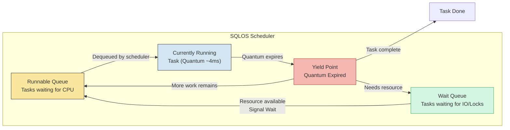

## Overview — SOS_SCHEDULER_YIELD

SOS_SCHEDULER_YIELD occurs when a query voluntarily yields the scheduler after consuming its quantum (~4ms in most systems). SQL Server uses **cooperative (non-preemptive) scheduling**: each worker thread runs for its quantum, then yields so other runnable workers can execute. This wait type is **normal and expected** — every query that uses CPU will incur SOS_SCHEDULER_YIELD waits.

The concern arises when SOS_SCHEDULER_YIELD becomes a **significant percentage of total wait time** (typically >15-20%) because many queries are competing for CPU. When runnable task counts grow, queries spend more time in the runnable queue rather than actually executing.

```sql
-- Current SOS_SCHEDULER_YIELD waits at instance level
SELECT
    wait_type,
    waiting_tasks_count,
    wait_time_ms,
    max_wait_time_ms,
    signal_wait_time_ms,
    wait_time_ms / NULLIF(waiting_tasks_count, 0) AS avg_wait_ms,
    signal_wait_time_ms / NULLIF(wait_time_ms, 0) * 100 AS signal_wait_pct
FROM sys.dm_os_wait_stats
WHERE wait_type = 'SOS_SCHEDULER_YIELD'
ORDER BY wait_time_ms DESC;
```

### Non-Preemptive Scheduling in SQL Server

SQL Server manages its own threads (workers) through SQLOS. The scheduler loop:

1. **Worker picks up a task** from the runnable queue
2. **Runs for quantum** (~4ms of CPU time)
3. **Voluntarily yields** by calling `SOS_SCHEDULER_YIELD`
4. **Returns to runnable queue** if more work remains
5. **Next runnable worker** dequeues and runs

This is fundamentally different from OS preemptive scheduling where the kernel forcibly context-switches threads. SQL Server's cooperative model gives it control over its own resources.

```sql
-- SQLOS scheduler information — see how many schedulers and workers
SELECT
    scheduler_id,
    cpu_id,
    status,
    is_online,
    current_tasks_count,
    runnable_tasks_count,
    active_workers_count,
    work_queue_count,
    load_factor,
    yield_count,
    last_timer_activity
FROM sys.dm_os_schedulers
WHERE scheduler_id < 255  -- Exclude DAC scheduler
ORDER BY scheduler_id;
```

## Diagnosis — Signal Wait Ratio

The most important diagnostic for CPU pressure is the **signal wait ratio**. Signal waits measure the time a thread spends in the runnable queue (waiting to get on CPU) after the resource it was waiting for becomes available.

```sql
-- Signal wait ratio — if >25%, CPU pressure is indicated
SELECT
    SUM(wait_time_ms) AS total_wait_time_ms,
    SUM(signal_wait_time_ms) AS total_signal_wait_ms,
    SUM(signal_wait_time_ms) * 1.0 / NULLIF(SUM(wait_time_ms), 0) * 100 AS signal_wait_pct,
    CASE
        WHEN SUM(signal_wait_time_ms) * 1.0 / NULLIF(SUM(wait_time_ms), 0) > 0.25
            THEN 'CPU Pressure Detected — high signal wait ratio'
        WHEN SUM(signal_wait_time_ms) * 1.0 / NULLIF(SUM(wait_time_ms), 0) > 0.15
            THEN 'Elevated signal waits — monitor CPU'
        ELSE 'Normal signal wait ratio'
    END AS cpu_pressure_assessment
FROM sys.dm_os_wait_stats;
```

### Per-Scheduler Runnable Task Count

```sql
-- Runnable task count per scheduler — current CPU queue depth
SELECT
    scheduler_id,
    cpu_id,
    status,
    current_tasks_count,
    runnable_tasks_count,
    active_workers_count,
    work_queue_count,
    CASE
        WHEN runnable_tasks_count = 0 THEN 'Idle — CPU available'
        WHEN runnable_tasks_count <= 2 THEN 'Light load'
        WHEN runnable_tasks_count <= 5 THEN 'Moderate load'
        WHEN runnable_tasks_count <= 10 THEN 'Heavy load'
        ELSE 'CPU overloaded'
    END AS scheduler_load,
    yield_count,
    context_switches_count,
    preemptive_switches_count
FROM sys.dm_os_schedulers
WHERE scheduler_id < 255
ORDER BY runnable_tasks_count DESC;
```



### Measuring CPU Pressure Over Time

```sql
-- Track signal wait ratio history
IF OBJECT_ID('dbo.SignalWaitHistory') IS NULL
CREATE TABLE dbo.SignalWaitHistory (
    capture_time DATETIME2 NOT NULL,
    total_wait_time_ms BIGINT,
    total_signal_wait_ms BIGINT,
    signal_wait_pct DECIMAL(5,2),
    CONSTRAINT PK_SignalWaitHistory PRIMARY KEY (capture_time)
);

-- Insert snapshot (run every 15 minutes)
INSERT INTO dbo.SignalWaitHistory (capture_time, total_wait_time_ms, total_signal_wait_ms, signal_wait_pct)
SELECT
    GETDATE(),
    SUM(wait_time_ms),
    SUM(signal_wait_time_ms),
    SUM(signal_wait_time_ms) * 1.0 / NULLIF(SUM(wait_time_ms), 0) * 100
FROM sys.dm_os_wait_stats;

-- Trend analysis — CPU pressure over last 24 hours
SELECT
    capture_time,
    total_wait_time_ms,
    total_signal_wait_ms,
    signal_wait_pct,
    CASE
        WHEN signal_wait_pct > 25 THEN 'CRITICAL — CPU pressure'
        WHEN signal_wait_pct > 15 THEN 'WARNING — elevated'
        ELSE 'OK'
    END AS status
FROM dbo.SignalWaitHistory
WHERE capture_time >= DATEADD(HOUR, -24, GETDATE())
ORDER BY capture_time DESC;
```

## Queries — Top CPU Consumers

### Top Queries by CPU (from Plan Cache)

```sql
-- Top 20 queries by total CPU time (from plan cache)
SELECT TOP 20
    qs.total_worker_time / 1000 AS total_cpu_ms,
    qs.total_elapsed_time / 1000 AS total_elapsed_ms,
    qs.total_worker_time / NULLIF(qs.total_elapsed_time, 0) * 100 AS cpu_time_pct,
    qs.execution_count,
    qs.total_worker_time / NULLIF(qs.execution_count, 0) / 1000 AS avg_cpu_ms,
    qs.total_logical_reads,
    qs.total_physical_reads,
    qs.total_writes,
    qs.max_worker_time / 1000 AS max_cpu_ms,
    qs.last_worker_time / 1000 AS last_cpu_ms,
    qs.min_worker_time / 1000 AS min_cpu_ms,
    SUBSTRING(st.text,
        (qs.statement_start_offset / 2) + 1,
        CASE
            WHEN qs.statement_end_offset = -1 THEN LEN(CONVERT(NVARCHAR(MAX), st.text))
            ELSE (qs.statement_end_offset - qs.statement_start_offset) / 2
        END
    ) AS query_text,
    qp.query_plan
FROM sys.dm_exec_query_stats qs
CROSS APPLY sys.dm_exec_sql_text(qs.sql_handle) st
CROSS APPLY sys.dm_exec_query_plan(qs.plan_handle) qp
ORDER BY qs.total_worker_time DESC;
```

### Currently Running Queries with CPU Time

```sql
-- Currently executing queries — see which are consuming CPU right now
SELECT
    r.session_id,
    r.cpu_time,
    r.total_elapsed_time,
    r.cpu_time / NULLIF(r.total_elapsed_time, 0) * 100 AS cpu_pct_of_elapsed,
    r.reads,
    r.writes,
    r.logical_reads,
    r.wait_type,
    r.wait_time,
    r.wait_resource,
    r.blocking_session_id,
    r.status,
    r.command,
    r.database_id,
    DB_NAME(r.database_id) AS database_name,
    r.open_transaction_count,
    r.granted_query_memory,
    r.percent_complete,
    SUBSTRING(st.text,
        (r.statement_start_offset / 2) + 1,
        CASE
            WHEN r.statement_end_offset = -1 THEN LEN(CONVERT(NVARCHAR(MAX), st.text))
            ELSE (r.statement_end_offset - r.statement_start_offset) / 2
        END
    ) AS statement_text,
    qp.query_plan
FROM sys.dm_exec_requests r
CROSS APPLY sys.dm_exec_sql_text(r.sql_handle) st
OUTER APPLY sys.dm_exec_query_plan(r.plan_handle) qp
WHERE r.session_id > 50  -- Exclude system sessions
  AND r.status = 'running'
ORDER BY r.cpu_time DESC;
```

### CPU by Database (Aggregated)

```sql
-- CPU consumption by database from the plan cache
SELECT TOP 10
    DB_NAME(st.dbid) AS database_name,
    COUNT(DISTINCT qs.plan_handle) AS distinct_plans,
    SUM(qs.total_worker_time) / 1000 AS total_cpu_ms,
    SUM(qs.execution_count) AS total_executions,
    SUM(qs.total_worker_time) / NULLIF(SUM(qs.execution_count), 0) / 1000 AS avg_cpu_ms_per_exec,
    SUM(qs.total_logical_reads) AS total_logical_reads,
    SUM(qs.total_physical_reads) AS total_physical_reads,
    SUM(qs.total_writes) AS total_writes
FROM sys.dm_exec_query_stats qs
CROSS APPLY sys.dm_exec_sql_text(qs.sql_handle) st
WHERE st.dbid IS NOT NULL
  AND st.dbid <> 32767  -- Exclude resource db
GROUP BY DB_NAME(st.dbid)
ORDER BY total_cpu_ms DESC;
```

### CPU Utilization from SQL Server's Perspective

```sql
-- SQL Server CPU utilization (process-level)
SELECT
    cntr_value AS cpu_usage_pct
FROM sys.dm_os_performance_counters
WHERE counter_name = 'CPU usage %'
  AND instance_name = '_Total';

-- System CPU utilization via DMV (SQL Server 2016+)
SELECT
    record_id,
    convert(XML, record) AS record_xml,
    timestamp
FROM sys.dm_os_ring_buffers
WHERE ring_buffer_type = N'RING_BUFFER_SCHEDULER_MONITOR'
  AND record LIKE '%<SystemHealth>%';
```

## Scheduler — sys.dm_os_schedulers Analysis

The `sys.dm_os_schedulers` DMV provides critical insight into SQLOS scheduler health.

```sql
-- Comprehensive scheduler health check
SELECT
    scheduler_id,
    cpu_id,
    status,
    is_online,
    is_idle,
    preemptive_switches_count,
    context_switches_count,
    current_tasks_count,
    runnable_tasks_count,
    active_workers_count,
    work_queue_count,
    pending_disk_io_count,
    load_factor,
    yield_count,
    last_timer_activity,
    failed_to_create_worker,
    quantum_length_us,
    CASE
        WHEN runnable_tasks_count > 5 THEN 'CRITICAL — scheduler overloaded'
        WHEN runnable_tasks_count > 2 THEN 'WARNING — high runnable queue'
        WHEN runnable_tasks_count = 0 THEN 'Idle'
        ELSE 'Normal'
    END AS scheduler_health
FROM sys.dm_os_schedulers
WHERE scheduler_id < 255
ORDER BY runnable_tasks_count DESC;
```

### Worker Thread Count

```sql
-- Worker thread analysis — are we approaching max workers?
SELECT
    max_workers_count,
    current_workers_count = (SELECT COUNT(*) FROM sys.dm_os_workers WHERE state != 'INITIALIZING'),
    available_workers = max_workers_count - (SELECT COUNT(*) FROM sys.dm_os_workers WHERE state != 'INITIALIZING'),
    CASE
        WHEN (SELECT COUNT(*) FROM sys.dm_os_workers WHERE state != 'INITIALIZING') > max_workers_count * 0.8
            THEN 'WARNING — approaching max worker thread limit'
        ELSE 'OK'
    END AS worker_status
FROM sys.dm_os_sys_info;
```

### Preemptive vs Non-Preemptive Context Switches

```sql
-- Preemptive mode switches (tasks running outside SQL Server control)
SELECT
    scheduler_id,
    preemptive_switches_count,
    context_switches_count,
    preemptive_switches_count / NULLIF(context_switches_count, 0) * 100 AS preemptive_pct,
    CASE
        WHEN preemptive_switches_count > 0 THEN 'External code (COM, CLR, R, etc.)'
        ELSE 'All non-preemptive'
    END AS preemptive_note
FROM sys.dm_os_schedulers
WHERE scheduler_id < 255
ORDER BY preemptive_switches_count DESC;
```

## Parallelism — MAXDOP & Cost Threshold

Parallel queries consume multiple schedulers simultaneously. Improper MAXDOP configuration exacerbates CPU pressure.

### Current Parallelism Configuration

```sql
-- Current MAXDOP and cost threshold settings
SELECT
    name,
    value,
    value_in_use,
    description
FROM sys.configurations
WHERE name IN (
    'max degree of parallelism',
    'cost threshold for parallelism',
    'max worker threads',
    'affinity mask',
    'affinity I/O mask'
);
```

### Analyzing Parallelism Usage

```sql
-- Queries using parallelism (from plan cache)
SELECT TOP 20
    qs.total_worker_time / 1000 AS total_cpu_ms,
    qs.execution_count,
    qs.total_worker_time / NULLIF(qs.execution_count, 0) / 1000 AS avg_cpu_ms,
    qs.total_elapsed_time / 1000 AS total_elapsed_ms,
    qs.total_elapsed_time / NULLIF(qs.execution_count, 0) / 1000 AS avg_elapsed_ms,
    qs.total_logical_reads,
    qs.total_physical_reads,
    qp.query_plan.value('declare default element namespace "http://schemas.microsoft.com/sqlserver/2004/07/showplan";
        max(//RelOp/@Parallel)', 'bit') AS uses_parallelism,
    SUBSTRING(st.text,
        (qs.statement_start_offset / 2) + 1,
        CASE
            WHEN qs.statement_end_offset = -1 THEN LEN(CONVERT(NVARCHAR(MAX), st.text))
            ELSE (qs.statement_end_offset - qs.statement_start_offset) / 2
        END
    ) AS query_text
FROM sys.dm_exec_query_stats qs
CROSS APPLY sys.dm_exec_sql_text(qs.sql_handle) st
CROSS APPLY sys.dm_exec_query_plan(qs.plan_handle) qp
WHERE qp.query_plan.exist('declare default element namespace "http://schemas.microsoft.com/sqlserver/2004/07/showplan";
    //RelOp[@Parallel]') = 1
ORDER BY qs.total_worker_time DESC;
```

### MAXDOP Recommendation by Workload

| Workload Type | Recommended MAXDOP | Rationale |
|---------------|-------------------|-----------|
| OLTP (high concurrency) | 2 or 4 | Avoid CXPACKET waits, keep resources available |
| Data Warehouse (DSS) | 8 or 16 | Leverage parallelism for large scans |
| Mixed workload | 4 or 8 | Balance between OLTP and DW |
| VM (unknown physical cores) | 2 or 4 | Overprovisioned VMs show CPU pressure easily |
| Always On Availability Group | Check per replica | Primary and secondary may differ |

```sql
-- Recommended MAXDOP based on current scheduler count
SELECT
    scheduler_count = COUNT(*),
    recommended_maxdop = CASE
        WHEN COUNT(*) <= 4 THEN COUNT(*)
        WHEN COUNT(*) <= 8 THEN 4
        WHEN COUNT(*) <= 16 THEN 4
        WHEN COUNT(*) <= 32 THEN 8
        ELSE 8
    END,
    recommended_ctfp = CASE
        WHEN COUNT(*) <= 4 THEN 25
        WHEN COUNT(*) <= 8 THEN 35
        ELSE 50
    END
FROM sys.dm_os_schedulers
WHERE scheduler_id < 255
  AND is_online = 1
  AND status = 'VISIBLE ONLINE';
```

### CXPACKET Waits — Parallelism Side Effect

CXPACKET waits occur when parallel threads finish at different times. High CXPACKET can indicate parallelism skew.

```sql
-- CXPACKET wait stats — imbalance between parallel threads
SELECT
    wait_type,
    waiting_tasks_count,
    wait_time_ms,
    signal_wait_time_ms,
    wait_time_ms / NULLIF(waiting_tasks_count, 0) AS avg_wait_ms,
    signal_wait_time_ms / NULLIF(wait_time_ms, 0) * 100 AS signal_wait_pct
FROM sys.dm_os_wait_stats
WHERE wait_type IN ('CXPACKET', 'CXCONSUMER')
ORDER BY wait_time_ms DESC;
```

## .NET Integration — CPU Monitoring

### C# CPU Pressure Monitor

```csharp
using Microsoft.Data.SqlClient;
using System;
using System.Collections.Generic;
using System.Threading;
using System.Threading.Tasks;

public sealed class CpuPressureMonitor : IDisposable
{
    private readonly string _connectionString;
    private readonly double _signalWaitThreshold = 25.0;
    private readonly int _runnableTaskThreshold = 5;
    private readonly CancellationTokenSource _cts = new();
    private readonly TimeSpan _interval = TimeSpan.FromSeconds(60);

    public CpuPressureMonitor(string connectionString)
    {
        _connectionString = connectionString;
    }

    public Task StartAsync(CancellationToken cancellation = default)
    {
        var combined = CancellationTokenSource.CreateLinkedTokenSource(_cts.Token, cancellation);
        return RunAsync(combined.Token);
    }

    private async Task RunAsync(CancellationToken cancellation)
    {
        while (!cancellation.IsCancellationRequested)
        {
            try
            {
                await using var conn = new SqlConnection(_connectionString);
                await conn.OpenAsync(cancellation);

                var metrics = await CaptureMetricsAsync(conn, cancellation);
                EvaluateAndAlert(metrics);
            }
            catch (Exception ex) when (ex is not OperationCanceledException)
            {
                Console.Error.WriteLine($"[CPU MONITOR] {ex.Message}");
            }

            await Task.Delay(_interval, cancellation);
        }
    }

    private static async Task<CpuMetrics> CaptureMetricsAsync(
        SqlConnection conn, CancellationToken cancellation)
    {
        var cmd = new SqlCommand(@"
            SELECT
                (SELECT SUM(wait_time_ms) FROM sys.dm_os_wait_stats) AS total_wait_time_ms,
                (SELECT SUM(signal_wait_time_ms) FROM sys.dm_os_wait_stats) AS total_signal_wait_time_ms,
                (SELECT MAX(runnable_tasks_count) FROM sys.dm_os_schedulers WHERE scheduler_id < 255) AS max_runnable_tasks,
                (SELECT AVG(CAST(runnable_tasks_count AS FLOAT)) FROM sys.dm_os_schedulers WHERE scheduler_id < 255) AS avg_runnable_tasks,
                (SELECT cntr_value FROM sys.dm_os_performance_counters
                    WHERE counter_name = 'CPU usage %' AND instance_name = '_Total') AS cpu_usage_pct,
                (SELECT COUNT(*) FROM sys.dm_os_workers WHERE state = 'RUNNABLE') AS runnable_workers,
                (SELECT COUNT(*) FROM sys.dm_os_workers) AS total_workers,
                (SELECT
                    SUM(total_worker_time) / 1000 FROM sys.dm_exec_query_stats
                    WHERE last_execution_time >= DATEADD(MINUTE, -5, GETDATE())) AS cpu_ms_last_5min;", conn);

        await using var reader = await cmd.ExecuteReaderAsync(cancellation);
        await reader.ReadAsync(cancellation);

        return new CpuMetrics
        {
            TotalWaitTimeMs = reader.GetInt64(0),
            TotalSignalWaitMs = reader.GetInt64(1),
            MaxRunnableTasks = reader.GetInt32(2),
            AvgRunnableTasks = reader.GetDouble(3),
            CpuUsagePct = reader.GetInt64(4),
            RunnableWorkers = reader.GetInt32(5),
            TotalWorkers = reader.GetInt32(6),
            CpuMsLast5Min = reader.IsDBNull(7) ? 0 : reader.GetInt64(7)
        };
    }

    private void EvaluateAndAlert(CpuMetrics m)
    {
        var issues = new List<string>();
        var data = new Dictionary<string, object>
        {
            ["SignalWaitPct"] = m.SignalWaitPct,
            ["MaxRunnableTasks"] = m.MaxRunnableTasks,
            ["AvgRunnableTasks"] = m.AvgRunnableTasks,
            ["CpuUsagePct"] = m.CpuUsagePct,
            ["RunnableWorkers"] = m.RunnableWorkers,
            ["TotalWorkers"] = m.TotalWorkers,
            ["CpuMsLast5Min"] = m.CpuMsLast5Min
        };

        if (m.SignalWaitPct > _signalWaitThreshold)
            issues.Add($"High signal wait ratio: {m.SignalWaitPct:F1}% (threshold: {_signalWaitThreshold}%)");

        if (m.MaxRunnableTasks > _runnableTaskThreshold)
            issues.Add($"High runnable queue: max {m.MaxRunnableTasks} tasks (threshold: {_runnableTaskThreshold})");

        if (m.CpuUsagePct > 80)
            issues.Add($"High CPU utilization: {m.CpuUsagePct}%");

        if (issues.Count > 0)
        {
            var msg = $"[CPU ALERT] {DateTime.UtcNow:O}\n  " +
                      string.Join("\n  ", issues);
            Console.Error.WriteLine(msg);
        }
    }

    public void Dispose() => _cts.Cancel();

    private sealed class CpuMetrics
    {
        public long TotalWaitTimeMs { get; set; }
        public long TotalSignalWaitMs { get; set; }
        public double SignalWaitPct =>
            TotalWaitTimeMs > 0 ? TotalSignalWaitMs * 100.0 / TotalWaitTimeMs : 0;
        public int MaxRunnableTasks { get; set; }
        public double AvgRunnableTasks { get; set; }
        public long CpuUsagePct { get; set; }
        public int RunnableWorkers { get; set; }
        public int TotalWorkers { get; set; }
        public long CpuMsLast5Min { get; set; }
    }
}
```

### ASP.NET Core Health Check for CPU Pressure

```csharp
using Microsoft.Data.SqlClient;
using Microsoft.Extensions.Diagnostics.HealthChecks;
using System;
using System.Collections.Generic;
using System.Threading;
using System.Threading.Tasks;

public sealed class CpuPressureHealthCheck : IHealthCheck
{
    private readonly string _connectionString;

    public CpuPressureHealthCheck(string connectionString)
    {
        _connectionString = connectionString;
    }

    public async Task<HealthCheckResult> CheckHealthAsync(
        HealthCheckContext context,
        CancellationToken cancellation = default)
    {
        await using var conn = new SqlConnection(_connectionString);
        await conn.OpenAsync(cancellation);

        var cmd = new SqlCommand(@"
            SELECT
                CAST(SUM(signal_wait_time_ms) AS FLOAT) / NULLIF(SUM(wait_time_ms), 0) * 100 AS signal_wait_pct,
                MAX(runnable_tasks_count) AS max_runnable_tasks,
                AVG(CAST(runnable_tasks_count AS FLOAT)) AS avg_runnable_tasks
            FROM sys.dm_os_wait_stats ws
            CROSS JOIN sys.dm_os_schedulers sch
            WHERE sch.scheduler_id < 255
              AND sch.is_online = 1;", conn);

        await using var reader = await cmd.ExecuteReaderAsync(cancellation);
        await reader.ReadAsync(cancellation);

        var signalWaitPct = reader.GetDouble(0);
        var maxRunnable = reader.GetInt32(1);
        var avgRunnable = reader.GetDouble(2);

        var data = new Dictionary<string, object>
        {
            ["SignalWaitPct"] = signalWaitPct,
            ["MaxRunnableTasks"] = maxRunnable,
            ["AvgRunnableTasks"] = avgRunnable
        };

        if (signalWaitPct > 25 || maxRunnable > 10)
            return HealthCheckResult.Unhealthy(
                $"CPU critical — signal wait {signalWaitPct:F1}%, runnable queue {maxRunnable}", data);

        if (signalWaitPct > 15 || maxRunnable > 5)
            return HealthCheckResult.Degraded(
                $"CPU elevated — signal wait {signalWaitPct:F1}%, runnable queue {maxRunnable}", data);

        return HealthCheckResult.Healthy(
            $"CPU healthy — signal wait {signalWaitPct:F1}%, runnable queue {maxRunnable}", data);
    }
}
```

### High CPU Query Logging from .NET

```csharp
using Microsoft.Data.SqlClient;
using System;
using System.Threading.Tasks;

public static class HighCpuQueryLogger
{
    public static async Task LogHighCpuQueriesAsync(string connectionString, long cpuMsThreshold = 5000)
    {
        var query = @"
            SELECT TOP 10
                r.session_id,
                r.cpu_time,
                r.total_elapsed_time,
                r.reads,
                r.logical_reads,
                r.command,
                DB_NAME(r.database_id) AS database_name,
                SUBSTRING(t.text, (r.statement_start_offset / 2) + 1,
                    CASE
                        WHEN r.statement_end_offset = -1 THEN LEN(CONVERT(NVARCHAR(MAX), t.text))
                        ELSE (r.statement_end_offset - r.statement_start_offset) / 2
                    END) AS query_text
            FROM sys.dm_exec_requests r
            CROSS APPLY sys.dm_exec_sql_text(r.sql_handle) t
            WHERE r.session_id > 50
              AND r.cpu_time > @Threshold
              AND r.status = 'running'
            ORDER BY r.cpu_time DESC;";

        await using var conn = new SqlConnection(connectionString);
        await conn.OpenAsync();

        await using var cmd = new SqlCommand(query, conn);
        cmd.Parameters.AddWithValue("@Threshold", cpuMsThreshold);

        await using var reader = await cmd.ExecuteReaderAsync();
        while (await reader.ReadAsync())
        {
            Console.WriteLine($"[HIGH CPU] SPID {reader.GetInt32(0)}: " +
                $"CPU={reader.GetInt32(1)}ms, " +
                $"DB={reader.GetString(8)}, " +
                $"Cmd={reader.GetString(5)}");
        }
    }
}
```

## Remediation — Reducing CPU Pressure

### Short-Term: Identify and Optimize

```sql
-- 1. Find queries with high average CPU per execution
SELECT TOP 20
    qs.total_worker_time / NULLIF(qs.execution_count, 0) / 1000 AS avg_cpu_ms,
    qs.total_worker_time / 1000 AS total_cpu_ms,
    qs.execution_count,
    qs.total_elapsed_time / NULLIF(qs.execution_count, 0) / 1000 AS avg_elapsed_ms,
    qs.total_logical_reads / NULLIF(qs.execution_count, 0) AS avg_logical_reads,
    SUBSTRING(st.text, 1, 200) AS query_text
FROM sys.dm_exec_query_stats qs
CROSS APPLY sys.dm_exec_sql_text(qs.sql_handle) st
WHERE qs.execution_count > 10
ORDER BY avg_cpu_ms DESC;
```

### 2. Add Missing Indexes

```sql
-- Missing indexes with high CPU impact
SELECT
    migs.avg_total_user_cost * migs.avg_user_impact * (migs.user_seeks + migs.user_scans) AS benefit,
    migs.avg_user_impact,
    migs.user_seeks,
    migs.user_scans,
    mid.statement AS object_name,
    mid.equality_columns,
    mid.inequality_columns,
    mid.included_columns,
    'CREATE INDEX IX_' + REPLACE(REPLACE(REPLACE(
        ISNULL(mid.equality_columns + '_', '') + ISNULL(mid.inequality_columns, ''),
        '[', ''), ']', ''), ', ', '_') + ' ON ' + mid.statement +
        ' (' + ISNULL(mid.equality_columns, '') +
        CASE WHEN mid.equality_columns IS NOT NULL AND mid.inequality_columns IS NOT NULL THEN ', ' ELSE '' END +
        ISNULL(mid.inequality_columns, '') + ')' +
        ISNULL(' INCLUDE (' + mid.included_columns + ')', '') AS create_index
FROM sys.dm_db_missing_index_details mid
CROSS APPLY sys.dm_db_missing_index_groups mig
JOIN sys.dm_db_missing_index_group_stats migs
    ON mig.index_group_handle = migs.group_handle
WHERE mid.database_id = DB_ID()
ORDER BY benefit DESC;
```

### 3. Adjust MAXDOP and Cost Threshold

```sql
-- Recommended settings for typical OLTP
EXEC sp_configure 'max degree of parallelism', 4;
EXEC sp_configure 'cost threshold for parallelism', 50;
RECONFIGURE;

-- For OLTP-heavy with high concurrency, also consider
EXEC sp_configure 'optimize for ad hoc workloads', 1;
RECONFIGURE;
```

### 4. Parameterize Queries

```sql
-- Find non-parameterized queries causing high compilation CPU
SELECT TOP 20
    qs.total_worker_time / 1000 AS total_cpu_ms,
    qs.execution_count,
    qs.total_worker_time / NULLIF(qs.execution_count, 0) / 1000 AS avg_cpu_ms,
    qs.plan_generation_num,
    qs.total_elapsed_time / 1000 AS total_elapsed_ms,
    st.text AS query_text,
    cp.cacheobjtype,
    cp.objtype
FROM sys.dm_exec_query_stats qs
CROSS APPLY sys.dm_exec_sql_text(qs.sql_handle) st
JOIN sys.dm_exec_cached_plans cp
    ON qs.plan_handle = cp.plan_handle
WHERE cp.objtype = 'Adhoc'
  AND qs.execution_count = 1
ORDER BY qs.total_worker_time DESC;
```

### 5. Resource Governor (SQL Server Enterprise)

```sql
-- Create a resource pool to limit CPU for specific workloads
CREATE RESOURCE POOL ReportingPool
WITH (
    MIN_CPU_PERCENT = 0,
    MAX_CPU_PERCENT = 25,
    CAP_CPU_PERCENT = 50,
    MIN_MEMORY_PERCENT = 0,
    MAX_MEMORY_PERCENT = 25
);

CREATE WORKLOAD GROUP ReportingGroup
USING ReportingPool;

-- Classifier function to route specific logins/users
CREATE FUNCTION dbo.RGClassifier()
RETURNS SYSNAME WITH SCHEMABINDING
AS
BEGIN
    DECLARE @group_name SYSNAME;
    IF SUSER_NAME() IN ('report_user', 'bi_user')
        SET @group_name = 'ReportingGroup';
    ELSE
        SET @group_name = 'default';
    RETURN @group_name;
END;

ALTER RESOURCE GOVERNOR WITH (CLASSIFIER_FUNCTION = dbo.RGClassifier);
ALTER RESOURCE GOVERNOR RECONFIGURE;
```

## Additional — VM CPU Overcommit

Virtualization adds complexity to CPU pressure analysis. When the hypervisor overcommits CPU, SQL Server experiences:

1. **Higher SOS_SCHEDULER_YIELD waits** — even when actual CPU demand is moderate
2. **Inconsistent runnable queue** — SQL Server yields but hypervisor doesn't schedule it immediately
3. **vCPU wait time** — time spent waiting on the hypervisor's scheduler

### Detect VM CPU Overcommit

```sql
-- Check if running in a VM
SELECT
    virtual_machine_type_desc,
    virtual_machine_type,
    softnuma_configuration_desc,
    cpu_count,
    hyperthread_ratio,
    socket_count,
    cores_per_socket,
    numa_node_count,
    physical_memory_kb / 1024 / 1024 AS physical_memory_gb,
    virtual_machine_type_desc = CASE
        WHEN virtual_machine_type = 1 THEN 'Hyper-V VM'
        WHEN virtual_machine_type = 2 THEN 'VMware VM'
        ELSE 'Physical machine'
    END
FROM sys.dm_os_sys_info;
```

### VM CPU Performance Considerations

```sql
-- VM-specific CPU metrics (Query Store or perfmon counters)
SELECT
    object_name,
    counter_name,
    instance_name,
    cntr_value
FROM sys.dm_os_performance_counters
WHERE object_name LIKE '%VM%'
   OR counter_name LIKE '%hypervisor%'
   OR counter_name LIKE '%virtual%';
```

### Recommended VM CPU Settings

| Setting | Recommendation | Rationale |
|---------|---------------|-----------|
| vCPU count | ≤ physical cores | Avoid CPU overcommit |
| CPU reservation | 100% for production | Guarantee CPU availability |
| NUMA alignment | Match physical NUMA | Prevent cross-NUMA memory access |
| Hyper-V Enlightenments | Enable | Better VM performance |
| HPET | Disable | Avoid timer overhead |

## References — Further Reading

- Microsoft Docs: `sys.dm_os_schedulers` — Scheduler management
- Microsoft Docs: `sys.dm_os_wait_stats` — SOS_SCHEDULER_YIELD
- Microsoft Docs: `sys.dm_exec_query_stats` — Worker time
- SQL Server 2008 Internals: SQLOS Scheduling
- Bob Ward: SQL Server 2019 Revealed — Scheduling chapter
- Paul Randal: Signal wait ratio and CPU pressure
- Microsoft Docs: Configure MAXDOP
- Microsoft Docs: Cost Threshold for Parallelism
- SQL Shack: SOS_SCHEDULER_YIELD deep dive
- Brent Ozar: How to analyze CPU pressure
- Microsoft Docs: Resource Governor
- KB 319942: Troubleshooting CPU pressure in SQL Server

```sql
-- Quick one-liner: CPU Pressure assessment
SELECT
    CASE
        WHEN signal_wait_pct > 25 THEN 'CRITICAL CPU Pressure'
        WHEN signal_wait_pct > 15 THEN 'Moderate CPU Pressure'
        WHEN signal_wait_pct > 5 THEN 'Elevated — monitor'
        ELSE 'Normal'
    END AS cpu_pressure_status,
    signal_wait_pct,
    total_wait_ms,
    total_signal_ms
FROM (
    SELECT
        SUM(signal_wait_time_ms) * 100.0 / NULLIF(SUM(wait_time_ms), 0) AS signal_wait_pct,
        SUM(wait_time_ms) AS total_wait_ms,
        SUM(signal_wait_time_ms) AS total_signal_ms
    FROM sys.dm_os_wait_stats
) AS ws;
```

---

**Related Notes**:
- [[8.917 — Wait Statistics — Top Waits Analysis]] — Wait stats overview
- [[8.269 — SQLOS Scheduler — Non-Preemptive Scheduling]] — Scheduler internals
- [[8.361 — Parallelism — MAXDOP and Cost Threshold]] — Parallelism configuration
- [[8.918 — Wait Categories — CPU, IO, Lock, Memory]] — Wait categorization
