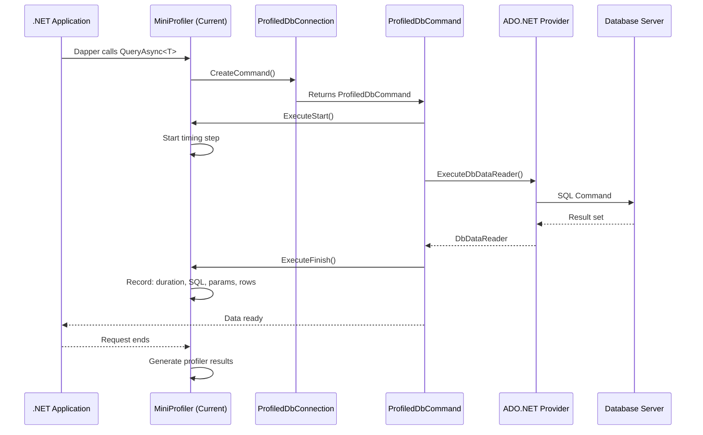

# Overview — Core Concept

MiniProfiler integrates with Dapper by wrapping `IDbConnection` via `ProfiledDbConnection`. This intercepts every SQL command sent through Dapper and captures timing, SQL text, row counts, and duplicate detection without modifying any Dapper query code. The profiler runs per HTTP request in ASP.NET Core and exposes results both in the browser UI and programmatically.

## Why MiniProfiler with Dapper

Dapper is a lightweight micro-ORM that executes raw SQL. Unlike EF Core which has built-in logging interceptors, Dapper does not expose any hooks for query timing or SQL capture. MiniProfiler fills this gap by acting as a decorator over the ADO.NET connection pipeline.

### Comparison with other approaches

| Approach | Setup Effort | SQL Capture | Timing | Rows Counted | Duplicate Detection |
|---|---|---|---|---|---|
| MiniProfiler + ProfiledDbConnection | Low | ✅ Full SQL | ✅ Per-query | ✅ Yes | ✅ Yes |
| Manual stopwatch wrapping | High | ❌ No | ✅ Basic | ❌ No | ❌ No |
| SQL Server Profiler / XEvents | Medium | ✅ Full SQL | ✅ Yes | ❌ No | ❌ No |
| Application Insights SDK | Low | ✅ SQL text | ✅ Yes | ❌ No | ❌ No |

## How the wrapping works

MiniProfiler provides `ProfiledDbConnection` which inherits from `DbConnection`. When Dapper's extension methods (like `QueryAsync<T>`, `ExecuteAsync`) call `connection.CreateCommand()`, the wrapped connection returns a `ProfiledDbCommand` instead of the raw `DbCommand`. This profiled command:
- Captures the `CommandText` and `Parameters`
- Starts a `Timing` step when execution begins
- Stops the `Timing` step when the command completes
- Records row count via `RecordsAffected` or `DbDataReader` consumption
- Logs the command text to the profiler's SQL tab

### Execution flow

```
Application code
    |
    v
Dapper extension methods (QueryAsync, ExecuteAsync, etc.)
    |
    v
ProfiledDbConnection.CreateCommand()
    |
    v
ProfiledDbCommand.ExecuteDbDataReader() / ExecuteNonQuery() / ExecuteScalar()
    |
    v
MiniProfiler.Current.Step("sql") captured with:
    - CommandText (normalized SQL)
    - Parameters (name + value + type)
    - Duration (ms)
    - Row count
    - Duplicate detection (same SQL text hash)
    |
    v
Actual DbCommand executed against real database
```

## Key components

### ProfiledDbConnection

This is the central wrapper class. It takes:
- The real `IDbConnection` (or `DbConnection`) to wrap
- An `IDbProfiler` instance (normally `MiniProfiler.Current`)

```csharp
// The wrapping pattern
var realConnection = new SqlConnection(connectionString);
var profiledConnection = new ProfiledDbConnection(realConnection, MiniProfiler.Current);
```

### IDbProfiler interface

MiniProfiler implements `IDbProfiler` which defines the interception points:

```csharp
public interface IDbProfiler
{
    void ExecuteStart(IDbCommand command, ExecuteType executeType);
    void ExecuteFinish(IDbCommand command, ExecuteType executeType, DbDataReader reader);
    void ReaderFinish(IDbCommand command, ExecuteType executeType, DbDataReader reader);
    bool IsActive { get; }
}
```

### ProfiledDbCommand

Every method on `DbCommand` is overridden to intercept execution:
- `ExecuteReader` → `ExecuteDbDataReader`
- `ExecuteNonQuery` → captures affected rows
- `ExecuteScalar` → captures single-value result
- `ExecuteXmlReader` → less common but also profiled

## Connection lifecycle

A typical pattern when using MiniProfiler with Dapper in a web application:

```csharp
public class DapperRepository
{
    private readonly IDbConnectionFactory _connectionFactory;

    public DapperRepository(IDbConnectionFactory connectionFactory)
    {
        _connectionFactory = connectionFactory;
    }

    public async Task<IEnumerable<Product>> GetProductsAsync()
    {
        // MiniProfiler.Current is automatically available per HTTP request
        using var connection = new ProfiledDbConnection(
            _connectionFactory.CreateConnection(),
            MiniProfiler.Current
        );

        // This query is now profiled
        return await connection.QueryAsync<Product>(
            "SELECT * FROM Products WHERE IsActive = @Active",
            new { Active = true }
        );
    }
}
```

### Dispose order

When disposing `ProfiledDbConnection`, it should dispose the inner connection if ownership is transferred. The default behavior delegates to the inner connection's dispose. If the connection factory owns the connection lifecycle, ensure dispose cascades correctly.

---

# Setup — Configuration

## Adding MiniProfiler NuGet packages

```xml
<PackageReference Include="MiniProfiler.AspNetCore" Version="4.*" />
<PackageReference Include="MiniProfiler.AspNetCore.Mvc" Version="4.*" />
```

For Dapper profiling specifically, no additional package is needed — `ProfiledDbConnection` is in the core `MiniProfiler.AspNetCore` package.

### Package reference table

| Package | Purpose | Required For |
|---|---|---|
| MiniProfiler.AspNetCore | Core profiler, HTTP middleware, storage, UI rendering | All ASP.NET Core apps |
| MiniProfiler.AspNetCore.Mvc | Mvc filter integration, action/view profiling | ASP.NET Core MVC/Razor Pages |
| MiniProfiler.EntityFrameworkCore | EF Core command interception | EF Core profiling |
| MiniProfiler.Shared | Shared types (Timing, CustomTiming) | Advanced customization |

## Registering MiniProfiler in ASP.NET Core

```csharp
// Program.cs or Startup.cs

// Step 1: Add services
builder.Services.AddMiniProfiler(options =>
{
    // Path to access profiler results page
    options.RouteBasePath = "/profiler";

    // Profiling color scheme
    options.ColorScheme = ColorScheme.Auto;

    // Control where the profiler is shown
    options.PopupRenderPosition = RenderPosition.BottomRight;
    options.PopupShowTimeWithChildren = true;

    // Do not show profiler in production by default
    options.ResultsAuthorize = (request) =>
    {
        // Only allow access in Development
        return request.HttpContext.RequestServices
            .GetRequiredService<IWebHostEnvironment>()
            .IsDevelopment();
    };
});

// Step 2: Add middleware
app.UseMiniProfiler();
```

### Minimal setup

```csharp
// Absolute minimum to get started
builder.Services.AddMiniProfiler();
app.UseMiniProfiler();
```

## Wrapping connections for Dapper

### Using a connection factory

The cleanest approach is to centralize connection creation in a factory that applies the `ProfiledDbConnection` wrapper:

```csharp
public class ProfiledDbConnectionFactory : IDbConnectionFactory
{
    private readonly string _connectionString;

    public ProfiledDbConnectionFactory(string connectionString)
    {
        _connectionString = connectionString;
    }

    public IDbConnection CreateConnection()
    {
        var sqlConnection = new SqlConnection(_connectionString);

        // Only wrap when MiniProfiler is active (avoids overhead when disabled)
        if (MiniProfiler.Current != null)
        {
            return new ProfiledDbConnection(sqlConnection, MiniProfiler.Current);
        }

        return sqlConnection;
    }
}
```

### Direct wrapping in repository classes

```csharp
public class OrderRepository
{
    private readonly string _connectionString;

    public async Task<Order> GetOrderAsync(int orderId)
    {
        var connection = new SqlConnection(_connectionString);

        // Wrap only if profiler is active
        var profiled = MiniProfiler.Current != null
            ? new ProfiledDbConnection(connection, MiniProfiler.Current)
            : (DbConnection)connection;

        try
        {
            return await profiled.QueryFirstOrDefaultAsync<Order>(
                "SELECT * FROM Orders WHERE Id = @Id",
                new { Id = orderId }
            );
        }
        finally
        {
            await profiled.CloseAsync();
        }
    }
}
```

## Enabling the profiler results page

The profiler results page is available at the configured route base path (default `/profiler`). This page shows:
- List of all profiled requests (with duration, date, query count, etc.)
- Detailed view per request with SQL tab, timing tree, and flame graph
- JSON export for programmatic consumption

### Inline badge rendering

In your `_Layout.cshtml`:

```html
<!DOCTYPE html>
<html>
<head>
    <!-- ... -->
</head>
<body>
    @* Your site content *@

    @* Injects the MiniProfiler badge *@
    <mini-profiler />
</body>
</html>
```

Or using the tag helper:

```html
<!-- In _Layout.cshtml -->
@using StackExchange.Profiling
@MiniProfiler.Current?.InjectWidget(Html)
```

## Registering multiple storage providers

```csharp
builder.Services.AddMiniProfiler(options =>
{
    // Use SQL Server storage for persistence
    options.Storage = new SqlServerStorage(connectionString);
});
```

### Storage providers

| Provider | Package | Use Case |
|---|---|---|
| MemoryCacheStorage | Built-in | Single-server, dev, short-term |
| SqlServerStorage | MiniProfiler.Providers.SqlServer | Multi-server, persistence |
| RedisStorage | MiniProfiler.Providers.Redis | Distributed, high-throughput |
| MongoDBStorage | MiniProfiler.Providers.MongoDb | Document-based storage |

---

# Basic Usage — Getting Started

## Profiling a single Dapper query

```csharp
using var connection = new ProfiledDbConnection(
    new SqlConnection(connectionString),
    MiniProfiler.Current
);

var users = await connection.QueryAsync<User>(
    "SELECT Id, Name, Email FROM Users WHERE IsActive = @Active",
    new { Active = true }
);
```

This single query will appear in the MiniProfiler timing tree with:
- Duration in milliseconds
- SQL text (normalized, parameters shown)
- Row count returned (3 columns × N rows)
- Timestamp

## Profiling multiple queries in a batch

```csharp
using var connection = new ProfiledDbConnection(
    _connectionFactory.Create(),
    MiniProfiler.Current
);

// Query 1: Customers
var customers = await connection.QueryAsync<Customer>(customerSql, customerParams);

// Query 2: Orders for those customers
var orders = await connection.QueryAsync<Order>(orderSql, orderParams);

// Query 3: Inventory snapshot
var inventory = await connection.QueryAsync<Inventory>(inventorySql, inventoryParams);
```

All three queries are captured individually with their own timing, SQL, and row counts.

## Reading profiler results

### From the badge

After running a page that uses profiled connections, the MiniProfiler badge appears (bottom-right corner). Clicking it expands to show:
- Total page duration
- Query count (e.g., "3 sql")
- Individual query timings sorted by duration
- Color-coded: green (fast), yellow (moderate), red (slow)

### From the results page

Navigate to `/profiler` to see all recorded requests:

```
[Profiler Results]
─────────────────────────────────────────────────────
  #  URL                    Duration    Queries    Date
  1  /products/list          412ms         8       12:34:01
  2  /products/details/5     128ms         3       12:33:45
  3  /products/details/5      95ms         2       12:33:44
  4  /orders/list            821ms        12       12:33:30
─────────────────────────────────────────────────────
```

Clicking a row opens the detail view showing:
- SQL tab with all queries
- Flame chart of request timeline
- Custom timings
- Child request profiling

## Understanding the profiler output

### SQL tab columns

| Column | Description |
|---|---|
| # | Query order within the request |
| Duration (ms) | Wall-clock time for the query |
| SQL | Normalized command text |
| Parameters | Parameter names and values |
| Rows | Row count affected/returned |
| Duplicate | Visual indicator for identical SQL |

### Timing breakdown

Each request tree shows:
- Root: HTTP request duration
  - Action method duration
    - Database queries (each individually)
    - Custom steps (via `Step()`)
    - View rendering
    - External HTTP calls

## Viewing per-query SQL text

```sql
-- Example of what MiniProfiler shows for each query:

-- Query 1 (12ms):
SELECT Id, Name, Email
FROM Users
WHERE IsActive = @Active
-- @Active = True
-- Rows: 47

-- Query 2 (3ms):
SELECT COUNT(*)
FROM Orders
WHERE UserId = @UserId AND Status = @Status
-- @UserId = 123
-- @Status = 'Active'
-- Rows: 1
```

## Detecting duplicate queries

MiniProfiler automatically identifies duplicate SQL queries (same normalized SQL text within the same request). This is flagged in the profiler UI with a copy icon or duplicate indicator.

```sql
-- Query 1 (2ms) [DUPLICATE]
SELECT Name FROM Products WHERE Id = @Id
-- @Id = 42

-- Query 2 (2ms) [DUPLICATE]
SELECT Name FROM Products WHERE Id = @Id
-- @Id = 42

-- Query 3 (15ms)
SELECT * FROM Inventory WHERE ProductId = @ProductId
```

Duplicate detection is critical for:
- N+1 query detection in loops
- Repeated lookups that could be batched
- Lazy loading patterns that trigger identical queries

## Programmatic access to profiler results

```csharp
// Get profiling results for the current request
var profiler = MiniProfiler.Current;
if (profiler != null)
{
    var rootTiming = profiler.Root;
    var sqlTimings = rootTiming?.GetAllTimings()
        .Where(t => t.CustomTimingList != null)
        .SelectMany(t => t.CustomTimingList)
        .ToList();

    foreach (var sql in sqlTimings ?? Enumerable.Empty<CustomTiming>())
    {
        Console.WriteLine($"SQL: {sql.CommandString}");
        Console.WriteLine($"Duration: {sql.DurationMilliseconds}ms");
        Console.WriteLine($"Rows: {sql.FetchCount}");
    }
}
```

---

# Advanced Usage — Patterns

## Profiling Dapper with dependency injection

```csharp
// Register a profiled connection factory
services.AddScoped<IDbConnection>(sp =>
{
    var configuration = sp.GetRequiredService<IConfiguration>();
    var connectionString = configuration.GetConnectionString("Default");
    var realConnection = new SqlConnection(connectionString);

    var profiler = sp.GetService<MiniProfiler>();
    if (profiler != null && MiniProfiler.Current != null)
    {
        return new ProfiledDbConnection(realConnection, MiniProfiler.Current);
    }

    return realConnection;
});
```

## Categorizing queries with custom command type

MiniProfiler categorizes queries by `ExecuteType`:
- `ExecuteType.Reader` — SELECT queries via `ExecuteReader`
- `ExecuteType.NonQuery` — INSERT/UPDATE/DELETE via `ExecuteNonQuery`
- `ExecuteType.Scalar` — Single-value queries via `ExecuteScalar`

```csharp
// These are automatically categorized
await connection.ExecuteAsync("UPDATE Products SET Stock = @Stock WHERE Id = @Id", ...);  // NonQuery
await connection.QueryAsync<Product>("SELECT * FROM Products", ...);                       // Reader
await connection.ExecuteScalarAsync<int>("SELECT COUNT(*) FROM Products", ...);             // Scalar
```

## Profiling non-query operations

Dapper's `ExecuteAsync` for INSERT/UPDATE/DELETE is captured as `ExecuteType.NonQuery`. MiniProfiler shows:
- SQL text
- Duration
- Rows affected (from `ExecuteNonQuery` return value)

```csharp
var rowsAffected = await connection.ExecuteAsync(
    "UPDATE Products SET LastUpdated = @Now WHERE Id = @Id",
    new { Now = DateTime.UtcNow, Id = 42 }
);
// MiniProfiler shows: rowsAffected = 1
```

## Profiling stored procedures

```csharp
// Stored procedures are fully profiled
var results = await connection.QueryAsync<Product>(
    "usp_GetProductsByCategory",
    new { CategoryId = 5 },
    commandType: CommandType.StoredProcedure
);

// MiniProfiler shows the stored procedure name and all parameters
```

## Profiling queries inside transactions

```csharp
using var connection = new ProfiledDbConnection(
    _connectionFactory.Create(),
    MiniProfiler.Current
);
connection.Open();
using var transaction = connection.BeginTransaction();

await connection.ExecuteAsync(
    "UPDATE Inventory SET Quantity = Quantity - @Qty WHERE ProductId = @ProdId",
    new { Qty = 1, ProdId = 100 }
);

await connection.ExecuteAsync(
    "INSERT INTO OrderLog (ProductId, Qty, Date) VALUES (@ProdId, @Qty, @Date)",
    new { ProdId = 100, Qty = 1, Date = DateTime.UtcNow }
);

transaction.Commit();
```

Both queries within the transaction appear in MiniProfiler, showing they ran inside a transaction context.

## Adding custom instrumentation steps

```csharp
// Wrap a non-Dapper operation in a profiler step
using (MiniProfiler.Current.Step("Cache lookup"))
{
    var cachedData = await _cache.GetAsync("products-list");
}

// The step appears in the profiler timing tree alongside SQL queries
```

## Profiling multi-statement queries

Dapper's `QueryMultipleAsync` returns a `SqlMapper.GridReader`. MiniProfiler captures the entire multi-statement batch as a single profiled command, but you can read each result set individually:

```csharp
using var grid = await connection.QueryMultipleAsync(@"
    SELECT * FROM Products WHERE IsActive = 1;
    SELECT COUNT(*) FROM Orders WHERE Status = 'Pending';
");

var products = grid.Read<Product>();
var orderCount = grid.ReadSingle<int>();
```

MiniProfiler shows the combined SQL text of the batch and the total duration.

## Profiling with multiple database types

```csharp
// SQL Server
var sqlConn = new ProfiledDbConnection(
    new SqlConnection(sqlConnString), MiniProfiler.Current
);

// PostgreSQL
var npgsqlConn = new ProfiledDbConnection(
    new NpgsqlConnection(pgConnString), MiniProfiler.Current
);

// MySQL
var mysqlConn = new ProfiledDbConnection(
    new MySqlConnection(mysqlConnString), MiniProfiler.Current
);
```

All ADO.NET providers work with ProfiledDbConnection as long as they implement `DbConnection`.

## Profiling connection open/close

MiniProfiler also captures connection-level operations:
- `connection.Open()` timing
- `connection.Close()` timing
- Connection state transitions

```csharp
// These are also profiled
connection.Open();  // Captured as a timing step
// ... queries ...
connection.Close(); // Captured as a timing step
```

## Filtering queries from profiling

```csharp
builder.Services.AddMiniProfiler(options =>
{
    // Ignore specific SQL commands (e.g., health checks, migrations)
    options.IgnoredPaths.Add("/health");
    options.IgnoredPaths.Add("/swagger");

    // Ignore queries matching a SQL pattern
    options.SqlFormatter = new CustomSqlFormatter();
});
```

### Ignore connection strings

```csharp
// Ignore specific databases by connection string name
options.IgnoredConnectionStrings.Add("LogDatabase");
```

## Profiling in non-web applications

MiniProfiler works outside of ASP.NET Core (console apps, background services, etc.):

```csharp
// Create a manual MiniProfiler instance
using (MiniProfiler.StartNew("BackgroundJob"))
{
    using var connection = new ProfiledDbConnection(
        new SqlConnection(connectionString),
        MiniProfiler.Current
    );

    var data = await connection.QueryAsync<Record>("SELECT * FROM LargeTable");

    // Get results
    var profiler = MiniProfiler.Current;
    var sqlTimings = profiler.Root.GetAllTimings();
    // Export to JSON, log, or save to storage
}
```

## Using MiniProfiler results programmatically

```csharp
// Access profiling data after the request completes
public class ProfilingMiddleware
{
    private readonly RequestDelegate _next;

    public async Task InvokeAsync(HttpContext context)
    {
        await _next(context);

        var profiler = MiniProfiler.Current;
        if (profiler != null && profiler.Root != null)
        {
            var totalMs = profiler.Root.DurationMilliseconds;
            var sqlCount = profiler.Root.GetAllTimings()
                .Count(t => t.CustomTimingList?.Any() == true);
            var totalSqlMs = profiler.Root.GetAllTimings()
                .Where(t => t.CustomTimingList?.Any() == true)
                .Sum(t => t.DurationMilliseconds ?? 0);

            _logger.LogInformation(
                "Request {Path} took {TotalMs}ms with {SqlCount} SQL queries ({SqlMs}ms total)",
                context.Request.Path, totalMs, sqlCount, totalSqlMs
            );
        }
    }
}
```

## Profiling with Dapper's DynamicParameters

```csharp
var parameters = new DynamicParameters();
parameters.Add("@Id", 42, DbType.Int32);
parameters.Add("@Name", "Widget", DbType.String, size: 100);
parameters.Add("@Price", 19.99m, DbType.Decimal, precision: 10, scale: 2);

var product = await connection.QueryFirstOrDefaultAsync<Product>(
    "SELECT * FROM Products WHERE Id = @Id AND Name = @Name",
    parameters
);

// MiniProfiler shows each parameter with its type, size, precision, and scale
```

## Profiling table-valued parameters

```csharp
var tvp = new DataTable();
tvp.Columns.Add("Id", typeof(int));
tvp.Rows.Add(1);
tvp.Rows.Add(2);
tvp.Rows.Add(3);

var parameters = new { Ids = tvp.AsTableValuedParameter("dbo.IdList") };

await connection.ExecuteAsync("usp_ProcessBatch", parameters,
    commandType: CommandType.StoredProcedure);

// MiniProfiler captures the TVP parameter type and structure
```

## Profiling with Dapper.Contrib

```csharp
using var connection = new ProfiledDbConnection(
    _connectionFactory.Create(), MiniProfiler.Current
);

// Dapper.Contrib methods are also profiled
var product = connection.Get<Product>(42);              // SELECT captured
connection.Insert(new Product { Name = "New" });        // INSERT captured
connection.Update(product);                              // UPDATE captured
connection.Delete(product);                              // DELETE captured
```

---

# Architecture — How It Works

## Component interaction diagram



## Class hierarchy

```
DbConnection (abstract)
    └── ProfiledDbConnection
            ├── Wraps: DbConnection (real connection)
            ├── DbProviderFactory → ProfiledDbProviderFactory
            └── CreateCommand() → ProfiledDbCommand

DbCommand (abstract)
    └── ProfiledDbCommand
            ├── Wraps: DbCommand (real command)
            ├── ExecuteDbDataReader() → intercepts → profiler → real execution
            ├── ExecuteNonQuery()    → intercepts → profiler → real execution
            ├── ExecuteScalar()      → intercepts → profiler → real execution
            └── Parameters → ProfiledDbParametersWrapper

DbDataReader (abstract)
    └── ProfiledDbDataReader
            ├── Wraps: DbDataReader (real reader)
            └── Read() → counts rows as they are consumed
```

## How Dapper calls are intercepted

Dapper's `QueryAsync<T>` method:

1. Calls `connection.CreateCommand()` — returns `ProfiledDbCommand` (not raw)
2. Sets `CommandText`, `CommandType`, `Parameters` on the profiled command
3. Calls `command.ExecuteDbDataReader()` — this is intercepted
4. `ProfiledDbCommand.ExecuteDbDataReader`:
   a. Notifies profiler: `ExecuteStart(command, ExecuteType.Reader)`
   b. Creates the actual `DbCommand` from the inner connection
   c. Copies command text, type, and parameters to the inner command
   d. Executes `innerCommand.ExecuteReader()` or `ExecuteReaderAsync()`
   e. Wraps the returned `DbDataReader` in `ProfiledDbDataReader`
   f. Notifies profiler: `ExecuteFinish(command, ExecuteType.Reader, reader)`
5. Dapper reads rows from the wrapped reader
6. When Dapper disposes the reader, `ProfiledDbDataReader.Dispose` notifies profiler: `ReaderFinish`

## ProfiledDbDataReader row counting

The `ProfiledDbDataReader` wraps the real reader and counts rows as Dapper reads them:

```
Dapper calls reader.Read()
    → ProfiledDbDataReader.Read()
        → realReader.Read()
        → if true, increment row count
        → return result

Dapper disposes reader
    → ProfiledDbDataReader.Dispose()
        → Profiler.ReaderFinish() with final row count
```

## MiniProfiler.Current request flow

```
HTTP Request arrives
    → MiniProfiler middleware starts
    → AsyncLocal<MiniProfiler> set to new instance
    → Request pipeline runs
        → Action method executes
            → Dapper queries run through ProfiledDbConnection
            → MiniProfiler.Current is accessible everywhere
    → Response generated
        → Profiler results serialized to JSON
        → Badge/widget renders in HTML
    → MiniProfiler middleware ends
        → Profiler results saved to storage
        → AsyncLocal<MiniProfiler> cleared
```

## Storage architecture

```
MiniProfiler Storage
    ├── Save(MiniProfiler) — called after request completes
    ├── Load(Guid id) — load a specific profiler
    ├── List(int max, ...) — list recent profilers
    └── GetUnviewedIds(string user) — unread profilers per user

Implementations:
    ├── MemoryCacheStorage — default, in-memory, bounded by options
    ├── SqlServerStorage — persists to SQL Server
    ├── RedisStorage — distributed, fast for multi-server
    └── MongoDBStorage — document-based, flexible
```

## The widget rendering pipeline

```
1. MiniProfiler middleware injects <script> and <link> tags
   into the HTML response (detected by </body> tag)

2. The script loads om nom nom core and UI code from embedded resources

3. On page load:
   a. Fetch profiler JSON from /profiler/results?id=xxx
   b. Render timing tree in the badge popup
   c. Enable click-to-expand for SQL details
   d. Color-code based on duration thresholds

4. Polling: the badge checks for new profiler results
   every N seconds (for AJAX-heavy pages)
```

## Timing tree structure

```
Root Timing (HTTP Request)
    ├── DurationMilliseconds: 452
    ├── Name: "/products/list"
    │
    ├── Children:
    │   ├── Timing: "sql" (CustomTiming)
    │   │   ├── CommandString: "SELECT COUNT(*) FROM Products"
    │   │   ├── DurationMilliseconds: 12
    │   │   ├── FetchCount: 1
    │   │   └── ExecuteType: Reader
    │   │
    │   ├── Timing: "Cache lookup" (Step)
    │   │   └── DurationMilliseconds: 8
    │   │
    │   └── Timing: "sql" (CustomTiming)
    │       ├── CommandString: "SELECT * FROM Products WHERE CategoryId = @CatId"
    │       ├── DurationMilliseconds: 45
    │       ├── FetchCount: 127
    │       └── ExecuteType: Reader
    │
    └── Timing: "View rendering" (Step)
        └── DurationMilliseconds: 180
```

## CustomTiming data structure

```json
{
  "Id": "abc-123",
  "CommandString": "SELECT * FROM Products WHERE Id = @Id",
  "ExecuteType": "Reader",
  "StackTraceSnippet": "at Repo.GetProduct() in Repo.cs:25",
  "StartMilliseconds": 12.5,
  "DurationMilliseconds": 34.2,
  "FirstFetchDurationMilliseconds": 34.2,
  "FetchCount": 5,
  "IsDuplicate": false
}
```

## How duplicate detection works

MiniProfiler computes a hash of each query's normalized SQL text (with parameters replaced by types). If two queries within the same request have the same SQL hash:
- Both queries are marked with `IsDuplicate = true`
- The UI shows a duplicate indicator (two overlapping squares)
- The profiler JSON includes `IsDuplicate = true`

This is purely SQL-text based — different parameter values with the same SQL structure are NOT duplicates (they have different parameter values shown).

---

# Production — Deployment

## Enabling MiniProfiler only in non-production

```csharp
// appsettings.Development.json
{
  "MiniProfiler": {
    "Enabled": true
  }
}

// appsettings.Production.json
{
  "MiniProfiler": {
    "Enabled": false
  }
}
```

```csharp
builder.Services.AddMiniProfiler(options =>
{
    // Global on/off switch
    var isEnabled = builder.Configuration.GetValue<bool>("MiniProfiler:Enabled");
    if (!isEnabled)
    {
        options.ProfilerProvider = new NullProfilerProvider();
    }
});
```

### Using IWebHostEnvironment

```csharp
builder.Services.AddMiniProfiler(options =>
{
    var env = builder.Environment;
    options.ShouldProfile = (request) => env.IsDevelopment();
});
```

### IP-based access control

```csharp
builder.Services.AddMiniProfiler(options =>
{
    // Only show profiler to specific IP ranges
    options.ResultsAuthorize = (request) =>
    {
        var remoteIp = request.HttpContext.Connection.RemoteIpAddress;
        if (remoteIp == null) return false;

        // Allow localhost
        if (IPAddress.IsLoopback(remoteIp)) return true;

        // Allow corporate VPN range
        var corporateRange = IPNetwork.Parse("10.0.0.0/8");
        return corporateRange.Contains(remoteIp);
    };

    // Also authorize individual profiler views
    options.ResultsListAuthorize = (request) =>
    {
        // Stricter authorization for listing all profiled requests
        return request.HttpContext.User.IsInRole("Admin");
    };
});
```

## Performance overhead considerations

### MiniProfiler overhead per query

| Operation | Overhead |
|---|---|
| Creating ProfiledDbConnection | ~0.01ms |
| Creating ProfiledDbCommand | ~0.005ms |
| Capturing start timing | ~0.02ms |
| Capturing end timing | ~0.02ms |
| SQL text formatting | ~0.05ms |
| **Total per query** | **~0.1ms** |

For a page with 50 queries, total overhead is ~5ms — negligible in development but measurable in high-throughput production.

### Storage overhead

Each profiled request stores:
- Root timing object
- N child timings
- M custom timings (SQL queries)
- SQL text for each query
- Parameter values

Typical storage per request:
- 10 queries → ~2-5 KB JSON
- 50 queries → ~10-25 KB JSON
- 200 queries → ~40-100 KB JSON

### Memory pressure in high-throughput apps

```csharp
// Limit storage to prevent memory bloat
builder.Services.AddMiniProfiler(options =>
{
    // Maximum profiler instances to keep in memory
    options.Storage = new MemoryCacheStorage(
        cacheDuration: TimeSpan.FromMinutes(5),
        maxProfilerCount: 100
    );
});
```

## Choosing a storage provider

### MemoryCacheStorage (default)
- **Pros**: Zero setup, fast, automatic cleanup
- **Cons**: Lost on app restart, not shared across instances
- **Best for**: Development, single-server

### SqlServerStorage
```csharp
builder.Services.AddMiniProfiler(options =>
{
    options.Storage = new SqlServerStorage(connectionString);
});
```
- **Pros**: Persisted, queryable, sharable
- **Cons**: Additional database calls, table creation required
- **Best for**: Multi-server, auditing

### RedisStorage
```csharp
builder.Services.AddMiniProfiler(options =>
{
    options.Storage = new RedisStorage("localhost:6379");
});
```
- **Pros**: Fast, shared across instances, automatic TTL
- **Cons**: Additional infrastructure
- **Best for**: High-traffic multi-server

### MongoDBStorage
```csharp
builder.Services.AddMiniProfiler(options =>
{
    options.Storage = new MongoDBStorage("mongodb://localhost/profiler");
});
```
- **Pros**: Schemaless, good for varied profiler data
- **Cons**: Additional infrastructure
- **Best for**: Existing MongoDB environments

## Configuring storage retention

```csharp
// MemoryCacheStorage: control count and duration
options.Storage = new MemoryCacheStorage(
    cacheDuration: TimeSpan.FromHours(1),
    maxProfilerCount: 500
);

// For SQL Storage: implement cleanup job
// DELETE FROM MiniProfilers WHERE Created < DATEADD(day, -7, GETUTCDATE())
```

## Disabling in production via configuration

### appsettings.json approach

```json
{
  "MiniProfiler": {
    "Enabled": false,
    "RouteBasePath": "/profiler",
    "Storage": {
      "Provider": "MemoryCache",
      "MaxProfilerCount": 100
    }
  }
}
```

```csharp
builder.Services.AddMiniProfiler(options =>
{
    var config = builder.Configuration.GetSection("MiniProfiler");
    if (!config.GetValue<bool>("Enabled"))
    {
        // Replace with null provider — zero overhead
        options.ProfilerProvider = new NullProfilerProvider();
    }
});
```

### Conditional registration

```csharp
if (builder.Environment.IsDevelopment())
{
    builder.Services.AddMiniProfiler(options =>
    {
        options.RouteBasePath = "/profiler";
    });
}
```

## Logging profiler results instead of UI

For production environments where you want the data but not the UI:

```csharp
public class LoggingProfilerProvider : IProfilerProvider
{
    private readonly ILogger<LoggingProfilerProvider> _logger;

    public MiniProfiler GetCurrentProfiler() => null; // Don't profile in-memory

    public MiniProfiler Start(ProfileLevel level, string sessionName)
    {
        // Don't actually profile — we log after request
        return new MiniProfiler(sessionName);
    }

    public void Stop(bool discardResults)
    {
        // Log timing information instead
        var profiler = MiniProfiler.Current;
        if (profiler?.Root != null)
        {
            _logger.LogInformation("Request {Name}: {Duration}ms, {SqlCount} queries",
                profiler.Name,
                profiler.Root.DurationMilliseconds,
                profiler.Root.GetAllTimings().Count);
        }
    }
}
```

## Configuring for high-throughput production

```csharp
builder.Services.AddMiniProfiler(options =>
{
    // Enable sampling — only profile 10% of requests
    options.ShouldProfile = (request) =>
    {
        // Random sample 10% of requests
        return Random.Shared.NextDouble() < 0.1;
    };

    // Don't profile static files, health checks, etc.
    options.IgnoredPaths.Add("/health");
    options.IgnoredPaths.Add("/static");
    options.IgnoredPaths.Add(".js");
    options.IgnoredPaths.Add(".css");
    options.IgnoredPaths.Add(".png");

    // Use Redis for distributed storage with short TTL
    options.Storage = new RedisStorage(redisConnectionString);
    options.Storage.CacheDuration = TimeSpan.FromMinutes(10);
});
```

## Security considerations

### SQL text exposure

MiniProfiler shows full SQL text including parameter values. In production:
- Enable only for authorized users
- Mask sensitive data in SQL queries
- Consider GDPR/PII implications

### Authorization rules

```csharp
options.ResultsAuthorize = (request) =>
{
    // Require authentication
    if (!request.HttpContext.User.Identity.IsAuthenticated)
        return false;

    // Require specific role
    return request.HttpContext.User.IsInRole("Developer");
};

// More restrictive for listing all profiles
options.ResultsListAuthorize = (request) =>
{
    return request.HttpContext.User.IsInRole("Admin");
};
```

### Endpoint exposure

The `/profiler/results` endpoint returns JSON serialization of all profiler data, including SQL text. Secure this endpoint appropriately.

## Alerts based on profiler data

```csharp
// Background service that checks profiler data for slow queries
public class ProfilerAlertService : BackgroundService
{
    protected override async Task ExecuteAsync(CancellationToken stoppingToken)
    {
        while (!stoppingToken.IsCancellationRequested)
        {
            await Task.Delay(TimeSpan.FromMinutes(5), stoppingToken);

            var recentProfilers = await _storage.ListAsync(10);
            foreach (var profiler in recentProfilers)
            {
                var slowQueries = profiler.Root.GetAllTimings()
                    .Where(t => t.DurationMilliseconds > 1000)
                    .ToList();

                if (slowQueries.Any())
                {
                    _logger.LogWarning("Found {Count} slow queries in {Url}",
                        slowQueries.Count, profiler.Name);
                }
            }
        }
    }
}
```

---

# Gotchas — Common Pitfalls

## ProfiledDbConnection dispose order

The most common pitfall: `ProfiledDbConnection` wraps the real connection. If you dispose the profiled connection, it also disposes the inner connection by default. This can cause issues when:

1. **Connection pooling**: The inner connection is returned to the pool when disposed — normal and expected.
2. **Shared connections**: If you wrap a connection that is also used elsewhere, disposing the wrapper disposes the shared connection.
3. **Factory patterns**: If the factory creates the inner connection, ownership must be clear.

```csharp
// BAD: Double-wrapping
var inner = new SqlConnection(connString);
var outer1 = new ProfiledDbConnection(inner, MiniProfiler.Current);
var outer2 = new ProfiledDbConnection(inner, MiniProfiler.Current);
// Disposing outer1 AND outer2 will both try to dispose inner — error!

// GOOD: Create separate inner connections
var c1 = new ProfiledDbConnection(new SqlConnection(connString), MiniProfiler.Current);
var c2 = new ProfiledDbConnection(new SqlConnection(connString), MiniProfiler.Current);
```

### Dispose cascade

```csharp
using var connection = new ProfiledDbConnection(
    new SqlConnection(connString),
    MiniProfiler.Current
);
// When 'using' disposes the ProfiledDbConnection:
// 1. ProfiledDbConnection.Dispose() runs
// 2. Inner SqlConnection.Dispose() runs
// 3. Connection returned to pool (or closed)
```

## Async profiling requires .NET Core 3.1+

The async profiling support in MiniProfiler's `ProfiledDbConnection` requires `System.Threading.Tasks.Extensions` (for `ValueTask` support). This is built into:
- .NET Core 3.1+
- .NET 5+
- .NET Standard 2.1+

For older frameworks (.NET Core 2.x, .NET Framework), async Dapper methods may not be properly profiled — timing may show zero duration or incomplete data.

### Framework support table

| Framework | Async Profiling | Sync Profiling |
|---|---|---|
| .NET 6+ | ✅ Full | ✅ Full |
| .NET 5 | ✅ Full | ✅ Full |
| .NET Core 3.1 | ✅ Full | ✅ Full |
| .NET Core 2.1 | ⚠️ Limited | ✅ Full |
| .NET Framework 4.8 | ⚠️ Limited | ✅ Full |

## MiniProfiler.Current is null

`MiniProfiler.Current` is only set within an HTTP request context (or after `MiniProfiler.StartNew()`). If you try to create `ProfiledDbConnection` outside of a request:
- In a background service
- In a console app
- Before the middleware runs
- After the middleware completes

Then `MiniProfiler.Current` is `null`, and attempting to pass it to `ProfiledDbConnection` will work (nullable parameter) but queries won't be profiled.

```csharp
// Safe pattern: null-check before wrapping
DbConnection GetConnection()
{
    var realConn = new SqlConnection(_connectionString);
    return MiniProfiler.Current != null
        ? new ProfiledDbConnection(realConn, MiniProfiler.Current)
        : realConn;
}
```

## MiniProfiler overhead adds up

While individual overhead is ~0.1ms per query, on a page with 200+ queries:
- Overhead: 200 × 0.1ms = 20ms added to request time
- Memory: profiled data for 200 queries may be 40-100KB
- UI rendering: rendering the badge with 200 items may be slow

### Mitigation

```csharp
// Truncate long SQL text to reduce memory
options.TrivialDurationThresholdMilliseconds = 2.0; // Ignore sub-2ms queries
options.SqlFormatter = new TruncatingSqlFormatter(200); // Truncate SQL to 200 chars
```

## Memory consumption in high-throughput apps

Each profiled request is stored in memory (or storage). In a high-throughput app:
- 1000 requests/minute × 5KB each = 5MB/minute
- With MemoryCacheStorage, this accumulates until eviction

### Monitoring memory usage

```csharp
// Track storage size
public class StorageSizeMiddleware
{
    public async Task InvokeAsync(HttpContext context)
    {
        var stopwatch = Stopwatch.StartNew();
        await _next(context);
        stopwatch.Stop();

        var storage = context.RequestServices.GetRequiredService<IStorage>();
        if (storage is MemoryCacheStorage memStorage)
        {
            var count = memStorage.GetProfilerCount(); // Custom extension
            _logger.LogInformation("Profiler storage: {Count} requests cached", count);
        }
    }
}
```

## Profiling with connection pooling

When using `SqlConnection` with connection pooling:
- The real `SqlConnection` is wrapped, but the pooling behavior is unchanged
- The `ProfiledDbConnection` is NOT pooled — only the inner `SqlConnection` is
- Creating a new `ProfiledDbConnection` each time has overhead (~0.01ms)

```csharp
// Each request creates a new ProfiledDbConnection:
// 1. new SqlConnection(connString) → takes from pool
// 2. new ProfiledDbConnection(sqlConn, profiler) → wrapper
// Dispose: ProfiledDbConnection ⇒ SqlConnection ⇒ returned to pool
// This is the expected pattern — wrapper overhead is minimal
```

## Profiling with multiple database contexts

```csharp
// Both databases are profiled under the same MiniProfiler instance
using var sqlConn = new ProfiledDbConnection(sqlConnStr, MiniProfiler.Current);
using var pgConn = new ProfiledDbConnection(pgConnStr, MiniProfiler.Current);

var users = await sqlConn.QueryAsync<User>("SELECT * FROM Users");
var products = await pgConn.QueryAsync<Product>("SELECT * FROM Products");
```

All queries from both connections appear interleaved in timing order. To distinguish them, use:
- SQL text prefixes
- Custom step grouping
- Connection-specific naming

## Duplicate detection false positives

Duplicate detection uses the normalized SQL text. Queries that differ only in whitespace or capitalization are still flagged as duplicates. This can be misleading for:
- Queries with different parameter values (correctly NOT duplicates)
- Queries with different formatting (may be flagged if normalization is aggressive)
- Queries across different tables with same structure (correctly duplicates of pattern)

```sql
-- These are NOT duplicates (different parameter values, same structure)
SELECT * FROM Products WHERE Id = 42
SELECT * FROM Products WHERE Id = 99

-- These ARE duplicates (identical normalized text)
SELECT * FROM Products WHERE Id = @Id
SELECT * FROM Products WHERE Id = @Id
```

## Profiling with Dapper's buffered vs unbuffered

```csharp
// Buffered (default) — all rows loaded into memory at once
var data = await connection.QueryAsync<Product>("SELECT * FROM Products"); // Buffered

// Unbuffered — streaming, row-by-row
var data = await connection.QueryAsync<Product>("SELECT * FROM Products", buffered: false);
```

MiniProfiler captures both correctly. For unbuffered queries:
- Timing starts when command executes
- Timing ends when the reader is fully consumed (all rows read)
- Row count is available only after full consumption

## Profiling with explicit transactions

```csharp
// BAD: Enlisting ProfiledDbConnection in a transaction from the real connection
var realConn = new SqlConnection(connString);
var profiledConn = new ProfiledDbConnection(realConn, MiniProfiler.Current);
var realTx = realConn.BeginTransaction(); // Skips profiler
profiledConn.EnlistTransaction(realTx);   // May not work as expected

// GOOD: Use ProfiledDbConnection.BeginTransaction()
var tx = profiledConn.BeginTransaction(); // Properly profiled
```

## SQL text truncation

MiniProfiler truncates SQL text at a configurable limit:

```csharp
options.MaxSqlParameterCount = 50; // Max parameters to display
options.TrivialDurationThresholdMilliseconds = 2.0; // Ignore short queries
```

Default SQL text truncation is around 4000 characters. For very long queries (dynamic SQL, large IN clauses), the text may be truncated in the UI.

## Custom IDbConnection implementations

If you have a custom `IDbConnection` implementation (not deriving from `DbConnection`), `ProfiledDbConnection` may not work because it expects `DbConnection` (not `IDbConnection`). Solutions:
- Derive your custom connection from `DbConnection`
- Use MiniProfiler's `DatabaseProfile` approach with custom instrumentation
- Profile at a higher level (custom step + manual timing)

## Profiling in unit tests

```csharp
[Fact]
public async Task QueryProfilingWorks()
{
    // MiniProfiler.Current is null in test context
    using (MiniProfiler.StartNew("Test"))
    {
        var connection = new ProfiledDbConnection(
            new SqlConnection(TestConnectionString),
            MiniProfiler.Current
        );
        var result = await connection.QueryAsync("SELECT 1");
        // Profiled successfully
    }
}
```

Remember `MiniProfiler.StartNew` in tests — without it, `MiniProfiler.Current` is null.

## IDisposable and DbConnection lifetime

Both `SqlConnection` and `ProfiledDbConnection` implement `IDisposable`. Nesting `using` statements:

```csharp
// Correct: both disposed
using (var profiled = new ProfiledDbConnection(
    new SqlConnection(connString), MiniProfiler.Current))
{
    // ...
}

// Correct: explicit using for inner connection
using var sqlConn = new SqlConnection(connString);
using var profiled = new ProfiledDbConnection(sqlConn, MiniProfiler.Current);
```

---

# Related — Connected Notes

## Prerequisites

### 8.853 — Dapper — QueryT — Basic Querying
Understanding Dapper's `QueryAsync<T>`, `ExecuteAsync`, and parameterization is required before profiling. MiniProfiler wraps the underlying ADO.NET calls that Dapper makes.

### 8.933 — MiniProfiler — ASP.NET Core Integration
The ASP.NET Core integration provides the middleware and UI that consumes the data captured by `ProfiledDbConnection`. This note covers the complete setup including storage, authorization, and widget rendering.

## Related Notes

### 8.931 — EF Core Logging — SQL Output Configuration
EF Core has built-in logging via `LogTo` and `EnableSensitiveDataLogging`. For EF Core specifically, use `MiniProfiler.EntityFrameworkCore` which intercepts EF Core's command pipeline directly (rather than wrapping `DbConnection`).

### 8.930 — Application Insights — SQL Dependency Tracking
Application Insights captures SQL dependencies automatically via the `SqlClient` instrumentation. Unlike MiniProfiler which shows SQL in the browser, App Insights sends dependency data to Azure for dashboarding and alerting.

### 8.876 — Dapper — Connection Management — Open and Close
Connection management patterns in Dapper including `using` blocks, connection pooling considerations, and factory patterns. All of these interact with how `ProfiledDbConnection` should be created and disposed.

### 7.445 — Application Performance Monitoring
Broader APM context including performance budgets, SLOs, and monitoring dashboards. MiniProfiler fits into the development/debugging phase of APM.

## Usage in monitoring stack

```
Development                  Staging                     Production
──────────                  ───────                     ──────────
MiniProfiler                MiniProfiler                 App Insights
+ Dapper profiling           + Conditional               + Alerting
+ Full SQL display           + IP-restricted             + Sampling
+ Per-request view           + Storage backend           + Dashboards
```

---

# References — Further Reading

## Official documentation

- MiniProfiler GitHub: https://github.com/MiniProfiler/dotnet
- MiniProfiler documentation: https://miniprofiler.com/
- MiniProfiler NuGet: https://www.nuget.org/profiles/MiniProfiler

## Key source code files

- `ProfiledDbConnection.cs` — Connection wrapper implementation
- `ProfiledDbCommand.cs` — Command interception logic
- `MiniProfiler.cs` — Core profiler class
- `IDbProfiler.cs` — Profiler interface

## Related blog posts and articles

- "Profiling Dapper with MiniProfiler" — Nick Craver's blog
- "MiniProfiler Deep Dive" — Stack Overflow Engineering blog
- "Database Performance Monitoring in .NET" — various

## Community resources

- Stack Overflow: `miniprofiler` tag
- GitHub Discussions: MiniProfiler repository
- .NET Discord: #performance channel

## Version history

| Version | Release | Notable Changes |
|---|---|---|
| 4.0 | 2020 | ASP.NET Core support, new UI |
| 4.1 | 2021 | Async profiling improvements |
| 4.2 | 2022 | Storage provider enhancements |
| 4.3 | 2023 | .NET 8 support, performance improvements |

## Tools comparison

| Tool | Profile Type | Use Case |
|---|---|---|
| MiniProfiler | Development | Per-request SQL view in browser |
| Application Insights | Production | Telemetry, alerts, dashboards |
| SQL Server Profiler | DBA | Server-side tracing |
| pg_stat_statements | Production | PostgreSQL query stats |
| auto_explain | Production | PostgreSQL slow query plans |
| Query Store | Production | SQL Server query regression |

## License

MiniProfiler is MIT-licensed. Free for commercial and personal use.

## Integration checklist

- [ ] Install MiniProfiler.AspNetCore NuGet package
- [ ] Register AddMiniProfiler() in service configuration
- [ ] Add UseMiniProfiler() middleware
- [ ] Create ProfiledDbConnection for Dapper queries
- [ ] Configure route base path (/profiler)
- [ ] Set up authorization (development-only or IP-restricted)
- [ ] Choose storage provider (MemoryCache for dev, Redis/SQL for prod)
- [ ] Add <mini-profiler /> to layout
- [ ] Configure ignored paths and trivial duration threshold
- [ ] Test with actual Dapper queries
- [ ] Verify duplicate detection works
- [ ] Review SQL text for sensitive data exposure
- [ ] Configure for production (sampling, storage retention, authorization)
