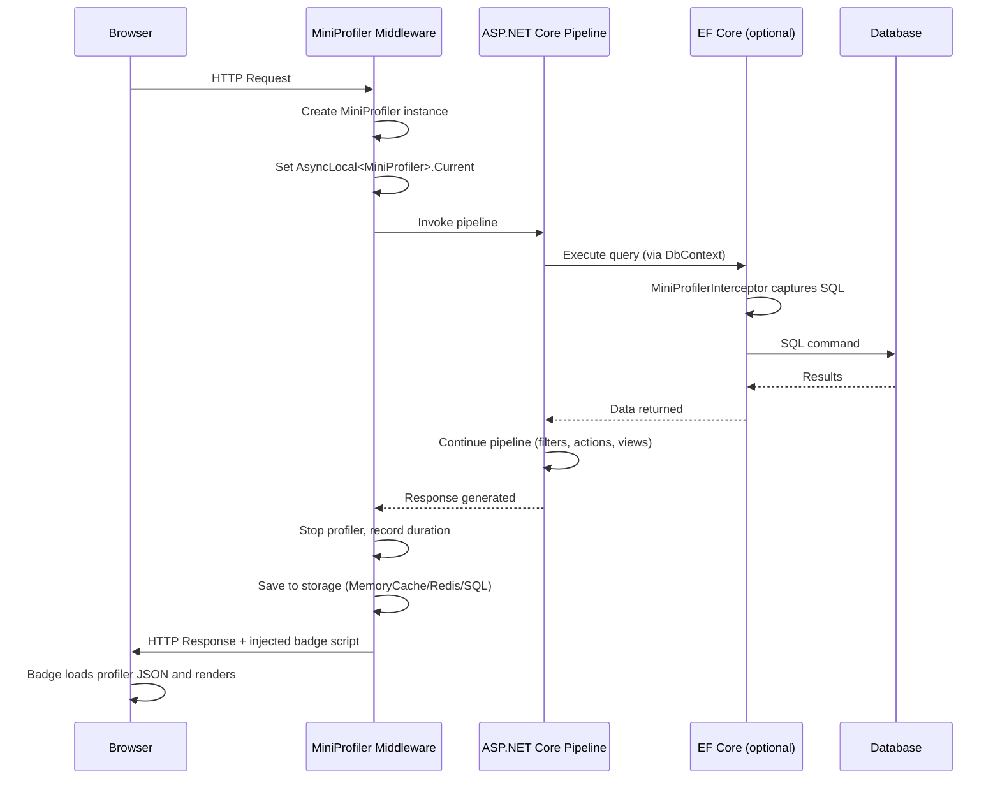

# Overview — Core Concept

MiniProfiler for ASP.NET Core provides per-request profiling that captures all SQL queries, their duration, row counts, and duplicate detection. Results are displayed as a small badge in the browser UI, with drill-down capability into individual query details, a timing tree, and a flame chart.

## What MiniProfiler captures

| Data Point | Captured? | Details |
|---|---|---|
| HTTP request duration | ✅ | Total wall-clock time |
| SQL queries (EF Core) | ✅ | Via MiniProfiler.EntityFrameworkCore |
| SQL queries (Dapper) | ✅ | Via ProfiledDbConnection |
| SQL queries (raw ADO.NET) | ✅ | Via ProfiledDbConnection |
| HTTP client calls | ✅ | Via AddHttpClientProfiling |
| Custom code steps | ✅ | Via MiniProfiler.Current.Step() |
| View rendering | ✅ | Via ASP.NET Core MVC filter |
| Redis calls | ✅ | Via MiniProfiler.Providers.Redis |

## How it works

MiniProfiler integrates into the ASP.NET Core request pipeline as middleware:

```
HTTP Request
    │
    ▼
MiniProfiler Middleware (starts profiler)
    │
    ▼
ASP.NET Core Pipeline (MVC, Razor Pages, etc.)
    │
    ├── EF Core queries intercepted (if AddEntityFramework used)
    ├── Dapper queries intercepted (if ProfiledDbConnection used)
    ├── HTTP client calls intercepted (if AddHttpClient used)
    └── Custom steps via MiniProfiler.Current.Step()
    │
    ▼
MiniProfiler Middleware (stops profiler, saves to storage)
    │
    ▼
Response sent to client with badge/widget injected
```

## The profiler badge

The badge appears as a floating element (default: bottom-right corner) showing:
- Total request duration
- Number of SQL queries
- Color-coded status: green (fast), yellow (moderate), red (slow)

Clicking the badge expands a popup with:
- Full timing tree with drill-down
- SQL tab showing all queries
- Flame chart visualization
- Custom timings
- Duplicate query indicators

## Per-request isolation

Each HTTP request gets its own `MiniProfiler` instance stored in `AsyncLocal<MiniProfiler>`. This ensures:
- No cross-request data leakage
- Thread-safe profiling within async flows
- Automatic cleanup when the request completes

## Storage providers

After each request, the profiler data is saved to a storage provider:

| Provider | Scope | Persistence |
|---|---|---|
| MemoryCacheStorage | Single server | In-memory, lost on restart |
| SqlServerStorage | Multi-server | SQL Server tables |
| RedisStorage | Multi-server | Redis with TTL |
| MongoDBStorage | Multi-server | MongoDB documents |

---

# Setup — Configuration

## Installing NuGet packages

```xml
<!-- Core package — required for all ASP.NET Core projects -->
<PackageReference Include="MiniProfiler.AspNetCore" Version="4.*" />

<!-- MVC filters and view profiling — for MVC or Razor Pages -->
<PackageReference Include="MiniProfiler.AspNetCore.Mvc" Version="4.*" />

<!-- EF Core command interception — required for EF Core profiling -->
<PackageReference Include="MiniProfiler.EntityFrameworkCore" Version="4.*" />
```

### Package selection guide

| Scenario | Packages Required |
|---|---|
| Basic profiling (Dapper, raw ADO.NET) | MiniProfiler.AspNetCore |
| MVC/Razor Pages view profiling | + MiniProfiler.AspNetCore.Mvc |
| EF Core query profiling | + MiniProfiler.EntityFrameworkCore |
| HTTP client profiling | + MiniProfiler.AspNetCore (built-in) |
| Redis storage | + MiniProfiler.Providers.Redis |
| SQL Server storage | + MiniProfiler.Providers.SqlServer |

## Registering MiniProfiler services

```csharp
// Program.cs — .NET 6+ style
var builder = WebApplication.CreateBuilder(args);

builder.Services.AddMiniProfiler(options =>
{
    // Base path for profiler results page
    options.RouteBasePath = "/profiler";

    // Color scheme
    options.ColorScheme = ColorScheme.Auto;

    // Popup position
    options.PopupRenderPosition = RenderPosition.BottomRight;

    // Show time with children in the popup
    options.PopupShowTimeWithChildren = true;

    // Trivial duration threshold — don't profile sub-millisecond queries
    options.TrivialDurationThresholdMilliseconds = 1.0;

    // Maximum number of profiler instances to keep
    options.Storage = new MemoryCacheStorage(
        TimeSpan.FromMinutes(10), 100
    );
});
```

### Adding the middleware

```csharp
var app = builder.Build();

app.UseMiniProfiler();

// Must be after UseRouting and before UseEndpoints
app.UseRouting();
app.MapControllers();
app.Run();
```

### Order matters

```
app.UseRouting();        // First — routing
app.UseMiniProfiler();   // Then — profiler middleware (wraps pipeline)
app.UseAuthentication(); // Then — auth (for ResultsAuthorize checks)
app.UseAuthorization();
app.MapControllers();    // Finally — endpoints
```

## Injecting the widget into views

### Using the tag helper

In `_Layout.cshtml` (or `_ViewImports.cshtml` for global availability):

```csharp
// _ViewImports.cshtml
@addTagHelper *, MiniProfiler.AspNetCore.Mvc
```

In `_Layout.cshtml`:

```html
<body>
    @RenderBody()

    <!-- MiniProfiler widget — injects the badge -->
    <mini-profiler />
</body>
```

### Using the HTML helper

```html
@using StackExchange.Profiling

<body>
    @RenderBody()

    @MiniProfiler.Current?.InjectWidget(Html)
</body>
```

### Conditional rendering

```html
@if (Context.RequestServices.GetRequiredService<IWebHostEnvironment>().IsDevelopment())
{
    <mini-profiler />
}
```

## Configuring options

### All configuration options

```csharp
builder.Services.AddMiniProfiler(options =>
{
    // Route
    options.RouteBasePath = "/profiler";

    // Authorization
    options.ResultsAuthorize = (request) => true;
    options.ResultsListAuthorize = (request) => true;

    // UI
    options.ColorScheme = ColorScheme.Auto;
    options.PopupRenderPosition = RenderPosition.BottomRight;
    options.PopupShowTimeWithChildren = true;
    options.PopupShowControls = true;
    options.PopupStartHidden = false;

    // Performance
    options.TrivialDurationThresholdMilliseconds = 1.0;
    options.MaxJsonLength = 1_000_000;
    options.MaxSqlParameterCount = 50;

    // Storage
    options.Storage = new MemoryCacheStorage(TimeSpan.FromMinutes(10), 100);

    // Profiling control
    options.ShouldProfile = (request) => true;
    options.IgnoredPaths.Add("/health");
    options.IgnoredPaths.Add(".js");
    options.IgnoredPaths.Add(".css");

    // Customization
    options.SqlFormatter = new CustomSqlFormatter();
    options.CustomNullSqlExecutor = new CustomNullSqlExecutor();
});
```

## Enabling EF Core profiling

```csharp
builder.Services.AddMiniProfiler(options =>
{
    options.RouteBasePath = "/profiler";
}).AddEntityFramework();
```

The `.AddEntityFramework()` call registers an `IDbCommandInterceptor` that intercepts all EF Core queries. No changes to your `DbContext` are needed.

### How EF Core interception works

```
EF Core DbContext.SaveChangesAsync()
    → Entity Framework Relational
        → RelationalCommand.ExecuteReader()
            → MiniProfilerInterceptor.CommandReaderExecuting()
                → Records start time
            → Actual database call
            → MiniProfilerInterceptor.CommandReaderExecuted()
                → Records end time, row count, SQL text
```

## Enabling HTTP client profiling

```csharp
builder.Services.AddMiniProfiler(options =>
{
    // ...
})
.AddHttpClientProfiling();
```

This registers a delegating handler that wraps `HttpClient` calls. Each outgoing HTTP request is captured as a custom timing step showing:
- URL
- HTTP method
- Status code
- Duration
- Response size

### Usage with typed HttpClient

```csharp
builder.Services.AddHttpClient<IProductService, ProductService>()
    .AddMiniProfilerHandler(); // Adds profiling to this client
```

---

# Basic Usage — Getting Started

## Viewing the profiler

After setting up MiniProfiler, browse to any page in your application:
1. The badge appears in the bottom-right corner
2. The number shows total SQL queries for the page
3. Click the badge to expand timing details
4. Click "sql" to see all captured queries
5. Click individual queries to see full SQL text

### Profiler results page

Navigate to `/profiler` (or your configured `RouteBasePath`) to see a list of all profiled requests:

```
┌──────────────────────────────────────────────────────────────┐
│  MiniProfiler Results                                        │
├──────────┬───────────┬──────────┬──────────┬─────────────────┤
│  URL     │ Duration  │ Queries  │ From     │ Time            │
├──────────┼───────────┼──────────┼──────────┼─────────────────┤
│ /products│ 452ms     │ 8        │ 127.0.0.1│ 12:34:01        │
│ /orders  │ 821ms     │ 15       │ 127.0.0.1│ 12:33:30        │
│ /home    │ 95ms      │ 2        │ 127.0.0.1│ 12:33:01        │
└──────────┴───────────┴──────────┴──────────┴─────────────────┘
```

## Understanding the timing tree

Clicking a request reveals the timing tree:

```
/products (452ms total)
    ├── MVC Action: ProductsController.ListAsync (350ms)
    │   ├── sql: SELECT COUNT(*) FROM Products (12ms, 1 row)
    │   ├── sql: SELECT * FROM Products WHERE CategoryId = @CatId (45ms, 127 rows)
    │   ├── sql: SELECT * FROM Categories (23ms, 15 rows)
    │   ├── sql: SELECT * FROM Inventory WHERE ProductId IN (...) (89ms, 127 rows)
    │   └── Custom step: Cache refresh (18ms)
    └── View rendering: Products/List.cshtml (102ms)
        └── sql: SELECT * FROM Reviews WHERE ProductId = @Id (68ms, 245 rows)
```

## The SQL tab

The SQL tab lists all captured queries with:
- Query number
- Duration
- SQL text (normalized, with parameter values)
- Row count
- Duplicate indicator
- Link to stack trace

### Example SQL tab

```
┌──────┬──────────┬──────────────────────────────────┬──────────┬───────┐
│  #   │ Duration │ SQL                              │ Rows     │ Dup   │
├──────┼──────────┼──────────────────────────────────┼──────────┼───────┤
│  1   │ 12ms     │ SELECT COUNT(*) FROM Products    │ 1        │       │
│      │          │ WHERE IsActive = @Active         │          │       │
│      │          │ @Active = True                   │          │       │
├──────┼──────────┼──────────────────────────────────┼──────────┼───────┤
│  2   │ 45ms     │ SELECT * FROM Products           │ 127      │       │
│      │          │ WHERE CategoryId = @CatId        │          │       │
│      │          │ @CatId = 5                       │          │       │
├──────┼──────────┼──────────────────────────────────┼──────────┼───────┤
│  3   │ 2ms      │ SELECT Name FROM Products        │ 1        │ 🔄    │
│      │          │ WHERE Id = @Id                   │          │       │
│      │          │ @Id = 42                         │          │       │
├──────┼──────────┼──────────────────────────────────┼──────────┼───────┤
│  4   │ 2ms      │ SELECT Name FROM Products        │ 1        │ 🔄    │
│      │          │ WHERE Id = @Id                   │          │       │
│      │          │ @Id = 42                         │          │       │
└──────┴──────────┴──────────────────────────────────┴──────────┴───────┘
```

## Reading the flame chart

The flame chart shows request execution horizontally (time) and vertically (call depth):

```
Time → 0ms───100ms───200ms───300ms───400ms───500ms
        ┌─────────────────────────────────────────┐
        │ HTTP Request /products                   │
        ├────────────────────┬────────────────────┤
        │ Action             │ View               │
        ├────────┬────────┬──┤                    │
        │ SQL #1 │ SQL #2 │  │ SQL #3             │
        │        │        │  │                    │
        └────────┴────────┴──┴────────────────────┘
```

- Wider bars = longer duration
- Nested bars = call hierarchy
- Color = category (blue=SQL, green=custom, gray=view)

## Profiling custom operations

```csharp
public async Task<Product> GetProductWithCacheAsync(int id)
{
    // Profile a cache lookup
    using (MiniProfiler.Current.Step("Cache lookup"))
    {
        var cached = await _cache.GetAsync($"product:{id}");
        if (cached != null) return cached;
    }

    // Profile the database query
    using (MiniProfiler.Current.Step("Database query"))
    {
        var product = await _repository.GetProductAsync(id);

        using (MiniProfiler.Current.Step("Cache set"))
        {
            await _cache.SetAsync($"product:{id}", product);
        }

        return product;
    }
}
```

### Nested steps

```csharp
using (MiniProfiler.Current.Step("Order processing"))
{
    // Validate
    using (MiniProfiler.Current.Step("Validation"))
    {
        await ValidateOrderAsync(order);
    }

    // Save
    using (MiniProfiler.Current.Step("Database save"))
    {
        await _orderRepository.SaveAsync(order);
    }

    // Notify
    using (MiniProfiler.Current.Step("Notification"))
    {
        await _notificationService.SendAsync(order);
    }
}
```

## Profiling async code

```csharp
// Async steps work naturally
public async Task ProcessAsync()
{
    using (MiniProfiler.Current.Step("Async operation"))
    {
        await Task.Delay(100);
        await _service.DoWorkAsync();
    }
}
```

MiniProfiler captures the correct duration for async operations because `Step` creates a `Timing` that is disposed when the async method completes.

## Reading profiler data programmatically

```csharp
public class ProfilerInfoMiddleware
{
    private readonly RequestDelegate _next;
    private readonly ILogger _logger;

    public async Task InvokeAsync(HttpContext context)
    {
        await _next(context);

        var profiler = MiniProfiler.Current;
        if (profiler != null && profiler.Root != null)
        {
            var root = profiler.Root;
            var sqlTimings = root.GetAllTimings()
                .Where(t => t.CustomTimingList != null)
                .SelectMany(t => t.CustomTimingList)
                .ToList();

            _logger.LogInformation(
                "Request: {Path}\n" +
                "  Total: {Duration}ms\n" +
                "  SQL Queries: {Count}\n" +
                "  SQL Total: {SqlMs}ms\n" +
                "  Slowest SQL: {SlowMs}ms - {SlowSql}",
                profiler.Name,
                root.DurationMilliseconds,
                sqlTimings.Count,
                sqlTimings.Sum(t => t.DurationMilliseconds ?? 0),
                sqlTimings.Max(t => t.DurationMilliseconds ?? 0),
                sqlTimings.OrderByDescending(t => t.DurationMilliseconds)
                    .FirstOrDefault()?.CommandString
            );
        }
    }
}
```

## Profiling static files and specific paths

```csharp
builder.Services.AddMiniProfiler(options =>
{
    // Ignore specific paths
    options.IgnoredPaths.Add("/health-check");
    options.IgnoredPaths.Add("/metrics");
    options.IgnoredPaths.Add("/swagger");

    // Ignore file extensions
    options.IgnoredPaths.Add("*.js");
    options.IgnoredPaths.Add("*.css");
    options.IgnoredPaths.Add("*.png");
    options.IgnoredPaths.Add("*.svg");

    // Ignore connection strings
    options.IgnoredConnectionStrings.Add("LogDatabase");
});
```

---

# Advanced Usage — Patterns

## Profiling with dependency injection

```csharp
// Register IDbConnection with MiniProfiler wrapping
services.AddScoped<IDbConnection>(sp =>
{
    var configuration = sp.GetRequiredService<IConfiguration>();
    var connectionString = configuration.GetConnectionString("Default");

    var realConnection = new SqlConnection(connectionString);

    if (MiniProfiler.Current != null)
    {
        return new ProfiledDbConnection(realConnection, MiniProfiler.Current);
    }

    return realConnection;
});
```

## Adding HTTP client profiling

```csharp
builder.Services.AddMiniProfiler(options => { ... })
    .AddHttpClientProfiling();

// All HttpClient instances are now profiled
public class MyService
{
    private readonly HttpClient _httpClient;

    public async Task<string> CallApiAsync()
    {
        // This HTTP call appears in MiniProfiler as a custom timing
        return await _httpClient.GetStringAsync("https://api.example.com/data");
    }
}
```

## Custom SQL formatter

```csharp
public class CustomSqlFormatter : ISqlFormatter
{
    public string FormatSql(string sql)
    {
        // Remove comments
        sql = Regex.Replace(sql, @"--.*$", "", RegexOptions.Multiline);

        // Compact whitespace
        sql = Regex.Replace(sql, @"\s+", " ");

        // Truncate very long SQL
        if (sql.Length > 1000)
            sql = sql.Substring(0, 997) + "...";

        return sql;
    }
}

// Register
builder.Services.AddMiniProfiler(options =>
{
    options.SqlFormatter = new CustomSqlFormatter();
});
```

## Profiling action filters

```csharp
public class ProfilingActionFilter : IAsyncActionFilter
{
    public async Task OnActionExecutionAsync(
        ActionExecutingContext context,
        ActionExecutionDelegate next)
    {
        using (MiniProfiler.Current.Step($"Action: {context.ActionDescriptor.DisplayName}"))
        {
            await next();
        }
    }
}

// Register
services.AddScoped<ProfilingActionFilter>();
```

## Profiling view components

```csharp
public class ProductListViewComponent : ViewComponent
{
    public async Task<IViewComponentResult> InvokeAsync(int categoryId)
    {
        using (MiniProfiler.Current.Step("ProductList ViewComponent"))
        {
            var products = await _repository.GetByCategoryAsync(categoryId);
            return View(products);
        }
    }
}
```

## Profiling with multiple environments

```csharp
var builder = WebApplication.CreateBuilder(args);

// Only register MiniProfiler in Development
if (builder.Environment.IsDevelopment())
{
    builder.Services.AddMiniProfiler(options =>
    {
        options.RouteBasePath = "/profiler";
    }).AddEntityFramework();
}

// Later
var app = builder.Build();

if (app.Environment.IsDevelopment())
{
    app.UseMiniProfiler();
}
```

## Profiling in staging with IP allowlist

```csharp
builder.Services.AddMiniProfiler(options =>
{
    options.RouteBasePath = "/profiler";

    options.ResultsAuthorize = (request) =>
    {
        var ip = request.HttpContext.Connection.RemoteIpAddress;
        if (ip == null) return false;

        // Allow localhost
        if (IPAddress.IsLoopback(ip)) return true;

        // Allow corporate VPN range
        var vpnRange = IPNetwork.Parse("10.0.0.0/8");
        if (vpnRange.Contains(ip)) return true;

        // Allow specific IPs
        var allowed = new[] { "203.0.113.50", "198.51.100.25" };
        return allowed.Contains(ip.ToString());
    };
});
```

## Profiling with custom storage

```csharp
public class CustomStorage : IStorage
{
    private readonly ConcurrentBag<MiniProfiler> _profilers = new();

    public Task Save(MiniProfiler profiler)
    {
        _profilers.Add(profiler);
        // Optionally persist to custom database
        return Task.CompletedTask;
    }

    public Task<MiniProfiler> Load(Guid id)
    {
        var profiler = _profilers.FirstOrDefault(p => p.Id == id);
        return Task.FromResult(profiler);
    }

    public Task<List<Guid>> GetUnviewedIds(string user)
    {
        return Task.FromResult(new List<Guid>());
    }
}

// Register
builder.Services.AddMiniProfiler(options =>
{
    options.Storage = new CustomStorage();
});
```

## Profiling with AutoFac

```csharp
// Autofac module for MiniProfiler
public class ProfilingModule : Module
{
    protected override void Load(ContainerBuilder builder)
    {
        builder.Register(c =>
        {
            var realConnection = c.Resolve<IDbConnectionFactory>().Create();
            var profiler = MiniProfiler.Current;
            return profiler != null
                ? new ProfiledDbConnection(realConnection, profiler)
                : realConnection;
        }).As<IDbConnection>().InstancePerLifetimeScope();
    }
}
```

## Excluding specific EF Core queries from profiling

```csharp
protected override void OnConfiguring(DbContextOptionsBuilder optionsBuilder)
{
    optionsBuilder.AddInterceptors(new SuppressProfilerInterceptor());
}

public class SuppressProfilerInterceptor : DbCommandInterceptor
{
    public override InterceptionResult<DbDataReader> ReaderExecuting(
        DbCommand command,
        CommandEventData eventData,
        InterceptionResult<DbDataReader> result)
    {
        // Skip profiling for migration queries
        if (command.CommandText.Contains("__EFMigrationsHistory"))
        {
            command.CommandText = "-- suppressed --";
        }

        return base.ReaderExecuting(command, eventData, result);
    }
}
```

## Using MiniProfiler in background services

```csharp
public class ProfilingBackgroundService : BackgroundService
{
    protected override async Task ExecuteAsync(CancellationToken stoppingToken)
    {
        while (!stoppingToken.IsCancellationRequested)
        {
            // Start a manual profiler
            using (MiniProfiler.StartNew("BackgroundJob"))
            {
                using (MiniProfiler.Current.Step("Data processing"))
                {
                    await ProcessDataAsync();
                }
            }

            await Task.Delay(TimeSpan.FromMinutes(5), stoppingToken);
        }
    }

    private async Task ProcessDataAsync()
    {
        // Queries are captured if ProfiledDbConnection is used
        using var connection = new ProfiledDbConnection(
            new SqlConnection(_connectionString),
            MiniProfiler.Current
        );
        await connection.ExecuteAsync("UPDATE Processed SET Status = 'Done'");
    }
}
```

## Accessing profiler results via API

```csharp
[ApiController]
[Route("api/profiler")]
public class ProfilerApiController : ControllerBase
{
    private readonly IStorage _storage;

    public ProfilerApiController(IStorage storage)
    {
        _storage = storage;
    }

    [HttpGet("recent")]
    public async Task<IActionResult> GetRecent([FromQuery] int count = 10)
    {
        var ids = await _storage.ListAsync(count);
        var profilers = new List<object>();

        foreach (var id in ids)
        {
            var profiler = await _storage.Load(id);
            if (profiler != null)
            {
                profilers.Add(new
                {
                    profiler.Id,
                    profiler.Name,
                    profiler.Root.DurationMilliseconds,
                    QueryCount = profiler.Root.GetAllTimings()
                        .Count(t => t.CustomTimingList?.Any() == true)
                });
            }
        }

        return Ok(profilers);
    }

    [HttpGet("detail/{id:guid}")]
    public async Task<IActionResult> GetDetail(Guid id)
    {
        var profiler = await _storage.Load(id);
        if (profiler == null) return NotFound();
        return Ok(profiler);
    }
}
```

## Integrating with Serilog

```csharp
public class SerilogProfilerProvider : IProfilerProvider
{
    private readonly ILogger _logger;

    public MiniProfiler GetCurrentProfiler() => MiniProfiler.Current;

    public MiniProfiler Start(ProfileLevel level, string sessionName)
    {
        return new MiniProfiler(sessionName);
    }

    public void Stop(bool discardResults)
    {
        var profiler = MiniProfiler.Current;
        if (profiler?.Root == null) return;

        var sqlTimings = profiler.Root.GetAllTimings()
            .Where(t => t.CustomTimingList != null)
            .SelectMany(t => t.CustomTimingList);

        _logger.Information(
            "Request {RequestName} completed in {Duration}ms with {QueryCount} SQL queries",
            profiler.Name,
            profiler.Root.DurationMilliseconds,
            sqlTimings.Count()
        );

        foreach (var sql in sqlTimings.Where(s => s.DurationMilliseconds > 500))
        {
            _logger.Warning(
                "Slow query ({Duration}ms): {Sql}",
                sql.DurationMilliseconds,
                sql.CommandString
            );
        }
    }
}
```

---

# Architecture — How It Works

## Request lifecycle



## Internal class structure

```
MiniProfiler (per-request instance)
    ├── Id (Guid)
    ├── Name (URL or custom name)
    ├── Started (DateTime)
    ├── MachineName
    ├── CustomLinks (dictionary)
    └── Root (Timing)
         ├── Name ("http://...")
         ├── DurationMilliseconds
         ├── Children (List<Timing>)
         │    ├── Timing: action method
         │    │    ├── Children: SQL queries (CustomTiming)
         │    │    ├── Children: Custom steps (Timing)
         │    │    └── Children: View rendering (Timing)
         │    └── ...
         └── CustomTimingList (for direct SQL timing association)
```

## Timing class hierarchy

```
Timing (a named duration with children)
    ├── Id (Guid)
    ├── Name (e.g., "sql", "custom step", "view")
    ├── DurationMilliseconds
    ├── StartMilliseconds (relative to profiler start)
    ├── Children (List<Timing> — nested operations)
    ├── CustomTimingList (List<CustomTiming> — associated data)
    │    └── CustomTiming
    │         ├── CommandString (the SQL text)
    │         ├── ExecuteType (Reader, NonQuery, Scalar)
    │         ├── DurationMilliseconds
    │         ├── FetchCount (rows)
    │         ├── StartMilliseconds
    │         ├── FirstFetchDurationMilliseconds
    │         ├── StackTraceSnippet
    │         └── IsDuplicate
    └── IsRoot (is this the root timing?)
```

## Storage interface

```csharp
public interface IStorage
{
    // Save a profiler after request completes
    Task Save(MiniProfiler profiler);

    // Load a specific profiler by ID
    Task<MiniProfiler> Load(Guid id);

    // Get a list of recent profiler IDs
    Task<List<Guid>> ListAsync(int maxProfilerIds, ListResultSortOrder sortOrder, ...);

    // Get unviewed profiler IDs for a user
    Task<List<Guid>> GetUnviewedIds(string user);

    // Set a profiler as viewed by a user
    Task SetViewedAsync(Guid id, string user);
}
```

## Widget rendering pipeline

```
1. MiniProfiler middleware processes the response
2. Finds </body> tag in HTML output
3. Injects <script> and <link> tags before </body>
4. Script loads om nom nom resources
5. On page load:
   a. Fetch profiler data from /profiler/results?id={profilerId}
   b. Render badge in bottom-right corner
   c. Set up click handlers for expanding/collapsing
   d. Render timing tree, SQL tab, and flame chart
   e. Apply color coding based on duration thresholds
6. For AJAX requests:
   a. Badge checks for new profiler results periodically
   b. New results are appended to the badge popup
```

## Default memory storage implementation

```csharp
public class MemoryCacheStorage : IStorage
{
    private readonly ConcurrentDictionary<Guid, MiniProfiler> _profilers = new();
    private readonly TimeSpan _cacheDuration;
    private readonly int _maxProfilerCount;
    private readonly ConcurrentQueue<Guid> _insertionOrder = new();

    public Task Save(MiniProfiler profiler)
    {
        _profilers[profiler.Id] = profiler;
        _insertionOrder.Enqueue(profiler.Id);

        // Evict oldest if over max count
        while (_profilers.Count > _maxProfilerCount)
        {
            if (_insertionOrder.TryDequeue(out var oldestId))
            {
                _profilers.TryRemove(oldestId, out _);
            }
        }

        return Task.CompletedTask;
    }

    public Task<MiniProfiler> Load(Guid id)
    {
        _profilers.TryGetValue(id, out var profiler);
        return Task.FromResult(profiler);
    }

    public Task<List<Guid>> ListAsync(int maxCount, ...)
    {
        var ids = _insertionOrder.Reverse().Take(maxCount).ToList();
        return Task.FromResult(ids);
    }
}
```

## Profiler middleware pipeline

```csharp
public class MiniProfilerMiddleware
{
    private readonly RequestDelegate _next;

    public async Task InvokeAsync(HttpContext context)
    {
        // Skip ignored paths
        if (ShouldIgnore(context.Request.Path))
        {
            await _next(context);
            return;
        }

        // Determine if profiling should start
        if (!ShouldProfile(context))
        {
            await _next(context);
            return;
        }

        // Start profiler
        var profiler = MiniProfiler.Start(
            ProfileLevel.Verbose,
            context.Request.Path.ToString()
        );

        try
        {
            await _next(context);

            // Stop profiler
            profiler.Stop();

            // Save to storage
            var storage = context.RequestServices.GetRequiredService<IStorage>();
            await storage.Save(profiler);

            // Inject widget for HTML responses
            if (IsHtmlResponse(context.Response))
            {
                await InjectWidget(context.Response, profiler);
            }
        }
        catch (Exception ex)
        {
            profiler.Stop(discardResults: true);
            throw;
        }
    }
}
```

## Flame chart generation

The flame chart is rendered client-side in JavaScript using the profiler's timing tree:
- X-axis: time (from start to end of request)
- Y-axis: call stack depth
- Width of each block: timing duration
- Color: based on category (SQL, custom, view)
- Hover: shows timing name, duration, and details
- Click: drills into the timing's children

```
                      ┌─────────────────────────────────────┐
     Depth 0 (root)   │  GET /products (452ms)               │
                      ├──────────┬──────────┬────────────────┤
     Depth 1          │ Action   │          │ View           │
                      ├──────┬───┤          │                │
     Depth 2          │ SQL  │SQL│ Custom   │ SQL            │
                      │ #1   │#2 │ Step     │ #3             │
                      ├──┐   │   │          │                │
     Depth 3          │  │   │   │          │                │
                      │  │   │   │          │                │
    Time (ms)         0  50  100 150 200 250 300 350 400 450
```

## SQL command interception for EF Core

The `MiniProfilerInterceptor` implements `IDbCommandInterceptor`:

```
Before query execution:
    interceptor.CommandReaderExecuting()
        → Records start timestamp
        → Captures command.CommandText (SQL)
        → Captures command.Parameters

After query execution:
    interceptor.CommandReaderExecuted()
        → Records end timestamp
        → Calculates duration
        → Records reader records affected (row count)
        → Creates CustomTiming with all data
        → Adds to MiniProfiler.Current timing tree
```

---

# Production — Deployment

## Disabling in production

### Using IHostEnvironment

```csharp
var builder = WebApplication.CreateBuilder(args);

if (builder.Environment.IsDevelopment())
{
    builder.Services.AddMiniProfiler(options =>
    {
        options.RouteBasePath = "/profiler";
    }).AddEntityFramework();
}

var app = builder.Build();

if (app.Environment.IsDevelopment())
{
    app.UseMiniProfiler();
}
```

### Using configuration

```csharp
// appsettings.json
{
  "MiniProfiler": {
    "Enabled": "false"
  }
}

// appsettings.Development.json
{
  "MiniProfiler": {
    "Enabled": "true"
  }
}
```

```csharp
var enabled = builder.Configuration.GetValue<bool>("MiniProfiler:Enabled");
if (enabled)
{
    builder.Services.AddMiniProfiler(options => { ... }).AddEntityFramework();
}
```

### Using NullProfilerProvider

```csharp
builder.Services.AddMiniProfiler(options =>
{
    if (!builder.Configuration.GetValue<bool>("MiniProfiler:Enabled"))
    {
        options.ProfilerProvider = new NullProfilerProvider();
    }
});
```

## IP-based access control

```csharp
builder.Services.AddMiniProfiler(options =>
{
    options.ResultsAuthorize = (request) =>
    {
        var ip = request.HttpContext.Connection.RemoteIpAddress;
        if (ip == null) return false;

        // Convert to string for pattern matching
        var ipString = ip.ToString();

        // Allow localhost
        if (ipString == "127.0.0.1" || ipString == "::1") return true;

        // Allow specific subnets
        if (ipString.StartsWith("10.0.")) return true;
        if (ipString.StartsWith("172.16.")) return true;
        if (ipString.StartsWith("192.168.")) return true;

        return false;
    };

    // Stricter authorization for listing all profiled requests
    options.ResultsListAuthorize = (request) =>
    {
        return request.HttpContext.User.IsInRole("Administrator");
    };
});
```

## Reducing storage bloat

### Limit stored profilers

```csharp
builder.Services.AddMiniProfiler(options =>
{
    // Keep only the last 50 profilers in memory
    options.Storage = new MemoryCacheStorage(
        cacheDuration: TimeSpan.FromMinutes(30),
        maxProfilerCount: 50
    );
});
```

### Automated cleanup for SQL storage

```sql
-- SQL Server cleanup job (run every hour)
DELETE FROM MiniProfilers
WHERE Created < DATEADD(HOUR, -24, GETUTCDATE());

DELETE FROM MiniProfilerTimings
WHERE ProfilerId NOT IN (SELECT Id FROM MiniProfilers);

DELETE FROM MiniProfilerClientTimings
WHERE ProfilerId NOT IN (SELECT Id FROM MiniProfilers);
```

### Redis TTL

```csharp
// Redis storage automatically handles TTL
builder.Services.AddMiniProfiler(options =>
{
    options.Storage = new RedisStorage("localhost:6379")
    {
        // Redis keys auto-expire after 1 hour
        KeyExpirationSeconds = 3600
    };
});
```

## Choosing storage for multi-server apps

| Application Type | Storage Recommendation | Rationale |
|---|---|---|
| Single-server, low traffic | MemoryCacheStorage | Simple, no extra infra |
| Single-server, high traffic | MemoryCacheStorage with low max count | Keep memory in check |
| Multi-server web farm | RedisStorage | Shared, fast, auto-TTL |
| Multi-server with auditing | SqlServerStorage | Persisted, queryable |
| Multi-server with existing MongoDB | MongoDBStorage | No new infra needed |

## Reducing memory consumption

```csharp
builder.Services.AddMiniProfiler(options =>
{
    // Discard SQL text for fast queries
    options.TrivialDurationThresholdMilliseconds = 5.0;

    // Limit stored profilers
    options.Storage = new MemoryCacheStorage(
        TimeSpan.FromMinutes(5), 25
    );

    // Ignore static content
    options.IgnoredPaths.AddRange(new[]
    {
        "/static", "/lib", "/css", "/js", "/images"
    });

    // Ignore health checks
    options.IgnoredPaths.Add("/health");
    options.IgnoredPaths.Add("/ready");
    options.IgnoredPaths.Add("/live");
});
```

## Sampling strategies

```csharp
builder.Services.AddMiniProfiler(options =>
{
    // Profile only 5% of requests
    options.ShouldProfile = (request) =>
    {
        return Random.Shared.NextDouble() < 0.05;
    };

    // Profile all requests from specific users
    options.ShouldProfile = (request) =>
    {
        var user = request.HttpContext.User;
        if (user.IsInRole("Developer")) return true;

        // Otherwise, 2% sampling
        return Random.Shared.NextDouble() < 0.02;
    };
});
```

## Security best practices

### Authorization checklist

- [ ] Set `ResultsAuthorize` for production deployments
- [ ] Set `ResultsListAuthorize` to restrict listing
- [ ] Disable in production if not actively used
- [ ] Review SQL text for PII exposure
- [ ] Configure `IgnoredPaths` for sensitive endpoints
- [ ] Use HTTPS to protect profiler data in transit
- [ ] Consider GDPR implications of captured SQL data

### Securing the results endpoint

```csharp
builder.Services.AddMiniProfiler(options =>
{
    options.ResultsAuthorize = (request) =>
    {
        // Must be authenticated and in specific role
        var user = request.HttpContext.User;
        return user.Identity.IsAuthenticated
            && user.IsInRole("Developer");
    };
});
```

## Logging profiler data

```csharp
public class ProfilerLoggingMiddleware
{
    public async Task InvokeAsync(HttpContext context)
    {
        await _next(context);

        var profiler = MiniProfiler.Current;
        if (profiler?.Root == null) return;

        // Extract all SQL timings
        var sqlTimings = profiler.Root.GetAllTimings()
            .Where(t => t.CustomTimingList != null)
            .SelectMany(t => t.CustomTimingList)
            .ToList();

        // Log slow queries
        var slowQueries = sqlTimings
            .Where(t => t.DurationMilliseconds > 500)
            .ToList();

        foreach (var slow in slowQueries)
        {
            _logger.LogWarning(
                "Slow SQL ({Duration}ms): {Sql}",
                slow.DurationMilliseconds,
                slow.CommandString
            );
        }

        // Log summary
        _logger.LogInformation(
            "Request {Path}: {Duration}ms, {Queries} SQL queries",
            profiler.Name,
            profiler.Root.DurationMilliseconds,
            sqlTimings.Count
        );
    }
}
```

## Integration with APM tools

```csharp
// Export MiniProfiler data to Application Insights
public class ProfilerToAppInsightsMiddleware
{
    public async Task InvokeAsync(HttpContext context)
    {
        await _next(context);

        var profiler = MiniProfiler.Current;
        if (profiler?.Root == null) return;

        var telemetry = context.Features.Get<RequestTelemetry>();
        if (telemetry == null) return;

        var sqlTimings = profiler.Root.GetAllTimings()
            .Where(t => t.CustomTimingList != null)
            .SelectMany(t => t.CustomTimingList);

        foreach (var sql in sqlTimings)
        {
            telemetry.Properties[$"SQL_{sql.CommandString.GetHashCode()}"] =
                $"{sql.DurationMilliseconds}ms";
        }
    }
}
```

## Alerts based on profiler metrics

```csharp
public class ProfilerAlertWorker : BackgroundService
{
    protected override async Task ExecuteAsync(CancellationToken ct)
    {
        while (!ct.IsCancellationRequested)
        {
            await Task.Delay(TimeSpan.FromMinutes(1), ct);

            var storage = _serviceProvider.GetRequiredService<IStorage>();
            var ids = await storage.ListAsync(10);

            foreach (var id in ids)
            {
                var profiler = await storage.Load(id);
                if (profiler?.Root == null) continue;

                var totalMs = profiler.Root.DurationMilliseconds ?? 0;
                if (totalMs > 5000)
                {
                    _alertService.SendAlert(
                        "Slow request detected",
                        $"{profiler.Name} took {totalMs}ms"
                    );
                }
            }
        }
    }
}
```

---

# Gotchas — Common Pitfalls

## Memory usage from storing profiler data

Each profiled request stores in memory (or storage):
- The profiler object with all timings
- SQL text for every query
- Parameter names and values
- Stack traces

With 1000 requests at 5KB each → 5MB. With 100,000 requests → 500MB.

### Mitigation

```csharp
// Limit storage aggressively
options.Storage = new MemoryCacheStorage(
    TimeSpan.FromMinutes(5),     // Keep for 5 minutes
    maxProfilerCount: 50         // Max 50 profilers in memory
);

// Discard trivial queries early
options.TrivialDurationThresholdMilliseconds = 5.0;
```

## Disabling in production via IHostEnvironment

```csharp
// CORRECT: Check environment before registration
if (env.IsDevelopment())
{
    services.AddMiniProfiler(options => { ... });
}

// WRONG: Register but try to disable later
services.AddMiniProfiler(options =>
{
    options.ProfilerProvider = new NullProfilerProvider();
    // ^ This may still have overhead from middleware checks
});
```

## Async page special handling

For pages that use streaming responses (`IAsyncEnumerable`, gRPC streaming, SSE):
- The profiler middleware may not properly capture the response
- Widget injection may fail (no `</body>` to inject before)
- Timing data may be incomplete

### Workaround

```csharp
// For streaming endpoints, manually profile
public async IAsyncEnumerable<Product> GetProductsStreaming()
{
    using (MiniProfiler.Current.Step("Streaming products"))
    {
        await foreach (var product in _repository.GetProductsAsync())
        {
            yield return product;
        }
    }
}
```

## Massive pages slow the widget

Pages with hundreds of SQL queries cause the widget to:
- Render a huge timing tree (slow DOM manipulation)
- Display a slow flame chart
- Transfer large JSON payloads (badge load time)

### Solutions

```csharp
// 1. Truncate trivial queries
options.TrivialDurationThresholdMilliseconds = 2.0;

// 2. Ignore specific paths that are known to be heavy
options.IgnoredPaths.Add("/reports");

// 3. Limit SQL text length
// (not directly configurable — use custom SQL formatter)

// 4. Cap number of displayed queries
options.MaxSqlParameterCount = 100; // Re-purposed as general limit
```

## MiniProfiler.Current is null in certain contexts

```csharp
// In background services, MiniProfiler.Current is null
public class MyBackgroundService : BackgroundService
{
    protected override async Task ExecuteAsync(CancellationToken ct)
    {
        // MiniProfiler.Current is NULL here!
        // Need to manually start a profiler:
        using (MiniProfiler.StartNew("BackgroundTask"))
        {
            // Now MiniProfiler.Current is available
        }
    }
}
```

### Other contexts where Current is null

- `IHostedService.StartAsync` / `StopAsync`
- `IApplicationLifetime` events
- `IHostApplicationLifetime` events
- Custom `IStartupFilter` running before middleware
- `ITelemetryInitializer` callbacks
- Static constructors and singletons at startup

## Profiler storage not persisted across app restarts

`MemoryCacheStorage` (the default) loses all profiler data when the app restarts. Use `SqlServerStorage` or `RedisStorage` for persistence.

```csharp
// Losing data on restart is fine in development
// Use persisted storage for staging/production when needed
if (env.IsStaging())
{
    options.Storage = new SqlServerStorage(connectionString);
}
```

## Widget conflicts with CSP headers

If your app uses Content-Security-Policy headers, the MiniProfiler widget may be blocked:

```html
<!-- The widget loads inline scripts and styles -->
<!-- CSP must allow: 'unsafe-inline' or the specific nonce -->
```

### CSP-compatible setup

```csharp
// MiniProfiler loads its resources from embedded files
// CSP needs to allow 'self' for styles and scripts
// Or use nonce-based CSP:

builder.Services.AddMiniProfiler(options =>
{
    options.ScriptSrc = "'self' 'nonce-{0}'";
    options.StyleSrc = "'self' 'unsafe-inline'";
});
```

## Profiling with SignalR

SignalR uses WebSockets and long polling. MiniProfiler:
- Does NOT profile WebSocket connections by default
- Does profile the initial HTTP negotiation
- May not capture all SignalR hub method calls

```csharp
// Manual profiling in SignalR hubs
public class ChatHub : Hub
{
    public async Task SendMessage(string message)
    {
        using (MiniProfiler.Current.Step("SignalR: SendMessage"))
        {
            await _db.SaveMessageAsync(message);
            await Clients.All.SendAsync("MessageReceived", message);
        }
    }
}
```

## Profiling with gRPC

gRPC uses HTTP/2 streaming. MiniProfiler:
- Does NOT profile gRPC streams by default
- Can profile individual gRPC call handlers
- For gRPC-Web, widget injection may not work

```csharp
// Manual profiling in gRPC services
public class ProductService : Product.ProductBase
{
    public override async Task<ProductResponse> GetProduct(
        ProductRequest request, ServerCallContext context)
    {
        using (MiniProfiler.Current.Step("gRPC: GetProduct"))
        {
            return await base.GetProduct(request, context);
        }
    }
}
```

## Overhead of always-on profiling

Even when not displayed, MiniProfiler still captures data if middleware is registered:
- Memory allocation for timing objects
- SQL text storage
- AsyncLocal operations

### Zero-overhead when disabled

```csharp
// True zero-overhead in production — don't register at all
if (env.IsDevelopment())
{
    services.AddMiniProfiler();
}

if (env.IsDevelopment())
{
    app.UseMiniProfiler();
}
```

## Profiling middleware order with error handling

```csharp
// WRONG ORDER: Exception handler runs BEFORE profiler
app.UseExceptionHandler("/error");
app.UseMiniProfiler();
// → Exceptions caught before profiling completes → lost data

// CORRECT ORDER: Profiler wraps everything
app.UseMiniProfiler();
app.UseExceptionHandler("/error");
// → Exceptions are still captured (profiler stops with discardResults)
```

## Profiling static files

By default, MiniProfiler does NOT profile static files. This is correct for performance. If you need to track static file requests:
- Set `options.ShouldProfile` to return true for specific static paths
- Note that widget injection won't work for non-HTML static files

```csharp
options.IgnoredPaths.Add("/css");
options.IgnoredPaths.Add("/js");
options.IgnoredPaths.Add("/lib");
options.IgnoredPaths.Add("/images");
```

## Multiple MiniProfiler instances

Do NOT create multiple `MiniProfiler` instances per request:
- Only `MiniProfiler.Current` (set by middleware) is the active profiler
- Creating additional instances manually will NOT be saved or displayed
- Always use `MiniProfiler.Current.Step()` for custom timing

## Profiling in unit tests

```csharp
[Fact]
public async Task RepositoryProfilingTest()
{
    using (MiniProfiler.StartNew("UnitTest"))
    {
        var connection = new ProfiledDbConnection(
            new SqlConnection(TestConnectionString),
            MiniProfiler.Current
        );
        var result = await connection.QueryAsync("SELECT 1");
        Assert.True(result.Any());

        var profiler = MiniProfiler.Current;
        Assert.NotNull(profiler);
        Assert.NotEmpty(profiler.Root.GetAllTimings());
    }
}
```

## Widget not appearing

Common causes:
1. `<mini-profiler />` not in layout
2. `UseMiniProfiler()` not called
3. Response is not HTML (API, JSON, gRPC)
4. `ResultsAuthorize` returns false
5. CSP headers blocking inline scripts
6. Response compression before MiniProfiler middleware

### Debugging

```csharp
// Check if profiler ran for this request
var profiler = MiniProfiler.Current;
if (profiler == null)
{
    _logger.LogWarning("MiniProfiler.Current is null — middleware not running?");
}
else if (profiler.Root == null)
{
    _logger.LogWarning("Profiler root is null — profiling was stopped?");
}
```

## Storage exhaustion with SQL Server provider

```sql
-- Monitor storage usage
SELECT
    COUNT(*) AS ProfilerCount,
    MIN(Created) AS OldestRecord,
    MAX(Created) AS NewestRecord
FROM MiniProfilers;

-- Cleanup old records
DELETE FROM MiniProfilers
WHERE Created < DATEADD(DAY, -7, GETUTCDATE());
```

## Profiling with URL rewriting

If URL rewriting changes the request path:
- `profiler.Name` shows the original path (before rewrite)
- `.IgnoredPaths` checks against the rewritten path
- Be consistent with which path you use for ignore rules

## Inconsistent timing between profiler and other tools

MiniProfiler timing may differ from:
- Browser DevTools network tab (includes network latency)
- SQL Server profiler (includes server-side wait time)
- Application Insights (includes their instrumentation overhead)

This is normal — MiniProfiler measures the .NET-side execution time.

---

# Related — Connected Notes

## Prerequisites

### 8.932 — Dapper Logging — MiniProfiler Integration
Details how `ProfiledDbConnection` wraps Dapper queries for MiniProfiler capture. The ASP.NET Core integration provides the middleware, storage, and UI that consume this data.

### 8.931 — EF Core Logging — SQL Output Configuration
EF Core's built-in logging options including `LogTo`, `EnableSensitiveDataLogging`, and `EnableDetailedErrors`. For EF Core profiling, MiniProfiler uses `.AddEntityFramework()` instead of `ProfiledDbConnection`.

## Related Notes

### 8.930 — Application Insights — SQL Dependency Tracking
Application Insights provides production-grade SQL dependency tracking with dashboarding, alerting, and distributed tracing. MiniProfiler is development-focused while App Insights is production-focused.

### 7.445 — Application Performance Monitoring
Broader APM strategy including performance budgets, SLOs, synthetic monitoring, and alerting. MiniProfiler fits into the development and staging phases.

### 8.925 — Extended Events — Capturing Slow Queries
SQL Server Extended Events for server-side query capture. Complements MiniProfiler's client-side approach.

### 8.926 — Query Store — Monitoring and Regressed Queries
SQL Server Query Store for query plan regression detection. Works alongside MiniProfiler for different use cases.

## Complementary tools

| Tool | When to Use | When Not to Use |
|---|---|---|
| MiniProfiler | Development, debugging, per-request view | Production monitoring |
| App Insights | Production alerts, dashboards | Development debugging |
| SQL Server Profiler | DBA-level tracing | Application-level profiling |
| Query Store | Plan regression detection | Real-time debugging |

---

# References — Further Reading

## Official documentation

- MiniProfiler website: https://miniprofiler.com/
- GitHub repository: https://github.com/MiniProfiler/dotnet
- NuGet packages: https://www.nuget.org/profiles/MiniProfiler

## Source code reference

Key source files in the MiniProfiler repository:

| File | Purpose |
|---|---|
| `src/MiniProfiler.AspNetCore/MiniProfilerMiddleware.cs` | Middleware implementation |
| `src/MiniProfiler.AspNetCore.Mvc/MiniProfilerPageFilter.cs` | MVC view profiling |
| `src/MiniProfiler.EntityFrameworkCore/MiniProfilerInterceptor.cs` | EF Core interception |
| `src/MiniProfiler.Shared/MiniProfiler.cs` | Core profiler class |
| `src/MiniProfiler.Shared/Timing.cs` | Timing tree implementation |
| `src/MiniProfiler.Shared/IStorage.cs` | Storage interface |

## Blog posts and articles

- "Introducing MiniProfiler for ASP.NET Core" — Nick Craver
- "Profiling Entity Framework Core with MiniProfiler" — Stack Overflow Blog
- "Understanding ASP.NET Core Performance with MiniProfiler" — .NET Blog
- "MiniProfiler Deep Dive: Architecture and Internals" — Various

## Community

- GitHub Discussions: Feature requests, bug reports
- Stack Overflow: `miniprofiler` tag
- .NET Community on Discord: #performance channel

## Version history

| Version | Date | Notable Changes |
|---|---|---|
| 3.0 | 2016 | Original ASP.NET support |
| 4.0 | 2020 | ASP.NET Core rewrite, new UI |
| 4.1 | 2021 | Async profiling, EF Core 5 support |
| 4.2 | 2022 | .NET 6 support, performance improvements |
| 4.3 | 2023 | .NET 8 support, Redis/Mongo providers |

## Configuration reference

```json
{
  "MiniProfiler": {
    "Enabled": true,
    "RouteBasePath": "/profiler",
    "Storage": {
      "Provider": "MemoryCache",
      "CacheDurationMinutes": 10,
      "MaxProfilerCount": 100
    },
    "Authorization": {
      "ResultsAuthorize": "Admin",
      "ResultsListAuthorize": "Admin"
    },
    "Performance": {
      "TrivialDurationThresholdMs": 2.0,
      "MaxSqlParameters": 50,
      "MaxJsonLength": 1000000
    }
  }
}
```

## Integration checklist

- [ ] Install MiniProfiler.AspNetCore NuGet package
- [ ] Configure AddMiniProfiler() with desired options
- [ ] Add UseMiniProfiler() middleware in correct order
- [ ] Add <mini-profiler /> to _Layout.cshtml
- [ ] Add .AddEntityFramework() for EF Core profiling
- [ ] Add .AddHttpClientProfiling() for HTTP client profiling
- [ ] Configure authorization for production (IP allowlist, roles)
- [ ] Choose storage provider (MemoryCache/Redis/SQL/Mongo)
- [ ] Configure ignored paths (static files, health checks)
- [ ] Test with development environment
- [ ] Review captured SQL for sensitive data
- [ ] Set up storage cleanup for production
- [ ] Configure sampling for high-traffic production
- [ ] Disable in production if not actively used
