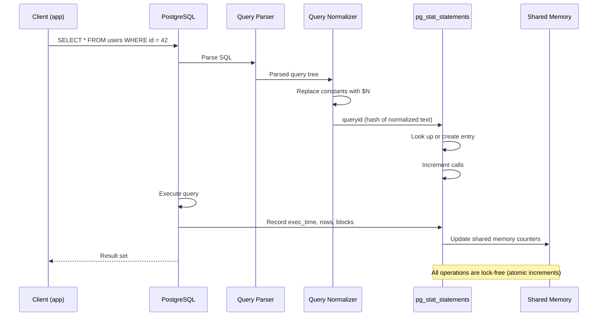

# Overview — Core Concept

`pg_stat_statements` is a PostgreSQL extension that tracks execution statistics for all SQL queries executed by the server. It captures planning time, execution time, rows returned, block I/O (cache hit ratio), and temporary file usage — all normalized by query structure.

## What pg_stat_statements tracks

| Metric | Column | Description |
|---|---|---|
| Query ID | `queryid` | Hash of normalized query text |
| Query text | `query` | Normalized SQL (constants replaced with $N) |
| Call count | `calls` | Number of times executed |
| Total time | `total_exec_time` | Cumulative execution time (ms) |
| Mean time | `mean_exec_time` | Average execution time (ms) |
| Min time | `min_exec_time` | Fastest execution (ms) |
| Max time | `max_exec_time` | Slowest execution (ms) |
| Stddev time | `stddev_exec_time` | Variability of execution time |
| Rows | `rows` | Total rows returned/affected |
| Shared blocks hit | `shared_blks_hit` | Cache hits |
| Shared blocks read | `shared_blks_read` | Disk reads |
| Shared blocks dirtied | `shared_blks_dirtied` | Pages modified |
| Shared blocks written | `shared_blks_written` | Pages written by bgwriter |
| Temp blocks | `temp_blks_read/written` | Temporary file usage |
| I/O timings | `blk_read_time/write_time` | Disk I/O time (if track_io_timing enabled) |
| WAL records | `wal_records` | WAL generated (PG 13+) |
| WAL FPI | `wal_fpi` | Full page images in WAL (PG 13+) |
| WAL bytes | `wal_bytes` | WAL size (PG 13+) |

## How normalization works

`pg_stat_statements` normalizes SQL by replacing literal values with parameter placeholders:

```sql
-- Raw queries executed:
SELECT * FROM users WHERE id = 42;
SELECT * FROM users WHERE id = 99;
SELECT * FROM users WHERE id = 7;

-- Stored as one normalized entry:
-- queryid: 1234567890
SELECT * FROM users WHERE id = $1;
-- calls: 3
```

This allows aggregating statistics across queries with the same structure but different values.

## Why this matters

- **Identify expensive queries**: Find queries consuming the most total time
- **Detect regressions**: Track `mean_exec_time` over time for known `queryid` values
- **Cache hit ratio**: Per-query `shared_blks_hit / (shared_blks_hit + shared_blks_read)` identifies queries with poor cache utilization
- **Temporary file abuse**: High `temp_blks_written` indicates sorts/hashes spilling to disk
- **Planning vs execution**: Separate planning and execution time tracking (PG 13+)

---

# Setup — Configuration

## Enabling pg_stat_statements

### Step 1: Modify postgresql.conf

```conf
# postgresql.conf
shared_preload_libraries = 'pg_stat_statements'

# Max number of distinct queries tracked (default 5000)
pg_stat_statements.max = 10000

# Track planning time separately (default false, PG 13+)
pg_stat_statements.track_planning = on

# Track IO timing (requires track_io_timing, adds overhead)
pg_stat_statements.track_io_timing = off

# Track utility commands (CREATE TABLE, VACUUM, etc.)
pg_stat_statements.track_utility = off

# Track top-level or nested statements
pg_stat_statements.track = top        # top-level only (recommended)
# pg_stat_statements.track = all       # includes nested (functions, procedures)

# Save on server shutdown (avoid losing data)
pg_stat_statements.save = on
```

### Step 2: Restart PostgreSQL

```bash
# Restart to load the shared library
pg_ctl restart

# Or on systemd systems
systemctl restart postgresql
```

### Step 3: Create the extension

```sql
-- Connect to the database where you want pg_stat_statements available
CREATE EXTENSION IF NOT EXISTS pg_stat_statements;

-- Verify installation
SELECT * FROM pg_stat_statements LIMIT 1;
```

The extension creates the `pg_stat_statements` view and the `pg_stat_statements_reset()` function. It must be created in each database where you want to view statistics.

## Configuration parameter details

| Parameter | Default | Recommended | Description |
|---|---|---|---|
| `pg_stat_statements.max` | 5000 | 10000-50000 | Max unique queries tracked |
| `pg_stat_statements.track` | top | top | `top` (only direct queries) or `all` (includes nested) |
| `pg_stat_statements.track_utility` | on | off | Track utility commands (DDL, VACUUM) |
| `pg_stat_statements.track_planning` | off | on | Track planning time separately (PG 13+) |
| `pg_stat_statements.save` | on | on | Save to disk on shutdown |
| `track_io_timing` | off | off | Enable disk I/O timing (adds overhead) |

### When to increase pg_stat_statements.max

```
pg_stat_statements usage % = count of tracked queries / max
If usage > 80%: old queries are being evicted to make room.
    → Increase max or reset periodic y to keep only recent data.
```

## Creating the extension in multiple databases

```sql
-- Run in each database where you need stats
\c myapp_dev
CREATE EXTENSION pg_stat_statements;

\c myapp_staging
CREATE EXTENSION pg_stat_statements;

\c myapp_prod
CREATE EXTENSION pg_stat_statements;
```

### Check which databases have the extension

```sql
SELECT
    e.extname,
    d.datname
FROM pg_extension e
JOIN pg_database d ON d.oid = e.extrelocatable
WHERE e.extname = 'pg_stat_statements';
```

## Verifying pg_stat_statements is active

```sql
-- Check that the view exists and has data
SELECT
    count(*) AS total_queries,
    sum(calls) AS total_calls,
    sum(total_exec_time) AS total_time_ms
FROM pg_stat_statements;

-- Check that shared_preload_libraries includes pg_stat_statements
SHOW shared_preload_libraries;
```

---

# Basic Usage — Getting Started

## Top queries by total execution time

```sql
SELECT
    queryid,
    query,
    calls,
    round(total_exec_time::numeric, 2) AS total_time_ms,
    round(mean_exec_time::numeric, 2) AS avg_time_ms,
    round((100 * total_exec_time / sum(total_exec_time) OVER ())::numeric, 2) AS time_pct,
    rows,
    round(rows::numeric / NULLIF(calls, 0), 2) AS avg_rows
FROM pg_stat_statements
ORDER BY total_exec_time DESC
LIMIT 20;
```

### Example output

```
queryid    | query                          | calls | total_time_ms | avg_time_ms | time_pct | rows
-----------+--------------------------------+-------+---------------+---------------+----------+------
1234567890 | SELECT * FROM orders WHERE ... | 15842 |   1258342.50  |     79.43   |  35.20   | 15842
2345678901 | INSERT INTO orders (...)        |  8421 |    584321.20  |     69.37   |  16.34   |  8421
3456789012 | SELECT * FROM products WHERE .. |  4210 |    321456.80  |     76.36   |   8.99   | 42100
```

## Top queries by mean execution time (slowest average)

```sql
SELECT
    queryid,
    query,
    calls,
    round(mean_exec_time::numeric, 2) AS avg_time_ms,
    round(min_exec_time::numeric, 2) AS min_time_ms,
    round(max_exec_time::numeric, 2) AS max_time_ms,
    round(stddev_exec_time::numeric, 2) AS stddev_ms
FROM pg_stat_statements
WHERE calls > 100  -- Filter out rare queries for meaningful averages
ORDER BY mean_exec_time DESC
LIMIT 20;
```

## Top queries by call frequency (most executed)

```sql
SELECT
    queryid,
    query,
    calls,
    round(total_exec_time::numeric, 2) AS total_time_ms,
    round(mean_exec_time::numeric, 2) AS avg_time_ms,
    rows,
    round(rows::numeric / NULLIF(calls, 0), 2) AS rows_per_call
FROM pg_stat_statements
ORDER BY calls DESC
LIMIT 20;
```

## Cache hit ratio per query

```sql
SELECT
    queryid,
    query,
    calls,
    shared_blks_hit,
    shared_blks_read,
    round(100.0 * shared_blks_hit / NULLIF(shared_blks_hit + shared_blks_read, 0), 2) AS cache_hit_pct,
    round(total_exec_time::numeric, 2) AS total_time_ms
FROM pg_stat_statements
WHERE (shared_blks_hit + shared_blks_read) > 1000  -- Meaningful sample size
ORDER BY (shared_blks_hit::numeric / NULLIF(shared_blks_hit + shared_blks_read, 0)) ASC
LIMIT 20;
```

### Interpreting cache hit ratio

| Cache Hit % | Assessment | Action |
|---|---|---|
| > 99% | Excellent | Monitor for regressions |
| 95-99% | Good | Consider index tuning |
| 90-95% | Fair | Review query patterns, add indexes |
| < 90% | Poor | Investigate: missing indexes, bad query plan, insufficient shared_buffers |

## Queries with high disk I/O

```sql
SELECT
    queryid,
    query,
    calls,
    shared_blks_read AS disk_reads,
    round(total_exec_time::numeric, 2) AS total_time_ms,
    round(mean_exec_time::numeric, 2) AS avg_time_ms
FROM pg_stat_statements
ORDER BY shared_blks_read DESC
LIMIT 20;
```

## Queries using temporary files (disk sorts/hashes)

```sql
SELECT
    queryid,
    query,
    calls,
    temp_blks_written,
    round(total_exec_time::numeric, 2) AS total_time_ms,
    round(mean_exec_time::numeric, 2) AS avg_time_ms
FROM pg_stat_statements
WHERE temp_blks_written > 0
ORDER BY temp_blks_written DESC
LIMIT 20;
```

### Why temp blocks matter

Temporary blocks indicate that PostgreSQL spilled sort, hash, or aggregation data to disk because `work_mem` was insufficient. This is orders of magnitude slower than in-memory operations.

```sql
-- Check current work_mem setting
SHOW work_mem;
-- Typical: 4MB (too low for large sorts)
-- Recommended: 16-64MB depending on workload
```

## Queries by rows per call (data volume)

```sql
SELECT
    queryid,
    query,
    calls,
    rows,
    round(rows::numeric / NULLIF(calls, 0), 2) AS rows_per_call,
    round(total_exec_time::numeric, 2) AS total_time_ms
FROM pg_stat_statements
ORDER BY rows DESC
LIMIT 20;
```

## Planning time analysis (PG 13+)

```sql
SELECT
    queryid,
    query,
    calls,
    round(total_plan_time::numeric, 2) AS total_plan_ms,
    round(mean_plan_time::numeric, 2) AS avg_plan_ms,
    round(total_exec_time::numeric, 2) AS total_exec_ms,
    round(mean_exec_time::numeric, 2) AS avg_exec_ms
FROM pg_stat_statements
WHERE calls > 100 AND total_plan_time > 0
ORDER BY total_plan_time DESC
LIMIT 20;
```

### Queries with slow planning relative to execution

```sql
SELECT
    queryid,
    query,
    calls,
    round(mean_plan_time::numeric, 2) AS avg_plan_ms,
    round(mean_exec_time::numeric, 2) AS avg_exec_ms,
    round((mean_plan_time / NULLIF(mean_plan_time + mean_exec_time, 0) * 100)::numeric, 2) AS plan_pct
FROM pg_stat_statements
WHERE calls > 100 AND mean_plan_time > 1
ORDER BY plan_pct DESC
LIMIT 20;
```

## WAL analysis (PG 13+)

```sql
SELECT
    queryid,
    query,
    calls,
    wal_bytes,
    wal_records,
    wal_fpi,
    round(wal_bytes::numeric / NULLIF(calls, 0), 2) AS avg_wal_bytes_per_call
FROM pg_stat_statements
WHERE wal_bytes > 0
ORDER BY wal_bytes DESC
LIMIT 20;
```

---

# Advanced Usage — Patterns

## Monitoring query performance over time

```sql
-- Create a snapshot table to track changes
CREATE TABLE query_stats_snapshot AS
SELECT
    now() AS captured_at,
    queryid,
    query,
    calls,
    total_exec_time,
    mean_exec_time,
    rows,
    shared_blks_hit,
    shared_blks_read
FROM pg_stat_statements;

-- Later: compare current state with snapshot
SELECT
    s.queryid,
    s.query,
    s.calls AS prev_calls,
    t.calls AS cur_calls,
    t.calls - s.calls AS new_calls,
    s.mean_exec_time AS prev_avg_ms,
    t.mean_exec_time AS cur_avg_ms,
    round((t.mean_exec_time - s.mean_exec_time)::numeric, 2) AS avg_change_ms
FROM query_stats_snapshot s
JOIN pg_stat_statements t ON t.queryid = s.queryid
WHERE ABS(t.mean_exec_time - s.mean_exec_time) > 5  -- Significant change
  AND t.calls > s.calls  -- Has been executed since snapshot
ORDER BY avg_change_ms DESC;
```

## Creating a baseline

```sql
-- Before a deployment or known workload change
SELECT * INTO query_stats_baseline_2026_06_01
FROM pg_stat_statements;

-- After change
SELECT
    b.queryid,
    b.query,
    b.calls AS baseline_calls,
    b.mean_exec_time AS baseline_avg_ms,
    b.total_exec_time AS baseline_total_ms,
    a.calls AS current_calls,
    a.mean_exec_time AS current_avg_ms,
    a.total_exec_time AS current_total_ms,
    round(
        (a.mean_exec_time - b.mean_exec_time) / NULLIF(b.mean_exec_time, 0) * 100,
        2
    ) AS avg_time_change_pct
FROM query_stats_baseline_2026_06_01 b
JOIN pg_stat_statements a ON a.queryid = b.queryid
WHERE a.calls > b.calls
ORDER BY avg_time_change_pct DESC
LIMIT 20;
```

## Finding queries with high variance (unstable performance)

```sql
SELECT
    queryid,
    query,
    calls,
    round(mean_exec_time::numeric, 2) AS avg_time_ms,
    round(stddev_exec_time::numeric, 2) AS stddev_ms,
    round((stddev_exec_time / NULLIF(mean_exec_time, 0))::numeric, 4) AS coefficient_of_variation
FROM pg_stat_statements
WHERE calls > 100 AND mean_exec_time > 5
ORDER BY coefficient_of_variation DESC
LIMIT 20;
```

High coefficient of variation (> 1.0) suggests inconsistent performance — likely due to parameter sniffing, cache state differences, or concurrency effects.

## Tracking query trends with a periodic snapshot script

```sql
-- Run every hour via cron/pg_cron
CREATE TABLE query_stat_history (
    captured_at timestamptz DEFAULT now(),
    queryid bigint,
    query text,
    calls bigint,
    total_exec_time double precision,
    mean_exec_time double precision,
    rows bigint,
    shared_blks_hit bigint,
    shared_blks_read bigint
);

-- Insert current snapshot
INSERT INTO query_stat_history (
    captured_at, queryid, query, calls,
    total_exec_time, mean_exec_time, rows,
    shared_blks_hit, shared_blks_read
)
SELECT
    now(), queryid, query, calls,
    total_exec_time, mean_exec_time, rows,
    shared_blks_hit, shared_blks_read
FROM pg_stat_statements;
```

### Analyzing trend data

```sql
-- Hourly rate of change for top queries
WITH hourly AS (
    SELECT
        date_trunc('hour', captured_at) AS hour,
        queryid,
        max(calls) - min(calls) AS calls_delta,
        max(total_exec_time) - min(total_exec_time) AS time_delta_ms
    FROM query_stat_history
    WHERE captured_at > now() - interval '7 days'
    GROUP BY date_trunc('hour', captured_at), queryid
)
SELECT
    p.queryid,
    p.query,
    round(avg(h.calls_delta)::numeric, 1) AS avg_calls_per_hour,
    round(avg(h.time_delta_ms)::numeric, 1) AS avg_ms_per_hour,
    round(avg(h.time_delta_ms) / NULLIF(avg(h.calls_delta), 0)::numeric, 2) AS avg_ms_per_call
FROM hourly h
JOIN pg_stat_statements p ON p.queryid = h.queryid
GROUP BY p.queryid, p.query
ORDER BY avg_ms_per_hour DESC
LIMIT 20;
```

## Finding queries with poor row estimate accuracy

Pair `pg_stat_statements` with `EXPLAIN` to compare estimated vs actual rows:

```sql
-- For a specific queryid, run EXPLAIN (ANALYZE, BUFFERS)
-- Then compare with pg_stat_statements rows count:
SELECT
    calls,
    rows,
    round(rows::numeric / NULLIF(calls, 0), 2) AS actual_avg_rows
FROM pg_stat_statements
WHERE queryid = 1234567890;
```

## Identifying high-frequency low-duration queries

```sql
-- "Fast but frequent" — micro-queries that add up
SELECT
    queryid,
    query,
    calls,
    round(mean_exec_time::numeric, 3) AS avg_time_ms,
    round(total_exec_time::numeric, 2) AS total_time_ms,
    round(rows::numeric / NULLIF(calls, 0), 2) AS avg_rows
FROM pg_stat_statements
WHERE mean_exec_time < 1     -- Sub-millisecond average
  AND calls > 10000          -- But called very often
ORDER BY total_exec_time DESC
LIMIT 20;
```

## Per-user query statistics

```sql
SELECT
    s.queryid,
    s.query,
    s.calls,
    s.total_exec_time,
    s.rows,
    u.usename
FROM pg_stat_statements s
JOIN pg_stat_user_indexes i ON ...  -- Cross-reference with user info if needed
-- Note: pg_stat_statements does NOT track per-user data
-- Use pg_stat_activity for per-connection monitoring
```

## Joining pg_stat_statements with other views

### With pg_stat_user_tables

```sql
SELECT
    s.queryid,
    s.query,
    s.calls,
    s.total_exec_time,
    t.n_tup_ins,
    t.n_tup_upd,
    t.n_tup_del,
    t.seq_scan,
    t.idx_scan
FROM pg_stat_statements s
CROSS JOIN pg_stat_user_tables t
WHERE s.query ILIKE '%' || t.relname || '%'
ORDER BY s.total_exec_time DESC;
```

### With pg_class for table size context

```sql
SELECT
    s.queryid,
    s.query,
    s.calls,
    s.total_exec_time,
    s.shared_blks_read,
    c.relname,
    pg_size_pretty(pg_relation_size(c.oid)) AS table_size
FROM pg_stat_statements s
JOIN pg_class c ON c.relname = split_part(s.query, ' ', 4)  -- Simple heuristic
ORDER BY s.total_exec_time DESC;
```

---

# Architecture — How It Works

## Data collection flow



## Shared memory architecture

`pg_stat_statements` stores data in PostgreSQL shared memory:

```
PostgreSQL Shared Memory
├── bgwriter
├── walwriter
├── checkpointer
├── pg_stat_statements (hash table)
│   ├── Entry 1: queryid=123, text="SELECT * FROM users WHERE id = $1"
│   │   ├── calls (atomic int64)
│   │   ├── total_exec_time (atomic double)
│   │   ├── min_exec_time
│   │   ├── max_exec_time
│   │   ├── sum_var_exec_time (for stddev)
│   │   ├── rows (atomic int64)
│   │   ├── shared_blks_hit/read
│   │   ├── local_blks_hit/read
│   │   ├── temp_blks_read/written
│   │   └── ...
│   ├── Entry 2: queryid=456, ...
│   └── Entry 3: ...
└── ...
```

## Normalization process

The query normalization pipeline:

```
Raw SQL: "SELECT * FROM orders WHERE customer_id = 42 AND status = 'shipped'"
                          │
                          ▼
Lexer/Tokenizer: Identifies constants (42, 'shipped') and identifiers
                          │
                          ▼
Normalizer: Replaces constants with $N parameters
                          │
                          ▼
Normalized: "SELECT * FROM orders WHERE customer_id = $1 AND status = $2"
                          │
                          ▼
Hash function: FNV-1a or similar → queryid (64-bit integer)
                          │
                          ▼
pg_stat_statements hash table: queryid → statistics entry
```

### What gets normalized

```sql
-- These all normalize to the same entry:
SELECT * FROM products WHERE id = 42;
SELECT * FROM products WHERE id = 99;
SELECT * FROM products WHERE id = 7;

-- Normalized: SELECT * FROM products WHERE id = $1

-- These also normalize together:
INSERT INTO orders (user_id, total) VALUES (1, 99.99);
INSERT INTO orders (user_id, total) VALUES (2, 150.00);

-- Normalized: INSERT INTO orders (user_id, total) VALUES ($1, $2)
```

### What does NOT normalize together

```sql
-- Different column structure → different normalized text
SELECT * FROM products WHERE id = 42;
SELECT id, name FROM products WHERE id = 42;

-- Different operators → different normalized text
SELECT * FROM products WHERE id = 42;
SELECT * FROM products WHERE id > 42;

-- Different table names → different normalized text
SELECT * FROM products WHERE id = 42;
SELECT * FROM orders WHERE id = 42;

-- Different comment → same normalized text (comments stripped)
SELECT * FROM products WHERE id = 42;  -- my comment
SELECT * FROM products WHERE id = 99;  -- another comment
```

## The queryid hash

The `queryid` is a 64-bit integer computed from the normalized query tree (not the text). This means:
- Different formatting → same queryid
- Different comments → same queryid
- Different constant values → same queryid
- Different column order in SELECT list → DIFFERENT queryid
- Different JOIN type → DIFFERENT queryid

### queryid stability

```sql
-- queryid is STABLE across:
--   - Server restarts (same PostgreSQL version)
--   - Different databases (same query structure)
--   - Different users

-- queryid CHANGES when:
--   - PostgreSQL major version changes
--   - Query structure changes (added columns, different WHERE clause)
--   - Extension version changes
```

## Eviction policy

When the hash table is full (tracked queries = `pg_stat_statements.max`), the least-executed query (by `calls`) is evicted to make room for new queries.

```
Entry evicted ← lowest calls count
                     │
                     ▼
Hash table at capacity (max = 10000)
                     │
                     ▼
New query enters → evicts the entry with fewest calls
```

This means:
- High-frequency queries stay in the table
- Rare queries are quickly evicted
- If a query stops being executed, it will eventually be evicted

## Reset mechanism

```sql
-- Reset all statistics for all queries
SELECT pg_stat_statements_reset();

-- Reset statistics for a specific query (PG 13+)
SELECT pg_stat_statements_reset(1234567890);

-- Reset statistics for specific database (PG 14+)
SELECT pg_stat_statements_reset(NULL, NULL, current_database());
```

When reset:
- All counters for the specified queries are zeroed
- Entries are NOT removed — only counters reset
- New calls start counting from zero

## Saving across restarts

When `pg_stat_statements.save = on`:
1. PostgreSQL shutdown: Shared memory stats written to `$PGDATA/pg_stat/pg_stat_statements.stat`
2. PostgreSQL startup: Stats loaded from file into shared memory

### File location

```
$PGDATA/
├── pg_stat/
│   └── pg_stat_statements.stat    ← Serialized stats
├── postgresql.conf
└── ...
```

### Why data can be lost

- Crash (unclean shutdown): `.stat` file may be stale or missing
- `pg_stat_statements.save = off`: No save on shutdown
- Manual shutdown without proper stop sequence
- File system issues

---

# Production — Deployment

## Storage quota considerations

### Monitoring usage

```sql
-- Check how many unique queries are tracked
SELECT
    count(*) AS tracked_queries,
    current_setting('pg_stat_statements.max')::int AS max_queries,
    round(
        100.0 * count(*) / current_setting('pg_stat_statements.max')::int,
        2
    ) AS usage_pct
FROM pg_stat_statements;
```

### When to increase max

```sql
-- If usage_pct > 80%, increase pg_stat_statements.max in postgresql.conf
-- Set to 20000 or higher depending on query diversity
-- Requires restart

-- Alternative: Reset periodically (e.g., daily via cron)
-- SELECT pg_stat_statements_reset();
```

## Reset strategy

### Daily reset

```sql
-- Run via cron or pg_cron at 3 AM daily
SELECT pg_stat_statements_reset();
```

### Rolling window reset

```sql
-- Keep only last N hours of data by resetting periodically
-- e.g., every 4 hours
SELECT pg_stat_statements_reset();
```

### Selective reset (PG 13+)

```sql
-- Reset only specific known-heavy queries
SELECT pg_stat_statements_reset(queryid)
FROM pg_stat_statements
WHERE query ~* 'temp_blks_written > 0';
```

## Performance overhead

### Measured overhead

| Workload | Overhead |
|---|---|
| OLTP (simple queries, high throughput) | 2-5% |
| OLAP (complex queries, lower throughput) | 1-3% |
| Mixed workload | 2-4% |
| With track_io_timing = on | +3-5% additional |

### Factors affecting overhead

- **`track_io_timing`**: Most expensive (calls `gettimeofday` per block I/O)
- **`track_planning`**: Moderate (adds planning time tracking)
- **`track = all`**: Higher (counts nested statements in functions/triggers)
- **High query diversity**: More hash table lookups

### Reducing overhead in production

```conf
# Low-overhead configuration
pg_stat_statements.max = 10000
pg_stat_statements.track = top
pg_stat_statements.track_utility = off
pg_stat_statements.track_planning = off
pg_stat_statements.track_io_timing = off
pg_stat_statements.save = on
```

## Monitoring and alerting

### Alert on query regression

```sql
-- Run this periodically to detect queries that have slowed down
-- Compare current mean_exec_time with expected baseline
SELECT
    queryid,
    query,
    calls,
    round(mean_exec_time::numeric, 2) AS current_avg_ms,
    round(min_exec_time::numeric, 2) AS min_ms,
    round(max_exec_time::numeric, 2) AS max_ms
FROM pg_stat_statements
WHERE calls > 100
  AND mean_exec_time > 1000  -- Queries averaging > 1 second
ORDER BY mean_exec_time DESC;
```

### Alert on high temp file usage

```sql
-- Queries that spill to disk (need work_mem increase)
SELECT
    queryid,
    query,
    calls,
    temp_blks_written,
    round(total_exec_time::numeric, 2) AS total_time_ms
FROM pg_stat_statements
WHERE temp_blks_written > 0
ORDER BY temp_blks_written DESC
LIMIT 10;
```

### Alert on low cache hit ratio

```sql
SELECT
    queryid,
    query,
    calls,
    shared_blks_hit,
    shared_blks_read,
    round(
        100.0 * shared_blks_hit / NULLIF(shared_blks_hit + shared_blks_read, 0),
        2
    ) AS cache_hit_pct
FROM pg_stat_statements
WHERE (shared_blks_hit + shared_blks_read) > 10000
  AND shared_blks_hit::numeric / NULLIF(shared_blks_hit + shared_blks_read, 0) < 0.95
ORDER BY cache_hit_pct ASC
LIMIT 20;
```

## Integration with monitoring tools

### Prometheus

```sql
-- Export pg_stat_statements metrics to Prometheus via postgres_exporter
-- Configure postgres_exporter queries:
queries:
  pg_stat_statements:
    query: |
      SELECT
        queryid,
        query,
        calls,
        total_exec_time,
        mean_exec_time,
        rows,
        shared_blks_hit,
        shared_blks_read
      FROM pg_stat_statements
    metrics:
      - calls: { usage: "COUNTER" }
      - total_exec_time: { usage: "COUNTER" }
      - mean_exec_time: { usage: "GAUGE" }
      - rows: { usage: "COUNTER" }
```

### pg_stat_statements in Grafana

Recommended panels:
- Top queries by total time (bar chart)
- Query performance over time (time series)
- Cache hit ratio by query (heatmap)
- Calls per second (time series)
- Average execution time distribution (histogram)

### pgbadger

```bash
# pgbadger parses PostgreSQL logs — use alongside pg_stat_statements
# pg_stat_statements gives aggregated stats
# pgbadger gives per-event details with plans (via auto_explain)

pgbadger /var/log/postgresql/postgresql.log -o report.html
```

---

# Gotchas — Common Pitfalls

## pg_stat_statements.max default is too low

Default: 5000. On a busy production server with many different query variants:
- 5000 entries fill up quickly
- Old entries get evicted even if they're important
- High-cardinality queries (different constants = same queryid is fine, but different structures = different queryids)

```sql
-- Check if max is too low
SELECT
    count(*) AS current_tracked,
    current_setting('pg_stat_statements.max')::int AS max_allowed
FROM pg_stat_statements;

-- If count is near max_allowed, increase in postgresql.conf
-- pg_stat_statements.max = 20000
-- Requires restart
```

## Query text truncated at 1024 bytes

By default, `pg_stat_statements` truncates the `query` column at 1024 bytes. For very long queries (dynamic SQL, large IN lists, ORM-generated queries), the stored text is incomplete.

```sql
-- Check truncated queries
SELECT
    queryid,
    length(query) AS query_length,
    query
FROM pg_stat_statements
WHERE length(query) >= 1024
LIMIT 10;
```

### Workarounds

1. **Increase track_activity_query_size**: Set to 4096 or higher in `postgresql.conf`
   ```
   track_activity_query_size = 4096
   ```
   Note: This is a server-wide setting, not specific to pg_stat_statements.

2. **Use queryid for identification**: Even with truncated text, the `queryid` uniquely identifies the query structure.

3. **Combine with auto_explain**: Use `auto_explain` for full query plans which are logged in full.

## pg_stat_statements reset on restart (not persistent)

When PostgreSQL restarts:
- Clean shutdown with `save = on`: Data is saved to disk and reloaded
- Crash/unclean shutdown: Data is lost (stale or missing .stat file)
- `save = off`: Always lost on restart

### Mitigation

```sql
-- Before a planned restart, save the data
CREATE TABLE pg_stat_statements_backup AS SELECT * FROM pg_stat_statements;

-- After restart, compare
SELECT
    b.queryid,
    b.query,
    b.calls AS calls_before,
    b.total_exec_time AS time_before_ms,
    COALESCE(a.calls, 0) AS calls_after,
    COALESCE(a.total_exec_time, 0) AS time_after_ms
FROM pg_stat_statements_backup b
LEFT JOIN pg_stat_statements a ON a.queryid = b.queryid
ORDER BY b.total_exec_time DESC;
```

## Overhead considerations under heavy query load

```conf
# High overhead configuration (verbose):
pg_stat_statements.track_planning = on
pg_stat_statements.track_io_timing = on
pg_stat_statements.track = all
# → 5-10% overhead on busy servers

# Low overhead configuration (recommended for production):
pg_stat_statements.track_planning = off
pg_stat_statements.track_io_timing = off
pg_stat_statements.track = top
pg_stat_statements.track_utility = off
# → 1-3% overhead
```

## High-cardinality queries (different constant values = same queryid)

Since `pg_stat_statements` normalizes constants, queries with identical structure but different constant values occupy ONE entry. This is usually desired:

```sql
-- Both map to the same queryid:
SELECT * FROM products WHERE category = 'electronics';    -- $1 = 'electronics'
SELECT * FROM products WHERE category = 'books';          -- $1 = 'books'

-- Same queryid, same row in pg_stat_statements
-- calls = 2 (aggregated)
```

### The gotcha

If a query has different performance characteristics depending on the constant value (parameter sniffing), the aggregated statistics hide this. Example:

```sql
-- Query with $1 = 1 (1 row returned, fast, 1ms)
SELECT * FROM orders WHERE customer_id = 1;

-- Query with $1 = 99999 (50000 rows returned, slow, 5000ms)
SELECT * FROM orders WHERE customer_id = 99999;

-- pg_stat_statements shows: mean_exec_time = 2500.5ms, min = 1ms, max = 5000ms
-- The average is misleading — it's a bimodal distribution
```

### Detecting parameter sniffing issues

```sql
-- High stddev relative to mean = possible parameter sniffing
SELECT
    queryid,
    query,
    calls,
    round(mean_exec_time::numeric, 2) AS avg_ms,
    round(min_exec_time::numeric, 2) AS min_ms,
    round(max_exec_time::numeric, 2) AS max_ms,
    round(stddev_exec_time::numeric, 2) AS stddev_ms
FROM pg_stat_statements
WHERE calls > 100
  AND stddev_exec_time > mean_exec_time * 2  -- stddev > 2x mean
ORDER BY stddev_ms DESC;
```

## pg_stat_statements does NOT show per-connection data

`pg_stat_statements` aggregates across ALL connections and ALL databases. There is no breakdown by:
- User
- Application name
- Connection
- Session
- Database (queryid collision across databases)

### Workaround for per-database stats

```sql
-- Create extension per database, reset per database
-- But the shared memory is shared — entries are global

-- Use pg_stat_statements with database filter
SELECT
    s.queryid,
    s.query,
    s.calls,
    s.total_exec_time
FROM pg_stat_statements s
WHERE s.dbid = (SELECT oid FROM pg_database WHERE datname = current_database());
-- Note: dbid column available in PG 14+
```

## Truncated queries cannot be reconstructed

The `query` column stores only the first N bytes (default 1024). For queries longer than this:
- The text is truncated
- The `queryid` is still correct (hash is computed from full query tree, not text)
- You cannot recover the full SQL from pg_stat_statements

### If you need full query text

```sql
-- Enable logging for those queries
-- In postgresql.conf:
log_min_duration_statement = 1000  -- Log all queries taking > 1 second
log_line_prefix = '%t [%p]: [%l-%b] user=%u,db=%d,queryid=%Q '
```

The `%Q` log line prefix (PG 12+) includes the `queryid`, allowing you to correlate log entries with pg_stat_statements entries.

## pg_stat_statements and prepared statements

```sql
-- Prepared statements are tracked as:
PREPARE get_user(INT) AS SELECT * FROM users WHERE id = $1;
EXECUTE get_user(42);
EXECUTE get_user(99);

-- pg_stat_statements shows:
-- queryid: xyz, query: SELECT * FROM users WHERE id = $1
-- Calls from EXECUTE are counted

-- But the PREPARE itself is counted only if track_utility = on
```

## pg_stat_statements with statement_timeout

```sql
-- Queries that hit statement_timeout are still tracked
-- Total time includes the partial execution time
-- calls is still incremented
-- rows may be incomplete

-- Identify timed-out queries:
SELECT
    queryid,
    query,
    calls,
    round(min_exec_time::numeric, 2) AS min_ms,
    round(max_exec_time::numeric, 2) AS max_ms,
    round(mean_exec_time::numeric, 2) AS avg_ms
FROM pg_stat_statements
WHERE max_exec_time > 30000  -- 30 seconds — likely hit timeout
ORDER BY max_exec_time DESC;
```

## queryid collisions

The `queryid` is a 64-bit hash — collisions are theoretically possible but extremely rare in practice. If you suspect a collision:
- Compare the `query` text
- Different queries with the same `queryid` but different text = collision

PostgreSQL 14+ added `queryid` collision detection warnings in the server log.

## pg_stat_statements in read replicas

On PostgreSQL read replicas:
- `pg_stat_statements` data is local to each replica
- Data is NOT replicated from primary
- Each replica tracks its own queries independently

```sql
-- On primary: shows primary workload
-- On replica: shows read-only workload (SELECT queries)
```

## Resetting destroys historical trends

`pg_stat_statements_reset()` zeroes all counters. Historical trend data is lost unless you've saved snapshots.

```sql
-- Before resetting, save the data
CREATE TABLE pg_stat_statements_pre_reset AS SELECT * FROM pg_stat_statements;
SELECT pg_stat_statements_reset();
```

## Extension not tracking any queries

If `pg_stat_statements` shows zero rows or zero calls:

```sql
-- Check 1: Is the extension created?
SELECT * FROM pg_extension WHERE extname = 'pg_stat_statements';

-- Check 2: Is the library loaded?
SHOW shared_preload_libraries;

-- Check 3: Any queries executed since install?
SELECT count(*) FROM pg_stat_statements;

-- Check 4: Check if pg_stat_statements.track = none
SHOW pg_stat_statements.track;
-- Should be 'top' or 'all', not 'none'

-- Check 5: Is the user a superuser?
-- Non-superusers need pg_stat_statements granted to their role
```

---

# Related — Connected Notes

## Prerequisites

### 8.436 — PostgreSQL — VACUUM and ANALYZE
VACUUM and ANALYZE directly affect query performance and statistics. `pg_stat_statements` can help identify tables that need VACUUM or ANALYZE (queries with high shared_blks_read suggest stale statistics).

### 8.440 — PostgreSQL — EXPLAIN and EXPLAIN ANALYZE
EXPLAIN provides per-query plan analysis that complements pg_stat_statements' aggregated view. Use EXPLAIN to investigate specific queryids identified by pg_stat_statements.

## Related Notes

### 8.935 — auto_explain — PostgreSQL Slow Query Plans
auto_explain logs execution plans for slow queries. Combine with pg_stat_statements to correlate query statistics with actual query plans for the same queryid.

### 8.916 — SQL Server Monitoring — Key Metrics
SQL Server's equivalent of pg_stat_statements — DMV-based query performance monitoring.

### 8.917 — Wait Statistics — Top Waits Analysis
Wait statistics analysis complements query statistics by showing what queries are waiting on (IO, locks, CPU).

## Complementary tools

| Tool | Purpose | When to Use |
|---|---|---|
| pg_stat_statements | Aggregated query statistics | Always-on monitoring |
| auto_explain | Per-query execution plans | Slow query investigation |
| EXPLAIN ANALYZE | Ad-hoc plan analysis | Specific query debugging |
| pgbadger | Log analysis | Weekly/monthly reporting |
| pg_stat_activity | Current running queries | Real-time troubleshooting |

---

# References — Further Reading

## Official documentation

- PostgreSQL pg_stat_statements docs: https://www.postgresql.org/docs/current/pgstatstatements.html
- PostgreSQL runtime statistics: https://www.postgresql.org/docs/current/monitoring-stats.html
- PostgreSQL configuration: https://www.postgresql.org/docs/current/runtime-config-statistics.html

## Useful queries reference

```sql
-- Top 10 by total time
SELECT queryid, query, calls, round(total_exec_time::numeric, 2) AS time
FROM pg_stat_statements
ORDER BY total_exec_time DESC LIMIT 10;

-- Top 10 by mean time (with minimum call threshold)
SELECT queryid, query, calls, round(mean_exec_time::numeric, 2) AS avg_ms
FROM pg_stat_statements WHERE calls > 100
ORDER BY mean_exec_time DESC LIMIT 10;

-- Top 10 by call frequency
SELECT queryid, query, calls, round(mean_exec_time::numeric, 3) AS avg_ms
FROM pg_stat_statements ORDER BY calls DESC LIMIT 10;

-- Queries with worst cache hit ratio
SELECT queryid, query, shared_blks_hit, shared_blks_read,
    round(100.0 * shared_blks_hit / NULLIF(shared_blks_hit + shared_blks_read, 0), 2) AS hit_pct
FROM pg_stat_statements WHERE (shared_blks_hit + shared_blks_read) > 0
ORDER BY hit_pct ASC LIMIT 10;

-- Reset and start fresh
SELECT pg_stat_statements_reset();
```

## Blog posts and articles

- "Understanding pg_stat_statements" — PostgreSQL Wiki
- "Query Performance Monitoring with pg_stat_statements" — Severalnines
- "pg_stat_statements Deep Dive" — Crunchy Data Blog
- "Monitoring PostgreSQL with pg_stat_statements" — Timescale Blog
- "Finding Slow Queries with pg_stat_statements" — Citus Data Blog

## Version-specific notes

| PostgreSQL Version | Key Features |
|---|---|
| 9.2 | Initial pg_stat_statements (basic timing, rows, blocks) |
| 9.4 | Calls, rows, shared/local/temp block stats |
| 12 | queryid in log_line_prefix (%Q) |
| 13 | Planning time tracking (track_planning), WAL stats |
| 14 | dbid and userid columns, selective reset |
| 15 | JIT compilation stats, toplevel flag |
| 16 | I/O timing for temporary blocks |

## Monitoring checklist

- [ ] pg_stat_statements configured in shared_preload_libraries
- [ ] Extension created in target databases
- [ ] pg_stat_statements.max set appropriately (≥ 10000 for production)
- [ ] track = top (avoid overhead of nested tracking)
- [ ] track_utility = off (avoid DDL pollution)
- [ ] track_planning = on for PG 13+ (worth the overhead)
- [ ] track_io_timing = off unless investigating I/O issues
- [ ] save = on (preserve data across clean restarts)
- [ ] Snapshot script set up for historical trend data
- [ ] Alerting on: mean_exec_time spikes, high temp_blks, low cache hit
- [ ] Regular reset schedule (daily/weekly) to manage storage
