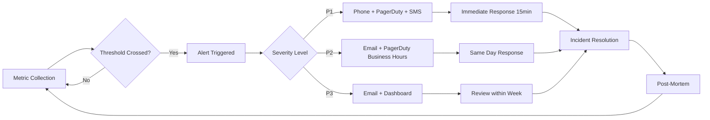

# 8.936 — Database Alerts — Threshold Configuration

## 1. Overview — Alerting Fundamentals

Database alerting is the practice of proactively monitoring database health metrics and notifying the operations team when predefined thresholds are breached. Effective alerts cover four core dimensions:

- **Availability** — Is the database up and accepting connections? Availability alerts are the highest priority and must be configured on every production instance. Without availability monitoring, outages go undetected until users report them. Availability checks include ping tests, connection attempts, and service status verification.

- **Performance** — Is the database slow? Performance alerts detect degradation before users are affected. These include query duration thresholds, wait statistics, CPU pressure, and blocking chain detection. Performance thresholds must be tuned per workload.

- **Capacity** — Is the database running out of space? Capacity alerts predict and prevent out-of-disk or out-of-space failures. They monitor disk free space, database file sizes, log file growth, and tempdb size. Capacity thresholds are based on growth trends.

- **Errors** — Are things breaking? Error alerts capture application exceptions, deadlocks, corruption, and system errors. These include error log monitoring, extended events for errors, and Agent job failure alerts.

Alerting philosophy centers on the principle of actionable alerts. Every alert should trigger a specific response. If an alert does not require action, it is noise. Noise leads to alert fatigue, which causes real issues to be ignored.

- Severity levels provide a framework for triage. Each severity defines response time, notification channel, and escalation path.
- Alert correlation groups related alerts together to reduce noise. For example, a disk space alert may also trigger database file growth alerts.
- Maintenance window suppression is critical. Alerts during planned maintenance must be suppressed to avoid false positives.
- Alert routing ensures the right team receives the notification. Database alerts go to DBA on-call, while application-facing alerts go to application support.

## 2. Severity Levels — P1, P2, P3 Classification

Severity levels define the urgency and response requirements for each alert. A consistent severity framework ensures that critical issues receive immediate attention while lower-priority issues are triaged during business hours.

### 2.1 Critical — P1 (Immediate Response)

P1 alerts indicate a service-impacting event that requires immediate action. Response time is within 15 minutes, 24x7x365. Notification channels include phone call, PagerDuty, SMS, and email.

- Database is down or unavailable — SQL Server service stopped, database in suspect/offline state, or network connectivity lost
- Complete disk failure — Data drive is full, database files cannot grow, transactions cannot commit
- Corruption detected — CHECKDB reports corruption, I/O errors in error log, page-level corruption detected
- Security breach — Unauthorized access detected, SQL injection attack in progress, audit failures
- Replication failure — Critical replication is broken, log reader agent failing, distributor out of space

### 2.2 Warning — P2 (Same Business Day)

P2 alerts indicate a potential issue that could become critical if not addressed. Response time is within 4 business hours. Notification channels include email and PagerDuty during business hours.

- Long-running queries exceeding threshold — Queries running longer than 30 seconds, blocking chains persisting
- High CPU or memory pressure — CPU consistently above 80%, memory pressure causing page life expectancy drop
- Disk space warning — Disk free space below 20%, log file growth events occurring
- Deadlock detection — Deadlock frequency exceeding baseline, application experiencing deadlock retries
- Backup failures — Backup job failed, backup file corrupted, backup destination full

### 2.3 Informational — P3 (Note)

P3 alerts provide visibility into the system without requiring immediate action. Response time is within 1 business week. Notification is typically email or dashboard update.

- Auto-growth events — Database files growing automatically (indicates misconfigured initial size)
- Index fragmentation — Fragmentation above 30% for indexes larger than 1000 pages
- Job duration changes — SQL Agent jobs taking longer than historical average
- Plan cache churn — High plan cache eviction rates indicating ad-hoc workloads
- Connection pool metrics — Pool utilization above 80%, pool fragmentation detected

### 2.4 Severity Assignment Guidelines

Rules for consistently assigning severity levels across all monitored databases:

- All production databases must have P1 and P2 alerts configured
- Development and test databases typically have P3 alerts only
- Severity may be elevated during blackout periods (e.g., end of quarter, holiday season)
- Business-critical databases may have stricter thresholds and faster escalation
- Severity should be documented in the runbook for each alert

## 3. Availability Alerts — Threshold Configuration

Availability alerts ensure that database downtime is detected and addressed immediately. These are the most critical alerts in any monitoring system.

### 3.1 Connection Failure Alerts

Connection failure alerts detect when the database engine is unreachable or not accepting connections. Implemented as a periodic connection test from the monitoring system.

- **Threshold**: 2 consecutive connection failures within 60 seconds
- **Check interval**: 30 seconds for critical databases, 60 seconds for standard databases
- **Response**: P1 — immediate escalation to on-call DBA
- **Implementation**: PowerShell Test-Connection combined with SqlConnection.Open()
- **False positive mitigation**: Retry logic with exponential backoff, verify from multiple monitoring agents

Connection failure detection script:

```powershell
$connectionString = "Server=target-server;Database=master;Integrated Security=SSPI;Connect Timeout=10"
try {
    $conn = New-Object System.Data.SqlClient.SqlConnection($connectionString)
    $conn.Open()
    $conn.Close()
    # Success — alert clears
} catch {
    # Failure — increment failure counter
    # Alert if 2 consecutive failures
}
```

### 3.2 SQL Server Agent Down

The SQL Server Agent is required for scheduled jobs, backups, and maintenance tasks. If the Agent service stops, critical operations fail silently.

- **Threshold**: SQL Agent service state is not "Running"
- **Check interval**: 5 minutes
- **Response**: P1 — Agent restart required, verify jobs are running
- **Implementation**: WMI query or T-SQL: SELECT * FROM sys.dm_server_services
- **Recovery**: Configure SQL Agent to auto-restart on failure in service properties

### 3.3 Database State Non-ONLINE

Databases can transition to OFFLINE, SUSPECT, RECOVERY_PENDING, or EMERGENCY states. Each non-ONLINE state requires specific recovery steps.

- **SUSPECT**: Database may be corrupted — run DBCC CHECKDB, restore from backup if needed
- **RECOVERY_PENDING**: Recovery cannot complete — check error log,可能需要 more disk space
- **OFFLINE**: Manually taken offline — verify with DBA team
- **EMERGENCY**: Single-user diagnostic mode — used for troubleshooting
- **Threshold**: Any database state is not ONLINE for more than 1 minute
- **Response**: P1 — immediate investigation, check error log for cause

Monitoring query:

```sql
SELECT name, state_desc, recovery_model_desc
FROM sys.databases
WHERE state <> 0  -- 0 = ONLINE
```

### 3.4 Service Broker and Endpoint Status

Service Broker endpoints and database mirroring endpoints must be healthy for distributed operations.

- **Threshold**: Endpoint state is not STARTED
- **Check interval**: 15 minutes
- **Response**: P2 — investigate endpoint configuration, restart if needed

### 3.5 AlwaysOn Availability Group Health

For SQL Server AlwaysOn deployments, availability group health is critical.

- **Threshold**: Any replica is not healthy, synchronization is not synchronizing
- **Check interval**: 1 minute
- **Response**: P1 — data loss risk, investigate replica state immediately
- **Key metrics**: synchronization_state, synchronization_health, rollback state

## 4. Performance Alerts — Threshold Configuration

Performance alerts detect when database response times degrade. Thresholds must be based on historical baselines rather than arbitrary values.

### 4.1 Long-Running Query Detection

Queries exceeding a duration threshold indicate either missing indexes, outdated statistics, or parameter sniffing issues.

- **Threshold**: Query duration > 30 seconds (adjustable per workload)
- **Check interval**: Continuous monitoring via Extended Events or Query Store
- **Response**: P2 — investigate query plan, check for blocking, update statistics
- **Implementation**: Extended Events session capturing sql_statement_completed and rpc_completed

Extended Events session for long-running queries:

```sql
CREATE EVENT SESSION [LongRunningQueries]
ON SERVER
ADD EVENT sqlserver.sql_statement_completed (
    ACTION (sqlserver.sql_text, sqlserver.session_id)
    WHERE duration > 30000000  -- 30 seconds in microseconds
),
ADD EVENT sqlserver.rpc_completed (
    ACTION (sqlserver.sql_text, sqlserver.session_id)
    WHERE duration > 30000000
)
ADD TARGET package0.event_file (SET filename = N'LongRunningQueries.xel');
```

### 4.2 Deadlock Detection

Deadlocks occur when two transactions compete for the same resources. Frequent deadlocks indicate application design issues.

- **Threshold**: Any deadlock detected (immediate alert), > 5 deadlocks per hour (escalated)
- **Check interval**: Continuous via deadlock graph capture
- **Response**: P2 — analyze deadlock graph, review application code for lock ordering
- **Implementation**: Extended Events for deadlock graph, system_health session captures deadlocks

Deadlock capture:

```sql
-- System_health session captures deadlocks by default
-- Query the deadlock graph from system_health
SELECT event_data.value('(event/data/deadlock)[1]', 'nvarchar(max)') AS deadlock_graph
FROM (
    SELECT CAST(target_data AS XML) AS target_data
    FROM sys.dm_xe_session_targets st
    JOIN sys.dm_xe_sessions s ON s.address = st.event_session_address
    WHERE s.name = 'system_health'
) AS tab
CROSS APPLY target_data.nodes('//event[@name="xml_deadlock_report"]') AS evt(event_data);
```

### 4.3 Blocking Chain Detection

Blocking chains indicate that one transaction holds locks that another transaction requires. Chains persisting longer than 30 seconds require investigation.

- **Threshold**: Blocking chain duration > 30 seconds
- **Check interval**: 15 seconds via sys.dm_exec_requests and sys.dm_tran_locks
- **Response**: P2 — identify head blocker, evaluate query, kill blocking session if critical
- **Implementation**: Custom monitoring job running blocking chain detection query

Blocking chain detection:

```sql
SELECT
    blocked.session_id AS blocked_session_id,
    blocker.session_id AS blocker_session_id,
    blocked.wait_time / 1000 AS blocking_duration_seconds,
    blocked.wait_type,
    blocked_text.text AS blocked_query,
    blocker_text.text AS blocker_query
FROM sys.dm_exec_requests blocked
JOIN sys.dm_exec_requests blocker
    ON blocked.blocking_session_id = blocker.session_id
CROSS APPLY sys.dm_exec_sql_text(blocked.sql_handle) blocked_text
CROSS APPLY sys.dm_exec_sql_text(blocker.sql_handle) blocker_text
WHERE blocked.blocking_session_id > 0
  AND blocked.wait_time > 30000;
```

### 4.4 CPU Pressure — High CPU Alert

Sustained high CPU indicates inefficient queries, missing indexes, or insufficient hardware.

- **Threshold**: CPU > 80% for 10 consecutive minutes
- **Check interval**: 1 minute
- **Response**: P2 — identify top CPU consumers via sys.dm_exec_query_stats
- **Implementation**: Performance monitor counter or T-SQL on sys.dm_os_ring_buffers

CPU monitoring:

```sql
SELECT
    record.value('(./Record/@id)[1]', 'int') AS record_id,
    record.value('(./Record/SchedulerMonitorEvent/SystemHealth/SystemIdle)[1]', 'int') AS system_idle,
    100 - record.value('(./Record/SchedulerMonitorEvent/SystemHealth/SystemIdle)[1]', 'int') AS cpu_usage
FROM (
    SELECT CAST(record AS XML) AS record
    FROM sys.dm_os_ring_buffers
    WHERE ring_buffer_type = N'RING_BUFFER_SCHEDULER_MONITOR'
) AS tab
ORDER BY record_id DESC;
```

### 4.5 Page Life Expectancy — Memory Pressure

Page Life Expectancy (PLE) indicates how long pages stay in the buffer pool. Low PLE values indicate memory pressure.

- **Threshold**: PLE < 300 seconds for 10 consecutive minutes
- **Check interval**: 1 minute
- **Response**: P2 — check for memory pressure, review buffer cache usage, add memory if needed
- **Note**: PLE varies by workload — baseline is essential

```sql
SELECT
    cntr_value AS page_life_expectancy
FROM sys.dm_os_performance_counters
WHERE counter_name = 'Page life expectancy';
```

### 4.6 PAGEIOLATCH — I/O Pressure Alert

PAGEIOLATCH waits indicate that queries are waiting for I/O operations to complete. High wait times suggest disk subsystem issues.

- **Threshold**: PAGEIOLATCH average wait time > 50ms averaged over 5 minutes
- **Check interval**: 1 minute
- **Response**: P2 — investigate disk performance, consider file separation, faster storage
- **Implementation**: sys.dm_os_wait_stats delta capture

```sql
SELECT
    wait_type,
    waiting_tasks_count,
    wait_time_ms,
    wait_time_ms / NULLIF(waiting_tasks_count, 0) AS avg_wait_ms,
    max_wait_time_ms,
    signal_wait_time_ms
FROM sys.dm_os_wait_stats
WHERE wait_type LIKE 'PAGEIOLATCH%'
  AND waiting_tasks_count > 0
ORDER BY wait_time_ms DESC;
```

## 5. Capacity Alerts — Threshold Configuration

Capacity alerts prevent out-of-space failures by warning when resources are running low. These alerts must account for growth rates, not just current utilization.

### 5.1 Disk Space Monitoring

Disk space is the most common capacity issue. Running out of disk space causes database crashes and transaction log issues.

- **Threshold**: Free space < 20% (Warning — P2), Free space < 10% (Critical — P1)
- **Check interval**: 5 minutes
- **Response**: P2 — investigate, extend disk or clean up files. P1 — emergency extension required
- **Implementation**: sys.dm_os_volume_stats provides disk space per drive

```sql
SELECT
    vs.volume_mount_point,
    vs.total_bytes / 1048576 AS total_mb,
    vs.available_bytes / 1048576 AS available_mb,
    (vs.available_bytes * 100.0 / vs.total_bytes) AS free_percent
FROM sys.master_files mf
CROSS APPLY sys.dm_os_volume_stats(mf.database_id, mf.file_id) vs
GROUP BY vs.volume_mount_point, vs.total_bytes, vs.available_bytes;
```

### 5.2 Log File Size Monitoring

Transaction log files grow with transaction activity. Uncontrolled growth indicates backup issues or long-running transactions.

- **Threshold**: Log file > 70% of total disk capacity, or log file > 100GB
- **Check interval**: 5 minutes
- **Response**: P2 — check log backup frequency, long-running transaction, VLF count
- **Implementation**: DBCC SQLPERF(LOGSPACE)

```sql
CREATE TABLE #log_space (
    database_name sysname,
    log_size_mb DECIMAL(18,2),
    log_space_used_percent DECIMAL(18,2),
    status INT
);

INSERT #log_space
EXEC ('DBCC SQLPERF(LOGSPACE)');

SELECT
    database_name,
    log_size_mb,
    log_space_used_percent
FROM #log_space
WHERE log_space_used_percent > 70;
```

### 5.3 Auto-Growth Event Detection

Auto-growth events degrade performance because they pause query execution during growth. Frequent auto-growth indicates misconfigured initial file sizes.

- **Threshold**: Any auto-growth event (P3 — informational), > 5 in 24 hours (P2 — warning)
- **Check interval**: Daily review of system_health or default trace
- **Response**: P3 — adjust initial file size to prevent future auto-growth
- **Implementation**: Default trace captures auto-growth events

```sql
SELECT
    te.name AS event_name,
    t.DatabaseName,
    t.FileName,
    t.StartTime,
    t.IntegerData AS growth_in_pages
FROM sys.fn_trace_gettable(
    (SELECT REVERSE(SUBSTRING(REVERSE(path), CHARINDEX('\', REVERSE(path)), 255)) + 'log.trc'
     FROM sys.traces WHERE is_default = 1), DEFAULT) t
JOIN sys.trace_events te ON t.EventClass = te.trace_event_id
WHERE te.name IN ('Data File Auto Grow', 'Log File Auto Grow')
ORDER BY t.StartTime DESC;
```

### 5.4 TempDB Size Monitoring

TempDB is a shared resource used by all databases. Excessive tempdb size indicates spill queries, large sorts, or temporary object creation.

- **Threshold**: TempDB size > 50GB total, or any single tempdb data file > 25GB
- **Check interval**: 5 minutes
- **Response**: P2 — investigate query spills, optimize queries, consider adding tempdb files
- **Implementation**: sys.database_files for tempdb

### 5.5 Database Size Growth Trend

Growth trend analysis predicts when databases will run out of space and need scaling.

- **Threshold**: Projected out-of-space date < 30 days (P2), < 7 days (P1)
- **Check interval**: Daily capture
- **Response**: Plan storage extension or data purging before predicted date
- **Implementation**: Weekly size capture into tracking table, linear regression calculation

## 6. Implementation — Alert Configuration Methods

Alerts can be implemented using multiple tools and methods depending on infrastructure and team preferences.

### 6.1 SQL Server Agent Alerts

SQL Server Agent can generate alerts in response to SQL Server events, performance counters, or WMI events.

- **SQL Server event alerts**: Triggered by error numbers, severity levels, or specific event IDs
- **Performance counter alerts**: Triggered when performance counter values cross thresholds
- **WMI event alerts**: Triggered by WMI queries monitoring system events

Creating a SQL Agent alert:

```sql
EXEC msdb.dbo.sp_add_alert
    @name = N'High CPU Alert',
    @message_id = 0,
    @severity = 0,
    @enabled = 1,
    @delay_between_responses = 300,
    @include_event_description_in = 1,
    @performance_condition = N'SQLServer:SQL Statistics|Batch Requests/sec||>|10000',
    @job_id = N'<job id to run>';
```

### 6.2 Azure Monitor Alerts

For Azure SQL Database and Managed Instance, Azure Monitor provides built-in alerting.

- **Alert rules**: Configured in Azure Portal or via ARM templates
- **Signal types**: Metrics, Log Analytics queries, Activity Log events
- **Action groups**: Email, SMS, webhook, ITSM integration
- **Dynamic thresholds**: Machine learning-based threshold adjustment

Azure Monitor metric alert example (ARM template):

```json
{
    "type": "Microsoft.Insights/metricAlerts",
    "properties": {
        "severity": 1,
        "enabled": true,
        "scopes": ["/subscriptions/.../microsoft.sql/servers/.../databases/..."],
        "criteria": {
            "allOf": [{
                "metricName": "dtu_consumption_percent",
                "operator": "GreaterThan",
                "threshold": 80,
                "timeAggregation": "Average",
                "criterionType": "StaticThresholdCriterion"
            }]
        },
        "actions": [{
            "actionGroupId": "/subscriptions/.../actionGroups/DBATeam"
        }]
    }
}
```

### 6.3 Custom PowerShell Alert Scripts

PowerShell scripts provide flexibility for custom alerting logic not available in built-in tools.

- **Check interval**: Scheduled via Task Scheduler or SQL Agent job
- **Notification methods**: Send-MailMessage, Slack webhook, PagerDuty API, Teams connector
- **Output**: Log results to file, insert into alert history table, or emit to Event Log

Sample PowerShell alert:

```powershell
$threshold = 80
$cpu = Get-Counter -Counter "\SQLServer:SQL Statistics\Batch Requests/sec" | Select-Object -ExpandProperty CounterSamples | Select-Object -ExpandProperty CookedValue

if ($cpu -gt $threshold) {
    $body = @{
        text = "ALERT: Batch Requests per second ($cpu) exceeded threshold ($threshold) on $env:COMPUTERNAME"
    } | ConvertTo-Json
    Invoke-RestMethod -Uri $webhookUrl -Method Post -Body $body -ContentType "application/json"
}
```

### 6.4 T-SQL Agent Job Alerting

A T-SQL job running on a schedule can perform alert checks and send notifications.

- **Schedule**: Every 5-15 minutes depending on criticality
- **Implementation**: Stored procedure that checks metrics and inserts into alert queue
- **Notification**: Database mail for email, sp_send_dbmail for SMTP
- **History**: Alerts logged to a central AlertHistory table

### 6.5 Third-Party Monitoring Tools

Commercial tools provide comprehensive alerting with built-in thresholds:

- **SQL Sentry**: Performance monitoring with intelligent alerting
- **Redgate SQL Monitor**: Dashboard-based monitoring with configurable thresholds
- **IDERA SQL Diagnostic Manager**: Alert consolidation and correlation
- **SolarWinds Database Performance Analyzer**: Machine learning-based anomaly detection

## 7. Architecture — Alert Flow and Response

Understanding the complete alert flow from metric collection to incident response is essential for building a robust monitoring system.



### 7.1 Metric Collection Layer

Metrics are collected from multiple sources:

- **SQL Server DMVs**: Real-time metrics from system views
- **Performance Counters**: Windows OS-level counters for CPU, memory, disk, network
- **Extended Events**: Event-driven data for specific occurrences (deadlocks, long queries)
- **Custom Queries**: Application-specific health checks (SELECT 1 tests, connection pool checks)
- **External Probes**: Synthetic transactions simulating user activity

### 7.2 Alert Evaluation Layer

Each metric is evaluated against defined thresholds:

- **Static thresholds**: Fixed values (disk space < 10%, CPU > 80%)
- **Dynamic thresholds**: Baseline-based (CPU > 2 standard deviations from historical mean)
- **Trend-based**: Rate of change (database growing at 10GB/week, 8 weeks until full)
- **Composite**: Multiple metrics combined (high CPU + low PLE + PAGEIOLATCH = I/O subsystem problem)

### 7.3 Notification Routing

Alerts are routed based on severity, time of day, and escalation policies:

- **P1 (Critical)**: Phone call + PagerDuty + SMS + Email — 24x7 on-call rotation
- **P2 (Warning)**: Email + PagerDuty — Business hours on-call
- **P3 (Informational)**: Email + Dashboard — No on-call notification

### 7.4 Response and Remediation

Each alert should have a documented runbook with remediation steps:

- **Runbook location**: Link in alert notification, wiki or repository
- **Auto-remediation**: For known issues, automated scripts restart services, extend disks, kill blocking sessions
- **Escalation**: If P1 not acknowledged within 15 minutes, escalate to senior DBA; within 30 minutes, escalate to engineering manager
- **Post-mortem**: After resolution, document root cause, resolution steps, and preventive measures

### 7.5 Alert Lifecycle

Alerts follow a defined lifecycle from creation to closure:

- **Triggered**: Metric crosses threshold
- **Acknowledged**: On-call engineer acknowledges the alert
- **In Progress**: Engineer is working on the issue
- **Resolved**: Issue is fixed, alert condition no longer exists
- **Closed**: Post-mortem completed, alert documentation updated
- **Suppressed**: Known issue or maintenance window, alert is suppressed

## 8. Production — Best Practices

Production alerting requires careful configuration to balance detection with noise reduction.

### 8.1 Alert Fatigue Prevention

Alert fatigue occurs when teams receive too many alerts and begin ignoring them. Prevention strategies:

- **No noisy alerts**: Every alert must require action. If an alert routinely fires without action, either fix the root cause or remove the alert
- **Alert grouping**: Correlate related alerts into a single notification (e.g., "3 databases on ServerX are low on disk" instead of 3 separate alerts)
- **Suppression rules**: Suppress alerts during maintenance windows, known issues, and blackout periods
- **Dedup logic**: Same alert within window (e.g., 1 hour) is suppressed to reduce noise
- **Threshold tuning**: Review and adjust thresholds quarterly based on actual alert history

### 8.2 Escalation Paths

Clear escalation paths ensure that alerts reach the right person at the right time:

- **P1 — On-call DBA**: 24x7 rotation, 15-minute acknowledgment SLA, phone + PagerDuty
- **P2 — Business hours**: DBA team receives email, addressed within 4 hours
- **P3 — Review**: Added to team backlog, reviewed weekly

Escalation matrix:

```
P1: DBA On-Call → Senior DBA → DBA Manager
P2: DBA Team Lead → DBA Team
P3: DBA Team (backlog)
```

### 8.3 Runbook Links in Alert Notifications

Every alert notification should include a link to the runbook with remediation steps:

```json
{
    "alert": "Disk space < 10% on Drive D: on ServerX",
    "runbook": "https://wiki.company.com/runbooks/disk-space-low",
    "severity": "P1",
    "steps": [
        "Check which database files are on the drive",
        "Extend disk via hypervisor or cloud console",
        "If VM, attach new disk and move files",
        "Notify application team if downtime required"
    ]
}
```

### 8.4 Auto-Remediation for Known Issues

Automated responses reduce mean time to resolution for common issues:

- **Disk space low**: Auto-extend disk via cloud API or PowerShell
- **Blocking chains**: Auto-kill blocking session after 5 minutes (with logging)
- **Corrupt page**: Auto-restore single page from backup
- **Query timeout**: Update statistics on affected table
- **Connection pool exhaustion**: Restart application pool (with approval)

### 8.5 Maintenance Window Suppression

Alerts during planned maintenance must be suppressed to avoid false positives:

- **Maintenance windows**: Schedule suppression in alerting tool
- **Change management**: Suppression requested via change ticket
- **Auto-resume**: Suppression automatically ends when maintenance window expires
- **Override**: Emergency P1 alerts can override suppression

### 8.6 Testing Alert Configuration

Alerts must be tested regularly to ensure they work correctly:

- **Monthly**: Verify alert delivery to all notification channels
- **Quarterly**: Simulate each critical alert end-to-end
- **Annually**: Review all thresholds against current baselines
- **Post-deployment**: Test alerts after any monitoring infrastructure change

### 8.7 Alert Documentation

Each alert must be documented with:

- **Purpose**: Why this alert exists and what it detects
- **Threshold**: Current threshold value and units
- **Severity**: P1, P2, or P3
- **Runbook link**: Direct link to remediation steps
- **Owner**: Team responsible for the alert
- **History**: Changes to threshold and configuration

## 9. Gotchas — Common Pitfalls and Edge Cases

Real-world alerting has many subtle issues that can undermine effectiveness. Understanding these pitfalls is essential for building a reliable alerting system.

### 9.1 Alert Storms

Alert storms occur when a single issue triggers cascading alerts across multiple monitoring systems:

- **Example**: A disk failure causes 100 alerts — disk space, database down, backup failure, replication failure, etc.
- **Mitigation**: Alert correlation groups related alerts, suppression rules limit notifications, dependency mapping prevents upstream failures from generating downstream alerts
- **Cascading**: Design alerts to detect root cause first, suppress symptoms until root cause is resolved

### 9.2 False Positives — Blip vs Sustained Problem

Not every threshold crossing is a real problem:

- **Blips**: Transient spikes that self-correct — implement sustained threshold ("10 consecutive minutes above 80%")
- **Rolling windows**: Check last N samples, not just current value
- **Daylight savings**: Hourly thresholds can fire early or late when clocks change
- **Restart spikes**: Systems restarting show high CPU, low PLE temporarily — suppress first 5 minutes after restart

### 9.3 Maintenance Window Suppression

Failed suppression leads to false positives during maintenance:

- **Manual suppression**: Relies on humans remembering to suppress — error-prone
- **Automated suppression**: Integration with change management system
- **Calendar-based**: Scheduled recurring maintenance windows
- **Issue**: Suppression not removed after maintenance — real issues go undetected

### 9.4 Daylight Savings and Scheduling

Time changes affect scheduled monitoring and alert evaluation:

- **Spring forward**: One hour of missing data, scheduled checks may be missed
- **Fall back**: Duplicate data for one hour, alerts may fire twice
- **UTC storage**: Always store timestamps in UTC, convert for display
- **Scheduling**: Use UTC for all scheduled jobs, avoid local time dependencies

### 9.5 Query Store vs DMV Discrepancies

Different monitoring sources may show different metrics:

- **Query Store**: Aggregate runtime statistics, may show different durations than actual execution
- **DMVs**: Current state, reset on restart or plan cache eviction
- **Extended Events**: Event-driven, captures every occurrence but has overhead
- **Consistency**: Cross-reference multiple sources before acting on an alert

### 9.6 Threshold Selection Pitfalls

Choosing wrong thresholds leads to missed issues or excessive noise:

- **Static thresholds**: Too low = false positives, too high = missed issues
- **Dynamic thresholds**: Require historical data, may be fooled by gradual degradation
- **One-size-fits-all**: Each workload has unique characteristics — tune per database
- **Not revisiting**: Workloads change over time — thresholds must be reviewed

### 9.7 Notification Channel Reliability

Alert delivery channels can fail:

- **Email**: Delayed by spam filters, mail server issues
- **SMS**: Provider outages, international routing issues
- **PagerDuty**: Internet connectivity issues, configuration errors
- **Webhook**: Target service down, authentication failures
- **Redundancy**: Use multiple notification channels for critical alerts

### 9.8 Agent and Service Account Issues

Monitoring agents require proper configuration:

- **Permissions**: Agent needs VIEW SERVER STATE, ALTER TRACE, and other permissions
- **Service account**: Must have network access for notifications, mail server access
- **Proxy accounts**: SQL Agent jobs need proxies for PowerShell, SSIS, etc.
- **Expired passwords**: Service account passwords can expire, taking down monitoring

### 9.9 Complexity Budget

Alert configurations accumulate over time and become unmanageable:

- **Alert sprawl**: Unused alerts, stale thresholds, orphaned configurations
- **Review cadence**: Quarterly review of all alerts — remove, adjust, or keep
- **Documentation debt**: Alerts without runbooks or owners
- **Simplification**: Reduce alert count by focusing on actionable alerts only

### 9.10 Environment-Specific Considerations

Different environments require different alert configurations:

- **Development**: Minimal alerts (disk space, connectivity), P3 only
- **Staging**: Full alert configuration, lower thresholds, P2/P1 enabled
- **Production**: Complete alert coverage, production-calibrated thresholds
- **DR/HA**: Replica monitoring, failover alerts, data loss detection
- **Cloud vs on-premises**: Different monitoring tools, different failure modes

## 10. Related Notes — Cross-References

### 10.1 Prerequisites

- [[8.916 — SQL Server Monitoring — Key Metrics]] — Core metrics that every alert threshold is based on
- [[8.917 — Wait Statistics — Top Waits Analysis]] — Wait statistics provide context for performance alerts
- [[8.924 — Baseline Capture — DMV Snapshot Strategy]] — Baseline data is essential for threshold tuning

### 10.2 Direct Predecessors and Successors

- [[8.936 — Database Alerts — Threshold Configuration]] — Current note
- [[8.937 — Capacity Planning — Growth Monitoring]] — Extends capacity alerts with predictive modeling
- [[8.938 — Index Fragmentation — Scheduled Monitoring]] — Performance alerts for index health
- [[8.939 — Database Space Monitoring — File Growth Alerts]] — Detailed space monitoring that feeds capacity alerts
- [[8.940 — Connection Pool Monitoring — Pool Exhaustion]] — Application-level alerting for connection issues

### 10.3 Related Monitoring Notes

- [[8.935 — auto_explain — PostgreSQL Slow Query Plans]] — PostgreSQL equivalent of long-running query detection
- [[8.934 — pg_stat_statements — PostgreSQL Query Stats]] — PostgreSQL query performance statistics
- [[8.933 — MiniProfiler — ASP.NET Core Integration]] — Application-level profiling for query performance
- [[8.932 — Dapper Logging — MiniProfiler Integration]] — ORM-level query timing
- [[8.931 — EF Core Logging — SQL Output Configuration]] — EF Core SQL logging for debugging
- [[8.930 — Application Insights — SQL Dependency Tracking]] — Cloud-based application monitoring

### 10.4 Performance Tuning Notes

- [[8.926 — Query Store — Monitoring and Regressed Queries]] — Query Store for plan regression detection
- [[8.925 — Extended Events — Capturing Slow Queries]] — Extended Events for detailed query capture
- [[8.928 — SQL Server Dashboards — Grafana Setup]] — Visualization for alert trends
- [[8.929 — SQL Server — Prometheus Exporter]] — Open-source monitoring export
- [[8.927 — Azure SQL Intelligent Insights]] — Built-in Azure alerting

### 10.5 Wait Statistics Notes

- [[8.920 — PAGEIOLATCH — IO Wait Analysis]] — I/O wait type analysis for performance alerts
- [[8.921 — LCK_ Waits — Lock Wait Analysis]] — Lock wait analysis for blocking alerts
- [[8.922 — SOS_SCHEDULER_YIELD — CPU Pressure]] — CPU pressure detection
- [[8.923 — RESOURCE_SEMAPHORE — Memory Grant Wait]] — Memory pressure detection
- [[8.918 — Wait Categories — CPU, IO, Lock, Memory]] — Wait category framework

### 10.6 Database File and Space Notes

- [[8.282 — Database Files — MDF, NDF, LDF Roles]] — File types and their roles
- [[8.287 — VLF Fragmentation — Detection and Fix]] — VLF fragmentation affecting log file management
- [[8.324 — Log File Management — VLF and Shrinking]] — Log file management best practices

### 10.7 Index Maintenance Notes

- [[8.513 — Index Fragmentation — Internal vs External]] — Types of index fragmentation
- [[8.514 — Fragmentation — REBUILD vs REORGANIZE]] — Index maintenance strategies
- [[8.516 — Index Maintenance — Threshold-Based Strategy]] — Automated index maintenance
- [[8.321 — Index Maintenance — Ola Hallengren Solution]] — Industry standard maintenance solution

### 10.8 Application and Operations Notes

- [[8.876 — Dapper — Connection Management — Open and Close]] — Connection lifecycle patterns
- [[8.870 — Dapper — Connection Factory Pattern]] — Connection factory best practices
- [[9.020 — Production Alerting Strategy]] — Organization-wide alerting strategy

## 11. References — Sources and Further Reading

### 11.1 Official Microsoft Documentation

- SQL Server Monitoring and Alerting: Microsoft Docs — sys.dm_os_performance_counters
- SQL Server Agent Alerts: Microsoft Docs — sp_add_alert
- Extended Events: Microsoft Docs — CREATE EVENT SESSION
- Query Store: Microsoft Docs — Query Store monitoring
- AlwaysOn Monitoring: Microsoft Docs — AlwaysOn health monitoring

### 11.2 Books

- "SQL Server 2019 Administration Inside Out" by William Assaf, Randolph West, et al.
- "Troubleshooting SQL Server: A Guide for the Accidental DBA" by Jonathan Kehayias
- "SQL Server 2017 Query Performance Tuning" by Grant Fritchey
- "The Art of Monitoring" by James Turnbull

### 11.3 Online Resources

- Brent Ozar Unlimited: First Responder Kit — sp_Blitz, sp_BlitzFirst, sp_BlitzCache
- Paul Randal (SQLSkills): Wait statistics library and index maintenance guidance
- Ola Hallengren: SQL Server Maintenance Solution for index and integrity maintenance
- Glenn Berry: Diagnostic Information Queries for DMV-based monitoring
- Erland Sommarskog: Comprehensive SQL Server articles on monitoring and performance

### 11.4 Tools and Utilities

- **PagerDuty**: Incident management and alert routing platform
- **Opsgenie**: Alert management and on-call scheduling
- **Datadog**: Cloud monitoring with SQL Server integration
- **Grafana**: Dashboard visualization for metrics
- **Prometheus**: Metrics collection and alerting
- **SQL Sentry**: Commercial SQL Server monitoring tool
- **Redgate SQL Monitor**: Commercial monitoring and alerting

### 11.5 Community Standards

- Alerting philosophy: "Every alert should be actionable"
- Runbook standard: Each alert must have documented remediation steps
- On-call best practices: Follow-the-sun or primary-secondary rotation
- Incident management: ITIL or SRE-based incident response frameworks

### 11.6 Template Version

- Note ID: 8.936
- Last updated: 2026-06-27
- Template: Database Note v2 — Monitoring and Observability series
- Section structure: 11 sections including overview, severity levels, availability, performance, capacity, implementation, architecture, production, gotchas, related notes, and references

## 12. Additional Content — Alert Runbook Templates

### 12.1 P1 Database Down Runbook

When the database is completely unavailable:

1. Verify from monitoring system (is the server pingable?)
2. Check SQL Server service status via services.msc or Get-Service
3. Check Windows Event Viewer for system errors
4. Attempt restart: Restart-Service MSSQLSERVER
5. If service starts, check database states: SELECT state_desc FROM sys.databases
6. If service won't start, check error log at: C:\Program Files\Microsoft SQL Server\MSSQL\Log\ERRORLOG
7. Check disk space, permissions, and configuration
8. If hardware issue, initiate server failover or DR procedure
9. Notify application team after resolution

### 12.2 P1 Database Corruption Runbook

When DBCC CHECKDB reports corruption:

1. Determine corruption scope: DBCC CHECKDB WITH EXTENDED_LOGICAL_CHECKS
2. Check backup availability: msdb.dbo.backupset
3. For single page corruption, restore from page backup: RESTORE DATABASE ... PAGE
4. For extensive corruption, restore full database from latest backup
5. If no backup, attempt DBCC CHECKDB WITH REPAIR_ALLOW_DATA_LOSS (last resort)
6. After repair, run CHECKDB again to verify
7. Investigate root cause (hardware, driver, storage)
8. Document corruption details and resolution steps

### 12.3 P2 Long-Running Query Runbook

When queries exceed duration threshold:

1. Identify the query: sys.dm_exec_requests, sys.dm_exec_query_stats
2. Check for blocking: sys.dm_exec_requests blocking_session_id
3. Review query plan: SET SHOWPLAN_XML ON, look for table scans, spools
4. Check wait statistics for the session
5. Consider killing the query: KILL session_id (with logging)
6. Notify application team of killed query
7. Investigate root cause: missing indexes, outdated statistics, parameter sniffing
8. Update statistics if stale
9. Create index if missing index is identified in plan
10. Document findings in post-mortem

### 12.4 P2 Deadlock Runbook

When deadlock frequency exceeds threshold:

1. Capture current deadlock graph from system_health session
2. Analyze deadlock victims and resources involved
3. Identify the two competing queries
4. Determine which objects are involved in the deadlock
5. Review application code for lock ordering
6. Implement consistent access patterns (always access tables in same order)
7. Consider index changes to reduce lock scope
8. Test changes in non-production environment
9. Deploy changes during maintenance window
10. Monitor deadlock frequency after deployment

### 12.5 P2 CPU Pressure Runbook

When CPU exceeds 80% for 10 minutes:

1. Identify top CPU consumers: sys.dm_exec_query_stats ORDER BY total_worker_time
2. Check for query plan regressions (Query Store)
3. Review recent changes to the system (deployments, data loads)
4. Identify specific queries with high CPU per execution
5. Look for missing indexes in query plans
6. Check for parallelism issues (CXPACKET waits)
7. Consider limiting MAXDOP if parallelism is excessive
8. Update statistics on frequently accessed tables
9. If CPU remains high, plan for hardware upgrade
10. Consider resource governor for workload isolation

### 12.6 Alert Integration with Incident Management

Alerts should integrate with the organization incident management system:

- **PagerDuty**: Create service with escalating policies
- **ServiceNow**: Auto-create incidents for P1/P2 alerts
- **Slack/Teams**: Alert channel notifications with runbook links
- **Email**: Group email for non-urgent notifications
- **Dashboard**: Real-time alert dashboard in Grafana or similar

Incident severity mapping:

| Alert Severity | Incident Priority | Response SLA | Escalation |
|---|---|---|---|
| P1 - Critical | Priority 1 | 15 minutes | DBA → Senior DBA → Manager |
| P2 - Warning | Priority 2 | 4 hours | DBA Team |
| P3 - Info | Priority 3 | 1 week | Backlog |

### 12.7 Alert Testing Schedule

Regular testing ensures alert configurations are working:

- **Weekly**: Verify monitoring agent is collecting metrics and connectivity checks pass
- **Monthly**: Simulate a P2 alert end-to-end (disk space warning, long-running query)
- **Quarterly**: Full DR test including alert failover, notification routing
- **Annually**: Review all alert thresholds against current baselines, update runbooks
- **Post-deployment**: Test all alerts after any monitoring infrastructure change
- **Rotation changes**: Verify on-call rotation is updated in alert routing

### 12.8 Alert Configuration by Environment

Standard alert configuration across environments:

- **Production**: Full alert coverage (P1, P2, P3), 24x7 on-call, runbook links required
- **Staging**: P1 and P2 alerts, business hours notification, no on-call
- **Development**: P3 alerts only, email notification, no on-call
- **DR**: P1 alerts only, 24x7 on-call, failover-specific runbooks

### 12.9 Alert Documentation Templates

Standard template for documenting each alert:

| Field | Value |
|---|---|
| Alert Name | Disk Space Low |
| ID | ALERT-DB-001 |
| Severity | P1 |
| Threshold | Disk free space < 10% |
| Check Interval | 5 minutes |
| Sustained Duration | 2 consecutive checks |
| Notification | PagerDuty + SMS + Email |
| Escalation | 15min → Senior DBA, 30min → Manager |
| Runbook | /runbooks/disk-space-low.md |
| Owner | DBA Team |
| Created | 2026-01-15 |
| Last Reviewed | 2026-06-01 |

### 12.10 Related Alerting Methodology

- **Breadth vs depth**: Prioritize covering many metrics at warning level over few at critical level
- **Actionability**: Every alert must have a documented response. Remove alerts without action
- **Trend alerts**: Alert on rate of change, not just absolute thresholds
- **Composite alerts**: Combine multiple signals for higher accuracy (e.g., CPU + PLE + PAGEIOLATCH = I/O problem)
- **Maintenance windows**: Integrate with change management to auto-suppress alerts
- **Post-mortem**: After every P1 incident, review alert effectiveness

