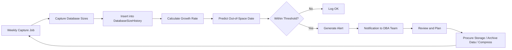

# 8.937 — Capacity Planning — Growth Monitoring

## 1. Overview — Capacity Planning Fundamentals

Capacity planning for databases involves tracking database size and growth over time to predict when resources will be exhausted and to plan for scaling. Unlike reactive alerting (which fires when a threshold is already breached), capacity planning is proactive — it identifies trends and predicts future constraints before they become critical.

- **Data size tracking**: Monitor the size of data files (.mdf, .ndf) over time to understand the growth trajectory of user data. This includes both used space and allocated space, as the difference indicates internal fragmentation and available free space within files.

- **Log file tracking**: Transaction log files (.ldf) have different growth patterns because they grow and shrink based on transaction activity and backup frequency. Log file capacity planning must account for workload peaks and backup schedules.

- **Index size tracking**: Indexes consume significant space, often exceeding the size of the data itself. Tracking index size helps plan for storage needs and identifies opportunities for index compression or archiving.

- **Growth rate calculation**: Raw size values are less useful than growth rates. A database that is 500GB but growing at 1GB/month is less concerning than a 100GB database growing at 20GB/month. Growth rate calculation normalizes size data for comparison and prediction.

- **Historical trend analysis**: Single data points are insufficient for capacity planning. Weekly captures over 12+ weeks provide enough data points for meaningful trend analysis and prediction.

- **Seasonal patterns**: Many databases have seasonal usage patterns — end-of-month processing, quarterly reporting, holiday sales spikes. Capacity planning must account for these patterns to avoid under-provisioning during peak periods.

- **Predictive modeling**: Linear regression on historical growth data provides a simple but effective prediction of when a database will reach capacity. More sophisticated models can account for seasonality and trend changes.

- **Alert thresholds**: Capacity alerts are set at 80% and 90% of estimated capacity, giving time to remediate before the resource is exhausted.

- **Automation**: Weekly data capture, growth rate calculation, and prediction should be automated. Manual entry leads to gaps in data and missed trends.

- **Integration with procurement**: Capacity planning outputs should feed into infrastructure procurement processes. If a database will run out of space in 3 months, the storage procurement should begin 2 months before that date.

## 2. Key Metrics — What to Measure

Capacity planning requires tracking multiple dimensions of database size. Each metric provides insight into different aspects of storage consumption.

### 2.1 Database Size Metrics

- **Data file allocated size**: Total size of all data files (.mdf, .ndf) on disk. This is the space that has been allocated regardless of whether it contains data.
- **Data file used size**: The amount of allocated space that actually contains data. The difference between allocated and used is free space within the files.
- **Log file allocated size**: Total size of transaction log files (.ldf). Log files grow with transaction activity and typically shrink after log backups.
- **Log file used size**: Amount of log space currently in use. High log used percentage indicates long-running transactions or insufficient log backups.
- **Percent full**: (Used size / Allocated size) × 100. Shows how full the database files are.
- **Disk free space**: Available space on the drive hosting the database files. This is the ultimate constraint — even if the database has free space within files, the disk must have room for file growth.

### 2.2 Index Metrics

- **Index size per database**: Total space used by all indexes. Indexes often consume 2-3 times the data size.
- **Index fragmentation percentage**: Average fragmentation across indexes. High fragmentation wastes space through internal (empty pages) and external (page ordering) fragmentation.
- **Unused index size**: Space consumed by indexes that are not used by any query. These can be removed to save space.
- **Duplicate index size**: Space consumed by redundant indexes that duplicate existing index keys.

### 2.3 TempDB Metrics

- **TempDB data file size**: Size of tempdb data files. TempDB is recreated on restart, so its size pattern resets.
- **TempDB file count**: Number of tempdb data files (should equal CPU core count for optimal performance).
- **TempDB growth rate**: How fast tempdb grows under workload. Excessive growth indicates query spills or temp object abuse.

### 2.4 VLDB Considerations

For very large databases (2TB+), regular size calculations can be expensive:

- **Sampling**: Use sys.dm_db_partition_stats with sampling for size estimates
- **Incremental**: Track size changes incrementally rather than full recalculations
- **Off-hours**: Schedule size calculations during low-activity periods
- **Approximation**: Accept approximate sizes rather than exact counts for trend analysis

## 3. Data Collection — Size Monitoring Queries

### 3.1 Database Size Query Using sys.database_files

This query provides the most accurate view of database file sizes:

```sql
SELECT
    DB_NAME() AS database_name,
    name AS file_name,
    type_desc AS file_type,
    size / 128 AS size_mb,
    CAST(FILEPROPERTY(name, 'SpaceUsed') AS INT) / 128 AS space_used_mb,
    (size / 128) - CAST(FILEPROPERTY(name, 'SpaceUsed') AS INT) / 128 AS free_space_mb,
    growth / 128 AS growth_increment_mb,
    CASE WHEN max_size = -1 THEN 'Unlimited'
         ELSE CAST(max_size / 128 AS VARCHAR(20))
    END AS max_size_mb,
    physical_name
FROM sys.database_files;
```

### 3.2 Disk Space Query Using sys.dm_os_volume_stats

Disk space information requires joining with volume stats:

```sql
SELECT DISTINCT
    vs.volume_mount_point,
    vs.logical_volume_name,
    vs.total_bytes / 1048576 AS total_mb,
    vs.available_bytes / 1048576 AS free_mb,
    (vs.available_bytes * 100.0 / vs.total_bytes) AS free_pct,
    mf.database_id,
    DB_NAME(mf.database_id) AS database_name
FROM sys.master_files mf
CROSS APPLY sys.dm_os_volume_stats(mf.database_id, mf.file_id) vs
ORDER BY free_pct;
```

### 3.3 Log Space Used — DBCC SQLPERF(LOGSPACE)

Log space information requires the DBCC command:

```sql
CREATE TABLE #log_space (
    database_name sysname,
    log_size_mb DECIMAL(18,2),
    log_space_used_pct DECIMAL(18,2),
    status INT
);

INSERT #log_space
EXEC ('DBCC SQLPERF(LOGSPACE)');

SELECT
    database_name,
    log_size_mb,
    log_space_used_pct,
    log_size_mb * log_space_used_pct / 100 AS log_used_mb,
    GETDATE() AS capture_date
FROM #log_space
ORDER BY database_name;

DROP TABLE #log_space;
```

### 3.4 Database Size Summary — All Databases

A comprehensive query for all databases on the server:

```sql
CREATE TABLE #db_size (
    database_name sysname,
    database_size_mb DECIMAL(18,2),
    log_size_mb DECIMAL(18,2)
);

EXEC sp_MSforeachdb '
    USE [?];
    INSERT #db_size
    SELECT
        DB_NAME() AS database_name,
        SUM(CASE WHEN type_desc = ''ROWS'' THEN size END) / 128.0 AS data_size_mb,
        SUM(CASE WHEN type_desc = ''LOG'' THEN size END) / 128.0 AS log_size_mb
    FROM sys.database_files;
';

SELECT
    database_name,
    database_size_mb,
    log_size_mb,
    database_size_mb + log_size_mb AS total_size_mb,
    GETDATE() AS capture_date
FROM #db_size
ORDER BY database_name;

DROP TABLE #db_size;
```

### 3.5 Index Size by Database

Index size tracking for capacity planning:

```sql
SELECT
    DB_NAME() AS database_name,
    OBJECT_SCHEMA_NAME(i.object_id) AS schema_name,
    OBJECT_NAME(i.object_id) AS table_name,
    i.name AS index_name,
    i.type_desc AS index_type,
    s.used_page_count * 8 / 1024 AS index_size_mb,
    s.reserved_page_count * 8 / 1024 AS reserved_size_mb,
    s.row_count
FROM sys.indexes i
JOIN sys.dm_db_partition_stats s
    ON i.object_id = s.object_id AND i.index_id = s.index_id
WHERE i.name IS NOT NULL
  AND s.used_page_count > 0
ORDER BY index_size_mb DESC;
```

## 4. Data Storage — History Table Design

A dedicated table stores weekly size captures for trend analysis:

### 4.1 Database Size History Table

```sql
CREATE TABLE dbo.DatabaseSizeHistory (
    HistoryID INT IDENTITY(1,1) PRIMARY KEY,
    ServerName NVARCHAR(128) NOT NULL,
    DatabaseName NVARCHAR(128) NOT NULL,
    DataFileSizeMB DECIMAL(18,2) NOT NULL,
    DataFileUsedMB DECIMAL(18,2) NOT NULL,
    DataFileFreeMB DECIMAL(18,2) NOT NULL,
    PercentFull DECIMAL(5,2) NOT NULL,
    LogFileSizeMB DECIMAL(18,2) NOT NULL,
    LogFileUsedPct DECIMAL(5,2) NOT NULL,
    LogFileUsedMB DECIMAL(18,2) NOT NULL,
    IndexSizeMB DECIMAL(18,2) NULL,
    DiskFreeSpaceMB DECIMAL(18,2) NULL,
    CaptureDate DATETIME2 NOT NULL DEFAULT GETDATE(),
    Notes NVARCHAR(500) NULL
);

CREATE INDEX IX_DatabaseSizeHistory_DatabaseName
    ON dbo.DatabaseSizeHistory (ServerName, DatabaseName, CaptureDate);
```

### 4.2 Index Size History Table

```sql
CREATE TABLE dbo.IndexSizeHistory (
    HistoryID INT IDENTITY(1,1) PRIMARY KEY,
    ServerName NVARCHAR(128) NOT NULL,
    DatabaseName NVARCHAR(128) NOT NULL,
    SchemaName NVARCHAR(128) NOT NULL,
    TableName NVARCHAR(128) NOT NULL,
    IndexName NVARCHAR(128) NOT NULL,
    IndexType NVARCHAR(60) NOT NULL,
    IndexSizeMB DECIMAL(18,2) NOT NULL,
    RowCount BIGINT NOT NULL,
    FragmentationPct DECIMAL(5,2) NULL,
    CaptureDate DATETIME2 NOT NULL DEFAULT GETDATE()
);

CREATE INDEX IX_IndexSizeHistory_Database_Table
    ON dbo.IndexSizeHistory (ServerName, DatabaseName, TableName, CaptureDate);
```

### 4.3 Weekly Capture Stored Procedure

```sql
CREATE PROCEDURE dbo.CaptureDatabaseSize
AS
BEGIN
    SET NOCOUNT ON;

    DECLARE @ServerName NVARCHAR(128) = @@SERVERNAME;

    -- Capture per-database sizes
    INSERT INTO dbo.DatabaseSizeHistory (
        ServerName, DatabaseName, DataFileSizeMB, DataFileUsedMB,
        DataFileFreeMB, PercentFull, LogFileSizeMB, LogFileUsedPct,
        LogFileUsedMB, IndexSizeMB, DiskFreeSpaceMB
    )
    SELECT
        @ServerName,
        DB_NAME(database_id) AS DatabaseName,
        SUM(CASE WHEN type = 0 THEN size END) / 128.0 AS DataFileSizeMB,
        SUM(CASE WHEN type = 0 THEN FILEPROPERTY(name, 'SpaceUsed') END) / 128.0 AS DataFileUsedMB,
        SUM(CASE WHEN type = 0 THEN size END) / 128.0 - SUM(CASE WHEN type = 0 THEN FILEPROPERTY(name, 'SpaceUsed') END) / 128.0 AS DataFileFreeMB,
        (SUM(CASE WHEN type = 0 THEN FILEPROPERTY(name, 'SpaceUsed') END) * 100.0 / NULLIF(SUM(CASE WHEN type = 0 THEN size END), 0)) AS PercentFull,
        SUM(CASE WHEN type = 1 THEN size END) / 128.0 AS LogFileSizeMB,
        NULL AS LogFileUsedPct,
        NULL AS LogFileUsedMB,
        NULL AS IndexSizeMB,
        vs.available_bytes / 1048576 AS DiskFreeSpaceMB
    FROM sys.master_files mf
    CROSS APPLY sys.dm_os_volume_stats(mf.database_id, mf.file_id) vs
    GROUP BY DB_NAME(database_id), vs.available_bytes;
END;
```

## 5. Growth Rate Calculation

Growth rate calculation converts raw size data into predictions. The standard approach uses linear regression on the last 12 weeks of data.

### 5.1 Simple Growth Rate (Week Over Week)

The simplest growth calculation is the average weekly growth rate:

```sql
WITH weekly_sizes AS (
    SELECT
        DatabaseName,
        CaptureDate,
        DataFileUsedMB,
        ROW_NUMBER() OVER (PARTITION BY DatabaseName ORDER BY CaptureDate) AS week_num
    FROM dbo.DatabaseSizeHistory
    WHERE CaptureDate >= DATEADD(WEEK, -12, GETDATE())
)
SELECT
    curr.DatabaseName,
    curr.DataFileUsedMB AS current_size_mb,
    prev.DataFileUsedMB AS size_12_weeks_ago_mb,
    (curr.DataFileUsedMB - prev.DataFileUsedMB) / 12.0 AS avg_weekly_growth_mb,
    (curr.DataFileUsedMB - prev.DataFileUsedMB) * 52.0 / 12.0 AS projected_yearly_growth_mb,
    curr.CaptureDate AS last_capture
FROM weekly_sizes curr
JOIN weekly_sizes prev
    ON curr.DatabaseName = prev.DatabaseName
    AND curr.week_num = (SELECT MAX(week_num) FROM weekly_sizes s WHERE s.DatabaseName = curr.DatabaseName)
    AND prev.week_num = (SELECT MIN(week_num) FROM weekly_sizes s WHERE s.DatabaseName = curr.DatabaseName);
```

### 5.2 Linear Regression Prediction

A more sophisticated approach uses linear regression to predict future size:

```sql
WITH size_data AS (
    SELECT
        DatabaseName,
        DATEDIFF(DAY, MIN(CaptureDate) OVER (PARTITION BY DatabaseName), CaptureDate) AS days_since_start,
        DataFileUsedMB
    FROM dbo.DatabaseSizeHistory
    WHERE DatabaseName = 'YourDatabase'
      AND CaptureDate >= DATEADD(WEEK, -12, GETDATE())
)
SELECT
    DatabaseName,
    COUNT(*) AS data_points,
    MIN(DataFileUsedMB) AS min_size_mb,
    MAX(DataFileUsedMB) AS max_size_mb,
    -- Linear regression slope (growth per day)
    (COUNT(*) * SUM(days_since_start * DataFileUsedMB) - SUM(days_since_start) * SUM(DataFileUsedMB))
    / NULLIF((COUNT(*) * SUM(days_since_start * days_since_start) - SQUARE(SUM(days_since_start))), 0) AS growth_per_day_mb,
    -- Linear regression intercept
    (SUM(DataFileUsedMB) - (COUNT(*) * SUM(days_since_start * DataFileUsedMB) - SUM(days_since_start) * SUM(DataFileUsedMB))
    / NULLIF((COUNT(*) * SUM(days_since_start * days_since_start) - SQUARE(SUM(days_since_start))), 0) * SUM(days_since_start)) / COUNT(*) AS intercept_mb
FROM size_data
GROUP BY DatabaseName;
```

### 5.3 Days-Until-Full Calculation

Combining growth rate with disk space availability:

```sql
DECLARE @DatabaseName NVARCHAR(128) = 'YourDatabase';
DECLARE @CapacityMB DECIMAL(18,2) = 1000000; -- 1TB database limit

WITH growth_analysis AS (
    SELECT
        MAX(DataFileUsedMB) AS current_size_mb,
        (MAX(DataFileUsedMB) - MIN(DataFileUsedMB)) / NULLIF(DATEDIFF(DAY, MIN(CaptureDate), MAX(CaptureDate)), 0) AS daily_growth_mb
    FROM dbo.DatabaseSizeHistory
    WHERE DatabaseName = @DatabaseName
      AND CaptureDate >= DATEADD(WEEK, -12, GETDATE())
)
SELECT
    current_size_mb,
    daily_growth_mb,
    CASE WHEN daily_growth_mb > 0
        THEN DATEDIFF(DAY, GETDATE(), DATEADD(DAY, (@CapacityMB - current_size_mb) / daily_growth_mb, GETDATE()))
        ELSE NULL
    END AS days_until_full,
    CASE WHEN daily_growth_mb > 0
        THEN DATEADD(DAY, (@CapacityMB - current_size_mb) / daily_growth_mb, GETDATE())
        ELSE NULL
    END AS estimated_full_date
FROM growth_analysis;
```

### 5.4 Growth Rate Alerts

Alerts based on growth rate and projected full date:

- **P2 Warning**: Projected out-of-space date is within 30 days
- **P1 Critical**: Projected out-of-space date is within 7 days
- **Growth anomaly**: Growth rate has doubled compared to previous month

## 6. Architecture — Growth Monitoring Pipeline



### 6.1 Capture Layer

The capture layer runs on a schedule (weekly) and collects size data:

- **Schedule**: SQL Agent job runs Saturday 2:00 AM (low activity)
- **Scope**: All production databases on all servers
- **Output**: Insert into DatabaseSizeHistory table
- **Error handling**: Log failures to job history, alert if capture fails

### 6.2 Analysis Layer

The analysis layer processes captured data:

- **Growth rate**: Calculates daily/weekly/monthly growth rates
- **Prediction**: Linear regression for out-of-space prediction
- **Anomaly detection**: Flag databases where growth rate has changed significantly
- **Reporting**: Monthly capacity report with trends and predictions

### 6.3 Alerting Layer

Alerts trigger when predictions indicate capacity constraints:

- **80% full**: P2 warning — begin planning for expansion
- **90% full**: P1 critical — immediate action required
- **Growth spike**: Growth rate doubled — investigate root cause
- **Missing data**: No capture in last 14 days — monitoring gap

### 6.4 Action Layer

Actions based on capacity alerts:

- **Short-term**: Extend disk, add file, shrink file, truncate log
- **Medium-term**: Archive old data, compress indexes, add storage
- **Long-term**: Purge data retention policy, scale up/database sharding

## 7. Production — Best Practices

### 7.1 Track Trends, Not Snapshots

A single size measurement is meaningless without historical context:

- **Minimum history**: 12 weeks of data for meaningful trend analysis
- **Consistent intervals**: Weekly captures at the same time (avoiding peak hours)
- **Outlier handling**: Flag and exclude captures during maintenance or unusual activity
- **Rolling window**: Always present data as a trend line, not a single value

### 7.2 Alert Thresholds Configuration

Set alerts at multiple levels to provide warning time:

- **80% full (P2)**: Start planning — 20% remaining capacity
- **90% full (P1)**: Immediate action — 10% remaining capacity
- **Growth rate acceleration**: 2× normal growth rate — investigate cause
- **No recent capture**: 14 days without data — monitoring failure

### 7.3 TempDB Size Tracking

TempDB requires special consideration because it resets on restart:

- **Peak tracking**: Track tempdb size daily during peak hours
- **Growth pattern**: Identify workloads that cause tempdb growth (spills, temp tables)
- **File count**: Ensure tempdb has enough files (1 per CPU core, 8 file minimum)
- **Initial size**: Set initial size to accommodate normal workload without auto-growth

### 7.4 Index Fragmentation and Space Reclamation

Index maintenance frees space within database files:

- **Rebuild indexes**: Reorganize or rebuild fragmented indexes to reclaim internal space
- **Page compression**: Reduce index size 30-70% with page compression
- **Data compression**: Reduce data size 50-80% with page compression
- **Dropped indexes**: Remove unused indexes (identified via sys.dm_db_index_usage_stats)
- **Archived data**: Partition and move old data to cheaper storage or archive

### 7.5 Reporting and Visualization

Regular reporting keeps stakeholders informed:

- **Monthly report**: Size trends, growth rates, predicted full dates, space reclaimed
- **Dashboard**: Grafana/Tableau dashboard showing current size, growth trend, alerts
- **Management summary**: Top 10 databases by size, top 5 by growth rate
- **Budget input**: Capacity projections for storage procurement planning

### 7.6 Historical Data Retention

Capacity planning history has its own retention policy:

- **Raw data**: Retain 2 years of weekly captures
- **Aggregated**: Monthly averages retained for 5 years
- **Purge**: Remove raw data older than 2 years quarterly

### 7.7 Integration with Procurement

Capacity planning must integrate with procurement processes:

- **Lead time**: Storage procurement typically takes 2-8 weeks
- **Budget cycles**: Annual budgets include projected storage needs
- **Emergency budget**: Document process for emergency storage requests
- **Vendor management**: Maintain relationships with storage vendors for expedited delivery

## 8. Gotchas — Common Pitfalls and Edge Cases

### 8.1 Auto-Growth Skews Trend

Auto-growth events cause sudden jumps in file size that distort growth calculations:

- **Problem**: A database auto-grows by 1GB — the size chart shows a sudden spike, making the growth trend look steeper than actual data growth
- **Solution**: Use used space (FILEPROPERTY SpaceUsed) instead of allocated space for trend analysis. Allocated size is influenced by auto-growth events, but used space reflects actual data growth
- **Better approach**: Track both allocated and used space. If the gap between allocated and used is growing, it indicates auto-growth events are occurring
- **Smoothing**: Apply a moving average to growth rate calculations to smooth out auto-growth spikes

### 8.2 Log File Size Varies with Workload

Transaction log files grow and shrink based on workload patterns, not data growth:

- **Problem**: Log file size increases during heavy ETL processing and shrinks after log backups. The raw log file size is not a reliable indicator of growth trend
- **Solution**: Track log backup frequency and log space used percentage. If log used percentage remains high, backups are not frequent enough
- **Pattern analysis**: Log growth patterns follow workload cycles — daily peaks, weekly cycles, monthly batch processing
- **Capacity planning**: Plan log file capacity based on peak workload, not average workload

### 8.3 Data Compression Changes Growth Rate

Implementing data compression changes the effective growth rate:

- **Problem**: After implementing page compression, database size drops 50%. This creates a false positive in growth rate analysis — the database appears to be shrinking
- **Solution**: Document compression changes in the DatabaseSizeHistory table. Flag compressed tables for separate trend tracking
- **Baseline reset**: After compression, start a new baseline for growth rate calculation
- **Compression ratio**: Track compression ratio over time — if it decreases, data may be less compressible

### 8.4 VLDB Size Calculation Is Expensive

On very large databases (2TB+), sys.dm_db_partition_stats and sys.database_files queries can cause performance issues:

- **Problem**: Full size calculation on a 5TB database requires scanning metadata for billions of rows, consuming significant I/O and CPU
- **Solution**: Use sampled calculations or incremental tracking
- **Alternative**: Estimate size from backup size or storage-level metrics
- **Schedule**: Run full size calculations only during low activity periods
- **Sampling**: For growth trend, estimate size from a subset of tables

### 8.5 File Growth and Instant File Initialization

Instant file initialization (IFI) affects how file growth impacts performance:

- **IFI enabled**: Data file growth is fast (zero-initialization skipped) — auto-growth events are less disruptive
- **IFI disabled**: Data file growth zero-initializes pages — auto-growth events pause queries
- **Log files**: IFI does not apply to log files — log growth always zero-initializes
- **Capacity planning**: If IFI is enabled, auto-growth is less disruptive, but planned initial sizes are still preferred

### 8.6 Database Quotas in Azure SQL

Azure SQL Database and Managed Instance have different capacity models:

- **DTU model**: Database size is limited by DTU tier (e.g., S2 has 250GB max)
- **vCore model**: Database size limited by tier (General Purpose up to 4TB, Business Critical up to 4TB)
- **Storage autoscaling**: Some tiers support automatic storage scaling
- **Growth monitoring**: Track used space as percentage of tier maximum, not absolute values
- **Tier upgrade**: Capacity planning for Azure SQL involves tier migration, not disk extension

### 8.7 TempDB Growth Pattern

TempDB has unique growth characteristics:

- **Restart resets**: TempDB is recreated from model database on service restart — size history resets
- **Workload driven**: TempDB grows based on activity level, not data volume
- **Spill detection**: Sudden tempdb growth indicates query spills — investigate and fix queries
- **Initial size**: Set tempdb initial size to accommodate normal workload to avoid auto-growth

### 8.8 Inconsistent Capture Times

Capturing at different times of day introduces variance that distorts trends:

- **Problem**: One capture at 3 AM (low activity) shows 100GB, next capture at 3 PM (peak hours) shows 150GB due to log growth
- **Solution**: Always capture at the same time of day, preferably during low activity
- **Weekly**: Same day and time each week (e.g., Saturday 2 AM)
- **Time zone**: Account for daylight savings changes affecting capture schedule

### 8.9 Missing Data Points

Incomplete data affects trend accuracy:

- **Holidays**: Captures may be missed during holidays or maintenance periods
- **Server down**: If server is offline during scheduled capture, data is missing
- **Job failures**: SQL Agent job may fail — capture error and retry
- **Gap filling**: For short gaps (1-2 weeks), interpolate missing data points
- **Alert**: If no capture in 14 days, generate alert that capacity monitoring is down

### 8.10 Data Retention Policies

Capacity planning is affected by data retention policies:

- **Short-term retention**: Data purged after 90 days — database size stabilizes once retention limit is reached
- **Long-term growth**: Even with retention policies, databases may grow due to increased data volume
- **Archival**: Moving old data to archive reduces growth rate
- **Policy changes**: Extending retention periods accelerates database growth

## 9. Related Notes — Cross-References

### 9.1 Prerequisites

- [[8.939 — Database Space Monitoring — File Growth Alerts]] — Detailed space monitoring that feeds capacity planning
- [[8.936 — Database Alerts — Threshold Configuration]] — Alert thresholds used for capacity warnings

### 9.2 Direct Predecessors and Successors

- [[8.938 — Index Fragmentation — Scheduled Monitoring]] — Index fragmentation affects space utilization
- [[8.924 — Baseline Capture — DMV Snapshot Strategy]] — Baseline data provides history for capacity trends

### 9.3 Related Monitoring Notes

- [[8.928 — SQL Server Dashboards — Grafana Setup]] — Dashboard visualization for capacity trends
- [[8.929 — SQL Server — Prometheus Exporter]] — Prometheus metrics for capacity monitoring
- [[8.930 — Application Insights — SQL Dependency Tracking]] — Application-level dependency tracking

### 9.4 Index Maintenance Notes

- [[8.513 — Index Fragmentation — Internal vs External]] — Types of fragmentation affecting space
- [[8.514 — Fragmentation — REBUILD vs REORGANIZE]] — Index rebuild reclaims space
- [[8.516 — Index Maintenance — Threshold-Based Strategy]] — Automated index maintenance
- [[8.321 — Index Maintenance — Ola Hallengren Solution]] — Industry standard maintenance

### 9.5 Database File Notes

- [[8.282 — Database Files — MDF, NDF, LDF Roles]] — File types and their space characteristics
- [[8.287 — VLF Fragmentation — Detection and Fix]] — VLF management affects log file growth
- [[8.324 — Log File Management — VLF and Shrinking]] — Log file management best practices

### 9.6 Alert and Performance Notes

- [[8.916 — SQL Server Monitoring — Key Metrics]] — Core metrics for overall monitoring
- [[8.917 — Wait Statistics — Top Waits Analysis]] — Wait statistics analysis
- [[8.926 — Query Store — Monitoring and Regressed Queries]] — Query performance metrics

## 10. References — Sources and Further Reading

### 10.1 Official Microsoft Documentation

- sys.database_files: Microsoft Docs — File size and growth information
- sys.dm_os_volume_stats: Microsoft Docs — Disk space information
- DBCC SQLPERF(LOGSPACE): Microsoft Docs — Log space usage
- sys.dm_db_partition_stats: Microsoft Docs — Index and partition size

### 10.2 Books

- "SQL Server 2019 Administration Inside Out" by William Assaf, Randolph West, et al.
- "Troubleshooting SQL Server: A Guide for the Accidental DBA" by Jonathan Kehayias
- "The Art of Capacity Planning" by John Allspaw

### 10.3 Online Resources

- Brent Ozar Unlimited: sp_BlitzFirst, sp_BlitzWho — Real-time performance monitoring
- Paul Randal (SQLSkills): Understanding log space management
- Ola Hallengren: SQL Server Maintenance Solution

### 10.4 Tools

- Grafana: Dashboard visualization for capacity trends
- Prometheus: Metrics collection for time-series data
- Tableau: Capacity reporting and visualization
- Power BI: Capacity planning dashboards

### 10.5 Template Version

- Note ID: 8.937
- Last updated: 2026-06-27
- Template: Database Note v2 — Capacity Planning
- Section structure: 10 sections including overview, key metrics, data collection, storage design, growth calculation, architecture, production, gotchas, related notes, references

## 9. Additional Content — Detailed Implementation Examples

### 9.1 Weekly Capacity Capture Job (Full Script)

Complete T-SQL job to capture database size information weekly:

```sql
CREATE PROCEDURE dbo.usp_CaptureCapacityData
    @CaptureType VARCHAR(20) = ''FULL''
AS
BEGIN
    SET NOCOUNT ON;

    DECLARE @ServerName NVARCHAR(128) = @@SERVERNAME;
    DECLARE @CaptureDate DATETIME2 = GETDATE();
    DECLARE @DatabaseName NVARCHAR(128);
    DECLARE @Sql NVARCHAR(MAX);

    -- Create history table if not exists
    IF NOT EXISTS (SELECT * FROM sys.tables WHERE name = ''DatabaseCapacityHistory'')
    BEGIN
        CREATE TABLE dbo.DatabaseCapacityHistory (
            HistoryID BIGINT IDENTITY(1,1) PRIMARY KEY,
            ServerName NVARCHAR(128) NOT NULL,
            DatabaseName NVARCHAR(128) NOT NULL,
            DataFileSizeMB DECIMAL(18,2) NOT NULL,
            DataFileUsedMB DECIMAL(18,2) NOT NULL,
            LogFileSizeMB DECIMAL(18,2) NOT NULL,
            LogFileUsedPct DECIMAL(5,2) NOT NULL,
            CaptureDate DATETIME2 NOT NULL,
            DiskFreeMB DECIMAL(18,2) NULL,
            DiskFreePct DECIMAL(5,2) NULL,
            Notes NVARCHAR(500) NULL,
            INDEX IX_CapacityHistory_DB (ServerName, DatabaseName, CaptureDate)
        );
    END;

    -- Iterate through databases
    DECLARE db_cursor CURSOR FOR
    SELECT name FROM sys.databases
    WHERE state = 0 AND name != ''tempdb''
    ORDER BY name;

    OPEN db_cursor;
    FETCH NEXT FROM db_cursor INTO @DatabaseName;

    WHILE @@FETCH_STATUS = 0
    BEGIN
        BEGIN TRY
            SET @Sql = ''
                USE ['' + @DatabaseName + ''];

                INSERT INTO dbo.DatabaseCapacityHistory (
                    ServerName, DatabaseName,
                    DataFileSizeMB, DataFileUsedMB,
                    LogFileSizeMB, LogFileUsedPct,
                    CaptureDate, DiskFreeMB, DiskFreePct
                )
                SELECT
                    @ServerName,
                    DB_NAME(),
                    SUM(CASE WHEN type = 0 THEN size END) / 128.0,
                    SUM(CASE WHEN type = 0
                        THEN CAST(FILEPROPERTY(name, ''SpaceUsed'') AS INT)
                    END) / 128.0,
                    SUM(CASE WHEN type = 1 THEN size END) / 128.0,
                    NULL,
                    @CaptureDate,
                    vs.available_bytes / 1048576,
                    (vs.available_bytes * 100.0 / vs.total_bytes)
                FROM sys.database_files
                CROSS JOIN sys.dm_os_volume_stats(DB_ID(), 1) vs;
            '';

            EXEC sp_executesql @Sql,
                N''@ServerName NVARCHAR(128), @CaptureDate DATETIME2'',
                @ServerName = @ServerName,
                @CaptureDate = @CaptureDate;

            -- Capture log space separately
            SET @Sql = ''
                USE ['' + @DatabaseName + ''];

                CREATE TABLE #logspace (
                    dbname sysname, size_mb DECIMAL(18,2),
                    used_pct DECIMAL(5,2), status INT
                );

                INSERT #logspace EXEC (''DBCC SQLPERF(LOGSPACE)'');

                UPDATE h
                SET LogFileUsedPct = ls.used_pct
                FROM dbo.DatabaseCapacityHistory h
                JOIN #logspace ls
                    ON h.DatabaseName = ls.dbname
                WHERE h.CaptureDate = @CaptureDate
                  AND h.ServerName = @ServerName;

                DROP TABLE #logspace;
            '';

            EXEC sp_executesql @Sql,
                N''@ServerName NVARCHAR(128), @CaptureDate DATETIME2'',
                @ServerName = @ServerName,
                @CaptureDate = @CaptureDate;
        END TRY
        BEGIN CATCH
            INSERT INTO dbo.CapacityCaptureErrors (
                ServerName, DatabaseName, ErrorMessage, CaptureDate
            )
            VALUES (
                @ServerName, @DatabaseName,
                ERROR_MESSAGE(), @CaptureDate
            );
        END CATCH;

        FETCH NEXT FROM db_cursor INTO @DatabaseName;
    END;

    CLOSE db_cursor;
    DEALLOCATE db_cursor;
END;
```

### 9.2 Growth Prediction Report

Generate a monthly capacity prediction report:

```sql
CREATE PROCEDURE dbo.usp_CapacityPredictionReport
    @WeeksOfHistory INT = 12,
    @AlertDays INT = 30
AS
BEGIN
    SET NOCOUNT ON;

    WITH base_data AS (
        SELECT
            ServerName,
            DatabaseName,
            DataFileUsedMB,
            CaptureDate,
            DATEDIFF(DAY,
                MIN(CaptureDate) OVER (PARTITION BY DatabaseName),
                CaptureDate) AS days_from_start
        FROM dbo.DatabaseCapacityHistory
        WHERE CaptureDate >= DATEADD(WEEK, -@WeeksOfHistory, GETDATE())
    ),
    regression AS (
        SELECT
            DatabaseName,
            COUNT(*) AS data_points,
            AVG(CAST(days_from_start AS DECIMAL(18,2))) AS avg_x,
            AVG(DataFileUsedMB) AS avg_y,
            SUM((days_from_start - avg_x) * (DataFileUsedMB - avg_y)) / NULLIF(SUM(SQUARE(days_from_start - avg_x)), 0) AS slope,
            avg_y - (SUM((days_from_start - avg_x) * (DataFileUsedMB - avg_y)) / NULLIF(SUM(SQUARE(days_from_start - avg_x)), 0)) * avg_x AS intercept
        FROM base_data
        GROUP BY DatabaseName
    )
    SELECT
        r.DatabaseName,
        r.data_points,
        latest.DataFileUsedMB AS current_size_mb,
        r.slope AS daily_growth_mb,
        r.slope * 30 AS monthly_growth_mb,
        CASE WHEN r.slope > 0
            THEN DATEADD(DAY,
                (max_size_mb - latest.DataFileUsedMB) / r.slope,
                GETDATE())
            ELSE NULL
        END AS predicted_full_date,
        CASE WHEN r.slope > 0
            THEN DATEDIFF(DAY, GETDATE(),
                DATEADD(DAY,
                    (max_size_mb - latest.DataFileUsedMB) / r.slope,
                    GETDATE()))
            ELSE NULL
        END AS days_until_full,
        CASE
            WHEN r.slope <= 0 THEN ''NOT GROWING''
            WHEN DATEADD(DAY,
                (max_size_mb - latest.DataFileUsedMB) / r.slope,
                GETDATE()) < DATEADD(DAY, @AlertDays, GETDATE())
                THEN ''ALERT - Requires action''
            WHEN DATEADD(DAY,
                (max_size_mb - latest.DataFileUsedMB) / r.slope,
                GETDATE()) < DATEADD(DAY, @AlertDays * 2, GETDATE())
                THEN ''WARNING - Plan action''
            ELSE ''OK''
        END AS status
    FROM regression r
    CROSS APPLY (
        SELECT TOP 1 DataFileUsedMB, CaptureDate
        FROM dbo.DatabaseCapacityHistory
        WHERE DatabaseName = r.DatabaseName
        ORDER BY CaptureDate DESC
    ) latest
    CROSS APPLY (
        SELECT TOP 1
            CASE WHEN max_size = -1 THEN 9999999 ELSE max_size / 128 END AS max_size_mb
        FROM sys.master_files
        WHERE DB_NAME(database_id) = r.DatabaseName AND type = 0
    ) mf
    ORDER BY days_until_full;
END;
```

### 9.3 Storage Budget Planning Query

Project storage needs for budget planning:

```sql
CREATE PROCEDURE dbo.usp_StorageBudgetProjection
    @ProjectionMonths INT = 12
AS
BEGIN
    SET NOCOUNT ON;

    WITH growth_rates AS (
        SELECT
            DatabaseName,
            AVG(daily_growth_mb) AS avg_daily_growth,
            MAX(daily_growth_mb) AS max_daily_growth
        FROM (
            SELECT
                DatabaseName,
                CaptureDate,
                DataFileUsedMB,
                DataFileUsedMB - LAG(DataFileUsedMB)
                    OVER (PARTITION BY DatabaseName ORDER BY CaptureDate) AS daily_growth_mb
            FROM dbo.DatabaseCapacityHistory
            WHERE CaptureDate >= DATEADD(MONTH, -3, GETDATE())
        ) sub
        WHERE daily_growth_mb > 0
        GROUP BY DatabaseName
    )
    SELECT
        g.DatabaseName,
        current.DataFileUsedMB AS current_size_mb,
        g.avg_daily_growth,
        g.max_daily_growth,
        current.DataFileUsedMB + (g.avg_daily_growth * 30 * @ProjectionMonths) AS projected_size_mb_p50,
        current.DataFileUsedMB + (g.max_daily_growth * 30 * @ProjectionMonths) AS projected_size_mb_p95,
        (current.DiskFreeMB) AS current_disk_free_mb,
        CASE WHEN current.DiskFreeMB < (g.avg_daily_growth * 30 * 3) THEN ''NEEDS EXPANSION'' ELSE ''OK'' END AS disk_status
    FROM growth_rates g
    CROSS APPLY (
        SELECT TOP 1 DataFileUsedMB, DiskFreeMB
        FROM dbo.DatabaseCapacityHistory
        WHERE DatabaseName = g.DatabaseName
        ORDER BY CaptureDate DESC
    ) current
    ORDER BY projected_size_mb_p50 DESC;
END;
```

### 9.4 TempDB Size Tracking

```sql
CREATE PROCEDURE dbo.usp_TrackTempDBSize
AS
BEGIN
    SET NOCOUNT ON;

    IF NOT EXISTS (SELECT * FROM sys.tables WHERE name = ''TempDBSizeHistory'')
    BEGIN
        CREATE TABLE dbo.TempDBSizeHistory (
            HistoryID INT IDENTITY(1,1) PRIMARY KEY,
            ServerName NVARCHAR(128) NOT NULL,
            FileID INT NOT NULL,
            FileName NVARCHAR(128) NOT NULL,
            SizeMB DECIMAL(18,2) NOT NULL,
            CaptureDate DATETIME2 NOT NULL DEFAULT GETDATE()
        );
    END;

    INSERT INTO dbo.TempDBSizeHistory (ServerName, FileID, FileName, SizeMB)
    SELECT
        @@SERVERNAME,
        file_id,
        name,
        size / 128.0
    FROM tempdb.sys.database_files;

    -- Alert if tempdb is growing unusually fast
    WITH recent_growth AS (
        SELECT
            SUM(SizeMB) AS current_size,
            LAG(SUM(SizeMB), 1) OVER (ORDER BY CaptureDate) AS previous_size,
            CaptureDate
        FROM dbo.TempDBSizeHistory
        WHERE CaptureDate >= DATEADD(HOUR, -4, GETDATE())
        GROUP BY CaptureDate
    )
    SELECT
        current_size,
        previous_size,
        (current_size - previous_size) AS growth_mb,
        CaptureDate
    FROM recent_growth
    WHERE (current_size - previous_size) > 10000  -- 10GB growth alert
    ORDER BY CaptureDate DESC;
END;
```

### 9.5 Capacity Dashboard Queries

Key queries for a capacity planning dashboard:

- **Size growth chart**: Daily/Weekly size over last 12 weeks
- **Growth rate chart**: Weekly growth MB per week over time
- **Days until full**: Projected days remaining for each database
- **Top 10 largest databases**: Current size ranking
- **Top 10 fastest growing databases**: Growth rate ranking
- **Disk space overview**: Free space by volume across all servers
- **TempDB peak tracking**: Daily max tempdb size
- **Log file growth**: Log file size trends and log backup frequency

### 9.6 Automating Capacity Alerts

```sql
CREATE PROCEDURE dbo.usp_CheckCapacityAlerts
    @DiskWarningPct INT = 20,
    @DiskCriticalPct INT = 10,
    @FileWarningPct INT = 80,
    @FileCriticalPct INT = 90,
    @LogWarningPct INT = 70,
    @LogCriticalPct INT = 85,
    @GrowthWarningDays INT = 60,
    @GrowthCriticalDays INT = 30
AS
BEGIN
    SET NOCOUNT ON;

    -- Disk space alerts
    SELECT DISTINCT
        vs.volume_mount_point,
        vs.available_bytes / 1048576 AS free_mb,
        (vs.available_bytes * 100.0 / vs.total_bytes) AS free_pct,
        CASE
            WHEN (vs.available_bytes * 100.0 / vs.total_bytes) < @DiskCriticalPct
                THEN ''CRITICAL''
            WHEN (vs.available_bytes * 100.0 / vs.total_bytes) < @DiskWarningPct
                THEN ''WARNING''
            ELSE ''OK''
        END AS alert_level
    FROM sys.master_files mf
    CROSS APPLY sys.dm_os_volume_stats(mf.database_id, mf.file_id) vs;

    -- Database size alerts
    SELECT
        DB_NAME(mf.database_id) AS database_name,
        mf.name AS file_name,
        CAST(FILEPROPERTY(mf.name, ''SpaceUsed'') AS INT) / 128 AS used_mb,
        mf.size / 128 AS total_mb,
        (CAST(FILEPROPERTY(mf.name, ''SpaceUsed'') AS FLOAT) * 100.0 / mf.size) AS pct_used,
        CASE
            WHEN (CAST(FILEPROPERTY(mf.name, ''SpaceUsed'') AS FLOAT) * 100.0 / mf.size) > @FileCriticalPct
                THEN ''CRITICAL''
            WHEN (CAST(FILEPROPERTY(mf.name, ''SpaceUsed'') AS FLOAT) * 100.0 / mf.size) > @FileWarningPct
                THEN ''WARNING''
            ELSE ''OK''
        END AS alert_level
    FROM sys.master_files mf
    WHERE mf.database_id > 4
      AND mf.type = 0;  -- Data files only
END;
```

