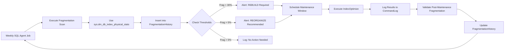

# 8.938 — Index Fragmentation — Scheduled Monitoring

## 1. Overview — Index Fragmentation Fundamentals

Index fragmentation occurs when the logical order of index pages does not match the physical order on disk (external fragmentation) or when pages contain excessive empty space (internal fragmentation). Fragmented indexes degrade query performance by increasing I/O operations and reducing buffer cache efficiency.

- **External fragmentation**: Pages are physically out of order on disk. The index pages are stored across the disk in a non-contiguous fashion, requiring additional I/Os to read all pages sequentially. External fragmentation is measured by avg_fragmentation_in_percent in sys.dm_db_index_physical_stats.

- **Internal fragmentation**: Pages contain free space because rows have been deleted, updated, or inserted with fill factor settings. Internal fragmentation wastes buffer pool space and increases I/O. It is measured indirectly through page density and avg_page_space_used_in_percent.

- **Performance impact**: Fragmented indexes cause more page reads than necessary. For range scans and ordered retrievals, fragmentation increases the number of read operations from the storage subsystem. The price of reading from fragmented storage can be many orders of magnitude higher than reading a contiguous allocation of pages.

- **Detection**: SQL Server provides sys.dm_db_index_physical_stats DMV to measure fragmentation. This function scans index pages and reports logical fragmentation, page density, and other statistics. It is the authoritative source for fragmentation information.

- **Maintenance thresholds**: Industry standard thresholds are > 30% fragmentation for REBUILD and > 5% for REORGANIZE. These thresholds balance the cost of maintenance with the performance benefit of reduced fragmentation.

- **Maintenance operations**: REBUILD drops and recreates the index, completely defragmenting it. REORGANIZE reorders the leaf-level pages using minimal logging and can run online even in Standard Edition.

- **Scheduling**: Regular monitoring and maintenance is essential. Weekly fragmentation scans identify indexes that need maintenance. Monthly maintenance jobs rebuild or reorganize fragmented indexes during low-activity periods.

- **Automation**: Ola Hallengren's IndexOptimize script is the industry standard solution for automated index maintenance. It handles fragmentation thresholds, online/offline options, logging, and error handling.

- **Cost-benefit**: Index maintenance has costs — CPU, I/O, log growth, and blocking. The benefits of reduced fragmentation must outweigh these costs. Small indexes (< 1000 pages) benefit little from maintenance, and indexes that are rarely read may not need defragmentation.

## 2. Key Concepts — Internal vs External Fragmentation

### 2.1 External Fragmentation (Logical Fragmentation)

External fragmentation measures how far the logical order of index pages deviates from their physical order:

- **Measurement**: avg_fragmentation_in_percent from sys.dm_db_index_physical_stats
- **Range**: 0% (perfectly ordered) to 99% (completely out of order)
- **Cause**: Page splits, insert operations in non-sequential key order (GUIDs, random values)
- **Impact**: Increased I/O for range scans, reduced read-ahead effectiveness
- **Remedy**: REBUILD recreates the index with proper page ordering
- **Thresholds**:
  - 0-5%: Acceptable — no action needed
  - 5-30%: Moderate — consider REORGANIZE
  - > 30%: Severe — schedule REBUILD

### 2.2 Internal Fragmentation (Page Density)

Internal fragmentation measures how full the index pages are:

- **Measurement**: avg_page_space_used_in_percent from sys.dm_db_index_physical_stats
- **Range**: 0% (empty pages) to 100% (completely full pages)
- **Target**: 75-85% fill for OLTP workloads with frequent inserts and updates
- **Cause**: Fill factor setting, page splits creating half-full pages, deletes leaving empty space
- **Impact**: More pages to read = more I/O. Each page read returns less useful data
- **Remedy**: REORGANIZE compacts pages by moving rows between pages. REBUILD recreates pages at the specified fill factor

### 2.3 Fill Factor

Fill factor controls how full each index page is when the index is built or rebuilt:

- **Default**: 0 (equivalent to 100% full) — maximum density, minimum fragmentation
- **OLTP workloads**: 90-95% fill factor accommodates inserts without page splits
- **Heavy insert workloads**: 80-90% fill factor reduces page splits for random inserts
- **Read-only workloads**: 100% fill factor maximizes storage efficiency
- **Trade-off**: Lower fill factor means more pages to read (more I/O) but fewer page splits (better insert performance)

### 2.4 Page Splits

Page splits occur when an insert requires more space than available on a full page:

- **Mechanism**: SQL Server allocates a new page and moves half the rows to the new page
- **Result**: Both old and new pages are ~50% full, creating internal fragmentation
- **Impact on ordered indexes**: New page is linked into the logical chain but physically separate, creating external fragmentation
- **Impact on unordered operations**: No external fragmentation for heap operations, but internal fragmentation still occurs
- **Trigger**: Insert into full page, update that lengthens a variable-length column
- **Mitigation**: Appropriate fill factor, sequential key design (IDENTITY, SEQUENCE), avoiding GUID clustered indexes

## 3. Fragmentation Detection — sys.dm_db_index_physical_stats

### 3.1 Basic Fragmentation Query

The standard query for detecting fragmentation:

```sql
SELECT
    OBJECT_SCHEMA_NAME(ps.object_id) AS schema_name,
    OBJECT_NAME(ps.object_id) AS table_name,
    i.name AS index_name,
    i.type_desc AS index_type,
    ps.avg_fragmentation_in_percent,
    ps.fragment_count,
    ps.avg_fragment_size_in_pages,
    ps.page_count,
    ps.avg_page_space_used_in_percent,
    ps.record_count,
    ps.ghost_record_count
FROM sys.dm_db_index_physical_stats(
    DB_ID(), NULL, NULL, NULL, 'LIMITED'
) ps
JOIN sys.indexes i
    ON ps.object_id = i.object_id AND ps.index_id = i.index_id
WHERE ps.page_count > 1000  -- Skip small indexes
ORDER BY ps.avg_fragmentation_in_percent DESC;
```

### 3.2 Fragmentation Report by Threshold

Categorize indexes into maintenance groups:

```sql
SELECT
    OBJECT_SCHEMA_NAME(ps.object_id) AS schema_name,
    OBJECT_NAME(ps.object_id) AS table_name,
    i.name AS index_name,
    ps.avg_fragmentation_in_percent,
    ps.page_count,
    CASE
        WHEN ps.avg_fragmentation_in_percent > 30 THEN 'REBUILD'
        WHEN ps.avg_fragmentation_in_percent > 5 THEN 'REORGANIZE'
        ELSE 'None'
    END AS recommended_action,
    CASE
        WHEN i.type_desc = 'CLUSTERED' AND ps.avg_fragmentation_in_percent > 30 THEN 'Plan offline window'
        ELSE 'Can run online if Enterprise'
    END AS considerations
FROM sys.dm_db_index_physical_stats(DB_ID(), NULL, NULL, NULL, 'LIMITED') ps
JOIN sys.indexes i
    ON ps.object_id = i.object_id AND ps.index_id = i.index_id
WHERE ps.page_count > 1000
ORDER BY ps.avg_fragmentation_in_percent DESC;
```

### 3.3 Scan Mode Options

The DMV supports different scan modes that balance accuracy with performance:

- **LIMITED**: Fastest mode — scans parent pages only (non-leaf). Reports fragmentation accurately but cannot report page density. Suitable for weekly monitoring scans.

- **SAMPLED**: Scans 1% of pages. Less accurate but faster on large indexes. May miss fragmented pages in large indexes. Use for initial assessment of large databases.

- **DETAILED**: Scans all pages. Most accurate but most expensive. Use only during maintenance windows or on smaller databases.

- **DEFAULT**: Equivalent to LIMITED except for heaps which use SAMPLED.

Recommendations by database size:
- **Small databases (< 50GB)**: DETAILED scan during off-peak hours
- **Medium databases (50-500GB)**: SAMPLED scan weekly, DETAILED monthly
- **Large databases (> 500GB)**: LIMITED scan weekly, SAMPLED monthly, DETAILED quarterly

### 3.4 Fragmentation Query for Specific Index

Target a specific index for detailed analysis:

```sql
DECLARE @SchemaName NVARCHAR(128) = 'dbo';
DECLARE @TableName NVARCHAR(128) = 'Orders';
DECLARE @IndexName NVARCHAR(128) = 'IX_Orders_OrderDate';

SELECT
    i.name AS index_name,
    ps.avg_fragmentation_in_percent,
    ps.fragment_count,
    ps.avg_fragment_size_in_pages,
    ps.page_count,
    ps.avg_page_space_used_in_percent,
    ps.record_count,
    ps.ghost_record_count,
    s.used_page_count,
    s.reserved_page_count,
    s.row_count
FROM sys.indexes i
CROSS APPLY sys.dm_db_index_physical_stats(
    DB_ID(), OBJECT_ID(@SchemaName + '.' + @TableName), i.index_id, NULL, 'DETAILED'
) ps
JOIN sys.dm_db_partition_stats s
    ON i.object_id = s.object_id AND i.index_id = s.index_id AND s.partition_number = 1
WHERE i.name = @IndexName;
```

## 4. Scheduled Monitoring — Fragmentation History Table

### 4.1 Fragmentation History Table

A dedicated table stores weekly fragmentation data for trend analysis:

```sql
CREATE TABLE dbo.IndexFragmentationHistory (
    HistoryID INT IDENTITY(1,1) PRIMARY KEY,
    ServerName NVARCHAR(128) NOT NULL,
    DatabaseName NVARCHAR(128) NOT NULL,
    SchemaName NVARCHAR(128) NOT NULL,
    TableName NVARCHAR(128) NOT NULL,
    IndexName NVARCHAR(128) NOT NULL,
    IndexType NVARCHAR(60) NOT NULL,
    AvgFragmentationPct DECIMAL(5,2) NOT NULL,
    FragmentCount BIGINT NULL,
    AvgFragmentSizePages DECIMAL(18,2) NULL,
    PageCount BIGINT NOT NULL,
    AvgPageSpaceUsedPct DECIMAL(5,2) NULL,
    RecordCount BIGINT NULL,
    GhostRecordCount BIGINT NULL,
    ScanMode NVARCHAR(20) NOT NULL DEFAULT 'LIMITED',
    CaptureDate DATETIME2 NOT NULL DEFAULT GETDATE()
);

CREATE INDEX IX_FragHistory_IndexName
    ON dbo.IndexFragmentationHistory (ServerName, DatabaseName, SchemaName, TableName, IndexName, CaptureDate);
```

### 4.2 Weekly Fragmentation Scan Stored Procedure

Automated weekly scan procedure:

```sql
CREATE PROCEDURE dbo.CaptureIndexFragmentation
    @ScanMode NVARCHAR(10) = 'LIMITED'
AS
BEGIN
    SET NOCOUNT ON;

    DECLARE @ServerName NVARCHAR(128) = @@SERVERNAME;
    DECLARE @DbName NVARCHAR(128);
    DECLARE @Sql NVARCHAR(MAX);

    DECLARE db_cursor CURSOR FOR
    SELECT name
    FROM sys.databases
    WHERE state = 0  -- ONLINE
      AND name NOT IN ('tempdb')  -- Skip tempdb, it resets on restart
    ORDER BY name;

    OPEN db_cursor;
    FETCH NEXT FROM db_cursor INTO @DbName;

    WHILE @@FETCH_STATUS = 0
    BEGIN
        SET @Sql = '
        USE [' + @DbName + '];

        INSERT INTO dbo.IndexFragmentationHistory (
            ServerName, DatabaseName, SchemaName, TableName,
            IndexName, IndexType, AvgFragmentationPct, FragmentCount,
            AvgFragmentSizePages, PageCount, AvgPageSpaceUsedPct,
            RecordCount, GhostRecordCount, ScanMode
        )
        SELECT
            @ServerName AS ServerName,
            DB_NAME() AS DatabaseName,
            OBJECT_SCHEMA_NAME(ps.object_id) AS SchemaName,
            OBJECT_NAME(ps.object_id) AS TableName,
            i.name AS IndexName,
            i.type_desc AS IndexType,
            ps.avg_fragmentation_in_percent,
            ps.fragment_count,
            ps.avg_fragment_size_in_pages,
            ps.page_count,
            ps.avg_page_space_used_in_percent,
            ps.record_count,
            ps.ghost_record_count,
            @ScanMode AS ScanMode
        FROM sys.dm_db_index_physical_stats(DB_ID(), NULL, NULL, NULL, @ScanMode) ps
        JOIN sys.indexes i
            ON ps.object_id = i.object_id AND ps.index_id = i.index_id
        WHERE i.name IS NOT NULL
          AND ps.page_count > 100;';

        EXEC sp_executesql @Sql,
            N'@ServerName NVARCHAR(128), @ScanMode NVARCHAR(10)',
            @ServerName = @ServerName,
            @ScanMode = @ScanMode;

        FETCH NEXT FROM db_cursor INTO @DbName;
    END;

    CLOSE db_cursor;
    DEALLOCATE db_cursor;
END;
```

### 4.3 Fragmentation Alert Query

Alert when fragmentation exceeds thresholds:

```sql
SELECT
    ServerName,
    DatabaseName,
    SchemaName,
    TableName,
    IndexName,
    IndexType,
    AvgFragmentationPct,
    PageCount,
    CaptureDate,
    CASE
        WHEN AvgFragmentationPct > 30 THEN 'CRITICAL - Schedule REBUILD'
        WHEN AvgFragmentationPct > 15 THEN 'WARNING - Plan REBUILD'
        WHEN AvgFragmentationPct > 5 THEN 'INFO - Consider REORGANIZE'
        ELSE 'OK'
    END AS AlertLevel
FROM dbo.IndexFragmentationHistory
WHERE CaptureDate = (SELECT MAX(CaptureDate) FROM dbo.IndexFragmentationHistory)
  AND PageCount > 1000
  AND AvgFragmentationPct > 5
ORDER BY AvgFragmentationPct DESC;
```

### 4.4 Fragmentation Trend Analysis

Track how fragmentation changes over time:

```sql
SELECT
    TableName,
    IndexName,
    MIN(CaptureDate) AS first_capture,
    MAX(CaptureDate) AS last_capture,
    MIN(AvgFragmentationPct) AS min_frag,
    MAX(AvgFragmentationPct) AS max_frag,
    AVG(AvgFragmentationPct) AS avg_frag,
    -- Latest fragmentation value
    MAX(CASE WHEN CaptureDate = (SELECT MAX(CaptureDate) FROM dbo.IndexFragmentationHistory)
             THEN AvgFragmentationPct END) AS current_frag,
    -- Fragmentation trend: difference between latest and earliest
    MAX(CASE WHEN CaptureDate = (SELECT MAX(CaptureDate) FROM dbo.IndexFragmentationHistory)
             THEN AvgFragmentationPct END) -
    MIN(AvgFragmentationPct) AS frag_change
FROM dbo.IndexFragmentationHistory
WHERE DatabaseName = DB_NAME()
  AND PageCount > 1000
GROUP BY TableName, IndexName
HAVING MAX(AvgFragmentationPct) > 5
ORDER BY frag_change DESC;
```

## 5. Index Maintenance — REBUILD vs REORGANIZE

### 5.1 REORGANIZE

REORGANIZE is the lightweight maintenance operation:

- **Operation**: Physically reorders leaf-level pages to match logical order, compacts pages by moving rows (using fill factor), and decommits empty pages
- **Logging**: Minimally logged — generates less transaction log than REBUILD
- **Blocking**: Does not block queries — runs online in all editions (Enterprise, Standard, Express)
- **Speed**: Slower than REBUILD for highly fragmented indexes (needs to move rows one at a time)
- **Atomicity**: Cannot be rolled back if interrupted — leaves index in intermediate state
- **Best for**: Moderate fragmentation (5-30%), low-activity periods, small to medium indexes

Syntax:

```sql
ALTER INDEX IX_IndexName ON dbo.TableName REORGANIZE;

-- With compression (Enterprise)
ALTER INDEX IX_IndexName ON dbo.TableName REORGANIZE
WITH (LOB_COMPACTION = ON);
```

### 5.2 REBUILD

REBUILD is the complete index maintenance operation:

- **Operation**: Drops and recreates the entire index — results in 0% fragmentation and 100% fill factor compliance
- **Logging**: Fully logged — generates significant transaction log growth. Plan for log file expansion
- **Blocking**: Offline rebuild blocks all queries (Standard Edition). Online rebuild allows concurrent queries (Enterprise Edition)
- **Speed**: Fast for highly fragmented indexes — allocates new pages and deallocates old ones
- **Atomicity**: Single transaction — can be rolled back if interrupted
- **Best for**: Severe fragmentation (> 30%), large indexes, maintenance windows

Syntax (offline):

```sql
ALTER INDEX IX_IndexName ON dbo.TableName REBUILD;

-- With options
ALTER INDEX IX_IndexName ON dbo.TableName REBUILD
WITH (FILLFACTOR = 90, SORT_IN_TEMPDB = ON, MAXDOP = 4);
```

Syntax (online — Enterprise only):

```sql
ALTER INDEX IX_IndexName ON dbo.TableName REBUILD
WITH (ONLINE = ON, MAXDOP = 2);
```

### 5.3 Threshold Recommendations

| Fragmentation | Action | Edition Requirements | Notes |
|---|---|---|---|
| 0-5% | None | N/A | Acceptable for all workloads |
| 5-15% | REORGANIZE | All editions | Low-cost maintenance, minimal impact |
| 15-30% | REORGANIZE or REBUILD | All editions | REBUILD if fragmentation is growing rapidly |
| > 30% | REBUILD | Enterprise for online | Schedule offline window for Standard |
| > 50% | REBUILD (urgent) | Enterprise for online | Significant performance impact expected |

### 5.4 Online vs Offline Rebuild

| Feature | Online Rebuild | Offline Rebuild |
|---|---|---|
| Table availability | Queries allowed | Table locked |
| Edition required | Enterprise/Developer | All editions |
| Duration | Longer (more overhead) | Faster |
| TempDB usage | Higher | Lower |
| Transaction log | More logging | Less logging |
| Parallelism | Limited | Full |
| Best for | 24x7 systems | Maintenance windows |

## 6. Ola Hallengren IndexOptimize Solution

Ola Hallengren's SQL Server Maintenance Solution is the industry standard for automated index maintenance.

### 6.1 Installation and Configuration

Download and install the script from https://ola.hallengren.com:

```sql
-- Execute maintenance solution scripts in order:
-- 1. CommandExecute.sql
-- 2. DatabaseIntegrityCheck.sql
-- 3. IndexOptimize.sql
```

### 6.2 Basic IndexOptimize Command

```sql
EXEC dbo.IndexOptimize
    @Databases = 'USER_DATABASES',
    @FragmentationLow = NULL,
    @FragmentationMedium = 'INDEX_REORGANIZE',
    @FragmentationHigh = 'INDEX_REBUILD_ONLINE',
    @FragmentationLevel1 = 5,
    @FragmentationLevel2 = 30,
    @MinNumberOfPages = 1000,
    @TimeLimit = 3600,
    @LogToTable = 'Y';
```

### 6.3 Parameter Reference

Key parameters for IndexOptimize:

- **@Databases**: Target databases (USER_DATABASES, SYSTEM_DATABASES, or comma-separated list)
- **@FragmentationLow**: Action for 0-5% fragmentation (typically NULL = no action)
- **@FragmentationMedium**: Action for 5-30% fragmentation (INDEX_REORGANIZE or INDEX_REBUILD_OFFLINE)
- **@FragmentationHigh**: Action for > 30% fragmentation (INDEX_REBUILD_ONLINE or INDEX_REBUILD_OFFLINE)
- **@FragmentationLevel1**: Lower threshold (default 5)
- **@FragmentationLevel2**: Upper threshold (default 30)
- **@MinNumberOfPages**: Minimum page count to process (default 1000)
- **@TimeLimit**: Maximum execution time in seconds
- **@LogToTable**: Log results to CommandLog table
- **@OnlineRebuild**: Options: INDEX_REBUILD_OFFLINE, INDEX_REBUILD_ONLINE
- **@SortInTempdb**: Use tempdb for sort operations (ON/OFF)
- **@MaxDOP**: Maximum degree of parallelism
- **@FillFactor**: Fill factor for rebuilt indexes

### 6.4 Production Schedule Configuration

Typical weekly schedule:

```sql
-- Weekly index maintenance - Saturday 2:00 AM
EXEC dbo.IndexOptimize
    @Databases = 'USER_DATABASES',
    @FragmentationLow = NULL,
    @FragmentationMedium = 'INDEX_REORGANIZE',
    @FragmentationHigh = 'INDEX_REBUILD_OFFLINE',
    @FragmentationLevel1 = 10,
    @FragmentationLevel2 = 30,
    @MinNumberOfPages = 1000,
    @TimeLimit = 7200,
    @SortInTempdb = 'Y',
    @MaxDOP = 4,
    @LogToTable = 'Y',
    @Execute = 'Y';
```

## 7. Architecture — Fragmentation Monitoring Pipeline



### 7.1 Scan Layer

The scan layer collects fragmentation data on a schedule:

- **Schedule**: Weekly, Sunday 1:00 AM (lowest activity period)
- **Scope**: All user databases, all tables with indexes
- **Method**: sys.dm_db_index_physical_stats with LIMITED scan mode
- **Output**: FragmentationHistory table with per-index records
- **Threshold**: Minimum 100 pages recorded (skip very small indexes)

### 7.2 Alert Layer

Alerts identify indexes requiring maintenance:

- **REBUILD alert**: Fragmentation > 30% for any index > 1000 pages
- **REORGANIZE alert**: Fragmentation > 5% for any index > 1000 pages
- **Growth alert**: Fragmentation increased by 20+ points since last capture
- **Critical alert**: 10+ indexes need REBUILD — plan extended maintenance window

### 7.3 Maintenance Layer

Maintenance executes based on alert recommendations:

- **REORGANIZE**: Can run during business hours with minimal impact
- **REBUILD offline**: Requires maintenance window notification to application teams
- **REBUILD online**: Can run during business hours (Enterprise Edition)
- **Log management**: Monitor log growth during REBUILD operations

### 7.4 Validation Layer

Post-maintenance validation confirms the operation was effective:

- **After REBUILD**: Verify fragmentation is 0% or close to 0%
- **After REORGANIZE**: Verify fragmentation dropped below 10%
- **Duration check**: Compare actual duration vs expected duration
- **Error check**: Review CommandLog for any failures or warnings

## 8. Production — Best Practices

### 8.1 Page Count Threshold

Do not maintain indexes with fewer than 1000 pages:

- **Reason**: Small indexes take negligible time to scan. The maintenance overhead (CPU, I/O, logging) exceeds the performance benefit of reduced fragmentation
- **Exception**: Indexes on frequently queried small tables may benefit from maintenance
- **Configuration**: Ola Hallengren's @MinNumberOfPages parameter controls this threshold

### 8.2 Online Rebuilds

Online index rebuilds allow concurrent query access:

- **Requirement**: SQL Server Enterprise or Developer Edition
- **Limitation**: Online rebuild does not apply to all index types (XML, spatial, full-text)
- **Blocking**: Online rebuild still has brief schema modification locks at start and end
- **Duration**: Online rebuild typically takes 2-3× longer than offline rebuild
- **Logging**: Online rebuild generates more transaction log than offline

### 8.3 Maintenance Window Planning

Coordinate index maintenance with application availability:

- **Communication**: Notify application teams at least 1 week before scheduled maintenance
- **Duration estimation**: Calculate expected duration based on largest indexes
- **Rollback plan**: Have a plan to stop maintenance if it exceeds the window
- **Monitoring**: Monitor progress and alert if maintenance exceeds estimated duration
- **Scheduling**: Avoid maintenance during peak business hours, end-of-month, or holiday seasons

### 8.4 Log Growth During Index Rebuild

Index rebuild generates significant transaction log activity:

- **Log growth**: REBUILD is fully logged. Expect log file to grow to 1-2× the size of the largest index being rebuilt
- **Log management**: Ensure log backups are running during maintenance. Consider more frequent log backups
- **Autogrowth**: Pre-allocate log space to avoid auto-growth during rebuild
- **SORT_IN_TEMPDB**: Setting SORT_IN_TEMPDB = ON moves sort operations to tempdb, reducing log growth in the user database but increasing tempdb usage

### 8.5 Fill Factor Strategy

Set appropriate fill factor based on workload:

- **OLTP workloads**: 90% fill factor — balances read performance with insert efficiency
- **Sequential key indexes**: 100% fill factor — no page splits expected for IDENTITY columns
- **GUID clustered indexes**: 80% fill factor — frequent page splits due to random inserts
- **Read-only tables**: 100% fill factor — no inserts expected
- **Revisit annually**: Review fill factor settings as workload patterns change

### 8.6 Monitoring Maintenance Impact

Track the impact of maintenance operations:

- **Duration trend**: Maintenance duration should not increase significantly week over week
- **Log growth trend**: Track log space consumed by maintenance operations
- **Query performance**: Compare query performance before and after maintenance
- **Fragmentation trend**: Track fragmentation reduction after each maintenance cycle

### 8.7 Skipping Large Tables

Very large tables present challenges for maintenance:

- **Partition-level maintenance**: Maintain partitions individually rather than the entire table
- **Staggered maintenance**: Run maintenance on large tables across multiple maintenance windows
- **Online rebuild**: Use online rebuild for large tables in Enterprise Edition
- **Skip if stable**: If fragmentation is stable and not causing performance issues, consider skipping maintenance for very large tables

## 9. Gotchas — Common Pitfalls and Edge Cases

### 9.1 sys.dm_db_index_physical_stats Is I/O Intensive

This DMV scans index pages and can be expensive on large databases:

- **Problem**: Running DETAILED scan on a 2TB database causes significant I/O and CPU
- **Solution**: Use LIMITED or SAMPLED scan mode for regular monitoring
- **Sampling**: SAMPLED mode scans 1% of pages, providing reasonable accuracy for large indexes
- **Scheduling**: Run fragmentation scans during low-activity periods only
- **Cancellation**: The DMV supports early cancellation — closing the query immediately stops scanning

### 9.2 REBUILD Updates Statistics

Index rebuild creates new statistics, which can change query plans:

- **Problem**: After REBUILD, statistics are updated with full scan. This can cause query plan changes — some queries may perform better, others may regress
- **Solution**: Monitor query performance after maintenance windows. Use Query Store to identify regressed plans
- **Mitigation**: Consider running REORGANIZE (which does not update statistics as aggressively) if plan stability is a concern
- **Full scan**: REBUILD with STATISTICS_NORECOMPUTE = OFF performs full scan statistics update

### 9.3 REBUILD Is Fully Logged

Every page modified during REBUILD is recorded in the transaction log:

- **Problem**: Log file can grow significantly during REBUILD — potentially filling the disk
- **Solution**: Ensure log backups are running during maintenance. Pre-size the log file
- **Recovery model**: Simple recovery model minimizes logging but requires downtime
- **SORT_IN_TEMPDB**: Reduces logging in user database but increases tempdb I/O

### 9.4 Online Rebuild Requires Enterprise Edition

This is a common licensing surprise:

- **Standard Edition**: Offline rebuild only — table is locked during rebuild
- **Enterprise/Developer**: Online rebuild option available
- **Azure SQL Database**: Online rebuild is always available
- **SQL Server 2022**: Some online operations available in Standard Edition for specific scenarios

### 9.5 Index Size Does Not Shrink Immediately

Index rebuild does not reclaim disk space from the database file:

- **Problem**: After REBUILD, fragmented pages are removed but the database file does not shrink
- **Solution**: Space is reused by future data. Shrinking the database is generally not recommended
- **When to shrink**: If significant space was freed (> 50GB) and the database file was over-provisioned
- **Rebuild impact**: The index size after rebuild depends on fill factor and data distribution

### 9.6 System Indexes Require Special Handling

System tables contain catalog information and index maintenance may fail:

- **Problem**: Indexes on system tables cannot be rebuilt or reorganized with standard techniques
- **Solution**: Exclude system databases and system tables from maintenance
- **Ola Hallengren**: The @Databases parameter with USER_DATABASES automatically excludes system databases

### 9.7 Maintenance Collides with Backup Windows

Index maintenance and database backups compete for I/O resources:

- **Problem**: Running maintenance during backup windows causes I/O contention
- **Solution**: Schedule maintenance and backups at different times. Run backups before maintenance (to capture the old state) or after (to capture the optimized state)
- **Log backup frequency**: Increase log backup frequency during maintenance to prevent log growth issues

### 9.8 Partitioned Index Maintenance

Partitioned indexes require special consideration:

- **Problem**: ALTER INDEX REBUILD on a partitioned table rebuilds all partitions. For large partitioned tables, this can take hours
- **Solution**: Use partition-level rebuild: ALTER TABLE ... REBUILD PARTITION = N
- **Ola Hallengren**: Supports partition-level maintenance with @PartitionLevel parameter
- **Switch-architect**: Use partition switching for data movement and rebuild individual partitions

### 9.9 Virtualization and Cloud Considerations

Index maintenance in virtualized and cloud environments has different characteristics:

- **I/O performance**: Virtualized I/O may be slower or burstable — maintenance takes longer
- **Cloud DTU throttling**: In Azure SQL, maintenance operations consume DTUs and may be throttled
- **Storage latency**: Cloud storage typically has higher latency than local SSD
- **Cost**: In cloud environments, maintenance operations consume resources that you are paying for

### 9.10 Heaps Have Different Characteristics

Heaps (tables without clustered indexes) have different fragmentation behavior:

- **Heaps do not have index fragmentation**: There is no avg_fragmentation_in_percent for heaps
- **Forwarding records**: When rows in a heap are updated and don't fit on the original page, forwarding records are created. These degrade performance
- **Rebuild**: Rebuilding a heap (ALTER TABLE ... REBUILD) eliminates forwarding records
- **Ola Hallengren**: Supports heap maintenance with appropriate parameters

## 10. Related Notes — Cross-References

### 10.1 Prerequisites

- [[8.513 — Index Fragmentation — Internal vs External]] — Detailed explanation of internal and external fragmentation
- [[8.514 — Fragmentation — REBUILD vs REORGANIZE]] — Comprehensive comparison of maintenance operations

### 10.2 Direct Predecessors and Successors

- [[8.516 — Index Maintenance — Threshold-Based Strategy]] — Automated maintenance strategy design
- [[8.321 — Index Maintenance — Ola Hallengren Solution]] — Detailed Ola Hallengren configuration and usage
- [[8.938 — Index Fragmentation — Scheduled Monitoring]] — Current note

### 10.3 Related Monitoring Notes

- [[8.916 — SQL Server Monitoring — Key Metrics]] — Core database monitoring metrics
- [[8.917 — Wait Statistics — Top Waits Analysis]] — Performance analysis using wait stats
- [[8.924 — Baseline Capture — DMV Snapshot Strategy]] — Baseline capture for performance trends
- [[8.926 — Query Store — Monitoring and Regressed Queries]] — Query plan regression detection
- [[8.925 — Extended Events — Capturing Slow Queries]] — Extended Events for performance capture

### 10.4 Related PostgreSQL Notes

- [[8.935 — auto_explain — PostgreSQL Slow Query Plans]] — PostgreSQL query plan logging
- [[8.934 — pg_stat_statements — PostgreSQL Query Stats]] — PostgreSQL query statistics

### 10.5 Database File and Space Notes

- [[8.937 — Capacity Planning — Growth Monitoring]] — Capacity planning related to space management
- [[8.939 — Database Space Monitoring — File Growth Alerts]] — Space monitoring alerts
- [[8.282 — Database Files — MDF, NDF, LDF Roles]] — Database file types

## 11. References — Sources and Further Reading

### 11.1 Official Microsoft Documentation

- sys.dm_db_index_physical_stats: Microsoft Docs — Fragmentation detection
- ALTER INDEX: Microsoft Docs — REBUILD and REORGANIZE syntax
- Fill Factor: Microsoft Docs — Fill factor configuration guide
- Online Index Operations: Microsoft Docs — Online rebuild requirements

### 11.2 Books

- "SQL Server 2019 Administration Inside Out" by William Assaf, Randolph West, et al.
- "Professional SQL Server 2017 Administration" by Peter Carter
- "SQL Server 2017 Query Performance Tuning" by Grant Fritchey

### 11.3 Online Resources

- Ola Hallengren: SQL Server Maintenance Solution documentation and scripts
- Brent Ozar Unlimited: sp_BlitzIndex for index analysis
- Paul Randal (SQLSkills): Index fragmentation deep dive

### 11.4 Community Standards

- Index maintenance: Weekly fragmentation monitoring, monthly maintenance
- Page count threshold: Only maintain indexes > 1000 pages
- Fill factor default: 0 (100% full) unless workload requires otherwise
- Online rebuild: Use for 24x7 production systems

### 11.5 Template Version

- Note ID: 8.938
- Last updated: 2026-06-27
- Template: Database Note v2 — Index Fragmentation and Maintenance
- Section structure: 11 sections including overview, key concepts, detection, history tracking, maintenance operations, Ola Hallengren, architecture, production, gotchas, related notes, references

## 11. Additional Content — Advanced Index Management

### 11.1 Missing Index Detection for Fragmented Indexes

High fragmentation combined with missing index recommendations indicates urgent optimization needs:

```sql
SELECT
    migs.avg_user_impact,
    migs.avg_total_user_cost,
    mig.avg_fragmentation_in_percent,
    ''CREATE INDEX [IX_'' + OBJECT_NAME(mid.object_id) + ''_'' +
        REPLACE(REPLACE(REPLACE(mid.equality_columns, '', '', ''_), ''['', ''''), '']'', '''') +
        CASE WHEN mid.inequality_columns IS NOT NULL
            THEN ''_'' + REPLACE(REPLACE(REPLACE(mid.inequality_columns, '', '', ''_), ''['', ''''), '']'', '''')
            ELSE '''' END +
        ''] ON '' + mid.statement +
        '' ('' + mid.equality_columns +
        CASE WHEN mid.inequality_columns IS NOT NULL
            THEN '', '' + mid.inequality_columns ELSE '''' END +
        '')'' +
        CASE WHEN mid.included_columns IS NOT NULL
            THEN '' INCLUDE ('' + mid.included_columns + '')'' ELSE '''' END +
        '' WITH (FILLFACTOR = 90);'' AS create_index_statement,
    OBJECT_NAME(mid.object_id) AS table_name,
    migs.user_seeks,
    migs.user_scans,
    migs.last_user_seek,
    migs.last_user_scan
FROM sys.dm_db_missing_index_groups mig
JOIN sys.dm_db_missing_index_group_stats migs
    ON mig.index_group_handle = migs.group_handle
JOIN sys.dm_db_missing_index_details mid
    ON mig.index_handle = mid.index_handle
CROSS APPLY (
    SELECT AVG(avg_fragmentation_in_percent) AS avg_fragmentation_in_percent
    FROM sys.dm_db_index_physical_stats(DB_ID(), mid.object_id, NULL, NULL, ''LIMITED'')
    WHERE avg_fragmentation_in_percent > 30
) mif
WHERE mif.avg_fragmentation_in_percent > 30
ORDER BY migs.avg_user_impact DESC;
```

### 11.2 Index Usage vs Fragmentation Analysis

Compare index usage to decide whether to maintain or drop:

```sql
SELECT
    OBJECT_SCHEMA_NAME(i.object_id) AS schema_name,
    OBJECT_NAME(i.object_id) AS table_name,
    i.name AS index_name,
    i.type_desc AS index_type,
    ps.avg_fragmentation_in_percent,
    ps.page_count,
    COALESCE(ius.user_seeks, 0) AS user_seeks,
    COALESCE(ius.user_scans, 0) AS user_scans,
    COALESCE(ius.user_lookups, 0) AS user_lookups,
    COALESCE(ius.user_updates, 0) AS user_updates,
    (COALESCE(ius.user_seeks, 0) + COALESCE(ius.user_scans, 0) + COALESCE(ius.user_lookups, 0)) AS total_reads,
    CASE
        WHEN COALESCE(ius.user_seeks, 0) + COALESCE(ius.user_scans, 0) + COALESCE(ius.user_lookups, 0) = 0
            THEN ''UNUSED - Consider dropping''
        WHEN ps.avg_fragmentation_in_percent > 30 AND ps.page_count > 1000
            THEN ''MAINTAIN - REBUILD needed''
        WHEN ps.avg_fragmentation_in_percent > 5 AND ps.page_count > 1000
            THEN ''MAINTAIN - REORGANIZE''
        ELSE ''OK''
    END AS action
FROM sys.indexes i
JOIN sys.dm_db_index_physical_stats(DB_ID(), NULL, NULL, NULL, ''LIMITED'') ps
    ON i.object_id = ps.object_id AND i.index_id = ps.index_id
LEFT JOIN sys.dm_db_index_usage_stats ius
    ON i.object_id = ius.object_id AND i.index_id = ius.index_id
    AND ius.database_id = DB_ID()
WHERE i.name IS NOT NULL
  AND ps.page_count > 100
ORDER BY action, ps.avg_fragmentation_in_percent DESC;
```

### 11.3 Fragmentation Over Time — Trend Report

```sql
CREATE PROCEDURE dbo.usp_IndexFragmentationTrend
    @Weeks INT = 12
AS
BEGIN
    SET NOCOUNT ON;

    WITH frag_trend AS (
        SELECT
            DatabaseName,
            SchemaName,
            TableName,
            IndexName,
            CaptureDate,
            AvgFragmentationPct,
            ROW_NUMBER() OVER (
                PARTITION BY DatabaseName, SchemaName, TableName, IndexName
                ORDER BY CaptureDate
            ) AS week_num
        FROM dbo.IndexFragmentationHistory
        WHERE CaptureDate >= DATEADD(WEEK, -@Weeks, GETDATE())
          AND PageCount > 1000
    ),
    first_last AS (
        SELECT
            DatabaseName, SchemaName, TableName, IndexName,
            MIN(CaptureDate) AS first_capture,
            MAX(CaptureDate) AS last_capture,
            MIN(AvgFragmentationPct) AS min_frag,
            MAX(AvgFragmentationPct) AS max_frag,
            MAX(CASE WHEN CaptureDate = (SELECT MAX(CaptureDate) FROM frag_trend ft2
                WHERE ft2.DatabaseName = ft1.DatabaseName
                  AND ft2.SchemaName = ft1.SchemaName
                  AND ft2.TableName = ft1.TableName
                  AND ft2.IndexName = ft1.IndexName)
                THEN AvgFragmentationPct END) AS current_frag,
            MAX(CASE WHEN CaptureDate = (SELECT MIN(CaptureDate) FROM frag_trend ft2
                WHERE ft2.DatabaseName = ft1.DatabaseName
                  AND ft2.SchemaName = ft1.SchemaName
                  AND ft2.TableName = ft1.TableName
                  AND ft2.IndexName = ft1.IndexName)
                THEN AvgFragmentationPct END) AS initial_frag
        FROM frag_trend ft1
        GROUP BY DatabaseName, SchemaName, TableName, IndexName
    )
    SELECT
        DatabaseName, SchemaName, TableName, IndexName,
        initial_frag, current_frag,
        current_frag - initial_frag AS frag_change,
        CASE
            WHEN current_frag - initial_frag > 10 THEN ''FRAGMENTING - Investigate''
            WHEN current_frag - initial_frag < -10 THEN ''IMPROVING - Maintenance working''
            ELSE ''STABLE''
        END AS trend,
        DATEDIFF(DAY, first_capture, last_capture) AS tracking_days
    FROM first_last
    WHERE current_frag > 5
    ORDER BY ABS(current_frag - initial_frag) DESC;
END;
```

### 11.4 Partition-Level Fragmentation Analysis

For partitioned tables, fragmentation can vary by partition:

```sql
SELECT
    OBJECT_SCHEMA_NAME(ps.object_id) AS schema_name,
    OBJECT_NAME(ps.object_id) AS table_name,
    i.name AS index_name,
    ps.partition_number,
    pf.name AS partition_function,
    prv.value AS partition_boundary,
    ps.avg_fragmentation_in_percent,
    ps.page_count,
    ps.record_count,
    CASE
        WHEN ps.avg_fragmentation_in_percent > 30 THEN ''REBUILD PARTITION''
        WHEN ps.avg_fragmentation_in_percent > 5 THEN ''REORGANIZE PARTITION''
        ELSE ''OK''
    END AS recommended_action
FROM sys.dm_db_index_physical_stats(DB_ID(), NULL, NULL, NULL, ''LIMITED'') ps
JOIN sys.indexes i
    ON ps.object_id = i.object_id AND ps.index_id = i.index_id
JOIN sys.partitions p
    ON ps.object_id = p.object_id
    AND ps.index_id = p.index_id
    AND ps.partition_number = p.partition_number
JOIN sys.partition_schemes pscheme
    ON i.data_space_id = pscheme.data_space_id
JOIN sys.partition_functions pf
    ON pscheme.function_id = pf.function_id
LEFT JOIN sys.partition_range_values prv
    ON pf.function_id = prv.function_id
    AND ps.partition_number = prv.boundary_id
WHERE ps.page_count > 1000
  AND ps.avg_fragmentation_in_percent > 5
ORDER BY ps.avg_fragmentation_in_percent DESC;
```

### 11.5 Index Storage Size and Compression Analysis

Track index size with compression savings:

```sql
SELECT
    OBJECT_SCHEMA_NAME(i.object_id) AS schema_name,
    OBJECT_NAME(i.object_id) AS table_name,
    i.name AS index_name,
    i.type_desc AS index_type,
    p.data_compression_desc AS compression_type,
    s.used_page_count * 8 / 1024 AS current_size_mb,
    s.reserved_page_count * 8 / 1024 AS reserved_size_mb,
    s.row_count,
    -- Estimated size with page compression (typically 50-70% of original)
    s.used_page_count * 8 / 1024 * 0.5 AS estimated_compressed_size_mb,
    s.used_page_count * 8 / 1024 * 0.5 AS potential_savings_mb,
    CASE
        WHEN p.data_compression = 0 AND s.used_page_count * 8 / 1024 > 1024
            THEN ''Consider page compression''
        ELSE ''OK''
    END AS compression_recommendation
FROM sys.indexes i
JOIN sys.partitions p
    ON i.object_id = p.object_id AND i.index_id = p.index_id
JOIN sys.dm_db_partition_stats s
    ON i.object_id = s.object_id AND i.index_id = s.index_id AND p.partition_id = s.partition_id
WHERE i.name IS NOT NULL
  AND s.used_page_count > 0
ORDER BY current_size_mb DESC;
```

### 11.6 Daily Fragmentation Check (Lightweight)

Quick daily check to identify indexes needing attention:

```sql
CREATE PROCEDURE dbo.usp_DailyFragmentationCheck
    @RebuildThreshold INT = 30,
    @ReorgThreshold INT = 5,
    @MinPages INT = 1000
AS
BEGIN
    SET NOCOUNT ON;

    SELECT
        OBJECT_SCHEMA_NAME(ps.object_id) AS schema_name,
        OBJECT_NAME(ps.object_id) AS table_name,
        i.name AS index_name,
        i.type_desc,
        ps.avg_fragmentation_in_percent,
        ps.page_count,
        ps.record_count,
        CASE
            WHEN ps.avg_fragmentation_in_percent > @RebuildThreshold
                THEN ''REBUILD - '' + CAST(ps.avg_fragmentation_in_percent AS VARCHAR(5)) + ''% frag''
            WHEN ps.avg_fragmentation_in_percent > @ReorgThreshold
                THEN ''REORGANIZE - '' + CAST(ps.avg_fragmentation_in_percent AS VARCHAR(5)) + ''% frag''
            ELSE ''OK''
        END AS action,
        GETDATE() AS check_time
    FROM sys.dm_db_index_physical_stats(DB_ID(), NULL, NULL, NULL, ''LIMITED'') ps
    JOIN sys.indexes i
        ON ps.object_id = i.object_id AND ps.index_id = i.index_id
    WHERE ps.page_count > @MinPages
      AND ps.avg_fragmentation_in_percent > @ReorgThreshold
    ORDER BY ps.avg_fragmentation_in_percent DESC;
END;
```

### 11.7 Rebuilding Indexes with Online Option

```sql
-- Check edition for online rebuild support
SELECT SERVERPROPERTY(''Edition'') AS edition,
       SERVERPROPERTY(''EngineEdition'') AS engine_edition;

-- Online index rebuild (Enterprise/Developer only)
ALTER INDEX IX_Orders_OrderDate ON dbo.Orders REBUILD
WITH (ONLINE = ON, MAXDOP = 4, SORT_IN_TEMPDB = ON);

-- Partition-level online rebuild
ALTER INDEX IX_Orders_OrderDate ON dbo.Orders REBUILD PARTITION = 2
WITH (ONLINE = ON, MAXDOP = 2);

-- Wait for the rebuild (monitor progress)
SELECT
    session_id,
    command,
    percent_complete,
    estimated_completion_time,
    start_time,
    status
FROM sys.dm_exec_requests
WHERE command LIKE ''%INDEX%'';
```

### 11.8 Automated Fragmentation Alerting

```sql
CREATE PROCEDURE dbo.usp_AlertHighFragmentation
    @Threshold INT = 30,
    @PageThreshold INT = 1000
AS
BEGIN
    SET NOCOUNT ON;

    DECLARE @FragmentedIndexes TABLE (
        SchemaName NVARCHAR(128),
        TableName NVARCHAR(128),
        IndexName NVARCHAR(128),
        FragPct DECIMAL(5,2),
        PageCount BIGINT
    );

    INSERT INTO @FragmentedIndexes
    SELECT
        OBJECT_SCHEMA_NAME(ps.object_id),
        OBJECT_NAME(ps.object_id),
        i.name,
        ps.avg_fragmentation_in_percent,
        ps.page_count
    FROM sys.dm_db_index_physical_stats(DB_ID(), NULL, NULL, NULL, ''LIMITED'') ps
    JOIN sys.indexes i ON ps.object_id = i.object_id AND ps.index_id = i.index_id
    WHERE i.name IS NOT NULL
      AND ps.page_count > @PageThreshold
      AND ps.avg_fragmentation_in_percent > @Threshold;

    IF EXISTS (SELECT 1 FROM @FragmentedIndexes)
    BEGIN
        DECLARE @Body NVARCHAR(MAX);
        SET @Body = ''High fragmentation alert for the following indexes:'' + CHAR(13) + CHAR(10);

        SELECT @Body = @Body +
            fi.SchemaName + ''.'' + fi.TableName + ''.'' + fi.IndexName +
            '' - '' + CAST(fi.FragPct AS VARCHAR(5)) + ''% ('' +
            CAST(fi.PageCount AS VARCHAR(20)) + '' pages)'' + CHAR(13) + CHAR(10)
        FROM @FragmentedIndexes fi;

        -- Insert into alert table
        INSERT INTO dbo.IndexMaintenanceAlerts (
            AlertType, AlertBody, IndexCount, CreatedDate
        )
        VALUES (
            ''HIGH_FRAGMENTATION'',
            @Body,
            (SELECT COUNT(*) FROM @FragmentedIndexes),
            GETDATE()
        );
    END;
END;
```

### 11.9 Comparison of Maintenance Approaches

| Approach | Pros | Cons | Best For |
|---|---|---|---|
| Ola Hallengren | Industry standard, feature-rich | Complex configuration | Most environments |
| Custom T-SQL | Full control, lightweight | Requires maintenance | Simple environments |
| Maintenance plans | GUI-based, easy setup | Limited options, reliability | Small environments |
| Azure Elastic Jobs | Cloud-native, scalable | Azure-only | Azure SQL |
| Third-party tools | Enterprise features | Cost | Enterprise environments |

