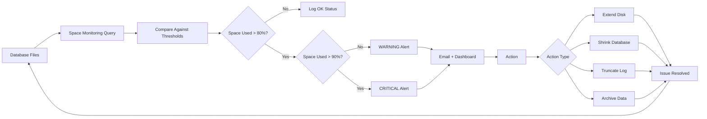

# 8.939 — Database Space Monitoring — File Growth Alerts

## 1. Overview — Space Monitoring Fundamentals

Database space monitoring tracks the size and growth of database files (.mdf, .ndf data files and .ldf log files) to ensure they have sufficient free space for operations. When files run out of space, transactions fail, applications break, and databases may go offline. Proactive monitoring prevents these outages.

- **Data file monitoring**: Data files hold tables, indexes, and other database objects. They grow as data is inserted, updated, or indexed. Running out of data file space prevents inserts and index rebuilds, causing application failures. Monitoring ensures data files have adequate free space for normal growth and peak operations.

- **Log file monitoring**: Transaction log files record all changes made to the database. They grow with transaction volume and shrink with log backups. Running out of log space stops all write operations, effectively freezing the database. Log space monitoring is critical for high-transaction systems.

- **Disk space monitoring**: Database files reside on physical or virtual disks. Even if the database files have free space within them, the disk drive must have sufficient free space for the files to grow. Disk space is the ultimate constraint — when the disk is full, no file can grow regardless of database-level settings.

- **Auto-growth events**: When a database file runs out of allocated space, SQL Server automatically extends the file by the configured growth increment. While auto-growth prevents immediate failure, it is a performance concern because growth operations block ongoing queries. Frequent auto-growth indicates misconfigured initial file sizes.

- **Growth increment configuration**: The growth increment determines how much space is added during an auto-growth event. A small increment causes frequent growth events (more disruptions). A large increment causes fewer but larger growth events (longer disruption). The optimal increment balances these trade-offs.

- **Max file size**: Database files can be configured with a maximum size (max_size). Once reached, no further growth is possible. Unlimited max_size (-1) allows growth until the disk is full. Monitoring should track both used space and remaining disk space.

- **Alert thresholds**: Alerts should fire at warning (80% full) and critical (90% full) levels. For log files, the threshold may be based on absolute size (e.g., log > 50GB) rather than percentage, because log size is workload-dependent.

- **Monitoring frequency**: File-level space monitoring should run every 5-15 minutes. Disk-level monitoring should run every 5 minutes. Auto-growth events should be tracked daily.

## 2. Key Metrics — What to Monitor

### 2.1 File-Level Metrics

- **File size (allocated)**: Total size of the database file on disk. For data files, this is the space reserved for database objects. For log files, this is the space reserved for transaction logging.
- **Space used**: Amount of allocated space that contains actual data (data files) or active log records (log files). Free space within the file is the difference between allocated and used.
- **Percent used**: (Space used / File size) × 100. Shows how full the file is. Used for threshold-based alerting.
- **Growth increment**: The amount by which the file grows during an auto-growth event. Configured as MB or percentage.
- **Growth type**: AUTOGROW (automatic) or MANUAL (manual growth only). Automatic growth allows SQL Server to extend the file as needed.
- **Max file size**: Maximum allowed size for the file. -1 means unlimited, 0 means no growth allowed, specific value means hard limit.

### 2.2 Disk-Level Metrics

- **Total disk space**: Total capacity of the disk volume hosting the database files.
- **Free disk space**: Available space on the disk volume. When this reaches zero, no file can grow.
- **Free percentage**: (Free space / Total space) × 100. Standard alert thresholds: < 20% warning, < 10% critical.
- **Disk queue length**: Average number of I/O requests waiting to be processed. High queue length indicates I/O pressure.

### 2.3 Auto-Growth Metrics

- **Growth event count**: Number of auto-growth events in a time period. Frequent growth indicates misconfigured initial size.
- **Growth duration**: Time taken for each auto-growth event. Larger growth increments take longer and block more queries.
- **Growth increment vs workload**: The growth increment should balance the underlying data file size and growth rate.

### 2.4 TempDB-Specific Metrics

- **TempDB file count**: Number of tempdb data files. Should equal (or be close to) the number of CPU cores for best performance.
- **TempDB file size**: Current size of each tempdb data file. TempDB resets on restart, so size patterns reflect workload.
- **TempDB growth rate**: How fast tempdb grows under normal workload. Spikes indicate query spills or temp object abuse.

## 3. Monitoring Queries — Complete Space Analysis

### 3.1 Complete Database Space Monitoring Query

This query provides a comprehensive view of all database files and their space utilization across the server:

```sql
SELECT
    DB_NAME(mf.database_id) AS database_name,
    mf.name AS file_name,
    mf.type_desc AS file_type,
    mf.physical_name,
    mf.size / 128 AS size_mb,
    CAST(FILEPROPERTY(mf.name, ''SpaceUsed'') AS INT) / 128 AS space_used_mb,
    (mf.size / 128) - CAST(FILEPROPERTY(mf.name, ''SpaceUsed'') AS INT) / 128 AS free_space_mb,
    CAST(CAST(FILEPROPERTY(mf.name, ''SpaceUsed'') AS FLOAT) * 100.0 / NULLIF(mf.size, 0) AS DECIMAL(5,2)) AS pct_used,
    mf.growth / 128 AS growth_increment_mb,
    CASE mf.is_percent_growth
        WHEN 1 THEN CAST(mf.growth AS VARCHAR(10)) + ''%''
        ELSE CAST(mf.growth / 128 AS VARCHAR(10)) + '' MB''
    END AS growth_type,
    CASE mf.max_size
        WHEN -1 THEN ''Unlimited''
        WHEN 0 THEN ''No growth allowed''
        ELSE CAST(mf.max_size / 128 AS VARCHAR(20)) + '' MB''
    END AS max_size,
    vs.available_bytes / 1048576 AS disk_free_space_mb,
    vs.total_bytes / 1048576 AS disk_total_mb,
    CAST(vs.available_bytes * 100.0 / NULLIF(vs.total_bytes, 0) AS DECIMAL(5,2)) AS disk_free_pct
FROM sys.master_files mf
CROSS APPLY sys.dm_os_volume_stats(mf.database_id, mf.file_id) vs
ORDER BY pct_used DESC;
```

### 3.2 Log File Space Monitoring

Log file space is critical for transactional workloads:

```sql
-- Log space usage using DBCC SQLPERF
CREATE TABLE #log_space (
    database_name sysname,
    log_size_mb DECIMAL(18,2),
    log_space_used_pct DECIMAL(18,2),
    status INT
);

INSERT #log_space
EXEC (''DBCC SQLPERF(LOGSPACE)'');

SELECT
    l.database_name,
    l.log_size_mb,
    l.log_space_used_pct,
    (l.log_size_mb * l.log_space_used_pct / 100) AS log_used_mb,
    (l.log_size_mb * (100 - l.log_space_used_pct) / 100) AS log_free_mb,
    vs.available_bytes / 1048576 AS disk_free_mb,
    GETDATE() AS capture_time
FROM #log_space l
JOIN sys.databases d ON l.database_name = d.name
CROSS APPLY sys.dm_os_volume_stats(d.database_id, (SELECT TOP 1 file_id FROM sys.master_files WHERE database_id = d.database_id AND type = 1)) vs
WHERE l.log_space_used_pct > 70
ORDER BY l.log_space_used_pct DESC;

DROP TABLE #log_space;
```

### 3.3 Disk Space Monitoring for All Volumes

Identify which disk volumes are running low on space:

```sql
SELECT DISTINCT
    vs.volume_mount_point,
    vs.logical_volume_name,
    vs.file_system_type,
    vs.total_bytes / 1048576 AS total_mb,
    vs.available_bytes / 1048576 AS free_mb,
    (vs.available_bytes * 100.0 / vs.total_bytes) AS free_pct,
    STRING_AGG(DB_NAME(mf.database_id) + '' ('' + mf.type_desc + '')'', '', '') AS databases_on_volume
FROM sys.master_files mf
CROSS APPLY sys.dm_os_volume_stats(mf.database_id, mf.file_id) vs
GROUP BY vs.volume_mount_point, vs.logical_volume_name, vs.file_system_type, vs.total_bytes, vs.available_bytes
ORDER BY free_pct;
```

### 3.4 Auto-Growth Event Tracking

Track auto-growth events to identify misconfigured file sizes:

```sql
-- Using default trace (available if default trace is enabled)
SELECT
    te.name AS event_name,
    t.DatabaseName,
    t.FileName,
    t.StartTime,
    t.IntegerData AS growth_in_8kb_pages,
    t.IntegerData * 8 / 1024 AS growth_mb,
    t.ApplicationName,
    t.HostName,
    t.LoginName
FROM sys.fn_trace_gettable(
    (SELECT REVERSE(SUBSTRING(REVERSE(path), CHARINDEX(''\'', REVERSE(path)), 255)) + ''log.trc''
     FROM sys.traces WHERE is_default = 1), DEFAULT) t
JOIN sys.trace_events te ON t.EventClass = te.trace_event_id
WHERE te.name IN (''Data File Auto Grow'', ''Log File Auto Grow'')
  AND t.StartTime >= DATEADD(DAY, -7, GETDATE())
ORDER BY t.StartTime DESC;
```

### 3.5 Database File Configuration Audit

Review file configuration for best practices:

```sql
SELECT
    DB_NAME(mf.database_id) AS database_name,
    mf.name AS file_name,
    mf.type_desc,
    mf.size / 128 AS current_size_mb,
    mf.growth / 128 AS growth_mb,
    mf.is_percent_growth,
    mf.max_size,
    CASE
        WHEN mf.type = 0 AND mf.size < 1024 * 128 THEN ''UNDERSIZED - increase initial size''
        WHEN mf.is_percent_growth = 1 THEN ''PERCENT GROWTH - use fixed MB''
        WHEN mf.growth / 128 < 100 AND mf.type = 0 THEN ''GROWTH TOO SMALL - min 100MB for data''
        WHEN mf.growth / 128 < 50 AND mf.type = 1 THEN ''GROWTH TOO SMALL - min 50MB for log''
        ELSE ''OK''
    END AS recommendation
FROM sys.master_files mf
WHERE mf.database_id > 4  -- Exclude system databases
ORDER BY mf.type, database_name;
```

## 4. Alert Configuration — Thresholds and Actions

### 4.1 Per-File Used Space Alerts

Alert when a database file exceeds usage thresholds:

```sql
-- Create alert table
CREATE TABLE dbo.FileSpaceAlerts (
    AlertID INT IDENTITY(1,1) PRIMARY KEY,
    ServerName NVARCHAR(128) NOT NULL,
    DatabaseName NVARCHAR(128) NOT NULL,
    FileName NVARCHAR(128) NOT NULL,
    FileType NVARCHAR(10) NOT NULL,
    FileSizeMB DECIMAL(18,2) NOT NULL,
    SpaceUsedPct DECIMAL(5,2) NOT NULL,
    AlertLevel NVARCHAR(10) NOT NULL,
    AlertTime DATETIME2 NOT NULL DEFAULT GETDATE(),
    Acknowledged BIT NOT NULL DEFAULT 0,
    AcknowledgedBy NVARCHAR(128) NULL,
    AcknowledgedTime DATETIME2 NULL
);

-- Alert check query
INSERT INTO dbo.FileSpaceAlerts (ServerName, DatabaseName, FileName, FileType, FileSizeMB, SpaceUsedPct, AlertLevel)
SELECT
    @@SERVERNAME AS ServerName,
    DB_NAME(mf.database_id) AS DatabaseName,
    mf.name AS FileName,
    mf.type_desc AS FileType,
    mf.size / 128 AS FileSizeMB,
    CAST(CAST(FILEPROPERTY(mf.name, ''SpaceUsed'') AS FLOAT) * 100.0 / NULLIF(mf.size, 0) AS DECIMAL(5,2)) AS SpaceUsedPct,
    CASE
        WHEN CAST(CAST(FILEPROPERTY(mf.name, ''SpaceUsed'') AS FLOAT) * 100.0 / NULLIF(mf.size, 0) AS DECIMAL(5,2)) > 90 THEN ''CRITICAL''
        WHEN CAST(CAST(FILEPROPERTY(mf.name, ''SpaceUsed'') AS FLOAT) * 100.0 / NULLIF(mf.size, 0) AS DECIMAL(5,2)) > 80 THEN ''WARNING''
        ELSE NULL
    END AS AlertLevel
FROM sys.master_files mf
WHERE mf.database_id > 4
  AND CASE
        WHEN CAST(CAST(FILEPROPERTY(mf.name, ''SpaceUsed'') AS FLOAT) * 100.0 / NULLIF(mf.size, 0) AS DECIMAL(5,2)) > 80 THEN 1
        ELSE 0
      END = 1;
```

### 4.2 Disk Space Alerts

Alert when disk free space drops below thresholds:

```sql
DECLARE @WarningThreshold DECIMAL(5,2) = 20.0;
DECLARE @CriticalThreshold DECIMAL(5,2) = 10.0;

SELECT DISTINCT
    vs.volume_mount_point,
    vs.available_bytes / 1048576 AS free_mb,
    vs.total_bytes / 1048576 AS total_mb,
    (vs.available_bytes * 100.0 / vs.total_bytes) AS free_pct,
    CASE
        WHEN (vs.available_bytes * 100.0 / vs.total_bytes) < @CriticalThreshold THEN ''CRITICAL - Immediate action required''
        WHEN (vs.available_bytes * 100.0 / vs.total_bytes) < @WarningThreshold THEN ''WARNING - Plan disk extension''
        ELSE ''OK''
    END AS alert_status,
    STRING_AGG(DB_NAME(mf.database_id), '', '') AS databases_affected
FROM sys.master_files mf
CROSS APPLY sys.dm_os_volume_stats(mf.database_id, mf.file_id) vs
GROUP BY vs.volume_mount_point, vs.available_bytes, vs.total_bytes
HAVING (vs.available_bytes * 100.0 / vs.total_bytes) < @WarningThreshold
ORDER BY free_pct;
```

### 4.3 Alert Response Procedures

| Alert Level | Threshold | Response Time | Action |
|---|---|---|---|
| Disk Critical | < 10% free | Immediate (P1) | Extend disk immediately, notify app teams |
| Disk Warning | < 20% free | Same day (P2) | Plan disk extension, review file growth |
| File Critical | > 90% used | Immediate (P1) | Extend file size, check max_size and disk |
| File Warning | > 80% used | Same day (P2) | Plan file size increase, review growth |
| Log Critical | > 80% used | Immediate (P1) | Check log backup frequency, long txns |
| Log Warning | > 70% used | Same day (P2) | Review log backup schedule |

### 4.4 Auto-Growth Alert

Auto-growth events indicate potential configuration issues:

```sql
WITH autogrowth AS (
    SELECT
        DatabaseName,
        COUNT(*) AS growth_count,
        SUM(t.IntegerData * 8 / 1024) AS total_growth_mb
    FROM sys.fn_trace_gettable(
        (SELECT REVERSE(SUBSTRING(REVERSE(path), CHARINDEX(''\'', REVERSE(path)), 255)) + ''log.trc''
         FROM sys.traces WHERE is_default = 1), DEFAULT) t
    JOIN sys.trace_events te ON t.EventClass = te.trace_event_id
    WHERE te.name IN (''Data File Auto Grow'', ''Log File Auto Grow'')
      AND t.StartTime >= DATEADD(HOUR, -24, GETDATE())
    GROUP BY t.DatabaseName
)
SELECT
    DatabaseName,
    growth_count,
    total_growth_mb,
    CASE
        WHEN growth_count > 20 THEN ''CRITICAL - Multiple growth events, resize files''
        WHEN growth_count > 5 THEN ''WARNING - Frequent growth, consider larger initial size''
        ELSE ''INFO - Occasional growth, monitor''
    END AS recommendation
FROM autogrowth
ORDER BY growth_count DESC;
```

## 5. Architecture — Space Monitoring Pipeline



### 5.1 Data Collection Layer

Collects space metrics from database files and operating system:

- **Query-based collection**: T-SQL queries against sys.database_files, sys.dm_os_volume_stats, DBCC SQLPERF(LOGSPACE)
- **Scheduled execution**: SQL Agent job running every 5-15 minutes
- **Centralized storage**: Results stored in a monitoring database for trend analysis
- **Error handling**: If collection fails, log error and retry on next schedule

### 5.2 Alert Evaluation Layer

Evaluates collected metrics against configured thresholds:

- **File-level alerts**: Per-file space used percentage
- **Disk-level alerts**: Per-disk free space percentage
- **Auto-growth alerts**: Count of auto-growth events in time window
- **Threshold configuration**: Configurable per database or per server group

### 5.3 Notification Layer

Delivers alerts through appropriate channels:

- **P1 critical**: Phone call, PagerDuty, SMS, email
- **P2 warning**: Email, PagerDuty (business hours)
- **P3 info**: Email, dashboard update
- **Consolidation**: Group alerts by server to reduce notification volume

### 5.4 Response Layer

Actions triggered by space alerts:

- **Short-term**: Extend disk (cloud API, hypervisor), shrink log file (after backup), extend data file
- **Medium-term**: Reconfigure growth settings, adjust initial file sizes, review backup frequency
- **Long-term**: Capacity planning, storage procurement, data archiving, retention policy review

## 6. Production — Best Practices

### 6.1 Proper Initial Sizing

Pre-sizing database files prevents auto-growth events during normal operations:

- **Data files**: Set initial size to accommodate 3-6 months of projected growth
- **Log files**: Set initial size to accommodate 2-4 hours of peak transaction volume
- **Growth increment**: Fixed MB value (not percentage). Data: 1GB, Log: 500MB-1GB
- **Max size**: Set reasonable max size to prevent runaway growth filling the disk
- **TempDB**: Set initial size to accommodate normal workload (1-8GB per file)

### 6.2 Log File Management

Transaction log management directly controls log file size:

- **Log backups**: Frequent log backups (every 5-15 minutes for OLTP) keep log small
- **Backup frequency**: Log file size is determined by backup frequency
- **Long-running transactions**: Open transactions prevent log truncation
- **VLF count**: Set initial size and growth increments to maintain reasonable VLF count
- **Monitoring**: Track log space used percentage and backup timing

### 6.3 Separate Data and Log Disks

Best practice is to separate data and log files on different disks:

- **I/O separation**: Log writes are sequential, data reads/writes are random
- **Disk failure isolation**: If data disk fails, log disk may still be intact for recovery
- **Alert separation**: Monitor data and log disks independently with different thresholds
- **Performance**: Separate disks prevent I/O contention between data and log operations

### 6.4 Pre-Growth Database File Extension

Proactively extend database files during maintenance windows:

- **Process**: During maintenance, extend data files by 10-20% of current size
- **Scheduling**: Quarterly or bi-annual pre-growth during planned maintenance
- **Benefits**: Prevents auto-growth events during peak hours
- **Log files**: Pre-grow log files before scheduled batch operations or migrations

### 6.5 Adding File Growth Alerts to Existing Monitoring

Integrate file growth alerts with existing monitoring infrastructure:

- **SQL Agent**: T-SQL job checks every 5 minutes, fires alerts via Database Mail
- **Azure Monitor**: Metric alerts for Azure SQL Database
- **Prometheus/Grafana**: sql_exporter for metrics, Grafana for alerting
- **SCOM/System Center**: Management pack for SQL Server
- **Third-party tools**: SQL Sentry, Redgate SQL Monitor, IDERA

### 6.6 Storage Tiering and File Placement

Place database files on appropriate storage tiers:

- **Performance tier**: High-performance SSDs for active data and log files
- **Capacity tier**: Standard HDDs for archived or read-only databases
- **TempDB**: Fastest available storage (NVMe SSD preferred)
- **Azure SQL**: Tier selection (General Purpose vs Business Critical) determines I/O limits
- **Cost optimization**: Match storage tier to performance requirements

### 6.7 Shrink Database (When Necessary)

Database shrink should be used sparingly:

- **When to shrink**: After large data purges, after moving data to archive
- **Risks**: Shrinking causes index fragmentation and I/O pressure
- **Process**: Shrink in small increments, monitor log growth, rebuild indexes after
- **Alternative**: Let the database file remain large for future growth

### 6.8 Monitoring Alert Effectiveness

Track the effectiveness of space alerts over time:

- **Alert frequency**: Number of space alerts per week
- **Response time**: Time between alert and acknowledgment
- **Resolution time**: Time to resolve the space issue
- **Repeat alerts**: Same database triggering same alert multiple times
- **False positive rate**: Alerts that didn't require action

## 7. Implementation — Automated Monitoring Script

### 7.1 SQL Agent Job for Space Monitoring

```sql
USE msdb;
GO

EXEC dbo.sp_add_job
    @job_name = N''Database Space Monitoring'',
    @description = N''Monitors database file and disk space every 15 minutes'',
    @category_name = N''Database Maintenance'',
    @owner_login_name = N''sa'';

EXEC dbo.sp_add_jobstep
    @job_name = N''Database Space Monitoring'',
    @step_name = N''Check File Space'',
    @subsystem = N''TSQL'',
    @command = N''
        INSERT INTO DBA.dbo.SpaceAlertHistory (
            ServerName, DatabaseName, FileName, FileType,
            SizeMB, SpaceUsedMB, FreeSpaceMB, PctUsed,
            GrowthMB, MaxSizeMB, DiskFreeMB
        )
        SELECT
            @@SERVERNAME,
            DB_NAME(mf.database_id),
            mf.name,
            mf.type_desc,
            mf.size / 128,
            CAST(FILEPROPERTY(mf.name, ''''SpaceUsed'''') AS INT) / 128,
            (mf.size / 128) - CAST(FILEPROPERTY(mf.name, ''''SpaceUsed'''') AS INT) / 128,
            CAST(CAST(FILEPROPERTY(mf.name, ''''SpaceUsed'''') AS FLOAT) * 100.0 / NULLIF(mf.size, 0) AS DECIMAL(5,2)),
            mf.growth / 128,
            CASE mf.max_size WHEN -1 THEN -1 ELSE mf.max_size / 128 END,
            vs.available_bytes / 1048576
        FROM sys.master_files mf
        CROSS APPLY sys.dm_os_volume_stats(mf.database_id, mf.file_id) vs
        WHERE mf.database_id > 4;'',
    @database_name = N''master'';

EXEC dbo.sp_add_jobstep
    @job_name = N''Database Space Monitoring'',
    @step_name = N''Generate Alerts'',
    @subsystem = N''TSQL'',
    @command = N''
        INSERT INTO DBA.dbo.SpaceAlerts (DatabaseName, FileName, PctUsed, AlertLevel)
        SELECT
            DatabaseName, FileName, PctUsed,
            CASE WHEN PctUsed > 90 THEN ''''CRITICAL'''' ELSE ''''WARNING'''' END
        FROM DBA.dbo.SpaceAlertHistory
        WHERE PctUsed > 80
          AND CaptureTime = (SELECT MAX(CaptureTime) FROM DBA.dbo.SpaceAlertHistory);'',
    @database_name = N''DBA'';

EXEC dbo.sp_add_schedule
    @schedule_name = N''SpaceMonitoring_15min'',
    @freq_type = 4,
    @freq_interval = 1,
    @freq_subday_type = 4,
    @freq_subday_interval = 15,
    @active_start_time = 0;

EXEC dbo.sp_attach_schedule
    @job_name = N''Database Space Monitoring'',
    @schedule_name = N''SpaceMonitoring_15min'';

EXEC dbo.sp_add_jobserver
    @job_name = N''Database Space Monitoring'';
```

### 7.2 PowerShell Monitoring Script

```powershell
param(
    [string]$ServerInstance = "localhost",
    [int]$FileWarningThreshold = 80,
    [int]$FileCriticalThreshold = 90,
    [int]$DiskWarningThreshold = 20,
    [int]$DiskCriticalThreshold = 10
)

$query = @"
SELECT
    DB_NAME(mf.database_id) AS DatabaseName,
    mf.name AS FileName,
    mf.type_desc AS FileType,
    mf.size / 128 AS SizeMB,
    CAST(FILEPROPERTY(mf.name, ''SpaceUsed'') AS INT) / 128 AS SpaceUsedMB,
    CAST(CAST(FILEPROPERTY(mf.name, ''SpaceUsed'') AS FLOAT) * 100.0 / NULLIF(mf.size, 0) AS DECIMAL(5,2)) AS PctUsed,
    vs.available_bytes / 1048576 AS DiskFreeMB,
    vs.total_bytes / 1048576 AS DiskTotalMB
FROM sys.master_files mf
CROSS APPLY sys.dm_os_volume_stats(mf.database_id, mf.file_id) vs
WHERE mf.database_id > 4;
"@

$results = Invoke-SqlCmd -ServerInstance $ServerInstance -Database "master" -Query $query

$alerts = @()

foreach ($row in $results) {
    if ($row.PctUsed -ge $FileCriticalThreshold) {
        $alerts += [PSCustomObject]@{
            Severity = "CRITICAL"
            Message = "Database file $($row.FileName) in $($row.DatabaseName) is $($row.PctUsed)% full"
            FileName = $row.FileName
            DatabaseName = $row.DatabaseName
            PctUsed = $row.PctUsed
        }
    }
    elseif ($row.PctUsed -ge $FileWarningThreshold) {
        $alerts += [PSCustomObject]@{
            Severity = "WARNING"
            Message = "Database file $($row.FileName) in $($row.DatabaseName) is $($row.PctUsed)% full"
            FileName = $row.FileName
            DatabaseName = $row.DatabaseName
            PctUsed = $row.PctUsed
        }
    }

    if ($row.DiskFreeMB -gt 0 -and ($row.DiskFreeMB * 100 / $row.DiskTotalMB) -lt $DiskCriticalThreshold) {
        $alerts += [PSCustomObject]@{
            Severity = "CRITICAL"
            Message = "Disk for $($row.DatabaseName) has only $($row.DiskFreeMB)MB free"
        }
    }
}

if ($alerts.Count -gt 0) {
    $body = $alerts | ConvertTo-Json
    $webhookUrl = "https://hooks.company.com/alerts"
    Invoke-RestMethod -Uri $webhookUrl -Method Post -Body $body -ContentType "application/json"
}
```

## 8. Gotchas — Common Pitfalls and Edge Cases

### 8.1 Auto-Growth Pauses Query Execution

When SQL Server auto-grows a data or log file, the growth operation is synchronous and blocks queries:

- **Data files**: With IFI enabled, data file growth is fast but still takes a lock briefly
- **Log files**: IFI does not apply. Log growth zero-initializes pages and is slow
- **Impact**: A 1GB log growth can take 5-30 seconds, blocking all write transactions
- **Mitigation**: Pre-size files, use fixed MB increments, monitor auto-growth events

### 8.2 Instant File Initialization

IFI dramatically speeds up data file growth:

- **What it does**: Skips zero-initialization of new pages, making growth near-instantaneous
- **Log files**: IFI does NOT apply to log files (must zero-initialize for crash recovery)
- **Enabling IFI**: Grant SE_MANAGE_VOLUME_NAME to SQL Server service account
- **Security**: May expose deleted data if compliance requires zero-initialization
- **Verification**: Check error log for "Database Instant File Initialization: enabled"

### 8.3 Volume Size vs Database Quotas (Azure SQL)

Azure SQL Database has different space models:

- **Azure SQL DB**: Size limited by service tier (e.g., S2: 250GB, S3: 500GB)
- **Managed Instance**: Instance-level storage limit
- **Monitoring**: Monitor used space as percentage of tier maximum
- **Scaling**: Capacity planning involves tier upgrade, not disk extension
- **dm_os_volume_stats**: Not available in Azure SQL DB

### 8.4 TempDB Growth Patterns

TempDB has unique growth characteristics:

- **Resets on restart**: TempDB is recreated from model database on service restart
- **Workload-driven**: Grows based on activity level, not data volume
- **Spill detection**: Sudden growth indicates query spills
- **Initial size**: Set to accommodate normal workload to avoid auto-growth
- **File count**: Multiple files reduce allocation contention

### 8.5 Log Growth and Backup Interdependence

Log file size is directly tied to backup frequency:

- **No backups**: Log file grows indefinitely until disk is full
- **Infrequent backups**: Log grows large between backups
- **Long-running transactions**: Prevent log truncation even with backups
- **Log shipping / replication**: May prevent log truncation
- **Recommendation**: Log backups every 5-15 minutes for OLTP workloads

### 8.6 System Database Space

System databases also need space monitoring:

- **master**: Small but critical. Monitor for unexpected growth
- **msdb**: Can grow with job history, backup history, SSIS packages
- **model**: Template for new databases. Changes affect all new databases
- **tempdb**: Handled separately due to restart behavior
- **Cleaning**: Regularly purge msdb job and backup history

### 8.7 Percentage Growth Is Dangerous

Using percentage-based growth increments is problematic:

- **Problem**: As files grow, the growth increment grows too
- **Example**: 10% growth on a 500GB file = 50GB growth event
- **Duration**: 50GB growth can take minutes, blocking all queries
- **Solution**: Always use fixed MB growth increments
- **Recommendation**: 1GB for data files, 500MB-1GB for log files

### 8.8 Unrestricted File Growth Fills Disks

Max size settings prevent runaway growth:

- **Problem**: Unlimited max size (-1) allows files to grow until disk is full
- **Impact**: Disk full causes all databases on that drive to fail
- **Solution**: Set max size for each file (e.g., 90% of disk capacity)
- **Monitoring**: Alert when files approach max size

## 9. Related Notes — Cross-References

### 9.1 Prerequisites

- [[8.937 — Capacity Planning — Growth Monitoring]] — Growth monitoring for predictive capacity planning
- [[8.282 — Database Files — MDF, NDF, LDF Roles]] — Database file types and purposes

### 9.2 Direct Predecessors and Successors

- [[8.939 — Database Space Monitoring — File Growth Alerts]] — Current note
- [[8.936 — Database Alerts — Threshold Configuration]] — Alert threshold configuration framework
- [[8.324 — Log File Management — VLF and Shrinking]] — Log file management best practices
- [[8.287 — VLF Fragmentation — Detection and Fix]] — VLF fragmentation and remediation

### 9.3 Related Monitoring Notes

- [[8.938 — Index Fragmentation — Scheduled Monitoring]] — Index fragmentation affects space utilization
- [[8.937 — Capacity Planning — Growth Monitoring]] — Predictive growth tracking
- [[8.916 — SQL Server Monitoring — Key Metrics]] — Core monitoring metrics

### 9.4 Database File Notes

- [[8.282 — Database Files — MDF, NDF, LDF Roles]] — Understanding file types
- [[8.324 — Log File Management — VLF and Shrinking]] — Managing transaction log files
- [[8.287 — VLF Fragmentation — Detection and Fix]] — VLF health and optimization

### 9.5 Cloud and Azure Notes

- [[8.927 — Azure SQL Intelligent Insights]] — Built-in monitoring for Azure SQL
- [[8.930 — Application Insights — SQL Dependency Tracking]] — Application-level dependency monitoring

## 10. References — Sources and Further Reading

### 10.1 Official Microsoft Documentation

- sys.database_files: Microsoft Docs
- sys.dm_os_volume_stats: Microsoft Docs
- DBCC SQLPERF(LOGSPACE): Microsoft Docs
- Instant File Initialization: Microsoft Docs
- Azure SQL Database resource limits: Microsoft Docs

### 10.2 Books

- "SQL Server 2019 Administration Inside Out" by William Assaf, Randolph West, et al.
- "Troubleshooting SQL Server: A Guide for the Accidental DBA" by Jonathan Kehayias
- "Professional SQL Server 2017 Administration" by Peter Carter

### 10.3 Online Resources

- Brent Ozar Unlimited: sp_BlitzFirst, sp_BlitzWho
- Paul Randal (SQLSkills): Log space management
- Ola Hallengren: SQL Server Maintenance Solution

### 10.4 Tools

- Grafana: Dashboard visualization for space metrics
- Prometheus: Metrics collection for time-series data
- SQL Sentry: Commercial SQL Server monitoring
- Redgate SQL Monitor: Commercial monitoring and alerting

### 10.5 Community Standards

- Space monitoring interval: Every 5-15 minutes
- Growth increment: Fixed MB, not percentage
- Initial size: 3-6 months of projected growth
- Max size: Set to prevent disk full scenarios

### 10.6 Template Version

- Note ID: 8.939
- Last updated: 2026-06-27
- Template: Database Note v2 — Database Space Monitoring
- Section structure: 10 sections including overview, key metrics, queries, alerts, architecture, production, implementation, gotchas, related notes, references

## 7.3 Database Mail Notification Setup

Configure Database Mail for sending alert notifications:

```sql
USE msdb;
GO

-- Enable Database Mail
EXEC sp_configure ''show advanced options'', 1;
RECONFIGURE;
EXEC sp_configure ''Database Mail XPs'', 1;
RECONFIGURE;

-- Create mail profile
EXEC msdb.dbo.sysmail_add_profile_sp
    @profile_name = ''DBA Alerts'',
    @description = ''Profile for database space alerts'';

-- Add account to profile
EXEC msdb.dbo.sysmail_add_principalprofile_sp
    @profile_name = ''DBA Alerts'',
    @principal_name = ''public'',
    @is_default = 1;

-- Send alert email
EXEC msdb.dbo.sp_send_dbmail
    @profile_name = ''DBA Alerts'',
    @recipients = ''dba-team@company.com'',
    @subject = ''CRITICAL: Disk space low on ServerX'',
    @body = ''Disk C:\ on ServerX has less than 10% free space. Immediate action required.'';

-- Query mail status
SELECT * FROM msdb.dbo.sysmail_allitems ORDER BY mailitem_id DESC;
```

## 7.4 Notification Integration with Webhook

Send alerts to webhook endpoints:

```sql
CREATE PROCEDURE dbo.SendSpaceWebhookAlert
    @DatabaseName NVARCHAR(128),
    @FileName NVARCHAR(128),
    @PctUsed DECIMAL(5,2),
    @AlertLevel NVARCHAR(10)
AS
BEGIN
    DECLARE @Payload NVARCHAR(MAX);
    DECLARE @WebhookUrl NVARCHAR(500) = ''https://hooks.company.com/alerts'';
    DECLARE @Object INT;
    DECLARE @Status INT;

    SET @Payload = ''{
        "alert": "Database Space Alert",
        "server": "'' + @@SERVERNAME + ''",
        "database": "'' + @DatabaseName + ''",
        "file": "'' + @FileName + ''",
        "pct_used": '' + CAST(@PctUsed AS VARCHAR(10)) + '',
        "severity": "'' + @AlertLevel + ''"
    }'';

    EXEC sp_OACreate ''WinHttp.WinHttpRequest.5.1'', @Object OUT;
    EXEC sp_OAMethod @Object, ''Open'', NULL, ''POST'', @WebhookUrl, false;
    EXEC sp_OAMethod @Object, ''SetRequestHeader'', NULL, ''Content-Type'', ''application/json'';
    EXEC sp_OAMethod @Object, ''Send'', NULL, @Payload;
    EXEC sp_OAGetProperty @Object, ''Status'', @Status OUT;
    EXEC sp_OADestroy @Object;
END;
```

## 8.5 File Growth Monitoring for SAN/NAS Storage

Storage area networks have unique considerations:

- **Thin provisioning**: Disks appear large but have limited physical space
- **Over-commitment**: SAN may over-commit physical storage across many volumes
- **Storage monitoring**: Integration with storage team monitoring is essential
- **Snapshot space**: Snapshots consume additional storage space
- **Deduplication**: Deduplication affects space reporting at OS level
- **Monitoring approach**: Use both OS-level and storage-level monitoring

## 8.6 File Growth During Maintenance Operations

Certain operations cause rapid file growth:

- **Index rebuild**: Can double the size of the index during rebuild
- **Data migration**: Bulk inserts cause rapid data file growth
- **DBCC CHECKDB**: Creates temporary internal snapshot
- **Version store**: Long-running transactions increase tempdb version store
- **Monitoring**: Track log file size during maintenance operations
- **Capacity**: Ensure sufficient disk space before starting maintenance

## 8.7 Database File Shrink Repercussions

Shrinking database files has long-term consequences:

- **Fragmentation**: Shrink causes index fragmentation (requires rebuild)
- **I/O storm**: Shrink operation causes significant I/O
- **File fragmentation**: OS file may become fragmented after shrink
- **Growth pattern**: File will grow again, potentially causing auto-growth
- **Best practice**: Avoid routine shrink. Plan for permanent file size

## 8.8 Monitoring in Containerized Environments

SQL Server in containers has different space characteristics:

- **Ephemeral storage**: Containers may have limited, temporary storage
- **Persistent volumes**: Map container paths to persistent storage
- **Storage limits**: Container orchestrators enforce storage quotas
- **Log management**: Log files in containers need special handling
- **Monitoring**: Use container-level monitoring in addition to SQL Server monitoring
- **Orchestration**: Kubernetes persistent volume monitoring

## 8.9 Multi-Tenant Database Space

For multi-tenant databases, space is shared across tenants:

- **Tenant isolation**: One tenant growing unexpectedly affects all tenants
- **Monitoring per tenant**: Track space usage by tenant if possible
- **Storage quotas**: Set database-level or filegroup-level quotas
- **Alerting**: Alert on per-tenant space spikes
- **Sizing**: Model: total space = (per-tenant data × tenant count) × growth factor

## 8.10 Log File VLF Fragmentation

Excessive VLFs affect log file management:

- **VLF creation**: Each auto-growth event creates new VLFs
- **Problem**: Many small auto-growths create thousands of VLFs
- **Impact**: Slow backup restore, long recovery time
- **Detection**: Check VLF count with DBCC LOGINFO
- **Prevention**: Use large growth increments to limit VLF count
- **Fix**: Rebuild log file (detach, rename, create new log)

## 8.11 Azure SQL Database DTU/E-DTU Throttling

Azure SQL throttles resource usage based on tier:

- **DTU throttling**: When DTU usage exceeds tier limit, queries are queued
- **Space operations**: Index rebuild, shrink, and growth consume DTUs
- **Impact**: Throttling slows down maintenance and growth operations
- **Monitoring**: Track DTU consumption alongside space metrics
- **Tier selection**: Use higher tier during maintenance windows

## 8.12 Database File Encryption Impact

Encrypted database files (TDE) affect space and growth:

- **Size increase**: Encrypted files may be slightly larger than unencrypted
- **Backup compression**: Encrypted backups compress less effectively
- **Performance**: Encryption adds CPU overhead to I/O operations
- **Growth**: Encryption does not significantly affect growth behavior
- **Monitoring**: Standard space monitoring works the same with TDE

## 8.13 Migrating Databases Across Volumes

When disks run out of space, migrating database files may be necessary:

- **Offline migration**: Detach database, move files, reattach
- **Online migration**: ALTER DATABASE MODIFY FILE with new path
- **Log shipping**: Use log shipping for migration with minimal downtime
- **Availability groups**: Add replica with new path, remove old replica
- **Planning**: Ensure adequate space on destination before migration
- **Testing**: Test migration process in non-production first

