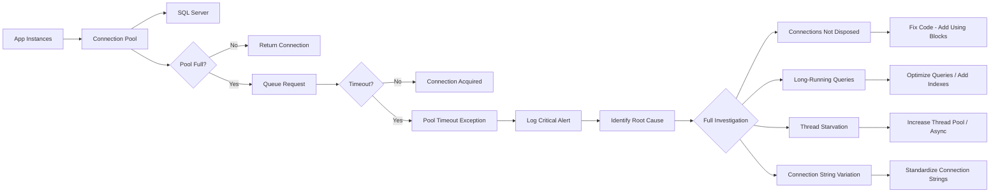

# 8.940 — Connection Pool Monitoring — Pool Exhaustion

## 1. Overview — Connection Pooling Fundamentals

ADO.NET connection pooling is a mechanism that maintains a cache of physical database connections for reuse. When an application opens a connection, the pool returns an existing open connection from the pool rather than creating a new one. When the application closes/disposes the connection, it returns to the pool rather than being physically closed. This significantly reduces the overhead of establishing connections.

- **Pool creation**: A pool is created for each unique connection string. When a connection is first opened with a specific connection string, a pool is created with that connection string as the key. Each pool maintains a set of active and available connections.

- **Pool reuse**: Subsequent Open calls with the same connection string reuse connections from the pool. This avoids the TCP handshake, SSL negotiation, and SQL Server login process for every database operation.

- **Pool lifecycle**: Pools exist for the lifetime of the application domain. They are not destroyed until the process ends. In ASP.NET, this means the pool exists until the application pool recycles.

- **Connection string match**: Pool matching is exact — every character in the connection string must match, including case, spaces, and parameter order. A different case in a parameter value creates a new pool.

- **Max Pool Size**: The maximum number of physical connections in the pool. Default is 100. When all connections are in use and the pool reaches this limit, new Open calls wait (for Connection Timeout seconds) and then throw an InvalidOperationException: "The timeout period elapsed prior to obtaining a connection from the pool."

- **Min Pool Size**: The minimum number of connections maintained in the pool. Default is 0. When set to a value > 0, the pool is pre-populated with that many connections on first Open call.

- **Connection Lifetime**: The maximum age of a connection in seconds. Connections older than this are destroyed when returned to the pool. Default is 0 (infinite). Useful for load balancing scenarios.

- **Connection Reset**: When a connection is returned to the pool, it is reset to its initial state (rollback transactions, release locks). This ensures connection state does not leak between uses.

- **Pool fragmentation**: Pools are created per unique connection string. Variations in connection strings (e.g., different database names, different credentials) create separate pools, each with their own Max Pool Size limit.

- **Pool exhaustion**: Occurs when all connections in the pool are in use and the pool has reached its maximum size. New connection attempts wait and eventually timeout. This is a critical application failure that prevents users from accessing the database.

- **Connection leaks**: The most common cause of pool exhaustion. When connections are not properly disposed (e.g., missing using statements, exceptions before close), they remain marked as "in use" indefinitely, depleting the pool.

## 2. Key Concepts — How Connection Pooling Works

### 2.1 Pool Creation and Management

- **First request**: When the first connection with a unique connection string is opened, the pool is created. If Min Pool Size > 0, that many physical connections are created immediately.
- **Subsequent requests**: Open requests check the pool for available connections. If one exists, it is returned. If none are available and the pool is not at Max Pool Size, a new physical connection is created.
- **Peak usage**: During peak load, multiple connections are created simultaneously. Each new connection requires a TCP handshake, TLS negotiation, and SQL Server login.
- **Pool drain**: When connections are not returned to the pool (due to leaks or long-running operations), the pool depletes. New connections are created until Max Pool Size is reached, then requests queue.
- **Pool cleanup**: The pool's cleanup thread removes connections that exceed Connection Lifetime or have been idle for more than 4-8 minutes.

### 2.2 Connection Pool Exhaustion

Pool exhaustion occurs when the application needs more connections than Max Pool Size allows. The symptom is a timeout exception when calling SqlConnection.Open().

- **Exception message**: "The timeout period elapsed prior to obtaining a connection from the pool. This may have occurred because all pooled connections were in use and max pool size was reached."
- **Impact**: All database operations fail. Users see errors or blank pages. The application is effectively down.
- **Recovery**: Connections must be released back to the pool. This happens when:
  - Active transactions complete and connections are closed
  - Long-running queries finish
  - Connection leak code paths are identified and fixed
  - Application pool is recycled (all connections are destroyed)

### 2.3 Connection Leaks

Connection leaks are the #1 cause of pool exhaustion:

- **Missing Dispose**: Using SqlConnection without a using block or try/finally. If an exception occurs before conn.Close(), the connection remains open.
- **Unclosed DataReaders**: DataReader keeps the connection open until closed. Forgetting to close the reader keeps the connection in use.
- **Async operations**: In async code, connections may not be properly disposed if the async flow is interrupted or exception handling is missing.
- **Static connections**: Storing connections in static variables or singletons. These connections are never returned to the pool.
- **Transaction scope**: Uncommitted transactions keep connections open until the transaction completes or times out.

### 2.4 Performance Counters for Pooling

.NET provides performance counters to monitor connection pooling:

- **Current # of Connection Pools**: Number of pools (one per unique connection string)
- **Current # Pooled and Non-pooled Connections**: Total connections (pooled + non-pooled)
- **Current # Pooled Connections**: Connections currently in the pool (available for use)
- **Peak # Pooled Connections**: Maximum connections ever in the pool
- **Total # Failed Connects**: Connection failures including pool timeout

## 3. Monitoring — SQL Server Side

### 3.1 Current Connections by Application

```sql
SELECT
    dec.session_id,
    dec.connect_time,
    dec.protocol_type,
    dec.auth_scheme,
    dec.client_net_address,
    des.host_name,
    des.program_name,
    des.login_name,
    des.status,
    des.cpu_time,
    des.memory_usage,
    des.total_scheduled_time,
    des.total_elapsed_time,
    der.blocking_session_id,
    der.wait_type,
    der.wait_time,
    der.wait_resource,
    der.command,
    der.status AS request_status
FROM sys.dm_exec_connections dec
JOIN sys.dm_exec_sessions des
    ON dec.session_id = des.session_id
LEFT JOIN sys.dm_exec_requests der
    ON dec.session_id = der.session_id
ORDER BY des.program_name, des.host_name;
```

### 3.2 Connection Count by Application and Database

```sql
SELECT
    DB_NAME(database_id) AS database_name,
    program_name,
    host_name,
    login_name,
    COUNT(*) AS connection_count,
    COUNT(CASE WHEN status = ''running'' THEN 1 END) AS active_requests,
    MIN(connect_time) AS earliest_connection,
    MAX(connect_time) AS latest_connection
FROM sys.dm_exec_sessions
WHERE is_user_process = 1
GROUP BY database_id, program_name, host_name, login_name
ORDER BY connection_count DESC;
```

### 3.3 Connection Pool Monitoring — Track Active Sessions

```sql
SELECT
    dec.session_id,
    des.program_name,
    des.host_name,
    des.login_name,
    DB_NAME(des.database_id) AS database_name,
    des.status,
    des.last_request_start_time,
    des.last_request_end_time,
    des.reads,
    des.writes,
    des.logical_reads,
    der.start_time AS request_start_time,
    der.status AS request_status,
    der.command,
    der.wait_type,
    der.wait_time,
    der.blocking_session_id
FROM sys.dm_exec_connections dec
JOIN sys.dm_exec_sessions des
    ON dec.session_id = des.session_id
LEFT JOIN sys.dm_exec_requests der
    ON dec.session_id = der.session_id
WHERE des.is_user_process = 1
  AND des.status != ''sleeping''
ORDER BY des.last_request_start_time;
```

### 3.4 Detect Connections Waiting on Pool

```sql
-- Connections from pool waiting for pool resources
SELECT
    session_id,
    wait_type,
    wait_time,
    wait_resource,
    blocking_session_id,
    command,
    text
FROM sys.dm_exec_requests r
CROSS APPLY sys.dm_exec_sql_text(r.sql_handle)
WHERE wait_type LIKE ''%POOL%''
   OR wait_type LIKE ''%CONNECTION%''
ORDER BY wait_time DESC;
```

### 3.5 Idle Connections in Pool

```sql
-- Connections that are sleeping (idle in pool)
SELECT
    session_id,
    program_name,
    host_name,
    login_name,
    DB_NAME(database_id) AS database_name,
    last_request_start_time,
    last_request_end_time,
    DATEDIFF(SECOND, last_request_end_time, GETDATE()) AS idle_seconds,
    reads,
    writes
FROM sys.dm_exec_sessions
WHERE is_user_process = 1
  AND status = ''sleeping''
  AND last_request_end_time < DATEADD(MINUTE, -10, GETDATE())
ORDER BY idle_seconds DESC;
```

## 4. Monitoring — .NET Application Side

### 4.1 Performance Counter Monitoring via PowerShell

```powershell
# Monitor SQL Server connection pooling performance counters
$category = ".NET CLR Data"
$counters = @(
    "SqlClient: Current # of connection pools",
    "SqlClient: Current # pooled and nonpooled connections",
    "SqlClient: Current # pooled connections",
    "SqlClient: Peak # pooled connections"
)

foreach ($counter in $counters) {
    $sample = Get-Counter -Counter "\$category($processName)\$counter" -ErrorAction SilentlyContinue
    if ($sample) {
        Write-Output "$counter : $($sample.CounterSamples.CookedValue)"
    }
}

# Monitor for pool exhaustion - high non-pooled connections
$nonPooled = (Get-Counter "\$category($processName)\SqlClient: Current # pooled and nonpooled connections").CounterSamples.CookedValue
$pooled = (Get-Counter "\$category($processName)\SqlClient: Current # pooled connections").CounterSamples.CookedValue
$active = $nonPooled - $pooled
Write-Output "Active (non-pooled) connections: $active"
Write-Output "Total connections: $nonPooled"
Write-Output "Pooled (available) connections: $pooled"
```

### 4.2 EventSource Monitoring (Microsoft.Data.SqlClient)

```csharp
using System.Diagnostics.Tracing;

public class ConnectionPoolEventListener : EventListener
{
    protected override void OnEventSourceCreated(EventSource eventSource)
    {
        if (eventSource.Name == "Microsoft.Data.SqlClient.EventSource")
        {
            EnableEvents(eventSource, EventLevel.Informational,
                EventKeywords.All, new Dictionary<string, string>
                {
                    { "EventCounterIntervalSec", "60" }
                });
        }
    }

    protected override void OnEventWritten(EventWrittenEventArgs eventData)
    {
        if (eventData.EventName == "EventCounters")
        {
            foreach (var payload in eventData.Payload)
            {
                var counter = payload as IDictionary<string, object>;
                var counterName = counter?["Name"]?.ToString();
                var meanValue = counter?["Mean"] ?? counter?["Increment"];

                switch (counterName)
                {
                    case "hard-connections-opened":
                        Log($"Hard connections opened: {meanValue}");
                        break;
                    case "connection-pool-empty":
                        Log($"Connection pool empty count: {meanValue}");
                        break;
                    case "active-connection-pool-groups":
                        Log($"Active pool groups: {meanValue}");
                        break;
                }
            }
        }
    }

    private void Log(string message)
    {
        // Send to your logging system
        Console.WriteLine($"[ConnectionPool] {message}");
    }
}
```

### 4.3 EventCounters — Application Code

```csharp
// Monitor connection pool metrics using .NET EventCounters
public class ConnectionPoolMetrics
{
    private readonly ILogger<ConnectionPoolMetrics> _logger;
    private long _poolEmptyCount;
    private long _connectionsOpened;

    public ConnectionPoolMetrics(ILogger<ConnectionPoolMetrics> logger)
    {
        _logger = logger;
    }

    public void StartMonitoring()
    {
        var sqlListener = new SqlConnectionPoolEventListener(metrics =>
        {
            _logger.LogInformation(
                "SqlClient: PoolEmpty={PoolEmpty}, ConnectionsOpened={Opened}, " +
                "ActivePools={ActivePools}",
                metrics.PoolEmptyCount,
                metrics.HardConnectionsOpened,
                metrics.ActivePoolGroups);
        });
    }
}

internal class SqlConnectionPoolEventListener : EventListener
{
    private readonly Action<ConnectionPoolMetricsSnapshot> _callback;

    public SqlConnectionPoolEventListener(Action<ConnectionPoolMetricsSnapshot> callback)
    {
        _callback = callback;
    }

    protected override void OnEventSourceCreated(EventSource eventSource)
    {
        if (eventSource.Name == "Microsoft.Data.SqlClient.EventSource")
        {
            EnableEvents(eventSource, EventLevel.Informational,
                EventKeywords.All, new Dictionary<string, string>
                {
                    { "EventCounterIntervalSec", "60" }
                });
        }
    }

    protected override void OnEventWritten(EventWrittenEventArgs eventData)
    {
        if (eventData.EventName == "EventCounters" && eventData.Payload != null)
        {
            var snapshot = new ConnectionPoolMetricsSnapshot();
            foreach (var payload in eventData.Payload)
            {
                if (payload is IDictionary<string, object> counter)
                {
                    var name = counter["Name"]?.ToString();
                    var mean = counter.ContainsKey("Mean") ? counter["Mean"] : null;
                    var increment = counter.ContainsKey("Increment") ? counter["Increment"] : null;

                    switch (name)
                    {
                        case "hard-connections-opened":
                            snapshot.HardConnectionsOpened = mean as long? ?? (long)(increment ?? 0);
                            break;
                        case "connection-pool-empty":
                            snapshot.PoolEmptyCount = mean as long? ?? (long)(increment ?? 0);
                            break;
                        case "active-connection-pool-groups":
                            snapshot.ActivePoolGroups = mean as long? ?? (long)(increment ?? 0);
                            break;
                    }
                }
            }
            _callback(snapshot);
        }
    }
}

internal class ConnectionPoolMetricsSnapshot
{
    public long HardConnectionsOpened { get; set; }
    public long PoolEmptyCount { get; set; }
    public long ActivePoolGroups { get; set; }
}

## 5. Detecting Pool Exhaustion in Application Code

### 5.1 Exception Handling for Pool Timeout

```csharp
public async Task<T> ExecuteWithPoolMonitoringAsync<T>(
    string connectionString,
    Func<SqlConnection, Task<T>> queryFunc,
    ILogger logger,
    CancellationToken cancellationToken = default)
{
    var stopwatch = Stopwatch.StartNew();

    try
    {
        await using var connection = new SqlConnection(connectionString);
        await connection.OpenAsync(cancellationToken);
        stopwatch.Stop();

        if (stopwatch.ElapsedMilliseconds > 1000)
        {
            logger.LogWarning(
                "Connection open took {DurationMs}ms. Pool may be under pressure.",
                stopwatch.ElapsedMilliseconds);
        }

        return await queryFunc(connection);
    }
    catch (InvalidOperationException ex) when (ex.Message.Contains("timeout"))
    {
        logger.LogError(ex,
            "Connection pool timeout after {DurationMs}ms. " +
            "Pool may be exhausted. Active connections: {ActiveCount}",
            stopwatch.ElapsedMilliseconds,
            GetActiveConnectionCount(connectionString));

        throw new DatabasePoolExhaustionException(
            "Connection pool exhausted. Retry later.", ex);
    }
    catch (SqlException ex) when (ex.Number == -2)
    {
        logger.LogError(ex,
            "Connection timeout (SQL error -2). Pool may be exhausted.");

        throw new DatabasePoolExhaustionException(
            "Connection timeout. Pool may be exhausted.", ex);
    }
}

private int GetActiveConnectionCount(string connectionString)
{
    // Use performance counters or DMV query to get active count
    // This is a simplified example
    return -1; // Unknown
}

public class DatabasePoolExhaustionException : Exception
{
    public DatabasePoolExhaustionException(string message, Exception inner)
        : base(message, inner) { }
}
```

### 5.2 Application Insights Dependency Tracking

Azure Application Insights captures SQL dependency failures:

```csharp
// Configure Application Insights SQL dependency tracking
public void ConfigureServices(IServiceCollection services)
{
    services.AddApplicationInsightsTelemetry(options =>
    {
        options.ConnectionString = "InstrumentationKey=...";
    });

    // SQL dependency tracking is automatic for System.Data.SqlClient
    // and Microsoft.Data.SqlClient when Application Insights is configured
}

// Query Application Insights for pool exhaustion patterns
// Kusto query:
// dependencies
// | where timestamp > ago(1h)
// | where type == "SQL"
// | where success == false
// | where resultCode == "timeout" or message contains "pool"
// | summarize FailedCount = count() by cloud_RoleInstance, operation_Name
// | order by FailedCount desc
```

### 5.3 Custom Pool Health Check Endpoint

```csharp
[ApiController]
[Route("health")]
public class DatabaseHealthController : ControllerBase
{
    private readonly IConnectionStringProvider _connectionStrings;
    private readonly ILogger<DatabaseHealthController> _logger;

    public DatabaseHealthController(
        IConnectionStringProvider connectionStrings,
        ILogger<DatabaseHealthController> logger)
    {
        _connectionStrings = connectionStrings;
        _logger = logger;
    }

    [HttpGet("database-pool")]
    public async Task<IActionResult> CheckPoolHealth()
    {
        var results = new List<PoolHealthResult>();

        foreach (var connString in _connectionStrings.GetAll())
        {
            var result = await CheckPoolForConnectionString(connString);
            results.Add(result);
        }

        return Ok(results);
    }

    private async Task<PoolHealthResult> CheckPoolForConnectionString(
        string connectionString)
    {
        var result = new PoolHealthResult
        {
            ConnectionStringKey = connectionString.GetHashCode().ToString(),
            Timestamp = DateTime.UtcNow
        };

        try
        {
            using var connection = new SqlConnection(connectionString);
            var sw = Stopwatch.StartNew();
            await connection.OpenAsync();
            sw.Stop();

            result.OpenTimeMs = sw.ElapsedMilliseconds;
            result.IsHealthy = sw.ElapsedMilliseconds < 5000;
            result.Status = result.IsHealthy
                ? "Healthy"
                : "Degraded - slow pool acquisition";
        }
        catch (InvalidOperationException ex)
        {
            result.IsHealthy = false;
            result.Status = "Unhealthy - pool timeout";
            result.Error = ex.Message;
            _logger.LogError(ex, "Pool health check failed");
        }
        catch (Exception ex)
        {
            result.IsHealthy = false;
            result.Status = "Unhealthy - unexpected error";
            result.Error = ex.Message;
        }

        return result;
    }
}

public class PoolHealthResult
{
    public string ConnectionStringKey { get; set; }
    public DateTime Timestamp { get; set; }
    public bool IsHealthy { get; set; }
    public string Status { get; set; }
    public long OpenTimeMs { get; set; }
    public string Error { get; set; }
}
```

### 5.4 Middleware for Pool Exhaustion Logging

```csharp
public class ConnectionPoolLoggingMiddleware
{
    private readonly RequestDelegate _next;
    private readonly ILogger<ConnectionPoolLoggingMiddleware> _logger;
    private static readonly HashSet<string> PoolTimeoutMessages = new()
    {
        "timeout period elapsed",
        "obtaining a connection from the pool",
        "max pool size was reached",
        "connection pool is empty"
    };

    public ConnectionPoolLoggingMiddleware(
        RequestDelegate next,
        ILogger<ConnectionPoolLoggingMiddleware> logger)
    {
        _next = next;
        _logger = logger;
    }

    public async Task InvokeAsync(HttpContext context)
    {
        try
        {
            await _next(context);
        }
        catch (InvalidOperationException ex)
            when (PoolTimeoutMessages.Any(m =>
                ex.Message.Contains(m, StringComparison.OrdinalIgnoreCase)))
        {
            _logger.LogCritical(ex,
                "CONNECTION POOL EXHAUSTED on {Path}. " +
                "Request {Method} {Path} failed due to pool timeout. " +
                "Application pool recycle recommended.",
                context.Request.Path,
                context.Request.Method,
                context.Request.Path);

            context.Response.StatusCode = 503;
            await context.Response.WriteAsync(
                "Service unavailable due to database connection pool exhaustion. " +
                "Please retry later.");
        }
    }
}
```

### 5.5 Connection Pool Stress Test

```csharp
public class ConnectionPoolStressTest
{
    private readonly string _connectionString;
    private readonly ILogger _logger;

    public ConnectionPoolStressTest(
        string connectionString,
        ILogger logger)
    {
        _connectionString = connectionString;
        _logger = logger;
    }

    public async Task<PoolStressResult> RunAsync(
        int maxConnections = 120,
        int queryDurationMs = 2000)
    {
        var tasks = new List<Task>();
        var results = new ConcurrentBag<ConnectionAttempt>();

        for (int i = 0; i < maxConnections; i++)
        {
            var attemptId = i;
            tasks.Add(Task.Run(async () =>
            {
                var attempt = new ConnectionAttempt { Id = attemptId };
                var sw = Stopwatch.StartNew();

                try
                {
                    await using var conn = new SqlConnection(_connectionString);
                    await conn.OpenAsync();
                    sw.Stop();
                    attempt.OpenDurationMs = sw.ElapsedMilliseconds;
                    attempt.Success = true;

                    // Simulate work holding the connection
                    using var cmd = conn.CreateCommand();
                    cmd.CommandText = $"WAITFOR DELAY '{queryDurationMs / 1000}s'";
                    await cmd.ExecuteNonQueryAsync();
                }
                catch (InvalidOperationException ex)
                {
                    sw.Stop();
                    attempt.OpenDurationMs = sw.ElapsedMilliseconds;
                    attempt.Success = false;
                    attempt.Error = ex.Message;
                }
                catch (Exception ex)
                {
                    attempt.Success = false;
                    attempt.Error = ex.Message;
                }

                results.Add(attempt);
            }));
        }

        await Task.WhenAll(tasks);

        var successful = results.Where(r => r.Success).Count();
        var failed = results.Where(r => !r.Success).Count();
        var avgOpenTime = results.Where(r => r.Success)
            .Average(r => r.OpenDurationMs);

        return new PoolStressResult
        {
            TotalAttempts = maxConnections,
            Successful = successful,
            Failed = failed,
            AverageOpenTimeMs = avgOpenTime,
            PoolSize = successful // Max concurrent successful opens
        };
    }
}

public class ConnectionAttempt
{
    public int Id { get; set; }
    public bool Success { get; set; }
    public long OpenDurationMs { get; set; }
    public string Error { get; set; }
}

public class PoolStressResult
{
    public int TotalAttempts { get; set; }
    public int Successful { get; set; }
    public int Failed { get; set; }
    public double AverageOpenTimeMs { get; set; }
    public int PoolSize { get; set; }
}
```

## 6. Architecture — Connection Pool Monitoring Pipeline



### 6.1 Application Layer

- **Connection pool management**: ADO.NET manages the pool internally. Applications interact through SqlConnection Open/Close
- **Health checks**: Custom health endpoints probe pool health
- **Metrics collection**: EventCounters, performance counters, and Application Insights track pool metrics
- **Alerting**: Pool timeout alerts trigger immediate investigation

### 6.2 Database Layer

- **DMV queries**: Track active connections, identify connection owners
- **Session monitoring**: Detect idle sessions, long-running queries
- **Connection tracking**: Count connections by application, host, database
- **Alerting**: Alert on connection count spikes, unexpected connection patterns

### 6.3 Monitoring Layer

- **Performance counters**: .NET CLR Data counters for pool status
- **EventSource events**: Microsoft.Data.SqlClient events for detailed pool activity
- **Application Insights**: SQL dependency tracking with timeout detection
- **Log aggregation**: Centralized logging for error pattern analysis

## 7. Production — Best Practices

### 7.1 Ensure Connections Are Disposed

The most important rule: every connection must be disposed:

```csharp
// GOOD: using block ensures disposal
public async Task<User> GetUserAsync(int userId)
{
    await using var connection = new SqlConnection(_connectionString);
    await connection.OpenAsync();

    return await connection.QueryFirstOrDefaultAsync<User>(
        "SELECT * FROM Users WHERE Id = @Id",
        new { Id = userId });
}

// GOOD: try/finally when using is not possible
private SqlConnection _connection;
public void ExecuteWithFinally()
{
    SqlConnection connection = null;
    try
    {
        connection = new SqlConnection(_connectionString);
        connection.Open();
        // Do work
    }
    finally
    {
        connection?.Dispose();
    }
}

// BAD: connection not disposed on exception
public void BadPattern()
{
    var connection = new SqlConnection(_connectionString);
    connection.Open();
    // If this throws, connection is leaked
    var result = connection.Query("SELECT ...");
    connection.Close(); // Never reached on exception
}
```

### 7.2 Use Shorter Timeouts

Configure appropriate timeouts for connection and query:

```json
// Connection string timeout settings
{
    "ConnectionStrings": {
        "DefaultConnection": "Server=db;Database=AppDb;..."
    }
}
```

```csharp
var builder = new SqlConnectionStringBuilder(connectionString)
{
    // Connection timeout: how long to wait for pool
    ConnectTimeout = 15,  // seconds (default 15)

    // Command timeout: how long for query execution
    // Set per-command, not in connection string
};

using var connection = new SqlConnection(builder.ConnectionString);
using var command = connection.CreateCommand();
command.CommandText = "SELECT * FROM LargeTable";
command.CommandTimeout = 30; // seconds
```

### 7.3 Monitor Active Connection Count

Track active connections over time to detect leaks:

```csharp
public class ConnectionMetricsCollector : IDisposable
{
    private readonly ILogger<ConnectionMetricsCollector> _logger;
    private readonly PeriodicTimer _timer;
    private readonly string _connectionString;
    private readonly CancellationTokenSource _cts;

    public ConnectionMetricsCollector(
        string connectionString,
        ILogger<ConnectionMetricsCollector> logger)
    {
        _connectionString = connectionString;
        _logger = logger;
        _cts = new CancellationTokenSource();
        _timer = new PeriodicTimer(TimeSpan.FromMinutes(5));
    }

    public async Task StartAsync()
    {
        while (await _timer.WaitForNextTickAsync(_cts.Token))
        {
            try
            {
                await using var conn = new SqlConnection(_connectionString);
                await conn.OpenAsync();

                using var cmd = conn.CreateCommand();
                cmd.CommandText = @"
                    SELECT COUNT(*) AS ActiveConnections
                    FROM sys.dm_exec_connections c
                    JOIN sys.dm_exec_sessions s
                        ON c.session_id = s.session_id
                    WHERE s.is_user_process = 1
                      AND s.status != ''sleeping''";

                var activeCount = (int)await cmd.ExecuteScalarAsync();

                if (activeCount > 80)
                {
                    _logger.LogWarning(
                        "High active connection count: {Count} (pool max: 100)",
                        activeCount);
                }

                _logger.LogInformation(
                    "Active connections: {Count}", activeCount);
            }
            catch (Exception ex)
            {
                _logger.LogError(ex,
                    "Failed to collect connection metrics");
            }
        }
    }

    public void Dispose()
    {
        _cts.Cancel();
        _cts.Dispose();
        _timer.Dispose();
    }
}
```

### 7.4 Pool Size Tuning

Default Max Pool Size = 100 is sufficient for most applications:

- **Rule of thumb**: Max Pool Size = 100 per application instance
- **When to increase**: If you consistently see pool timeout exceptions during peak load
- **Before increasing**: Check for connection leaks first (increasing pool size masks leaks)
- **Thread pool correlation**: Each connection typically uses a thread. Ensure thread pool can handle the load
- **Connection string variations**: Each unique connection string creates its own pool with its own Max Pool Size

```csharp
// Increase pool size only after ruling out leaks
var builder = new SqlConnectionStringBuilder(connectionString)
{
    MaxPoolSize = 150,  // Default is 100
    MinPoolSize = 5,    // Pre-populate with 5 connections
    ConnectionLifetime = 300, // Max connection age: 5 minutes
};
```

## 8. Gotchas — Common Pitfalls and Edge Cases

### 8.1 Connection Pool Per Unique Connection String

Each unique connection string creates a separate pool:

- **Problem**: If the application uses different connection strings (different databases, different credentials, different parameters), each creates its own pool with its own Max Pool Size limit
- **Example**: Application connecting to DB1, DB2, DB3 with separate connection strings creates 3 pools, each with max 100 connections. Total possible connections = 300
- **Pool fragmentation**: Variations in connection string order, case, or spaces create separate pools
- **Solution**: Normalize connection strings. Use a single connection string with initial catalog, or use connection string builder to ensure consistency

### 8.2 Disposing Does Not Close Physical Connection

Disposing a SqlConnection returns it to the pool, it does not close the physical connection:

- **Pool semantics**: Dispose/Close returns the connection to the pool. It remains open on SQL Server
- **Physical connection**: SQL Server sees the connection as still active (status: sleeping)
- **Pool timer**: The pool's cleanup thread removes idle connections after 4-8 minutes
- **Connection Lifetime**: Set Connection Lifetime to force periodic recycling
- **Impact**: Even with proper disposal, SQL Server may see many idle connections from the pool

### 8.3 Timeouts: Waiting for Connection vs Query Timeout

These are two different timeouts:

- **Connection timeout**: connectTimeout (or Connect Timeout in connection string) — time to wait for a connection from the pool. Default: 15 seconds
- **Command timeout**: CommandTimeout property — time to wait for query execution. Default: 30 seconds
- **Pool exhaustion**: Connection timeout fires when pool is empty and no connection becomes available within the timeout
- **Query timeout**: Query timeout fires when a SQL command exceeds the configured duration
- **Diagnosis**: Pool exhaustion → InvalidOperationException. Query timeout → SqlException with error -2

### 8.4 Pooling Can Mask Connection Leaks

Connection pooling hides connection leaks until high traffic:

- **Low traffic**: Leaked connections return to the pool when the connection object is garbage collected (finalizer calls Close). The GC may not run for minutes or hours
- **High traffic**: Under load, pools exhaust quickly because connections are not returned promptly
- **Detection**: Leaks appear as pool exhaustion during peak hours but not during low traffic
- **Testing**: Stress test the application to expose connection leaks

### 8.5 Async Code and Connection Leaks

Async code introduces new leak patterns:

- **Forgotten await**: Forgetting await on an async method may skip the using block disposal
- **Cancellation**: Task canceled exceptions may skip finally blocks
- **ConfigureAwait(false)**: May change the execution context and skip disposal
- **Solution**: Always use await using, ensure proper cancellation handling
- **Pattern**: Use try/catch/finally when cancellation is involved

### 8.6 Transaction Scope Keeps Connections Open

TransactionScope keeps connections open until the transaction completes:

- **Problem**: A TransactionScope that is not completed or disposed keeps connections in use
- **Ambient transactions**: Multiple connections enlisted in the same transaction via Distributed Transaction Coordinator
- **Timeout**: TransactionScope has its own timeout that may differ from connection timeout
- **Solution**: Always use using blocks for TransactionScope. Keep transaction duration short. Complete transactions promptly

### 8.7 Connection String Injection Variations

Minimal differences create separate pools:

```csharp
// These create DIFFERENT pools:
var cs1 = "Server=db;Database=App;Integrated Security=true;";
var cs2 = "Server=DB;Database=App;Integrated Security=true;";  // uppercase Server
var cs3 = "Server=db;Database=App;Integrated Security=True;";  // capitalized True
var cs4 = "Data Source=db;Database=App;Integrated Security=true;"; // Data Source vs Server

// Solution: Normalize connection strings
var builder = new SqlConnectionStringBuilder(rawConnectionString);
string normalized = builder.ConnectionString;
// This ensures consistent casing and parameter order
```

### 8.8 Entity Framework Core Pooling

EF Core has its own pooling mechanism:

- **DbContext pooling**: services.AddDbContextPool<AppDbContext>(options => ...) creates a pool of DbContext instances
- **Connection reuse**: Pooled DbContext instances may reuse the same underlying connection
- **Max pool size**: DbContext pool size is separate from ADO.NET connection pool size
- **Monitoring**: Monitor both the DbContext pool and the ADO.NET pool
- **Configuration**: Configure DbContext pool size based on concurrent request expectations

### 8.9 Connection Strings with Different Credentials

Each set of credentials creates a separate pool:

- **Integrated Security**: All connections use the same Windows identity — one pool per application
- **SQL Authentication**: Each username/password combination creates a separate pool
- **Multiple users**: If the application uses impersonation or per-user database credentials, each user creates their own pool
- **Solution**: Minimize variations. Use integrated security or a single application service account

### 8.10 Load Balancer and Connection Affinity

Load balancers can affect connection pooling:

- **Sticky sessions**: If load balancer uses sticky sessions, different instances may have different pool sizes
- **Connection pooling per instance**: Each application instance has its own pool. Max Pool Size = 100 per instance
- **Scaling out**: With 10 instances, total pool capacity = 10 × 100 = 1000 connections
- **Database capacity**: Ensure SQL Server can handle total connections from all instances

### 8.11 Connection Pool Cleanup Delay

Pools do not immediately release idle connections:

- **Cleanup interval**: The pool's cleanup thread runs every 30-60 seconds
- **Idle timeout**: Connections idle for more than 4-8 minutes are removed
- **Connection Lifetime**: If set, connections older than the lifetime are removed on return to pool
- **Immediate release**: Not possible. The pool must maintain Min Pool Size connections

### 8.12 Min Pool Size and Startup

Min Pool Size > 0 affects application startup:

- **Startup delay**: Creating Min Pool Size connections on first Open takes time
- **First request slow**: The first request creates all connections sequentially
- **Connection errors**: If any connection fails during pool creation, the first Open fails
- **Recommendation**: Use Min Pool Size = 0 (default) for most applications. Only set Min Pool Size if you have a specific need

### 8.13 Connection Pool and Container Environments

Containers add complexity to pool management:

- **Short-lived containers**: Containers are frequently recycled. Each new container creates a new pool
- **Connection storms**: When many containers restart simultaneously (rolling update), all create connections at the same time — connection storm on SQL Server
- **Pool size**: Each container has its own pool. Monitor total connections across all containers
- **Recommendation**: Use Connection Lifetime to force periodic connection recycling. Implement retry logic for connection storms

## 9. Related Notes — Cross-References

### 9.1 Prerequisites

- [[8.876 — Dapper — Connection Management — Open and Close]] — Connection lifecycle patterns in Dapper
- [[8.870 — Dapper — Connection Factory Pattern]] — Connection factory best practices

### 9.2 Direct Predecessors and Successors

- [[8.940 — Connection Pool Monitoring — Pool Exhaustion]] — Current note
- [[8.936 — Database Alerts — Threshold Configuration]] — Alert configuration framework
- [[8.930 — Application Insights — SQL Dependency Tracking]] — Application-level dependency monitoring

### 9.3 Application and ORM Notes

- [[8.876 — Dapper — Connection Management — Open and Close]] — Managing connection lifecycle
- [[8.870 — Dapper — Connection Factory Pattern]] — Factory pattern for connections
- [[8.931 — EF Core Logging — SQL Output Configuration]] — EF Core SQL logging
- [[8.932 — Dapper Logging — MiniProfiler Integration]] — Dapper query profiling

### 9.4 Performance and Monitoring Notes

- [[8.936 — Database Alerts — Threshold Configuration]] — Alert threshold configuration
- [[8.933 — MiniProfiler — ASP.NET Core Integration]] — Application-level query profiling
- [[8.930 — Application Insights — SQL Dependency Tracking]] — Cloud dependency monitoring
- [[8.916 — SQL Server Monitoring — Key Metrics]] — Core monitoring metrics

### 9.5 Wait Statistics Notes

- [[8.923 — RESOURCE_SEMAPHORE — Memory Grant Wait]] — Memory grant waiting
- [[8.922 — SOS_SCHEDULER_YIELD — CPU Pressure]] — CPU scheduling pressure
- [[8.920 — PAGEIOLATCH — IO Wait Analysis]] — I/O wait analysis

### 9.6 Production Operations Notes

- [[9.020 — Production Alerting Strategy]] — Organization-wide alerting strategy
- [[8.924 — Baseline Capture — DMV Snapshot Strategy]] — Baseline data collection

## 10. References — Sources and Further Reading

### 10.1 Official Microsoft Documentation

- SQL Server Connection Pooling: ADO.NET documentation
- SqlConnectionStringBuilder: Connection string configuration
- .NET Data Performance Counters: .NET CLR Data counters
- EventSource in Microsoft.Data.SqlClient: Pool events and metrics
- Application Insights SQL Tracking: Dependency monitoring

### 10.2 Books

- "Programming Microsoft ADO.NET 4" by David Sceppa
- "Pro ASP.NET Core 6" by Adam Freeman — Application architecture patterns
- "Dapper Plus" documentation — Connection management patterns
- "SQL Server 2019 Administration Inside Out" by William Assaf

### 10.3 Online Resources

- Microsoft Docs: Connection pooling in ADO.NET
- Stack Overflow: Pool exhaustion patterns and solutions
- Andrew Lock (Blog): ASP.NET Core connection pooling best practices
- .NET Engineering Blog: Performance improvements in SqlClient

### 10.4 Tools

- Application Insights: Dependency monitoring and alerts
- PerfView: .NET performance analysis including connection pool events
- dotnet-counters: Real-time .NET metrics collection
- SQL Server Management Studio: Active connection monitoring
- Azure Data Studio: Modern SQL Server management tool

### 10.5 Community Standards

- Pool size: Default 100, increase only after ruling out leaks
- Connection lifetime: Set to 300 seconds for load-balanced environments
- Min pool size: Keep at 0 (default) for most scenarios
- Connection timeout: 15 seconds default, adjust based on workload
- Stress testing: Test connection pool behavior under expected peak load

### 10.6 Template Version

- Note ID: 8.940
- Last updated: 2026-06-27
- Template: Database Note v2 — Connection Pool Monitoring
- Section structure: 10 sections including overview, key concepts, SQL Server monitoring, .NET monitoring, code detection, architecture, production, gotchas, related notes, references
