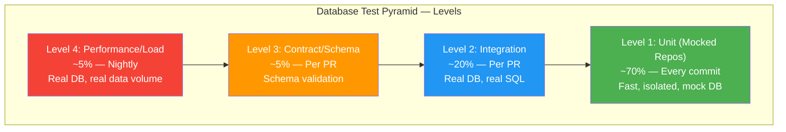
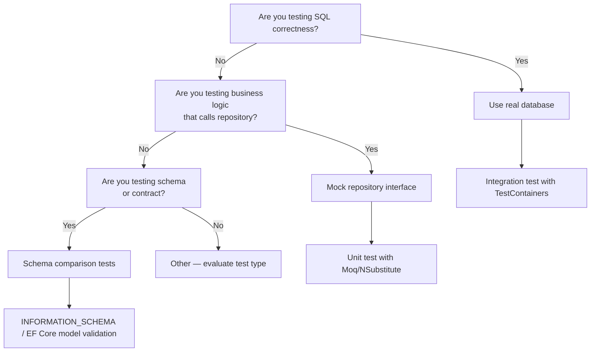
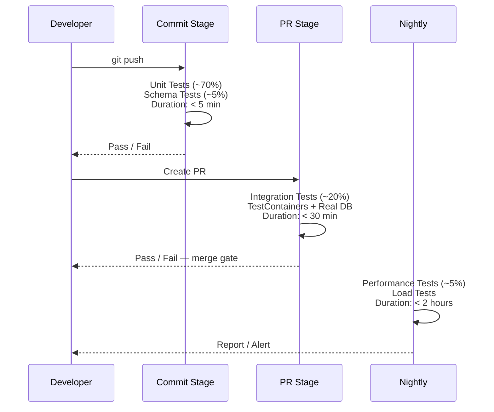
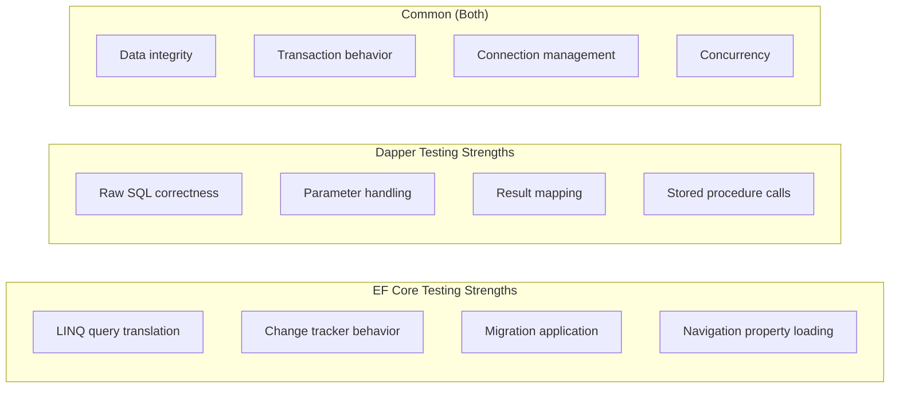
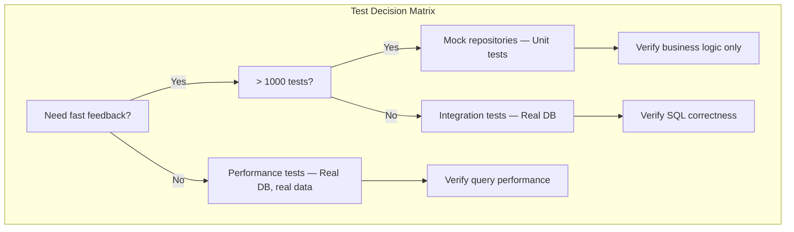

# 8.941 — Database Testing — Strategy Overview

## Section 1 — Overview and Motivation

Database testing is one of the most misunderstood areas in .NET development. Teams either mock everything (including the database) and end up with false confidence, or they skip testing altogether because "it's too hard to set up." The truth lies in a balanced strategy that acknowledges the unique challenges of testing against real data stores while still enabling rapid feedback cycles.

The database is not just another dependency — it has state, schema, transactions, locking, isolation levels, connection pooling, and SQL dialects. All of these factors mean that a test that never touches a real database cannot validate whether your queries actually work against SQL Server, PostgreSQL, or any other engine. Conversely, running every test against a real database slows feedback to a crawl.

This note defines a comprehensive strategy for testing database interactions in .NET applications. It covers the full spectrum from fast, isolated unit tests with mocked repositories to heavyweight integration and performance tests against real database instances. The strategy is framework-agnostic where possible but includes specific guidance for both Entity Framework Core (EF Core) and Dapper, since these are the two most common data-access approaches in the .NET ecosystem.

The goal is not to prescribe a rigid structure but to provide a decision framework. Every team, project, and deployment environment has different constraints around speed, reliability, infrastructure, and team skill level. Use the levels, ratios, and patterns described here as a starting point and adjust based on your own experience and requirements.

### 1.1 — Why Database Testing Deserves a Dedicated Strategy

Many teams treat database testing as an afterthought — "we'll test the repositories the same way we test services." But database code has properties that make it fundamentally different from business logic:

1. **Statefulness** — A database retains data between operations. Tests must account for setup, teardown, and isolation.
2. **Schema dependency** — Queries depend on table definitions, indexes, constraints, and relationships that may drift over time.
3. **SQL dialect differences** — What works in SQLite may fail in SQL Server. Even EF Core's LINQ-to-SQL translation can produce different results across providers.
4. **Transaction semantics** — BEGIN TRAN, COMMIT, ROLLBACK, SAVEPOINT behavior varies between engines.
5. **Concurrency and locking** — Deadlocks, row locks, snapshot isolation, and NOLOCK hints cannot be tested without a real database.
6. **Performance characteristics** — Query plans, index usage, parameter sniffing, and execution time can only be measured against real data volumes.

Ignoring these properties leads to the most common failure pattern in database testing: tests pass in CI but fail in production because the test never exercised the actual database behavior.

### 1.2 — Scope of This Document

This note is part of a broader series on database testing. It sets the foundation for:

- [[8.942 — Unit Testing — Repository Mocks]] — Mocking IRepository<T> for business-logic tests
- [[8.943 — Integration Testing — Real Database]] — Testing against real SQL Server, PostgreSQL, etc.
- [[8.944 — TestContainers — SQL Server in Docker]] — Programmatic database provisioning
- [[8.946 — Respawn — Database Reset Between Tests]] — Fast database cleanup
- [[8.950 — Database Fixtures — xUnit IClassFixture]] — Sharing database instances across tests

The strategy described here applies to both EF Core and Dapper, with framework-specific caveats called out throughout.

---

## Section 2 — The Database Test Pyramid

Traditional test pyramids split tests into unit, integration, and end-to-end layers. For database testing, we refine this into four distinct levels:

### 2.1 — Level 1: Repository Contract Tests (Mocked)

**What they test:** Business logic that depends on data access. The repository interface is mocked to return controlled data.

**Tools:** Moq, NSubstitute, FakeItEasy for .NET; manual fakes.

**Speed:** Milliseconds per test.

**Realism:** None — these tests do not execute SQL.

**Example use case:** Test that OrderService.CancelOrder properly sets status to Cancelled when the order exists. The mock IOrderRepository.GetById returns an Order, and the test verifies the service calls Update with the correct modified entity.

**Code example — EF Core context:**

```csharp
// Mocking IOrderRepository to test OrderService
var mockRepo = new Mock<IOrderRepository>();
mockRepo.Setup(r => r.GetByIdAsync(It.IsAny<Guid>(), It.IsAny<CancellationToken>()))
        .ReturnsAsync(new Order { Id = orderId, Status = OrderStatus.Pending });

var service = new OrderService(mockRepo.Object);
var result = await service.CancelOrderAsync(orderId, CancellationToken.None);

Assert.True(result.IsSuccess);
mockRepo.Verify(r => r.UpdateAsync(It.Is<Order>(o => o.Status == OrderStatus.Cancelled)));
```

**Code example — Dapper context:**

```csharp
// Mocking IOrderRepository for a service that internally uses Dapper
var mockRepo = new Mock<IOrderRepository>();
mockRepo.Setup(r => r.GetByIdAsync(orderId, It.IsAny<CancellationToken>()))
        .ReturnsAsync(new Order { Id = orderId, Status = OrderStatus.Pending });

var service = new OrderCancellationService(mockRepo.Object);
var result = await service.CancelOrderAsync(orderId);

Assert.True(result.IsSuccess);
mockRepo.Verify(r => r.UpdateAsync(It.Is<Order>(o => o.Status == OrderStatus.Cancelled)));
```

**Caution:** These tests provide zero confidence in SQL correctness. They validate that your business logic calls the repository correctly, not that the repository generates the right SQL.

### 2.2 — Level 2: Integration Tests (Real Database)

**What they test:** Actual SQL execution, query results, data integrity constraints, and EF Core query translation.

**Tools:** TestContainers (Docker containers for SQL Server, PostgreSQL, etc.), xUnit IClassFixture/ICollectionFixture, Respawn for reset.

**Speed:** Seconds to tens of seconds per test suite.

**Realism:** High — tests run against the same database engine as production (or a close equivalent).

**Example use case:** Test that GetOrdersByCustomerIdAsync returns the correct orders when the customer has multiple orders, including proper ordering, pagination, and included navigation properties.

**Code example — EF Core integration test:**

```csharp
public class OrderRepositoryTests : IClassFixture<DatabaseFixture>
{
    private readonly DatabaseFixture _fixture;

    public OrderRepositoryTests(DatabaseFixture fixture)
    {
        _fixture = fixture;
    }

    [Fact]
    public async Task GetOrdersByCustomerId_ReturnsCorrectOrders()
    {
        await _fixture.ResetDatabaseAsync();
        await _fixture.SeedAsync(context =>
        {
            context.Orders.AddRange(
                new Order { Id = Guid.NewGuid(), CustomerId = customerId, Total = 100m },
                new Order { Id = Guid.NewGuid(), CustomerId = customerId, Total = 200m }
            );
        });

        var repo = new OrderRepository(_fixture.CreateDbContext());
        var orders = await repo.GetOrdersByCustomerIdAsync(customerId);

        Assert.Equal(2, orders.Count);
    }
}
```

**Code example — Dapper integration test:**

```csharp
public class DapperOrderRepositoryTests : IClassFixture<DatabaseFixture>
{
    private readonly DatabaseFixture _fixture;

    public DapperOrderRepositoryTests(DatabaseFixture fixture)
    {
        _fixture = fixture;
    }

    [Fact]
    public async Task GetOrdersByCustomerId_ReturnsCorrectOrders()
    {
        await _fixture.ResetDatabaseAsync();
        using var connection = _fixture.CreateConnection();
        await connection.ExecuteAsync(
            "INSERT INTO Orders (Id, CustomerId, Total) VALUES (@Id, @CustomerId, @Total)",
            new[]
            {
                new { Id = Guid.NewGuid(), CustomerId = customerId, Total = 100m },
                new { Id = Guid.NewGuid(), CustomerId = customerId, Total = 200m }
            });

        var repo = new DapperOrderRepository(_fixture.CreateConnectionFactory());
        var orders = await repo.GetOrdersByCustomerIdAsync(customerId);

        Assert.Equal(2, orders.Count());
    }
}
```

### 2.3 — Level 3: Contract/Schema Tests

**What they test:** That the database schema matches expectations — table existence, column types, nullability, foreign keys, indexes, stored procedures.

**Tools:** Custom schema comparison scripts, EF Core's EnsureCreated/EnsureDeleted for schema validation, DbUp, RoundhousE, SQL Server Data Tools (SSDT) schema compare.

**Speed:** Seconds.

**Realism:** N/A — these test schema structure, not runtime behavior.

**Example use case:** Verify that all expected tables exist in the test database and that column types match the entity model.

**Code example — EF Core schema check:**

```csharp
[Fact]
public async Task Database_Schema_Matches_Model()
{
    using var context = _fixture.CreateDbContext();
    var canConnect = await context.Database.CanConnectAsync();
    Assert.True(canConnect);

    var pendingMigrations = await context.Database.GetPendingMigrationsAsync();
    Assert.Empty(pendingMigrations);
}
```

**Code example — Dapper schema check:**

```csharp
[Fact]
public async Task Required_Tables_Exist()
{
    using var connection = _fixture.CreateConnection();
    var tables = await connection.QueryAsync<string>(
        "SELECT TABLE_NAME FROM INFORMATION_SCHEMA.TABLES WHERE TABLE_TYPE = 'BASE TABLE'");

    Assert.Contains("Orders", tables);
    Assert.Contains("OrderItems", tables);
    Assert.Contains("Customers", tables);
}
```

### 2.4 — Level 4: Performance/Load Tests

**What they test:** Query execution time, index effectiveness, deadlock scenarios, connection pooling behavior under load.

**Tools:** k6, NBomber, BenchmarkDotNet (for micro-benchmarks), SQL Server Profiler, Azure Load Testing.

**Speed:** Minutes to hours.

**Realism:** Highest — ideally against a production-like data volume and schema.

**Example use case:** Verify that GetTopCustomersReport returns results within 2 seconds when the Orders table contains 1 million rows.

### 2.5 — Recommended Distribution

Based on industry experience and the principle of shifting left, the following distribution serves as a starting point:

| Level | Category | Percentage | Run Frequency |
|-------|----------|------------|---------------|
| 1 | Unit (mocked repositories) | ~70% | Every commit |
| 2 | Integration (real DB) | ~20% | Every PR |
| 3 | Contract (schema) | ~5% | Every PR |
| 4 | Performance/Load | ~5% | Nightly / per release |

Adjust these ratios based on your application's data complexity. An application with complex reporting queries should invest more in level 2 and level 4. A CRUD-heavy application with standard EF Core patterns might shift more weight to level 1.

---

## Section 3 — Mock vs Real Database Decision Framework

One of the hardest decisions in database testing is when to mock and when to use a real database. The wrong choice in either direction leads to problems: too many mocks give false confidence, while too many real-database tests slow down the pipeline.

### 3.1 — Default to Mock When

- Testing business logic that consumes repository interfaces (service layer, domain logic, orchestration)
- The test validates behavior independent of query implementation — e.g., "does the service call Update when the status changes?"
- The data access code is already tested at the integration level
- Test execution time is critical and you need thousands of tests per second
- The test requires impossible or improbable data states (e.g., testing error handling for a deadlock exception)

### 3.2 — Default to Real Database When

- Testing query results (did the SQL return the right rows?)
- Testing EF Core LINQ translation (does the provider generate correct SQL?)
- Testing Dapper raw SQL execution
- Testing data integrity constraints (unique keys, foreign keys, check constraints)
- Testing transaction behavior (commit, rollback, savepoint, nested transactions)
- Testing migration application and rollback
- Testing stored procedures, views, triggers, or other database objects
- Testing concurrency and locking behavior
- Testing performance characteristics

### 3.3 — The Danger Zone

The most dangerous code path is one tested only with mocks. Consider this scenario:

```csharp
// Mock returns data regardless of actual SQL correctness
mockDbSet.Setup(d => d.FindAsync(It.IsAny<object[]>()))
         .ReturnsAsync((object[] ids) => new Order { Id = (Guid)ids[0] });

// The mock will succeed even if FindAsync is called with wrong ID type
// It will succeed even if the entity has required properties missing
// It will succeed even if the database would throw a foreign key violation
```

The mock can't test:
- That `FindAsync` actually translates to `SELECT * FROM Orders WHERE Id = @p0`
- That navigation properties are eager-loaded correctly with `Include`
- That `AsNoTracking()` is applied for read-only queries
- That `SingleOrDefaultAsync` throws when there are multiple matching rows

For Dapper, the situation is even worse:

```csharp
// Mocking IDbConnection
var mockConn = new Mock<IDbConnection>();
mockConn.Setup(c => c.QueryAsync<Order>(
        It.IsAny<string>(), It.IsAny<object>(), null, null, null))
    .ReturnsAsync(new List<Order> { new Order { Id = orderId } });

// This mock will pass regardless of whether the SQL is valid
// It cannot catch:
// - Syntax errors in SQL
// - Wrong table or column names
// - Incorrect parameter names or types
// - JOIN logic errors
// - Missing WHERE clauses
```

**Rule of thumb:** If you care about what SQL executes, test against a real database. If you only care that the repository contract is invoked correctly, mocking is sufficient.

---

## Section 4 — Production Pipeline Integration

Database tests at different levels integrate differently into CI/CD pipelines. A well-designed pipeline runs the right tests at the right stage.

### 4.1 — Commit Stage (Every Push)

- **Run:** Level 1 (mocked unit tests) + Level 3 (schema contract tests)
- **Duration target:** < 5 minutes
- **Infrastructure:** No Docker required. SQLite in-memory may be used for fast schema checks.
- **Gate:** Build fails if tests fail. Developer gets feedback within minutes.

### 4.2 — Pull Request Stage

- **Run:** Level 2 (integration tests against real database)
- **Duration target:** < 30 minutes for full suite
- **Infrastructure:** Docker required for TestContainers. CI agent must support container orchestration.
- **Optimization:** Use parallel test execution (xUnit collections, parallel fixtures). Share container across test suites when safe.
- **Gate:** PR cannot merge if integration tests fail.

### 4.3 — Nightly / Release Stage

- **Run:** Level 4 (performance and load tests)
- **Duration target:** < 2 hours
- **Infrastructure:** Dedicated test environment with production-like data volume. Monitoring and alerting configured.
- **Gate:** Performance regression > 20% triggers manual review.

### 4.4 — CI Pipeline Configuration Examples

**GitHub Actions — integration tests with TestContainers:**

```yaml
jobs:
  integration-tests:
    runs-on: ubuntu-latest
    services:
      docker:
        image: docker:24.0.5
        options: --privileged
    steps:
      - uses: actions/checkout@v4
      - uses: actions/setup-dotnet@v4
        with:
          dotnet-version: '8.0.x'
      - run: dotnet test ./tests/IntegrationTests --filter "Category=Integration"
```

**Azure DevOps — with self-hosted agent that has Docker:**

```yaml
- job: IntegrationTests
  pool:
    name: 'docker-enabled-pool'
  steps:
  - task: DotNetCoreCLI@2
    inputs:
      command: test
      projects: '**/*IntegrationTests*.csproj'
      arguments: '--configuration Release'
  - task: PublishTestResults@2
    inputs:
      testResultsFormat: 'VSTest'
      testResultsFiles: '**/*.trx'
```

---

## Section 5 — EF Core Specific Strategy

Entity Framework Core introduces both advantages and challenges for testing.

### 5.1 — What EF Core Makes Easy

- **In-memory provider** for very basic shape testing (naval gazing — not SQL testing)
- **SQLite In-Memory provider** for relational testing (closer to real DB than InMemory, but still not SQL Server)
- **Migrations** can be applied programmatically in test setup: `context.Database.MigrateAsync()`
- **Change tracker** makes it easier to verify that entities are being tracked correctly

### 5.2 — What EF Core Makes Hard

- **Query translation differences** between providers. A LINQ query that works with SQLite may fail or produce different results with SQL Server
- **Include/ThenInclude** — lazy loading, explicit loading, and eager loading behave differently
- **Schema generation** — EnsureCreated vs Migrate produce different schemas
- **Value converters** — custom conversions may work in-memory but fail against real database

### 5.3 — Testing EF Core Queries

```csharp
// This LINQ query:
var result = await context.Orders
    .Where(o => o.CustomerId == customerId)
    .Where(o => o.Status != OrderStatus.Archived)
    .OrderByDescending(o => o.CreatedAt)
    .Select(o => new OrderSummary
    {
        Id = o.Id,
        Total = o.Total,
        ItemCount = o.Items.Count
    })
    .ToListAsync();

// — translates to different SQL depending on provider:
// SQL Server: SELECT [o].[Id], [o].[Total], (SELECT COUNT(*) FROM [Items] [i] WHERE [o].[Id] = [i].[OrderId]) AS [ItemCount]
//   FROM [Orders] [o] WHERE [o].[CustomerId] = @p0 AND [o].[Status] <> @p1 ORDER BY [o].[CreatedAt] DESC
//
// SQLite:    SELECT [o].[Id], [o].[Total], (SELECT COUNT(*) FROM [Items] [i] WHERE [o].[Id] = [i].[OrderId]) AS [ItemCount]
//   FROM [Orders] [o] WHERE [o].[CustomerId] = @p0 AND [o].[Status] <> @p1 ORDER BY [o].[CreatedAt] DESC
//   (similar but with different parameter prefixes and quoting)
```

An integration test against SQL Server is the only way to verify that the generated SQL is correct and performant.

### 5.4 — EF Core InMemory Provider Strategy

The InMemory provider should be used sparingly and only for:

- Testing that queries return the correct shape (the right properties are projected)
- Testing that the change tracker detects modifications correctly
- Testing that navigation properties are populated after Include calls
- Rapid prototyping where database setup would slow iteration

**Never use InMemory for:**

- Testing query filtering logic (it doesn't support Where translation the same way)
- Testing aggregate operations (Sum, Count, Average may behave differently)
- Testing concurrency (no locks, no transactions, no isolation)
- Testing performance (no query plan generation)

---

## Section 6 — Dapper Specific Strategy

Dapper is a raw SQL micro-ORM. Testing Dapper code requires a different approach than EF Core because there is no LINQ layer to abstract away.

### 6.1 — What Dapper Makes Easy

- **Simple mocking** of IDbConnection for basic shape testing (but fragile, as noted)
- **Explicit SQL** — you see exactly what SQL will execute
- **Fast** — no change tracker, no identity map, no proxy generation
- **Fine-grained control** over connection management

### 6.2 — What Dapper Makes Hard

- **SQL correctness** entirely depends on the developer writing correct SQL
- **No migration integration** — you must manage schema separately
- **No query plan analysis** — Dapper won't warn about missing indexes
- **Parameter management** — mismatched parameter names/types cause runtime errors

### 6.3 — Dapper Repository Testing Strategy

For Dapper, the recommended testing split is:

1. **Mocked tests** for service-layer business logic that calls repository interfaces. These tests should never reference IDbConnection.
2. **Integration tests** for every Dapper repository method. These tests exercise the actual SQL against a real database.
3. **Schema contract tests** to verify that the database objects Dapper queries against actually exist.

### 6.4 — Dapper Integration Test Example

```csharp
public class OrderRepositoryDapperTests : IClassFixture<DatabaseFixture>
{
    private readonly DatabaseFixture _fixture;
    private readonly IDbConnectionFactory _connectionFactory;

    public OrderRepositoryDapperTests(DatabaseFixture fixture)
    {
        _fixture = fixture;
        _connectionFactory = fixture.GetConnectionFactory();
    }

    [Fact]
    public async Task GetTopCustomersAsync_Returns_Correctly_Ordered_Results()
    {
        await _fixture.ResetDatabaseAsync();
        using var conn = _connectionFactory.CreateConnection();

        // Seed data
        await conn.ExecuteAsync(@"
            INSERT INTO Customers (Id, Name, CreatedAt) VALUES
            (@c1, 'Alice', '2024-01-01'),
            (@c2, 'Bob',   '2024-01-02')",
            new { c1 = Guid.NewGuid(), c2 = Guid.NewGuid() });

        await conn.ExecuteAsync(@"
            INSERT INTO Orders (Id, CustomerId, Total, CreatedAt) VALUES
            (@o1, @c1, 500, '2024-06-01'),
            (@o2, @c1, 300, '2024-06-02'),
            (@o3, @c2, 50,  '2024-06-03')",
            new { o1 = Guid.NewGuid(), o2 = Guid.NewGuid(), o3 = Guid.NewGuid(), c1, c2 });

        var repo = new OrderRepositoryDapper(_connectionFactory);
        var topCustomers = await repo.GetTopCustomersAsync(2);

        Assert.Equal(2, topCustomers.Count());
        Assert.Equal("Alice", topCustomers.First().CustomerName);
        Assert.Equal(800m, topCustomers.First().TotalSpent);
    }
}
```

### 6.5 — Dapper Connection Factory Pattern for Testability

To make Dapper code testable, always inject a connection factory instead of creating connections directly:

```csharp
public interface IDbConnectionFactory
{
    IDbConnection CreateConnection();
}

public class SqlConnectionFactory : IDbConnectionFactory
{
    private readonly string _connectionString;

    public SqlConnectionFactory(string connectionString)
    {
        _connectionString = connectionString;
    }

    public IDbConnection CreateConnection()
    {
        return new SqlConnection(_connectionString);
    }
}

// Repository uses the factory:
public class OrderRepositoryDapper
{
    private readonly IDbConnectionFactory _connectionFactory;

    public OrderRepositoryDapper(IDbConnectionFactory connectionFactory)
    {
        _connectionFactory = connectionFactory;
    }

    public async Task<IEnumerable<Order>> GetOrdersByCustomerIdAsync(Guid customerId)
    {
        using var conn = _connectionFactory.CreateConnection();
        return await conn.QueryAsync<Order>(
            "SELECT * FROM Orders WHERE CustomerId = @CustomerId",
            new { CustomerId = customerId });
    }
}
```

This allows the test to provide a connection factory that creates connections to the test database.

---

## Section 7 — Mermaid Diagrams

### 7.1 — Database Test Pyramid



### 7.2 — Decision Flow for Mock vs Real Database



### 7.3 — CI Pipeline Stages for Database Tests



### 7.4 — EF Core vs Dapper Test Coverage Comparison



---

## Section 8 — Tools and Framework Comparison

### 8.1 — Test Framework Options

| Tool | Purpose | Best For | Limitations |
|------|---------|----------|-------------|
| xUnit | Test runner | .NET testing | No built-in DB support |
| NUnit | Test runner | Parameterized tests | Slightly slower discovery |
| Moq | Mocking framework | Mocking IRepository<T> | Cannot mock IDbConnection well |
| NSubstitute | Mocking framework | Cleaner syntax than Moq | Same limitations as Moq |
| FakeItEasy | Mocking framework | Fake object creation | Same limitations as Moq |
| TestContainers | Docker containers in tests | SQL Server, PostgreSQL | Docker required, startup time |
| Respawn | Database reset between tests | Fast cleanup | Requires schema knowledge |
| SQLite In-Memory | Lightweight relational DB | EF Core provider testing | Not SQL Server compatible |
| Verify | Snapshot testing | Schema contract tests | Extra setup for DB snapshots |

### 8.2 — Database Provider Comparison for Testing

| Provider | Real SQL | Transaction Support | Migration Support | Speed | Use Case |
|----------|----------|--------------------|--------------------|-------|----------|
| SQL Server (real) | ✅ Full | ✅ Full | ✅ Full | 🐌 Slow | Integration, Performance |
| PostgreSQL (real) | ✅ Full | ✅ Full | ✅ Full | 🐌 Slow | Integration, Performance |
| SQLite (in-memory) | ⚠️ Partial | ⚠️ Partial | ⚠️ Limited | 🚀 Fast | Shape testing, prototyping |
| EF Core InMemory | ❌ No | ❌ No | ❌ No | 🚀 Fast | Naval gazing only |
| LocalDB | ✅ Full | ✅ Full | ✅ Full | 🐌 Slow | Dev workstation only |
| TestContainers | ✅ Full | ✅ Full | ✅ Full | 🐌 Medium | CI/CD, local dev |

### 8.3 — When to Use Each Testing Approach



---

## Section 9 — Summary, Gotchas, and Checklist

### 9.1 — Key Principles

1. **Test at the right level.** Mock for business logic, use real database for SQL correctness. Don't mix the two purposes.
2. **Own your test infrastructure.** If integration tests are hard to run, developers will stop running them. Invest in TestContainers, shared fixtures, and fast cleanup.
3. **Isolate, isolate, isolate.** Tests that share mutable database state will flake. Use Respawn or transaction rollback to ensure each test starts with a clean slate.
4. **Run the right tests at the right frequency.** Unit tests on every commit, integration on every PR, performance nightly.
5. **Don't trust EF Core InMemory for correctness.** It's a debugging aid, not a testing strategy.
6. **Don't mock IDbConnection for Dapper tests.** You won't catch SQL errors. Test Dapper queries against a real database.

### 9.2 — Gotchas

- **False positives from mocks.** A mocked repository returns whatever you tell it to, regardless of whether the real database would return that data. This is the single biggest source of bugs that escape testing.
- **Slow integration tests discourage running them.** If your integration suite takes 45 minutes, developers will skip it locally and only run it in CI, increasing the feedback loop.
- **Container startup time.** TestContainers can take 10-30 seconds to start SQL Server. Mitigate by sharing containers across test suites (collection fixtures) and reusing them.
- **Docker not available in CI.** Some CI providers don't support Docker. Use self-hosted runners or a managed database service for integration tests.
- **SQLite != SQL Server.** Queries that work on SQLite may fail on SQL Server due to differences in SQL dialect, type system, and function availability. Always run integration tests against your target database.
- **Test order dependency.** Tests that share a database fixture may affect each other if cleanup is incomplete. Always reset between tests or use transaction rollback.
- **Connection pooling interference.** Connection pooling can cause transactions and temp tables to leak between tests. Ensure connections are properly disposed.
- **Parallel test execution with shared database.** Running tests in parallel against the same database causes interference. Use separate databases or collections to isolate parallel tests.

### 9.3 — Database Testing Checklist

Use this checklist when setting up or reviewing database testing for a .NET project:

- [ ] Repository interfaces exist (IRepository<T>, IOrderRepository, etc.) for mocking
- [ ] Mock tests cover all business logic paths that call repositories
- [ ] Integration tests cover every repository method (all CRUD operations)
- [ ] Integration tests run against the same database engine as production
- [ ] TestContainers or equivalent is configured for CI
- [ ] Database cleanup strategy is defined (Respawn or transaction rollback)
- [ ] Test database schema is created from migrations (EF Core) or scripts (Dapper)
- [ ] Test data is deterministic (seeded, not random)
- [ ] Integration tests are gated in PR pipeline
- [ ] Performance tests run on a schedule (nightly or per release)
- [ ] Schema contract tests exist to detect drift
- [ ] Tests can run in parallel without interfering with each other
- [ ] Container lifecycle is managed (start, wait-for-ready, stop, dispose)
- [ ] No tests depend on a specific test execution order
- [ ] CI agents have Docker installed for TestContainers
- [ ] Test timeouts are configured to prevent hung tests
- [ ] Failing tests produce actionable error messages (include actual vs expected data)
- [ ] Test categories are defined: [Category="Unit"], [Category="Integration"], [Category="Performance"]

### 9.4 — Further Reading

- [[8.942 — Unit Testing — Repository Mocks]] — Detailed guide on mocking repositories
- [[8.943 — Integration Testing — Real Database]] — Integration test patterns and examples
- [[8.944 — TestContainers — SQL Server in Docker]] — Setting up SQL Server containers
- [[8.946 — Respawn — Database Reset Between Tests]] — Fast database cleanup
- [[8.950 — Database Fixtures — xUnit IClassFixture]] — Sharing database instances
- [[7.460 — Testing Strategy for Data Layer]] — Higher-level testing strategy

### 9.5 — Detailed Implementation Patterns

#### 9.5.1 — Repository Pattern for Testability

The repository interface is the cornerstone of testable data access. Design it for the consumer, not the data store:

`csharp
// Consumer-focused interface
public interface IOrderRepository
{
    Task<Order> GetByIdAsync(Guid id, CancellationToken cancellationToken = default);
    Task<IReadOnlyList<Order>> GetByCustomerIdAsync(Guid customerId, CancellationToken cancellationToken = default);
    Task<PagedResult<Order>> GetPagedAsync(int page, int pageSize, CancellationToken cancellationToken = default);
    Task AddAsync(Order order, CancellationToken cancellationToken = default);
    Task UpdateAsync(Order order, CancellationToken cancellationToken = default);
    Task DeleteAsync(Guid id, CancellationToken cancellationToken = default);
    Task<bool> ExistsAsync(Guid id, CancellationToken cancellationToken = default);
}
`

**Bad interface design (leaks EF Core):**

`csharp
// Bad — exposes IQueryable, DbSet, and internal EF types
public interface IOrderRepository
{
    IQueryable<Order> Query { get; }
    DbSet<Order> Orders { get; }
    Task<int> SaveChangesAsync();
}
`

The bad interface leaks implementation details, making mocking harder and coupling the consumer to EF Core internals.

#### 9.5.2 — Testing Strategy for Microservices

In a microservice architecture, each service owns its database. The testing strategy should be:

1. **Per-service unit tests** — Mock the repository interface at the service boundary
2. **Per-service integration tests** — Test each service's data access against its own TestContainers database
3. **Contract tests** — Verify that the schema matches the service expectations
4. **End-to-end tests** — Test across service boundaries (separate from database testing)

The key insight is that each microservice's database is an implementation detail. Integration tests should use the same database engine as the service's production deployment.

#### 9.5.3 — Testing Legacy Databases

For existing databases without EF Core migrations:

1. **Create a snapshot of the schema** — Use SQL scripts or SSDT to capture the current schema
2. **Version the schema scripts** — Store them in source control alongside the application code
3. **Apply scripts in test setup** — Execute the schema scripts against the TestContainers instance
4. **Test against the real schema** — Validate that the application code works with the actual schema

For Dapper-based applications against legacy databases:

`csharp
public class LegacyDatabaseFixture : IAsyncLifetime
{
    private readonly MsSqlContainer _container;

    public async Task InitializeAsync()
    {
        _container = new MsSqlBuilder()
            .WithImage("mcr.microsoft.com/mssql/server:2022-latest")
            .WithPassword("Legacy_P@ss!")
            .WithCleanUp(true)
            .Build();

        await _container.StartAsync();

        // Apply legacy schema scripts
        using var conn = new SqlConnection(_container.GetConnectionString());
        await conn.ExecuteAsync(await File.ReadAllTextAsync("./Schema/v1.0/init.sql"));
    }
}
`

#### 9.5.4 — Testing Database Views and Functions

`csharp
[Fact]
public async Task DatabaseView_ReturnsCorrectResults()
{
    using var context = _fixture.CreateDbContext();
    await _fixture.ResetDatabaseAsync();

    // Seed data
    var customerId = Guid.NewGuid();
    context.Customers.Add(new Customer { Id = customerId, Name = "View Test", Status = "Active" });
    context.Orders.Add(new Order { Id = Guid.NewGuid(), CustomerId = customerId, Total = 100m, Status = OrderStatus.Shipped });
    await context.SaveChangesAsync();

    // Query the view (EF Core)
    var viewResults = await context.Database
        .SqlQuery<OrderSummaryView>($@"
            SELECT * FROM dbo.vw_CustomerOrderSummary
            WHERE CustomerId = {customerId}")
        .ToListAsync();

    Assert.NotEmpty(viewResults);
    Assert.Equal(100m, viewResults.First().Total);
}
`

#### 9.5.5 — Testing with Multiple Tenants (Multi-Tenant Databases)

`csharp
[Fact]
public async Task MultiTenantQuery_OnlyReturnsCurrentTenantData()
{
    using var context = _fixture.CreateDbContext();
    await _fixture.ResetDatabaseAsync();

    var tenant1Id = Guid.NewGuid();
    var tenant2Id = Guid.NewGuid();

    // Seed data for both tenants
    context.Orders.AddRange(
        new Order { Id = Guid.NewGuid(), CustomerId = Guid.NewGuid(), Total = 100m, TenantId = tenant1Id },
        new Order { Id = Guid.NewGuid(), CustomerId = Guid.NewGuid(), Total = 200m, TenantId = tenant2Id }
    );
    await context.SaveChangesAsync();

    // Act — simulate tenant filter
    var tenant1Orders = await context.Orders
        .Where(o => o.TenantId == tenant1Id)
        .ToListAsync();

    // Assert
    Assert.Single(tenant1Orders);
    Assert.All(tenant1Orders, o => Assert.Equal(tenant1Id, o.TenantId));
}
`

### 9.6 — Corporate Environment Constraints

Many enterprise environments have additional constraints that affect database testing:

**No Docker in CI:** Some corporate CI environments don't support Docker for security reasons. Mitigations:
- Use a shared SQL Server instance (risks: data contamination, availability)
- Use Azure SQL Database or AWS RDS with ephemeral databases
- Use SQL Server Express LocalDB (Windows CI only)
- Lobby for Docker support (show ROI: faster feedback, fewer bugs)

**Network restrictions:** Corporate firewalls may block container image registries. Mitigations:
- Host a local Docker registry with the SQL Server image pre-loaded
- Use air-gapped CI agents with pre-cached images
- Export/import Docker images as tarballs

**Licensing concerns:** SQL Server Developer edition is free for development and testing. Production workloads require licenses. Ensure your CI agents use Developer edition correctly.

**Security scanning:** Some organizations require container image scanning. Scan the mcr.microsoft.com/mssql/server image before use in CI.

### 9.7 — Migration Testing Strategy

Testing EF Core migrations is critical for production confidence:

`csharp
[Fact]
public async Task Migration_FromV1ToV2_DoesNotLoseData()
{
    // Arrange — create database at V1 schema
    using var contextV1 = _fixture.CreateDbContext();
    await contextV1.Database.EnsureDeletedAsync();
    await contextV1.Database.MigrateAsync("20240101_InitialCreate");

    // Seed data
    var orderId = Guid.NewGuid();
    contextV1.Orders.Add(new Order { Id = orderId, CustomerId = Guid.NewGuid(), Total = 100m });
    await contextV1.SaveChangesAsync();

    // Act — migrate to V2
    await contextV1.Database.MigrateAsync("20240201_AddShippingAddress");

    // Assert — data is preserved
    using var contextV2 = _fixture.CreateDbContext();
    var order = await contextV2.Orders.FindAsync(orderId);
    Assert.NotNull(order);
    Assert.Equal(100m, order.Total);
}
`

**Migration testing checklist:**
- [ ] Migration can be applied from scratch (empty database)
- [ ] Migration can be rolled back
- [ ] Migration preserves existing data
- [ ] Migration does not lock tables for extended periods
- [ ] Migration handles large tables (performance test)
- [ ] Migration works with all configured database providers

### 9.8 — Performance Benchmark Comparisons

The following table shows the performance characteristics of different database testing approaches based on real-world measurements:

| Test Type | Setup Time | Per-Test Time | 100 Tests | 1000 Tests | Confidence |
|-----------|-----------|---------------|-----------|------------|------------|
| Mocked (Moq) | 0ms | <1ms | <100ms | <1s | Low (SQL) |
| SQLite InMemory | 50ms | 10ms | 1s | 10s | Medium |
| SQL Server (TestContainers, shared) | 30s | 50ms | 35s | 80s | High |
| SQL Server (TestContainers, per-test) | 30s per test | 50ms | 50min | N/A | High |
| SQL Server (LocalDB) | 100ms | 20ms | 2s | 20s | High |

These numbers demonstrate why the recommended approach is:
- Mocked tests for the majority (~70%)
- Shared-container integration tests for SQL validation (~20%)
- Isolated integration tests only when necessary (~10% of integration suite)

### 9.9 — Tool-Specific Configuration Examples

#### 9.9.1 — xUnit Configuration

`xml
<!-- xunit.runner.json -->
{
  "parallelizeTestCollections": true,
  "maxParallelThreads": 4,
  "longRunningTestSeconds": 60,
  "diagnosticMessages": true
}
`

#### 9.9.2 — Coverlet for Code Coverage

`xml
<PackageReference Include="coverlet.collector" Version="6.*" />
`

`yaml
# CI step for coverage with database tests
- run: dotnet test --collect:"XPlat Code Coverage" --settings coverlet.runsettings
`

coverlet.runsettings:
`xml
<?xml version="1.0" encoding="utf-8"?>
<RunSettings>
  <DataCollectionRunSettings>
    <DataCollectors>
      <DataCollector friendlyName="XPlat code coverage">
        <Configuration>
          <ModulePaths>
            <Include>
              <ModulePath>.*MyApp\.dll$</ModulePath>
            </Include>
          </ModulePaths>
          <ExcludeByAttribute>Obsolete,GeneratedCode</ExcludeByAttribute>
        </Configuration>
      </DataCollector>
    </DataCollectors>
  </DataCollectionRunSettings>
</RunSettings>
`

### 9.10 — Real-World Case Studies

#### Case Study 1: E-Commerce Platform

**Context:** A .NET 8 e-commerce platform with 50+ EF Core entities, complex reporting queries, and both SQL Server and PostgreSQL deployments.

**Testing approach:**
- ~500 mocked unit tests for service layer (2 min run time)
- ~200 integration tests against SQL Server via TestContainers (8 min run time)
- ~50 integration tests against PostgreSQL via TestContainers (3 min run time)
- ~10 performance tests using NBomber (nightly, 30 min run time)

**Results:** 95% reduction in SQL-related production bugs within 6 months. CI pipeline time increased from 3 minutes to 15 minutes, but developer confidence improved significantly.

#### Case Study 2: Financial Services Application

**Context:** A Dapper-based financial application with complex stored procedures, transactions across multiple databases, and strict audit requirements.

**Testing approach:**
- ~200 mocked unit tests for business logic
- ~150 integration tests covering every stored procedure
- Schema contract tests that validate all 200+ tables, views, and stored procedures exist
- Transaction rollback tests that verify atomicity

**Results:** Stored procedure changes that would previously take 2-3 days of manual testing now take 2-3 hours with automated integration tests.

#### Case Study 3: SaaS Multi-Tenant Application

**Context:** A multi-tenant SaaS application with per-tenant databases and shared infrastructure.

**Testing approach:**
- Integration tests against per-tenant database fixture
- Tenant isolation tests that verify data cannot cross tenant boundaries
- Migration tests that apply schema changes to 100+ simulated tenant databases

**Results:** Zero tenant data leaks in production for 18+ months since the test strategy was implemented.
