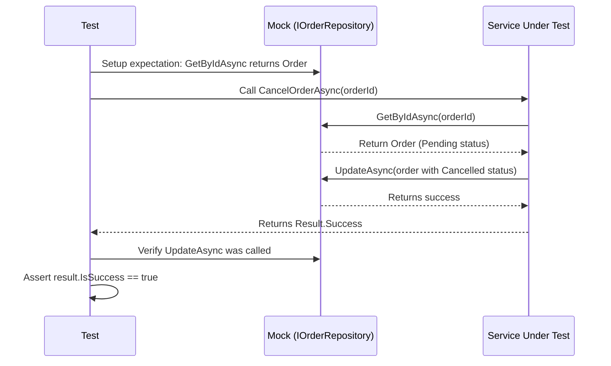
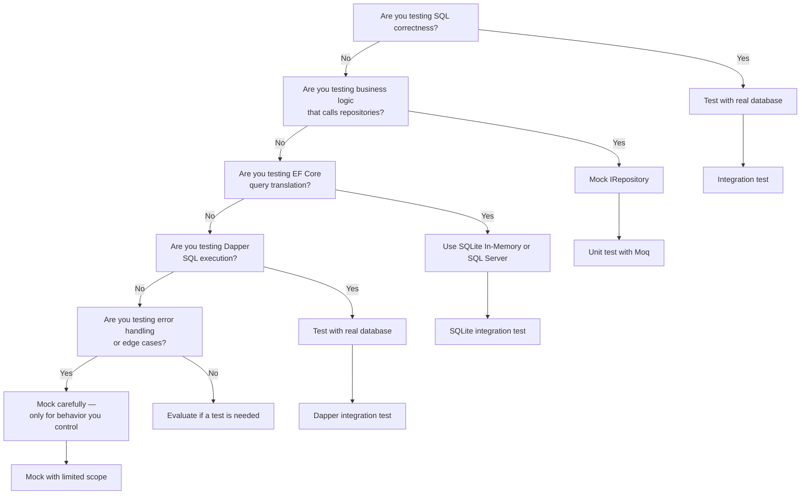
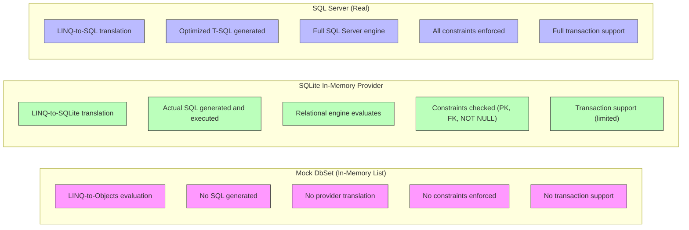

# 8.942 — Unit Testing — Repository Mocks

## Section 1 — Overview and Motivation

Unit testing data access code is a contentious topic in the .NET community. Some developers argue that any test that doesn't hit a real database is worthless. Others argue that tests should never touch infrastructure and should always mock the data layer. The truth, as with most engineering debates, depends on what you are trying to validate.

This note focuses specifically on mocking repository interfaces to test business logic. The key insight is that mocking the repository is not about testing the repository itself — it is about testing the code that depends on the repository. When you mock IOrderRepository in an OrderService test, you are testing the service's logic, not the SQL queries.

This distinction is critical. If you need to validate SQL correctness, query behavior, or data integrity, use integration tests against a real database (see [[8.943 — Integration Testing — Real Database]]). If you need to validate that your business logic correctly handles the data returned by a repository, use mocked unit tests.

### 1.1 — When to Use Repository Mocks

Mock repository interfaces in these scenarios:

- Testing service-layer orchestration logic (e.g., OrderService processes a request through multiple steps)
- Testing domain logic that depends on repository data (e.g., does this method throw when the order is already shipped?)
- Testing error handling paths (e.g., repository throws DbException, service catches and wraps it)
- Testing policy enforcement (e.g., does the service check authorization before calling the repository?)
- Testing caching behavior (e.g., does the service cache the repository result for repeated calls?)

### 1.2 — When NOT to Use Repository Mocks

Do not mock repositories for:

- Validating that the correct SQL is generated (use integration tests)
- Testing that EF Core Includes work correctly (use integration tests)
- Testing that Dapper queries return the expected result set (use integration tests)
- Testing transaction behavior (use integration tests)
- Testing database constraint enforcement (use integration tests)
- Testing query performance (use performance tests)

### 1.3 — The Mocking Pyramid

Within the broader database testing pyramid, mocked repository tests sit at the base:

```
          ┌─────────────┐
          │ Performance │  ~5% — Real DB, real data
          │   / Load    │
         ┌┴─────────────┴┐
         │  Integration  │  ~20% — Real DB, real SQL
         │  Tests (Real) │
        ┌┴───────────────┴┐
        │    Contract /    │  ~5% — Schema validation
        │   Schema Tests   │
       ┌┴─────────────────┴┐
       │ Unit Tests (Mocked) │  ~70% — Mocked repos, fast tests
       │  Repository Mocks   │
       └─────────────────────┘
```

---

## Section 2 — Core Concepts

### 2.1 — Repository Interface Design for Testability

The foundation of testable repository mocking is a well-designed interface. The interface should be focused on the needs of the consumer, not the capabilities of the data store.

**Good interface design:**

```csharp
public interface IOrderRepository
{
    Task<Order> GetByIdAsync(Guid id, CancellationToken cancellationToken = default);
    Task<IReadOnlyList<Order>> GetByCustomerIdAsync(Guid customerId, CancellationToken cancellationToken = default);
    Task<PagedResult<Order>> GetPagedAsync(int page, int pageSize, CancellationToken cancellationToken = default);
    Task AddAsync(Order order, CancellationToken cancellationToken = default);
    Task UpdateAsync(Order order, CancellationToken cancellationToken = default);
    Task DeleteAsync(Guid id, CancellationToken cancellationToken = default);
    Task<bool> ExistsAsync(Guid id, CancellationToken cancellationToken = default);
}
```

**Generic repository interface (usable for simple CRUD):**

```csharp
public interface IRepository<T> where T : class
{
    Task<T> GetByIdAsync<TId>(TId id, CancellationToken cancellationToken = default);
    Task<IReadOnlyList<T>> GetAllAsync(CancellationToken cancellationToken = default);
    Task<PagedResult<T>> GetPagedAsync(int page, int pageSize, CancellationToken cancellationToken = default);
    Task<T> AddAsync(T entity, CancellationToken cancellationToken = default);
    Task UpdateAsync(T entity, CancellationToken cancellationToken = default);
    Task DeleteAsync(T entity, CancellationToken cancellationToken = default);
    Task<int> SaveChangesAsync(CancellationToken cancellationToken = default);
}
```

**Why interface design matters for mocking:**

- Methods should return Task (or Task<T>) to support async testing
- CancellationToken should be optional (default = None) in most cases
- Avoid overloading methods with many optional parameters — they make mock setup verbose
- Use specific types (IReadOnlyList<T>, PagedResult<T>) instead of loose IQueryable<T> for repository returns. IQueryable is notoriously hard to mock and even harder to test correctly because LINQ-to-Objects behaves differently from LINQ-to-SQL.

### 2.2 — Test Isolation Principles

When mocking repositories, each test must be completely isolated:

1. **No shared state** between tests — each test creates its own mock setup
2. **No database access** — mocked tests should never touch a database
3. **Deterministic return values** — the mock should return exactly what the test needs
4. **Verify behavior, not data** — assert that the service called the correct methods with the correct parameters

### 2.3 — Mock Lifecycle

```
Test Setup → Create Mocks → Configure Expectations → 
Execute Service Under Test → Assert Results → Verify Mock Calls
```

Each test follows this lifecycle. The test should be readable in a single pass — the mock setup should clearly communicate "when this method is called with these arguments, return this value."

---

## Section 3 — Setup and Configuration

### 3.1 — Choosing a Mocking Framework

The three most popular mocking frameworks for .NET are:

| Framework | Syntax Style | Strengths | Weaknesses |
|-----------|-------------|-----------|------------|
| Moq | Lambda-based | Most popular, extensive documentation, strong typing | Verbose for complex setups, no partial mocks |
| NSubstitute | Arrange-Act-Assert style | Cleaner syntax, fewer lines of code | Slower than Moq, less community support |
| FakeItEasy | Fake/configuration syntax | Readable exception messages, fake object creation | Slightly less popular, fewer examples online |

All three can effectively mock repository interfaces. Choose based on team preference.

**Moq example:**

```csharp
var mockRepo = new Mock<IOrderRepository>();
mockRepo.Setup(r => r.GetByIdAsync(It.IsAny<Guid>(), It.IsAny<CancellationToken>()))
        .ReturnsAsync((Guid id, CancellationToken ct) => new Order { Id = id });
```

**NSubstitute example:**

```csharp
var mockRepo = Substitute.For<IOrderRepository>();
mockRepo.GetByIdAsync(Arg.Any<Guid>(), Arg.Any<CancellationToken>())
        .Returns(callInfo => new Order { Id = callInfo.Arg<Guid>() });
```

**FakeItEasy example:**

```csharp
var mockRepo = A.Fake<IOrderRepository>();
A.CallTo(() => mockRepo.GetByIdAsync(A<Guid>._, A<CancellationToken>._))
 .ReturnsLazily((Guid id, CancellationToken ct) => new Order { Id = id });
```

### 3.2 — NuGet Packages

```
dotnet add package Moq
dotnet add package NSubstitute
dotnet add package FakeItEasy
```

Add one of these to your test project. Do not add multiple mocking frameworks to the same project — it confuses team members and bloats the project.

### 3.3 — Test Project Structure

```
tests/
├── MyApp.UnitTests/
│   ├── Services/
│   │   ├── OrderServiceTests.cs
│   │   └── CustomerServiceTests.cs
│   ├── Handlers/
│   │   └── CreateOrderHandlerTests.cs
│   ├── Mocks/
│   │   └── MockRepositoryFactory.cs
│   └── usings.cs
```

Keep mock setup helpers in a Mocks folder to reduce duplication across test files.

---

## Section 4 — EF Core: Mocking DbContext and DbSet

### 4.1 — The Problem with Mocking EF Core

Mocking EF Core's DbContext and DbSet is notoriously problematic. The core issue is that DbSet implements IQueryable, and the LINQ-to-Objects implementation used by mocks behaves completely differently from the LINQ-to-SQL translation used by real EF Core providers.

**What mocking DbSet can test:**
- That the service calls the correct DbSet property (Orders, Customers, etc.)
- That the service calls the correct method (Add, Update, Remove, FindAsync)
- That the service passes the correct entity instances

**What mocking DbSet cannot test:**
- That LINQ queries translate to correct SQL
- That Where, OrderBy, Include, Select work as expected
- That SingleAsync throws when zero or multiple rows match
- That FirstOrDefaultAsync returns null when no rows match
- That tracking behavior works correctly

### 4.2 — Mocking DbSet with an In-Memory Collection

The most common approach to mock DbSet is to back it with an in-memory List<T>:

```csharp
public static Mock<DbSet<T>> CreateMockDbSet<T>(IQueryable<T> data) where T : class
{
    var mockSet = new Mock<DbSet<T>>();
    mockSet.As<IQueryable<T>>().Setup(m => m.Provider).Returns(data.Provider);
    mockSet.As<IQueryable<T>>().Setup(m => m.Expression).Returns(data.Expression);
    mockSet.As<IQueryable<T>>().Setup(m => m.ElementType).Returns(data.ElementType);
    mockSet.As<IQueryable<T>>().Setup(m => m.GetEnumerator()).Returns(data.GetEnumerator());

    // For async operations
    mockSet.As<IAsyncEnumerable<T>>()
        .Setup(m => m.GetAsyncEnumerator(It.IsAny<CancellationToken>()))
        .Returns(new TestAsyncEnumerator<T>(data.GetEnumerator()));

    mockSet.As<IQueryable<T>>()
        .Setup(m => m.Provider)
        .Returns(new TestAsyncQueryProvider<T>(data.Provider));

    return mockSet;
}
```

**Usage:**

```csharp
var orders = new List<Order>
{
    new Order { Id = Guid.NewGuid(), Status = OrderStatus.Pending },
    new Order { Id = Guid.NewGuid(), Status = OrderStatus.Shipped }
};

var mockSet = CreateMockDbSet(orders.AsQueryable());
var mockContext = new Mock<AppDbContext>();
mockContext.Setup(c => c.Orders).Returns(mockSet.Object);

var service = new OrderService(mockContext.Object);
var pendingOrders = await service.GetPendingOrdersAsync();

Assert.Single(pendingOrders);
```

### 4.3 — The Danger of In-Memory DbSet Mocks

Consider this test:

```csharp
[Fact]
public async Task GetPendingOrdersAsync_ReturnsOnlyPending()
{
    var orders = new List<Order>
    {
        new Order { Id = Guid.NewGuid(), Status = OrderStatus.Pending },
        new Order { Id = Guid.NewGuid(), Status = OrderStatus.Shipped }
    };
    var mockSet = CreateMockDbSet(orders.AsQueryable());
    var mockContext = new Mock<AppDbContext>();
    mockContext.Setup(c => c.Orders).Returns(mockSet.Object);

    var service = new OrderService(mockContext.Object);
    var result = await service.GetPendingOrdersAsync();

    Assert.Single(result);
}
```

The service method:

```csharp
public async Task<List<Order>> GetPendingOrdersAsync()
{
    return await _context.Orders
        .Where(o => o.Status == OrderStatus.Pending)
        .ToListAsync();
}
```

This works with the mock because LINQ-to-Objects evaluates `Where` on the in-memory list. But consider these real-world issues that the mock won't catch:

1. **Case-sensitive string comparison** — SQL Server default is case-insensitive. In-memory is case-sensitive. `Where(o => o.Name == "alice")` may return different results.
2. **Null propagation** — `Where(o => o.Customer.Address.City == "NYC")` may throw NullReferenceException in-memory but return empty results in SQL (due to LEFT JOIN behavior).
3. **DateTime precision** — SQL Server datetime2 has 7-digit precision. In-memory uses .NET DateTime with ticks. Comparisons near boundaries may differ.
4. **Aggregate behavior** — `Sum(x => x.Price)` on an empty collection returns 0 in-memory but null in SQL. This causes different results in coalescing expressions.
5. **Include/ThenInclude** — The mock doesn't load navigation properties. Any test that expects related data to be loaded will pass incorrectly.
6. **AsNoTracking** — The mock ignores tracking behavior entirely.

### 4.4 — Better Alternative: SQLite In-Memory for EF Core

Instead of mocking DbContext, consider using the SQLite in-memory provider for tests that need relational behavior:

```csharp
public class OrderServiceTests : IClassFixture<SqliteFixture>
{
    private readonly SqliteFixture _fixture;

    public OrderServiceTests(SqliteFixture fixture)
    {
        _fixture = fixture;
    }

    [Fact]
    public async Task GetPendingOrdersAsync_ReturnsOnlyPending()
    {
        using var context = _fixture.CreateDbContext();
        context.Orders.AddRange(
            new Order { Id = Guid.NewGuid(), Status = OrderStatus.Pending },
            new Order { Id = Guid.NewGuid(), Status = OrderStatus.Shipped }
        );
        await context.SaveChangesAsync();

        var service = new OrderService(context);
        var result = await service.GetPendingOrdersAsync();

        Assert.Single(result);
    }
}
```

This approach runs actual SQL (SQLite dialect) against a real relational engine. It's not SQL Server, but it's much closer than in-memory LINQ-to-Objects.

### 4.5 — When to Really Mock DbContext

There is exactly one scenario where mocking DbContext is the right choice: when you need to test that a method calls specific methods on the context, and you don't care about the query result.

```csharp
[Fact]
public async Task DeleteOrder_Calls_Remove_And_SaveChanges()
{
    var order = new Order { Id = Guid.NewGuid() };
    var mockSet = new Mock<DbSet<Order>>();
    mockSet.Setup(s => s.FindAsync(It.IsAny<object[]>()))
           .ReturnsAsync(order);

    var mockContext = new Mock<AppDbContext>();
    mockContext.Setup(c => c.Orders).Returns(mockSet.Object);

    var service = new OrderService(mockContext.Object);
    await service.DeleteOrderAsync(order.Id);

    mockSet.Verify(s => s.Remove(order), Times.Once);
    mockContext.Verify(c => c.SaveChangesAsync(It.IsAny<CancellationToken>()), Times.Once);
}
```

For any test that exercises LINQ queries, use a real database or SQLite in-memory.

---

## Section 5 — Dapper: Mocking IDbConnection

### 5.1 — The Problem with Mocking Dapper

Dapper is an extension method library on IDbConnection. The core methods — QueryAsync, ExecuteAsync, QueryFirstOrDefaultAsync, etc. — are extension methods, which means they cannot be overridden. To mock Dapper calls, you must mock the underlying IDbConnection and set up the extension methods to return specific values.

The fundamental problem is that mocking IDbConnection is **extremely fragile** because:

1. Dapper's extension methods use reflection internally. The mock must match the exact method signature, including generic type parameters.
2. The mock setup must match the SQL string exactly. Any whitespace difference, parameter name change, or formatting variation breaks the match.
3. The mock cannot validate SQL syntax, table names, or column names. Invalid SQL passes just fine.
4. The mock cannot validate parameter types or values. Passing a string where an int is expected passes.

### 5.2 — Mocking IDbConnection with Moq

```csharp
[Fact]
public async Task GetOrderById_Returns_Order_When_Mocked()
{
    var expectedOrder = new Order { Id = Guid.NewGuid(), Total = 100m };
    var mockConn = new Mock<IDbConnection>();

    mockConn.Setup(c => c.QueryAsync<Order>(
            It.IsAny<string>(),          // SQL string — any value passes
            It.IsAny<object>(),           // Parameters — any object passes
            It.IsAny<IDbTransaction>(),   // Transaction
            It.IsAny<int>(),              // Command timeout
            It.IsAny<CommandType>()       // Command type
        ))
        .ReturnsAsync(new List<Order> { expectedOrder });

    mockConn.Setup(c => c.State).Returns(ConnectionState.Open);

    var factory = new Mock<IDbConnectionFactory>();
    factory.Setup(f => f.CreateConnection()).Returns(mockConn.Object);

    var repo = new DapperOrderRepository(factory.Object);
    var result = await repo.GetOrderByIdAsync(expectedOrder.Id);

    Assert.Equal(expectedOrder.Id, result.Id);
}
```

**The fragility becomes apparent:** The test passes even if:

- The SQL in `GetOrderByIdAsync` has a syntax error
- The table name is wrong
- The parameter name doesn't match the SQL
- The query would return multiple rows but the method expects one
- The query would return null but the mock returns a populated object

### 5.3 — Exact SQL Match Requirement

If you want the mock to only match a specific SQL string, you must provide the exact SQL:

```csharp
mockConn.Setup(c => c.QueryAsync<Order>(
        "SELECT * FROM Orders WHERE Id = @Id",
        It.IsAny<object>(),
        null, null, null))
    .ReturnsAsync(new List<Order> { expectedOrder });
```

But this means:
- Any whitespace change in the SQL breaks the mock
- Any parameter renaming breaks the mock
- Adding columns to the SELECT breaks the mock

In practice, most developers use `It.IsAny<string>()` for the SQL parameter, which means the mock is completely disconnected from the actual SQL being tested.

### 5.4 — Better Alternative for Dapper Testing

For Dapper, the recommended approach is:

1. **Inject IDbConnectionFactory** (not IDbConnection directly) so tests can provide a real connection factory pointing to a test database.
2. **Test all Dapper queries as integration tests** against a real database.
3. **Only mock Dapper calls** when testing error handling or edge cases that are hard to reproduce with a real database.

```csharp
public interface IDbConnectionFactory
{
    IDbConnection CreateConnection();
}

public class SqlConnectionFactory : IDbConnectionFactory
{
    private readonly string _connectionString;

    public SqlConnectionFactory(string connectionString)
    {
        _connectionString = connectionString;
    }

    public IDbConnection CreateConnection()
    {
        return new SqlConnection(_connectionString);
    }
}
```

### 5.5 — Mocking Connection Factory (Not Connection)

If you must mock the Dapper layer, mock the factory to return a connection that wraps a real SQLite database:

```csharp
// Still not ideal, but better than mocking IDbConnection directly
var connection = new SqliteConnection("Data Source=:memory:");
connection.Open();
connection.ExecuteAsync(@"
    CREATE TABLE Orders (Id TEXT PRIMARY KEY, Total REAL)");
connection.ExecuteAsync(
    "INSERT INTO Orders (Id, Total) VALUES (@Id, @Total)",
    new { Id = Guid.NewGuid(), Total = 100m });

var factory = new Mock<IDbConnectionFactory>();
factory.Setup(f => f.CreateConnection()).Returns(connection);

var repo = new DapperOrderRepository(factory.Object);
var result = await repo.GetOrderByIdAsync(expectedOrder.Id);

Assert.Equal(expectedOrder.Id, result.Id);
```

This approach uses a real SQLite database, so the SQL is actually executed and validated. The downside is that you're testing against SQLite, not SQL Server.

### 5.6 — When to Really Mock IDbConnection

Mock IDbConnection only when:

1. Testing that the repository correctly handles connection lifecycle (Open/Close/Dispose)
2. Testing error handling for database exceptions (DbException, SqlException)
3. Testing timeout handling
4. Testing that the correct connection string is used
5. The test requires an impossible data state that cannot be seeded

For all other Dapper tests, use integration tests against a real database.

---

## Section 6 — Mermaid Diagrams

### 6.1 — Mock Lifecycle in a Service Test



### 6.2 — Mock vs Real Database Code Paths


### 6.3 — Mocking Strategy Decision Tree



### 6.4 — EF Core DbSet Mock vs SQLite Real



---

## Section 7 — CI/CD and Production Considerations

### 7.1 — What Mocked Tests Run in CI

Mocked unit tests should run on every commit:

```
dotnet test ./tests/MyApp.UnitTests --filter "Category=Unit"
```

These tests should complete in under 2 minutes for a typical project. If they take longer, consider whether they are truly unit tests or if they have accidentally become integration tests.

### 7.2 — Mocked Tests Are Not a Substitute

Mocked tests provide confidence in business logic, not in data access. Never skip integration tests because you have "good unit test coverage." The two are complementary, not interchangeable.

### 7.3 — Measuring Mock Quality

Use these metrics to evaluate your mock test coverage:

1. **Mock Coverage**: % of business logic paths that exercise repository calls through mocks
2. **Mock Fidelity**: How closely does the mock data resemble real data? (shape, nullability, edge cases)
3. **Mock Fragility**: How often do mocks break due to repository interface changes?
4. **Test Run Time**: Total time for all mocked unit tests
5. **False Pass Rate**: Number of bugs that passed mocked tests but failed integration tests

Track these metrics over time. An increasing false pass rate indicates that your mocks are misaligned with reality.

---

## Section 8 — Advanced Patterns

### 8.1 — Mock Repository Factory

Reduce duplication by creating a mock repository factory:

```csharp
public static class MockRepositoryFactory
{
    public static Mock<IOrderRepository> CreateWithOrders(params Order[] orders)
    {
        var mock = new Mock<IOrderRepository>();
        var orderList = orders.ToList();

        mock.Setup(r => r.GetByIdAsync(It.IsAny<Guid>(), It.IsAny<CancellationToken>()))
            .ReturnsAsync((Guid id, CancellationToken ct) => orderList.FirstOrDefault(o => o.Id == id));

        mock.Setup(r => r.GetByCustomerIdAsync(It.IsAny<Guid>(), It.IsAny<CancellationToken>()))
            .ReturnsAsync((Guid customerId, CancellationToken ct) =>
                orderList.Where(o => o.CustomerId == customerId).ToList());

        mock.Setup(r => r.AddAsync(It.IsAny<Order>(), It.IsAny<CancellationToken>()))
            .Callback((Order order, CancellationToken ct) => orderList.Add(order));

        mock.Setup(r => r.ExistsAsync(It.IsAny<Guid>(), It.IsAny<CancellationToken>()))
            .ReturnsAsync((Guid id, CancellationToken ct) => orderList.Any(o => o.Id == id));

        return mock;
    }
}
```

**Usage in tests:**

```csharp
[Fact]
public async Task CancelOrder_ExistingOrder_ReturnsSuccess()
{
    var orderId = Guid.NewGuid();
    var mockRepo = MockRepositoryFactory.CreateWithOrders(
        new Order { Id = orderId, Status = OrderStatus.Pending });

    var service = new OrderService(mockRepo.Object);
    var result = await service.CancelOrderAsync(orderId);

    Assert.True(result.IsSuccess);
}
```

### 8.2 — Callback-Based Verification

For more complex verification, use Moq's Callback to capture arguments:

```csharp
[Fact]
public async Task CancelOrder_CapturesModifiedOrder()
{
    var orderId = Guid.NewGuid();
    var original = new Order { Id = orderId, Status = OrderStatus.Pending };
    var mockRepo = MockRepositoryFactory.CreateWithOrders(original);

    Order capturedOrder = null;
    mockRepo.Setup(r => r.UpdateAsync(It.IsAny<Order>(), It.IsAny<CancellationToken>()))
            .Callback<Order, CancellationToken>((o, ct) => capturedOrder = o);

    var service = new OrderService(mockRepo.Object);
    await service.CancelOrderAsync(orderId);

    Assert.NotNull(capturedOrder);
    Assert.Equal(OrderStatus.Cancelled, capturedOrder.Status);
    Assert.Equal(DateTime.UtcNow.Date, capturedOrder.CancelledAt.Date);
}
```

### 8.3 — Testing Exception Handling

Mock repository methods to throw exceptions and verify the service handles them:

```csharp
[Fact]
public async Task CancelOrder_DatabaseError_ReturnsFailure()
{
    var orderId = Guid.NewGuid();
    var mockRepo = new Mock<IOrderRepository>();
    mockRepo.Setup(r => r.GetByIdAsync(orderId, It.IsAny<CancellationToken>()))
            .ThrowsAsync(new SqlException("Server not found"));

    var service = new OrderService(mockRepo.Object);
    var result = await service.CancelOrderAsync(orderId);

    Assert.False(result.IsSuccess);
    Assert.Contains("database", result.Error.Message);
}
```

### 8.4 — Testing Concurrency (Optimistic Locking)

Mock the repository to simulate concurrency conflicts:

```csharp
[Fact]
public async Task UpdateOrder_ConcurrencyConflict_Retries()
{
    var orderId = Guid.NewGuid();
    var mockRepo = new Mock<IOrderRepository>();
    int callCount = 0;

    mockRepo.Setup(r => r.GetByIdAsync(orderId, It.IsAny<CancellationToken>()))
            .ReturnsAsync(() => new Order { Id = orderId, Version = callCount });

    mockRepo.Setup(r => r.UpdateAsync(It.IsAny<Order>(), It.IsAny<CancellationToken>()))
            .Callback(() => callCount++)
            .ThrowsAsync(new DbUpdateConcurrencyException("Conflict detected"));

    var service = new OrderService(mockRepo.Object);
    var result = await service.UpdateOrderWithRetryAsync(orderId, new OrderUpdate());

    Assert.Equal(2, callCount); // Initial attempt + 1 retry
    Assert.False(result.IsSuccess); // Eventually fails after retries exhausted
}
```

### 8.5 — Testing with AutoFixture for Realistic Mock Data

AutoFixture can generate realistic test data for mock returns:

```csharp
var fixture = new Fixture();
var order = fixture.Build<Order>()
    .With(o => o.Status, OrderStatus.Pending)
    .With(o => o.CreatedAt, DateTime.UtcNow.AddDays(-1))
    .Without(o => o.NavigationProperties) // Avoid circular references
    .Create();

var mockRepo = new Mock<IOrderRepository>();
mockRepo.Setup(r => r.GetByIdAsync(order.Id, It.IsAny<CancellationToken>()))
        .ReturnsAsync(order);
```

AutoFixture automatically populates strings, GUIDs, and value types, reducing the boilerplate of manually constructing test objects.

### 8.6 — Testing with Bogus for Realistic Data

Bogus generates realistic-looking data:

```csharp
public static class OrderFaker
{
    public static Faker<Order> Create()
    {
        return new Faker<Order>()
            .RuleFor(o => o.Id, f => f.Random.Guid())
            .RuleFor(o => o.CustomerId, f => f.Random.Guid())
            .RuleFor(o => o.Total, f => f.Finance.Amount(10, 1000))
            .RuleFor(o => o.Status, f => f.PickRandom<OrderStatus>())
            .RuleFor(o => o.CreatedAt, f => f.Date.Past(30))
            .RuleFor(o => o.ShippingAddress, f => f.Address.FullAddress());
    }
}

// Usage:
var order = OrderFaker.Create().Generate();
```

---

## Section 9 — Summary, Gotchas, and Checklist

### 9.1 — Key Principles

1. **Mock repositories, not databases.** Mock the interface contract, not the data store.
2. **Test business logic, not SQL.** Mocked tests validate that your service code correctly processes data returned by repositories.
3. **Don't mock what you don't own.** Mocking EF Core's DbContext or Dapper's IDbConnection is fragile and provides false confidence.
4. **Complement with integration tests.** Mocked tests are not a replacement for integration tests against real databases.
5. **Keep mocks simple.** If your mock setup is more complex than the code being tested, reconsider your approach.

### 9.2 — Gotchas

- **Mocking IDbConnection is a trap.** Dapper's extension methods cannot be easily mocked. Even when you succeed, the mock cannot validate SQL correctness.
- **DbSet mocks don't translate LINQ.** LINQ-to-Objects on an in-memory List behaves differently from LINQ-to-SQL against a real database. Tests pass but the query may fail in production.
- **Mock returns what you tell it.** The mock cannot know what the real database would return. If the mock returns data that the real DB would never return, the test gives false confidence.
- **Over-mocking leads to false confidence.** If every test uses mocks, you have no idea whether your actual data access code works.
- **Mock setup duplication.** Without a factory or helper methods, mock setup code can balloon across test files, making tests hard to read and maintain.
- **CancellationToken handling.** Some frameworks (like Moq) don't handle CancellationToken automatically if you use default values. Always include CancellationToken in mock setups.
- **Async vs sync methods.** Ensure your mock returns Task<T> properly. Using ReturnsAsync is correct; using Returns with a completed Task is also correct but more verbose.
- **Mock behavior changes with framework versions.** Dapper's extension method signatures have changed across versions. A mock written for Dapper 2.0 may not work with Dapper 2.1.
- **Mocking generic methods.** Setting up generic methods like QueryAsync<T> requires explicit type parameters. If the type changes during refactoring, the mock setup is silently ignored.
- **No validation of method call order.** Moq does not enforce call order by default. Strict mocks can help but make tests brittle.

### 9.3 — Checklist

- [ ] Repository methods return Task<T> (async by default)
- [ ] Repository interfaces are designed for mocking (no IQueryable returns, no DbSet leaks)
- [ ] Mocking framework is consistent across the project (Moq or NSubstitute or FakeItEasy)
- [ ] Mock setup uses factories or helpers to reduce duplication
- [ ] Mocked tests cover all business logic paths (success, failure, edge cases)
- [ ] Error handling paths are tested (repository exceptions, null returns, empty results)
- [ ] Mock verification ensures repository methods were called with expected arguments
- [ ] No integration test concerns leak into mocked tests (no database connection strings, no Docker)
- [ ] Mocked tests complete in under 2 seconds total
- [ ] Every mocked repository test is complemented by an integration test of the same repository
- [ ] DbContext mocks are not used for LINQ query validation
- [ ] IDbConnection mocks are avoided for Dapper query testing
- [ ] Mock data includes edge cases (null values, empty collections, boundary dates)
- [ ] CancellationToken is properly handled in all mock setups
- [ ] Test project targets the same framework version as the production code

### 9.4 — Further Reading

- [[8.941 — Database Testing — Strategy Overview]] — Overall testing strategy
- [[8.943 — Integration Testing — Real Database]] — Integration test patterns
- [[8.872 — Dapper — Unit Testing — Mock IDbConnection]] — Dapper-specific mocking guidance
- [[8.947 — SQLite In-Memory — EF Core Testing]] — SQLite provider for EF Core tests
- [[8.950 — Database Fixtures — xUnit IClassFixture]] — Database fixture patterns
- [[7.465 — Unit Testing Data Access]] — Higher-level unit testing principles

### 9.5 — Deep Dive into Mocking Frameworks

#### 9.5.1 — Moq Advanced Patterns

**Verifying call count:**

`csharp
// Verify method was called exactly once with specific arguments
mockRepo.Verify(r => r.UpdateAsync(
    It.Is<Order>(o => o.Status == OrderStatus.Cancelled),
    It.IsAny<CancellationToken>()),
    Times.Once);

// Verify method was called at least once
mockRepo.Verify(r => r.GetByIdAsync(It.IsAny<Guid>(), It.IsAny<CancellationToken>()),
    Times.AtLeastOnce);

// Verify method was never called
mockRepo.Verify(r => r.DeleteAsync(It.IsAny<Guid>(), It.IsAny<CancellationToken>()),
    Times.Never);
`

**Strict mock behavior (not recommended for most cases):**

`csharp
var mockRepo = new Mock<IOrderRepository>(MockBehavior.Strict);
// Strict mocks throw if you call a method without a setup.
// This makes tests brittle — every call path must be explicitly configured.
`

**Sequential returns:**

`csharp
mockRepo.SetupSequence(r => r.GetByIdAsync(It.IsAny<Guid>(), It.IsAny<CancellationToken>()))
    .ReturnsAsync((Guid id, CancellationToken ct) => new Order { Id = id, Status = OrderStatus.Pending })
    .ReturnsAsync((Guid id, CancellationToken ct) => new Order { Id = id, Status = OrderStatus.Shipped })
    .ReturnsAsync((Guid id, CancellationToken ct) => null); // Third call returns null
`

**Out and ref parameters:**

`csharp
// For repository methods with out parameters
mockRepo.Setup(r => r.TryGetById(
    It.IsAny<Guid>(),
    out It.Ref<Order>.IsAny))
    .Returns((Guid id, out Order order) =>
    {
        order = new Order { Id = id, Status = OrderStatus.Pending };
        return true;
    });
`

#### 9.5.2 — NSubstitute Advanced Patterns

`csharp
// Automatic properties
var mockRepo = Substitute.For<IOrderRepository>();
mockRepo.ConnectionString.Returns("test");
Assert.Equal("test", mockRepo.ConnectionString);

// Received assertions
mockRepo.Received(1).UpdateAsync(Arg.Any<Order>(), Arg.Any<CancellationToken>());
mockRepo.DidNotReceive().DeleteAsync(Arg.Any<Guid>(), Arg.Any<CancellationToken>());

// Argument matchers with conditions
mockRepo.GetByIdAsync(
    Arg.Is<Guid>(id => id != Guid.Empty),
    Arg.Any<CancellationToken>())
    .Returns(callInfo => new Order { Id = callInfo.Arg<Guid>() });

// Callbacks
var capturedOrder = (Order)null;
mockRepo.When(r => r.UpdateAsync(Arg.Any<Order>(), Arg.Any<CancellationToken>()))
    .Do(callInfo => { capturedOrder = callInfo.Arg<Order>(); });
`

#### 9.5.3 — FakeItEasy Advanced Patterns

`csharp
// Creating a fake
var mockRepo = A.Fake<IOrderRepository>();

// Configuring return values
A.CallTo(() => mockRepo.GetByIdAsync(A<Guid>._, A<CancellationToken>._))
    .ReturnsLazily((Guid id, CancellationToken ct) => new Order { Id = id });

// Assertions
A.CallTo(() => mockRepo.UpdateAsync(A<Order>.That.Matches(o => o.Status == OrderStatus.Cancelled), A<CancellationToken>._))
    .MustHaveHappenedOnceExactly();

A.CallTo(() => mockRepo.DeleteAsync(A<Guid>._, A<CancellationToken>._))
    .MustNotHaveHappened();

// Ordered assertions
using (var scope = Fake.CreateScope())
{
    A.CallTo(() => mockRepo.GetByIdAsync(orderId, A<CancellationToken>._)).MustHaveHappened();
    A.CallTo(() => mockRepo.UpdateAsync(A<Order>._, A<CancellationToken>._)).MustHaveHappened();
}
`

### 9.6 — Common Mocking Scenarios with Solutions

#### 9.6.1 — Testing Pagination

`csharp
[Fact]
public async Task GetPagedOrders_ReturnsCorrectPage()
{
    var allOrders = Enumerable.Range(1, 25).Select(i => new Order
    {
        Id = Guid.NewGuid(),
        CustomerId = Guid.NewGuid(),
        Total = i * 10m,
        Status = OrderStatus.Pending
    }).ToList();

    var mockRepo = new Mock<IOrderRepository>();
    mockRepo.Setup(r => r.GetPagedAsync(
            It.IsAny<int>(), It.IsAny<int>(), It.IsAny<CancellationToken>()))
        .ReturnsAsync((int page, int pageSize, CancellationToken ct) =>
        {
            var items = allOrders.Skip((page - 1) * pageSize).Take(pageSize).ToList();
            return new PagedResult<Order>
            {
                Items = items,
                Page = page,
                PageSize = pageSize,
                TotalCount = allOrders.Count,
                TotalPages = (int)Math.Ceiling(allOrders.Count / (double)pageSize)
            };
        });

    var service = new OrderService(mockRepo.Object);
    var result = await service.GetOrdersPageAsync(2, 10);

    Assert.Equal(10, result.Items.Count);
    Assert.Equal(2, result.Page);
    Assert.Equal(3, result.TotalPages);
}
`

#### 9.6.2 — Testing Search/Filtering

`csharp
[Theory]
[InlineData("Alice", 2)]
[InlineData("Bob", 1)]
[InlineData("NonExistent", 0)]
public async Task SearchOrdersByCustomerName_ReturnsCorrectCount(string searchName, int expectedCount)
{
    var allOrders = new List<Order>
    {
        new Order { Id = Guid.NewGuid(), CustomerName = "Alice Johnson", Total = 100m },
        new Order { Id = Guid.NewGuid(), CustomerName = "Alice Smith", Total = 200m },
        new Order { Id = Guid.NewGuid(), CustomerName = "Bob Williams", Total = 300m }
    };

    var mockRepo = new Mock<IOrderRepository>();
    mockRepo.Setup(r => r.SearchAsync(
            It.IsAny<string>(), It.IsAny<CancellationToken>()))
        .ReturnsAsync((string query, CancellationToken ct) =>
            allOrders.Where(o => o.CustomerName.Contains(query, StringComparison.OrdinalIgnoreCase)).ToList());

    var service = new OrderService(mockRepo.Object);
    var results = await service.SearchOrdersAsync(searchName);

    Assert.Equal(expectedCount, results.Count);
}
`

#### 9.6.3 — Testing Bulk Operations

`csharp
[Fact]
public async Task BulkUpdateOrderStatus_CallsUpdateForEachOrder()
{
    var orderIds = Enumerable.Range(1, 5).Select(_ => Guid.NewGuid()).ToList();
    var orders = orderIds.Select(id => new Order { Id = id, Status = OrderStatus.Pending }).ToList();

    var mockRepo = new Mock<IOrderRepository>();
    mockRepo.Setup(r => r.GetByIdAsync(It.IsAny<Guid>(), It.IsAny<CancellationToken>()))
        .ReturnsAsync((Guid id, CancellationToken ct) => orders.FirstOrDefault(o => o.Id == id));
    mockRepo.Setup(r => r.UpdateAsync(It.IsAny<Order>(), It.IsAny<CancellationToken>()))
        .Returns(Task.CompletedTask);

    var service = new OrderService(mockRepo.Object);
    await service.BulkCancelOrdersAsync(orderIds);

    mockRepo.Verify(r => r.UpdateAsync(
        It.Is<Order>(o => o.Status == OrderStatus.Cancelled),
        It.IsAny<CancellationToken>()),
        Times.Exactly(5));
}
`

### 9.7 — Avoiding Mocking Pitfalls with Integration Tests

The most important insight about mocking is understanding what it cannot do. Every mocked test should have a corresponding integration test. The relationship is:

`csharp
// MOCKED TEST — tests the service logic
[Fact]
public async Task CancelOrder_WhenOrderExists_ReturnsSuccess()
{
    var mockRepo = new Mock<IOrderRepository>();
    mockRepo.Setup(r => r.GetByIdAsync(orderId, It.IsAny<CancellationToken>()))
        .ReturnsAsync(new Order { Id = orderId, Status = OrderStatus.Pending });
    mockRepo.Setup(r => r.UpdateAsync(It.IsAny<Order>(), It.IsAny<CancellationToken>()))
        .Returns(Task.CompletedTask);

    var service = new OrderService(mockRepo.Object);
    var result = await service.CancelOrderAsync(orderId);

    Assert.True(result.IsSuccess);
    mockRepo.Verify(r => r.UpdateAsync(
        It.Is<Order>(o => o.Status == OrderStatus.Cancelled),
        It.IsAny<CancellationToken>()));
}

// INTEGRATION TEST — tests the actual repository implementation
[Fact]
public async Task CancelOrder_PersistsToDatabase()
{
    await _fixture.ResetDatabaseAsync();

    using var context = _fixture.CreateDbContext();
    context.Orders.Add(new Order { Id = orderId, CustomerId = Guid.NewGuid(), Total = 100m, Status = OrderStatus.Pending });
    await context.SaveChangesAsync();

    var repo = new OrderRepository(context);
    var order = await repo.GetByIdAsync(orderId);
    order.Status = OrderStatus.Cancelled;
    await repo.UpdateAsync(order);

    var saved = await context.Orders.AsNoTracking().FirstOrDefaultAsync(o => o.Id == orderId);
    Assert.Equal(OrderStatus.Cancelled, saved.Status);
}
`

The mocked test validates that the service calls the correct methods with the correct arguments. The integration test validates that the repository actually persists the change. Both are necessary.

### 9.8 — Framework-Specific Mocking Solutions

#### 9.8.1 — Mocking with Moq and FluentValidation

`csharp
public class CreateOrderValidator : AbstractValidator<CreateOrderRequest>
{
    public CreateOrderValidator(IOrderRepository orderRepository)
    {
        RuleFor(x => x.CustomerId)
            .MustAsync(async (customerId, ct) => await orderRepository.ExistsAsync(customerId, ct))
            .WithMessage("Customer does not exist");
    }
}
`

#### 9.8.2 — Mocking with MediatR Pipeline

`csharp
[Fact]
public async Task CreateOrderHandler_CallsRepository()
{
    var mockRepo = new Mock<IOrderRepository>();
    mockRepo.Setup(r => r.AddAsync(It.IsAny<Order>(), It.IsAny<CancellationToken>()))
        .ReturnsAsync((Order order, CancellationToken ct) =>
        {
            order.Id = Guid.NewGuid();
            return order;
        });

    var handler = new CreateOrderHandler(mockRepo.Object);
    var result = await handler.Handle(new CreateOrderCommand { CustomerId = Guid.NewGuid(), Total = 100m }, CancellationToken.None);

    Assert.True(result.IsSuccess);
    Assert.NotEqual(Guid.Empty, result.Value.OrderId);
    mockRepo.Verify(r => r.AddAsync(It.Is<Order>(o => o.Total == 100m), It.IsAny<CancellationToken>()));
}
`

#### 9.8.3 — Mocking with AutoMapper

`csharp
[Fact]
public async Task GetOrderDto_CallsRepositoryAndMaps()
{
    var order = new Order
    {
        Id = Guid.NewGuid(),
        CustomerId = Guid.NewGuid(),
        Total = 250m,
        Status = OrderStatus.Shipped
    };

    var mockRepo = new Mock<IOrderRepository>();
    mockRepo.Setup(r => r.GetByIdAsync(order.Id, It.IsAny<CancellationToken>()))
        .ReturnsAsync(order);

    var config = new MapperConfiguration(cfg => cfg.AddProfile<OrderMappingProfile>());
    var mapper = config.CreateMapper();

    var service = new OrderDtoService(mockRepo.Object, mapper);
    var dto = await service.GetOrderByIdAsync(order.Id);

    Assert.Equal(order.Id, dto.Id);
    Assert.Equal(order.Total, dto.Total);
}
`

### 9.9 — Performance Impact of Mocking

| Mocking Framework | Setup Time (1000 mocks) | Verification Time | Memory (per mock) |
|------------------|------------------------|-------------------|-------------------|
| Moq | ~50ms | ~10ms | ~2KB |
| NSubstitute | ~80ms | ~15ms | ~3KB |
| FakeItEasy | ~100ms | ~20ms | ~3KB |
| Hand-rolled stubs | ~5ms | ~2ms | ~0.5KB |

Hand-rolled stubs (concrete implementations of IOrderRepository that return fixed data) are the fastest option but require more boilerplate. For most projects, the framework overhead is negligible compared to the test logic itself.

### 9.10 — Organizational Adoption Checklist

- [ ] Team agrees on a single mocking framework (recommendation: Moq for familiarity, NSubstitute for cleaner syntax)
- [ ] Team understands the difference between mocking repositories (acceptable) and mocking DbContext/IDbConnection (problematic)
- [ ] Coding guidelines document when to mock and when to use real databases
- [ ] Every repository interface has corresponding mock tests AND integration tests
- [ ] Mocked tests are part of the commit pipeline; integration tests are part of the PR pipeline
- [ ] Test coverage metrics distinguish between unit (mocked) and integration (real) coverage
- [ ] New developers are trained on the mocking strategy during onboarding
- [ ] Mocking patterns are reviewed in code review (are mocks testing the right things?)
