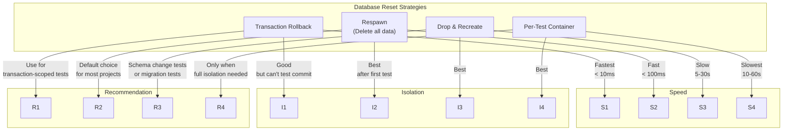
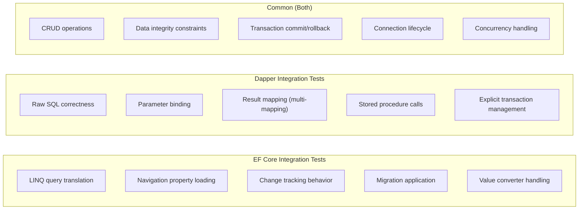
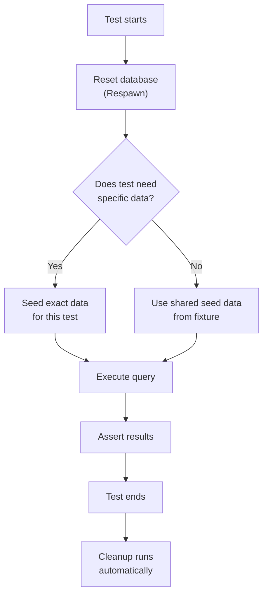

# 8.943 — Integration Testing — Real Database

## Section 1 — Overview and Motivation

Integration tests against a real database are the single most important category of database tests. While mocked unit tests validate business logic and schema tests validate structure, integration tests validate that your actual queries — whether generated by EF Core or written by hand for Dapper — produce correct results against a real database engine.

The core premise is simple: if your application queries a SQL Server database in production, your tests must query a SQL Server database as well. Substituting SQLite, InMemory, or mocks introduces a translation layer that can hide bugs in SQL generation, provider behavior, and data type handling.

### 1.1 — What Integration Tests Catch That Mocks Don't

Consider this EF Core query:

```csharp
var result = await context.Orders
    .Where(o => o.CreatedAt >= fromDate)
    .Where(o => o.CreatedAt <= toDate)
    .Join(context.Customers, o => o.CustomerId, c => c.Id, (o, c) => new { o, c })
    .Where(joined => joined.c.Status == "Active")
    .Select(joined => new OrderSummary
    {
        OrderId = joined.o.Id,
        CustomerName = joined.c.Name,
        Total = joined.o.Total,
        ItemCount = joined.o.Items.Count
    })
    .OrderByDescending(s => s.Total)
    .Take(10)
    .ToListAsync();
```

A mocked test would:
- Execute LINQ-to-Objects on in-memory lists, not translate to SQL
- Not validate that `Items.Count` translates correctly (it may generate a subquery)
- Not validate that the JOIN produces the correct result shape
- Not detect if EF Core would throw because of a missing navigation property configuration
- Not detect if the generated SQL performs poorly

An integration test against SQL Server would execute the actual T-SQL generated by EF Core and return real results from a real database engine.

### 1.2 — What Integration Tests Catch That Unit Tests Don't

| Issue | Mock Test | Integration Test |
|-------|-----------|-----------------|
| SQL syntax error | ✅ Passes | ❌ Fails |
| Wrong table name | ✅ Passes | ❌ Fails |
| Wrong column name | ✅ Passes | ❌ Fails |
| Missing navigation property config | ✅ Passes | ❌ Fails |
| Incorrect LINQ translation | ✅ Passes | ❌ Fails |
| Type conversion error | ✅ Passes | ❌ Fails |
| Constraint violation | ✅ Passes | ❌ Fails |
| Transaction rollback behavior | ✅ Passes | ❌ Fails |
| Concurrency conflict | ✅ Passes | ❌ Fails (with proper setup) |

### 1.3 — When Integration Tests Are Insufficient

Integration tests against a real database are not a silver bullet. They cannot catch:

- Performance issues under load (need dedicated performance tests)
- Race conditions with concurrent transactions (need concurrency tests)
- Deadlocks under high concurrency (need load tests)
- Schema migration issues with existing data (need migration tests)
- Issues with database-specific features not exercised by the test (need comprehensive coverage)

---

## Section 2 — Core Concepts

### 2.1 — Integration Test Lifecycle

Every integration test against a real database follows this lifecycle:

```
1. Database Provisioning
   → Start container (TestContainers) or connect to existing instance
   
2. Schema Setup
   → Apply EF Core migrations or execute SQL scripts
   
3. Seed Data
   → Insert deterministic test data
   
4. Execute Test
   → Run the repository method / query under test
   
5. Assert Results
   → Verify returned data matches expectations
   
6. Cleanup
   → Reset database state (Respawn) or drop and recreate
```

### 2.2 — Key Decisions

**Shared vs isolated database:**
- Shared: All tests in a suite use the same database. Faster (no schema setup per test). Risk of test interference.
- Isolated: Each test gets its own database or schema. Slower but fully isolated.

**Database reset strategy:**
- Transaction rollback: Wrap each test in a transaction, rollback at the end. Fast but doesn't test transaction behavior.
- Respawn: Delete all data after each test. Fast, but requires schema knowledge.
- Drop and recreate: Drop the database/container after each test. Slowest but cleanest.
- Per-test container: Each test gets a new Docker container. Maximum isolation, slowest.

**Test data approach:**
- Seeded per test: Each test inserts its own data. Most explicit, most boilerplate.
- Shared seed data: A common data set is seeded once per test suite. Faster, but tests depend on shared state.
- Data builder pattern: Fluent builders construct test data objects. Reduces boilerplate while keeping tests explicit.

### 2.3 — Database Fixture Patterns

**Pattern 1: Collection Fixture (shared across test class)**

```csharp
[CollectionDefinition("Database")]
public class DatabaseCollection : ICollectionFixture<DatabaseFixture>
{
    // This class has no code — it's just a marker
}

[Collection("Database")]
public class OrderRepositoryTests
{
    private readonly DatabaseFixture _fixture;

    public OrderRepositoryTests(DatabaseFixture fixture)
    {
        _fixture = fixture;
    }
}
```

**Pattern 2: Class Fixture (new instance per test class)**

```csharp
public class OrderRepositoryTests : IClassFixture<DatabaseFixture>
{
    private readonly DatabaseFixture _fixture;

    public OrderRepositoryTests(DatabaseFixture fixture)
    {
        _fixture = fixture;
    }
}
```

**Pattern 3: Per-test (new instance per test)**

```csharp
public class OrderRepositoryTests
{
    [Fact]
    public async Task GetById_ReturnsOrder()
    {
        await using var fixture = new DatabaseFixture();
        await fixture.InitializeAsync();
        // ...
    }
}
```

Collection fixtures are the most common pattern for integration tests because they balance isolation (the container setup cost is paid once) with speed (the container is shared across all tests in the collection).

---

## Section 3 — Setup and Configuration

### 3.1 — Project Structure

```
tests/
├── MyApp.IntegrationTests/
│   ├── Fixtures/
│   │   ├── DatabaseFixture.cs
│   │   ├── SqlServerContainerFixture.cs
│   │   └── PostgresContainerFixture.cs
│   ├── Repositories/
│   │   ├── OrderRepositoryTests.cs
│   │   ├── CustomerRepositoryTests.cs
│   │   └── ProductRepositoryTests.cs
│   ├── Services/
│   │   ├── OrderServiceIntegrationTests.cs
│   │   └── CustomerServiceIntegrationTests.cs
│   ├── SeedData/
│   │   ├── OrderSeedData.cs
│   │   └── CustomerSeedData.cs
│   └── usings.cs
```

### 3.2 — Essential NuGet Packages

```xml
<PackageReference Include="Microsoft.NET.Test.Sdk" Version="17.*" />
<PackageReference Include="xunit" Version="2.*" />
<PackageReference Include="xunit.runner.visualstudio" Version="2.*" />
<PackageReference Include="Testcontainers.MsSql" Version="3.*" />
<PackageReference Include="Testcontainers.PostgreSql" Version="3.*" />
<PackageReference Include="Respawn" Version="6.*" />
<PackageReference Include="Microsoft.AspNetCore.Mvc.Testing" Version="8.*" />
<PackageReference Include="Microsoft.EntityFrameworkCore.SqlServer" Version="8.*" />
```

### 3.3 — DatabaseFixture Implementation

```csharp
public class DatabaseFixture : IAsyncLifetime
{
    private readonly MsSqlContainer _container;
    private string _connectionString;
    private Respawner _respawner;

    public DatabaseFixture()
    {
        _container = new MsSqlBuilder()
            .WithImage("mcr.microsoft.com/mssql/server:2022-latest")
            .WithPassword("Your_Str0ng_P@ssw0rd!")
            .WithCleanUp(true)
            .Build();
    }

    public async Task InitializeAsync()
    {
        await _container.StartAsync();
        _connectionString = _container.GetConnectionString();

        // Apply EF Core migrations
        var optionsBuilder = new DbContextOptionsBuilder<AppDbContext>();
        optionsBuilder.UseSqlServer(_connectionString);
        using var context = new AppDbContext(optionsBuilder.Options);
        await context.Database.MigrateAsync();

        // Configure Respawn for fast cleanup
        _respawner = await Respawner.CreateAsync(_connectionString, new RespawnerOptions
        {
            SchemasToInclude = new[] { "dbo" },
            TablesToIgnore = new[] { "__EFMigrationsHistory" }
        });
    }

    public async Task DisposeAsync()
    {
        await _container.DisposeAsync();
    }

    public AppDbContext CreateDbContext()
    {
        var optionsBuilder = new DbContextOptionsBuilder<AppDbContext>();
        optionsBuilder.UseSqlServer(_connectionString);
        return new AppDbContext(optionsBuilder.Options);
    }

    public IDbConnection CreateConnection()
    {
        return new SqlConnection(_connectionString);
    }

    public IDbConnectionFactory GetConnectionFactory()
    {
        return new SqlConnectionFactory(_connectionString);
    }

    public async Task ResetDatabaseAsync()
    {
        await _respawner.ResetAsync(_connectionString);
    }

    public async Task SeedAsync(Action<AppDbContext> seedAction)
    {
        using var context = CreateDbContext();
        seedAction(context);
        await context.SaveChangesAsync();
    }
}
```

---

## Section 4 — EF Core Integration Tests

### 4.1 — Testing Basic CRUD

```csharp
[Collection("Database")]
public class OrderRepositoryTests
{
    private readonly DatabaseFixture _fixture;

    public OrderRepositoryTests(DatabaseFixture fixture)
    {
        _fixture = fixture;
    }

    [Fact]
    public async Task AddAsync_PersistsOrderToDatabase()
    {
        await _fixture.ResetDatabaseAsync();

        var order = new Order
        {
            Id = Guid.NewGuid(),
            CustomerId = Guid.NewGuid(),
            Total = 150.00m,
            Status = OrderStatus.Pending,
            CreatedAt = DateTime.UtcNow
        };

        using var context = _fixture.CreateDbContext();
        var repo = new OrderRepository(context);
        await repo.AddAsync(order);

        // Verify it was persisted
        var saved = await context.Orders
            .AsNoTracking()
            .FirstOrDefaultAsync(o => o.Id == order.Id);

        Assert.NotNull(saved);
        Assert.Equal(150.00m, saved.Total);
        Assert.Equal(OrderStatus.Pending, saved.Status);
    }

    [Fact]
    public async Task GetByIdAsync_ReturnsNull_WhenOrderDoesNotExist()
    {
        await _fixture.ResetDatabaseAsync();

        using var context = _fixture.CreateDbContext();
        var repo = new OrderRepository(context);
        var result = await repo.GetByIdAsync(Guid.NewGuid());

        Assert.Null(result);
    }

    [Fact]
    public async Task GetByIdAsync_ReturnsOrder_WhenExists()
    {
        await _fixture.ResetDatabaseAsync();
        var orderId = Guid.NewGuid();

        await _fixture.SeedAsync(ctx =>
        {
            ctx.Orders.Add(new Order
            {
                Id = orderId,
                CustomerId = Guid.NewGuid(),
                Total = 99.99m,
                Status = OrderStatus.Pending
            });
        });

        using var context = _fixture.CreateDbContext();
        var repo = new OrderRepository(context);
        var result = await repo.GetByIdAsync(orderId);

        Assert.NotNull(result);
        Assert.Equal(orderId, result.Id);
        Assert.Equal(99.99m, result.Total);
    }
}
```

### 4.2 — Testing LINQ Queries

```csharp
[Fact]
public async Task GetOrdersByCustomerIdAsync_ReturnsCorrectOrders()
{
    await _fixture.ResetDatabaseAsync();
    var customerId = Guid.NewGuid();

    // Seed orders with different customer IDs
    await _fixture.SeedAsync(ctx =>
    {
        ctx.Orders.AddRange(
            new Order { Id = Guid.NewGuid(), CustomerId = customerId, Total = 100m, Status = OrderStatus.Pending },
            new Order { Id = Guid.NewGuid(), CustomerId = customerId, Total = 200m, Status = OrderStatus.Shipped },
            new Order { Id = Guid.NewGuid(), CustomerId = Guid.NewGuid(), Total = 300m, Status = OrderStatus.Pending } // Different customer
        );
    });

    using var context = _fixture.CreateDbContext();
    var repo = new OrderRepository(context);
    var orders = await repo.GetOrdersByCustomerIdAsync(customerId);

    Assert.Equal(2, orders.Count);
    Assert.All(orders, o => Assert.Equal(customerId, o.CustomerId));
}
```

### 4.3 — Testing Navigation Property Loading

```csharp
[Fact]
public async Task GetOrderWithItemsAsync_IncludesOrderItems()
{
    await _fixture.ResetDatabaseAsync();
    var orderId = Guid.NewGuid();

    await _fixture.SeedAsync(ctx =>
    {
        var order = new Order
        {
            Id = orderId,
            CustomerId = Guid.NewGuid(),
            Total = 250m,
            Status = OrderStatus.Pending
        };
        order.Items.AddRange(new[]
        {
            new OrderItem { Id = Guid.NewGuid(), ProductName = "Widget A", Quantity = 2, UnitPrice = 50m },
            new OrderItem { Id = Guid.NewGuid(), ProductName = "Widget B", Quantity = 1, UnitPrice = 150m }
        });
        ctx.Orders.Add(order);
    });

    using var context = _fixture.CreateDbContext();
    var repo = new OrderRepository(context);
    var order = await repo.GetOrderWithItemsAsync(orderId);

    Assert.NotNull(order);
    Assert.Equal(2, order.Items.Count);
    Assert.Contains(order.Items, i => i.ProductName == "Widget A");
}
```

### 4.4 — Testing EF Core's SQL Generation

The real value of EF Core integration tests is that they execute the actual SQL generated by the LINQ provider. You can verify:

- The correct SQL is generated (by inspecting logs)
- The SQL executes without errors
- The SQL returns the expected result set

```csharp
[Fact]
public async Task ComplexQuery_GeneratesValidSql()
{
    await _fixture.ResetDatabaseAsync();

    // Seed data that will exercise specific query paths
    await _fixture.SeedAsync(ctx =>
    {
        var customer = new Customer
        {
            Id = Guid.NewGuid(),
            Name = "Test Customer",
            Status = "Active"
        };
        ctx.Customers.Add(customer);

        for (int i = 0; i < 5; i++)
        {
            ctx.Orders.Add(new Order
            {
                Id = Guid.NewGuid(),
                CustomerId = customer.Id,
                Total = 100m * (i + 1),
                Status = i % 2 == 0 ? OrderStatus.Shipped : OrderStatus.Pending,
                CreatedAt = DateTime.UtcNow.AddDays(-i)
            });
        }
    });

    using var context = _fixture.CreateDbContext();

    // Enable SQL logging
    context.Database.SetCommandTimeout(30);
    var sqlLog = new List<string>();
    context.GetService<ILoggerFactory>().AddProvider(new TestLoggerProvider(sqlLog));

    var repo = new OrderRepository(context);
    var result = await repo.GetTopCustomersReportAsync(10);

    Assert.NotEmpty(result);

    // Verify the SQL that was generated contains expected patterns
    Assert.Contains(sqlLog, log => log.Contains("SELECT") && log.Contains("FROM"));
    Assert.Contains(sqlLog, log => log.Contains("ORDER BY") || log.Contains("order by"));
}
```

### 4.5 — Testing Transactions

```csharp
[Fact]
public async Task SaveChanges_RollsBack_WhenTransactionFails()
{
    await _fixture.ResetDatabaseAsync();
    var orderId = Guid.NewGuid();

    using var context = _fixture.CreateDbContext();
    using var transaction = await context.Database.BeginTransactionAsync();

    context.Orders.Add(new Order
    {
        Id = orderId,
        CustomerId = Guid.NewGuid(),
        Total = 100m,
        Status = OrderStatus.Pending
    });
    await context.SaveChangesAsync();

    // Rollback
    await transaction.RollbackAsync();

    // Verify the order was not persisted
    var saved = await context.Orders
        .AsNoTracking()
        .FirstOrDefaultAsync(o => o.Id == orderId);
    Assert.Null(saved);
}
```

### 4.6 — Testing Concurrency

```csharp
[Fact]
public async Task UpdateOrder_ThrowsConcurrencyException_WhenVersionMismatch()
{
    await _fixture.ResetDatabaseAsync();
    var orderId = Guid.NewGuid();

    await _fixture.SeedAsync(ctx =>
    {
        ctx.Orders.Add(new Order
        {
            Id = orderId,
            CustomerId = Guid.NewGuid(),
            Total = 100m,
            Status = OrderStatus.Pending,
            RowVersion = new byte[] { 0, 0, 0, 0, 0, 0, 0, 1 }
        });
    });

    using var context1 = _fixture.CreateDbContext();
    using var context2 = _fixture.CreateDbContext();

    var order1 = await context1.Orders.FindAsync(orderId);
    var order2 = await context2.Orders.FindAsync(orderId);

    order1.Total = 200m;
    await context1.SaveChangesAsync(); // First save succeeds

    order2.Total = 300m;
    await Assert.ThrowsAsync<DbUpdateConcurrencyException>(() =>
        context2.SaveChangesAsync()); // Second save should fail
}
```

---

## Section 5 — Dapper Integration Tests

### 5.1 — Testing Dapper Queries

```csharp
[Collection("Database")]
public class DapperOrderRepositoryTests
{
    private readonly DatabaseFixture _fixture;

    public DapperOrderRepositoryTests(DatabaseFixture fixture)
    {
        _fixture = fixture;
    }

    [Fact]
    public async Task GetOrdersByCustomerIdAsync_ReturnsCorrectOrders()
    {
        await _fixture.ResetDatabaseAsync();
        var customerId = Guid.NewGuid();

        using var conn = _fixture.CreateConnection();
        await conn.ExecuteAsync(@"
            INSERT INTO Orders (Id, CustomerId, Total, Status, CreatedAt)
            VALUES (@Id, @CustomerId, @Total, @Status, @CreatedAt)",
            new[]
            {
                new { Id = Guid.NewGuid(), CustomerId = customerId, Total = 100m, Status = "Pending", CreatedAt = DateTime.UtcNow },
                new { Id = Guid.NewGuid(), CustomerId = customerId, Total = 200m, Status = "Shipped", CreatedAt = DateTime.UtcNow },
                new { Id = Guid.NewGuid(), CustomerId = Guid.NewGuid(), Total = 300m, Status = "Pending", CreatedAt = DateTime.UtcNow }
            });

        var repo = new DapperOrderRepository(_fixture.GetConnectionFactory());
        var orders = await repo.GetOrdersByCustomerIdAsync(customerId);

        Assert.Equal(2, orders.Count());
        Assert.All(orders, o => Assert.Equal(customerId, o.CustomerId));
    }

    [Fact]
    public async Task GetOrderByIdAsync_ReturnsNull_WhenNotFound()
    {
        await _fixture.ResetDatabaseAsync();

        var repo = new DapperOrderRepository(_fixture.GetConnectionFactory());
        var result = await repo.GetOrderByIdAsync(Guid.NewGuid());

        Assert.Null(result);
    }
}
```

### 5.2 — Testing Multi-Mapping with Dapper

```csharp
[Fact]
public async Task GetOrderWithItemsAsync_MapsOneToManyCorrectly()
{
    await _fixture.ResetDatabaseAsync();
    var orderId = Guid.NewGuid();

    using var conn = _fixture.CreateConnection();
    await conn.ExecuteAsync(@"
        INSERT INTO Orders (Id, CustomerId, Total, Status, CreatedAt)
        VALUES (@Id, @CustomerId, @Total, @Status, @CreatedAt)",
        new { Id = orderId, CustomerId = Guid.NewGuid(), Total = 250m, Status = "Pending", CreatedAt = DateTime.UtcNow });

    await conn.ExecuteAsync(@"
        INSERT INTO OrderItems (Id, OrderId, ProductName, Quantity, UnitPrice)
        VALUES (@Id, @OrderId, @ProductName, @Quantity, @UnitPrice)",
        new[]
        {
            new { Id = Guid.NewGuid(), OrderId = orderId, ProductName = "Widget A", Quantity = 2, UnitPrice = 50m },
            new { Id = Guid.NewGuid(), OrderId = orderId, ProductName = "Widget B", Quantity = 1, UnitPrice = 150m }
        });

    var repo = new DapperOrderRepository(_fixture.GetConnectionFactory());
    var order = await repo.GetOrderWithItemsAsync(orderId);

    Assert.NotNull(order);
    Assert.Equal(2, order.Items.Count());
    Assert.Contains(order.Items, i => i.ProductName == "Widget A");
}
```

### 5.3 — Testing Dapper Stored Procedures

```csharp
[Fact]
public async Task GetCustomerOrderSummary_CallsStoredProcedure()
{
    await _fixture.ResetDatabaseAsync();
    var customerId = Guid.NewGuid();

    // Create stored procedure
    using var conn = _fixture.CreateConnection();
    await conn.ExecuteAsync(@"
        CREATE PROCEDURE dbo.GetCustomerOrderSummary
            @CustomerId UNIQUEIDENTIFIER
        AS
        BEGIN
            SELECT
                c.Id AS CustomerId,
                c.Name AS CustomerName,
                COUNT(o.Id) AS OrderCount,
                ISNULL(SUM(o.Total), 0) AS TotalSpent
            FROM Customers c
            LEFT JOIN Orders o ON c.Id = o.CustomerId
            WHERE c.Id = @CustomerId
            GROUP BY c.Id, c.Name
        END");

    // Seed data
    await conn.ExecuteAsync(@"
        INSERT INTO Customers (Id, Name, Status) VALUES (@Id, @Name, @Status)",
        new { Id = customerId, Name = "Test Customer", Status = "Active" });

    await conn.ExecuteAsync(@"
        INSERT INTO Orders (Id, CustomerId, Total, Status, CreatedAt)
        VALUES (@Id, @CustomerId, @Total, @Status, @CreatedAt)",
        new[] {
            new { Id = Guid.NewGuid(), CustomerId = customerId, Total = 100m, Status = "Shipped", CreatedAt = DateTime.UtcNow },
            new { Id = Guid.NewGuid(), CustomerId = customerId, Total = 200m, Status = "Pending", CreatedAt = DateTime.UtcNow }
        });

    var repo = new DapperOrderRepository(_fixture.GetConnectionFactory());
    var summary = await repo.GetCustomerOrderSummaryAsync(customerId);

    Assert.NotNull(summary);
    Assert.Equal(2, summary.OrderCount);
    Assert.Equal(300m, summary.TotalSpent);
}
```

### 5.4 — Testing Dapper with Transactions

```csharp
[Fact]
public async Task CreateOrderAsync_UsesTransaction_RollsBackOnFailure()
{
    await _fixture.ResetDatabaseAsync();
    var orderId = Guid.NewGuid();

    var repo = new DapperOrderRepository(_fixture.GetConnectionFactory());
    var order = new Order
    {
        Id = orderId,
        CustomerId = Guid.NewGuid(),
        Total = 100m,
        Status = "Pending"
    };

    // This method wraps the insert in a transaction
    await repo.CreateOrderWithTransactionAsync(order);

    // Verify the order was committed
    using var conn = _fixture.CreateConnection();
    var saved = await conn.QueryFirstOrDefaultAsync<Order>(
        "SELECT * FROM Orders WHERE Id = @Id", new { Id = orderId });

    Assert.NotNull(saved);
    Assert.Equal(100m, saved.Total);
}
```

### 5.5 — Testing Dapper with Explicit SQL Patterns

```csharp
[Fact]
public async Task GetPagedOrdersAsync_ReturnsCorrectPage()
{
    await _fixture.ResetDatabaseAsync();

    // Seed 25 orders
    using var conn = _fixture.CreateConnection();
    for (int i = 1; i <= 25; i++)
    {
        await conn.ExecuteAsync(@"
            INSERT INTO Orders (Id, CustomerId, Total, Status, CreatedAt)
            VALUES (@Id, @CustomerId, @Total, @Status, @CreatedAt)",
            new
            {
                Id = Guid.NewGuid(),
                CustomerId = Guid.NewGuid(),
                Total = i * 10m,
                Status = i % 2 == 0 ? "Shipped" : "Pending",
                CreatedAt = DateTime.UtcNow.AddDays(-i)
            });
    }

    var repo = new DapperOrderRepository(_fixture.GetConnectionFactory());

    // Page 2, 10 items per page
    var result = await repo.GetPagedOrdersAsync(page: 2, pageSize: 10);

    Assert.Equal(10, result.Items.Count());
    Assert.Equal(25, result.TotalCount);
    Assert.Equal(2, result.Page);
    Assert.Equal(3, result.TotalPages);
}
```

---

## Section 6 — Mermaid Diagrams

### 6.1 — Integration Test Lifecycle

```mermaid
sequenceDiagram
    participant T as Test
    participant DF as DatabaseFixture
    participant TC as TestContainers
    participant DB as SQL Server
    participant R as Repository

    T->>DF: InitializeAsync()
    DF->>TC: StartAsync()
    TC->>DB: Pull image & start container
    DB-->>TC: Container ready
    TC-->>DF: Connection string
    DF->>DB: Apply migrations
    DB-->>DF: Schema created

    T->>DF: ResetDatabaseAsync()
    DF->>DB: Respawn (truncate all tables)
    DB-->>DF: Clean state

    T->>DF: SeedAsync(seedAction)
    DF->>DB: INSERT test data
    DB-->>DF: Data inserted

    T->>R: Execute query method
    R->>DB: Execute SQL (EF Core or Dapper)
    DB-->>R: Result set
    R-->>T: Domain objects

    T->>T: Assert results

    T->>DF: DisposeAsync()
    DF->>TC: Dispose container
    TC->>DB: Stop & remove container
```



### 6.2 — Database Reset Strategies



### 6.3 — EF Core vs Dapper Integration Test Coverage



### 6.4 — Test Data Flow



---

## Section 7 — CI/CD and Production Considerations

### 7.1 — Running Integration Tests in CI

Integration tests against real databases require Docker in the CI environment. Here are the most common configurations:

**GitHub Actions:**

```yaml
name: Integration Tests
on:
  pull_request:
    branches: [main]

jobs:
  integration:
    runs-on: ubuntu-latest
    services:
      docker:
        image: docker:24.0.5
        options: --privileged

    steps:
      - uses: actions/checkout@v4
      - uses: actions/setup-dotnet@v4
        with:
          dotnet-version: '8.0.x'

      - name: Run integration tests
        run: |
          dotnet test ./tests/MyApp.IntegrationTests \
            --configuration Release \
            --filter "Category=Integration" \
            --logger "trx;LogFileName=test-results.trx"

      - name: Upload test results
        uses: actions/upload-artifact@v4
        with:
          name: test-results
          path: '**/*.trx'
```

**Azure DevOps:**

```yaml
trigger: none
pr:
  branches:
    include:
      - main

pool:
  vmImage: 'ubuntu-latest'

steps:
  - task: DockerInstaller@0
    displayName: Install Docker
    inputs:
      dockerVersion: '24.0.5'
      releaseType: stable

  - task: DotNetCoreCLI@2
    displayName: Run integration tests
    inputs:
      command: test
      projects: '**/*IntegrationTests*.csproj'
      arguments: >
        --configuration Release
        --filter "Category=Integration"
        --logger "trx;LogFileName=test-results.trx"

  - task: PublishTestResults@2
    inputs:
      testResultsFormat: 'VSTest'
      testResultsFiles: '**/*.trx'
```

### 7.2 — Database Per Test Suite (Not Per Test)

A critical performance optimization is to share a single database container across an entire test suite (via collection fixture) rather than creating a new container per test. The breakdown:

| Strategy | Container Startups | Schema Setup | Total Time (50 tests) |
|----------|-------------------|--------------|----------------------|
| Per test | 50 | 50 | 25-50 minutes |
| Per class (IClassFixture) | 1 per class (e.g., 5) | 5 | 2-5 minutes |
| Per collection | 1 | 1 | 30-90 seconds |

The per-collection or per-class approach is almost always the right choice. Within the shared database, use Respawn (or transaction rollback) to reset the state between individual tests.

### 7.3 — Deterministic Test Data

Test data must be deterministic. Each test should produce the same results every time it runs. Follow these rules:

1. **Use fixed GUIDs**, not random ones
2. **Use fixed dates**, not DateTime.UtcNow (use a specific date like 2024-06-15)
3. **Use fixed strings**, not generated names
4. **Seed exactly the data you need**, no more, no less
5. **Clear all data before each test** (Respawn), don't assume leftover data doesn't matter

```csharp
// GOOD — deterministic
await _fixture.SeedAsync(ctx =>
{
    ctx.Orders.Add(new Order
    {
        Id = new Guid("A1B2C3D4-E5F6-7890-ABCD-EF1234567890"),
        CustomerId = new Guid("B2C3D4E5-F6A7-8901-BCDE-F12345678901"),
        Total = 100m,
        Status = OrderStatus.Pending,
        CreatedAt = new DateTime(2024, 6, 15, 10, 0, 0, DateTimeKind.Utc)
    });
});

// BAD — non-deterministic
await _fixture.SeedAsync(ctx =>
{
    ctx.Orders.Add(new Order
    {
        Id = Guid.NewGuid(),
        CustomerId = Guid.NewGuid(),
        Total = Random.Shared.Next(1, 1000),
        Status = OrderStatus.Pending,
        CreatedAt = DateTime.UtcNow
    });
});
```

### 7.4 — Test Timeouts

Integration tests must have timeouts to prevent hung builds:

```csharp
[Fact(Timeout = 30000)] // 30 seconds
public async Task GetOrdersByCustomerId_UnderTimeout()
{
    // Test code
}
```

Set the timeout based on:
- Normal test execution time: +50% buffer
- Database connection establishment: 10-15 seconds
- Container startup: N/A (handled by fixture, not per-test)
- Query execution: 1-5 seconds

### 7.5 — Parallel Execution

Integration tests that share a database fixture should NOT run in parallel. xUnit runs tests within the same collection sequentially by default. If you have multiple collections (each with its own database), they can run in parallel safely.

```csharp
[CollectionDefinition("Database", DisableParallelization = true)]
public class DatabaseCollection : ICollectionFixture<DatabaseFixture>
{
}
```

---

## Section 8 — Advanced Patterns

### 8.1 — WebApplicationFactory with Real Database

For ASP.NET Core integration tests, combine WebApplicationFactory with DatabaseFixture:

```csharp
public class CustomWebApplicationFactory : WebApplicationFactory<Program>, IAsyncLifetime
{
    private readonly MsSqlContainer _container = new MsSqlBuilder()
        .WithImage("mcr.microsoft.com/mssql/server:2022-latest")
        .WithPassword("Test_P@ssw0rd!")
        .WithCleanUp(true)
        .Build();

    protected override void ConfigureWebHost(IWebHostBuilder builder)
    {
        builder.ConfigureTestServices(services =>
        {
            // Remove the real DbContext registration
            var descriptor = services.SingleOrDefault(
                d => d.ServiceType == typeof(DbContextOptions<AppDbContext>));
            if (descriptor != null) services.Remove(descriptor);

            // Add test DbContext
            services.AddDbContext<AppDbContext>(options =>
                options.UseSqlServer(_container.GetConnectionString()));
        });
    }

    public async Task InitializeAsync()
    {
        await _container.StartAsync();
    }

    public async Task DisposeAsync()
    {
        await _container.DisposeAsync();
    }
}
```

### 8.2 — Testing Multiple Database Providers

If your application supports multiple database providers, test against each one:

```csharp
[Theory]
[InlineData("SqlServer")]
[InlineData("PostgreSQL")]
public async Task GetOrdersByCustomerId_WorksAcrossProviders(string provider)
{
    await _fixture.InitializeForProvider(provider);
    await _fixture.ResetDatabaseAsync();

    // Run the same test against each provider
    using var context = _fixture.CreateDbContext(provider);
    var repo = new OrderRepository(context);
    var orders = await repo.GetOrdersByCustomerIdAsync(customerId);

    Assert.Equal(expectedCount, orders.Count);
}
```

### 8.3 — Testing Database Constraints

```csharp
[Fact]
public async Task AddOrder_WithMissingRequiredField_Throws()
{
    await _fixture.ResetDatabaseAsync();

    using var context = _fixture.CreateDbContext();
    context.Orders.Add(new Order
    {
        Id = Guid.NewGuid(),
        // CustomerId is NOT set — will violate FK constraint
        Total = 100m,
        Status = OrderStatus.Pending
    });

    await Assert.ThrowsAsync<DbUpdateException>(() => context.SaveChangesAsync());
}
```

### 8.4 — Testing Raw SQL with Dapper

```csharp
[Fact]
public async Task ComplexJoinQuery_ReturnsCorrectResults()
{
    await _fixture.ResetDatabaseAsync();
    var customerId = Guid.NewGuid();

    using var conn = _fixture.CreateConnection();

    // Seed customers
    await conn.ExecuteAsync(
        "INSERT INTO Customers (Id, Name, Status) VALUES (@Id, @Name, @Status)",
        new { Id = customerId, Name = "Test Corp", Status = "Active" });

    // Seed orders
    await conn.ExecuteAsync(
        "INSERT INTO Orders (Id, CustomerId, Total, Status, CreatedAt) VALUES (@Id, @CustomerId, @Total, @Status, @CreatedAt)",
        new[] {
            new { Id = Guid.NewGuid(), CustomerId = customerId, Total = 500m, Status = "Shipped", CreatedAt = new DateTime(2024, 1, 15) },
            new { Id = Guid.NewGuid(), CustomerId = customerId, Total = 300m, Status = "Pending", CreatedAt = new DateTime(2024, 2, 20) }
        });

    // Execute a complex query with JOIN and aggregation
    var result = await conn.QueryAsync<CustomerSummary>(@"
        SELECT
            c.Id,
            c.Name,
            COUNT(o.Id) AS OrderCount,
            COALESCE(SUM(o.Total), 0) AS TotalRevenue,
            MAX(o.CreatedAt) AS LastOrderDate
        FROM Customers c
        LEFT JOIN Orders o ON c.Id = o.CustomerId
        WHERE c.Status = 'Active'
        GROUP BY c.Id, c.Name
        HAVING COUNT(o.Id) > 0
        ORDER BY TotalRevenue DESC");

    var summary = result.Single();
    Assert.Equal("Test Corp", summary.Name);
    Assert.Equal(2, summary.OrderCount);
    Assert.Equal(800m, summary.TotalRevenue);
}
```

### 8.5 — Testing Database Migrations

```csharp
[Fact]
public async Task ApplyMigrations_FromScratch_Succeeds()
{
    // This test validates that migrations can be applied to an empty database

    using var context = _fixture.CreateDbContext();

    // Drop everything
    await context.Database.EnsureDeletedAsync();

    // Apply all migrations (this would fail if any migration is broken)
    await context.Database.MigrateAsync();

    // Verify schema
    var canConnect = await context.Database.CanConnectAsync();
    Assert.True(canConnect);

    // Verify we can write and read
    context.Orders.Add(new Order
    {
        Id = Guid.NewGuid(),
        CustomerId = Guid.NewGuid(),
        Total = 100m,
        Status = OrderStatus.Pending
    });
    await context.SaveChangesAsync();
}
```

### 8.6 — Testing with Explicit Transaction Rollback

For tests that need isolation but don't need to test transaction behavior, wrap each test in a transaction and rollback:

```csharp
public abstract class DatabaseTestBase : IAsyncLifetime
{
    private readonly DatabaseFixture _fixture;
    private IDbContextTransaction _transaction;

    protected DatabaseTestBase(DatabaseFixture fixture)
    {
        _fixture = fixture;
    }

    public async Task InitializeAsync()
    {
        var context = _fixture.CreateDbContext();
        _transaction = await context.Database.BeginTransactionAsync();
        CurrentContext = context;
    }

    public async Task DisposeAsync()
    {
        await _transaction.RollbackAsync();
        await CurrentContext.DisposeAsync();
        _transaction.Dispose();
    }

    protected AppDbContext CurrentContext { get; private set; }
}
```

---

## Section 9 — Summary, Gotchas, and Checklist

### 9.1 — Key Principles

1. **Test against the real database engine.** SQLite and InMemory providers are not substitutes for SQL Server or PostgreSQL.
2. **Use TestContainers for CI.** Containers provide disposable, reproducible database instances without manual setup.
3. **Share containers across test suites.** Container startup is expensive; share via collection fixtures and use Respawn for per-test cleanup.
4. **Seed deterministically.** Use fixed IDs, dates, and values. Random data produces non-deterministic test results.
5. **Reset between tests.** Use Respawn or transaction rollback to ensure each test starts with a clean database.
6. **Test all query paths.** Every repository method, every LINQ query, every Dapper SQL string should have an integration test.

### 9.2 — Gotchas

- **Slow container startup.** SQL Server container takes 10-30 seconds to start. Mitigate by sharing the container across a collection.
- **Docker not available in CI.** Some CI providers do not support Docker. Use self-hosted runners or managed database services.
- **Test order dependency.** If one test inserts data and another test reads it without proper cleanup, tests will fail when run in different orders. Always reset between tests.
- **Shared mutable state.** A shared database fixture means tests can corrupt each other's data if cleanup is not thorough.
- **Respawn limitations.** Respawn truncates tables, but it cannot reset sequences, identity columns, or temp tables. Some databases (PostgreSQL) require additional steps.
- **EF Core migration issues.** Applying migrations in test setup can be slow and may fail if migrations have side effects (data migrations, seed data in migrations).
- **Dapper and connection management.** Dapper doesn't open/close connections automatically. Tests must ensure connections are properly disposed.
- **Parallel test execution.** Tests that share a database fixture must not run in parallel. Use collection-level parallelization disabling.
- **Date/time handling.** SQL Server and .NET handle DateTime with different precision and timezone behavior. Always use DateTimeKind.Utc.
- **Case sensitivity.** SQL Server is case-insensitive by default; PostgreSQL is case-sensitive. Tests may pass on one and fail on another.
- **Container cleanup.** TestContainers should clean up containers after tests, but if tests are aborted, orphaned containers may accumulate.

### 9.3 — Checklist

- [ ] DatabaseFixture or equivalent is implemented with IAsyncLifetime
- [ ] Container image matches production database engine and version
- [ ] Migrations (EF Core) or schema scripts (Dapper) are applied during fixture setup
- [ ] Database reset mechanism is configured (Respawn or transaction rollback)
- [ ] Every repository method has at least one integration test
- [ ] Tests cover: happy path, null/not-found, empty collections, edge cases
- [ ] Tests use deterministic data (fixed GUIDs, dates, values)
- [ ] Tests include constraint violation scenarios
- [ ] Transaction behavior is tested (commit, rollback, savepoint)
- [ ] Concurrency scenarios are tested (optimistic locking, if applicable)
- [ ] Dapper tests cover: basic CRUD, multi-mapping, stored procedures, explicit SQL
- [ ] EF Core tests cover: basic CRUD, LINQ queries, navigation properties, tracked vs no-tracking
- [ ] CI pipeline includes integration test stage with Docker support
- [ ] Test timeouts are configured (30 seconds per test)
- [ ] Tests are grouped into collections with parallelization disabled
- [ ] Container lifecycle is managed (start, wait-for-ready, stop, dispose)
- [ ] No test depends on a specific execution order
- [ ] Seed data does not conflict between tests
- [ ] Failing tests produce actionable error messages
- [ ] Test categories are applied: [Category="Integration"]

### 9.4 — Further Reading

- [[8.941 — Database Testing — Strategy Overview]] — Testing strategy context
- [[8.942 — Unit Testing — Repository Mocks]] — Mocking vs integration testing
- [[8.944 — TestContainers — SQL Server in Docker]] — Detailed container setup
- [[8.945 — TestContainers — PostgreSQL in Docker]] — PostgreSQL container setup
- [[8.946 — Respawn — Database Reset Between Tests]] — Database cleanup techniques
- [[8.950 — Database Fixtures — xUnit IClassFixture]] — Fixture patterns
- [[8.951 — Seeding Test Data — Deterministic Setup]] — Test data seeding patterns
- [[8.954 — Testing Transactions — Rollback After Test]] — Transaction-based isolation
