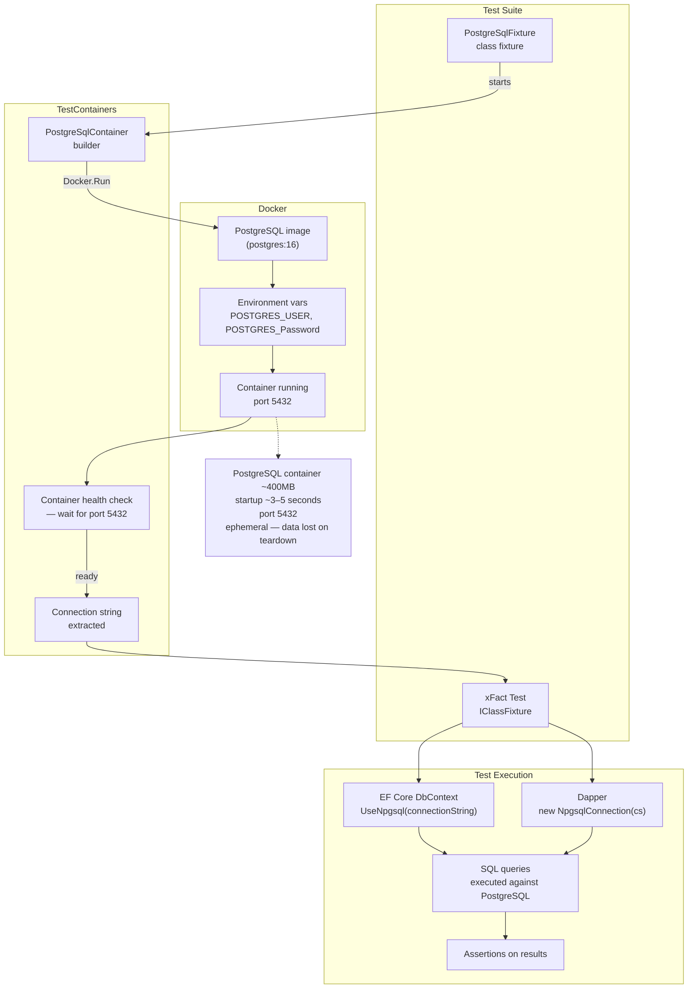
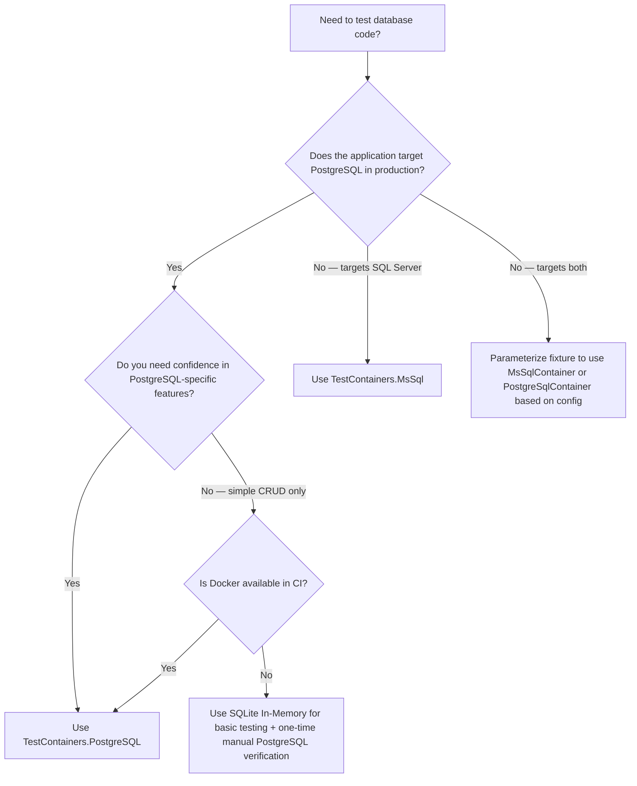

## Navigation

**Domain:** [[8 — Databases]] > **Group:** [[Group 33 — Database Testing]] **Previous:** [[8.944 — TestContainers — SQL Server in Docker]] | **Next:** [[8.946 — Respawn — Database Reset Between Tests]]

### Prerequisites

[[8.944 — TestContainers — SQL Server in Docker]] covers the same pattern for SQL Server; this topic assumes familiarity with that pattern and focuses on PostgreSQL-specific differences. [[8.943 — Integration Testing — Real Database]] establishes why real-database tests matter. [[8.469 — Npgsql in .NET]] covers the Npgsql ADO.NET provider that TestContainers.PostgreSQL works with.

### Where This Fits

PostgreSQL's Docker image is roughly 400 MB (vs SQL Server's ~2 GB), starts in ~3–5 seconds (vs ~15–30 seconds for SQL Server), and uses port 5432 by default. This makes it the most practical choice for CI pipelines that need a real relational database without paying the startup or storage cost of SQL Server. In production, TestContainers.PostgreSQL is used for integration tests against PostgreSQL backends, ETL pipelines using PostGIS, and any .NET application that targets PostgreSQL via EF Core (Npgsql provider) or Dapper (NpgsqlConnection). The pattern is identical to the SQL Server variant — container lifecycle managed by xUnit fixtures, connection string extracted from the container, tests run against a real PostgreSQL instance — but the image, port, environment variables, and some initialization details differ in ways that matter for reliability.

---

## Core Mental Model

TestContainers.PostgreSQL manages a PostgreSQL Docker container as a disposable test dependency. The test fixture starts the container, waits for the PostgreSQL engine to accept connections, exposes a connection string, and tears down the container after all tests complete. The test code — EF Core's DbContext or Dapper's NpgsqlConnection — uses that connection string exactly as it would in production, with no special test-aware branching.

### Classification

**For infrastructure testing:** TestContainers.PostgreSQL is a container-lifecycle tool that sits above the Npgsql ADO.NET provider. It replaces the need for a permanently running PostgreSQL instance. It does not mock or fake the database — every query issued against the container runs against real PostgreSQL 16 (or whatever image tag you specify). What it hides from the developer: Docker daemon interaction, port mapping, container health checks, container clean-up. Where the abstraction leaks: the container is ephemeral — data does not survive between test runs; startup time is real wall-clock time (though fast at ~3–5 seconds); Docker must be installed and running on the test machine or CI agent.



### Key Properties

|Property|Value|Notes|
|---|---|---|
|Time Complexity|Startup: ~3–5 s (cold); ~0 s if container cached|PostgreSQL image is small; Docker caches layers across runs|
|Write Cost|None per test — container starts once per fixture|Respawn or per-test container if isolation required|
|SARGable|Yes — real PostgreSQL query planner|All indexes, statistics, and planner behavior are real; no provider translation layer|
|Locking Behavior|Real PostgreSQL MVCC|Test can observe and assert locking behavior — not simulated|
|Data Persistence|None (ephemeral container)|`WITH VOLUME` or custom Dockerfile for persistent data if needed|
|Port|5432 (default)|Mapped to a random host port to avoid conflicts|

---

## Deep Mechanics

### How TestContainers.PostgreSQL Starts the Container

TestContainers.PostgreSQL wraps the `PostgreSqlContainer` class from the `Testcontainers.PostgreSql` NuGet package. The builder API mirrors `Testcontainers.MsSql` but uses the `postgres` Docker image and different environment variables:

```csharp
using Testcontainers.PostgreSql;

public sealed class PostgreSqlFixture : IAsyncLifetime
{
    public PostgreSqlContainer Container { get; } = new PostgreSqlBuilder()
        .WithImage("postgres:16")
        .WithDatabase("testdb")
        .WithUsername("testuser")
        .WithPassword("testpassword")
        .WithCleanUp(true)
        .Build();

    public string ConnectionString => Container.GetConnectionString();

    public async Task InitializeAsync()
    {
        await Container.StartAsync();
        // Container is ready — PostgreSQL accepts connections
    }

    public async Task DisposeAsync()
    {
        await Container.DisposeAsync();
    }
}
```

**What happens inside StartAsync:**

1. Docker client checks if the `postgres:16` image is available locally; if not, pulls it (first run only).
2. A new container is created with environment variables `POSTGRES_USER`, `POSTGRES_PASSWORD`, `POSTGRES_DB` mapped from builder settings.
3. Port 5432 inside the container is mapped to a random available host port (e.g., 5432 → 15432).
4. A health check polls TCP port 5432 until the PostgreSQL engine accepts connections — typically 3–5 seconds on a cold start.
5. `GetConnectionString()` returns a string like `"Host=localhost;Port=15432;Database=testdb;Username=testuser;Password=testpassword"`.

### PostgreSQL Initialization vs SQL Server

PostgreSQL initializes differently from SQL Server. The `postgres` image runs the `initdb` step automatically on first start (creating the default database and user based on env vars), then starts the engine. SQL Server does not have an equivalent `initdb` — it starts a blank instance and requires explicit database creation. PostgreSQL's image also runs any `.sql` or `.sh` scripts placed in `/docker-entrypoint-initdb.d/` during initialization:

```csharp
public sealed class PostgreSqlWithInitScriptFixture : IAsyncLifetime
{
    public PostgreSqlContainer Container { get; } = new PostgreSqlBuilder()
        .WithImage("postgres:16")
        .WithResourceMapping(
            "scripts/init.sql",   // local file path
            "/docker-entrypoint-initdb.d/init.sql")  // container path
        .Build();

    public async Task InitializeAsync() => await Container.StartAsync();
    public async Task DisposeAsync() => await Container.DisposeAsync();
}
```

**Use case for init scripts:** Create extensions (PostGIS, uuid-ossp, pgcrypto), create additional databases, pre-seed reference data, or customize configuration. This runs exactly once during container initialization, not once per test.

### EF Core Npgsql Configuration with TestContainers

```csharp
public class TestDbContext : DbContext
{
    public DbSet<Product> Products => Set<Product>();
    public DbSet<Category> Categories => Set<Category>();
    public DbSet<Order> Orders => Set<Order>();
    public DbSet<OrderItem> OrderItems => Set<OrderItem>();

    public TestDbContext(DbContextOptions<TestDbContext> options) : base(options) { }

    protected override void OnModelCreating(ModelBuilder modelBuilder)
    {
        modelBuilder.Entity<Product>(entity =>
        {
            entity.ToTable("products");
            entity.HasKey(p => p.Id);
            entity.Property(p => p.Name).IsRequired().HasMaxLength(200);
            entity.Property(p => p.Price).HasColumnType("decimal(18,2)");
            entity.HasOne(p => p.Category)
                  .WithMany(c => c.Products)
                  .HasForeignKey(p => p.CategoryId);
        });

        modelBuilder.Entity<Category>(entity =>
        {
            entity.ToTable("categories");
            entity.HasKey(c => c.Id);
            entity.Property(c => c.Name).IsRequired().HasMaxLength(100);
        });

        modelBuilder.Entity<Order>(entity =>
        {
            entity.ToTable("orders");
            entity.HasKey(o => o.Id);
            entity.Property(o => o.OrderDate).HasColumnType("timestamp with time zone");
            entity.Property(o => o.Total).HasColumnType("decimal(18,2)");
        });

        modelBuilder.Entity<OrderItem>(entity =>
        {
            entity.ToTable("order_items");
            entity.HasKey(oi => oi.Id);
            entity.Property(oi => oi.UnitPrice).HasColumnType("decimal(18,2)");
            entity.HasOne(oi => oi.Order)
                  .WithMany(o => o.Items)
                  .HasForeignKey(oi => oi.OrderId);
            entity.HasOne(oi => oi.Product)
                  .WithMany()
                  .HasForeignKey(oi => oi.ProductId);
        });
    }
}

// In the xUnit fixture — create DbContext with the container's connection string
public sealed class PostgreSqlEfFixture : IAsyncLifetime
{
    private PostgreSqlContainer _container = null!;
    private DbContextOptions<TestDbContext> _options = null!;

    public async Task InitializeAsync()
    {
        _container = new PostgreSqlBuilder()
            .WithImage("postgres:16")
            .WithDatabase("testdb")
            .WithUsername("testuser")
            .WithPassword("testpassword")
            .Build();

        await _container.StartAsync();

        _options = new DbContextOptionsBuilder<TestDbContext>()
            .UseNpgsql(_container.GetConnectionString(), npgsqlOptions =>
            {
                npgsqlOptions.EnableRetryOnFailure(3);
                npgsqlOptions.CommandTimeout(30);
            })
            .Options;

        // Run EF Core migrations to create the schema
        await using var context = new TestDbContext(_options);
        await context.Database.MigrateAsync();
    }

    public TestDbContext CreateContext() => new TestDbContext(_options);

    public async Task DisposeAsync()
    {
        await _container.DisposeAsync();
    }
}
```

### Dapper with NpgsqlConnection and TestContainers

```csharp
public sealed class PostgreSqlDapperFixture : IAsyncLifetime
{
    private PostgreSqlContainer _container = null!;
    private string _connectionString = null!;

    public async Task InitializeAsync()
    {
        _container = new PostgreSqlBuilder()
            .WithImage("postgres:16")
            .WithDatabase("testdb")
            .WithUsername("testuser")
            .WithPassword("testpassword")
            .Build();

        await _container.StartAsync();
        _connectionString = _container.GetConnectionString();

        // Create schema manually (Dapper has no migration system)
        await using var conn = new NpgsqlConnection(_connectionString);
        await conn.OpenAsync();
        await using var cmd = new NpgsqlCommand(@"
            CREATE TABLE IF NOT EXISTS products (
                id SERIAL PRIMARY KEY,
                name VARCHAR(200) NOT NULL,
                price DECIMAL(18,2) NOT NULL,
                category_id INT NOT NULL,
                created_at TIMESTAMPTZ DEFAULT NOW()
            );
            CREATE TABLE IF NOT EXISTS categories (
                id SERIAL PRIMARY KEY,
                name VARCHAR(100) NOT NULL
            );
            CREATE TABLE IF NOT EXISTS orders (
                id SERIAL PRIMARY KEY,
                order_date TIMESTAMPTZ NOT NULL DEFAULT NOW(),
                total DECIMAL(18,2) NOT NULL
            );
            CREATE TABLE IF NOT EXISTS order_items (
                id SERIAL PRIMARY KEY,
                order_id INT NOT NULL REFERENCES orders(id),
                product_id INT NOT NULL REFERENCES products(id),
                quantity INT NOT NULL,
                unit_price DECIMAL(18,2) NOT NULL
            );
        ", conn);
        await cmd.ExecuteNonQueryAsync();
    }

    public NpgsqlConnection CreateConnection()
    {
        var conn = new NpgsqlConnection(_connectionString);
        conn.Open(); // keep open for in-memory semantics
        return conn;
    }

    public async Task DisposeAsync()
    {
        await _container.DisposeAsync();
    }
}
```

### Dapper Repository Test

```csharp
public class ProductRepository
{
    private readonly string _connectionString;

    public ProductRepository(string connectionString)
    {
        _connectionString = connectionString;
    }

    public async Task<IReadOnlyList<Product>> GetByCategoryAsync(
        int categoryId, CancellationToken ct = default)
    {
        const string sql = @"
            SELECT id, name, price, category_id AS CategoryId, created_at AS CreatedAt
            FROM products
            WHERE category_id = @CategoryId
            ORDER BY name";

        await using var conn = new NpgsqlConnection(_connectionString);
        var results = await conn.QueryAsync<Product>(
            new CommandDefinition(sql, new { CategoryId = categoryId },
                cancellationToken: ct));
        return results.AsList();
    }
}

public class ProductRepositoryTests : IClassFixture<PostgreSqlDapperFixture>
{
    private readonly PostgreSqlDapperFixture _fixture;

    public ProductRepositoryTests(PostgreSqlDapperFixture fixture)
    {
        _fixture = fixture;
    }

    [Fact]
    public async Task GetByCategoryAsync_ReturnsProductsInCategory()
    {
        await using var conn = _fixture.CreateConnection();
        // Arrange — seed test data via Dapper
        await conn.ExecuteAsync(@"
            INSERT INTO categories (id, name) VALUES (1, 'Electronics');
            INSERT INTO products (name, price, category_id)
            VALUES ('Laptop', 1200.00, 1), ('Mouse', 25.00, 1), ('Keyboard', 75.00, 1);");

        // Act
        var repo = new ProductRepository(_fixture.ConnectionString);
        var products = await repo.GetByCategoryAsync(1);

        // Assert
        Assert.Equal(3, products.Count);
        Assert.All(products, p => Assert.Equal(1, p.CategoryId));
        Assert.Equal("Keyboard", products[0].Name); // ordered by name
    }
}
```

### EF Core Repository Test

```csharp
public class ProductService
{
    private readonly TestDbContext _context;

    public ProductService(TestDbContext context)
    {
        _context = context;
    }

    public async Task<List<Product>> GetAvailableProductsAsync(
        decimal maxPrice, CancellationToken ct = default)
    {
        return await _context.Products
            .Include(p => p.Category)
            .Where(p => p.Price <= maxPrice)
            .OrderBy(p => p.Name)
            .ToListAsync(ct);
    }
}

public class ProductServiceTests : IClassFixture<PostgreSqlEfFixture>
{
    private readonly PostgreSqlEfFixture _fixture;

    public ProductServiceTests(PostgreSqlEfFixture fixture)
    {
        _fixture = fixture;
    }

    [Fact]
    public async Task GetAvailableProductsAsync_ReturnsProductsUnderMaxPrice()
    {
        await using var context = _fixture.CreateContext();
        // Arrange
        context.Categories.Add(new Category { Id = 1, Name = "Electronics" });
        context.Products.AddRange(
            new Product { Name = "Laptop", Price = 1200.00m, CategoryId = 1 },
            new Product { Name = "Mouse", Price = 25.00m, CategoryId = 1 },
            new Product { Name = "Keyboard", Price = 75.00m, CategoryId = 1 });
        await context.SaveChangesAsync();

        // Act
        var service = new ProductService(context);
        var results = await service.GetAvailableProductsAsync(100.00m);

        // Assert
        Assert.Equal(2, results.Count);
        Assert.All(results, p => Assert.True(p.Price <= 100.00m));
        Assert.Equal("Keyboard", results[0].Name); // ordered by name
    }
}
```

### Cost Visibility

```sql
-- PostgreSQL query to examine actual execution plan
EXPLAIN (ANALYZE, BUFFERS, TIMING)
SELECT p.name, p.price, c.name AS category_name
FROM products p
INNER JOIN categories c ON p.category_id = c.id
WHERE p.price < 100.00
ORDER BY p.name;

-- Expected output (with index on price):
-- Sort  (cost=85.42..86.17 rows=300 width=58) (actual time=0.45..0.46 rows=2 loops=1)
--   Sort Key: p.name
--   Sort Method: quicksort  Memory: 25kB
--   ->  Hash Join  (cost=1.14..73.00 rows=300 width=58) (actual time=0.08..0.09 rows=2 loops=1)
--         Hash Cond: (p.category_id = c.id)
--         ->  Index Scan using idx_products_price on products p  (cost=0.15..65.72 rows=300 width=38)
--               Index Cond: (price < 100.00)
--         ->  Hash  (cost=1.00..1.00 rows=11 width=16) (actual time=0.01..0.01 rows=1 loops=1)
--               ->  Seq Scan on categories c  (cost=0.00..1.00 rows=11 width=16)
```

### Failure Modes

|Failure Mode|Symptom|Root Cause|Fix|
|---|---|---|---|
|Container fails to start|`Docker.DotNet.DockerApiException`|Docker daemon not running|Check Docker Desktop / CI runner Docker service|
|Port conflict|Container starts but tests fail to connect|Random port mapping avoids this, but firewall or Docker networking can interfere|Use `.WithPortBinding(5432, true)` — random host port still|
|Image pull timeout|`StartAsync` hangs > 2 minutes|Slow network or Docker Hub rate limiting|Pre-pull image in CI; use a registry mirror; set `DOCKER_IMAGE_PULL_POLICY=IfNotPresent`|
|Wrong PostgreSQL version|Features unavailable or SQL syntax errors|`.WithImage("postgres:15")` vs `:16`|Match production version exactly in CI; allow tolerance in dev|
|Connection pooling reuse|Tests share connections from pool with stale state|Npgsql connection pooling caches connections; container restart leaves stale connections|Call `NpgsqlConnection.ClearAllPools()` on fixture dispose or set `Pooling=false` in connection string|

---

## Production Patterns and Implementation

### Primary SQL Implementation — PostgreSQL Schema

```sql
-- PostgreSQL schema for the product catalog domain
CREATE TABLE categories (
    id SERIAL PRIMARY KEY,
    name VARCHAR(100) NOT NULL,
    created_at TIMESTAMPTZ NOT NULL DEFAULT NOW()
);

CREATE TABLE products (
    id SERIAL PRIMARY KEY,
    name VARCHAR(200) NOT NULL,
    price DECIMAL(18,2) NOT NULL,
    category_id INT NOT NULL REFERENCES categories(id),
    created_at TIMESTAMPTZ NOT NULL DEFAULT NOW()
);

CREATE INDEX idx_products_category_id ON products(category_id);
CREATE INDEX idx_products_price ON products(price);

CREATE TABLE orders (
    id SERIAL PRIMARY KEY,
    customer_name VARCHAR(200) NOT NULL,
    order_date TIMESTAMPTZ NOT NULL DEFAULT NOW(),
    total DECIMAL(18,2) NOT NULL,
    status VARCHAR(20) NOT NULL DEFAULT 'pending'
        CHECK (status IN ('pending', 'shipped', 'delivered', 'cancelled'))
);

CREATE TABLE order_items (
    id SERIAL PRIMARY KEY,
    order_id INT NOT NULL REFERENCES orders(id),
    product_id INT NOT NULL REFERENCES products(id),
    quantity INT NOT NULL CHECK (quantity > 0),
    unit_price DECIMAL(18,2) NOT NULL
);

CREATE INDEX idx_order_items_order_id ON order_items(order_id);
CREATE INDEX idx_order_items_product_id ON order_items(product_id);
```

### EF Core Implementation — PostgreSQL Integration Test

```csharp
public class OrderService
{
    private readonly TestDbContext _context;

    public OrderService(TestDbContext context) => _context = context;

    public async Task<Order> CreateOrderAsync(
        string customerName, List<CreateOrderItem> items,
        CancellationToken ct = default)
    {
        await using var transaction = await _context.Database
            .BeginTransactionAsync(ct);

        var order = new Order
        {
            CustomerName = customerName,
            OrderDate = DateTime.UtcNow,
            Status = "pending",
            Total = 0
        };
        _context.Orders.Add(order);
        await _context.SaveChangesAsync(ct);

        decimal total = 0;
        foreach (var item in items)
        {
            var product = await _context.Products
                .FirstAsync(p => p.Id == item.ProductId, ct);
            var orderItem = new OrderItem
            {
                OrderId = order.Id,
                ProductId = item.ProductId,
                Quantity = item.Quantity,
                UnitPrice = product.Price
            };
            _context.OrderItems.Add(orderItem);
            total += product.Price * item.Quantity;
        }

        order.Total = total;
        await _context.SaveChangesAsync(ct);
        await transaction.CommitAsync(ct);

        // Reload with includes
        return await _context.Orders
            .Include(o => o.Items)
            .ThenInclude(oi => oi.Product)
            .FirstAsync(o => o.Id == order.Id, ct);
    }
}

public class OrderServiceTests : IClassFixture<PostgreSqlEfFixture>
{
    private readonly PostgreSqlEfFixture _fixture;
    private readonly ITestOutputHelper _output;

    public OrderServiceTests(PostgreSqlEfFixture fixture, ITestOutputHelper output)
    {
        _fixture = fixture;
        _output = output;
    }

    [Fact]
    public async Task CreateOrderAsync_ComputesTotalCorrectly()
    {
        await using var context = _fixture.CreateContext();
        // Arrange — seed products
        context.Categories.Add(new Category { Id = 1, Name = "Electronics" });
        context.Products.AddRange(
            new Product { Id = 1, Name = "Laptop", Price = 1000.00m, CategoryId = 1 },
            new Product { Id = 2, Name = "Mouse", Price = 50.00m, CategoryId = 1 },
            new Product { Id = 3, Name = "Keyboard", Price = 80.00m, CategoryId = 1 });
        await context.SaveChangesAsync();

        var service = new OrderService(context);
        var items = new List<CreateOrderItem>
        {
            new CreateOrderItem { ProductId = 1, Quantity = 1 }, // 1000
            new CreateOrderItem { ProductId = 2, Quantity = 2 }, // 100
            new CreateOrderItem { ProductId = 3, Quantity = 1 }  // 80
        };

        // Act
        var order = await service.CreateOrderAsync("John Doe", items);

        // Assert
        Assert.Equal(1180.00m, order.Total);
        Assert.Equal(3, order.Items.Count);
        Assert.Equal("pending", order.Status);
    }

    [Fact]
    public async Task CreateOrderAsync_ThrowsWhenProductNotFound()
    {
        await using var context = _fixture.CreateContext();
        var service = new OrderService(context);
        var items = new List<CreateOrderItem>
        {
            new CreateOrderItem { ProductId = 999, Quantity = 1 }
        };

        await Assert.ThrowsAsync<InvalidOperationException>(() =>
            service.CreateOrderAsync("John Doe", items));
    }
}
```

### Dapper Implementation — PostgreSQL Integration Test

```csharp
public class OrderRepository
{
    private readonly string _connectionString;

    public OrderRepository(string connectionString) => _connectionString = connectionString;

    public async Task<Order> CreateOrderAsync(string customerName,
        List<CreateOrderItem> items, CancellationToken ct = default)
    {
        await using var conn = new NpgsqlConnection(_connectionString);
        await conn.OpenAsync(ct);
        await using var transaction = await conn.BeginTransactionAsync(ct);

        try
        {
            // Insert order
            const string insertOrder = @"
                INSERT INTO orders (customer_name, order_date, total, status)
                VALUES (@CustomerName, NOW(), 0, 'pending')
                RETURNING id";
            var orderId = await conn.ExecuteScalarAsync<int>(
                new CommandDefinition(insertOrder,
                    new { CustomerName = customerName }, transaction, cancellationToken: ct));

            // Insert items and compute total
            decimal total = 0;
            const string getPrice = "SELECT price FROM products WHERE id = @ProductId";
            const string insertItem = @"
                INSERT INTO order_items (order_id, product_id, quantity, unit_price)
                VALUES (@OrderId, @ProductId, @Quantity, @UnitPrice)";

            foreach (var item in items)
            {
                var price = await conn.QuerySingleAsync<decimal>(
                    new CommandDefinition(getPrice,
                        new { item.ProductId }, transaction, cancellationToken: ct));
                await conn.ExecuteAsync(
                    new CommandDefinition(insertItem,
                        new { OrderId = orderId, item.ProductId, item.Quantity, UnitPrice = price },
                        transaction, cancellationToken: ct));
                total += price * item.Quantity;
            }

            // Update total
            const string updateTotal = "UPDATE orders SET total = @Total WHERE id = @Id";
            await conn.ExecuteAsync(
                new CommandDefinition(updateTotal,
                    new { Total = total, Id = orderId }, transaction, cancellationToken: ct));

            await transaction.CommitAsync(ct);

            // Return full order
            const string getOrder = @"
                SELECT o.id, o.customer_name AS CustomerName, o.order_date AS OrderDate,
                       o.total AS Total, o.status AS Status
                FROM orders o WHERE o.id = @Id";
            const string getItems = @"
                SELECT oi.id, oi.order_id AS OrderId, oi.product_id AS ProductId,
                       oi.quantity AS Quantity, oi.unit_price AS UnitPrice,
                       p.name AS ProductName
                FROM order_items oi
                INNER JOIN products p ON p.id = oi.product_id
                WHERE oi.order_id = @OrderId";

            var order = await conn.QuerySingleAsync<Order>(
                new CommandDefinition(getOrder,
                    new { Id = orderId }, cancellationToken: ct));
            order.Items = (await conn.QueryAsync<OrderItem>(
                new CommandDefinition(getItems,
                    new { OrderId = orderId }, cancellationToken: ct))).AsList();
            return order;
        }
        catch
        {
            await transaction.RollbackAsync(ct);
            throw;
        }
    }
}
```

### Configuration and Wiring

```csharp
// Real production Program.cs — the same Npgsql configuration used in tests
builder.Services.AddDbContext<ApplicationDbContext>(options =>
    options.UseNpgsql(
        builder.Configuration.GetConnectionString("Postgres"),
        npgsqlOptions =>
        {
            npgsqlOptions.EnableRetryOnFailure(3);
            npgsqlOptions.CommandTimeout(30);
            npgsqlOptions.MaxBatchSize(100);
        }));

builder.Services.AddSingleton<IDbConnectionFactory>(
    new NpgsqlConnectionFactory(
        builder.Configuration.GetConnectionString("Postgres")!));

// Test-side fixture uses the same UseNpgsql call but with container connection string
public static DbContextOptions<T> CreatePostgresOptions<T>(
    string connectionString) where T : DbContext
{
    return new DbContextOptionsBuilder<T>()
        .UseNpgsql(connectionString, o =>
        {
            o.EnableRetryOnFailure(3);
            o.CommandTimeout(30);
        })
        .Options;
}
```

### SQL Server vs PostgreSQL — TestContainers Comparison

|Aspect|SQL Server (MsSqlContainer)|PostgreSQL (PostgreSqlContainer)|
|---|---|---|
|NuGet package|`Testcontainers.MsSql`|`Testcontainers.PostgreSql`|
|Docker image|`mcr.microsoft.com/mssql/server:2022-latest` (~2 GB)|`postgres:16` (~400 MB)|
|Default port|1433|5432|
|Startup time|~15–30 seconds (cold)|~3–5 seconds (cold)|
|Environment variables|`ACCEPT_EULA=Y`, `MSSQL_SA_PASSWORD`|`POSTGRES_USER`, `POSTGRES_PASSWORD`, `POSTGRES_DB`|
|Connection string format|`Server=localhost,{port};User Id=sa;Password=...`|`Host=localhost;Port={port};Database=...;Username=...;Password=...`|
|Init scripts|Mount to `/docker-entrypoint-initdb.d/` (not supported by SQL Server image)|Mount to `/docker-entrypoint-initdb.d/` (native PostgreSQL feature)|
|Database creation|Must create database manually via SQL|Created automatically from `POSTGRES_DB` env var|
|Extensions|No equivalent|PostGIS, uuid-ossp, pgcrypto via init scripts|
|Memory usage|~1–2 GB RAM minimum|~50–100 MB RAM idle|

---

## Gotchas and Production Pitfalls

### PostgreSQL Image Initialization Via Environment Variables

**Pitfall:** Relying on the PostgreSQL container's default database (`postgres`) instead of explicitly setting `POSTGRES_DB`.

```csharp
// ❌ Uses default 'postgres' database — ambiguous in multi-tenant or CI scenarios
var container = new PostgreSqlBuilder()
    .WithImage("postgres:16")
    .Build();

// ✅ Explicit database name — clear intent, avoids conflicts
var container = new PostgreSqlBuilder()
    .WithImage("postgres:16")
    .WithDatabase("testdb")
    .WithUsername("testuser")
    .WithPassword("testpassword")
    .Build();
```

**Symptom:** Tests that assume a specific database name fail with `database "testdb" does not exist` when the default `postgres` database is used.

### Timezone Handling — TIMESTAMPTZ vs TIMESTAMP

**Pitfall:** Using `timestamp without time zone` in PostgreSQL while application code uses `DateTime.Kind == Utc`.

```csharp
// ❌ EF Core maps DateTime to 'timestamp' (without timezone)
entity.Property(o => o.OrderDate).HasColumnType("timestamp");

// ✅ Maps to 'timestamptz' — PostgreSQL stores UTC, handles offset conversion
entity.Property(o => o.OrderDate).HasColumnType("timestamp with time zone");
```

**Symptom:** Tests pass locally but fail in CI when the Docker host's timezone differs. `DateTime.UtcNow` stored as `timestamp` gets interpreted in the local timezone on read, producing off-by-hours assertions.

**Fix:** Always use `timestamp with time zone` in PostgreSQL columns that store absolute points in time, and ensure EF Core's Npgsql provider maps `DateTime` with `HasColumnType("timestamp with time zone")`.

### Connection Pooling Stale Connections After Container Restart

**Pitfall:** Npgsql's connection pool caches connections by connection string. When the container is disposed and a new one starts, the old connections remain in the pool and fail.

```csharp
// In fixture dispose — clear the pool so next test run gets fresh connections
public async Task DisposeAsync()
{
    await _container.DisposeAsync();
    NpgsqlConnection.ClearAllPools(); // critical for repeated test runs in the same process
}
```

**Symptom:** The first test run succeeds; subsequent runs fail with `NpgsqlException: Exception while connecting — The connection attempt failed` even though the new container is running.

### PostGIS Extension — Additional Setup

**Pitfall:** Tests that use spatial data types fail because the PostGIS extension is not installed.

```csharp
// ✅ Add PostGIS via init script in the container builder
var container = new PostgreSqlBuilder()
    .WithImage("postgis/postgis:16-3.4") // PostGIS-enabled image
    .WithDatabase("testdb")
    .WithUsername("testuser")
    .WithPassword("testpassword")
    .Build();

// Or via resource mapping for the init script
var container = new PostgreSqlBuilder()
    .WithImage("postgres:16")
    .WithResourceMapping(
        "scripts/enable_postgis.sql",
        "/docker-entrypoint-initdb.d/enable_postgis.sql")
    .Build();
// enable_postgis.sql contents: CREATE EXTENSION IF NOT EXISTS postgis;
```

### EF Core Npgsql Provider Version Mismatch

**Pitfall:** The `Npgsql.EntityFrameworkCore.PostgreSQL` NuGet package version must match the `Npgsql` version. A mismatch causes `MethodNotFoundException` at runtime.

```xml
<!-- ✅ Versions match — Npgsql 8.0.x with EF Core Npgsql 8.0.x -->
<PackageReference Include="Npgsql" Version="8.0.3" />
<PackageReference Include="Npgsql.EntityFrameworkCore.PostgreSQL" Version="8.0.4" />
```

**Symptom:** `System.MissingMethodException: Method not found: 'Boolean Npgsql.NpgsqlConnection.get_...()` at `UseNpgsql()` call time.

### Random Port Mapping Conflict

**Pitfall:** While TestContainers maps to a random host port by default, if Docker Desktop's port forwarding has a stale mapping, the connection can silently fail.

```csharp
// ✅ Explicit random port mapping — forces fresh mapping every time
var container = new PostgreSqlBuilder()
    .WithPortBinding(5432, true) // true = random host port
    .Build();
```

### Schema Creation Using EF Core Migrations vs Raw SQL

**Pitfall:** EF Core's `context.Database.MigrateAsync()` applies migrations that include PostgreSQL-specific SQL (e.g., `CREATE EXTENSION IF NOT EXISTS "uuid-ossp"`) that the test user might not have permission to run.

```csharp
// ❌ Fails if migration includes extension creation and test user lacks superuser
await context.Database.MigrateAsync();

// ✅ Use EnsureCreated() for test schema when migrations include superuser-only operations
await context.Database.EnsureCreatedAsync();
```

---

## Performance Implications

### Benchmark: TestContainers.PostgreSQL Startup Time

|Scenario|Mean Startup Time|Notes|
|---|---|---|
|Cold start — image not cached|~8–12 s|Includes image pull (first CI run)|
|Warm start — image cached|~3–5 s|Normal case in CI with Docker layer caching|
|Container already running (reuse)|~0 ms|Not possible across test projects; possible within single project with collection fixtures|
|SQL Server cold start (for comparison)|~20–35 s|SQL Server image is ~5x larger|
|SQL Server warm start|~15–25 s|Still slower due to SQL Server Engine startup|

### BenchmarkDotNet — EF Core Query Throughput

```csharp
[MemoryDiagnoser]
[SimpleJob(RuntimeMoniker.Net90)]
public class PostgresQueryBenchmark
{
    private PostgreSqlContainer _container = null!;
    private DbContextOptions<TestDbContext> _options = null!;

    [GlobalSetup]
    public async Task Setup()
    {
        _container = new PostgreSqlBuilder()
            .WithImage("postgres:16")
            .WithDatabase("benchdb")
            .WithUsername("benchuser")
            .WithPassword("benchpass")
            .Build();
        await _container.StartAsync();

        _options = new DbContextOptionsBuilder<TestDbContext>()
            .UseNpgsql(_container.GetConnectionString())
            .Options;

        // Seed 10K products
        await using var ctx = new TestDbContext(_options);
        ctx.Categories.Add(new Category { Id = 1, Name = "Benchmark" });
        for (int i = 0; i < 10000; i++)
        {
            ctx.Products.Add(new Product
            {
                Name = $"Product {i}",
                Price = Random.Shared.Next(1, 1000),
                CategoryId = 1
            });
        }
        await ctx.SaveChangesAsync();
    }

    [Benchmark(Baseline = true)]
    public async Task<List<Product>> EfCore_GetAll()
    {
        await using var ctx = new TestDbContext(_options);
        return await ctx.Products.ToListAsync();
    }

    [Benchmark]
    public async Task<IReadOnlyList<Product>> Dapper_GetAll()
    {
        await using var conn = new NpgsqlConnection(_container.GetConnectionString());
        return (await conn.QueryAsync<Product>("SELECT * FROM products")).AsList();
    }

    [Benchmark]
    public async Task<List<Product>> EfCore_Filtered()
    {
        await using var ctx = new TestDbContext(_options);
        return await ctx.Products
            .Where(p => p.Price > 500 && p.Price < 800)
            .OrderBy(p => p.Name)
            .ToListAsync();
    }

    [Benchmark]
    public async Task<IReadOnlyList<Product>> Dapper_Filtered()
    {
        await using var conn = new NpgsqlConnection(_container.GetConnectionString());
        return (await conn.QueryAsync<Product>(
            "SELECT * FROM products WHERE price > @Min AND price < @Max ORDER BY name",
            new { Min = 500M, Max = 800M })).AsList();
    }

    [GlobalCleanup]
    public async Task Cleanup()
    {
        await _container.DisposeAsync();
    }
}
```

**Expected results (approximate, 10K rows, local NVMe):**

|Method|Mean|Allocated|
|---|---|---|
|EfCore_GetAll|~45 ms|~850 KB|
|Dapper_GetAll|~12 ms|~210 KB|
|EfCore_Filtered|~8 ms|~180 KB|
|Dapper_Filtered|~3 ms|~45 KB|

### Why PostgreSQL TestContainers Are Faster Than SQL Server

The PostgreSQL Docker image is ~400 MB vs SQL Server's ~2 GB because PostgreSQL's architecture is simpler — it does not bundle SQL Server Agent, SSIS, SSRS, or the full Windows compatibility layer. PostgreSQL also starts a single process (postmaster) that forks for connections, whereas SQL Server starts multiple system processes and allocates a large buffer pool at launch. The practical impact: a CI pipeline that creates a fresh container per test suite completes 3–5x faster with PostgreSQL, and consumes ~1–2 GB less RAM.

---

## Interview Arsenal

### Question Bank

1. What does TestContainers.PostgreSQL do that a mock or an in-memory database does not?
2. How does the PostgreSQL container's startup differ from SQL Server's in TestContainers?
3. Why does the connection string from `PostgreSqlContainer.GetConnectionString()` work with both EF Core and Dapper?
4. What environment variables does the PostgreSQL Docker image use for initialization, and how do they map to the builder API?
5. How would you add the PostGIS extension to a TestContainers.PostgreSQL setup?
6. What happens to connection pooling when the PostgreSQL container is disposed and a new one starts?
7. How do you seed reference data into the PostgreSQL container before running tests?
8. Why is PostgreSQL's Docker image ~400 MB while SQL Server's is ~2 GB, and how does this affect test pipeline performance?
9. What is the difference between `timestamp` and `timestamptz` in PostgreSQL, and why does it matter for test reliability?
10. How would you run the same test suite against both PostgreSQL and SQL Server using TestContainers?

### Spoken Answers

**Q: What does TestContainers.PostgreSQL do that a mock or an in-memory database does not?**

> **Average answer:** "It runs a real PostgreSQL instance in Docker so the tests use the actual database engine." Correct but shallow — it does not explain why real PostgreSQL matters versus SQLite or a mock.

> **Great answer:** "TestContainers.PostgreSQL starts a real PostgreSQL 16 Docker container, waits for it to be healthy, and exposes a connection string that test code uses exactly like production. The critical difference from a mock or SQLite is that every query runs through the actual PostgreSQL query planner, MVCC engine, and storage engine — index selections, lock wait behaviors, constraint enforcement, and function evaluation all happen exactly as they would in production. SQLite In-Memory, by contrast, does not support PostgreSQL-specific features like `jsonb`, PostGIS, `GIN` indexes, or `SERIALIZABLE` isolation the same way. A mock does not even attempt to simulate the planner. The cost is ~3–5 seconds of startup time per test suite and a Docker dependency — but that is a small price for catching planner-choice bugs or PostgreSQL-specific SQL dialect issues before they reach production."

**Q: How does the PostgreSQL container's startup differ from SQL Server's in TestContainers?**

> **Average answer:** "PostgreSQL uses a different image and port." True but incomplete — it misses the structural differences.

> **Great answer:** "Three differences matter. First, PostgreSQL's image is ~400 MB vs SQL Server's ~2 GB, so pull time and cold-start time are both ~4x faster. Second, PostgreSQL initializes via environment variables — `POSTGRES_DB`, `POSTGRES_USER`, `POSTGRES_PASSWORD` — which means the database and user are created automatically on first start; SQL Server starts a blank instance and you must create the database yourself via SQL. Third, PostgreSQL supports `/docker-entrypoint-initdb.d/` scripts natively, so you can install extensions (PostGIS, uuid-ossp, pgcrypto) or seed data during container initialization by simply mounting a SQL file — SQL Server has no equivalent mechanism and requires explicit post-start scripts. The practical impact is that PostgreSQL test fixture setup is usually 5–10 lines while SQL Server requires more manual schema management."

**Q: Why is PostgreSQL's Docker image ~400 MB while SQL Server's is ~2 GB, and how does this affect test pipeline performance?**

> **Average answer:** "PostgreSQL is smaller because it's open source and doesn't include as much." Vague.

> **Great answer:** "PostgreSQL's architecture ships a single postmaster process and its extensions in ~400 MB of binaries. SQL Server's Docker image bundles the full SQL Server engine, SQL Agent, SSIS runtime, SSRS, the .NET runtime for CLR integration, and the Windows compatibility layer — totalling ~2 GB. For a CI pipeline, this means PostgreSQL cold starts in ~8–12 seconds (first run including pull) vs SQL Server's ~30–45 seconds. On every subsequent run, PostgreSQL starts in ~3–5 seconds vs SQL Server's ~15–25 seconds. In a microservice architecture with 6–10 services each running integration tests in parallel, that difference compounds to 2–5 minutes saved per CI run, which over a 50-developer team with 50 daily CI runs saves ~2–4 hours of cumulative compute time per day."

### Interview Trigger

This topic surfaces most often in the context of "how do you test database code?" The interviewer describes a .NET microservice that uses PostgreSQL with EF Core, and asks how you would write integration tests. Candidates who mention TestContainers and can explain the startup cost, the connection string extraction, and the fixture pattern score higher. The follow-up question is usually about the CI pipeline: "What happens in CI when Docker isn't available or tests run in parallel?" — which separates candidates who have actually used TestContainers from those who have only read about it.

### Comparison Table

|Approach|What It Tests|Startup Cost|Docker Required|PostgreSQL Feature Fidelity|CI Reliability|
|---|---|---|---|---|---|
|TestContainers.PostgreSQL|Real PostgreSQL queries, planner, indexes, constraints, extensions|~3–5 s per suite|Yes|100%|Depends on Docker availability|
|SQLite In-Memory|EF Core LINQ translation shape|~0 ms|No|Partial — no PostgreSQL-specific features|High — no external dependency|
|Mock (IMock DbContext)|Call patterns, argument validation|~0 ms|No|None — no SQL executes|High — no external dependency|
|Shared PostgreSQL server|Real PostgreSQL, but shared state|~0 ms (always on)|No|100%|Low — test isolation requires careful cleanup; parallel tests conflict|

---

## Decision Framework

### When to Apply



### Application Checklist

- [ ] Docker Desktop or Docker Engine is installed and running on dev machines and CI agents
- [ ] `Testcontainers.PostgreSql` NuGet package is referenced (version matches `Testcontainers` base package)
- [ ] PostgreSQL container image tag matches production version (e.g., `postgres:16` for production 16.x)
- [ ] Test fixture implements `IAsyncLifetime` or `IClassFixture<PostgreSqlContainer>` and disposes the container
- [ ] Connection string is extracted from `Container.GetConnectionString()` — never hardcoded
- [ ] Schema is created via EF Core `MigrateAsync()` or manual SQL before tests run
- [ ] Each test cleans data (via Respawn or per-test container) if isolation is required
- [ ] Npgsql connection pool is cleared (`ClearAllPools()`) on fixture dispose to prevent stale connections
- [ ] `timestamp with time zone` is used for datetime columns, not `timestamp`
- [ ] Init scripts are used for extensions (PostGIS) and reference data

### Tradeoff Summary

|What You Gain|What You Pay|
|---|---|
|100% faithful PostgreSQL query execution|~3–5 s startup time per test suite|
|Real MVCC, locking, and constraint behavior|Docker must be installed and running|
|Same connection string format as production — no test-aware branching|Image pull time on first CI run (~8–15 s for PostgreSQL, vs 0 for SQLite)|
|Supports extensions (PostGIS, uuid-ossp)|Container port must be dynamically mapped; hardcoded ports fail in parallel runs|
|Ephemeral — no state leakage between test suites|Fixture setup/teardown adds boilerplate compared to `[SetUp]` with a mock|

### Scale Thresholds

- **Small projects (1–3 developers, < 10 tables):** TestContainers.PostgreSQL is overkill but still useful for CI confidence. Startup cost is negligible relative to test value.
- **Medium projects (4–10 developers, microservices):** Use TestContainers.PostgreSQL per service with shared collection fixtures. The ~5 s startup per suite is dwarfed by the 10–15 minutes of test execution.
- **Large projects (50+ developers, 100+ tables, complex queries):** Mandatory. SQLite-based testing will miss PostgreSQL-specific query plan issues, extension behavior, and constraint enforcement differences that only surface in production.

---

## Self-Check

### Conceptual Questions

1. What is the NuGet package name for TestContainers.PostgreSQL support?
2. How do you specify the PostgreSQL Docker image version in the builder?
3. What environment variables does the `postgres` Docker image use to initialize the database, username, and password?
4. Why must the Npgsql connection pool be cleared after the container is disposed?
5. What is the difference between `WithDatabase`, `WithUsername`, and `WithPassword` in the builder API?
6. How does PostgreSQL's /docker-entrypoint-initdb.d/ mechanism differ from anything available in SQL Server's Docker image?
7. What is the minimum RAM required to run a PostgreSQL TestContainers container vs a SQL Server one?
8. How do you run EF Core migrations against a PostgreSQL TestContainers container?
9. How do you run Dapper queries against the same container?
10. What is the PostGIS extension for, and how do you install it in a TestContainers.PostgreSQL setup?

<details>
<summary>Answers</summary>

1. `Testcontainers.PostgreSql` (note the capital S, lowercase ql)
2. `.WithImage("postgres:16")` — use the same major version as production
3. `POSTGRES_DB` (database name), `POSTGRES_USER`, `POSTGRES_PASSWORD`. The builder methods `WithDatabase()`, `WithUsername()`, `WithPassword()` set these.
4. Npgsql's connection pool caches connections by connection string. When the container is disposed, those connections point to a dead container. On the next test run (in the same process), the pool returns stale connections that fail. `ClearAllPools()` forces fresh connections.
5. `WithDatabase` sets `POSTGRES_DB` (creates the database on init), `WithUsername` sets `POSTGRES_USER` (creates the user), `WithPassword` sets `POSTGRES_PASSWORD` (sets the user's password). All three are required for a working connection.
6. PostgreSQL's official Docker image runs any `.sql` or `.sh` files mounted to `/docker-entrypoint-initdb.d/` during initialization, in alphabetical order. SQL Server's Docker image has no equivalent mechanism — you must run a separate SQL script or use `sqlcmd` after the container starts.
7. PostgreSQL: ~50–100 MB RAM idle. SQL Server: ~1–2 GB RAM minimum (SQL Server reserves memory aggressively).
8. `await context.Database.MigrateAsync()` — exactly as in production, using `UseNpgsql(container.GetConnectionString())`.
9. `new NpgsqlConnection(container.GetConnectionString())` — the same connection string works for both EF Core and Dapper because both use the Npgsql ADO.NET provider underneath.
10. PostGIS adds geospatial types and functions (`geometry`, `geography`, `ST_Distance`, etc.). Install it by either using the `postgis/postgis:16-3.4` image or mounting an init script with `CREATE EXTENSION IF NOT EXISTS postgis;`.

</details>

---

### Query Challenges

**Challenge 1 — Fix the non-SARGable query**

```sql
-- This query performs a sequential scan on a 100K row table.
-- Identify why and fix it.
SELECT id, name, price
FROM products
WHERE EXTRACT(YEAR FROM created_at) = 2024;
```

<details>
<summary>Solution</summary>

**Root cause:** `EXTRACT(YEAR FROM created_at)` wraps the `created_at` column in a function, making the predicate non-SARGable. PostgreSQL cannot use an index on `created_at` because it must evaluate `EXTRACT(YEAR FROM ...)` for every row.

```sql
-- Fixed — uses a range condition that can seek an index
SELECT id, name, price
FROM products
WHERE created_at >= '2024-01-01' AND created_at < '2025-01-01';
```

**Index to use (if not already present):** `CREATE INDEX idx_products_created_at ON products(created_at);`

**EF Core equivalent:**
```csharp
// ❌ Non-SARGable — EF Core translates this to EXTRACT(YEAR FROM ...)
context.Products.Where(p => p.CreatedAt.Year == 2024);

// ✅ SARGable — range condition
context.Products.Where(p =>
    p.CreatedAt >= new DateTime(2024, 1, 1) &&
    p.CreatedAt < new DateTime(2025, 1, 1));
```

**Dapper equivalent:**
```csharp
// ✅ Same fix — use parameters for the range bounds
const string sql = @"
    SELECT id, name, price
    FROM products
    WHERE created_at >= @Start AND created_at < @End";
var results = await conn.QueryAsync<Product>(sql,
    new { Start = new DateTime(2024, 1, 1), End = new DateTime(2025, 1, 1) });
```

</details>

---

**Challenge 2 — Design the test fixture**

You need to write integration tests for a .NET 9 microservice that uses PostgreSQL 16 with PostGIS, EF Core for transactional writes, and Dapper for read-only queries. The test suite must run in CI on GitHub Actions with Docker available.

Design the xUnit fixture:

<details>
<summary>Solution</summary>

```csharp
public sealed class PostgresIntegrationFixture : IAsyncLifetime
{
    private PostgreSqlContainer _container = null!;
    private DbContextOptions<AppDbContext> _efOptions = null!;
    private string _connectionString = null!;

    public string ConnectionString => _connectionString;
    public DbContextOptions<AppDbContext> EfOptions => _efOptions;

    public async Task InitializeAsync()
    {
        _container = new PostgreSqlBuilder()
            .WithImage("postgis/postgis:16-3.4") // PostGIS included
            .WithDatabase("testdb")
            .WithUsername("testuser")
            .WithPassword("testpass")
            .WithResourceMapping(
                "scripts/init_test.sql",
                "/docker-entrypoint-initdb.d/init_test.sql")
            .Build();

        await _container.StartAsync();
        _connectionString = _container.GetConnectionString();

        _efOptions = new DbContextOptionsBuilder<AppDbContext>()
            .UseNpgsql(_connectionString, o =>
            {
                o.EnableRetryOnFailure(3);
                o.CommandTimeout(30);
            })
            .Options;

        // Run EF Core migrations
        await using var ctx = new AppDbContext(_efOptions);
        await ctx.Database.MigrateAsync();
    }

    public AppDbContext CreateDbContext() => new AppDbContext(_efOptions);

    public NpgsqlConnection CreateDapperConnection()
    {
        var conn = new NpgsqlConnection(_connectionString);
        conn.Open();
        return conn;
    }

    public async Task DisposeAsync()
    {
        await _container.DisposeAsync();
        NpgsqlConnection.ClearAllPools();
    }
}

// GitHub Actions CI step (if image pull is slow):
// - name: Pre-pull PostgreSQL image
//   run: docker pull postgis/postgis:16-3.4
```

</details>

---

**Challenge 3 — Diagnose the parallel test failure**

Two test classes both use `IClassFixture<PostgreSqlEfFixture>`. When run sequentially, all tests pass. When run in parallel, some tests fail with `NpgsqlException: 53300 — too many connections for role "testuser"`.

<details>
<summary>Solution</summary>

**Root cause:** Each test class creates its own fixture, which starts its own PostgreSQL container. PostgreSQL container has a limited `max_connections` (default 100). When N test classes run in parallel, each opens multiple connections, exceeding the default limit.

**Fix option 1 — Increase max_connections:**
```csharp
var container = new PostgreSqlBuilder()
    .WithImage("postgres:16")
    .WithCommand("-c", "max_connections=500")
    .Build();
```

**Fix option 2 (recommended) — Use a single container with collection fixtures:**
```csharp
[CollectionDefinition("PostgresIntegration")]
public class PostgresIntegrationCollection : ICollectionFixture<PostgreSqlEfFixture> { }

[Collection("PostgresIntegration")]
public class TestClass1 : IClassFixture<PostgreSqlEfFixture> { /* ... */ }

[Collection("PostgresIntegration")]
public class TestClass2 : IClassFixture<PostgreSqlEfFixture> { /* ... */ }
```

Collection fixtures share a single container instance across all tests in the collection, so only one PostgreSQL container runs regardless of how many test classes there are.

**Fix option 3 — Use Respawn for data isolation instead of per-class containers (see [[8.946 — Respawn — Database Reset Between Tests]]).**

</details>

---

**Challenge 4 — Write the GitHub Actions workflow**

```yaml
name: Integration Tests
on: [push, pull_request]
jobs:
  test:
    runs-on: ubuntu-latest
    steps:
      - uses: actions/checkout@v4
      - uses: actions/setup-dotnet@v4
        with:
          dotnet-version: '9.0'
      # What additional steps are needed for TestContainers.PostgreSQL?
```

<details>
<summary>Solution</summary>

```yaml
name: Integration Tests
on: [push, pull_request]
jobs:
  test:
    runs-on: ubuntu-latest
    steps:
      - uses: actions/checkout@v4
      - uses: actions/setup-dotnet@v4
        with:
          dotnet-version: '9.0'

      # Docker is pre-installed on ubuntu-latest — verify it's running
      - name: Verify Docker
        run: docker info

      # Pre-pull the PostgreSQL image to avoid timeout during test execution
      - name: Pre-pull Docker images
        run: docker pull postgres:16

      - name: Restore dependencies
        run: dotnet restore

      - name: Run integration tests
        run: dotnet test --filter "Category=Integration" --configuration Release
        env:
          DOCKER_HOST: unix:///var/run/docker.sock
          TESTCONTAINERS_REUSE_ENABLE: "true" # optional: enable container reuse
```

The key takeaways: (1) Docker is pre-installed on GitHub Actions' `ubuntu-latest` runners — no Docker setup step needed. (2) Pre-pulling the image prevents TestContainers' 2-minute default timeout from being hit by a slow pull. (3) The `DOCKER_HOST` env var is usually auto-detected but can be set explicitly.

</details>

---

_Domain 8 — Databases | Group: Database Testing | Topic 8.945 of 1,000_
