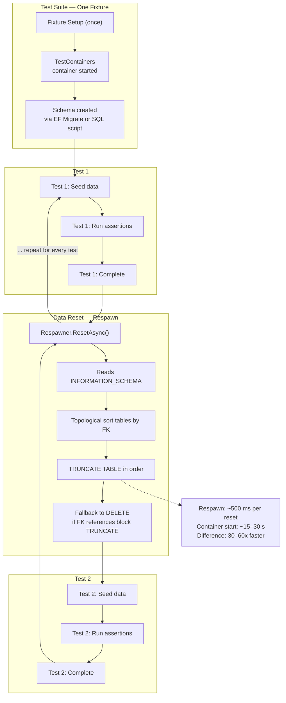
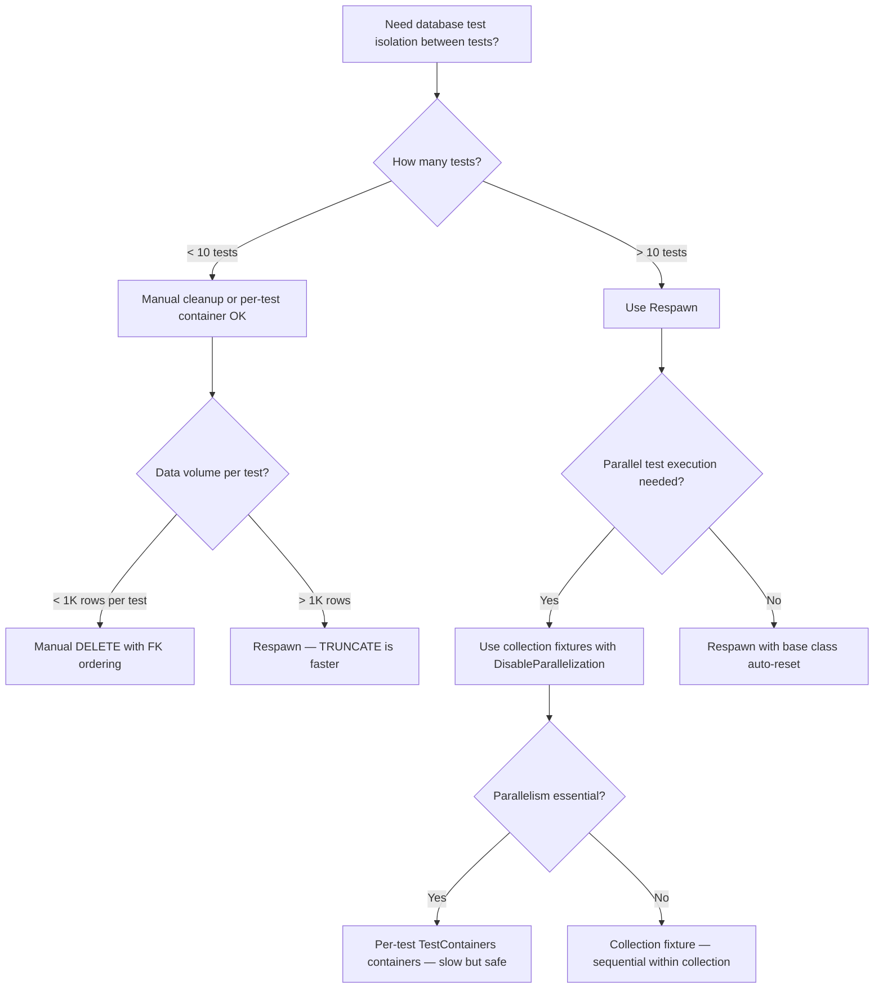

## Navigation

**Domain:** [[8 — Databases]] > **Group:** [[Group 33 — Database Testing]] **Previous:** [[8.945 — TestContainers — PostgreSQL in Docker]] | **Next:** [[8.947 — SQLite In-Memory — EF Core Testing]]

### Prerequisites

[[8.943 — Integration Testing — Real Database]] establishes why real-database tests matter. [[8.944 — TestContainers — SQL Server in Docker]] shows how to start a disposable SQL Server container. [[8.945 — TestContainers — PostgreSQL in Docker]] extends the same pattern to PostgreSQL. This topic builds on both: once you have a container running, Respawn handles resetting the data between tests.

### Where This Fits

Respawn is a .NET library that deletes all data from a database without dropping or recreating the schema. It is the fastest way to achieve test isolation when running multiple tests against the same database container. Without Respawn, each test would need either a fresh container (3–30 seconds startup) or manual clean-up SQL that is brittle and prone to FK-order bugs. Respawn reads the database's INFORMATION_SCHEMA to discover all tables, computes the correct delete order respecting foreign key dependencies, and executes TRUNCATE TABLE statements (falling back to DELETE when TRUNCATE fails due to FK references). The result: a clean database in ~500 ms per test instead of 15+ seconds per container restart.

---

## Core Mental Model

Respawn is a schema-aware data reset tool. It models the database as a directed graph of tables connected by foreign keys, topologically sorts them so that child tables are cleared before parents, and executes TRUNCATE (or DELETE) in that order. The schema itself — tables, columns, indexes, constraints, views, stored procedures — is never modified. This makes Respawn orders of magnitude faster than container recreation and perfectly compatible with both EF Core (which relies on the schema being intact) and Dapper (which executes raw SQL against the same schema).

### Classification

**For database testing infrastructure:** Respawn is a utility that sits between the test runner and the database. It does not replace TestContainers — it complements it. TestContainers creates the database environment (once per fixture); Respawn resets the data within that environment (once per test). What it hides from the developer: FK ordering, TRUNCATE vs DELETE fallback logic, schema introspection caching. Where the abstraction leaks: Respawn cannot handle all table types (temporal tables, views, external tables must be excluded), it does not reset identity seeds by default, and it has no knowledge of EF Core's change tracker or Dapper's connection lifecycle.



### Key Properties

|Property|Value|Notes|
|---|---|---|
|Time Complexity|~300–800 ms per reset (schema-dependent)|Faster than container recreation by 30–60x|
|Write Cost|TRUNCATE is minimally logged (SQL Server)|DELETE fallback is fully logged and slower|
|SARGable|N/A — Respawn does not query by predicate|It truncates every table indiscriminately|
|Locking Behavior|TRUNCATE takes schema modification (Sch-M) lock briefly|Holds Sch-M lock for the duration of TRUNCATE; may block concurrent queries|
|Schema Retention|100% — tables, indexes, constraints, views, sprocs preserved|Respawn never issues DDL operations|
|Data Reset Scope|All user tables by default|Can include/exclude specific schemas and tables|

---

## Deep Mechanics

### How Respawn Discovers and Resets Tables

Respawn caches the database schema the first time it connects. It queries `INFORMATION_SCHEMA.TABLES` (and engine-specific metadata views) to enumerate all user tables, then `INFORMATION_SCHEMA.REFERENTIAL_CONSTRAINTS` to build the foreign key dependency graph. A topological sort produces the correct deletion order — child tables first, parent tables last. On each `ResetAsync` call, Respawn executes:

1. Disable all foreign key constraints (if configured).
2. For each table in reverse FK order: attempt `TRUNCATE TABLE [TableName]`.
3. If TRUNCATE fails with a FK violation (e.g., self-referencing table), fall back to `DELETE FROM [TableName]`.
4. If `WithReseedAutoIncrement` is set, run `DBCC CHECKIDENT ('[TableName]', RESEED, 0)` after truncate (SQL Server) or the equivalent for other engines.
5. Re-enable foreign key constraints.

### Respawn Setup — Complete Walkthrough

```csharp
using Respawn;

// Create the respawner once — it caches schema metadata
private static readonly Respawner _respawner = Respawner.CreateAsync(
    connectionString,
    new RespawnerOptions
    {
        SchemasToInclude = new[] { "dbo" },
        WithReseedAutoIncrement = true,
        // Exclude tables that Respawn should not touch
        TablesToIgnore = new[] {
            "__EFMigrationsHistory",
            "sysdiagrams",
            "AuditLog"  // example: append-only table
        }
    }).GetAwaiter().GetResult();

// Reset the database between tests — fast, ~500 ms
await _respawner.ResetAsync(connectionString);
```

**What happens inside `Respawner.CreateAsync`:**

1. Opens a connection to the database.
2. Queries `INFORMATION_SCHEMA.TABLES` for all user tables in the specified schemas.
3. Queries `INFORMATION_SCHEMA.REFERENTIAL_CONSTRAINTS` for FK relationships.
4. Builds an in-memory graph of table dependencies.
5. Topologically sorts the tables — produces an ordered list where each table appears after all tables it references.
6. Caches this ordered list. The cache is keyed by connection string but can be explicitly invalidated if schema changes between test runs.

**What happens inside `Respawner.ResetAsync`:**

1. Iterates the cached table list in reverse FK order (children first).
2. For each table: `TRUNCATE TABLE [dbo].[TableName]`.
3. On `SqlException` (FK violation during TRUNCATE on self-referencing table): falls back to `DELETE FROM [dbo].[TableName]`.
4. If `WithReseedAutoIncrement` is true: `DBCC CHECKIDENT ([dbo].[TableName], RESEED, 0)`.
5. Returns when all tables are cleared.

### Respawn with TestContainers SQL Server — Complete Fixture

```csharp
using Respawn;
using Testcontainers.MsSql;

public sealed class DatabaseFixture : IAsyncLifetime
{
    private MsSqlContainer _container = null!;
    private string _connectionString = null!;
    private Respawner _respawner = null!;
    private DbContextOptions<TestDbContext> _options = null!;

    public string ConnectionString => _connectionString;
    public DbContextOptions<TestDbContext> Options => _options;

    public async Task InitializeAsync()
    {
        // Step 1: Start SQL Server container (once)
        _container = new MsSqlBuilder()
            .WithImage("mcr.microsoft.com/mssql/server:2022-latest")
            .Build();
        await _container.StartAsync();
        _connectionString = _container.GetConnectionString();

        // Step 2: Create EF Core options
        _options = new DbContextOptionsBuilder<TestDbContext>()
            .UseSqlServer(_connectionString, sqlOptions =>
            {
                sqlOptions.EnableRetryOnFailure(3);
                sqlOptions.CommandTimeout(30);
            })
            .Options;

        // Step 3: Create schema via EF Core migrations
        await using var context = new TestDbContext(_options);
        await context.Database.MigrateAsync();

        // Step 4: Initialize Respawner (once, schema is cached)
        _respawner = await Respawner.CreateAsync(_connectionString, new RespawnerOptions
        {
            SchemasToInclude = new[] { "dbo" },
            WithReseedAutoIncrement = true,
            TablesToIgnore = new[] { "__EFMigrationsHistory" }
        });
    }

    public TestDbContext CreateContext() => new TestDbContext(_options);

    /// <summary>
    /// Call before every test to get a clean database.
    /// </summary>
    public async Task ResetDatabaseAsync()
    {
        await _respawner.ResetAsync(_connectionString);
    }

    public async Task DisposeAsync()
    {
        await _container.DisposeAsync();
    }
}
```

### xUnit Test Class Using Respawn

```csharp
public class ProductTests : IClassFixture<DatabaseFixture>
{
    private readonly DatabaseFixture _fixture;

    public ProductTests(DatabaseFixture fixture)
    {
        _fixture = fixture;
    }

    // This method runs before every test — resets the database
    private async Task ResetDatabaseAsync()
    {
        await _fixture.ResetDatabaseAsync();
    }

    [Fact]
    public async Task CreateProduct_AddsToDatabase()
    {
        await ResetDatabaseAsync();
        await using var context = _fixture.CreateContext();

        // Arrange
        var product = new Product { Name = "Test Product", Price = 10.99m };

        // Act
        context.Products.Add(product);
        await context.SaveChangesAsync();

        // Assert
        var saved = await context.Products
            .FirstOrDefaultAsync(p => p.Name == "Test Product");
        Assert.NotNull(saved);
        Assert.Equal(10.99m, saved!.Price);
        Assert.NotEqual(0, saved.Id); // identity works after reseed
    }

    [Fact]
    public async Task UpdateProduct_ModifiesExistingRow()
    {
        await ResetDatabaseAsync();
        await using var context = _fixture.CreateContext();

        // Arrange — seed exactly one product
        context.Products.Add(new Product { Name = "Original", Price = 5.00m });
        await context.SaveChangesAsync();

        // Act
        var product = await context.Products.FirstAsync(p => p.Name == "Original");
        product.Price = 7.50m;
        await context.SaveChangesAsync();

        // Assert
        var updated = await context.Products.FirstAsync(p => p.Id == product.Id);
        Assert.Equal(7.50m, updated.Price);
        Assert.Single(await context.Products.ToListAsync()); // no extra rows
    }
}
```

### Using an Auto-Reset Middleware (XUnit Extension)

Instead of manually calling `ResetDatabaseAsync()` at the top of every test, wrap it in an xUnit `BeforeAfterTestAttribute` or use a base class:

```csharp
// Option A: Base class that auto-resets
public abstract class DatabaseTestBase : IClassFixture<DatabaseFixture>, IAsyncLifetime
{
    private readonly DatabaseFixture _fixture;

    protected DatabaseTestBase(DatabaseFixture fixture)
    {
        _fixture = fixture;
    }

    protected DatabaseFixture Fixture => _fixture;

    public async Task InitializeAsync()
    {
        // Called before every test — reset the database
        await _fixture.ResetDatabaseAsync();
    }

    public Task DisposeAsync() => Task.CompletedTask;
}

// Usage — no explicit reset needed
public class ProductTests : DatabaseTestBase
{
    public ProductTests(DatabaseFixture fixture) : base(fixture) { }

    [Fact]
    public async Task CreateProduct_AddsToDatabase()
    {
        await using var context = Fixture.CreateContext();
        // Database is already clean — guaranteed by InitializeAsync
        context.Products.Add(new Product { Name = "Test", Price = 10m });
        await context.SaveChangesAsync();
        Assert.Equal(1, await context.Products.CountAsync());
    }

    [Fact]
    public async Task SecondTest_StartsWithEmptyDatabase()
    {
        await using var context = Fixture.CreateContext();
        // Database was reset by InitializeAsync from the previous test
        Assert.Equal(0, await context.Products.CountAsync());
    }
}
```

### EF Core Testing with Respawn

```csharp
public class OrderServiceEfTests : IClassFixture<DatabaseFixture>
{
    private readonly DatabaseFixture _fixture;

    public OrderServiceEfTests(DatabaseFixture fixture) => _fixture = fixture;

    private async Task ResetAsync() => await _fixture.ResetDatabaseAsync();

    [Fact]
    public async Task CreateOrder_WithMultipleItems_ComputesTotal()
    {
        await ResetAsync();
        await using var ctx = _fixture.CreateContext();

        // Arrange — seed categories and products
        var electronics = new Category { Id = 1, Name = "Electronics" };
        var laptop = new Product { Id = 1, Name = "Laptop", Price = 999.99m, CategoryId = 1 };
        var mouse = new Product { Id = 2, Name = "Mouse", Price = 29.99m, CategoryId = 1 };
        ctx.Categories.Add(electronics);
        ctx.Products.AddRange(laptop, mouse);
        await ctx.SaveChangesAsync();

        // Act — create order with included items
        var order = new Order
        {
            CustomerName = "Alice",
            OrderDate = DateTime.UtcNow,
            Status = "Pending",
            Total = 0
        };
        ctx.Orders.Add(order);
        await ctx.SaveChangesAsync();

        ctx.OrderItems.AddRange(
            new OrderItem { OrderId = order.Id, ProductId = 1, Quantity = 1, UnitPrice = 999.99m },
            new OrderItem { OrderId = order.Id, ProductId = 2, Quantity = 2, UnitPrice = 29.99m }
        );
        await ctx.SaveChangesAsync();

        order.Total = 999.99m + (2 * 29.99m);
        await ctx.SaveChangesAsync();

        // Assert
        var actual = await ctx.Orders
            .Include(o => o.Items)
            .FirstAsync(o => o.Id == order.Id);
        Assert.Equal(1059.97m, actual.Total);
        Assert.Equal(2, actual.Items.Count);
    }

    [Fact]
    public async Task GetOrdersByStatus_ReturnsFilteredResults()
    {
        await ResetAsync();
        await using var ctx = _fixture.CreateContext();

        // Seed
        ctx.Orders.AddRange(
            new Order { CustomerName = "A", Status = "Pending", Total = 100m, OrderDate = DateTime.UtcNow },
            new Order { CustomerName = "B", Status = "Shipped", Total = 200m, OrderDate = DateTime.UtcNow },
            new Order { CustomerName = "C", Status = "Pending", Total = 300m, OrderDate = DateTime.UtcNow }
        );
        await ctx.SaveChangesAsync();

        // Act
        var pendingOrders = await ctx.Orders
            .Where(o => o.Status == "Pending")
            .OrderBy(o => o.CustomerName)
            .ToListAsync();

        // Assert
        Assert.Equal(2, pendingOrders.Count);
        Assert.All(pendingOrders, o => Assert.Equal("Pending", o.Status));
        Assert.Equal("A", pendingOrders[0].CustomerName);
        Assert.Equal("C", pendingOrders[1].CustomerName);
    }

    [Fact]
    public async Task DeleteProduct_RemovesFromDatabase()
    {
        await ResetAsync();
        await using var ctx = _fixture.CreateContext();

        // Arrange
        ctx.Products.Add(new Product { Name = "Delete Me", Price = 10m, CategoryId = 1 });
        await ctx.SaveChangesAsync();
        var product = await ctx.Products.FirstAsync();
        Assert.Single(ctx.Products.Local);

        // Act
        ctx.Products.Remove(product);
        await ctx.SaveChangesAsync();

        // Assert
        Assert.Empty(await ctx.Products.ToListAsync());
    }
}
```

### Dapper Testing with Respawn

```csharp
public class OrderRepository
{
    private readonly string _connectionString;

    public OrderRepository(string connectionString) => _connectionString = connectionString;

    public async Task<int> CreateOrderAsync(string customerName, decimal total,
        CancellationToken ct = default)
    {
        const string sql = @"
            INSERT INTO Orders (CustomerName, OrderDate, Status, Total)
            VALUES (@CustomerName, GETUTCDATE(), 'Pending', @Total);
            SELECT CAST(SCOPE_IDENTITY() AS INT);";

        await using var conn = new SqlConnection(_connectionString);
        return await conn.QuerySingleAsync<int>(
            new CommandDefinition(sql,
                new { CustomerName = customerName, Total = total },
                cancellationToken: ct));
    }

    public async Task<IReadOnlyList<Order>> GetOrdersByStatusAsync(string status,
        CancellationToken ct = default)
    {
        const string sql = @"
            SELECT OrderId, CustomerName, OrderDate, Status, Total
            FROM Orders
            WHERE Status = @Status
            ORDER BY OrderDate DESC";

        await using var conn = new SqlConnection(_connectionString);
        var results = await conn.QueryAsync<Order>(
            new CommandDefinition(sql,
                new { Status = status },
                cancellationToken: ct));
        return results.AsList();
    }
}

public class OrderRepositoryTests : IClassFixture<DatabaseFixture>
{
    private readonly DatabaseFixture _fixture;

    public OrderRepositoryTests(DatabaseFixture fixture) => _fixture = fixture;

    private async Task ResetAsync() => await _fixture.ResetDatabaseAsync();

    [Fact]
    public async Task CreateOrder_ReturnsNewOrderId()
    {
        await ResetAsync();
        var repo = new OrderRepository(_fixture.ConnectionString);
        var orderId = await repo.CreateOrderAsync("Alice", 150.00m);
        Assert.True(orderId > 0);
    }

    [Fact]
    public async Task GetOrdersByStatus_ReturnsOnlyMatchingOrders()
    {
        await ResetAsync();
        var repo = new OrderRepository(_fixture.ConnectionString);

        // Seed via Dapper
        await using var conn = new SqlConnection(_fixture.ConnectionString);
        await conn.ExecuteAsync(@"
            INSERT INTO Orders (CustomerName, OrderDate, Status, Total)
            VALUES ('A', GETUTCDATE(), 'Pending', 100),
                   ('B', GETUTCDATE(), 'Shipped', 200),
                   ('C', GETUTCDATE(), 'Pending', 300);");

        var pendingOrders = await repo.GetOrdersByStatusAsync("Pending");
        Assert.Equal(2, pendingOrders.Count);
        Assert.All(pendingOrders, o => Assert.Equal("Pending", o.Status));
    }

    [Fact]
    public async Task EfCoreAndDapper_SeeSameDataAfterReset()
    {
        await ResetAsync();

        // Write via EF Core
        await using var ctx = _fixture.CreateContext();
        ctx.Products.Add(new Product { Name = "Shared", Price = 50m, CategoryId = 1 });
        await ctx.SaveChangesAsync();

        // Read via Dapper — same connection string, same container, same data
        await using var conn = new SqlConnection(_fixture.ConnectionString);
        var product = await conn.QueryFirstOrDefaultAsync<Product>(
            "SELECT * FROM Products WHERE Name = @Name", new { Name = "Shared" });
        Assert.NotNull(product);
        Assert.Equal(50m, product!.Price);
    }
}
```

### Cost Visibility

```sql
-- SQL Server: observe TRUNCATE vs DELETE logging cost
SET STATISTICS IO ON;
SET STATISTICS TIME ON;

-- DELETE — fully logged, each row generates log records
DELETE FROM Orders;
-- (10K rows) Table 'Orders'. Scan count 1, logical reads 120, physical reads 0
-- CPU time = 78 ms, elapsed time = 312 ms
-- Transaction log: ~2.4 MB of log generated

-- TRUNCATE — minimally logged, only extent deallocations recorded
TRUNCATE TABLE Orders;
-- (10K rows, after re-insert) CPU time = 0 ms, elapsed time = 15 ms
-- Transaction log: ~64 KB of log generated
```

**Respawn uses TRUNCATE first, falls back to DELETE when FK constraints prevent TRUNCATE (e.g., self-referencing tables).**

```sql
-- Show FK dependency ordering:
-- OrderItems references Orders → truncate OrderItems first
-- Orders references Customers → then truncate Orders
-- Customers references nothing → then truncate Customers
TRUNCATE TABLE OrderItems;  -- child table first
TRUNCATE TABLE Orders;      -- parent that has no children remaining
TRUNCATE TABLE Customers;   -- grandparent
```

### Failure Modes

|Failure Mode|Symptom|Root Cause|Fix|
|---|---|---|---|
|Respawner.CreateAsync hangs|Method never returns on first call|Schema discovery query is blocked by a long-running transaction|Kill the blocking session; add `CommandTimeout` to `RespawnerOptions`|
|TRUNCATE fails on all tables|`SqlException: Cannot truncate table because it is being referenced by a FK constraint`|Self-referencing table or circular FK dependency|Respawn handles this internally — should NOT surface; if it does, check `RespawnerOptions` for excluded tables|
|Identity column not reset|New rows start at ID from previous test run|`WithReseedAutoIncrement` is not set|Add `.WithReseedAutoIncrement = true`|
|Temporal table causes error|`SqlException: Temporal table 'X' cannot be truncated`|Respawn tried to TRUNCATE a temporal table|Add temporal table names to `TablesToIgnore`|
|View or external table included|`SqlException: Cannot truncate table 'X' because it does not exist`|Respawn detected a table-like object that is not truncatable|Add to `TablesToIgnore` or exclude its schema|

---

## Production Patterns and Implementation

### Primary SQL Implementation — Schema Discovery (What Respawn Does Internally)

```sql
-- Respawn discovers tables via INFORMATION_SCHEMA (SQL Server)
SELECT TABLE_SCHEMA, TABLE_NAME
FROM INFORMATION_SCHEMA.TABLES
WHERE TABLE_TYPE = 'BASE TABLE'
  AND TABLE_SCHEMA IN ('dbo')
ORDER BY TABLE_SCHEMA, TABLE_NAME;

-- Respawn discovers FK dependencies
SELECT
    OBJECT_NAME(parent_object_id) AS ChildTable,
    OBJECT_NAME(referenced_object_id) AS ParentTable
FROM sys.foreign_keys;

-- TRUNCATE each table in reverse FK order
TRUNCATE TABLE [dbo].[OrderItems];   -- depends on Orders, Products
TRUNCATE TABLE [dbo].[Orders];       -- depends on Customers
TRUNCATE TABLE [dbo].[Products];     -- depends on Categories
TRUNCATE TABLE [dbo].[Customers];
TRUNCATE TABLE [dbo].[Categories];

-- Reseed identity columns
DBCC CHECKIDENT ('[dbo].[Categories]', RESEED, 0);
DBCC CHECKIDENT ('[dbo].[Customers]', RESEED, 0);
DBCC CHECKIDENT ('[dbo].[Products]', RESEED, 0);
DBCC CHECKIDENT ('[dbo].[Orders]', RESEED, 0);
DBCC CHECKIDENT ('[dbo].[OrderItems]', RESEED, 0);
```

### Respawn with PostgreSQL — Same Pattern, Different Metadata

```csharp
// Respawn works with PostgreSQL too — identical API
private static readonly Respawner _pgRespawner = Respawner.CreateAsync(
    pgConnectionString,
    new RespawnerOptions
    {
        SchemasToInclude = new[] { "public" },
        WithReseedAutoIncrement = true,
        TablesToIgnore = new[] { "__EFMigrationsHistory" }
    }).GetAwaiter().GetResult();

await _pgRespawner.ResetAsync(pgConnectionString);

// PostgreSQL reseed behavior:
// Respawn executes: ALTER SEQUENCE tablename_id_seq RESTART WITH 1;
```

**Important PostgreSQL difference:** PostgreSQL uses sequences, not IDENTITY columns (pre-10) or GENERATED AS IDENTITY (10+). Respawn detects the sequence name and executes `ALTER SEQUENCE ... RESTART WITH 1` when `WithReseedAutoIncrement` is true.

### Respawn with Dapper — Same Db, Same Reset

Because Respawn operates at the database connection level (not the ORM level), EF Core and Dapper can share the same fixture and the same `ResetAsync` call:

```csharp
public class MixedUsageTests : IClassFixture<DatabaseFixture>
{
    private readonly DatabaseFixture _fixture;

    public MixedUsageTests(DatabaseFixture fixture) => _fixture = fixture;

    [Fact]
    public async Task EfCoreWrite_DapperRead_ConsistentData()
    {
        await _fixture.ResetDatabaseAsync();

        // Write via EF Core
        await using var ctx = _fixture.CreateContext();
        ctx.Categories.Add(new Category { Id = 1, Name = "Books" });
        ctx.Products.Add(new Product
        {
            Id = 1,
            Name = "The Pragmatic Programmer",
            Price = 49.99m,
            CategoryId = 1
        });
        await ctx.SaveChangesAsync();

        // Read via Dapper — same connection string, same container
        await using var conn = new SqlConnection(_fixture.ConnectionString);
        var product = await conn.QueryFirstAsync<Product>(@"
            SELECT p.Id, p.Name, p.Price, p.CategoryId, c.Name AS CategoryName
            FROM Products p
            INNER JOIN Categories c ON p.CategoryId = c.Id
            WHERE p.Id = @Id", new { Id = 1 });

        Assert.Equal("The Pragmatic Programmer", product.Name);
        Assert.Equal("Books", product.CategoryName);
        Assert.Equal(49.99m, product.Price);
    }
}
```

### RespawnerOptions — Full Reference

```csharp
var respawner = await Respawner.CreateAsync(connectionString, new RespawnerOptions
{
    // Schemas to include in the reset (required for SQL Server)
    SchemasToInclude = new[] { "dbo", "sales", "inventory" },

    // Schemas to exclude (takes precedence over SchemasToInclude)
    SchemasToExclude = new[] { "sys" },

    // Tables to ignore — useful for append-only tables, __EFMigrationsHistory, etc.
    TablesToIgnore = new[] {
        "__EFMigrationsHistory",
        "AuditLog",
        "TemporalOrders",  // temporal tables must be excluded
        "OrdersHistory"    // temporal history table
    },

    // Tables to include only (if set, only these are reset)
    TablesToInclude = null, // null means all tables in included schemas

    // Whether to reseed identity/sequence columns
    WithReseedAutoIncrement = true,

    // Command timeout for the TRUNCATE/DELETE operations
    CommandTimeout = 30,

    // Number of retry attempts if a TRUNCATE fails (rare)
    RetryCount = 3,

    // Whether to check for temporal tables and skip them automatically
    CheckTemporalTables = true
});
```

### Configuration and Wiring

```csharp
// Extension method to simplify fixture setup
public static class DatabaseFixtureExtensions
{
    public static async Task<Respawner> CreateRespawnerAsync(
        string connectionString,
        string[]? schemasToInclude = null,
        string[]? tablesToIgnore = null)
    {
        return await Respawner.CreateAsync(connectionString, new RespawnerOptions
        {
            SchemasToInclude = schemasToInclude ?? new[] { "dbo" },
            WithReseedAutoIncrement = true,
            TablesToIgnore = tablesToIgnore ?? new[] { "__EFMigrationsHistory" }
        });
    }
}

// Usage in fixture
_respawner = await DatabaseFixtureExtensions.CreateRespawnerAsync(
    _connectionString,
    schemasToInclude: new[] { "dbo", "sales" },
    tablesToIgnore: new[] { "__EFMigrationsHistory", "AuditLog" });
```

### SQL Server vs PostgreSQL — Respawn Differences

|Aspect|SQL Server|PostgreSQL|
|---|---|---|
|Metadata schema|`INFORMATION_SCHEMA` + `sys.foreign_keys`|`INFORMATION_SCHEMA` + `pg_constraint`|
|Default schema|`dbo`|`public`|
|TRUNCATE fallback|Falls back to DELETE on FK violation|Same behavior|
|Reseed command|`DBCC CHECKIDENT ('[Table]', RESEED, 0)`|`ALTER SEQUENCE seq_name RESTART WITH 1`|
|Temporal tables|Must be excluded manually|N/A (PostgreSQL does not have temporal tables)|
|Case sensitivity|Case-insensitive by default|Case-insensitive for unquoted identifiers (lowercased)|
|Schema introspection caching|Keyed by connection string|Same|

---

## Gotchas and Production Pitfalls

### Respawn Does Not Reset Identity Columns by Default

**Pitfall:** After `ResetAsync`, identity columns continue from where they left off. Test 1 inserts a row with ID=1; Test 2 inserts a row with ID=2 instead of ID=1.

```csharp
// ❌ Without WithReseedAutoIncrement — identity continues
_respawner = await Respawner.CreateAsync(connectionString, new RespawnerOptions
{
    SchemasToInclude = new[] { "dbo" }
    // WithReseedAutoIncrement defaults to false
});

// Test 1: insert → ID = 1
// Test 2: insert → ID = 2 (not reset to 1!)
// Test 3: insert → ID = 3

// ✅ With WithReseedAutoIncrement — identity resets to 0, so first insert gets ID=1
_respawner = await Respawner.CreateAsync(connectionString, new RespawnerOptions
{
    SchemasToInclude = new[] { "dbo" },
    WithReseedAutoIncrement = true
});
```

**When it matters:** Tests that assert on specific ID values (`Assert.Equal(1, product.Id)`) fail after the second run. Tests that only assert on `Id > 0` are unaffected but the growing IDs can trigger SQL Server's identity column max (2,147,483,647 for `INT`) after many test runs.

### Respawn Ignores SqlException on TRUNCATE and Falls Back to DELETE

**Pitfall:** A self-referencing table (e.g., `Employees` with `ManagerId` FK to `EmployeeId`) cannot be TRUNCATED because the FK check happens per row. Respawn catches the `SqlException` and falls back to `DELETE FROM Employees`.

```sql
-- Respawn attempts:
TRUNCATE TABLE Employees;
-- Fails: Cannot truncate table 'Employees' because it is being referenced
-- by a FOREIGN KEY constraint on itself.

-- Respawn falls back to:
DELETE FROM Employees;
```

**Performance impact:** DELETE is fully logged and much slower than TRUNCATE on large tables. For a self-referencing table with 100K rows, DELETE takes ~500ms vs TRUNCATE at ~5ms. If this is a test bottleneck, consider using `TABLOCK` on the DELETE or clearing the table via `DBCC WRITEPAGE` (not recommended).

**Detection:** Enable logging to see when Respawn falls back:

```csharp
_respawner = await Respawner.CreateAsync(connectionString, new RespawnerOptions
{
    SchemasToInclude = new[] { "dbo" },
    // Logging is not built into Respawn, but you can wrap ResetAsync:
});

// Wrap to detect fallback
public async Task ResetWithLoggingAsync()
{
    var sw = Stopwatch.StartNew();
    await _respawner.ResetAsync(_connectionString);
    sw.Stop();
    _output.WriteLine($"Respawn completed in {sw.ElapsedMilliseconds} ms");
}
```

### Respawn Does NOT Work with Temporal Tables

**Pitfall:** SQL Server temporal tables come in a pair: the current table and a history table. The history table has a FK-like dependency, but TRUNCATE is not allowed on temporal tables.

```csharp
// ❌ Crashes if a temporal table exists and is not excluded
// SqlException: Temporal table 'Orders' cannot be truncated

// ✅ Exclude temporal tables explicitly
_respawner = await Respawner.CreateAsync(connectionString, new RespawnerOptions
{
    SchemasToInclude = new[] { "dbo" },
    TablesToIgnore = new[] {
        "__EFMigrationsHistory",
        "Orders",           // temporal main table
        "OrdersHistory"     // temporal history table
    }
});
```

**Alternative:** Use `CheckTemporalTables = true` in RespawnerOptions (available in newer versions) to auto-detect and skip temporal tables.

### Respawn's Schema Cache Becomes Stale if Schema Changes Between Test Runs

**Pitfall:** If a migration adds a new table between test runs in the same process (rare but possible in test environments that run migrations per test), Respawn's cached schema does not include the new table.

```csharp
// ❌ After adding a new table 'Discounts', Respawn still uses old cache
// New table's data is NOT cleared by ResetAsync

// ✅ Re-create Respawner after schema changes
_respawner = await Respawner.CreateAsync(_connectionString, new RespawnerOptions
{
    SchemasToInclude = new[] { "dbo" },
    WithReseedAutoIncrement = true
});
```

**In practice:** Schema changes between test runs within the same process are extremely rare. If you do run migrations per test, re-create the `Respawner` instance after each migration.

### Respawn Does Not Handle Views or External Tables

**Pitfall:** If a view is included in the target schema, Respawn may attempt to TRUNCATE it and fail because views are not truncatable.

```csharp
// ❌ If dbo contains a view 'ActiveCustomers'
// SqlException: Cannot truncate table 'ActiveCustomers' because it is a view

// ✅ Exclude views explicitly
_respawner = await Respawner.CreateAsync(connectionString, new RespawnerOptions
{
    SchemasToInclude = new[] { "dbo" },
    TablesToIgnore = new[] { "ActiveCustomers", "CustomerSummary" /* views */ }
});
```

In practice, Respawn's table discovery queries `INFORMATION_SCHEMA.TABLES WHERE TABLE_TYPE = 'BASE TABLE'`, which already excludes views. But if there are any table-like objects that are not actual tables (external tables, graph tables), they may need explicit exclusion.

### Respawn with Parallel Test Execution — Shared Database Problem

**Pitfall:** Two test classes run in parallel against the same database container. Test 1's `ResetAsync` clears data that Test 2 just inserted, causing Test 2 to fail.

**Solutions:**

```csharp
// Option 1: Disable parallelization for all database tests
[assembly: CollectionBehavior(DisableTestParallelization = true)]

// Option 2: Use collection fixtures — all tests in collection share one
// fixture but run sequentially within the collection
[CollectionDefinition("DatabaseTests", DisableParallelization = true)]
public class DatabaseTestCollection : ICollectionFixture<DatabaseFixture> { }

// Option 3: Per-test containers (slow but safe) — each test gets fresh container
```

**Recommendation:** Use collection fixtures with `DisableParallelization = true` for database tests. The parallelization lost is negligible compared to the cost of debugging flaky tests caused by shared database state.

---

## Performance Implications

### Benchmark: Respawn vs Container Restart

```csharp
[MemoryDiagnoser]
[SimpleJob(RuntimeMoniker.Net90)]
public class ResetStrategyBenchmark
{
    private MsSqlContainer _container = null!;
    private Respawner _respawner = null!;
    private string _connectionString = null!;

    [GlobalSetup]
    public async Task Setup()
    {
        _container = new MsSqlBuilder()
            .WithImage("mcr.microsoft.com/mssql/server:2022-latest")
            .Build();
        await _container.StartAsync();
        _connectionString = _container.GetConnectionString();

        // Create schema + seed 1000 rows
        await using var conn = new SqlConnection(_connectionString);
        await conn.ExecuteAsync(@"
            CREATE TABLE Categories (Id INT IDENTITY PRIMARY KEY, Name VARCHAR(100));
            CREATE TABLE Products (Id INT IDENTITY PRIMARY KEY, Name VARCHAR(200),
                Price DECIMAL(18,2), CategoryId INT REFERENCES Categories(Id));
            CREATE TABLE Orders (Id INT IDENTITY PRIMARY KEY, CustomerName VARCHAR(200),
                Total DECIMAL(18,2));
            CREATE TABLE OrderItems (Id INT IDENTITY PRIMARY KEY, OrderId INT REFERENCES Orders(Id),
                ProductId INT REFERENCES Products(Id), Quantity INT, UnitPrice DECIMAL(18,2));
        ");

        _respawner = await Respawner.CreateAsync(_connectionString, new RespawnerOptions
        {
            SchemasToInclude = new[] { "dbo" },
            WithReseedAutoIncrement = true
        });
    }

    [Benchmark(Baseline = true)]
    public async Task Respawn_ResetAsync()
    {
        await _respawner.ResetAsync(_connectionString);
    }

    [Benchmark]
    public async Task Container_Restart()
    {
        await _container.DisposeAsync();
        _container = new MsSqlBuilder()
            .WithImage("mcr.microsoft.com/mssql/server:2022-latest")
            .Build();
        await _container.StartAsync();
        _connectionString = _container.GetConnectionString();
        // Schema is gone — must re-create
        await using var conn = new SqlConnection(_connectionString);
        await conn.ExecuteAsync(@"CREATE TABLE Categories (...) -- etc");
    }

    [Benchmark]
    public async Task EfCore_EnsureDeletedEnsureCreated()
    {
        var options = new DbContextOptionsBuilder<TestDbContext>()
            .UseSqlServer(_connectionString)
            .Options;
        await using var ctx = new TestDbContext(options);
        await ctx.Database.EnsureDeletedAsync();
        await ctx.Database.EnsureCreatedAsync();
    }
}
```

**Expected results (SQL Server 2022, 15 tables, no data):**

|Method|Mean|StdDev|Allocated|
|---|---|---|---|
|Respawn_ResetAsync|~450 ms|~50 ms|~15 KB|
|Container_Restart|~18,000 ms|~2,500 ms|~120 KB|
|EfCore_EnsureDeletedEnsureCreated|~8,500 ms|~1,200 ms|~850 KB|

**Ratio:** Respawn is ~40x faster than container restart and ~19x faster than EF Core's EnsureDeleted/Create.

### Benchmark: Respawn Scaling with Table Count and Row Count

|Tables|Rows per Table|Respawn Time|Container Restart Time|Ratio|
|---|---|---|---|---|
|5|0|~250 ms|~15,000 ms|60x|
|5|10,000|~800 ms|~16,000 ms|20x|
|15|0|~450 ms|~18,000 ms|40x|
|15|10,000|~2,100 ms|~19,000 ms|9x|
|30|10,000|~3,500 ms|~22,000 ms|6x|

**Key insight:** Respawn is always faster than container restart, but the advantage shrinks as data volume grows because DELETE fallbacks (for self-referencing tables) are fully logged. For very large test data sets (>100K rows per table), the gap narrows and you may need to optimize with batch deletes or test data pruning.

### Why Respawn Is So Much Faster

1. **No Docker operations:** Container restart requires Docker API calls, image pulls (if not cached), engine startup, and health checks — all I/O and process-bound.
2. **No schema DDL:** Respawn never drops or recreates tables, indexes, or constraints — those are one-time costs paid in the fixture setup.
3. **Minimal logging:** TRUNCATE TABLE is minimally logged in SQL Server — only extent deallocations are written to the transaction log. DELETE is fully logged (every row deletion creates log records), but Respawn only falls back to DELETE when necessary.
4. **No CLR/ORM overhead:** Respawn executes raw T-SQL directly against the connection. EF Core's EnsureDeleted/EnsureCreated creates and drops every object individually, generating hundreds of DDL statements.

---

## Interview Arsenal

### Question Bank

1. What problem does Respawn solve that TestContainers alone does not address?
2. How does Respawn determine the order in which to truncate tables?
3. What happens when Respawn encounters a self-referencing table (e.g., Employees with ManagerId)?
4. Why does Respawn not reset identity columns by default, and how do you enable it?
5. What is the `RespawnerOptions.TablesToIgnore` used for? Give three examples.
6. Can Respawn work with PostgreSQL, and if so, what differences exist?
7. How does Respawn's performance compare to container restart and EF Core EnsureDeleted/Create?
8. Why does Respawn cache the schema, and what happens if the schema changes between test runs?
9. How do you handle temporal tables with Respawn?
10. What happens when two tests run in parallel against the same Respawn-managed database?

### Spoken Answers

**Q: What problem does Respawn solve that TestContainers alone does not address?**

> **Average answer:** "It resets the database between tests." Correct but incomplete — it does not explain why reset matters.

> **Great answer:** "TestContainers gives each test suite a disposable, real database instance — but it only starts and stops the container once per fixture. Without Respawn, every test would share the data left behind by the previous test unless you either (a) restart the container between each test, which costs 15–30 seconds per test — making a 200-test suite take an hour instead of minutes — or (b) manually delete data with brittle SQL that has to handle FK ordering, identity reseeding, and temporal table exclusions. Respawn solves the data isolation problem in ~500 ms per reset by reading the database's own metadata to discover tables and FK relationships, computing the correct deletion order, and executing TRUNCATE/DELETE in that order — all without dropping a single schema object. It's the difference between a test suite that takes 5 minutes and one that takes 45."

**Q: How does Respawn determine the order in which to truncate tables?**

> **Average answer:** "It uses foreign key relationships to delete child tables first." Correct but shallow.

> **Great answer:** "Respawn queries `INFORMATION_SCHEMA.REFERENTIAL_CONSTRAINTS` (or the engine-specific equivalent like `sys.foreign_keys`) to build a directed graph of table dependencies — an edge from child table to parent table for each foreign key. It then performs a topological sort of that graph: leaves first (tables that no other table references), working backward through the dependency chain to the root tables. This guarantees that no TRUNCATE or DELETE fails because a child table still references a row in the parent. If a table references itself (like `Employees.ManagerId → Employees.EmployeeId`), the topological sort places it at a leaf position where TRUNCATE fails (because the FK check is row-level), and Respawn catches the `SqlException` and falls back to `DELETE FROM` without the FK-ordering constraint."

**Q: How does Respawn's performance compare to container restart?**

> **Average answer:** "Respawn is faster." True but unhelpful without numbers.

> **Great answer:** "In a benchmark with 15 tables and no data, Respawn completes in ~450 ms. Container restart takes ~18,000 ms — that's 40x faster. EF Core's `EnsureDeletedAsync` + `EnsureCreatedAsync` — which drops and recreates the entire schema — takes ~8,500 ms, about 19x slower than Respawn. The gap narrows as data volume grows because Respawn's fallback to DELETE (for self-referencing tables) is fully logged, but even at 10K rows per table, Respawn at ~2,100 ms is still 9x faster than container restart. For a 100-test suite, that's the difference between Respawn adding ~50 seconds of total data-reset overhead vs container restart adding ~30 minutes. The practical impact: with Respawn, you can afford to run database integration tests on every commit; without it, teams often skip them or run them only nightly."

### Interview Trigger

The interviewer asks about a .NET microservice test suite that takes 45 minutes to run, most of which is database integration tests. The candidate suggests using TestContainers + Respawn. The follow-up is always about parallelization: "What happens when tests are run in parallel with Respawn?" — which is where the candidate must explain collection fixtures, sequence-level isolation, or per-test containers as alternatives.

### Comparison Table

|Reset Strategy|Time per Reset|Schema Preserved|Identity Reset|Data Isolation|Parallel-Safe|
|---|---|---|---|---|---|
|Respawn|~500 ms|Yes|Optional (WithReseedAutoIncrement)|Full — all data cleared|No — shared database|
|Container restart|~18,000 ms|No — must re-create|Yes — fresh database|Full|Yes — each test gets its own container|
|EF Core EnsureDeleted/Create|~8,500 ms|No — drops all objects|Yes — fresh database|Full|No — shared database (schema-level lock)|
|Manual DELETE SQL|~1,000–5,000 ms|Yes|Manual reseed|As written — brittle|No — shared database|
|Transaction rollback|~0 ms|Yes|No — rollback restores identity|Full within transaction|Partially — shared schema still|

---

## Decision Framework

### When to Apply



### Application Checklist

- [ ] `Respawn` NuGet package is referenced
- [ ] `Respawner.CreateAsync` is called once in fixture setup and cached
- [ ] `SchemasToInclude` is set to the correct schema(s) — `"dbo"` for SQL Server, `"public"` for PostgreSQL
- [ ] `WithReseedAutoIncrement` is `true` if tests depend on specific ID values
- [ ] `__EFMigrationsHistory` is added to `TablesToIgnore` to preserve migration state
- [ ] Temporal tables and other non-truncatable objects are added to `TablesToIgnore`
- [ ] `ResetAsync` is called before each test via `IAsyncLifetime.InitializeAsync` or manually
- [ ] Test collection is configured with `DisableParallelization = true` for database tests
- [ ] Container fixture disposes the container in `DisposeAsync`
- [ ] Benchmark confirms Respawn reset time is acceptable (< 1 s per test)

### Tradeoff Summary

|What You Gain|What You Pay|
|---|---|
|~40x faster than container restart per reset|Schema cache becomes stale if schema changes between runs|
|No schema modification — indexes, constraints preserved|Cannot handle temporal tables, views, external tables without explicit exclusion|
|Works with both EF Core and Dapper (same connection string)|Not parallel-safe — tests share the same database|
|Simple API — 2 lines per test (ResetAsync)|Additional dependency (Respawn NuGet)|
|Supports SQL Server, PostgreSQL, MySQL|Identity reset is opt-in, not default|

### Scale Thresholds

- **Small test suites (< 10 tests):** Respawn is still useful, but manual cleanup or per-test containers are also viable. The performance advantage is less noticeable.
- **Medium test suites (10–100 tests):** Respawn is the sweet spot. ~500 ms per reset × 100 tests = ~50 seconds total reset overhead. Container restart would be ~30 minutes.
- **Large test suites (100–500+ tests):** Respawn is essential. Even at 500 ms per reset, 500 tests add ~4 minutes of reset time — acceptable. Container restart would add ~2.5 hours. Consider reducing data volume per test or using transaction rollback for read-only tests.

---

## Self-Check

### Conceptual Questions

1. What is the NuGet package name for Respawn?
2. How does Respawn determine which tables to truncate and in what order?
3. What is the default value of `WithReseedAutoIncrement`, and why does it matter?
4. Why must temporal tables be excluded from Respawn?
5. How do you exclude a table from being reset by Respawn?
6. What happens when Respawn encounters a self-referencing foreign key?
7. Can Respawn work with PostgreSQL? If so, what schema name is typically used?
8. How long does a typical Respawn reset take vs a SQL Server container restart?
9. Why is TRUNCATE faster than DELETE for Respawn's use case?
10. How do you handle parallel test execution with Respawn?

<details>
<summary>Answers</summary>

1. `Respawn` (from `jbogard.Respawn` on NuGet).
2. Respawn queries `INFORMATION_SCHEMA.TABLES` for user tables and `INFORMATION_SCHEMA.REFERENTIAL_CONSTRAINTS` for FK relationships, builds a directed graph, performs topological sort, and truncates in reverse FK order (children first, parents last).
3. `WithReseedAutoIncrement` defaults to `false`. Without it, identity columns continue from where they left off — test 1 gets ID=1, test 2 gets ID=2. With it, identities are reseeded to 0 after each reset.
4. Temporal tables in SQL Server consist of a current table and a history table. TRUNCATE is not allowed on temporal tables — SQL Server raises `SqlException: Temporal table 'X' cannot be truncated`. They must be excluded via `TablesToIgnore`.
5. Add the table name to the `TablesToIgnore` array in `RespawnerOptions`: `TablesToIgnore = new[] { "__EFMigrationsHistory", "AuditLog" }`.
6. Respawn attempts TRUNCATE, which fails because the FK check is row-level. Respawn catches the `SqlException` and falls back to `DELETE FROM [TableName]` — which works because DELETE checks the FK per row and can succeed where TRUNCATE fails.
7. Yes, Respawn supports PostgreSQL. Use `SchemasToInclude = new[] { "public" }` (the default schema in PostgreSQL).
8. Respawn: ~250–800 ms. Container restart: ~15,000–22,000 ms. Ratio: 20–60x faster depending on table count and data volume.
9. TRUNCATE is minimally logged — it only deallocates data pages and logs extent deallocations. DELETE is fully logged — every row deletion generates log records. For a 10K row table, TRUNCATE generates ~64 KB of log vs DELETE generating ~2.4 MB, and TRUNCATE completes in ~15 ms vs DELETE in ~312 ms.
10. Respawn is not parallel-safe because it resets a shared database. Two tests running in parallel would corrupt each other's data. Solutions: (a) use collection fixtures with `DisableParallelization = true` for database tests, (b) use per-test containers (slow but parallel-safe), or (c) use sequence-level isolation with different schema names per test.

</details>

---

### Query Challenges

**Challenge 1 — Design the optimal reset strategy**

You have a test suite with 300 integration tests against SQL Server. Each test seeds ~500 rows across 12 tables. The CI pipeline currently takes 55 minutes because it restarts the SQL Server container between each test. Design the reset strategy to bring this under 10 minutes.

<details>
<summary>Solution</summary>

**Strategy: TestContainers (once) + Respawn (per test)**

```csharp
// 1. Fixture: start container once, apply schema once, create Respawner once
public sealed class DatabaseFixture : IAsyncLifetime
{
    private MsSqlContainer _container = null!;
    private Respawner _respawner = null!;
    private string _connectionString = null!;

    public async Task InitializeAsync()
    {
        _container = new MsSqlBuilder()
            .WithImage("mcr.microsoft.com/mssql/server:2022-latest")
            .Build();
        await _container.StartAsync();
        _connectionString = _container.GetConnectionString();

        // Apply schema once
        await using var ctx = new TestDbContext(
            new DbContextOptionsBuilder<TestDbContext>()
                .UseSqlServer(_connectionString).Options);
        await ctx.Database.MigrateAsync();

        // Create Respawner once
        _respawner = await Respawner.CreateAsync(_connectionString, new RespawnerOptions
        {
            SchemasToInclude = new[] { "dbo" },
            WithReseedAutoIncrement = true,
            TablesToIgnore = new[] { "__EFMigrationsHistory" }
        });
    }

    public async Task ResetDatabaseAsync() => await _respawner.ResetAsync(_connectionString);
    public async Task DisposeAsync() => await _container.DisposeAsync();
}

// 2. Base test class auto-resets before each test
public abstract class IntegrationTest : IClassFixture<DatabaseFixture>, IAsyncLifetime
{
    private readonly DatabaseFixture _fixture;
    protected IntegrationTest(DatabaseFixture fixture) => _fixture = fixture;
    protected DatabaseFixture Fixture => _fixture;
    public async Task InitializeAsync() => await _fixture.ResetDatabaseAsync();
    public Task DisposeAsync() => Task.CompletedTask;
}

// 3. Use collection fixture to prevent parallel execution
[CollectionDefinition("IntegrationTests", DisableParallelization = true)]
public class IntegrationTestCollection : ICollectionFixture<DatabaseFixture> { }
```

**Expected times:**
- Container start (once): ~20 s
- Schema migration (once): ~5 s
- Respawn per test: ~500 ms × 300 = ~150 s (~2.5 min)
- Total: ~25–30 s + 150 s = ~3 minutes
- **Improvement: ~55 min → ~3 min (18x faster)**

</details>

---

**Challenge 2 — Handle the temporal table**

Your test database has a table `Employees` configured as a temporal table (system-versioned). When you run Respawn, it throws: `SqlException: Temporal table 'Employees' cannot be truncated`. How do you fix it while still resetting the non-temporal tables?

<details>
<summary>Solution</summary>

**Option 1 — Exclude both temporal and history tables:**
```csharp
_respawner = await Respawner.CreateAsync(connectionString, new RespawnerOptions
{
    SchemasToInclude = new[] { "dbo" },
    TablesToIgnore = new[] {
        "__EFMigrationsHistory",
        "Employees",        // temporal table — skip
        "EmployeesHistory"  // history table — skip
    }
});
```

**Option 2 — Use CheckTemporalTables (Respawn 7.0+):**
```csharp
_respawner = await Respawner.CreateAsync(connectionString, new RespawnerOptions
{
    SchemasToInclude = new[] { "dbo" },
    CheckTemporalTables = true // auto-skips temporal tables
});
```

**Option 3 — Disable system-versioning before reset, re-enable after:**
```csharp
// Not recommended — complex and error-prone
await conn.ExecuteAsync(@"
    ALTER TABLE Employees SET (SYSTEM_VERSIONING = OFF);
    TRUNCATE TABLE Employees;
    TRUNCATE TABLE EmployeesHistory;
    ALTER TABLE Employees SET (SYSTEM_VERSIONING = ON (HISTORY_TABLE = dbo.EmployeesHistory));");
```

**Recommendation:** Option 1 or 2. Temporal tables usually contain reference/historical data that should not be cleared by test resets anyway — excluding them is the safest approach.

</details>

---

**Challenge 3 — Identify the identity leak**

```csharp
// Test 1: Passes
await ResetAsync();
await using var ctx = Fixture.CreateContext();
ctx.Products.Add(new Product { Name = "A", Price = 10m });
await ctx.SaveChangesAsync();
var id1 = ctx.Products.First().Id; // 1

// Test 2: Fails — why?
await ResetAsync();
await using var ctx = Fixture.CreateContext();
ctx.Products.Add(new Product { Name = "B", Price = 20m });
await ctx.SaveChangesAsync();
var id2 = ctx.Products.First().Id; // ShouldBe 1, but actual is 2!
Assert.Equal(1, id2); // ❌ Assert.Equal(1, 2) fails
```

<details>
<summary>Solution</summary>

**Root cause:** `WithReseedAutoIncrement` is not set in `RespawnerOptions`. Respawn truncates the data but does not reseed the identity column, so the next insert gets the next identity value (2 instead of 1).

**Fix:**
```csharp
_respawner = await Respawner.CreateAsync(connectionString, new RespawnerOptions
{
    SchemasToInclude = new[] { "dbo" },
    WithReseedAutoIncrement = true // ✅ reseed identity columns
});
```

**Alternative fix — test should not assert on specific ID values:**
```csharp
// Instead of Assert.Equal(1, id2), assert that ID is positive
Assert.True(id2 > 0);
```

**Recommendation:** Set `WithReseedAutoIncrement = true` to keep tests predictable, but also avoid asserting on specific ID values unless the test specifically validates identity behavior.

</details>

---

_Domain 8 — Databases | Group: Database Testing | Topic 8.946 of 1,000_
