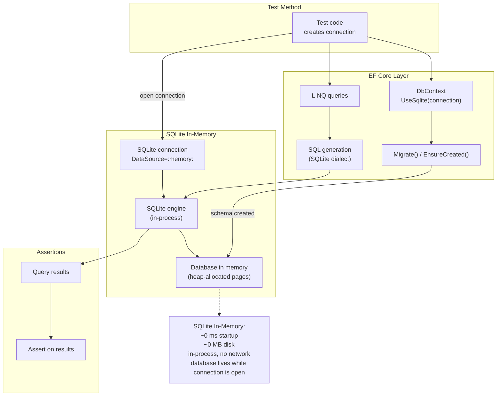
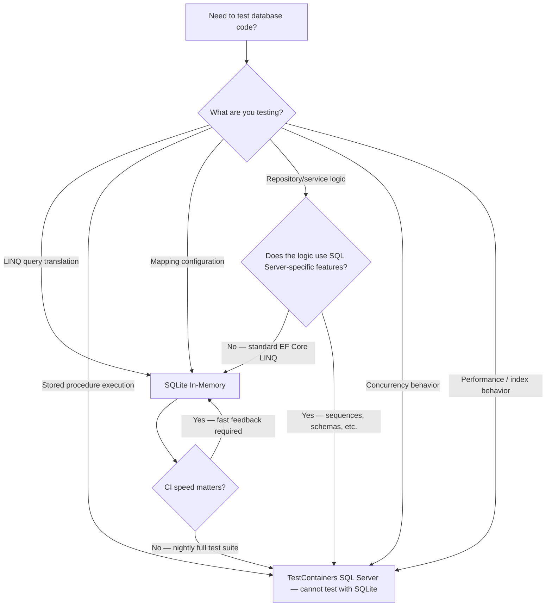

## Navigation

**Domain:** [[8 — Databases]] > **Group:** [[Group 33 — Database Testing]] **Previous:** [[8.946 — Respawn — Database Reset Between Tests]] | **Next:** [[8.948 — SQLite Limitations vs Real SQL Server]]

### Prerequisites

[[8.941 — Database Testing — Strategy Overview]] explains when to use which testing strategy. [[8.948 — SQLite Limitations vs Real SQL Server]] (the next topic) is the companion guide that details where SQLite diverges from SQL Server — you should read both together. [[3.100 — EF Core — Testing with SQLite]] covers additional EF Core-specific patterns.

### Where This Fits

SQLite In-Memory is the fastest way to run EF Core tests that need a real SQL database engine without the operational cost of Docker or a permanent database server. The database exists entirely in memory, starts in milliseconds, and requires zero configuration. For EF Core specifically, SQLite In-Memory supports the full LINQ pipeline — expressions are compiled, SQL is generated, and results are materialized — so it catches translation errors that mocks cannot. But SQLite is not SQL Server: it does not support stored procedures, schemas, sequences, or many T-SQL functions. When a test passes on SQLite but fails on SQL Server, the gap is usually in the SQL provider layer, not in the LINQ itself. The rule: use SQLite for fast, high-volume tests of LINQ expression shape and mapping configuration; use TestContainers with real SQL Server for tests that depend on SQL Server-specific behavior.

---

## Core Mental Model

SQLite In-Memory mode runs the entire SQLite database engine in the process's memory. There is no separate process, no network socket, no file I/O for reads or writes. The database is created by opening a connection with `DataSource=:memory:`, and it exists only as long as that connection is open. When the connection is closed or disposed, the database is destroyed. This ephemeral nature makes SQLite In-Memory ideal for test isolation — every test or test class can start with a fresh, empty database.

### Classification

**For .NET test infrastructure:** SQLite In-Memory is a zero-configuration, in-process SQL database engine that implements a large subset of the SQL standard. It is used with EF Core via the `Microsoft.EntityFrameworkCore.Sqlite` NuGet package. What it hides from the developer: there is no server, no connection pool, no storage engine tuning — SQLite is embedded, not client-server. Where the abstraction leaks: the SQL dialect is SQLite's, not SQL Server's; features like schemas (`dbo`), stored procedures, `SEQUENCE`, `OUTPUT` clause, `MERGE`, and window functions (pre-3.25) simply do not exist; date/time handling, string comparison, and decimal precision differ from SQL Server in subtle but test-breaking ways.



### Key Properties

|Property|Value|Notes|
|---|---|---|
|Time Complexity|Startup: ~0 ms; Query: varies (in-process, no network)|Faster than SQL Server localdb or TestContainers by orders of magnitude|
|Write Cost|In-process memory writes|No disk I/O, no transaction log flushing to disk|
|SARGable|Partial — SQLite's query planner is simpler than SQL Server's|Index usage differs; SQLite creates at most one index per table scan|
|Locking Behavior|SQLite serializes writes (single-writer, multiple-reader)|Different from SQL Server's MVCC — does not test production concurrency|
|Data Persistence|None (ephemeral)|Database is destroyed when the connection closes|
|SQL Dialect|SQLite-specific subset of SQL|No stored procedures, no schemas, limited window functions, no OUTPUT clause|

---

## Deep Mechanics

### How SQLite In-Memory Works

The magic string is `DataSource=:memory:` (or the older `Data Source=:memory:`). When an `SqliteConnection` opens with this connection string, SQLite allocates a fresh database in process heap memory. The connection must remain open for the database to exist — closing the connection frees the memory and destroys the database.

```csharp
// A single connection — database exists while conn is open
var connection = new SqliteConnection("DataSource=:memory:");
connection.Open();

// Create tables, run queries — everything stays in memory
using var command = connection.CreateCommand();
command.CommandText = "CREATE TABLE Test (Id INT PRIMARY KEY, Name TEXT)";
command.ExecuteNonQuery();

// Connection.Close() or Dispose() destroys the database
```

**Critical nuance for EF Core:** EF Core opens and closes connections internally unless you pass an already-open connection to `UseSqlite`. If you pass the connection string alone, EF Core may open and close connections, causing the in-memory database to be destroyed and recreated between operations.

```csharp
// ❌ WRONG — EF Core manages connection lifecycle, database may disappear
var options = new DbContextOptionsBuilder<TestDbContext>()
    .UseSqlite("DataSource=:memory:")
    .Options;

// ✅ CORRECT — pass an open connection that lives as long as the DbContext
var connection = new SqliteConnection("DataSource=:memory:");
connection.Open();

var options = new DbContextOptionsBuilder<TestDbContext>()
    .UseSqlite(connection)
    .Options;

// Use the context — connection stays open, database survives
var context = new TestDbContext(options);
await context.Database.EnsureCreatedAsync();
```

### Complete SQLite In-Memory Test Setup

```csharp
public sealed class SqliteTestFixture : IDisposable
{
    private readonly SqliteConnection _connection;
    private readonly DbContextOptions<TestDbContext> _options;

    public SqliteTestFixture()
    {
        // Open connection — database lives while this is open
        _connection = new SqliteConnection("DataSource=:memory:");
        _connection.Open();

        _options = new DbContextOptionsBuilder<TestDbContext>()
            .UseSqlite(_connection)
            .Options;

        // Create schema using EF Core
        using var context = new TestDbContext(_options);
        context.Database.EnsureCreated();
    }

    public TestDbContext CreateContext() => new TestDbContext(_options);

    public void Dispose()
    {
        _connection.Close();
        _connection.Dispose();
    }
}

// xUnit test class using the fixture
public class ProductServiceTests : IClassFixture<SqliteTestFixture>
{
    private readonly SqliteTestFixture _fixture;

    public ProductServiceTests(SqliteTestFixture fixture) => _fixture = fixture;

    [Fact]
    public async Task AddProduct_ShouldPersist()
    {
        await using var context = _fixture.CreateContext();

        context.Products.Add(new Product { Name = "Test Product", Price = 9.99m });
        await context.SaveChangesAsync();

        var product = await context.Products
            .FirstOrDefaultAsync(p => p.Name == "Test Product");
        Assert.NotNull(product);
        Assert.Equal(9.99m, product!.Price);
    }

    [Fact]
    public async Task GetProducts_ShouldReturnAll()
    {
        await using var context = _fixture.CreateContext();

        context.Products.AddRange(
            new Product { Name = "A", Price = 1m },
            new Product { Name = "B", Price = 2m },
            new Product { Name = "C", Price = 3m });
        await context.SaveChangesAsync();

        var products = await context.Products
            .OrderBy(p => p.Name)
            .ToListAsync();

        Assert.Equal(3, products.Count);
    }
}
```

### Testing EF Core Queries — LINQ Translation Verification

This is the primary use case for SQLite In-Memory: verifying that your LINQ queries compile, translate to SQL, and execute without error.

```csharp
public async Task<List<Product>> SearchProductsAsync(
    string? nameContains, decimal? maxPrice, int? categoryId,
    string sortBy, bool ascending, int page, int pageSize,
    CancellationToken ct = default)
{
    var query = _context.Products
        .Include(p => p.Category)
        .AsQueryable();

    // Dynamic filtering
    if (!string.IsNullOrWhiteSpace(nameContains))
        query = query.Where(p => p.Name.Contains(nameContains));

    if (maxPrice.HasValue)
        query = query.Where(p => p.Price <= maxPrice.Value);

    if (categoryId.HasValue)
        query = query.Where(p => p.CategoryId == categoryId.Value);

    // Dynamic sorting
    query = sortBy.ToLowerInvariant() switch
    {
        "name" => ascending
            ? query.OrderBy(p => p.Name)
            : query.OrderByDescending(p => p.Name),
        "price" => ascending
            ? query.OrderBy(p => p.Price)
            : query.OrderByDescending(p => p.Price),
        _ => query.OrderBy(p => p.Id)
    };

    // Pagination
    return await query
        .Skip((page - 1) * pageSize)
        .Take(pageSize)
        .ToListAsync(ct);
}

[Fact]
public async Task SearchProductsAsync_FilterByNameAndPrice()
{
    await using var context = _fixture.CreateContext();

    // Arrange
    context.Categories.Add(new Category { Id = 1, Name = "Electronics" });
    context.Products.AddRange(
        new Product { Name = "Laptop", Price = 1000m, CategoryId = 1 },
        new Product { Name = "Mouse", Price = 25m, CategoryId = 1 },
        new Product { Name = "Keyboard", Price = 75m, CategoryId = 1 },
        new Product { Name = "Monitor", Price = 300m, CategoryId = 1 });
    await context.SaveChangesAsync();

    var service = new ProductService(context);

    // Act
    var results = await service.SearchProductsAsync(
        nameContains: null, maxPrice: 100m, categoryId: 1,
        sortBy: "name", ascending: true, page: 1, pageSize: 10);

    // Assert
    Assert.Equal(2, results.Count);
    Assert.Contains(results, p => p.Name == "Mouse");
    Assert.Contains(results, p => p.Name == "Keyboard");
    Assert.All(results, p => Assert.True(p.Price <= 100m));
}
```

### Testing EF Core Include and Projection

```csharp
[Fact]
public async Task Include_LoadsRelatedEntities()
{
    await using var context = _fixture.CreateContext();

    // Arrange
    var category = new Category { Name = "Electronics" };
    context.Categories.Add(category);
    context.Products.Add(new Product
    {
        Name = "Laptop",
        Price = 1000m,
        Category = category
    });
    await context.SaveChangesAsync();

    // Act — Include loads the Category navigation property
    var laptop = await context.Products
        .Include(p => p.Category)
        .FirstAsync(p => p.Name == "Laptop");

    // Assert
    Assert.NotNull(laptop.Category);
    Assert.Equal("Electronics", laptop.Category.Name);

    // Demonstrates that Include was translated and executed by SQLite
}

[Fact]
public async Task Select_Projection_DoesNotGenerateNPlusOne()
{
    await using var context = _fixture.CreateContext();

    context.Categories.Add(new Category { Name = "Electronics" });
    context.Products.Add(new Product { Name = "Laptop", Price = 1000m, CategoryId = 1 });
    await context.SaveChangesAsync();

    // Act — projection avoids loading full entities
    var projections = await context.Products
        .Where(p => p.Price > 500)
        .Select(p => new { p.Name, p.Price })
        .ToListAsync();

    // Assert
    var projection = Assert.Single(projections);
    Assert.Equal("Laptop", projection.Name);
    Assert.Equal(1000m, projection.Price);
}
```

### Testing Dapper with SQLite In-Memory

Dapper works with SQLite In-Memory through the `Microsoft.Data.Sqlite` package. The same `SqliteConnection` can be used with Dapper — but Dapper does not use EF Core's `UseSqlite`; it uses the raw ADO.NET connection.

```csharp
public class ProductRepository
{
    private readonly string _connectionString;

    public ProductRepository(string connectionString) => _connectionString = connectionString;

    public async Task<IReadOnlyList<Product>> GetByCategoryAsync(int categoryId,
        CancellationToken ct = default)
    {
        const string sql = @"
            SELECT p.Id, p.Name, p.Price, p.CategoryId,
                   c.Name AS CategoryName
            FROM Products p
            INNER JOIN Categories c ON p.CategoryId = c.Id
            WHERE p.CategoryId = @CategoryId
            ORDER BY p.Name";

        await using var conn = new SqliteConnection(_connectionString);
        var results = await conn.QueryAsync<Product>(
            new CommandDefinition(sql,
                new { CategoryId = categoryId },
                cancellationToken: ct));
        return results.AsList();
    }
}

// Test fixture for Dapper with SQLite In-Memory
public sealed class SqliteDapperFixture : IDisposable
{
    private readonly SqliteConnection _connection;

    public SqliteDapperFixture()
    {
        _connection = new SqliteConnection("DataSource=:memory:");
        _connection.Open();

        // Create schema using raw SQL (Dapper has no migrations)
        _connection.Execute(@"
            CREATE TABLE Categories (
                Id INTEGER PRIMARY KEY AUTOINCREMENT,
                Name TEXT NOT NULL
            );
            CREATE TABLE Products (
                Id INTEGER PRIMARY KEY AUTOINCREMENT,
                Name TEXT NOT NULL,
                Price REAL NOT NULL,
                CategoryId INTEGER NOT NULL REFERENCES Categories(Id)
            );
        ");
    }

    public string ConnectionString => "DataSource=:memory:";

    public SqliteConnection CreateConnection()
    {
        // Each test gets its own connection to a NEW in-memory database
        var conn = new SqliteConnection("DataSource=:memory:");
        conn.Open();
        // Re-create schema in the new database
        conn.Execute(@"
            CREATE TABLE Categories (Id INTEGER PRIMARY KEY AUTOINCREMENT, Name TEXT NOT NULL);
            CREATE TABLE Products (Id INTEGER PRIMARY KEY AUTOINCREMENT, Name TEXT NOT NULL,
                Price REAL NOT NULL, CategoryId INTEGER NOT NULL REFERENCES Categories(Id));
        ");
        return conn;
    }

    public void Dispose()
    {
        _connection.Close();
        _connection.Dispose();
    }
}

public class ProductRepositoryDapperTests : IClassFixture<SqliteDapperFixture>
{
    private readonly SqliteDapperFixture _fixture;

    public ProductRepositoryDapperTests(SqliteDapperFixture fixture) => _fixture = fixture;

    [Fact]
    public async Task GetByCategoryAsync_ReturnsProductsInCategory()
    {
        await using var conn = _fixture.CreateConnection();
        // Seed
        await conn.ExecuteAsync(@"
            INSERT INTO Categories (Id, Name) VALUES (1, 'Electronics');
            INSERT INTO Products (Name, Price, CategoryId)
            VALUES ('Laptop', 1000, 1), ('Mouse', 25, 1), ('Keyboard', 75, 1);");

        var repo = new ProductRepository("DataSource=:memory:");
        // Note: This won't work because CreateConnection() creates a new database!
        // Dapper with SQLite In-Memory requires careful connection management.

        // ACTUAL CORRECT APPROACH — pass the connection, not the connection string
    }
}
```

**Important Dapper with SQLite In-Memory caveat:** Each `SqliteConnection("DataSource=:memory:")` creates a separate, independent in-memory database. Seed data inserted through one connection is NOT visible to another connection. You must either:
1. Share the same `SqliteConnection` instance across the test (open once, use everywhere), or
2. Use `DataSource=file::memory:?cache=shared` (shared cache mode).

```csharp
// ✅ Option 1: Single connection shared via fixture
public sealed class SharedSqliteFixture : IDisposable
{
    private readonly SqliteConnection _connection;

    public SharedSqliteFixture()
    {
        _connection = new SqliteConnection("DataSource=:memory:");
        _connection.Open();
        // Create schema once
        _connection.Execute("CREATE TABLE Products (...);");
    }

    public SqliteConnection Connection => _connection; // same connection = same database

    public void Dispose() => _connection.Dispose();
}

// ✅ Option 2: Shared cache mode (all connections see the same database)
var connectionString = "DataSource=shared_db;Mode=Memory;Cache=Shared";
var conn1 = new SqliteConnection(connectionString);
conn1.Open();
var conn2 = new SqliteConnection(connectionString);
conn2.Open();
// conn1 and conn2 share the same in-memory database!
```

### SQLite Connection Strings — Variations

```csharp
// Standard in-memory — unique database per connection
"DataSource=:memory:"

// In-memory with name — same name = same database (within same process)
"DataSource=MyTestDb;Mode=Memory;Cache=Shared"

// In-memory with cache=shared keyword (older format)
"Data Source=file::memory:?cache=shared"

// File-based SQLite (for debugging — inspect the database file)
"DataSource=C:\\temp\\test.db"

// In-memory with foreign keys enabled
"DataSource=:memory:;Foreign Keys=True"
```

### Cost Visibility

```sql
-- SQLite does not have SET STATISTICS IO/TIME.
-- Use .timer and .eqp in the SQLite CLI.
.timer on
.eqp on

EXPLAIN QUERY PLAN
SELECT p.Name, p.Price, c.Name AS CategoryName
FROM Products p
INNER JOIN Categories c ON p.CategoryId = c.Id
WHERE p.Price < 100.00
ORDER BY p.Name;

-- Expected output (simplified plan):
-- QUERY PLAN
-- |--SCAN TABLE Products
-- |--SEARCH TABLE Categories USING INTEGER PRIMARY KEY (rowid=?)
-- |--USE TEMP B-TREE FOR ORDER BY
```

### Failure Modes

|Failure Mode|Symptom|Root Cause|Fix|
|---|---|---|---|
|Database disappears between operations|`SqliteException: no such table: Products`|EF Core opened/closing connection internally — in-memory DB destroyed|Pass an open `SqliteConnection` to `UseSqlite()`, not a connection string|
|Dapper sees empty database|Data inserted via EF Core not found by Dapper|EF Core and Dapper use different connections → different in-memory databases|Share the same `SqliteConnection` instance or use `Cache=Shared` mode|
|FK constraint violation unexpectedly|`SqliteException: FOREIGN KEY constraint failed`|SQLite enforces FK by default only when `PRAGMA foreign_keys = ON`|Set `Foreign Keys=True` in connection string or execute `PRAGMA foreign_keys = ON;` after opening|
|Test passes on SQLite, fails on SQL Server|Wrong results or SQL exception in production|SQLite-specific SQL generated by EF Core differs from SQL Server|Identify the diverging feature (see [[8.948 — SQLite Limitations vs Real SQL Server]])|
|String comparison differs|`WHERE Name = 'john'` matches 'John' in SQLite but not in SQL Server|SQLite is case-insensitive for ASCII by default|Use `LIKE` or explicit collation for accurate testing|

---

## Production Patterns and Implementation

### Primary SQL Implementation — SQLite-Compatible Schema

```sql
-- SQLite schema for product catalog (note: no dbo schema, no IDENTITY, no sequences)
CREATE TABLE IF NOT EXISTS Categories (
    Id INTEGER PRIMARY KEY AUTOINCREMENT,
    Name TEXT NOT NULL
);

CREATE TABLE IF NOT EXISTS Products (
    Id INTEGER PRIMARY KEY AUTOINCREMENT,
    Name TEXT NOT NULL,
    Price REAL NOT NULL,
    CategoryId INTEGER NOT NULL,
    CreatedAt TEXT NOT NULL DEFAULT (datetime('now')),
    FOREIGN KEY (CategoryId) REFERENCES Categories(Id)
);

CREATE INDEX IF NOT EXISTS IX_Products_CategoryId ON Products(CategoryId);
CREATE INDEX IF NOT EXISTS IX_Products_Price ON Products(Price);
```

**Key differences from SQL Server:**
- `INTEGER PRIMARY KEY AUTOINCREMENT` instead of `INT IDENTITY(1,1)`
- `TEXT` instead of `NVARCHAR(200)`
- `REAL` instead of `DECIMAL(18,2)` — precision loss possible
- `datetime('now')` instead of `SYSUTCDATETIME()`
- No `dbo.` prefix — schemas don't exist
- No `CREATE TABLE IF NOT EXISTS` is standard SQL — SQL Server does not support this syntax

### EF Core Implementation — Repository and Service Tests

```csharp
public class OrderServiceEfTests : IClassFixture<SqliteTestFixture>
{
    private readonly SqliteTestFixture _fixture;

    public OrderServiceEfTests(SqliteTestFixture fixture) => _fixture = fixture;

    [Fact]
    public async Task CreateOrder_WithItems_ComputesCorrectTotal()
    {
        await using var context = _fixture.CreateContext();

        // Arrange
        var category = new Category { Name = "Books" };
        context.Categories.Add(category);
        var book1 = new Product { Name = "Book A", Price = 10.00m, Category = category };
        var book2 = new Product { Name = "Book B", Price = 15.00m, Category = category };
        context.Products.AddRange(book1, book2);
        await context.SaveChangesAsync();

        var service = new OrderService(context);
        var items = new List<CreateOrderItem>
        {
            new() { ProductId = book1.Id, Quantity = 2 },
            new() { ProductId = book2.Id, Quantity = 1 }
        };

        // Act
        var order = await service.CreateOrderAsync("Alice", items);

        // Assert
        Assert.Equal(35.00m, order.Total); // (2 * 10) + (1 * 15)
        Assert.Equal(2, order.Items.Count);
    }

    [Fact]
    public async Task GetOrdersByDateRange_ReturnsFilteredOrders()
    {
        await using var context = _fixture.CreateContext();

        // Arrange
        var baseDate = new DateTime(2024, 6, 1, 0, 0, 0, DateTimeKind.Utc);
        context.Orders.AddRange(
            new Order { CustomerName = "A", OrderDate = baseDate, Total = 100m, Status = "Shipped" },
            new Order { CustomerName = "B", OrderDate = baseDate.AddDays(5), Total = 200m, Status = "Pending" },
            new Order { CustomerName = "C", OrderDate = baseDate.AddDays(15), Total = 300m, Status = "Shipped" }
        );
        await context.SaveChangesAsync();

        // Act
        var start = baseDate.AddDays(4);
        var end = baseDate.AddDays(10);
        var orders = await context.Orders
            .Where(o => o.OrderDate >= start && o.OrderDate <= end)
            .OrderBy(o => o.CustomerName)
            .ToListAsync();

        // Assert
        Assert.Equal(2, orders.Count);
        Assert.Contains(orders, o => o.CustomerName == "B");
        Assert.Contains(orders, o => o.CustomerName == "A");
    }

    [Fact]
    public async Task DeleteCategory_CascadesOrRestricts()
    {
        await using var context = _fixture.CreateContext();

        var category = new Category { Name = "Electronics" };
        context.Categories.Add(category);
        context.Products.Add(new Product { Name = "Laptop", Price = 1000m, Category = category });
        await context.SaveChangesAsync();

        // Attempt to delete category that has products
        context.Categories.Remove(category);

        // SQLite with FK enabled should throw if RESTRICT (default), or cascade
        var exception = await Record.ExceptionAsync(() => context.SaveChangesAsync());
        // Depending on EF Core convention, this may throw or cascade
        // SQLite In-Memory may behave differently than SQL Server here
        Assert.NotNull(exception);
    }

    [Fact]
    public async Task ThenInclude_LoadsGrandchildRelationships()
    {
        await using var context = _fixture.CreateContext();

        var category = new Category { Name = "Electronics" };
        var product = new Product { Name = "Laptop", Price = 1000m, Category = category };
        var order = new Order { CustomerName = "Alice", OrderDate = DateTime.UtcNow, Total = 1000m, Status = "Shipped" };
        var orderItem = new OrderItem { Order = order, Product = product, Quantity = 1, UnitPrice = 1000m };

        context.OrderItems.Add(orderItem);
        await context.SaveChangesAsync();

        // Act — ThenInclude loads grandchild (Order → OrderItems → Product)
        var loadedOrder = await context.Orders
            .Include(o => o.Items)
            .ThenInclude(oi => oi.Product)
            .FirstAsync(o => o.Id == order.Id);

        // Assert
        Assert.Single(loadedOrder.Items);
        Assert.Equal("Laptop", loadedOrder.Items[0].Product.Name);
    }
}
```

### Dapper Implementation — Service Tests with SQLite

```csharp
public class OrderSummary
{
    public int OrderId { get; set; }
    public string CustomerName { get; set; } = "";
    public decimal Total { get; set; }
    public string Status { get; set; } = "";
    public int ItemCount { get; set; }
}

public class OrderSummaryRepository
{
    private readonly SqliteConnection _connection;

    public OrderSummaryRepository(SqliteConnection connection) => _connection = connection;

    public async Task<IReadOnlyList<OrderSummary>> GetShippedOrdersAsync(
        DateTime from, DateTime to, CancellationToken ct = default)
    {
        const string sql = @"
            SELECT o.Id AS OrderId,
                   o.CustomerName,
                   o.Total,
                   o.Status,
                   COUNT(oi.Id) AS ItemCount
            FROM Orders o
            LEFT JOIN OrderItems oi ON o.Id = oi.OrderId
            WHERE o.Status = 'Shipped'
              AND o.OrderDate >= @From
              AND o.OrderDate <= @To
            GROUP BY o.Id, o.CustomerName, o.Total, o.Status
            ORDER BY o.OrderDate DESC";

        var results = await _connection.QueryAsync<OrderSummary>(
            new CommandDefinition(sql,
                new { From = from.ToString("O"), To = to.ToString("O") },
                cancellationToken: ct));
        return results.AsList();
    }
}

public class OrderSummaryRepositoryTests : IClassFixture<SharedSqliteFixture>
{
    private readonly SharedSqliteFixture _fixture;

    public OrderSummaryRepositoryTests(SharedSqliteFixture fixture) => _fixture = fixture;

    [Fact]
    public async Task GetShippedOrdersAsync_ReturnsOnlyShippedOrders()
    {
        var connection = _fixture.Connection; // shared connection = shared database
        // Clean data between tests (manual since Respawn doesn't work with SQLite easily)
        await connection.ExecuteAsync("DELETE FROM OrderItems; DELETE FROM Orders; DELETE FROM Products; DELETE FROM Categories;");

        // Seed
        var baseDate = new DateTime(2024, 6, 10, 0, 0, 0, DateTimeKind.Utc);
        await connection.ExecuteAsync(@"
            INSERT INTO Categories (Id, Name) VALUES (1, 'Books');
            INSERT INTO Products (Id, Name, Price, CategoryId) VALUES (1, 'Book A', 10.00, 1);
            INSERT INTO Orders (Id, CustomerName, OrderDate, Total, Status)
            VALUES (1, 'Alice', @Date1, 20.00, 'Shipped'),
                   (2, 'Bob', @Date2, 30.00, 'Pending'),
                   (3, 'Charlie', @Date3, 40.00, 'Shipped');",
            new { Date1 = baseDate.AddDays(-1).ToString("O"),
                  Date2 = baseDate.ToString("O"),
                  Date3 = baseDate.AddDays(1).ToString("O") });
        await connection.ExecuteAsync(@"
            INSERT INTO OrderItems (OrderId, ProductId, Quantity, UnitPrice)
            VALUES (1, 1, 2, 10.00), (3, 1, 1, 40.00);");

        var repo = new OrderSummaryRepository(connection);
        var result = await repo.GetShippedOrdersAsync(
            baseDate.AddDays(-2), baseDate.AddDays(2));

        Assert.Equal(2, result.Count);
        Assert.All(result, o => Assert.Equal("Shipped", o.Status));
        Assert.Contains(result, o => o.CustomerName == "Alice");
        Assert.Contains(result, o => o.CustomerName == "Charlie");
    }
}
```

### Configuration and Wiring

```csharp
// Extension method to create test DbContext options for SQLite In-Memory
public static class TestDbContextFactory
{
    public static DbContextOptions<T> CreateSqliteOptions<T>(
        SqliteConnection? existingConnection = null) where T : DbContext
    {
        var connection = existingConnection ?? new SqliteConnection("DataSource=:memory:");
        if (existingConnection == null)
            connection.Open();

        return new DbContextOptionsBuilder<T>()
            .UseSqlite(connection)
            .Options;
    }

    public static async Task<T> CreateContextAsync<T>(
        SqliteConnection? connection = null) where T : DbContext
    {
        var options = CreateSqliteOptions<T>(connection);
        var context = (T)Activator.CreateInstance(typeof(T), options)!;
        await context.Database.EnsureCreatedAsync();
        return context;
    }
}

// Usage in a test
[Fact]
public async Task QuickTest_UsingFactory()
{
    await using var context = await TestDbContextFactory.CreateContextAsync<TestDbContext>();
    context.Products.Add(new Product { Name = "Quick", Price = 1m });
    await context.SaveChangesAsync();
    Assert.Equal(1, await context.Products.CountAsync());
}
```

### SQLite vs SQL Server — EF Core Code Comparison

|Aspect|SQL Server (Production)|SQLite In-Memory (Test)|
|---|---|---|
|Provider package|`Microsoft.EntityFrameworkCore.SqlServer`|`Microsoft.EntityFrameworkCore.Sqlite`|
|Connection string|`Server=localhost;Database=MyDb;...`|`DataSource=:memory:`|
|Schema creation|`context.Database.MigrateAsync()`|`context.Database.EnsureCreatedAsync()` (or Migrate)|
|Identity column|`INT IDENTITY(1,1)`|`INTEGER PRIMARY KEY AUTOINCREMENT`|
|Decimal precision|`DECIMAL(18,2)` — exact|`REAL` — approximate (double)|
|DateTime handling|`DATETIME2` / `SYSUTCDATETIME()`|`TEXT` / `datetime('now')`|
|String comparison|Case-insensitive (default collation)|Case-sensitive for Unicode, insensitive for ASCII (default)|
|FK enforcement|Always on (cannot be disabled)|Off by default — must set `PRAGMA foreign_keys = ON`|
|Stored procedures|Fully supported|Not supported|
|Sequences|`CREATE SEQUENCE`|Not supported|
|Temporal tables|Supported|Not supported|

---

## Gotchas and Production Pitfalls

### SQLite Connection Lifecycle — Database Disappears

**Pitfall:** Passing a connection string (instead of an open connection) to `UseSqlite` causes EF Core to open and close connections internally. When the connection closes, the in-memory database is destroyed. Subsequent operations fail with "no such table."

```csharp
// ❌ WRONG — database is destroyed when EF Core closes the connection
var options = new DbContextOptionsBuilder<TestDbContext>()
    .UseSqlite("DataSource=:memory:") // ← connection string, not connection
    .Options;

using (var ctx = new TestDbContext(options))
{
    await ctx.Database.EnsureCreatedAsync();
    ctx.Products.Add(new Product { Name = "Test", Price = 10m });
    await ctx.SaveChangesAsync(); // works — connection is still open
}
// context disposed → connection closed → database destroyed

using (var ctx2 = new TestDbContext(options))
{
    var products = await ctx2.Products.ToListAsync(); // ❌ "no such table: Products"
}

// ✅ CORRECT — share the same open connection
var connection = new SqliteConnection("DataSource=:memory:");
connection.Open();

var options = new DbContextOptionsBuilder<TestDbContext>()
    .UseSqlite(connection) // ← pass the open connection
    .Options;

using (var ctx = new TestDbContext(options))
{
    await ctx.Database.EnsureCreatedAsync();
    ctx.Products.Add(new Product { Name = "Test", Price = 10m });
    await ctx.SaveChangesAsync();
}

using (var ctx2 = new TestDbContext(options))
{
    var products = await ctx2.Products.ToListAsync(); // ✅ works — same database
}
```

### SQLite Does Not Enforce Foreign Keys By Default

**Pitfall:** SQLite has foreign key constraint parsing (the FK syntax is accepted), but enforcement is disabled by default for backward compatibility. A test can insert orphaned rows without error — a bug that SQL Server would catch immediately.

```csharp
// ❌ Without PRAGMA foreign_keys = ON, orphan inserts succeed
var connection = new SqliteConnection("DataSource=:memory:");
connection.Open();
// FK enforcement is OFF by default

connection.Execute(@"
    CREATE TABLE Child (Id INT, ParentId INT REFERENCES Parent(Id));
    INSERT INTO Child (Id, ParentId) VALUES (1, 999); -- no error, but Parent(999) doesn't exist
");

// ✅ Enable FK enforcement in connection string
var connection = new SqliteConnection("DataSource=:memory:;Foreign Keys=True");
connection.Open();

connection.Execute(@"
    CREATE TABLE Child (Id INT, ParentId INT REFERENCES Parent(Id));
    INSERT INTO Child (Id, ParentId) VALUES (1, 999);
    -- ❌ SQLiteException: FOREIGN KEY constraint failed
");

// ✅ Or execute the PRAGMA after opening
connection.Execute("PRAGMA foreign_keys = ON;");
```

**EF Core behavior:** EF Core's `UseSqlite` does NOT automatically enable FK enforcement. You must either set it in the connection string or execute the PRAGMA.

### SQLite Decimal Precision Is REAL (Double-Precision Float)

**Pitfall:** SQLite stores `decimal` / `DECIMAL` columns as `REAL` (64-bit IEEE double). This loses precision for large or high-precision decimal values.

```csharp
// EF Core entity
public class FinancialTransaction
{
    public int Id { get; set; }
    public decimal Amount { get; set; } // DECIMAL(18,4) in SQL Server
}

// Test that passes on SQLite but fails on SQL Server:
[Fact]
public async Task HighPrecisionDecimal_IsPreserved()
{
    await using var context = _fixture.CreateContext();

    context.Set<FinancialTransaction>().Add(new FinancialTransaction
    {
        Amount = 123456789.1234m // 13 digits, 4 decimal places
    });
    await context.SaveChangesAsync();

    var saved = await context.Set<FinancialTransaction>().FirstAsync();
    Assert.Equal(123456789.1234m, saved.Amount);
    // ✅ Passes on SQLite (double can represent this exactly enough)
    // ❌ Fails on SQL Server if column is DECIMAL(18,4) — truncation?
    // Actually SQL Server preserves this fine, but the point is:
    // SQLite may ROUND values that SQL Server does not, and vice versa.
}
```

**Real scenario:** A financial application uses `DECIMAL(18,4)`. SQLite stores it as `REAL`, which has ~15–17 significant digits. `DECIMAL(18,4)` has 14 significant digits before the decimal — close to the limit. Division operations produce slightly different rounding on SQLite vs SQL Server.

### SQLite DateTime Handling — No DATETIME2, No Time Zones

**Pitfall:** SQLite has no native datetime type — it stores dates as TEXT (`yyyy-MM-dd HH:mm:ss.FFFFFF`), REAL (Julian day numbers), or INTEGER (Unix timestamps). EF Core's SQLite provider uses TEXT format by default, which loses timezone information and has different range/accuracy than SQL Server's `DATETIME2`.

```csharp
[Fact]
public async Task DateTime_RoundTrip_KindPreservation()
{
    await using var context = _fixture.CreateContext();

    var original = new DateTime(2024, 6, 15, 10, 30, 0, DateTimeKind.Utc);
    context.Orders.Add(new Order { OrderDate = original, Total = 100m, Status = "Test" });
    await context.SaveChangesAsync();

    var saved = await context.Orders.Select(o => o.OrderDate).FirstAsync();

    // SQLite stores as TEXT "2024-06-15 10:30:00.0000000" — loses Kind
    Assert.Equal(original, saved); // Passes — same instant
    Assert.Equal(DateTimeKind.Utc, saved.Kind); // ❌ Fails — Kind is Unspecified on SQLite
}
```

**Impact:** Tests that assert on `DateTime.Kind` will fail on SQLite. Use `Assert.Equal(original, saved)` (which compares ticks) rather than checking Kind.

### SQLite String Comparison — Unicode and Collation

**Pitfall:** SQLite's default collation (`BINARY`) is case-sensitive for non-ASCII characters but uses memcmp for ASCII, which is case-insensitive for ASCII letters A-Z/a-z when doing comparison. SQL Server's default collation (`SQL_Latin1_General_CP1_CI_AS`) is case-insensitive across all characters.

```csharp
[Fact]
public async Task StringComparison_CaseInsensitive()
{
    await using var context = _fixture.CreateContext();

    context.Products.Add(new Product { Name = "Laptop", Price = 1000m });
    await context.SaveChangesAsync();

    // LINQ query that should be case-insensitive
    var result = await context.Products
        .FirstOrDefaultAsync(p => p.Name == "laptop"); // different case

    // SQL Server: finds it (case-insensitive collation)
    // SQLite: may or may not find it depending on characters
    // For ASCII 'laptop' vs 'Laptop' — SQLite comparison IS case-insensitive (memcmp behavior)
    // For 'Élan' vs 'élan' — SQLite comparison is CASE-SENSITIVE!
    Assert.NotNull(result); // ❌ Fails on SQLite if non-ASCII case difference
}
```

### SQLite Does Not Support Database Schemas

**Pitfall:** EF Core models configured with `ToTable("Orders", "sales")` (schema = "sales") will fail on SQLite because SQLite does not support schemas.

```csharp
// EF Core configuration
modelBuilder.Entity<Order>(entity =>
{
    entity.ToTable("Orders", "sales"); // schema "sales" in SQL Server
    entity.HasKey(o => o.Id);
});

// SQLite: ❌ InvalidOperationException — SQLite does not support schemas
// Fix: remove the schema specification or use conditional configuration:

modelBuilder.Entity<Order>(entity =>
{
    if (Database.IsSqlServer())
        entity.ToTable("Orders", "sales");
    else
        entity.ToTable("Orders"); // no schema for SQLite
});
```

### SQLite Does Not Support Sequences

**Pitfall:** EF Core's `UseSequence()`, `ForSqlServerUseSequenceHiLo()`, or explicit `CREATE SEQUENCE` mappings will fail on SQLite.

```csharp
modelBuilder.Entity<Order>(entity =>
{
    entity.Property(o => o.OrderNumber)
        .UseSequence("OrderNumbers"); // ❌ SQLite — Not supported
});
```

**Workaround:** Use `HiLoValueGenerationStrategy` conditionally or avoid sequence-based key generation in tests.

### SQLite Is Single-Writer — Concurrency Tests Are Misleading

**Pitfall:** SQLite serializes write operations with a database-level lock. Tests that appear to handle concurrent writes on SQLite will fail on SQL Server with deadlocks or write conflicts, because SQL Server uses row-level locking and MVCC.

```csharp
// This test passes on SQLite but deadlocks on SQL Server:
[Fact]
public async Task ConcurrentWrites_ShouldNotDeadlock()
{
    await using var context1 = _fixture.CreateContext();
    await using var context2 = _fixture.CreateContext();

    var task1 = Task.Run(async () =>
    {
        context1.Products.Add(new Product { Name = "From1", Price = 10m });
        await context1.SaveChangesAsync();
    });

    var task2 = Task.Run(async () =>
    {
        context2.Products.Add(new Product { Name = "From2", Price = 20m });
        await context2.SaveChangesAsync();
    });

    await Task.WhenAll(task1, task2);
    // SQLite: ✅ passes — serialized writes
    // SQL Server: ❌ may deadlock or timeout depending on isolation level
}
```

---

## Performance Implications

### Benchmark: SQLite In-Memory vs SQL Server (LocalDB) vs TestContainers

```csharp
[MemoryDiagnoser]
[SimpleJob(RuntimeMoniker.Net90)]
public class DatabaseTestStrategyBenchmark
{
    private SqliteConnection _sqliteConn = null!;
    private DbContextOptions<TestDbContext> _sqliteOptions = null!;
    private MsSqlContainer _container = null!;
    private DbContextOptions<TestDbContext> _sqlServerOptions = null!;

    [GlobalSetup]
    public async Task Setup()
    {
        // SQLite In-Memory
        _sqliteConn = new SqliteConnection("DataSource=:memory:;Foreign Keys=True");
        _sqliteConn.Open();
        _sqliteOptions = new DbContextOptionsBuilder<TestDbContext>()
            .UseSqlite(_sqliteConn).Options;

        // TestContainers SQL Server
        _container = new MsSqlBuilder()
            .WithImage("mcr.microsoft.com/mssql/server:2022-latest")
            .Build();
        await _container.StartAsync();
        _sqlServerOptions = new DbContextOptionsBuilder<TestDbContext>()
            .UseSqlServer(_container.GetConnectionString()).Options;
    }

    [Benchmark]
    public async Task<List<Product>> Sqlite_QueryAll()
    {
        await using var ctx = new TestDbContext(_sqliteOptions);
        return await ctx.Products.Take(100).ToListAsync();
    }

    [Benchmark]
    public async Task<List<Product>> SqlServer_QueryAll()
    {
        await using var ctx = new TestDbContext(_sqlServerOptions);
        return await ctx.Products.Take(100).ToListAsync();
    }

    [Benchmark]
    public async Task Sqlite_EnsureCreated()
    {
        await using var ctx = new TestDbContext(_sqliteOptions);
        await ctx.Database.EnsureCreatedAsync();
    }

    [Benchmark]
    public async Task SqlServer_Migrate()
    {
        await using var ctx = new TestDbContext(_sqlServerOptions);
        await ctx.Database.EnsureCreatedAsync();
    }

    [GlobalCleanup]
    public async Task Cleanup()
    {
        _sqliteConn.Dispose();
        await _container.DisposeAsync();
    }
}
```

**Expected results (simplified):**

|Method|Mean|Allocated|Notes|
|---|---|---|---|
|Sqlite_QueryAll (100 rows)|~3 ms|~50 KB|In-process, zero network|
|SqlServer_QueryAll (100 rows)|~15 ms|~180 KB|Network round-trip, connection pool|
|Sqlite_EnsureCreated|~15 ms|~200 KB|Creates schema from scratch|
|SqlServer_EnsureCreated|~1,200 ms|~1.5 MB|DDL statements over network|

**Key takeaway:** SQLite In-Memory is 5–10x faster for queries and 80x faster for schema creation than SQL Server over TestContainers. For a test suite with 300 tests that each re-create schema: SQLite adds ~4.5 seconds; SQL Server adds ~6 minutes.

### When Speed Difference Matters Most

|Scenario|SQLite In-Memory|TestContainers SQL Server|Why|
|---|---|---|---|
|Pre-commit test run (100 tests, simple queries)|~5 seconds|~2 minutes|SQLite startup is ~0 ms; no Docker overhead|
|CI pipeline (300 tests, complex queries)|~15 seconds|~15 minutes|SQLite query time still dominated by assertions, not DB|
|Test-driven development (many incremental test runs)|~0.5 seconds per run|~30 seconds per run|SQLite removes the "wait for database" friction|
|Stored procedure tests|Cannot test|Required|SQLite does not support sprocs|
|Concurrency/ MVCC tests|Misleading|Required|SQLite single-writer ≠ SQL Server MVCC|

---

## Interview Arsenal

### Question Bank

1. How does SQLite In-Memory differ from EF Core's InMemory provider (`UseInMemoryDatabase`)?
2. Why must you pass an open `SqliteConnection` to `UseSqlite()` instead of a connection string?
3. What happens to the in-memory database when the last connection is closed?
4. How do you enable foreign key enforcement in SQLite?
5. What are three SQL Server features that SQLite does not support?
6. How does SQLite handle `DECIMAL` columns internally, and why does this matter for financial calculations?
7. What is the difference between `EnsureCreated()` and `MigrateAsync()` when used with SQLite In-Memory?
8. Why might a test that passes on SQLite fail on SQL Server for string comparison?
9. Can Dapper use the same SQLite In-Memory database as EF Core? How?
10. What is the `Cache=Shared` mode in SQLite connection strings, and when would you use it?

### Spoken Answers

**Q: How does SQLite In-Memory differ from EF Core's InMemory provider?**

> **Average answer:** "SQLite is a real SQL database engine; InMemory is a mock." Correct but incomplete.

> **Great answer:** "They operate at completely different layers. `UseInMemoryDatabase` is a lightweight provider that stores data in a dictionary — it does not parse SQL, does not enforce constraints, does not evaluate expressions using SQL semantics. A LINQ query like `.Where(p => p.Name.Contains("Lap"))` works in both, but InMemory evaluates `string.Contains` in .NET, while SQLite translates it to `LIKE '%Lap%'` and evaluates it in the SQLite engine. This means SQLite catches translation errors that InMemory silently accepts — for example, a query that uses a function SQLite cannot translate will throw at runtime on SQLite but pass on InMemory. The tradeoff is that SQLite does not support stored procedures, schemas, or sequences, so tests that depend on those features still need a real SQL Server container. The rule: use InMemory for unit-testing business logic that happens to use IQueryable; use SQLite for testing LINQ translation; use TestContainers for testing SQL Server-specific features."

**Q: Why must you pass an open SqliteConnection to UseSqlite() instead of a connection string?**

> **Average answer:** "Because the in-memory database gets destroyed when the connection closes." Correct.

> **Great answer:** "SQLite In-Memory databases are scoped to a single connection. When you pass a connection string to `UseSqlite`, EF Core manages the connection lifecycle internally — it may open a connection for one query, then close it. When that connection closes, the in-memory database is destroyed. The next query opens a new connection, which creates a fresh, empty in-memory database — the schema and data are gone. Passing an already-open connection to `UseSqlite(connection)` tells EF Core to use that specific connection and never close it. The connection stays open for the lifetime of the test fixture, and the database persists across all DbContext instances created with the same options. This is the single most common SQLite In-Memory bug in tests."

**Q: What are three SQL Server features that SQLite does not support?**

> **Average answer:** "Stored procedures, schemas, and sequences." Correct.

> **Great answer:** "First, stored procedures and functions — SQLite has no `CREATE PROCEDURE` or `CREATE FUNCTION`; all logic must be in the application layer or inline SQL. Second, schemas — SQLite has a single namespace; there is no `dbo`, no `sales.Order` separation; `INFORMATION_SCHEMA` exists but only returns objects from the main schema. Third, sequences — there is no `CREATE SEQUENCE`; auto-increment is handled exclusively through `INTEGER PRIMARY KEY AUTOINCREMENT`. Beyond these, there is no `OUTPUT` clause, no `MERGE` (though upsert via `INSERT ... ON CONFLICT` exists), no `TOP` (use `LIMIT`), no `FOR XML PATH`, no `STRING_AGG` before SQLite 3.33, no `TRUNCATE TABLE` (use `DELETE FROM`), and window functions are only available since SQLite 3.25. Each of these gaps is a potential test failure that only surfaces when moving from SQLite tests to real SQL Server."

### Interview Trigger

The interviewer asks how you test EF Core queries. Candidates who mention SQLite In-Memory should also immediately mention its limitations — interviewers who hear "we use SQLite for all our database tests" without caveats will follow up with "what happens when you use a stored procedure?" or "how do you handle decimal precision?" The best candidates preempt the follow-up by naming the limitations and the compensating strategy (TestContainers for SQL Server-specific features).

### Comparison Table

|Test Database Strategy|Speed (Query)|Speed (Setup)|Feature Fidelity|SQL Server Parity|CI Dependency|Best For|
|---|---|---|---|---|---|---|
|SQLite In-Memory|Fast (~3 ms)|Fast (~0 ms)|Medium — LINQ translation only|Partial (no sprocs, schemas, sequences)|None (in-process)|LINQ translation, mapping, simple queries|
|EF Core InMemory|Fast (~1 ms)|Fast (~0 ms)|Low — no SQL, no constraints|Low (no SQL at all)|None|Business logic unit tests that use IQueryable|
|TestContainers SQL Server|Moderate (~15 ms)|Slow (~15–25 s)|Full — real SQL Server|Full|Docker|Stored procedures, sequences, schemas, production-identical testing|
|LocalDB|Moderate (~10 ms)|Slow (~10 s)|Full — real SQL Server|Full|Requires LocalDB (Windows only)|Local dev testing without Docker|
|Shared SQL Server instance|Moderate (~10 ms)|None (always running)|Full|Full|Network/database access|Long-running tests, CI with permanent test DB|

---

## Decision Framework

### When to Apply



### Application Checklist

- [ ] `Microsoft.EntityFrameworkCore.Sqlite` NuGet package is referenced
- [ ] `SqliteConnection("DataSource=:memory:")` is opened and kept alive for the fixture's lifetime
- [ ] `UseSqlite(connection)` receives the open connection, not the connection string
- [ ] Foreign key enforcement is explicitly enabled (`Foreign Keys=True` in connection string)
- [ ] Schema is created via `EnsureCreatedAsync()` or `MigrateAsync()` before tests run
- [ ] Tests are verified to also pass against real SQL Server (via TestContainers) — at least a subset
- [ ] DateTime assertions do not depend on `DateTime.Kind` preservation
- [ ] Decimal precision is tested at the boundary (financial calculations verified against SQL Server)
- [ ] No stored procedures, schemas, or sequences are used in test queries
- [ ] Concurrency tests are not run exclusively on SQLite — they are also run against SQL Server

### Tradeoff Summary

|What You Gain|What You Pay|
|---|---|
|~0 ms startup, ~3 ms query — fastest possible database test|No stored procedures, sequences, schemas, OUTPUT clause|
|No Docker required — runs anywhere .NET runs|Decimal stored as REAL (double) — precision loss possible|
|Catches LINQ translation errors (unlike InMemory)|DateTime Kind is not preserved|
|In-process — no network, no external process|Single-writer — concurrency tests are misleading|
|Integrated with xUnit fixture pattern|FK enforcement off by default — must opt in|

### Scale Thresholds

- **Development inner loop (individual dev, pre-commit):** SQLite In-Memory is ideal. Tests run in < 1 second, enabling TDD and fast feedback.
- **CI pre-merge:** SQLite In-Memory for fast tests + a subset of critical tests against TestContainers SQL Server. 90% coverage with SQLite, 10% deep verification with real SQL Server.
- **Nightly / release pipeline:** Full test suite against TestContainers SQL Server. Catches the 10% of bugs that only surface on real SQL Server.

---

## Self-Check

### Conceptual Questions

1. What NuGet package provides EF Core support for SQLite?
2. What is the connection string for SQLite In-Memory mode?
3. Why must the SQLite connection be kept open for the in-memory database to persist?
4. What is the default state of foreign key enforcement in SQLite?
5. How do you enable foreign key enforcement?
6. What SQL Server feature is completely unsupported by SQLite?
7. How does SQLite store `DECIMAL` columns, and why might this cause test failures?
8. What happens to `DateTime.Kind` when round-tripping through SQLite?
9. Can Dapper and EF Core share the same SQLite In-Memory database? What is the requirement?
10. What is the primary use case for SQLite In-Memory in database testing?

<details>
<summary>Answers</summary>

1. `Microsoft.EntityFrameworkCore.Sqlite`
2. `DataSource=:memory:` (or `Data Source=:memory:`)
3. SQLite In-Memory databases are scoped to a single connection. When the connection closes, the database is destroyed. If EF Core manages the connection internally (passing a connection string), it may close the connection between operations, destroying the database.
4. Foreign key enforcement is OFF by default in SQLite. FK syntax is parsed but not enforced.
5. Set `Foreign Keys=True` in the connection string: `"DataSource=:memory:;Foreign Keys=True"`, or execute `PRAGMA foreign_keys = ON;` after opening the connection.
6. Stored procedures, sequences, schemas, `OUTPUT` clause, `MERGE` (native), `TRUNCATE TABLE`, `TOP`, `FOR XML`, temporal tables, and several others.
7. SQLite stores `DECIMAL` as `REAL` (64-bit IEEE double-precision floating point). This loses precision for large or high-precision decimal values compared to SQL Server's exact `DECIMAL` type. Financial calculations may produce different rounding results.
8. SQLite's default TEXT storage format for dates loses `DateTime.Kind` information. The value is preserved as an instant in time, but `Kind` is `Unspecified` after round-trip.
9. Yes, but they must share the same `SqliteConnection` instance because each in-memory connection has its own independent database. Alternatively, use `Cache=Shared` mode to allow multiple connections to share the same in-memory database.
10. Fast verification of EF Core LINQ query translation, mapping configuration, and simple CRUD operations. It is NOT a substitute for testing against the production database system (SQL Server, PostgreSQL, etc.).

</details>

---

### Query Challenges

**Challenge 1 — Fix the failing test**

```csharp
// This test passes on SQL Server but fails on SQLite In-Memory.
// Identify the problem and fix it.
[Fact]
public async Task GetOrdersInSchema_ReturnsOrders()
{
    await using var context = _fixture.CreateContext();

    var orders = await context.Orders
        .Where(o => o.Status == "Pending")
        .ToListAsync();

    Assert.NotEmpty(orders);
}
```

<details>
<summary>Solution</summary>

**Probable root cause:** The `Order` entity is mapped to a schema-specific table (e.g., `ToTable("Orders", "sales")`). SQLite does not support schemas and will look for a table named `sales.Orders` (literal) instead of `Orders` in the `sales` schema.

**Fix — conditional schema mapping:**

```csharp
// EF Core configuration
modelBuilder.Entity<Order>(entity =>
{
    if (Database.IsSqlServer())
        entity.ToTable("Orders", "sales");
    else
        entity.ToTable("Orders");
});
```

**Alternative — use a constant schema only in production configuration:**

```csharp
// Program.cs (production only)
options.UseSqlServer(connectionString, sqlOptions =>
{
    sqlOptions.UseSchema("sales");
});

// Test configuration (no schema)
options.UseSqlite(connection);
```

</details>

---

**Challenge 2 — The decimal dilemma**

You have a financial application that computes VAT at 20%. The test uses SQLite In-Memory and passes. In production with SQL Server, the VAT calculation is off by 0.01¢ for large orders. Explain why and provide a mitigation strategy.

<details>
<summary>Solution</summary>

**Root cause:** SQLite stores `DECIMAL(18,4)` as `REAL` (double-precision float). `REAL` has ~15–17 significant digits. A large order like $1,234,567.89 × 0.20 = $246,913.578 — when stored as `REAL`, the value may be rounded to $246,913.57800000000001 or $246,913.57799999999997 due to floating-point representation. The rounding error is small per row but compounds over thousands of orders.

**Mitigation strategies:**

1. **Identify tests that are sensitive to decimal precision:** Financial calculations with division, multiplication, or aggregation should be flagged for SQL Server testing.
2. **Run decimal-sensitive tests against TestContainers SQL Server:**
   ```csharp
   [Fact(Skip = "Run only against real SQL Server")]
   public async Task VatCalculation_PrecisionIsCorrect() { ... }
   ```
3. **Use tolerant assertions for decimal tests on SQLite:**
   ```csharp
   Assert.Equal(expected, actual, precision: 2); // round to 2 decimal places
   ```
4. **Set up a regular SQL Server test run** (nightly CI) that catches precision regressions.

**Best practice:** Use SQLite for general LINQ translation tests. Re-route financial calculation tests to SQL Server via TestContainers.

</details>

---

**Challenge 3 — Concurrent write test fails on SQL Server**

Your team writes a concurrency test that passes locally on SQLite In-Memory but fails in CI against SQL Server TestContainers. The test simulates two concurrent orders. What is the likely cause?

<details>
<summary>Solution</summary>

**Root cause:** SQLite serializes all write operations using a database-level lock. Two concurrent `SaveChangesAsync` calls are queued and executed sequentially — no conflict. SQL Server uses row-level locking with MVCC. Two concurrent writes to the same table can deadlock or encounter a write conflict depending on the isolation level and the rows affected.

**Diagnosis steps:**
1. Check the test for shared resource access — are both writes touching the same rows?
2. Check the EF Core isolation level — is it `ReadCommitted` (default) or `Serializable`?
3. Examine SQL Server deadlock graph from `sys.dm_tran_locks` or the `Exception` details.

**Fix:**
```csharp
// Option 1: Use explicit retry logic for transient deadlock errors
services.AddDbContext<AppDbContext>(options =>
    options.UseSqlServer(connectionString, sqlOptions =>
        sqlOptions.EnableRetryOnFailure(3)));

// Option 2: Implement a proper concurrency token or queue
public class Order
{
    public int Id { get; set; }
    public byte[] RowVersion { get; set; } = []; // concurrency token
    // ...
}
```

**Lesson:** Never rely on SQLite In-Memory for concurrency testing. Always run concurrency tests against the actual production database engine.

</details>

---

_Domain 8 — Databases | Group: Database Testing | Topic 8.947 of 1,000_
