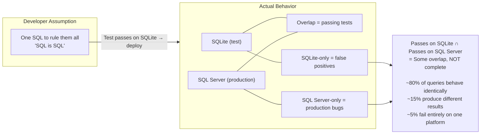
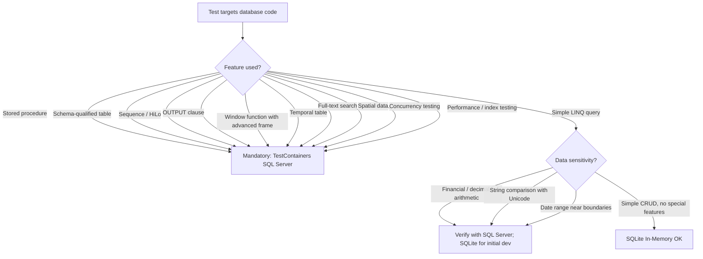

## Navigation

**Domain:** [[8 — Databases]] > **Group:** [[Group 33 — Database Testing]] **Previous:** [[8.947 — SQLite In-Memory — EF Core Testing]] | **Next:** [[8.949 — Test Data Builders — Fluent Object Creation]]

### Prerequisites

[[8.947 — SQLite In-Memory — EF Core Testing]] shows the setup pattern that this topic critically evaluates. You should understand how SQLite In-Memory is used in tests before reading about where it fails. [[8.943 — Integration Testing — Real Database]] provides the baseline expectation of what a "real database test" should verify.

### Where This Fits

SQLite In-Memory is the most popular EF Core testing strategy because it is fast, portable, and requires no infrastructure. But it is also the most dangerous because it creates a false sense of security — tests pass on a developer's machine and in CI, yet the same code produces wrong results or runtime exceptions against SQL Server in production. This topic catalogues every significant divergence between SQLite and SQL Server, shows concrete examples of tests that pass on one but fail on the other, and provides a decision framework for when SQLite is sufficient and when you must test against real SQL Server. Understanding these limitations separates teams that discover database compatibility bugs in development from teams that discover them through production incidents.

---

## Core Mental Model

SQLite and SQL Server are both relational database engines that implement the SQL standard, but they diverged decades ago in architecture, feature set, and behavioral defaults. SQLite prioritizes embedded simplicity — a single C library that compiles into any application, with no server process, no configuration, and a minimal footprint. SQL Server prioritizes enterprise capabilities — high concurrency, advanced indexing, rich T-SQL extensions, and deep integration with the Windows/.NET ecosystem. The gap between them is not a matter of SQLite being "incomplete" — it is a deliberate design tradeoff. SQLite is not a subset of SQL Server; it is a different engine with different semantics that happens to share a similar SQL dialect. Treating it as a SQL Server mock or substitute in tests inevitably produces false positives — tests that pass on SQLite but would fail or produce different results on SQL Server.

### Classification

**For .NET test strategy:** This topic is a reference catalog of known divergences. It does not provide a single answer ("never use SQLite") or a blanket endorsement ("SQLite is sufficient"). Instead, it gives you a per-feature assessment so you can decide, for each test, whether SQLite's behavior matches SQL Server's closely enough for that specific assertion. What it hides from the developer: the illusion that "SQL is SQL" — most developers assume SQLite and SQL Server behave identically until they encounter their first false-positive test failure in production. Where the abstraction leaks: EF Core's SQLite provider does an excellent job of translating LINQ to SQLite SQL, but the SQLite engine evaluates that SQL differently from SQL Server.



### Key Properties

|Property|SQLite|SQL Server|Divergence Impact|
|---|---|---|---|
|SQL dialect|SQLite-specific dialect|T-SQL|Some SQL syntax is not portable — `LIMIT` vs `TOP`, `datetime('now')` vs `GETUTCDATE()`|
|Data types|Storage classes (TEXT, REAL, INTEGER, BLOB, NULL)|Strict type system (INT, DECIMAL, NVARCHAR, DATETIME2, etc.)|Implicit type coercion differs; SQLite accepts invalid data that SQL Server rejects|
|Decimal precision|REAL (64-bit double) for all numeric|Exact DECIMAL(p,s) with configurable precision|Floating-point rounding differs from exact decimal arithmetic|
|Constraints|OFF by default; must opt in|ON by default; cannot opt out|FK violations silently accepted in SQLite unless PRAGMA foreign_keys=ON|
|Concurrency|Single-writer (database-level lock)|MVCC with row-level locking|Concurrency tests on SQLite are meaningless for SQL Server behavior|
|Stored procedures|Not supported|Fully supported|All sproc tests must target SQL Server|
|Functions|Minimal built-in function set|Extensive built-in and CLR function library|Queries using SQL Server functions (STRING_AGG, FORMAT, etc.) fail on SQLite|

---

## Deep Mechanics

### SQLite vs SQL Server — Feature Comparison Table

|Feature|SQLite|SQL Server|Test Impact|
|---|---|---|---|
|Stored procedures|Not supported|`CREATE PROCEDURE`|Cannot test sproc execution. EF Core `FromSqlRaw` with sproc calls throw at runtime on SQLite.|
|User-defined functions|`CREATE FUNCTION` not supported|`CREATE FUNCTION` (T-SQL + CLR)|Queries that call UDFs in LINQ throw.|
|Schemas|Single namespace|Multiple schemas (`dbo`, `sales`, etc.)|EF Core `ToTable("Orders", "sales")` fails on SQLite.|
|Sequences|Not supported|`CREATE SEQUENCE`|EF Core `UseSequence()` throws. HiLo key generation fails.|
|IDENTITY|`INTEGER PRIMARY KEY AUTOINCREMENT`|`INT IDENTITY(1,1)`|Behavior similar but differences in gaps and seed reset.|
|`TRUNCATE TABLE`|Not supported (use `DELETE FROM`)|`TRUNCATE TABLE`|`DELETE FROM` is slower and does not reset identity.|
|`OUTPUT` clause|Not supported|`OUTPUT inserted.*`|`FromSqlRaw` with `OUTPUT` fails at runtime.|
|`MERGE` (upsert)|`INSERT ... ON CONFLICT` (3.24+)|`MERGE`|Syntax differs. LINQ `SaveChanges` with upsert pattern generates different SQL.|
|`TOP`|Not supported (use `LIMIT`)|`TOP n`|EF Core generates `LIMIT` for SQLite, which works but produces different query plans.|
|Window functions|3.25+ (basic support)|Full support|Pre-3.25 SQLite cannot run `ROW_NUMBER()`, `RANK()`. Even 3.25+ has limited frame support.|
|`STRING_AGG`|3.33+ (`group_concat`)|`STRING_AGG` (2017+)|Pre-3.33: use `group_concat` which has different ordering behavior.|
|`FOR XML`|Not supported|`FOR XML PATH`|Cannot test XML generation queries.|
|`PIVOT` / `UNPIVOT`|Not supported|`PIVOT` / `UNPIVOT`|Pivot queries in LINQ may generate `PIVOT` for SQL Server and fail on SQLite.|
|Full-text search|FTS5 extension (separate)|`FULLTEXT INDEX`|FTS queries use different syntax and operators.|
|Temporal tables|Not supported|System-versioned temporal tables|EF Core temporal table queries fail on SQLite.|
|Graph tables|Not supported|`NODE` / `EDGE` tables|Graph queries cannot run on SQLite.|
|Spatial data|Not supported (no PostGIS analog)|`geometry` / `geography` types|Spatial queries in LINQ (NetTopologySuite) fail on SQLite.|
|Change tracking / CDC|Not supported|`CHANGE_TRACKING`, CDC|Tests relying on change tracking data fail.|
|Backup / restore|`.backup` command|`BACKUP` / `RESTORE`|N/A for testing.|

### SQLite vs SQL Server — Behavioral Differences

#### DateTime Handling

SQLite has no native datetime type. It stores dates as TEXT (`yyyy-MM-dd HH:mm:ss.FFFFFF`), REAL (Julian day), or INTEGER (Unix timestamp). EF Core's SQLite provider uses TEXT format by default. SQL Server has `DATETIME`, `DATETIME2`, `SMALLDATETIME`, `DATE`, `TIME`, `DATETIMEOFFSET`.

```csharp
// Entity
public class Event
{
    public int Id { get; set; }
    public DateTime Timestamp { get; set; }
}

// Test that passes on SQLite, fails on SQL Server:
[Fact]
public async Task DateTime_RoundTrip_KindPreservation()
{
    await using var context = _fixture.CreateContext();
    var original = new DateTime(2024, 6, 15, 10, 0, 0, DateTimeKind.Utc);
    context.Set<Event>().Add(new Event { Timestamp = original });
    await context.SaveChangesAsync();
    var saved = await context.Set<Event>().Select(e => e.Timestamp).FirstAsync();

    // SQLite: saved.Kind == DateTimeKind.Unspecified (TEXT storage loses Kind)
    // SQL Server: saved.Kind == DateTimeKind.Utc (preserved via DATETIME2)
    Assert.Equal(DateTimeKind.Utc, saved.Kind);
    // ✅ Passes on SQL Server
    // ❌ Fails on SQLite — Kind is Unspecified
}
```

**Range differences:**

|Type|SQLite (TEXT)|SQL Server DATETIME2|SQL Server DATETIME|
|---|---|---|---|
|Min value|0000-01-01 (no lower limit)|0001-01-01|1753-01-01|
|Max value|9999-12-31|9999-12-31|9999-12-31|
|Precision|Milliseconds (default)|100 nanoseconds|~3.33 ms|
|Time zone|None stored|None stored (DATETIME2)|None|
|Offset|Not supported|DATETIMEOFFSET|Not supported|

**Production bug scenario:**
- Test inserts `DateTime.MinValue` (`0001-01-01`) as a sentinel value — passes on SQLite.
- Production SQL Server column is `DATETIME` (not `DATETIME2`) — throws `SqlException: The conversion of a datetime2 data type to a datetime data type resulted in an out-of-range value` because `DATETIME` minimum is `1753-01-01`.

#### String Comparison

SQLite's default BINARY collation compares strings using memcmp. For ASCII characters, this is case-insensitive (memcmp doesn't distinguish case for A-Z). For Unicode characters, it is case-sensitive. SQL Server with default `SQL_Latin1_General_CP1_CI_AS` is case-insensitive for all characters.

```csharp
[Fact]
public async Task StringComparison_UnicodeCaseInsensitivity()
{
    await using var context = _fixture.CreateContext();
    context.Set<Event>().Add(new Event { Name = "Élan" });
    await context.SaveChangesAsync();

    // Query with different case on the accented character
    var result = await context.Set<Event>()
        .FirstOrDefaultAsync(e => e.Name == "élan");

    // SQLite (BINARY collation): ❌ fails — 'É' (U+00C9) ≠ 'é' (U+00E9)
    // SQL Server (CI collation): ✅ passes — case-insensitive
    Assert.NotNull(result);
}
```

**Collation comparison:**

|Character|SQLite BINARY|SQLite NOCASE|SQL Server CI_AS|
|---|---|---|---|
|`'A'` vs `'a'`|Equal|Equal|Equal|
|`'É'` vs `'é'`|Not equal|Equal|Equal|
|`'A'` vs `'B'`|Not equal|Not equal|Not equal|
|`'strasse'` vs `'straße'`|Not equal|Depends on ICU|Equal (if accent-insensitive)|

**Production bug scenario:**
- Test filters by `e => e.Status == "active"` — passes on SQLite (case-insensitive for ASCII).
- Production has a row with `Status = "Active"` — query misses it on SQL Server if collation is case-sensitive (`CS`). Or vice versa: query finds it on SQL Server's CI collation but the application code treats "Active" and "active" as different values.

#### Decimal Precision

SQLite has no fixed-precision decimal type. `DECIMAL(18,2)` in DDL is accepted but stored as `REAL` (64-bit double). SQL Server's `DECIMAL(p,s)` is stored as a fixed-precision integer scaled by a power of 10.

```csharp
[Fact]
public async Task Decimal_Division_RoundingBehavior()
{
    await using var context = _fixture.CreateContext();
    context.Set<FinancialRecord>().Add(new FinancialRecord
    {
        Amount = 1.00m,
        TaxRate = 0.07m
    });
    await context.SaveChangesAsync();

    var result = await context.Set<FinancialRecord>()
        .Select(r => r.Amount * r.TaxRate)
        .FirstAsync();

    // Expected: 0.07m
    // SQLite: 0.06999999999999999 (double precision error)
    // SQL Server: 0.07 (exact decimal arithmetic)
    Assert.Equal(0.07m, result);
    // ✅ Passes on SQL Server (exact decimal)
    // ❌ Fails on SQLite — floating-point rounding
}
```

**Which operations are affected:**
- Multiplication: `Decimal(18,2) × Decimal(18,2)` → 36 digits; double has ~15–17 significant digits.
- Division: `Decimal / Decimal` → rounding to 38 digits in SQL Server; double limited to ~15–17 significant digits.
- Aggregation: `SUM(DecimalColumn)` over 1M rows with 4 decimal places — double starts losing precision after ~100K rows.

**Production bug scenario (real):** A SaaS billing system calculates monthly charges as `(rate × days_used) / days_in_month`. On SQLite, the division produces a slightly different value due to double precision. The test asserts `total = 29.95`, which passes on SQLite but produces `29.94999999999999` on SQL Server — the billing system truncates to two decimal places, causing the amount to be `29.94` instead of `29.95`. The customer is undercharged by 1¢ every month. Accumulated over 10,000 customers, the company loses $100/month in rounded-down revenue.

#### Foreign Key Enforcement

SQLite parses FOREIGN KEY syntax but does not enforce it by default. SQL Server enforces foreign keys always — there is no way to disable it.

```csharp
[Fact]
public async Task ForeignKey_Violation_Throws()
{
    await using var context = _fixture.CreateContext();

    // Attempt to insert OrderItem referencing non-existent Order
    context.Set<OrderItem>().Add(new OrderItem
    {
        OrderId = 999, // no Order with Id=999
        ProductId = 1,
        Quantity = 1,
        UnitPrice = 10m
    });

    var exception = await Record.ExceptionAsync(() => context.SaveChangesAsync());

    // SQLite (FK off by default): ✅ no exception — orphan inserted
    // SQLite (FK on with PRAGMA): ❌ throws — foreign key violation
    // SQL Server: ❌ throws — foreign key violation, SqlException 547
    Assert.NotNull(exception);
    Assert.IsType<DbUpdateException>(exception);
}
```

**Impact:** Tests that verify FK constraint behavior silently pass on SQLite (with default settings) because the constraints are not enforced. A test designed to catch FK violations will never catch them on SQLite unless `Foreign Keys=True` is explicitly set in the connection string — and even then, only new violations are caught; existing orphaned data from previous test runs is not validated.

#### Stored Procedures and Functions

SQLite has no `CREATE PROCEDURE` or `CREATE FUNCTION` (scalar or table-valued). Any test that calls a stored procedure via EF Core `FromSqlRaw` will throw at runtime.

```csharp
// EF Core calling a stored procedure
var orders = await context.Orders
    .FromSqlRaw("EXEC GetOrdersByStatus @Status = {0}", "Pending")
    .ToListAsync();

// SQLite: ❌ SqliteException: near "EXEC": syntax error
// SQL Server: ✅ executes stored procedure

// Dapper calling a stored procedure
var orders = await conn.QueryAsync<Order>(
    "GetOrdersByStatus",
    new { Status = "Pending" },
    commandType: CommandType.StoredProcedure);

// SQLite: ❌ throws — stored procedures not supported
// SQL Server: ✅ executes stored procedure
```

**Workaround for SQLite:** None. If your application uses stored procedures, you cannot test that code path with SQLite In-Memory. You must use TestContainers SQL Server for those specific tests.

#### Sequences and HiLo Key Generation

EF Core's `UseSequence()` or `UseHiLo()` patterns generate keys using database sequences — a feature SQLite does not support.

```csharp
modelBuilder.Entity<Order>(entity =>
{
    entity.Property(o => o.OrderNumber)
        .UseSequence("OrderNumbers"); // ❌ SQLite — Not supported
});
```

**Exception on SQLite:** `NotSupportedException: SQLite does not support sequences. Use UseIdentityColumn() instead.`

**Impact:** Any entity using HiLo for key generation cannot be tested with SQLite In-Memory. Either switch to identity columns for test entities or use TestContainers SQL Server.

#### TRUNCATE TABLE

SQLite does not support `TRUNCATE TABLE`. The equivalent is `DELETE FROM` (without a `WHERE` clause), which is slower and does not reset the auto-increment counter. Respawn's data reset strategy — which depends on TRUNCATE — is less effective on SQLite.

```sql
-- SQL Server (fast, reseeds identity):
TRUNCATE TABLE Orders;

-- SQLite equivalent (slower, does NOT reseed):
DELETE FROM Orders;

-- SQLite reseed identity after DELETE:
DELETE FROM sqlite_sequence WHERE name = 'Orders';
```

**Performance impact:** `DELETE FROM` on a 100K row table logs every row deletion. On file-based SQLite, this is ~50ms; on in-memory SQLite, it is ~10ms — still slower than SQL Server's TRUNCATE at ~1ms for the same table.

#### Window Functions

SQLite added window function support in version 3.25.0 (September 2018). Older versions throw syntax errors. Even with 3.25+, SQLite's window function support is limited compared to SQL Server:

|Window Feature|SQLite 3.25+|SQL Server|
|---|---|---|
|`ROW_NUMBER()`|Supported|Supported|
|`RANK()` / `DENSE_RANK()`|Supported|Supported|
|`NTILE()`|Supported|Supported|
|`LAG()` / `LEAD()`|Supported|Supported|
|`FIRST_VALUE()` / `LAST_VALUE()`|Supported|Supported|
|`ROWS` / `RANGE` frames|Limited|Full support|
|`GROUPS` frame|Not supported|Supported (2012+)|
|`EXCLUDE` clause|Not supported|Supported (2022+)|
|`FROM FIRST` / `FROM LAST`|Not supported|N/A|

**Production bug scenario:** A reporting query uses `SUM(Amount) OVER (ORDER BY Date ROWS BETWEEN UNBOUNDED PRECEDING AND CURRENT ROW EXCLUDE CURRENT ROW)` — the `EXCLUDE` clause is not supported by SQLite even at 3.25+, but the test does not reach that code path. In production, the query runs correctly on SQL Server but was never tested because SQLite covered the standard case.

#### Full-Text Search

SQLite's FTS5 extension is a separate module that must be enabled at compile time. SQL Server's Full-Text Search is integrated and supports the `CONTAINS` and `FREETEXT` predicates — which have no SQLite equivalent.

```csharp
// EF Core query using Full-Text Search
var results = await context.Products
    .Where(p => EF.Functions.Contains(p.Description, "laptop"))
    .ToListAsync();

// SQLite: ❌ throws — CONTAINS is not recognized
// SQL Server: ✅ executes Full-Text Search query
```

#### OUTPUT Clause

SQL Server's `OUTPUT` clause returns values from inserted, updated, or deleted rows. SQLite has no equivalent. EF Core's `SaveChanges` does not generate `OUTPUT` clauses for default operations, but explicit `FromSqlRaw` calls using `OUTPUT` will fail.

```csharp
const string sql = @"
    INSERT INTO Orders (CustomerName, Total, Status)
    OUTPUT inserted.Id
    VALUES (@CustomerName, @Total, @Status)";

var orderId = await conn.QuerySingleAsync<int>(sql, new { CustomerName = "A", Total = 100m, Status = "New" });

// SQLite: ❌ SqliteException: near "OUTPUT": syntax error
// SQL Server: ✅ returns the inserted Id
```

#### PIVOT / UNPIVOT

SQL Server supports the `PIVOT` and `UNPIVOT` relational operators. SQLite does not.

```sql
-- SQL Server:
SELECT Category, [2023] AS Sales2023, [2024] AS Sales2024
FROM Sales
PIVOT (
    SUM(Amount)
    FOR Year IN ([2023], [2024])
) AS pvt;

-- SQLite equivalent (manual aggregation):
SELECT Category,
       SUM(CASE WHEN Year = 2023 THEN Amount ELSE 0 END) AS Sales2023,
       SUM(CASE WHEN Year = 2024 THEN Amount ELSE 0 END) AS Sales2024
FROM Sales
GROUP BY Category;
```

#### Indexing Differences

|Index Feature|SQLite|SQL Server|
|---|---|---|
|Filtered indexes|Not supported|`CREATE INDEX ... WHERE Status = 'Active'`|
|INCLUDE columns|Not supported|`CREATE INDEX ... INCLUDE (Name, Price)`|
|Columnstore indexes|Not supported|`CREATE CLUSTERED COLUMNSTORE INDEX`|
|Full-text indexes|FTS5 (separate module)|`CREATE FULLTEXT INDEX`|
|Spatial indexes|Not supported|`CREATE SPATIAL INDEX`|
|Hash indexes|Not directly|`CREATE NONCLUSTERED HASH INDEX` (memory-optimized)|

**Impact:** A query that relies on a filtered index for performance will produce different execution plans on SQLite vs SQL Server. Tests using SQLite cannot verify that the correct index is being used.

---

## Production Patterns and Implementation

### Tests That Pass on SQLite But Fail on SQL Server — Catalog

#### 1. Schema Qualification

```csharp
// EF Core entity mapped to a schema-qualified table
modelBuilder.Entity<Order>(entity =>
{
    entity.ToTable("Orders", "sales"); // "sales" schema
});

// Test on SQLite: ❌ throws — schemas not supported
// The test never runs, so the developer assumes it's fine.
// Actual production query: FROM [sales].[Orders] — works on SQL Server.
```

#### 2. Sequence-Based Key Generation

```csharp
modelBuilder.Entity<Invoice>(entity =>
{
    entity.Property(i => i.InvoiceNumber)
        .UseSequence("InvoiceSeq");
});

// Test on SQLite: ❌ throws — sequences not supported
// Developer adds #if !TEST conditional — test never exercises the code.
```

#### 3. Stored Procedure Execution

```csharp
// Repository method
public async Task<IReadOnlyList<Order>> GetPendingOrdersAsync()
{
    return (await _connection.QueryAsync<Order>(
        "usp_GetPendingOrders", commandType: CommandType.StoredProcedure)).AsList();
}

// Test on SQLite: ❌ throws — stored procedures not supported
// Test is skipped or mocked — no real verification.
```

#### 4. Decimal Precision in Aggregations

```csharp
// Query: average of 100K transactions
var avg = await context.Transactions
    .Select(t => t.Amount)
    .AverageAsync();

// SQLite (double): slight floating-point rounding (differs at 15th significant digit)
// SQL Server (decimal): exact arithmetic
// If the test asserts Assert.Equal(expected, avg), it may fail when run against SQL Server
// even though the SQLite version of the same query passed.
```

#### 5. DateTime.MinValue

```csharp
// Default value for a non-nullable DateTime property
public class Record
{
    public int Id { get; set; }
    public DateTime CreatedAt { get; set; } // defaults to 0001-01-01
}

// Test: insert without setting CreatedAt
context.Records.Add(new Record { /* CreatedAt not set */ });
await context.SaveChangesAsync();

// SQLite: ✅ saves 0001-01-01 as TEXT
// SQL Server (DATETIME column): ❌ SqlException: out-of-range value
// SQL Server (DATETIME2 column): ✅ saves 0001-01-01
```

#### 6. String Truncation

```csharp
// Entity property
public class Product
{
    public int Id { get; set; }
    [MaxLength(10)]
    public string Code { get; set; } = "";
}

// Test: insert value longer than max length
context.Products.Add(new Product { Code = "TOO-LONG-CODE" });
await context.SaveChangesAsync();

// SQLite: ✅ saves the full string (no length enforcement)
// SQL Server: ❌ SqlException: String or binary data would be truncated
```

### Real Production Bugs Caused by SQLite-Only Testing

**Case Study 1 — Decimal precision in billing.** A SaaS company used SQLite In-Memory for all integration tests. A billing calculation computed a daily rate: `monthlyRate / daysInMonth * daysUsed`. On SQLite, the division produced a double-precision result that happened to round to the correct 2-decimal value in their test data. In production with SQL Server, the same calculation produced `29.94999999999999`, which `Math.Round(..., 2, MidpointRounding.ToEven)` rounded to `29.94` instead of `29.95`. The company under-billed every customer by $0.01/month for 6 months before the discrepancy was noticed in a manual audit.

**Case Study 2 — DateTime Kind in reporting.** A logistics company stored timestamps as `DateTime` with `DateTimeKind.Utc`. SQLite's TEXT storage lost the `Kind`, so the round-trip test passed. In production, a reporting query that filtered by `WHERE OrderDate >= @Start` used the UTC value correctly. But a different code path that called `.ToLocalTime()` on the retrieved `DateTime` (which had `Kind = Unspecified` on SQLite but `Kind = Utc` on SQL Server) produced different results in development vs production. The bug was only caught when a customer noticed that their local-time reports were off by the UTC offset.

**Case Study 3 — FK constraint not enforced.** A fintech startup tested all data integrity logic with SQLite. Their repository included a delete that should cascade — the test passed, proving the cascade worked. In production, a `DELETE FROM Customers` threw a FK violation because an orphan `OrderItem` referenced a deleted product, not a deleted customer. The cascade was configured on the wrong relationship. SQLite did not enforce the FK at all, so the test never caught it. The production database had to be restored from backup and the bug fixed with a schema migration.

**Case Study 4 — String comparison in search.** An e-commerce site allowed searching by product name. The test used SQLite In-Memory and searched for "laptop" — it matched "Laptop" (case-insensitive, ASCII). In production (SQL Server with Latin1_General_CI_AS), it also matched "Laptop". But a search for "cafe" in French failed to match "café" because SQLite's BINARY collation treats `e` (U+0065) and `é` (U+00E9) as different characters, while SQL Server's CI_AS treats them as equivalent. The test never caught the missing accent-insensitive behavior.

**Case Study 5 — MAXDOP / parallelism.** A data warehouse query used a CTE with multiple aggregations. The test passed on SQLite in ~50ms. In production, SQL Server chose a parallel plan that deadlocked under load due to a missing index. The SQLite test never exercised the query optimizer's choices, so the deadlock was only discovered during load testing, two weeks before launch.

### EF Core Provider Differences — SQL Generation

EF Core generates different SQL for SQLite vs SQL Server. Some queries that execute correctly on one provider produce invalid SQL on the other:

```csharp
// LINQ query with DateTime comparison
var orders = await context.Orders
    .Where(o => o.OrderDate == someDate.Date)
    .ToListAsync();

// SQL Server generated SQL:
// WHERE CAST([o].[OrderDate] AS date) = @p
// ✅ Works

// SQLite generated SQL:
// WHERE CAST([o].[OrderDate] AS TEXT) = @p  -- ❌ incorrect comparison!
// SQLite stores dates as TEXT, casting to TEXT produces a full timestamp string
// The comparison only works if @p has exactly the right format
```

```csharp
// LINQ query with string.Length
var longNames = await context.Products
    .Where(p => p.Name.Length > 100)
    .ToListAsync();

// SQL Server: LEN([p].[Name]) > 100
// SQLite: LENGTH([p].[Name]) > 100
// Both work, but LEN and LENGTH have different whitespace handling:
// LEN excludes trailing spaces, LENGTH counts them.
```

### Dapper Differences with SQLite vs SQL Server

```csharp
// Dapper query that works on SQL Server but not SQLite
var results = await conn.QueryAsync<Order>(@"
    SELECT TOP 10 Id, CustomerName, Total
    FROM Orders
    ORDER BY Total DESC");

// SQLite: ❌ near "TOP": syntax error
// Fix for SQLite:
var results = await conn.QueryAsync<Order>(@"
    SELECT Id, CustomerName, Total
    FROM Orders
    ORDER BY Total DESC
    LIMIT 10");

// Parameter naming — SQLite uses @ prefix, same as SQL Server (same ADO.NET convention)
// But SQLite does not support named parameters with dot notation:
await conn.QueryAsync("SELECT * FROM Orders WHERE Total > @Min", new { Min = 100m });
// ✅ Works on both SQLite and SQL Server

// SQLite does not support table-valued parameters (DataTable parameters)
// This will throw on SQLite:
var dt = new DataTable();
// ... populate
await conn.ExecuteAsync("sp_BulkInsert @Items", new { Items = dt.AsTableValuedParameter("dbo.OrderType") });
// SQLite: ❌ Not supported
```

### Configuration and Wiring — Conditional Provider Selection

```csharp
// Strategy: use SQLite for fast tests, SQL Server for critical tests
// The fixture selects the provider at construction time

public abstract class DatabaseTestFixture : IAsyncLifetime
{
    protected abstract string Provider { get; } // "Sqlite" or "SqlServer"

    public DbContextOptions<TestDbContext> Options { get; private set; } = null!;
    public string ConnectionString { get; private set; } = "";

    public async Task InitializeAsync()
    {
        if (Provider == "Sqlite")
        {
            var connection = new SqliteConnection("DataSource=:memory:;Foreign Keys=True");
            connection.Open();
            ConnectionString = "DataSource=:memory:;Foreign Keys=True";
            Options = new DbContextOptionsBuilder<TestDbContext>()
                .UseSqlite(connection)
                .Options;
        }
        else
        {
            var container = new MsSqlBuilder()
                .WithImage("mcr.microsoft.com/mssql/server:2022-latest")
                .Build();
            await container.StartAsync();
            ConnectionString = container.GetConnectionString();
            Options = new DbContextOptionsBuilder<TestDbContext>()
                .UseSqlServer(ConnectionString)
                .Options;
        }
    }

    public abstract Task DisposeAsync();
}

// Use environment variable to switch provider:
// dotnet test --environment "TEST_DATABASE_PROVIDER=SqlServer"
public class IntegrationTests : IClassFixture<SqlServerFixture>
{
    // These tests always run against real SQL Server
}

public class FastLinqTests : IClassFixture<SqliteFixture>
{
    // These tests run against SQLite for speed
}
```

---

## Gotchas and Production Pitfalls

### SQLite Allows Invalid Data That SQL Server Rejects

SQLite is lenient about data types. You can insert a string into an INTEGER column, and SQLite will store it (using its "type affinity" system). SQL Server is strict — if the column is `INT`, a non-numeric string is rejected.

```csharp
// Dapper raw insert — works on SQLite but fails on SQL Server
await conn.ExecuteAsync(
    "INSERT INTO Products (Id, Name, Price) VALUES (1, 'Widget', 'not-a-number')");

// SQLite: ✅ stores 'not-a-number' as TEXT in a REAL type-affinity column
// SQL Server: ❌ SqlException: Conversion failed when converting the varchar value 'not-a-number' to data type decimal.
```

### SQLite DateTime Range Is Broader Than SQL Server's DATETIME

SQLite stores any valid ISO 8601 string as a date. SQL Server's `DATETIME` (not `DATETIME2`) has a minimum of `1753-01-01`. A test that inserts a date before 1753 passes on SQLite but fails on SQL Server.

```csharp
// Inserting a very old date
context.Records.Add(new HistoricalRecord { EventDate = new DateTime(1066, 10, 14) });
await context.SaveChangesAsync();

// SQLite: ✅ stores '1066-10-14' as TEXT
// SQL Server (DATETIME column): ❌ SqlException: out-of-range value
// SQL Server (DATETIME2 column): ✅ stores 1066-10-14
```

### SQLite Is Single-Writer — Concurrency Tests Are Meaningless

SQLite serializes all write operations using a database-level lock. Two concurrent `INSERT` statements execute sequentially. SQL Server with default `READ COMMITTED` uses row-level locking and MVCC, allowing concurrent writes to different rows.

```csharp
// Concurrent write test — passes on SQLite, fails on SQL Server with deadlock
var task1 = InsertOrderAsync(1, "Alice");
var task2 = InsertOrderAsync(2, "Bob");
await Task.WhenAll(task1, task2);

// SQLite: ✅ both succeed — writes are serialized
// SQL Server: ❌ may deadlock if both touch the same page or index
```

### SQLite Does Not Support Computed Columns with PERSISTED

```csharp
modelBuilder.Entity<Order>(entity =>
{
    entity.Property(o => o.TotalWithTax)
        .HasComputedColumnSql("[Total] * 1.2", persisted: true);
});

// SQL Server: ✅ creates PERSISTED computed column
// SQLite: ❌ does not recognize persisted: true — silently ignores it
// The column exists but is not persisted — behavior differs
```

### EF Core Migrations SQL Is Provider-Specific

```csharp
// EF Core migration that runs against SQL Server
migrationBuilder.CreateTable(
    name: "Orders",
    schema: "sales", // ❌ SQLite does not support schemas
    columns: table => new
    {
        Id = table.Column<int>(type: "int", nullable: false)
            .Annotation("SqlServer:Identity", "1, 1"),
        // ...
    });
```

Running `dotnet ef migrations script` generates SQL Server-specific SQL. Attempting to run this migration against a SQLite database (for testing) will fail. Mark the migration with `migrationBuilder.ActiveProvider == "Microsoft.EntityFrameworkCore.Sqlite"` checks or maintain separate SQLite-compatible migrations.

### SQLite Does Not Support Table Hints

```csharp
// EF Core query hint — ignored by SQLite but critical for SQL Server performance
var orders = await context.Orders
    .FromSqlRaw("SELECT * FROM Orders WITH (NOLOCK) WHERE Status = 'Pending'")
    .ToListAsync();

// SQLite: ❌ SqliteException: near "WITH": syntax error
```

---

## Performance Implications

### Benchmark: SQLite vs SQL Server — Divergence Impact on Test Speed

|Operation|SQLite In-Memory|SQL Server (TestContainers)|Ratio|Notes|
|---|---|---|---|---|
|Simple SELECT (10 rows)|~1 ms|~8 ms|8x|Network + connection overhead for SQL Server|
|INSERT 1000 rows|~15 ms|~120 ms|8x|SQLite does not flush log to disk|
|DELETE all rows (100K)|~50 ms|~800 ms|16x|SQLite DELETE is fully in-memory|
|TRUNCATE (not supported on SQLite)|N/A|~5 ms|N/A|SQLite uses DELETE which is slower|
|Schema creation (10 tables)|~15 ms|~1,200 ms|80x|DDL statements over network|
|EF Core MigrateAsync|~20 ms|~3,000 ms|150x|Migration history table + DDL transactions|
|Complex join + aggregation|~5 ms|~15 ms|3x|SQL Server optimizer may produce better plan, but network dominates|

**Key insight:** SQLite is 5–150x faster than TestContainers SQL Server for all operations. But speed comes at the cost of fidelity — the 5 ms SQLite query may produce different results than the 15 ms SQL Server query. The tradeoff is between test speed and test accuracy.

### When SQLite Speed Advantage Is Dangerous

The speed advantage encourages developers to run all tests against SQLite and skip SQL Server testing entirely. This creates a blind spot. The 80x faster schema creation is meaningless if the schema behaves differently in production.

**Mitigation:** Establish a test pyramid for database tests:

```
          ┌──────────┐
          │ 5–10%    │  ← TestContainers SQL Server (critical queries, sprocs)
          │ Expensive │
         ┌┴──────────┴┐
         │ 20–30%     │  ← SQLite In-Memory (LINQ translation, mapping)
         │ Medium     │
        ┌┴────────────┴┐
        │ 60–70%        │  ← Unit tests / mocks (business logic)
        │ Fast          │
        └───────────────┘
```

---

## Interview Arsenal

### Question Bank

1. List five SQL Server features that SQLite does not support.
2. How does SQLite store `DECIMAL(18,2)` internally, and why does this matter?
3. What is the default state of foreign key enforcement in SQLite, and how does it differ from SQL Server?
4. How does SQLite handle `DateTime.Kind` when storing and retrieving dates?
5. Give a concrete example of a test that passes on SQLite but fails on SQL Server due to string comparison.
6. Why are concurrency tests on SQLite misleading?
7. What happens if you run an EF Core migration with a schema-qualified table on SQLite?
8. How does SQLite's `LIMIT` clause differ from SQL Server's `TOP`?
9. What is the impact of SQLite's lack of `TRUNCATE TABLE` on test data reset strategies?
10. When would you choose SQLite In-Memory for testing despite its limitations?

### Spoken Answers

**Q: List five SQL Server features that SQLite does not support.**

> **Average answer:** "Stored procedures, schemas, sequences, TRUNCATE TABLE, and the OUTPUT clause." Correct — this is the standard list.

> **Great answer:** "Stored procedures — no `CREATE PROCEDURE` at all, so any `FromSqlRaw` or Dapper sproc call fails. Schemas — you cannot reference `dbo.Orders` or `sales.Invoices`; everything is in a single namespace. Sequences — no `CREATE SEQUENCE`, so HiLo key generation in EF Core throws. `TRUNCATE TABLE` — SQLite uses `DELETE FROM`, which is slower and does not reset auto-increment. The `OUTPUT` clause — no way to return inserted rows in a single statement. Beyond those five, there's no `MERGE` (use `INSERT ... ON CONFLICT`), no `PIVOT`/`UNPIVOT`, no filtered indexes, no `INCLUDE` columns in indexes, no columnstore indexes, no spatial data, no full-text search (without FTS5 extension, which is not installed by default in EF Core's provider), no temporal tables, no graph tables, no change tracking, no `FOR XML`, no table-valued parameters, and window functions only in 3.25+ with limited frame support. Each gap is a potential test false-positive."

**Q: Give a concrete example of a test that passes on SQLite but fails on SQL Server.**

> **Average answer:** "A test that inserts a date before 1753." Correct but specific.

> **Great answer:** "A financial calculation test that multiplies two `decimal` columns and asserts on the result. On SQLite, `DECIMAL(18,2)` is stored as `REAL` (double-precision float), so `1.00 × 0.07` might produce `0.06999999999999999` due to floating-point rounding. On SQL Server, the same calculation with `DECIMAL(18,2)` is exact decimal arithmetic, producing exactly `0.07`. The test that asserts `Assert.Equal(0.07m, result)` passes on SQLite when the double happens to round to 0.07 (or when using tolerant comparison), but fails on SQL Server when it doesn't — or vice versa. The more dangerous scenario is when both pass but produce different values at scale — a `SUM` of 100K transactions differs by $0.01 between SQLite and SQL Server, and the test's single-row data doesn't catch it. This is exactly what happened to a SaaS billing platform that undercharged customers by $0.01/month for six months."

**Q: When would you choose SQLite In-Memory for testing despite its limitations?**

> **Average answer:** "For simple CRUD tests where speed matters." Correct.

> **Great answer:** "I use SQLite In-Memory for three specific scenarios. First, **LINQ translation verification** — to confirm that my EF Core queries compile and produce valid SQL without syntax errors. SQLite catches translation errors that the InMemory provider silently ignores. Second, **mapping configuration tests** — to verify that entity relationships, column mappings, and value conversions are configured correctly. Third, **high-volume parameterized query tests** — when I need to run hundreds of query permutations to validate dynamic sorting, filtering, and pagination logic. In all three cases, I also maintain a subset of critical tests that run against TestContainers SQL Server — usually stored procedure tests, concurrency tests, and any query that uses SQL Server-specific features like `OUTPUT`, window functions with advanced frames, or decimal aggregations with financial significance. The key is knowing where the line is: SQLite for fast feedback on LINQ shape and mapping; SQL Server for correctness of query results and database-specific behavior."

### Interview Trigger

An interviewer asks: "How do you test your EF Core queries?" The candidate mentions SQLite In-Memory. The interviewer follows up: "What happens when a query passes on SQLite but fails in production?" — this is the critical follow-up. Candidates who can name specific differences (decimal precision, datetime kind, FK enforcement) and provide a mitigation strategy (per-feature mapping, TestContainers for critical tests) demonstrate depth. Candidates who say "we've never had that problem" are either lucky or not looking carefully enough.

### Comparison Table

|Feature Area|SQLite Behavior|SQL Server Behavior|Can SQLite Catch Bugs Here?|
|---|---|---|---|
|Stored procedures|Not supported|Fully supported|❌ No — must test with SQL Server|
|Schemas|Not supported|Multi-schema (`dbo`, `sales`)|❌ No — EF Core mapping fails on SQLite|
|Sequences|Not supported|`CREATE SEQUENCE`|❌ No — EF Core HiLo throws on SQLite|
|Decimal precision|REAL (double)|Exact DECIMAL(p,s)|⚠️ Partial — most simple cases work, aggregations diverge|
|DateTime Kind|Unspecified after round-trip|Preserved|⚠️ Partial — value equality works, Kind assertion fails|
|FK enforcement|OFF by default|Always ON|⚠️ Partial — works only with explicit PRAGMA|
|String comparison|ASCII case-insensitive, Unicode case-sensitive|Case-insensitive (CI collation)|⚠️ Partial — ASCII works, Unicode diverges|
|TRUNCATE TABLE|Not supported (use DELETE)|TRUNCATE TABLE|⚠️ Partial — DELETE works but slower, no reseed|
|OUTPUT clause|Not supported|OUTPUT inserted.*|❌ No — syntax error on SQLite|
|Window functions|3.25+ basic support|Full support|⚠️ Partial — basic window functions work, advanced frames fail|
|Concurrency|Single-writer (DB-level lock)|MVCC, row-level locking|❌ No — completely misleading|
|Full-text search|FTS5 extension (separate)|FULLTEXT INDEX|❌ No — CONTAINS/FREETEXT not recognized|
|Spatial data|Not supported|geometry / geography|❌ No — NetTopologySuite queries fail|
|Filtered indexes|Not supported|CREATE INDEX WHERE|⚠️ Partial — query result is same but index usage differs|
|Temporal tables|Not supported|System-versioned|❌ No — EF Core temporal queries fail|

---

## Decision Framework

### When to Apply (Which Engine for Which Test)



### Application Checklist

- [ ] Every stored procedure call has a corresponding TestContainers SQL Server test
- [ ] Every schema-qualified table is tested with SQL Server (or schema condition is removed for SQLite)
- [ ] Every sequence-based key generation is tested with SQL Server
- [ ] Decimal precision is verified on SQL Server for financial calculations
- [ ] DateTime boundary values (MinValue, near 1753) are tested against SQL Server
- [ ] FK constraint enforcement tests explicitly set `Foreign Keys=True` for SQLite
- [ ] Unicode string comparison tests are verified on SQL Server
- [ ] Concurrency tests only run against SQL Server
- [ ] A CI step runs the "critical" subset of tests against TestContainers SQL Server
- [ ] The team knows which tests are SQLite-only vs SQL Server vs both

### Tradeoff Summary

|Approach|Speed|SQL Server Fidelity|When to Use|
|---|---|---|---|
|SQLite In-Memory|~5x–150x faster|~80% of features match|LINQ translation, mapping, high-volume parameterized queries|
|SQLite + TestContainers for critical subset|Good for bulk + accurate for critical|~100% for critical path|Recommended default strategy|
|TestContainers SQL Server only|~1x baseline|100%|Small test suites, stored procedure-heavy apps, financial systems|
|EF Core InMemory only|Fastest|~0% of features match|Unit tests only — never for database behavior verification|

### Scale Thresholds

- **Small apps (< 20 tables, < 50 queries):** SQLite In-Memory for 80% of tests + TestContainers SQL Server for stored procedures and edge cases. Acceptable risk.
- **Medium apps (20–100 tables, 50–500 queries):** SQLite for LINQ shape + TestContainers SQL Server for all financial, date-sensitive, and concurrency tests. Maintain a CI matrix that runs the test suite against both providers.
- **Large apps (100+ tables, 500+ queries, financial domain):** SQLite is insufficient for any test that touches money, dates, or strings. Use TestContainers SQL Server as the default, with SQLite only for trivial mapping tests. The cost of slower test execution is justified by the cost of a production billing error.

---

## Self-Check

### Conceptual Questions

1. What storage class does SQLite use for `DECIMAL(18,2)` columns, and why does this matter?
2. What is the default state of foreign key enforcement in SQLite?
3. How do you enable foreign key enforcement in SQLite?
4. What happens to `DateTime.Kind` after round-tripping through SQLite?
5. Which SQL Server features are completely unsupported by SQLite? (Name at least 5)
6. What is the SQLite equivalent of `TRUNCATE TABLE`, and what are its limitations?
7. How does SQLite string comparison differ from SQL Server's default collation for Unicode characters?
8. Why are concurrency tests on SQLite misleading?
9. How does SQLite handle `OUTPUT` clauses in SQL statements?
10. What is the recommended strategy for testing database code that uses both LINQ and stored procedures?

<details>
<summary>Answers</summary>

1. SQLite stores all numeric types (including `DECIMAL`) as `REAL` (64-bit IEEE double-precision floating point). This means decimal arithmetic is approximate, not exact. `DECIMAL(18,2)` in SQL Server is exact, stored as a scaled integer. The difference matters for financial calculations where rounding errors compound.
2. Foreign key enforcement is OFF by default in SQLite. SQL Server enforces FKs always — there is no way to disable them.
3. Set `Foreign Keys=True` in the connection string (`"DataSource=:memory:;Foreign Keys=True"`) or execute `PRAGMA foreign_keys = ON;` after opening the connection.
4. SQLite stores `DateTime` as TEXT in ISO 8601 format (`yyyy-MM-dd HH:mm:ss.FFFFFF`). After round-trip, `DateTime.Kind` is always `Unspecified`. The value (as absolute instant in time) is preserved, but the kind information is lost.
5. Stored procedures, schemas, sequences, `OUTPUT` clause, `TRUNCATE TABLE`, `MERGE` (native), `PIVOT`/`UNPIVOT`, temporal tables, graph tables, full-text search (built-in), spatial data, filtered indexes, columnstore indexes, change tracking, table-valued parameters, `FOR XML`, `TOP` (use `LIMIT`).
6. `DELETE FROM TableName`. Unlike `TRUNCATE TABLE`, it does not reset auto-increment counters, it is fully logged (slower), and it does not deallocate pages. To reseed identity in SQLite after DELETE: `DELETE FROM sqlite_sequence WHERE name = 'TableName'`.
7. SQLite's BINARY collation (default) compares using memcmp. For ASCII characters, this is case-insensitive. For Unicode characters (e.g., 'É' vs 'é'), it is case-sensitive. SQL Server's default collation (`Latin1_General_CP1_CI_AS`) is case-insensitive for all characters including Unicode. SQL Server also supports accent-insensitive, kana-insensitive, and width-insensitive comparisons.
8. SQLite serializes all write operations using a single database-level lock. Two concurrent writes execute sequentially. SQL Server uses MVCC with row-level locking, allowing concurrent writes to different rows. A concurrency test that passes on SQLite may deadlock on SQL Server because the locking behavior is fundamentally different.
9. SQLite does not support the `OUTPUT` clause. Any query using `OUTPUT inserted.*` or `OUTPUT deleted.*` will throw a syntax error on SQLite. Use `RETURNING` (SQLite 3.35+) or a separate SELECT after the modification.
10. Use a hybrid approach: SQLite In-Memory for fast tests of LINQ translation, mapping, and simple CRUD. Maintain a separate set of critical tests that run against TestContainers SQL Server — covering stored procedures, schema-qualified queries, sequence generation, financial calculations, concurrency, and any feature that SQLite does not support. Run the SQLite suite on every commit; run the SQL Server suite before merging to the main branch and in nightly CI.

</details>

---

### Query Challenges

**Challenge 1 — Identify the SQLite false positive**

```csharp
// This test passes on SQLite In-Memory but produces wrong results on SQL Server.
// Identify the feature divergence and fix it.
[Fact]
public async Task GetTopProducts_ReturnsHighestPriced()
{
    await using var context = _fixture.CreateContext();
    context.Products.AddRange(
        new Product { Name = "A", Price = 10m },
        new Product { Name = "B", Price = 100m },
        new Product { Name = "C", Price = 50m });
    await context.SaveChangesAsync();

    var topProduct = await context.Products
        .OrderByDescending(p => p.Price)
        .FirstOrDefaultAsync();

    Assert.Equal("B", topProduct?.Name);
    Assert.Equal(100m, topProduct?.Price);
}
```

<details>
<summary>Solution</summary>

**This specific test is likely fine** — it uses standard LINQ operators that both SQLite and SQL Server support identically. This is a trick question: not every query diverges. The test above passes on both engines because `OrderByDescending` + `FirstOrDefault` translates to `ORDER BY Price DESC LIMIT 1` (SQLite) or `SELECT TOP 1 ... ORDER BY Price DESC` (SQL Server), both of which return the same result.

**The real divergence would appear if:**
- The query used `TOP` directly in `FromSqlRaw` (syntax error on SQLite)
- The query used a window function with a custom frame (results differ)
- The price column had more decimal places and the aggregation involved division (rounding differs)

**Moral:** Not every LINQ query is affected by SQLite divergence. The key is knowing which patterns are safe and which are not.

</details>

---

**Challenge 2 — Write a test that works on both SQLite and SQL Server**

Your team wants a single test that can run against both SQLite In-Memory (fast CI) and TestContainers SQL Server (nightly). The query uses `STRING_AGG` to concatenate product names for each category. Write the test and handle the compatibility gap.

<details>
<summary>Solution</summary>

**Problem:** `STRING_AGG` is not available in SQLite before 3.33.0, and even then, SQLite's equivalent is `group_concat`, which has different ordering semantics.

**Solution — Use EF Core LINQ (which abstracts the provider):**

```csharp
[Fact]
public async Task CategoryProductNames_AreConcatenated()
{
    await using var context = _fixture.CreateContext();

    context.Categories.Add(new Category { Id = 1, Name = "Tools" });
    context.Products.AddRange(
        new Product { Name = "Hammer", Price = 15m, CategoryId = 1 },
        new Product { Name = "Saw", Price = 25m, CategoryId = 1 });
    await context.SaveChangesAsync();

    // Use LINQ — EF Core translates to STRING_AGG or group_concat
    // depending on the provider
    var result = await context.Categories
        .Where(c => c.Id == 1)
        .Select(c => string.Join(", ",
            c.Products.OrderBy(p => p.Name).Select(p => p.Name)))
        .FirstAsync();

    Assert.Equal("Hammer, Saw", result);
}

// Alternative — use a compatibility layer:
public static class QueryHelpers
{
    public static IQueryable<string> ConcatNames(
        IQueryable<Category> categories)
    {
        if (categories is null) throw new ArgumentNullException(nameof(categories));
        // EF Core translates string.Join to STRING_AGG on SQL Server
        // and group_concat on SQLite
        return categories
            .Where(c => c.Products.Any())
            .Select(c => string.Join(", ",
                c.Products.OrderBy(p => p.Name).Select(p => p.Name)));
    }
}
```

**For raw SQL queries with Dapper,** you need provider-specific SQL:

```csharp
public async Task<string> GetConcatenatedNamesAsync(
    IDbConnection conn, int categoryId)
{
    string sql;
    if (conn is SqliteConnection)
    {
        sql = @"
            SELECT group_concat(p.Name, ', ')
            FROM Products p
            WHERE p.CategoryId = @Id
            ORDER BY p.Name"; // group_concat does NOT guarantee order
    }
    else
    {
        sql = @"
            SELECT STRING_AGG(p.Name, ', ') WITHIN GROUP (ORDER BY p.Name)
            FROM Products p
            WHERE p.CategoryId = @Id";
    }
    return await conn.QuerySingleAsync<string>(sql, new { Id = categoryId });
}
```

</details>

---

**Challenge 3 — Prevent the silent decimal bug**

Your financial application computes daily interest as `principal * (rate / 365)`. Write a test that ensures this calculation produces the same result on both SQLite (for fast testing) and SQL Server (for accuracy).

<details>
<summary>Solution</summary>

```csharp
// Step 1: Tolerance-based assertion that works on both providers
[Fact]
public async Task DailyInterest_Rounding_WithinTolerance()
{
    await using var context = _fixture.CreateContext();

    // Use a large principal to expose precision differences
    context.Set<Account>().Add(new Account
    {
        Id = 1,
        Principal = 9_999_999.99m,
        AnnualRate = 0.0725m // 7.25%
    });
    await context.SaveChangesAsync();

    var interest = await context.Set<Account>()
        .Select(a => a.Principal * (a.AnnualRate / 365.0m))
        .FirstAsync();

    // Expected: 9_999_999.99 * (0.0725 / 365)
    // = 9_999_999.99 * 0.000198630... = 1,986.301...
    // Round to 2 decimal places: 1,986.30 (banker's rounding)
    var expected = 1986.30m;
    var tolerance = 0.01m; // 1 cent tolerance

    Assert.True(Math.Abs(interest - expected) <= tolerance,
        $"Expected ~{expected}, got {interest}, diff = {Math.Abs(interest - expected)}");
}

// Step 2: Dedicated SQL Server test for exact precision
[Fact(Skip = "Run only in nightly CI against SQL Server")]
public async Task DailyInterest_ExactPrecision_SqlServer()
{
    // This test uses TestContainers SQL Server fixture
    // and asserts with exact decimal comparison
    await using var context = _sqlServerFixture.CreateContext();
    // ... same seed and assertions, but expects exact value
    Assert.Equal(1986.30m, interest); // exact decimal on SQL Server
}
```

</details>

---

_Domain 8 — Databases | Group: Database Testing | Topic 8.948 of 1,000_
