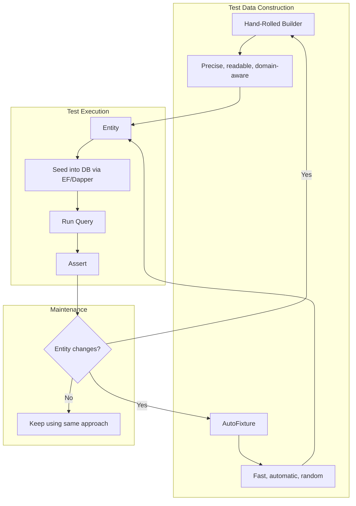

# 8.949 — Test Data Builders — Fluent Object Creation

## 1 — Overview

Test data is the lifeblood of meaningful database tests. Without well-structured, readable, and maintainable test data, tests become brittle, hard to understand, and painful to update when the domain model changes. The Test Data Builder pattern is one of the most effective techniques for keeping test Arrange sections clean while giving each test full control over the data it needs.

In the .NET ecosystem, the two dominant approaches to constructing test data for database tests are hand-rolled Builder classes and convention-based libraries like AutoFixture. Both have their place. Builders give you precise control and self-documenting code; AutoFixture gives you speed and automatic filling of properties.

This note covers both approaches with concrete examples for EF Core entities and Dapper POCOs. You will learn how to design fluent builders with sensible defaults, how to use AutoFixture to rapidly generate test data, and where each approach shines or falls apart.

The database testing context adds complexity: foreign keys must be respected, identities must be predictable, and navigation properties must be wired up correctly. A builder for `Order` must also build (or accept) `OrderItem` instances. AutoFixture must be configured to handle circular references and required navigation properties.

By the end of this note you will be able to:
- Design a fluent `OrderBuilder` that produces valid domain objects with minimal boilerplate
- Use `With*` methods to override only what matters for a specific test
- Leverage AutoFixture as a faster alternative when builder maintenance becomes too expensive
- Understand the trade-offs between explicit builders and AutoFixture customizations
- Avoid the common pitfalls that make test data builders a source of friction rather than productivity

## 2 — Core Concept

The Test Data Builder pattern separates the construction of a complex object from its representation. Instead of littering test Arrange sections with property assignments for every field, you create a Builder object that carries sensible defaults and exposes chainable `With*` methods for the fields that matter to a particular test.


The pattern has three essential parts:

**Defaults** — Every property gets a valid value. These defaults should be good enough that calling `new OrderBuilder().Build()` produces an entity that can be persisted to the database without violating any constraint. This means strings are not null, foreign keys point to existing (or default) parent entities, and value types use meaningful sentinels (e.g., `DateTime.UtcNow` truncated to second precision).

**Overrides** — `With*` methods replace individual properties. Each method returns the builder instance (`this`) so calls can be chained. Overrides should be typed and validated where possible (e.g., `WithQuantity(-1)` could throw).

**Build** — The terminal operation that produces the final entity. Build may also wire up bidirectional relationships (e.g., setting `OrderItem.Order` back-reference) or compute derived fields.

The concept applies equally to EF Core entities (which may have navigation properties, shadow properties, and complex type configurations) and Dapper POCOs (which are plain data bags with no behavior).

## 3 — Implementation

### 3.1 — Hand-Rolled OrderBuilder

The most common approach is a dedicated builder class per domain entity. Here is a complete builder for an `Order` aggregate:

```csharp
public class OrderBuilder
{
    private int _id = 1;
    private int _customerId = 1;
    private DateTime _orderDate = new(2026, 6, 1, 10, 0, 0, DateTimeKind.Utc);
    private decimal _totalAmount = 100.00m;
    private OrderStatus _status = OrderStatus.Pending;
    private List<OrderItem> _items = new();
    private string _shippingAddress = "123 Test St, Testville, TX 75001";
    private string? _notes;

    public OrderBuilder WithId(int id)
    {
        _id = id;
        return this;
    }

    public OrderBuilder WithCustomerId(int customerId)
    {
        _customerId = customerId;
        return this;
    }

    public OrderBuilder WithOrderDate(DateTime orderDate)
    {
        _orderDate = orderDate;
        return this;
    }

    public OrderBuilder WithTotalAmount(decimal totalAmount)
    {
        _totalAmount = totalAmount;
        return this;
    }

    public OrderBuilder WithStatus(OrderStatus status)
    {
        _status = status;
        return this;
    }

    public OrderBuilder WithItem(OrderItem item)
    {
        _items.Add(item);
        return this;
    }

    public OrderBuilder WithItems(IEnumerable<OrderItem> items)
    {
        _items.AddRange(items);
        return this;
    }

    public OrderBuilder WithShippingAddress(string address)
    {
        _shippingAddress = address;
        return this;
    }

    public OrderBuilder WithNotes(string notes)
    {
        _notes = notes;
        return this;
    }

    public Order Build()
    {
        var order = new Order
        {
            Id = _id,
            CustomerId = _customerId,
            OrderDate = _orderDate,
            TotalAmount = _totalAmount,
            Status = _status,
            ShippingAddress = _shippingAddress,
            Notes = _notes
        };

        foreach (var item in _items)
        {
            item.OrderId = _id;
            item.Order = order;
            order.Items.Add(item);
        }

        return order;
    }
}
```

### 3.2 — OrderItemBuilder

For child entities, a separate builder keeps construction clean:

```csharp
public class OrderItemBuilder
{
    private int _id = 1;
    private int _orderId = 1;
    private int _productId = 1;
    private string _productName = "Default Product";
    private int _quantity = 1;
    private decimal _unitPrice = 50.00m;

    public OrderItemBuilder WithId(int id) { _id = id; return this; }
    public OrderItemBuilder WithOrderId(int orderId) { _orderId = orderId; return this; }
    public OrderItemBuilder WithProductId(int productId) { _productId = productId; return this; }
    public OrderItemBuilder WithProductName(string name) { _productName = name; return this; }
    public OrderItemBuilder WithQuantity(int quantity) { _quantity = quantity; return this; }
    public OrderItemBuilder WithUnitPrice(decimal price) { _unitPrice = price; return this; }

    public OrderItem Build()
    {
        return new OrderItem
        {
            Id = _id,
            OrderId = _orderId,
            ProductId = _productId,
            ProductName = _productName,
            Quantity = _quantity,
            UnitPrice = _unitPrice
        };
    }
}
```

### 3.3 — Usage in EF Core Tests

```csharp
[Fact]
public async Task PlaceOrder_Should_Create_Order_With_Items()
{
    // Arrange
    var customer = new CustomerBuilder().Build();
    dbContext.Customers.Add(customer);
    await dbContext.SaveChangesAsync();

    var order = new OrderBuilder()
        .WithCustomerId(customer.Id)
        .WithOrderDate(new DateTime(2026, 6, 15, 14, 30, 0, DateTimeKind.Utc))
        .WithItem(new OrderItemBuilder().WithProductId(5).WithQuantity(2).Build())
        .WithItem(new OrderItemBuilder().WithProductId(8).WithQuantity(1).Build())
        .Build();

    // Act
    dbContext.Orders.Add(order);
    await dbContext.SaveChangesAsync();

    // Assert
    var saved = await dbContext.Orders
        .Include(o => o.Items)
        .FirstAsync(o => o.Id == order.Id);
    saved.Items.Should().HaveCount(2);
}
```

### 3.4 — Usage in Dapper Tests

```csharp
[Fact]
public async Task PlaceOrder_Should_Create_Order_With_Dapper()
{
    // Arrange
    var customer = new CustomerBuilder().Build();
    await connection.ExecuteAsync(
        "INSERT INTO Customers (Id, Name, Email) VALUES (@Id, @Name, @Email)",
        customer);

    var order = new OrderBuilder()
        .WithCustomerId(customer.Id)
        .WithOrderDate(new DateTime(2026, 6, 15, 14, 30, 0, DateTimeKind.Utc))
        .WithItem(new OrderItemBuilder().WithProductId(5).WithQuantity(2).Build())
        .Build();

    // Act
    await connection.ExecuteAsync(
        "INSERT INTO Orders (Id, CustomerId, OrderDate, TotalAmount, Status) VALUES (@Id, @CustomerId, @OrderDate, @TotalAmount, @Status)",
        order);
    foreach (var item in order.Items)
    {
        await connection.ExecuteAsync(
            "INSERT INTO OrderItems (Id, OrderId, ProductId, ProductName, Quantity, UnitPrice) VALUES (@Id, @OrderId, @ProductId, @ProductName, @Quantity, @UnitPrice)",
            item);
    }

    // Assert
    var saved = await connection.QueryAsync<Order>(
        "SELECT * FROM Orders WHERE Id = @Id", new { order.Id });
    saved.Should().NotBeNull();
}
```

## 4 — AutoFixture Alternative

AutoFixture automates test data creation by using convention and reflection to fill properties. It is much faster to get started than writing builders by hand.

### 4.1 — Basic AutoFixture

```csharp
var fixture = new Fixture();
var order = fixture.Create<Order>();
```

This creates an `Order` with random values for all properties. Strings are GUID-like, numbers are random, dates are random. This is often enough for tests that just need _some_ data.

### 4.2 — AutoFixture for EF Core Entities

EF Core entities often have navigation properties that cause circular references. AutoFixture handles these with `OmitOnRecursionBehavior`:

```csharp
var fixture = new Fixture();
fixture.Behaviors.OfType<ThrowingRecursionBehavior>().ToList()
    .ForEach(b => fixture.Behaviors.Remove(b));
fixture.Behaviors.Add(new OmitOnRecursionBehavior());

var order = fixture.Create<Order>();
```

### 4.3 — AutoFixture Customizations

For controlled override of specific properties, use `Build`:

```csharp
var order = fixture.Build<Order>()
    .With(o => o.CustomerId, 1)
    .With(o => o.OrderDate, new DateTime(2026, 6, 1, 10, 0, 0, DateTimeKind.Utc))
    .Without(o => o.Items)
    .Create();
```

### 4.4 — AutoFixture Customizations for Dapper POCOs

Dapper POCOs have no navigation properties, so AutoFixture works without recursion handling:

```csharp
var fixture = new Fixture();
var customer = fixture.Build<Customer>()
    .With(c => c.Id, 1)
    .With(c => c.Name, "Test Customer")
    .With(c => c.Email, "test@example.com")
    .Create();

await connection.ExecuteAsync(
    "INSERT INTO Customers (Id, Name, Email) VALUES (@Id, @Name, @Email)",
    customer);
```

### 4.5 — AutoData Theories with AutoFixture and xUnit

The `AutoData` attribute combines AutoFixture with xUnit theories:

```csharp
[Theory, AutoData]
public void Order_Total_Should_Be_Sum_Of_Items(Order order)
{
    // AutoFixture creates the order automatically
    order.TotalAmount.Should().BeGreaterThan(0);
}
```

For database tests, `AutoData` can be customized:

```csharp
public class DatabaseTestDataAttribute : AutoDataAttribute
{
    public DatabaseTestDataAttribute()
        : base(() =>
        {
            var fixture = new Fixture();
            fixture.Behaviors.OfType<ThrowingRecursionBehavior>().ToList()
                .ForEach(b => fixture.Behaviors.Remove(b));
            fixture.Behaviors.Add(new OmitOnRecursionBehavior());
            fixture.Customize<Order>(o => o
                .With(x => x.Id, 0)
                .With(x => x.CustomerId, 1)
                .With(x => x.OrderDate, new DateTime(2026, 6, 1, 10, 0, 0, DateTimeKind.Utc)));
            return fixture;
        })
    {
    }
}

[Theory, DatabaseTestData]
public async Task Save_Order(Order order)
{
    dbContext.Orders.Add(order);
    await dbContext.SaveChangesAsync();
    // Assert...
}
```

### 4.6 — AutoFixture with Complex Object Graphs

For deep graphs, register builders as customizations:

```csharp
public class OrderCustomization : ICustomization
{
    public void Customize(IFixture fixture)
    {
        fixture.Customize<OrderItem>(o => o
            .With(x => x.ProductName, $"Product_{Guid.NewGuid():N}"));

        fixture.Customize<Order>(o => o
            .With(x => x.Items, fixture.CreateMany<OrderItem>(3).ToList()));
    }
}

var fixture = new Fixture();
fixture.Customize(new OrderCustomization());
var order = fixture.Create<Order>();
```

## 5 — Patterns

### 5.1 — Builder Inheritance for Entity Variants

When the same entity appears in multiple states (e.g., `PendingOrder`, `ShippedOrder`), create specialized builder methods or derived builders:

```csharp
public class OrderBuilder
{
    // ... base builder ...

    public OrderBuilder AsPending()
    {
        _status = OrderStatus.Pending;
        return this;
    }

    public OrderBuilder AsShipped()
    {
        _status = OrderStatus.Shipped;
        _orderDate = DateTime.UtcNow.AddDays(-2);
        return this;
    }

    public OrderBuilder AsCancelled()
    {
        _status = OrderStatus.Cancelled;
        _notes = "Cancelled by test";
        return this;
    }
}
```

### 5.2 — Default Builder via Static Factory

Encourage the happy path with a static factory:

```csharp
public static OrderBuilder Default => new OrderBuilder();
```

Usage:

```csharp
var order = OrderBuilder.Default
    .WithCustomerId(42)
    .Build();
```

### 5.3 — Fixture Builder Adapter

Bridge between AutoFixture and explicit builders when you need both speed and control:

```csharp
public static class FixtureBuilder
{
    private static readonly IFixture _fixture = new Fixture();

    static FixtureBuilder()
    {
        _fixture.Behaviors.OfType<ThrowingRecursionBehavior>().ToList()
            .ForEach(b => _fixture.Behaviors.Remove(b));
        _fixture.Behaviors.Add(new OmitOnRecursionBehavior());
    }

    public static OrderBuilder Order() => OrderBuilder.Default;

    public static T Any<T>() => _fixture.Create<T>();

    public static T Any<T>(Action<ICustomizationComposer<T>> customize)
    {
        var builder = _fixture.Build<T>();
        customize(builder);
        return builder.Create();
    }
}
```

### 5.4 — Sequential Value Strategy

For predictable keys across tests:

```csharp
public static class TestSequences
{
    private static int _nextId = 1000;
    private static int _nextCustomerId = 100;
    private static int _nextProductId = 500;

    public static int NextId() => Interlocked.Increment(ref _nextId);
    public static int NextCustomerId() => Interlocked.Increment(ref _nextCustomerId);
    public static int NextProductId() => Interlocked.Increment(ref _nextProductId);
}

public class OrderBuilder
{
    private int _id = TestSequences.NextId();
    // ...
}
```

### 5.5 — Mother Object Pattern

A simpler alternative to builders: static factory methods on a `TestData` class:

```csharp
public static class TestOrders
{
    public static Order SimplePendingOrder => new Order
    {
        Id = 1,
        CustomerId = 1,
        OrderDate = new DateTime(2026, 6, 1, 10, 0, 0, DateTimeKind.Utc),
        TotalAmount = 100m,
        Status = OrderStatus.Pending,
        Items = new List<OrderItem>
        {
            new OrderItem { Id = 1, ProductId = 1, Quantity = 1, UnitPrice = 100m }
        }
    };

    public static Order OrderWithManyItems => new Order
    {
        Id = 2,
        CustomerId = 1,
        OrderDate = new DateTime(2026, 6, 1, 10, 0, 0, DateTimeKind.Utc),
        TotalAmount = 500m,
        Status = OrderStatus.Pending,
        Items = Enumerable.Range(1, 5).Select(i => new OrderItem
        {
            Id = i,
            ProductId = i,
            Quantity = i,
            UnitPrice = 10m * i
        }).ToList()
    };
}
```

Use Mother Objects when the number of entity variants is small and stable; use Builders when variants grow or tests need fine-grained control.

## 6 — Best Practices

### 6.1 — Keep Defaults Valid

Every default value must pass database constraints. If `Customer.Name` is `NOT NULL`, the builder default for `Name` should be a non-null string. If `TotalAmount` must be positive, default to a positive value.

### 6.2 — Freeze Dates

Use `DateTime(2026, 6, 1, 10, 0, 0, DateTimeKind.Utc)` as a default rather than `DateTime.UtcNow`. Frozen dates make tests deterministic and reproducible. If you need relative dates, expose `WithOrderDate()` and let the test pass an explicit value.

### 6.3 — Use Explicit Keys

Prefer explicit keys over relying on database-generated identities when the test needs to assert on the key:

```csharp
var order = new OrderBuilder().WithId(1001).Build();
dbContext.Orders.Add(order);
await dbContext.SaveChangesAsync();
// order.Id is 1001, no need to read back
```

For Dapper:

```csharp
var order = new OrderBuilder().WithId(1001).Build();
await connection.ExecuteAsync("INSERT INTO Orders ...", order);
// order.Id is 1001
```

### 6.4 — Wire Bidirectional References in Build()

The `Build()` method should set back-references so that navigation properties work in assertions:

```csharp
public Order Build()
{
    var order = new Order { /* ... */ };
    foreach (var item in _items)
    {
        item.Order = order;      // back-reference
        item.OrderId = order.Id; // FK
        order.Items.Add(item);
    }
    return order;
}
```

### 6.5 — Keep Builders Close to Entities

Store builder classes in the test project, preferably in a `Builders/` namespace. Keep them co-located with the tests that use them, not in the production codebase.

### 6.6 — One Builder per Aggregate Root

Do not create builders for every table. Builders for aggregate roots (`Order`, `Customer`, `Product`) are sufficient. Child entities within an aggregate can use inline construction or their own mini-builder if the aggregate is complex.

### 6.7 — When to Use AutoFixture

Use AutoFixture when:
- You need many entities for performance or concurrency tests
- The entity has dozens of properties and you do not care about specific values
- You are testing serialization, mapping, or generic persistence logic
- You want to fuzz-test with random data

Use hand-rolled builders when:
- Test readability is paramount (the builder names document intent)
- You need precise control over entity state
- The entity has complex invariants that AutoFixture cannot satisfy
- You want to avoid debugging random test failures caused by random data

## 7 — Comparison: Builders vs AutoFixture

| Aspect | Hand-Rolled Builder | AutoFixture |
|--------|-------------------|-------------|
| Setup effort | High — write builder per entity | Low — single `new Fixture()` |
| Readability | High — `WithX(5).WithY("foo")` is self-documenting | Low — must inspect customization |
| Control | Full — every property explicit | Partial — `Build().With()` or `Customize` |
| Default quality | High — domain-meaningful defaults | Low — random strings, random numbers |
| Maintenance cost | High — entity changes require builder updates | Low — reflection adapts automatically |
| Debugging | Easy — data is predictable | Hard — random data changes each run |
| Test intent clarity | High — only overrides visible | Medium — all properties look "customized" |
| Deep graph support | Manual wiring | Automatic (with recursion handling) |
| Performance | Negligible | Slightly slower due to reflection |

### 7.1 — When They Converge: Builder-Factory Hybrid

For large projects, a hybrid approach works well:

```csharp
public static class TestData
{
    private static readonly IFixture _fixture = new Fixture();

    static TestData()
    {
        _fixture.Behaviors.OfType<ThrowingRecursionBehavior>().ToList()
            .ForEach(b => _fixture.Behaviors.Remove(b));
        _fixture.Behaviors.Add(new OmitOnRecursionBehavior());
    }

    // Builder for entities needing precise control
    public static OrderBuilder AnOrder() => new OrderBuilder();

    // Factory for entities where data doesn't matter
    public static T Any<T>() => _fixture.Create<T>();
    public static T Any<T>(Action<T> customize)
    {
        var entity = _fixture.Create<T>();
        customize(entity);
        return entity;
    }
}
```

Usage:

```csharp
var precise = TestData.AnOrder()
    .WithCustomerId(5)
    .WithStatus(OrderStatus.Shipped)
    .Build();

var random = TestData.Any<Order>();
var tweaked = TestData.Any<Order>(o => o.CustomerId = 5);
```

## 8 — Gotchas

### 8.1 — Builder Becomes a Maintenance Burden

When the domain model gains a new property, every builder for that entity must be updated. For teams with rapid schema changes, this friction can outweigh the benefits. Mitigation: use AutoFixture for stable entities and builders only for entities that change infrequently or are central to business logic.

### 8.2 — AutoFixture Creates Random Data That Is Hard to Debug

A test that uses `fixture.Create<Order>()` will get different values on every run. If a test fails because a specific order total was too low, reproducing the failure requires capturing the seed. Mitigation: freeze the fixture seed in CI:

```csharp
public static IFixture CreateSeededFixture(int seed = 42)
{
    var random = new Random(seed);
    var fixture = new Fixture();
    fixture.Customizations.Add(new RandomRangedNumberGenerator(random));
    return fixture;
}
```

### 8.3 — Too Many Defaults Hide Test Intent

When every builder has defaults for twenty properties, a test like this:

```csharp
var order = new OrderBuilder().Build();
```

...tells the reader nothing about what kind of order it is. The test passes because all defaults happen to produce a valid order, but the reader cannot tell if the test cares about the order date, the total amount, or the status. Mitigation: create named builder variants (`OrderBuilder.Default.AsPending()`) or use inline construction for the specific properties that matter.

### 8.4 — Deep Object Graphs Need Parent-Child Wiring

When `OrderBuilder.Build()` creates an `Order` with `OrderItem` children, the back-reference (`Item.Order`) must be set. Forgetting this leads to `NullReferenceException` when EF Core lazy-loads or when test assertions traverse navigation properties. Always wire back-references in `Build()`.

For aggregate graphs spanning multiple builders:

```csharp
var customer = new CustomerBuilder().WithId(1).Build();
var order = new OrderBuilder()
    .WithCustomerId(customer.Id)
    .WithItem(new OrderItemBuilder().WithProductId(5).Build())
    .Build();
// Order.Order reference not set automatically — must be done in Build()
```

### 8.5 — AutoFixture and EF Core Shadow Properties

EF Core shadow properties (e.g., `LastUpdated`, `IsDeleted`) are not real CLR properties. AutoFixture cannot set them. If a shadow property has a `NOT NULL` constraint, AutoFixture-generated entities will fail to save. Mitigation: register customizations for shadow properties or use builders that set shadow properties via EF Core's change tracker.

### 8.6 — AutoFixture and Value Objects

Entities using value objects (e.g., `Money`, `EmailAddress`) may not construct properly because AutoFixture does not know how to create them. Mitigation: register a customization:

```csharp
fixture.Register(() => new Money(100.00m, "USD"));
```

### 8.7 — Builder Defaults Can Become Stale

When business rules change (e.g., minimum order amount increases from $10 to $50), builder defaults may still produce orders below the new threshold. Tests that use default totals will fail without clearly indicating why. Mitigation: review builder defaults whenever domain constraints change, and add integration tests that verify builder defaults are valid.

### 8.8 — Shared Builder State Across Tests

If a builder uses static mutable state (e.g., a static counter for IDs), tests that run in parallel will interleave and produce duplicate IDs. Mitigation: use `Interlocked.Increment` for thread safety, or better, do not use static state — let each test create a fresh builder.

```csharp
// BAD — static mutable state
private static int _nextId = 1;
public OrderBuilder WithAutoId() { _id = _nextId++; return this; }

// GOOD — thread-local state or constructor initialization
public OrderBuilder() { _id = TestSequences.NextId(); }
```

### 8.9 — AutoFixture Creates Collections but Does Not Wire Parent

When AutoFixture creates `Order.Items`, it fills the collection but does not set `Item.Order` back to the parent. This breaks EF Core change tracking if you later add items:

```csharp
var order = fixture.Create<Order>();
dbContext.Orders.Add(order); // Items may not be tracked correctly
```

Mitigation: customize AutoFixture to wire back-references, or use a builder that handles this.

## 9 — Summary

Test Data Builders are a workhorse pattern for database testing in .NET. They transform cluttered Arrange sections into readable, intention-revealing statements. The key principles are:

- **Sensible defaults** so every builder invocation produces a valid, persistable entity
- **Fluent overrides** (`With*` returning `this`) so tests customize only what matters
- **Proper graph wiring** in `Build()` so navigation properties and foreign keys are consistent
- **Deterministic values** (fixed dates, explicit keys) so tests are repeatable

AutoFixture is a powerful alternative when builder maintenance becomes too expensive. It eliminates boilerplate but introduces randomness that makes test failures harder to diagnose. The best approach for most projects is a hybrid: hand-rolled builders for aggregate roots and entities with complex invariants, AutoFixture for simple entities and fuzz testing.

For database testing specifically, remember that the builder is only half the story. What you build must be sewn into the database. Pair builders with deterministic seed helpers (8.951) and database fixtures (8.950) for a complete test data pipeline.



Choose the right tool for the job. When a test's Arrange section becomes the longest part of the test, it is time to invest in builders. When builders themselves become the bottleneck, it is time to introduce AutoFixture. The goal is always the same: make test data construction invisible so the test's intent shines through.

## References

- [[8.951 — Seeding Test Data — Deterministic Setup]]
- [[8.950 — Database Fixtures — xUnit IClassFixture]]
- [[8.941 — Database Testing — Strategy Overview]]
- [[8.943 — Integration Testing — Real Database]]
- [AutoFixture Documentation](https://autofixture.github.io/)
- [Test Data Builder Pattern (Martin Fowler)](https://martinfowler.com/bliki/ObjectMother.html)
