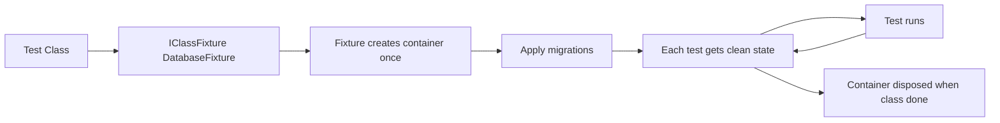
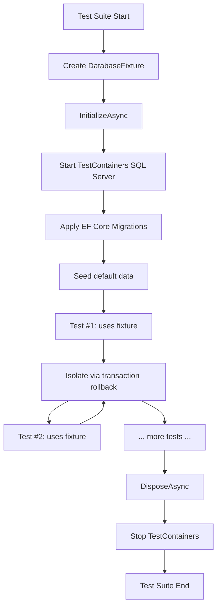

# 8.950 — Database Fixtures — xUnit IClassFixture

## 1 — Overview

Integration tests that hit a real database share a common problem: the database must be running, migrated, and in a known state before every test. Doing this per-test is expensive (starting a container and applying migrations takes seconds). Doing it once per test run requires a shared fixture that all tests can access.

xUnit provides `IClassFixture<T>` for exactly this purpose. It creates a single instance of the fixture type and shares it across all test methods in the same test class. The fixture lives for the duration of the class and is disposed when the class finishes.

For database testing, the fixture typically:
- Starts a Docker container running SQL Server (via TestContainers)
- Waits for the container to be ready
- Applies EF Core migrations (or executes idempotent schema scripts)
- Provides a `DbContext` factory or `IDbConnection` that tests use
- Manages transaction-based isolation so each test gets a clean slate
- Disposes the container when all tests in the class are done

This note covers the full pattern: `DatabaseFixture` implementation with `IAsyncLifetime`, test classes using `IClassFixture`, providing both EF Core and Dapper connection factories, and extending the pattern to test collections with `ICollectionFixture`.



## 2 — Core Concept

xUnit's fixture injection works through the test class constructor. When xUnit discovers a test class, it checks if the class implements `IClassFixture<T>`. If so, it creates one instance of `T` before any test method runs and keeps it alive until all test methods in the class have completed.

The fixture can optionally implement `IAsyncLifetime` to perform async setup (`InitializeAsync`) and teardown (`DisposeAsync`). This is essential for database fixtures that start Docker containers.

```
Test Class Lifecycle:
  1. Fixture constructor runs (no DB yet)
  2. Fixture.InitializeAsync() — start container, apply migrations
  3. Test method #1 — uses fixture's DbContext/connection
  4. Test method #2 — uses fixture's DbContext/connection
  5. ... more tests ...
  6. Fixture.DisposeAsync() — stop container, clean up
  7. Fixture destructor runs
```

Each test method receives the same fixture instance. This means the fixture must NOT hold mutable state that tests change. The fixture provides factories, not shared data.

### 2.1 — Key Differences from Other xUnit Fixtures

| Mechanism | Scope | Instantiation | Use Case |
|-----------|-------|---------------|----------|
| Constructor | Per-test | New instance per test | No sharing needed |
| IClassFixture | Per-class | One instance per class | Share DB container across tests in a class |
| ICollectionFixture | Per-collection | One instance per collection | Share DB container across multiple classes |
| IAsyncLifetime | Any | Hook on any fixture | Async setup/teardown (start container) |

## 3 — Implementation

### 3.1 — DatabaseFixture with IAsyncLifetime

The core fixture uses TestContainers to spin up SQL Server and applies migrations once:

```csharp
using Testcontainers.MsSql;
using Microsoft.EntityFrameworkCore;
using Microsoft.Data.SqlClient;
using System.Data.Common;

public class DatabaseFixture : IAsyncLifetime
{
    private readonly MsSqlContainer _container;
    private string _connectionString = string.Empty;

    public DatabaseFixture()
    {
        _container = new MsSqlBuilder()
            .WithImage("mcr.microsoft.com/mssql/server:2022-latest")
            .WithPassword("Your_Str0ng_P@ssw0rd!")
            .WithCleanUp(true)
            .Build();
    }

    public string ConnectionString => _connectionString;

    public async Task InitializeAsync()
    {
        // 1 — Start the container
        await _container.StartAsync();

        // 2 — Capture the connection string
        _connectionString = _container.GetConnectionString();

        // 3 — Apply EF Core migrations
        var optionsBuilder = new DbContextOptionsBuilder<AppDbContext>();
        optionsBuilder.UseSqlServer(_connectionString);

        using var context = new AppDbContext(optionsBuilder.Options);
        await context.Database.MigrateAsync();

        // 4 — (Optional) Run seed scripts
        await SeedDefaultsAsync();
    }

    public async Task DisposeAsync()
    {
        await _container.DisposeAsync();
    }

    private async Task SeedDefaultsAsync()
    {
        using var context = CreateDbContext();
        if (!await context.Customers.AnyAsync())
        {
            context.Customers.Add(new Customer
            {
                Id = 1,
                Name = "Default Test Customer",
                Email = "default@test.com"
            });
            await context.SaveChangesAsync();
        }
    }

    // Factory methods for tests
    public AppDbContext CreateDbContext()
    {
        var options = new DbContextOptionsBuilder<AppDbContext>()
            .UseSqlServer(_connectionString)
            .Options;
        return new AppDbContext(options);
    }

    public DbConnection CreateConnection()
    {
        return new SqlConnection(_connectionString);
    }
}
```

### 3.2 — Test Class Using IClassFixture

```csharp
public class OrderTests : IClassFixture<DatabaseFixture>
{
    private readonly DatabaseFixture _fixture;

    public OrderTests(DatabaseFixture fixture)
    {
        _fixture = fixture;
    }

    [Fact]
    public async Task Create_Order_Should_Persist()
    {
        // Arrange — use fixture's factory
        await using var dbContext = _fixture.CreateDbContext();

        var customer = new Customer { Id = 2, Name = "Test", Email = "test@test.com" };
        dbContext.Customers.Add(customer);
        await dbContext.SaveChangesAsync();

        var order = new Order
        {
            CustomerId = customer.Id,
            OrderDate = new DateTime(2026, 6, 1, 10, 0, 0, DateTimeKind.Utc),
            TotalAmount = 100m
        };
        dbContext.Orders.Add(order);
        await dbContext.SaveChangesAsync();

        // Act
        var saved = await dbContext.Orders.FindAsync(order.Id);

        // Assert
        saved.Should().NotBeNull();
        saved.CustomerId.Should().Be(customer.Id);
    }

    [Fact]
    public async Task Query_Orders_With_Dapper()
    {
        // Arrange — use Dapper
        await using var connection = _fixture.CreateConnection();
        await connection.OpenAsync();

        await connection.ExecuteAsync(
            "INSERT INTO Customers (Id, Name, Email) VALUES (3, 'Dapper Test', 'dapper@test.com')");

        // Act
        var customers = await connection.QueryAsync<Customer>(
            "SELECT * FROM Customers WHERE Email = @Email",
            new { Email = "dapper@test.com" });

        // Assert
        customers.Should().HaveCount(1);
    }
}
```

### 3.3 — Providing DB Context Factory for EF Core

For cleaner test code, wrap the factory in a method that also isolates EF Core changes:

```csharp
public class DatabaseFixture : IAsyncLifetime
{
    // ... container setup ...

    public AppDbContext CreateIsolatedDbContext()
    {
        var context = CreateDbContext();
        context.Database.BeginTransaction();
        return context;
    }
}
```

Tests can then commit or rollback the transaction:

```csharp
[Fact]
public async Task Create_Order()
{
    await using var dbContext = _fixture.CreateIsolatedDbContext();
    // All changes happen in a transaction
    // Transaction rolls back when context is disposed
    // No cleanup needed
}
```

### 3.4 — Providing IDbConnectionFactory for Dapper

For Dapper, provide a connection factory interface that tests can mock or swap:

```csharp
public class DatabaseFixture : IAsyncLifetime
{
    // ... container setup ...

    public IDbConnectionFactory ConnectionFactory => new SqlConnectionFactory(_connectionString);
}

public interface IDbConnectionFactory
{
    DbConnection CreateConnection();
}

public class SqlConnectionFactory : IDbConnectionFactory
{
    private readonly string _connectionString;
    public SqlConnectionFactory(string connectionString) => _connectionString = connectionString;
    public DbConnection CreateConnection() => new SqlConnection(_connectionString);
}
```

Tests using Dapper:

```csharp
[Fact]
public async Task Dapper_Query_Test()
{
    await using var connection = _fixture.ConnectionFactory.CreateConnection();
    await connection.OpenAsync();
    var result = await connection.QueryAsync<Order>("SELECT * FROM Orders");
    // Assert...
}
```

### 3.5 — Transaction Rollback Isolation

For per-test isolation without Respawn, use transaction rollback:

```csharp
public class DatabaseFixture : IAsyncLifetime
{
    private DbTransaction? _transaction;
    private DbConnection? _sharedConnection;

    public async Task StartTestIsolationAsync()
    {
        _sharedConnection = new SqlConnection(_connectionString);
        await _sharedConnection.OpenAsync();
        _transaction = await _sharedConnection.BeginTransactionAsync();
    }

    public async Task EndTestIsolationAsync()
    {
        if (_transaction != null)
        {
            await _transaction.RollbackAsync();
            await _transaction.DisposeAsync();
            _transaction = null;
        }
        if (_sharedConnection != null)
        {
            await _sharedConnection.DisposeAsync();
            _sharedConnection = null;
        }
    }

    public DbConnection GetIsolatedConnection()
    {
        if (_sharedConnection == null)
            throw new InvalidOperationException("Call StartTestIsolationAsync first");
        return _sharedConnection;
    }
}
```

This approach is fast (no schema recreation) but does not work for schema changes (DDL auto-commits transactions).

## 4 — Collection Fixtures

When multiple test classes need the same database container, `ICollectionFixture` avoids starting a separate container per class:

### 4.1 — Define the Fixture and Collection

```csharp
[CollectionDefinition("Database")]
public class DatabaseCollection : ICollectionFixture<DatabaseFixture>
{
    // No members — just associates the fixture with the collection
}
```

### 4.2 — Use in Test Classes

```csharp
[Collection("Database")]
public class OrderTests
{
    private readonly DatabaseFixture _fixture;

    public OrderTests(DatabaseFixture fixture)
    {
        _fixture = fixture;
    }

    // ... tests use _fixture ...
}

[Collection("Database")]
public class CustomerTests
{
    private readonly DatabaseFixture _fixture;

    public CustomerTests(DatabaseFixture fixture)
    {
        _fixture = fixture;
    }

    // ... tests share the same container ...
}
```

### 4.3 — Collection Fixture Lifecycle

```
xUnit discovers collection "Database"
  → Creates DatabaseFixture once
  → Initializes (starts container, applies migrations)
  → Runs OrderTests class (all methods)
  → Runs CustomerTests class (all methods)
  → Disposes DatabaseFixture
```

All tests in the collection run sequentially because xUnit serializes tests within a collection. This prevents connection contention on the single container.

## 5 — Patterns

### 5.1 — Fixture with Respawn for Clean State

Instead of transaction rollback, use Respawn to reset the database between tests:

```csharp
public class DatabaseFixture : IAsyncLifetime
{
    private Respawner? _respawner;
    private DbConnection? _connection;

    public async Task InitializeAsync()
    {
        await _container.StartAsync();
        _connectionString = _container.GetConnectionString();
        await ApplyMigrationsAsync();
    }

    public async Task ResetDatabaseAsync()
    {
        await using var connection = new SqlConnection(_connectionString);
        await connection.OpenAsync();

        _respawner ??= await Respawner.CreateAsync(connection, new RespawnerOptions
        {
            DbAdapter = DbAdapter.SqlServer,
            SchemasToInclude = new[] { "dbo" }
        });

        await _respawner.ResetAsync(connection);
    }

    public async Task DisposeAsync()
    {
        await _container.DisposeAsync();
    }
}
```

Test class calls `ResetDatabaseAsync()` in constructor or via base class:

```csharp
public class OrderTests : IClassFixture<DatabaseFixture>
{
    private readonly DatabaseFixture _fixture;

    public OrderTests(DatabaseFixture fixture)
    {
        _fixture = fixture;
        await _fixture.ResetDatabaseAsync(); // Clean slate before each test
    }
}
```

### 5.2 — Base Class for Database Tests

Reduce boilerplate with a base class:

```csharp
public abstract class DatabaseTestBase : IClassFixture<DatabaseFixture>
{
    protected readonly DatabaseFixture Fixture;
    protected readonly ITestOutputHelper Output;

    protected DatabaseTestBase(DatabaseFixture fixture, ITestOutputHelper output)
    {
        Fixture = fixture;
        Output = output;
    }

    protected AppDbContext CreateDbContext() => Fixture.CreateDbContext();
    protected DbConnection CreateConnection() => Fixture.CreateConnection();
}

public class OrderTests : DatabaseTestBase
{
    public OrderTests(DatabaseFixture fixture, ITestOutputHelper output)
        : base(fixture, output) { }

    [Fact]
    public async Task Test_Order_Persistence()
    {
        await using var db = CreateDbContext();
        // ...
    }
}
```

### 5.3 — Fixture with Multiple Databases

For services that interact with multiple databases:

```csharp
public class MultiDatabaseFixture : IAsyncLifetime
{
    private readonly MsSqlContainer _ordersDb = new MsSqlBuilder().Build();
    private readonly MsSqlContainer _reportingDb = new MsSqlBuilder().Build();

    public string OrdersConnectionString => _ordersDb.GetConnectionString();
    public string ReportingConnectionString => _reportingDb.GetConnectionString();

    public async Task InitializeAsync()
    {
        await Task.WhenAll(_ordersDb.StartAsync(), _reportingDb.StartAsync());
        await ApplyMigrationsAsync(_ordersDb, typeof(OrdersDbContext));
        await ApplyMigrationsAsync(_reportingDb, typeof(ReportingDbContext));
    }

    public async Task DisposeAsync()
    {
        await Task.WhenAll(_ordersDb.DisposeAsync(), _reportingDb.DisposeAsync());
    }
}
```

### 5.4 — Fixture with Seed Data Registry

Manage seed data centrally:

```csharp
public class SeedData
{
    public Customer DefaultCustomer { get; }
    public Product DefaultProduct { get; }
    public List<Order> DefaultOrders { get; }

    public SeedData()
    {
        DefaultCustomer = new Customer { Id = 1, Name = "Seed Customer", Email = "seed@test.com" };
        DefaultProduct = new Product { Id = 1, Name = "Seed Product", Price = 9.99m };
        DefaultOrders = new List<Order>
        {
            new Order { Id = 1, CustomerId = 1, TotalAmount = 100m },
            new Order { Id = 2, CustomerId = 1, TotalAmount = 200m },
        };
    }
}

public class DatabaseFixture : IAsyncLifetime
{
    public SeedData Seeds { get; } = new SeedData();

    public async Task InitializeAsync()
    {
        await _container.StartAsync();
        _connectionString = _container.GetConnectionString();
        await ApplyMigrationsAsync();
        await SeedDatabaseAsync();
    }

    private async Task SeedDatabaseAsync()
    {
        await using var db = CreateDbContext();
        db.Customers.Add(Seeds.DefaultCustomer);
        db.Products.Add(Seeds.DefaultProduct);
        db.Orders.AddRange(Seeds.DefaultOrders);
        await db.SaveChangesAsync();
    }
}
```

### 5.5 — Fixture with DbContext Pooling

For performance, pool DbContext instances rather than creating them per test:

```csharp
public class DatabaseFixture : IAsyncLifetime
{
    private DbContextPool<AppDbContext>? _pool;

    public async Task InitializeAsync()
    {
        await _container.StartAsync();
        var options = new DbContextOptionsBuilder<AppDbContext>()
            .UseSqlServer(_connectionString)
            .EnableSensitiveDataLogging()
            .Options;
        _pool = new DbContextPool<AppDbContext>(options);
    }

    public PooledDbContext<AppDbContext> GetDbContext()
    {
        var context = _pool.Get();
        return new PooledDbContext<AppDbContext>(context, _pool);
    }
}
```

## 6 — Best Practices

### 6.1 — Keep Fixtures Stateless

The fixture should not hold mutable state that tests modify. Connection strings, factory methods, and configuration are safe. Lists of entities, counters, or flags are not.

### 6.2 — Use One Container per Developer/CI Agent

TestContainers reuses containers by default. Use `WithCleanUp(true)` to remove the container after disposal, and configure the container name to avoid collisions in CI:

```csharp
var container = new MsSqlBuilder()
    .WithImage("mcr.microsoft.com/mssql/server:2022-latest")
    .WithName($"sqltest-{Guid.NewGuid():N}")
    .Build();
```

### 6.3 — Configure Timeouts Generously

Container startup and migration application can take 30–60 seconds. Set xUnit test timeouts accordingly:

```csharp
[assembly: CollectionBehavior(Timeout = 120_000)] // 2 minutes
```

### 6.4 — Log Container Output

For debugging CI failures, capture container logs:

```csharp
var container = new MsSqlBuilder()
    .WithImage("mcr.microsoft.com/mssql/server:2022-latest")
    .WithOutputConsumer(Consume.RedirectStdOutToStream())
    .Build();

// Later, read logs:
var logs = await container.GetOutputAsync();
```

### 6.5 — Use ICollectionFixture for Shared Containers

Starting a container per test class is wasteful. Use `ICollectionFixture` to share a single container across all database tests in the same collection. For most projects, one collection covering all database tests is sufficient.

### 6.6 — Separate Test Configuration

Connection strings, image tags, and passwords should come from `testsettings.json` or environment variables, not hardcoded in the fixture:

```csharp
public class DatabaseFixture : IAsyncLifetime
{
    private readonly TestConfiguration _config;

    public DatabaseFixture()
    {
        _config = new TestConfiguration();
        _container = new MsSqlBuilder()
            .WithImage(_config.SqlServerImage)
            .WithPassword(_config.SqlServerPassword)
            .Build();
    }
}
```

### 6.7 — Dispose Connections in Tests

Tests are responsible for disposing connections and DbContexts they create. Use `await using` to ensure deterministic disposal:

```csharp
[Fact]
public async Task Test_Method()
{
    await using var db = _fixture.CreateDbContext();
    // ...
} // db.DisposeAsync called here
```

## 7 — Comparison: Fixture Strategies

| Strategy | Setup Cost | Isolation | Schema Changes | DDL Support | Parallelism |
|----------|-----------|-----------|----------------|-------------|-------------|
| Transaction rollback per test | Low | Yes | No | No | Limited by connection pool |
| Respawn reset per test | Medium | Yes | Yes | Yes | Full |
| Drop and recreate DB per test | High | Yes | Yes | Yes | Full (separate databases) |
| Schema per test (schemas as isolation) | Medium | Yes | Yes | Yes | Full |
| Shared fixture, no isolation | None | No | N/A | N/A | Full (unsafe) |

### 7.1 — When to Use Each

- **Transaction rollback**: Fastest isolation. Use when tests do not need DDL and schema changes are stable. Works for 95% of query/persistence tests.
- **Respawn**: Use when tests make DDL changes or when transaction rollback does not clean up enough (e.g., sequences, identity seeds).
- **Drop/recreate**: Use when testing migrations themselves (need a clean schema each time).
- **No isolation**: Only for read-only tests (e.g., verifying seed data exists). Never use for mutation tests.

## 8 — Gotchas

### 8.1 — IClassFixture Is NOT Thread-Safe

xUnit guarantees that tests within a single `IClassFixture<T>` class run sequentially. However, if you share the same fixture via `ICollectionFixture` and tests in different classes run in parallel, you get race conditions. Never share mutable fixture state across parallel tests.

Mitigation: for collection fixtures, set `DisableParallelization = true`:

```csharp
[CollectionDefinition("Database", DisableParallelization = true)]
public class DatabaseCollection : ICollectionFixture<DatabaseFixture>
{
}
```

Or configure globally:

```csharp
[assembly: CollectionBehavior(CollectionBehavior.CollectionPerAssembly, DisableTestParallelization = true)]
```

### 8.2 — Fixture Disposal Must Be Robust

If a test crashes, the fixture's `DisposeAsync` must still run. xUnit guarantees disposal even when tests fail. However, if `InitializeAsync` throws (e.g., container fails to start), `DisposeAsync` is NOT called. Handle partial initialization:

```csharp
public async Task InitializeAsync()
{
    try
    {
        await _container.StartAsync();
        _connectionString = _container.GetConnectionString();
        await ApplyMigrationsAsync();
        _initialized = true;
    }
    catch
    {
        await DisposeAsync();
        throw;
    }
}
```

### 8.3 — Fixture State Shared Between Tests Is Dangerous

If a test modifies the database and the next test expects a clean state, you get flaky tests. Always reset state between tests (via transaction rollback or Respawn). Never assume the previous test cleaned up.

### 8.4 — Collection Fixtures Avoid Per-Class Overhead but Serialize All Tests

`ICollectionFixture` shares one container across all classes in the collection. This saves resources but means all tests in the collection run sequentially. For large test suites, this becomes a bottleneck. Mitigation: partition tests into multiple collections, each with its own container.

### 8.5 — Container Port Conflicts in CI

TestContainers maps random host ports by default, so port conflicts are rare. But when they happen (CI agents with restricted port ranges), configure the port explicitly:

```csharp
.WithPortBinding(1433, 21433) // Host:21433 → Container:1433
```

### 8.6 — Migration Application Is Slow

EF Core migrations apply schema changes sequentially. For large schemas, this can take 30+ seconds per fixture initialization. Mitigation: use `dbContext.Database.EnsureCreated()` for test databases (creates all tables in one batch, no migration history) or generate and execute idempotent SQL scripts.

### 8.7 — Connection Pool Starvation

If tests open many connections without disposing, the connection pool exhausts and tests hang. Always dispose connections:

```csharp
// BAD — connection not disposed
var conn = _fixture.CreateConnection();
conn.Open();
var result = await conn.QueryAsync("SELECT 1");

// GOOD — connection disposed
await using var conn = _fixture.CreateConnection();
await conn.OpenAsync();
var result = await conn.QueryAsync("SELECT 1");
```

### 8.8 — Fixture Constructor Should Be Fast

The fixture constructor runs synchronously before `InitializeAsync`. Do not start containers or connect to databases in the constructor. Use `InitializeAsync` for all async setup.

### 8.9 — TestContainers Resource Cleanup

If a test run is killed (Ctrl+C, CI timeout, OOM), the Docker container may be orphaned. Use `WithCleanUp(true)` to auto-remove, and set up a CI job to prune containers periodically:

```bash
docker container prune -f
```

## 9 — Summary

The `IClassFixture<T>` pattern is the foundation of robust, fast database integration testing in xUnit. It solves the fundamental problem: database setup is expensive, but test isolation is essential.

- **DatabaseFixture** encapsulates container lifecycle, migration application, and connection factory provision
- **IClassFixture** shares the fixture (and its container) across all tests in a class
- **ICollectionFixture** extends sharing across multiple test classes
- **IAsyncLifetime** provides async setup/teardown hooks for container management
- **Transaction rollback** or **Respawn** provides per-test isolation without restarting the container

The pattern works identically for EF Core and Dapper tests — the fixture provides both `DbContext` factory and `IDbConnection` factory. Tests choose whichever they need.



By centralizing database lifecycle in a fixture, you eliminate setup duplication, speed up test runs (container starts once), and ensure every test has a clean, predictable database state. The fixture is the single source of truth for the test database environment.

## References

- [[8.943 — Integration Testing — Real Database]]
- [[8.944 — TestContainers — SQL Server in Docker]]
- [[8.946 — Respawn — Database Reset Between Tests]]
- [[8.957 — Test Database Isolation — Per-Test vs Per-Suite]]
- [[8.951 — Seeding Test Data — Deterministic Setup]]
- [xUnit IClassFixture Documentation](https://xunit.net/docs/shared-context)
- [TestContainers for .NET](https://dotnet.testcontainers.org/)
- [Respawn GitHub](https://github.com/jbogard/Respawn)
