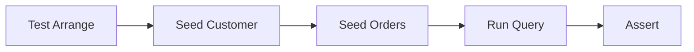
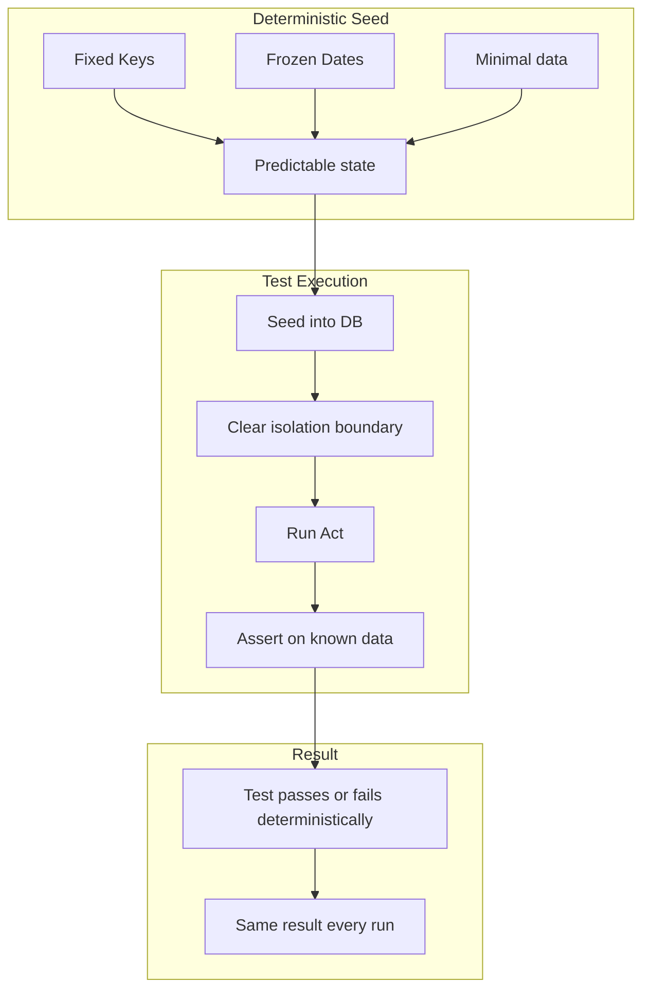

# 8.951 — Seeding Test Data — Deterministic Setup

## 1 — Overview

Database integration tests depend on data being in the database before, during, and after the system-under-test runs. If that data is unpredictable — random values, auto-generated keys, timestamps from `DateTime.UtcNow` — then test results become unreliable. A test that passes Monday may fail Tuesday because daylight saving time shifted the clock, or because a parallel test consumed the next identity value.

Deterministic test data is data that is fully controlled by the test and produces the same outcome every time, regardless of run order, parallel execution, or environment. Achieving this requires discipline in how data is constructed, seeded, and cleaned up.

This note covers the patterns and techniques for deterministic data seeding in both EF Core and Dapper database tests. You will learn how to seed minimal data sets, how to manage foreign key relationships explicitly, how to use fixed dates and explicit keys, and how to avoid the common sources of non-determinism that plague database tests.



The goal is simple: given the same test code, running against the same schema, the database state before the Act step is always identical.

## 2 — Core Concept

Deterministic seeding means every piece of data a test depends on is created with explicit, hardcoded values — not random generators, not auto-increment columns, not `DateTime.Now`. The seed phase of a test must be:

- **Repeatable**: Running the same seed twice in the same database produces the same logical state.
- **Order-independent**: The seed does not depend on which tests ran before it (every test starts from a clean slate).
- **Minimal**: Only the data required for the specific test scenario is seeded. Seeding extra data obscures intent and slows tests.
- **Explicit**: Foreign key values, primary keys, and constraint-relevant values are set directly by the test, not inferred or auto-generated.

### 2.1 — The Minimal Data Principle

A test that checks "can I retrieve an order by customer ID?" needs:
- One customer with a known ID
- One order linked to that customer

It does NOT need:
- Ten additional customers
- Product catalog entries
- Shipping addresses
- Discount codes
- Audit trail records

Every extra entity adds noise, slows the test, and increases the chance that a schema change breaks an unrelated test. Seed only what the test needs.

### 2.2 — Deterministic vs Random Data

| Aspect | Deterministic | Random |
|--------|--------------|--------|
| Test values | Hardcoded (`customerId = 42`) | Auto-generated (`new Random().Next()`) |
| Dates | Fixed (`new DateTime(2026, 6, 1)`) | `DateTime.Now` or `DateTime.UtcNow` |
| Keys | Explicit (`Id = 1001`) | Auto-increment (database assigns) |
| Strings | Known values ("Test Customer") | GUID-like (`"Name_e7a2f..."`) |
| Failure investigation | Easy — values are known | Hard — need to capture seed |
| Parallel safety | Yes (explicit keys, no conflicts) | Risk of collisions |

## 3 — Implementation

### 3.1 — Inline Seed in Arrange Section

The simplest approach: create entities directly in the Arrange block.

**EF Core:**

```csharp
[Fact]
public async Task GetOrdersByCustomerId_Returns_Correct_Orders()
{
    // Arrange
    var customerId = 42;
    var date = new DateTime(2026, 6, 1, 10, 0, 0, DateTimeKind.Utc);

    var customer = new Customer { Id = customerId, Name = "Test Customer", Email = "test@example.com" };
    var order1 = new Order { Id = 101, CustomerId = customerId, OrderDate = date, TotalAmount = 50m, Status = OrderStatus.Pending };
    var order2 = new Order { Id = 102, CustomerId = customerId, OrderDate = date.AddDays(1), TotalAmount = 75m, Status = OrderStatus.Shipped };

    dbContext.Customers.Add(customer);
    dbContext.Orders.AddRange(order1, order2);
    await dbContext.SaveChangesAsync();

    // Act
    var results = await dbContext.Orders
        .Where(o => o.CustomerId == customerId)
        .ToListAsync();

    // Assert
    results.Should().HaveCount(2);
    results.Should().Contain(o => o.Id == 101);
    results.Should().Contain(o => o.Id == 102);
}
```

**Dapper:**

```csharp
[Fact]
public async Task GetOrdersByCustomerId_Returns_Correct_Orders()
{
    // Arrange
    var customerId = 42;
    var date = new DateTime(2026, 6, 1, 10, 0, 0, DateTimeKind.Utc);

    await connection.ExecuteAsync(
        "INSERT INTO Customers (Id, Name, Email) VALUES (@Id, @Name, @Email)",
        new { Id = customerId, Name = "Test Customer", Email = "test@example.com" });

    await connection.ExecuteAsync(
        "INSERT INTO Orders (Id, CustomerId, OrderDate, TotalAmount, Status) VALUES (@Id, @CustomerId, @OrderDate, @TotalAmount, @Status)",
        new { Id = 101, CustomerId = customerId, OrderDate = date, TotalAmount = 50m, Status = "Pending" });

    await connection.ExecuteAsync(
        "INSERT INTO Orders (Id, CustomerId, OrderDate, TotalAmount, Status) VALUES (@Id, @CustomerId, @OrderDate, @TotalAmount, @Status)",
        new { Id = 102, CustomerId = customerId, OrderDate = date.AddDays(1), TotalAmount = 75m, Status = "Shipped" });

    // Act
    var results = await connection.QueryAsync<Order>(
        "SELECT * FROM Orders WHERE CustomerId = @CustomerId",
        new { CustomerId = customerId });

    // Assert
    results.Should().HaveCount(2);
}
```

### 3.2 — Static Seed Helper Methods

When the same seed pattern appears in multiple tests, extract a static helper:

```csharp
public static class SeedHelpers
{
    private static int _nextCustomerId = 1000;
    private static int _nextOrderId = 2000;

    public static int UniqueCustomerId() => Interlocked.Increment(ref _nextCustomerId);
    public static int UniqueOrderId() => Interlocked.Increment(ref _nextOrderId);

    public static async Task<Customer> CreateCustomerAsync(AppDbContext db, string? name = null)
    {
        var customer = new Customer
        {
            Id = UniqueCustomerId(),
            Name = name ?? $"TestCustomer_{UniqueCustomerId()}",
            Email = $"test_{UniqueCustomerId()}@example.com"
        };
        db.Customers.Add(customer);
        await db.SaveChangesAsync();
        return customer;
    }

    public static async Task<Order> CreateOrderAsync(AppDbContext db, int customerId, decimal amount = 100m, DateTime? date = null)
    {
        var order = new Order
        {
            Id = UniqueOrderId(),
            CustomerId = customerId,
            OrderDate = date ?? new DateTime(2026, 6, 1, 10, 0, 0, DateTimeKind.Utc),
            TotalAmount = amount,
            Status = OrderStatus.Pending
        };
        db.Orders.Add(order);
        await db.SaveChangesAsync();
        return order;
    }

    public static async Task<Customer> CreateCustomerWithOrdersAsync(AppDbContext db, int orderCount = 2)
    {
        var customer = await CreateCustomerAsync(db);
        for (int i = 0; i < orderCount; i++)
        {
            await CreateOrderAsync(db, customer.Id, amount: 100m * (i + 1));
        }
        return customer;
    }
}
```

**Usage in EF Core test:**

```csharp
[Fact]
public async Task Customer_With_Orders_Can_Be_Queried()
{
    // Arrange
    var customer = await SeedHelpers.CreateCustomerWithOrdersAsync(dbContext, orderCount: 3);

    // Act
    var result = await dbContext.Customers
        .Include(c => c.Orders)
        .FirstAsync(c => c.Id == customer.Id);

    // Assert
    result.Orders.Should().HaveCount(3);
}
```

**Dapper version of seed helpers:**

```csharp
public static class DapperSeedHelpers
{
    private static int _nextId = 1000;

    public static int NextId() => Interlocked.Increment(ref _nextId);

    public static async Task<int> CreateCustomerAsync(DbConnection conn, string? name = null)
    {
        var id = NextId();
        await conn.ExecuteAsync(
            "INSERT INTO Customers (Id, Name, Email) VALUES (@Id, @Name, @Email)",
            new { Id = id, Name = name ?? $"Customer_{id}", Email = $"customer_{id}@test.com" });
        return id;
    }

    public static async Task<int> CreateOrderAsync(DbConnection conn, int customerId, decimal amount = 100m)
    {
        var id = NextId();
        await conn.ExecuteAsync(
            "INSERT INTO Orders (Id, CustomerId, OrderDate, TotalAmount, Status) VALUES (@Id, @CustomerId, @OrderDate, @TotalAmount, @Status)",
            new { Id = id, CustomerId = customerId, OrderDate = new DateTime(2026, 6, 1, 10, 0, 0, DateTimeKind.Utc), TotalAmount = amount, Status = "Pending" });
        return id;
    }

    public static async Task<(int CustomerId, List<int> OrderIds)> CreateCustomerWithOrdersAsync(DbConnection conn, int orderCount = 2)
    {
        var customerId = await CreateCustomerAsync(conn);
        var orderIds = new List<int>();
        for (int i = 0; i < orderCount; i++)
        {
            var orderId = await CreateOrderAsync(conn, customerId, 100m * (i + 1));
            orderIds.Add(orderId);
        }
        return (customerId, orderIds);
    }
}
```

### 3.3 — Seeding with Explicit Keys

Always use explicit keys when the test needs to reference them later:

**EF Core:**

```csharp
[Fact]
public async Task Update_Order_Status()
{
    // Arrange
    var customer = new Customer { Id = 1001, Name = "Test", Email = "test@test.com" };
    var order = new Order { Id = 2001, CustomerId = 1001, OrderDate = Fixed.Date, TotalAmount = 100m, Status = OrderStatus.Pending };

    dbContext.Customers.Add(customer);
    dbContext.Orders.Add(order);
    await dbContext.SaveChangesAsync();

    // Act — use the known key
    var loaded = await dbContext.Orders.FindAsync(2001);
    loaded.Status = OrderStatus.Shipped;
    await dbContext.SaveChangesAsync();

    // Assert
    var updated = await dbContext.Orders.AsNoTracking().FirstAsync(o => o.Id == 2001);
    updated.Status.Should().Be(OrderStatus.Shipped);
}
```

**Dapper:**

```csharp
[Fact]
public async Task Update_Order_Status_Dapper()
{
    // Arrange
    await connection.ExecuteAsync(
        "INSERT INTO Customers (Id, Name, Email) VALUES (1001, 'Test', 'test@test.com')");
    await connection.ExecuteAsync(
        "INSERT INTO Orders (Id, CustomerId, OrderDate, TotalAmount, Status) VALUES (2001, 1001, @Date, 100, 'Pending')",
        new { Date = Fixed.Date });

    // Act
    await connection.ExecuteAsync(
        "UPDATE Orders SET Status = 'Shipped' WHERE Id = 2001");

    // Assert
    var order = await connection.QueryFirstAsync<Order>(
        "SELECT * FROM Orders WHERE Id = 2001");
    order.Status.Should().Be("Shipped");
}
```

### 3.4 — Fixed DateTime Helper

Centralize date constants to avoid magic values:

```csharp
public static class Fixed
{
    public static DateTime Date => new(2026, 6, 1, 10, 0, 0, DateTimeKind.Utc);
    public static DateTime PastDate => new(2025, 1, 15, 8, 30, 0, DateTimeKind.Utc);
    public static DateTime FutureDate => new(2027, 12, 31, 23, 59, 59, DateTimeKind.Utc);
    public static DateTime Yesterday => new(2026, 5, 31, 10, 0, 0, DateTimeKind.Utc);
    public static DateTime Tomorrow => new(2026, 6, 2, 10, 0, 0, DateTimeKind.Utc);

    public static DateTimeRange ThisMonth => new(
        new DateTime(2026, 6, 1, 0, 0, 0, DateTimeKind.Utc),
        new DateTime(2026, 6, 30, 23, 59, 59, DateTimeKind.Utc));
}

public record DateTimeRange(DateTime Start, DateTime End);
```

**Usage:**

```csharp
var order = new Order
{
    OrderDate = Fixed.Date,
    ShippedDate = Fixed.Yesterday
};
```

### 3.5 — Seeding with Builders (from 8.949)

Combine deterministic seeding with builders for the cleanest Arrange sections:

```csharp
[Fact]
public async Task Order_With_Multiple_Items_Calculates_Total_Correctly()
{
    // Arrange
    var customer = new CustomerBuilder().WithId(1001).Build();
    dbContext.Customers.Add(customer);

    var order = new OrderBuilder()
        .WithId(2001)
        .WithCustomerId(customer.Id)
        .WithOrderDate(Fixed.Date)
        .WithItem(new OrderItemBuilder().WithProductId(5).WithQuantity(2).WithUnitPrice(25.00m).Build())
        .WithItem(new OrderItemBuilder().WithProductId(8).WithQuantity(1).WithUnitPrice(50.00m).Build())
        .Build();

    dbContext.Orders.Add(order);
    await dbContext.SaveChangesAsync();

    // Act
    var saved = await dbContext.Orders
        .Include(o => o.Items)
        .FirstAsync(o => o.Id == 2001);

    // Assert
    saved.Items.Sum(i => i.Quantity * i.UnitPrice).Should().Be(100.00m);
}
```

## 4 — Seeding Patterns for Common Scenarios

### 4.1 — Seeding Related Entities (FK Chains)

When entity A depends on entity B, always seed the parent first:

```csharp
// Bad — order references non-existent customer
dbContext.Orders.Add(new Order { Id = 1, CustomerId = 999 });
await dbContext.SaveChangesAsync(); // ForeignKeyException

// Good — seed parent first
dbContext.Customers.Add(new Customer { Id = 999, Name = "Parent", Email = "parent@test.com" });
dbContext.Orders.Add(new Order { Id = 1, CustomerId = 999 });
await dbContext.SaveChangesAsync();
```

### 4.2 — Seeding for Edge Case Queries

```csharp
[Fact]
public async Task Search_Orders_By_Date_Range()
{
    // Arrange
    dbContext.Customers.Add(new Customer { Id = 1, Name = "Test", Email = "t@t.com" });
    dbContext.Orders.AddRange(
        new Order { Id = 1, CustomerId = 1, OrderDate = Fixed.PastDate, TotalAmount = 10m },
        new Order { Id = 2, CustomerId = 1, OrderDate = Fixed.Date, TotalAmount = 20m },
        new Order { Id = 3, CustomerId = 1, OrderDate = Fixed.Tomorrow, TotalAmount = 30m },
        new Order { Id = 4, CustomerId = 1, OrderDate = Fixed.FutureDate, TotalAmount = 40m }
    );
    await dbContext.SaveChangesAsync();

    // Act
    var results = await dbContext.Orders
        .Where(o => o.OrderDate >= Fixed.Date && o.OrderDate <= Fixed.Tomorrow)
        .ToListAsync();

    // Assert
    results.Select(o => o.Id).Should().BeEquivalentTo(new[] { 2, 3 });
}
```

### 4.3 — Seeding for Concurrency Tests

```csharp
[Fact]
public async Task Concurrency_Conflict_Throws_DbUpdateConcurrencyException()
{
    // Arrange
    var customer = new Customer { Id = 1, Name = "Original", Email = "o@t.com" };
    dbContext.Customers.Add(customer);
    await dbContext.SaveChangesAsync();

    // Seed two contexts with the same data to simulate concurrent edits
    var context1 = _fixture.CreateDbContext();
    var context2 = _fixture.CreateDbContext();

    var c1 = await context1.Customers.FindAsync(1);
    var c2 = await context2.Customers.FindAsync(1);

    c1.Name = "Updated by A";
    await context1.SaveChangesAsync();

    c2.Name = "Updated by B";

    // Act
    Func<Task> act = () => context2.SaveChangesAsync();

    // Assert
    await act.Should().ThrowAsync<DbUpdateConcurrencyException>();
}
```

### 4.4 — Seeding for Aggregation Queries (Dapper)

```csharp
[Fact]
public async Task Total_Revenue_By_Customer()
{
    // Arrange
    await DapperSeedHelpers.CreateCustomerAsync(connection); // id=1001
    await DapperSeedHelpers.CreateOrderAsync(connection, 1001, 50m);  // id=1002
    await DapperSeedHelpers.CreateOrderAsync(connection, 1001, 75m);  // id=1003

    // Act
    var result = await connection.QueryFirstAsync<CustomerRevenue>(
        @"SELECT c.Id, c.Name, SUM(o.TotalAmount) AS TotalRevenue
          FROM Customers c
          JOIN Orders o ON o.CustomerId = c.Id
          WHERE c.Id = @CustomerId
          GROUP BY c.Id, c.Name",
        new { CustomerId = 1001 });

    // Assert
    result.TotalRevenue.Should().Be(125m);
}

public class CustomerRevenue
{
    public int Id { get; set; }
    public string Name { get; set; } = string.Empty;
    public decimal TotalRevenue { get; set; }
}
```

### 4.5 — Seeding for Multi-Tenant Tests

When testing multi-tenant databases, seed tenants explicitly:

```csharp
[Fact]
public async Task Query_Respects_Tenant_Filter()
{
    // Arrange
    var tenantA = 1;
    var tenantB = 2;

    dbContext.Customers.Add(new Customer { Id = 1, TenantId = tenantA, Name = "TenantA" });
    dbContext.Customers.Add(new Customer { Id = 2, TenantId = tenantB, Name = "TenantB" });
    await dbContext.SaveChangesAsync();

    // Act — simulate tenant A querying
    var results = await dbContext.Customers
        .Where(c => c.TenantId == tenantA)
        .ToListAsync();

    // Assert
    results.Should().HaveCount(1);
    results[0].Name.Should().Be("TenantA");
}
```

### 4.6 — Seeding for Soft-Delete Tests

```csharp
[Fact]
public async Task Soft_Deleted_Entities_Are_Excluded()
{
    // Arrange
    dbContext.Customers.Add(new Customer { Id = 1, Name = "Active", IsDeleted = false });
    dbContext.Customers.Add(new Customer { Id = 2, Name = "Deleted", IsDeleted = true });
    await dbContext.SaveChangesAsync();

    // Act
    var active = await dbContext.Customers
        .Where(c => !c.IsDeleted)
        .ToListAsync();

    // Assert
    active.Should().HaveCount(1);
    active[0].Id.Should().Be(1);
}
```

## 5 — Patterns

### 5.1 — Seeded Test Data Class

Centralize commonly used seed data in a single class:

```csharp
public static class TestSeedData
{
    // Customers
    public const int CustomerJohnId = 100;
    public const int CustomerJaneId = 101;
    public static Customer CustomerJohn => new() { Id = CustomerJohnId, Name = "John Doe", Email = "john@test.com" };
    public static Customer CustomerJane => new() { Id = CustomerJaneId, Name = "Jane Doe", Email = "jane@test.com" };

    // Products
    public const int ProductLaptopId = 200;
    public const int ProductMouseId = 201;
    public static Product ProductLaptop => new() { Id = ProductLaptopId, Name = "Laptop", Price = 999.99m };
    public static Product ProductMouse => new() { Id = ProductMouseId, Name = "Mouse", Price = 29.99m };

    // Orders
    public static Order OrderForJohn => new() { Id = 300, CustomerId = CustomerJohnId, OrderDate = Fixed.Date, TotalAmount = 999.99m, Status = OrderStatus.Pending };
    public static Order OrderForJane => new() { Id = 301, CustomerId = CustomerJaneId, OrderDate = Fixed.Date, TotalAmount = 29.99m, Status = OrderStatus.Shipped };
}
```

**Usage:**

```csharp
dbContext.Customers.Add(TestSeedData.CustomerJohn);
dbContext.Orders.Add(TestSeedData.OrderForJohn);
await dbContext.SaveChangesAsync();
```

### 5.2 — Builder + Seed Hybrid

Combine builders with seed helpers for maximum flexibility:

```csharp
public static class Seed
{
    public static async Task<Customer> CustomerAsync(AppDbContext db, Action<CustomerBuilder>? customize = null)
    {
        var builder = new CustomerBuilder().WithId(Interlocked.Increment(ref _nextId));
        customize?.Invoke(builder);
        var customer = builder.Build();
        db.Customers.Add(customer);
        await db.SaveChangesAsync();
        return customer;
    }

    public static async Task<Order> OrderAsync(AppDbContext db, int customerId, Action<OrderBuilder>? customize = null)
    {
        var builder = new OrderBuilder()
            .WithId(Interlocked.Increment(ref _nextId))
            .WithCustomerId(customerId)
            .WithOrderDate(Fixed.Date);
        customize?.Invoke(builder);
        var order = builder.Build();
        db.Orders.Add(order);
        await db.SaveChangesAsync();
        return order;
    }
}
```

**Usage:**

```csharp
var customer = await Seed.CustomerAsync(dbContext, b => b.WithName("Custom Name"));
var order = await Seed.OrderAsync(dbContext, customer.Id, b => b.WithStatus(OrderStatus.Shipped));
```

### 5.3 — Arrange-Act-Assert with Transaction Rollback

When using transaction rollback for isolation, seed within the transaction:

```csharp
[Fact]
public async Task Order_Query_Within_Transaction()
{
    // Arrange — run inside transaction (rolled back after test)
    await using var transaction = await dbContext.Database.BeginTransactionAsync();

    dbContext.Customers.Add(new Customer { Id = 500, Name = "Tx Test", Email = "tx@test.com" });
    dbContext.Orders.Add(new Order { Id = 600, CustomerId = 500, OrderDate = Fixed.Date, TotalAmount = 100m });
    await dbContext.SaveChangesAsync();

    // Act
    var order = await dbContext.Orders.FirstAsync(o => o.Id == 600);

    // Assert
    order.CustomerId.Should().Be(500);

    // Transaction rolls back on dispose — database is clean
}
```

### 5.4 — Dapper Seed Within Transaction

```csharp
[Fact]
public async Task Dapper_Seed_Within_Transaction()
{
    await using var connection = _fixture.CreateConnection();
    await connection.OpenAsync();
    await using var transaction = connection.BeginTransaction();

    await connection.ExecuteAsync(
        "INSERT INTO Customers (Id, Name, Email) VALUES (700, 'Dapper Tx', 'dappertx@test.com')",
        transaction: transaction);

    var customer = await connection.QueryFirstAsync<Customer>(
        "SELECT * FROM Customers WHERE Id = 700",
        transaction: transaction);

    customer.Name.Should().Be("Dapper Tx");

    // Transaction rolls back — database clean
}
```

## 6 — Best Practices

### 6.1 — Use Explicit Primary Keys

Auto-increment keys are a major source of non-determinism. When a test inserts a row and needs the generated ID, the test must read back the inserted row to get the key. This couples the test to the insert operation. Instead, assign explicit IDs:

```csharp
// Non-deterministic — ID comes from database
dbContext.Customers.Add(new Customer { Name = "Test" });
await dbContext.SaveChangesAsync();
var id = customer.Id; // Unknown until after save

// Deterministic — test controls the ID
dbContext.Customers.Add(new Customer { Id = 1001, Name = "Test" });
await dbContext.SaveChangesAsync();
// Id is 1001, known before save
```

For Dapper, always include the ID in the INSERT:

```csharp
await connection.ExecuteAsync(
    "INSERT INTO Customers (Id, Name, Email) VALUES (1001, 'Test', 't@t.com')");
```

### 6.2 — Freeze All Dates

Never use `DateTime.UtcNow`, `DateTime.Now`, or `DateTime.Today` in test data. Always use a fixed date:

```csharp
// Non-deterministic
var order = new Order { OrderDate = DateTime.UtcNow };

// Deterministic
var order = new Order { OrderDate = new DateTime(2026, 6, 1, 10, 0, 0, DateTimeKind.Utc) };
```

For relative dates (yesterday, next month), compute them from the fixed date:

```csharp
var baseDate = new DateTime(2026, 6, 1, 10, 0, 0, DateTimeKind.Utc);
var yesterday = baseDate.AddDays(-1);
var nextMonth = baseDate.AddMonths(1);
```

### 6.3 — Use Sequential ID Ranges

Assign different ID ranges for different entity types to avoid collisions and make debugging easier:

```csharp
public static class KeyRanges
{
    public static class Customer
    {
        public const int Min = 1000;
        public const int Max = 1999;
        private static int _next = Min;
        public static int Next() => Interlocked.Increment(ref _next);
    }

    public static class Order
    {
        public const int Min = 2000;
        public const int Max = 2999;
        private static int _next = Min;
        public static int Next() => Interlocked.Increment(ref _next);
    }

    public static class Product
    {
        public const int Min = 3000;
        public const int Max = 3999;
        private static int _next = Min;
        public static int Next() => Interlocked.Increment(ref _next);
    }
}
```

### 6.4 — Reset State Between Tests

Whether you use transaction rollback, Respawn, or database recreation, ensure each test starts with a clean database. The most common source of flaky database tests is leftover data from a previous test.

### 6.5 — Keep Seeds Minimal

A test should seed only the data necessary to reach the assertion. If the test verifies order total calculation, it needs items and prices. It does not need shipping address, billing info, or discount codes. Resist the urge to create "realistic" data — tests are not demos.

### 6.6 — Name Seed Entities Descriptively

When using explicit keys, use meaningful names in the seed:

```csharp
var customer = new Customer { Id = 1001, Name = "Test Customer", Email = "test_customer@example.com" };
var order = new Order { Id = 2001, CustomerId = 1001, OrderDate = Fixed.Date, TotalAmount = 100m };
```

When a test fails, the reader can immediately see that "Test Customer" was the seeded entity. Compare to:

```csharp
var customer = new Customer { Id = 417382, Name = "Cust_XYZZ", Email = "x@y.z" };
```

### 6.7 — Use Builders for Complex Entities

For entities with many properties (10+), use builders from 8.949 to set only the properties relevant to the test and let the builder fill the rest with deterministic defaults.

### 6.8 — Test the Seed Itself

If a seed helper is used by many tests, write a test that verifies the seed produces valid data:

```csharp
[Fact]
public async Task CreateCustomerWithOrders_Seeds_Correctly()
{
    var customer = await SeedHelpers.CreateCustomerWithOrdersAsync(dbContext, orderCount: 3);

    var loaded = await dbContext.Customers
        .Include(c => c.Orders)
        .FirstAsync(c => c.Id == customer.Id);

    loaded.Orders.Should().HaveCount(3);
    loaded.Name.Should().StartWith("TestCustomer_");
}
```

## 7 — Comparison: Seeding Approaches

| Approach | Readability | Setup Effort | Maintenance | Flexibility | Performance |
|----------|------------|--------------|-------------|-------------|-------------|
| Inline Arrange | High (self-contained) | Low | Low (per-test) | High | Good |
| Static Seed Helpers | Medium (abstracted) | Medium (write helper) | Medium | Medium | Good |
| Builder + Seed | High (fluent) | High (write builders) | High | High | Good |
| Test Data Class (Mother) | High (named entities) | Medium | Medium (add entities) | Low | Good |
| Database Seed Scripts | Low (separate file) | Low (copy SQL) | Low | Low | Best |

### 7.1 — Choosing an Approach

- **Small test suite (<50 tests)**: Inline Arrange is simplest.
- **Medium test suite (50–500 tests)**: Static seed helpers + inline Arrange for edge cases.
- **Large test suite (500+ tests)**: Builders (8.949) + seed helpers. Centralized TestData class for shared scenarios.
- **Any size, complex domain**: Builders from day one. The investment pays for itself.

## 8 — Gotchas

### 8.1 — Seeds That Depend on Database State

A seed that inserts an order for customer ID 999 will fail if customer 999 does not exist. Always seed parent entities first, or use database-level cascade behavior that the seed accounts for.

**EF Core:**

```csharp
// This fails if Customer 999 doesn't exist
dbContext.Orders.Add(new Order { Id = 1, CustomerId = 999 });
await dbContext.SaveChangesAsync();
```

**Dapper:**

```csharp
// This also fails
await connection.ExecuteAsync(
    "INSERT INTO Orders (Id, CustomerId) VALUES (1, 999)");
```

**Mitigation:** Seed the parent first, or use seed helpers that handle FK chains.

### 8.2 — Auto-Increment Forces Reading Back the ID

If the schema uses `IDENTITY(1,1)`, the test cannot know the generated ID until after the insert. This forces a readback:

```csharp
var entity = new Customer { Name = "Test" };
dbContext.Customers.Add(entity);
await dbContext.SaveChangesAsync();
var generatedId = entity.Id; // Must read back
```

For Dapper with auto-increment:

```csharp
var sql = "INSERT INTO Customers (Name) VALUES (@Name); SELECT CAST(SCOPE_IDENTITY() AS INT);";
var generatedId = await connection.QuerySingleAsync<int>(sql, new { Name = "Test" });
```

**Mitigation:** Use explicit IDs in test databases. Configure your test schema with `IDENTITY_INSERT ON` or use tables without identity columns.

### 8.3 — Shared Seed Data Between Tests Causes Coupling

If two tests share a static seed method that modifies global state:

```csharp
// Test A calls SeedHelper.Setup()
// Test B calls SeedHelper.Setup()
// Both depend on the same static counter — order-dependent
```

**Mitigation:** Use thread-safe counters (`Interlocked.Increment`) or, better, do not share mutable state. Each test should seed its own data.

### 8.4 — DateTime.Now Makes Tests Non-Deterministic

Tests using `DateTime.Now` or `DateTime.UtcNow` fail when:
- The test runs across a DST boundary
- The test runs in a different timezone
- The test runs at midnight and the date rolls over during execution
- The test runs at 23:59:59.999 and the next call is on a different day

**Mitigation:** Always use frozen dates. If you must test "current time" logic, make the time provider injectable:

```csharp
public interface IClock
{
    DateTime UtcNow { get; }
}

public class FixedClock : IClock
{
    public DateTime UtcNow => new(2026, 6, 1, 10, 0, 0, DateTimeKind.Utc);
}

// In test:
services.AddSingleton<IClock>(new FixedClock());
```

### 8.5 — String Length Violations

Seed data strings must fit within schema column lengths. A `Name` column defined as `VARCHAR(50)` will reject `"Test Customer With A Very Long Name That Exceeds Fifty Characters"`. This error appears only when the seed runs, not during compilation.

**Mitigation:** Use fixed-length strings in seed data that match your schema constraints. Centralize seed constants to avoid magic strings.

### 8.6 — Unique Constraint Violations

When seeding multiple entities, unique constraints (email, username, SKU) must be respected:

```csharp
// Both customers have the same email — fails
dbContext.Customers.Add(new Customer { Id = 1, Email = "same@test.com" });
dbContext.Customers.Add(new Customer { Id = 2, Email = "same@test.com" });
await dbContext.SaveChangesAsync(); // UniqueConstraintException
```

**Mitigation:** Use unique values in seeds (append ID or GUID) or rely on the seed helper to generate unique values.

### 8.7 — Seed Data Leaking Across Tests

Without proper isolation, seed data from test A appears in test B's results. This is the #1 cause of flaky database tests.

**Mitigation:** Always reset database state between tests (transaction rollback, Respawn, or database recreation). Never assume the database is empty.

### 8.8 — Over-Seeding Slows Tests

Seeding 100 customers when only 1 is needed wastes time. Each `SaveChangesAsync` or `ExecuteAsync` call is a network round-trip to the database.

**Mitigation:** Follow the minimal data principle. If a query needs to scan many rows to be meaningful, use batch insert for seed data:

```csharp
// Fast batch insert for large seed sets
var customers = Enumerable.Range(1, 1000).Select(i => new Customer
{
    Id = i,
    Name = $"Customer {i}",
    Email = $"customer{i}@test.com"
});
dbContext.Customers.AddRange(customers);
await dbContext.SaveChangesAsync(); // Single batch
```

## 9 — Summary

Deterministic test data seeding is the practice of making every byte of data in a test fully controlled, explicit, and repeatable. It is the foundation on which reliable database integration tests are built.

- **Explicit keys** prevent identity-generation uncertainty and make assertions straightforward
- **Frozen dates** eliminate timezone, DST, and clock-skew failures
- **Minimal data** keeps tests fast, focused, and resistant to schema changes
- **Seed helpers** reduce duplication without sacrificing determinism
- **Proper isolation** ensures seeds from one test never leak into another

Whether using EF Core's `Add`/`SaveChangesAsync` or Dapper's `ExecuteAsync`, the principles are the same: know exactly what is in the database at every point in the test.



A test with deterministic seed data is a test you can trust. A test with random or implicit data is a test that will fail when you least expect it.

## References

- [[8.949 — Test Data Builders — Fluent Object Creation]]
- [[8.950 — Database Fixtures — xUnit IClassFixture]]
- [[8.943 — Integration Testing — Real Database]]
- [[8.946 — Respawn — Database Reset Between Tests]]
- [[8.957 — Test Database Isolation — Per-Test vs Per-Suite]]
- [Martin Fowler — ObjectMother](https://martinfowler.com/bliki/ObjectMother.html)
- [xUnit Shared Context Documentation](https://xunit.net/docs/shared-context)
