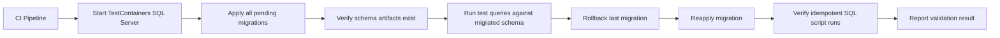
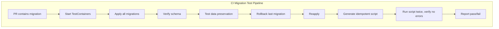

# 8.952 — Testing Migrations — Validation Approach

## 1 — Overview

Database migrations are one of the highest-risk operations in any application lifecycle. A bad migration can corrupt data, lock tables for hours, break application deployments, or require a costly rollback. Despite this, migrations are often deployed without automated validation beyond a quick local test.

Testing migrations means verifying that every schema change:
- Can be applied cleanly to a target database
- Can be rolled back (if rollback is supported)
- Does not break existing queries or stored procedures
- Does not cause data loss for existing rows
- Completes within acceptable time limits
- Produces the expected schema (tables, columns, indexes, constraints)
- Is idempotent (applying twice produces the same result)

This note focuses on automated migration testing using EF Core migrations against a real database hosted in TestContainers. The same principles apply to Dapper-based projects that manage schema through raw SQL scripts.



## 2 — Core Concept

A migration test validates that the database schema evolution is safe and correct. Unlike unit tests that verify business logic, migration tests verify the database's structural integrity and the migration's behavior.

There are four dimensions to migration testing:

**Applicability** — Can the migration be applied? This seems trivial, but migrations can fail due to:
- Existing data that violates a new constraint
- Missing referenced objects (tables, schemas, assemblies)
- Timeout during long-running operations
- Lock contention with concurrent processes

**Rollback Safety** — Can the migration be undone? Not all migrations are reversible:
- Dropping a column is irreversible (data is gone)
- Renaming a column breaks rollback (the old name is lost)
- Data transformations (splitting a full name into first/last) cannot be reversed if the original format is discarded

**Data Integrity** — Does the migration preserve existing data?
- New NOT NULL columns must have defaults
- Type changes must not truncate or lose precision
- Constraint additions must account for existing data

**Idempotency** — Can the migration be applied multiple times to the same schema?
- EF Core's `Migrate()` tracks which migrations have been applied, so it is naturally idempotent
- Raw SQL scripts must include `IF NOT EXISTS` or similar guards
- Idempotent scripts generated by EF Core use conditional checks

### 2.1 — When to Test Migrations

- **In CI** — Every build that includes a new migration should run migration tests
- **Before production deployment** — Run the exact migration scripts against a production-like database
- **After schema changes from other teams** — Validate that your application still works with the changed schema
- **When upgrading EF Core version** — Ensure the new EF Core runtime produces correct SQL for your provider

### 2.2 — What to Test

| Test | Description | Criticality |
|------|-------------|-------------|
| Apply all migrations | Runs `MigrateAsync()` against a clean database | Critical |
| Rollback last migration | Runs migration down, then up again | High |
| Schema verification | Checks tables, columns, indexes, FKs exist | High |
| Query compatibility | Runs common queries against migrated schema | High |
| Data preservation | Inserts data, migrates, verifies data intact | High |
| Idempotent SQL | Generates and runs idempotent script | Medium |
| Migration timeout | Ensures migration completes within threshold | Medium |
| Seed data migrations | Verifies seed data is present after migration | Medium |
| Concurrent migration | Simulates concurrent migration attempts | Low |

## 3 — Implementation

### 3.1 — Migration Test Fixture

The test fixture starts SQL Server via TestContainers and provides a clean database for each test:

```csharp
using Testcontainers.MsSql;
using Microsoft.EntityFrameworkCore;

public class MigrationTestFixture : IAsyncLifetime
{
    private MsSqlContainer? _container;
    private string _connectionString = string.Empty;

    public string ConnectionString => _connectionString;

    public async Task InitializeAsync()
    {
        _container = new MsSqlBuilder()
            .WithImage("mcr.microsoft.com/mssql/server:2022-latest")
            .WithPassword("Migration_Test_P@ss123!")
            .WithCleanUp(true)
            .Build();

        await _container.StartAsync();
        _connectionString = _container.GetConnectionString();
    }

    public async Task DisposeAsync()
    {
        if (_container != null)
        {
            await _container.DisposeAsync();
        }
    }

    public AppDbContext CreateDbContext()
    {
        var options = new DbContextOptionsBuilder<AppDbContext>()
            .UseSqlServer(_connectionString)
            .Options;
        return new AppDbContext(options);
    }
}
```

### 3.2 — Test: Apply All Migrations

The most fundamental test — can we apply every pending migration to a clean database?

```csharp
public class MigrationTests : IClassFixture<MigrationTestFixture>
{
    private readonly MigrationTestFixture _fixture;

    public MigrationTests(MigrationTestFixture fixture)
    {
        _fixture = fixture;
    }

    [Fact]
    public async Task All_Migrations_Can_Be_Applied_To_Clean_Database()
    {
        // Arrange
        await using var dbContext = _fixture.CreateDbContext();

        // Act
        var stopwatch = Stopwatch.StartNew();
        await dbContext.Database.MigrateAsync();
        stopwatch.Stop();

        // Assert
        var pendingMigrations = await dbContext.Database.GetPendingMigrationsAsync();
        pendingMigrations.Should().BeEmpty("all migrations should have been applied");

        Output.WriteLine($"Migration completed in {stopwatch.Elapsed.TotalSeconds:F2}s");
    }
}
```

### 3.3 — Test: Schema Verification After Migration

After applying migrations, verify that all expected tables, columns, and constraints exist:

```csharp
[Fact]
public async Task Migrated_Schema_Contains_Expected_Tables()
{
    // Arrange
    await using var dbContext = _fixture.CreateDbContext();
    await dbContext.Database.MigrateAsync();

    // Act
    var tables = await dbContext.Database.SqlQuery<string>(
        $"SELECT TABLE_NAME FROM INFORMATION_SCHEMA.TABLES WHERE TABLE_TYPE = 'BASE TABLE'").ToListAsync();

    // Assert
    tables.Should().Contain("Customers");
    tables.Should().Contain("Orders");
    tables.Should().Contain("OrderItems");
    tables.Should().Contain("Products");
}

[Fact]
public async Task Orders_Table_Has_Expected_Columns()
{
    // Arrange
    await using var dbContext = _fixture.CreateDbContext();
    await dbContext.Database.MigrateAsync();

    // Act
    var columns = await dbContext.Database.SqlQuery<string>(
        $"SELECT COLUMN_NAME FROM INFORMATION_SCHEMA.COLUMNS WHERE TABLE_NAME = 'Orders'").ToListAsync();

    // Assert
    columns.Should().Contain("Id");
    columns.Should().Contain("CustomerId");
    columns.Should().Contain("OrderDate");
    columns.Should().Contain("TotalAmount");
    columns.Should().Contain("Status");
}

[Fact]
public async Task Orders_Table_Has_Foreign_Key_To_Customers()
{
    // Arrange
    await using var dbContext = _fixture.CreateDbContext();
    await dbContext.Database.MigrateAsync();

    // Act
    var foreignKeys = await dbContext.Database.SqlQuery<string>(
        @"SELECT CONSTRAINT_NAME FROM INFORMATION_SCHEMA.TABLE_CONSTRAINTS
          WHERE TABLE_NAME = 'Orders' AND CONSTRAINT_TYPE = 'FOREIGN KEY'").ToListAsync();

    // Assert
    foreignKeys.Should().Contain(fk => fk.Contains("CustomerId"));
}
```

### 3.4 — Test: Rollback and Reapply Last Migration

```csharp
[Fact]
public async Task Last_Migration_Can_Roll_Back_And_Reapply()
{
    // Arrange
    await using var dbContext = _fixture.CreateDbContext();

    // Apply all migrations
    await dbContext.Database.MigrateAsync();

    // Get the last migration
    var appliedMigrations = (await dbContext.Database.GetAppliedMigrationsAsync()).ToList();
    var lastMigration = appliedMigrations.Last();
    var migrationsAssembly = dbContext.GetService<IMigrationsAssembly>();
    var migration = migrationsAssembly.Migrations[lastMigration];

    // Act — roll back one step
    await dbContext.GetService<IMigrator>().MigrateAsync(
        appliedMigrations.Count > 1 ? appliedMigrations[^2] : "0");

    // Assert — last migration is no longer applied
    var appliedAfterRollback = await dbContext.Database.GetAppliedMigrationsAsync();
    appliedAfterRollback.Should().NotContain(lastMigration);

    // Act — reapply
    await dbContext.Database.MigrateAsync();

    // Assert — last migration is applied again
    var appliedAfterReapply = await dbContext.Database.GetAppliedMigrationsAsync();
    appliedAfterReapply.Should().Contain(lastMigration);
}
```

### 3.5 — Test: Data Preservation After Migration

```csharp
[Fact]
public async Task Existing_Data_Is_Preserved_After_Rollback_And_Reapply()
{
    // Arrange
    await using var dbContext = _fixture.CreateDbContext();

    // Apply all migrations except the last one (simulate pre-migration state)
    var allMigrations = (await dbContext.Database.GetPendingMigrationsAsync()).ToList();
    // ... apply all, then rollback last one to simulate "before last migration" state

    // Seed data that should survive
    dbContext.Customers.Add(new Customer
    {
        Id = 1,
        Name = "Existing Customer",
        Email = "existing@test.com",
        CreatedAt = new DateTime(2025, 1, 1, 0, 0, 0, DateTimeKind.Utc)
    });
    await dbContext.SaveChangesAsync();

    // Detach to test fresh load
    dbContext.Entry(dbContext.Customers.Local[0]).State = EntityState.Detached;

    // Act — apply the last migration
    await dbContext.Database.MigrateAsync();

    // Assert — data survives
    var customer = await dbContext.Customers.AsNoTracking().FirstAsync(c => c.Id == 1);
    customer.Name.Should().Be("Existing Customer");
    customer.Email.Should().Be("existing@test.com");
}
```

### 3.6 — Test: Data Migration Transformations

If the migration transforms data (e.g., splitting a FullName column into FirstName and LastName):

```csharp
[Fact]
public async Task Data_Migration_Transforms_Values_Correctly()
{
    // Arrange — apply all migrations up to (but not including) the data migration
    await ApplyMigrationsUpToAsync(dbContext, "BeforeDataMigration");

    // Seed data in the old format
    await dbContext.Database.ExecuteSqlRawAsync(
        "INSERT INTO Customers (Id, FullName, Email) VALUES (1, 'John Michael Doe', 'john@test.com')");

    // Act — apply the data migration
    await dbContext.Database.MigrateAsync();

    // Assert — data is transformed
    var customer = await dbContext.Customers.AsNoTracking().FirstAsync(c => c.Id == 1);
    customer.FirstName.Should().Be("John");
    customer.LastName.Should().Be("Doe");
    // Note: Middle name may be discarded depending on migration logic
}
```

### 3.7 — Test: Idempotent SQL Script

EF Core can generate idempotent migration scripts that check whether each migration has already been applied:

```csharp
[Fact]
public async Task Idempotent_Migration_Script_Runs_Successfully()
{
    // Arrange
    await using var dbContext = _fixture.CreateDbContext();

    // Generate idempotent script
    var migrator = dbContext.GetService<IMigrator>();
    var script = migrator.GenerateScript(null, null, MigrationsSqlGenerationOptions.Idempotent);

    // Act — run the script against a clean database
    await dbContext.Database.EnsureCreatedAsync(); // Create __EFMigrationsHistory table
    await dbContext.Database.ExecuteSqlRawAsync(script);

    // Assert — no errors, all migrations registered
    var applied = await dbContext.Database.GetAppliedMigrationsAsync();
    var pending = await dbContext.Database.GetPendingMigrationsAsync();
    applied.Should().HaveCountGreaterThan(0);
    pending.Should().BeEmpty();

    // Act — run the same script again (idempotency)
    Func<Task> reapply = () => dbContext.Database.ExecuteSqlRawAsync(script);

    // Assert — second run does not throw
    await reapply.Should().NotThrowAsync();
}
```

### 3.8 — Test: Seed Data After Migration

When migrations include seed data (via `HasData` in `OnModelCreating` or explicit seed migrations):

```csharp
[Fact]
public async Task Seed_Data_Is_Present_After_Migration()
{
    // Arrange
    await using var dbContext = _fixture.CreateDbContext();

    // Act
    await dbContext.Database.MigrateAsync();

    // Assert — seed data from model configuration or seed migrations is present
    var products = await dbContext.Products.AsNoTracking().ToListAsync();

    products.Should().NotBeEmpty("seed data should be present");
    products.Should().Contain(p => p.Name == "Default Product");
}

[Fact]
public async Task Seed_Data_Is_Idempotent()
{
    // Arrange
    await using var dbContext = _fixture.CreateDbContext();
    await dbContext.Database.MigrateAsync();

    // Act — attempt to add seed data again (simulating re-running seed migration)
    dbContext.Products.Add(new Product { Id = 1, Name = "Default Product", Price = 0m });
    Func<Task> act = () => dbContext.SaveChangesAsync();

    // Assert — should throw due to primary key conflict if not idempotent
    // But with HasData(), EF Core checks if seed rows already exist
    // This test verifies the migration doesn't re-insert on every apply
    var products = await dbContext.Products.AsNoTracking().ToListAsync();
    products.Count(p => p.Id == 1).Should().Be(1);
}
```

### 3.9 — Test: Migration Timeout

Long-running migrations (large table scans, index rebuilds) may timeout in test environments:

```csharp
[Fact]
public async Task Migration_Completes_Within_Timeout()
{
    // Arrange
    await using var dbContext = _fixture.CreateDbContext();
    var timeout = TimeSpan.FromSeconds(30);

    // Act
    var stopwatch = Stopwatch.StartNew();
    try
    {
        await dbContext.Database.MigrateAsync();
    }
    finally
    {
        stopwatch.Stop();
    }

    // Assert
    stopwatch.Elapsed.Should().BeLessThan(timeout,
        $"migration took {stopwatch.Elapsed.TotalSeconds:F2}s which exceeds {timeout.TotalSeconds}s timeout");
}
```

## 4 — Advanced Migration Test Patterns

### 4.1 — Testing Raw SQL Scripts (Dapper Approach)

For projects using Dapper with raw SQL scripts instead of EF Core migrations:

```csharp
[Fact]
public async Task Raw_SQL_Schema_Script_Applies_Cleanly()
{
    // Arrange
    await using var connection = new SqlConnection(_fixture.ConnectionString);
    await connection.OpenAsync();

    var script = await File.ReadAllTextAsync("Migrations/001_InitialSchema.sql");

    // Act
    Func<Task> act = () => connection.ExecuteAsync(script);

    // Assert
    await act.Should().NotThrowAsync();
}

[Fact]
public async Task Raw_SQL_Migration_Is_Idempotent()
{
    // Arrange
    await using var connection = new SqlConnection(_fixture.ConnectionString);
    await connection.OpenAsync();

    var script = await File.ReadAllTextAsync("Migrations/002_AddOrdersTable.sql");

    // Act — apply twice
    await connection.ExecuteAsync(script);
    Func<Task> reapplying = () => connection.ExecuteAsync(script);

    // Assert — second application should not throw if script is idempotent
    // (uses IF NOT EXISTS, CHECK for object existence, etc.)
    await reapplying.Should().NotThrowAsync();
}
```

### 4.2 — Testing Idempotent SQL Generation

Compare generated idempotent SQL against a baseline or verify it compiles:

```csharp
[Fact]
public async Task Generated_Idempotent_Script_Has_Expected_Structure()
{
    // Arrange
    await using var dbContext = _fixture.CreateDbContext();
    var migrator = dbContext.GetService<IMigrator>();

    // Act
    var script = migrator.GenerateScript(null, null, MigrationsSqlGenerationOptions.Idempotent);

    // Assert
    script.Should().Contain("IF NOT EXISTS");
    script.Should().Contain("IF OBJECT_ID");
    script.Should().NotContain("FAILURE"); // no error markers
    script.Should().NotBeNullOrWhiteSpace();

    // Log script length for CI review
    Output.WriteLine($"Generated script length: {script.Length} chars");
}
```

### 4.3 — Testing Migration Against Production-Like Data Volume

For performance-critical migrations, test against a realistic data volume:

```csharp
[Fact]
public async Task Migration_Performs_Acceptably_With_Realistic_Data_Volume()
{
    // Arrange
    await using var dbContext = _fixture.CreateDbContext();
    await ApplyMigrationsUpToAsync(dbContext, "BeforeLargeMigration");

    // Seed realistic volume
    var customers = Enumerable.Range(1, 10000).Select(i => new Customer
    {
        Id = i,
        Name = $"Customer {i}",
        Email = $"customer{i}@test.com"
    });
    dbContext.Customers.AddRange(customers);
    await dbContext.SaveChangesAsync();

    // Act
    var stopwatch = Stopwatch.StartNew();
    await dbContext.Database.MigrateAsync();
    stopwatch.Stop();

    // Assert
    stopwatch.Elapsed.Should().BeLessThan(TimeSpan.FromSeconds(60));
    Output.WriteLine($"Migration with 10K customers: {stopwatch.Elapsed.TotalSeconds:F2}s");
}
```

### 4.4 — Testing All Migration States in Sequence

Test the entire migration chain end-to-end:

```csharp
[Fact]
public async Task Full_Migration_Chain_Apply_Rollback_Cycle()
{
    // Arrange
    await using var dbContext = _fixture.CreateDbContext();
    var migrationsAssembly = dbContext.GetService<IMigrationsAssembly>();
    var allMigrations = migrationsAssembly.Migrations.Keys.ToList();
    var migrator = dbContext.GetService<IMigrator>();

    // Act & Assert — apply one by one, verify each step
    string? previousMigration = null;
    foreach (var migration in allMigrations)
    {
        await migrator.MigrateAsync(migration);

        var applied = await dbContext.Database.GetAppliedMigrationsAsync();
        applied.Should().Contain(migration);

        Output.WriteLine($"Applied: {migration}");
    }

    // Roll back one by one
    for (int i = allMigrations.Count - 2; i >= -1; i--)
    {
        var target = i >= 0 ? allMigrations[i] : "0";
        await migrator.MigrateAsync(target);

        var applied = await dbContext.Database.GetAppliedMigrationsAsync();
        if (target == "0")
        {
            applied.Should().BeEmpty();
        }
        else
        {
            applied.Should().Contain(target);
        }
    }
}
```

### 4.5 — Testing Migration Error Handling

Verify that migration failures are handled gracefully:

```csharp
[Fact]
public async Task Migration_That_Adds_NotNull_Column_Without_Default_Fails_On_Existing_Data()
{
    // Arrange
    await using var dbContext = _fixture.CreateDbContext();
    await ApplyMigrationsUpToAsync(dbContext, "BeforeBreakingMigration");

    // Seed a row that will conflict
    dbContext.Customers.Add(new Customer { Id = 1, Name = "Test" });
    await dbContext.SaveChangesAsync();

    // Act
    Func<Task> act = () => dbContext.Database.MigrateAsync();

    // Assert — migration should fail because existing rows have no value for new NOT NULL column
    await act.Should().ThrowAsync<Exception>();
}
```

## 5 — Patterns

### 5.1 — Snapshot Testing Schema After Migration

Compare the migrated schema against a known baseline:

```csharp
[Fact]
public async Task Schema_Matches_Baseline()
{
    // Arrange
    await using var dbContext = _fixture.CreateDbContext();
    await dbContext.Database.MigrateAsync();

    // Act — extract schema
    var schema = await ExtractSchemaAsync(dbContext);

    // Assert — compare with stored baseline
    var baseline = await File.ReadAllTextAsync("SchemaBaseline.json");
    var normalizedSchema = JsonSerializer.Serialize(schema);
    normalizedSchema.Should().Be(baseline, "schema should match baseline snapshot");
}

private async Task<DatabaseSchema> ExtractSchemaAsync(AppDbContext db)
{
    // Query INFORMATION_SCHEMA to build schema model
    var tables = await db.Database.SqlQuery<TableInfo>(
        "SELECT TABLE_NAME, TABLE_TYPE FROM INFORMATION_SCHEMA.TABLES").ToListAsync();

    var columns = await db.Database.SqlQuery<ColumnInfo>(
        "SELECT TABLE_NAME, COLUMN_NAME, DATA_TYPE, IS_NULLABLE FROM INFORMATION_SCHEMA.COLUMNS").ToListAsync();

    return new DatabaseSchema
    {
        Tables = tables,
        Columns = columns,
        // Indexes, foreign keys, etc.
    };
}
```

### 5.2 — Migration Test Base Class

Reduce boilerplate with a base class:

```csharp
public abstract class MigrationTestBase : IClassFixture<MigrationTestFixture>
{
    protected readonly MigrationTestFixture Fixture;
    protected readonly ITestOutputHelper Output;

    protected MigrationTestBase(MigrationTestFixture fixture, ITestOutputHelper output)
    {
        Fixture = fixture;
        Output = output;
    }

    protected async Task<AppDbContext> CreateMigratedDbContextAsync()
    {
        var db = Fixture.CreateDbContext();
        await db.Database.MigrateAsync();
        return db;
    }

    protected async Task ApplyMigrationsUpToAsync(AppDbContext db, string migrationName)
    {
        var migrator = db.GetService<IMigrator>();
        var allMigrations = (await db.Database.GetPendingMigrationsAsync()).ToList();

        if (allMigrations.Contains(migrationName))
        {
            await migrator.MigrateAsync(migrationName);
        }
    }

    protected async Task<List<string>> GetAllMigrationNamesAsync()
    {
        await using var db = Fixture.CreateDbContext();
        var assembly = db.GetService<IMigrationsAssembly>();
        return assembly.Migrations.Keys.ToList();
    }
}
```

### 5.3 — Testing Migration with Database Snapshots

For projects that use database snapshots or point-in-time restore:

```csharp
[Fact]
public async Task Migration_Can_Be_Applied_To_Database_Snapshot()
{
    // Arrange — create snapshot
    await using var dbContext = _fixture.CreateDbContext();
    await dbContext.Database.MigrateAsync();
    var snapshotName = $"TestSnapshot_{Guid.NewGuid():N}";

    await dbContext.Database.ExecuteSqlRawAsync(
        $"CREATE DATABASE [{snapshotName}] AS SNAPSHOT OF [{dbContext.Database.GetDbConnection().Database}]");

    // Act — connect to snapshot and run additional migration
    var snapshotConnectionString = _fixture.ConnectionString.Replace(
        dbContext.Database.GetDbConnection().Database, snapshotName);

    var snapshotOptions = new DbContextOptionsBuilder<AppDbContext>()
        .UseSqlServer(snapshotConnectionString)
        .Options;

    await using var snapshotContext = new AppDbContext(snapshotOptions);

    // Assert — can query snapshot
    var tables = await snapshotContext.Database.SqlQuery<string>(
        "SELECT TABLE_NAME FROM INFORMATION_SCHEMA.TABLES").ToListAsync();
    tables.Should().Contain("Customers");
}
```

### 5.4 — Testing Migration Scripts in CI Pipeline

```yaml
# .github/workflows/migration-tests.yml
name: Migration Tests
on: [push]
jobs:
  test-migrations:
    runs-on: ubuntu-latest
    services:
      sqlserver:
        image: mcr.microsoft.com/mssql/server:2022-latest
        env:
          ACCEPT_EULA: "Y"
          SA_PASSWORD: "CI_Test_P@ss123!"
        ports:
          - 1433:1433
    steps:
      - uses: actions/checkout@v4
      - uses: actions/setup-dotnet@v4
      - run: dotnet test --filter "FullyQualifiedName~MigrationTests"
        env:
          CONNECTION_STRING: "Server=localhost;Database=TestDB;User Id=sa;Password=CI_Test_P@ss123!;TrustServerCertificate=True;"
```

## 6 — Best Practices

### 6.1 — Run Migration Tests in CI, Not Just Locally

Migration tests that only pass on the developer's machine provide false confidence. Run them in CI against a fresh database (TestContainers or CI service container) on every PR that includes migration changes.

### 6.2 — Test Both Up and Down

Most teams test only applying migrations. Testing rollback is equally important — especially for production rollback scenarios. A migration that cannot be rolled back means the team has committed to that schema change permanently.

### 6.3 — Use a Copy of Production Schema

The test database should match production schema as closely as possible. Differences in data types, collation, or index structure can hide migration problems that surface only in production.

### 6.4 — Seed Realistic Data

A migration that works on an empty database may fail with production data volumes. Seed realistic amounts of data (thousands of rows) in migration tests to catch performance issues early.

### 6.5 — Test Idempotent Scripts Separately

The `GenerateScript(idempotent: true)` output is different from the SQL that `Migrate()` executes. Run the generated script against a fresh database to verify it works. This is especially important for deployments that use scripts rather than runtime migrations.

### 6.6 — Keep Migration Tests Fast

Migration tests are slow by nature (container startup, schema apply). Optimize by:
- Sharing the TestContainers container across all migration tests (IClassFixture or ICollectionFixture)
- Using `EnsureCreated` for tests that do not need the full migration history
- Running migration tests in a separate CI step from unit/integration tests
- Setting appropriate timeouts (60–120 seconds for migration tests)

### 6.7 — Test Seed Data Migrations for Idempotency

EF Core's `HasData()` seeds data during migration. Test that the seed data:
- Is present after migration
- Does not cause duplicate key errors if the migration is applied again
- Can be queried with the application's queries

### 6.8 — Version-Control Schema Baselines

Store schema snapshots (output of `EXTRACT SCHEMA` or SSDT schema compare) in version control alongside migrations. When a migration test fails, compare the generated schema against the baseline to identify unexpected changes.

## 7 — Comparison: Migration Testing Approaches

| Approach | Coverage | Speed | Setup | Maintenance |
|----------|----------|-------|-------|-------------|
| EF Core Migrate() test | Full (applies all) | Slow (full run) | Low | Low |
| Per-migration test | High (each step) | Slow (sequential) | Medium | Medium |
| Idempotent script test | Medium (script only) | Medium | Low | Low |
| SQL script test (Dapper) | High | Slow | Medium | High (manual scripts) |
| Schema comparison | Medium (structure only) | Fast | High | Medium (maintain baseline) |
| Data preservation test | High (data focus) | Slow | High | Low |
| SSDT / SQL Project | Full | Slow (build + deploy) | High | Low (SSDT manages) |

### 7.1 — Choosing an Approach for Your Project

- **EF Core projects**: Use `MigrateAsync()` test as baseline, add per-migration tests for critical migrations, and run idempotent script tests before deployment.
- **Dapper / raw SQL projects**: Test each SQL script file individually, verify idempotency, and use schema comparison tests.
- **High-compliance projects**: Add all seven test types. Include data preservation tests for every migration that touches existing data.
- **Small projects**: Start with the "Apply all migrations" test and add rollback tests for destructive migrations.

## 8 — Gotchas

### 8.1 — Migration Rollback May Not Be Safe

Just because a migration can be rolled back (the `Down()` method exists and runs without error) does not mean the rollback is safe. The `Down()` method may:
- Drop columns that contain data (data loss)
- Remove indexes that were added in the `Up()` method (performance regression)
- Leave behind orphaned data in transformed columns

Always verify that rollback does not cause data loss by running data preservation tests after rollback.

### 8.2 — Testing All Migration Combinations Is Exponential

For a project with N migrations, there are O(2^N) possible states (each migration applied or not). Testing all combinations is infeasible. Focus on:
- All migrations applied (current state)
- Current minus one (pre-latest-migration state)
- Fresh database (no migrations applied)
- The exact state of the production database before deployment

### 8.3 — Large Migrations Time Out in Tests

Migrations that rebuild tables, add indexes to large tables, or transform millions of rows will time out in test environments. Mitigation:
- Set `CommandTimeout` on the DbContext for migration operations
- Use `WithCommandTimeout(300)` for migration-specific operations
- Test with a smaller data volume in CI, run full-volume tests in staging

```csharp
public AppDbContext CreateDbContext()
{
    var options = new DbContextOptionsBuilder<AppDbContext>()
        .UseSqlServer(_connectionString, opts => opts.CommandTimeout(180))
        .Options;
    return new AppDbContext(options);
}
```

### 8.4 — Seed Data Migrations Must Be Idempotent

EF Core's `HasData()` checks if the seed data already exists before inserting. However, if you modify seed data in a later migration, the old seed data from the first migration remains. The result is duplicate or conflicting seed data.

Mitigation:
- Use `HasData()` only for reference data that never changes
- For seed data that evolves, use migration operations with `IF NOT EXISTS` checks
- In test, verify that seed data is not duplicated after reapplying migrations

### 8.5 — GenerateScript (Idempotent) Produces Different SQL Than Migrate()

The SQL generated by `GenerateScript(..., idempotent: true)` wraps each migration in conditional checks (`IF NOT EXISTS`). The `Migrate()` method tracks applied migrations in `__EFMigrationsHistory` and skips them at runtime. These two approaches produce different execution plans:

- `Migrate()` — fast, checks only the history table
- `GenerateScript(idempotent)` — slower, checks schema objects directly

Test both. The script is what you deploy; the runtime call is what runs in dev/test.

### 8.6 — Migration History Table Collisions

When multiple test classes or test collections create databases concurrently, the `__EFMigrationsHistory` table can experience contention. Mitigation: give each test database a unique name via the connection string.

```csharp
public string GetUniqueConnectionString()
{
    var dbName = $"TestDB_{Guid.NewGuid():N}";
    return new SqlConnectionStringBuilder(_baseConnectionString)
    {
        InitialCatalog = dbName
    }.ConnectionString;
}
```

### 8.7 — Flaky TestContainers in CI

TestContainers depends on Docker being available and configured correctly. In CI environments, Docker may be slow to start, resource-constrained, or not available at all. Mitigation:
- Use retry logic for container startup
- Provide a fallback connection string for CI environments that cannot run Docker
- Cache the container image in CI

```csharp
public async Task InitializeAsync()
{
    var retryCount = 3;
    for (int i = 0; i < retryCount; i++)
    {
        try
        {
            await _container.StartAsync();
            break;
        }
        catch when (i < retryCount - 1)
        {
            await Task.Delay(TimeSpan.FromSeconds(5 * (i + 1)));
        }
    }
}
```

### 8.8 — Migration Tests Are Slow — Separate Them From Fast Tests

Do not mix migration tests (30–60 seconds each) with unit tests (milliseconds each). Use xUnit test categories or separate test projects:

```csharp
[Fact, Trait("Category", "Migration")]
public async Task Apply_All_Migrations() { ... }
```

```xml
<RunSettings>
  <RunConfiguration>
    <TestCaseFilter>Category=Migration</TestCaseFilter>
  </RunConfiguration>
</RunSettings>
```

Run migration tests as a separate CI step so they do not block the fast feedback loop.

### 8.9 — Dapper Projects Need Manual Migration Tracking

Unlike EF Core, Dapper does not track which migrations have been applied. If using raw SQL scripts, maintain a `SchemaVersions` table manually and check it before applying scripts.

```csharp
[Fact]
public async Task SchemaVersion_Table_Is_Updated_After_Each_Script()
{
    await using var connection = new SqlConnection(_fixture.ConnectionString);
    await connection.OpenAsync();

    foreach (var script in GetMigrationScripts())
    {
        await connection.ExecuteAsync(script.Content);
        var version = await connection.QueryFirstAsync<string>(
            "SELECT MAX(Version) FROM SchemaVersions");
        version.Should().Be(script.Version);
    }
}
```

## 9 — Summary

Testing database migrations is not optional — it is a critical safety net for production deployments. The investment in migration tests pays for itself the first time a migration would have dropped a column, violated a constraint, or corrupted data.

- **Apply all migrations** to a clean database as the baseline test
- **Test rollback** for every migration that has a `Down()` method
- **Verify schema** (tables, columns, constraints) after migration
- **Test data preservation** — insert data before migration, verify it survives
- **Test idempotency** — the migration script should run safely multiple times
- **Measure migration time** — catch performance regressions early
- **Use TestContainers** for a disposable, production-like SQL Server in tests



A comprehensive migration test suite gives the team confidence to deploy schema changes at any time, knowing that automated validation has caught the common failure modes before they reach production.

## References

- [[8.943 — Integration Testing — Real Database]]
- [[8.944 — TestContainers — SQL Server in Docker]]
- [[8.826 — Schema Migration Strategies]]
- [[8.959 — Database Contract Testing — Schema Compatibility]]
- [[8.836 — EF Core Migrations — How They Work]]
- [EF Core Migrations Documentation](https://learn.microsoft.com/en-us/ef/core/managing-schemas/migrations/)
- [TestContainers for .NET](https://dotnet.testcontainers.org/)
- [Respawn](https://github.com/jbogard/Respawn)
